# Dubbo原理—12.集群之服务目录 + 路由机制

> **公众号**: 东阳马生架构  
> **发布时间**: 2025-07-31 09:00  

**大纲(24435字)**

- 1.Directory服务目录的实现
- 2.Router路由机制对请求的处理


## 1.Directory服务目录的实现

### (1)dubbo-cluster模块的引入

### (2)Cluster处理请求的流程

### (3)dubbo-cluster模块核心接口

### (4)Directory接口的实现简介

### (5)Directory接口的静态实现StaticDirectory

### (6)Directory接口的动态实现RegistryDirectory

### (1)dubbo-cluster模块的引入

在生产环境中，为了保证服务的可靠性、吞吐量以及容错能力，通常会在多个服务器上运行相同的服务端程序，然后以集群的形式对外提供服务。根据各项性能指标的要求不同，各个服务端集群中服务实例的个数也不尽相同，从几个实例到几百个实例不等。

对于客户端程序来说，就会出现几个问题：客户端程序是否要感知每个服务端地址？客户端程序的一次请求，到底调用哪个服务端程序？请求失败之后的处理是重试，还是抛出异常？如果是重试，是再次请求该服务实例，还是尝试请求其他服务实例？服务端集群如何做到负载均衡，负载均衡的标准是什么呢？

为了解决上述问题，Dubbo独立出了一个实现集群功能的模块，即dubbo-cluster模块。

### (2)Cluster处理请求的流程

dubbo-cluster模块的主要功能是将多个Provider伪装成一个Provider供Consumer调用，其中涉及集群的容错处理、路由规则的处理以及负载均衡。dubbo-cluster模块处理请求的流程如下：


当调用请求进入Cluster时，Cluster会创建一个AbstractClusterInvoker对象。在这个AbstractClusterInvoker中，首先会从Directory中获取当前Invoker集合，然后按照Router集合进行路由得到符合条件的Invoker集合，接着按照LoadBalance指定的负载均衡策略得到最终要调用的Invoker对象。

```java
public class Test {
    List<Invoker<IHelloService>> invokers = new ArrayList<Invoker<IHelloService>>();

    @Test
    public void testMockInvokerInvoke_forcemock() {
        ...
        Protocol protocol = new MockProtocol();
        Invoker<IHelloService> mInvoker1 = protocol.refer(IHelloService.class, mockUrl);
        Invoker<IHelloService> cluster = getClusterInvokerMock(url, mInvoker1);
        invocation = new RpcInvocation();
        invocation.setMethodName("sayHello");

        //下面会调用AbstractClusterInvoker的invoke()方法
        ret = cluster.invoke(invocation);
        Assertions.assertNull(ret.getValue());
    }

    private Invoker<IHelloService> getClusterInvokerMock(URL url, Invoker<IHelloService> mockInvoker) {
        final URL durl = url.addParameter("proxy", "jdk");
        invokers.clear();

        ProxyFactory proxy = ExtensionLoader.getExtensionLoader(ProxyFactory.class).getExtension("jdk");
        Invoker<IHelloService> invoker1 = proxy.getInvoker(new HelloService(), IHelloService.class, durl);
        invokers.add(invoker1);
        if (mockInvoker != null) {
            invokers.add(mockInvoker);
        }
        StaticDirectory<IHelloService> dic = new StaticDirectory<IHelloService>(durl, invokers, null);
        dic.buildRouterChain();

        //创建一个AbstractClusterInvoker对象
        AbstractClusterInvoker<IHelloService> cluster = new AbstractClusterInvoker(dic) {
            @Override
            protected Result doInvoke(Invocation invocation, List invokers, LoadBalance loadbalance) throws RpcException {
                if (durl.getParameter("invoke_return_error", false)) {
                    throw new RpcException(RpcException.TIMEOUT_EXCEPTION, "test rpc exception");
                } else {
                    return ((Invoker<?>) invokers.get(0)).invoke(invocation);
                }
            }
        };
        return new MockClusterInvoker<IHelloService>(dic, cluster);
    }
}

//步骤一开始
//进入AbstractClusterInvoker的invoke()方法
public abstract class AbstractClusterInvoker<T> implements Invoker<T> {
    protected Directory<T> directory;
    protected boolean availablecheck;
    ...

    public AbstractClusterInvoker(Directory<T> directory) {
        this(directory, directory.getUrl());
    }

    public AbstractClusterInvoker(Directory<T> directory, URL url) {
        this.directory = directory;
        this.availablecheck = url.getParameter(CLUSTER_AVAILABLE_CHECK_KEY, DEFAULT_CLUSTER_AVAILABLE_CHECK);
    }

    @Override
    public Result invoke(final Invocation invocation) throws RpcException {
        //检测当前Invoker是否已销毁
        checkWhetherDestroyed();

        //将RpcContext中的attachment添加到Invocation中
        Map<String, Object> contextAttachments = RpcContext.getContext().getObjectAttachments();
        if (contextAttachments != null && contextAttachments.size() != 0) {
            ((RpcInvocation) invocation).addObjectAttachments(contextAttachments);
        }

        //首先从Directory中获取Invoker集合
        //然后按照Router集合进行路由得到符合条件的Invoker集合
        //在RegistryDirectory的doList()方法中，会调用Router的route()方法进行过滤
        List<Invoker<T>> invokers = list(invocation);

        //接着通过SPI加载LoadBalance实例
        LoadBalance loadbalance = initLoadBalance(invokers, invocation);
        RpcUtils.attachInvocationIdIfAsync(getUrl(), invocation);

        //最后调用doInvoke()方法
        //其中会按照LoadBalance指定的负载均衡策略得到最终要调用的Invoker对象
        return doInvoke(invocation, invokers, loadbalance);
    }

    protected List<Invoker<T>> list(Invocation invocation) throws RpcException {
        return directory.list(invocation);
    }

    protected LoadBalance initLoadBalance(List<Invoker<T>> invokers, Invocation invocation) {
        if (CollectionUtils.isNotEmpty(invokers)) {
            return ExtensionLoader.getExtensionLoader(LoadBalance.class)
                .getExtension(invokers.get(0).getUrl()
                .getMethodParameter(RpcUtils.getMethodName(invocation), LOADBALANCE_KEY, DEFAULT_LOADBALANCE));
        } else {
            return ExtensionLoader.getExtensionLoader(LoadBalance.class).getExtension(DEFAULT_LOADBALANCE);
        }
    }

    protected abstract Result doInvoke(Invocation invocation, List<Invoker<T>> invokers, LoadBalance loadbalance) throws RpcException;
    ...
}
//步骤一结束

//步骤二开始
//从Directory中获取当前Invoker集合
//按照Router集合进行路由得到符合条件的Invoker集合
public abstract class AbstractDirectory<T> implements Directory<T> {
    private final URL url;
    private volatile URL consumerUrl;
    protected RouterChain<T> routerChain;
    ...

    public AbstractDirectory(URL url, RouterChain<T> routerChain) {
        if (url == null) {
            throw new IllegalArgumentException("url == null");
        }
        this.url = url.removeParameter(REFER_KEY).removeParameter(MONITOR_KEY);
        this.consumerUrl = url.addParameters(StringUtils.parseQueryString(url.getParameterAndDecoded(REFER_KEY))).removeParameter(MONITOR_KEY);
        setRouterChain(routerChain);
    }

    public void setRouterChain(RouterChain<T> routerChain) {
        this.routerChain = routerChain;
    }

    @Override
    public List<Invoker<T>> list(Invocation invocation) throws RpcException {
        if (destroyed) {
            throw new RpcException("Directory already destroyed .url: " + getUrl());
        }
        return doList(invocation);
    }
    ...
}

public class RegistryDirectory<T> extends AbstractDirectory<T> implements NotifyListener {
    ...
    @Override
    public List<Invoker<T>> doList(Invocation invocation) {
        ...
        List<Invoker<T>> invokers = null;
        try {
            //通过RouterChain.route()方法过滤Invoker集合
            //最终得到符合路由条件的Invoker集合
            invokers = routerChain.route(getConsumerUrl(), invocation);
        } catch (Throwable t) {
            logger.error("Failed to execute router: " + getUrl() + ", cause: " + t.getMessage(), t);
        }
        return invokers == null ? Collections.emptyList() : invokers;
    }
    ...
}

public class RouterChain<T> {
    private volatile List<Router> routers = Collections.emptyList();
    ...

    public List<Invoker<T>> route(URL url, Invocation invocation) {
        List<Invoker<T>> finalInvokers = invokers;
        //遍历全部的Router对象，调用其route()方法
        for (Router router : routers) {
            finalInvokers = router.route(finalInvokers, url, invocation);
        }
        return finalInvokers;
    }
    ...
}
//步骤二结束

//步骤三开始
//按照LoadBalance指定的负载均衡策略得到最终要调用的Invoker对象
public class FailfastClusterInvoker<T> extends AbstractClusterInvoker<T> {
    public FailfastClusterInvoker(Directory<T> directory) {
        super(directory);
    }

    @Override
    public Result doInvoke(Invocation invocation, List<Invoker<T>> invokers, LoadBalance loadbalance) throws RpcException {
        checkInvokers(invokers, invocation);
        //调用AbstractClusterInvoker的select()得到此次要调用的Invoker对象
        Invoker<T> invoker = select(loadbalance, invocation, invokers, null);
        try {
            //发起请求
            return invoker.invoke(invocation);
        } catch (Throwable e) {
            //请求失败，直接抛出异常
            if (e instanceof RpcException && ((RpcException) e).isBiz()) { // biz exception.
                throw (RpcException) e;
            }
            throw new RpcException("...");
        }
    }
}

public abstract class AbstractClusterInvoker<T> implements Invoker<T> {
    ...
    //第一个参数是此次使用的LoadBalance实现
    //第二个参数Invocation是此次服务调用的上下文信息
    //第三个参数是待选择的Invoker集合
    //第四个参数用来记录负载均衡已经选出来、尝试过的Invoker集合
    protected Invoker<T> select(LoadBalance loadbalance, Invocation invocation, List<Invoker<T>> invokers, List<Invoker<T>> selected) throws RpcException {
        if (CollectionUtils.isEmpty(invokers)) {
            return null;
        }

        //获取调用方法名
        String methodName = invocation == null ? StringUtils.EMPTY_STRING : invocation.getMethodName();

        //获取sticky配置，sticky表示粘滞连接
        //所谓粘滞连接是指Consumer会尽可能的调用同一个Provider节点，除非这个Provider无法提供服务
        boolean sticky = invokers.get(0).getUrl().getMethodParameter(methodName, CLUSTER_STICKY_KEY, DEFAULT_CLUSTER_STICKY);

        //检测invokers列表是否包含sticky Invoker
        //如果不包含，说明stickyInvoker代表的服务提供者挂了，此时需要将其置空
        if (stickyInvoker != null && !invokers.contains(stickyInvoker)) {
            stickyInvoker = null;
        }

        //如果开启了粘滞连接特性，需要先判断这个Provider节点是否已经重试过了
        if (sticky && stickyInvoker != null //表示粘滞连接
                && (selected == null || !selected.contains(stickyInvoker)) //表示stickyInvoker未重试过
        ) {
            //检测当前stickyInvoker是否可用
            //如果可用，直接返回stickyInvoker
            if (availablecheck && stickyInvoker.isAvailable()) {
                return stickyInvoker;
            }
        }

        //执行到这里，说明前面的stickyInvoker为空，或者不可用
        //这里会继续调用doSelect()方法选择Invoker对象
        Invoker<T> invoker = doSelect(loadbalance, invocation, invokers, selected);
        //是否开启粘滞，更新stickyInvoker字段
        if (sticky) {
            stickyInvoker = invoker;
        }
        return invoker;
    }

    private Invoker<T> doSelect(LoadBalance loadbalance, Invocation invocation, List<Invoker<T>> invokers, List<Invoker<T>> selected) throws RpcException {
        //判断是否需要进行负载均衡，如果Invoker集合为空，直接返回null
        if (CollectionUtils.isEmpty(invokers)) {
            return null;
        }

        //如果只有一个Invoker对象，则直接返回该对象
        if (invokers.size() == 1) {
            return invokers.get(0);
        }

        //通过LoadBalance实现选择Invoker对象
        Invoker<T> invoker = loadbalance.select(invokers, getUrl(), invocation);
        //如果LoadBalance选出的Invoker对象，已经尝试请求过了或不可用，则需要调用reselect()方法重选
        if ((selected != null && selected.contains(invoker)) //Invoker已经尝试调用过了，但是失败了
            || (!invoker.isAvailable() && getUrl() != null && availablecheck) //Invoker不可用
        ) {
            //调用reselect()方法重选
            Invoker<T> rInvoker = reselect(loadbalance, invocation, invokers, selected, availablecheck);
            //如果重选的Invoker对象不为空，则直接返回这个rInvoker
            if (rInvoker != null) {
                invoker = rInvoker;
            } else {
                int index = invokers.indexOf(invoker);
                try {
                    //如果重选的Invoker对象为空，则返回该Invoker的下一个Invoker对象
                    invoker = invokers.get((index + 1) % invokers.size());
                } catch (Exception e) {
                    logger.warn(e.getMessage() + " may because invokers list dynamic change, ignore.", e);
                }
            }
        }
        return invoker;
    }

    private Invoker<T> reselect(LoadBalance loadbalance, Invocation invocation, List<Invoker<T>> invokers, List<Invoker<T>> selected, boolean availablecheck) throws RpcException {
        //用于记录要重新进行负载均衡的Invoker集合
        List<Invoker<T>> reselectInvokers = new ArrayList<>(invokers.size() > 1 ? (invokers.size() - 1) : invokers.size());

        //将不在selected集合中的Invoker过滤出来进行负载均衡
        for (Invoker<T> invoker : invokers) {
            if (availablecheck && !invoker.isAvailable()) {
                continue;
            }
            if (selected == null || !selected.contains(invoker)) {
                reselectInvokers.add(invoker);
            }
        }

        //reselectInvokers不为空时，才需要通过负载均衡组件进行选择
        if (!reselectInvokers.isEmpty()) {
            return loadbalance.select(reselectInvokers, getUrl(), invocation);
        }

        //只能对selected集合中可用的Invoker再次进行负载均衡
        if (selected != null) {
            for (Invoker<T> invoker : selected) {
                if ((invoker.isAvailable()) && !reselectInvokers.contains(invoker)) {
                    reselectInvokers.add(invoker);
                }
            }
        }

        if (!reselectInvokers.isEmpty()) {
            return loadbalance.select(reselectInvokers, getUrl(), invocation);
        }
        return null;
    }
    ...
}
//步骤三结束
```

### (3)dubbo-cluster模块的核心接口

#### 一.Cluster接口

#### 二.Directory接口

#### 三.Router接口

#### 四.LoadBalance接口

dubbo-cluster模块的结构如下图示：

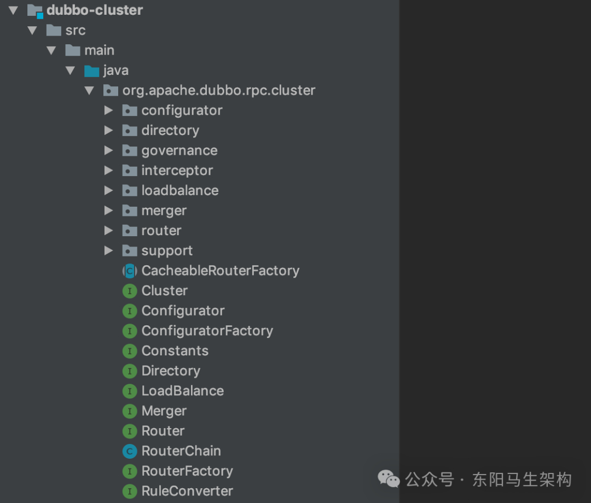

#### 一.Cluster接口

这是集群容错的接口，主要是在某些Provider节点发生故障时，让Consumer的调用请求能够发送到正常的Provider节点，从而保证整个系统的可用性。

```java
@SPI(FailoverCluster.NAME)
public interface Cluster {
    //Merge the directory invokers to a virtual invoker.
    @Adaptive
    <T> Invoker<T> join(Directory<T> directory) throws RpcException;
}
```

#### 二.Directory接口

表示多个Invoker的集合，是后续路由规则、负载均衡策略以及集群容错的基础。

```java
public interface Directory<T> extends Node {
    //服务接口类型
    Class<T> getInterface();

    //list()方法会根据传入的Invocation请求，过滤自身维护的Invoker集合，返回符合条件的Invoker集合
    List<Invoker<T>> list(Invocation invocation) throws RpcException;

    //getAllInvokers()方法返回当前Directory对象维护的全部Invoker对象
    List<Invoker<T>> getAllInvokers();

    //Consumer端的URL
    URL getConsumerUrl();
}
```

#### 三.Router接口

抽象的路由器，请求经过Router的时候，会按照用户指定的规则匹配出符合条件的Provider。

```java
public interface Router extends Comparable<Router> {
    int DEFAULT_PRIORITY = Integer.MAX_VALUE;

    //Get the router url.
    URL getUrl();

    //Filter invokers with current routing rule and only return the invokers that comply with the rule.
    <T> List<Invoker<T>> route(List<Invoker<T>> invokers, URL url, Invocation invocation) throws RpcException;

    //Notify the router the invoker list.
    //Invoker list may change from time to time.
    //This method gives the router a chance to prepare before Router#route(List, URL, Invocation) gets called.
    default <T> void notify(List<Invoker<T>> invokers) {
    }

    //To decide whether this router need to execute every time an RPC comes or should only execute when addresses or rule change.
    boolean isRuntime();

    //To decide whether this router should take effect when none of the invoker can match the router rule,
    //which means the #route(List, URL, Invocation) would be empty.
    //Most of time, most router implementation would default this value to false.
    boolean isForce();

    //Router's priority, used to sort routers.
    int getPriority();

    @Override
    default int compareTo(Router o) {
        if (o == null) {
            throw new IllegalArgumentException();
        }
        return Integer.compare(this.getPriority(), o.getPriority());
    }
}
```

#### 四.LoadBalance接口

这是负载均衡接口，Consumer会按照指定的负载均衡策略，从Provider集合中选出一个最合适的Provider节点来处理请求。

```java
@SPI(RandomLoadBalance.NAME)
public interface LoadBalance {
    //根据传入的URL和Invocation，以及自身的负载均衡算法，从Invoker集合中选择一个Invoker返回
    @Adaptive("loadbalance")
    <T> Invoker<T> select(List<Invoker<T>> invokers, URL url, Invocation invocation) throws RpcException;
}
```

### (4)Directory接口的实现简介

Directory接口表示的是一个集合，该集合由多个Invoker构成。集群中涉及的路由处理、负载均衡、集群容错等一系列操作都在Directory基础上实现。

AbstractDirectory是Directory接口的抽象实现，其中除了维护Consumer端的URL信息，还维护一个RouterChain对象用于记录当前使用的Router对象集合(也就是路由规则)。

AbstractDirectory.list()方法的实现比较简单，就是直接委托给了doList()方法。其中doList()是个抽象方法，由AbstractDirectory的子类实现。

```java
public interface Directory<T> extends Node {
    //服务接口类型
    Class<T> getInterface();

    //list()方法会根据传入的Invocation请求，过滤自身维护的Invoker集合，返回符合条件的Invoker集合
    List<Invoker<T>> list(Invocation invocation) throws RpcException;

    //getAllInvokers()方法返回当前Directory对象维护的全部Invoker对象
    List<Invoker<T>> getAllInvokers();

    //Consumer端的URL
    URL getConsumerUrl();
}

public abstract class AbstractDirectory<T> implements Directory<T> {
    private final URL url;
    private volatile boolean destroyed = false;
    private volatile URL consumerUrl;
    protected RouterChain<T> routerChain;

    public AbstractDirectory(URL url) {
        this(url, null);
    }

    public AbstractDirectory(URL url, RouterChain<T> routerChain) {
        if (url == null) {
            throw new IllegalArgumentException("url == null");
        }

        this.url = url.removeParameter(REFER_KEY).removeParameter(MONITOR_KEY);
        this.consumerUrl = url.addParameters(
            StringUtils.parseQueryString(
                url.getParameterAndDecoded(REFER_KEY)
            )
        ).removeParameter(MONITOR_KEY);

        setRouterChain(routerChain);
    }

    @Override
    public List<Invoker<T>> list(Invocation invocation) throws RpcException {
        if (destroyed) {
            throw new RpcException("Directory already destroyed .url: " + getUrl());
        }
        return doList(invocation);
    }

    protected abstract List<Invoker<T>> doList(Invocation invocation) throws RpcException;

    public void setRouterChain(RouterChain<T> routerChain) {
        this.routerChain = routerChain;
    }
    ...
}
```

Directory接口有RegistryDirectory和StaticDirectory两个具体实现，如下是Directory接口的继承关系图：

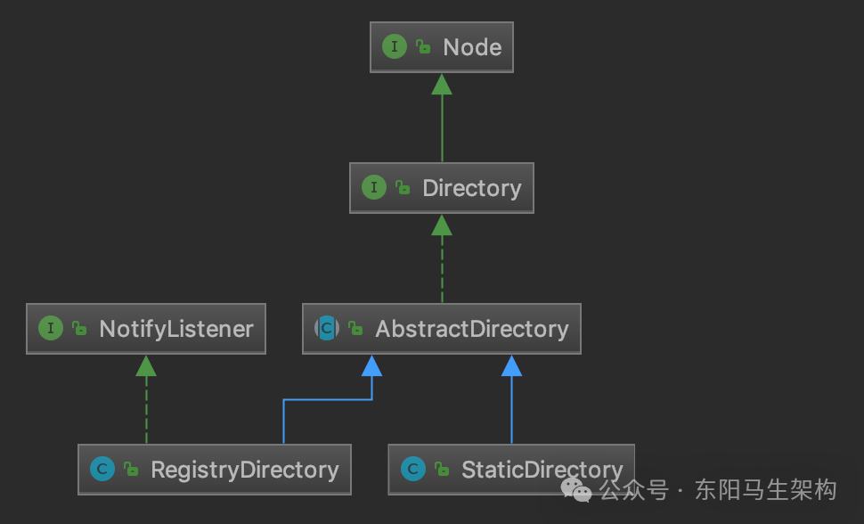

RegistryDirectory实现中维护的Invoker集合会随着注册中心中维护的注册信息动态发生变化，这就依赖了ZooKeeper等注册中心的推送能力。

StaticDirectory实现中维护的Invoker集合则是静态的，在StaticDirectory对象创建完成后不会再发生变化。

### (5)Directory接口的静态实现StaticDirectory

StaticDirectory这个Directory实现比较简单。在它的构造方法中，会接收一个Invoker集合，并赋值到自身的invokers字段中，作为底层的Invoker集合。在它的doList()方法中，会使用RouterChain中的Router，从invokers集合中过滤出符合路由规则的Invoker对象集合。

```java
public class StaticDirectory<T> extends AbstractDirectory<T> {
    private final List<Invoker<T>> invokers;
    ...

    public StaticDirectory(URL url, List<Invoker<T>> invokers, RouterChain<T> routerChain) {
        super(url == null && CollectionUtils.isNotEmpty(invokers) ? invokers.get(0).getUrl() : url, routerChain);
        this.invokers = invokers;
    }

    @Override
    protected List<Invoker<T>> doList(Invocation invocation) throws RpcException {
        List<Invoker<T>> finalInvokers = invokers;
        if (routerChain != null) {
            //通过RouterChain过滤出符合条件的Invoker集合
            finalInvokers = routerChain.route(getConsumerUrl(), invocation);
        }
        return finalInvokers == null ? Collections.emptyList() : finalInvokers;
    }
    ...
}

public abstract class AbstractDirectory<T> implements Directory<T> {
    private final URL url;
    protected RouterChain<T> routerChain;

    public AbstractDirectory(URL url, RouterChain<T> routerChain) {
        if (url == null) {
            throw new IllegalArgumentException("url == null");
        }

        this.url = url.removeParameter(REFER_KEY).removeParameter(MONITOR_KEY);
        this.consumerUrl = url.addParameters(
            StringUtils.parseQueryString(
                url.getParameterAndDecoded(REFER_KEY)
            )
        ).removeParameter(MONITOR_KEY);

        setRouterChain(routerChain);
    }

    public void setRouterChain(RouterChain<T> routerChain) {
        this.routerChain = routerChain;
    }
    ...
}
```

在创建StaticDirectory对象时，如果没有传入RouterChain对象，则会根据URL构造一个包含内置Router的RouterChain对象。

```cs
public class StaticDirectory<T> extends AbstractDirectory<T> {
    private final List<Invoker<T>> invokers;
    ...

    public void buildRouterChain() {
        //创建内置Router集合
        RouterChain<T> routerChain = RouterChain.buildChain(getUrl());
        //将invokers与RouterChain关联
        routerChain.setInvokers(invokers);
        //设置routerChain字段
        this.setRouterChain(routerChain);
    }
    ...
}

public abstract class AbstractDirectory<T> implements Directory<T> {
    private final URL url;
    ...

    @Override
    public URL getUrl() {
        return url;
    }
    ...
}

public class RouterChain<T> {
    private List<Invoker<T>> invokers = Collections.emptyList();
    private volatile List<Router> routers = Collections.emptyList();
    private List<Router> builtinRouters = Collections.emptyList();

    public static <T> RouterChain<T> buildChain(URL url) {
        return new RouterChain<>(url);
    }

    private RouterChain(URL url) {
        //通过ExtensionLoader加载激活的RouterFactory
        List<RouterFactory> extensionFactories = ExtensionLoader
            .getExtensionLoader(RouterFactory.class)
            .getActivateExtension(url, "router");
        //遍历所有RouterFactory，调用其getRouter()方法创建相应的Router对象
        List<Router> routers = extensionFactories.stream()
            .map(factory -> factory.getRouter(url))
            .collect(Collectors.toList());
        //初始化buildinRouters字段以及routers字段
        initWithRouters(routers);
    }

    public void initWithRouters(List<Router> builtinRouters) {
        this.builtinRouters = builtinRouters;
        this.routers = new ArrayList<>(builtinRouters);
        //对routers集合进行排序
        this.sort();
    }

    public void addRouters(List<Router> routers) {
        //添加builtinRouters集合
        List<Router> newRouters = new ArrayList<>();
        newRouters.addAll(builtinRouters);
        //添加传入的Router集合
        newRouters.addAll(routers);
        //重新排序
        CollectionUtils.sort(newRouters);
        this.routers = newRouters;
    }

    private void sort() {
        Collections.sort(routers);
    }

    public List<Invoker<T>> route(URL url, Invocation invocation) {
        List<Invoker<T>> finalInvokers = invokers;
        //遍历全部的Router对象
        for (Router router : routers) {
            finalInvokers = router.route(finalInvokers, url, invocation);
        }
        return finalInvokers;
    }

    public void setInvokers(List<Invoker<T>> invokers) {
        this.invokers = (invokers == null ? Collections.emptyList() : invokers);
        routers.forEach(router -> router.notify(this.invokers));
    }
}
```

### (6)Directory接口的动态实现RegistryDirectory

#### 一.动态发现Provider的subscribe()方法

#### 二.获取Invoker集合的doList()方法

#### 一.动态发现Provider的subscribe()方法

RegistryDirectory实现了NotifyListener接口。当注册中心的服务配置发生变化时，RegistryDirectory会收到变更通知，然后会根据注册中心推送的通知动态增删其Invoker集合。

RegistryDirectory的构造方法会根据传入的注册中心URL初始化其核心字段。

RegistryDirectory的subscribe()方法会在客户端订阅某个URL时被调用，该方法会通过注册中心Registry的subscribe()方法来完成订阅某个URL的操作，同时还会将当前实现了NotifyListener接口的RegistryDirectory自己作为监听器添加到注册中心Registry中。

```java
public class RegistryDirectory<T> extends AbstractDirectory<T> implements NotifyListener {
    //字段一：集群策略适配器
    //会通过Dubbo SPI方式即ExtensionLoader.getAdaptiveExtension()方法动态创建适配器实例
    //CLUSTER字段是静态字段，多个RegistryDirectory对象通用
    private static final Cluster CLUSTER = ExtensionLoader.getExtensionLoader(Cluster.class).getAdaptiveExtension();

    //字段二：路由工厂适配器
    //会通过Dubbo SPI动态创建的适配器实例
    //ROUTER_FACTORY字段是静态字段，多个RegistryDirectory对象通用
    private static final RouterFactory ROUTER_FACTORY = ExtensionLoader.getExtensionLoader(RouterFactory.class).getAdaptiveExtension();

    //字段三：服务对应的ServiceKey
    //默认是{interface}:[group]:[version]三部分构成
    private final String serviceKey;

    //字段四：服务接口类型
    //例如org.apache.dubbo.demo.DemoService
    private final Class<T> serviceType;

    //字段五：ConsumerURL中refer参数解析后得到的全部KV
    private final Map<String, String> queryMap;

    //字段六：只保留Consumer属性的URL
    //也就是由queryMap集合重新生成的URL
    private final URL directoryUrl;

    //字段七：是否引用多个服务组
    private final boolean multiGroup;

    //字段八：使用的Protocol实现
    private Protocol protocol;

    //字段九：使用的注册中心实现
    private Registry registry;

    //字段十：动态更新的Invoker集合
    private volatile List<Invoker<T>> invokers;

    //字段十一：Provider URL与对应Invoker之间的映射
    //该集合会与invokers字段同时动态更新
    private volatile Map<String, Invoker<T>> urlInvokerMap;

    //字段十二：当前缓存的所有Provider的URL
    //该集合会与invokers字段同时动态更新
    private volatile Set<URL> cachedInvokerUrls;

    //字段十三：动态更新的配置信息
    private volatile List<Configurator> configurators;

    private static final ConsumerConfigurationListener CONSUMER_CONFIGURATION_LISTENER = new ConsumerConfigurationListener();
    private ReferenceConfigurationListener serviceConfigurationListener;
    ...

    public RegistryDirectory(Class<T> serviceType, URL url) {
        //传入的url参数是注册中心的URL
        //例如，zookeeper://127.0.0.1:2181/org.apache.dubbo.registry.RegistryService?...
        //其中refer参数包含了Consumer信息
        //例如，refer=application=dubbo-demo-api-consumer&dubbo=2.0.2&interface=org.apache.dubbo.demo.DemoService&pid=13423®ister.ip=192.168.124.3&side=consumer(URLDecode之后的值)
        super(url);
        shouldRegister = !ANY_VALUE.equals(url.getServiceInterface()) && url.getParameter(REGISTER_KEY, true);
        shouldSimplified = url.getParameter(SIMPLIFIED_KEY, false);

        this.serviceType = serviceType;
        this.serviceKey = url.getServiceKey();

        //解析refer参数值，得到其中Consumer的属性信息
        this.queryMap = StringUtils.parseQueryString(url.getParameterAndDecoded(REFER_KEY));
        //将queryMap中的kv作为参数，重新构造URL，其中的protocol和path部分不变
        this.overrideDirectoryUrl = this.directoryUrl = turnRegistryUrlToConsumerUrl(url);
        String group = directoryUrl.getParameter(GROUP_KEY, "");
        this.multiGroup = group != null && (ANY_VALUE.equals(group) || group.contains(","));
    }

    //订阅某个URL
    public void subscribe(URL url) {
        setConsumerUrl(url);
        //将当前RegistryDirectory对象作为ConfigurationListener记录到CONSUMER_CONFIGURATION_LISTENER中
        CONSUMER_CONFIGURATION_LISTENER.addNotifyListener(this);
        serviceConfigurationListener = new ReferenceConfigurationListener(this, url);
        //调用AbstractRegistry的subscribe()方法完成订阅某个URL的操作，注册中心的相关操作
        registry.subscribe(url, this);
    }
    ...
}

public abstract class AbstractDirectory<T> implements Directory<T> {
    private final URL url;
    private volatile URL consumerUrl;
    ...

    public AbstractDirectory(URL url, RouterChain<T> routerChain) {
        if (url == null) {
            throw new IllegalArgumentException("url == null");
        }
        this.url = url.removeParameter(REFER_KEY).removeParameter(MONITOR_KEY);
        this.consumerUrl = url.addParameters(
            StringUtils.parseQueryString(
                url.getParameterAndDecoded(REFER_KEY)
            )
        ).removeParameter(MONITOR_KEY);
        setRouterChain(routerChain);
    }

    public void setConsumerUrl(URL consumerUrl) {
        this.consumerUrl = consumerUrl;
    }
    ...
}

public abstract class AbstractRegistry implements Registry {
    //存储URL的监听器
    private final ConcurrentMap<URL, Set<NotifyListener>> subscribed = new ConcurrentHashMap<>();

    //表示本地的Properties文件缓存，properties是一个kv结构
    //key是当前节点作为Consumer的一个URL，value是对应的Provider列表，包含了所有Category(例如providers、routes、configurators等)下的URL
    //properties中有一个特殊的key值为registries，对应的value是注册中心列表，其他记录的都是Provider列表。
    private final Properties properties = new Properties();
    ...

    //向注册中心订阅一个URL
    //这里只是先添加到内存中，子类会实现具体的网络交互
    //当注册中心中的URL发生变化时，便会通过NotifyListener进行通知
    @Override
    public void subscribe(URL url, NotifyListener listener) {
        if (url == null) {
            throw new IllegalArgumentException("subscribe url == null");
        }
        if (listener == null) {
            throw new IllegalArgumentException("subscribe listener == null");
        }
        if (logger.isInfoEnabled()) {
            logger.info("Subscribe: " + url);
        }
        //给这个URL添加NotifyListener监听器
        Set<NotifyListener> listeners = subscribed.computeIfAbsent(url, n -> new ConcurrentHashSet<>());
        listeners.add(listener);
    }
    ...
}
```

向注册中心Registry订阅URL时，会添加一个NotifyListener监听器，该监听器会监听providers、configurators和routers三个目录。所以当注册中心的这三个目录发生变化时，就会触发执行实现了NotifyListener接口的RegistryDirectory的notify()方法。

在RegistryDirectory的notify()方法中，首先会按照category对发生变化的URL进行分类，分成configurators、routers、providers三类，并分别对不同类型的URL进行处理。比如将configurators类型的URL转为Configurator对象，保存到configurators字段中。将router类型的URL转为Router对象，并通过routerChain的addRouters()方法添加routerChain中保存。将provider类型的URL转为Invoker对象，并记录到invokers集合和urlInvokerMap集合中。

```kotlin
public class RegistryDirectory<T> extends AbstractDirectory<T> implements NotifyListener {
    ...
    @Override
    public synchronized void notify(List<URL> urls) {
        //按照category进行分类，分成configurators、routers、providers三类
        Map<String, List<URL>> categoryUrls = urls.stream()
            .filter(Objects::nonNull)
            .filter(this::isValidCategory)
            .filter(this::isNotCompatibleFor26x)
            .collect(Collectors.groupingBy(this::judgeCategory));
        //获取configurators类型的URL，并转换成Configurator对象
        List<URL> configuratorURLs = categoryUrls.getOrDefault(CONFIGURATORS_CATEGORY, Collections.emptyList());
        this.configurators = Configurator.toConfigurators(configuratorURLs).orElse(this.configurators);

        //获取routers类型的URL，并转换成Router对象，添加到RouterChain中
        List<URL> routerURLs = categoryUrls.getOrDefault(ROUTERS_CATEGORY, Collections.emptyList());
        toRouters(routerURLs).ifPresent(this::addRouters);

        //获取providers类型的URL，调用refreshOverrideAndInvoker()方法进行处理
        List<URL> providerURLs = categoryUrls.getOrDefault(PROVIDERS_CATEGORY, Collections.emptyList());

        ExtensionLoader<AddressListener> addressListenerExtensionLoader = ExtensionLoader.getExtensionLoader(AddressListener.class);
        List<AddressListener> supportedListeners = addressListenerExtensionLoader.getActivateExtension(getUrl(), (String[]) null);
        if (supportedListeners != null && !supportedListeners.isEmpty()) {
            for (AddressListener addressListener : supportedListeners) {
                providerURLs = addressListener.notify(providerURLs, getConsumerUrl(),this);
            }
        }
        //对providers类型的URL进行处理
        refreshOverrideAndInvoker(providerURLs);
    }

    private void refreshOverrideAndInvoker(List<URL> urls) {
        //mock zookeeper://xxx?mock=return null
        overrideDirectoryUrl();
        refreshInvoker(urls);
    }

    //对providers类型的URL进行处理
    private void refreshInvoker(List<URL> invokerUrls) {
        //如果invokerUrls集合不为空并且长度为1，并且协议为empty
        //则表示该服务的所有Provider都下线了
        //于是会销毁当前所有的Provider对应的Invoker
        if (invokerUrls.size() == 1 && invokerUrls.get(0) != null
                && EMPTY_PROTOCOL.equals(invokerUrls.get(0).getProtocol())) {
            //forbidden标记设置为true，后续请求将直接抛出异常
            this.forbidden = true;
            this.invokers = Collections.emptyList();
            //清空RouterChain中的Invoker集合
            routerChain.setInvokers(this.invokers);
            //关闭所有Invoker对象
            destroyAllInvokers();
        } else {
            //forbidden标记设置为false，RegistryDirectory可以正常处理后续请求
            this.forbidden = false;
            //local reference
            Map<String, Invoker<T>> oldUrlInvokerMap = this.urlInvokerMap;
            if (invokerUrls == Collections.<URL>emptyList()) {
                invokerUrls = new ArrayList<>();
            }
            if (invokerUrls.isEmpty() && this.cachedInvokerUrls != null) {
                //如果invokerUrls集合为空，并且cachedInvokerUrls不为空，则将使用cachedInvokerUrls缓存的数据
                //即如果注册中心中的providers目录未发送变化，则invokerUrls为空，表示cachedInvokerUrls集合中缓存的URL即为最新的值
                invokerUrls.addAll(this.cachedInvokerUrls);
            } else {
                //如果invokerUrls集合不为空，则用invokerUrls集合更新cachedInvokerUrls集合
                //即如果providers发生变化，invokerUrls集合中会包含此时注册中心所有的服务提供者
                this.cachedInvokerUrls = new HashSet<>();
                //Cached invoker urls, convenient for comparison
                this.cachedInvokerUrls.addAll(invokerUrls);
            }
            if (invokerUrls.isEmpty()) {
                //如果invokerUrls集合为空，即providers目录未发生变更
                //则无需处理，结束本次更新服务提供者Invoker操作
                return;
            }

            //Translate url list to Invoker map
            //调用toInvokers()方法将invokerUrls转换为对应的Invoker映射关系
            Map<String, Invoker<T>> newUrlInvokerMap = toInvokers(invokerUrls);
            if (CollectionUtils.isEmptyMap(newUrlInvokerMap)) {
                return;
            }
            //更新invokers字段和urlInvokerMap集合
            List<Invoker<T>> newInvokers = Collections.unmodifiableList(new ArrayList<>(newUrlInvokerMap.values()));
            routerChain.setInvokers(newInvokers);
            //针对multiGroup的特殊处理
            //调用toMergeInvokerList()方法合并多个group的Invoker
            this.invokers = multiGroup ? toMergeInvokerList(newInvokers) : newInvokers;
            this.urlInvokerMap = newUrlInvokerMap;

            //比较新旧两组Invoker集合，销毁掉已经下线的Invoker
            destroyUnusedInvokers(oldUrlInvokerMap, newUrlInvokerMap);
        }
    }
    ...
}
```

在RegistryDirectory的refreshInvoker()方法对providers类型的URL进行处理的过程中，会通过toInvokers()方法将Provider URL转换成一个Invoker对象。

RegistryDirectory的toInvokers()方法的核心逻辑就是调用Protocol的refer()方法创建Invoker对象，其他的逻辑都是在判断是否调用该方法。

在toInvokers()方法中，会调用mergeUrl()方法对URL参数进行合并。而mergeUrl()方法会将注册中心中configurators目录下的URL(override协议)，以及服务治理控制台动态添加的配置与Provider URL进行合并，即覆盖Provider URL原有的一些信息。

```typescript
public class RegistryDirectory<T> extends AbstractDirectory<T> implements NotifyListener {
    ...
    private Map<String, Invoker<T>> toInvokers(List<URL> urls) {
        Map<String, Invoker<T>> newUrlInvokerMap = new HashMap<>();
        Set<String> keys = new HashSet<>();
        //获取Consumer端支持的协议，即protocol参数指定的协议
        String queryProtocols = this.queryMap.get(PROTOCOL_KEY);
        //遍历传入的urls集合，针对每个Provider URL进行处理
        for (URL providerUrl : urls) {
            if (queryProtocols != null && queryProtocols.length() > 0) {
                boolean accept = false;
                String[] acceptProtocols = queryProtocols.split(",");
                //遍历所有Consumer端支持的协议
                for (String acceptProtocol : acceptProtocols) {
                    if (providerUrl.getProtocol().equals(acceptProtocol)) {
                        accept = true;
                        break;
                    }
                }
                if (!accept) {
                    //如果当前Provider URL不支持Consumer端的协议，也就无法执行后续转换成Invoker的逻辑
                    continue;
                }
            }
            if (EMPTY_PROTOCOL.equals(providerUrl.getProtocol())) {
                //跳过empty协议的URL
                continue;
            }
            //如果Consumer端不支持该URL的协议(这里通过SPI方式检测是否有对应的Protocol扩展实现)，也会过来跳过该URL
            if (!ExtensionLoader.getExtensionLoader(Protocol.class).hasExtension(providerUrl.getProtocol())) {
                logger.error("");
                continue;
            }
            //调用mergeUrl()方法合并URL参数
            URL url = mergeUrl(providerUrl);
            //获取完整URL对应的字符串，也就是在urlInvokerMap集合中的key
            String key = url.toFullString();
            //跳过重复的URL
            if (keys.contains(key)) {
                continue;
            }
            //记录key
            keys.add(key);
            //匹配urlInvokerMap缓存中的Invoker对象
            //如果命中缓存，直接将Invoker添加到newUrlInvokerMap这个新集合中即可
            //如果未命中缓存，则创建新的Invoker对象，然后添加到newUrlInvokerMap这个新集合中
            Map<String, Invoker<T>> localUrlInvokerMap = this.urlInvokerMap;
            Invoker<T> invoker = localUrlInvokerMap == null ? null : localUrlInvokerMap.get(key);
            //未命中缓存
            if (invoker == null) {
                try {
                    boolean enabled = true;
                    //检测URL中的disable和enable参数，决定是否能够创建Invoker对象
                    if (url.hasParameter(DISABLED_KEY)) {
                        enabled = !url.getParameter(DISABLED_KEY, false);
                    } else {
                        enabled = url.getParameter(ENABLED_KEY, true);
                    }
                    if (enabled) {
                        //调用Protocol的refer()方法创建对应的Invoker对象
                        invoker = new InvokerDelegate<>(protocol.refer(serviceType, url), url, providerUrl);
                    }
                } catch (Throwable t) {
                    logger.error("Failed to refer invoker for interface:" + serviceType + ",url:(" + url + ")" + t.getMessage(), t);
                }
                if (invoker != null) {
                    //将key和Invoker对象之间的映射关系记录到newUrlInvokerMap中
                    newUrlInvokerMap.put(key, invoker);
                }
            } else {
                //缓存命中，直接将urlInvokerMap中的Invoker转移到newUrlInvokerMap即可
                newUrlInvokerMap.put(key, invoker);
            }
        }
        keys.clear();
        return newUrlInvokerMap;
    }

    private URL mergeUrl(URL providerUrl) {
        //首先，移除Provider URL中只在Provider端生效的属性
        //例如，threadname、threadpool、corethreads、threads、queues等参数
        //然后，用Consumer端的配置覆盖Provider URL的相应配置
        //其中，version、group、methods、timestamp等参数以Provider端的配置优先
        //最后，合并Provider端和Consumer端配置的Filter以及Listener
        providerUrl = ClusterUtils.mergeUrl(providerUrl, queryMap);

        //合并configurators类型的URL，configurators类型的URL又分为三类：
        //第一类是注册中心Configurators目录下新增的URL(override协议)
        //第二类是通过ConsumerConfigurationListener监听器(监听应用级别的配置)得到的动态配置
        //第三类是通过ReferenceConfigurationListener监听器(监听服务级别的配置)得到的动态配置
        //注意：除了注册中心的configurators目录下有配置信息之外，还有可以在服务治理控制台动态添加配置
        //ConsumerConfigurationListener、ReferenceConfigurationListener监听器
        //就是用来监听服务治理控制台的动态配置的至于服务治理控制台的具体使用
        providerUrl = overrideWithConfigurator(providerUrl);

        //增加check=false，默认只有在调用时，才检查Provider是否可用
        providerUrl = providerUrl.addParameter(Constants.CHECK_KEY, String.valueOf(false));
        //重新复制overrideDirectoryUrl，providerUrl在进过第一步参数合并后(包含override协议覆盖后的属性)赋值给overrideDirectoryUrl
        //Merge the provider side parameters
        this.overrideDirectoryUrl = this.overrideDirectoryUrl.addParametersIfAbsent(providerUrl.getParameters());

        if ((providerUrl.getPath() == null || providerUrl.getPath().length() == 0) && DUBBO_PROTOCOL.equals(providerUrl.getProtocol())) {
            String path = directoryUrl.getParameter(INTERFACE_KEY);
            if (path != null) {
                int i = path.indexOf('/');
                if (i >= 0) {
                    path = path.substring(i + 1);
                }
                i = path.lastIndexOf(':');
                if (i >= 0) {
                    path = path.substring(0, i);
                }
                providerUrl = providerUrl.setPath(path);
            }
        }
        return providerUrl;
    }
    ...
}
```

完成URL到Invoker对象的转换(toInvokers()方法)之后，在refreshInvoker()方法的最后，还会根据multiGroup的配置决定是否调用toMergeInvokerList()方法将每个group中的Invoker合并成一个Invoker。

```swift
public class RegistryDirectory<T> extends AbstractDirectory<T> implements NotifyListener {
    ...
    private List<Invoker<T>> toMergeInvokerList(List<Invoker<T>> invokers) {
        List<Invoker<T>> mergedInvokers = new ArrayList<>();
        Map<String, List<Invoker<T>>> groupMap = new HashMap<>();
        for (Invoker<T> invoker : invokers) {
            //按照group将Invoker分组
            String group = invoker.getUrl().getParameter(GROUP_KEY, "");
            groupMap.computeIfAbsent(group, k -> new ArrayList<>());
            groupMap.get(group).add(invoker);
        }

        //如果只有一个group，则直接使用该group分组对应的Invoker集合作为mergedInvokers
        if (groupMap.size() == 1) {
            mergedInvokers.addAll(groupMap.values().iterator().next());
        } else if (groupMap.size() > 1) {
            //将每个group对应的Invoker集合合并成一个Invoker
            for (List<Invoker<T>> groupList : groupMap.values()) {
                //这里使用到StaticDirectory以及Cluster合并每个group中的Invoker
                StaticDirectory<T> staticDirectory = new StaticDirectory<>(groupList);
                staticDirectory.buildRouterChain();
                //Cluster的join()方法会将多个Invoker对象转换成一个Invoker对象
                mergedInvokers.add(CLUSTER.join(staticDirectory));
            }
        } else {
            mergedInvokers = invokers;
        }
        return mergedInvokers;
    }
    ...
}
```

#### 二.获取Invoker集合的doList()方法

该方法是AbstractDirectory留给其子类实现的一个方法，也是通过Directory接口获取Invoker集合的核心所在。

```typescript
public class RegistryDirectory<T> extends AbstractDirectory<T> implements NotifyListener {
    ...
    @Override
    public List<Invoker<T>> doList(Invocation invocation) {
        if (forbidden) {
            //检测forbidden字段，当该字段在refreshInvoker()过程中设置为true时，表示无Provider可用，直接抛出异常
            throw new RpcException(RpcException.FORBIDDEN_EXCEPTION, "...");
        }

        if (multiGroup) {
            //multiGroup为true时的特殊处理，在refreshInvoker()方法中针对multiGroup为true的场景，已经使用Router进行了筛选，所以这里直接返回接口
            return this.invokers == null ? Collections.emptyList() : this.invokers;
        }

        List<Invoker<T>> invokers = null;
        //通过RouterChain.route()方法路由Invoker集合，最终得到符合路由条件的Invoker集合
        invokers = routerChain.route(getConsumerUrl(), invocation);
        return invokers == null ? Collections.emptyList() : invokers;
    }
    ...
}
```

### (5)总结

这里首先介绍了dubbo-cluster模块的整体架构，以及Cluster、Directory、Router、LoadBalance四个核心接口的功能。接着介绍了Directory接口的定义以及StaticDirectory、RegistryDirectory两个类的核心实现。其中RegistryDirectory涉及动态查找Provider URL以及处理动态配置的相关逻辑。

## 2.Router路由机制对请求的处理

### (1)RouterChain、RouterFactory与Router

### (2)ConditionRouter的路由实现

### (3)ScriptRouter的路由实现

### (4)FileRouter的路由实现

### (5)TagRouter的路由实现

### (6)ServiceRouter的路由实现

Router的主要功能就是根据用户配置的路由规则以及请求携带的信息，过滤出符合条件的Invoker集合，供后续负载均衡逻辑使用。

### (1)RouterChain、RouterFactory与Router

#### 一.RouterChain

RouterChain的构造方法会根据传入的URL参数查找router参数值，然后根据router参数值获取确定激活的RouterFactory，接着通过Dubbo SPI机制加载这些激活的RouterFactory对象，最后遍历这些RouterFactory对象并调用其getRouter()方法创建对应的Router实例以及初始化Router集合。

完成RouterChain的Router集合的初始化后，可以通过addRouter()方法添加新的Router实例到Router集合中。

RouterChain的route()方法会遍历Router集合，逐个调用Router实例的route()方法，对invokers集合进行过滤，所以真正进行路由的是Router集合中的Router实例。

```cs
public class RouterChain<T> {
    //当前RouterChain对象要过滤的Invoker集合
    //在StaticDirectory中是通过RouterChain.setInvokers()方法进行设置的
    private List<Invoker<T>> invokers = Collections.emptyList();

    //当前RouterChain激活的内置Router集合
    private List<Router> builtinRouters = Collections.emptyList();

    //当前RouterChain中真正要使用的Router集合
    //不仅包括了builtinRouters集合中全部的Router对象
    //还包括通过addRouters()方法添加的Router对象
    private volatile List<Router> routers = Collections.emptyList();

    public static <T> RouterChain<T> buildChain(URL url) {
        return new RouterChain<>(url);
    }

    private RouterChain(URL url) {
        //通过ExtensionLoader加载激活的RouterFactory
        List<RouterFactory> extensionFactories = ExtensionLoader
            .getExtensionLoader(RouterFactory.class)
            .getActivateExtension(url, "router");
        //遍历所有RouterFactory，调用其getRouter()方法创建相应的Router对象
        List<Router> routers = extensionFactories.stream()
            .map(factory -> factory.getRouter(url))
            .collect(Collectors.toList());
        //初始化初始化Router集合
        //buildinRouters字段以及routers字段
        initWithRouters(routers);
    }

    //初始化Router集合
    public void initWithRouters(List<Router> builtinRouters) {
        this.builtinRouters = builtinRouters;
        this.routers = new ArrayList<>(builtinRouters);
        //这里会对routers集合进行排序
        this.sort();
    }

    public void addRouters(List<Router> routers) {
        //添加builtinRouters集合
        List<Router> newRouters = new ArrayList<>();
        newRouters.addAll(builtinRouters);
        //添加传入的Router集合
        newRouters.addAll(routers);
        //重新排序
        CollectionUtils.sort(newRouters);
        this.routers = newRouters;
    }

    public List<Invoker<T>> route(URL url, Invocation invocation) {
        List<Invoker<T>> finalInvokers = invokers;
        //遍历全部的Router对象
        for (Router router : routers) {
            finalInvokers = router.route(finalInvokers, url, invocation);
        }
        return finalInvokers;
    }
    ...
}
```

#### 二.RouterFactory

RouterFactory是一个扩展接口，它的getRouter()方法会创建相应的Router对象。

```kotlin
@SPI
public interface RouterFactory {
    //动态生成的适配器会根据protocol参数选择扩展实现
    @Adaptive("protocol")
    Router getRouter(URL url);
}
```

RouterFactory接口有很多实现类，其继承关系图如下所示：

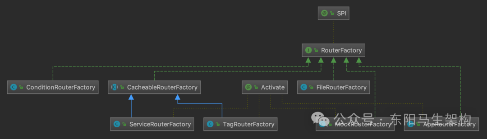

#### 三.Router

Router决定了一次Dubbo调用的目标服务，Router接口的一个实现类代表了一个路由规则。当Consumer访问Provider时，会根据路由规则筛选出合适的Provider列表，之后通过负载均衡算法再次进行筛选。其继承关系图如下所示：

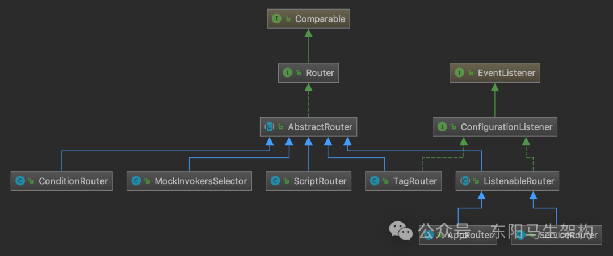

### (2)ConditionRouter的路由实现

#### 一.ConditionRouterFactory的实现

#### 二.ConditionRouter的路由规则

#### 三.ConditionRouter的字段和构造方法

#### 四.MatchPair的路由解析规则

#### 五.解析条件表达式生成MatchPair的流程

#### 六.ConditionRouter的route()方法

#### 一.ConditionRouterFactory的实现

ConditionRouterFactory的扩展名为condition，它的getRouter()方法会创建一个ConditionRouter对象并返回。

```typescript
public class ConditionRouterFactory implements RouterFactory {
    public static final String NAME = "condition";

    @Override
    public Router getRouter(URL url) {
        return new ConditionRouter(url);
    }
}
```

#### 二.ConditionRouter的路由规则

ConditionRouter是基于条件表达式的路由实现类，下面就是一条基于条件表达式的路由规则：

```apache
host = 192.168.0.100 => host = 192.168.0.150
```

在上述规则中："=>"之前的为Consumer匹配的条件，该条件中的所有参数会与Consumer的URL进行对比。当Consumer满足匹配条件时，会对该Consumer的此次调用执行"=>"后面的过滤规则。"=>"之后为Provider地址列表的过滤条件，该条件中的所有参数会和Provider的URL进行对比，Consumer最终只拿到过滤后的地址列表。

如果Consumer匹配条件为空，表示"=>"之后的过滤条件对所有Consumer生效。例如：=> host != 192.168.0.150，含义是所有Consumer都不能请求192.168.0.150这个Provider节点。

如果Provider过滤条件为空，表示禁止访问所有Provider。例如：host = 192.168.0.100 =>，含义是192.168.0.100这个Consumer不能访问任何Provider节点。

#### 三.ConditionRouter的字段和构造方法

ConditionRouter的构造方法会根据URL中携带的相应参数初始化priority、force、enable等字段，然后从URL的rule参数中获取路由规则进行解析，具体的解析逻辑是在init()方法中实现的。

```typescript
public abstract class AbstractRouter implements Router {
    //字段一：路由规则的URL，可以从rule参数中获取具体的路由规则
    protected URL url;

    //字段二：路由规则的优先级，用于排序
    //该字段值越大，优先级越高，默认值为0
    protected int priority = DEFAULT_PRIORITY;

    //字段三：当路由结果为空时，是否强制执行
    //如果不强制执行，则路由结果为空的路由规则将会自动失效
    //如果强制执行，则直接返回空的路由结果
    protected boolean force = false;
    ...
}

public class ConditionRouter extends AbstractRouter {
    ...
    //字段四：用于切分路由规则的正则表达式
    protected static final Pattern ROUTE_PATTERN = Pattern.compile("([&!=,]*)\\s*([^&!=,\\s]+)");

    //字段五：Consumer匹配的条件集合
    //通过解析条件表达式rule的=>之前半部分，可以得到该集合中的内容
    protected Map<String, MatchPair> whenCondition;

    //字段六：Provider匹配的条件集合
    //通过解析条件表达式rule的=>之后半部分，可以得到该集合中的内容
    protected Map<String, MatchPair> thenCondition;

    private boolean enabled;

    public ConditionRouter(String rule, boolean force, boolean enabled) {
        this.force = force;
        this.enabled = enabled;
        this.init(rule);
    }

    public ConditionRouter(URL url) {
        this.url = url;
        this.priority = url.getParameter(PRIORITY_KEY, 0);
        this.force = url.getParameter(FORCE_KEY, false);
        this.enabled = url.getParameter(ENABLED_KEY, true);
        init(url.getParameterAndDecoded(RULE_KEY));
    }

    public void init(String rule) {
        //将路由规则中的"consumer."和"provider."字符串清理掉
        rule = rule.replace("consumer.", "").replace("provider.", "");
        //按照"=>"字符串进行分割，得到whenRule和thenRule两部分
        int i = rule.indexOf("=>");
        String whenRule = i < 0 ? null : rule.substring(0, i).trim();
        String thenRule = i < 0 ? rule.trim() : rule.substring(i + 2).trim();

        //解析whenRule和thenRule，得到whenCondition和thenCondition两个条件集合
        Map<String, MatchPair> when =
            StringUtils.isBlank(whenRule) || "true".equals(whenRule) ?
                new HashMap<String, MatchPair>() : parseRule(whenRule);
        Map<String, MatchPair> then =
            StringUtils.isBlank(thenRule) || "false".equals(thenRule) ?
                null : parseRule(thenRule);
        this.whenCondition = when;
        this.thenCondition = then;
    }
    ...
}
```

#### 四.MatchPair的路由解析规则

whenCondition和thenCondition两个Map中：key是条件表达式中指定的参数名称，例如host = 192.168.0.150这个表达式中的host。value是MatchPair对象，包含两个Set类型的集合—matches和mismatches。

其中，条件表达式中指定的参数类型有：

```sql
类型一：服务调用信息，例如method、argument等
类型二：URL本身的字段，例如protocol、host、port等
类型三：URL上的所有参数，例如application等
```

另外，MatchPair的isMatch()方法会按如下四条规则执行进行匹配：

规则一：当mismatches集合为空时，会逐个遍历matches集合中的匹配条件，匹配成功任意一条即会返回true。

规则二：当matches集合为空时，会逐个遍历mismatches集合中的匹配条件，匹配成功任意一条即会返回false。

规则三：当matches和mismatches同时不为空时，会优先匹配mismatches中的条件，成功匹配任意一条规则，就会返回false。若mismatches中的条件全部匹配失败，才会开始匹配matches集合，成功匹配任意一条规则，就会返回true。

规则四：当上述步骤都没有成功匹配时，返回false。

```kotlin
public class ConditionRouter extends AbstractRouter {
    protected Map<String, MatchPair> whenCondition;
    protected Map<String, MatchPair> thenCondition;
    ...

    @Override
    public <T> List<Invoker<T>> route(List<Invoker<T>> invokers, URL url, Invocation invocation) throws RpcException {
        //通过enable字段判断当前ConditionRouter对象是否可用
        if (!enabled) {
            return invokers;
        }

        //当前invokers集合为空，则直接返回
        if (CollectionUtils.isEmpty(invokers)) {
            return invokers;
        }

        try {
            //匹配发起请求的Consumer是否符合表达式中=>之前的过滤条件
            if (!matchWhen(url, invocation)) {
                return invokers;
            }
            List<Invoker<T>> result = new ArrayList<Invoker<T>>();
            if (thenCondition == null) {
                //判断=>之后是否存在Provider过滤条件，若不存在则直接返回空集合，表示无Provider可用
                logger.warn("The current consumer in the service blacklist. consumer: " + NetUtils.getLocalHost() + ", service: " + url.getServiceKey());
                return result;
            }
            for (Invoker<T> invoker : invokers) {
                //逐个判断Invoker是否符合表达式中=>之后的过滤条件
                if (matchThen(invoker.getUrl(), url)) {
                    result.add(invoker);
                }
            }
            if (!result.isEmpty()) {
                return result;
            } else if (force) {
                //在无Invoker符合条件时，根据force决定是返回空集合还是返回全部Invoker
                logger.warn("The route result is empty and force execute. consumer: " + NetUtils.getLocalHost() + ", service: " + url.getServiceKey() + ", router: " + url.getParameterAndDecoded(RULE_KEY));
                return result;
            }
        } catch (Throwable t) {
            logger.error("Failed to execute condition router rule: " + getUrl() + ", invokers: " + invokers + ", cause: " + t.getMessage(), t);
        }
        return invokers;
    }

    boolean matchWhen(URL url, Invocation invocation) {
        return CollectionUtils.isEmptyMap(whenCondition) || matchCondition(whenCondition, url, null, invocation);
    }

    private boolean matchThen(URL url, URL param) {
        return CollectionUtils.isNotEmptyMap(thenCondition) && matchCondition(thenCondition, url, param, null);
    }

    private boolean matchCondition(Map<String, MatchPair> condition, URL url, URL param, Invocation invocation) {
        Map<String, String> sample = url.toMap();
        boolean result = false;
        for (Map.Entry<String, MatchPair> matchPair : condition.entrySet()) {
            String key = matchPair.getKey();
            String sampleValue;
            //get real invoked method name from invocation
            if (invocation != null && (METHOD_KEY.equals(key) || METHODS_KEY.equals(key))) {
                sampleValue = invocation.getMethodName();
            } else if (ADDRESS_KEY.equals(key)) {
                sampleValue = url.getAddress();
            } else if (HOST_KEY.equals(key)) {
                sampleValue = url.getHost();
            } else {
                sampleValue = sample.get(key);
                if (sampleValue == null) {
                    sampleValue = sample.get(key);
                }
            }
            if (sampleValue != null) {
                if (!matchPair.getValue().isMatch(sampleValue, param)) {
                    return false;
                } else {
                    result = true;
                }
            } else {
                //not pass the condition
                if (!matchPair.getValue().matches.isEmpty()) {
                    return false;
                } else {
                    result = true;
                }
            }
        }
        return result;
    }

    protected static final class MatchPair {
        final Set<String> matches = new HashSet<String>();
        final Set<String> mismatches = new HashSet<String>();

        private boolean isMatch(String value, URL param) {
            //规则一：
            //当mismatches集合为空时，会逐个遍历matches集合中的匹配条件，匹配成功任意一条即会返回true
            if (!matches.isEmpty() && mismatches.isEmpty()) {
                for (String match : matches) {
                    //这里的匹配逻辑在UrlUtils.isMatchGlobPattern()方法中实现
                    //其中完成了如下操作：
                    //如果匹配条件以"$"符号开头，则从URL中获取相应的参数值进行匹配
                    //当遇到""通配符时，会处理""通配符在匹配条件开头、中间以及末尾三种情况
                    if (UrlUtils.isMatchGlobPattern(match, value, param)) {
                        return true;
                    }
                }
                return false;
            }

            //规则二：
            //当matches集合为空时，会逐个遍历mismatches集合中的匹配条件，匹配成功任意一条即会返回false
            if (!mismatches.isEmpty() && matches.isEmpty()) {
                for (String mismatch : mismatches) {
                    if (UrlUtils.isMatchGlobPattern(mismatch, value, param)) {
                        return false;
                    }
                }
                return true;
            }

            //规则三：
            //当matches和mismatches同时不为空时，会优先匹配mismatches中的条件，成功匹配任意一条规则，就会返回false
            //若mismatches中的条件全部匹配失败，才会开始匹配matches集合，成功匹配任意一条规则，就会返回true
            if (!matches.isEmpty() && !mismatches.isEmpty()) {
                for (String mismatch : mismatches) {
                    if (UrlUtils.isMatchGlobPattern(mismatch, value, param)) {
                        return false;
                  }
                }
                for (String match : matches) {
                    if (UrlUtils.isMatchGlobPattern(match, value, param)) {
                        return true;
                    }
                }
                return false;
            }
            //规则四：
            //当上述步骤都没有成功匹配时，返回false
            return false;
        }
    }
}
```

#### 五.解析条件表达式生成MatchPair的流程

parseRule()方法解析条件表达式的源码：

```cs
public class ConditionRouter extends AbstractRouter {
    ...
    private static Map<String, MatchPair> parseRule(String rule) throws ParseException {
        Map<String, MatchPair> condition = new HashMap<String, MatchPair>();
        MatchPair pair = null;
        Set<String> values = null;
        //首先按照ROUTE_PATTERN指定的正则表达式匹配整个条件表达式
        final Matcher matcher = ROUTE_PATTERN.matcher(rule);
        //遍历匹配的结果
        while (matcher.find()) {
            //每个匹配结果有两部分(分组)，第一部分是分隔符，第二部分是内容
            String separator = matcher.group(1);
            String content = matcher.group(2);
            if (StringUtils.isEmpty(separator)) {
                //情况一：没有分隔符，content即为参数名称
                pair = new MatchPair();
                //初始化MatchPair对象，并将其与对应的Key(即content)记录到condition集合中
                condition.put(content, pair);
            } else if ("&".equals(separator)) {
                //情况四：&分隔符表示多个表达式,会创建多个MatchPair对象
                if (condition.get(content) == null) {
                    pair = new MatchPair();
                    condition.put(content, pair);
                } else {
                    pair = condition.get(content);
                }
            } else if ("=".equals(separator)) {
                //情况二：等号分隔符表示KV的分界线
                if (pair == null) {
                    throw new ParseException("...");
                }
                values = pair.matches;
                values.add(content);
            } else if ("!=".equals(separator)) {
                //情况五：不等号分隔符表示KV的分界线
                if (pair == null) {
                    throw new ParseException("...");
                }
                values = pair.mismatches;
                values.add(content);
            } else if (",".equals(separator)) {
                //情况三：逗号分隔符表示有多个Value值
                if (values == null || values.isEmpty()) {
                    throw new ParseException("...");
                }
                values.add(content);
            } else {
                throw new ParseException("...");
            }
        }
        return condition;
    }
    ...
}
```

parseRule()方法解析条件表达式的例子：

```apache
host=2.2.2.2,1.1.1.1,3.3.3.3 & method!=get => host=1.2.3.4
```

经过ROUTE_PATTERN正则表达式的分组后，可以得到如下Rule分组示意图：

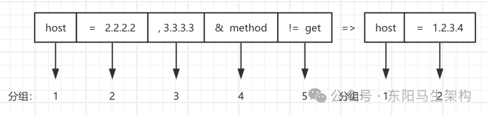

首先，看=>之前的Consumer匹配规则的处理：

步骤一：分组1中，separator为空字符串，content为host字符串。此时会进入parseRule()方法中情况一的分支，创建MatchPair对象，并以host为Key记录到condition集合中。

步骤二：分组2中，separator为"="空字符串，content为"2.2.2.2"字符串。处理该分组时，会进入parseRule()方法中情况二的分支，在MatchPair的matches集合中添加"2.2.2.2"字符串。

步骤三：分组3中，separator为","字符串，content为"3.3.3.3"字符串。处理该分组时，会进入parseRule()方法中的情况三分支，继续向MatchPair的matches集合添加"3.3.3.3"字符串。

步骤四：分组4中，separator为"&"字符串，content为"method"字符串。处理该分组时，会进入parseRule()方法中情况四的分支，创建新的MatchPair对象，并以method为Key记录到condition集合中。

步骤五：分组5中，separator为"!="字符串，content为"get"字符串。处理该分组时，会进入parseRule()方法中情况五的分支，向步骤四新建的MatchPair对象中的mismatches集合添加"get"字符串。

于是，得到的whenCondition集合如下：

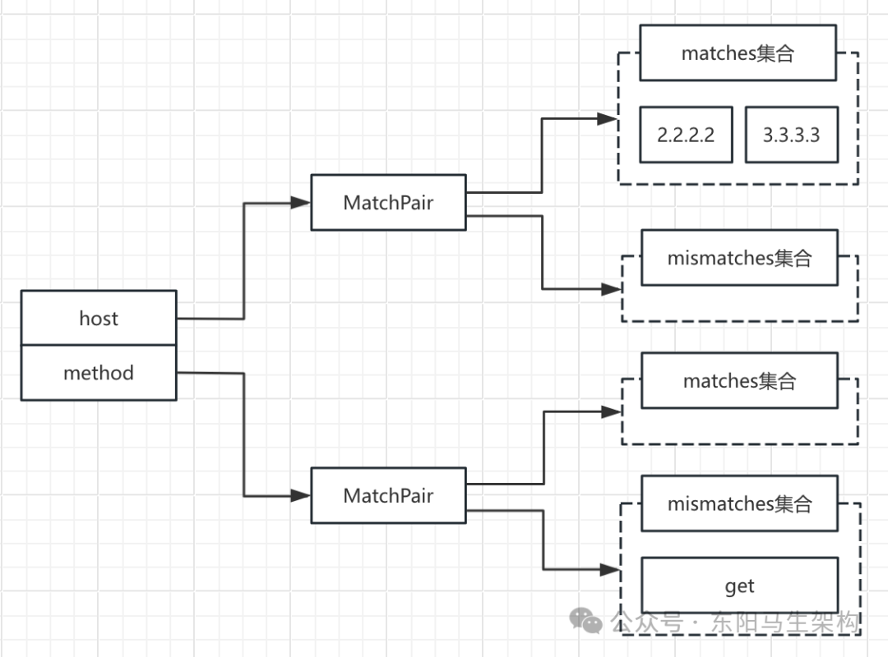

然后，对=>之后的Provider匹配规则的处理，得到的thenCondition集合如下：

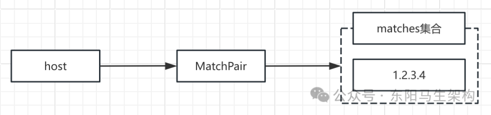

#### 六.ConditionRouter的route()方法

ConditionRouter的route()方法会首先尝试匹配whenCondition集合，判断此次发起调用的Consumer是否符合条件表达式中=>之前的Consumer过滤条件。若不符合，则直接返回整个invokers集合。若符合，则通过thenCondition对invokers进行过滤，得到符合Provider过滤条件的Invoker，然后返回给上层调用方。

```swift
public class ConditionRouter extends AbstractRouter {
    ...
    @Override
    public <T> List<Invoker<T>> route(List<Invoker<T>> invokers, URL url, Invocation invocation) throws RpcException {
        //通过enable字段判断当前ConditionRouter对象是否可用
        if (!enabled) {
            return invokers;
        }
        //当前invokers集合为空，则直接返回
        if (CollectionUtils.isEmpty(invokers)) {
            return invokers;
        }
        try {
            //匹配发起请求的Consumer是否符合表达式中=>之前的过滤条件
            if (!matchWhen(url, invocation)) {
                return invokers;
            }
            List<Invoker<T>> result = new ArrayList<Invoker<T>>();
            if (thenCondition == null) {
                //判断=>之后是否存在Provider过滤条件，若不存在则直接返回空集合，表示无Provider可用
                logger.warn("The current consumer in the service blacklist. consumer: " + NetUtils.getLocalHost() + ", service: " + url.getServiceKey());
                return result;
            }
            for (Invoker<T> invoker : invokers) {
                //逐个判断Invoker是否符合表达式中=>之后的过滤条件
                if (matchThen(invoker.getUrl(), url)) {
                    result.add(invoker);
                }
            }
            if (!result.isEmpty()) {
                return result;
            } else if (force) {
                //在无Invoker符合条件时，根据force决定是返回空集合还是返回全部Invoker
                logger.warn("The route result is empty and force execute. consumer: " + NetUtils.getLocalHost() + ", service: " + url.getServiceKey() + ", router: " + url.getParameterAndDecoded(RULE_KEY));
                return result;
            }
        } catch (Throwable t) {
            logger.error("Failed to execute condition router rule: " + getUrl() + ", invokers: " + invokers + ", cause: " + t.getMessage(), t);
        }
        return invokers;
    }
    ...
}
```

### (3)ScriptRouter的路由实现

#### 一.ScriptRouterFactory的实现

#### 二.使用脚本实现路由规则的示例

#### 三.ScriptRouter的字段和构造方法

#### 四.ScriptRouter的route()方法

#### 一.ScriptRouterFactory的实现

ScriptRouterFactory的扩展名为script，其getRouter()方法中会创建一个ScriptRouter对象并返回。

ScriptRouter支持JDK脚本引擎的所有脚本，如JavaScript、JRuby、Groovy等。可以通过type=javascript参数设置脚本类型，缺省为javascript。

```typescript
public class ScriptRouterFactory implements RouterFactory {
    public static final String NAME = "script";

    @Override
    public Router getRouter(URL url) {
        return new ScriptRouter(url);
    }
}
```

#### 二.使用脚本实现路由规则的示例

首先定义一个route()方法用于host过滤，然后将该方法的代码脚本进行编码并作为rule参数的值添加到URL中，接着当这个URL传入ScriptRouter的构造方法时就可以被ScriptRouter解析了。

```cs
function route(invokers, invocation, context) {
    var result = new java.util.ArrayList(invokers.size());
    var targetHost = new java.util.ArrayList();
    targetHost.add("10.134.108.2");
    for (var i = 0; i < invokers.length; i) {
        if (targetHost.contains(invokers[i].getUrl().getHost())) {
            result.add(invokers[i]);
        }
    }
    return result;
}
route(invokers, invocation, context)
```

#### 三.ScriptRouter的字段和构造方法

ScriptRouter的构造方法首先会初始化url字段以及priority字段(用于排序)，然后会根据URL中的type参数初始化engine、rule和function三个字段。

```typescript
public abstract class AbstractRouter implements Router {
    //字段一：路由规则的URL
    //可以从rule参数中获取具体的路由规则
    protected URL url;

    //字段二：路由规则的优先级，用于排序
    //该字段值越大，优先级越高，默认值为0
    protected int priority = DEFAULT_PRIORITY;
    ...
}

public class ScriptRouter extends AbstractRouter {
    ...
    //字段三：这是一个static集合
    //其中的key是脚本语言的名称，value是对应的ScriptEngine对象
    //这里会按照脚本语言的类型复用ScriptEngine对象
    private static final Map<String, ScriptEngine> ENGINES = new ConcurrentHashMap<>();

    //字段四：当前ScriptRouter使用的ScriptEngine对象
    private final ScriptEngine engine;

    //字段五：当前ScriptRouter使用的具体脚本内容
    private final String rule;

    //字段六：根据rule这个具体脚本内容编译得到
    private CompiledScript function;

    public ScriptRouter(URL url) {
        this.url = url;
        this.priority = url.getParameter(PRIORITY_KEY, SCRIPT_ROUTER_DEFAULT_PRIORITY);
        //根据URL中的type参数值，从ENGINES集合中获取对应的ScriptEngine对象
        engine = getEngine(url);
        //获取URL中的rule参数值，即为具体的脚本
        rule = getRule(url);
        Compilable compilable = (Compilable) engine;
        //编译rule字段中的脚本，得到function字段
        function = compilable.compile(rule);
    }

    //create ScriptEngine instance by type from url parameters, then cache it
    private ScriptEngine getEngine(URL url) {
        String type = url.getParameter(TYPE_KEY, DEFAULT_SCRIPT_TYPE_KEY);
        return ENGINES.computeIfAbsent(type, t -> {
            ScriptEngine scriptEngine = new ScriptEngineManager().getEngineByName(type);
            if (scriptEngine == null) {
                throw new IllegalStateException("unsupported route engine type: " + type);
            }
            return scriptEngine;
        });
    }

    //get rule from url parameters.
    private String getRule(URL url) {
        String vRule = url.getParameterAndDecoded(RULE_KEY);
        if (StringUtils.isEmpty(vRule)) {
            throw new IllegalStateException("route rule can not be empty.");
        }
        return vRule;
    }
    ...
}
```

#### 四.ScriptRouter的route()方法

首先会创建调用function函数所需的入参(也就是Bindings对象)，然后根据Bindings对象调用function函数得到过滤后的Invoker集合，接着通过getRoutedInvokers()方法整理Invoker集合得到最终的返回值。

```typescript
public class ScriptRouter extends AbstractRouter {
    ...
    @Override
    public <T> List<Invoker<T>> route(List<Invoker<T>> invokers, URL url, Invocation invocation) throws RpcException {
        //创建Bindings对象作为function函数的入参
        Bindings bindings = createBindings(invokers, invocation);
        if (function == null) {
            return invokers;
        }
        //调用function函数，并在getRoutedInvokers()方法中整理得到的Invoker集合
        return getRoutedInvokers(function.eval(bindings));
    }

    private <T> Bindings createBindings(List<Invoker<T>> invokers, Invocation invocation) {
        Bindings bindings = engine.createBindings();
        //与前面的javascript的示例脚本结合
        //在Bindings中为脚本里的route()方法提供了invokers、Invocation、context三个参数
        bindings.put("invokers", new ArrayList<>(invokers));
        bindings.put("invocation", invocation);
        bindings.put("context", RpcContext.getContext());
        return bindings;
    }

    //get routed invokers from result of script rule evaluation
    @SuppressWarnings("unchecked")
    protected <T> List<Invoker<T>> getRoutedInvokers(Object obj) {
        if (obj instanceof Invoker[]) {
            return Arrays.asList((Invoker<T>[]) obj);
        } else if (obj instanceof Object[]) {
            return Arrays.stream((Object[]) obj).map(item -> (Invoker<T>) item).collect(Collectors.toList());
        } else {
            return (List<Invoker<T>>) obj;
        }
    }
    ...
}
```

### (4)FileRouter的路由实现

FileRouterFactory是ScriptRouterFactory的装饰器，其扩展名为file，它在ScriptRouterFactory基础上增加了读取文件的能力。

因此，可以将ScriptRouter使用的路由规则脚本保存到文件中，然后在URL中指定文件路径。FileRouterFactory从中解析到该脚本文件的路径并进行读取，调用ScriptRouterFactory去创建相应的ScriptRouter对象。

FileRouterFactory的getRouter()方法会完成file协议的URL到script协议URL的转换。如下是一个转换示例，首先会将file://协议转换成script://协议，然后会添加type参数和rule参数。其中type参数值根据文件后缀名确定(该示例为js)，rule参数值为文件内容。

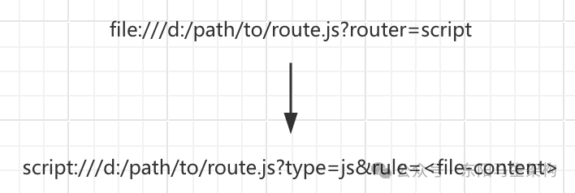

```typescript
public class FileRouterFactory implements RouterFactory {
    public static final String NAME = "file";
    private RouterFactory routerFactory;

    public void setRouterFactory(RouterFactory routerFactory) {
        this.routerFactory = routerFactory;
    }

    @Override
    public Router getRouter(URL url) {
        //默认使用script协议
        //Replace original protocol (maybe 'file') with 'script'
        String protocol = url.getParameter(ROUTER_KEY, ScriptRouterFactory.NAME);
        //Use file suffix to config script type, e.g., js, groovy ...
        String type = null;
        String path = url.getPath();
        //获取脚本文件的语言类型
        if (path != null) {
            int i = path.lastIndexOf('.');
            if (i > 0) {
                type = path.substring(i + 1);
            }
        }
        //读取脚本文件中的内容
        String rule = IOUtils.read(new FileReader(new File(url.getAbsolutePath())));

        boolean runtime = url.getParameter(RUNTIME_KEY, false);
        //创建script协议的URL
        URL script = URLBuilder.from(url)
            .setProtocol(protocol)
            .addParameter(TYPE_KEY, type)
            .addParameter(RUNTIME_KEY, runtime)
            .addParameterAndEncoded(RULE_KEY, rule)
            .build();
        //获取script对应的Router实现
        return routerFactory.getRouter(script);
    }
}
```

### (5)TagRouter的路由实现

#### 一.TagRouterFactory的实现

#### 二.基于Tag的测试环境隔离方案

#### 三.TagRouter的基本构造

#### 四.TagRouter构造的TagRouterRule

#### 五.TagRouter如何进行Invoker过滤的

#### 一.TagRouterFactory的实现

TagRouterFactory也是RouterFactory接口的扩展实现，其扩展名为tag。它与ConditionRouterFactory、ScriptRouterFactory的不同之处在于，它是通过继承CacheableRouterFactory这个抽象类间接实现RouterFactory接口的。

CacheableRouterFactory抽象类维护了一个ConcurrentMap来缓存Router，其中的key是ServiceKey。它的getRouter()方法会先根据URL的ServiceKey查询缓存的Router对象，查询失败后会调用createRouter()方法创建相应的Router对象。

```java
@Activate(order = 100)
public class TagRouterFactory extends CacheableRouterFactory {
    public static final String NAME = "tag";

    @Override
    protected Router createRouter(URL url) {
        return new TagRouter(url);
    }
}

public abstract class CacheableRouterFactory implements RouterFactory {
    private ConcurrentMap<String, Router> routerMap = new ConcurrentHashMap<>();

    @Override
    public Router getRouter(URL url) {
        return routerMap.computeIfAbsent(url.getServiceKey(), k -> createRouter(url));
    }

    protected abstract Router createRouter(URL url);
}
```

#### 二.基于Tag的测试环境隔离方案

TagRouter可以将某一个或多个Provider划分到同一分组，约束流量只在指定分组中流转。这样就可以轻松达到流量隔离的目的，从而支持灰度发布等场景。

Dubbo提供了动态和静态两种方式给Provider打标签。其中动态方式就是通过服务治理平台动态下发标签，静态方式就是在XML等静态配置中打标签。

Consumer端可以在RpcContext的attachment中添加request.tag附加属性，注意保存在attachment中的值将会在一次完整的远程调用中持续传递。我们只需要在起始调用时进行设置，就可以达到标签的持续传递。

在实际的开发测试中，一个完整的请求会涉及非常多的Provider，分属不同团队进行维护。这些团队每天都会处理不同的需求，并在其负责的Provider服务中进行修改。如果所有团队都使用一套测试环境，那么测试环境就会变得很不稳定。

如下Provider节点图示：4个Provider分属不同的团队管理，并且都部署在测试环境上。其中，Provider 1和Provider 2部署了稳定的版本，Provider 2和Provider 4部署了不稳定的版本。这样可能会导致整个测试环境无法正常处理请求，因为在这样一个不稳定的测试环境中排查Bug是非常困难的，比如排查Provider2到最后发现是Provider4的Bug。

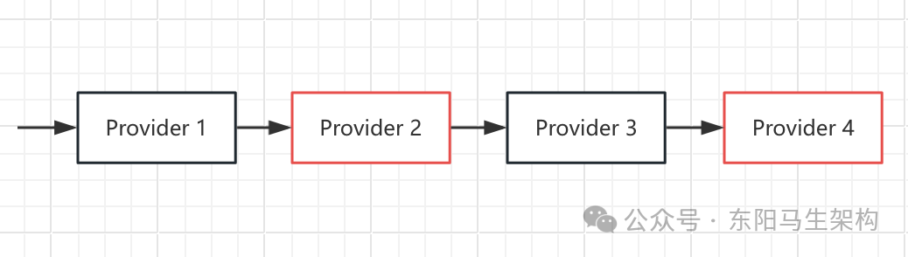

为了解决上述问题，可以针对每个需求分别独立出一套测试环境，但是这个方案会占用大量的机器，前期的搭建成本以及后续的维护成本也都非常高。

下面是一个通过Tag方式实现环境隔离的架构图(依赖Tag实现的测试环境隔离方案)。其中需求1对Provider 2的请求会全部落到有需求1标签的不稳定的Provider 2上，其他Provider使用测试环境中稳定的Provider。需求2对Provider 4的请求会全部落到有需求2标签的不稳定的Provider 4上，其他Provider使用测试环境中稳定的Provider。

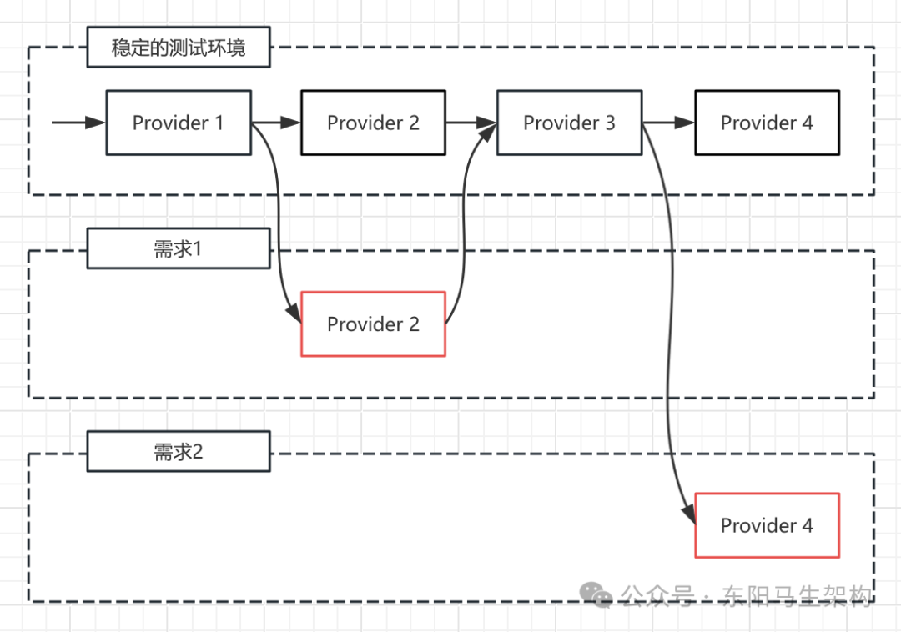

在一些特殊场景中，会有Tag降级的场景，比如当找不到Tag对应的Provider时，就会按照一定的规则进行降级。

如果在Provider集群中不存在与请求Tag对应的Provider节点，默认会将请求降级为Tag是空的Provider。

如果希望在找不到匹配Tag的Provider节点时抛出异常，需要设置request.tag.force = true。如果请求中的request.tag未设置，则只会匹配Tag为空的Provider。

总之，携带Tag的请求可以降级访问到无Tag的Provider，但是不携带Tag的请求永远无法访问到带有Tag的Provider。

#### 三.TagRouter的基本构造

一个TagRouter对象会持有一个TagRouterRule对象的引用，一个TagRouterRule对象会维护一个Tag对象的集合，一个Tag对象会维护一个Tag的名称以及其绑定的网络地址集合。

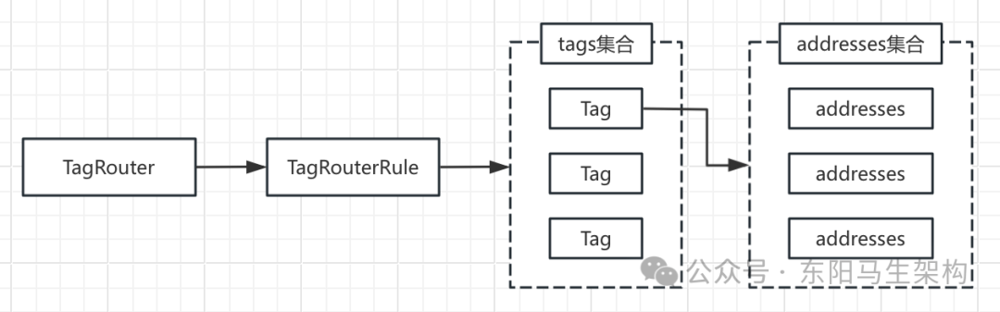

另外，TagRouterRule还维护了addressToTagnames、tagnameToAddresses两个Map。这两个Map分别是address到Tag名称的映射以及Tag名称到address的映射。在TagRouterRule的init()方法中，会根据tags集合初始化这两个Map。

```typescript
public class TagRouter extends AbstractRouter implements ConfigurationListener {
    private TagRouterRule tagRouterRule;
    ...
}

public class TagRouterRule extends AbstractRouterRule {
    private List<Tag> tags;
    private Map<String, List<String>> addressToTagnames = new HashMap<>();
    private Map<String, List<String>> tagnameToAddresses = new HashMap<>();

    public void init() {
        tags.stream().filter(tag -> CollectionUtils.isNotEmpty(tag.getAddresses())).forEach(tag -> {
            tagnameToAddresses.put(tag.getName(), tag.getAddresses());
            tag.getAddresses().forEach(addr -> {
                List<String> tagNames = addressToTagnames.computeIfAbsent(addr, k -> new ArrayList<>());
                tagNames.add(tag.getName());
            });
        });
    }
    ...
}

public class Tag {
    private String name;
    private List<String> addresses;
    ...
}
```

#### 四.TagRouter构造的TagRouterRule

TagRouter除了实现了Router接口之外，还实现了ConfigurationListener接口，其继承关系图如下：

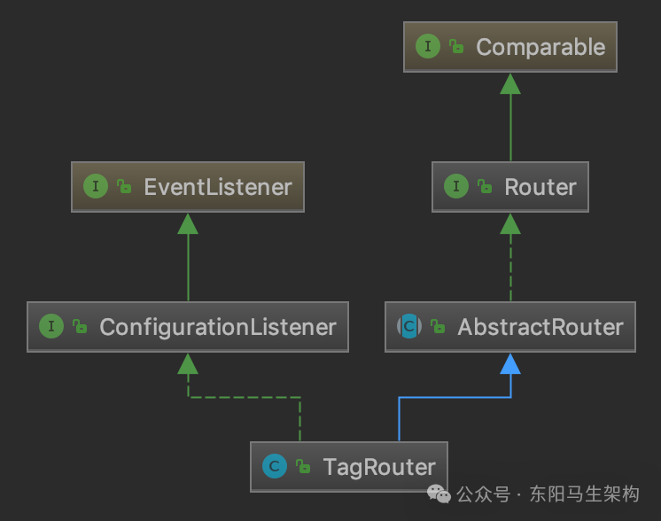

ConfigurationListener用于监听配置的变化，其中就包括TagRouterRule配置的变更。当动态更新TagRouterRule的配置时，便会触发执行ConfigurationListener接口的process()方法。

在TagRouter的process()方法中：如果发现是删除配置的操作，则直接将tagRouterRule设置为null。如果是修改或新增配置的操作，则通过TagRuleParser解析传入的配置得到对应的TagRouterRule对象。

```cs
public interface ConfigurationListener extends EventListener {
    void process(ConfigChangedEvent event);
}

public class TagRouter extends AbstractRouter implements ConfigurationListener {
    private TagRouterRule tagRouterRule;
    ...

    @Override
    public synchronized void process(ConfigChangedEvent event) {
        //如果发现是删除配置的操作，则直接将tagRouterRule设置为null
        //即如果是DELETED事件会直接清空tagRouterRule
        if (event.getChangeType().equals(ConfigChangeType.DELETED)) {
            this.tagRouterRule = null;
        } else {
            //如果是修改或新增配置的操作，则通过TagRuleParser解析传入的配置得到对应的TagRouterRule对象
            //其他事件会解析最新的路由规则，并记录到tagRouterRule字段中
            this.tagRouterRule = TagRuleParser.parse(event.getContent());
        }
    }
    ...
}

public class TagRuleParser {
    public static TagRouterRule parse(String rawRule) {
        Constructor constructor = new Constructor(TagRouterRule.class);
        TypeDescription tagDescription = new TypeDescription(TagRouterRule.class);
        tagDescription.addPropertyParameters("tags", Tag.class);
        constructor.addTypeDescription(tagDescription);
        Yaml yaml = new Yaml(constructor);
        TagRouterRule rule = yaml.load(rawRule);
        rule.setRawRule(rawRule);
        if (CollectionUtils.isEmpty(rule.getTags())) {
            rule.setValid(false);
        }
        rule.init();
        return rule;
    }
}
```

TagRuleParser的parse()方法可以解析yaml格式的TagRouterRule配置，下面是一个配置示例：

```makefile
force: false
runtime: true
enabled: false
priority: 1
key: demo-provider
tags:
    -name: tag1
    addresses: null
    -name: tag2
    addresses: ["192.168.0.192:20880"]
    -name: tag3
    addresses: []
```

经过TagRuleParser解析得到的TagRouterRule结构，如下图示：

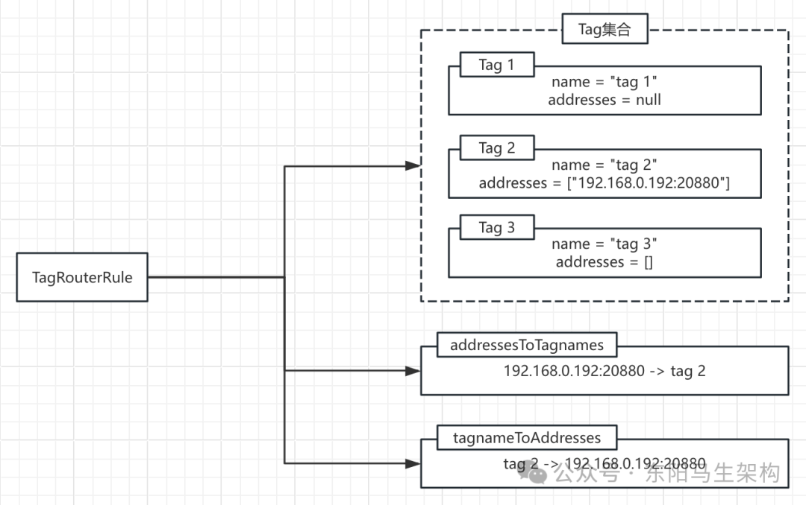

除了上图展示的几个集合字段，TagRouterRule还从AbstractRouterRule抽象类继承了一些控制字段。

```typescript
public class TagRouterRule extends AbstractRouterRule {
    private List<Tag> tags;
    private Map<String, List<String>> addressToTagnames = new HashMap<>();
    private Map<String, List<String>> tagnameToAddresses = new HashMap<>();
    ...
}

public abstract class AbstractRouterRule {
    //scope为service时，key由[{group}:]{service}[:{version}]构成
    //scope为application时，key为application的名称
    private String scope;

    //明确规则体作用在哪个服务或应用
    private String key;

    //记录了路由规则解析前的原始字符串配置
    private String rawRule;

    //表示是否在每次调用时执行该路由规则
    //如果设置为false，则会在Provider列表变更时预先执行并缓存结果，调用时直接从缓存中获取路由结果
    private boolean runtime = true;

    //当路由结果为空时，是否强制执行
    //如果不强制执行，路由结果为空的路由规则将自动失效，该字段默认值为false
    private boolean force = false;

    //用于标识解析生成当前RouterRule对象的配置是否合法
    private boolean valid = true;

    //标识当前路由规则是否生效
    private boolean enabled = true;

    //用于表示当前RouterRule的优先级
    private int priority;

    //表示该路由规则是否为持久数据，当注册方退出时，路由规则是否依然存在
    private boolean dynamic = false;
    ...
}
```

#### 五.TagRouter如何进行Invoker过滤的

TagRouter的route()方法基于TagRouterRule进行Invoker过滤的步骤如下：

步骤一：如果invokers为空，直接返回空集合。

步骤二：检查关联的tagRouterRule对象是否可用。如果不可用，则直接调用filterUsingStaticTag()方法进行过滤，并返回过滤结果。在filterUsingStaticTag()方法中，会比较请求携带的tag值与Provider URL中的tag参数值。

步骤三：尝试从Invocation以及URL的参数中获取此次调用的tag信息。

步骤四：如果此次请求指定了tag信息，则首先获取tag关联的address集合。

如果address集合不为空，则根据该address集合中的地址，匹配出符合条件的Invoker集合。如果存在符合条件的Invoker，则直接将过滤得到的Invoker集合返回。如果不存在符合条件的Invoker，则会根据force配置决定是否返回空Invoker集合。

如果address集合为空，则会将请求携带的tag值与Provider URL中的tag参数值进行比较，匹配出符合条件的Invoker集合。如果存在符合条件的Invoker或者force配置为true，则直接将过滤得到的Invoker集合返回。如果不存在符合条件的Invoker且force配置为false，则返回所有不包含任何tag的Provider。

步骤五：如果此次请求未携带tag信息，则会先获取TagRouterRule规则中全部tag关联的address集合。如果address集合不为空，则过滤出不在address集合中的Invoker并添加到结果集合中。最后将Provider URL中的tag值与TagRouterRule中的tag名称进行比较，得到最终的Invoker集合。

```kotlin
public class TagRouter extends AbstractRouter implements ConfigurationListener {
    private TagRouterRule tagRouterRule;
    ...

    @Override
    public synchronized void process(ConfigChangedEvent event) {
        //如果发现是删除配置的操作，则直接将tagRouterRule设置为null
        //即如果是DELETED事件会直接清空tagRouterRule
        if (event.getChangeType().equals(ConfigChangeType.DELETED)) {
            this.tagRouterRule = null;
        } else {
            //如果是修改或新增配置的操作，则通过TagRuleParser解析传入的配置得到对应的TagRouterRule对象
            //其他事件会解析最新的路由规则，并记录到tagRouterRule字段中
            this.tagRouterRule = TagRuleParser.parse(event.getContent());
        }
    }

    @Override
    public <T> List<Invoker<T>> route(List<Invoker<T>> invokers, URL url, Invocation invocation) throws RpcException {
        //1.如果invokers为空，直接返回空集合
        if (CollectionUtils.isEmpty(invokers)) {
            return invokers;
        }

        //2.检查关联的tagRouterRule对象是否可用
        //如果不可用，则直接调用filterUsingStaticTag()方法进行过滤，并返回过滤结果
        //在filterUsingStaticTag()方法中，会比较请求携带的tag值与Provider URL中的tag参数值
        final TagRouterRule tagRouterRuleCopy = tagRouterRule;
        if (tagRouterRuleCopy == null || !tagRouterRuleCopy.isValid() || !tagRouterRuleCopy.isEnabled()) {
            return filterUsingStaticTag(invokers, url, invocation);
        }

        List<Invoker<T>> result = invokers;
        //3.尝试从Invocation以及URL的参数中获取此次调用的tag信息
        String tag = StringUtils.isEmpty(invocation.getAttachment(TAG_KEY)) ? url.getParameter(TAG_KEY) : invocation.getAttachment(TAG_KEY);

        if (StringUtils.isNotEmpty(tag)) {
            //4.如果此次请求指定了tag信息，则首先会获取tag关联的address集合
            List<String> addresses = tagRouterRuleCopy.getTagnameToAddresses().get(tag);
            if (CollectionUtils.isNotEmpty(addresses)) {
                //4(1)如果address集合不为空
                //则根据该address集合中的地址，匹配出符合条件的Invoker集合
                //首先根据上面的address集合匹配符合条件的Invoker
                result = filterInvoker(invokers, invoker -> addressMatches(invoker.getUrl(), addresses));
                //如果存在符合条件的Invoker，则直接将过滤得到的Invoker集合返回
                //如果不存在符合条件的Invoker，则根据force配置决定是否返回空Invoker集合
                if (CollectionUtils.isNotEmpty(result) || tagRouterRuleCopy.isForce()) {
                    return result;
                }
            } else {
                //4(2)如果address集合为空
                //则会将请求携带的tag与Provider URL中的tag参数值进行比较，匹配出符合条件的Invoker集合
                result = filterInvoker(invokers, invoker -> tag.equals(invoker.getUrl().getParameter(TAG_KEY)));
            }

            if (CollectionUtils.isNotEmpty(result) || isForceUseTag(invocation)) {
                //4(2)(1)如果存在符合条件的Invoker或者force配置为true
                //则直接将过滤得到的Invoker集合返回
                return result;
            } else {
                //4(2)(2)如果不存在符合条件的Invoker且force配置为false
                //则返回所有不包含任何tag的Provider列表
                List<Invoker<T>> tmp = filterInvoker(invokers, invoker -> addressNotMatches(invoker.getUrl(), tagRouterRuleCopy.getAddresses()));
                return filterInvoker(tmp, invoker -> StringUtils.isEmpty(invoker.getUrl().getParameter(TAG_KEY)));
            }
        } else{
            //5.如果此次请求未携带tag信息，则会先获取TagRouterRule规则中全部tag关联的address集合
            List<String> addresses = tagRouterRuleCopy.getAddresses();
            //5(1)如果address集合不为空，则过滤出不在address集合中的Invoker并添加到结果集合中
            if (CollectionUtils.isNotEmpty(addresses)) {
                result = filterInvoker(invokers, invoker -> addressNotMatches(invoker.getUrl(), addresses));
                if (CollectionUtils.isEmpty(result)) {
                    return result;
                }
            }
            //5(2)如果不存在符合条件的Invoker或者address集合为空，
            //则会将请求携带的tag与ProviderURL中的tag参数值进行比较，得到最终的Invoker集合
            return filterInvoker(result, invoker -> {
                String localTag = invoker.getUrl().getParameter(TAG_KEY);
                return StringUtils.isEmpty(localTag) || !tagRouterRuleCopy.getTagNames().contains(localTag);
            });
        }
    }

    private <T> List<Invoker<T>> filterInvoker(List<Invoker<T>> invokers, Predicate<Invoker<T>> predicate) {
        return invokers.stream().filter(predicate).collect(Collectors.toList());
    }
    ...
}
```

### (6)ServiceRouter的路由实现

#### 一.ServiceRouterFactory的实现

#### 二.ServiceRouter和ListenableRouter

#### 三.ListenableRouter的process()方法

#### 四.ListenableRouter的route()方法

#### 五.ServiceRouter和AppRouter的区别

#### 一.ServiceRouterFactory的实现

ServiceRouterFactory和TagRouterFactory一样，也继承自CachabelRouterFactory，同样具有缓存的能力。

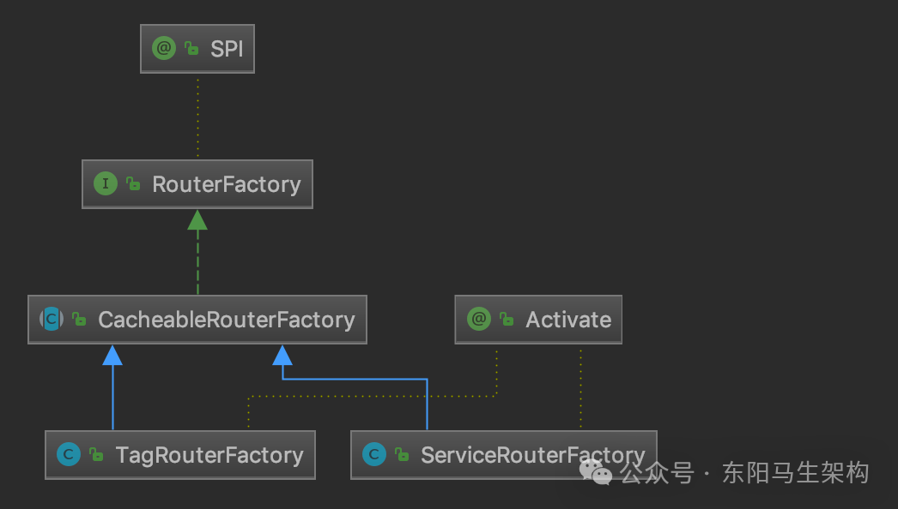

```java
public abstract class CacheableRouterFactory implements RouterFactory {
    private ConcurrentMap<String, Router> routerMap = new ConcurrentHashMap<>();

    @Override
    public Router getRouter(URL url) {
        return routerMap.computeIfAbsent(url.getServiceKey(), k -> createRouter(url));
    }

    protected abstract Router createRouter(URL url);
}

@Activate(order = 300)
public class ServiceRouterFactory extends CacheableRouterFactory {
    public static final String NAME = "service";

    @Override
    protected Router createRouter(URL url) {
        return new ServiceRouter(url);
    }
}
```

#### 二.ServiceRouter和ListenableRouter

ServiceRouterFactory创建的Router实现是ServiceRouter，与ServiceRouter类似的是AppRouter，两者都继承了ListenableRouter抽象类。虽然ListenableRouter是个抽象类，但是没有抽象方法留给子类实现。

所以，ServiceRouter和AppRouter的route()方法实际上就是ListenableRouter的route()方法。

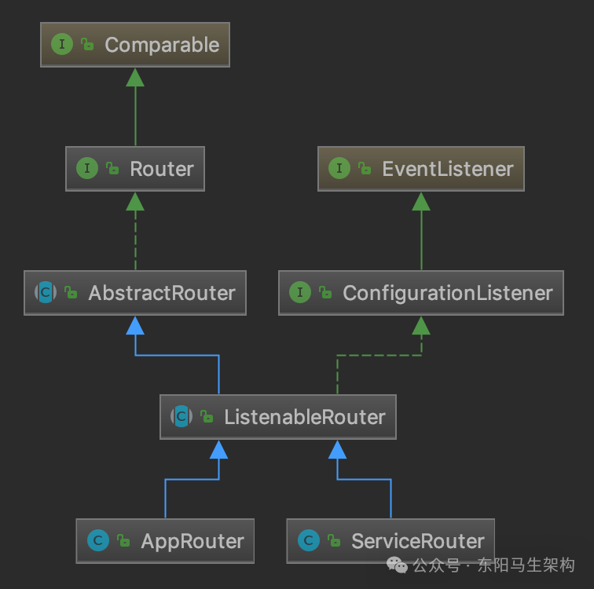

```java
public class ServiceRouter extends ListenableRouter {
    public static final String NAME = "SERVICE_ROUTER";
    private static final int SERVICE_ROUTER_DEFAULT_PRIORITY = 140;

    public ServiceRouter(URL url) {
        super(url, DynamicConfiguration.getRuleKey(url));
        this.priority = SERVICE_ROUTER_DEFAULT_PRIORITY;
    }
}

public class AppRouter extends ListenableRouter {
    public static final String NAME = "APP_ROUTER";
    private static final int APP_ROUTER_DEFAULT_PRIORITY = 150;

    public AppRouter(URL url) {
        super(url, url.getParameter(CommonConstants.APPLICATION_KEY));
        this.priority = APP_ROUTER_DEFAULT_PRIORITY;
    }
}

public abstract class ListenableRouter extends AbstractRouter implements ConfigurationListener {
    public static final String NAME = "LISTENABLE_ROUTER";
    private static final String RULE_SUFFIX = ".condition-router";
    private static final Logger logger = LoggerFactory.getLogger(ListenableRouter.class);
    private ConditionRouterRule routerRule;
    private List<ConditionRouter> conditionRouters = Collections.emptyList();

    public ListenableRouter(URL url, String ruleKey) {
        super(url);
        this.force = false;
        this.init(ruleKey);
    }

    @Override
    public synchronized void process(ConfigChangedEvent event) {
        if (event.getChangeType().equals(ConfigChangeType.DELETED)) {
            //对于DELETE事件
            //直接清空ListenableRouter中维护的ConditionRouterRule和ConditionRouter集合的引用
            routerRule = null;
            conditionRouters = Collections.emptyList();
        } else {
            //对于ADDED、UPDATED事件
            //则通过ConditionRuleParser解析事件内容，得到相应的ConditionRouterRule对象和ConditionRouter集合
            routerRule = ConditionRuleParser.parse(event.getContent());
            generateConditions(routerRule);
        }
    }

    @Override
    public <T> List<Invoker<T>> route(List<Invoker<T>> invokers, URL url, Invocation invocation) throws RpcException {
        //检查边界条件，直接返回invokers集合
        if (CollectionUtils.isEmpty(invokers) || conditionRouters.size() == 0) {
            return invokers;
        }
        //遍历路由规则进行过滤
        for (Router router : conditionRouters) {
            invokers = router.route(invokers, url, invocation);
        }
        return invokers;
    }

    @Override
    public int getPriority() {
        return DEFAULT_PRIORITY;
    }

    @Override
    public boolean isForce() {
        return (routerRule != null && routerRule.isForce());
    }

    private boolean isRuleRuntime() {
        return routerRule != null && routerRule.isValid() && routerRule.isRuntime();
    }

    private void generateConditions(ConditionRouterRule rule) {
        if (rule != null && rule.isValid()) {
            this.conditionRouters = rule.getConditions()
                .stream()
                .map(condition -> new ConditionRouter(condition, rule.isForce(), rule.isEnabled()))
                .collect(Collectors.toList());
        }
    }

    private synchronized void init(String ruleKey) {
        if (StringUtils.isEmpty(ruleKey)) {
            return;
        }

        String routerKey = ruleKey + RULE_SUFFIX;
        ruleRepository.addListener(routerKey, this);

        String rule = ruleRepository.getRule(routerKey, DynamicConfiguration.DEFAULT_GROUP);
        if (StringUtils.isNotEmpty(rule)) {
            this.process(new ConfigChangedEvent(routerKey, DynamicConfiguration.DEFAULT_GROUP, rule));
        }
    }
}
```

#### 三.ListenableRouter的process()方法

ListenableRouter其实是在ConditionRouter的基础上添加了动态配置的能力，它的process()方法与TagRouter中的process()方法类似。

对于DELETE事件，会直接清空ListenableRouter中维护的ConditionRouterRule和ConditionRouter集合的引用。

对于ADDED、UPDATED事件，则会通过ConditionRuleParser解析事件内容，然后得到相应的ConditionRouterRule和ConditionRouter集合。

这里的ConditionRuleParser同样是以yaml文件的格式解析ConditionRouterRule的相关配置的。

ConditionRouterRule中维护了一个conditions集合(List类型)，记录了多个Condition 路由规则，对应生成多个ConditionRouter对象。整个解析ConditionRouterRule的过程，与解析TagRouterRule的流程类似。

```typescript
public abstract class ListenableRouter extends AbstractRouter implements ConfigurationListener {
    private ConditionRouterRule routerRule;
    private List<ConditionRouter> conditionRouters = Collections.emptyList();
    ...

    @Override
    public synchronized void process(ConfigChangedEvent event) {
        if (event.getChangeType().equals(ConfigChangeType.DELETED)) {
            //对于DELETE事件
            //直接清空ListenableRouter中维护的ConditionRouterRule和ConditionRouter集合的引用
            routerRule = null;
            conditionRouters = Collections.emptyList();
        } else {
            //对于ADDED、UPDATED事件
            //则通过ConditionRuleParser解析事件内容，得到相应的ConditionRouterRule对象和ConditionRouter集合
            routerRule = ConditionRuleParser.parse(event.getContent());
            generateConditions(routerRule);
        }
    }

    private void generateConditions(ConditionRouterRule rule) {
        if (rule != null && rule.isValid()) {
            this.conditionRouters = rule.getConditions()
                .stream()
                .map(condition -> new ConditionRouter(condition, rule.isForce(), rule.isEnabled()))
                .collect(Collectors.toList());
        }
    }
    ...
}

public class ConditionRuleParser {
    public static ConditionRouterRule parse(String rawRule) {
        Constructor constructor = new Constructor(ConditionRouterRule.class);
        Yaml yaml = new Yaml(constructor);
        ConditionRouterRule rule = yaml.load(rawRule);
        rule.setRawRule(rawRule);
        if (CollectionUtils.isEmpty(rule.getConditions())) {
            rule.setValid(false);
        }
        return rule;
    }
}

public class ConditionRouterRule extends AbstractRouterRule {
    private List<String> conditions;

    public ConditionRouterRule() {
    }

    public List<String> getConditions() {
        return conditions;
    }

    public void setConditions(List<String> conditions) {
        this.conditions = conditions;
    }
}
```

#### 四.ListenableRouter的route()方法

在ListenableRouter的route()方法中，会遍历全部ConditionRouter，然后调用其route()方法过滤出符合全部路由条件的Invoker集合。

```java
public abstract class ListenableRouter extends AbstractRouter implements ConfigurationListener {
    ...
    @Override
    public <T> List<Invoker<T>> route(List<Invoker<T>> invokers, URL url, Invocation invocation) throws RpcException {
        if (CollectionUtils.isEmpty(invokers) || conditionRouters.size() == 0) {
            //检查边界条件，直接返回invokers集合
            return invokers;
        }
        for (Router router : conditionRouters) {
            //路由规则进行过滤
            invokers = router.route(invokers, url, invocation);
        }
        return invokers;
    }
    ...
}
```

#### 五.ServiceRouter和AppRouter的区别

ServiceRouter和AppRouter都是简单地继承了ListenableRouter抽象类，且没有覆盖ListenableRouter的任何方法。两者只有以下两点区别：

区别一：priority字段值不同。ServiceRouter为140，AppRouter为150，也就是说ServiceRouter要先于AppRouter执行。

区别二：获取ConditionRouterRule配置的Key不同。ServiceRouter使用的RuleKey由"{interface}:[version]:[group]"构成，获取的是一个服务对应的ConditionRouterRule。AppRouter使用的RuleKey是URL中的application参数值，获取的是一个服务实例对应的ConditionRouterRule。

### (7)总结

这里介绍了Router接口的相关内容。首先介绍了RouterChain的核心实现以及构建过程，然后介绍了RouterFactory接口和Router接口中核心方法的功能，接着介绍了ConditionRouter对条件路由功能的实现以及ScriptRouter对脚本路由功能的实现。

然后介绍了基于文件的FileRouter实现，其底层会依赖前面介绍的ScriptRouter。接着介绍了基于Tag的测试环境隔离方案，以及如何基于TagRouter实现该方案，同时介绍了TagRouter的核心实现。最后介绍了ListenableRouter抽象类以及ServerRouter和AppRouter两个实现。它们是在条件路由的基础上添加了动态变更路由规则的能力，同时区分了服务级别和服务实例级别的配置。
