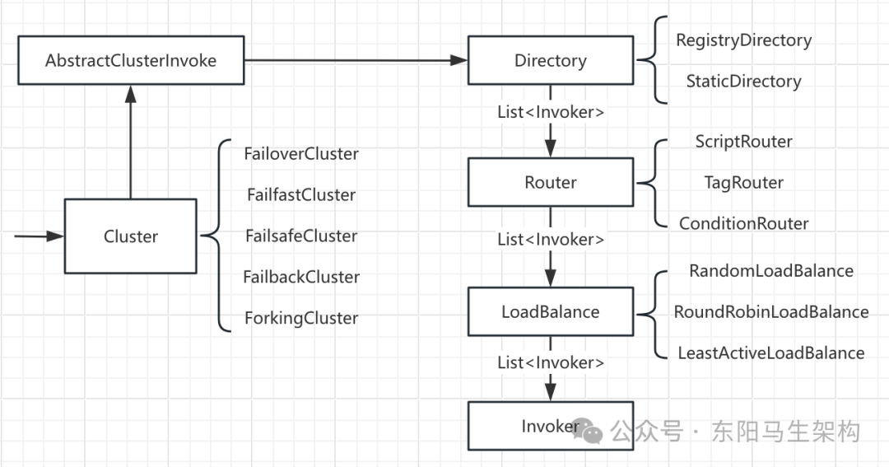
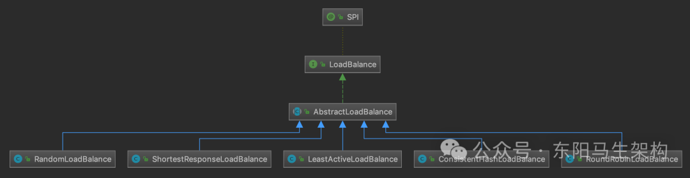
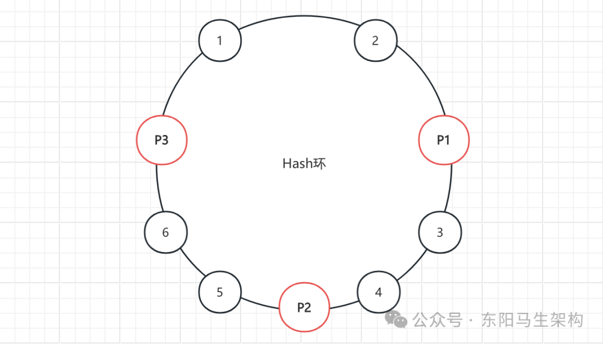
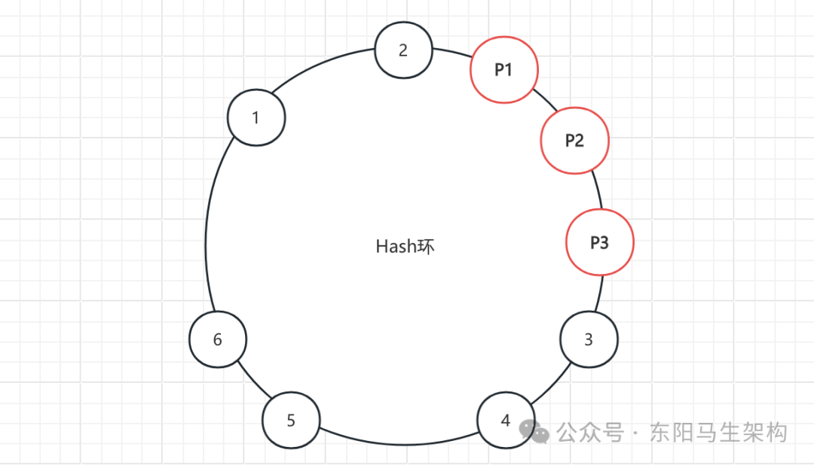
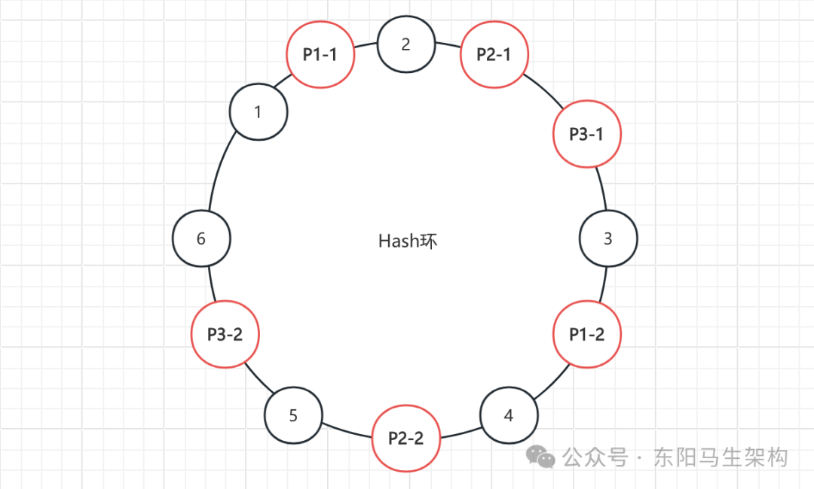
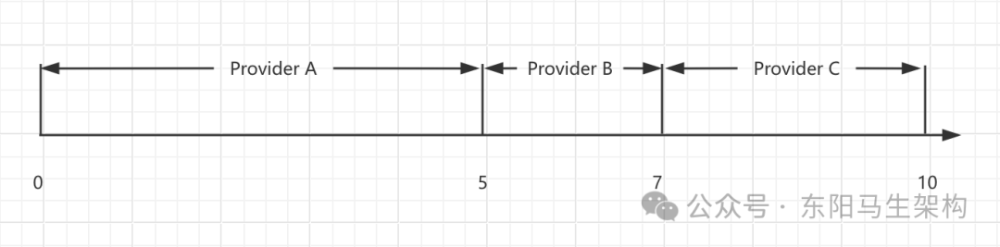
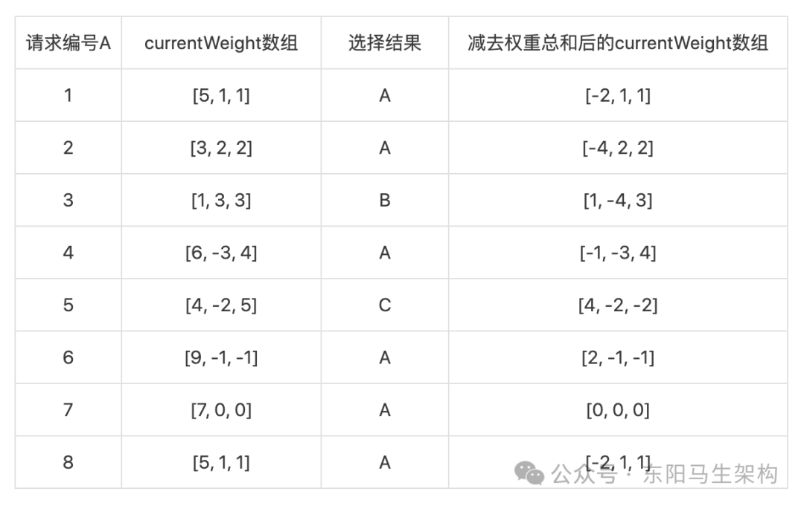
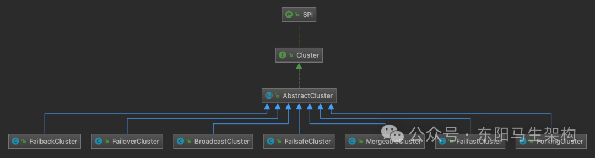
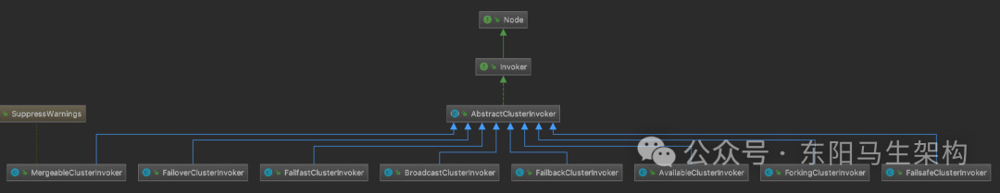
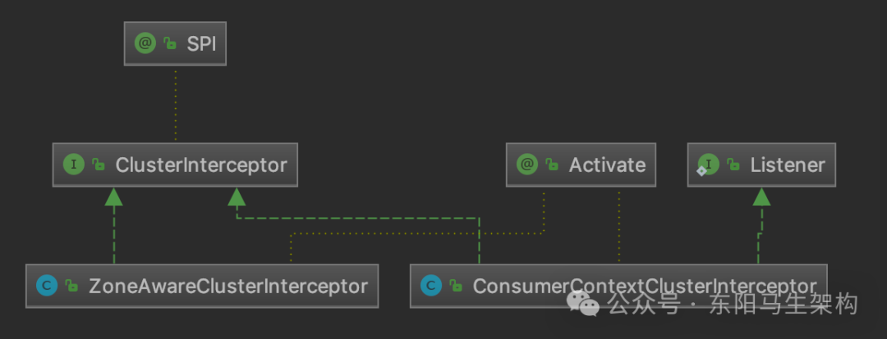

# Dubbo原理—13.集群之负载均衡和容错

> **公众号**: 东阳马生架构  
> **发布时间**: 2025-08-01 09:00  

**大纲(24680字)**

- 1.Dubbo集群的负载均衡
- 2.Dubbo集群的集群容错


## 1.Dubbo集群的负载均衡

### (1)Dubbo的负载均衡简介

### (2)LoadBalance接口

### (3)ConsistentHashLoadBalance

### (4)RandomLoadBalance

### (5)LeastActiveLoadBalance

### (6)RoundRobinLoadBalance

### (7)ShortestResponseLoadBalance

### (1)Dubbo的负载均衡简介



LoadBalance(负载均衡)的职责是将网络请求或者其他形式的负载均摊到不同的服务节点上，从而避免服务集群中部分节点压力过大、资源紧张，而另一部分节点比较空闲的情况。

通过合理的负载均衡算法，可让每个服务节点获取到适合自己处理能力的负载，实现处理能力和流量的合理分配。常用的负载均衡分为软件负载均衡(比如Nginx)和硬件负载均衡(比如F5、Array、NetScaler)。

一般RPC框架中都有负载均衡的概念和相应的实现，Dubbo也不例外。Dubbo需要对Consumer调用请求进行分配，避免少数Provider节点负载过大而剩余Provider节点处于空闲的状态。因为当Provider负载过大时，就会导致一部分请求超时、丢失等一系列问题发生，造成线上故障。

Dubbo提供了5种负载均衡实现，分别是：

```
一.基于一致性Hash的ConsistentHashLoadBalance
二.基于权重随机算法的RandomLoadBalance
三.基于最少活跃数算法的LeastActiveLoadBalance
四.基于加权轮询算法的RoundRobinLoadBalance
五.基于最短响应时间算法的ShortestResponseLoadBalance
```

### (2)LoadBalance接口

#### 一.LoadBalance扩展接口

#### 二.AbstractLoadBalance抽象类

#### 一.LoadBalance扩展接口

Dubbo提供的5种负载均衡实现都是LoadBalance接口的实现类，其继承关系图如下：



LoadBalance是一个扩展接口，默认使用的扩展实现是RandomLoadBalance。它的select()方法会根据传入的URL和Invocation，以及自身的负载均衡算法，从Invoker集合中选择一个Invoker返回。其中的@Adaptive注解参数为loadbalance，即动态生成的适配器会按照URL中的loadbalance参数值选择扩展实现类。

```java
@SPI(RandomLoadBalance.NAME)
public interface LoadBalance {
    //根据传入的URL和Invocation，以及自身的负载均衡算法，从Invoker集合中选择一个Invoker返回
    @Adaptive("loadbalance")
    <T> Invoker<T> select(List<Invoker<T>> invokers, URL url, Invocation invocation) throws RpcException;
}
```

#### 二.AbstractLoadBalance抽象类

AbstractLoadBalance抽象类并没有真正实现select()方法，它的select()方法只是对Invoker集合为空或者只包含一个Invoker对象的特殊情况进行了处理。

它还提供了一个getWeight()方法用于计算Provider权重，其中调用的calculateWarmupWeight()方法用来对还在预热状态的Provider节点进行降权，避免Provider一启动就有大量请求涌进来。

服务预热是一个优化手段，这是由JVM本身的一些特性决定的。例如JIT等方面的优化一般会在服务启动后，让其在小流量状态下运行一段时间，然后再逐步放大流量。

```java
public abstract class AbstractLoadBalance implements LoadBalance {
    @Override
    public <T> Invoker<T> select(List<Invoker<T>> invokers, URL url, Invocation invocation) {
        //Invoker集合为空，直接返回null
        if (CollectionUtils.isEmpty(invokers)) {
            return null;
        }
        //Invoker集合只包含一个Invoker，直接返回该Invoker对象
        if (invokers.size() == 1) {
            return invokers.get(0);
        }
        //Invoker集合包含多个Invoker对象时，交给doSelect()方法处理
        //doSelect()是个抽象方法，留给子类具体实现
        return doSelect(invokers, url, invocation);
    }

    protected abstract <T> Invoker<T> doSelect(List<Invoker<T>> invokers, URL url, Invocation invocation);

    //Get the weight of the invoker's invocation which takes warmup time into account
    //if the uptime is within the warmup time, the weight will be reduce proportionally
    int getWeight(Invoker<?> invoker, Invocation invocation) {
        int weight;
        URL url = invoker.getUrl();
        if (REGISTRY_SERVICE_REFERENCE_PATH.equals(url.getServiceInterface())) {
            //如果是注册中心，直接获取权重
            weight = url.getParameter(REGISTRY_KEY + "." + WEIGHT_KEY, DEFAULT_WEIGHT);
        } else {
            weight = url.getMethodParameter(invocation.getMethodName(), WEIGHT_KEY, DEFAULT_WEIGHT);
            if (weight > 0) {
                //获取服务提供者的启动时间戳
                long timestamp = invoker.getUrl().getParameter(TIMESTAMP_KEY, 0L);
                if (timestamp > 0L) {
                    //计算Provider的运行时长
                    long uptime = System.currentTimeMillis() - timestamp;
                    if (uptime < 0) {
                        return 1;
                    }
                    //计算Provider的预热时长
                    int warmup = invoker.getUrl().getParameter(WARMUP_KEY, DEFAULT_WARMUP);
                    //如果Provider运行时间小于预热时间
                    //则该Provider节点可能还在预热阶段，需要重新计算服务权重(降低其权重)
                    if (uptime > 0 && uptime < warmup) {
                        weight = calculateWarmupWeight((int)uptime, warmup, weight);
                    }
                }
            }
        }
        return Math.max(weight, 0);
    }

    //Calculate the weight according to the uptime proportion of warmup time
    //the new weight will be within 1(inclusive) to weight(inclusive)
    static int calculateWarmupWeight(int uptime, int warmup, int weight) {
        //计算权重，随着服务运行时间uptime增大，权重ww的值会慢慢接近配置值weight
        int ww = (int) ( uptime / ((float) warmup / weight));
        return ww < 1 ? 1 : (Math.min(ww, weight));
    }
}
```

### (3)ConsistentHashLoadBalance

#### 一.一致性Hash算法的原理

#### 二.ConsistentHashSelector的实现

#### 一.一致性Hash算法的原理

ConsistentHashLoadBalance是基于一致性Hash算法来实现负载均衡的。一致性Hash负载均衡可以让参数相同的请求每次都路由到相同的服务节点上，该负载均衡策略在某些Provider节点下线时，可让这些节点上的流量平摊到其他Provider上，不会引起所有节点流量的剧烈波动。

假设现在有1、2、3三个Provider节点对外提供服务，有100个请求同时到达。如果想让请求尽可能均匀地分布到这三个Provider节点上，最简单的方法就是Hash取模，即hash(请求参数) % 3。如果参与Hash计算的是请求的全部参数，那么参数相同的请求将会落到同一个Provider节点上。不过此时如果突然有一个Provider节点出现宕机，那就需要对2取模，即请求会重新分配到相应的Provider之上。在极端情况下，甚至会出现所有请求的处理节点都发生了变化，这就会造成比较大的波动。

为了避免因为一个Provider节点宕机，而导致大量请求的处理节点发生变化，可以考虑使用一致性Hash算法。一致性Hash算法的原理也是取模算法，与Hash取模的不同之处在于：Hash取模是对Provider节点数量取模，而一致性Hash算法是对2^32取模。

一致性Hash算法需要同时对Provider地址以及请求参数的hash值进行取模：

```apache
# 确定Provider节点在Hash环上的位置
hash(Provider地址) % 2^32

# 确定请求在Hash环上的位置
# 靠近哪个Provider节点，就将请求发送给哪个Provider节点
hash(请求参数) % 2^32
```

Provider地址和请求参数的hash值经过对2^32取模后，得到的结果值都会落到一个Hash环上，如下一致性Hash节点均匀分布图所示：



假设按顺时针方向，依次将请求分发到对应的Provider。这样，当某台Provider节点宕机或增加新的Provider节点时，只会影响这个Provider节点对应的请求。

在理想情况下，一致性Hash算法会将这三个Provider节点均匀地分布到Hash环上，请求也可以均匀地分发给这三个Provider节点。

但在实际情况中，这三个Provider节点地址取模之后的值，可能差距不大，这样会导致大量的请求落到一个Provider节点上。如下一致性Hash节点非均匀分布图所示：



这就出现了数据倾斜的问题。所谓数据倾斜是指由于节点不够分散，导致大量请求落到同一个节点上，而其他节点只收到少量请求的情况。

为了解决一致性Hash算法中出现的数据倾斜问题，又引入了Hash槽。Hash槽解决数据倾斜的思路是：既然问题是由Provider节点在Hash环上分布不均匀造成的，那么可以虚拟出n组P1、P2、P3的Provider节点，让多组Provider节点相对均匀地分布在Hash环上。

如下数据倾斜解决示意图所示，相同前缀的节点均为同一个Provider节点，比如P1-1、P1-2、P1-99表示的都是P1这个Provider节点。引入Provider虚拟节点之后，便可以让Provider节点在圆环上分散开，从而有效避免数据倾斜。



#### 二.ConsistentHashSelector的实现

ConsistentHashLoadBalance的doSelect()方法会根据ServiceKey和methodName选择一个ConsistentHashSelector对象，核心算法会委托给ConsistentHashSelector对象来完成。

ConsistentHashSelector构造方法的主要任务是：构建Hash槽和确认参与一致性Hash计算的参数(默认是第一个参数)，这些操作的目的就是为了让Invoker尽可能均匀地分布在Hash环上。

ConsistentHashSelector的select()方法会选择合适的Invoker对象来处理请求。其中会先对请求参数进行md5以及Hash运算，得到一个Hash值，然后再通过这个Hash值到TreeMap中查找目标Invoker。

```java
public class ConsistentHashLoadBalance extends AbstractLoadBalance {
    public static final String NAME = "consistenthash";
    public static final String HASH_NODES = "hash.nodes";
    public static final String HASH_ARGUMENTS = "hash.arguments";
    private final ConcurrentMap<String, ConsistentHashSelector<?>> selectors = new ConcurrentHashMap<String, ConsistentHashSelector<?>>();

    @Override
    protected <T> Invoker<T> doSelect(List<Invoker<T>> invokers, URL url, Invocation invocation) {
        //获取调用的方法名称
        String methodName = RpcUtils.getMethodName(invocation);
        //将ServiceKey和方法拼接起来，构成一个key
        String key = invokers.get(0).getUrl().getServiceKey() + "." + methodName;
        //using the hashcode of list to compute the hash only pay attention to the elements in the list
        int invokersHashCode = invokers.hashCode();
        //根据key获取对应的ConsistentHashSelector对象
        //selectors是一个ConcurrentMap<String, ConsistentHashSelector>集合
        ConsistentHashSelector<T> selector = (ConsistentHashSelector<T>) selectors.get(key);
        if (selector == null || selector.identityHashCode != invokersHashCode) {
            //未查找到ConsistentHashSelector对象，则进行创建
            selectors.put(key, new ConsistentHashSelector<T>(invokers, methodName, invokersHashCode));
            selector = (ConsistentHashSelector<T>) selectors.get(key);
        }
        //通过ConsistentHashSelector对象选择一个Invoker对象
        return selector.select(invocation);
    }

    private static final class ConsistentHashSelector<T> {
        //字段一：用于记录虚拟Invoker对象的Hash环
        //使用TreeMap实现Hash环，并将虚拟的Invoker对象分布在Hash环上
        private final TreeMap<Long, Invoker<T>> virtualInvokers;

        //字段二：虚拟Invoker个数
        private final int replicaNumber;

        //字段三：Invoker集合的HashCode值
        private final int identityHashCode;

        //字段四：需要参与Hash计算的参数索引
        private final int[] argumentIndex;

        ConsistentHashSelector(List<Invoker<T>> invokers, String methodName, int identityHashCode) {
            //初始化virtualInvokers字段，也就是虚拟Hash槽
            this.virtualInvokers = new TreeMap<Long, Invoker<T>>();
            //记录Invoker集合的hashCode，用该hashCode值来判断Provider列表是否发生了变化
            this.identityHashCode = identityHashCode;
            //从hash.nodes参数中获取虚拟节点的个数
            URL url = invokers.get(0).getUrl();
            this.replicaNumber = url.getMethodParameter(methodName, HASH_NODES, 160);
            //获取参与hash计算的参数下标值，默认对第一个参数进行hash运算
            String[] index = COMMA_SPLIT_PATTERN.split(url.getMethodParameter(methodName, HASH_ARGUMENTS, "0"));
            argumentIndex = new int[index.length];

            for (int i = 0; i < index.length; i++) {
                argumentIndex[i] = Integer.parseInt(index[i]);
            }

            //构建虚拟Hash槽，默认replicaNumber=160，相当于在Hash槽上放160个槽位
            //外层轮询40次，内层轮询4次，共40*4=160次，也就是同一节点虚拟出160个槽位
            for (Invoker<T> invoker : invokers) {
                String address = invoker.getUrl().getAddress();
                for (int i = 0; i < replicaNumber / 4; i++) {
                    //对address + i进行md5运算，得到一个长度为16的字节数组
                    byte[] digest = md5(address + i);
                    //对digest部分字节进行4次Hash运算，得到四个不同的long型正整数
                    for (int h = 0; h < 4; h++) {
                        //h = 0时，取 igest中下标为0 ~ 3的4个字节进行位运算
                        //h = 1时，取 digest 中下标为4 ~ 7的4个字节进行位运算
                        //h = 2, h = 3时过程同上
                        long m = hash(digest, h);
                        virtualInvokers.put(m, invoker);
                    }
                }
            }
        }

        public Invoker<T> select(Invocation invocation) {
            //将参与一致性Hash的参数拼接到一起
            String key = toKey(invocation.getArguments());
            //计算key的Hash值
            byte[] digest = md5(key);
            //匹配Invoker对象
            return selectForKey(hash(digest, 0));
        }

        private String toKey(Object[] args) {
            StringBuilder buf = new StringBuilder();
            for (int i : argumentIndex) {
                if (i >= 0 && i < args.length) {
                    buf.append(args[i]);
                }
            }
            return buf.toString();
        }

        private Invoker<T> selectForKey(long hash) {
            //从virtualInvokers集合(TreeMap是按照Key排序的)中
            //查找第一个节点值大于或等于传入Hash值的Invoker对象
            Map.Entry<Long, Invoker<T>> entry = virtualInvokers.ceilingEntry(hash);
            //如果Hash大于Hash环中的所有Invoker
            //则回到Hash环的开头，返回第一个Invoker对象
            if (entry == null) {
                entry = virtualInvokers.firstEntry();
            }
            return entry.getValue();
        }

        private long hash(byte[] digest, int number) {
            return (((long) (digest[3 + number * 4] & 0xFF) << 24)
                | ((long) (digest[2 + number * 4] & 0xFF) << 16)
                | ((long) (digest[1 + number * 4] & 0xFF) << 8)
                | (digest[number * 4] & 0xFF))
                & 0xFFFFFFFFL;
        }

        private byte[] md5(String value) {
            MessageDigest md5;
            try {
                md5 = MessageDigest.getInstance("MD5");
            } catch (NoSuchAlgorithmException e) {
                throw new IllegalStateException(e.getMessage(), e);
            }
            md5.reset();
            byte[] bytes = value.getBytes(StandardCharsets.UTF_8);
            md5.update(bytes);
            return md5.digest();
        }
    }
}
```

### (4)RandomLoadBalance

#### 一.加权随机算法的原理

#### 二.加权随机算法的实现

#### 一.加权随机算法的原理

RandomLoadBalance使用的负载均衡算法是加权随机算法，它是一个简单、高效的负载均衡实现，也是Dubbo默认使用的LoadBalance实现。

假设有三个Provider节点A、B、C，它们对应的权重分别为5、2、3，权重总和为10。把这些权重值放到一维坐标轴上，[0, 5)区间属于节点A，[5, 7)区间属于节点B，[7, 10)区间属于节点C。



可以通过随机数生成器在[0, 10)这个范围内生成一个随机数，然后计算这个随机数会落到哪个区间中。例如随机生成4，就会落到节点A对应的区间中，此时RandomLoadBalance就会返回节点A。

#### 二.加权随机算法的实现

RandomLoadBalance的doSelect()方法实现中，首先会计算每个Invoker对应的权重值以及总权重值。如果各个Invoker权重值不相等，则计算随机数应该落在哪个Invoker区间中，返回对应的Invoker对象。如果各个Invoker权重值相同，则随机返回一个Invoker。

RandomLoadBalance经过多次请求后，便能将调用请求按权重值均匀地分配到各个Provider节点上。

```java
//This class select one provider from multiple providers randomly.
//You can define weights for each provider:
//If the weights are all the same then it will use random.nextInt(number of invokers).
//If the weights are different then it will use random.nextInt(w1 + w2 + ... + wn)
//Note that if the performance of the machine is better than others, you can set a larger weight.
//If the performance is not so good, you can set a smaller weight.
public class RandomLoadBalance extends AbstractLoadBalance {
    public static final String NAME = "random";

    //Select one invoker between a list using a random criteria
    @Override
    protected <T> Invoker<T> doSelect(List<Invoker<T>> invokers, URL url, Invocation invocation) {
        int length = invokers.size();
        boolean sameWeight = true;
        //计算每个Invoker对象对应的权重，并填充到weights[]数组中
        int[] weights = new int[length];
        //计算第一个Invoker的权重
        int firstWeight = getWeight(invokers.get(0), invocation);
        weights[0] = firstWeight;
        //totalWeight用于记录总权重值
        int totalWeight = firstWeight;
        for (int i = 1; i < length; i++) {
            //计算每个Invoker的权重，以及总权重totalWeight
            int weight = getWeight(invokers.get(i), invocation);
            weights[i] = weight;
            totalWeight += weight;
            //检测每个Provider的权重是否相同
            if (sameWeight && weight != firstWeight) {
                sameWeight = false;
            }
        }
        //各个Invoker权重值不相等时，计算随机数落在哪个区间上
        if (totalWeight > 0 && !sameWeight) {
            //随机获取一个[0, totalWeight) 区间内的数字
            int offset = ThreadLocalRandom.current().nextInt(totalWeight);
            //循环让offset数减去Invoker的权重值，当offset小于0时，返回相应的Invoker
            for (int i = 0; i < length; i++) {
                offset -= weights[i];
                if (offset < 0) {
                    return invokers.get(i);
                }
            }
        }
        //各个Invoker权重值相同时，随机返回一个Invoker即可
        return invokers.get(ThreadLocalRandom.current().nextInt(length));
    }
}
```

### (5)LeastActiveLoadBalance

#### 一.最小活跃数算法的原理

#### 二.最小活跃数算法的实现

#### 一.最小活跃数算法的原理

LeastActiveLoadBalance使用的负载均衡算法是最小活跃数算法。该算法认为当前活跃请求数越小的Provider节点，剩余的处理能力越多，处理请求的效率也就越高，那么该Provider在单位时间内就可以处理更多的请求，所以我们应该优先将请求分配给该Provider节点。

LeastActiveLoadBalance需要配合ActiveLimitFilter使用。ActiveLimitFilter会记录每个接口方法的活跃请求数，在LeastActiveLoadBalance进行负载均衡时，只会从活跃请求数最少的Invoker集合里挑选Invoker。

#### 二.最小活跃数算法的实现

在LeastActiveLoadBalance的doSelect()方法中，首先会选出所有活跃请求数最小的Invoker对象，然后会按照这些Invoker对象的权重挑选最终的Invoker对象。

```java
//Filter the number of invokers with the least number of active calls and count the weights and quantities of these invokers.
//If there is only one invoker, use the invoker directly;
//if there are multiple invokers and the weights are not the same, then random according to the total weight;
//if there are multiple invokers and the same weight, then randomly called.
public class LeastActiveLoadBalance extends AbstractLoadBalance {
    public static final String NAME = "leastactive";

    @Override
    protected <T> Invoker<T> doSelect(List<Invoker<T>> invokers, URL url, Invocation invocation) {
        //初始化Invoker数量
        int length = invokers.size();
        //记录最小的活跃请求数
        int leastActive = -1;
        //记录活跃请求数最小的Invoker集合的个数
        int leastCount = 0;
        //记录活跃请求数最小的Invoker在invokers数组中的下标位置
        int[] leastIndexes = new int[length];
        //记录活跃请求数最小的Invoker集合中，每个Invoker的权重值
        int[] weights = new int[length];
        //记录活跃请求数最小的Invoker集合中，所有Invoker的权重值之和
        int totalWeight = 0;
        //记录活跃请求数最小的Invoker集合中，第一个Invoker的权重值
        int firstWeight = 0;
        //是否活跃请求数最小的集合中，所有Invoker的权重值是否相同
        boolean sameWeight = true;

        //遍历所有Invoker，获取活跃请求数最小的Invoker集合
        for (int i = 0; i < length; i++) {
            Invoker<T> invoker = invokers.get(i);
            //获取该Invoker的活跃请求数
            int active = RpcStatus.getStatus(invoker.getUrl(), invocation.getMethodName()).getActive();
            //获取该Invoker的权重
            int afterWarmup = getWeight(invoker, invocation);
            weights[i] = afterWarmup;

            //比较活跃请求数
            if (leastActive == -1 || active < leastActive) {
                //当前的Invoker是第一个活跃请求数最小的Invoker，则记录如下信息
                //重新记录最小的活跃请求数
                leastActive = active;
                //重新记录活跃请求数最小的Invoker集合个数
                leastCount = 1;
                //重新记录Invoker
                leastIndexes[0] = i;
                //重新记录总权重值
                totalWeight = afterWarmup;
                //该Invoker作为第一个Invoker，记录其权重值
                firstWeight = afterWarmup;
                //重新记录是否权重值相等
                sameWeight = true;
            } else if (active == leastActive) {
                //当前Invoker属于活跃请求数最小的Invoker集合
                //记录该Invoker的下标
                leastIndexes[leastCount++] = i;
                //更新总权重
                totalWeight += afterWarmup;
                if (sameWeight && afterWarmup != firstWeight) {
                    //更新权重值是否相等
                    sameWeight = false;
                }
            }
        }

        //如果只有一个活跃请求数最小的Invoker对象，直接返回即可
        if (leastCount == 1) {
            return invokers.get(leastIndexes[0]);
        }

        //下面按照RandomLoadBalance的逻辑，从活跃请求数最小的Invoker集合中，随机选择一个Invoker对象返回
        if (!sameWeight && totalWeight > 0) {
            int offsetWeight = ThreadLocalRandom.current().nextInt(totalWeight);
            for (int i = 0; i < leastCount; i++) {
                int leastIndex = leastIndexes[i];
                offsetWeight -= weights[leastIndex];
                if (offsetWeight < 0) {
                    return invokers.get(leastIndex);
                }
            }
        }
        return invokers.get(leastIndexes[ThreadLocalRandom.current().nextInt(leastCount)]);
    }
}
```

### (6)RoundRobinLoadBalance

#### 一.加权轮询算法的原理

#### 二.加权轮询算法的执行流程

#### 三.加权轮询算法的实现

#### 一.加权轮询算法的原理

RoundRobinLoadBalance使用的负载均衡算法是加权轮询算法，该算法会将请求轮流分配给每个Provider。

例如有A、B、C三个Provider节点，按照普通轮询的方式，会将第一个请求分配给Provider A，将第二个请求分配给 Provider B，第三个请求分配给Provider C，第四个请求再次分配给Provider A，如此循环往复。

轮询是一种无状态负载均衡算法，实现简单，适用于集群中所有Provider节点性能相近的场景。但现实中就很难保证这一点，因为很容易出现集群中性能最好和最差的Provider节点处理同样流量的情况。这就可能导致性能差的Provider节点各方面资源非常紧张，甚至无法及时响应了，但是性能好的Provider节点的各方面资源使用还较为空闲。

这时我们可以通过加权轮询的方式，降低分配到性能较差的Provider节点的流量。加权之后，分配给每个Provider节点的流量比会接近或等于它们的权重比。

例如Provider节点A、B、C权重比为5:1:1。那么在7次请求中，节点A将收到5次请求，节点B会收到1次请求，节点C则会收到1次请求。

#### 二.加权轮询算法的执行流程

每个Provider节点有两个权重：一个权重是配置的weight，该值在负载均衡的过程中不会变化。另一个权重是currentWeight，该值会在负载均衡的过程中动态调整，初始值为0。

当有新的请求进来时，RoundRobinLoadBalance会遍历Invoker列表，并用对应的currentWeight加上其配置的权重。遍历完成后，再找到最大的currentWeight，将其减去权重总和，然后返回相应的Invoker对象。

假设A、B、C三个节点的权重比例为5:1:1。



说明一：处理第一个请求，currentWeight数组中的权重与配置的weight相加，即从[0, 0, 0]变为[5, 1, 1]。接下来，从中选择权重最大的Invoker作为结果，即节点A。最后，将节点A的currentWeight值减去totalWeight值，最终得到currentWeight数组为[-2, 1, 1]。

说明二：处理第二个请求，currentWeight数组中的权重与配置的weight相加，即从[-2, 1, 1]变为[3, 2, 2]。接下来，从中选择权重最大的Invoker作为结果，即节点A。最后，将节点A的currentWeight值减去totalWeight值，最终得到currentWeight数组为[-4, 2, 2]。

说明三：处理第三个请求，currentWeight数组中的权重与配置的weight相加，即从[-4, 2, 2]变为[1, 3, 3]。接下来，从中选择权重最大的Invoker作为结果，即节点B。最后，将节点B的currentWeight值减去totalWeight值，最终得到currentWeight数组为[1, -4, 3]。

说明四：处理第四个请求，currentWeight数组中的权重与配置的weight相加，即从[1, -4, 3]变为[6, -3, 4]。接下来，从中选择权重最大的Invoker作为结果，即节点A。最后，将节点A的currentWeight值减去totalWeight值，最终得到currentWeight数组为[-1, -3, 4]。

说明五：处理第五个请求，currentWeight数组中的权重与配置的weight相加，即从[-1, -3, 4]变为[4, -2, 5]。接下来，从中选择权重最大的Invoker作为结果，即节点C。最后，将节点C的currentWeight值减去totalWeight值，最终得到currentWeight数组为[4, -2, -2]。

说明六：处理第六个请求，currentWeight数组中的权重与配置的weight相加，即从[4, -2, -2]变为[9, -1, -1]。接下来，从中选择权重最大的Invoker作为结果，即节点A。最后，将节点A的currentWeight值减去totalWeight值，最终得到currentWeight数组为 [2, -1, -1]。

说明七：处理第七个请求，currentWeight数组中的权重与配置的weight相加，即从[2, -1, -1]变为[7, 0, 0]。接下来，从中选择权重最大的Invoker作为结果，即节点A。最后，将节点A的currentWeight值减去totalWeight值，最终得到currentWeight数组为[0, 0, 0]。

到此为止，一个轮询的周期就结束了。

#### 三.加权轮询算法的实现

RoundRobinLoadBalance会为每个Invoker对象创建对应的WeightedRoundRobin对象，用来记录配置的权重(weight字段)以及随着每次负载均衡算法执行变化的current权重(current字段)。

```java
public class RoundRobinLoadBalance extends AbstractLoadBalance {
    public static final String NAME = "roundrobin";
    private static final int RECYCLE_PERIOD = 60000;

    protected static class WeightedRoundRobin {
        //配置的Invoker权重，该权重不会变化
        private int weight;
        //当前的权重值，随着RoundRobin过程而改变
        private AtomicLong current = new AtomicLong(0);
        //最后一次更新时间
        private long lastUpdate;

        public int getWeight() {
            return weight;
        }

        public void setWeight(int weight) {
            this.weight = weight;
            //初始current为0
            current.set(0);
        }

        public long increaseCurrent() {
            return current.addAndGet(weight);
        }

        public void sel(int total) {
            current.addAndGet(-1 * total);
        }

        public long getLastUpdate() {
            return lastUpdate;
        }

        public void setLastUpdate(long lastUpdate) {
            this.lastUpdate = lastUpdate;
        }
    }

    private ConcurrentMap<String, ConcurrentMap<String, WeightedRoundRobin>> methodWeightMap =
        new ConcurrentHashMap<String, ConcurrentMap<String, WeightedRoundRobin>>();

    //get invoker addr list cached for specified invocation
    protected <T> Collection<String> getInvokerAddrList(List<Invoker<T>> invokers, Invocation invocation) {
        String key = invokers.get(0).getUrl().getServiceKey() + "." + invocation.getMethodName();
        Map<String, WeightedRoundRobin> map = methodWeightMap.get(key);
        if (map != null) {
            return map.keySet();
        }
        return null;
    }

    @Override
    protected <T> Invoker<T> doSelect(List<Invoker<T>> invokers, URL url, Invocation invocation) {
        String key = invokers.get(0).getUrl().getServiceKey() + "." + invocation.getMethodName();
        //获取整个Invoker列表对应的WeightedRoundRobin映射表
        //如果为空，则创建一个新的WeightedRoundRobin映射表
        ConcurrentMap<String, WeightedRoundRobin> map = methodWeightMap.computeIfAbsent(key, k -> new ConcurrentHashMap<>());
        int totalWeight = 0;
        long maxCurrent = Long.MIN_VALUE;
        //获取当前时间
        long now = System.currentTimeMillis();
        Invoker<T> selectedInvoker = null;
        WeightedRoundRobin selectedWRR = null;
        for (Invoker<T> invoker : invokers) {
            String identifyString = invoker.getUrl().toIdentityString();
            int weight = getWeight(invoker, invocation);
            //检测当前Invoker是否有相应的WeightedRoundRobin对象，没有则进行创建
            WeightedRoundRobin weightedRoundRobin = map.computeIfAbsent(identifyString, k -> {
                WeightedRoundRobin wrr = new WeightedRoundRobin();
                wrr.setWeight(weight);
                return wrr;
            });
            //检测Invoker权重是否发生了变化，若发生变化，则更新WeightedRoundRobin的weight字段
            if (weight != weightedRoundRobin.getWeight()) {
                weightedRoundRobin.setWeight(weight);
            }
            //让currentWeight加上配置的Weight
            long cur = weightedRoundRobin.increaseCurrent();
            //设置lastUpdate字段
            weightedRoundRobin.setLastUpdate(now);
            //寻找具有最大currentWeight的Invoker，以及Invoker对应的WeightedRoundRobin
            if (cur > maxCurrent) {
                maxCurrent = cur;
                selectedInvoker = invoker;
                selectedWRR = weightedRoundRobin;
            }
            //计算权重总和
            totalWeight += weight;
        }
        if (invokers.size() != map.size()) {
            map.entrySet().removeIf(item -> now - item.getValue().getLastUpdate() > RECYCLE_PERIOD);
        }
        if (selectedInvoker != null) {
            //用currentWeight减去totalWeight
            selectedWRR.sel(totalWeight);
            //返回选中的Invoker对象
            return selectedInvoker;
        }
        //should not happen here
        return invokers.get(0);
    }
}
```

### (7)ShortestResponseLoadBalance

ShortestResponseLoadBalance使用的负载均衡算法是最短响应时间算法，该算法会从多个Provider节点中选出调用成功的且响应时间最短的Provider节点。不过满足该条件的Provider节点可能有多个，所以要再使用随机算法进行一次选择，得到最终要调用的Provider。

```java
//Filter the number of invokers with the shortest response time of success calls and count the weights and quantities of these invokers.
//If there is only one invoker, use the invoker directly;
//if there are multiple invokers and the weights are not the same, then random according to the total weight;
//if there are multiple invokers and the same weight, then randomly called.
public class ShortestResponseLoadBalance extends AbstractLoadBalance {
    public static final String NAME = "shortestresponse";

    @Override
    protected <T> Invoker<T> doSelect(List<Invoker<T>> invokers, URL url, Invocation invocation) {
        //记录Invoker集合的数量
        int length = invokers.size();
        //用于记录所有Invoker集合中最短响应时间
        long shortestResponse = Long.MAX_VALUE;
        //具有相同最短响应时间的Invoker个数
        int shortestCount = 0;
        //存放所有最短响应时间的Invoker的下标
        int[] shortestIndexes = new int[length];
        //存储每个Invoker的权重
        int[] weights = new int[length];
        //存储权重总和
        int totalWeight = 0;
        //记录第一个Invoker对象的权重
        int firstWeight = 0;
        //最短响应时间Invoker集合中的Invoker权重是否相同
        boolean sameWeight = true;

        for (int i = 0; i < length; i++) {
            Invoker<T> invoker = invokers.get(i);
            RpcStatus rpcStatus = RpcStatus.getStatus(invoker.getUrl(), invocation.getMethodName());
            //获取调用成功的平均时间，具体计算方式是：
            //调用成功的请求数总数对应的总耗时 / 调用成功的请求数总数 = 成功调用的平均时间
            long succeededAverageElapsed = rpcStatus.getSucceededAverageElapsed();
            //获取的是该Provider当前的活跃请求数，也就是当前正在处理的请求数
            int active = rpcStatus.getActive();
            //计算一个处理新请求的预估值，也就是如果当前请求发给这个Provider，大概耗时多久处理完成
            long estimateResponse = succeededAverageElapsed * active;
            //计算该Invoker的权重，主要是处理预热
            int afterWarmup = getWeight(invoker, invocation);
            weights[i] = afterWarmup;
            if (estimateResponse < shortestResponse) {
                //第一次找到Invoker集合中最短响应耗时的Invoker对象，记录其相关信息
                shortestResponse = estimateResponse;
                shortestCount = 1;
                shortestIndexes[0] = i;
                totalWeight = afterWarmup;
                firstWeight = afterWarmup;
                sameWeight = true;
            } else if (estimateResponse == shortestResponse) {
                //出现对个耗时最短的Invoker对象
                shortestIndexes[shortestCount++] = i;
                totalWeight += afterWarmup;
                if (sameWeight && i > 0 && afterWarmup != firstWeight) {
                    sameWeight = false;
                }
            }
        }

        if (shortestCount == 1) {
            return invokers.get(shortestIndexes[0]);
        }

        //如果耗时最短的所有Invoker对象的权重不相同，则通过加权随机负载均衡的方式选择一个Invoker返回
        if (!sameWeight && totalWeight > 0) {
            int offsetWeight = ThreadLocalRandom.current().nextInt(totalWeight);
            for (int i = 0; i < shortestCount; i++) {
                int shortestIndex = shortestIndexes[i];
                offsetWeight -= weights[shortestIndex];
                if (offsetWeight < 0) {
                    return invokers.get(shortestIndex);
                }
            }
        }

        //如果耗时最短的所有Invoker对象的权重相同，则随机返回一个
        return invokers.get(shortestIndexes[ThreadLocalRandom.current().nextInt(shortestCount)]);
    }
}
```

### (8)总结

这里介绍了Dubbo Cluster层中负载均衡相关的内容。首先介绍了LoadBalance接口的定义以及AbstractLoadBalance抽象类提供的公共能力，然后介绍了ConsistentHashLoadBalance的原理和实现，接着介绍了RandomLoadBalance的原理和实现。接下来又介绍了LeastActiveLoadBalance实现，它使用最小活跃数负载均衡算法，选择当前请求最少的Provider节点处理最新的请求。接下来又介绍了RoundRobinLoadBalance实现，它使用加权轮询负载均衡算法，弥补了单纯的轮询负载均衡算法导致的问题，同时随着Dubbo版本的升级，也将其自身不够平滑的问题优化掉了。最后介绍了ShortestResponseLoadBalance实现，它会从响应时间最短的Provider节点中选择一个Provider节点来处理新请求。

## 2.Dubbo集群的集群容错

### (1)Cluster接口与容错机制

### (2)AbstractClusterInvoker抽象类

### (3)AbstractCluster抽象类

### (4)FailoverClusterInvoker

### (5)FailbackClusterInvoker

### (6)FailfastClusterInvoker

### (7)FailsafeClusterInvoker

### (8)ForkingClusterInvoker

### (9)BroadcastClusterInvoker

### (10)AvailableClusterInvoker

### (11)MergeableClusterInvoker

### (12)ZoneAwareClusterInvoker

为了避免单点故障，Provider通常会部署在多台服务器上，以集群的形式对外提供服务，对于一些负载比较高的服务，则需要部署更多Provider来抗住流量。

在Dubbo中，Cluster接口提供了集群容错功能，通过Cluster接口可以把一组可供调用的Provider信息组合成为一个统一的Invoker供调用方进行调用。经过Router过滤、LoadBalance选址后，选择其中一个具体的Provider进行调用。如果调用失败，则会按照集群的容错策略进行容错处理。

Dubbo默认内置了若干容错策略，并且每种容错策略都有自己独特的应用场景，甚至可以自定义容错策略，然后通过配置选择不同的容错策略。

### (1)Cluster接口与容错机制

#### 一.Cluster的工作流程

#### 二.Cluster Invoker获取Invoker的流程

#### 三.Dubbo中常见的容错方式

#### 四.Cluster的接口

```java
public class Test {
    List<Invoker<IHelloService>> invokers = new ArrayList<Invoker<IHelloService>>();

    @Test
    public void testMockInvokerInvoke_forcemock() {
        ...
        Protocol protocol = new MockProtocol();
        Invoker<IHelloService> mInvoker1 = protocol.refer(IHelloService.class, mockUrl);
        Invoker<IHelloService> cluster = getClusterInvokerMock(url, mInvoker1);
        invocation = new RpcInvocation();
        invocation.setMethodName("sayHello");
        //下面会调用AbstractClusterInvoker的invoke()方法
        ret = cluster.invoke(invocation);
        Assertions.assertNull(ret.getValue());
    }

    private Invoker<IHelloService> getClusterInvokerMock(URL url, Invoker<IHelloService> mockInvoker) {
        final URL durl = url.addParameter("proxy", "jdk");
        invokers.clear();
        ProxyFactory proxy = ExtensionLoader.getExtensionLoader(ProxyFactory.class).getExtension("jdk");
        Invoker<IHelloService> invoker1 = proxy.getInvoker(new HelloService(), IHelloService.class, durl);
        invokers.add(invoker1);
        if (mockInvoker != null) {
            invokers.add(mockInvoker);
        }

        StaticDirectory<IHelloService> dic = new StaticDirectory<IHelloService>(durl, invokers, null);
        dic.buildRouterChain();
        //创建一个AbstractClusterInvoker对象
        AbstractClusterInvoker<IHelloService> cluster = new AbstractClusterInvoker(dic) {
            @Override
            protected Result doInvoke(Invocation invocation, List invokers, LoadBalance loadbalance) throws RpcException {
                if (durl.getParameter("invoke_return_error", false)) {
                    throw new RpcException(RpcException.TIMEOUT_EXCEPTION, "test rpc exception");
                } else {
                    return ((Invoker<?>) invokers.get(0)).invoke(invocation);
                }
            }
        };
        return new MockClusterInvoker<IHelloService>(dic, cluster);
    }
}

//步骤一开始
//进入AbstractClusterInvoker的invoke()方法
public abstract class AbstractClusterInvoker<T> implements Invoker<T> {
    protected Directory<T> directory;
    protected boolean availablecheck;
    ...

    public AbstractClusterInvoker(Directory<T> directory) {
        this(directory, directory.getUrl());
    }

    public AbstractClusterInvoker(Directory<T> directory, URL url) {
        this.directory = directory;
        this.availablecheck = url.getParameter(CLUSTER_AVAILABLE_CHECK_KEY, DEFAULT_CLUSTER_AVAILABLE_CHECK);
    }

    @Override
    public Result invoke(final Invocation invocation) throws RpcException {
        //检测当前Invoker是否已销毁
        checkWhetherDestroyed();

        //将RpcContext中的attachment添加到Invocation中
        Map<String, Object> contextAttachments = RpcContext.getContext().getObjectAttachments();
        if (contextAttachments != null && contextAttachments.size() != 0) {
            ((RpcInvocation) invocation).addObjectAttachments(contextAttachments);
        }

        //首先从Directory中获取Invoker集合
        //然后按照Router集合进行路由得到符合条件的Invoker集合
        //在RegistryDirectory的doList()方法中，会调用Router的route()方法进行过滤
        List<Invoker<T>> invokers = list(invocation);

        //接着通过SPI加载LoadBalance实例
        LoadBalance loadbalance = initLoadBalance(invokers, invocation);
        RpcUtils.attachInvocationIdIfAsync(getUrl(), invocation);

        //最后调用doInvoke()方法
        //其中会按照LoadBalance指定的负载均衡策略得到最终要调用的Invoker对象
        return doInvoke(invocation, invokers, loadbalance);
    }

    protected List<Invoker<T>> list(Invocation invocation) throws RpcException {
        return directory.list(invocation);
    }

    protected LoadBalance initLoadBalance(List<Invoker<T>> invokers, Invocation invocation) {
        if (CollectionUtils.isNotEmpty(invokers)) {
            return ExtensionLoader.getExtensionLoader(LoadBalance.class)
                .getExtension(invokers.get(0).getUrl()
                .getMethodParameter(RpcUtils.getMethodName(invocation), LOADBALANCE_KEY, DEFAULT_LOADBALANCE));
        } else {
            return ExtensionLoader.getExtensionLoader(LoadBalance.class).getExtension(DEFAULT_LOADBALANCE);
        }
    }

    protected abstract Result doInvoke(Invocation invocation, List<Invoker<T>> invokers, LoadBalance loadbalance) throws RpcException;
    ...
}
//步骤一结束

//步骤二开始
//从Directory中获取当前Invoker集合
//按照Router集合进行路由得到符合条件的Invoker集合
public abstract class AbstractDirectory<T> implements Directory<T> {
    private final URL url;
    private volatile URL consumerUrl;
    protected RouterChain<T> routerChain;
    ...

    public AbstractDirectory(URL url, RouterChain<T> routerChain) {
        if (url == null) {
            throw new IllegalArgumentException("url == null");
        }
        this.url = url.removeParameter(REFER_KEY).removeParameter(MONITOR_KEY);
        this.consumerUrl = url.addParameters(StringUtils.parseQueryString(url.getParameterAndDecoded(REFER_KEY))).removeParameter(MONITOR_KEY);
        setRouterChain(routerChain);
    }

    public void setRouterChain(RouterChain<T> routerChain) {
        this.routerChain = routerChain;
    }

    @Override
    public List<Invoker<T>> list(Invocation invocation) throws RpcException {
        if (destroyed) {
            throw new RpcException("Directory already destroyed .url: " + getUrl());
        }
        return doList(invocation);
    }
    ...
}

public class RegistryDirectory<T> extends AbstractDirectory<T> implements NotifyListener {
    ...
    @Override
    public List<Invoker<T>> doList(Invocation invocation) {
        ...
        List<Invoker<T>> invokers = null;
        try {
            //通过RouterChain.route()方法过滤Invoker集合
            //最终得到符合路由条件的Invoker集合
            invokers = routerChain.route(getConsumerUrl(), invocation);
        } catch (Throwable t) {
            logger.error("Failed to execute router: " + getUrl() + ", cause: " + t.getMessage(), t);
        }
        return invokers == null ? Collections.emptyList() : invokers;
    }
    ...
}

public class RouterChain<T> {
    private volatile List<Router> routers = Collections.emptyList();
    ...
    public List<Invoker<T>> route(URL url, Invocation invocation) {
        List<Invoker<T>> finalInvokers = invokers;
        //遍历全部的Router对象，调用其route()方法
        for (Router router : routers) {
            finalInvokers = router.route(finalInvokers, url, invocation);
        }
        return finalInvokers;
    }
    ...
}
//步骤二结束

//步骤三开始
//按照LoadBalance指定的负载均衡策略得到最终要调用的Invoker对象
public class FailfastClusterInvoker<T> extends AbstractClusterInvoker<T> {
    public FailfastClusterInvoker(Directory<T> directory) {
        super(directory);
    }

    @Override
    public Result doInvoke(Invocation invocation, List<Invoker<T>> invokers, LoadBalance loadbalance) throws RpcException {
        checkInvokers(invokers, invocation);
        //调用AbstractClusterInvoker的select()得到此次要调用的Invoker对象
        Invoker<T> invoker = select(loadbalance, invocation, invokers, null);
        try {
            //发起请求
            return invoker.invoke(invocation);
        } catch (Throwable e) {
            //请求失败，直接抛出异常
            if (e instanceof RpcException && ((RpcException) e).isBiz()) { // biz exception.
                throw (RpcException) e;
            }
            throw new RpcException("...");
        }
    }
}

public abstract class AbstractClusterInvoker<T> implements Invoker<T> {
    ...
    //第一个参数是此次使用的LoadBalance实现
    //第二个参数Invocation是此次服务调用的上下文信息
    //第三个参数是待选择的Invoker集合
    //第四个参数用来记录负载均衡已经选出来、尝试过的Invoker集合
    protected Invoker<T> select(LoadBalance loadbalance, Invocation invocation, List<Invoker<T>> invokers, List<Invoker<T>> selected) throws RpcException {
        if (CollectionUtils.isEmpty(invokers)) {
            return null;
        }

        //获取调用方法名
        String methodName = invocation == null ? StringUtils.EMPTY_STRING : invocation.getMethodName();

        //获取sticky配置，sticky表示粘滞连接
        //所谓粘滞连接是指Consumer会尽可能的调用同一个Provider节点，除非这个Provider无法提供服务
        boolean sticky = invokers.get(0).getUrl().getMethodParameter(methodName, CLUSTER_STICKY_KEY, DEFAULT_CLUSTER_STICKY);

        //检测invokers列表是否包含sticky Invoker
        //如果不包含，说明stickyInvoker代表的服务提供者挂了，此时需要将其置空
        if (stickyInvoker != null && !invokers.contains(stickyInvoker)) {
            stickyInvoker = null;
        }

        //如果开启了粘滞连接特性，需要先判断这个Provider节点是否已经重试过了
        if (sticky && stickyInvoker != null //表示粘滞连接
            && (selected == null || !selected.contains(stickyInvoker)) //表示stickyInvoker未重试过
        ) {
            //检测当前stickyInvoker是否可用
            //如果可用，直接返回stickyInvoker
            if (availablecheck && stickyInvoker.isAvailable()) {
                return stickyInvoker;
            }
        }

        //执行到这里，说明前面的stickyInvoker为空，或者不可用
        //这里会继续调用doSelect()方法选择Invoker对象
        Invoker<T> invoker = doSelect(loadbalance, invocation, invokers, selected);
        //是否开启粘滞，更新stickyInvoker字段
        if (sticky) {
            stickyInvoker = invoker;
        }
        return invoker;
    }

    private Invoker<T> doSelect(LoadBalance loadbalance, Invocation invocation, List<Invoker<T>> invokers, List<Invoker<T>> selected) throws RpcException {
        //判断是否需要进行负载均衡，如果Invoker集合为空，直接返回null
        if (CollectionUtils.isEmpty(invokers)) {
            return null;
        }
        //如果只有一个Invoker对象，则直接返回该对象
        if (invokers.size() == 1) {
            return invokers.get(0);
        }
        //通过LoadBalance实现选择Invoker对象
        Invoker<T> invoker = loadbalance.select(invokers, getUrl(), invocation);

        //如果LoadBalance选出的Invoker对象，已经尝试请求过了或不可用，则需要调用reselect()方法重选
        if ((selected != null && selected.contains(invoker)) //Invoker已经尝试调用过了，但是失败了
            || (!invoker.isAvailable() && getUrl() != null && availablecheck) //Invoker不可用
        ) {
            //调用reselect()方法重选
            Invoker<T> rInvoker = reselect(loadbalance, invocation, invokers, selected, availablecheck);
            //如果重选的Invoker对象不为空，则直接返回这个rInvoker
            if (rInvoker != null) {
                invoker = rInvoker;
            } else {
                int index = invokers.indexOf(invoker);
                try {
                    //如果重选的Invoker对象为空，则返回该Invoker的下一个Invoker对象
                    invoker = invokers.get((index + 1) % invokers.size());
                } catch (Exception e) {
                    logger.warn(e.getMessage() + " may because invokers list dynamic change, ignore.", e);
                }
            }
        }
        return invoker;
    }

    private Invoker<T> reselect(LoadBalance loadbalance, Invocation invocation, List<Invoker<T>> invokers, List<Invoker<T>> selected, boolean availablecheck) throws RpcException {
        //用于记录要重新进行负载均衡的Invoker集合
        List<Invoker<T>> reselectInvokers = new ArrayList<>(invokers.size() > 1 ? (invokers.size() - 1) : invokers.size());

        //将不在selected集合中的Invoker过滤出来进行负载均衡
        for (Invoker<T> invoker : invokers) {
            if (availablecheck && !invoker.isAvailable()) {
                continue;
            }
            if (selected == null || !selected.contains(invoker)) {
                reselectInvokers.add(invoker);
            }
        }

        //reselectInvokers不为空时，才需要通过负载均衡组件进行选择
        if (!reselectInvokers.isEmpty()) {
            return loadbalance.select(reselectInvokers, getUrl(), invocation);
        }

        //只能对selected集合中可用的Invoker再次进行负载均衡
        if (selected != null) {
            for (Invoker<T> invoker : selected) {
                if ((invoker.isAvailable()) && !reselectInvokers.contains(invoker)) {
                    reselectInvokers.add(invoker);
                }
            }
        }

        if (!reselectInvokers.isEmpty()) {
            return loadbalance.select(reselectInvokers, getUrl(), invocation);
        }
        return null;
    }
    ...
}
//步骤三结束
```

#### 一.Cluster的工作流程

步骤一：创建Cluster Invoker实例。在Consumer初始化时，Cluster实现类会创建一个Cluster Invoker实例。

步骤二：使用Cluster Invoker实例。在Consumer服务消费者发起远程调用请求时，Cluster Invoker会依赖Directory、Router、LoadBalance等组件得到最终要调用的Invoker对象。

#### 二.Cluster Invoker获取Invoker的流程

步骤一：通过Directory获取Invoker列表，以RegistryDirectory为例，会感知注册中心的动态变化，实时获取当前Provider对应的Invoker集合。

步骤二：调用Router的route()方法进行路由，过滤掉不符合路由规则的Invoker对象。

步骤三：通过LoadBalance从Invoker列表中选择一个Invoker。

步骤四：ClusterInvoker会将参数传给LoadBalance选择出的Invoker实例的invoke()方法，进行真正的远程调用。

这个过程是一个正常流程，没有涉及容错处理。

#### 三.Dubbo中常见的容错方式

方式一：Failover Cluster(失败自动切换)，它是Dubbo的默认容错机制。在请求一个Provider节点失败时，自动切换其他Provider节点，默认执行3次，适合幂等操作。当然，重试次数越多，在故障容错时带给Provider的压力就越大，在极端情况下甚至可能造成雪崩式的问题。

方式二：Failback Cluster(失败自动恢复)，失败后记录到队列中，通过定时器重试。

方式三：Failfast Cluster(快速失败)，请求失败后返回异常，不进行任何重试。

方式四：Failsafe Cluster(失败安全)，请求失败后忽略异常，不进行任何重试。

方式五：Forking Cluster，并行调用多个Provider节点，只要有一个成功就返回。

方式六：Broadcast Cluster，广播多个Provider节点，只要有一个节点失败就失败。

方式七：Available Cluster，遍历所有的Provider节点，找到每一个可用的节点，就直接调用。如果没有可用的Provider节点，则直接抛出异常。

方式八：Mergeable Cluster，请求多个Provider节点并将得到的结果进行合并。

#### 四.Cluster的接口

Cluster接口是一个扩展接口，它的默认实现是FailoverCluster。它只定义了一个join()方法，并在其上添加了@Adaptive注解，所以会动态生成适配器类。其中会优先根据Directory的getUrl()方法返回的URL中的cluster参数值选择扩展实现，若无cluster参数则使用默认的FailoverCluster实现。

```java
@SPI(FailoverCluster.NAME)
public interface Cluster {
    @Adaptive
    <T> Invoker<T> join(Directory<T> directory) throws RpcException;
}
```

Cluster接口的实现类如下图示，每个实现类都继承自AbstractCluster抽象类。



在每个Cluster接口实现中，都会创建对应的Invoker对象，这些对象都继承自AbstractClusterInvoker抽象类。



### (2)AbstractClusterInvoker抽象类

AbstractClusterInvoker有两个核心功能：一是实现Invoker的接口，二是实现通用的负载均衡算法。

在AbstractClusterInvoker的invoke()方法中，首先会通过Directory获取Invoker集合，然后通过SPI加载LoadBalance实例，最后调用doInvoke()方法按负载均衡策略发起调用。

```java
public abstract class AbstractClusterInvoker<T> implements Invoker<T> {
    ...
    @Override
    public Result invoke(final Invocation invocation) throws RpcException {
        //检测当前Invoker是否已销毁
        checkWhetherDestroyed();

        //将RpcContext中的attachment添加到Invocation中
        Map<String, Object> contextAttachments = RpcContext.getContext().getObjectAttachments();
        if (contextAttachments != null && contextAttachments.size() != 0) {
            ((RpcInvocation) invocation).addObjectAttachments(contextAttachments);
        }

        //首先从Directory中获取Invoker集合
        //然后按照Router集合进行路由得到符合条件的Invoker集合
        //在RegistryDirectory的doList()方法中，会调用Router的route()方法进行过滤
        List<Invoker<T>> invokers = list(invocation);

        //接着通过SPI加载LoadBalance实例
        LoadBalance loadbalance = initLoadBalance(invokers, invocation);
        RpcUtils.attachInvocationIdIfAsync(getUrl(), invocation);

        //最后调用doInvoke()方法
        //其中会按照LoadBalance指定的负载均衡策略得到最终要调用的Invoker对象
        return doInvoke(invocation, invokers, loadbalance);
    }

    protected List<Invoker<T>> list(Invocation invocation) throws RpcException {
        return directory.list(invocation);
    }
    ...
}
```

AbstractClusterInvoker是如何按照不同的LoadBalance算法从Invoker集合中选取最终的Invoker对象的？

AbstractClusterInvoker并没有简单粗暴地使用LoadBalance的select()方法完成负载均衡，而是做了进一步的封装，具体实现在select()方法中。

AbstractClusterInvoker的select()方法会根据配置决定是否开启粘滞连接特性。如果开启了，则需要将上次使用的Invoker缓存起来，只要Provider节点可用就直接调用，不会再进行负载均衡。如果调用失败，才会重新进行负载均衡，并且排除已经重试过的Provider节点。

```java
public abstract class AbstractClusterInvoker<T> implements Invoker<T> {
    ...
    //第一个参数是此次使用的LoadBalance实现
    //第二个参数Invocation是此次服务调用的上下文信息
    //第三个参数是待选择的Invoker集合
    //第四个参数用来记录负载均衡已经选出来、尝试过的Invoker集合
    protected Invoker<T> select(LoadBalance loadbalance, Invocation invocation, List<Invoker<T>> invokers, List<Invoker<T>> selected) throws RpcException {
        if (CollectionUtils.isEmpty(invokers)) {
            return null;
        }

        //获取调用方法名
        String methodName = invocation == null ? StringUtils.EMPTY_STRING : invocation.getMethodName();

        //获取sticky配置，sticky表示粘滞连接
        //所谓粘滞连接是指Consumer会尽可能的调用同一个Provider节点，除非这个Provider无法提供服务
        boolean sticky = invokers.get(0).getUrl().getMethodParameter(methodName, CLUSTER_STICKY_KEY, DEFAULT_CLUSTER_STICKY);

        //检测invokers列表是否包含sticky Invoker
        //如果不包含，说明stickyInvoker代表的服务提供者挂了，此时需要将其置空
        if (stickyInvoker != null && !invokers.contains(stickyInvoker)) {
            stickyInvoker = null;
        }

        //如果开启了粘滞连接特性，需要先判断这个Provider节点是否已经重试过了
        if (sticky && stickyInvoker != null //表示粘滞连接
            && (selected == null || !selected.contains(stickyInvoker)) //表示stickyInvoker未重试过
        ) {
            //检测当前stickyInvoker是否可用
            //如果可用，直接返回stickyInvoker
            if (availablecheck && stickyInvoker.isAvailable()) {
                return stickyInvoker;
            }
        }

        //执行到这里，说明前面的stickyInvoker为空，或者不可用
        //这里会继续调用doSelect()方法选择Invoker对象
        Invoker<T> invoker = doSelect(loadbalance, invocation, invokers, selected);

        //是否开启粘滞，更新stickyInvoker字段
        if (sticky) {
            stickyInvoker = invoker;
        }
        return invoker;
    }
    ...
}
```

AbstractClusterInvoker的doSelect()方法主要做了两件事：一是通过LoadBalance选择Invoker对象，二是如果选出来的Invoker不稳定或不可用，则调用reselect()方法进行重选。

```cs
public abstract class AbstractClusterInvoker<T> implements Invoker<T> {
    ...
    private Invoker<T> doSelect(LoadBalance loadbalance, Invocation invocation, List<Invoker<T>> invokers, List<Invoker<T>> selected) throws RpcException {
        //判断是否需要进行负载均衡，如果Invoker集合为空，直接返回null
        if (CollectionUtils.isEmpty(invokers)) {
            return null;
        }

        //如果只有一个Invoker对象，则直接返回该对象
        if (invokers.size() == 1) {
            return invokers.get(0);
        }

        //通过LoadBalance实现选择Invoker对象
        Invoker<T> invoker = loadbalance.select(invokers, getUrl(), invocation);

        //如果LoadBalance选出的Invoker对象，已经尝试请求过了或不可用，则需要调用reselect()方法重选
        if ((selected != null && selected.contains(invoker)) //Invoker已经尝试调用过了，但是失败了
            || (!invoker.isAvailable() && getUrl() != null && availablecheck) //Invoker不可用
        ) {
            //调用reselect()方法重选
            Invoker<T> rInvoker = reselect(loadbalance, invocation, invokers, selected, availablecheck);
            //如果重选的Invoker对象不为空，则直接返回这个rInvoker
            if (rInvoker != null) {
                invoker = rInvoker;
            } else {
                int index = invokers.indexOf(invoker);
                try {
                    //如果重选的Invoker对象为空，则返回该Invoker的下一个Invoker对象
                    invoker = invokers.get((index + 1) % invokers.size());
                } catch (Exception e) {
                    logger.warn(e.getMessage() + " may because invokers list dynamic change, ignore.", e);
                }
            }
        }
        return invoker;
    }
    ...
}
```

AbstractClusterInvoker的reselect()方法会重新进行一次负载均衡。首先会对未尝试过的可用Invokers进行负载均衡，如果已经全部重试过了，则将尝试过的Provider节点过滤掉，然后在可用的Provider节点中重新进行负载均衡。

```cs
public abstract class AbstractClusterInvoker<T> implements Invoker<T> {
    ...
    private Invoker<T> reselect(LoadBalance loadbalance, Invocation invocation, List<Invoker<T>> invokers, List<Invoker<T>> selected, boolean availablecheck) throws RpcException {
        //用于记录要重新进行负载均衡的Invoker集合
        List<Invoker<T>> reselectInvokers = new ArrayList<>(invokers.size() > 1 ? (invokers.size() - 1) : invokers.size());

        //将不在selected集合中的Invoker过滤出来进行负载均衡
        for (Invoker<T> invoker : invokers) {
            if (availablecheck && !invoker.isAvailable()) {
                continue;
            }
            if (selected == null || !selected.contains(invoker)) {
                reselectInvokers.add(invoker);
            }
        }

        //reselectInvokers不为空时，才需要通过负载均衡组件进行选择
        if (!reselectInvokers.isEmpty()) {
            return loadbalance.select(reselectInvokers, getUrl(), invocation);
        }

        //只能对selected集合中可用的Invoker再次进行负载均衡
        if (selected != null) {
            for (Invoker<T> invoker : selected) {
                if ((invoker.isAvailable()) && !reselectInvokers.contains(invoker)) {
                    reselectInvokers.add(invoker);
                }
            }
        }

        if (!reselectInvokers.isEmpty()) {
            return loadbalance.select(reselectInvokers, getUrl(), invocation);
        }
        return null;
    }
    ...
}
```

### (3)AbstractCluster抽象类

#### 一.AbstractCluster.join()方法的调用入口

#### 二.AbstractCluster.join()方法的具体实现

#### 三.ClusterInvoker的拦截器ClusterInterceptor

#### 一.AbstractCluster.join()方法的调用入口

```typescript
public class RegistryProtocolTest {
    final URL registryUrl = URL.valueOf("registry://127.0.0.1:9090/");

    @Test
    public void testExportUrlNull() {
        RegistryProtocol registryProtocol = getRegistryProtocol();
        registryProtocol.setCluster(new FailfastCluster());
        Protocol dubboProtocol = DubboProtocol.getDubboProtocol();
        registryProtocol.setProtocol(dubboProtocol);
        Invoker<DemoService> invoker = new DubboInvoker<DemoService>(DemoService.class, registryUrl, new ExchangeClient[]{new MockedClient("10.20.20.20", 2222, true)});
        registryProtocol.export(invoker);
        registryProtocol.refer(DemoService.class, registryUrl);
    }

    public static RegistryProtocol getRegistryProtocol() {
        return RegistryProtocol.getRegistryProtocol();
    }
}

public class RegistryProtocol implements Protocol {
    private Cluster cluster;
    private Protocol protocol;
    private RegistryFactory registryFactory;
    private ProxyFactory proxyFactory;
    ...

    public void setCluster(Cluster cluster) {
        this.cluster = cluster;
    }

    public void setProtocol(Protocol protocol) {
        this.protocol = protocol;
    }

    @Override
    public <T> Invoker<T> refer(Class<T> type, URL url) throws RpcException {
        //从URL中获取注册中心的URL
        url = getRegistryUrl(url);

        //获取Registry实例，这里的RegistryFactory对象是通过Dubbo SPI的自动装载机制注入的
        Registry registry = registryFactory.getRegistry(url);
        if (RegistryService.class.equals(type)) {
            return proxyFactory.getInvoker((T) registry, type, url);
        }

        //group="a,b" or group="*"
        //从注册中心URL的refer参数中获取此次服务引用的一些参数，其中就包括group
        Map<String, String> qs = StringUtils.parseQueryString(url.getParameterAndDecoded(REFER_KEY));
        String group = qs.get(GROUP_KEY);
        if (group != null && group.length() > 0) {
            if ((COMMA_SPLIT_PATTERN.split(group)).length > 1 || "*".equals(group)) {
                //如果此次可以引用多个group的服务，则Cluser实现使用MergeableCluster实现，
                //这里的getMergeableCluster()方法就会通过Dubbo SPI方式找到MergeableCluster实例
                return doRefer(getMergeableCluster(), registry, type, url);
            }
        }

        //如果没有group参数或是group参数，则通过Cluster适配器选择Cluster实现
        return doRefer(cluster, registry, type, url);
    }

    private <T> Invoker<T> doRefer(Cluster cluster, Registry registry, Class<T> type, URL url) {
        //创建RegistryDirectory实例
        RegistryDirectory<T> directory = new RegistryDirectory<T>(type, url);
        directory.setRegistry(registry);
        directory.setProtocol(protocol);

        //生成SubscribeUrl，协议为consumer，具体的参数是RegistryURL中refer参数指定的参数
        Map<String, String> parameters = new HashMap<String, String>(directory.getConsumerUrl().getParameters());
        URL subscribeUrl = new URL(CONSUMER_PROTOCOL, parameters.remove(REGISTER_IP_KEY), 0, type.getName(), parameters);

        if (directory.isShouldRegister()) {
            //在SubscribeUrl中添加category=consumers和check=false参数
            directory.setRegisteredConsumerUrl(subscribeUrl);
            //服务注册，在Zookeeper的consumers节点下，添加该Consumer对应的节点
            registry.register(directory.getRegisteredConsumerUrl());
        }

        //根据SubscribeUrl创建服务路由
        directory.buildRouterChain(subscribeUrl);

        //订阅服务，toSubscribeUrl()方法会将SubscribeUrl中category参数修改为"providers,configurators,routers"
        //RegistryDirectory的subscribe()会通过Registry订阅服务，同时还会添加相应的监听器
        directory.subscribe(toSubscribeUrl(subscribeUrl));

        //注册中心中可能包含多个Provider，相应地，也就有多个Invoker
        //这里通过前面选择的Cluster将多个Invoker对象封装成一个Invoker对象
        Invoker<T> invoker = cluster.join(directory);

        //根据URL中的registry.protocol.listener参数加载相应的监听器实现
        List<RegistryProtocolListener> listeners = findRegistryProtocolListeners(url);
        if (CollectionUtils.isEmpty(listeners)) {
            return invoker;
        }

        //为了方便在监听器中回调，这里将此次引用使用到的：
        //Directory对象、Cluster对象、Invoker对象以及SubscribeUrl
        //封装到一个RegistryInvokerWrapper中，传递给监听器
        RegistryInvokerWrapper<T> registryInvokerWrapper = new RegistryInvokerWrapper<>(directory, cluster, invoker, subscribeUrl);
        for (RegistryProtocolListener listener : listeners) {
            listener.onRefer(this, registryInvokerWrapper);
        }
        return registryInvokerWrapper;
    }
    ...
}

public class FailfastCluster extends AbstractCluster {
    public final static String NAME = "failfast";

    @Override
    public <T> AbstractClusterInvoker<T> doJoin(Directory<T> directory) throws RpcException {
        return new FailfastClusterInvoker<>(directory);
    }
}

public abstract class AbstractCluster implements Cluster {
    ...
    @Override
    public <T> Invoker<T> join(Directory<T> directory) throws RpcException {
        return buildClusterInterceptors(doJoin(directory),
            //扩展名称由reference.interceptor参数确定
            directory.getUrl().getParameter(REFERENCE_INTERCEPTOR_KEY));
    }
    protected abstract <T> AbstractClusterInvoker<T> doJoin(Directory<T> directory) throws RpcException;
    ...
}
```

‍二.AbstractCluster.join()方法的具体实现

在AbstractCluster抽象类的join()方法中，首先会调用需要子类实现的doJoin()抽象方法来获取最终要调用的Invoker对象，然后会通过buildClusterInterceptors()方法加载ClusterInterceptor扩展实现类来对AbstractClusterInvoker对象进行包装。

AbstractCluster的内部类InterceptorInvokerNode会将AbstractClusterInvoker对象及关联的ClusterInterceptor对象封装在一起，然后还会维护一个next引用，这个引用会指向下一个InterceptorInvokerNode对象。

在InterceptorInvokerNode的invoke()方法中，首先会执行ClusterInterceptor的前置逻辑，然后通过ClusterInterceptor的intercept()方法调用AbstractClusterInvoker的invoke()方法完成远程调用，最后执行ClusterInterceptor的后置逻辑。

```java
public abstract class AbstractCluster implements Cluster {
    @Override
    public <T> Invoker<T> join(Directory<T> directory) throws RpcException {
        return buildClusterInterceptors(doJoin(directory),
            //扩展名称由reference.interceptor参数确定
            directory.getUrl().getParameter(REFERENCE_INTERCEPTOR_KEY));
    }

    protected abstract <T> AbstractClusterInvoker<T> doJoin(Directory<T> directory) throws RpcException;

    private <T> Invoker<T> buildClusterInterceptors(AbstractClusterInvoker<T> clusterInvoker, String key) {
        AbstractClusterInvoker<T> last = clusterInvoker;

        //通过SPI方式加载ClusterInterceptor扩展实现
        List<ClusterInterceptor> interceptors = ExtensionLoader.getExtensionLoader(ClusterInterceptor.class).getActivateExtension(clusterInvoker.getUrl(), key);

        if (!interceptors.isEmpty()) {
            for (int i = interceptors.size() - 1; i >= 0; i--) {
                //将InterceptorInvokerNode收尾连接到一起，形成调用链
                final ClusterInterceptor interceptor = interceptors.get(i);
                final AbstractClusterInvoker<T> next = last;
                last = new InterceptorInvokerNode<>(clusterInvoker, interceptor, next);
            }
        }
        return last;
    }

    protected class InterceptorInvokerNode<T> extends AbstractClusterInvoker<T> {
        private AbstractClusterInvoker<T> clusterInvoker;
        private ClusterInterceptor interceptor;
        private AbstractClusterInvoker<T> next;

        public InterceptorInvokerNode(AbstractClusterInvoker<T> clusterInvoker, ClusterInterceptor interceptor, AbstractClusterInvoker<T> next) {
            this.clusterInvoker = clusterInvoker;
            this.interceptor = interceptor;
            this.next = next;
        }

        @Override
        public Result invoke(Invocation invocation) throws RpcException {
            Result asyncResult;
            try {
                //执行ClusterInterceptor的前置逻辑
                interceptor.before(next, invocation);
                //执行invoke()方法完成远程调用
                asyncResult = interceptor.intercept(next, invocation);
            } catch (Exception e) {
                if (interceptor instanceof ClusterInterceptor.Listener) {
                    //出现异常时，会触发监听器的onError()方法
                    ClusterInterceptor.Listener listener = (ClusterInterceptor.Listener) interceptor;
                    listener.onError(e, clusterInvoker, invocation);
                }
                throw e;
            } finally {
                //执行ClusterInterceptor的后置逻辑
                interceptor.after(next, invocation);
            }

            return asyncResult.whenCompleteWithContext((r, t) -> {
                if (interceptor instanceof ClusterInterceptor.Listener) {
                    ClusterInterceptor.Listener listener = (ClusterInterceptor.Listener) interceptor;
                    if (t == null) {
                        //正常返回时，会调用onMessage()方法触发监听器
                        listener.onMessage(r, clusterInvoker, invocation);
                    } else {
                        //异常返回时，调用onError()方法
                        listener.onError(t, clusterInvoker, invocation);
                    }
                }
            });
        }
        ...
    }
}
```

#### 三.ClusterInvoker的拦截器ClusterInterceptor

AbstractCluster抽象类的核心逻辑其实就是在ClusterInvoker外层包装一层ClusterInterceptor，从而实现类似切面的效果。

```java
@SPI
public interface ClusterInterceptor {
    //前置拦截方法
    void before(AbstractClusterInvoker<?> clusterInvoker, Invocation invocation);

    //后置拦截方法
    void after(AbstractClusterInvoker<?> clusterInvoker, Invocation invocation);

    //调用ClusterInvoker的invoke()方法完成请求
    default Result intercept(AbstractClusterInvoker<?> clusterInvoker, Invocation invocation) throws RpcException {
        return clusterInvoker.invoke(invocation);
    }

    //这个Listener用来监听请求的正常结果以及异常
    interface Listener {
        void onMessage(Result appResponse, AbstractClusterInvoker<?> clusterInvoker, Invocation invocation);
        void onError(Throwable t, AbstractClusterInvoker<?> clusterInvoker, Invocation invocation);
    }
}
```

Dubbo提供了如下两个ClusterInterceptor实现类。



实现一：ConsumerContextClusterInterceptor

它的before()方法会在RpcContext中设置Invoker、Consumer地址等信息，同时还会删除之前与当前线程绑定的Server Context。它的after()方法会删除本地RpcContext的信息。它同时还实现了ClusterInterceptor.Listener接口。在其onMessage()方法中，会获取响应中的attachments并设置到RpcContext中的SERVER_LOCAL之中。

```typescript
@Activate
public class ConsumerContextClusterInterceptor implements ClusterInterceptor, ClusterInterceptor.Listener {
    @Override
    public void before(AbstractClusterInvoker<?> invoker, Invocation invocation) {
        //获取当前线程绑定的RpcContext
        RpcContext context = RpcContext.getContext();
        //设置Invoker、Consumer地址等信息
        context.setInvocation(invocation).setLocalAddress(NetUtils.getLocalHost(), 0);
        if (invocation instanceof RpcInvocation) {
            ((RpcInvocation) invocation).setInvoker(invoker);
        }
        //删除SERVER_LOCAL这个RpcContext
        RpcContext.removeServerContext();
    }

    @Override
    public void after(AbstractClusterInvoker<?> clusterInvoker, Invocation invocation) {
        //删除本地RpcContext的信息
        RpcContext.removeContext(true);
    }

    @Override
    public void onMessage(Result appResponse, AbstractClusterInvoker<?> invoker, Invocation invocation) {
        //从AppResponse中获取attachment，并设置到SERVER_LOCAL这个RpcContext中
        RpcContext.getServerContext().setObjectAttachments(appResponse.getObjectAttachments());
    }
}
```

实现二：ZoneAwareClusterInterceptor

它的before()方法会从RpcContext中获取多注册中心相关的参数并设置到Invocation中，它的after()方法为空实现。它并没有实现ClusterInterceptor.Listener接口，也就是不提供监听响应的功能。

```typescript
@Activate(value = "cluster:zone-aware")
public class ZoneAwareClusterInterceptor implements ClusterInterceptor {
    @Override
    public void before(AbstractClusterInvoker<?> clusterInvoker, Invocation invocation) {
        //从RpcContext中获取registry_zone参数和registry_zone_force参数
        RpcContext rpcContext = RpcContext.getContext();
        String zone = (String) rpcContext.getAttachment(REGISTRY_ZONE);
        String force = (String) rpcContext.getAttachment(REGISTRY_ZONE_FORCE);

        //检测用户是否提供了ZoneDetector接口的扩展实现
        ExtensionLoader<ZoneDetector> loader = ExtensionLoader.getExtensionLoader(ZoneDetector.class);
        if (StringUtils.isEmpty(zone) && loader.hasExtension("default")) {
            ZoneDetector detector = loader.getExtension("default");
            zone = detector.getZoneOfCurrentRequest(invocation);
            force = detector.isZoneForcingEnabled(invocation, zone);
        }

        //将registry_zone参数和registry_zone_force参数设置到Invocation中
        if (StringUtils.isNotEmpty(zone)) {
            invocation.setAttachment(REGISTRY_ZONE, zone);
        }

        if (StringUtils.isNotEmpty(force)) {
            invocation.setAttachment(REGISTRY_ZONE_FORCE, force);
        }
    }

    @Override
    public void after(AbstractClusterInvoker<?> clusterInvoker, Invocation invocation) {
    }
}
```

### (4)FailoverClusterInvoker

Cluster扩展接口的默认扩展实现是FailoverCluster，其doJoin()方法中会创建一个FailoverClusterInvoker对象并返回。

```java
@SPI(FailoverCluster.NAME)
public interface Cluster {
    //Merge the directory invokers to a virtual invoker.
    @Adaptive
    <T> Invoker<T> join(Directory<T> directory) throws RpcException;
}

public class FailoverCluster extends AbstractCluster {
    public final static String NAME = "failover";

    @Override
    public <T> AbstractClusterInvoker<T> doJoin(Directory<T> directory) throws RpcException {
        return new FailoverClusterInvoker<>(directory);
    }
}
```

FailoverClusterInvoker在调用失败时，会自动切换Invoker进行重试。

```java
public class FailoverClusterInvoker<T> extends AbstractClusterInvoker<T> {
    public FailoverClusterInvoker(Directory<T> directory) {
        super(directory);
    }

    @Override
    @SuppressWarnings({"unchecked", "rawtypes"})
    public Result doInvoke(Invocation invocation, final List<Invoker<T>> invokers, LoadBalance loadbalance) throws RpcException {
        List<Invoker<T>> copyInvokers = invokers;
        //检查copyInvokers集合是否为空，如果为空会抛出异常
        checkInvokers(copyInvokers, invocation);
        String methodName = RpcUtils.getMethodName(invocation);
        //参数重试次数，默认重试2次，总共执行3次
        int len = getUrl().getMethodParameter(methodName, RETRIES_KEY, DEFAULT_RETRIES) + 1;
        if (len <= 0) {
            len = 1;
        }

        RpcException le = null;
        //记录已经尝试调用过的Invoker对象
        List<Invoker<T>> invoked = new ArrayList<Invoker<T>>(copyInvokers.size());
        Set<String> providers = new HashSet<String>(len);

        for (int i = 0; i < len; i++) {
            //第一次传进来的invokers已经check过了，第二次则是重试，需要重新获取最新的服务列表
            if (i > 0) {
                checkWhetherDestroyed();
                //这里会重新调用Directory.list()方法，获取Invoker列表
                copyInvokers = list(invocation);
                //检查copyInvokers集合是否为空，如果为空会抛出异常
                checkInvokers(copyInvokers, invocation);
            }
            //通过LoadBalance选择Invoker对象，这里传入的invoked集合，
            //就是前面介绍AbstractClusterInvoker.select()方法中的selected集合
            Invoker<T> invoker = select(loadbalance, invocation, copyInvokers, invoked);
            //记录此次要尝试调用的Invoker对象，下一次重试时就会过滤这个服务
            invoked.add(invoker);
            RpcContext.getContext().setInvokers((List) invoked);
            try {
                //调用目标Invoker对象的invoke()方法，完成远程调用
                Result result = invoker.invoke(invocation);
                //经常尝试之后，终于成功，这里会打印一个警告日志，将尝试过来的Provider地址打印出来
                if (le != null && logger.isWarnEnabled()) {
                    logger.warn("...", le);
                }
                return result;
            } catch (RpcException e) {
                if (e.isBiz()) {
                    //biz exception.
                    throw e;
                }
                le = e;
            } catch (Throwable e) {
                //抛出异常，表示此次尝试失败，会进行重试
                le = new RpcException(e.getMessage(), e);
            } finally {
                //记录尝试过的Provider地址，会在上面的警告日志中打印出来
                providers.add(invoker.getUrl().getAddress());
            }
        }
        //达到重试次数上限之后，会抛出异常
        //其中会携带尝试过的Provider节点的地址(providers集合)和全部的Provider个数(copyInvokers集合)
        throw new RpcException(...);
    }
}
```

### (5)FailbackClusterInvoker

FailbackCluster是Cluster接口的一个扩展实现，扩展名是failback，其doJoin()方法中创建的Invoker对象是FailbackClusterInvoker类型。

```java
public class FailbackCluster extends AbstractCluster {
    public final static String NAME = "failback";

    @Override
    public <T> AbstractClusterInvoker<T> doJoin(Directory<T> directory) throws RpcException {
        return new FailbackClusterInvoker<>(directory);
    }
}
```

FailbackClusterInvoker在请求失败后，会返回一个空结果给Consumer，同时还会添加一个定时任务对失败的请求进行重试。

在其doInvoke()方法中，请求失败时会调用addFailed()方法添加定时任务进行重试。默认每隔5秒执行一次，总共重试3次。

在RetryTimerTask定时任务中，会重新调用select()方法筛选合适的Invoker对象，并尝试进行请求。如果请求再次失败且重试次数未达到上限，则调用rePut()方法再次添加定时任务等待进行重试。如果请求成功，也不会返回任何结果。

```java
public class FailbackClusterInvoker<T> extends AbstractClusterInvoker<T> {
    private volatile Timer failTimer;
    private final int retries;
    ...

    @Override
    protected Result doInvoke(Invocation invocation, List<Invoker<T>> invokers, LoadBalance loadbalance) throws RpcException {
        Invoker<T> invoker = null;
        try {
            //检测Invoker集合是否为空
            checkInvokers(invokers, invocation);
            //调用select()方法得到此次尝试的Invoker对象
            invoker = select(loadbalance, invocation, invokers, null);
            //调用invoke()方法完成远程调用
            return invoker.invoke(invocation);
        } catch (Throwable e) {
            //请求失败之后，会添加一个定时任务进行重试
            addFailed(loadbalance, invocation, invokers, invoker);
            return AsyncRpcResult.newDefaultAsyncResult(null, null, invocation); // ignore
        }
    }

    private void addFailed(LoadBalance loadbalance, Invocation invocation, List<Invoker<T>> invokers, Invoker<T> lastInvoker) {
        if (failTimer == null) {
            synchronized (this) {
                //Double Check防止并发问题
                if (failTimer == null) {
                    //初始化时间轮
                    failTimer = new HashedWheelTimer(new NamedThreadFactory("failback-cluster-timer", true), 1, TimeUnit.SECONDS, 32, failbackTasks);
                }
            }
        }
        //创建一个定时任务
        RetryTimerTask retryTimerTask = new RetryTimerTask(loadbalance, invocation, invokers, lastInvoker, retries, RETRY_FAILED_PERIOD);
        //将定时任务添加到时间轮中
        failTimer.newTimeout(retryTimerTask, RETRY_FAILED_PERIOD, TimeUnit.SECONDS);
    }

    private class RetryTimerTask implements TimerTask {
        private final Invocation invocation;
        private final LoadBalance loadbalance;
        private final List<Invoker<T>> invokers;
        private final int retries;
        private final long tick;
        private Invoker<T> lastInvoker;
        private int retryTimes = 0;

        RetryTimerTask(LoadBalance loadbalance, Invocation invocation, List<Invoker<T>> invokers, Invoker<T> lastInvoker, int retries, long tick) {
            this.loadbalance = loadbalance;
            this.invocation = invocation;
            this.invokers = invokers;
            this.retries = retries;
            this.tick = tick;
            this.lastInvoker=lastInvoker;
        }

        @Override
        public void run(Timeout timeout) {
            try {
                //重新选择Invoker对象
                //这里会将上次重试失败的Invoker作为selected集合传入
                Invoker<T> retryInvoker = select(loadbalance, invocation, invokers, Collections.singletonList(lastInvoker));
                lastInvoker = retryInvoker;
                //请求对应的Provider节点
                retryInvoker.invoke(invocation);
            } catch (Throwable e) {
                logger.error("Failed retry to invoke method " + invocation.getMethodName() + ", waiting again.", e);
                if ((++retryTimes) >= retries) {
                    //重试次数达到上限，输出警告日志
                    logger.error("Failed retry times exceed threshold (" + retries + "), We have to abandon, invocation->" + invocation);
                } else {
                    //重试次数未达到上限，则重新添加定时任务，等待重试
                    rePut(timeout);
                }
            }
        }

        private void rePut(Timeout timeout) {
            if (timeout == null) {//边界检查
                return;
            }

            Timer timer = timeout.timer();
            //检查时间轮状态、检查定时任务状态
            if (timer.isStop() || timeout.isCancelled()) {
                return;
            }
            //重新添加定时任务
            timer.newTimeout(timeout.task(), tick, TimeUnit.SECONDS);
        }
    }
}
```

### (6)FailfastClusterInvoker

FailfastCluster是Cluster接口的一个扩展实现，扩展名是failfast，其doJoin()方法中创建的Invoker对象是FailfastClusterInvoker类型。

```java
public class FailfastCluster extends AbstractCluster {
    public final static String NAME = "failfast";

    @Override
    public <T> AbstractClusterInvoker<T> doJoin(Directory<T> directory) throws RpcException {
        return new FailfastClusterInvoker<>(directory);
    }
}
```

FailfastClusterInvoker只会进行一次请求，请求失败后会立即抛出异常。

```java
public class FailfastClusterInvoker<T> extends AbstractClusterInvoker<T> {
    public FailfastClusterInvoker(Directory<T> directory) {
        super(directory);
    }

    @Override
    public Result doInvoke(Invocation invocation, List<Invoker<T>> invokers, LoadBalance loadbalance) throws RpcException {
        checkInvokers(invokers, invocation);
        //调用select()得到此次要调用的Invoker对象
        Invoker<T> invoker = select(loadbalance, invocation, invokers, null);
        try {
            //发起请求
            return invoker.invoke(invocation);
        } catch (Throwable e) {
            //请求失败，直接抛出异常
            if (e instanceof RpcException && ((RpcException) e).isBiz()) { // biz exception.
                throw (RpcException) e;
            }
            throw new RpcException(...);
        }
    }
}
```

### (7)FailsafeClusterInvoker

FailsafeCluster是Cluster接口的一个扩展实现，扩展名是failsafe，其doJoin()方法中创建的Invoker对象是FailsafeClusterInvoker类型。

```java
public class FailsafeCluster extends AbstractCluster {
    public final static String NAME = "failsafe";

    @Override
    public <T> AbstractClusterInvoker<T> doJoin(Directory<T> directory) throws RpcException {
        return new FailsafeClusterInvoker<>(directory);
    }
}
```

FailsafeClusterInvoker只会进行一次请求，请求失败后会返回一个空结果。

```java
public class FailsafeClusterInvoker<T> extends AbstractClusterInvoker<T> {
    public FailsafeClusterInvoker(Directory<T> directory) {
        super(directory);
    }

    @Override
    public Result doInvoke(Invocation invocation, List<Invoker<T>> invokers, LoadBalance loadbalance) throws RpcException {
        try {
            //检测Invoker集合是否为空
            checkInvokers(invokers, invocation);
            //调用select()得到此次要调用的Invoker对象
            Invoker<T> invoker = select(loadbalance, invocation, invokers, null);
            //发起请求
            return invoker.invoke(invocation);
        } catch (Throwable e) {
            //请求失败之后，会打印一行日志并返回空结果
            logger.error("Failsafe ignore exception: " + e.getMessage(), e);
            return AsyncRpcResult.newDefaultAsyncResult(null, null, invocation); // ignore
        }
    }
}
```

### (8)ForkingClusterInvoker

ForkingCluster是Cluster接口的一个扩展实现，扩展名是forking，其doJoin()方法中创建的Invoker对象是ForkingClusterInvoker类型。

```java
public class ForkingCluster extends AbstractCluster {
    public final static String NAME = "forking";

    @Override
    public <T> AbstractClusterInvoker<T> doJoin(Directory<T> directory) throws RpcException {
        return new ForkingClusterInvoker<>(directory);
    }
}
```

ForkingClusterInvoker中会维护一个线程池，这个线程池是通过Executors的newCachedThreadPool()方法创建的线程池。并发调用多个Provider节点，只要有一个Provider节点成功返回了结果，ForkingClusterInvoker的doInvoke()方法就会立即结束运行。

ForkingClusterInvoker主要是为了应对一些实时性要求较高的读操作，因为没有并发控制的多线程写入，可能会导致数据不一致。

在ForkingClusterInvoker的doInvoke()方法中，首先会从Invoker集合中选出指定个数(forks参数决定)的Invoker对象，然后通过executor线程池并发调用这些Invoker，接着将请求结果存储在ref阻塞队列中。于是当前线程会阻塞在ref队列上，等待第一个请求结果返回。

```java
public class ForkingClusterInvoker<T> extends AbstractClusterInvoker<T> {
    private final ExecutorService executor = Executors.newCachedThreadPool(
        new NamedInternalThreadFactory("forking-cluster-timer", true)
    );

    public ForkingClusterInvoker(Directory<T> directory) {
        super(directory);
    }

    @Override
    @SuppressWarnings({"unchecked", "rawtypes"})
    public Result doInvoke(final Invocation invocation, List<Invoker<T>> invokers, LoadBalance loadbalance) throws RpcException {
        try {
            //检查Invoker集合是否为空
            checkInvokers(invokers, invocation);
            final List<Invoker<T>> selected;

            //从URL中获取forks参数，作为并发请求的上限，默认值为2
            final int forks = getUrl().getParameter(FORKS_KEY, DEFAULT_FORKS);
            final int timeout = getUrl().getParameter(TIMEOUT_KEY, DEFAULT_TIMEOUT);

            if (forks <= 0 || forks >= invokers.size()) {
                //如果forks为负数或者大于Invoker集合的长度，会直接并发调用全部Invoker
                selected = invokers;
            } else {
                //按照forks指定的并发度，选择此次并发调用的Invoker对象
                selected = new ArrayList<>(forks);
                while (selected.size() < forks) {
                    Invoker<T> invoker = select(loadbalance, invocation, invokers, selected);
                    if (!selected.contains(invoker)) {
                        //避免重复选择
                        selected.add(invoker);
                    }
                }
            }

            RpcContext.getContext().setInvokers((List) selected);
            //记录失败的请求个数
            final AtomicInteger count = new AtomicInteger();
            //用于记录请求结果
            final BlockingQueue<Object> ref = new LinkedBlockingQueue<>();

            //遍历 selected 列表
            for (final Invoker<T> invoker : selected) {
                //为每个Invoker创建一个任务，并提交到线程池中
                executor.execute(() -> {
                    try {
                        //发起请求
                        Result result = invoker.invoke(invocation);
                        //将请求结果写到ref队列中
                        ref.offer(result);
                    } catch (Throwable e) {
                        int value = count.incrementAndGet();
                        if (value >= selected.size()) {
                            //如果失败的请求个数超过的并发请求的个数，则向ref队列中写入异常
                            ref.offer(e);
                        }
                    }
                });
            }

            try {
                //当前线程会阻塞等待任意一个请求结果的出现
                Object ret = ref.poll(timeout, TimeUnit.MILLISECONDS);
                //如果结果类型为Throwable，则抛出异常
                if (ret instanceof Throwable) {
                    Throwable e = (Throwable) ret;
                    throw new RpcException(e instanceof RpcException ? ((RpcException) e).getCode() : 0, "Failed to forking invoke provider " + selected + ", but no luck to perform the invocation. Last error is: " + e.getMessage(), e.getCause() != null ? e.getCause() : e);
                }
                //返回结果
                return (Result) ret;
            } catch (InterruptedException e) {
                throw new RpcException("Failed to forking invoke provider " + selected + ", but no luck to perform the invocation. Last error is: " + e.getMessage(), e);
            }
        } finally {
            //清除上下文信息
            RpcContext.getContext().clearAttachments();
        }
    }
    ...
}
```

### (9)BroadcastClusterInvoker

BroadcastCluster是Cluster接口的一个扩展实现，扩展名是broadcast，其doJoin()方法中创建的Invoker对象是BroadcastClusterInvoker类型。

```java
public class BroadcastCluster extends AbstractCluster {
    @Override
    public <T> AbstractClusterInvoker<T> doJoin(Directory<T> directory) throws RpcException {
        return new BroadcastClusterInvoker<>(directory);
    }
}
```

BroadcastClusterInvoker的doInvoke()方法会逐个调用每个Provider节点。其中任意一个Provider节点报错，都会在全部调用结束之后抛出异常。

BroadcastClusterInvoker通常用于通知类的操作，例如通知所有Provider节点更新本地缓存。

```java
public class BroadcastClusterInvoker<T> extends AbstractClusterInvoker<T> {
    public BroadcastClusterInvoker(Directory<T> directory) {
        super(directory);
    }

    @Override
    @SuppressWarnings({"unchecked", "rawtypes"})
    public Result doInvoke(final Invocation invocation, List<Invoker<T>> invokers, LoadBalance loadbalance) throws RpcException {
        //检测Invoker集合是否为空
        checkInvokers(invokers, invocation);
        RpcContext.getContext().setInvokers((List) invokers);

        //用于记录失败请求的相关异常信息
        RpcException exception = null;
        Result result = null;

        //遍历所有Invoker对象
        for (Invoker<T> invoker : invokers) {
            //发起请求
            result = invoker.invoke(invocation);
        }

        //出现任何异常，都会在这里抛出
        if (exception != null) {
            throw exception;
        }
        return result;
    }
}
```

### (10)AvailableClusterInvoker

AvailableCluster是Cluster接口的一个扩展实现，扩展名是available，其doJoin()方法中创建的Invoker对象是AvailableClusterInvoker类型。

```java
public class AvailableCluster implements Cluster {
    public static final String NAME = "available";

    @Override
    public <T> Invoker<T> join(Directory<T> directory) throws RpcException {
        return new AvailableClusterInvoker<>(directory);
    }
}
```

在AvailableClusterInvoker的doInvoke()方法中，会遍历整个Invoker集合逐个调用对应的Provider节点。当遇到第一个可用的Provider节点时，就尝试访问该Provider节点。如果访问成功，则返回结果。如果访问失败，则继续下一个Provider节点。

```java
public class AvailableClusterInvoker<T> extends AbstractClusterInvoker<T> {
    public AvailableClusterInvoker(Directory<T> directory) {
        super(directory);
    }

    @Override
    public Result doInvoke(Invocation invocation, List<Invoker<T>> invokers, LoadBalance loadbalance) throws RpcException {
        //遍历整个Invoker集合
        for (Invoker<T> invoker : invokers) {
            //检测该Invoker是否可用
            if (invoker.isAvailable()) {
                //发起请求，调用失败时的异常会直接抛出
                return invoker.invoke(invocation);
            }
        }
        throw new RpcException("No provider available in " + invokers);
    }
}
```

### (11)MergeableClusterInvoker

MergeableCluster是Cluster接口的一个扩展实现，扩展名是mergeable，其doJoin()方法中创建的Invoker对象是MergeableClusterInvoker类型。

```java
public class MergeableCluster extends AbstractCluster {
    public static final String NAME = "mergeable";

    @Override
    public <T> AbstractClusterInvoker<T> doJoin(Directory<T> directory) throws RpcException {
        return new MergeableClusterInvoker<T>(directory);
    }
}
```

MergeableClusterInvoker的doInvoke()方法会对多个Provider节点返回结果合并。如果请求的方法没有配置Merger合并器，则不会进行结果合并，而是直接将第一个可用的Invoker结果返回。

```typescript
public class MergeableClusterInvoker<T> extends AbstractClusterInvoker<T> {
    ...
    @Override
    protected Result doInvoke(Invocation invocation, List<Invoker<T>> invokers, LoadBalance loadbalance) throws RpcException {
        checkInvokers(invokers, invocation);
        String merger = getUrl().getMethodParameter(invocation.getMethodName(), MERGER_KEY);
        //判断要调用的目标方法是否有合并器
        //如果没有，则不会进行合并，找到第一个可用的Invoker直接调用并返回结果
        if (ConfigUtils.isEmpty(merger)) {
            for (final Invoker<T> invoker : invokers) {
                if (invoker.isAvailable()) {
                    return invoker.invoke(invocation);
                }
            }
            return invokers.iterator().next().invoke(invocation);
        }

        //确定目标方法的返回值类型
        Class<?> returnType;
        try {
            returnType = getInterface().getMethod(invocation.getMethodName(), invocation.getParameterTypes()).getReturnType();
        } catch (NoSuchMethodException e) {
            returnType = null;
        }

        //调用每个Invoker对象(异步方式)，将请求结果记录到results集合中
        Map<String, Result> results = new HashMap<>();
        for (final Invoker<T> invoker : invokers) {
            RpcInvocation subInvocation = new RpcInvocation(invocation, invoker);
            subInvocation.setAttachment(ASYNC_KEY, "true");
            results.put(invoker.getUrl().getServiceKey(), invoker.invoke(subInvocation));
        }

        Object result = null;
        List<Result> resultList = new ArrayList<Result>(results.size());

        //等待结果返回结果
        for (Map.Entry<String, Result> entry : results.entrySet()) {
            Result asyncResult = entry.getValue();
            Result r = asyncResult.get();
            if (r.hasException()) {
                log.error("", r.getException());
            } else {
                //记录结果
                resultList.add(r);
            }
        }

        //没有正常结果或者只有一个正常结果
        if (resultList.isEmpty()) {
            return AsyncRpcResult.newDefaultAsyncResult(invocation);
        } else if (resultList.size() == 1) {
            return resultList.iterator().next();
        }

        //方法返回值为空
        if (returnType == void.class) {
            return AsyncRpcResult.newDefaultAsyncResult(invocation);
        }

        //merger如果以"."开头，后面为方法名，这个方法名是远程目标方法的返回类型中的方法
        //得到每个Provider节点返回的结果对象之后，会遍历每个返回对象，调用merger参数指定的方法
        if (merger.startsWith(".")) {
            //截掉"."这个字符
            merger = merger.substring(1);
            Method method;
            method = returnType.getMethod(merger, returnType);
            if (!Modifier.isPublic(method.getModifiers())) {
                method.setAccessible(true);
            }
            //resultList集合保存了所有的返回对象
            //method是Method对象，也就是merger指定的方法
            //result是最后返回调用方的结果
            //result = resultList.remove(0).getValue();
            if (method.getReturnType() != void.class && method.getReturnType().isAssignableFrom(result.getClass())) {
                //反射调用
                for (Result r : resultList) {
                    result = method.invoke(result, r.getValue());
                }
            } else {
                //反射调用
                for (Result r : resultList) {
                    method.invoke(result, r.getValue());
                }
            }
        } else {
            Merger resultMerger;
            if (ConfigUtils.isDefault(merger)) {
                //merger参数为true或者default，表示使用默认的Merger扩展实现完成合并
                resultMerger = MergerFactory.getMerger(returnType);
            } else {
                //merger参数指定了Merger的扩展名称，则使用SPI查找对应的Merger扩展实现对象
                resultMerger = ExtensionLoader.getExtensionLoader(Merger.class).getExtension(merger);
            }

            if (resultMerger != null) {
                List<Object> rets = new ArrayList<Object>(resultList.size());
                for (Result r : resultList) {
                    rets.add(r.getValue());
                }
                //执行合并操作
                result = resultMerger.merge(rets.toArray((Object[]) Array.newInstance(returnType, 0)));
            } else {
                throw new RpcException("There is no merger to merge result.");
            }
        }
        return AsyncRpcResult.newDefaultAsyncResult(result, invocation);
    }
    ...
}
```

### (12)ZoneAwareClusterInvoker

ZoneAwareCluster是Cluster接口的一个扩展实现，扩展名是zone-aware，其doJoin()方法中创建的Invoker对象是ZoneAwareClusterInvoker类型。

```java
public class ZoneAwareCluster extends AbstractCluster {
    public final static String NAME = "zone-aware";

    @Override
    protected <T> AbstractClusterInvoker<T> doJoin(Directory<T> directory) throws RpcException {
        return new ZoneAwareClusterInvoker<T>(directory);
    }
}
```

Consumer可以使用ZoneAwareClusterInvoker先在多个注册中心之间进行选择，选定注册中心之后，再选择Provider节点。其doInvoke()方法在多注册中心之间进行选择的策略有以下四种：

策略一：找到preferred属性为true的注册中心，它是优先级最高的注册中心。只有该中心无可用Provider节点时，才会回落到其他注册中心。

策略二：根据请求中的zone key做匹配，优先派发到相同zone的注册中心。

策略三：根据权重，也就是注册中心配置的weight属性进行轮询。

策略四：如果上面的策略都未命中，则选择第一个可用的Provider节点。

```swift
public class ZoneAwareClusterInvoker<T> extends AbstractClusterInvoker<T> {
    ...
    @Override
    @SuppressWarnings({"unchecked", "rawtypes"})
    public Result doInvoke(Invocation invocation, final List<Invoker<T>> invokers, LoadBalance loadbalance) throws RpcException {
        //首先找到preferred属性为true的注册中心，它是优先级最高的注册中心
        //只有该中心无可用的Provider节点时，才会回落到其他注册中心
        for (Invoker<T> invoker : invokers) {
            MockClusterInvoker<T> mockClusterInvoker = (MockClusterInvoker<T>) invoker;
            if (mockClusterInvoker.isAvailable() && mockClusterInvoker.getRegistryUrl()
                    .getParameter(REGISTRY_KEY + "." + PREFERRED_KEY, false)) {
                return mockClusterInvoker.invoke(invocation);
            }
        }

        //根据请求中的registry_zone做匹配，优先派发到相同zone的注册中心
        String zone = (String) invocation.getAttachment(REGISTRY_ZONE);
        if (StringUtils.isNotEmpty(zone)) {
            for (Invoker<T> invoker : invokers) {
                MockClusterInvoker<T> mockClusterInvoker = (MockClusterInvoker<T>) invoker;
                if (mockClusterInvoker.isAvailable() && zone.equals(mockClusterInvoker.getRegistryUrl().getParameter(REGISTRY_KEY + "." + ZONE_KEY))) {
                    return mockClusterInvoker.invoke(invocation);
                }
            }
            String force = (String) invocation.getAttachment(REGISTRY_ZONE_FORCE);
            if (StringUtils.isNotEmpty(force) && "true".equalsIgnoreCase(force)) {
                throw new IllegalStateException("...");
            }
        }

        //根据权重，也就是注册中心配置的weight属性进行轮询
        Invoker<T> balancedInvoker = select(loadbalance, invocation, invokers, null);
        if (balancedInvoker.isAvailable()) {
            return balancedInvoker.invoke(invocation);
        }

        //选择第一个可用的Provider节点
        for (Invoker<T> invoker : invokers) {
            MockClusterInvoker<T> mockClusterInvoker = (MockClusterInvoker<T>) invoker;
            if (mockClusterInvoker.isAvailable()) {
                return mockClusterInvoker.invoke(invocation);
            }
        }
        throw new RpcException("No provider available in " + invokers);
    }
    ...
}
```

### (13)总结

这里介绍了Dubbo Cluster层中容错机制相关的内容。首先介绍了集群容错机制的作用，然后介绍了Cluster接口的定义以及其各个实现类的核心功能。之后介绍了AbstractClusterInvoker的实现，其核心是实现了一套通用的负载均衡算法。接着介绍了AbstractCluster抽象实现类以及其中涉及的ClusterInterceptor接口的内容。最后介绍了Dubbo中Cluster接口的各个实现类的原理以及相关Invoker的实现原理，比如Failover Cluster、Failback Cluster、Failfast Cluster、Failsafe Cluster、Forking Cluster、Broadcast Cluster、Available Cluster和Mergeable Cluster，以及多注册中心的ZoneAware Cluster的实现。
