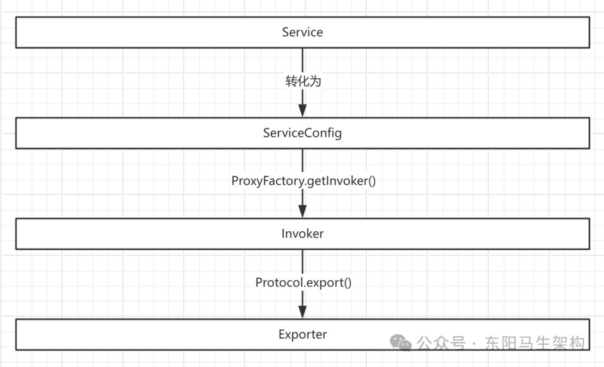
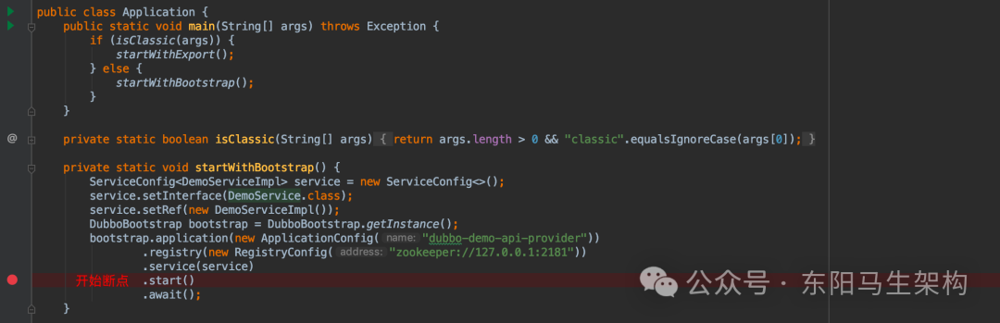
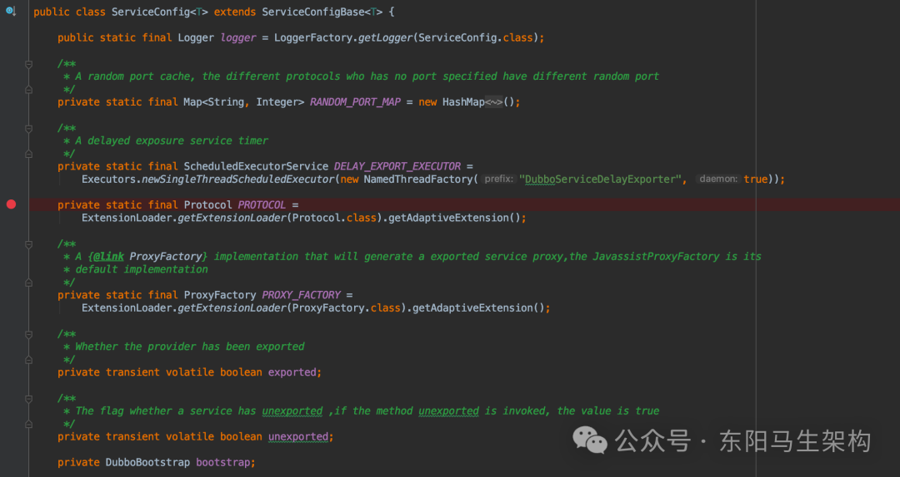
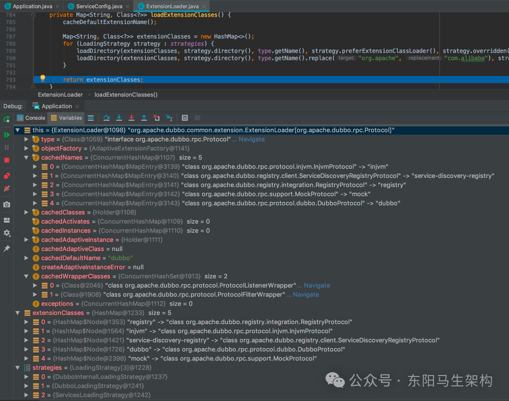
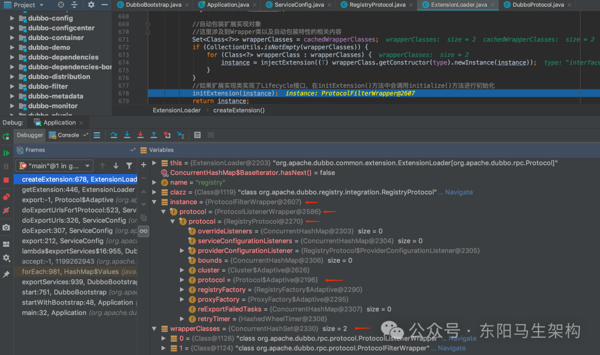
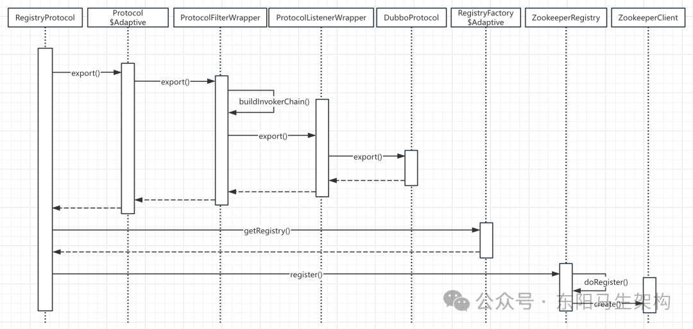

# Dubbo原理—14.集群之服务发布和引用流程

> **公众号**: 东阳马生架构  
> **发布时间**: 2025-08-02 20:00  

**大纲(22875字)**

- 1.服务发布全流程解析
- 2.服务引用全流程解析


## 1.服务发布全流程解析

### (1)服务发布入口

### (2)ServiceConfig服务配置

### (3)组装服务URL

### (4)服务发布入口

### (5)本地发布服务

### (6)远程发布服务

### (1)服务发布入口

dubbo-demo-api-provider示例的启动类如下：

```cs
//启动方式一：
//直接启动Provider
public class Application {
    public static void main(String[] args) throws Exception {
        if (isClassic(args)) {
            startWithExport();
        } else {
            startWithBootstrap();
        }
    }

    private static boolean isClassic(String[] args) {
        return args.length > 0 && "classic".equalsIgnoreCase(args[0]);
    }

    //通过DubboBootstrap来启动Provider
    private static void startWithBootstrap() {
        ServiceConfig<DemoServiceImpl> service = new ServiceConfig<>();
        service.setInterface(DemoService.class);
        service.setRef(new DemoServiceImpl());
        DubboBootstrap bootstrap = DubboBootstrap.getInstance();
        bootstrap.application(new ApplicationConfig("dubbo-demo-api-provider"))
            .registry(new RegistryConfig("zookeeper://127.0.0.1:2181"))
            .service(service)
            .start()
            .await();
    }

    private static void startWithExport() throws InterruptedException {
        ServiceConfig<DemoServiceImpl> service = new ServiceConfig<>();
        service.setInterface(DemoService.class);
        service.setRef(new DemoServiceImpl());
        service.setApplication(new ApplicationConfig("dubbo-demo-api-provider"));
        service.setRegistry(new RegistryConfig("zookeeper://127.0.0.1:2181"));

        service.export();
        System.out.println("dubbo service started");
        new CountDownLatch(1).await();
    }
}

//启动方式二：
//基于Spring + DubboBootstrap来启动Provider
public class DubboBootstrapApplicationListener extends OneTimeExecutionApplicationContextEventListener implements Ordered {
    private final DubboBootstrap dubboBootstrap;

    public DubboBootstrapApplicationListener() {
        this.dubboBootstrap = DubboBootstrap.getInstance();
    }

    @Override
    public void onApplicationContextEvent(ApplicationContextEvent event) {
        if (event instanceof ContextRefreshedEvent) {
            onContextRefreshedEvent((ContextRefreshedEvent) event);
        } else if (event instanceof ContextClosedEvent) {
            onContextClosedEvent((ContextClosedEvent) event);
        }
    }

    private void onContextRefreshedEvent(ContextRefreshedEvent event) {
        dubboBootstrap.start();
    }

    private void onContextClosedEvent(ContextClosedEvent event) {
        dubboBootstrap.stop();
    }

    @Override
    public int getOrder() {
        return LOWEST_PRECEDENCE;
    }
}
```

接下来以通过DubboBootstrap来启动Provider为例，来分析服务发布的流程。

DubboBootstrap的start()方法是Provider节点的启动入口，该方法会执行一些初始化操作和一些状态控制字段的更新。

DubboBootstrap的exportServices()方法是服务发布核心逻辑的入口。每个服务接口都会转换为对应的ServiceConfig实例，然后通过代理的方式转换成Invoker，最终再转换成Exporter进行发布。



```cs
public class DubboBootstrap extends GenericEventListener {
    private static DubboBootstrap instance;
    private AtomicBoolean started = new AtomicBoolean(false);
    private AtomicBoolean ready = new AtomicBoolean(true);
    ...

    public static synchronized DubboBootstrap getInstance() {
        if (instance == null) {
            instance = new DubboBootstrap();
        }
        return instance;
    }

    public DubboBootstrap start() {
        //CAS操作，保证启动一次
        if (started.compareAndSet(false, true)) {
            //用于判断当前节点是否已经启动完毕
            ready.set(false);

            //1.初始化一些基础组件，例如配置中心相关组件、事件监听、元数据相关组件
            initialize();
            if (logger.isInfoEnabled()) {
                logger.info(NAME + " is starting...");
            }

            //2.发布服务
            exportServices();
            if (!isOnlyRegisterProvider() || hasExportedServices()) {
                //3.用于暴露本地元数据服务
                exportMetadataService();

                //4.用于将服务实例注册到服务发现的注册中心
                registerServiceInstance();
            }

            //5.处理Consumer的ReferenceConfig
            referServices();
            if (asyncExportingFutures.size() > 0) {
                //异步发布服务
                //会启动一个线程监听发布是否完成，完成之后会将ready设置为true
                new Thread(() -> {
                    try {
                        this.awaitFinish();
                    } catch (Exception e) {
                        logger.warn(NAME + " exportAsync occurred an exception.");
                    }
                    ready.set(true);
                    if (logger.isInfoEnabled()) {
                        logger.info(NAME + " is ready.");
                    }
                }).start();
            } else {
                //同步发布服务成功之后，会将ready设置为true
                ready.set(true);
                if (logger.isInfoEnabled()) {
                    logger.info(NAME + " is ready.");
                }
            }

            if (logger.isInfoEnabled()) {
                logger.info(NAME + " has started.");
            }
        }
        return this;
    }

    private void exportServices() {
        //从配置管理器中获取到所有的要暴露的服务配置
        //一个接口类对应一个ServiceConfigBase实例
        configManager.getServices().forEach(sc -> {
            //转化为ServiceConfig
            ServiceConfig serviceConfig = (ServiceConfig) sc;
            serviceConfig.setBootstrap(this);

            //如果是异步模式，则获取一个线程池来异步进行服务发布
            if (exportAsync) {
                ExecutorService executor = executorRepository.getServiceExporterExecutor();
                Future<?> future = executor.submit(() -> {
                    //调用serviceConfig的export()方法发布服务
                    sc.export();
                    exportedServices.add(sc);
                });
                asyncExportingFutures.add(future);
            } else {
                //调用serviceConfig的export()方法发布服务
                sc.export();
                exportedServices.add(sc);
            }
        });
    }
    ...
}
```

### (2)ServiceConfig服务配置

在ServiceConfig的export()方法中，服务发布的步骤是：首先检查并更新各项配置，然后初始化元数据相关服务，接着根据当前配置决定是延迟发布还是调用doExport()方法立即发布，最后通过exported()方法回调相关监听器。

```java
public class ServiceConfig<T> extends ServiceConfigBase<T> {
    ...
    public synchronized void export() {
        if (!shouldExport()) {
            return;
        }

        if (bootstrap == null) {
            bootstrap = DubboBootstrap.getInstance();
            bootstrap.init();
        }

        //1.检查并更新各项配置
        checkAndUpdateSubConfigs();

        //2.初始化元数据相关服务
        serviceMetadata.setVersion(version);
        serviceMetadata.setGroup(group);
        serviceMetadata.setDefaultGroup(group);
        serviceMetadata.setServiceType(getInterfaceClass());
        serviceMetadata.setServiceInterfaceName(getInterface());
        serviceMetadata.setTarget(getRef());

        //3.根据当前配置决定是延迟发布还是调用doExport()方法立即发布
        if (shouldDelay()) {
            //延迟发布
            DELAY_EXPORT_EXECUTOR.schedule(this::doExport, getDelay(), TimeUnit.MILLISECONDS);
        } else {
            //立即发布
            doExport();
        }

        //4.回调监听器
        exported();
    }

    protected synchronized void doExport() {
        if (unexported) {
            throw new IllegalStateException("The service " + interfaceClass.getName() + " has already unexported!");
        }
        if (exported) {
            return;
        }

        exported = true;
        if (StringUtils.isEmpty(path)) {
            path = interfaceName;
        }
        doExportUrls();
    }

    private void doExportUrls() {
        ServiceRepository repository = ApplicationModel.getServiceRepository();
        ServiceDescriptor serviceDescriptor = repository.registerService(getInterfaceClass());
        repository.registerProvider(getUniqueServiceName(), ref, serviceDescriptor, this, serviceMetadata);
        //加载注册中心信息，也就是将RegistryConfig配置解析成registryUrl
        List<URL> registryURLs = ConfigValidationUtils.loadRegistries(this, true);

        //遍历所有的ProtocolConfig
        for (ProtocolConfig protocolConfig : protocols) {
            String pathKey = URL.buildKey(getContextPath(protocolConfig).map(p -> p + "/" + path).orElse(path), group, version);
            //In case user specified path, register service one more time to map it to path.
            repository.registerService(pathKey, interfaceClass);
            serviceMetadata.setServiceKey(pathKey);
            //调用doExportUrlsFor1Protocol()方法往每个注册中心发布服务
            doExportUrlsFor1Protocol(protocolConfig, registryURLs);
        }
    }
    ...
}
```

在ServiceConfig的doExportUrls()方法中，会调用loadRegistries()方法加载注册中心信息，也就是将RegistryConfig配置解析成registryUrl。

RegistryConfig是Dubbo的多个配置对象之一，可以通过解析XML、Annotation中注册中心相关的配置得到，对应的配置如下：

```javascript
<dubbo:registryaddress="zookeeper://127.0.0.1:2181"protocol="zookeeper"port="2181" />
```

registryUrl的格式大致如下：

```makefile
registry:
application=dubbo-demo-api-provider
&dubbo=2.0.2
&pid=9405
&registry=zookeeper
&timestamp=1600307343086
```

ServiceConfig的doExportUrls()方法加载注册中心信息得到RegistryUrl后，会遍历所有的ProtocolConfig，依次调用doExportUrlsFor1Protocol()方法往每个注册中心发布服务。

ServiceConfig的doExportUrlsFor1Protocol()方法的逻辑主要分为两部：一部分是组装服务的URL，另一部分就是服务发布。

注意：一个服务接口可以以多种协议进行发布，每种协议都对应一个ProtocolConfig。例如在Demo示例中，只使用了dubbo协议，对应的配置是：<dubbo:protocol />。

### (3)组装服务URL

步骤一：获取此次发布使用的协议，默认使用dubbo协议。

步骤二：设置服务URL中的参数。这里会从MetricsConfig、ApplicationConfig、ModuleConfig、ProviderConfig、ProtocolConfig获取配置信息，并作为参数添加到URL中。这里调用的appendParameters()方法会将AbstractConfig的配置信息存储到map中，后续在构造URL时，会将该集合中的kv作为URL的参数。

步骤三：解析指定方法的MethodConfig配置以及方法参数的ArgumentConfig配置。得到的配置信息也是记录到map中，后续作为URL参数。

步骤四：根据此次调用是泛化调用还是普通调用，向map添加不同的键值对。

步骤五：获取token配置，并添加到map中，默认随机生成UUID。

步骤六：获取host、port值，并组装服务的URL。

步骤七：根据Configurator覆盖或新增URL参数。

```typescript
public class ServiceConfig<T> extends ServiceConfigBase<T> {
    ...
    private void doExportUrlsFor1Protocol(ProtocolConfig protocolConfig, List<URL> registryURLs) {
        //步骤一：获取此次发布使用的协议，默认使用dubbo协议
        String name = protocolConfig.getName();
        if (StringUtils.isEmpty(name)) {
            //默认使用Dubbo协议
            name = DUBBO;
        }

        //步骤二：设置服务URL中的参数
        //从MetricsConfig、ApplicationConfig、ModuleConfig、ProviderConfig、ProtocolConfig获取配置信息，并作为参数添加到URL中
        //map用来记录URL的参数
        Map<String, String> map = new HashMap<String, String>();
        //side参数
        map.put(SIDE_KEY, PROVIDER_SIDE);
        //添加URL参数，例如Dubbo版本、时间戳、当前pid等
        ServiceConfig.appendRuntimeParameters(map);
        //下面会从各个Config获取参数，如application、interface参数等
        //这里调用的appendParameters()方法会将AbstractConfig的配置信息存储到map中
        //后续在构造URL时，会将该集合中的kv作为URL的参数
        AbstractConfig.appendParameters(map, getMetrics());
        AbstractConfig.appendParameters(map, getApplication());
        AbstractConfig.appendParameters(map, getModule());
        //remove 'default.' prefix for configs from ProviderConfig.appendParameters(map, provider, Constants.DEFAULT_KEY);
        AbstractConfig.appendParameters(map, provider);
        AbstractConfig.appendParameters(map, protocolConfig);
        AbstractConfig.appendParameters(map, this);
        MetadataReportConfig metadataReportConfig = getMetadataReportConfig();
        if (metadataReportConfig != null && metadataReportConfig.isValid()) {
            map.putIfAbsent(METADATA_KEY, REMOTE_METADATA_STORAGE_TYPE);
        }

        //步骤三：解析指定方法的MethodConfig配置以及方法参数的ArgumentConfig配置
        //得到的配置信息也是记录到map中，后续作为URL参数
        if (CollectionUtils.isNotEmpty(getMethods())) {
            for (MethodConfig method : getMethods()) {
                AbstractConfig.appendParameters(map, method, method.getName());
                String retryKey = method.getName() + ".retry";
                if (map.containsKey(retryKey)) {
                    String retryValue = map.remove(retryKey);
                    if ("false".equals(retryValue)) {
                        map.put(method.getName() + ".retries", "0");
                    }
                }
                List<ArgumentConfig> arguments = method.getArguments();
                if (CollectionUtils.isNotEmpty(arguments)) {
                    //从ArgumentConfig中获取URL参数
                    for (ArgumentConfig argument : arguments) {
                        //convert argument type
                        if (argument.getType() != null && argument.getType().length() > 0) {
                            Method[] methods = interfaceClass.getMethods();
                            //visit all methods
                            if (methods.length > 0) {
                                for (int i = 0; i < methods.length; i++) {
                                    String methodName = methods[i].getName();
                                    //target the method, and get its signature
                                    if (methodName.equals(method.getName())) {
                                        Class<?>[] argtypes = methods[i].getParameterTypes();
                                        //one callback in the method
                                        if (argument.getIndex() != -1) {
                                            if (argtypes[argument.getIndex()].getName().equals(argument.getType())) {
                                                AbstractConfig.appendParameters(map, argument, method.getName() + "." + argument.getIndex());
                                            } else {
                                                throw new IllegalArgumentException("Argument config error : the index attribute and type attribute not match :index :" + argument.getIndex() + ", type:" + argument.getType());
                                            }
                                        } else {
                                            //multiple callbacks in the method
                                            for (int j = 0; j < argtypes.length; j++) {
                                                Class<?> argclazz = argtypes[j];
                                                if (argclazz.getName().equals(argument.getType())) {
                                                    AbstractConfig.appendParameters(map, argument, method.getName() + "." + j);
                                                    if (argument.getIndex() != -1 && argument.getIndex() != j) {
                                                        throw new IllegalArgumentException("Argument config error : the index attribute and type attribute not match :index :" + argument.getIndex() + ", type:" + argument.getType());
                                                    }
                                                }
                                            }
                                        }
                                    }
                                }
                            }
                        } else if (argument.getIndex() != -1) {
                            AbstractConfig.appendParameters(map, argument, method.getName() + "." + argument.getIndex());
                        } else {
                            throw new IllegalArgumentException("Argument config must set index or type attribute.eg: <dubbo:argument index='0' .../> or <dubbo:argument type=xxx .../>");
                        }
                    }
                }
            }//end of methods for
        }

        //步骤四：根据此次调用是泛化调用还是普通调用，向map添加不同的键值对
        //根据generic是否为true，向map中添加不同的信息
        if (ProtocolUtils.isGeneric(generic)) {
            map.put(GENERIC_KEY, generic);
            map.put(METHODS_KEY, ANY_VALUE);
        } else {
            String revision = Version.getVersion(interfaceClass, version);
            if (revision != null && revision.length() > 0) {
                map.put(REVISION_KEY, revision);
            }
            String[] methods = Wrapper.getWrapper(interfaceClass).getMethodNames();
            if (methods.length == 0) {
                logger.warn("No method found in service interface " + interfaceClass.getName());
                map.put(METHODS_KEY, ANY_VALUE);
            } else {
                map.put(METHODS_KEY, StringUtils.join(new HashSet<String>(Arrays.asList(methods)), ","));
            }
        }

        //步骤五：获取token配置，并添加到map中，默认随机生成UUID
        if (ConfigUtils.isEmpty(token) && provider != null) {
            token = provider.getToken();
        }
        if (!ConfigUtils.isEmpty(token)) {
            if (ConfigUtils.isDefault(token)) {
                map.put(TOKEN_KEY, UUID.randomUUID().toString());
            } else {
                map.put(TOKEN_KEY, token);
            }
        }
        //将map数据放入serviceMetadata中，这与元数据相关，后面再详细介绍起作用
        serviceMetadata.getAttachments().putAll(map);

        //步骤六：获取host、port值，并组装服务的URL
        String host = findConfigedHosts(protocolConfig, registryURLs, map);
        Integer port = findConfigedPorts(protocolConfig, name, map);
        //根据上面获取的host、port以及前文获取的map集合组装URL
        URL url = new URL(name, host, port, getContextPath(protocolConfig).map(p -> p + "/" + path).orElse(path), map);

        //步骤七：根据Configurator覆盖或新增URL参数
        if (ExtensionLoader.getExtensionLoader(ConfiguratorFactory.class).hasExtension(url.getProtocol())) {
            url = ExtensionLoader.getExtensionLoader(ConfiguratorFactory.class)
                .getExtension(url.getProtocol()).getConfigurator(url).configure(url);
        }
        ...
    }
    ...
}
```

‍经过上述操作后，得到的服务URL如下所示：

```sql
dubbo:
anyhost=true
&application=dubbo-demo-api-provider
&bind.ip=172.17.108.185
&bind.port=20880
&default=true
&deprecated=false
&dubbo=2.0.2
&dynamic=true
&generic=false
&interface=org.apache.dubbo.demo.DemoService
&methods=sayHello,sayHelloAsync
&pid=3918
&release=
&side=provider
&timestamp=1600437404483
```

### (4)服务发布入口

ServiceConfig的doExportUrlsFor1Protocol()方法组装完服务URL后，便会开始执行服务发布。服务发布可以分为远程发布和本地发布，具体发布方式与服务URL中的scope参数有关。

scope参数有三个可选值，分别是none、remote和local，分别代表不发布、发布到本地和发布到注册中心。发布到本地的条件是scope != remote，发布到注册中心的条件是scope != local。

scope参数的默认值为null，也就是说，默认会同时在本地和注册中心发布该服务。

```cs
public class ServiceConfig<T> extends ServiceConfigBase<T> {
    ...
    private void doExportUrlsFor1Protocol(ProtocolConfig protocolConfig, List<URL> registryURLs) {
        ...
        //从URL中获取scope参数，其中可选值有none、remote、local
        //分别代表不发布、发布到本地以及发布到远端
        String scope = url.getParameter(SCOPE_KEY);
        //scope不为none，才进行发布
        if (!SCOPE_NONE.equalsIgnoreCase(scope)) {
            if (!SCOPE_REMOTE.equalsIgnoreCase(scope)) {
                //scope为local，只发布到本地
                exportLocal(url);
            }
            //scope为remote，发布到远端的注册中心
            if (!SCOPE_LOCAL.equalsIgnoreCase(scope)) {
                //当前配置了至少一个注册中心
                if (CollectionUtils.isNotEmpty(registryURLs)) {
                    //向每个注册中心发布服务
                    for (URL registryURL : registryURLs) {
                        //injvm协议只在exportLocal()中有用，不会将服务发布到注册中心
                        //所以这里忽略injvm协议
                        if (LOCAL_PROTOCOL.equalsIgnoreCase(url.getProtocol())){
                            continue;
                        }
                        //设置服务URL的dynamic参数
                        url = url.addParameterIfAbsent(DYNAMIC_KEY, registryURL.getParameter(DYNAMIC_KEY));
                        //创建monitorUrl，并作为monitor参数添加到服务URL中
                        URL monitorUrl = ConfigValidationUtils.loadMonitor(this, registryURL);
                        if (monitorUrl != null) {
                            url = url.addParameterAndEncoded(MONITOR_KEY, monitorUrl.toFullString());
                        }
                        //For providers, this is used to enable custom proxy to generate invoker
                        //设置服务URL的proxy参数，即生成动态代理方式(jdk或是javassist)，作为参数添加到RegistryURL中
                        String proxy = url.getParameter(PROXY_KEY);
                        if (StringUtils.isNotEmpty(proxy)) {
                            registryURL = registryURL.addParameter(PROXY_KEY, proxy);
                        }
                        //为服务实现类的对象创建相应的Invoker
                        //第三个参数中，会将服务URL作为export参数添加到RegistryURL
                        //这里的PROXY_FACTORY是ProxyFactory接口的适配器
                        Invoker<?> invoker = PROXY_FACTORY.getInvoker(ref, (Class) interfaceClass, registryURL.addParameterAndEncoded(EXPORT_KEY, url.toFullString()));
                        //DelegateProviderMetaDataInvoker是个装饰类
                        //该装饰类会将当前ServiceConfig和Invoker关联起来
                        //invoke()方法透传给底层Invoker对象
                        DelegateProviderMetaDataInvoker wrapperInvoker = new DelegateProviderMetaDataInvoker(invoker, this);
                        //调用Protocol实现，进行发布
                        //这里的PROTOCOL是Protocol接口的适配器
                        Exporter<?> exporter = PROTOCOL.export(wrapperInvoker);
                        exporters.add(exporter);
                    }
                } else {
                    //不存在注册中心，仅发布服务，不会将服务信息发布到注册中心
                    //Consumer没法在注册中心找到该服务的信息，但是可以直连
                    //具体的发布过程与上面的过程类似
                    if (logger.isInfoEnabled()) {
                        logger.info("Export dubbo service " + interfaceClass.getName() + " to url " + url);
                    }
                    Invoker<?> invoker = PROXY_FACTORY.getInvoker(ref, (Class) interfaceClass, url);
                    DelegateProviderMetaDataInvoker wrapperInvoker = new DelegateProviderMetaDataInvoker(invoker, this);
                    Exporter<?> exporter = PROTOCOL.export(wrapperInvoker);
                    exporters.add(exporter);
                }
                WritableMetadataService metadataService = WritableMetadataService.getExtension(url.getParameter(METADATA_KEY, DEFAULT_METADATA_STORAGE_TYPE));
                if (metadataService != null) {
                    metadataService.publishServiceDefinition(url);
                }
            }
        }
        this.urls.add(url);
    }
    ...
}
```

### (5)本地发布服务

#### 一.进行服务发布的PROTOCOL分析

#### 二.ServiceConfig如何进行本地发布

**
**

#### 一.进行服务发布的PROTOCOL分析







```typescript
public class ExtensionLoader<T> {
    private static final ConcurrentMap<Class<?>, ExtensionLoader<?>> EXTENSION_LOADERS = new ConcurrentHashMap<>(64);
    //当前ExtensionLoader实例负责加载扩展接口
    private final Class<?> type;
    private final ExtensionFactory objectFactory;
    //自适应(适配器)实例的缓存
    private final Holder<Object> cachedAdaptiveInstance = new Holder<>();
    private volatile Throwable createAdaptiveInstanceError;
    //自适应(适配器)类的缓存
    private volatile Class<?> cachedAdaptiveClass = null;
    //缓存了该ExtensionLoader加载的扩展名与扩展实现类之间的映射关系，cachedNames集合的反向关系缓存
    private final Holder<Map<String, Class<?>>> cachedClasses = new Holder<>();
    private static volatile LoadingStrategy[] strategies = loadLoadingStrategies();
    private Set<Class<?>> cachedWrapperClasses;
    ...

    private ExtensionLoader(Class<?> type) {
        this.type = type;
        //通过Dubbo SPI加载ExtensionFactory对象
        this.objectFactory = (type == ExtensionFactory.class ? null : ExtensionLoader.getExtensionLoader(ExtensionFactory.class).getAdaptiveExtension());
    }

    //此时的type为：interface org.apache.dubbo.rpc.Protocol
    public static <T> ExtensionLoader<T> getExtensionLoader(Class<T> type) {
        ...
        ExtensionLoader<T> loader = (ExtensionLoader<T>) EXTENSION_LOADERS.get(type);
        if (loader == null) {
            //传入type参数，创建一个ExtensionLoader对象
            EXTENSION_LOADERS.putIfAbsent(type, new ExtensionLoader<T>(type));
            loader = (ExtensionLoader<T>) EXTENSION_LOADERS.get(type);
        }
        return loader;
    }

    public T getAdaptiveExtension() {
        //检查cachedAdaptiveInstance是否缓存了自适应(适配器)实例
        //如果已缓存，则直接返回该实例
        Object instance = cachedAdaptiveInstance.get();
        if (instance == null) {
            if (createAdaptiveInstanceError != null) {
                throw new IllegalStateException("Failed to create adaptive instance: " + createAdaptiveInstanceError.toString(), createAdaptiveInstanceError);
            }
            synchronized (cachedAdaptiveInstance) {
                instance = cachedAdaptiveInstance.get();
                if (instance == null) {
                    try {
                        //创建一个自适应(适配器)实例
                        instance = createAdaptiveExtension();
                        //将适配器实例缓存到cachedAdaptiveInstance，然后返回适配器实例
                        cachedAdaptiveInstance.set(instance);
                    } catch (Throwable t) {
                        createAdaptiveInstanceError = t;
                        throw new IllegalStateException("Failed to create adaptive instance: " + t.toString(), t);
                    }
                }
            }
        }
        return (T) instance;
    }

    private T createAdaptiveExtension() {
        //调用injectExtension()方法进行自动装配，就能得到一个完整的适配器实例
        return injectExtension((T) getAdaptiveExtensionClass().newInstance());
    }

    private Class<?> getAdaptiveExtensionClass() {
        //调用getExtensionClasses()方法
        //其中会触发loadClass()方法，完成cachedAdaptiveClass字段的填充
        getExtensionClasses();

        //如果存在@Adaptive注解修饰的扩展实现类
        //那么该类就是适配器类，通过newInstance()将其实例化即可
        if (cachedAdaptiveClass != null) {
            return cachedAdaptiveClass;
        }

        //如果不存在@Adaptive注解修饰的扩展实现类
        //那么就需要通过createAdaptiveExtensionClass()方法扫描扩展接口中方法上的@Adaptive注解，动态生成适配器类，然后实例化
        return cachedAdaptiveClass = createAdaptiveExtensionClass();
    }

    private Map<String, Class<?>> getExtensionClasses() {
        Map<String, Class<?>> classes = cachedClasses.get();
        if (classes == null) {
            synchronized (cachedClasses) {
                classes = cachedClasses.get();
                if (classes == null) {
                    classes = loadExtensionClasses();
                    //此时，cachedClasses的值为：
                    //"registry" -> "class org.apache.dubbo.registry.integration.RegistryProtocol"
                    //"injvm" -> "class org.apache.dubbo.rpc.protocol.injvm.InjvmProtocol"
                    //"service-discovery-registry" -> "class org.apache.dubbo.registry.client.ServiceDiscoveryRegistryProtocol"
                    //"dubbo" -> "class org.apache.dubbo.rpc.protocol.dubbo.DubboProtocol"
                    //"mock" -> "class org.apache.dubbo.rpc.support.MockProtocol"
                    cachedClasses.set(classes);
                }
            }
        }
        return classes;
    }

    private Map<String, Class<?>> loadExtensionClasses() {
        cacheDefaultExtensionName();

        //1.加载dubbo-registry-api模块下"META-INF/dubbo/internal/org.apache.dubbo.rpc.Protocol"配置文件中的扩展实现类
        //registry=org.apache.dubbo.registry.integration.RegistryProtocolservice-discovery-registry=org.apache.dubbo.registry.client.ServiceDiscoveryRegistryProtocol
        //2.加载dubbo-rpc-injvm模块下"META-INF/dubbo/internal/org.apache.dubbo.rpc.Protocol"配置文件中的扩展实现类
        //injvm=org.apache.dubbo.rpc.protocol.injvm.InjvmProtocol
        //3.加载dubbo-rpc-dubbo模块下"META-INF/dubbo/internal/org.apache.dubbo.rpc.Protocol"配置文件中的扩展实现类
        //dubbo=org.apache.dubbo.rpc.protocol.dubbo.DubboProtocol
        //4.加载dubbo-rpc-api模块下"META-INF/dubbo/internal/org.apache.dubbo.rpc.Protocol"配置文件中的扩展实现类
        //mock=org.apache.dubbo.rpc.support.MockProtocol
        //5.加载dubbo-rpc-api模块下"META-INF/dubbo/internal/org.apache.dubbo.rpc.Protocol"配置文件中的扩展实现类
        //filter=org.apache.dubbo.rpc.protocol.ProtocolFilterWrapperlistener=org.apache.dubbo.rpc.protocol.ProtocolListenerWrapper
        Map<String, Class<?>> extensionClasses = new HashMap<>();

        //strategies列表为：DubboInternalLoadingStrategy、DubboLoadingStrategy、ServicesLoadingStrategy
        for (LoadingStrategy strategy : strategies) {
            loadDirectory(extensionClasses, strategy.directory(), type.getName(), strategy.preferExtensionClassLoader(), strategy.overridden(), strategy.excludedPackages());
            loadDirectory(extensionClasses, strategy.directory(), type.getName().replace("org.apache", "com.alibaba"), strategy.preferExtensionClassLoader(), strategy.overridden(), strategy.excludedPackages());
        }

        return extensionClasses;
    }

    private static LoadingStrategy[] loadLoadingStrategies() {
        return stream(load(LoadingStrategy.class).spliterator(), false).sorted().toArray(LoadingStrategy[]::new);
    }

    private void loadDirectory(Map<String, Class<?>> extensionClasses, String dir, String type, boolean extensionLoaderClassLoaderFirst, boolean overridden, String... excludedPackages) {
        String fileName = dir + type;
        Enumeration<java.net.URL> urls = null;
        ClassLoader classLoader = findClassLoader();

        // try to load from ExtensionLoader's ClassLoader first
        if (extensionLoaderClassLoaderFirst) {
            ClassLoader extensionLoaderClassLoader = ExtensionLoader.class.getClassLoader();
            if (ClassLoader.getSystemClassLoader() != extensionLoaderClassLoader) {
                urls = extensionLoaderClassLoader.getResources(fileName);
            }
        }

        if (urls == null || !urls.hasMoreElements()) {
            if (classLoader != null) {
                urls = classLoader.getResources(fileName);
            } else {
                urls = ClassLoader.getSystemResources(fileName);
            }
        }

        if (urls != null) {
            while (urls.hasMoreElements()) {
                java.net.URL resourceURL = urls.nextElement();
                //调用loadResource()方法
                loadResource(extensionClasses, classLoader, resourceURL, overridden, excludedPackages);
            }
        }
    }

    private void loadResource(Map<String, Class<?>> extensionClasses, ClassLoader classLoader, java.net.URL resourceURL, boolean overridden, String... excludedPackages)
        try (BufferedReader reader = new BufferedReader(new InputStreamReader(resourceURL.openStream(), StandardCharsets.UTF_8))) {
            String line;
            while ((line = reader.readLine()) != null) {
                final int ci = line.indexOf('#');
                if (ci >= 0) {
                    line = line.substring(0, ci);
                }
                line = line.trim();
                if (line.length() > 0) {
                    String name = null;
                    int i = line.indexOf('=');
                    if (i > 0) {
                        name = line.substring(0, i).trim();
                        line = line.substring(i + 1).trim();
                    }
                    if (line.length() > 0 && !isExcluded(line, excludedPackages)) {
                        //调用loadClass()方法
                        loadClass(extensionClasses, resourceURL, Class.forName(line, true, classLoader), name, overridden);
                    }
                }
            }
        }
    }

    private void loadClass(Map<String, Class<?>> extensionClasses, java.net.URL resourceURL, Class<?> clazz, String name, boolean overridden) throws NoSuchMethodException {
        if (clazz.isAnnotationPresent(Adaptive.class)) {
            //缓存到cachedAdaptiveClass字段
            cacheAdaptiveClass(clazz, overridden);
        } else if (isWrapperClass(clazz)) {
            //1.在isWrapperClass()方法中，会判断该扩展实现类是否包含拷贝构造函数
            //也就是构造函数只有一个参数且为扩展接口类型
            //如果包含，则为Wrapper类，这就是判断Wrapper类的标准
            //2.将Wrapper类记录到cachedWrapperClasses(Set<Class<?>>类型)这个属性中进行缓存
            //此时，会将dubbo-rpc-api模块下"META-INF/dubbo/internal/org.apache.dubbo.rpc.Protocol"配置文件中的两个扩展实现类缓存到cachedWrapperClasses属性中
            //filter=org.apache.dubbo.rpc.protocol.ProtocolFilterWrapper
            //listener=org.apache.dubbo.rpc.protocol.ProtocolListenerWrapper
            cacheWrapperClass(clazz);
        } else {
            //扩展实现类必须有无参构造函数
            clazz.getConstructor();
            if (StringUtils.isEmpty(name)) {
                name = findAnnotationName(clazz);
                if (name.length() == 0) {
                    throw new IllegalStateException("No such extension name for the class " + clazz.getName() + " in the config " + resourceURL);
                }
            }

            String[] names = NAME_SEPARATOR.split(name);
            if (ArrayUtils.isNotEmpty(names)) {
                //将包含@Activate注解的实现类缓存到cachedActivates集合中
                cacheActivateClass(clazz, names[0]);
                for (String n : names) {
                    cacheName(clazz, n);
                    saveInExtensionClass(extensionClasses, clazz, n, overridden);
                }
            }
        }
    }

    private void cacheWrapperClass(Class<?> clazz) {
        if (cachedWrapperClasses == null) {
            cachedWrapperClasses = new ConcurrentHashSet<>();
        }
        cachedWrapperClasses.add(clazz);
    }

    //由AdaptiveClassCodeGenerator来生成Protocol的自适应实现类：Protocol$Adaptive
    //然后返回这个Protocol$Adaptive实现类
    private Class<?> createAdaptiveExtensionClass() {
        String code = new AdaptiveClassCodeGenerator(type, cachedDefaultName).generate();
        ClassLoader classLoader = findClassLoader();
        org.apache.dubbo.common.compiler.Compiler compiler =
            ExtensionLoader.getExtensionLoader(org.apache.dubbo.common.compiler.Compiler.class).getAdaptiveExtension();
        return compiler.compile(code, classLoader);
    }

    //在createAdaptiveExtension()方法中，会调用该方法对Protocol$Adaptive实现类进行自动装配
    private T injectExtension(T instance) {
        //检测objectFactory字段
        if (objectFactory == null) {
            return instance;
        }

        try {
            for (Method method : instance.getClass().getMethods()) {
                //如果不是setter方法，忽略该方法(略)
                if (!isSetter(method)) {
                    continue;
                }
                //如果方法上明确标注了@DisableInject注解，忽略该方法
                if (method.getAnnotation(DisableInject.class) != null) {
                    continue;
                }
                Class<?> pt = method.getParameterTypes()[0];
                //如果参数为简单类型，忽略该setter方法(略)
                if (ReflectUtils.isPrimitives(pt)) {
                    continue;
                }
                try {
                    //根据setter方法的名称确定属性名称
                    String property = getSetterProperty(method);
                    //加载并实例化扩展实现类
                    Object object = objectFactory.getExtension(pt, property);
                    if (object != null) {
                        //调用setter方法进行装配
                        method.invoke(instance, object);
                    }
                } catch (Exception e) {
                    logger.error("Failed to inject via method " + method.getName() + " of interface " + type.getName() + ": " + e.getMessage(), e);
                }
            }
        } catch (Exception e) {
            logger.error(e.getMessage(), e);
        }
        return instance;
    }
    ...
}
```

生成的Protocol自适应(适配器)类如下，也就是说，ServiceConfig的PROTOCOL静态属性引用了这个Protocol$Adaptive对象。

```java
package org.apache.dubbo.rpc;
import org.apache.dubbo.common.extension.ExtensionLoader;

public class Protocol$Adaptive implements org.apache.dubbo.rpc.Protocol {
    public void destroy()  {
        throw new UnsupportedOperationException("The method public abstract void org.apache.dubbo.rpc.Protocol.destroy() of interface org.apache.dubbo.rpc.Protocol is not adaptive method!");
    }

    public int getDefaultPort()  {
        throw new UnsupportedOperationException("The method public abstract int org.apache.dubbo.rpc.Protocol.getDefaultPort() of interface org.apache.dubbo.rpc.Protocol is not adaptive method!");
    }

    public java.util.List getServers()  {
        throw new UnsupportedOperationException("The method public default java.util.List org.apache.dubbo.rpc.Protocol.getServers() of interface org.apache.dubbo.rpc.Protocol is not adaptive method!");
    }

    public org.apache.dubbo.rpc.Invoker refer(java.lang.Class arg0, org.apache.dubbo.common.URL arg1) throws org.apache.dubbo.rpc.RpcException {
        if (arg1 == null) throw new IllegalArgumentException("url == null");
        org.apache.dubbo.common.URL url = arg1;
        String extName = ( url.getProtocol() == null ? "dubbo" : url.getProtocol() );
        if (extName == null) throw new IllegalStateException("Failed to get extension (org.apache.dubbo.rpc.Protocol) name from url (" + url.toString() + ") use keys([protocol])");
        org.apache.dubbo.rpc.Protocol extension = (org.apache.dubbo.rpc.Protocol)ExtensionLoader.getExtensionLoader(org.apache.dubbo.rpc.Protocol.class).getExtension(extName);
        return extension.refer(arg0, arg1);
    }

    public org.apache.dubbo.rpc.Exporter export(org.apache.dubbo.rpc.Invoker arg0) throws org.apache.dubbo.rpc.RpcException {
        if (arg0 == null) throw new IllegalArgumentException("org.apache.dubbo.rpc.Invoker argument == null");
        if (arg0.getUrl() == null) throw new IllegalArgumentException("org.apache.dubbo.rpc.Invoker argument getUrl() == null");
        org.apache.dubbo.common.URL url = arg0.getUrl();
        String extName = ( url.getProtocol() == null ? "dubbo" : url.getProtocol() );
        if (extName == null) throw new IllegalStateException("Failed to get extension (org.apache.dubbo.rpc.Protocol) name from url (" + url.toString() + ") use keys([protocol])");
        org.apache.dubbo.rpc.Protocol extension = (org.apache.dubbo.rpc.Protocol)ExtensionLoader.getExtensionLoader(org.apache.dubbo.rpc.Protocol.class).getExtension(extName);
        return extension.export(arg0);
    }
}
```

**二. ServiceConfig如何进行本地发布**

ServiceConfig的exportLocal()方法进行本地发布时，首先会替换原来的服务URL得到新的服务URL，比如会将Protocol替换成injvm协议、host设置成127.0.0.1、port设置为0。

然后会通过ProxyFactory接口适配器找到对应的ProxyFactory实现(JavassistRpcProxyFactory)，并调用ProxyFactory实现的getInvoker()方法创建Invoker对象。

最后会通过Protocol接口适配器找到对应的Protocol实现(InjvmProtocol)，并调用该Protocol实现的export()方法进行本地发布。

```java
public class ServiceConfig<T> extends ServiceConfigBase<T> {
    private static final Protocol PROTOCOL =
        ExtensionLoader.getExtensionLoader(Protocol.class).getAdaptiveExtension();

    private static final ProxyFactory PROXY_FACTORY =
        ExtensionLoader.getExtensionLoader(ProxyFactory.class).getAdaptiveExtension();
    ...

    private void exportLocal(URL url) {
        //创建新URL，替换Protocol协议为injvm协议
        //比如传入的url = dubbo://192.168.1.2:20880/org.apache.dubbo.demo.DemoService?anyhost=true&application=dubbo-demo-api-provider&bind.ip=192.168.1.2&bind.port=20880&default=true&deprecated=false&dubbo=2.0.2&dynamic=true&generic=false&interface=org.apache.dubbo.demo.DemoService&methods=sayHello,sayHelloAsync&pid=742&release=&side=provider&timestamp=1723796850227
        //替换后的local = injvm://127.0.0.1/org.apache.dubbo.demo.DemoService?anyhost=true&application=dubbo-demo-api-provider&bind.ip=192.168.1.2&bind.port=20880&default=true&deprecated=false&dubbo=2.0.2&dynamic=true&generic=false&interface=org.apache.dubbo.demo.DemoService&methods=sayHello,sayHelloAsync&pid=742&release=&side=provider&timestamp=1723796850227
        URL local = URLBuilder.from(url)
            .setProtocol(LOCAL_PROTOCOL)
            .setHost(LOCALHOST_VALUE)
            .setPort(0)
            .build();

        //本地发布
        Exporter<?> exporter = PROTOCOL.export(
            PROXY_FACTORY.getInvoker(ref, (Class) interfaceClass, local)
        );
        exporters.add(exporter);
        logger.info("Export dubbo service " + interfaceClass.getName() + " to local registry url : " + local);
    }
    ...
}

@SPI("javassist")
public interface ProxyFactory {
    //为传入的Invoker对象创建代理对象，一般用于客户端引用服务时
    @Adaptive({PROXY_KEY})
    <T> T getProxy(Invoker<T> invoker) throws RpcException;

    @Adaptive({PROXY_KEY})
    <T> T getProxy(Invoker<T> invoker, boolean generic) throws RpcException;

    //将传入的代理对象封装成Invoker对象，一般用于服务端发布服务时
    @Adaptive({PROXY_KEY})
    <T> Invoker<T> getInvoker(T proxy, Class<T> type, URL url) throws RpcException;
}

public class JavassistProxyFactory extends AbstractProxyFactory {
    @Override
    public <T> T getProxy(Invoker<T> invoker, Class<?>[] interfaces) {
        return (T) Proxy.getProxy(interfaces).newInstance(new InvokerInvocationHandler(invoker));
    }

    @Override
    public <T> Invoker<T> getInvoker(T proxy, Class<T> type, URL url) {
        //通过Wrapper创建一个包装类对象
        final Wrapper wrapper = Wrapper.getWrapper(proxy.getClass().getName().indexOf('$') < 0 ? proxy.getClass() : type);

        //创建一个实现了AbstractProxyInvoker的匿名内部类
        //它的doInvoker()方法会直接委托给Wrapper对象的invokeMethod()方法
        return new AbstractProxyInvoker<T>(proxy, type, url) {
            @Override
            protected Object doInvoke(T proxy, String methodName, Class<?>[] parameterTypes, Object[] arguments) throws Throwable {
                return wrapper.invokeMethod(proxy, methodName, parameterTypes, arguments);
            }
        };
    }
}
```

由于ServiceConfig的PROTOCOL属性指向的是一个Protocol$Adaptive对象，所以会调用到Protocol$Adaptive对象的export()方法。

在该方法中，由于传入的Invoker对象的URL的Protocol协议由原来的dubbo替换为了injvm，所以加载的扩展实现对象为被层层封装的InjvmProtocol对象。

```java
package org.apache.dubbo.rpc;
import org.apache.dubbo.common.extension.ExtensionLoader;

public class Protocol$Adaptive implements org.apache.dubbo.rpc.Protocol {
    ...
    public org.apache.dubbo.rpc.Exporter export(org.apache.dubbo.rpc.Invoker arg0) throws org.apache.dubbo.rpc.RpcException {
        if (arg0 == null) throw new IllegalArgumentException("org.apache.dubbo.rpc.Invoker argument == null");
        if (arg0.getUrl() == null) throw new IllegalArgumentException("org.apache.dubbo.rpc.Invoker argument getUrl() == null");
        org.apache.dubbo.common.URL url = arg0.getUrl();
        //此时从url获取到的Protocol协议为injvm
        String extName = ( url.getProtocol() == null ? "dubbo" : url.getProtocol() );
        if (extName == null) throw new IllegalStateException("Failed to get extension (org.apache.dubbo.rpc.Protocol) name from url (" + url.toString() + ") use keys([protocol])");
        //加载扩展名为injvm的Protocol扩展实现，也就是InjvmProtocol
        //与初始化ServiceConfig的PROTOCOL属性不同的是：
        //这里调用的是ExtensionLoader的getExtension()方法根据扩展名获取扩展实现
        //初始化ServiceConfig的PROTOCOL属性时，调用的是ExtensionLoader的getAdaptiveExtension()方法获取自适应扩展实现
        org.apache.dubbo.rpc.Protocol extension = (org.apache.dubbo.rpc.Protocol)ExtensionLoader.getExtensionLoader(org.apache.dubbo.rpc.Protocol.class).getExtension(extName);
        return extension.export(arg0);
    }
}

public class ExtensionLoader<T> {
    ...
    //此时传入的name为injvm
    public T getExtension(String name) {
        ...
        //getOrCreateHolder()方法中封装了查找cachedInstances缓存的逻辑
        final Holder<Object> holder = getOrCreateHolder(name);
        Object instance = holder.get();
        if (instance == null) {
            //double-check防止并发问题
            synchronized (holder) {
                instance = holder.get();
                if (instance == null) {
                    //根据扩展名从SPI配置文件中查找对应的扩展实现类
                    instance = createExtension(name);
                    holder.set(instance);
                }
            }
        }
        return (T) instance;
    }

    //此时，传入的name为injvm
    private T createExtension(String name) {
        //获取cachedClasses缓存，根据扩展名从cachedClasses缓存中获取扩展实现类
        //如果cachedClasses未初始化，则会扫描前面介绍的三个SPI目录获取查找相应的SPI配置文件
        //然后加载其中的扩展实现类，最后将扩展名和扩展实现类的映射关系记录到cachedClasses缓存中
        //这部分逻辑在loadExtensionClasses()和loadDirectory()方法中
        Class<?> clazz = getExtensionClasses().get(name);
        if (clazz == null) {
            throw findException(name);
        }

        try {
            //根据扩展实现类从EXTENSION_INSTANCES缓存中查找相应的实例
            //如果查找失败，会通过反射创建扩展实现对象。
            T instance = (T) EXTENSION_INSTANCES.get(clazz);
            if (instance == null) {
                EXTENSION_INSTANCES.putIfAbsent(clazz, clazz.newInstance());
                instance = (T) EXTENSION_INSTANCES.get(clazz);
            }
            //此时的instance为InjvmProtocol对象实例
            //自动装配扩展实现对象中的属性，即调用其setter()方法
            //这里涉及到ExtensionFactory以及自动装配的相关内容
            injectExtension(instance);
            //自动包装扩展实现对象
            //这里涉及到Wrapper类以及自动包装特性的相关内容
            //cachedWrapperClasses会缓存dubbo-rpc-api模块下"META-INF/dubbo/internal/org.apache.dubbo.rpc.Protocol"配置文件中的两个扩展实现类：
            //filter=org.apache.dubbo.rpc.protocol.ProtocolFilterWrapper
            //listener=org.apache.dubbo.rpc.protocol.ProtocolListenerWrapper
            Set<Class<?>> wrapperClasses = cachedWrapperClasses;
            if (CollectionUtils.isNotEmpty(wrapperClasses)) {
                //先用ProtocolListenerWrapper对象装饰InjvmProtocol对象
                //再用ProtocolFilterWrapper对象装饰ProtocolListenerWrapper对象
                for (Class<?> wrapperClass : wrapperClasses) {
                    instance = injectExtension((T) wrapperClass.getConstructor(type).newInstance(instance));
                }
            }
            //如果扩展实现类实现了Lifecycle接口，在initExtension()方法中会调用initialize()方法进行初始化
            initExtension(instance);
            //返回的instance是一个ProtocolFilterWrapper对象
            //该ProtocolFilterWrapper对象会封装一个ProtocolListenerWrapper对象
            //而这个ProtocolListenerWrapper对象又会封装一个InjvmProtocol对象
            return instance;
        } catch (Throwable t) {
            throw new IllegalStateException("Extension instance (name: " + name + ", class: " + type + ") couldn't be instantiated: " + t.getMessage(), t);
        }
    }
    ...
}

public class ProtocolFilterWrapper implements Protocol {
    private final Protocol protocol;

    public ProtocolFilterWrapper(Protocol protocol) {
        if (protocol == null) {
            throw new IllegalArgumentException("protocol == null");
        }
        this.protocol = protocol;
    }

    @Override
    public <T> Exporter<T> export(Invoker<T> invoker) throws RpcException {
        if (UrlUtils.isRegistry(invoker.getUrl())) {
            return protocol.export(invoker);
        }
        return protocol.export(buildInvokerChain(invoker, SERVICE_FILTER_KEY, CommonConstants.PROVIDER));
    }
    ...
}

public class ProtocolListenerWrapper implements Protocol {
    private final Protocol protocol;

    public ProtocolListenerWrapper(Protocol protocol) {
        if (protocol == null) {
            throw new IllegalArgumentException("protocol == null");
        }
        this.protocol = protocol;
    }

    @Override
    public <T> Exporter<T> export(Invoker<T> invoker) throws RpcException {
        if (UrlUtils.isRegistry(invoker.getUrl())) {
            return protocol.export(invoker);
        }

        return new ListenerExporterWrapper<T>(protocol.export(invoker),
            Collections.unmodifiableList(
                ExtensionLoader.getExtensionLoader(ExporterListener.class)
                .getActivateExtension(invoker.getUrl(), EXPORTER_LISTENER_KEY)
            )
        );
    }
    ...
}

public class InjvmProtocol extends AbstractProtocol implements Protocol {
    ...
    @Override
    public <T> Exporter<T> export(Invoker<T> invoker) throws RpcException {
        return new InjvmExporter<T>(invoker, invoker.getUrl().getServiceKey(), exporterMap);
    }

    @Override
    public <T> Invoker<T> protocolBindingRefer(Class<T> serviceType, URL url) throws RpcException {
        return new InjvmInvoker<T>(serviceType, url, url.getServiceKey(), exporterMap);
    }
    ...
}
```

所以，可以得出本地发布时的核心调用路径如下：

```shell
-> ServiceConfig.PROTOCOL.export()
-> Protocol$Adaptive.export()
-> ProtocolFilterWrapper.export()
-> ProtocolFilterWrapper.buildInvokerChain()
-> ProtocolListenerWrapper.export()
-> InjvmProtocol.export()
```

### (6)远程发布服务

ServiceConfig的doExportUrlsFor1Protocol()方法进行远程发布服务时，会遍历全部registryURL，并且根据registryURL选择对应的Protocol扩展实现进行发布。由于registryURL使用的是registry协议，所以最后会调用RegistryProtocol的export()方法进行发布。

```java
public class ServiceConfig<T> extends ServiceConfigBase<T> {
    private static final Protocol PROTOCOL =
        ExtensionLoader.getExtensionLoader(Protocol.class).getAdaptiveExtension();
    ...

    private void doExportUrlsFor1Protocol(ProtocolConfig protocolConfig, List<URL> registryURLs) {
        ...
        //从URL中获取scope参数，其中可选值有none、remote、local
        //分别代表不发布、发布到本地以及发布到远端
        String scope = url.getParameter(SCOPE_KEY);
        //scope不为none，才进行发布
        if (!SCOPE_NONE.equalsIgnoreCase(scope)) {
            if (!SCOPE_REMOTE.equalsIgnoreCase(scope)) {
                //scope为local，只发布到本地
                exportLocal(url);
            }
            //scope为remote，发布到远端的注册中心
            if (!SCOPE_LOCAL.equalsIgnoreCase(scope)) {
                //当前配置了至少一个注册中心，比如registryURLs为：
                //["registry://127.0.0.1:2181/org.apache.dubbo.registry.RegistryService?application=dubbo-demo-api-provider&dubbo=2.0.2&pid=742&registry=zookeeper&timestamp=1723796842967"]
                if (CollectionUtils.isNotEmpty(registryURLs)) {
                    //向每个注册中心发布服务
                    for (URL registryURL : registryURLs) {
                        //injvm协议只在exportLocal()中有用，不会将服务发布到注册中心
                        //所以这里忽略injvm协议
                        if (LOCAL_PROTOCOL.equalsIgnoreCase(url.getProtocol())){
                            continue;
                        }
                        //设置服务URL的dynamic参数
                        url = url.addParameterIfAbsent(DYNAMIC_KEY, registryURL.getParameter(DYNAMIC_KEY));
                        //创建monitorUrl，并作为monitor参数添加到服务URL中
                        URL monitorUrl = ConfigValidationUtils.loadMonitor(this, registryURL);
                        if (monitorUrl != null) {
                            url = url.addParameterAndEncoded(MONITOR_KEY, monitorUrl.toFullString());
                        }
                        //For providers, this is used to enable custom proxy to generate invoker
                        //设置服务URL的proxy参数，即生成动态代理方式(jdk或是javassist)，作为参数添加到RegistryURL中
                        String proxy = url.getParameter(PROXY_KEY);
                        if (StringUtils.isNotEmpty(proxy)) {
                            registryURL = registryURL.addParameter(PROXY_KEY, proxy);
                        }
                        //为服务实现类的对象创建相应的Invoker
                        //第三个参数中，会将服务URL作为export参数添加到使用registry协议的registryURL
                        //这里的PROXY_FACTORY是ProxyFactory接口的适配器
                        Invoker<?> invoker = PROXY_FACTORY.getInvoker(ref, (Class) interfaceClass, registryURL.addParameterAndEncoded(EXPORT_KEY, url.toFullString()));
                        //DelegateProviderMetaDataInvoker是个装饰类
                        //该装饰类会将当前ServiceConfig和Invoker关联起来
                        //invoke()方法透传给底层Invoker对象
                        DelegateProviderMetaDataInvoker wrapperInvoker = new DelegateProviderMetaDataInvoker(invoker, this);
                        //调用Protocol实现，进行发布
                        //这里的PROTOCOL是Protocol接口的适配器
                        Exporter<?> exporter = PROTOCOL.export(wrapperInvoker);
                        exporters.add(exporter);
                    }
                } else {
                    //不存在注册中心，仅发布服务，不会将服务信息发布到注册中心
                    //Consumer没法在注册中心找到该服务的信息，但是可以直连
                    //具体的发布过程与上面的过程类似
                    if (logger.isInfoEnabled()) {
                        logger.info("Export dubbo service " + interfaceClass.getName() + " to url " + url);
                    }
                    Invoker<?> invoker = PROXY_FACTORY.getInvoker(ref, (Class) interfaceClass, url);
                    DelegateProviderMetaDataInvoker wrapperInvoker = new DelegateProviderMetaDataInvoker(invoker, this);
                    Exporter<?> exporter = PROTOCOL.export(wrapperInvoker);
                    exporters.add(exporter);
                }
                WritableMetadataService metadataService = WritableMetadataService.getExtension(url.getParameter(METADATA_KEY, DEFAULT_METADATA_STORAGE_TYPE));
                if (metadataService != null) {
                    metadataService.publishServiceDefinition(url);
                }
            }
        }
        this.urls.add(url);
    }
    ...
}
```

由于ServiceConfig的PROTOCOL属性指向的是一个Protocol$Adaptive对象，所以会调用到Protocol$Adaptive对象的export()方法。

在该方法中，由于传入的Invoker对象的URL的Protocol协议为registry，所以加载的扩展实现对象为被层层封装的RegistryProtocol对象。



```java
package org.apache.dubbo.rpc;
import org.apache.dubbo.common.extension.ExtensionLoader;

public class Protocol$Adaptive implements org.apache.dubbo.rpc.Protocol {
    ...
    public org.apache.dubbo.rpc.Exporter export(org.apache.dubbo.rpc.Invoker arg0) throws org.apache.dubbo.rpc.RpcException {
        if (arg0 == null) throw new IllegalArgumentException("org.apache.dubbo.rpc.Invoker argument == null");
        if (arg0.getUrl() == null) throw new IllegalArgumentException("org.apache.dubbo.rpc.Invoker argument getUrl() == null");
        org.apache.dubbo.common.URL url = arg0.getUrl();
        //此时从url获取到的Protocol协议为registry
        String extName = ( url.getProtocol() == null ? "dubbo" : url.getProtocol() );
        if (extName == null) throw new IllegalStateException("Failed to get extension (org.apache.dubbo.rpc.Protocol) name from url (" + url.toString() + ") use keys([protocol])");
        //加载扩展名为registry的Protocol扩展实现，也就是RegistryProtocol
        //与初始化ServiceConfig的PROTOCOL属性不同的是：
        //这里调用的是ExtensionLoader的getExtension()方法根据扩展名获取扩展实现
        //初始化ServiceConfig的PROTOCOL属性时，调用的是ExtensionLoader的getAdaptiveExtension()方法获取自适应扩展实现
        org.apache.dubbo.rpc.Protocol extension = (org.apache.dubbo.rpc.Protocol)ExtensionLoader.getExtensionLoader(org.apache.dubbo.rpc.Protocol.class).getExtension(extName);
        return extension.export(arg0);
    }
}

public class ExtensionLoader<T> {
    ...
    //此时传入的name为registry
    public T getExtension(String name) {
        ...
        //getOrCreateHolder()方法中封装了查找cachedInstances缓存的逻辑
        final Holder<Object> holder = getOrCreateHolder(name);
        Object instance = holder.get();
        if (instance == null) {
            //double-check防止并发问题
            synchronized (holder) {
                instance = holder.get();
                if (instance == null) {
                    //根据扩展名从SPI配置文件中查找对应的扩展实现类
                    instance = createExtension(name);
                    holder.set(instance);
                }
            }
        }
        return (T) instance;
    }

    //此时，传入的name为registry
    private T createExtension(String name) {
        //获取cachedClasses缓存，根据扩展名从cachedClasses缓存中获取扩展实现类
        //如果cachedClasses未初始化，则会扫描前面介绍的三个SPI目录获取查找相应的SPI配置文件
        //然后加载其中的扩展实现类，最后将扩展名和扩展实现类的映射关系记录到cachedClasses缓存中
        //这部分逻辑在loadExtensionClasses()和loadDirectory()方法中
        Class<?> clazz = getExtensionClasses().get(name);
        if (clazz == null) {
            throw findException(name);
        }

        //此时获取到的clazz为：org.apache.dubbo.registry.integration.RegistryProtocol
        try {
            //根据扩展实现类从EXTENSION_INSTANCES缓存中查找相应的实例
            //如果查找失败，会通过反射创建扩展实现对象。
            T instance = (T) EXTENSION_INSTANCES.get(clazz);
            if (instance == null) {
                EXTENSION_INSTANCES.putIfAbsent(clazz, clazz.newInstance());
                instance = (T) EXTENSION_INSTANCES.get(clazz);
            }
            //此时的instance为RegistryProtocol对象实例
            //自动装配扩展实现对象中的属性，即调用其setter()方法
            //这里涉及到ExtensionFactory以及自动装配的相关内容
            injectExtension(instance);
            //自动包装扩展实现对象
            //这里涉及到Wrapper类以及自动包装特性的相关内容
            //cachedWrapperClasses会缓存dubbo-rpc-api模块下"META-INF/dubbo/internal/org.apache.dubbo.rpc.Protocol"配置文件中的两个扩展实现类：
            //filter=org.apache.dubbo.rpc.protocol.ProtocolFilterWrapper
            //listener=org.apache.dubbo.rpc.protocol.ProtocolListenerWrapper
            Set<Class<?>> wrapperClasses = cachedWrapperClasses;
            if (CollectionUtils.isNotEmpty(wrapperClasses)) {
                //先用ProtocolListenerWrapper对象装饰InjvmProtocol对象
                //再用ProtocolFilterWrapper对象装饰ProtocolListenerWrapper对象
                for (Class<?> wrapperClass : wrapperClasses) {
                    instance = injectExtension((T) wrapperClass.getConstructor(type).newInstance(instance));
                }
            }
            //如果扩展实现类实现了Lifecycle接口，在initExtension()方法中会调用initialize()方法进行初始化
            initExtension(instance);
            //返回的instance是一个ProtocolFilterWrapper对象
            //该ProtocolFilterWrapper对象会封装一个ProtocolListenerWrapper对象
            //而这个ProtocolListenerWrapper对象又会封装一个RegistryProtocol对象
            return instance;
        } catch (Throwable t) {
            throw new IllegalStateException("Extension instance (name: " + name + ", class: " + type + ") couldn't be instantiated: " + t.getMessage(), t);
        }
    }

    //此时，传入的instance为RegistryProtocol对象实例
    //会将RegistryProtocol对象的protocol属性设置为Protocol$Adaptive自适应对象
    private T injectExtension(T instance) {
        //检测objectFactory字段
        if (objectFactory == null) {
            return instance;
        }

        //RegistryProtocol类中有几个setter方法：
        //setCluster()、setProtocol()、setRegistryFactory()、setProxyFactory()
        for (Method method : instance.getClass().getMethods()) {
            //如果不是setter方法，忽略该方法(略)
            if (!isSetter(method)) {
                continue;
            }
            //如果方法上明确标注了@DisableInject注解，忽略该方法
            if (method.getAnnotation(DisableInject.class) != null) {
                continue;
            }
            Class<?> pt = method.getParameterTypes()[0];
            //如果参数为简单类型，忽略该setter方法(略)
            if (ReflectUtils.isPrimitives(pt)) {
                continue;
            }
            //根据setter方法的名称确定属性名称
            String property = getSetterProperty(method);
            //加载并实例化扩展实现类
            //当method为setRegistryFactory()时，获取到的object为RegistryFactory$Adaptive自适应对象
            //当method为setProxyFactory()时，获取到的object为ProxyFactory$Adaptive自适应对象
            //当method为setProtocol()时，获取到的object为Protocol$Adaptive自适应对象
            //当method为setCluster()时，获取到的object为Cluster$Adaptive自适应对象
            Object object = objectFactory.getExtension(pt, property);
            if (object != null) {
                //调用setter方法进行装配
                method.invoke(instance, object);
            }
        }
        return instance;
    }
    ...
}

public class ProtocolFilterWrapper implements Protocol {
    private final Protocol protocol;

    public ProtocolFilterWrapper(Protocol protocol) {
        if (protocol == null) {
            throw new IllegalArgumentException("protocol == null");
        }
        this.protocol = protocol;
    }

    @Override
    public <T> Exporter<T> export(Invoker<T> invoker) throws RpcException {
        if (UrlUtils.isRegistry(invoker.getUrl())) {
            return protocol.export(invoker);
        }
        return protocol.export(buildInvokerChain(invoker, SERVICE_FILTER_KEY, CommonConstants.PROVIDER));
    }
    ...
}

public class ProtocolListenerWrapper implements Protocol {
    private final Protocol protocol;

    public ProtocolListenerWrapper(Protocol protocol) {
        if (protocol == null) {
            throw new IllegalArgumentException("protocol == null");
        }
        this.protocol = protocol;
    }

    @Override
    public <T> Exporter<T> export(Invoker<T> invoker) throws RpcException {
        if (UrlUtils.isRegistry(invoker.getUrl())) {
            return protocol.export(invoker);
        }

        return new ListenerExporterWrapper<T>(protocol.export(invoker),
            Collections.unmodifiableList(
                ExtensionLoader.getExtensionLoader(ExporterListener.class)
                .getActivateExtension(invoker.getUrl(), EXPORTER_LISTENER_KEY)
            )
        );
    }
    ...
}

public class RegistryProtocol implements Protocol {
    private Protocol protocol;

    //通过Dubbo SPI加载RegistryProtocol扩展实现时，会将protocol设置为Protocol$Adaptive自适应对象
    public void setProtocol(Protocol protocol) {
        this.protocol = protocol;
    }

    @Override
    public <T> Exporter<T> export(final Invoker<T> originInvoker) throws RpcException {
        //步骤一：准备URL
        //比如ProviderURL、RegistryURL和OverrideSubscribeUrl
        //将"registry://"协议(Remote URL)转换成"zookeeper://"协议(Registry URL)
        //获取到的registryUrl为："zookeeper://127.0.0.1:2181/org.apache.dubbo.registry.RegistryService?application=dubbo-demo-api-provider&dubbo=2.0.2&export=dubbo%3A%2F%2F192.168.1.2%3A20880%2Forg.apache.dubbo.demo.DemoService%3Fanyhost%3Dtrue%26application%3Ddubbo-demo-api-provider%26bind.ip%3D192.168.1.2%26bind.port%3D20880%26default%3Dtrue%26deprecated%3Dfalse%26dubbo%3D2.0.2%26dynamic%3Dtrue%26generic%3Dfalse%26interface%3Dorg.apache.dubbo.demo.DemoService%26methods%3DsayHello%2CsayHelloAsync%26pid%3D742%26release%3D%26side%3Dprovider%26timestamp%3D1723796850227&pid=742&timestamp=1723796842967"
        URL registryUrl = getRegistryUrl(originInvoker);
        //获取到的providerUrl为："dubbo://192.168.1.2:20880/org.apache.dubbo.demo.DemoService?anyhost=true&application=dubbo-demo-api-provider&bind.ip=192.168.1.2&bind.port=20880&default=true&deprecated=false&dubbo=2.0.2&dynamic=true&generic=false&interface=org.apache.dubbo.demo.DemoService&methods=sayHello,sayHelloAsync&pid=742&release=&side=provider&timestamp=1723796850227"
        URL providerUrl = getProviderUrl(originInvoker);
        final URL overrideSubscribeUrl = getSubscribedOverrideUrl(providerUrl);
        final OverrideListener overrideSubscribeListener = new OverrideListener(overrideSubscribeUrl, originInvoker);
        overrideListeners.put(overrideSubscribeUrl, overrideSubscribeListener);

        //步骤二：发布Dubbo服务
        //在doLocalExport()方法中调用DubboProtocol的export()方法启动Provider端底层Server
        providerUrl = overrideUrlWithConfig(providerUrl, overrideSubscribeListener);
        //发布服务，底层会通过会执行DubboProtocol的export()方法启动对应的Server
        //传入的providerUrl为dubbo协议的URL
        final ExporterChangeableWrapper<T> exporter = doLocalExport(originInvoker, providerUrl);

        //步骤三：注册Dubbo服务
        //在register()方法中调用ZookeeperRegistry的register()方法向Zookeeper注册服务
        //根据registryURL获取对应的注册中心Registry对象
        final Registry registry = getRegistry(originInvoker);
        //获取将要发布到注册中心上的Provider URL，其中会删除一些多余的参数信息
        final URL registeredProviderUrl = getUrlToRegistry(providerUrl, registryUrl);
        //根据register参数值决定是否注册服务
        boolean register = providerUrl.getParameter(REGISTER_KEY, true);
        if (register) {
            //调用Registry的register()方法将registeredProviderUrl发布到注册中心
            register(registryUrl, registeredProviderUrl);
        }
        //将Provider相关信息记录到的ProviderModel中
        registerStatedUrl(registryUrl, registeredProviderUrl, register);

        //步骤四：订阅Provider端的Override配置
        //调用ZookeeperRegistry的subscribe()方法订阅注册中心configurators节点下的配置变更
        //向注册中心进行订阅override数据，主要是监听该服务的configurators节点
        registry.subscribe(overrideSubscribeUrl, overrideSubscribeListener);

        exporter.setRegisterUrl(registeredProviderUrl);
        exporter.setSubscribeUrl(overrideSubscribeUrl);

        //步骤五：触发RegistryProtocolListener监听器
        notifyExport(exporter);

        return new DestroyableExporter<>(exporter);
    }

    private <T> ExporterChangeableWrapper<T> doLocalExport(final Invoker<T> originInvoker, URL providerUrl) {
        String key = getCacheKey(originInvoker);
        //RegistryProtocol的protocol指向Protocol$Adaptive自适应对象
        //传入export()方法的invokerDelegate中的URL使用的是dubbo协议
        //所以接下来又会调用Protocol$Adaptive的export()方法
        //但此时Protocol$Adaptive的export()方法会通过SPI加载DubboProtocol扩展实现
        //最后便会调用到DubboProtocol.export()方法发布服务
        return (ExporterChangeableWrapper<T>) bounds.computeIfAbsent(key, s -> {
            Invoker<?> invokerDelegate = new InvokerDelegate<>(originInvoker, providerUrl);
            return new ExporterChangeableWrapper<>((Exporter<T>) protocol.export(invokerDelegate), originInvoker);
        });
    }
    ...
}

public class DubboProtocol extends AbstractProtocol {
    ...
    @Override
    public <T> Exporter<T> export(Invoker<T> invoker) throws RpcException {
        URL url = invoker.getUrl();
        //创建ServiceKey
        String key = serviceKey(url);
        //将上层传入的Invoker对象封装成DubboExporter对象
        //然后记录到exporterMap集合中
        DubboExporter<T> exporter = new DubboExporter<T>(invoker, key, exporterMap);
        exporterMap.put(key, exporter);
        ...
        //启动ProtocolServer
        openServer(url);
        //序列化的优化处理
        optimizeSerialization(url);
        return exporter;
    }
    ...
}
```

所以，可以得出本地发布时的核心调用路径如下：

```shell
-> ServiceConfig.PROTOCOL.export()
-> Protocol$Adaptive.export()
-> ProtocolFilterWrapper.export()
-> ProtocolFilterWrapper.buildInvokerChain()
-> ProtocolListenerWrapper.export()
-> RegistryProtocol.export()
-> Protocol$Adaptive.export()
-> ProtocolFilterWrapper.export()
-> ProtocolFilterWrapper.buildInvokerChain()
-> ProtocolListenerWrapper.export()
-> DubboProtocol.export()
```

其中，RegistryProtocol的export()方法进行远程发布的步骤如下：

步骤一：准备URL，比如ProviderURL、RegistryURL和OverrideSubscribeUrl。

步骤二：发布Dubbo服务，在doLocalExport()方法中调用DubboProtocol的export()方法启动Provider端底层Server。

步骤三：注册Dubbo服务，在register()方法中调用ZookeeperRegistry的register()方法向Zookeeper注册服务。

步骤四：订阅Provider端的Override配置，调用ZookeeperRegistry的subscribe()方法订阅注册中心configurators节点下的配置变更。

步骤五：触发RegistryProtocolListener监听器。

RegistryProtocol的export()方法进行远程发布的流程图如下：



### (7)总结

这里介绍了Dubbo服务发布的核心流程。首先介绍了DubboBootstrap这个入口门面类中与服务发布相关的方法，重点是start()和exportServices()两个方法。然后介绍了ServiceConfig类的三个核心步骤：检查参数、立即(或延迟)执行doExport()方法进行发布、回调服务发布的相关监听器。接着介绍了doExportUrlsFor1Protocol()方法，它是发布一个服务的入口，也是规定服务发布流程的地方。其中涉及Provider URL的组装、本地服务发布流程以及远程服务发布流程。

## 2.服务引用全流程解析

### (1)服务引用入口

### (2)ReferenceConfigCache

### (3)ReferenceConfig

### (4)RegistryProtocol

### (5)总结

Dubbo支持两种方式引用远程的服务：

方式一：通过直连来引用服务，仅适合在调试服务的时候使用。

方式二：基于注册中心引用服务，这是生产环境中使用的服务引用方式。

### (1)服务引用入口

dubbo-demo-api-consumer示例的启动类如下：

```cs
public class Application {
    public static void main(String[] args) throws Exception {
        if (isClassic(args)) {
            runWithRefer();
        } else {
            runWithBootstrap();
        }
        Thread.sleep(10000000L);
    }

    private static boolean isClassic(String[] args) {
        return args.length > 0 && "classic".equalsIgnoreCase(args[0]);
    }

    private static void runWithBootstrap() throws IOException {
        ReferenceConfig<DemoService> reference = new ReferenceConfig<>();
        reference.setInterface(DemoService.class);
        reference.setGeneric("false");

        DubboBootstrap bootstrap = DubboBootstrap.getInstance();
        bootstrap.application(new ApplicationConfig("dubbo-demo-api-consumer"))
            .registry(new RegistryConfig("zookeeper://127.0.0.1:2181"))
            .reference(reference)
            .start();

        DemoService demoService = ReferenceConfigCache.getCache().get(reference);
        String message = demoService.sayHello("dubbo");
        System.out.println(message);
        CompletableFuture<String> dubbo = demoService.sayHelloAsync("dubbo");
        dubbo.whenComplete((s, throwable) -> System.out.println("+:" + s));
        System.in.read();
    }

    private static void runWithRefer() {
        ReferenceConfig<DemoService> reference = new ReferenceConfig<>();
        reference.setApplication(new ApplicationConfig("dubbo-demo-api-consumer"));
        reference.setRegistry(new RegistryConfig("zookeeper://127.0.0.1:2181"));
        reference.setInterface(DemoService.class);
        DemoService service = reference.get();
        String message = service.sayHello("dubbo");
        System.out.println(message);
    }
}
```

接下来以通过DubboBootstrap来启动Consumer为例，来分析服务引用的流程。

DubboBootstrap的start()方法除了会调用exportServices()方法完成服务发布之外，还会调用referServices()方法完成服务引用。

在DubboBootstrap的referServices()方法中，会遍历ConfigManager中的ReferenceConfig列表，并根据ReferenceConfig获取对应的代理对象。

在dubbo-demo-api-consumer示例中，可以看到构造ReferenceConfig对象的逻辑。这些新创建的ReferenceConfig对象会通过DubboBootstrap的reference()方法添加到ConfigManager中管理。

```typescript
public class DubboBootstrap extends GenericEventListener {
    private static DubboBootstrap instance;
    private AtomicBoolean started = new AtomicBoolean(false);
    private AtomicBoolean ready = new AtomicBoolean(true);
    private ReferenceConfigCache cache;
    private final ConfigManager configManager;
    private List<CompletableFuture<Object>> asyncReferringFutures = new ArrayList<>();

    //加载的是一个DefaultExecutorRepository实例
    private final ExecutorRepository executorRepository =
        ExtensionLoader.getExtensionLoader(ExecutorRepository.class).getDefaultExtension();
    ...

    public static synchronized DubboBootstrap getInstance() {
        if (instance == null) {
            instance = new DubboBootstrap();
        }
        return instance;
    }

    public DubboBootstrap start() {
        //CAS操作，保证启动一次
        if (started.compareAndSet(false, true)) {
            //用于判断当前节点是否已经启动完毕
            ready.set(false);

            //1.初始化一些基础组件，例如配置中心相关组件、事件监听、元数据相关组件
            initialize();
            if (logger.isInfoEnabled()) {
                logger.info(NAME + " is starting...");
            }

            //2.发布服务
            exportServices();
            if (!isOnlyRegisterProvider() || hasExportedServices()) {
                //3.用于暴露本地元数据服务
                exportMetadataService();
                //4.用于将服务实例注册到服务发现的注册中心
                registerServiceInstance();
            }

            //5.处理Consumer的ReferenceConfig
            referServices();
            if (asyncExportingFutures.size() > 0) {
                //异步发布服务
                //会启动一个线程监听发布是否完成，完成之后会将ready设置为true
                new Thread(() -> {
                    try {
                        this.awaitFinish();
                    } catch (Exception e) {
                        logger.warn(NAME + " exportAsync occurred an exception.");
                    }
                    ready.set(true);
                    if (logger.isInfoEnabled()) {
                        logger.info(NAME + " is ready.");
                    }
                }).start();
            } else {
                //同步发布服务成功之后，会将ready设置为true
                ready.set(true);
                if (logger.isInfoEnabled()) {
                    logger.info(NAME + " is ready.");
                }
            }
            if (logger.isInfoEnabled()) {
                logger.info(NAME + " has started.");
            }
        }
        return this;
    }

    public DubboBootstrap reference(ReferenceConfig<?> referenceConfig) {
        configManager.addReference(referenceConfig);
        return this;
    }

    private void referServices() {
        //初始ReferenceConfigCache
        if (cache == null) {
            cache = ReferenceConfigCache.getCache();
        }

        //遍历ReferenceConfig列表
        configManager.getReferences().forEach(rc -> {
            ReferenceConfig referenceConfig = (ReferenceConfig) rc;
            referenceConfig.setBootstrap(this);
            //检测ReferenceConfig是否已经初始化
            if (rc.shouldInit()) {
                if (referAsync) {
                    //通过线程池调用ReferenceConfigCache的get()方法
                    //ReferenceConfigCache的get()方法会根据ReferenceConfig获取对应的代理对象
                    CompletableFuture<Object> future =
                        ScheduledCompletableFuture.submit(
                            executorRepository.getServiceExporterExecutor(),
                            () -> cache.get(rc)
                        );
                    asyncReferringFutures.add(future);
                } else {
                    cache.get(rc);
                }
            }
        });
    }
    ...
}

public class ScheduledCompletableFuture {
    ...
    public static <T> CompletableFuture<T> submit(ScheduledExecutorService executor, Supplier<T> task) {
        CompletableFuture<T> completableFuture = new CompletableFuture<>();
        executor.submit(
            () -> {
                try {
                    return completableFuture.complete(task.get());
                } catch (Throwable t) {
                    return completableFuture.completeExceptionally(t);
                }
            }
        );
        return completableFuture;
    }
}

public class DefaultExecutorRepository implements ExecutorRepository {
    private ScheduledExecutorService serviceExporterExecutor;

    public DefaultExecutorRepository() {
        serviceExporterExecutor =
            Executors.newScheduledThreadPool(1, new NamedThreadFactory("Dubbo-exporter-scheduler"));
    }

    @Override
    public ScheduledExecutorService getServiceExporterExecutor() {
        return serviceExporterExecutor;
    }
    ...
}

public class ReferenceConfigCache {
    ...
    public <T> T get(ReferenceConfigBase<T> referenceConfig) {
        //生成服务提供方对应的Key
        String key = generator.generateKey(referenceConfig);
        //获取接口类型
        Class<?> type = referenceConfig.getInterfaceClass();
        //获取该接口对应代理对象集合
        proxies.computeIfAbsent(type, _t -> new ConcurrentHashMap<>());
        ConcurrentMap<String, Object> proxiesOfType = proxies.get(type);
        //根据Key获取服务提供方对应的代理对象
        proxiesOfType.computeIfAbsent(key, _k -> {
            //服务引用
            Object proxy = referenceConfig.get();
            //将ReferenceConfig记录到referredReferences集合
            referredReferences.put(key, referenceConfig);
            return proxy;
        });
        return (T) proxiesOfType.get(key);
    }
    ...
}
```

### (2)ReferenceConfigCache

服务引用的核心实现在ReferenceConfig之中，一个ReferenceConfig对象对应一个服务接口，每个ReferenceConfig对象中都封装了与注册中心的网络连接以及与Provider的网络连接。

为了避免底层连接泄漏造成性能问题，Dubbo提供了ReferenceConfigCache用于缓存ReferenceConfig实例。

在dubbo-demo-api-consumer示例中，可以看到ReferenceConfigCache的基本使用方式：

```cs
public class Application {
    ...
    private static void runWithBootstrap() throws IOException {
        ReferenceConfig<DemoService> reference = new ReferenceConfig<>();
        reference.setInterface(DemoService.class);
        reference.setGeneric("false");

        DubboBootstrap bootstrap = DubboBootstrap.getInstance();
        bootstrap.application(new ApplicationConfig("dubbo-demo-api-consumer"))
            .registry(new RegistryConfig("zookeeper://127.0.0.1:2181"))
            .reference(reference)
            .start();

        DemoService demoService = ReferenceConfigCache.getCache().get(reference);
        String message = demoService.sayHello("dubbo");
        System.out.println(message);
        CompletableFuture<String> dubbo = demoService.sayHelloAsync("dubbo");
        dubbo.whenComplete((s, throwable) -> System.out.println("+:" + s));
        System.in.read();
    }
    ...
}
```

ReferenceConfigCache维护了一个静态Map(CACHE_HOLDER)，其中key是由Group、服务接口和version构成，value是一个ReferenceConfigCache对象。

在ReferenceConfigCache的构造方法中，可以传入一个KeyGenerator用来修改缓存key的生成逻辑。默认的KeyGenerator实现是ReferenceConfigCache中的匿名内部类，其对象由DEFAULT_KEY_GENERATOR这个静态字段引用。

在DubboBootstrap的referServices()方法中，首先会调用ReferenceConfigCache的getCache()方法往CACHE_HOLDER中添加一个key为DEFAULT的ReferenceConfigCache对象，该对象会使用默认的KeyGenerator实现。

接下来无论是同步进行服务引用还是异步进行服务引用，都会调用ReferenceConfigCache的get()方法创建并缓存代理对象，其中会通过ReferenceConfig的get()方法来创建代理对象。

```typescript
public class ReferenceConfigCache {
    public static final String DEFAULT_NAME = "_DEFAULT_";

    //其中key是由Group、服务接口和version构成，value是一个ReferenceConfigCache对象
    static final ConcurrentMap<String, ReferenceConfigCache> CACHE_HOLDER =
        new ConcurrentHashMap<String, ReferenceConfigCache>();

    //Create the key with the Group, Interface and version attribute of ReferenceConfigBase.
    //key example: group1/org.apache.dubbo.foo.FooService:1.0.0
    public static final KeyGenerator DEFAULT_KEY_GENERATOR = referenceConfig -> {
        //获取服务接口名称
        String iName = referenceConfig.getInterface();
        if (StringUtils.isBlank(iName)) {
            Class<?> clazz = referenceConfig.getInterfaceClass();
            iName = clazz.getName();
        }
        if (StringUtils.isBlank(iName)) {
            throw new IllegalArgumentException("No interface info in ReferenceConfig" + referenceConfig);
        }
        StringBuilder ret = new StringBuilder();
        if (!StringUtils.isBlank(referenceConfig.getGroup())) {
            ret.append(referenceConfig.getGroup()).append("/");
        }
        ret.append(iName);
        if (!StringUtils.isBlank(referenceConfig.getVersion())) {
            ret.append(":").append(referenceConfig.getVersion());
        }
        //key的格式是group/interface:version
        return ret.toString();
    };

    private final String name;

    //KeyGenerator可以用来修改缓存key的生成逻辑
    private final KeyGenerator generator;

    //该集合用来存储已经被处理的ReferenceConfig对象
    private final ConcurrentMap<String, ReferenceConfigBase<?>> referredReferences = new ConcurrentHashMap<>();

    //该集合用来存储服务接口的全部代理对象
    //第一层key是服务接口的类型
    //第二层key是KeyGenerator为不同服务提供方生成的key，value是服务的代理对象
    private final ConcurrentMap<Class<?>, ConcurrentMap<String, Object>> proxies = new ConcurrentHashMap<>();

    private ReferenceConfigCache(String name, KeyGenerator generator) {
        this.name = name;
        this.generator = generator;
    }

    //Get the cache use default name and #DEFAULT_KEY_GENERATOR to generate cache key.
    //Create cache if not existed yet.
    public static ReferenceConfigCache getCache() {
        return getCache(DEFAULT_NAME);
    }

    //Get the cache use specified name and KeyGenerator.
    //Create cache if not existed yet.
    public static ReferenceConfigCache getCache(String name) {
        return getCache(name, DEFAULT_KEY_GENERATOR);
    }

    //Get the cache use specified KeyGenerator.
    //Create cache if not existed yet.
    public static ReferenceConfigCache getCache(String name, KeyGenerator keyGenerator) {
        return CACHE_HOLDER.computeIfAbsent(name, k -> new ReferenceConfigCache(k, keyGenerator));
    }

    //创建并缓存代理对象
    public <T> T get(ReferenceConfigBase<T> referenceConfig) {
        //生成服务提供方对应的Key
        String key = generator.generateKey(referenceConfig);
        //获取接口类型
        Class<?> type = referenceConfig.getInterfaceClass();
        //获取该接口对应代理对象集合
        proxies.computeIfAbsent(type, _t -> new ConcurrentHashMap<>());
        ConcurrentMap<String, Object> proxiesOfType = proxies.get(type);
        //根据key获取服务提供方对应的代理对象
        proxiesOfType.computeIfAbsent(key, _k -> {
            //服务引用，创建代理对象
            Object proxy = referenceConfig.get();
            //将ReferenceConfig记录到referredReferences集合
            referredReferences.put(key, referenceConfig);
            return proxy;
        });
        return (T) proxiesOfType.get(key);
    }
    ...
}

public interface KeyGenerator {
    String generateKey(ReferenceConfigBase<?> referenceConfig);
}
```

### (3)ReferenceConfig

ReferenceConfig是服务引用的真正入口。

ReferenceConfig的get()方法会返回相关的代理对象，如果代理对象为null，则调用init()方法进行创建和初始化。

ReferenceConfig的init()方法会对服务引用的配置进行处理以保证配置的正确性，其中的核心逻辑是调用createProxy()方法创建代理对象，调用之前会从配置中获取createProxy()方法需要的参数。

ReferenceConfig的createProxy()方法则处理了多种服务引用的场景，如直连单个或多个Provider、依赖注册中心的单个或多个Provider。

```cs
public class ReferenceConfig<T> extends ReferenceConfigBase<T> {
    //whether this ReferenceConfig has been destroyed
    private transient volatile boolean destroyed;

    //The interface proxy reference
    private transient volatile T ref;

    //The invoker of the reference service
    private transient volatile Invoker<?> invoker;

    //The flag whether the ReferenceConfig has been initialized
    private transient volatile boolean initialized;

    private DubboBootstrap bootstrap;
    ...

    public synchronized T get() {
        //检测当前ReferenceConfig状态
        if (destroyed) {
            throw new IllegalStateException("The invoker of ReferenceConfig(" + url + ") has already destroyed!");
        }
        //创建并返回代理对象
        //其中ref指向了服务的代理对象
        if (ref == null) {
            //初始化ref字段
            init();
        }
        return ref;
    }

    public synchronized void init() {
        //检测ReferenceConfig的初始化状态
        if (initialized) {
            return;
        }
        //检测DubboBootstrap的初始化状态
        if (bootstrap == null) {
            bootstrap = DubboBootstrap.getInstance();
            bootstrap.init();
        }
        ...
        Map<String, String> map = new HashMap<String, String>();
        //添加side参数
        map.put(SIDE_KEY, CONSUMER_SIDE);
        //添加ip参数
        map.put(REGISTER_IP_KEY, hostToRegistry);
        ...
        //调用createProxy()方法创建代理对象，赋值给ref属性
        ref = createProxy(map);
        ...
        initialized = true;

        //触发ReferenceConfigInitializedEvent事件
        dispatch(new ReferenceConfigInitializedEvent(this, invoker));
    }
    ...
}
```

其中，createProxy()方法的核心流程如下：

步骤一：根据传入的参数集合判断协议是否为injvm协议。如果是，直接通过InjvmProtocol引用服务。

步骤二：构造urls集合。Dubbo支持直连Provider和依赖注册中心两种服务引用方式。如果是通过直连Provider的方式进行服务引用，则可以根据url参数指定一个或者多个Provider地址，这些地址会被解析并填充到urls集合中。如果是通过依赖注册中心的方式进行服务引用，则会调用AbstractInterfaceConfig的loadRegistries()方法加载注册中心里的Provider地址。

步骤三：如果urls集合中只记录了一个URL，则通过Protocol适配器选择合适的Protocol扩展实现来创建Invoker对象。如果是直连Provider的场景，则URL为dubbo协议，这里就会使用DubboProtocol这个实现。如果是依赖注册中心的场景，则使用RegistryProtocol这个实现。

步骤四：如果urls集合中记录了多个URL，在依赖注册中心的场景中，则使用ZoneAwareCluster作为Cluster的默认实现来生成对应的Invoker对象。在直连Provider的场景中，则使用Cluster适配器选择合适的扩展实现生成Invoker对象。

步骤五：通过ProxyFactory适配器选择合适的ProxyFactory扩展实现，然后将Invoker对象包装成服务接口的代理对象。

由此可见，createProxy()方法中有两个核心：一是通过Protocol适配器选择合适的Protocol扩展实现创建Invoker对象，二是通过ProxyFactory适配器选择合适的ProxyFactory扩展实现创建代理对象。

```java
public class ReferenceConfig<T> extends ReferenceConfigBase<T> {
    private static final Protocol REF_PROTOCOL =
        ExtensionLoader.getExtensionLoader(Protocol.class).getAdaptiveExtension();
    private static final Cluster CLUSTER =
        ExtensionLoader.getExtensionLoader(Cluster.class).getAdaptiveExtension();
    private static final ProxyFactory PROXY_FACTORY =
        ExtensionLoader.getExtensionLoader(ProxyFactory.class).getAdaptiveExtension();
    //The url of the reference service
    protected final List<URL> urls = new ArrayList<URL>();
    //The interface name of the reference service
    protected String interfaceName;
    //The interface class of the reference service
    protected Class<?> interfaceClass;
    //The invoker of the reference service
    private transient volatile Invoker<?> invoker;
    ...

    private T createProxy(Map<String, String> map) {
        //步骤一：根据传入的参数集合判断协议是否为injvm协议
        //即根据url的协议、scope以及injvm等参数检测是否需要本地引用
        //如果是，直接通过InjvmProtocol引用服务
        if (shouldJvmRefer(map)) {
            //创建injvm协议的URL
            URL url = new URL(LOCAL_PROTOCOL, LOCALHOST_VALUE, 0, interfaceClass.getName()).addParameters(map);
            //通过Protocol的适配器选择对应的Protocol实现创建Invoker对象
            invoker = REF_PROTOCOL.refer(interfaceClass, url);
            if (logger.isInfoEnabled()) {
                logger.info("Using injvm service " + interfaceClass.getName());
            }
        } else {
            //步骤二：构造urls集合
            urls.clear();
            if (url != null && url.length() > 0) {
                //配置多个URL的时候，会用分号进行切分
                String[] us = SEMICOLON_SPLIT_PATTERN.split(url);
                //url不为空，表明用户可能想进行点对点调用
                if (us != null && us.length > 0) {
                    for (String u : us) {
                        URL url = URL.valueOf(u);
                        if (StringUtils.isEmpty(url.getPath())) {
                            //设置接口全限定名为URL Path
                            url = url.setPath(interfaceName);
                        }
                        //检测URL协议是否为registry
                        //如果是，则说明用户想使用指定的注册中心
                        if (UrlUtils.isRegistry(url)) {
                            //这里会将map中的参数整理成一个参数添加到refer参数中
                            urls.add(url.addParameterAndEncoded(REFER_KEY, StringUtils.toQueryString(map)));
                        } else {
                            //将map中的参数添加到url中
                            urls.add(ClusterUtils.mergeUrl(url, map));
                        }
                    }
                }
            } else {
                //assemble URL from register center's configuration
                //if protocols not injvm checkRegistry
                //如果是通过注册中心的方式进行服务引用
                //则会调用AbstractInterfaceConfig的loadRegistries()方法加载注册中心里的Provider地址
                if (!LOCAL_PROTOCOL.equalsIgnoreCase(getProtocol())) {
                    checkRegistry();
                    //加载注册中心里的Provider地址RegistryURL
                    List<URL> us = ConfigValidationUtils.loadRegistries(this, false);
                    if (CollectionUtils.isNotEmpty(us)) {
                        for (URL u : us) {
                            URL monitorUrl = ConfigValidationUtils.loadMonitor(this, u);
                            if (monitorUrl != null) {
                                map.put(MONITOR_KEY, URL.encode(monitorUrl.toFullString()));
                            }
                            //将map中的参数整理成refer参数，添加到RegistryURL中
                            urls.add(u.addParameterAndEncoded(REFER_KEY, StringUtils.toQueryString(map)));
                        }
                    }
                    //既不是直连Provider，也没有依赖注册中心，则抛出异常
                    if (urls.isEmpty()) {
                        throw new IllegalStateException("No such any registry to reference " + interfaceName + " on the consumer " + NetUtils.getLocalHost() + " use dubbo version " + Version.getVersion() + ", please config <dubbo:registry address=\"...\" /> to your spring config.");
                    }
                }
            }

            //核心一：通过Protocol适配器选择合适的Protocol扩展实现创建Invoker对象
            //步骤三：如果urls集合中只记录了一个URL
            //则通过Protocol适配器选择合适的Protocol扩展实现创建Invoker对象
            if (urls.size() == 1) {
                //注册中心单Provider或直连单个服务提供方时，通过Protocol的适配器选择对应的Protocol实现创建Invoker对象
                invoker = REF_PROTOCOL.refer(interfaceClass, urls.get(0));
            } else {
                //注册中心多Provider或直连多个服务提供方时，根据每个URL创建Invoker对象
                List<Invoker<?>> invokers = new ArrayList<Invoker<?>>();
                URL registryURL = null;
                for (URL url : urls) {
                    invokers.add(REF_PROTOCOL.refer(interfaceClass, url));
                    //确定是依赖注册中心，还是直连Provider
                    if (UrlUtils.isRegistry(url)) {
                        registryURL = url;
                    }
                }
                //步骤四：如果urls集合中记录了多个URL
                if (registryURL != null) {
                    //在依赖注册中心的场景中，则使用ZoneAwareCluster作为Cluster的默认实现，生成对应的Invoker对象
                    URL u = registryURL.addParameterIfAbsent(CLUSTER_KEY, ZoneAwareCluster.NAME);
                    invoker = CLUSTER.join(new StaticDirectory(u, invokers));
                } else {
                    //在直连Provider的场景中，则使用Cluster适配器选择合适的扩展实现
                    invoker = CLUSTER.join(new StaticDirectory(invokers));
                }
            }
        }
        ...

        //元数据处理相关的逻辑
        String metadata = map.get(METADATA_KEY);
        WritableMetadataService metadataService = WritableMetadataService.getExtension(metadata == null ? DEFAULT_METADATA_STORAGE_TYPE : metadata);
        if (metadataService != null) {
            URL consumerURL = new URL(CONSUMER_PROTOCOL, map.remove(REGISTER_IP_KEY), 0, map.get(INTERFACE_KEY), map);
            metadataService.publishServiceDefinition(consumerURL);
        }

        //核心二：通过ProxyFactory适配器选择合适的ProxyFactory扩展实现创建代理对象
        //步骤五：通过ProxyFactory适配器选择合适的ProxyFactory扩展实现
        //然后将Invoker对象包装成服务接口的代理对象
        return (T) PROXY_FACTORY.getProxy(invoker, ProtocolUtils.isGeneric(generic));
    }
    ...
}
```

### (4)RegistryProtocol

在直连Provider的场景中，会使用DubboProtocol的refer()方法完成服务引用。在依赖注册中心的场景中，则会使用RegistryProtocol的refer()方法完成服务引用。

RegistryProtocol的refer()方法会先根据URL获取注册中心的URL，再调用doRefer()方法生成Invoker对象。

在RegistryProtocol的doRefer()方法中，首先会根据URL创建RegistryDirectory实例，然后生成Subscribe URL并进行注册，接着通过Registry订阅服务，最后通过Cluster将多个Invoker对象合并成一个Invoker对象返回给上层。

```typescript
public class RegistryProtocol implements Protocol {
    ...
    @Override
    @SuppressWarnings("unchecked")
    public <T> Invoker<T> refer(Class<T> type, URL url) throws RpcException {
        //从URL中获取注册中心的URL
        url = getRegistryUrl(url);
        //获取Registry实例，这里的RegistryFactory对象是通过Dubbo SPI的自动装载机制注入的
        Registry registry = registryFactory.getRegistry(url);
        if (RegistryService.class.equals(type)) {
            return proxyFactory.getInvoker((T) registry, type, url);
        }

        //group="a,b" or group="*"
        //从注册中心URL的refer参数中获取此次服务引用的一些参数，其中就包括group
        Map<String, String> qs = StringUtils.parseQueryString(url.getParameterAndDecoded(REFER_KEY));
        String group = qs.get(GROUP_KEY);
        if (group != null && group.length() > 0) {
            if ((COMMA_SPLIT_PATTERN.split(group)).length > 1 || "*".equals(group)) {
                //如果此次可以引用多个group的服务，则Cluser实现使用MergeableCluster实现，
                //这里的getMergeableCluster()方法就会通过Dubbo SPI方式找到MergeableCluster实例
                return doRefer(getMergeableCluster(), registry, type, url);
            }
        }
        //如果没有group参数或是group参数，则通过Cluster适配器选择Cluster实现
        return doRefer(cluster, registry, type, url);
    }

    private <T> Invoker<T> doRefer(Cluster cluster, Registry registry, Class<T> type, URL url) {
        //根据URL创建RegistryDirectory实例
        RegistryDirectory<T> directory = new RegistryDirectory<T>(type, url);
        directory.setRegistry(registry);
        directory.setProtocol(protocol);

        //生成SubscribeUrl并进行注册
        //协议为consumer，具体的参数是RegistryURL中refer参数指定的参数
        Map<String, String> parameters = new HashMap<String, String>(directory.getConsumerUrl().getParameters());
        URL subscribeUrl = new URL(CONSUMER_PROTOCOL, parameters.remove(REGISTER_IP_KEY), 0, type.getName(), parameters);
        if (directory.isShouldRegister()) {
            //在SubscribeUrl中添加category=consumers和check=false参数
            directory.setRegisteredConsumerUrl(subscribeUrl);
            //服务注册，在Zookeeper的consumers节点下，添加该Consumer对应的节点
            registry.register(directory.getRegisteredConsumerUrl());
        }
        //根据SubscribeUrl创建服务路由
        directory.buildRouterChain(subscribeUrl);
        //订阅服务，toSubscribeUrl()方法会将SubscribeUrl中category参数修改为"providers,configurators,routers"
        //RegistryDirectory的subscribe()方法会通过Registry订阅服务，同时还会添加相应的监听器
        directory.subscribe(toSubscribeUrl(subscribeUrl));

        //注册中心中可能包含多个Provider，相应地也就有多个Invoker
        //这里通过前面选择的Cluster将多个Invoker对象封装成一个Invoker对象
        Invoker<T> invoker = cluster.join(directory);

        //根据URL中的registry.protocol.listener参数加载相应的监听器实现
        List<RegistryProtocolListener> listeners = findRegistryProtocolListeners(url);
        if (CollectionUtils.isEmpty(listeners)) {
            return invoker;
        }

        //为了方便在监听器中回调，这里将此次引用使用到的Directory对象、Cluster对象、Invoker对象以及SubscribeUrl
        //封装到一个RegistryInvokerWrapper中，传递给监听器中
        RegistryInvokerWrapper<T> registryInvokerWrapper = new RegistryInvokerWrapper<>(directory, cluster, invoker, subscribeUrl);
        for (RegistryProtocolListener listener : listeners) {
            listener.onRefer(this, registryInvokerWrapper);
        }
        return registryInvokerWrapper;
    }
    ...
}
```

### (5)总结

这里主要介绍了Dubbo服务引用的整个流程。首先介绍了DubboBootStrap这个入口门面类与服务引用相关的方法，其中涉及referServices()、reference()等核心方法。接着介绍了ReferenceConfigCache这个ReferenceConfig缓存，以及ReferenceConfig实现服务引用的核心流程。最后还介绍了RegistryProtocol从注册中心引用服务的核心实现。
