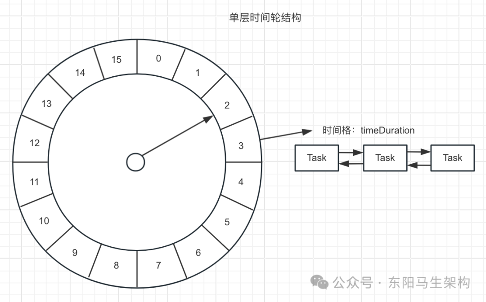
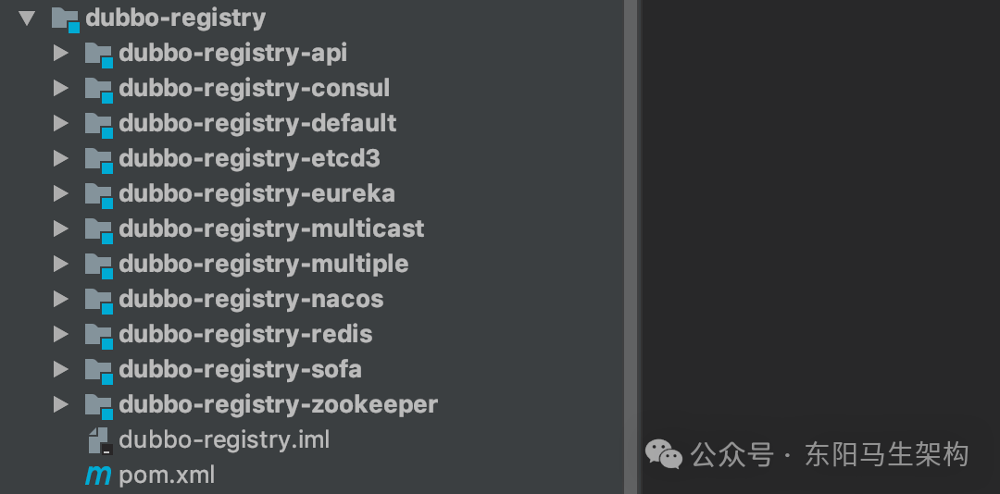
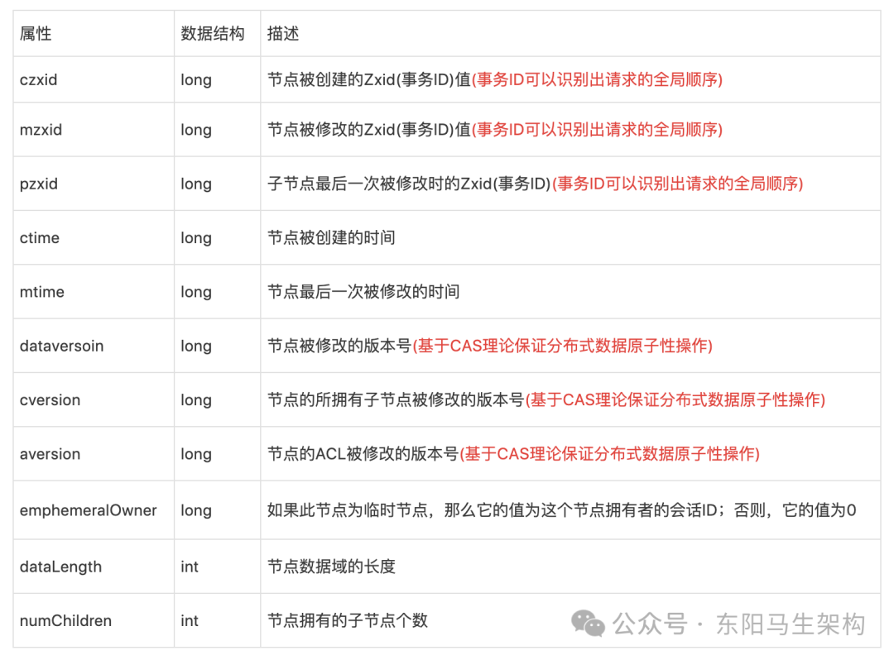
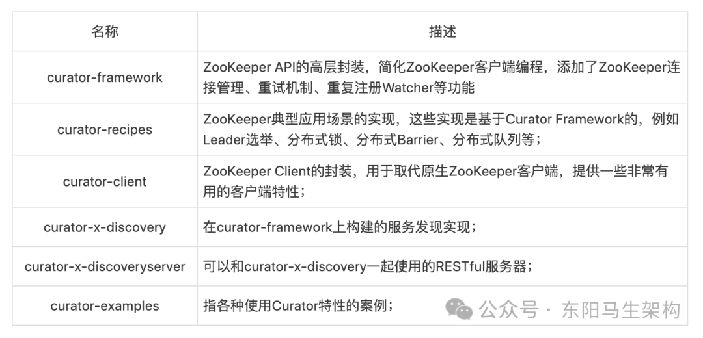
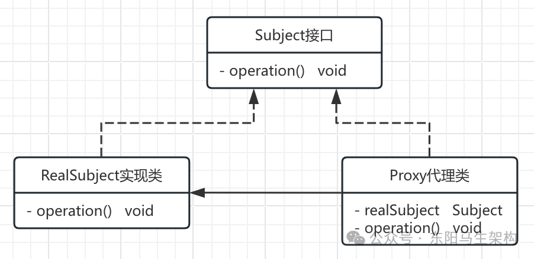

# Dubbo原理—2.相关基础之时间轮+zk+代理

> **公众号**: 东阳马生架构  
> **发布时间**: 2025-07-18 09:00  

**大纲(18856字)**

- 1.一个时间轮搞定海量定时任务
- 2.ZooKeeper与Curator，别用ZkClient
- 3.代理模式与常见实现


## 1.一个时间轮搞定海量定时任务

### (1)时间轮简介

### (2)Dubbo时间轮的核心接口

### (3)Dubbo时间轮的HashedWheelTimeout

### (4)Dubbo时间轮的HashedWheelBucket

### (5)Dubbo时间轮的HashedWheelTimer

### (6)Dubbo中如何使用定时任务

### (7)总结

### (1)时间轮简介

时间轮其实就是定时器。在很多开源框架中，都需要定时任务的管理功能，例如ZooKeeper、Netty、Quartz、Kafka以及Linux操作系统。

其中，JDK提供的java.util.Timer和DelayedQueue等工具类，可以帮助我们实现简单的定时任务管理。其底层实现使用的是堆这种数据结构，存取操作的复杂度都是O(nlog(n))，无法支持大量的定时任务。

在定时任务量比较大、性能要求比较高的场景中，为了将定时任务的存取操作以及取消操作的时间复杂度降为O(1)，一般会使用时间轮的方式，时间轮是一种高效的、批量管理定时任务的调度模型。

时间轮一般会实现成一个环形结构，类似一个时钟分为很多槽，一个槽代表一个时间间隔，每个槽使用双向链表存储定时任务，指针会周期性地跳动，跳动到一个槽位就执行该槽位的定时任务。



需要注意的是，单层时间轮的容量和精度都是有限的，对于精度要求特别高、时间跨度特别大或是海量定时任务需要调度的场景，通常会使用多级时间轮以及持久化存储与时间轮结合的方案。

那么在Dubbo中，时间轮的具体实现方式是怎样的呢？Dubbo的时间轮实现位于dubbo-common模块的org.apache.dubbo.common.timer包中。

### (2)Dubbo时间轮的核心接口

在Dubbo中，所有的定时任务都要继承TimerTask接口。

一.TimerTask接口非常简单，只定义了一个run()方法，该方法的入参是一个Timeout接口的对象。

```java
public interface TimerTask {
    /**
     * Executed after the delay specified with {@link Timer#newTimeout(TimerTask, long, TimeUnit)}.
     * @param timeout a handle which is associated with this task
     */
    void run(Timeout timeout) throws Exception;
}
```

Timeout对象与TimerTask对象一一对应：两者的关系类似于线程池返回的Future对象与提交到线程池中的任务对象之间的关系。通过Timeout对象，我们不仅可以查看定时任务的状态，还可以操作定时任务(例如取消关联的定时任务)。

二.Timeout接口中的方法如下所示：

```cs
public interface Timeout {
    //返回Timer时间轮对象
    Timer timer();

    //返回TimerTask这个定时任务对象
    TimerTask task();

    //查看定时任务状态是否已过期
    boolean isExpired();

    //查看定时任务状态是否已取消
    boolean isCancelled();

    //取消关联的定时任务
    boolean cancel();
}
```

三.Timer接口定义了时间轮的基本行为，如下所示。其核心是newTimeout()方法：提交一个定时任务(TimerTask对象)并返回关联的Timeout对象，类似于向线程池提交任务。

```cs
public interface Timer {
    //提交一个定时任务(TimerTask对象)并返回关联的Timeout对象
    Timeout newTimeout(TimerTask task, long delay, TimeUnit unit);

    // Releases all resources acquired by this {@link Timer} and cancels all tasks which were scheduled but not executed yet.
    Set<Timeout> stop();

    // the timer is stop
    boolean isStop();
}
```

### (3)Dubbo时间轮的HashedWheelTimeout

HashedWheelTimeout是Timeout接口的唯一实现，是HashedWheelTimer的内部类。HashedWheelTimeout扮演了两个角色：

```
角色一：时间轮中双向链表的节点；
角色二：定时任务TimerTask提交到HashedWheelTimer之后返回的句柄(Handle)，用于在时间轮外部查看和控制定时任务；
```

HashedWheelTimeout中的核心字段如下：

```objectivec
字段一：prev、next(HashedWheelTimeout类型)
分别对应当前定时任务在链表中的前驱节点和后继节点；

字段二：task(TimerTask类型)
指向实际被调度的任务；

字段三：deadline(long类型)
指定时任务执行的时间；
这个时间是在创建HashedWheelTimeout时指定的，计算公式是(时间单位为纳秒)：
currentTime(创建HashedWheelTimeout的时间) + delay(任务延迟时间) - startTime(HashedWheelTimer的启动时间)；

字段四：state(volatile int类型)
指定时任务当前所处状态，可选的有三个，分别是INIT(0)、CANCELLED(1)和EXPIRED(2)；
分别表示定时任务当前处于初始化状态、已取消状态、和已过期状态；
另外，还有一个STATE_UPDATER字段(AtomicIntegerFieldUpdater类型)，用于实现state状态变更的原子性；

字段五：remainingRounds(long类型)
表示当前任务剩余的时钟周期数；
时间轮所能表示的时间长度是有限的，在任务到期时间与当前时刻的时间差，超过时间轮单圈能表示的时长，
就出现了套圈的情况，需要该字段值表示剩余的时钟周期，也就是剩余的圈数；
```

HashedWheelTimeout中的核心方法如下：

```cs
方法一：isCancelled()、isExpired()、state()
主要用于检查当前HashedWheelTimeout状态；

方法二：cancel()
会将当前HashedWheelTimeout的状态设置为CANCELLED，
并将当前HashedWheelTimeout添加到cancelledTimeouts队列中等待销毁；

方法三：expire()
当任务到期时，会调用该方法将当前HashedWheelTimeout设置为EXPIRED状态，
然后调用其中的TimerTask的run()方法执行定时任务；

方法四：remove()
将当前HashedWheelTimeout从时间轮中删除；
```

### (4)Dubbo时间轮的HashedWheelBucket

HashedWheelBucket是时间轮中的一个槽，时间轮中的槽实际上就是一个用于缓存和管理双向链表的容器。双向链表中的每一个节点就是一个HashedWheelTimeout对象，也就关联了一个TimerTask定时任务。

HashedWheelBucket持有双向链表的首尾两个节点，分别是head和tail两个字段，再加上每个HashedWheelTimeout节点均持有前驱和后继的引用，这样就可以正向或是逆向遍历整个双向链表了。

下面看HashedWheelBucket中的核心方法：

```cs
方法一：addTimeout()
新增HashedWheelTimeout到双向链表的尾部；

方法二：pollTimeout()
移除双向链表中的头结点并将其返回；

方法三：remove()
从双向链表中移除指定的HashedWheelTimeout节点；

方法四：clearTimeouts()
循环调用pollTimeout()方法处理整个双向链表，并返回所有未超时或者未被取消的定时任务；

方法五：expireTimeouts()
遍历双向链表中的全部HashedWheelTimeout节点；
在处理到期的定时任务时，会通过remove()方法取出，并调用其expire()方法执行；
对于已取消的任务，通过remove()方法取出后直接丢弃；
对于未到期的任务，会将remainingRounds字段(剩余时钟周期数)减一；
```

### (5)Dubbo时间轮的HashedWheelTimer

HashedWheelTimer是Timer接口的实现，它通过时间轮算法实现了一个定时器。

HashedWheelTimer会根据当前时间轮指针选定对应的槽(HashedWheelBucket)，从双向链表的头部开始迭代，对每个定时任务(HashedWheelTimeout)进行计算，属于当前时钟周期则取出运行，不属于则将其剩余的时钟周期数减一操作。

下面看HashedWheelTimer的核心属性：

```cs
属性一：workerState(volatile int类型)
时间轮当前所处状态，可选值有init、started、shutdown；分别表示时间轮的初始化状态、已启动状态和关闭状态；
同时，有相应的AtomicIntegerFieldUpdater实现workerState字段的原子修改；

属性二：startTime(long类型)
当前时间轮的启动时间，提交到该时间轮的定时任务的deadline字段值均以该时间戳为起点进行计算；

属性三：wheel(HashedWheelBucket[]类型)
该数组就是时间轮的环形队列，每一个元素都是一个槽；
当指定时间轮槽数为n时，实际上会取大于且最靠近n的2的幂次方值；

属性四：timeouts、cancelledTimeouts(LinkedBlockingQueue类型)
timeouts队列用于缓冲外部提交时间轮中的定时任务，cancelledTimeouts队列用于暂存取消的定时任务；
HashedWheelTimer会在处理HashedWheelBucket的双向链表之前，先处理这两个队列中的数据；

属性五：tick(long类型)
该字段在HashedWheelTimer内部类Worker中，是时间轮的指针，是一个步长为1的单调递增计数器；

属性六：mask(int类型)
掩码， mask = wheel.length - 1，执行tick & mask便能定位到对应的时钟槽；

属性七：ticksDuration(long类型)
时间指针每次加1所代表的实际时间，单位为纳秒；

属性八：pendingTimeouts(AtomicLong类型)
当前时间轮剩余的定时任务总数；

属性九：workerThread(Thread类型)
时间轮内部真正执行定时任务的线程；

属性十：worker(Worker类型)
真正执行定时任务的逻辑封装这个Runnable对象中；
```

时间轮对外提供了一个newTimeout()接口用于提交定时任务，在定时任务进入到timeouts队列之前会先调用start()方法启动时间轮，其中会完成下面两个关键步骤：

```
步骤一：确定时间轮的startTime字段；
步骤二：启动workerThread线程，开始执行worker任务；
```

之后根据startTime计算该定时任务的deadline字段，最后才能将定时任务封装成HashedWheelTimeout并添加到timeouts队列。

下面分析时间轮指针一次转动的全流程：

步骤一：时间轮指针转动，时间轮周期开始。

步骤二：清理用户主动取消的定时任务，这些定时任务在用户取消时，会记录到cancelledTimeouts队列中。在每次指针转动的时候，时间轮都会清理该队列。

步骤三：将缓存在timeouts队列中的定时任务转移到时间轮中对应的槽中。

步骤四：根据当前指针定位对应槽，处理该槽位的双向链表中的定时任务。

步骤五：检测时间轮的状态：如果时间轮处于运行状态，则循环执行上述步骤，不断执行定时任务。如果时间轮处于停止状态，则执行下面的步骤获取未被执行的定时任务并加入unprocessedTimeouts队列。这些任务有两个来源：来源一是遍历时间轮中每个槽位，并调用clearTimeouts()方法。来源二是对timeouts队列中未被加入槽中循环调用poll()。

步骤六：最后再次清理cancelledTimeouts队列中用户主动取消的定时任务。

上述核心逻辑在HashedWheelTimer内部类Worker的run()方法中：

```cs
public void run() {
    // Initialize the startTime.
    startTime = System.nanoTime();
    if (startTime == 0) {
        // We use 0 as an indicator for the uninitialized value here, so make sure it's not 0 when initialized.
        startTime = 1;
    }

    // Notify the other threads waiting for the initialization at start().
    startTimeInitialized.countDown();
    do {
        final long deadline = waitForNextTick();
        if (deadline > 0) {
            int idx = (int) (tick & mask);
            processCancelledTasks();
            HashedWheelBucket bucket = wheel[idx];
            transferTimeoutsToBuckets();
            bucket.expireTimeouts(deadline);
            tick++;
        }
    } while (WORKER_STATE_UPDATER.get(HashedWheelTimer.this) == WORKER_STATE_STARTED);

    // Fill the unprocessedTimeouts so we can return them from stop() method.
    for (HashedWheelBucket bucket : wheel) {
        bucket.clearTimeouts(unprocessedTimeouts);
    }

    for (; ; ) {
        HashedWheelTimeout timeout = timeouts.poll();
        if (timeout == null) {
            break;
        }
        if (!timeout.isCancelled()) {
            unprocessedTimeouts.add(timeout);
        }
    }
    processCancelledTasks();
}
```

### (6)Dubbo中如何使用定时任务

在Dubbo中，时间轮并不直接用于周期性操作，而是只向时间轮提交执行单次的定时任务。在上一次任务执行完成时，任务会调用newTimeout()方法再次提交当前任务，这样就会在下个周期执行该任务。即使在任务执行过程中出现了GC、IO阻塞等情况，导致任务延迟或卡住，也不会有同样的任务源源不断地提交进来，导致任务堆积。

Dubbo中对时间轮的应用主要体现在如下两个方面：

应用一：失败重试

例如Provider向注册中心进行注册失败时的重试操作，或是Consumer向注册中心订阅时的失败重试等。

应用二：周期性定时任务

例如定期发送心跳请求，请求超时处理，或是网络连接断开后的重连机制。

### (7)总结

这里重点介绍了Dubbo中时间轮相关的内容：首先介绍了JDK提供的Timer定时器以及DelayedQueue等工具类的问题，并说明了时间轮的解决方案。然后深入讲解了Dubbo对时间轮的抽象，以及具体实现细节。最后还说明了Dubbo中时间轮的应用场景。

问题：如果存在海量定时任务，并且这些任务的开始时间跨度非常长，则该如何对时间轮进行扩展来处理这些定时任务？

## 2.ZooKeeper与Curator，别用ZkClient

### (1)ZooKeeper核心概念

### (2)消息广播流程概述

### (3)崩溃恢复

### (4)ZooKeeper的核心概念以及工作原理总结

### (5)ZooKeeper客户端

### (6)Apache Curator基础

### (7)curator-x-discovery扩展库

### (8)curator-recipes简介

### (9)Apache Curator总结

在前面介绍Dubbo简化架构时提到过：Dubbo Provider在启动时会将自身的服务信息整理成URL注册到注册中心，Dubbo Consumer在启动时会向注册中心订阅感兴趣的Provider信息，之后Provider和Consumer才能建立连接进行后续的交互。

可见，一个稳定、高效的注册中心对基于Dubbo的微服务来说是至关重要的。Dubbo目前支持Consul、etcd、Nacos、ZooKeeper、Redis等多种开源组件作为注册中心，并且在Dubbo源码也有相应的接入模块，如下所示：



Dubbo官方推荐使用ZooKeeper作为注册中心，ZooKeeper是在实际生产中最常用的注册中心实现。要与ZooKeeper集群进行交互，可以使用ZooKeeper原生客户端、ZkClient、Curator等第三方开源客户端。在后面介绍dubbo-registry-zookeeper模块的具体实现时会看到，Dubbo底层使用的是Curator，Curator是实践中最常用的ZooKeeper客户端。

### (1)ZooKeeper核心概念

ZooKeeper是一个针对分布式系统的、可靠的、可扩展的协调服务，它通常作为统一命名服务、统一配置管理、注册中心(分布式集群管理)、分布式锁服务、Leader选举服务等角色出现。很多分布式系统都依赖于ZooKeeper集群实现分布式系统间的协调调度，例如Dubbo、HDFS2.x、HBase、Kafka等，ZooKeeper已经成为现代分布式系统的标配。

#### 一.Client节点

从业务角度来看，这是分布式应用中的一个节点，通过ZkClient或是其他ZooKeeper客户端与ZooKeeper集群中的一个Server实例维持长连接，并定时发送心跳。

从ZooKeeper集群的角度来看，Client节点是ZooKeeper集群的一个客户端。Client节点可主动查询或操作ZooKeeper集群中的数据，也可以在某些ZooKeeper节点(ZNode)上添加监听。当被监听的ZNode节点发生变化时，ZooKeeper集群都会立即通过长连接通知Client。

#### 二.Leader节点

ZooKeeper集群的主节点，负责整个ZooKeeper集群的写操作，保证集群内事务处理的顺序性。同时，还要负责整个集群中所有Follower节点与Observer节点的数据同步。

#### 三.Follower节点

ZooKeeper集群中的从节点，可以接收Client读请求并向Client返回结果，并不处理写请求，而是转发到Leader节点完成写入操作，另外Follower节点还会参与Leader节点选举。

#### 四.Observer节点

ZooKeeper集群中特殊的从节点，不参与Leader节点选举，其他功能与Follower节点相同。引入Observer角色的目的是增加ZooKeeper集群读操作的吞吐量。如果单纯依靠增加Follower节点来提高ZooKeeper的读吞吐量，那么有一个很严重的副作用，就是集群的写能力会大大降低，因为ZooKeeper写数据时需要Leader将写操作同步给半数以上的Follower节点。引入Observer节点使得ZooKeeper集群在写能力不降低的情况下，大大提升了读操作的吞吐量。

介绍完ZooKeeper整体的架构后，再介绍ZooKeeper集群存储数据的逻辑结构。ZooKeeper逻辑上是按照树型结构进行数据存储的，其中的节点称为ZNode。每个ZNode有一个名称标识，即树根到该节点的路径(用"/"分隔)。ZooKeeper树中的每个节点都可以拥有子节点(但临时节点除外)，这与文件系统的目录树类似。

ZNode节点类型有如下四种：

#### 一.持久节点

持久节点创建后，会一直存在，不会因创建该节点的Client会话失效而删除。

#### 二.持久顺序节点

持久顺序节点的基本特性与持久节点一致。创建节点的过程中，ZooKeeper会在其名字后自动追加一个单调增长的数字后缀，作为新的节点名。

#### 三.临时节点

创建临时节点的ZooKeeper Client会话失效之后，其创建的临时节点会被ZooKeeper集群自动删除。与持久节点的另一点区别是，临时节点下面不能再创建子节点。

#### 四.临时顺序节点

基本特性与临时节点一致，创建节点的过程中，ZooKeeper会在其名字后自动追加一个单调增长的数字后缀，作为新的节点名。

每个ZNode中都维护着一个stat结构，记录了该ZNode的元数据，其中包括版本号、操作控制列表(ACL)、时间戳和数据长度等信息，如下所示：



我们除了可以通过ZooKeeper Client对ZNode进行增删改查等基本操作，还可以注册Watcher监听ZNode节点、其中的数据以及子节点的变化。一旦监听到变化，则相应的Watcher即被触发，相应的ZooKeeper Client会立即得到通知。

Watcher有如下特点：

#### 一.主动推送

Watcher被触发时，由ZooKeeper集群主动将更新推送给客户端，而不需要客户端轮询。

#### 二.一次性

数据变化时，Watcher只会被触发一次。如果客户端想得到后续更新的通知，必须要在Watcher被触发后重新注册一个Watcher。

#### 三.可见性

如果一个客户端在读请求中附带Watcher，Watcher被触发的同时再次读取数据，客户端在得到Watcher消息之前肯定不可能看到更新后的数据。换句话说，更新通知先于更新结果。

#### 四.顺序性

如果多个更新触发了多个Watcher ，那Watcher被触发的顺序与更新顺序一致。

### (2)消息广播流程概述

ZooKeeper集群中三种角色的节点(Leader、Follower 和 Observer)都可以处理Client的读请求，因为每个节点都保存了相同的数据副本，直接进行读取即可返回给Client。

对于写请求，如果Client连接的是Follower节点(或Observer节点)，则在Follower节点(或Observer节点)收到写请求将会被转发到Leader节点。

下面是Leader处理写请求的核心流程：

步骤一：Leader节点接收写请求后，会为写请求赋予一个全局唯一的zxid(64位自增id)，通过zxid的大小比较就可以实现写操作的顺序一致性。

步骤二：Leader通过先进先出队列(会给每个Follower节点都创建一个队列，保证发送的顺序性)，将带有zxid的消息作为一个proposal(提案)分发给所有Follower节点。

步骤三：当Follower节点接收到proposal之后，会先将proposal写到本地事务日志，写事务成功后再向Leader节点回一个ACK响应。

步骤四：当Leader节点接收到过半Follower的ACK响应之后，Leader节点就向所有Follower节点发送COMMIT命令，并在本地执行提交。

步骤五：当Follower收到消息的COMMIT命令之后也会提交操作，写操作到此完成。

步骤六：最后Follower节点会返回Client写请求相应的响应。

### (3)崩溃恢复

上面写请求处理流程中，如果发生Leader节点宕机，整个ZooKeeper集群可能处于如下两种状态：

状态一：当Leader节点收到半数以上Follower节点的ACK响应之后，会向各个Follower节点广播COMMIT命令，同时也会在本地执行COMMIT并向连接的客户端进行响应。如果在各个Follower收到COMMIT命令前Leader就宕机了，就会导致剩下的服务器没法执行这条消息。

状态二：当Leader节点生成proposal之后就宕机了，而其他Follower并没有收到此proposal，或者只有一小部分Follower节点收到了这条proposal，那么此次写操作就是执行失败的。

在Leader宕机后，ZooKeeper会进入崩溃恢复模式，重新进行Leader节点的选举。ZooKeeper对新Leader有如下两个要求：

要求一：对于原Leader已经提交了的proposal，新Leader必须能够广播并提交，这样就需要选择拥有最大zxid值的节点作为Leader。

要求二：对于原Leader还未广播或只部分广播成功的proposal，新Leader能够通知已同步了的Follower进行删除，保证集群数据一致。

ZooKeeper选主使用的是ZAB协议，这里只通过一个示例简单介绍ZooKeeper选主的大致流程：

比如当前集群中有5个ZooKeeper节点构成，sid分别为1、2、3、4和5，zxid分别为10、10、 9、9和8，此时sid为1的节点是Leader节点。实际上，zxid包含了epoch(高32 位)和自增计数器(低32位)两部分。其中，epoch是"纪元"的意思，标识当前Leader周期，每次选举时epoch部分都会递增，这就防止了网络隔离之后，上一周期的旧Leader重新连入集群造成不必要的重新选举。

该示例中我们假设各个节点的epoch都相同。

某一时刻，节点1的服务器宕机了，ZooKeeper集群开始进行选主。假设以(sid, zxid)的形式来标识一次投票信息，由于无法检测到集群中其他节点的状态信息(处于Looking状态)，因此每个节点都将自己作为被选举的对象来进行投票。于是sid为2、3、4、5的节点，投票情况分别为(2,10)、(3,9)、(4,9)、(5,8)，同时各个节点也会接收到来自其他节点的投票。

对于节点2，接收到(3,9)、(4,9)、(5,8)的投票，对比后发现自己的zxid最大，因此不需要做任何投票变更。

对于节点3，接收到(2,10)、(4,9)、(5,8)的投票，对比后发现需要更改投票为(2,10)，并将改投后的票发给其他节点。

对于节点4，接收到(2,10)、(3,9)、(5,8)的投票，对比后发现需要更改投票为(2,10)，并将改投后的票发给其他节点。

对于节点5，也是一样，最终改投(2,10)。

经过第二轮投票后，集群中的每个节点都会再次收到其他机器的投票，然后开始统计投票。如果有过半的节点投了同一个节点，则该节点成为新的Leader，这里显然节点2成了新Leader节点。Leader节点此时会将epoch值加1，并将新生成的epoch分发给各个Follower节点。各个Follower节点收到全新的epoch后，返回ACK给Leader节点，并带上各自最大的zxid和历史事务日志信息。

Leader选出最大的zxid，并更新自身历史事务日志，示例中的节点2无须更新。Leader节点紧接着会将最新的事务日志同步给集群中所有的Follower节点。只有当半数Follower同步成功，这个准Leader节点才能成为正式的Leader节点并开始工作。

### (4)ZooKeeper的核心概念以及工作原理总结

这里介绍了ZooKeeper的核心概念以及ZooKeeper集群的基本工作原理：首先介绍了ZooKeeper集群中各个节点的角色以及职能，然后介绍了ZooKeeper中存储数据的逻辑结构以及ZNode节点的相关特性，接着介绍了ZooKeeper集群读写数据的核心流程，最后分析了ZooKeeper集群的崩溃恢复流程。

### (5)ZooKeeper客户端

ZooKeeper官方提供的客户端支持了一些基本操作：例如创建会话、创建节点、读取节点、更新数据、删除节点和节点是否存在等，但在实际中只有这些功能是不够的。

ZooKeeper本身的一些API也存在不足，例如：

```cs
一.ZooKeeper的Watcher是一次性的，每次触发之后都需要重新进行注册；
二.会话超时之后没有实现自动重连的机制；
三.ZooKeeper提供了非常详细的异常，异常处理显得非常烦琐，对开发新手来说非常不友好；
四.只提供了简单的byte[]数组的接口，没有提供基本类型以及对象级别的序列化；
五.创建节点时，如果节点存在抛出异常，需要自行检查节点是否存在；
六.删除节点就无法实现级联删除；
```

常见的第三方开源ZooKeeper客户端有ZkClient和Curator。ZkClient是在ZooKeeper原生API接口的基础上进行了包装，虽然ZkClient解决了ZooKeeper原生API接口的很多问题，提供了非常简洁的API接口，实现了会话超时自动重连的机制，解决了Watcher反复注册等问题，但其缺陷也非常明显。例如文档不全、重试机制难用、异常全部转换成了RuntimeException、没有足够的参考示例等。可见一个简单易用、高效可靠的ZooKeeper客户端是多么重要。

### (6)Apache Curator基础

Apache Curator是Apache基金会提供的一款ZooKeeper客户端，它提供了一套易用性和可读性非常强的Fluent风格的客户端API ，可以快速搭建稳定可靠的ZooKeeper客户端程序，下面展示了Curator提供的jar包：



#### 一.基本操作

简单介绍完Apache Curator各个组件的定位后，下面通过一个示例介绍使用Curator。首先创建一个Maven项目，并添加Apache Curator的依赖：

```xml
<dependency>
    <groupId>org.apache.curator</groupId>
    <artifactId>curator-recipes</artifactId>
    <version>4.0.1</version>
</dependency>
```

然后写一个main方法，其中会说明Curator提供的基础API的使用：

```java
public class Main {
    public static void main(String[] args) throws Exception {
    	//ZooKeeper集群地址，多个节点地址可以用逗号分隔
    	String zkAddress = "127.0.0.1:2181";
     	//重试策略，如果连接不上ZooKeeper集群，会重试3次，重试间隔会递增
     	RetryPolicy retryPolicy = new ExponentialBackoffRetry(1000, 3);
      	//创建Curator Client并启动，启动成功后，就可以与ZooKeeper进行交互了
      	CuratorFramework client = CuratorFrameworkFactory.newClient(zkAddress, retryPolicy);
    	client.start();

    	//create()方法创建ZNode，可以调用额外方法来设置节点类型、添加Watcher
     	//下面是创建一个user节点，其中会存储一个test字符串
    	String path = client.create().withMode(CreateMode.PERSISTENT).forPath("/user", "test".getBytes());
    	System.out.println(path);

    	//checkExists()方法可以检查一个节点是否存在
   	Stat stat = client.checkExists().forPath("/user");
   	System.out.println(stat != null);

    	//getData()方法可以获取一个节点中的数据
   	byte[] data = client.getData().forPath("/user");
	System.out.println(new String(data));

    	//setData()方法可以设置一个节点中的数据
    	stat = client.setData().forPath("/user","data".getBytes());
   	data = client.getData().forPath("/user");
   	System.out.println(new String(data));

   	for (int i = 0; i < 3; i++) {
   	    client.create().withMode(CreateMode.EPHEMERAL_SEQUENTIAL).forPath("/user/child-");
	}

  	//获取所有子节点
    	List<String> children = client.getChildren().forPath("/user");
    	System.out.println(children);

      	//delete()方法可以删除指定节点，deletingChildrenIfNeeded()方法会级联删除节点
    	client.delete().deletingChildrenIfNeeded().forPath("/user");
    }
}
```

#### 二.Background

上面介绍的创建、删除、更新、读取等方法都是同步的，Curator提供异步接口。引入了BackgroundCallback回调接口以及CuratorListener监听器，用于处理Background调用之后服务端返回的结果信息。BackgroundCallback回调接口和CuratorListener监听器中接收一个CuratorEvent的参数：里面包含事件类型、响应码、节点路径等详细信息。

下面通过一个示例说明BackgroundCallback接口以及CuratorListener监听器的基本使用：

```cs
public class Main2 {
    public static void main(String[] args) throws Exception {
        //ZooKeeper集群地址，多个节点地址可以用逗号分隔
        String zkAddress = "127.0.0.1:2181";
        //重试策略，如果连接不上ZooKeeper集群，会重试3次，重试间隔会递增
        RetryPolicy retryPolicy = new ExponentialBackoffRetry(1000, 3);
        //创建Curator Client并启动，启动成功后，就可以与ZooKeeper进行交互了
        CuratorFramework client = CuratorFrameworkFactory.newClient(zkAddress, retryPolicy);
        client.start();

        client.getCuratorListenable().addListener(new CuratorListener() {
            public void eventReceived(CuratorFramework client, CuratorEvent event) throws Exception {
                switch (event.getType()) {
                    case CREATE:
                        System.out.println("CREATE:" + event.getPath());
                        break;
                    case DELETE:
                        System.out.println("DELETE:" + event.getPath());
                        break;
                    case EXISTS:
                        System.out.println("EXISTS:" + event.getPath());
                        break;
                    case GET_DATA:
                        System.out.println("GET_DATA:" + event.getPath() + "," + new String(event.getData()));
                        break;
                    case SET_DATA:
                        System.out.println("SET_DATA:" + new String(event.getData()));
                        break;
                    case CHILDREN:
                        System.out.println("CHILDREN:" + event.getPath());
                        break;
                    default:
                }
            }
        });
        client.create().withMode(CreateMode.PERSISTENT).inBackground().forPath("/user", "test".getBytes());
        client.checkExists().inBackground().forPath("/user");
        client.setData().inBackground().forPath("/user", "setData-Test".getBytes());
        client.getData().inBackground().forPath("/user");
        for (int i = 0; i < 3; i++) {
            client.create().withMode(CreateMode.EPHEMERAL_SEQUENTIAL).inBackground().forPath("/user/child-");
        }
        client.getChildren().inBackground().forPath("/user");
        //添加BackgroundCallback回调
        client.getChildren().inBackground(new BackgroundCallback() {
            public void processResult(CuratorFramework client, CuratorEvent event) throws Exception {
                System.out.println("in background:" + event.getType() + "," + event.getPath());
            }
        }).forPath("/user");
        client.delete().deletingChildrenIfNeeded().inBackground().forPath("/user");
        System.in.read();
    }
}
```

#### 三.连接状态监听

除了基础的数据操作，Curator还提供了监听连接状态的监听器——ConnectionStateListener，它主要是处理Curator客户端和ZooKeeper服务器间连接的异常情况，例如短暂或者长时间断开连接。

短暂断开连接时，ZooKeeper客户端会检测到与服务端的连接已经断开，但是服务端维护的客户端Session尚未过期，之后客户端和服务端重新建立了连接，由于Session没有过期，ZooKeeper能够保证连接恢复后保持正常服务。

而长时间断开连接时，Session已过期，与先前Session相关的Watcher和临时节点都会丢失。当Curator重新创建连接时，会获取到Session过期的相关异常，Curator会销毁老Session，并且创建一个新的Session。

由于老Session关联的数据不存在，在ConnectionStateListener监听到LOST事件时就可以依靠本地存储的数据恢复Session了。

这里Session指的是ZooKeeper服务器与客户端的会话。客户端启动的时候会与服务器建立一个TCP连接，从第一次连接建立开始，客户端会话的生命周期也开始了。客户端能够通过心跳检测与服务器保持有效的会话，也能够向ZooKeeper服务器发送请求并接受响应，同时还能够通过该连接接收来自服务器的Watch事件通知。

我们可以设置客户端会话的超时时间(sessionTimeout)。当服务器压力太大、网络故障或是客户端主动断开连接等原因导致连接断开时，只要客户端在sessionTimeout时间内能重新连接到ZooKeeper集群中任意一个实例，那么之前创建的会话仍然有效。

ZooKeeper通过sessionID唯一标识Session，所以在ZooKeeper集群中，sessionID需要保证全局唯一。由于ZooKeeper会将Session信息存放到硬盘中，所以即使节点重启，之前未过期的Session仍然会存在。

```java
public class Main3 {
    public static void main(String[] args) throws Exception {
        //ZooKeeper集群地址，多个节点地址可以用逗号分隔
        String zkAddress = "127.0.0.1:2181";
        //重试策略，如果连接不上ZooKeeper集群，会重试3次，重试间隔会递增
        RetryPolicy retryPolicy = new ExponentialBackoffRetry(1000, 3);
        //创建Curator Client并启动，启动成功后，就可以与ZooKeeper进行交互了
        CuratorFramework client = CuratorFrameworkFactory.newClient(zkAddress, retryPolicy);
        client.start();

        client.getConnectionStateListenable().addListener(new ConnectionStateListener() {
            public void stateChanged(CuratorFramework client, ConnectionState newState) {
                switch (newState) {//针对不同的连接状态进行处理
                    case CONNECTED:
                        break;
                    case SUSPENDED:
                        break;
                    case RECONNECTED:
                        break;
                    case LOST:
                        break;
                    case READ_ONLY:
                        break;
                    }
                }
            }
        );
    }
}
```

#### 四.Watcher

Watcher监听机制是ZooKeeper中非常重要的特性，可以监听某个节点上发生的特定事件。例如监听节点数据变更、节点删除、子节点状态变更等事件。

当相应事件发生时，ZooKeeper会产生一个Watcher事件，并且发送到客户端。通过Watcher机制，就可以使用ZooKeeper实现分布式锁、集群管理等功能。

在Curator客户端中，可以使用usingWatcher()方法添加Watcher。前面示例中，能够添加Watcher的有checkExists()、getData()以及getChildren()三个方法，下面看具体示例：

```cs
public class Main4 {
    public static void main(String[] args) throws Exception {
        //ZooKeeper集群地址，多个节点地址可以用逗号分隔
        String zkAddress = "127.0.0.1:2181";
        //重试策略，如果连接不上ZooKeeper集群，会重试3次，重试间隔会递增
        RetryPolicy retryPolicy = new ExponentialBackoffRetry(1000, 3);
        //创建Curator Client并启动，启动成功后，就可以与ZooKeeper进行交互了
        CuratorFramework client = CuratorFrameworkFactory.newClient(zkAddress, retryPolicy);
        client.start();

        try {
            client.create().withMode(CreateMode.PERSISTENT).forPath("/user", "test".getBytes());
        } catch (Exception e) {

        }

        List<String> children = client.getChildren().usingWatcher(new CuratorWatcher() {
            public void process(WatchedEvent event) throws Exception {
                System.out.println(event.getType() + "," + event.getPath());
            }
        }).forPath("/user");
        System.out.println(children);
        System.in.read();
    }
}
```

接下来，打开ZooKeeper的命令行客户端，在/user节点下先后添加两个子节点。此时我们只得到一行输出："NodeChildrenChanged,/user"。之所以这样，是因为通过usingWatcher()方法添加的CuratorWatcher只会触发一次，触发完毕后就会销毁。checkExists()方法、getData()方法通过usingWatcher()方法添加的Watcher也是一样的原理，只不过监听的事件不同。

所以可以看到，直接通过注册Watcher进行事件监听不是特别方便，需要我们自己反复注册Watcher。Apache Curator引入了Cache来实现对ZooKeeper服务端事件的监听，Cache是Curator中对事件监听的包装，其对事件的监听可以看作是一个本地缓存视图和远程ZooKeeper视图的对比过程。同时，Curator能够自动为开发人员处理反复注册监听，从而大大简化了代码的复杂程度。

实践中常用的Cache有三大类：

#### 一.NodeCache

对一个节点进行监听，监听事件包括指定节点的增删改操作。注意NodeCache不仅可以监听数据节点的内容变更，也能监听指定节点是否存在，如果原本节点不存在，那么Cache就会在节点被创建后触发NodeCacheListener，删除操作亦然。

#### 二.PathChildrenCache

对指定节点的一级子节点进行监听，监听事件包括子节点的增删改操作，但是不对该节点的操作监听。

#### 三.TreeCache

综合NodeCache和PathChildrenCache的功能，是对指定节点以及其子节点进行监听，同时还可以设置监听的深度。

下面通过示例介绍上述三种Cache的基本使用：

```cs
public class Main5 {
    public static void main(String[] args) throws Exception {
        //ZooKeeper集群地址，多个节点地址可以用逗号分隔
        String zkAddress = "127.0.0.1:2181";
        //重试策略，如果连接不上ZooKeeper集群，会重试3次，重试间隔会递增
        RetryPolicy retryPolicy = new ExponentialBackoffRetry(1000, 3);
        //创建Curator Client并启动，启动成功后，就可以与ZooKeeper进行交互了
        CuratorFramework client = CuratorFrameworkFactory.newClient(zkAddress, retryPolicy);
        client.start();

        //创建NodeCache，监听的是"/user"这个节点
        NodeCache nodeCache = new NodeCache(client, "/user");
        //该方法有个boolean类型的参数，默认是false，如果设置为true
        //那么NodeCache在第一次启动时就会立刻从ZooKeeper上读取对应节点的数据内容，并保存在Cache中
        nodeCache.start(true);
        if (nodeCache.getCurrentData() != null) {
            System.out.println("NodeCache节点初始化数据为：" + new String(nodeCache.getCurrentData().getData()));
        } else {
            System.out.println("NodeCache节点数据为空");
        }
        //添加监听器
        nodeCache.getListenable().addListener(() -> {
            String data = new String(nodeCache.getCurrentData().getData());
            System.out.println("NodeCache节点路径：" + nodeCache.getCurrentData().getPath() + "，节点数据为：" + data);
        });

        //创建PathChildrenCache实例，监听的是"/user"这个节点
        PathChildrenCache childrenCache = new PathChildrenCache(client, "/user", true);
        //StartMode指定了初始化的模式
        //NORMAL: 普通异步初始化；BUILD_INITIAL_CACHE: 同步初始化；POST_INITIALIZED_EVENT: 异步初始化，初始化之后会触发事件
        childrenCache.start(PathChildrenCache.StartMode.BUILD_INITIAL_CACHE);
        List<ChildData> children = childrenCache.getCurrentData();
        System.out.println("获取子节点列表：");
        //如果是BUILD_INITIAL_CACHE模式，那么可以获取到这个数据，否则不行
        children.forEach(childData -> {
            System.out.println(new String(childData.getData()));
        });
        childrenCache.getListenable().addListener(((client1, event) -> {
            System.out.println(LocalDateTime.now() + " " + event.getType());
            if (event.getType().equals(PathChildrenCacheEvent.Type.INITIALIZED)) {
                System.out.println("PathChildrenCache:子节点初始化成功...");
            } else if (event.getType().equals(PathChildrenCacheEvent.Type.CHILD_ADDED)) {
                String path = event.getData().getPath();
                System.out.println("PathChildrenCache添加子节点:" + event.getData().getPath());
                System.out.println("PathChildrenCache子节点数据:" + new String(event.getData().getData()));
            } else if (event.getType().equals(PathChildrenCacheEvent.Type.CHILD_REMOVED)) {
                System.out.println("PathChildrenCache删除子节点:" + event.getData().getPath());
            } else if (event.getType().equals(PathChildrenCacheEvent.Type.CHILD_UPDATED)) {
                System.out.println("PathChildrenCache修改子节点路径:" + event.getData().getPath());
                System.out.println("PathChildrenCache修改子节点数据:" + new String(event.getData().getData()));
            }
        }));

        //创建TreeCache实例监听"user"节点
        TreeCache cache = TreeCache.newBuilder(client, "/user").setCacheData(false).build();
        cache.getListenable().addListener((c, event) -> {
            if (event.getData() != null) {
                System.out.println("TreeCache,type=" + event.getType() + " path=" + event.getData().getPath());
            } else {
                System.out.println("TreeCache,type=" + event.getType());
            }
        });
        cache.start();
        System.in.read();
    }
}
```

此时，ZooKeeper集群中存在/user/test1和/user/test2两个节点，启动上述测试代码，得到的输出如下：

```bash
NodeCache节点初始化数据为：test
获取子节点列表：
xxx
xxx2
TreeCache,type=NODE_ADDED path=/user
TreeCache,type=NODE_ADDED path=/user/test1
TreeCache,type=NODE_ADDED path=/user/test2
TreeCache,type=INITIALIZED
```

接下来，我们在ZooKeeper命令行客户端中更新/user节点中的数据([zk: ...] set /user userData)，会得到如下输出：

```bash
TreeCache,type=NODE_UPDATED path=/user
NodeCache节点路径：/user，节点数据为：userData
```

继续在ZooKeeper命令行客户端创建/user/test3节点([zk: ...] create /user/test3 xxx3)，会得到如下输出：

```ruby
TreeCache,type=NODE_ADDED path=/user/test3
2022-06-26T08:35:22.393 CHILD_ADDED
PathChildrenCache添加子节点:/user/test3
PathChildrenCache子节点数据:xxx3
```

继续在ZooKeeper命令行客户端更新/user/test3节点的数据([zk: ...] set /user/test3 xxx33)，会得到如下输出：

```ruby
TreeCache,type=NODE_UPDATED path=/user/test3
2022-06-26T08:43:54.604 CHILD_UPDATED
PathChildrenCache修改子节点路径:/user/test3
PathChildrenCache修改子节点数据:xxx33
```

继续在ZooKeeper命令行客户端删除/user/test3节点([zk: ...] delete /user/test3)，会得到如下输出：

```apache
TreeCache,type=NODE_REMOVED path=/user/test3
2022-06-26T08:44:06.329 CHILD_REMOVED
PathChildrenCache删除子节点:/user/test3
```

### (7)curator-x-discovery扩展库

为了避免curator-framework包过于膨胀，Curator将很多其他解决方案都拆出来了，作为单独的一个包，例如curator-recipes、curator-x-discovery、curator-x-rpc等。

接下来会使用curator-x-discovery来完成一个简易RPC框架的注册中心模块，curator-x-discovery扩展包是一个服务发现的解决方案。

在ZooKeeper中，我们可以使用临时节点实现一个服务注册机制。当服务启动后在ZooKeeper的指定Path下创建临时节点，服务断掉与ZooKeeper的会话后，相应的临时节点会被删除。这个curator-x-discovery扩展包抽象了这种功能，并提供了一套简单的 API 来实现服务发现机制。

curator-x-discovery扩展包的核心概念如下：

#### 一.ServiceInstance

这是curator-x-discovery扩展包对服务实例的抽象，由name、id、address、port以及一个可选的payload属性构成。

#### 二.ServiceProvider

这是curator-x-discovery扩展包的核心组件之一，提供了多种不同策略的服务发现方式，具体策略有轮询调度、随机调度和黏性调度(总是选择相同的一个)。得到ServiceProvider对象后可以调用其getInstance()方法，按照指定策略获取ServiceInstance对象(即发现可用服务实例)，还可以调用getAllInstances()方法获取所有ServiceInstance对象(即获取全部可用服务实例)。

#### 三.ServiceDiscovery

这是curator-x-discovery扩展包的入口类。开始必须调用start()方法，当使用完成应该调用close()方法进行销毁。

#### 四.ServiceCache

如果程序中会频繁地查询ServiceInstance对象，我们可以添加ServiceCache缓存，ServiceCache会在内存中缓存ServiceInstance实例，并且添加相应的Watcher来同步更新缓存。查询ServiceCache的方式也是getInstances()方法，另外ServiceCache上还可以添加Listener来监听缓存变化。

下面通过一个简单示例来说明一下curator-x-discovery包的使用，该示例中的ServerInfo记录了一个服务的host、port以及描述信息。

```cs
public class ZookeeperCoordinator {
    private ServiceDiscovery<ServerInfo> serviceDiscovery;
    private ServiceCache<ServerInfo> serviceCache;
    private CuratorFramework client;
    private String root;
    //这里的JsonInstanceSerializer是将ServerInfo序列化成Json
    private InstanceSerializer serializer = new JsonInstanceSerializer<>(ServerInfo.class);

    ZookeeperCoordinator(Config config) throws Exception {
        this.root = config.getPath();
        //创建Curator客户端
        client = CuratorFrameworkFactory.newClient(config.getHostPort(), new ExponentialBackoffRetry(...));
        //启动Curator客户端
        client.start();
        //阻塞当前线程，等待连接成功
        client.blockUntilConnected();
        serviceDiscovery = ServiceDiscoveryBuilder.builder(ServerInfo.class)
            .client(client)//依赖Curator客户端
            .basePath(root)//管理的Zk路径
            .watchInstances(true)//当ServiceInstance加载
            .serializer(serializer)
            .build();
        serviceDiscovery.start();//启动ServiceDiscovery

        //创建ServiceCache，监Zookeeper相应节点的变化，也方便后续的读取
        serviceCache = serviceDiscovery.serviceCacheBuilder().name(root).build();
        serviceCache.start();//启动ServiceCache
    }

    public void registerRemote(ServerInfo serverInfo) throws Exception {
        //将ServerInfo对象转换成ServiceInstance对象
        ServiceInstance<ServerInfo> thisInstance = ServiceInstance.<ServerInfo>builder()
            .name(root)
            .id(UUID.randomUUID().toString())//随机生成UUID
            .address(serverInfo.getHost())//host
            .port(serverInfo.getPort())//port
            .payload(serverInfo)//payload
            .build();
        //将ServiceInstance写入到ZooKeeper中
        serviceDiscovery.registerService(thisInstance);
    }

    public List<ServerInfo> queryRemoteNodes() {
        List<ServerInfo> ServerInfoDetails = new ArrayList<>();
        //查询ServiceCache获取全部的ServiceInstance对象
        List<ServiceInstance<ServerInfo>> serviceInstances = serviceCache.getInstances();
        serviceInstances.forEach(serviceInstance -> {
            //从每个ServiceInstance对象的payload字段中反序列化得到ServerInfo实例
            ServerInfo instance = serviceInstance.getPayload();
            ServerInfoDetails.add(instance);
        });
        return ServerInfoDetails;
    }
}
```

### (8)curator-recipes简介

Recipes是Curator对常见分布式场景的解决方案，这里只是简单介绍一下，具体原理和使用不深入。

#### 一.Queues

提供了多种的分布式队列解决方法，比如：权重队列、延迟队列等。在生产环境中很少将ZooKeeper用作分布式队列，只适合在压力非常小的情况下才使用该解决方案，所以建议适度使用。

#### 二.Counters

全局计数器是分布式系统中很常用的工具，curator-recipes提供了SharedCount、DistributedAtomicLong等组件，帮助开发人员实现分布式计数器功能。

#### 三.Locks

在微服务架构中，分布式锁也是一项非常基础的服务组件。curator-recipes提供了多种基于ZooKeeper实现的分布式锁，满足日常工作中对分布式锁的需求。

#### 四.Barries

curator-recipes提供的分布式栅栏可以实现多个服务之间协同工作，具体实现有DistributedBarrier和DistributedDoubleBarrier。

#### 五.Elections

实现的主要功能是在多个参与者中选举出Leader，然后由Leader节点作为操作调度、任务监控或是队列消费的执行者，curator-recipes给出的实现是LeaderLatch。

### (9)Apache Curator总结

这里介绍了Apache Curator相关的内容：首先将Curator与其他ZooKeeper客户端进行了对比，Curator的易用性是选择Curator的重要原因。接下来通过示例介绍了Curator的基本使用方式以及实际使用过程中的一些注意点。然后介绍了curator-x-discovery扩展库的基本概念和使用，最后简单介绍了curator-recipes提供的强大功能。

## 3.代理模式与常见实现

### (1)代理模式

### (2)JDK动态代理

### (3)CGLib

### (4)总结

动态代理机制在Java中有着广泛的应用。例如Spring AOP、MyBatis、Hibernate等常用的开源框架，都使用到了动态代理机制，当然Dubbo中也使用到了动态代理。在后面开发简易版RPC框架时，就会参考Dubbo使用动态代理机制来屏蔽底层的网络传输以及服务发现的相关实现细节。这里首先介绍代理模式的基本概念，之后重点介绍JDK动态代理的使用以及底层实现原理，同时还会说明JDK动态代理的一些局限性，最后再介绍基于字节码生成的动态代理。

### (1)代理模式

代理模式是23种面向对象的设计模式中的一种，它的类图如下所示：



比如Subject是程序中的业务逻辑接口，RealSubject是实现了Subject接口的真正业务类，Proxy是实现了Subject接口的代理类，封装了一个RealSubject引用。

在程序中不会直接调用RealSubject对象的方法，而是使用Proxy对象实现相关功能。Proxy.operation()方法的实现会调用其中封装的RealSubject对象的operation()方法，执行真正的业务逻辑。

代理的作用不仅仅是正常地完成业务逻辑，还会在业务逻辑前后添加一些代理逻辑。也就是说，Proxy.operation()方法会在RealSubject.operation()方法调用前后进行一些预处理以及一些后置处理，这就是我们常说的"代理模式"。

优点一：使用代理模式可以控制程序对RealSubject对象的访问。如果发现异常的访问，可以直接限流或是返回，也可以在执行业务处理的前后进行相关的预处理和后置处理，帮助上层调用方屏蔽底层的细节。例如在RPC框架中，代理可以完成序列化、网络IO操作、负载均衡、故障恢复以及服务发现等一系列操作，而上层调用方只感知到了一次本地调用。

优点二：代理模式还可以用于实现延迟加载的功能。我们知道查询数据库是一个耗时的操作，而有些时候查询到的数据也并没有真正被程序使用，延迟加载功能就可以有效地避免这种浪费。系统访问数据库时，首先可以得到一个代理对象，此时并没有执行任何数据库查询操作，代理对象中自然也没有真正的数据。当系统真正需要使用数据时，再调用代理对象完成数据库查询并返回数据。常见ORM框架(例如MyBatis、 Hibernate)中的延迟加载的原理大致也是如此。

优点三：代理对象可以协调真正RealSubject对象与调用者之间的关系，在一定程度上实现解耦的效果。

### (2)JDK动态代理

上面介绍的这种代理模式实现，也被称为"静态代理模式"，这是因为在编译阶段就要为每个RealSubject类创建一个Proxy类，当需要代理的类很多时就会出现大量的Proxy类。其中代理类的生成过程和加载原理应该是和Groovy是差不多的，这种场景下，我们可以使用JDK动态代理解决这个问题。

JDK动态代理的核心是InvocationHandler接口，这里提供一个InvocationHandler的Demo实现，代码如下：

```typescript
public class DemoInvokerHandler implements InvocationHandler {
    //真正的业务对象，也就是RealSubject对象
    private Object target;

    public DemoInvokerHandler(Object target) {
    	this.target = target;
    }

    public Object invoke(Object proxy, Method method, Object[] args) throws Throwable {
    	//...在执行业务方法之前的预处理...
    	Object result = method.invoke(target, args);
     	//...在执行业务方法之后的后置处理...
     	return result;
    }

    public Object getProxy() {
    	//创建代理对象
    	return Proxy.newProxyInstance(Thread.currentThread().getContextClassLoader(), target.getClass().getInterfaces(), this);
    }
}
```

接下来，我们可以创建一个main()方法来模拟上层调用者，创建并使用动态代理：

```java
public class Main {
    public static void main(String[] args) {
    	Subject subject = new RealSubject();
     	DemoInvokerHandler invokerHandler = new DemoInvokerHandler(subject);

      	//获取代理对象
      	Subject proxy = (Subject) invokerHandler.getProxy();

    	//调用代理对象的方法，它会调用DemoInvokerHandler.invoke()方法
    	proxy.operation();
    }
}
```

对于需要相同代理逻辑的业务类，只需要提供一个InvocationHandler接口实现类即可。在Java运行的过程中，JDK会为每个RealSubject类动态生成相应的代理类并加载到JVM中，然后创建对应的代理实例对象，返回给上层调用者。

介绍完JDK动态代理的基本使用之后，下面来分析JDK动态代理创建代理类的底层实现原理。不同JDK版本的Proxy类实现可能有细微差别，但核心思路不变，这里使用1.8.0版本的JDK。

JDK动态代理相关实现的入口是Proxy.newProxyInstance()这个静态方法，它的三个参数分别是加载动态生成的代理类的类加载器、业务类实现的接口和InvocationHandler对象。

Proxy.newProxyInstance()方法的具体实现如下：

```java
public static Object newProxyInstance(ClassLoader loader, Class[] interfaces, InvocationHandler h) throws IllegalArgumentException {
    final Class<?>[] intfs = interfaces.clone();
    Class<?> cl = getProxyClass0(loader, intfs);
    final Constructor<?> cons = cl.getConstructor(constructorParams);
    final InvocationHandler ih = h;
    return cons.newInstance(new Object[]{ h });
}
```

通过newProxyInstance()方法的实现可以看到，JDK动态代理是在getProxyClass0()方法中完成代理类的生成和加载。

getProxyClass0()方法的具体实现如下：

```cs
private static Class getProxyClass0 (ClassLoader loader, Class... interfaces) {
    return proxyClassCache.get(loader, interfaces);
}
```

proxyClassCache是定义在Proxy类中的静态字段，主要用于缓存已经创建过的代理类，定义如下：

```swift
//a cache of proxy classes
private static final WeakCache<ClassLoader, Class<?>[], Class<?>>
    proxyClassCache = new WeakCache<>(new KeyFactory(), new ProxyClassFactory());
```

WeakCache.get()方法会首先尝试从缓存中查找代理类，如果查不到则会创建Factory对象并调用其get()方法获取代理类。Factory是WeakCache中的内部类，Factory.get()方法会调用ProxyClassFactory.apply()方法创建并加载代理类。

ProxyClassFactory.apply()方法首先会检测代理类需要实现的接口集合，然后确定代理类的名称，之后创建代理类并将其写入文件中，最后加载代理类，返回对应的Class对象用于后续的实例化代理类对象。

ProxyClassFactory.apply()方法的具体实现如下：

```java
public Class apply(ClassLoader loader, Class[] interfaces) {
    long num = nextUniqueNumber.getAndIncrement();
    String proxyName = proxyPkg + proxyClassNamePrefix + num;
    byte[] proxyClassFile = ProxyGenerator.generateProxyClass(proxyName, interfaces, accessFlags);
    return defineClass0(loader, proxyName, proxyClassFile, 0, proxyClassFile.length);
}
```

ProxyGenerator.generateProxyClass()方法会按照指定的名称和接口集合生成代理类的字节码，并根据条件决定是否保存到磁盘上。

ProxyGenerator.generateProxyClass()该方法的具体代码如下：

```java
public static byte[] generateProxyClass(final String name, Class[] interfaces) {
    ProxyGenerator gen = new ProxyGenerator(name, interfaces);
    final byte[] classFile = gen.generateClassFile();

    if (saveGeneratedFiles) {
    	java.security.AccessController.doPrivileged(new java.security.PrivilegedAction() {
    		public Void run() {
    			FileOutputStream file = new FileOutputStream(dotToSlash(name) + ".class");
       		file.write(classFile);
         		file.close();
           	return null;
        	}
     	});
    }
    return classFile;
}
```

最后为了清晰地看到JDK动态生成的代理类的真正定义，我们需要将上述生成的代理类的字节码进行反编译。上述示例为RealSubject生成的代理类，反编译后得到的代码如下：

```java
public final class $Proxy37 extends Proxy implements Subject {//实现了Subject接口
    //这里省略了从Object类继承下来的相关方法和属性
    private static Method m3;

    static {
    	//省略了try/catch代码块
     	//记录了operation()方法对应的Method对象
    	m3 = Class.forName("com.xxx.Subject").getMethod("operation", new Class[0]);
    }

    //构造方法的参数就是我们在示例中使用的DemoInvokerHandler对象
    public $Proxy11(InvocationHandler var1) throws {
    	super(var1);
    }

    public final void operation() throws {
    	//省略了try/catch代码块
     	//调用DemoInvokerHandler对象的invoke()方法，最终调用RealSubject对象的对应方法
    	super.h.invoke(this, m3, (Object[]) null);
    }
}
```

至此JDK动态代理的基本使用以及核心原理就介绍完了，简单总结一下：JDK动态代理的实现原理是动态创建代理类并通过指定类加载器进行加载，在创建代理对象时将InvocationHandler对象作为构造参数传入，在调用代理对象时会调用InvocationHandler的invoke()方法，从而执行代理逻辑并最终调用真正业务对象的相应方法。

### (3)CGLib

JDK动态代理是Java原生支持的，不需要任何外部依赖，但是正如上面分析的那样，它只能基于接口进行代理。对于没有继承任何接口的类，JDK动态代理就没有用武之地了。如果想对没有实现任何接口的类进行代理，可以考虑使用CGLib(Code Generation Library)。

CGLib是一个基于ASM的字节码生成库，它允许我们在运行时对字节码进行修改和动态生成。CGLib采用字节码技术实现动态代理功能，其底层原理是通过字节码技术为目标类生成一个子类，并在该子类中采用方法拦截的方式拦截所有父类方法的调用，从而实现代理的功能。

因为CGLib使用生成子类的方式实现动态代理，所以无法代理final关键字修饰的方法(因为final方法是不能够被重写的)。这样的话，CGLib与JDK动态代理之间可以相互补充：当目标类有实现接口时，使用JDK动态代理创建代理对象。当目标类没有实现接口时，使用CGLib实现动态代理的功能。

在Spring、MyBatis等多种开源框架中，都可以看到JDK动态代理与CGLib结合使用的场景。

CGLib的实现有两个重要的成员组成：

#### 一.Enhancer

指定要代理的目标对象以及实际处理代理逻辑的对象，最终通过调用create()方法得到代理对象，对这个对象所有的非final方法的调用都会转发给MethodInterceptor进行处理。

#### 二.MethodInterceptor

动态代理对象的方法调用都会转发到intercept方法进行增强，这两个组件的使用与JDK动态代理中的Proxy和InvocationHandler相似。

下面通过一个示例简单介绍CGLib的使用，在使用CGLib创建动态代理类时，首先需要定义一个Callback接口的实现。CGLib中也提供了多个Callback接口的子接口，如下所示：

```css
->(I) Callback (net.sf.cglib.proxy)
    (I) Dispatcher (net.sf.cglib.proxy)
    (I) LazyLoader (net.sf.cglib.proxy)
    (I) MethodInterceptor (net.sf.cglib.proxy)
    (I) NoOp (net.sf.cglib.proxy)
    (I) InvocationHandler (net.sf.cglib.proxy)
    (I) ProxyRefDispatcher (net.sf.cglib.proxy)
    (I) FixedValue (net.sf.cglib.proxy)
```

这里以MethodInterceptor接口为例进行介绍，首先我们引入CGLib的maven依赖：

```xml
<dependency>
    <groupId>cglib</groupId>
    <artifactId>cglib</artifactId>
    <version>3.3.0</version>
</dependency>
```

下面是CglibProxy类的具体代码，它实现了MethodInterceptor接口：

```typescript
public class CglibProxy implements MethodInterceptor {
    //初始化Enhancer对象
    private Enhancer enhancer = new Enhancer();

    public Object getProxy(Class clazz) {
        //指定生成的代理类的父类
        enhancer.setSuperclass(clazz);
        //设置Callback对象
        enhancer.setCallback(this);
        //通过ASM字节码技术动态创建子类实例
        return enhancer.create();
    }

    //实现MethodInterceptor接口的intercept()方法
    public Object intercept(Object obj, Method method, Object[] args, MethodProxy proxy) throws Throwable {
        System.out.println("前置处理");
        //调用父类中的方法
        Object result = proxy.invokeSuper(obj, args);
        System.out.println("后置处理");
        return result;
    }
}
```

下面再编写一个要代理的目标类以及main方法进行测试，具体如下：

```typescript
public class CGLibTest {//目标类
    public String method(String str) {//目标方法
    	System.out.println(str);
     	return "CGLibTest.method():" + str;
    }

    public static void main(String[] args) {
    	CglibProxy proxy = new CglibProxy();
     	//生成CGLibTest的代理对象
    	CGLibTest proxyImp = (CGLibTest) proxy.getProxy(CGLibTest.class);

    	//调用代理对象的method()方法
    	String result = proxyImp.method("test");
    	System.out.println(result);
    	// ----------------
     	// 输出如下：
      	// 前置代理
    	// test
     	// 后置代理
      	// CGLibTest.method():test
    }
}
```

到此，CGLib基础使用的内容就介绍完了，在后面介绍Dubbo源码时我们还会继续介绍涉及的CGLib内容。

Javassist是一个开源的生成Java字节码的类库，其主要优点在于简单、快速。直接使用Javassist提供的Java API就能动态修改类的结构，或是动态生成类。Javassist的使用比较简单，首先来看如何使用Javassist提供的Java API动态创建类，示例代码如下：

```java
public class JavassistMain {
    public static void main(String[] args) throws Exception {
    	//创建ClassPool
    	ClassPool cp = ClassPool.getDefault();
     	//要生成的类名称为com.test.JavassistDemo
    	CtClass clazz = cp.makeClass("com.test.JavassistDemo");
     	StringBuffer body = null;

    	//创建字段，指定了字段类型、字段名称、字段所属的类
    	CtField field = new CtField(cp.get("java.lang.String"), "prop", clazz);
     	//指定该字段使用private修饰
    	field.setModifiers(Modifier.PRIVATE);
     	//设置prop字段的getter/setter方法
    	clazz.addMethod(CtNewMethod.setter("getProp", field));
    	clazz.addMethod(CtNewMethod.getter("setProp", field));
     	//设置prop字段的初始化值，并将prop字段添加到clazz中
    	clazz.addField(field, CtField.Initializer.constant("MyName"));

    	//创建构造方法，指定了构造方法的参数类型和构造方法所属的类
    	CtConstructor ctConstructor = new CtConstructor(new CtClass[]{}, clazz);
     	//设置方法体
    	body = new StringBuffer();
    	body.append("{\n prop=\"MyName\";\n}");
    	ctConstructor.setBody(body.toString());
     	//将构造方法添加到clazz中
    	clazz.addConstructor(ctConstructor);

      	//创建execute()方法，指定了方法返回值、方法名称、方法参数列表以及方法所属的类
    	CtMethod ctMethod = new CtMethod(CtClass.voidType, "execute", new CtClass[]{}, clazz);
    	//指定该方法使用public修饰
     	ctMethod.setModifiers(Modifier.PUBLIC);
    	//设置方法体
    	body = new StringBuffer();
    	body.append("{\n System.out.println(\"execute():\" " + "+ this.prop);");
    	body.append("\n}");
    	ctMethod.setBody(body.toString());
     	//将execute()方法添加到clazz中
    	clazz.addMethod(ctMethod);
     	//将上面定义的JavassistDemo类保存到指定的目录
     	clazz.writeFile("/Users/xxx/");

      	//加载clazz类病创建对象
      	Class<?> c = clazz.toClass();
    	Object o = c.newInstance();
     	//调用execute()方法
    	Method method = o.getClass().getMethod("execute", new Class[]{});
    	method.invoke(o, new Object[]{});
    }
}
```

执行上述代码之后，在指定的目录下可以找到生成的JavassistDemo.class文件，将其反编译得到JavassistDemo的代码如下：

```typescript
public class JavassistDemo {
    private String prop = "MyName";

    public JavassistDemo() {
    	prop = "MyName";
    }

    public void setProp(String paramString) {
    	this.prop = paramString;
    }

    public String getProp() {
    	return this.prop;
    }

    public void execute() {
    	System.out.println("execute():" + this.prop);
    }
}
```

Javassist也可以实现动态代理功能，底层的原理也是通过创建目标类的子类的方式实现的。这里使用Javassist为上面生成的JavassitDemo创建一个代理对象，具体实现如下：

```java
public class JavassitMain2 {
    public static void main(String[] args) throws Exception {
        ProxyFactory factory = new ProxyFactory();
        //指定父类，ProxyFactory会动态生成继承该父类的子类
        factory.setSuperclass(JavassistDemo.class);
        //设置过滤器，判断哪些方法调用需要被拦截
        factory.setFilter(new MethodFilter() {
            public boolean isHandled(Method m) {
                if (m.getName().equals("execute")) {
                    return true;
                }
                return false;
            }
        });
        //设置拦截处理器
        factory.setHandler(new MethodHandler() {
            @Override
            public Object invoke(Object self, Method thisMethod, Method proceed, Object[] args) throws Throwable {
                System.out.println("前置处理");
                Object result = proceed.invoke(self, args);
                System.out.println("执行结果:" + result);
                System.out.println("后置处理");
                return result;
            }
        });
        //创建JavassistDemo的代理类，并创建代理对象
        Class<?> c = factory.createClass();
        JavassistDemo JavassistDemo = (JavassistDemo) c.newInstance();
        JavassistDemo.execute();
        System.out.println(JavassistDemo.getProp());
    }
}
```

Javassist的基础就介绍到这里，Javassist可以直接使用Java语言的字符串生成类，还是比较好用的。Javassist的性能也比较好，它也是Dubbo默认的代理生成方式。

### (4)总结

这里首先介绍了代理模式的核心概念和用途，以对代理模式有初步的了解。然后介绍了JDK动态代理使用，并深入到JDK源码中分析了JDK动态代理的实现原理，以及JDK动态代理的局限。最后我们介绍了CGLib和Javassist这两款代码生成工具的基本使用，简述了两者生成代理的原理。
