# Dubbo原理—3.相关基础之Netty+RPC实现

> **公众号**: 东阳马生架构  
> **发布时间**: 2025-07-19 09:08  

**大纲(16732字)**

- 1.Netty简介
- 2.简易版RPC框架实现


## 1.Netty简介

### (1)JDK的NIO

### (2)Netty IO模型设计

### (3)Netty线程模型设计

### (4)Netty设计模型总结

### (5)Netty的Channel组件

### (6)Netty的Selector组件

### (7)Netty的ChannelPipeline和ChannelHandler组件

### (8)Netty的NioEventLoop组件

### (9)Netty的NioEventLoopGroup组件

### (10)Netty的ByteBuf组件

### (11)Netty的内存管理

### (12)Netty的核心组件总结

### (1)JDK的NIO

JDK本身提供了一套NIO的API，但是这一套原生的API存在一系列的问题：

问题一：Java NIO的API非常复杂

基于Java NIO开发，需要熟练掌握JDK中的Selector、ServerSocketChannel、SocketChannel、ByteBuffer等组件，还要理解其中一些反人类的设计以及底层原理，这对新手来说是非常不友好的。

问题二：如果直接使用Java NIO进行开发，难度和开发量会非常大

我们需要自己补齐很多可靠性方面的实现，例如：网络波动导致的连接重连、半包读写等。这就会导致一些本末倒置的情况出现：核心业务逻辑比较简单，但补齐其他公共能力的代码非常多，开发耗时比较长。这时就需要一个统一的NIO框架来封装这些公共能力了。

问题三：JDK自身的Bug

其中比较出名的就要属Epoll Bug了，这个Bug会导致Selector空轮询，CPU使用率达到100%，这样就会导致业务逻辑无法执行，降低服务性能。

Netty在JDK自带的NIO API基础之上进行了封装，解决了JDK自身的一些问题，具备如下优点：

```
优点一：入门简单，使用方便，文档齐全，无其他依赖，只依赖JDK就够了；
优点二：高性能，高吞吐，低延迟，资源消耗少；
优点三：灵活的线程模型，支持阻塞和非阻塞的IO模型；
优点四：代码质量高，目前主流版本基本没有Bug；
```

正因为Netty有以上优点，所以很多互联网公司以及开源的RPC框架都将其作为网络通信的基础库。例如，Apache Spark、Apache Flink、 Elastic Search以及Dubbo等。下面将从IO模型和线程模型的角度详细介绍Netty的核心设计，进而全面掌握Netty原理。

### (2)Netty IO模型设计

#### 一.传统阻塞IO模型

#### 二.IO多路复用模型

在进行网络IO操作的时候，用什么样的方式读写数据将在很大程度上决定了IO的性能。作为一款优秀的网络基础库，Netty就采用了NIO的IO模型，这也是其高性能的重要原因之一。

#### 一.传统阻塞IO模型

在传统阻塞型IO模型(即我们常说的BIO)中，如下图示：每个请求都需要独立的线程完成读数据、业务处理以及写回数据的完整操作。

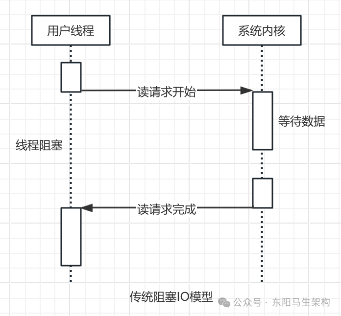

一个线程在同一时刻只能与一个连接绑定，如下图示。当请求的并发量较大时，就要创建大量线程来处理连接，这会导致系统浪费大量资源进行线程切换，降低程序性能。我们知道网络数据的传输速度是远远慢于CPU的处理速度，连接建立后并不总是有数据可读，连接也并不总是可写。那么此时线程就只能阻塞等待，CPU的计算能力不能得到充分发挥，同时还会导致大量线程切换，浪费资源。

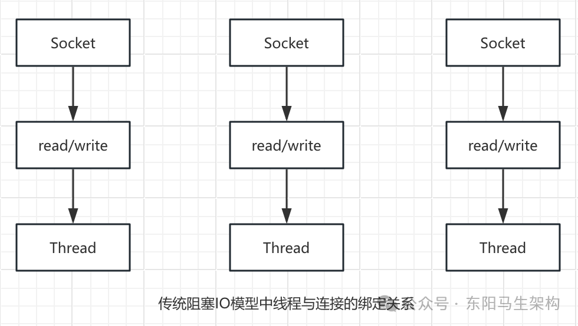

#### 二.IO多路复用模型

针对传统的阻塞IO模型的缺点，IO复用的模型在性能方面有不小的提升。IO复用模型中的多个连接会共用一个Selector对象，由Selector感知连接的读写事件，此时的线程数并不需要和连接数一致，只需要很少的线程定期从Selector上查询连接的读写状态即可，无须大量线程阻塞等待连接。当某个连接有新数据可处理时，操作系统会通知线程，线程从阻塞状态返回，开始进行读写操作及后续的业务逻辑处理。

IO复用的模型如下图示：用户线程会向Selector进行注册，注册完成后用户线程会立刻返回去执行其他的业务逻辑，不会在这里阻塞。然后由内核去等待连接的读写事件，当连接可读或者可写时，会由Selector通知用户线程，此时用户线程再去读写数据即可。

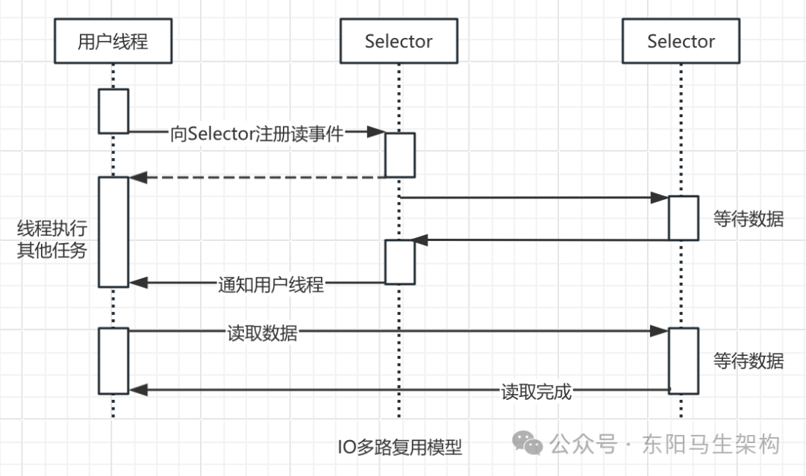

Netty就是采用了上述IO复用的模型。由于多路复用器Selector的存在，可以同时并发处理成百上千个网络连接，大大增加了服务器的处理能力。另外Selector并不会阻塞线程，也就是说当一个连接不可读或不可写的时候，线程可以去处理其他可读或可写的连接，这就充分提升了IO线程的运行效率，避免由于频繁IO阻塞导致的线程切换，如下图示：

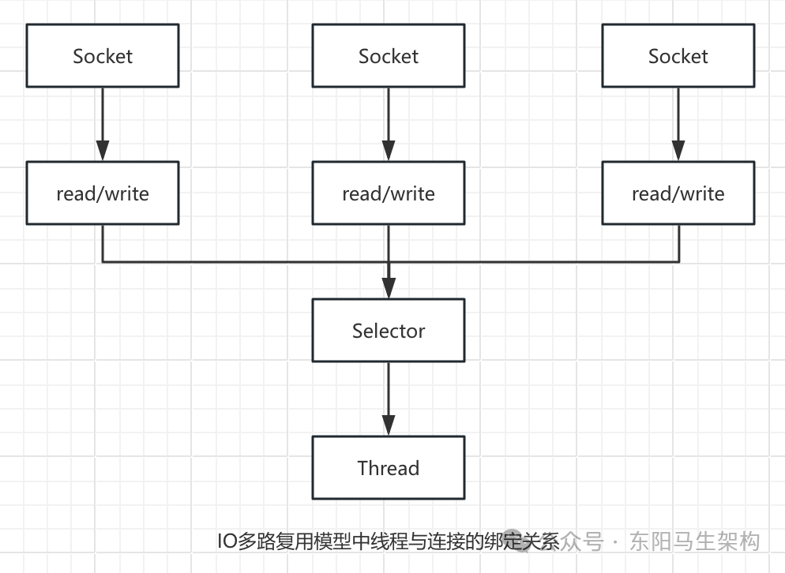

从数据处理的角度来看，传统的阻塞IO模型处理的是字节流或字符流。在BIO中以流式的方式顺序地从一个数据流中读取一个或多个字节，并且不能随意改变读取指针的位置。在NIO中则抛弃了这种传统的IO流概念，引入了Channel和Buffer的概念。NIO可以从Channel中读取数据到Buffer中或将数据从Buffer写入到Channel中。Buffer不像传统IO中的流那样必须顺序操作，在NIO中可以读写Buffer中任意位置的数据。

### (3)Netty线程模型设计

#### 一.单Reactor单线程

#### 二.单Reactor多线程

#### 三.主从Reactor多线程

#### 四.Netty线程模型

服务器程序在读取到二进制数据之后，首先需要通过编解码，得到程序逻辑可以理解的消息。然后将消息传入业务逻辑进行处理，并产生相应的结果，返回给客户端。

编解码逻辑、消息派发逻辑、业务处理逻辑以及返回响应的逻辑，是放到一个线程里面串行执行，还是分配到不同的线程中执行，会对程序的性能产生很大的影响。所以，优秀的线程模型对一个高性能网络库来说是至关重要的。

Netty采用了Reactor线程模型的设计，Reactor模式也被称为Dispatcher模式。核心原理是Selector负责监听IO事件，在监听到IO事件之后，分发(Dispatch)给相关线程进行处理。

为了更好地了解Netty线程模型的设计理念，下面从最基础的单Reactor单线程模型开始介绍，然后逐步增加模型的复杂度，最终到Netty目前使用的非常成熟的线程模型设计。

#### 一.单Reactor单线程

Reactor对象监听客户端请求事件，收到事件后通过Dispatch进行分发。

情形一：如果是连接建立的事件，则由Acceptor通过Accept处理连接请求。然后创建一个Handler对象处理连接建立之后的业务请求。

情形二：如果不是连接建立事件，而是数据读写事件，则Reactor会将事件分发给对应的Handler来处理，由这里唯一的线程调用Handler对象来完成读取数据、业务处理、发送响应的完整流程。当然，该过程中也可能会出现连接不可读或不可写等情况，该单线程会去执行其他Handler的逻辑，而不是阻塞等待。

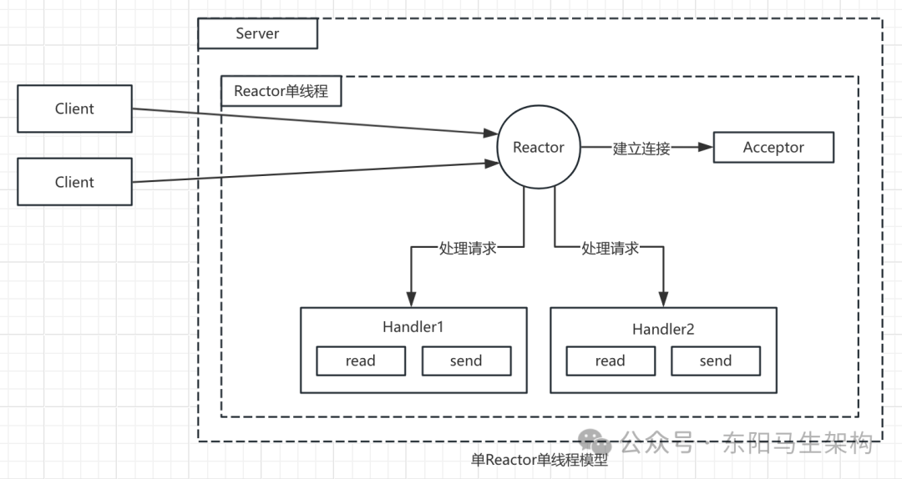

单Reactor单线程的优点就是：线程模型简单，没有引入多线程，自然也就没有多线程并发和竞争的问题。但其缺点也非常明显，那就是性能瓶颈问题：一个线程只能跑在一个CPU上，能处理的连接数是有限的，无法完全发挥多核CPU的优势，一旦某个业务逻辑耗时较长，这唯一的线程就会卡在上面，无法处理其他连接的请求，程序进入假死的状态，可用性也就降低了。正是由于这种限制，一般只会在客户端使用这种线程模型。

#### 二.单Reactor多线程

在单Reactor多线程的架构中，Reactor监控到客户端请求之后：如果连接建立的请求，则由Acceptor通过accept处理，然后创建一个Handler对象处理连接建立之后的业务请求。如果不是连接建立(而是数据读写)请求，则Reactor会将事件分发给连接对应的Handler来处理。到此为止，该流程与单Reactor单线程的模型基本一致，唯一的区别就是执行Handler逻辑的线程隶属于一个线程池。

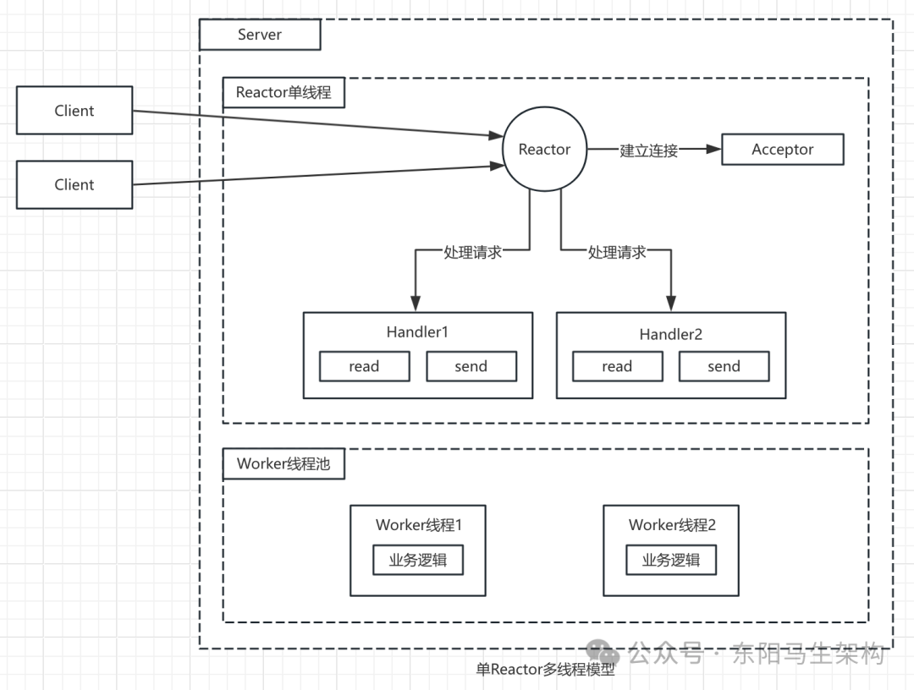

很明显，单Reactor多线程的模型可以充分利用多核CPU的处理能力，提高整个系统的吞吐量。但引入多线程模型就要考虑线程并发、数据共享、线程调度等问题。在这个模型中，只有一个线程来处理Reactor监听到的所有IO事件，其中就包括连接建立事件以及读写事件。当连接数不断增大的时候，这个唯一的Reactor线程也会遇到瓶颈。

#### 三.主从Reactor多线程

为了解决单Reactor多线程模型中的问题，我们可以引入多个Reactor。其中Reactor主线程负责通过Acceptor对象处理MainReactor监听到的连接建立事件。

当Acceptor完成网络连接的建立之后，MainReactor会将建立好的连接分配给SubReactor进行后续监听。当一个连接被分配到一个SubReactor之上时，会由SubReactor负责监听该连接上的读写事件。

当有新的读事件(OP_READ)发生时，SubReactor就会调用对应的Handler读取数据，然后分发给Worker线程池中的线程进行处理并返回结果。

待处理结束之后，Handler会根据处理结果调用send将响应返回给客户端，当然此时连接要有可写事件(OP_WRITE)才能发送数据。

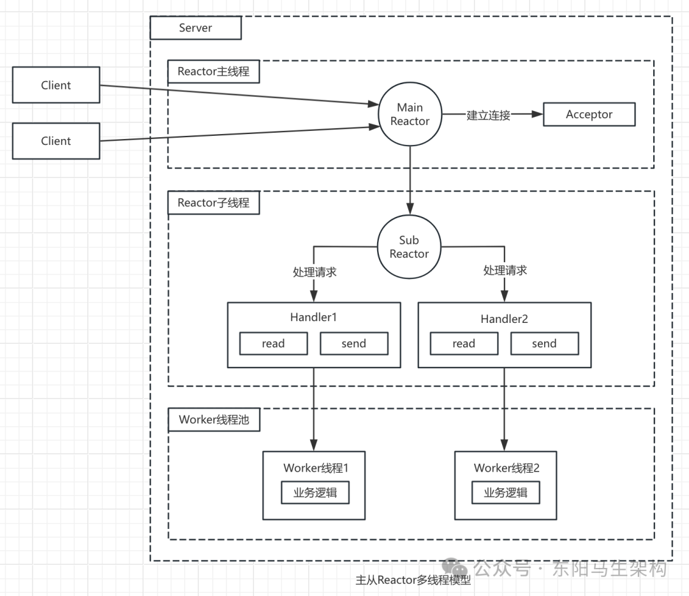

主从Reactor多线程的设计模式解决了单一Reactor的瓶颈。主从Reactor职责明确，MainReactor只负责监听连接建立事件，SubReactor只负责监听读写事件。整个主从Reactor多线程架构充分利用了多核CPU的优势，可以支持扩展，而且与具体的业务逻辑充分解耦，复用性高。但不足的地方是，在交互上略显复杂，需要一定的编程门槛。

#### 四.Netty线程模型

Netty同时支持上述几种线程模式，Netty针对服务器端的设计是在主从Reactor多线程模型的基础上进行的修改。

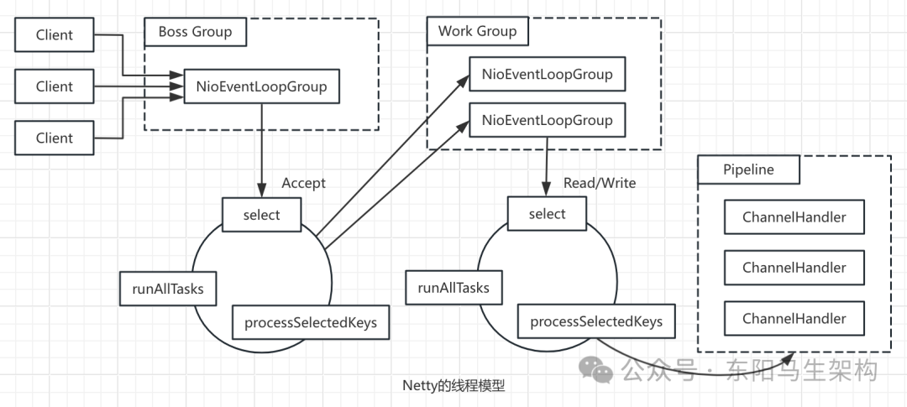

Netty抽象出两组线程池：BossGroup专门用于接收客户端的连接，WorkerGroup专门用于网络的读写。BossGroup和WorkerGroup类型都是NioEventLoopGroup，相当于一个事件循环组，其中包含多个事件循环 ，每一个事件循环是NioEventLoop。

NioEventLoop表示一个不断循环的、执行处理任务的线程，每个NioEventLoop都有一个Selector对象与之对应，用于监听绑定在其上的连接，这些连接上的事件由Selector对应的这条线程处理。

每个NioEventLoopGroup可以含有多个NioEventLoop，也就是多个线程。每个Boss NioEventLoop会监听Selector上连接建立的accept事件，然后处理accept事件与客户端建立网络连接，生成相应的NioSocketChannel对象，一个NioSocketChannel就表示一条网络连接。之后会将NioSocketChannel注册到某个Worker NioEventLoop上的Selector中。

每个Worker NioEventLoop会监听对应Selector上的读写事件，当监听到读写事件时，会通过Pipeline进行处理。一个Pipeline与一个Channel绑定，在Pipeline上可以添加多个ChannelHandler，每个ChannelHandler中都可以包含一定的逻辑，例如编解码等。

Pipeline在处理请求的时候，会按照我们指定的顺序调用ChannelHandler。

### (4)Netty设计模型总结

这里重点介绍了网络IO的一些背景知识，以及Netty的一些宏观设计模型。首先介绍了Java NIO的一些缺陷和不足，这也是Netty等网络库出现的重要原因之一。接着介绍了Netty在IO模型上的设计，阐述了IO多路复用的优势。最后从单Reactor单线程模型开始，一步步深入介绍了常见的网络IO线程模型，并介绍了Netty目前使用的线程模型。

下面介绍Netty的核心组件：首先是Netty对IO模型设计中概念的抽象，如Selector组件等。接下来是线程模型的相关组件介绍，主要是NioEventLoop、NioEventLoopGroup等。最后再深入剖析Netty处理数据的相关组件，例如ByteBuf、内存管理的相关知识。

### (5)Netty的Channel组件

Channel是Netty对网络连接的抽象，核心功能是执行网络IO操作。不同协议、不同阻塞类型的连接对应不同的Channel类型。

我们一般用的都是NIO的Channel，下面是一些常用的NIO Channel类型：

```
类型一：NioSocketChannel
对应异步的TCP Socket连接；

类型二：NioServerSocketChannel
对应异步的服务器端TCP Socket连接；

类型三：NioDatagramChannel
对应异步的UDP连接；
```

上述异步Channel主要提供了异步的网络IO操作，例如：建立连接、读写操作等。异步调用意味着任何IO调用都将立即返回，并且不保证在调用返回时所请求的IO操作已完成。

IO操作返回的是一个ChannelFuture对象，无论IO操作是否成功，Channel都可以通过监听器通知调用方，我们通过向ChannelFuture上注册监听器来监听IO操作的结果。

Netty也支持同步IO操作，但在实践中几乎不使用。我们使用的是Netty的异步IO操作，虽然立即返回一个ChannelFuture对象不能立刻知晓IO操作是否成功，这时就需要向ChannelFuture中注册一个监听器，当操作执行成功或失败时，监听器会自动触发注册的监听事件。

另外，Channel还提供了检测当前网络连接状态等功能，这些可以帮助我们实现网络异常断开后自动重连的功能。

### (6)Netty的Selector组件

Selector是对多路复用器的抽象，也是Java NIO的核心基础组件之一。Netty就是基于Selector对象实现IO多路复用的。Selector内部会通过系统调用不断地查询这些注册在其上的Channel是否有已就绪的IO事件。例如可读事件(OP_READ)、可写事件(OP_WRITE)或网络连接事件(OP_ACCEPT)，而无须使用用户线程进行轮询。这样，我们就可以用一个线程监听多个Channel上发生的事件。

### (7)Netty的ChannelPipeline和ChannelHandler组件

提到Pipeline，可能最先想到的是Linux命令中的管道，它可以实现将一条命令的输出作为另一条命令的输入。Netty中的ChannelPipeline也可以实现类似的功能：ChannelPipeline会将一个ChannelHandler处理后的数据作为下一个ChannelHandler的输入。下图引用了Netty中对ChannelPipeline的说明，描述了ChannelPipeline中ChannelHandler通常是如何处理IO事件的。

Netty中定义了两种事件类型：入站(Inbound)事件和出站(Outbound)事件。这两种事件就像Linux管道中的数据一样，在ChannelPipeline中传递，事件之中也可能会附加数据。

ChannelPipeline之上可以注册多个ChannelHandler(ChannelInboundHandler或ChannelOutboundHandler)。我们在ChannelHandler注册的时候决定处理IO事件的顺序，这就是典型的责任链模式。

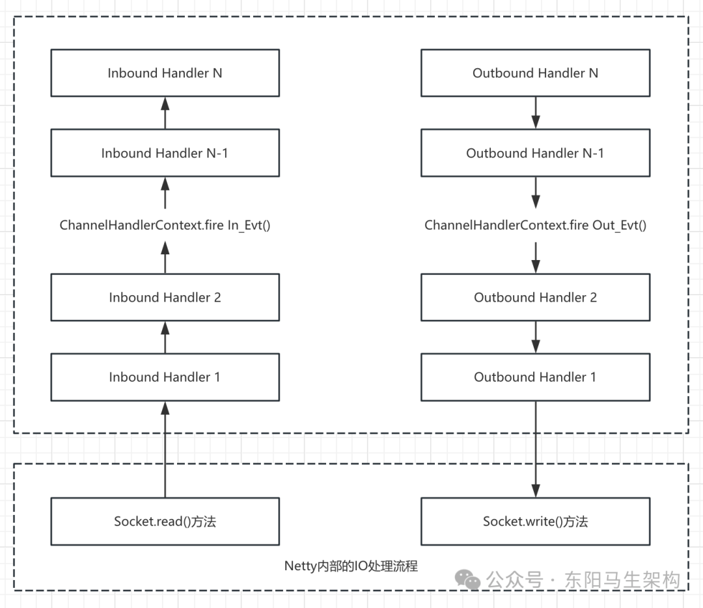

从图中我们还可以看到，IO事件不会在ChannelPipeline中自动传播。而是需要调用ChannelHandlerContext中定义的相应方法进行传播，例如fireChannelRead()方法和write()方法等。举一个简单的例子如下所示，在该ChannelPipeline 上，我们添加了5个ChannelHandler对象：

```java
ChannelPipeline p = socketChannel.pipeline();
p.addLast("1", new InboundHandlerA());
p.addLast("2", new InboundHandlerB());
p.addLast("3", new OutboundHandlerA());
p.addLast("4", new OutboundHandlerB());
p.addLast("5", new InboundOutboundHandlerX());
```

对于入站(Inbound)事件，处理序列为：1 → 2 → 5。对于出站(Outbound)事件，处理序列为：5 → 4 → 3。可见，入站(Inbound)与出站(Outbound)事件处理顺序正好相反。

入站(Inbound)事件一般由IO线程触发。举个例子，我们自定义了一种消息协议，一条完整的消息是由消息头和消息体两部分组成。其中消息头会含有消息类型、控制位、数据长度等元数据，消息体则包含了真正传输的数据。在面对一块较大的数据时，客户端一般会将数据切分成多条消息发送，服务端接收到数据后，一般会先进行解码和缓存，待收集到长度足够的字节数据，组装成有固定含义的消息之后，才会传递给下一个ChannelInboudHandler进行后续处理。在Netty中就提供了很多Encoder的实现用来解码读取到的数据，Encoder会处理多次channelRead()事件。等拿到有意义的数据之后，才会触发一次下一个ChannelInboundHandler的channelRead()方法。

出站(Outbound)事件与入站(Inbound)事件相反，一般是由用户触发的。ChannelHandler接口中并没有定义方法来处理事件，而是由其子类进行处理的，如下图示。ChannelInboundHandler拦截并处理入站事件，ChannelOutboundHandler拦截并处理出站事件。

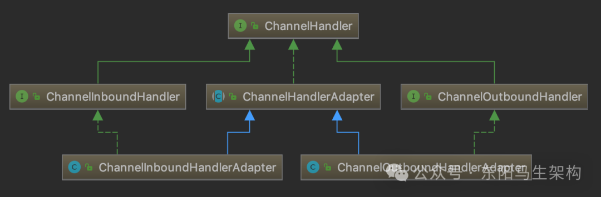

其中ChannelInboundHandlerAdapter和ChannelOutboundHandlerAdapter主要是帮助完成事件流转功能的。也就是自动调用传递事件的相应方法，这样我们在自定义ChannelHandler实现类时，就可以直接继承相应的Adapter类，并覆盖需要的事件处理方法，其他不关心的事件方法直接使用默认实现即可，从而提高开发效率。

ChannelHandler中的很多方法都需要一个ChannelHandlerContext类型的参数。ChannelHandlerContext抽象的是ChannleHandler之间的关系以及ChannelHandler与ChannelPipeline之间的关系。

ChannelPipeline中的事件传播主要依赖于ChannelHandlerContext实现：在ChannelHandlerContext中维护了ChannelHandler之间的关系，可以从ChannelHandlerContext中得到当前ChannelHandler的后继节点，从而将事件传播到后续的ChannelHandler。

ChannelHandlerContext继承了AttributeMap，所以提供了attr()方法设置和删除一些状态属性信息，我们可将业务逻辑中所需使用的状态属性值存入到ChannelHandlerContext中，然后这些属性就可以随它传播了。

Channel中也维护了一个AttributeMap，与ChannelHandlerContext中的一样，都是作用于整个ChannelPipeline。

通过上述分析，我们可以了解到：一个Channel对应一个ChannelPipeline，一个ChannelHandlerContext对应一个ChannelHandler。

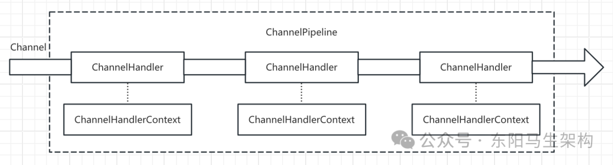

最后需要注意的是，如果要在ChannelHandler中执行耗时较长的逻辑，例如操作DB 、进行网络或磁盘IO等操作，一般会在注册到ChannelPipeline的同时，指定一个线程池异步执行ChannelHandler中的操作。

### (8)Netty的NioEventLoop组件

在前面介绍Netty线程模型时，提到了NioEventLoop这个组件，当时只是简单将其描述成了一个线程。一个EventLoop对象由一个永远都不会改变的线程驱动，同时一个NioEventLoop包含了一个Selector对象，可以支持多个Channel注册在其上。一个NioEventLoop可同时服务多个Channel，每个Channel只能与一个NioEventLoop绑定。

我们知道Channel中的IO操作是由ChannelPipeline中注册的ChannelHandler进行处理的，而ChannelHandler的逻辑都是由相应NioEventLoop关联的那个线程执行的。

除了与一个线程绑定之外，NioEvenLoop中还维护了两个任务队列：

#### 一.普通任务队列

用户产生的普通任务可以提交到该队列中暂存，NioEventLoop发现该队列中的任务后会立即执行。这是一个多生产者单消费者(MPSC)的队列，Netty使用该队列将外部用户线程产生的任务收集到一起，并在Reactor线程内部用单线程的方式串行执行队列中的任务。例如，外部非IO线程调用了Channel的write()方法，Netty会将其封装成一个任务放入TaskQueue队列中，这样，所有的IO操作都会在IO线程中串行执行。

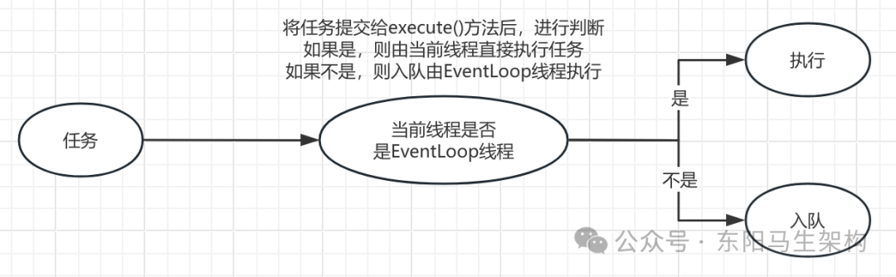

#### 二.定时任务队列

当用户在非IO线程产生定时操作时，Netty将用户的定时操作封装成定时任务，并将其放入该定时任务队列中等待相应NioEventLoop串行执行。

到此可以看出，NioEventLoop主要做三件事：监听IO事件、执行普通任务以及执行定时任务。NioEventLoop到底分配多少时间在不同类型的任务上，是可以配置的。另外，为了防止NioEventLoop长时间阻塞在一个任务上，一般会将耗时的操作提交到其他业务线程池处理。

### (9)Netty的NioEventLoopGroup组件

NioEventLoopGroup表示的是一组NioEventLoop。Netty为了能更充分地利用多核CPU资源，一般会有多个NioEventLoop同时工作，至于多少线程可由用户决定。Netty会根据实际上的处理器核数计算一个默认值(2倍的CPU的核心数)，当然我们也可以根据实际情况手动调整。

当一个Channel创建之后，Netty会调用NioEventLoopGroup提供的next()方法，按照一定规则获取其中一个NioEventLoop实例，并将Channel注册到该NioEventLoop实例，之后就由该NioEventLoop来处理Channel上的事件。

EventLoopGroup、EventLoop以及 Channel三者的关联关系，如下图示：

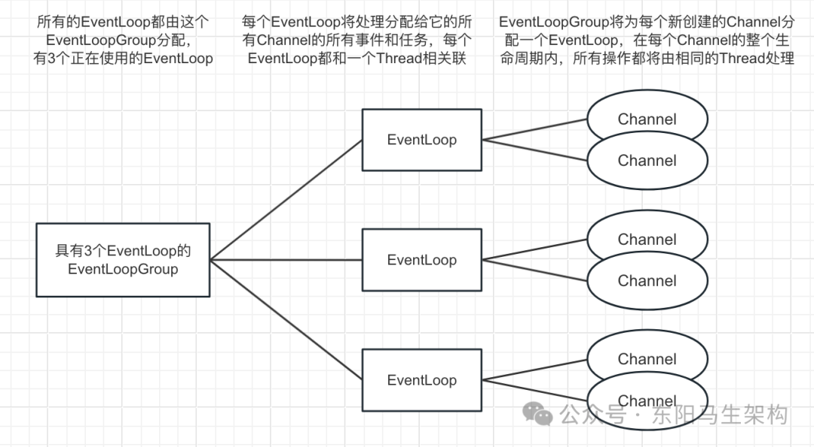

前面提到过，在Netty服务器端中会有BossEventLoopGroup和WorkerEventLoopGroup两个NioEventLoopGroup。通常一个服务端口只需要一个ServerSocketChannel，对应一个Selector和一个NioEventLoop线程。

一.BossEventLoop负责接收客户端的连接事件，即OP_ACCEPT事件，然后将创建的NioSocketChannel交给WorkerEventLoopGroup。

二.WorkerEventLoopGroup会由next()方法选择其中一个NioEventLoop，并将这个NioSocketChannel注册到其维护的Selector并对其后续的IO事件进行处理。

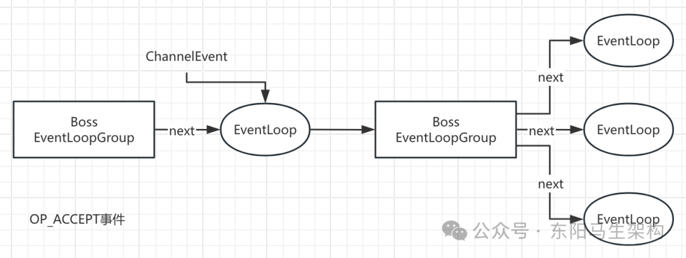

如上图示，BossEventLoopGroup通常是一个单线程的EventLoop。该EventLoop维护着一个Selector对象，其上注册一个ServerSocketChannel。BoosEventLoop会不断轮询该Selector对象来监听连接事件。当发生连接事件时，会通过accept操作与客户端创建连接，创建SocketChannel对象，然后将accept操作得到的SocketChannel交给WorkerEventLoopGroup。

在Reactor模式中，WorkerEventLoopGroup中会维护多个EventLoop。每个EventLoop都会监听分配给它的SocketChannel上发生的IO事件，并将这些具体的事件分发给业务线程池处理。

### (10)Netty的ByteBuf组件

#### 一.Heap Buffer(堆缓冲区)

#### 二.Direct Buffer(直接缓冲区)

#### 三.Composite Buffer(复合缓冲区)

通过前面介绍，我们了解了Netty中数据的流向，这里我们再来介绍一下数据的容器——ByteBuf。在进行跨进程远程交互的时候，我们需要以字节的形式发送和接收数据。发送端和接收端都需要一个高效的数据容器来缓存字节数据，ByteBuf就扮演了这样一个数据容器的角色。

ByteBuf类似于一个字节数组，其中维护了一个读索引和一个写索引，分别用来控制对ByteBuf中数据的读写操作。两者符合下面的不等式："0 <= readerIndex <= writerIndex <= capacity"

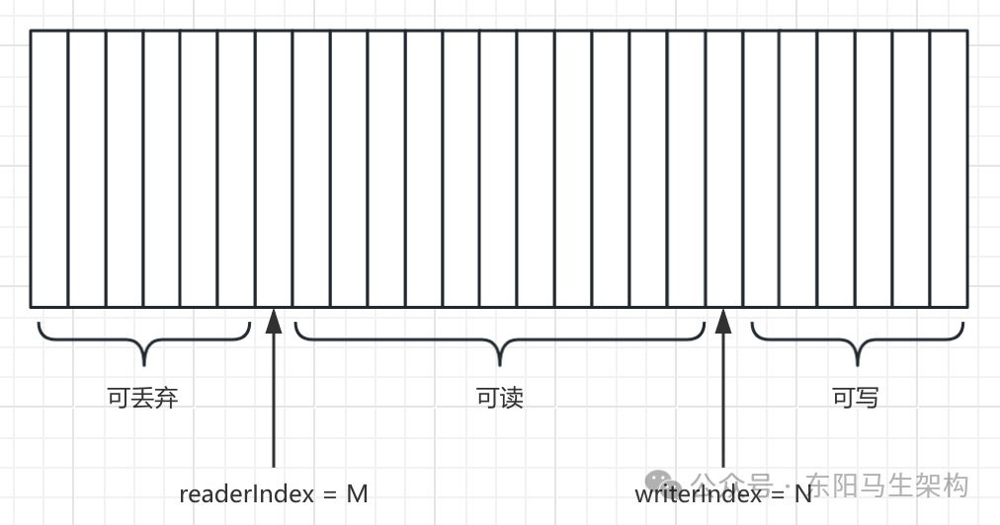

ByteBuf提供的读写操作API主要操作底层的字节容器(byte[]、ByteBuffer等)以及读写索引这两指针。Netty中主要分为以下三大类ByteBuf：

#### 一.Heap Buffer(堆缓冲区)

这是最常用的一种ByteBuf，其底层实现是在JVM堆内分配一个数组来实现数据的存储。堆缓冲区可以快速分配，当不使用时也可以由GC轻松释放。它还提供了直接访问底层数组的方法，通过ByteBuf.array()来获取底层存储数据的byte[]。

#### 二.Direct Buffer(直接缓冲区)

直接缓冲区会使用堆外内存存储数据，不会占用JVM堆的空间，使用时应该考虑应用程序要使用的最大内存容量以及如何及时释放。直接缓冲区在使用Socket传递数据时，由于少了一次内存拷贝，所以性能相比堆缓冲区要好些。当然它也有缺点，因为没有了JVM GC的管理，在分配内存空间和释放内存时，比堆缓冲区更复杂，但Netty会使用内存池来解决这样的问题，这也是Netty使用内存池的原因之一。

#### 三.Composite Buffer(复合缓冲区)

我们可以创建多个不同的ByteBuf，然后提供一个这些ByteBuf组合的视图，也就是CompositeByteBuf。它就像一个列表，可以动态添加和删除其中的ByteBuf。

### (11)Netty的内存管理

Netty使用ByteBuf对象作为数据容器，进行IO读写操作，其实Netty的内存管理也是围绕着ByteBuf对象高效地分配和释放。从内存管理角度来看，ByteBuf可分为Unpooled和Pooled两类：

#### 一.Unpooled非池化的内存管理方式

每次分配时直接调用系统API向操作系统申请ByteBuf，在使用完成之后，通过系统调用进行释放。Unpooled将内存管理完全交给系统，不做任何特殊处理，使用起来比较方便。这对于申请和释放操作不频繁、操作成本比较低的ByteBuf来说，是比较好的选择。

#### 二.Pooled池化的内存管理方式

该方式会预先申请一块大内存形成内存池，在需要申请ByteBuf空间的时候，会将内存池中一部分合理的空间封装成ByteBuf给服务使用，使用完成后回收到内存池中。前面提到DirectByteBuf底层使用的堆外内存管理比较复杂，池化技术很好地解决了这一问题。

下面从如何高效分配和释放内存、如何减少内存碎片以及在多线程环境下如何减少锁竞争这三个方面，来介绍Netty提供的ByteBuf池化技术。

Netty首先向系统申请一整块连续内存，称为Chunk(默认16MB)，这一块连续的内存通过PoolChunk对象进行封装。之后Netty将Chunk空间进一步拆分为Page，每个Chunk默认包含2048个Page，每个Page的大小为8KB。

在同一个Chunk中，Netty将Page按照不同粒度进行分层管理。如下图示，从下数第1层中每个分组的大小为1 * PageSize，一共有2048个分组。第2层中每个分组大小为2 * PageSize，一共有1024个组。第3层中每个分组大小为4 * PageSize，一共有512个组。依次类推，直至最顶层。

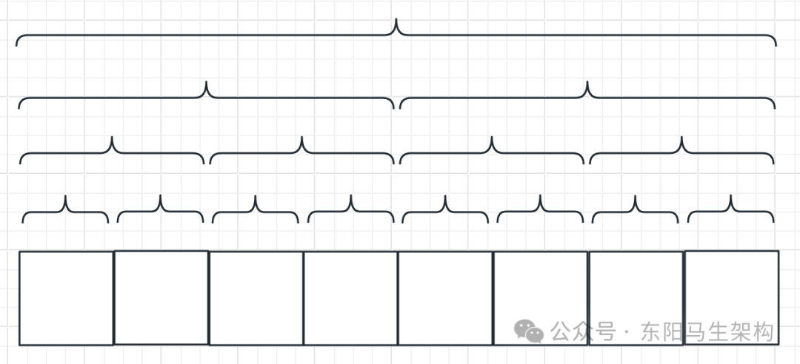

方面一：内存分配&释放

当服务向内存池请求内存时，Netty会将请求分配的内存数向上取整到最接近的分组大小，然后在该分组的相应层级中从左至右寻找空闲分组。例如，服务请求分配3 * PageSize的内存，向上取整得到的分组大小为4 * PageSize，那么就在该层分组中找到完全空闲的一组内存进行分配即可，如下图示。

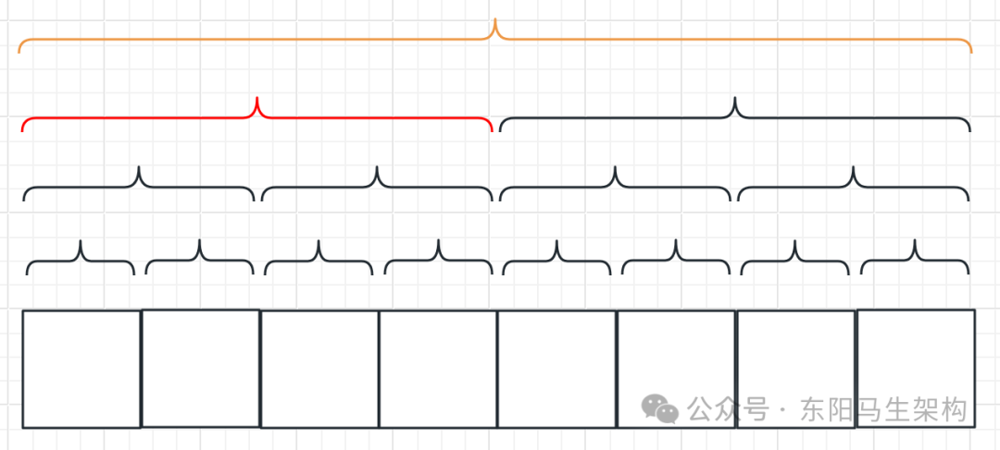

当分组大小4 * PageSize的内存分配出去后，为了方便下次内存分配，分组被标记为全部已使用(图中红色标记)，向上更粗粒度的内存分组被标记为部分已使用(图中黄色标记)。Netty使用完全平衡树的结构实现了上述算法，这个完全平衡树底层是基于一个byte数组构建的，如下图示：

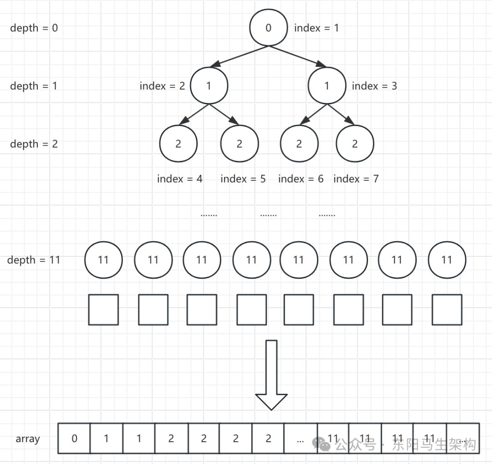

方面二：大对象&小对象的处理

当申请分配的对象是超过Chunk容量的大型对象，Netty就不再使用池化管理方式了。在每次请求分配内存时单独创建特殊的非池化PoolChunk对象进行管理，当对象内存释放时整个PoolChunk内存释放。

如果需要一定数量空间远小于PageSize的ByteBuf对象，例如创建256 Byte的ByteBuf，按照上述算法，就需要为每个小ByteBuf对象分配一个Page，这就出现了很多内存碎片。

Netty通过将Page进行细分的方式，解决这个问题。Netty将请求的空间大小向上取最近的16的倍数(或2的幂)，规整后小于PageSize的小Buffer可分为两类。第一类：微型对象，规整后的大小为16的整倍数，如16、32、48、...、496，一共31种大小。第二类：小型对象，规整后的大小为2的幂，如512、1024、2048、4096，一共4种大小。

Netty的实现会先从PoolChunk中申请空闲Page，同一个Page分为相同大小的小Buffer进行存储。

这些Page用PoolSubpage对象进行封装，PoolSubpage内部会记录它自己能分配的小Buffer的规格大小、可用内存数量，并通过bitmap的方式记录各个小内存的使用情况(如下图示)。虽然这种方案也不能完美消灭内存碎片，但是很大程度上还是减少了内存浪费。

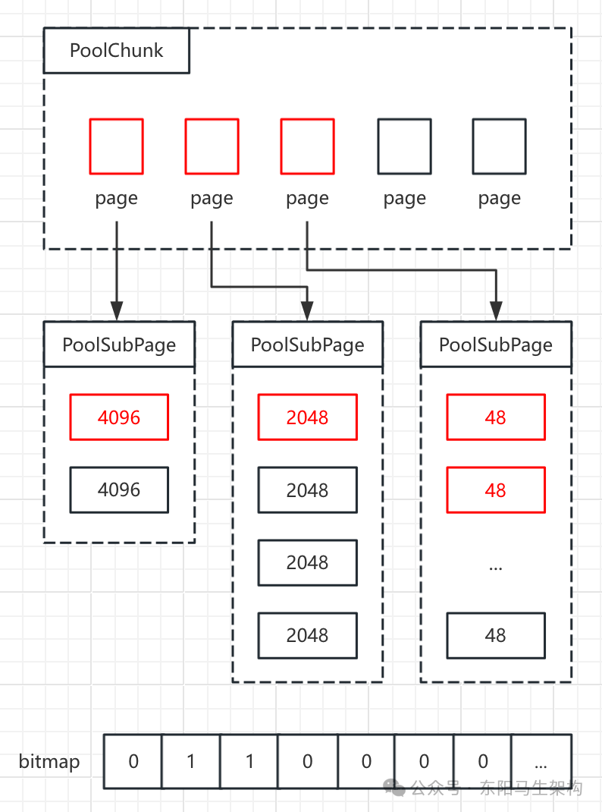

为了解决单个PoolChunk容量有限的问题，Netty将多个PoolChunk组成链表一起管理，然后用PoolChunkList对象持有链表的head。

Netty通过PoolArena管理PoolChunkList以及PoolSubpage，PoolArena内部持有6个PoolChunkList，各个PoolChunkList持有的PoolChunk的使用率区间有所不同，如下图示：

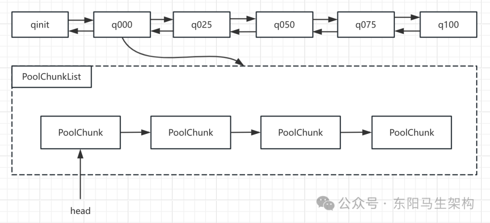

6个PoolChunkList对象组成双向链表，当PoolChunk内存分配、释放，导致使用率变化时，需要判断PoolChunk是否超过所在PoolChunkList的限定使用率范围。如果超出了，需要沿着6个PoolChunkList的双向链表找到新的合适的PoolChunkList，成为新的head。同样，当新建PoolChunk分配内存或释放空间时，PoolChunk也需要按照上面逻辑放入合适的PoolChunkList中。

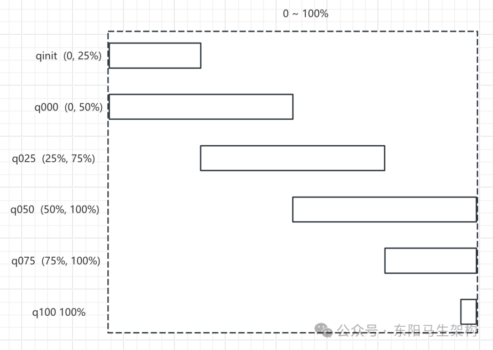

从上图可以看出，这6个PoolChunkList额定使用率区间存在交叉，这样设计的原因是：如果使用单个临界值的话，当一个PoolChunk被来回申请和释放，内存使用率会在临界值上下徘徊，这就会导致它在两个PoolChunkList链表中来回移动。

PoolArena内部持有2个PoolSubpage数组，分别存储微型Buffer和小型Buffer的PoolSubpage。相同大小的PoolSubpage组成链表，不同大小的PoolSubpage链表的head节点保存在两个数组中：tinySubpagePools数组、smallSubpagePools数组，如下图示：

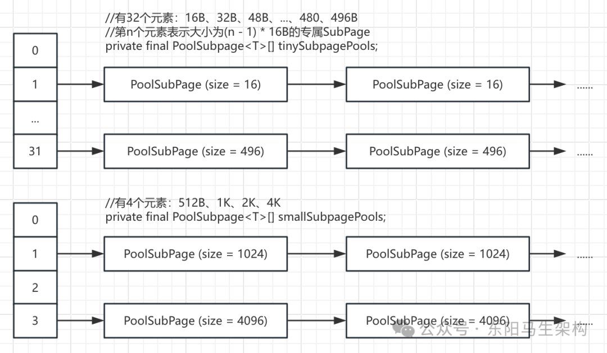

方面三：并发处理

内存分配释放不可避免地会遇到多线程并发场景。PoolChunk的完全平衡树标记以及PoolSubpage的bitmap标记都是多线程不安全的，都是需要加锁同步的。为了减少线程间的竞争，Netty会提前创建多个PoolArena(默认数量为2 * CPU核心数)。

当线程首次请求池化内存分配，会找被最少线程持有的PoolArena，并保存线程局部变量PoolThreadCache中，实现线程与PoolArena的关联绑定。

Netty还提供了延迟释放的功能，来提升并发性能。当内存释放时，PoolArena并没有马上释放，而是先尝试将该内存关联的PoolChunk和Chunk中的偏移位置等信息存入ThreadLocal的固定大小缓存队列中。如果该缓存队列满了，再进行内存释放。当有新的分配请求时，PoolArena会优先访问线程本地的缓存队列，查询是否有缓存可用，如果有则直接分配。

### (12)Netty的核心组件总结

这里主要介绍了Netty核心组件的功能和原理：首先介绍了Channel、ChannelFuture、Selector等组件，它们是构成IO多路复用的核心。之后介绍了EventLoop、EventLoopGroup等组件，它们与Netty使用的主从Reactor线程模型息息相关。最后介绍了Netty的内存管理机制，主要从内存分配管理、内存碎片优化以及并发分配内存等角度进行了介绍。

## 2.简易版RPC框架实现

### (1)项目结构

### (2)自定义协议

### (3)编解码实现

### (4)RPC框架基础总结

### (5)transport相关实现

### (6)registry相关实现

### (7)proxy相关实现

### (8)使用方接入

### (9)RPC框架核心实现总结

RPC是"远程过程调用(Remote Procedure Call)"的缩写形式，通俗的解释是：像本地方法调用一样调用远程的服务。虽然RPC的定义非常简单，但是相对完整的、通用的RPC框架涉及很多方面的内容。例如注册发现、服务治理、负载均衡、集群容错、RPC协议等，如下图示：

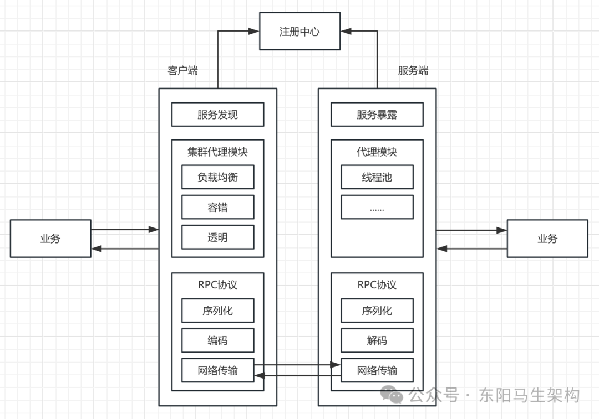

下面主要实现RPC框架的基石部分——远程调用，简易版RPC框架一次远程调用的核心流程是这样的：

步骤一：Client首先会调用本地的代理，也就是图中的Proxy；

步骤二：Client端Proxy会按照协议(Protocol)，将调用中传入的数据序列化成字节流；

步骤三：之后Client会通过网络，将字节数据发送到Server端；

步骤四：Server端接收到字节数据之后，会按照协议进行反序列化，得到相应的请求信息；

步骤五：Server端Proxy会根据序列化后的请求信息，调用相应的业务逻辑；

步骤六：Server端业务逻辑的返回值，也会按照上述逻辑返回给Client端；

这个远程调用的过程，就是简易版RPC框架的核心实现，只有理解了这个流程，才能进行后续的开发。

### (1)项目结构

了解了简易版RPC框架的工作流程和实现目标之后，再来看下项目的结构。为了方便起见，这里将整个项目放到了一个Module中，如下图示，实际中可以按照自己的需求进行模块划分。

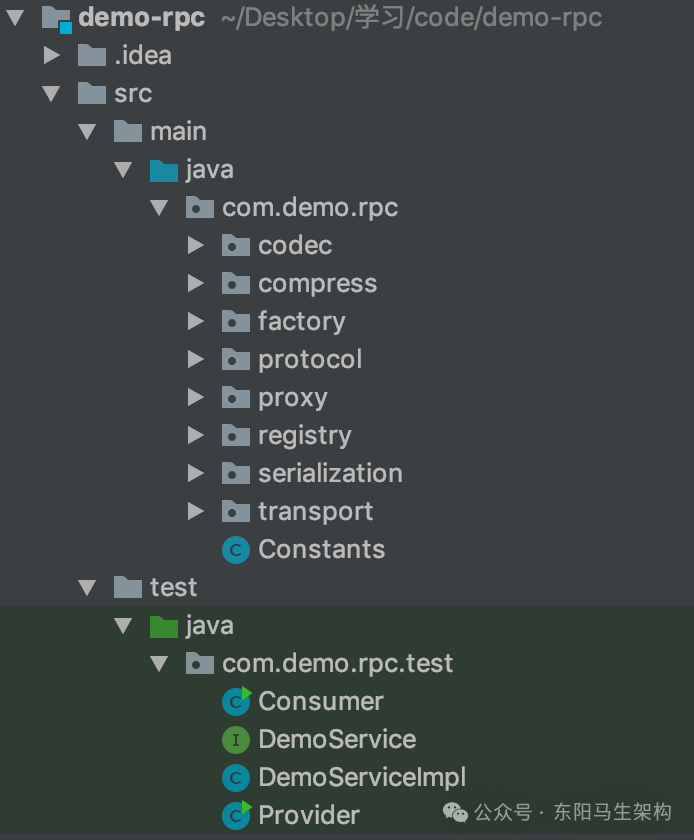

各个包的功能如下：

```
一.protocol
简易版RPC框架的自定义协议；

二.serialization
提供了自定义协议对应的序列化、反序列化相关工具类；

三.codec
提供了自定义协议对应的编码器和解码器；

四.transport
基于Netty提供了底层网络通信的功能；
其中会使用到codec包中定义编码器和解码器，以及serialization包中的序列化器和反序列化器；

五.registry
基于ZooKeeper和Curator实现了简易版本的注册中心功能；

六.proxy
使用JDK动态代理实现了一层代理；
```

### (2)自定义协议

当前已经有很多成熟的协议了，例如HTTP、HTTPS等，那为什么我们还要自定义RPC协议呢？从功能角度考虑，HTTP协议在1.X时代，只支持半双工传输模式，虽然支持长连接，但是不支持服务端主动推送数据。从效率角度来看，在一次简单的远程调用中，只需要传递方法名和加个简单的参数，此时HTTP请求中大部分数据都被HTTP Header占据，真正的有效负载非常少，效率就比较低。

当然HTTP协议也有自己的优势，例如天然穿透防火墙，很多开源软件支持HTTP接口，配合REST规范使用也是很便捷的，所以有很多RPC框架直接使用HTTP协议，尤其是在HTTP2.0之后，如gRPC、Spring Cloud等。这里自定义一个简易版的Demo RPC协议，如下图示：

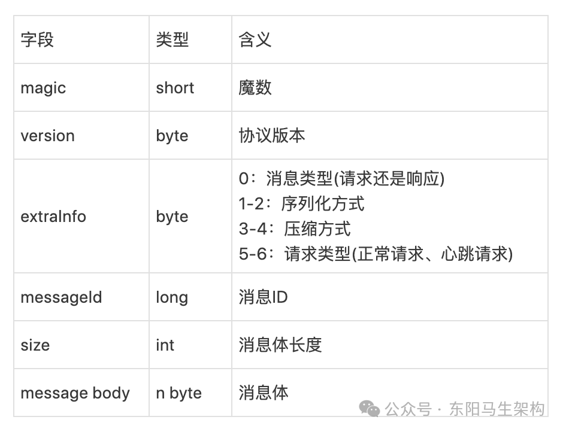

在Demo RPC的消息头中，包含了整个RPC消息的一些控制信息：例如版本号、魔数、消息类型、附加信息、消息ID以及消息体的长度。在附加信息(extraInfo)中，按位进行划分，分别定义消息的类型、序列化方式、压缩方式以及请求类型。当然也可以自己扩充 Demo RPC协议，实现更加复杂的功能。

Demo RPC消息头对应的实体类是Header，其定义如下：

```cs
public class Header {
    private short magic;//魔数
    private byte version;//版本号
    private byte extraInfo;//附加信息
    private Long messageId;//消息ID
    private Integer size;//消息体长度
    ...
}
```

确定了Demo RPC协议消息头的结构之后，我们再来看Demo RPC协议消息体由哪些字段构成。这里我们通过Request和Response两个实体类来表示请求消息和响应消息的消息体：

```typescript
public class Request implements Serializable {
    private String serviceName;//请求的Service类名
    private String methodName;//请求的方法名称
    private Class[] argTypes;//请求方法的参数类型
    private Object[] args;//请求方法的参数
    ...
}

public class Response implements Serializable {
    private int code = 0;//响应的错误码，正常响应为0，非0表示异常响应
    private String errMsg;//异常信息
    private Object result;//响应结果
    ...
}
```

注意，Request和Response对象是要进行序列化的，需要实现Serializable接口。为了让这两个类的对象能够在Client和Server之间跨进程传输，需要进行序列化和反序列化操作，这里定义一个Serialization接口，统一完成序列化相关的操作。

```java
public interface Serialization {
    <T> byte[] serialize(T obj)throws IOException;
    <T> T deSerialize(byte[] data, Class<T> clz)throws IOException;
}
```

在Demo RPC中默认使用Hessian序列化方式，下面的HessianSerialization就是基于Hessian序列化方式对Serialization接口的实现：

```java
public class HessianSerialization implements Serialization {
    public <T> byte[] serialize(T obj) throws IOException {
    	ByteArrayOutputStream os = new ByteArrayOutputStream();
    	HessianOutput hessianOutput = new HessianOutput(os);
     	hessianOutput.writeObject(obj);
      	return os.toByteArray();
    }

    public <T> T deSerialize(byte[] data, Class<T> clazz) throws IOException {
    	ByteArrayInputStream is = new ByteArrayInputStream(data);
     	HessianInput hessianInput = new HessianInput(is);
      	return (T) hessianInput.readObject(clazz);
    }
}
```

在有的场景中，请求或响应传输的数据比较大，直接传输比较消耗带宽，所以一般会采用压缩后再发送的方式。在前面介绍的Demo RPC消息头中的extraInfo字段中，就包含了标识消息体压缩方式的bit位。这里我们定义一个Compressor接口抽象所有压缩算法：

```cs
public interface Compressor {
    byte[] compress(byte[] array) throws IOException;
    byte[] unCompress(byte[] array) throws IOException;
}
```

同时提供一个基于Snappy压缩算法的实现，作为Demo RPC的默认压缩算法：

```java
public class SnappyCompressor implements Compressor {
    public byte[] compress(byte[] array) throws IOException {
    	if (array == null) {
     		return null;
   	}
    	return Snappy.compress(array);
    }

    public byte[] unCompress(byte[] array) throws IOException {
    	if (array == null) {
    		return null;
    	}
     	return Snappy.uncompress(array);
    }
}
```

### (3)编解码实现

了解了自定义协议的结构之后，我们再来解决协议的编解码问题。

前面介绍Netty核心概念时提到过：Netty每个Channel绑定一个ChannelPipeline，并依赖ChannelPipeline中添加的ChannelHandler处理接收或发送的数据，其中就包括字节到消息(以及消息到字节)的转换。

Netty中提供了：ByteToMessageDecoder、MessageToByteEncoder、MessageToMessageEncoder、MessageToMessageDecoder等抽象类，来实现Message与ByteBuf之间的转换以及Message之间的转换，如下图示：

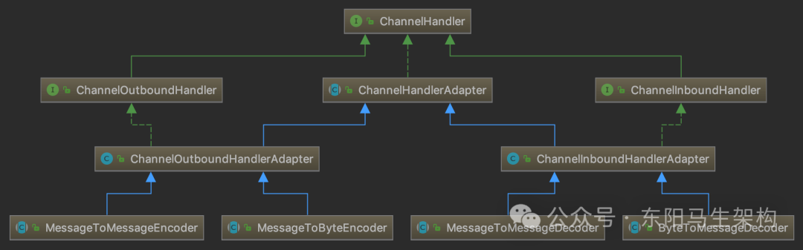

Netty提供的Decoder和Encoder实现：在Netty的源码中，可以看到对很多已有协议的序列化和反序列化都是基于上述抽象类实现的。例如HttpServerCodec中通过依赖HttpServerRequestDecoder和HttpServerResponseEncoder，来实现HTTP请求的解码和HTTP响应的编码。

HttpServerRequestDecoder继承自ByteToMessageDecoder，实现ByteBuf到HTTP请求之间的转换。

HttpServerResponseEncoder继承自MessageToMessageEncoder，实现HTTP响应到其他消息的转换(包括转换成ByteBuf)。

在简易版RPC框架中，我们的自定义请求暂时没有HTTP协议那么复杂，只要简单继承ByteToMessageDecoder和MessageToMessageEncoder即可。

首先来看DemoRpcDecoder，它实现了ByteBuf到Demo RPC Message的转换，具体实现如下：

```cs
public class DemoRpcDecoder extends ByteToMessageDecoder {
    protected void decode(ChannelHandlerContext ctx, ByteBuf byteBuf, List<Object> out) throws Exception {
        if (byteBuf.readableBytes() < Constants.HEADER_SIZE) {
            return;//不到16字节的话无法解析消息头，暂不处理
        }
        //记录当前readIndex指针的位置，方便重置
        byteBuf.markReaderIndex();
        //尝试读取消息头的魔数部分
        short magic = byteBuf.readShort();
        if (magic != Constants.MAGIC) {//魔数不匹配则抛出异常
            byteBuf.resetReaderIndex();//重置readIndex指针
            throw new RuntimeException("magic number error:" + magic);
        }
        //依次读取消息版本、附加信息、消息ID以及消息体长度
        byte version = byteBuf.readByte();
        byte extraInfo = byteBuf.readByte();
        long messageId = byteBuf.readLong();
        int size = byteBuf.readInt();
        Object request = null;
        //心跳是没有消息体的，无需读取
        if (!Constants.isHeartBeat(extraInfo)) {
            //对于非心跳消息，没有积累到足够的数据是无法进行反序列化的
            if (byteBuf.readableBytes() < size) {
                byteBuf.resetReaderIndex();
                return;
            }
            //读取消息体并进行反序列化
            byte[] payload = new byte[size];
            byteBuf.readBytes(payload);
            //这里根据消息头中的extraInfo部分选择相应的序列化和压缩方式
            Serialization serialization = SerializationFactory.get(extraInfo);
            Compressor compressor = CompressorFactory.get(extraInfo);
            //得到消息体
            request = serialization.deserialize(compressor.unCompress(payload), Request.class);
        }
        //将上面读取到的消息头和消息体拼装成完整的Message并向后传递
        Header header = new Header(magic, version, extraInfo, messageId, size);
        Message message = new Message(header, request);
        out.add(message);
    }
}
```

接下来看DemoRpcEncoder，它实现了Demo RPC Message到ByteBuf的转换，具体实现如下：

```java
public class DemoRpcEncoder extends MessageToByteEncoder<Message>{
    @Override
    protected void encode(ChannelHandlerContext channelHandlerContext, Message message, ByteBuf byteBuf) throws Exception {
        Header header = message.getHeader();
        //依次序列化消息头中的魔数、版本、附加信息以及消息ID
        byteBuf.writeShort(header.getMagic());
        byteBuf.writeByte(header.getVersion());
        byteBuf.writeByte(header.getExtraInfo());
        byteBuf.writeLong(header.getMessageId());
        Object content = message.getContent();
        if (Constants.isHeartBeat(header.getExtraInfo())) {
            byteBuf.writeInt(0);//心跳消息，没有消息体，这里写入0
            return;
        }
        //按照extraInfo部分指定的序列化方式和压缩方式进行处理
        Serialization serialization = SerializationFactory.get(header.getExtraInfo());
        Compressor compressor = CompressorFactory.get(header.getExtraInfo());
        byte[] payload = compressor.compress(serialization.serialize(content));
        byteBuf.writeInt(payload.length);//写入消息体长度
        byteBuf.writeBytes(payload);//写入消息体
    }
}
```

### (4)RPC框架基础总结

这里首先介绍了简易RPC框架的基础架构以及其处理一次远程调用的基本流程，然后对整个简易RPC框架项目的结构进行了简单介绍。接着讲解了简易RPC框架使用的自定义协议格式、序列化/反序列化方式以及压缩方式等这些远程数据传输不可或缺的基础。然后又介绍了Netty中的编解码体系，以及HTTP协议相关的编解码器实现。最后分析了简易RPC协议对应的编解码器，即DemoRpcEncoder和DemoRpcDecoder。

### (5)transport相关实现

正如前面介绍Netty线程模型的时提到，我们不能在Netty的IO线程中执行耗时的业务逻辑。

在Demo RPC框架的Server端接收到请求时，首先会通过上面介绍的DemoRpcDecoder反序列化得到请求消息，之后我们会通过一个自定义的ChannelHandler(DemoRpcServerHandler)将请求提交给业务线程池进行处理。

在Demo RPC框架的Client端接收到响应消息的时候，也是先通过DemoRpcDecoder反序列化得到响应消息，之后通过一个自定义的ChannelHandler(DemoRpcClientHandler)将响应返回给上层业务。

DemoRpcServerHandler和DemoRpcClientHandler都继承自SimpleChannelInboundHandler，如下图示：

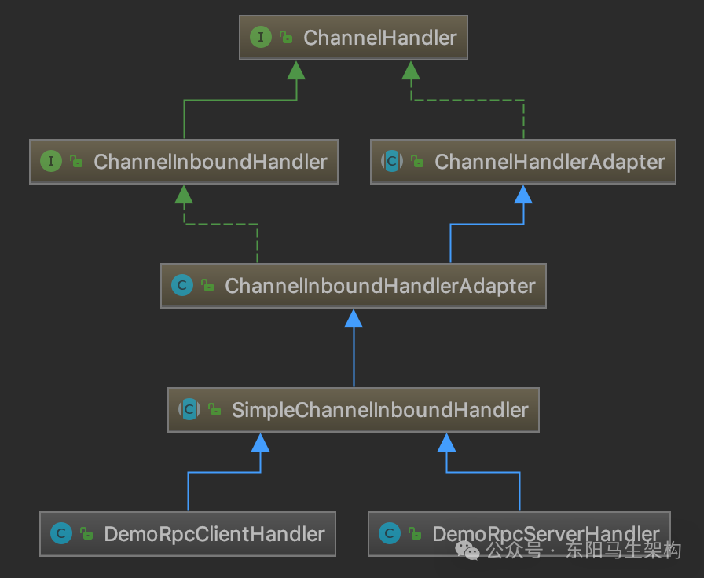

下面来看一下这两个自定义的ChannelHandler实现：

```java
public class DemoRpcServerHandler extends SimpleChannelInboundHandler<Message<Request>> {
    //业务线程池
    private static Executor executor = Executors.newCachedThreadPool();

    protected void channelRead0(final ChannelHandlerContext ctx, Message<Request> message) throws Exception {
        byte extraInfo = message.getHeader().getExtraInfo();
        if (Constants.isHeartBeat(extraInfo)) {//心跳消息，直接返回即可
            channelHandlerContext.writeAndFlush(message);
            return;
        }
        //非心跳消息，直接封装成Runnable提交到业务线程池
        executor.execute(new InvokeRunnable(message, cxt));
    }
}

public class DemoRpcClientHandler extends SimpleChannelInboundHandler<Message<Response>> {
    protected void channelRead0(ChannelHandlerContext ctx, Message<Response> message) throws Exception {
        NettyResponseFuture responseFuture = Connection.IN_FLIGHT_REQUEST_MAP.remove(message.getHeader().getMessageId());
        Response response = message.getContent();
        //心跳消息特殊处理
        if (response == null && Constants.isHeartBeat(message.getHeader().getExtraInfo())) {
            response = new Response();
            response.setCode(Constants.HEARTBEAT_CODE);
        }
        responseFuture.getPromise().setSuccess(response);
    }
}
```

注意，这里有两点需要特别说明一下。

一是Server端的InvokeRunnable，在这个Runnable任务中会根据请求的serviceName、methodName以及参数信息来调用相应的方法：

```java
public class InvokeRunnable implements Runnable {
    private ChannelHandlerContext ctx;
    private Message<Request> message;

    public void run() {
        Response response = new Response();
        Object result = null;
        try {
            Request request = message.getContent();
            String serviceName = request.getServiceName();
            //这里提供BeanManager对所有业务Bean进行管理，其底层在内存中维护了一个业务Bean实例的集合
            Object bean = BeanManager.getBean(serviceName);
            //下面通过反射调用Bean中的相应方法
            Method method = bean.getClass().getMethod(request.getMethodName(), request.getArgTypes());
            result = method.invoke(bean, request.getArgs());
        } catch (Exception e) {
            //省略异常处理
        } finally {

        }
        response.setResult(result);//设置响应结果
        ctx.writeAndFlush(new Message(message.getHeader(), response));//将响应消息返回给客户端
    }
}
```

二是Client端的Connection，它是用来暂存已发送出去但未得到响应的请求。这样在响应返回时，就可以查找到相应的请求以及Future，从而将响应结果返回给上层业务逻辑，具体实现如下：

```cpp
public class Connection implements Closeable {
    //用于生成消息ID，全局唯一
    private static AtomicLong ID_GENERATOR = new AtomicLong(0);

    //TODO 时间轮定时删除
    public static Map<Long, NettyResponseFuture<Response>> IN_FLIGHT_REQUEST_MAP = new ConcurrentHashMap<>();

    private ChannelFuture future;

    private AtomicBoolean isConnected = new AtomicBoolean();

    public Connection(ChannelFuture future, boolean isConnected) {
        this.future = future;
        this.isConnected.set(isConnected);
    }

    public NettyResponseFuture<Response> request(Message<Request> message, long timeOut) {
        //生成并设置消息ID
        long messageId = ID_GENERATOR.incrementAndGet();
        message.getHeader().setMessageId(messageId);
        //创建消息关联的Future
        NettyResponseFuture responseFuture = new NettyResponseFuture(System.currentTimeMillis(), timeOut, message, future.channel(), new DefaultPromise(new DefaultEventLoop()));
        //将消息ID和关联的Future记录到IN_FLIGHT_REQUEST_MAP集合中
        IN_FLIGHT_REQUEST_MAP.put(messageId, responseFuture);
        try {
            future.channel().writeAndFlush(message);//发送请求
        } catch (Exception e) {
            IN_FLIGHT_REQUEST_MAP.remove(messageId);//发送请求异常时，删除对应的Future
            throw e;
        }
        return responseFuture;
    }
}
```

可以看到，Connection中没有定时清理IN_FLIGHT_REQUEST_MAP集合的操作。在无法正常获取响应的时候，就会导致IN_FLIGHT_REQUEST_MAP不断膨胀，最终OOM。我们也可以添加一个时间轮定时器，定时清理过期的请求消息，这里就不再展开了。

完成ChannelHandler的编写后，需要定义DemoRpcClient和DemoRpcServer分别作为Client和Server的启动入口，DemoRpcClient的实现如下：

```cs
public class DemoRpcClient implements Closeable {
    protected Bootstrap clientBootstrap;
    protected EventLoopGroup group;
    private String host;
    private int port;

    public DemoRpcClient(String host, int port) throws Exception {
        this.host = host;
        this.port = port;
        //创建并配置客户端Bootstrap
        clientBootstrap = new Bootstrap();
        group = NettyEventLoopFactory.eventLoopGroup(Constants.DEFAULT_IO_THREADS, "NettyClientWorker");
        clientBootstrap.group(group)
            .option(ChannelOption.TCP_NODELAY, true)
            .option(ChannelOption.SO_KEEPALIVE, true)
            .channel(NioSocketChannel.class)//创建的Channel类型
            .handler(new ChannelInitializer<SocketChannel>() {
                //指定ChannelHandler的顺序
                protected void initChannel(SocketChannel ch) {
                    ch.pipeline().addLast("demo-rpc-encoder", new DemoRpcEncoder());
                    ch.pipeline().addLast("demo-rpc-decoder", new DemoRpcDecoder());
                    ch.pipeline().addLast("client-handler", new DemoRpcClientHandler());
                }
            }
        );
    }

    public ChannelFuture connect() {
        //连接指定的地址和端口
        ChannelFuture connect = clientBootstrap.connect(host, port);
        connect.awaitUninterruptibly();
        return connect;
    }

    public void close() {
        group.shutdownGracefully();
    }
}
```

通过DemoRpcClient的代码可知，ChannelHandler的执行顺序如下：

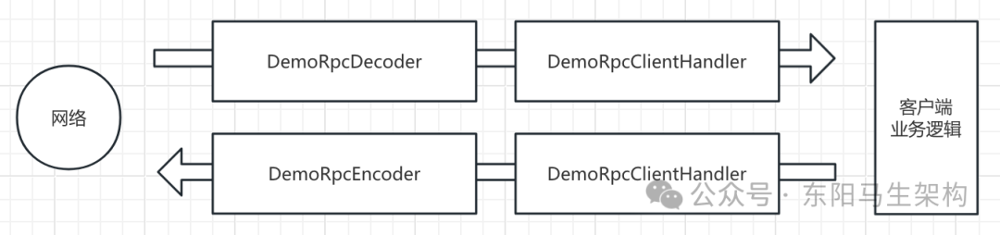

以及创建EventLoopGroup时并没有直接使用NioEventLoopGroup，而由NettyEventLoopFactory根据当前系统进行选择。对于Linux系统会使用EpollEventLoopGroup，其他系统则使用NioEventLoopGroup。

接下来我们再看DemoRpcServer的具体实现：

```cs
public class DemoRpcServer {
    private EventLoopGroup bossGroup;
    private EventLoopGroup workerGroup;
    private ServerBootstrap serverBootstrap;
    private Channel channel;
    protected int port;

    public DemoRpcServer(int port) throws InterruptedException {
        this.port = port;
        //创建boss和worker两个EventLoopGroup，workerGroup的线程数是按照CPU核数计算得到的
        bossGroup = NettyEventLoopFactory.eventLoopGroup(1, "boos");
        workerGroup = NettyEventLoopFactory.eventLoopGroup(Math.min(Runtime.getRuntime().availableProcessors() + 1, 32), "worker");
        serverBootstrap = new ServerBootstrap()
            .group(bossGroup, workerGroup)
            .channel(NioServerSocketChannel.class)
            .option(ChannelOption.SO_REUSEADDR, Boolean.TRUE)
            .childOption(ChannelOption.TCP_NODELAY, Boolean.TRUE)
            .handler(new LoggingHandler(LogLevel.INFO))
            .childHandler(new ChannelInitializer<SocketChannel>() {
                //指定每个Channel上注册的ChannelHandler以及顺序
                protected void initChannel(SocketChannel ch) {
                    ch.pipeline().addLast("demp-rpc-decoder", new DemoRpcDecoder());
                    ch.pipeline().addLast("demo-rpc-encoder", new DemoRpcEncoder());
                    ch.pipeline().addLast("server-handler", new DemoRpcServerHandler());
                }
            }
        );
    }

    public ChannelFuture start() throws InterruptedException {
        //监听指定的端口
        ChannelFuture channelFuture = serverBootstrap.bind(port);
        channel = channelFuture.channel();
        channel.closeFuture();
        return channelFuture;
    }
}
```

通过DemoRpcServer的代码可知，ChannelHandler的执行顺序如下：

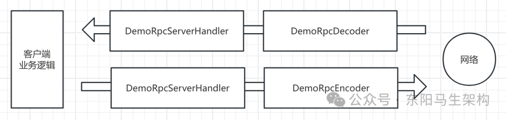

### (6)registry相关实现

介绍完客户端和服务端的通信之后，下面看简易RPC框架的另一个基础能力—服务注册与服务发现能力，对应demo-rpc项目源码中的registry包。

registry包主要是依赖Curator实现了一个简易版本的ZooKeeper客户端，并基于ZooKeeper实现了注册中心最基本的两个功能：Provider注册以及Consumer订阅。

这里先定义一个Registry接口提供注册以及查询服务实例的方法，如下所示：

```java
public interface Registry<T> {
    void registerService(ServiceInstance<T> service) throws Exception;
    void unregisterService(ServiceInstance<T> service) throws Exception;
    List<ServiceInstance<T>> queryForInstances(String name) throws Exception;
}
```

ZooKeeperRegistry是基于curator-x-discovery对Registry接口的实现类型，其中封装了ServiceDiscovery，并在其上添加了ServiceCache缓存提高查询效率，ZooKeeperRegistry的具体实现如下：

```java
public class ZookeeperRegistry<T> implements Registry<T> {
    private Map<String, List<ServiceInstanceListener<T>>> listeners = Maps.newConcurrentMap();
    private InstanceSerializer serializer = new JsonInstanceSerializer<>(ServerInfo.class);
    private ServiceDiscovery<T> serviceDiscovery;
    private ServiceCache<T> serviceCache;
    private String address = "localhost:2181";

    public void start() throws Exception {
        String root = "/demo/rpc";
        //初始化CuratorFramework
        CuratorFramework client = CuratorFrameworkFactory.newClient(address, new ExponentialBackoffRetry(1000, 3));
        client.start();//启动Curator客户端

        //初始化ServiceDiscovery
        serviceDiscovery = ServiceDiscoveryBuilder.builder(ServerInfo.class).client(client).basePath(root).serializer(serializer).build();
        serviceDiscovery.start(); //启动ServiceDiscovery

        //创建ServiceCache，监Zookeeper相应节点的变化，也方便后续的读取
        serviceCache = serviceDiscovery.serviceCacheBuilder().name("/demoService").build();
        client.blockUntilConnected();//阻塞当前线程，等待连接成功
        serviceDiscovery.start();//启动ServiceDiscovery
        serviceCache.start();//启动ServiceCache
    }

    @Override
    public void registerService(ServiceInstance<T> service) throws Exception {
        serviceDiscovery.registerService(service);
    }

    @Override
    public void unregisterService(ServiceInstance service) throws Exception {
        serviceDiscovery.unregisterService(service);
    }

    @Override
    public List<ServiceInstance<T>> queryForInstances(String name) throws Exception {
        //直接根据name进行过滤ServiceCache中的缓存数据
        return serviceCache.getInstances().stream().filter(s -> s.getName().equals(name)).collect(Collectors.toList());
    }
}
```

通过对ZooKeeperRegistry的分析可以得知：它是基于Curator中的ServiceDiscovery组件与ZooKeeper进行交互的，并且对Registry接口的实现也是通过直接调用ServiceDiscovery的相关方法实现的。

在查询时，直接读取ServiceCache中的缓存数据。ServiceCache底层在本地维护了一个ConcurrentHashMap缓存，通过PathChildrenCache监听ZooKeeper中各个子节点的变化，同步更新本地缓存。

这里简单看一下ServiceCache的核心实现：

```cs
public class ServiceCacheImpl<T> implements ServiceCache<T>, PathChildrenCacheListener {
    private final ServiceDiscoveryImpl<T> discovery;
    private final PathChildrenCache cache;
    private final ConcurrentMap<String, ServiceInstance<T>> instances = Maps.newConcurrentMap();

    public List<ServiceInstance<T>> getInstances() {
        return Lists.newArrayList(instances.values());
    }

    public void childEvent(CuratorFramework client, PathChildrenCacheEvent event) throws Exception {
        switch(event.getType()) {
            case CHILD_ADDED:
            case CHILD_UPDATED: {
                addInstance(event.getData(), false);
                notifyListeners = true;
                break;
            }
            case CHILD_REMOVED: {
                instances.remove(instanceIdFromData(event.getData()));
                notifyListeners = true;
                break;
            }
        }
        ...
    }
}
```

### (7)proxy相关实现

在简易版Demo RPC框架中，Proxy主要是为Client端创建一个代理，帮助客户端程序屏蔽底层的网络操作以及与注册中心之间的交互。

简易版Demo RPC使用JDK动态代理的方式生成代理，这里需要编写一个InvocationHandler接口的实现，即下面的DemoRpcProxy。

其中DemoRpcProxy有两个核心方法：

```cpp
方法一：newInstance()
用于生成代理对象；

方法二：invoke()
当调用目标对象的时候，会执行invoke()方法中的代理逻辑；
```

下面是DemoRpcProxy的具体实现：

```java
public class DemoRpcProxy implements InvocationHandler {
    private String serviceName; //需要代理的服务(接口)名称
    public Map<Method, Header> headerCache = new ConcurrentHashMap<>();
    private Registry<ServerInfo> registry;//用于与Zookeeper交互，其中自带缓存

    public DemoRpcProxy(String serviceName, Registry<ServerInfo> registry) throws Exception {
        this.serviceName = serviceName;
        this.registry = registry;
    }

    public static <T> T newInstance(Class<T> clazz, Registry<ServerInfo> registry) throws Exception {
        //创建代理对象
        return (T) Proxy.newProxyInstance(Thread.currentThread().getContextClassLoader(), new Class[]{clazz}, new DemoRpcProxy("demoService", registry));
    }

    @Override
    public Object invoke(Object proxy, Method method, Object[] args) throws Throwable {
        //从Zookeeper缓存中获取可用的Server地址,并随机从中选择一个
        List<ServiceInstance<ServerInfo>> serviceInstances = registry.queryForInstances(serviceName);
        ServiceInstance<ServerInfo> serviceInstance = serviceInstances.get(ThreadLocalRandom.current().nextInt(serviceInstances.size()));
        //创建请求消息，然后调用remoteCall()方法请求上面选定的Server端
        String methodName = method.getName();
        Header header = headerCache.computeIfAbsent(method, h -> new Header(MAGIC, VERSION_1));
        Message<Request> message = new Message(header, new Request(serviceName, methodName, args));
        return remoteCall(serviceInstance.getPayload(), message);
    }

    protected Object remoteCall(ServerInfo serverInfo, Message message) throws Exception {
        if (serverInfo == null) {
            throw new RuntimeException("get available server error");
        }
        Object result;
        try {
            //创建DemoRpcClient连接指定的Server端
            DemoRpcClient demoRpcClient = new DemoRpcClient(serverInfo.getHost(), serverInfo.getPort());
            ChannelFuture channelFuture = demoRpcClient.connect().awaitUninterruptibly();
            //创建对应的Connection对象，并发送请求
            Connection connection = new Connection(channelFuture, true);
            NettyResponseFuture responseFuture = connection.request(message, Constants.DEFAULT_TIMEOUT);
            //等待请求对应的响应
            result = responseFuture.getPromise().get(Constants.DEFAULT_TIMEOUT, TimeUnit.MILLISECONDS);
        } catch (Exception e) {
            throw e;
        }
        return result;
    }
}
```

从DemoRpcProxy的实现中我们可以看到，它依赖了ServiceInstanceCache获取ZooKeeper中注册的Server端地址，同时依赖了DemoRpcClient与Server端进行通信，上层调用方拿到这个代理对象后，就可以像调用本地方法一样进行调用，而不再关心底层网络通信和服务发现的细节。

当然，这个简易版DemoRpcProxy的实现还有很多可以优化的地方，例如：

优化一：缓存DemoRpcClient客户端对象以及相应的Connection对象，不必每次进行创建；

优化二：可以添加失败重试机制，在请求出现超时的时候，进行重试；

优化三：可以添加更加复杂和灵活的负载均衡机制，例如根据Hash值散列进行负载均衡、根据节点load情况进行负载均衡等；

### (8)使用方接入

介绍完Demo RPC的核心实现之后，下面讲解下Demo RPC框架的使用方式。这里涉及Consumer、DemoServiceImp、Provider三个类以及DemoService业务接口。

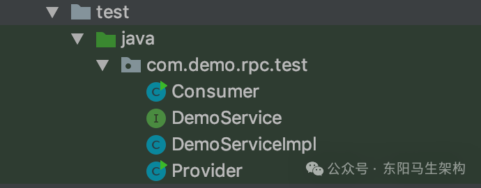

首先，定义DemoService接口作为业务Server服务端Provider的接口，具体定义如下：

```typescript
public interface DemoService {
    String sayHello(String param);
}
```

DemoServiceImpl对DemoService接口的实现也非常简单，如下所示，将参数做简单修改后返回：

```typescript
public class DemoServiceImpl implements DemoService {
    public String sayHello(String param) {
        return "hello:" + param;
    }
}
```

了解完相应的业务接口和实现之后，我们再来看Provider的实现，它的角色类似于Dubbo中的Provider。Provider会创建DemoServiceImpl这个业务Bean并将自身的地址信息暴露出去，如下所示：

```java
public class Provider {
    public static void main(String[] args) throws Exception {
        //创建DemoServiceImpl，并注册到BeanManager中
        BeanManager.registerBean("demoService", new DemoServiceImpl());
        //创建ZookeeperRegistry，并将Provider的地址信息封装成ServerInfo
        //对象注册到Zookeeper
        ZookeeperRegistry<ServerInfo> discovery = new ZookeeperRegistry<>();
        discovery.start();
        ServerInfo serverInfo = new ServerInfo("127.0.0.1", 20880);
        discovery.registerService(ServiceInstance.<ServerInfo>builder().name("demoService").payload(serverInfo).build());
        //启动DemoRpcServer，等待Client的请求
        DemoRpcServer rpcServer = new DemoRpcServer(20880);
        rpcServer.start();
    }
}
```

最后是Consumer，它类似于Dubbo中的Consumer，其会订阅Provider地址信息。然后根据这些信息选择一个Provider建立连接，发送请求并得到响应，这些过程在Proxy中都予以了封装。所以Consumer的实现很简单，可参考如下示例代码：

```java
public class Consumer {
    public static void main(String[] args) throws Exception {
        //创建ZookeeperRegistr对象
        ZookeeperRegistry<ServerInfo> discovery = new ZookeeperRegistry<>();
        discovery.start();
        //创建代理对象，通过代理调用远端Server
        DemoService demoService = DemoRpcProxy.newInstance(DemoService.class, discovery);
        //调用sayHello()方法，并输出结果
        String result = demoService.sayHello("hello");
        System.out.println(result);
    }
}
```

### (9)RPC框架核心实现总结

这里首先介绍了简易RPC框架中的transport包，它在编解码器基础上，实现了服务端和客户端的通信能力。接着介绍了registry包如何实现与ZooKeeper交互，完善了简易RPC框架的服务注册与服务发现的能力。接下来又分析了proxy包的实现，其中通过JDK动态代理的方式，帮接入方屏蔽了底层网络通信的复杂性。最后编写了一个简单的DemoService业务接口，以及相应的Provider和Consumer接入简易RPC框架。
