# Dubbo原理—4.注册中心的实现(缓存+重试)

> **公众号**: 东阳马生架构  
> **发布时间**: 2025-07-21 09:00  

**大纲(17656字)**

- 1.通过本地缓存来降低ZooKeeper压力
- 2.重试机制是网络操作的基本保证
- 3.ZooKeeper注册中心的实现


## 1.通过本地缓存来降低ZooKeeper压力

### (1)注册中心在Dubbo架构中的位置

### (2)注册中心的核心接口

### (3)注册中心抽象类AbstractRegistry

### (4)注册中心总结

### (1)注册中心在Dubbo架构中的位置

注册中心(Registry)在微服务架构中的作用举足轻重。有了它，服务提供者(Provider)和消费者(Consumer)就能感知彼此。从下面的Dubbo架构图中可知：

```
说明一：Provider从容器启动后的初始化阶段便会向注册中心完成注册操作
说明二：Consumer启动初始化阶段会完成对所需Provider的订阅操作
说明三：另外在Provider发生变化时，需要通知监听的Consumer
```

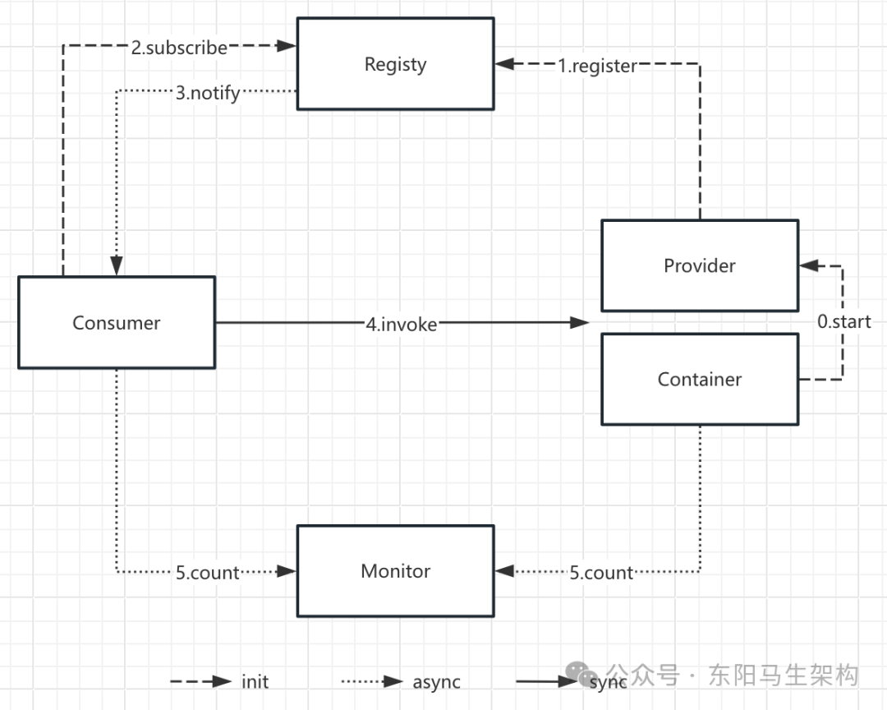

Registry只是Consumer和Provider感知彼此状态变化的一种便捷途径而已，Consumer和Provider之间的通讯交互过程是直接进行的，对于Registry来说是透明无感的。Provider状态发生变化了，会由Registry主动推送订阅了该Provider的所有Consumer。这保证了Consumer感知Provider状态变化的及时性，也将和具体业务需求逻辑交互解耦，提升了系统的稳定性。

Dubbo中的Registry翻译过来的意思是注册中心，但它其实是应用本地的注册中心客户端，真正的注册中心服务是其他独立部署的进程或者进程组成的集群，比如ZooKeeper集群。本地的Registry通过和ZooKeeper等进行实时的信息同步，维持这些内容的一致性，从而实现了注册中心这个特性。另外就Registry而言，Consumer和Provider只是个用户视角的概念，它们被抽象为了一条URL。

注册中心在Dubbo架构中所处的位置如下，也就是在整个Dubbo体系图中的Registry层。可以看到这部分内容在整个Dubbo体系中还是相对独立的，没有涉及Protocol、Invoker等Dubbo内部的概念。

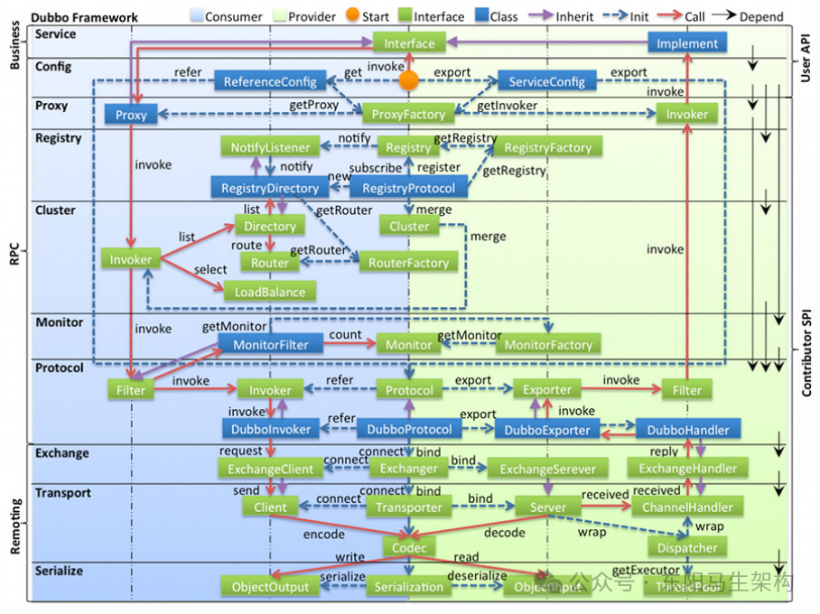

### (2)注册中心的核心接口

下面先介绍dubbo-registry-api模块中的核心抽象接口，如下图示：

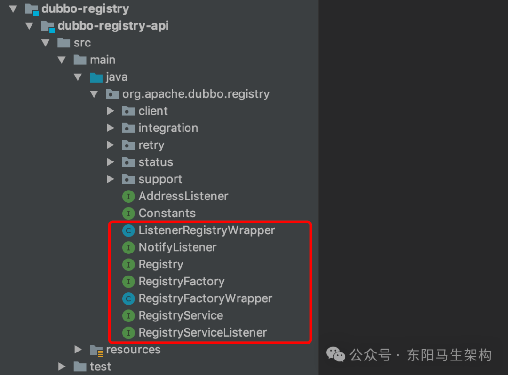

接口一：Node接口

在Dubbo中，一般使用Node这个接口来抽象节点的概念。Node不仅可以表示Provider和Consumer节点，还可以表示注册中心节点。Node接口定义了三个非常基础的方法，如下所示：

```cs
public interface Node {
    //getUrl()方法返回表示当前节点的URL
    URL getUrl();

    //isAvailable()检测当前节点是否可用
    boolean isAvailable();

    //destroy()方法负责销毁当前节点并释放底层资源
    void destroy();
}
```

接口二：RegistryService接口

RegistryService接口抽象了服务注册的基本行为，如下所示：

```cs
public interface RegistryService {
    //向注册中心注册一个URL
    void register(URL url);

    //向注册中心取消注册一个URL
    void unregister(URL url);

    //向注册中心订阅一个URL
    //订阅成功后，当URL发生变化时，注册中心会主动通知第二个参数指定的NotifyListener对象
    //NotifyListener接口中定义的notify()方法就是用来接收该通知的
    void subscribe(URL url, NotifyListener listener);

    //向注册中心取消订阅一个URL
    void unsubscribe(URL url, NotifyListener listener);

    //lookup()方法能够查询符合条件的注册数据，它与subscribe()方法有一定的区别，
    //subscribe()方法采用的是push模式，lookup()方法采用的是pull模式；
    List<URL> lookup(URL url);
}
```

接口三：Registry接口

Registry接口继承了RegistryService接口和Node接口，它表示的就是一个拥有注册中心能力的节点。如下所示，其中的reExportRegister()方法和reExportUnregister()方法都会委托给RegistryService中的相应方法进行处理。

```typescript
public interface Registry extends Node, RegistryService {
    default void reExportRegister(URL url) {
        register(url);
    }

    default void reExportUnregister(URL url) {
        unregister(url);
    }
}
```

接口四：RegistryFactory接口

RegistryFactory接口是Registry的工厂接口，负责创建Registry对象，具体定义如下：

```kotlin
@SPI("dubbo")
public interface RegistryFactory {
    @Adaptive({"protocol"})
    Registry getRegistry(URL url);
}
```

其中@SPI注解指定了默认的扩展名为dubbo，@Adaptive注解表示会生成适配器类并根据URL参数中的protocol参数值选择相应的实现。

通过下面两张继承关系图可以看出：每个Registry实现类都有对应的RegistryFactory工厂实现，每个RegistryFactory工厂实现只负责创建对应的Registry对象。

Registry继承关系图：

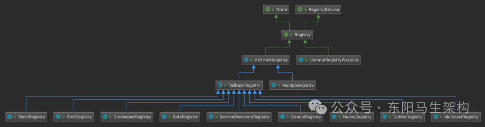

RegistryFactory继承关系图：

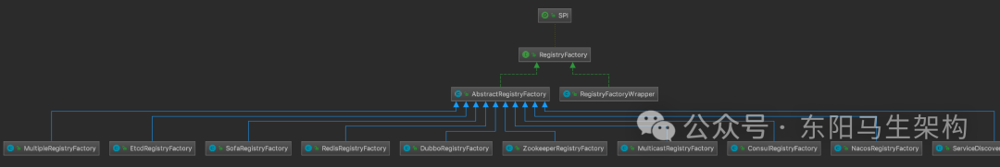

创建的Registry对象外层封装了一个ListenerRegistryWrapper。

ListenerRegistryWrapper中维护了一个RegistryServiceListener监听器。

ListenerRegistryWrapper会将register()、subscribe()等事件通知到RegistryServiceListener监听器。

AbstractRegistryFactory是一个实现了RegistryFactory接口的抽象类，它提供了规范URL的操作以及缓存Registry对象的公共能力，其中缓存Registry对象是使用HashMap集合实现的(REGISTRIES静态字段)。

在规范URL的实现逻辑中：AbstractRegistryFactory会将RegistryService的类名设置为URL path和interface参数，同时删除export和refer参数。

### (3)注册中心抽象类AbstractRegistry

#### 一.AbstractRegistry的核心字段

#### 二.AbstractRegistry的核心功能

AbstractRegistry实现了Registry接口，虽然AbstractRegistry本身在内存中实现了注册数据的读写功能，也没有什么抽象方法，但它依然被标记成了抽象类。从前面的Registry继承关系图中可以看出，Registry接口的所有实现类都继承了AbstractRegistry。为了减轻注册中心组件的压力：AbstractRegistry会把当前节点订阅的URL信息缓存到本地的Properties文件中。

#### 一.AbstractRegistry的核心字段

字段一：registryUrl

该字段的类型是URL类型，它包含了创建该Registry对象的全部配置信息，是AbstractRegistryFactory修改后的产物。

字段二：properties和file

properties字段的类型是Properties类型，file字段的类型是File类型。properties是加载到内存的Properties对象，file是磁盘上对应的文件，两者的数据是同步的。

在AbstractRegistry初始化时，会根据registryUrl中的file.cache参数值决定是否开启文件缓存。如果开启文件缓存功能，就会立即将file文件中的KV缓存加载到properties字段中。当properties中的注册数据发生变化时，会写入本地的file文件进行同步。

properties是一个kv结构，其中key是当前节点作为Consumer的一个URL，value是对应的Provider列表，包含了所有Category(例如providers、routes、configurators等)下的URL。properties中有一个特殊的key值为registries，对应的value是注册中心列表，其他记录的都是Provider列表。

字段三：syncSaveFile

该字段的类型是boolean类型，表示是否将变更的数据同步保存到文件中，对应的是registryUrl中的save.file参数。

字段四：registryCacheExecutor

该字段的类型是ExecutorService类型，它是一个单线程的线程池。在一个Provider的注册数据发生变化的时候，会将该Provider的全量数据同步到properties字段和缓存文件中。如果syncSaveFile配置为false，就由该线程池异步完成文件写入。

字段五：lastCacheChanged

该字段的类型是AtomicLong类型，表示注册数据的版本号。每次写入file文件时，都是全覆盖写入，而不是修改文件。所以需要版本控制，防止旧数据覆盖新数据。

字段六：registered

该字段的类型是Set类型，表示注册的URL集合。

字段七：subscribed

该字段的类型是ConcurrentMap类型，表示订阅URL的监听器集合。其中key是被监听的URL，value是相应的监听器集合。

字段八：notified

该字段的类型是ConcurrentMap类型。其中key是当前节点作为Consumer的一个URL，表示的是该节点的某个Consumer角色。value是一个Map集合，Map集合的key是Provider URL的分类，value就是相应分类下的URL集合。

```java
public abstract class AbstractRegistry implements Registry {
    //该URL包含了创建该Registry对象的全部配置信息，是AbstractRegistryFactory修改后的产物
    private URL registryUrl;

    //表示本地的Properties文件缓存
    //properties是一个kv结构，其中key是当前节点作为Consumer的一个URL，value是对应的Provider列表，包含了所有Category(例如providers、routes、configurators等)下的URL
    //properties中有一个特殊的key值为registries，对应的value是注册中心列表，其他记录的都是Provider列表。
    private final Properties properties = new Properties();
    private File file;

    //是否同步保存文件的配置，对应的是registryUrl中的save.file参数
    private boolean syncSaveFile;

    //单线程的线程池，会将该Provider的全量数据同步到properties字段和缓存文件中
    private final ExecutorService registryCacheExecutor = Executors.newFixedThreadPool(1, new NamedThreadFactory("DubboSaveRegistryCache", true));

    //注册数据的版本号，每次写入file文件时，都是全覆盖写入，而不是修改文件
    private final AtomicLong lastCacheChanged = new AtomicLong();

    //表示注册的URL集合
    private final Set<URL> registered = new ConcurrentHashSet<>();

    //表示订阅URL的监听器集合，其中key是被监听的URL，value是相应的监听器集合
    private final ConcurrentMap<URL, Set<NotifyListener>> subscribed = new ConcurrentHashMap<>();

    //key是当前节点作为Consumer的一个URL，表示的是该节点的某个Consumer角色；
    //value是一个Map集合，Map集合的key是Provider URL的分类，value就是相应分类下的URL集合
    private final ConcurrentMap<URL, Map<String, List<URL>>> notified = new ConcurrentHashMap<>();
    ...
}
```

#### 二.AbstractRegistry的核心功能

功能一：本地缓存

功能二：注册和订阅

功能三：恢复和销毁

功能一：本地缓存

作为一个RPC框架，Dubbo在微服务架构中解决了各个服务间协作的难题。作为Provider和Consumer的底层依赖，Dubbo会与服务一起打包部署。dubbo-registry也仅仅是其中一个依赖包，负责完成与ZooKeeper、etcd等服务发现组件的交互。

当Provider端暴露的URL发生变化时，ZooKeeper等服务发现组件会通知Consumer端的Registry组件。Registry组件会调用notify()方法，被通知的Consumer能匹配到所有Provider的URL列表并写入properties集合中。

下面是notify()方法的核心实现：

```typescript
public abstract class AbstractRegistry implements Registry {
    ...
    protected void notify(URL url, NotifyListener listener, List<URL> urls) {
        ...
        Map<String, List<URL>> result = new HashMap<>();
        for (URL u : urls) {
            if (UrlUtils.isMatch(url, u)) {
                String category = u.getParameter("category", "providers");
                List<URL> categoryList = result.computeIfAbsent(category, k -> new ArrayList<>());
                categoryList.add(u);
            }
        }

        if (result.size() == 0) {
            return;
        }

        Map<String, List<URL>> categoryNotified = notified.computeIfAbsent(url, u -> new ConcurrentHashMap<>());
            for (Map.Entry<String, List<URL>> entry : result.entrySet()) {
            String category = entry.getKey();
            List<URL> categoryList = entry.getValue();
            categoryNotified.put(category, categoryList);
            listener.notify(categoryList);
            //写入properties集合，进行本地缓存
            saveProperties(url);
        }
    }
    ...
}
```

saveProperties()方法会取出Consumer订阅的各个分类的URL连接起来(中间以空格分隔)，然后以Consumer的ServiceKey为键值写到properties(本地缓存)中，同时自增lastCacheChanged版本号。

完成properties字段的更新之后，会根据syncSaveFile字段值来决定是在当前线程同步更新file文件，还是向registryCacheExecutor线程池提交任务异步更新file文件。

本地缓存文件的具体路径是：

```css
/.dubbo/dubbo-registry-[当前应用名]-[当前Registry所在的IP地址].cache。
```

这里需要关注notify()方法的两个细节：

第一个细节是UrlUtils的isMatch()方法，该方法会完成Consumer URL与Provider URL的匹配，依次匹配的部分如下所示：

```sql
规则一：匹配Consumer和Provider的接口(优先取interface参数，其次再取path)，双方接口相同或者其中一方为"*"，则匹配成功执行下一步
规则二：匹配Consumer和Provider的category
规则三：检测Consumer URL和Provider URL中的enable参数是否符合条件
规则四：检测Consumer和Provider端的group、version以及classifier是否符合条件
```

第二个细节是URL的getServiceKey()方法，该方法返回的ServiceKey是properties集合以及相应缓存文件中的key，ServiceKey的格式是：[group]/{interface(或path)}[:version]。

在AbstractRegistry的构造方法中，会调用loadProperties()方法将上面写入的本地缓存文件加载到properties对象中。在网络抖动等原因而导致订阅失败时，Consumer端的Registry就可以调用getCacheUrls()方法获取本地缓存，从而得到最近注册的Provider URL，可见AbstractRegistry通过本地缓存提供了一种容错机制来保证服务的可靠性。

功能二：注册和订阅

AbstractRegistry实现了Registry接口：

```
说明一：registry()方法会将当前节点要注册的URL缓存到registered集合
说明二：unregistry()方法会从registered集合删除指定的URL，例如当前节点下线的时候
说明三：subscribe()方法会将当前节点作为Consumer的URL以及相关的NotifyListener记录到subscribed集合
说明四：unsubscribe()方法会将当前节点的URL以及关联的NotifyListener从subscribed集合删除
```

这四个方法都是简单的集合操作：

```typescript
public abstract class AbstractRegistry implements Registry {
    ...
    //向注册中心注册一个URL
    //这里只是先添加到内存中，子类会实现具体的网络交互
    @Override
    public void register(URL url) {
        if (url == null) {
            throw new IllegalArgumentException("register url == null");
        }
        if (logger.isInfoEnabled()) {
            logger.info("Register: " + url);
        }
        registered.add(url);
    }

    //向注册中心取消注册一个URL
    //这里只是先从内存中移除，子类会实现具体的网络交互
    @Override
    public void unregister(URL url) {
        if (url == null) {
            throw new IllegalArgumentException("unregister url == null");
        }
        if (logger.isInfoEnabled()) {
            logger.info("Unregister: " + url);
        }
        registered.remove(url);
    }

    //向注册中心订阅一个URL
    //这里只是先添加到内存中，子类会实现具体的网络交互
    //当注册中心中的URL发生变化时，便会通过NotifyListener进行通知
    @Override
    public void subscribe(URL url, NotifyListener listener) {
        if (url == null) {
            throw new IllegalArgumentException("subscribe url == null");
        }
        if (listener == null) {
            throw new IllegalArgumentException("subscribe listener == null");
        }
        if (logger.isInfoEnabled()) {
            logger.info("Subscribe: " + url);
        }
        //给这个URL添加NotifyListener监听器
        Set<NotifyListener> listeners = subscribed.computeIfAbsent(url, n -> new ConcurrentHashSet<>());
        listeners.add(listener);
    }

    //向注册中心取消订阅一个URL
    //这里只是从内存中移除，子类会实现具体的网络交互
    @Override
    public void unsubscribe(URL url, NotifyListener listener) {
        if (url == null) {
            throw new IllegalArgumentException("unsubscribe url == null");
        }
        if (listener == null) {
            throw new IllegalArgumentException("unsubscribe listener == null");
        }
        if (logger.isInfoEnabled()) {
            logger.info("Unsubscribe: " + url);
        }
        Set<NotifyListener> listeners = subscribed.get(url);
        if (listeners != null) {
            listeners.remove(listener);
        }
    }
    ...
}
```

单看AbstractRegistry的实现，上述四个基础的注册、订阅方法都是内存操作，但是Java有继承和多态的特性，AbstractRegistry的子类会覆盖上述四个基础的注册、订阅方法进行增强。

功能三：恢复和销毁

AbstractRegistry中还有另外两个需要关注的方法：recover()方法和destroy()方法。

如果Provider因为网络问题与注册中心断开连接，那么会进行重连。重新连接成功后，会调用recover()方法将registered集合中的全部URL重新执行一遍register()方法来恢复注册数据。同样recover()方法也会将subscribed集合中的URL重新执行一遍subscribe()方法来恢复订阅监听器。recover()方法的具体实现比较简单，见如下代码。

如果当前节点下线，那么会调用Node的destroy()方法释放底层资源。destroy()方法会调用unregister()方法和unsubscribe()方法将当前节点注册的URL以及订阅的监听全部清理掉，其中不会清理非动态注册的URL(即dynamic参数明确指定为false)。AbstractRegistry中destroy()方法的实现比较简单，见如下代码；

```typescript
public abstract class AbstractRegistry implements Registry {
    ...
    protected void recover() throws Exception {
        //register
        Set<URL> recoverRegistered = new HashSet<>(getRegistered());
        if (!recoverRegistered.isEmpty()) {
            if (logger.isInfoEnabled()) {
                logger.info("Recover register url " + recoverRegistered);
            }
            for (URL url : recoverRegistered) {
                register(url);
            }
        }

        //subscribe
        Map<URL, Set<NotifyListener>> recoverSubscribed = new HashMap<>(getSubscribed());
        if (!recoverSubscribed.isEmpty()) {
            if (logger.isInfoEnabled()) {
                logger.info("Recover subscribe url " + recoverSubscribed.keySet());
            }
            for (Map.Entry<URL, Set<NotifyListener>> entry : recoverSubscribed.entrySet()) {
                URL url = entry.getKey();
                for (NotifyListener listener : entry.getValue()) {
                    subscribe(url, listener);
                }
            }
        }
    }

    @Override
    public void destroy() {
        if (logger.isInfoEnabled()) {
            logger.info("Destroy registry:" + getUrl());
        }
        Set<URL> destroyRegistered = new HashSet<>(getRegistered());
        if (!destroyRegistered.isEmpty()) {
            for (URL url : new HashSet<>(getRegistered())) {
                if (url.getParameter(DYNAMIC_KEY, true)) {
                    try {
                        unregister(url);
                        if (logger.isInfoEnabled()) {
                            logger.info("Destroy unregister url " + url);
                        }
                    } catch (Throwable t) {
                        logger.warn("Failed to unregister url " + url + " to registry " + getUrl() + " on destroy, cause: " + t.getMessage(), t);
                    }
                }
            }
        }

        Map<URL, Set<NotifyListener>> destroySubscribed = new HashMap<>(getSubscribed());
        if (!destroySubscribed.isEmpty()) {
            for (Map.Entry<URL, Set<NotifyListener>> entry : destroySubscribed.entrySet()) {
                URL url = entry.getKey();
                for (NotifyListener listener : entry.getValue()) {
                    try {
                        unsubscribe(url, listener);
                        if (logger.isInfoEnabled()) {
                            logger.info("Destroy unsubscribe url " + url);
                        }
                    } catch (Throwable t) {
                        logger.warn("Failed to unsubscribe url " + url + " to registry " + getUrl() + " on destroy, cause: " + t.getMessage(), t);
                    }
                }
            }
        }
        AbstractRegistryFactory.removeDestroyedRegistry(this);
    }
    ...
}
```

### (4)注册中心总结

```typescript
//AbstractRegistry包含了注册中心里面一些通用的、公共的能力
//涉及到两大公共基础能力：
//一是基于本地磁盘文件的数据缓存写入，二是重启时恢复加载
//注册、取消注册、订阅、取消订阅、变更通知等这些注册中心相关的交互逻辑，都会在这里有对应的数据结构进行处理
public abstract class AbstractRegistry implements Registry {
    ...
    public AbstractRegistry(URL url) {
        //设置注册中心的url地址
        setUrl(url);

        //从model组件里获取bean工厂，从bean容器里获取RegistryManager实例
        registryManager = url.getOrDefaultApplicationModel().getBeanFactory().getBean(RegistryManager.class);

        //本地磁盘缓存是否开启，默认就是开启的
        //对于每一个provider或者consumer，但凡用了ZookeeperRegistry都会自动开启本地磁盘缓存
        //这样就可以确保，如果当前所在机器突然宕机了，重启时就会重新注册和订阅
        //而在这个过程中，就可以将磁盘里缓存的一些数据恢复出来继续使用
        localCacheEnabled = url.getParameter(REGISTRY_LOCAL_FILE_CACHE_ENABLED, true);

        //获取到一个共享线程池——cache线程池，它的线程数量会无限大，但是空闲超过60s的线程会自动回收
        //它的获取方式是：通过model组件先拿到SPI，然后SPI去获取组件接口的实例，最后调用获取共享线程池的方法
        //所以在任何地方，都可以拿到公共使用的线程池存储组件，并从里面拿到自己需要的线程池
        registryCacheExecutor = url.getOrDefaultFrameworkModel().getBeanFactory().getBean(FrameworkExecutorRepository.class).getSharedScheduledExecutor();

        //如果本地缓存启用了，就会去进行磁盘持久化
        if (localCacheEnabled) {
            //Start file save timer
            //启动一个自动刷盘存储的定时器timer
            //该timer会一直不停的执行，将内存里不停变化的数据定时写入到磁盘里去
            //这样通过本地磁盘的缓存，如果本地机器突然崩溃了，那么重启后进行重新注册或者订阅发现时
            //如果此时zk也不可用，那么服务订阅和发现在短时间内就没法实现了
            //所以可以从磁盘缓存里恢复一些数据回来，让之前订阅和发现过的数据都可以使用

            //是否同步写入磁盘文件里去，默认是false
            syncSaveFile = url.getParameter(REGISTRY_FILESAVE_SYNC_KEY, false);

            //默认的磁盘文件目录和文件名，USER_HOME是操作系统他的用户的目录
            //比如"/zhangsan/.dubbo/dubbo-registry-demo-zookeeper-127.0.0.1-2181.cache"
            String defaultFilename = System.getProperty(USER_HOME) + DUBBO_REGISTRY + url.getApplication() + "-" + url.getAddress().replaceAll(":", "-") + CACHE;
            String filename = url.getParameter(FILE_KEY, defaultFilename);

            //把文件名称封装为File对象
            File file = null;
            if (ConfigUtils.isNotEmpty(filename)) {
                file = new File(filename);
                //属于对文件的上级目录的处理
                if (!file.exists() && file.getParentFile() != null && !file.getParentFile().exists()) {
                    if (!file.getParentFile().mkdirs()) {
                        throw new IllegalArgumentException("Invalid registry cache file " + file + ", cause: Failed to create directory " + file.getParentFile() + "!");
                    }
                }
            }
            this.file = file;

            //如果是第一次启动，那么此时本地缓存里是什么都没有的
            //如果是之前启动过，进行订阅和发现过服务数据，那么本地磁盘里是有缓存数据的
            //这时再次重启就可以先加载本地磁盘里的缓存数据了
            //也就是把本地磁盘里的数据，都加载到properties里去，做好准备以免注册中心此时突然故障，也可以使用缓存数据
            loadProperties();

            //notify概念：也就是从注册中心的url地址里获取备用的一批url地址，拿到这批备用url地址后再做一个notify操作
            //下面notify()会先调用saveProperties()，再调用doSaveProperties()通过文件锁进行磁盘IO操作
            notify(url.getBackupUrls());
        }
    }
    ...

    public void doSaveProperties(long version) {
        ...
        //Save
        File lockfile = null;
        try {
            //Dubbo写的一些磁盘IO操作，都是很经典的
            //如果要对本地磁盘发起一些IO操作，需要先建立一个磁盘文件锁
            lockfile = new File(file.getAbsolutePath() + ".lock");
            if (!lockfile.exists()) {
                lockfile.createNewFile();
            }

            //针对锁文件lockfile，新建一个RandomAccessFile
            try (RandomAccessFile raf = new RandomAccessFile(lockfile, "rw"); FileChannel channel = raf.getChannel()) {
                //此时就可以在API代码层面，针对这个锁文件进行lock加锁
                //因为如果有其他线程，其执行的代码也走到了这里，它就会直接被block住，因为锁只能有一个线程去加
                FileLock lock = channel.tryLock();
                if (lock == null) {
                    throw new IOException("...");
                }

                //Save
                try {
                    if (!file.exists()) {
                        file.createNewFile();
                    }
                    Properties tmpProperties;
                    if (syncSaveFile) {
                        tmpProperties = properties;
                  } else {
                        tmpProperties = new Properties();
                        Set<Map.Entry<Object, Object>> entries = properties.entrySet();
                        for (Map.Entry<Object, Object> entry : entries) {
                            tmpProperties.setProperty((String) entry.getKey(), (String) entry.getValue());
                        }
                    }
                    //磁盘IO的核心就是如下两行使用file output stream
                    try (FileOutputStream outputFile = new FileOutputStream(file)) {
                        //基于JDK提供的API进行文件IO操作
                        tmpProperties.store(outputFile, "Dubbo Registry Cache");
                    }
                } finally {
                    lock.release();
                }
            }
        } catch (Throwable e) {
            //万一刷盘时失败了，此时还可以执行重试刷盘的策略
            savePropertiesRetryTimes.incrementAndGet();
            if (savePropertiesRetryTimes.get() >= MAX_RETRY_TIMES_SAVE_PROPERTIES) {
                ...
                savePropertiesRetryTimes.set(0);
                return;
            }
            if (version < lastCacheChanged.get()) {
                savePropertiesRetryTimes.set(0);
                return;
            } else {
                //向线程池提交一个doSaveProperties()任务
                registryCacheExecutor.schedule(() -> doSaveProperties(lastCacheChanged.incrementAndGet()), DEFAULT_INTERVAL_SAVE_PROPERTIES, TimeUnit.MILLISECONDS);
            }
            if (!(e instanceof OverlappingFileLockException)) {
                logger.warn("Failed to save registry cache file, will retry, cause: " + e.getMessage(), e);
            }
        } finally {
            if (lockfile != null) {
                if (!lockfile.delete()) {
                    logger.warn(String.format("Failed to delete lock file [%s]", lockfile.getName()));
                }
            }
        }
    }

    //如果启用了这个缓存机制，那么服务发现的数据是会被存储到本地磁盘去的
    //这样服务实例后面如果需要重启，下面的方法就会从本地磁盘获取出所需要的缓存数据
    private void loadProperties() {
        if (file == null || !file.exists()) {
            return;
        }
        //直接新建一个InputStream
        try (InputStream in = Files.newInputStream(file.toPath())) {
            properties.load(in);
            if (logger.isInfoEnabled()) {
                logger.info("Loaded registry cache file " + file);
            }
        } catch (IOException e) {
            logger.warn(e.getMessage(), e);
        } catch (Throwable e) {
            logger.warn("Failed to load registry cache file " + file, e);
        }
    }
    ...
}
```

总之，AbstractRegistry这个抽象类的实现涉及Registry、 RegistryService、 RegistryFactory等核心接口。AbstractRegistry这个抽象类提供的能力有本地缓存、注册和订阅、恢复和销毁。涉及到两大公共基础能力：一是基于本地磁盘文件的数据缓存写入，二是重启时恢复加载。注册、取消注册、订阅、取消订阅、变更通知等这些注册中心相关的逻辑，都会在类里有对应的数据结构进行处理。

## 2.重试机制是网络操作的基本保证

### (1)FailbackRegistry的核心设计

### (2)FailbackRegistry的核心字段

### (3)FailbackRegistry的register()方法

### (4)AbstractRetryTask重试任务

### (5)FailbackRegistry的其他方法

### (6)FailbackRegistry总结

在真实的微服务系统中，ZooKeeper、etcd等服务发现组件一般会独立部署成一个集群。业务服务通过网络连接这些服务发现节点，完成注册和订阅操作。但即使是机房内部的稳定网络，也无法保证两个节点之间的请求一定成功。因此Dubbo这类RPC框架在稳定性和容错性方面，就受到了比较大的挑战。

为了保证服务的可靠性，重试机制就变得必不可少了。重试机制就是在请求失败时，客户端重新发起一个一模一样的请求，尝试调用相同或不同的服务端，完成相应的业务操作。能够使用重试机制的业务接口必须是幂等的，也就是无论请求发送多少次，得到的结果都是一样的，例如查询操作。

### (1)FailbackRegistry的核心设计

dubbo-registry会将重试机制的相关实现，放到AbstractRegistry的子类FailbackRegistry中。接入ZooKeeper、etcd等开源服务发现组件的Registry实现都继承了FailbackRegistry，也就都拥有了失败重试的能力。如下图示：

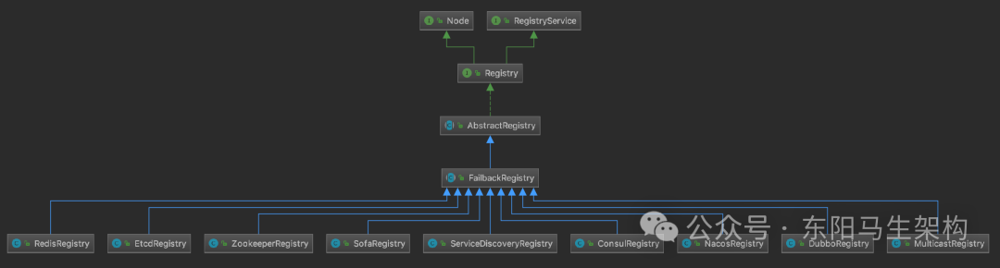

FailbackRegistry的核心设计是：覆盖AbstractRegistry的register()、unregister()、subscribe()、unsubscribe()以及notify()这五个核心方法，然后结合时间轮来实现失败重试的功能。真正与服务发现组件的交互处理则是放到这五个抽象方法中：doRegister()、doUnregister()、doSubscribe()、doUnsubscribe()以及doNotify()，并由具体子类实现，这使用了典型的模板方法模式。

### (2)FailbackRegistry的核心字段

```swift
字段一：retryTimer(HashedWheelTimer类型)
用于定时执行失败重试操作的时间轮。

字段二：retryPeriod(int类型)
重试操作的时间间隔。

字段三：failedRegistered(ConcurrentMap<URL,FailedRegisteredTask> 类型)
注册失败的URL集合，其中key是注册失败的URL，value是对应的重试任务。

字段四：failedUnregistered(ConcurrentMap<URL,FailedUnregisteredTask> 类型)
取消注册失败的URL集合，其中key是取消注册失败的URL，value是对应的重试任务。

字段五：failedSubscribed(ConcurrentMap<Holder,FailedSubscribedTask> 类型)
订阅失败URL集合，其中key是订阅失败的URL + Listener集合，value是相应的重试任务。

字段六：failedUnsubscribed(ConcurrentMap<URL,Set> 类型)
取消订阅失败的URL集合，其中key是取消订阅失败的URL + Listener集合，value是相应的重试任务；

字段七：failedNotified(ConcurrentMap<Holder,FailedNotifiedTask> 类型)
通知失败的URL集合，其中key是通知失败的URL + Listener集合，value是相应的重试任务。
```

```swift
public abstract class FailbackRegistry extends AbstractRegistry {
    //用于定时执行失败重试操作的时间轮
    private final HashedWheelTimer retryTimer;

    //重试操作的时间间隔
    private final int retryPeriod;

    //注册失败的URL集合，其中key是注册失败的URL，value是对应的重试任务
    private final ConcurrentMap<URL, FailedRegisteredTask> failedRegistered = new ConcurrentHashMap<URL, FailedRegisteredTask>();

    //取消注册失败的URL集合，其中key是取消注册失败的URL，value是对应的重试任务
    private final ConcurrentMap<URL, FailedUnregisteredTask> failedUnregistered = new ConcurrentHashMap<URL, FailedUnregisteredTask>();

    //订阅失败URL集合，其中key是订阅失败的URL + Listener集合，value是相应的重试任务
    private final ConcurrentMap<Holder, FailedSubscribedTask> failedSubscribed = new ConcurrentHashMap<Holder, FailedSubscribedTask>();

    //取消订阅失败的URL集合，其中key是取消订阅失败的URL + Listener集合，value是相应的重试任务
    private final ConcurrentMap<Holder, FailedUnsubscribedTask> failedUnsubscribed = new ConcurrentHashMap<Holder, FailedUnsubscribedTask>();

    //通知失败的URL集合，其中key是通知失败的URL + Listener集合，value是相应的重试任务
    private final ConcurrentMap<Holder, FailedNotifiedTask> failedNotified = new ConcurrentHashMap<Holder, FailedNotifiedTask>();
    ...
}
```

在FailbackRegistry的构造方法中，首先会调用父类AbstractRegistry的构造方法完成本地缓存相关的初始化操作，然后从传入的URL参数中获取重试操作的时间间隔(即retry.period参数)来初始化retryPeriod字段，最后初始化retryTimer时间轮，代码如下：

```java
public abstract class FailbackRegistry extends AbstractRegistry {
    ...
    public FailbackRegistry(URL url) {
        super(url);
        this.retryPeriod = url.getParameter(REGISTRY_RETRY_PERIOD_KEY, DEFAULT_REGISTRY_RETRY_PERIOD);
        retryTimer = new HashedWheelTimer(new NamedThreadFactory("DubboRegistryRetryTimer", true), retryPeriod, TimeUnit.MILLISECONDS, 128);
    }
    ...
}
```

### (3)FailbackRegistry的register()方法

FailbackRegistry对register()、unregister()方法和subscribe()、unsubscribe()方法的实现非常类似，这里只介绍register()方法的执行流程。

步骤一：根据registryUrl中accepts参数指定的匹配模式，决定是否接受当前要注册的Provider URL。

步骤二：调用父类AbstractRegistry的register()方法，将Provider URL写入registered集合中。

步骤三：调用removeFailedRegistered()方法和removeFailedUnregistered()方法，将该Provider URL从failedRegistered集合和failedUnregistered集合中删除，并停止相关的重试任务。

步骤四：调用doRegister()方法，与服务发现组件进行交互。该方法由子类实现，每个子类只负责接入一个特定的服务发现组件。

步骤五：在doRegister()方法出现异常时，会根据URL参数以及异常的类型进行分类处理。待注册URL的check参数为true、待注册的URL不是consumer协议、registryUrl的check参数也为true，若满足这三个条件或者抛出的异常为SkipFailbackWrapperException，则直接抛出异常。否则，就会创建重试任务并添加到failedRegistered集合中。

```java
public abstract class FailbackRegistry extends AbstractRegistry {
    ...
    @Override
    public void register(URL url) {
        if (!acceptable(url)) {
            logger.info("URL " + url + " will not be registered to Registry. Registry " + url + " does not accept service of this protocol type.");
            return;
        }

        //完成本地文件缓存的初始化
        super.register(url);

        //清理failedRegistered集合和failedUnregistered集合，并取消相关任务
        //清理FailedRegisteredTask定时任务
        removeFailedRegistered(url);

        //清理FailedUnregisteredTask定时任务
        removeFailedUnregistered(url);
        try {
            //与服务发现组件进行交互，具体由子类实现
            doRegister(url);
        } catch (Exception e) {
            Throwable t = e;
            //检测check参数，决定是否直接抛出异常
            boolean check = getUrl().getParameter(Constants.CHECK_KEY, true)
                && url.getParameter(Constants.CHECK_KEY, true)
                && !CONSUMER_PROTOCOL.equals(url.getProtocol());
            boolean skipFailback = t instanceof SkipFailbackWrapperException;
            if (check || skipFailback) {
                if (skipFailback) {
                    t = t.getCause();
                }
                throw new IllegalStateException("Failed to register " + url + " to registry " + getUrl().getAddress() + ", cause: " + t.getMessage(), t);
            } else {
                logger.error("Failed to register " + url + ", waiting for retry, cause: " + t.getMessage(), t);
            }
            //如果不抛出异常，则创建失败重试的任务，并添加到failedRegistered集合中
            addFailedRegistered(url);
        }
    }
}
```

从上述代码可知，当Provider向Registry注册URL时，如果注册失败且未设置check属性，那么就会调用addFailedRegistered()方法创建一个定时任务，并将任务添加到failedRegistered集合和时间轮中。

```java
public abstract class FailbackRegistry extends AbstractRegistry {
    ...
    private void addFailedRegistered(URL url) {
        FailedRegisteredTask oldOne = failedRegistered.get(url);
        //已经存在重试任务，则无须创建，直接返回
        if (oldOne != null) {
            return;
        }

        FailedRegisteredTask newTask = new FailedRegisteredTask(url, this);
        oldOne = failedRegistered.putIfAbsent(url, newTask);
        if (oldOne == null) {
            //如果是新建的重试任务，则提交到时间轮中，等待retryPeriod毫秒后执行
            retryTimer.newTimeout(newTask, retryPeriod, TimeUnit.MILLISECONDS);
        }
    }
}
```

### (4)AbstractRetryTask重试任务

FailbackRegistry的addFailedRegistered()方法中创建的FailedRegisteredTask任务以及其他的重试任务，都继承了AbstractRetryTask抽象类。

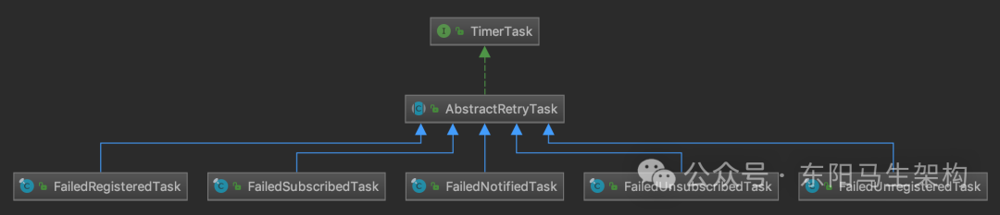

AbstractRetryTask维护了当前任务关联的URL、当前重试的次数等信息，在其run()方法中会根据重试URL中指定的重试次数(retry.times参数默认值为3)、任务是否被取消以及时间轮的状态，决定这次重试任务的doRetry()方法是否正常执行。

```java
public abstract class AbstractRetryTask implements TimerTask {
    ...
    @Override
    public void run(Timeout timeout) throws Exception {
        //检测定时任务状态和时间轮状态
        if (timeout.isCancelled() || timeout.timer().isStop() || isCancel()) {
            return;
        }

        //检查重试次数
        if (times > retryTimes) {
            logger.warn("Final failed to execute task " + taskName + ", url: " + url + ", retry " + retryTimes + " times.");
            return;
        }

        if (logger.isInfoEnabled()) {
            logger.info(taskName + " : " + url);
        }

        try {
            //执行重试
            doRetry(url, registry, timeout);
        } catch (Throwable t) {
            logger.warn("Failed to execute task " + taskName + ", url: " + url + ", waiting for again, cause:" + t.getMessage(), t);
            //重新添加定时任务，等待重试
            reput(timeout, retryPeriod);
        }
    }

    protected abstract void doRetry(URL url, FailbackRegistry registry, Timeout timeout);
}
```

如果重试任务的doRetry()方法执行出现异常，AbstractRetryTask会通过reput()方法将该重试任务重新放入时间轮中，并递增当前任务的执行次数。

```java
public abstract class AbstractRetryTask implements TimerTask {
    ...
    protected void reput(Timeout timeout, long tick) {
        //边界检查
        if (timeout == null) {
            throw new IllegalArgumentException();
        }

        //检查定时任务
        Timer timer = timeout.timer();
        if (timer.isStop() || timeout.isCancelled() || isCancel()) {
            return;
        }
        //递增times
        times++;
        //添加定时任务
        timer.newTimeout(timeout.task(), tick, TimeUnit.MILLISECONDS);
    }
    ...
}
```

AbstractRetryTask将doRetry()方法作为抽象方法，留给子类来实现具体的重试逻辑，这也是模板方法的使用。

比如，在子类FailedRegisteredTask的doRetry()方法中，会再次执行关联Registry的doRegister()方法，完成与服务发现组件交互。如果注册成功，则调用removeFailedRegisteredTask()方法将当前关联的URL以及当前重试任务从failedRegistered集合中删除。如果注册失败，则抛出异常，然后执行上文介绍的reput()方法重试。

```java
public final class FailedRegisteredTask extends AbstractRetryTask {
    ...
    @Override
    protected void doRetry(URL url, FailbackRegistry registry, Timeout timeout) {
        //重新注册
        registry.doRegister(url);
        //删除重试任务
        registry.removeFailedRegisteredTask(url);
    }
}

public abstract class FailbackRegistry extends AbstractRegistry {
    ...
    public void removeFailedRegisteredTask(URL url) {
        failedRegistered.remove(url);
    }
    ...
}
```

另外，在FailbackRegistry的register()方法入口处会主动调用removeFailedRegistered()方法和removeFailedUnregistered()方法来清理指定URL关联的定时任务。

```typescript
public abstract class FailbackRegistry extends AbstractRegistry {
    ...
    @Override
    public void register(URL url) {
        ...
        //清理FailedRegisteredTask定时任务
        removeFailedRegistered(url);
        //清理FailedUnregisteredTask定时任务
        removeFailedUnregistered(url);
        try {
            //与服务发现组件进行交互，具体由子类实现
            doRegister(url);
        } catch (Exception e) {
            ...
            //如果不抛出异常，则创建失败重试的任务，并添加到failedRegistered集合中
            addFailedRegistered(url);
        }
    }
}
```

### (5)FailbackRegistry的其他方法

#### 一.subscribe()方法对异常的处理

#### 二.recover()方法的恢复功能

#### 三.destroy()方法释放资源

unregister()方法以及unsubscribe()方法的实现方式与register()方法类似，只是调用的do*()抽象方法、依赖的AbstractRetryTask有所不同而已。

#### 一.subscribe()方法对异常的处理

根据AbstractRegistry通过本地文件缓存实现的容错机制，FailbackRegistry的subscribe()方法在处理异常时，会先获取缓存的订阅数据并调用notify()方法。如果没有缓存相应的订阅数据，才会检查check参数决定是否抛出异常。

```typescript
public abstract class FailbackRegistry extends AbstractRegistry {
    ...
    public void subscribe(URL url, NotifyListener listener) {
        super.subscribe(url, listener);
        removeFailedSubscribed(url, listener);
        try {
            doSubscribe(url, listener);
        } catch (Exception e) {
            List<URL> urls = getCacheUrls(url);
            if (CollectionUtils.isNotEmpty(urls)) {
                notify(url, listener, urls);
                logger.error("Failed to subscribe " + url + ", Using cached list: " + urls + " from cache file: " + getUrl().getParameter(FILE_KEY, System.getProperty("user.home") + "/dubbo-registry-" + url.getHost() + ".cache") + ", cause: " + t.getMessage(), t);
            } else {
                ...
            }
            addFailedSubscribed(url, listener);
        }
    }
    ...
}
```

由于AbstractRegistry的notify()方法的核心逻辑之一就是回调NotifyListener，所以下面来看FailbackRegistry对notify()方法的覆盖。

```typescript
public abstract class FailbackRegistry extends AbstractRegistry {
    ...
    @Override
    protected void notify(URL url, NotifyListener listener, List<URL> urls) {
        //检查url和listener不为空
        if (url == null) {
            throw new IllegalArgumentException("notify url == null");
        }
        if (listener == null) {
            throw new IllegalArgumentException("notify listener == null");
        }
        try {
            //FailbackRegistry.doNotify()方法实际上就是调用父类
            //AbstractRegistry.notify()方法，没有其他逻辑
            doNotify(url, listener, urls);
        } catch (Exception t) {
            //doNotify()方法出现异常，则会添加一个定时任务
            addFailedNotified(url, listener, urls);
            logger.error("Failed to notify for subscribe " + url + ", waiting for retry, cause: " + t.getMessage(), t);
        }
    }
    ...
}
```

addFailedNotified()方法会创建相应的FailedNotifiedTask任务，并将任务添加到failedNotified集合中，同时也会将任务添加到时间轮中等待执行。如果已存在相应的FailedNotifiedTask重试任务，则会更新任务需要处理的URL集合。

FailedNotifiedTask会维护了一个URL集合，用来记录当前任务需要通知的URL，每执行完一次任务就会清空一下该URL集合，具体实现如下：

```java
public final class FailedNotifiedTask extends AbstractRetryTask {
    private final List<URL> urls = new CopyOnWriteArrayList<>();
    ...

    @Override
    protected void doRetry(URL url, FailbackRegistry registry, Timeout timeout) {
        //如果urls集合为空，则会通知所有Listener，该任务也就啥都不做了
        if (CollectionUtils.isNotEmpty(urls)) {
            listener.notify(urls);
            urls.clear();
        }
        //将任务重新添加到时间轮中等待执行
        reput(timeout, retryPeriod);
    }
    ...
}
```

从上述代码可知，FailedNotifiedTask重试任务一旦被添加，就会一直运行下去，但真的是这样吗？

在FailbackRegistry的subscribe()、unsubscribe()方法中，可以看到removeFailedNotified()方法的调用，这就是清理FailedNotifiedTask任务的地方。

FailbackRegistry的subscribe()方法如下：

```java
public abstract class FailbackRegistry extends AbstractRegistry {
    ...
    public void subscribe(URL url, NotifyListener listener) {
        super.subscribe(url, listener);
        removeFailedSubscribed(url, listener);
        try {
            doSubscribe(url, listener);
        } catch (Exception e) {
            List<URL> urls = getCacheUrls(url);
            if (CollectionUtils.isNotEmpty(urls)) {
                notify(url, listener, urls);
                logger.error("Failed to subscribe " + url + ", Using cached list: " + urls + " from cache file: " + getUrl().getParameter(FILE_KEY, System.getProperty("user.home") + "/dubbo-registry-" + url.getHost() + ".cache") + ", cause: " + t.getMessage(), t);
            } else {
                ...
            }
            addFailedSubscribed(url, listener);
        }
    }

    private void removeFailedSubscribed(URL url, NotifyListener listener) {
        Holder h = new Holder(url, listener);
        FailedSubscribedTask f = failedSubscribed.remove(h);
        if (f != null) {
            f.cancel();
        }
        removeFailedUnsubscribed(url, listener);
        removeFailedNotified(url, listener);
    }
    ...
}
```

#### 二.recover()方法的恢复功能

介绍完FailbackRegistry中最核心的注册、订阅实现后，再来看其recover()方法实现的恢复功能。

FailbackRegistry的recover()方法会直接通过FailedRegisteredTask任务处理registered集合中的全部URL，通过FailedSubscribedTask任务处理subscribed集合中的URL以及关联的NotifyListener。

```typescript
public abstract class FailbackRegistry extends AbstractRegistry {
    ...
    @Override
    protected void recover() throws Exception {
        //register
        Set<URL> recoverRegistered = new HashSet<URL>(getRegistered());
        if (!recoverRegistered.isEmpty()) {
            if (logger.isInfoEnabled()) {
                logger.info("Recover register url " + recoverRegistered);
            }
            for (URL url : recoverRegistered) {
                addFailedRegistered(url);
            }
        }

        //subscribe
        Map<URL, Set<NotifyListener>> recoverSubscribed = new HashMap<URL, Set<NotifyListener>>(getSubscribed());
        if (!recoverSubscribed.isEmpty()) {
            if (logger.isInfoEnabled()) {
                logger.info("Recover subscribe url " + recoverSubscribed.keySet());
            }
            for (Map.Entry<URL, Set<NotifyListener>> entry : recoverSubscribed.entrySet()) {
                URL url = entry.getKey();
                for (NotifyListener listener : entry.getValue()) {
                    addFailedSubscribed(url, listener);
                }
            }
        }
    }
    ...
}
```

#### 三.destroy()方法释放资源

FailbackRegistry在生命周期结束时，会调用自身的destroy()方法，其中除了调用父类的destroy()方法之外，还会调用时间轮(即retryTimer字段)的stop()方法，释放时间轮相关的资源。

```typescript
public abstract class FailbackRegistry extends AbstractRegistry {
    ...
    @Override
    public void destroy() {
        super.destroy();
        retryTimer.stop();
    }
    ...
}
```

### (6)FailbackRegistry总结

FailbackRegistry主要在AbstractRegistry的基础上提供了重试机制，具体方法就是通过时间轮在register()、unregister()、subscribe()、unsubscribe()等核心方法失败时，添加重试任务来实现重试机制，同时也会添加相应的任务清理逻辑。

## 3.ZooKeeper注册中心的实现

### (1)Dubbo在Zookeeper中的节点层级结构

### (2)ZookeeperRegistryFactory

### (3)ZookeeperTransporter

### (4)ZookeeperClient

### (5)ZookeeperRegistry

### (6)总结

### (1)Dubbo在Zookeeper中的节点层级结构

Dubbo支持ZooKeeper作为注册中心服务，ZooKeeper也是Dubbo推荐使用的注册中心。

Dubbo本身是一个分布式的RPC开源框架，各个依赖于Dubbo的服务节点都是单独部署的。为了让Provider和Consumer能实时获取彼此的信息，需要依赖一个一致性的服务发现组件来实现注册和订阅。

Dubbo可以接入多种服务发现组件，例如ZooKeeper、etcd、Consul、Eureka等。其中Dubbo官方推荐使用ZooKeeper，下图展示了Dubbo在Zookeeper中的节点层级结构：

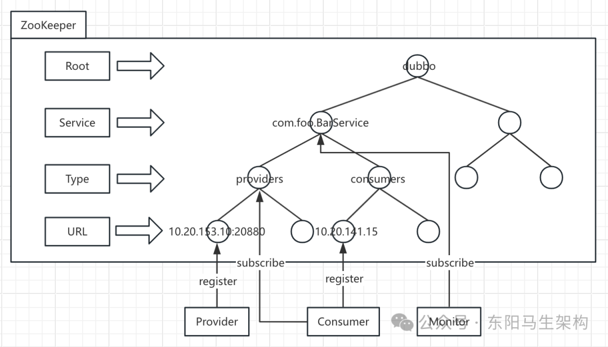

图中的dubbo节点是Dubbo在Zookeeper中的根节点，dubbo是这个根节点的默认名称，当然可通过配置进行修改。Service这一层的节点名称是服务接口的全名，demo示例中该节点名称为org.apache.dubbo.demo.DemoService。Type这一层的节点是URL的分类，一共有四种分类，分别是：providers(服务提供者列表)、consumers(服务消费者列表)、routes(路由规则列表)和configurations(配置规则列表)。根据不同的Type，URL这一层的节点包括：Provider URL、Consumer URL、Routes URL和Configurations URL。

### (2)ZookeeperRegistryFactory

在前面介绍Dubbo的注册中心时，介绍了RegistryFactory工厂接口以及其子类AbstractRegistryFactory。

AbstractRegistryFactory仅提供缓存Registry对象的功能，并未实现Registry的创建，具体的创建逻辑需要由子类来完成。

在dubbo-registry-zookeeper模块中的SPI配置文件(目录位置如下图所示)中，指定了RegistryFactory的实现类为ZookeeperRegistryFactory。

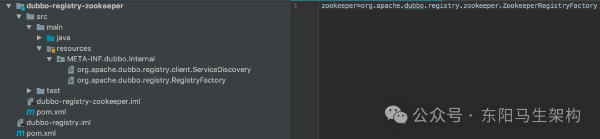

```typescript
//dubbo-registry-api模块定义的接口
@SPI("dubbo")
public interface RegistryFactory {
    @Adaptive({"protocol"})
    Registry getRegistry(URL url);
}

//dubbo-registry-api模块实现RegistryFactory接口的抽象类
public abstract class AbstractRegistryFactory implements RegistryFactory {
    ...
    ...
}

//dubbo-registry-zookeeper模块实现的AbstractRegistryFactory的子类
public class ZookeeperRegistryFactory extends AbstractRegistryFactory {
    private ZookeeperTransporter zookeeperTransporter;

    public void setZookeeperTransporter(ZookeeperTransporter zookeeperTransporter) {
        this.zookeeperTransporter = zookeeperTransporter;
    }

    @Override
    public Registry createRegistry(URL url) {
        return new ZookeeperRegistry(url, zookeeperTransporter);
    }
    ...
}
```

ZookeeperRegistryFactory实现了AbstractRegistryFactory，它的createRegistry()方法会创建ZookeeperRegistry实例，后续将由该实例完成与Zookeeper的交互。

另外ZookeeperRegistryFactory还提供了一个setZookeeperTransporter()方法，通过SPI或Spring IOC的方式完成自动装载。

### (3)ZookeeperTransporter

dubbo-remoting-zookeeper模块是dubbo-remoting模块的子模块，但它并不依赖dubbo-remoting中的其他模块，而是相对独立的，所以这里可以直接介绍该模块。

简单来说，dubbo-remoting-zookeeper模块是在Curator的基础上封装了一套Zookeeper客户端，将与Zookeeper的交互融合到Dubbo的体系之中。

dubbo-remoting-zookeeper模块中有两个核心接口：ZookeeperTransporter和ZookeeperClient。ZookeeperTransporter只负责一件事情，那就是创建ZookeeperClient对象。

```kotlin
//dubbo-remoting-zookeeper模块中
@SPI("curator")
public interface ZookeeperTransporter {
    @Adaptive({Constants.CLIENT_KEY, Constants.TRANSPORTER_KEY})
    ZookeeperClient connect(URL url);
}
```

ZookeeperTransporter接口被@SPI注解修饰成为一个扩展点，默认选择扩展名为curator的实现，其中的connect()方法用于创建ZookeeperClient实例。connect()方法被@Adaptive注解修饰，可以通过URL参数中的client或transporter参数覆盖@SPI注解指定的默认扩展名。

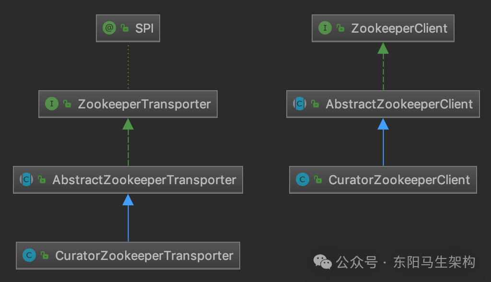

按照前面对Registry的分析，AbstractZookeeperTransporter作为一个抽象实现，肯定是实现了创建ZookeeperClient之外的其他一些增强功能，然后由子类继承。否则，直接由CuratorZookeeperTransporter实现ZookeeperTransporter接口，然后创建ZookeeperClient实例并返回即可，没必要在继承关系中再增加一层抽象类。

```typescript
public class CuratorZookeeperTransporter extends AbstractZookeeperTransporter {
    public ZookeeperClient createZookeeperClient(URL url) {
        return new CuratorZookeeperClient(url);
    }
}
```

AbstractZookeeperTransporter的核心功能：

```
功能一：缓存ZookeeperClient实例
功能二：在某个Zookeeper节点无法连接时，切换到备用Zookeeper地址
```

在配置Zookeeper地址时，可以配置多个Zookeeper节点的地址。这样当一个Zookeeper节点宕机之后，Dubbo就可以主动切换到其他Zookeeper节点。

例如，AbstractZookeeperTransporter的connect()方法首先会得到某URL中配置的127.0.0.1:2181、127.0.0.1:8989和127.0.0.1:9999这三个Zookeeper节点地址，然后从ZookeeperClientMap缓存中查找一个可用ZookeeperClient实例。如果查找成功，则复用ZookeeperClient实例。如果查找失败，则创建一个新的ZookeeperClient实例返回并更新ZookeeperClientMap缓存。ZookeeperClientMap缓存是一个Map，key为Zookeeper节点地址，value是相应的ZookeeperClient实例。

ZookeeperClient实例连接到Zookeeper集群之后，就可以了解整个Zookeeper集群的拓扑。后续再出现Zookeeper节点宕机的情况，就由Zookeeper集群本身以及Curator共同完成故障转移。

### (4)ZookeeperClient

#### 一.ZookeeperClient接口定义的方法

#### 二.AbstractZookeeperClient的功能和字段

#### 三.对DataListener监听器的管理

#### 四.CuratorZookeeperClient

#### 一.ZookeeperClient接口定义的方法

从名字可以看出，ZookeeperClient接口是Dubbo封装的Zookeeper客户端，ZookeeperClient接口定义了大量方法用来与Zookeeper进行交互。

```sql
方法一：create()
创建ZNode节点，还提供了创建临时ZNode节点的重载方法。

方法二：getChildren()
获取指定节点的子节点集合。

方法三：getContent()
获取某个节点存储的内容。

方法四：delete()方法
删除节点。

方法五：addListener()/removeListener()
添加/删除监听器。

方法六：close()方法
关闭当前ZookeeperClient实例。
```

#### 二.AbstractZookeeperClient的功能和字段

AbstractZookeeperClient作为ZookeeperClient接口的抽象实现，主要提供了如下几项能力：

```
功能一：缓存当前ZookeeperClient实例创建的持久ZNode节点
功能二：管理当前ZookeeperClient实例添加的各类监听器
功能三：管理当前ZookeeperClient的运行状态
```

AbstractZookeeperClient的核心字段如下：

```swift
public abstract class AbstractZookeeperClient<TargetDataListener, TargetChildListener> implements ZookeeperClient {
    private final Set<String> persistentExistNodePath = new ConcurrentHashSet<>();
    private final Set<StateListener> stateListeners = new CopyOnWriteArraySet<StateListener>();
    private final ConcurrentMap<String, ConcurrentMap<DataListener, TargetDataListener>> listeners = new ConcurrentHashMap<String, ConcurrentMap<DataListener, TargetDataListener>>();
    private final ConcurrentMap<String, ConcurrentMap<ChildListener, TargetChildListener>> childListeners = new ConcurrentHashMap<String, ConcurrentMap<ChildListener, TargetChildListener>>();
    ...
}
```

首先是persistentExistNodePath字段，它缓存了当前ZookeeperClient创建的持久ZNode节点路径，在创建ZNode节点之前会先查这个缓存，而不是与Zookeeper交互来判断持久ZNode节点是否存在，这就减少了一次与Zookeeper的交互。

然后是stateListeners、listeners以及childListeners三个集合，dubbo-remoting-zookeeper对外提供了StateListener、DataListener和ChildListener三种类型的监听器。

```
类型一：StateListener
主要负责监听Dubbo与Zookeeper集群的连接状态
包括SESSION_LOST、CONNECTED、RECONNECTED、SUSPENDED和NEW_SESSION_CREATED.

类型二：DataListener
主要监听某个节点存储的数据变化

类型三：ChildListener
主要监听某个ZNode节点下的子节点变化
```

#### 三.对DataListener监听器的管理

AbstractZookeeperClient维护了stateListeners、listeners以及childListeners三个集合，分别管理上述三种类型的监听器。虽然监听内容不同，但是它们的管理方式是类似的，所以这里只分析listeners集合的操作。

```typescript
public abstract class AbstractZookeeperClient<TargetDataListener, TargetChildListener> implements ZookeeperClient {
    ...
    public void addDataListener(String path, DataListener listener, Executor executor) {
        //获取指定path上的DataListener集合
        ConcurrentMap<DataListener, TargetDataListener> dataListenerMap =
            listeners.computeIfAbsent(path, k -> new ConcurrentHashMap<>());
        //查询该DataListener关联的TargetDataListener
        TargetDataListener targetListener =
            dataListenerMap.computeIfAbsent(listener, k -> createTargetDataListener(path, k));
        //通过TargetDataListener在指定的path上添加监听
        addTargetDataListener(path, targetListener, executor);
    }
    ...
}
```

上面代码里的createTargetDataListener()方法和addTargetDataListener()方法都是抽象方法，由AbstractZookeeperClient的子类实现。

TargetDataListener是AbstractZookeeperClient中标记的一个泛型。为什么AbstractZookeeperClient要使用泛型定义？

因为不同的ZookeeperClient实现可能依赖不同的Zookeeper客户端组件，不同Zookeeper客户端组件的监听器实现也有所不同。而整个dubbo-remoting-zookeeper模块对外暴露的监听器是统一的，就是上面介绍的那三种，因此这时就需要一层转换进行解耦，这层解耦就是通过TargetDataListener完成的。

#### 四.CuratorZookeeperClient

虽然在Dubbo 2.7.7版本中只支持Curator，但是在Dubbo 2.6.5版本中ZookeeperClient还有使用ZkClient的实现。

在之后的版本中，CuratorZookeeperClient是AbstractZookeeperClient的唯一实现类，其构造方法会初始化Curator客户端并阻塞等待连接成功。

```java
public class CuratorZookeeperClient extends AbstractZookeeperClient<CuratorZookeeperClient.CuratorWatcherImpl, CuratorZookeeperClient.CuratorWatcherImpl> {
    ...
    public CuratorZookeeperClient(URL url) {
        super(url);
        try {
            int timeout = url.getParameter(TIMEOUT_KEY, DEFAULT_CONNECTION_TIMEOUT_MS);
            int sessionExpireMs = url.getParameter(ZK_SESSION_EXPIRE_KEY, DEFAULT_SESSION_TIMEOUT_MS);
            CuratorFrameworkFactory.Builder builder = CuratorFrameworkFactory.builder()
                //zk地址(包括备用地址)
                .connectString(url.getBackupAddress())
                //重试参数
                .retryPolicy(new RetryNTimes(1, 1000))
                //超时时间
                .connectionTimeoutMs(timeout)
                //session过期时间
                .sessionTimeoutMs(sessionExpireMs);
            String authority = url.getAuthority();
            if (authority != null && authority.length() > 0) {
                builder = builder.authorization("digest", authority.getBytes());
            }
            client = builder.build();
            //添加连接状态的监听
            client.getConnectionStateListenable().addListener(new CuratorConnectionStateListener(url));
            client.start();
            //阻塞等待连接Zookeeper集群成功
            boolean connected = client.blockUntilConnected(timeout, TimeUnit.MILLISECONDS);
            if (!connected) {
                throw new IllegalStateException("zookeeper not connected");
            }
        } catch (Exception e) {
            throw new IllegalStateException(e.getMessage(), e);
        }
    }
    ...
}
```

CuratorZookeeperClient与Zookeeper交互的全部操作，都是围绕这个Curator客户端展开的。内部类CuratorWatcherImpl是CuratorZookeeperClient实现AbstractZookeeperClient时指定的泛型类，它实现了TreeCacheListener接口，可以添加到TreeCache上监听自身节点以及子节点的变化。

在childEvent()方法的实现中可以看到，当TreeCache关注的树型结构发生变化时，会将触发事件的路径、节点内容以及事件类型传递给关联的DataListener实例进行回调。

```java
static class CuratorWatcherImpl implements CuratorWatcher, TreeCacheListener {
    ...
    @Override
    public void childEvent(CuratorFramework client, TreeCacheEvent event) throws Exception {
        if (dataListener != null) {
            ...
            TreeCacheEvent.Type type = event.getType();
            EventType eventType = null;
            String content = null;
            String path = null;
            //监听各类事件
            switch (type) {
                case NODE_ADDED:
                    eventType = EventType.NodeCreated;
                    path = event.getData().getPath();
                    content = event.getData().getData() == null ? "" : new String(event.getData().getData(), CHARSET);
                    break;
                ...
            }
            //回调DataListener，传递触发事件的path、节点内容以及事件类型
            dataListener.dataChanged(path, content, eventType);
        }
    }
    ...
}
```

在addTargetDataListener()方法实现中，可以看到TreeCache的创建、启动逻辑以及添加CuratorWatcherImpl监听的逻辑。

```typescript
public class CuratorZookeeperClient extends AbstractZookeeperClient<CuratorZookeeperClient.CuratorWatcherImpl, CuratorZookeeperClient.CuratorWatcherImpl> {
    ...
    @Override
    protected void addTargetDataListener(String path, CuratorZookeeperClient.CuratorWatcherImpl treeCacheListener, Executor executor) {
        try {
            //创建TreeCache
            TreeCache treeCache = TreeCache.newBuilder(client, path).setCacheData(false).build();
            //缓存TreeCache对象
            treeCacheMap.putIfAbsent(path, treeCache);
            if (executor == null) {
                //添加监听
                treeCache.getListenable().addListener(treeCacheListener);
            } else {
                treeCache.getListenable().addListener(treeCacheListener, executor);
            }
            //启动TreeCache
            treeCache.start();
        } catch (Exception e) {
            throw new IllegalStateException("Add treeCache listener for path:" + path, e);
        }
    }
    ...
}
```

如果需要在回调中获取全部Child节点，那么dubbo-remoting-zookeeper调用方需要使用ChildListener。在下面即将介绍的ZookeeperRegistry中可以看到ChildListener相关使用方式。CuratorWatcherImpl也是ChildListener与CuratorWatcher的桥梁，具体实现方式与上述逻辑类似。

至此，dubbo-remoting-zookeeper模块的核心实现就介绍完了。该模块作为Dubbo与Zookeeper交互的基础，不仅支撑了基于Zookeeper的注册中心的实现，还支撑了基于Zookeeper的服务发现的实现，这里关注基于Zookeeper的注册中心实现。

### (5)ZookeeperRegistry

#### 一.ZookeeperRegistry的构造方法

#### 二.ZookeeperRegistry的doRegister()方法

#### 三.ZookeeperRegistry的doSubscribe()方法

回到dubbo-registry-zookeeper模块，继续分析基于Zookeeper的注册中心实现。

#### 一.ZookeeperRegistry的构造方法

该构造方法会通过ZookeeperTransporter创建ZookeeperClient实例并连接到Zookeeper集群，同时还会添加一个连接状态的监听器。

在该监听器中，主要关注RECONNECTED状态和NEW_SESSION_CREATED状态，在当前Dubbo节点与Zookeeper的连接恢复或是Session恢复时，重新进行注册或订阅来防止数据丢失。

```java
public class ZookeeperRegistry extends FailbackRegistry {
    private final ZookeeperClient zkClient;
    ...

    public ZookeeperRegistry(URL url, ZookeeperTransporter zookeeperTransporter) {
        super(url);
        ...
        zkClient = zookeeperTransporter.connect(url);
        zkClient.addStateListener((state) -> {
            ...
        });
    }

    @Override
    public void doRegister(URL url) {
        try {
            zkClient.create(toUrlPath(url), url.getParameter(DYNAMIC_KEY, true));
        } catch (Throwable e) {
            throw new RpcException("Failed to register " + url + " to zookeeper " + getUrl() + ", cause: " + e.getMessage(), e);
        }
    }
    ...
}
```

#### 二.ZookeeperRegistry的doRegister()方法

doRegister()和doUnregister()这两个方法都是通过ZookeeperClient找到合适的路径，然后创建(删除)ZNode节点。这里唯一需要注意的是：doRegister()方法注册Provider URL时，会根据dynamic参数决定创建临时ZNode节点还是持久ZNode节点。默认创建临时ZNode节点，这样当Provider端与Zookeeper会话关闭时，可以快速将变更推送到Consumer端。

```typescript
public class ZookeeperRegistry extends FailbackRegistry {
    ...
    @Override
    public void doRegister(URL url) {
        try {
            zkClient.create(toUrlPath(url), url.getParameter(DYNAMIC_KEY, true));
        } catch (Throwable e) {
            throw new RpcException("Failed to register " + url + " to zookeeper " + getUrl() + ", cause: " + e.getMessage(), e);
        }
    }

    @Override
    public void doUnregister(URL url) {
        try {
            zkClient.delete(toUrlPath(url));
        } catch (Throwable e) {
            throw new RpcException("Failed to unregister " + url + " to zookeeper " + getUrl() + ", cause: " + e.getMessage(), e);
        }
    }
    ...
}
```

注意toUrlPath()方法得到的路径，是由下图中展示的方法拼装而成的，其中每个方法对应前面展示的Zookeeper节点层级图中的一层。

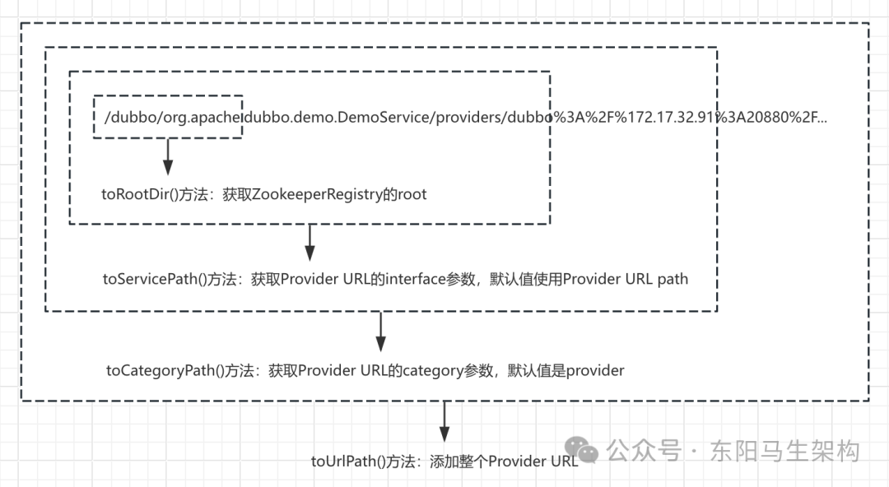

#### 三.ZookeeperRegistry的doSubscribe()方法

该方法的核心是通过ZookeeperClient在指定的path上添加ChildListener监听器。当订阅的节点发生变化时，会执行notify()方法触发传入的NotifyListener监听器。

doSubscribe()方法的逻辑分为两大分支：

分支一：订阅URL中明确指定了Service层接口的订阅请求。该分支会从URL拿到Consumer关注的category节点集合，然后在每个category节点上添加ChildListener监听器。下面展示了Demo示例中Consumer订阅的三个path，以及构造path各个部分的相关方法。

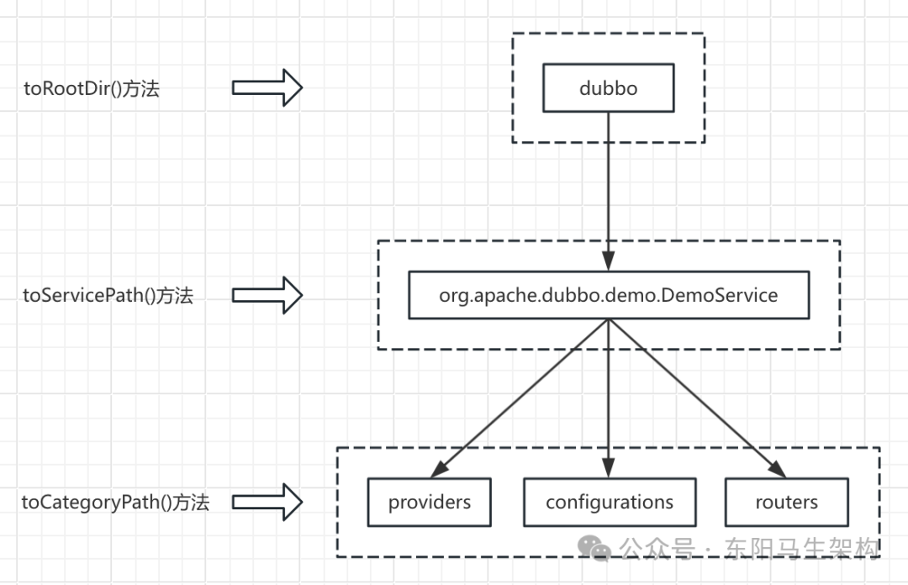

下面是这个分支的核心代码：

```java
public class ZookeeperRegistry extends FailbackRegistry {
    ...
    @Override
    public void doSubscribe(final URL url, final NotifyListener listener) {
        try {
            if (ANY_VALUE.equals(url.getServiceInterface())) {
                ...
            } else {
                List<URL> urls = new ArrayList<>();
                for (String path : toCategoriesPath(url)) {//要订阅的所有path
                    //一个NotifyListener关联一个ChildListener，这个ChildListener会回调
                    //ZookeeperRegistry.notify()方法，其中会回调当前NotifyListener
                    ConcurrentMap<NotifyListener, ChildListener> listeners =
                        zkListeners.computeIfAbsent(url, k -> new ConcurrentHashMap<>());
                    ChildListener zkListener = listeners.computeIfAbsent(listener, k -> (parentPath, currentChilds) ->
                        ZookeeperRegistry.this.notify(url, k, toUrlsWithEmpty(url, parentPath, currentChilds)));
                    //尝试创建持久节点，主要是为了确保当前path在Zookeeper上存在
                    zkClient.create(path, false);
                    //这一个ChildListener会添加到多个path上
                    List<String> children = zkClient.addChildListener(path, zkListener);
                    if (children != null) {
                        //如果没有Provider注册，toUrlsWithEmpty()方法会返回empty协议的URL
                        urls.addAll(toUrlsWithEmpty(url, path, children));
                    }
                }
                //初次订阅的时候，会主动调用一次notify()方法，通知NotifyListener处理当前已有的URL等注册数据
                notify(url, listener, urls);
            }
        } catch (Throwable e) {
            throw new RpcException("Failed to subscribe " + url + " to zookeeper " + getUrl() + ", cause: " + e.getMessage(), e);
        }
    }
    ...
}
```

分支二：监听所有Service层节点的订阅请求。例如Monitor就会发出这种订阅请求，因为它需要监控所有Service节点的变化。这个分支的处理逻辑是在根节点上添加一个ChildListener监听器。当有Service层的节点出现变化的时候，会触发这个ChildListener。其中就会重新触发doSubscribe()方法执行上一个分支的逻辑，即前面分析的针对确定的Service层接口订阅分支。

下面是这个分支的核心代码：

```typescript
public class ZookeeperRegistry extends FailbackRegistry {
    ...
    @Override
    public void doSubscribe(final URL url, final NotifyListener listener) {
        try {
            if (ANY_VALUE.equals(url.getServiceInterface())) {
                //获取根节点
                String root = toRootPath();
                //获取NotifyListener对应的ChildListener
                ConcurrentMap<NotifyListener, ChildListener> listeners =
                    zkListeners.computeIfAbsent(url, k -> new ConcurrentHashMap<>());
                ChildListener zkListener = listeners.computeIfAbsent(listener, k -> (parentPath, currentChilds) -> {
                    for (String child : currentChilds) {
                        child = URL.decode(child);
                        if (!anyServices.contains(child)) {
                            anyServices.add(child);//记录该节点已经订阅过
                            //该ChildListener要做的就是触发对具体Service节点的订阅
                            subscribe(url.setPath(child).addParameters(INTERFACE_KEY, child, Constants.CHECK_KEY, String.valueOf(false)), k);
                        }
                    }
                });
                //保证根节点存在
                zkClient.create(root, false);
                //第一次订阅的时候，要处理当前已有的Service层节点
                List<String> services = zkClient.addChildListener(root, zkListener);
                if (CollectionUtils.isNotEmpty(services)) {
                    for (String service : services) {
                        service = URL.decode(service);
                        anyServices.add(service);
                        subscribe(url.setPath(service).addParameters(INTERFACE_KEY, service, Constants.CHECK_KEY, String.valueOf(false)), listener);
                    }
                }
            } else {
                ...
            }
        } catch (Throwable e) {
            throw new RpcException("Failed to subscribe " + url + " to zookeeper " + getUrl() + ", cause: " + e.getMessage(), e);
        }
    }
    ...
}
```

ZookeeperRegistry提供的doUnsubscribe()方法实现会将URL和NotifyListener对应的ChildListener从相关的path上删除，从而达到不再监听该path的效果。

### (6)总结

这里介绍了Dubbo接入Zookeeper作为注册中心的核心实现。首先介绍Zookeeper作为Dubbo注册中心时存储的具体内容，接着介绍RegistryFactory的实现ZookeeperRegistryFactory，然后介绍Dubbo接入Zookeeper时使用的组件实现，并详细分析ZookeeperTransporter和ZookeeperClient的实现，ZookeeperTransporter和ZookeeperClient它们底层是依赖Curator与Zookeeper完成交互的。最后介绍ZookeeperRegistry是如何通过ZookeeperClient接入Zookeeper来实现Registry的相关功能的。
