# Dubbo原理—5.服务通信之Serialize序列化层

> **公众号**: 东阳马生架构  
> **发布时间**: 2025-07-22 09:00  

**大纲(8380字)**

- 1.Dubbo的Serialize层提供多种序列化算法
- 2.Dubbo的Remoting层兼容所有NIO框架
- 3.Buffer缓冲区是数据的搬运工


## 1.Dubbo的Serialize层提供多种序列化算法

### (1)JDK原生序列化

### (2)常见序列化算法

### (3)dubbo-serialization模块

### (4)总结

一个RPC框架需要通过网络通信实现跨JVM的调用。既然需要网络通信，那就必然会使用到序列化与反序列化的相关技术，Dubbo也不例外。接下来介绍Dubbo是如何支持这些序列化算法的。

### (1)JDK原生序列化

Java中的序列化操作一般有如下四个步骤：

步骤一：被序列化的对象实现Serializable接口。在如下示例中我们可以看到transient关键字，它的作用就是在对象序列化过程中忽略被其修饰的成员属性变量。一般情况下，transient关键字可以用来修饰一些非数据型的字段以及一些可以通过其他字段计算得到的值。通过合理地使用transient关键字，可以降低序列化后的数据量、提高网络传输效率。

```java
public class Student implements Serializable {
    private String name;
    private int age;
    private transient StudentUtil studentUtil;
}
```

步骤二：生成一个序列号serialVersionUID。这个序列号不是必需的，但还是建议生成。serialVersionUID的字面含义是序列化的版本号。只有序列化和反序列化的serialVersionUID都相同的情况下，才能够成功地反序列化。如果类中没有定义serialVersionUID，那么JDK也会随机生成一个serialVersionUID。如果在某些场景中，你希望不同版本的类序列化和反序列化相互兼容，那就需要定义相同的serialVersionUID。

步骤三：根据需求决定是否要重写writeObject()或readObject()方法，实现自定义序列化。

步骤四：调用java.io.ObjectOutputStream的writeObject()方法或readObject()方法进行序列化与反序列化。

既然Java中的序列化操作如此简单，那为什么还依旧出现各种各样的第三方序列化框架呢？因为这些第三方序列化框架的速度更快、效率更高、支持跨语言操作。

### (2)常见序列化算法

#### 一.Avro序列化

#### 二.FastJson序列化

#### 三.Fst序列化

#### 四.Kryo序列化

#### 五.Hessian2序列化

#### 六.Protobuf序列化

#### 一.Avro序列化

Avro是一种与编程语言无关的序列化格式，依赖用户定义的Schema。当进行序列化数据时，无须多余的开销就可以快速完成序列化，且生成的序列化数据也较小。当进行反序列化时，需要获取写入数据时用到的Schema。在Kafka、Hadoop以及Dubbo中都可以使用Avro作为序列化方案。

#### 二.FastJson序列化

FastJson是阿里开源的JSON解析库，可以解析JSON格式的字符串。它支持将Java对象序列化为JSON字符串，反过来从JSON字符串也可以反序列化为Java对象。FastJson是Java程序员常用到的类库之一，正如其名，快是其主要特点。从官方测试结果来看，FastJson确实是最快的，比Jackson快20%左右。但近几年FastJson的安全漏洞比较多，所以在选择版本时，还是需要谨慎一些。

#### 三.Fst序列化

Fst全称是fast-serialization，是一款高性能Java对象序列化工具包。它兼容JDK原生环境，序列化速度是JDK原生序列化的4~10倍，序列化后数据大小是JDK原生序列化大小的1/3左右。

#### 四.Kryo序列化

Kryo是一个高效的Java序列化和反序列化库。目前Twitter、Yahoo、Apache等都在使用该序列化技术，特别是Spark、Hive等大数据领域用得较多。Kryo提供了一套快速、高效和易用的序列化API。无论是数据库存储，还是网络传输，都可以使用Kryo完成Java对象的序列化。Kryo还可以执行自动深拷贝和浅拷贝，支持环形引用。Kryo的特点是API代码简单，序列化速度快，并且序列化之后得到的数据比较小。另外，Kryo还提供了NIO的网络通信库——KryoNet。

#### 五.Hessian2序列化

Hessian2是一种支持动态类型、跨语言的序列化协议。Java对象序列化的二进制流可以被其他语言使用。Hessian2序列化之后的数据可以进行自描述，不会像Avro那样依赖外部的Schema描述文件或者接口定义。Hessian2可以用一个字节表示常用的基础类型，这极大缩短了序列化之后的二进制流。

注意：在Dubbo中使用的Hessian2序列化并不是原生的Hessian2序列化，而是阿里修改过的Hessian Lite，它是Dubbo默认使用的序列化方式。其序列化之后的二进制流大小大约是Java序列化的50%，序列化耗时大约是Java序列化的30%，反序列化耗时大约是Java序列化的20%。

#### 六.Protobuf序列化

Protobuf是一套灵活、高效、自动化的、用于对结构化数据进行序列化的协议。但相比于常用的JSON格式，Protobuf有更高的转化效率，时间效率和空间效率都是JSON的5倍左右。Protobuf可用于通信协议、数据存储等领域，它本身是语言无关、平台无关、可扩展的序列化结构数据格式。目前Protobuf提供了C++、Java、Python、Go等多种语言的API，gRPC底层就是使用Protobuf实现的序列化。

### (3)dubbo-serialization模块

#### 一.Dubbo的Serialization接口和默认实现

#### 二.Hessian2Serialization的serialize()方法

#### 三.Hessian2Serialization的deserialize()方法

#### 一.Dubbo的Serialization接口和默认实现

Dubbo为了支持多种序列化算法，单独抽象了一层Serialize层，在整个Dubbo架构中处于最底层，对应的模块是dubbo-serialization模块。

dubbo-serialization模块的结构如下图示：

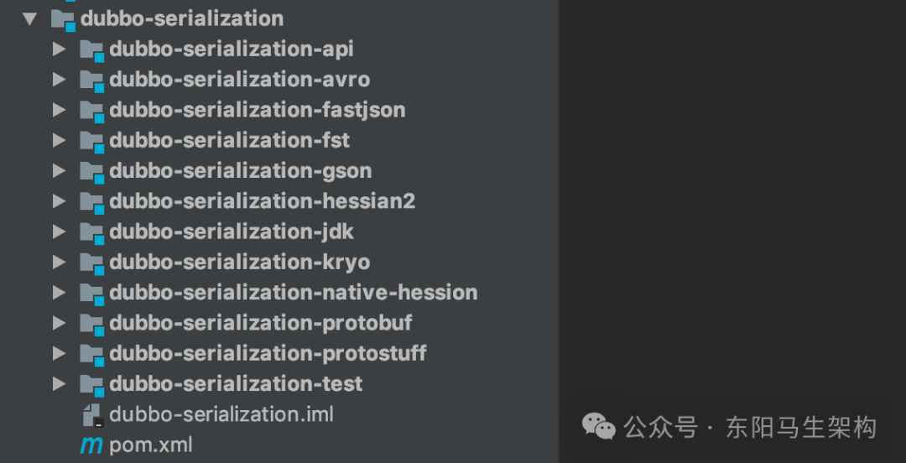

dubbo-serialization-api模块中定义了Dubbo序列化层的核心接口，其中最核心的是Serialization这个接口。Serialization是一个扩展接口，被@SPI修饰，默认扩展实现是Hessian2Serialization。

Serialization接口的具体实现如下：

```java
//被@SPI注解修饰，默认是使用hessian2序列化算法
@SPI("hessian2")
public interface Serialization {
    //获取ContentType的ID值，是一个byte类型的值，唯一确定一个算法
    byte getContentTypeId();

    //每一种序列化算法都对应一个ContentType，该方法用于获取ContentType
    String getContentType();

    //创建一个ObjectOutput对象，ObjectOutput负责实现序列化的功能，即将Java对象转化为字节序列
    @Adaptive
    ObjectOutput serialize(URL url, OutputStream output) throws IOException;

    //创建一个ObjectInput对象，ObjectInput负责实现反序列化的功能，即将字节序列转换成Java对象
    @Adaptive
    ObjectInput deserialize(URL url, InputStream input) throws IOException;
}
```

Dubbo提供了多个Serialization接口实现，用于接入各种各样的序列化算法，如下图示：

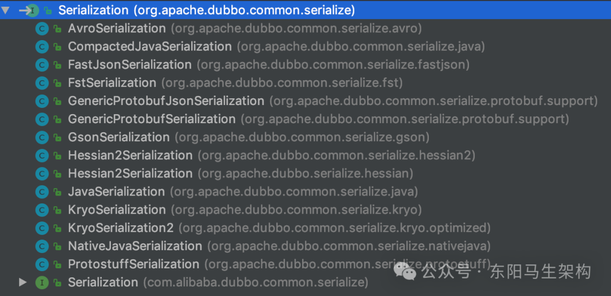

这里以默认的hessian2序列化方式为例，介绍Serialization接口的实现以及其他相关实现。Hessian2Serialization实现如下所示：

```java
public class Hessian2Serialization implements Serialization {
    @Override
    public byte getContentTypeId() {
        //hessian2的ContentType ID
        return HESSIAN2_SERIALIZATION_ID;
    }

    @Override
    public String getContentType() {
        //hessian2的ContentType
        return "x-application/hessian2";
    }

    @Override
    public ObjectOutput serialize(URL url, OutputStream out) throws IOException {
        //创建ObjectOutput对象
        return new Hessian2ObjectOutput(out);
    }

    @Override
    public ObjectInput deserialize(URL url, InputStream is) throws IOException {
        //创建ObjectInput对象
        return new Hessian2ObjectInput(is);
    }
}
```

#### 二.Hessian2Serialization的serialize()方法

Hessian2Serialization的serialize()方法创建的对象为Hessian2ObjectOutput。

Hessian2ObjectOutput继承关系如下图示：

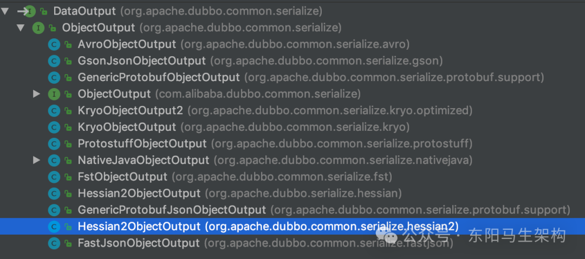

DataOutput接口中定义了序列化Java中各种基本数据类型的方法，如下图示。其中有序列化boolean、short、int、long等基础类型的方法，也有序列化String、byte[]的方法。

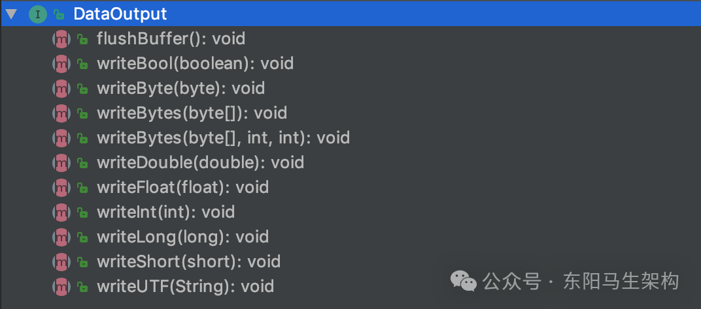

ObjectOutput接口继承了DataOutput接口，并在其基础之上添加了序列化对象的功能，如下图示。其中的writeThrowable()、writeEvent()和writeAttachments()方法都是调用writeObject()方法来实现的。

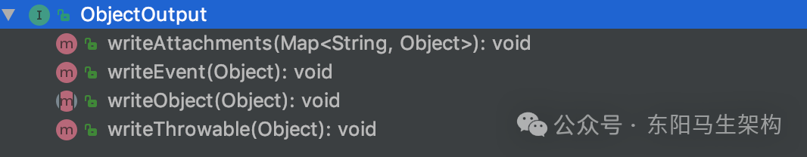

Hessian2ObjectOutput中会封装一个Hessian2Output对象，这个对象是ThreadLocal的，与线程绑定。在DataOutput接口以及ObjectOutput接口中，序列化各类型数据的方法都会委托给Hessian2Output对象的相应方法来完成，实现如下：

```java
public class Hessian2ObjectOutput implements ObjectOutput {
    private static ThreadLocal<Hessian2Output> OUTPUT_TL = ThreadLocal.withInitial(() -> {
        //初始化Hessian2Output对象
        Hessian2Output h2o = new Hessian2Output(null);
        h2o.setSerializerFactory(Hessian2SerializerFactory.SERIALIZER_FACTORY);
        h2o.setCloseStreamOnClose(true);
        return h2o;
    });
    private final Hessian2Output mH2o;

    public Hessian2ObjectOutput(OutputStream os) {
        //触发OUTPUT_TL的初始化
        mH2o = OUTPUT_TL.get();
        //初始化mH2o字段
        mH2o.init(os);
    }

    @Override
    public void writeObject(Object obj) throws IOException {
        mH2o.writeObject(obj);
    }
    ...
}
```

#### 三.Hessian2Serialization的deserialize()方法

Hessian2Serialization的deserialize()方法创建的对象为Hessian2ObjectInput。

Hessian2ObjectInput继承关系如下所示：

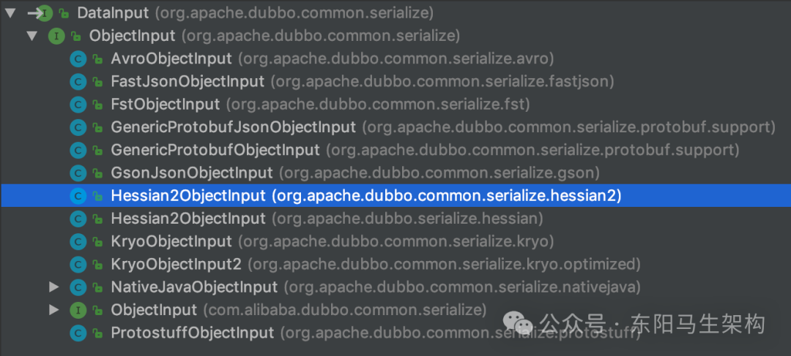

Hessian2ObjectInput具体实现与Hessian2ObjectOutput类似。在DataInput接口中实现了反序列化各种基本数据类型的方法，在ObjectInput接口中提供了反序列化Java对象的功能。Hessian2ObjectInput会将所有反序列化的实现都委托给Hessian2Input对象的相应方法来实现。

### (4)总结

这里首先介绍了Java原生的序列化，然后介绍常见的序列化算法如Arvo、Fastjson、Fst、Kryo、Hessian、Protobuf等，最后介绍了dubbo-serialization模块对各个序列化算法的接入方式，其中重点说明了Hessian2序列化方式。

## 2.Dubbo的Remoting层兼容所有NIO框架

### (1)dubbo-remoting模块简介

### (2)dubbo-remoting-api模块

### (3)Transport传输层核心接口

### (4)总结

### (1)dubbo-remoting模块简介

dubbo-remoting模块提供了多种客户端和服务端通信的功能。在Dubbo的整体架构图中，可以看到最底层的部分即为Remoting层。Remoting层包括了Exchange、Transport和Serialize三个子层次。

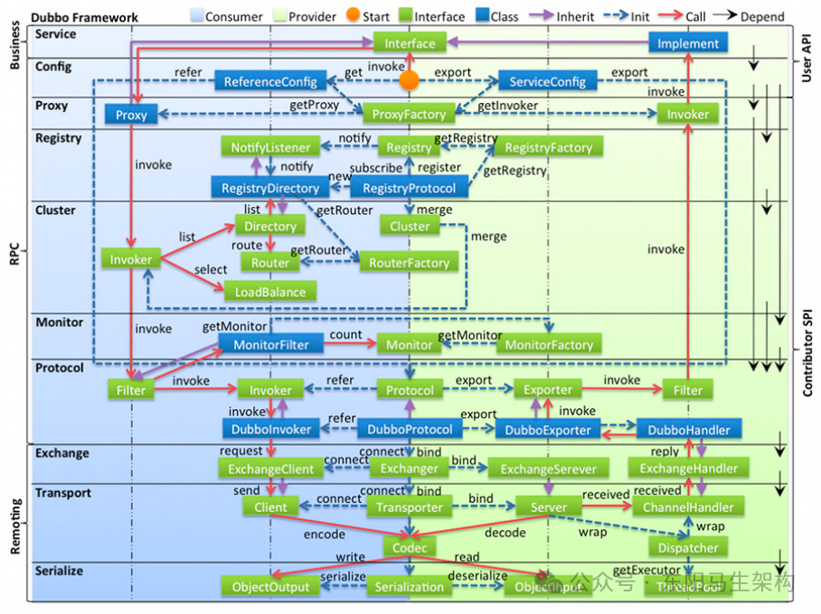

Dubbo并没有自己实现一套完整的网络库，而是使用现有的、相对成熟的第三方网络库，例如Netty、Mina等NIO框架。我们可以根据自己的实际场景和需求修改配置，选择底层使用的NIO框架。

下图展示了dubbo-remoting模块的结构，其中每个子模块对应一个第三方NIO框架。

```
dubbo-remoting-netty4子模块使用Netty4实现Dubbo的远程通信
dubbo-remoting-grizzly子模块使用Grizzly实现Dubbo的远程通信
dubbo-remoting-zookeeper子模块使用Curator实现与Zookeeper的交互
```

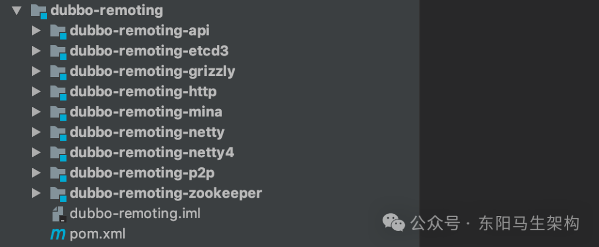

### (2)dubbo-remoting-api模块

Dubbo的dubbo-remoting-api模块是其他dubbo-remoting-*模块的顶层抽象，其他dubbo-remoting子模块都是依赖第三方NIO库来实现dubbo-remoting-api模块的，依赖关系如下图示：

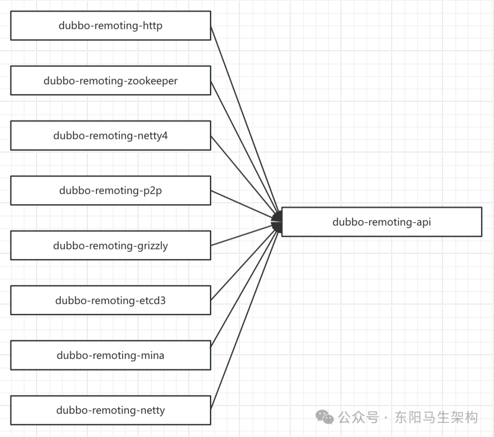

dubbo-remoting-api会对整个Remoting层进行抽象，dubbo-remoting-api模块的结构如下图示：

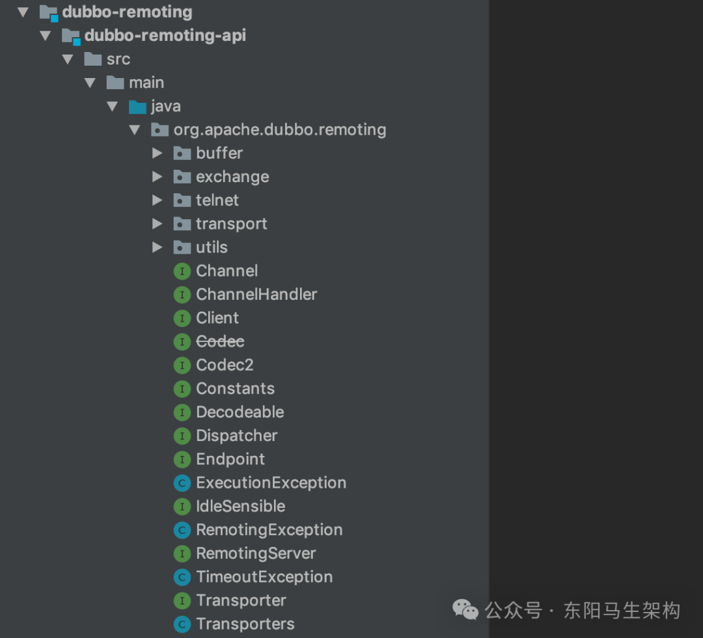

通常会将功能类似或者相关联的类放到一个包中，dubbo-remoting-api模块中各个包的功能如下。

#### 一.buffer包

定义了缓冲区相关的接口、抽象类以及实现类。缓冲区在NIO框架中是一个不可或缺的角色，在各个NIO框架中都有自己的缓冲区实现。这里的buffer包在更高的层面抽象了各个NIO框架的缓冲区，同时也提供了一些基础实现。

#### 二.exchange包

抽象了Request和Response两个概念，并为其添加很多特性，这是整个远程调用非常核心的部分。

#### 三.transport包

对网络传输层的抽象，但它只负责抽象单向消息的传输。即请求消息由Client端发出，Server端接收。响应消息由Server端发出，Client端接收。有很多网络库可以实现网络传输的功能，transport包是在这些网络库(如Netty、Grizzly)基础上的一层抽象。

#### 四.其他接口

Endpoint、Channel、Transporter、Dispatcher等顶层接口放到了org.apache.dubbo.remoting这个包，这些接口是Remoting层的核心接口。

### (3)Transport传输层核心接口

#### 一.Transport层的Endpoint接口

#### 二.Transport层的Channel接口

#### 三.Transport层的ChannelHandler接口

#### 四.Transport层的Client和RemotingServer接口

#### 五.Transport层的Transporter接口

#### 六.Transport层的Transporters门面类

#### 七.Transport层的核心接口总结

在Dubbo中会抽象出一个端点(Endpoint)的概念，可以通过一个IP和Port唯一确定一个端点(Endpoint)，两个端点(Endpoint)间会创建TCP连接进行双向传输数据。

Dubbo将Endpoint之间的TCP连接抽象为通道(Channel)，将发起请求的Endpoint抽象为客户端(Client)，将接收请求的Endpoint抽象为服务端(Server)。这些抽象出来的概念，也是整个dubbo-remoting-api模块的基础。

#### 一.Transport层的Endpoint接口

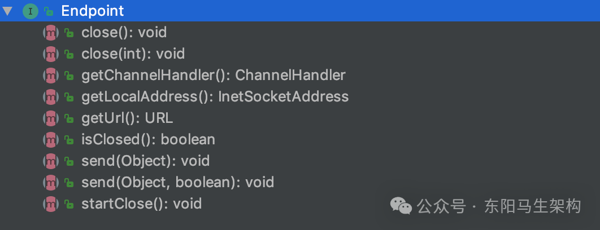

get*()方法可以获得Endpoint本身的一些属性，其中包括获取Endpoint的本地地址、关联的URL信息以及底层Channel关联的ChannelHandler。send()方法负责数据发送，close()方法以及startClose()方法用于关闭底层Channel，isClosed()方法用于检测底层Channel是否已关闭。

Channel是对两个Endpoint连接的抽象，好比连接两个位置的传送带，两个Endpoint传输的消息就好比传送带上的货物。消息发送端会往Channel写入消息，而接收端会从Channel读取消息，这与Netty中的Channel基本一致。

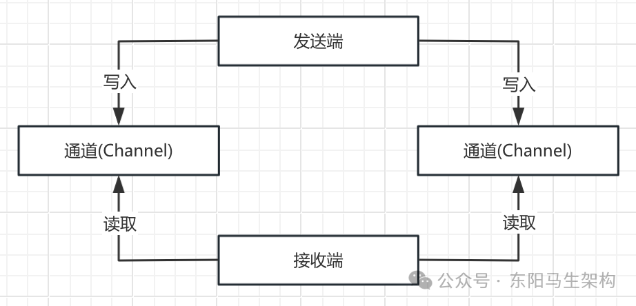

#### 二.Transport层的Channel接口

由下图Channel的定义可以看出两点：一是Channel接口继承了Endpoint接口，也具备开关状态以及发送数据的能力，二是可以在Channel上附加kv属性。

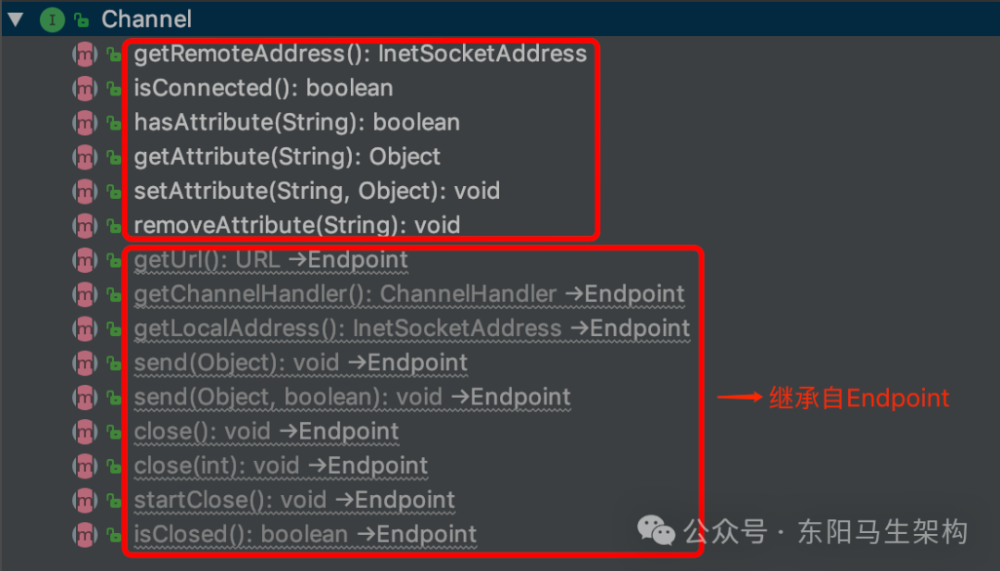

#### 三.Transport层的ChannelHandler接口

ChannelHandler是注册在Channel上的消息处理器，在Netty中也有类似的抽象。下图展示了ChannelHandler接口的定义，在ChannelHandler中可以处理Channel的连接建立以及连接断开事件，还可以处理读取到的数据、发送数据以及捕获到的异常。从这些方法的命名可以看到，它们都是动词的过去式，说明相应事件已经发生过了。

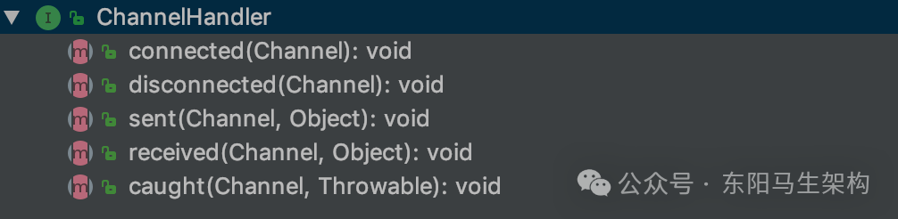

注意：ChannelHandler接口被@SPI注解修饰，表示该接口是一个扩展点。在Netty中会有一类特殊的ChannelHandler专门负责实现编解码功能，从而实现字节数据与有意义的消息之间的转换，或是消息之间的相互转换。在dubbo-remoting-api中也有相似的抽象，如下所示：

```java
@SPI
public interface Codec2 {
    @Adaptive({Constants.CODEC_KEY})
    void encode(Channel channel, ChannelBuffer buffer, Object message) throws IOException;

    @Adaptive({Constants.CODEC_KEY})
    Object decode(Channel channel, ChannelBuffer buffer) throws IOException;
    enum DecodeResult {
        NEED_MORE_INPUT, SKIP_SOME_INPUT
    }
}
```

Codec2接口被@SPI接口修饰，表示该接口是一个扩展接口。其encode()和decode()方法被@Adaptive注解修饰，会生成适配器类并根据URL中的codec值确定具体的扩展实现类。

DecodeResult枚举是在处理TCP传输时粘包和拆包使用的，之前简易版本RPC也处理过这种问题。例如当前能读取到的数据不足以构成一个消息时，就会使用NEED_MORE_INPUT这个枚举。

#### 四.Transport层的Client和RemotingServer接口

它们分别抽象了客户端和服务端，都继承了Channel、Resetable等接口，也就是说两者都具备了读写数据的能力。

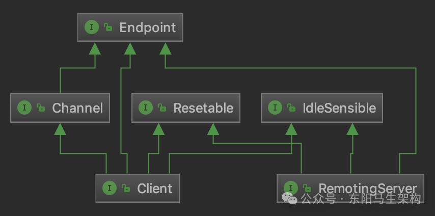

Client和Server本身都是Endpoint，只不过在语义上区分了请求和响应的职责。两者都具备发送的能力，所以都继承了Endpoint接口。Client和Server的主要区别是Client只能关联一个Channel，而Server可以接收多个Client发起的Channel连接。所以在RemotingServer接口中定义了查询Channel的相关方法，如下图示：

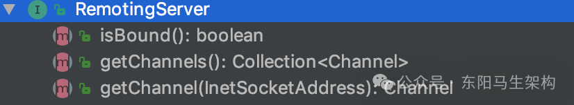

#### 五.Transport层的Transporter接口

Dubbo在Client和Server之上又封装了一层Transporter接口，其具体定义如下：

```java
@SPI("netty")
public interface Transporter {
    //Bind a server.
    @Adaptive({Constants.SERVER_KEY, Constants.TRANSPORTER_KEY})
    RemotingServer bind(URL url, ChannelHandler handler) throws RemotingException;

    //Connect to a server.
    @Adaptive({Constants.CLIENT_KEY, Constants.TRANSPORTER_KEY})
    Client connect(URL url, ChannelHandler handler) throws RemotingException;
}
```

Transporter接口上有@SPI注解，它是一个扩展接口，默认使用netty这个扩展名。@Adaptive注解的出现表示动态生成适配器类，会先后根据server、transporter的值确定RemotingServer的扩展实现类，先后根据client、transporter的值确定Client接口的扩展实现类。

Transporter接口的实现有哪些？如下图示，针对每个支持的NIO库，都有一个Transporter接口实现，散落在各个dubbo-remoting-*实现模块中。

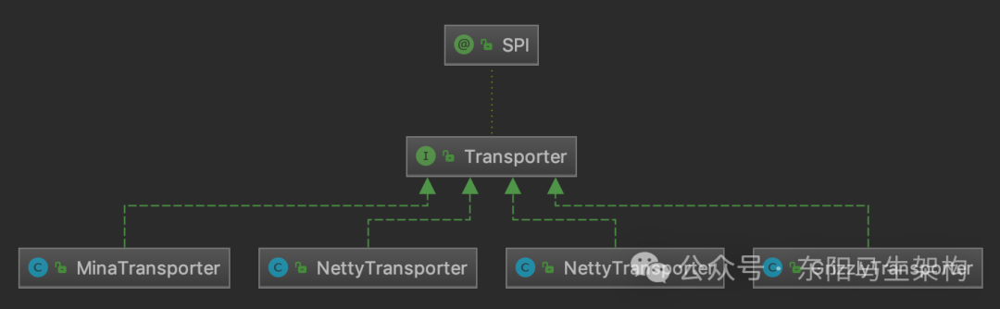

这些Transporter接口实现返回的Client和RemotingServer具体是什么？如下图示，返回的是NIO库对应的RemotingServer实现和Client实现。

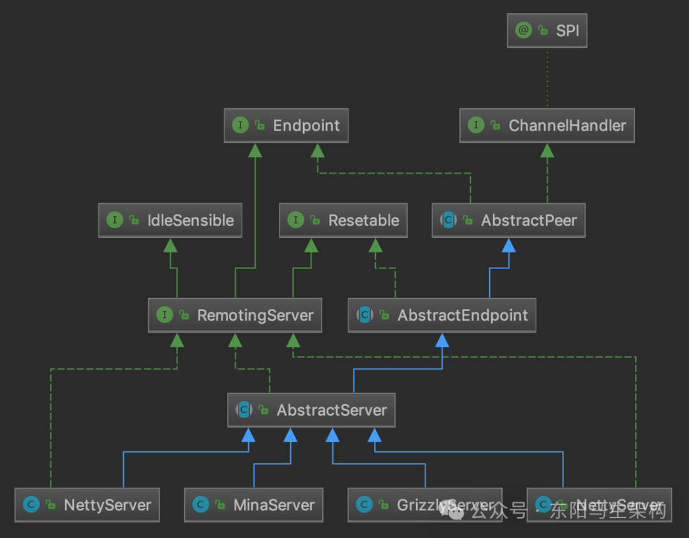

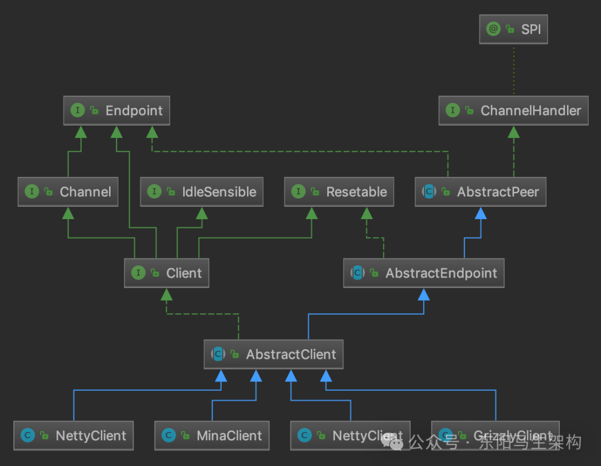

可见，Transporter这一层抽象出来的接口，与Netty的核心接口是非常相似的。那么为什么要单独抽象出Transporter层，而不是像简易版RPC框架那样直接让上层使用Netty呢？

那是因为Netty、Mina、Grizzly这些NIO库对外接口和使用方式不一样。如果在上层直接依赖了Netty或是Grizzly，就依赖了具体的NIO库实现，而不是依赖一个有传输能力的抽象。如果后续要切换实现的话，就需要修改依赖和接入的相关代码，非常容易改出Bug，这也不符合设计模式中的开放封闭原则。

有了Transporter层之后，就可以通过SPI修改使用的具体Transporter扩展实现，从而切换到不同的Client和RemotingServer实现，达到底层NIO库切换的目的，而且无须修改任何代码。

即使有更先进的NIO库出现，也只需要开发相应的dubbo-remoting-*实现模块，提供好Transporter、Client、RemotingServer等核心接口的实现即可接入，完全符合开放封闭原则。

#### 六.Transport层的Transporters门面类

Transporters它不是一个接口，而是一个门面类。Transporters中封装了Transporter对象的创建(通过Dubbo SPI)以及ChannelHandler的处理。

```cs
public class Transporters {
    static {
        //check duplicate jar package
        Version.checkDuplicate(Transporters.class);
        Version.checkDuplicate(RemotingException.class);
    }

    private Transporters() {
    }

    public static RemotingServer bind(String url, ChannelHandler... handler) throws RemotingException {
        return bind(URL.valueOf(url), handler);
    }

    public static RemotingServer bind(URL url, ChannelHandler... handlers) throws RemotingException {
        if (url == null) {
            throw new IllegalArgumentException("url == null");
        }
        if (handlers == null || handlers.length == 0) {
            throw new IllegalArgumentException("handlers == null");
        }

        ChannelHandler handler;
        if (handlers.length == 1) {
            handler = handlers[0];
        } else {
            handler = new ChannelHandlerDispatcher(handlers);
        }
        return getTransporter().bind(url, handler);
    }

    public static Client connect(String url, ChannelHandler... handler) throws RemotingException {
        return connect(URL.valueOf(url), handler);
    }

    public static Client connect(URL url, ChannelHandler... handlers) throws RemotingException {
        if (url == null) {
            throw new IllegalArgumentException("url == null");
        }

        ChannelHandler handler;
        if (handlers == null || handlers.length == 0) {
            handler = new ChannelHandlerAdapter();
        } else if (handlers.length == 1) {
            handler = handlers[0];
        } else {
            handler = new ChannelHandlerDispatcher(handlers);
        }
        return getTransporter().connect(url, handler);
    }

    public static Transporter getTransporter() {
        return ExtensionLoader.getExtensionLoader(Transporter.class).getAdaptiveExtension();
    }
}
```

在创建Client和RemotingServer时，可以指定多个ChannelHandler绑定到Channel来处理其中传输的数据。

在Transporters的connect()方法和bind()方法中，会将多个ChannelHandler封装成一个ChannelHandlerDispatcher对象。

ChannelHandlerDispatcher也是ChannelHandler接口的实现类之一，维护了一个CopyOnWriteArraySet集合，它所有的ChannelHandler接口实现都会调用其中每个ChannelHandler元素的相应方法。另外，ChannelHandlerDispatcher还提供了增删该ChannelHandler集合的相关方法。

#### 七.Transport层的核心接口总结

Endpoint接口抽象了端点的概念，这是所有抽象接口的基础。上层使用方会通过Transporters门面类获取到Transporter的具体扩展实现，然后通过Transporter拿到相应的Client和RemotingServer实现，就可以建立或接收Channel与远端进行交互了。无论是Client还是RemotingServer，都会使用ChannelHandler处理Channel中传输的数据，其中负责编解码的ChannelHandler被抽象出为Codec2接口。

Transporter层的整体结构图如下所示，与Netty的架构非常类似：

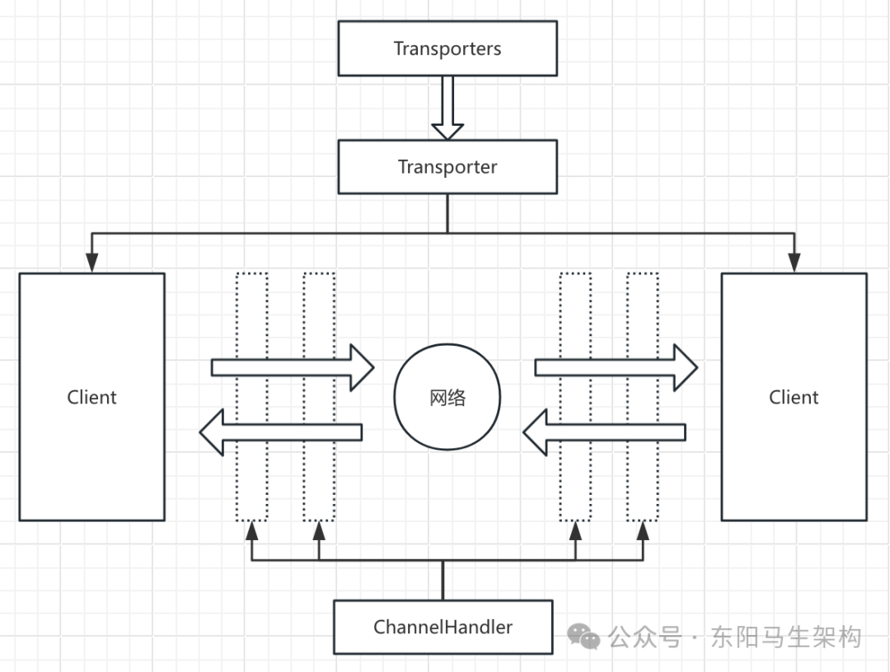

### (4)总结

这里首先介绍dubbo-remoting模块在Dubbo架构中的位置，以及dubbo-remoting模块的结构。接着介绍dubbo-remoting模块中各个子模块之间的依赖关系，以及各个包的核心功能。最后介绍整个Transport层的核心接口，以及这些接口抽象出来的Transporter架构。

## 3.Buffer缓冲区是数据的搬运工

### (1)ChannelBuffer接口

### (2)Buffer各实现类解析

### (3)相关Stream以及门面类

### (4)总结

Buffer是一种字节容器，在Netty等NIO框架中都有类似的设计。例如Java NIO中的ByteBuffer、Netty4中的ByteBuf。

Dubbo抽象出了ChannelBuffer接口对底层NIO框架中的Buffer设计进行统一，其子类如下图示。

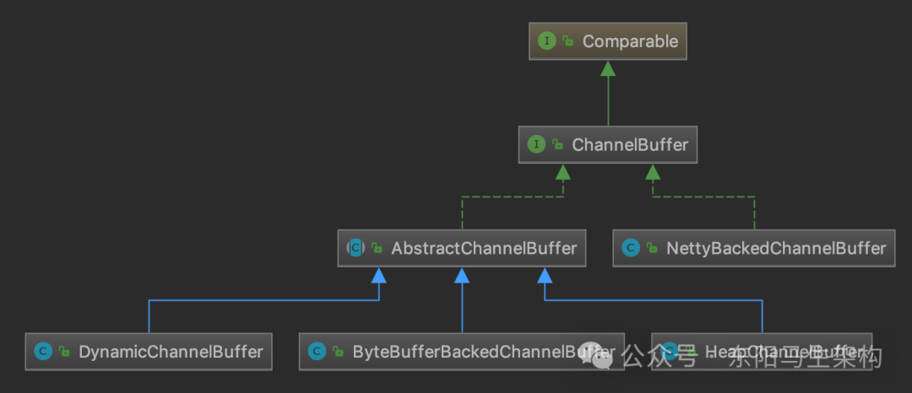

下面按照ChannelBuffer的继承结构，从顶层的ChannelBuffer接口开始，逐个向下介绍，直至最底层的各个实现类。

### (1)ChannelBuffer接口

ChannelBuffer接口的设计与Netty4中ByteBuf抽象类的设计基本一致，也有readerIndex和writerIndex指针。如下所示，它们的核心方法也是如出一辙。

```powershell
方法一：getBytes()、setBytes()
从参数指定的位置读、写当前ChannelBuffer，不会修改readerIndex和writerIndex指针的位置。

方法二：readBytes() 、writeBytes()
读、写当前ChannelBuffer。
readBytes()方法会从readerIndex指针开始读取数据，并移动readerIndex指针。
writeBytes()方法会从writerIndex指针位置开始写入数据，并移动writerIndex指针。

方法三：markReaderIndex()、markWriterIndex()
记录当前readerIndex和writerIndex指针的位置。
一般会和resetReaderIndex()、resetWriterIndex()方法配套使用。
resetReaderIndex()方法会将readerIndex指针重置到markReaderIndex()方法标记的位置。
resetwriterIndex()方法会将writerIndex指针重置到markWriterIndex()方法标记的位置。

方法四：capacity()、clear()、copy()
这些辅助方法用来获取ChannelBuffer容量以及实现清理、拷贝数据的功能。

方法五：factory()
该方法返回创建ChannelBuffer的工厂对象。
ChannelBufferFactory中定义了多个getBuffer()方法重载来创建ChannelBuffer。
ChannelBufferFactory的实现类有：
HeapChannelBufferFactory
NettyBackedChannelBufferFactory
DirectChannelBufferFactory
```

AbstractChannelBuffer抽象类实现了ChannelBuffer接口的大部分方法，其核心是维护了以下四个索引：

```cs
索引一：readerIndex(int类型)
通过readBytes()方法及其重载读取数据时，会后移readerIndex索引。

索引二：writerIndex(int类型)
通过writeBytes()方法及其重载写入数据时，会后移writerIndex索引。

索引三：markedReaderIndex(int类型)
实现记录readerIndex(writerIndex)以及回滚readerIndex(writerIndex)的功能。

索引四：markedWriterIndex(int类型)
实现记录writerIndex(readerIndex)以及回滚writerIndex(readerIndex)的功能。
```

AbstractChannelBuffer中readBytes()和writeBytes()方法的各个重载，最终会通过getBytes()和setBytes()方法来实现数据的读写，这些方法在AbstractChannelBuffer子类中实现。下面以读写一个byte数组为例，进行介绍。

```java
public abstract class AbstractChannelBuffer implements ChannelBuffer {
    ...
    @Override
    public void readBytes(byte[] dst, int dstIndex, int length) {
        checkReadableBytes(length);
        getBytes(readerIndex, dst, dstIndex, length);
        readerIndex += length;
    }

    @Override
    public void writeBytes(byte[] src, int srcIndex, int length) {
        setBytes(writerIndex, src, srcIndex, length);
        writerIndex += length;
    }
    ...
}
```

### (2)Buffer各实现类解析

#### 一.HeapChannelBuffer

#### 二.DynamicChannelBuffer

#### 三.ByteBufferBackedChannelBuffer

#### 四.NettyBackedChannelBuffer

介绍完ChannelBuffer接口的核心方法以及AbstractChannelBuffer的公共实现后，再来看ChannelBuffer的具体实现。

#### 一.HeapChannelBuffer

HeapChannelBuffer是基于字节数组的ChannelBuffer实现。可以看到其中有一个array(byte[]数组)字段，它就是HeapChannelBuffer存储数据的地方。

HeapChannelBuffer的setBytes()以及getBytes()方法的实现是通过调用System的arraycopy()方法完成数组操作的，具体如下：

```java
public class HeapChannelBuffer extends AbstractChannelBuffer {
    protected final byte[] array;
    ...

    @Override
    public void getBytes(int index, byte[] dst, int dstIndex, int length) {
        System.arraycopy(array, index, dst, dstIndex, length);
    }

    @Override
    public void setBytes(int index, byte[] src, int srcIndex, int length) {
        System.arraycopy(src, srcIndex, array, index, length);
    }
    ...
}
```

HeapChannelBuffer对应的ChannelBufferFactory实现是HeapChannelBufferFactory，其getBuffer()方法会通过ChannelBuffers这个工具类创建一个指定大小HeapChannelBuffer对象。

```java
public class HeapChannelBufferFactory implements ChannelBufferFactory {
    ...
    @Override
    public ChannelBuffer getBuffer(int capacity) {
        return ChannelBuffers.buffer(capacity);
    }

    @Override
    public ChannelBuffer getBuffer(byte[] array, int offset, int length) {
        return ChannelBuffers.wrappedBuffer(array, offset, length);
    }
    ...
}
```

#### 二.DynamicChannelBuffer

DynamicChannelBuffer可以认为是其他ChannelBuffer的装饰器，它可以为其他ChannelBuffer动态扩容。

DynamicChannelBuffer中有两个核心字段：

```
字段一：buffer(ChannelBuffer类型)
它是被装饰的ChannelBuffer，默认为HeapChannelBuffer。

字段二：factory(ChannelBufferFactory类型)
它用于创建被装饰的HeapChannelBuffer对象的ChannelBufferFactory工厂。
默认为HeapChannelBufferFactory。
```

DynamicChannelBuffer需要关注的是ensureWritableBytes()方法，该方法实现了动态扩容的功能。在每次写入数据之前，都需要调用该方法确定当前可用空间是否足够，调用位置如下图示：

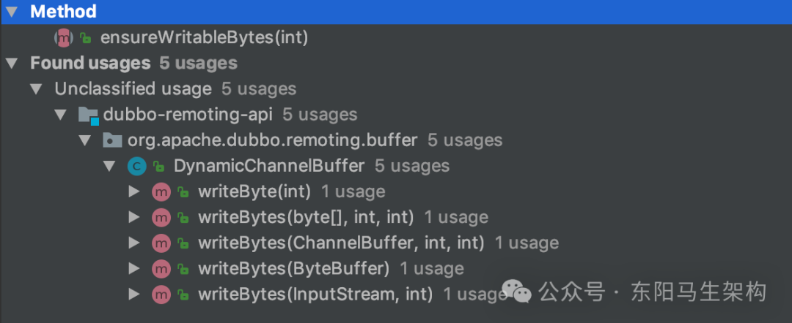

ensureWritableBytes()方法如果检测到底层ChannelBuffer对象的空间不足，则会创建一个新的ChannelBuffer，空间扩大为原来的两倍，然后将原来ChannelBuffer中的数据拷贝到新ChannelBuffer中，最后将buffer字段指向新ChannelBuffer对象，完成整个扩容操作。

ensureWritableBytes()方法的实现如下：

```java
public class DynamicChannelBuffer extends AbstractChannelBuffer {
    //它用于创建被装饰的HeapChannelBuffer对象的ChannelBufferFactory工厂
    //默认为HeapChannelBufferFactory
    private final ChannelBufferFactory factory;

    //它是被装饰的ChannelBuffer，默认为HeapChannelBuffer
    private ChannelBuffer buffer;
    ...

    @Override
    public void ensureWritableBytes(int minWritableBytes) {
        if (minWritableBytes <= writableBytes()) {
            return;
        }
        int newCapacity;
        if (capacity() == 0) {
            newCapacity = 1;
        } else {
            newCapacity = capacity();
        }
        int minNewCapacity = writerIndex() + minWritableBytes;
        while (newCapacity < minNewCapacity) {
            newCapacity <<= 1;
        }
        ChannelBuffer newBuffer = factory().getBuffer(newCapacity);
        newBuffer.writeBytes(buffer, 0, writerIndex());
        buffer = newBuffer;
    }
    ...
}
```

#### 三.ByteBufferBackedChannelBuffer

ByteBufferBackedChannelBuffer是基于Java NIO中ByteBuffer的ChannelBuffer实现，其中的方法基本都是通过组合ByteBuffer的API来实现的，如下getBytes()方法和setBytes()方法所示。

```java
public class ByteBufferBackedChannelBuffer extends AbstractChannelBuffer {
    private final ByteBuffer buffer;
    private final int capacity;
    ...

    @Override
    public void getBytes(int index, byte[] dst, int dstIndex, int length) {
        ByteBuffer data = buffer.duplicate();
        try {
            data.limit(index + length).position(index);
        } catch (IllegalArgumentException e) {
            throw new IndexOutOfBoundsException();
        }
        data.get(dst, dstIndex, length);
    }

    @Override
    public void setBytes(int index, byte[] src, int srcIndex, int length) {
        ByteBuffer data = buffer.duplicate();
        data.limit(index + length).position(index);
        data.put(src, srcIndex, length);
    }
    ...
}
```

#### 四.NettyBackedChannelBuffer

NettyBackedChannelBuffer是基于Netty中ByteBuf的ChannelBuffer实现。Netty中的ByteBuf内部维护了readerIndex和writerIndex以及markedReaderIndex、markedWriterIndex这四个索引。所以NettyBackedChannelBuffer没有继承AbstractChannelBuffer抽象类，而是直接实现了ChannelBuffer接口，它对ChannelBuffer接口的实现都是通过底层封装的Netty ByteBuf来实现的。

### (3)相关Stream以及门面类

#### 一.基于ChannelBuffer的输入输出流

#### 二.ChannelBuffers门面类

#### 一.基于ChannelBuffer的输入输出流

在ChannelBuffer基础上，Dubbo提供了一套输入输出流，如下图示：

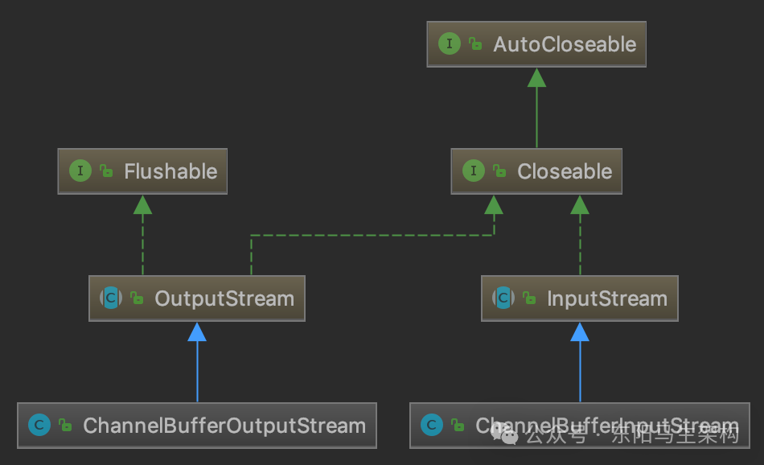

ChannelBufferInputStream底层封装了一个ChannelBuffer，其实现InputStream接口的read*()方法全部都是从ChannelBuffer中读取数据。

ChannelBufferInputStream中还维护了一个startIndex和一个endIndex索引，作为读取数据的起止位置。

ChannelBufferOutputStream与ChannelBufferInputStream类似，会向底层的ChannelBuffer写入数据。

#### 二.ChannelBuffers门面类

ChannelBuffers是个门面类，其方法如下：

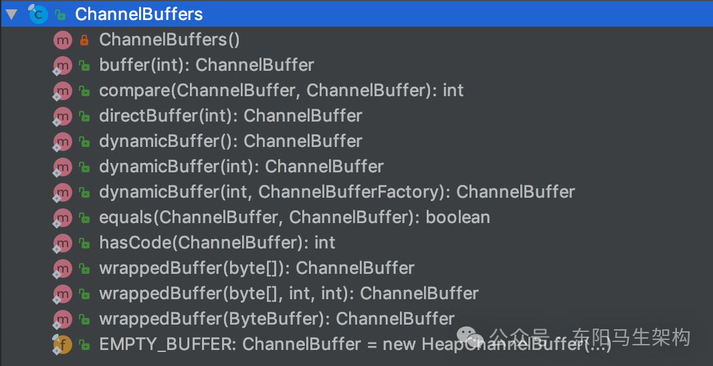

对这些方法进行分类，如下：

```cs
方法一：dynamicBuffer()
创建DynamicChannelBuffer对象，初始化大小由第一个参数指定，默认为256。

方法二：buffer()
创建指定大小的HeapChannelBuffer对象。

方法三：wrappedBuffer()
将传入的byte[]数字封装成HeapChannelBuffer对象。

方法四：directBuffer()
创建ByteBufferBackedChannelBuffer对象。
需要注意的是，底层的ByteBuffer使用的堆外内存，需要特别关注堆外内存的管理。

方法五：equals()
用于比较两个ChannelBuffer是否相同。
其中会逐个比较两个ChannelBuffer中的前7个可读字节，只有两者完全一致，才算两个ChannelBuffer相同。

方法六：compare()
用于比较两个ChannelBuffer的大小，会逐个比较两个ChannelBuffer中的全部可读字节。
具体实现与equals()方法类似。
```

equals()方法的核心实现：

```java
public final class ChannelBuffers {
    ...
    public static boolean equals(ChannelBuffer bufferA, ChannelBuffer bufferB) {
        final int aLen = bufferA.readableBytes();
        if (aLen != bufferB.readableBytes()) {
            return false;
        }
        final int byteCount = aLen & 7;

        int aIndex = bufferA.readerIndex();
        int bIndex = bufferB.readerIndex();

        for (int i = byteCount; i > 0; i--) {
            if (bufferA.getByte(aIndex) != bufferB.getByte(bIndex)) {
                return false;
            }
            aIndex++;
            bIndex++;
        }

        return true;
    }
    ...
}
```

### (4)总结

这里介绍了dubbo-remoting模块buffer包中的核心实现。首先介绍了ChannelBuffer这个顶层接口，介绍了ChannelBuffer提供的核心功能和运作原理。接着介绍了ChannelBuffer的多种实现，包括HeapChannelBuffer、DynamicChannelBuffer、ByteBufferBackedChannelBuffer等具体实现类，以及AbstractChannelBuffer这个抽象类。最后介绍了ChannelBufferFactory使用到的ChannelBuffers工具类，以及在ChannelBuffer之上封装的InputStream和OutputStream实现。
