# Dubbo原理—6.服务通信之Transporter传输层

> **公众号**: 东阳马生架构  
> **发布时间**: 2025-07-23 09:00  

**大纲(16800字)**

- 1.Transporter层的Server实现
- 2.Transporter层的Client实现


## 1.Transporter层的Server实现

### (1)AbstractPeer抽象类

### (2)AbstractEndpoint抽象类

### (3)Server继承线分析

### (4)AbstractServer的实现类

### (5)核心的ChannelHandler

### (6)Transporter层的Server总结

前面介绍了dubbo-remoting-api模块中Transporter层相关的核心抽象接口，这里继续介绍dubbo-remoting-api模块的其他内容。接下来会从Transporter层的RemotingServer、Client、Channel、ChannelHandler接口出发，介绍这些核心接口的实现。

Netty中也有ChannelHandler、Channel等接口，但无特殊说明的情况下，这里的接口指的都是Dubbo中定义的接口。如果涉及Netty中的接口，会进行特殊说明。

### (1)AbstractPeer抽象类

AbstractPeer抽象类同时实现了Endpoint接口和ChannelHandler接口，它也是AbstractChannel、AbstractEndpoint抽象类的父类，如下图示。

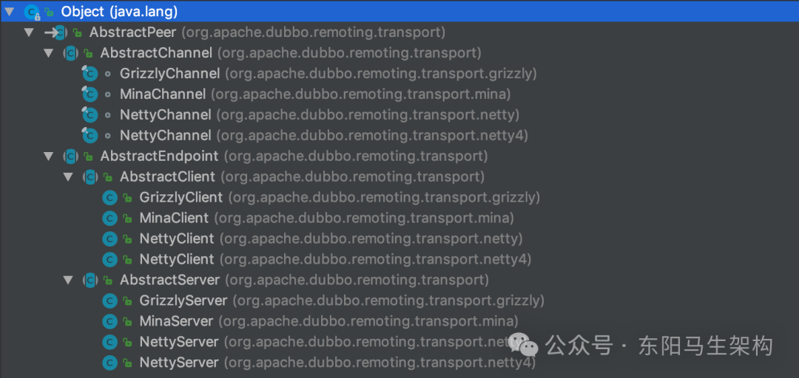

AbstractPeer中有四个字段：一个用来表示该端点自身的URL类型的字段(与Endpoint接口相关)，两个用来记录当前端点状态的Boolean类型字段(与Endpoint接口相关)，一个指向ChannelHandler对象的字段，AbstractPeer对ChannelHandler接口的所有实现都委托给该ChannelHandler对象。

根据上面的继承关系图以及AbstractPeer的字段，可以得出这样一个结论：AbstractChannel、AbstractServer、AbstractClient都会关联一个ChannelHandler对象。

```java
public abstract class AbstractPeer implements Endpoint, ChannelHandler {
    private volatile URL url;
    private volatile boolean closing;
    private volatile boolean closed;
    private final ChannelHandler handler;
    ...
}

public interface Endpoint {
    URL getUrl();
    ChannelHandler getChannelHandler();
    InetSocketAddress getLocalAddress();
    void send(Object message) throws RemotingException;
    void send(Object message, boolean sent) throws RemotingException;
    void close();
    void close(int timeout);
    void startClose();
    boolean isClosed();
}

@SPI
public interface ChannelHandler {
    void connected(Channel channel) throws RemotingException;
    void disconnected(Channel channel) throws RemotingException;
    void sent(Channel channel, Object message) throws RemotingException;
    void received(Channel channel, Object message) throws RemotingException;
    void caught(Channel channel, Throwable exception) throws RemotingException;
}
```

### (2)AbstractEndpoint抽象类

AbstractEndpoint继承了AbstractPeer这个抽象类，它维护了一个Codec2对象(codec字段)和两个超时时间(timeout字段和connectTimeout字段)，它的构造方法会根据传入的URL初始化这三个字段。

```java
public abstract class AbstractEndpoint extends AbstractPeer implements Resetable {
    private Codec2 codec;
    private int timeout;
    private int connectTimeout;
    ...

    public AbstractEndpoint(URL url, ChannelHandler handler) {
        //调用父类AbstractPeer的构造方法
        super(url, handler);
        //根据URL中的codec参数值，确定此处具体的Codec2实现类
        this.codec = getChannelCodec(url);
        //根据URL中的timeout参数确定timeout字段的值，默认1000
        this.timeout = url.getPositiveParameter(TIMEOUT_KEY, DEFAULT_TIMEOUT);
        //根据URL中的connect.timeout参数确定connectTimeout字段的值，默认3000
        this.connectTimeout = url.getPositiveParameter(Constants.CONNECT_TIMEOUT_KEY, Constants.DEFAULT_CONNECT_TIMEOUT);
    }
    ...
}
```

根据前面介绍可知，Codec2接口是一个SPI扩展点。AbstractEndpoint的getChannelCodec()方法就是基于Dubbo SPI选择其扩展实现的，具体如下：

```cs
public abstract class AbstractEndpoint extends AbstractPeer implements Resetable {
    private Codec2 codec;
    private int timeout;
    private int connectTimeout;
    ...

    protected static Codec2 getChannelCodec(URL url) {
        //根据URL的codec参数获取扩展名
        String codecName = url.getParameter(Constants.CODEC_KEY, "telnet");
        if (ExtensionLoader.getExtensionLoader(Codec2.class).hasExtension(codecName)) {
            //通过ExtensionLoader加载并实例化Codec2的具体扩展实现
            return ExtensionLoader.getExtensionLoader(Codec2.class).getExtension(codecName);
        } else {
            //Codec2接口不存在相应的扩展名，就尝试从Codec这个老接口的扩展名中查找，目前Codec接口已经废弃了
            return new CodecAdapter(ExtensionLoader.getExtensionLoader(Codec.class).getExtension(codecName));
        }
    }
    ...
}
```

另外，AbstractEndpoint还实现了Resetable接口(只有一个reset()方法需要实现)。虽然AbstractEndpoint中的reset()方法比较长，但逻辑简单，也就是根据传入的URL参数重置AbstractEndpoint的三个字段。下面重置codec字段的代码片段就是通过调用getChannelCodec()方法实现的：

```java
public abstract class AbstractEndpoint extends AbstractPeer implements Resetable {
    private Codec2 codec;
    private int timeout;
    private int connectTimeout;
    ...

    @Override
    public void reset(URL url) {
        ...
        if (url.hasParameter(TIMEOUT_KEY)) {
            int t = url.getParameter(TIMEOUT_KEY, 0);
            if (t > 0) {
                this.timeout = t;
            }
        }

        if (url.hasParameter(Constants.CONNECT_TIMEOUT_KEY)) {
            int t = url.getParameter(Constants.CONNECT_TIMEOUT_KEY, 0);
            if (t > 0) {
                this.connectTimeout = t;
            }
        }

        if (url.hasParameter(Constants.CODEC_KEY)) {
            this.codec = getChannelCodec(url);
        }
    }
    ...
}
```

### (3)Server继承线分析

#### 一.AbstractServer的字段

#### 二.AbstractServer的构造方法

#### 三.AbstractServer的抽象方法

AbstractServer和AbstractClient都继承了AbstractEndpoint抽象类，AbstractServer是对服务端的抽象，实现了服务端的公共逻辑。

```java
public abstract class AbstractServer extends AbstractEndpoint implements RemotingServer {
    ...
    ...
}

public abstract class AbstractClient extends AbstractEndpoint implements Client {
    ...
    ...
}
```

AbstractServer在继承AbstractEndpoint的同时，还实现了RemotingServer接口，如下是AbstractServer继承关系图：

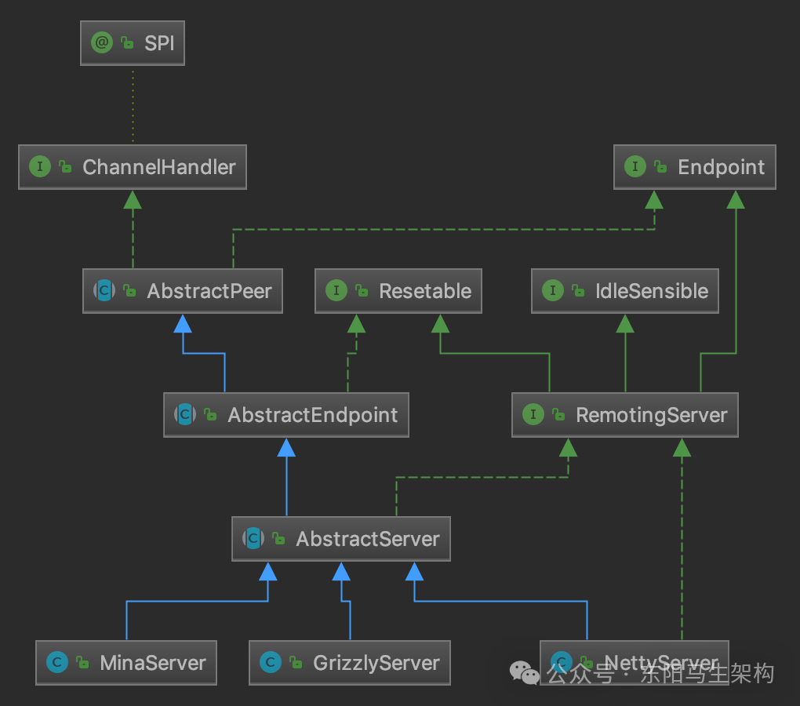

#### 一.AbstractServer的字段

它的核心字段如下：

```cs
字段一：localAddress(InetSocketAddress类型)
该Server的本地地址，从URL中的参数中获取。

字段二：bindAddress(InetSocketAddress类型)
该Server的绑定的地址，从URL中的参数中获取。
bindAddress默认值与localAddress一致。

字段三：accepts(int类型)
该Server能接收的最大连接数，从URL的accepts参数中获取，默认值为0，表示没有限制。

字段四：executor(ExecutorService类型)
当前Server关联的线程池，由ExecutorRepository创建并管理。

字段五：executorRepository(ExecutorRepository类型)
线程池仓库，负责管理线程池。
```

#### 二.AbstractServer的构造方法

AbstractServer的构造方法会根据传入的URL初始化上述字段，并调用doOpen()这个抽象方法完成该Server的启动。具体如下：

```java
public abstract class AbstractServer extends AbstractEndpoint implements RemotingServer {
    //该Server的本地地址，从URL中的参数中获取
    private InetSocketAddress localAddress;

    //该Server的绑定的地址，从URL中的参数中获取
    //bindAddress默认值与localAddress一致
    private InetSocketAddress bindAddress;

    //该Server能接收的最大连接数，从URL的accepts参数中获取，默认值为0，表示没有限制
    private int accepts;

    //当前Server关联的线程池，由ExecutorRepository创建并管理
    private ExecutorService executor;

    //线程池仓库，负责管理线程池
    private ExecutorRepository executorRepository =
        ExtensionLoader.getExtensionLoader(ExecutorRepository.class).getDefaultExtension();
    ...

    public AbstractServer(URL url, ChannelHandler handler) throws RemotingException {
        //调用父类的构造方法
        super(url, handler);
        //根据传入的URL初始化localAddress和bindAddress
        localAddress = getUrl().toInetSocketAddress();
        String bindIp = getUrl().getParameter(Constants.BIND_IP_KEY, getUrl().getHost());
        int bindPort = getUrl().getParameter(Constants.BIND_PORT_KEY, getUrl().getPort());
        if (url.getParameter(ANYHOST_KEY, false) || NetUtils.isInvalidLocalHost(bindIp)) {
            bindIp = ANYHOST_VALUE;
        }
        bindAddress = new InetSocketAddress(bindIp, bindPort);
        //初始化accepts等字段
        this.accepts = url.getParameter(ACCEPTS_KEY, DEFAULT_ACCEPTS);
        this.idleTimeout = url.getParameter(IDLE_TIMEOUT_KEY, DEFAULT_IDLE_TIMEOUT);
        try {
            //调用doOpen()这个抽象方法，启动该Server
            doOpen();
            ...
        } catch (Throwable t) {
            ...
        }
        //获取该Server关联的线程池
        executor = executorRepository.createExecutorIfAbsent(url);
    }
    ...
}

public interface RemotingServer extends Endpoint, Resetable, IdleSensible {
    boolean isBound();
    Collection<Channel> getChannels();
    Channel getChannel(InetSocketAddress remoteAddress);
}
```

#### 三.AbstractServer的抽象方法

AbstractServer定义了doOpen()、doClose()两个抽象方法交给子类来实现。

```java
public abstract class AbstractServer extends AbstractEndpoint implements RemotingServer {
    ...
    protected abstract void doOpen() throws Throwable;
    protected abstract void doClose() throws Throwable;
    ...
}

public interface RemotingServer extends Endpoint, Resetable, IdleSensible {
    boolean isBound();
    Collection<Channel> getChannels();
    Channel getChannel(InetSocketAddress remoteAddress);
}
```

### (4)AbstractServer的实现类

#### 一.用来管理线程池的ExecutorRepository

#### 二.NettyServer的doOpen()方法

#### 一.用来管理线程池的ExecutorRepository

AbstractServer中有一个ExecutorRepository类型的字段，用来管理线程池。其中，ExecutorRepository接口负责创建并管理Dubbo中的线程池，它虽然是个SPI扩展点，但只有一个默认实现——DefaultExecutorRepository。

该默认实现维护了一个双层ConcurrentMapdata字段)，该集合会缓存已有的线程池，第一层key表示线程池属于Provider还是Consumer，第二层key表示线程池关联服务的端口。

该默认实现的createExecutorIfAbsent()方法，会根据URL参数创建相应的线程池并缓存在合适的位置，具体如下：

```typescript
public class DefaultExecutorRepository implements ExecutorRepository {
    ...
    private ConcurrentMap<String, ConcurrentMap<Integer, ExecutorService>> data = new ConcurrentHashMap<>();

    public synchronized ExecutorService createExecutorIfAbsent(URL url) {
        String componentKey = EXECUTOR_SERVICE_COMPONENT_KEY;
        //根据URL中的side参数值决定第一层key
        if (CONSUMER_SIDE.equalsIgnoreCase(url.getParameter(SIDE_KEY))) {
            componentKey = CONSUMER_SIDE;
        }
        Map<Integer, ExecutorService> executors = data.computeIfAbsent(componentKey, k -> new ConcurrentHashMap<>());
        //根据URL中的port值确定第二层key
        Integer portKey = url.getPort();
        ExecutorService executor = executors.computeIfAbsent(portKey, k -> createExecutor(url));
        //如果缓存中相应的线程池已关闭，则同样需要调用createExecutor()方法创建新的线程池，并替换掉缓存中已关闭的线程持
        if (executor.isShutdown() || executor.isTerminated()) {
            executors.remove(portKey);
            executor = createExecutor(url);
            executors.put(portKey, executor);
        }
        return executor;
    }
    ...

    private ExecutorService createExecutor(URL url) {
        return (ExecutorService) ExtensionLoader.getExtensionLoader(ThreadPool.class).getAdaptiveExtension().getExecutor(url);
    }
}
```

该默认实现的createExecutor()方法，会通过Dubbo SPI查找ThreadPool接口的扩展实现，并调用其getExecutor()方法创建线程池。

其中，ThreadPool接口被@SPI注解修饰，默认的扩展实现为FixedThreadPool。ThreadPool接口的getExecutor()方法被@Adaptive注解修饰，动态生成的适配器类会优先根据URL中的threadpool参数选择具体的ThreadPool扩展实现。

```java
@SPI("fixed")
publicinterfaceThreadPool{
@Adaptive({THREADPOOL_KEY})
    Executor getExecutor(URL url);
}
```

ThreadPool接口的扩展实现类如下所示，不同的实现类会根据URL参数创建不同的线程池。

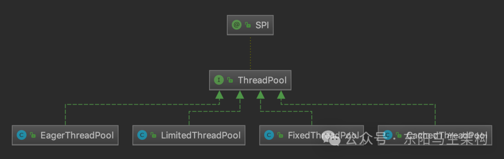

实现类一：CacheThreadPool

```java
public class CachedThreadPool implements ThreadPool {
    @Override
    public Executor getExecutor(URL url) {
        String name = url.getParameter(THREAD_NAME_KEY, DEFAULT_THREAD_NAME);
        //核心线程数量
        int cores = url.getParameter(CORE_THREADS_KEY, DEFAULT_CORE_THREADS);
        //最大线程数量
        int threads = url.getParameter(THREADS_KEY, Integer.MAX_VALUE);
        //缓冲队列的最大长度
        int queues = url.getParameter(QUEUES_KEY, DEFAULT_QUEUES);
        //非核心线程的最大空闲时长，当非核心线程空闲时间超过该值时，会被回收
        int alive = url.getParameter(ALIVE_KEY, DEFAULT_ALIVE);
        //下面就是依赖JDK的ThreadPoolExecutor创建指定特性的线程池并返回
        return new ThreadPoolExecutor(
            cores,
            threads,
            alive,
            TimeUnit.MILLISECONDS,
            queues == 0 ? new SynchronousQueue<Runnable>() : (queues < 0 ? new LinkedBlockingQueue<Runnable>() : new LinkedBlockingQueue<Runnable>(queues)),
            new NamedInternalThreadFactory(name, true),
            new AbortPolicyWithReport(name, url)
        );
    }
}
```

实现类二：LimitedThreadPool

与CacheThreadPool一样，可以指定核心线程数、最大线程数以及缓冲队列长度。区别在于，LimitedThreadPool创建的线程池的非核心线程不会被回收。

```java
//LimitedThreadPool线程池的线程数量会随着你的繁忙的任务量而增加
//但是最大的线程数量是不会超过最大阈值的
//同时创建出来的线程，是不会因为空闲而被回收
public class LimitedThreadPool implements ThreadPool {
    @Override
    public Executor getExecutor(URL url) {
        String name = url.getParameter(THREAD_NAME_KEY, DEFAULT_THREAD_NAME);
        int cores = url.getParameter(CORE_THREADS_KEY, DEFAULT_CORE_THREADS);
        int threads = url.getParameter(THREADS_KEY, DEFAULT_THREADS);
        int queues = url.getParameter(QUEUES_KEY, DEFAULT_QUEUES);
        return new ThreadPoolExecutor(
            cores,
            threads,
            Long.MAX_VALUE,
            TimeUnit.MILLISECONDS,
            queues == 0 ? new SynchronousQueue<Runnable>() :
                (queues < 0 ? new LinkedBlockingQueue<Runnable>() : new LinkedBlockingQueue<Runnable>(queues)),
            new NamedInternalThreadFactory(name, true),
            new AbortPolicyWithReport(name, url)
        );
    }
}
```

实现类三：FixedThreadPool

核心线程数和最大线程数一致，且不会被回收。LimitedThreadPool、FixedThreadPool、CacheThreadPool都是基于JDK提供的ThreadPoolExecutor线程池。在核心线程全部被占用时，会优先将任务放到缓冲队列中缓存，在缓冲队列满了之后，才会尝试创建新线程来处理任务。

```java
//Dubbo默认的线程池策略
public class FixedThreadPool implements ThreadPool {
    @Override
    public Executor getExecutor(URL url) {
        String name = url.getParameter(THREAD_NAME_KEY, DEFAULT_THREAD_NAME);
        int threads = url.getParameter(THREADS_KEY, DEFAULT_THREADS);
        int queues = url.getParameter(QUEUES_KEY, DEFAULT_QUEUES);
        return new ThreadPoolExecutor(
            threads,
            threads,
            0,
            TimeUnit.MILLISECONDS,
            queues == 0 ? new SynchronousQueue<Runnable>() :
                (queues < 0 ? new LinkedBlockingQueue<Runnable>() : new LinkedBlockingQueue<Runnable>(queues)),
            new NamedInternalThreadFactory(name, true),
            new AbortPolicyWithReport(name, url)
        );
    }
}
```

实现类四：EagerThreadPool

EagerThreadPool创建的线程池是EagerThreadPoolExecutor，使用的队列是TaskQueue。同样继承JDK提供的ThreadPoolExecutor，队列则继承LinkedBlockingQueue。

```java
//eager表示渴望之意
//如果线程池里的线程都是忙碌的状态，此时会创建新的线程出来，而不是放到queue里去排队
//这种线程池一般要慎用，因为有可能会导致一下子创建出过多的线程
//一旦太多的线程被创建出来，则可能会导致机器负载很高
//除非可以确认即使是在负载和并发最高时，也不会有太多的线程同时运行，则可以放心使用
public class EagerThreadPool implements ThreadPool {
    @Override
    public Executor getExecutor(URL url) {
        String name = url.getParameter(THREAD_NAME_KEY, DEFAULT_THREAD_NAME);
        int cores = url.getParameter(CORE_THREADS_KEY, DEFAULT_CORE_THREADS);
        int threads = url.getParameter(THREADS_KEY, Integer.MAX_VALUE);
        int queues = url.getParameter(QUEUES_KEY, DEFAULT_QUEUES);
        int alive = url.getParameter(ALIVE_KEY, DEFAULT_ALIVE);
        //init queue and executor
        TaskQueue<Runnable> taskQueue = new TaskQueue<Runnable>(queues <= 0 ? 1 : queues);
        EagerThreadPoolExecutor executor = new EagerThreadPoolExecutor(
            cores,
            threads,
            alive,
            TimeUnit.MILLISECONDS,
            taskQueue,
            new NamedInternalThreadFactory(name, true),
            new AbortPolicyWithReport(name, url)
        );

        //给taskQueue设置executor
        taskQueue.setExecutor(executor);
        return executor;
    }
}
```

该线程池与ThreadPoolExecutor不同的是：在线程数没有达到最大线程数的前提下，EagerThreadPoolExecutor会优先创建线程来执行任务，而不是放到缓冲队列中。当线程数达到最大值时，EagerThreadPoolExecutor才会将任务放入缓冲队列，等待空闲线程。

EagerThreadPoolExecutor覆盖了ThreadPoolExecutor中的两个方法：execute()方法和afterExecute()方法。具体实现如下，可以看到其中维护了一个submittedTaskCount字段（AtomicInteger类型)，用来记录当前在线程池中的任务总数(正在线程中执行的任务数 + 队列中等待的任务数)。

```java
public class EagerThreadPoolExecutor extends ThreadPoolExecutor {
    @Override
    public void execute(Runnable command) {
        //任务提交之前，递增submittedTaskCount
        submittedTaskCount.incrementAndGet();
        try {
            //提交任务
            super.execute(command);
        } catch (RejectedExecutionException rx) {
            //任务被拒绝之后，会尝试再次放入队列中缓存，等待空闲线程执行
            final TaskQueue queue = (TaskQueue) super.getQueue();
            try {
                //再次入队被拒绝，则队列已满，无法执行任务递减submittedTaskCount
                if (!queue.retryOffer(command, 0, TimeUnit.MILLISECONDS)) {
                    submittedTaskCount.decrementAndGet();
                    throw new RejectedExecutionException("Queue capacity is full.", rx);
                }
            } catch (InterruptedException x) {
                //再次入队列异常，递减submittedTaskCount
                submittedTaskCount.decrementAndGet();
                throw new RejectedExecutionException(x);
            }
        } catch (Throwable t) {
            //任务提交异常，递减submittedTaskCount
            submittedTaskCount.decrementAndGet();
            throw t;
        }
    }

    @Override
    protected void afterExecute(Runnable r, Throwable t) {
        //任务指定结束，递减submittedTaskCount
        submittedTaskCount.decrementAndGet();
    }
    ...
}
```

EagerThreadPoolExecutor优先创建线程执行任务的逻辑就在关联的TaskQueue实现中，它覆盖了LinkedBlockingQueue的offer()方法。TaskQueue的offer()方法会判断线程池的submittedTaskCount值是否已经达到最大线程数。如果未超过，则返回false，迫使线程池创建新线程来执行任务。

```java
public class TaskQueue<R extends Runnable> extends LinkedBlockingQueue<Runnable> {
    private EagerThreadPoolExecutor executor;

    public TaskQueue(int capacity) {
        super(capacity);
    }

    public void setExecutor(EagerThreadPoolExecutor exec) {
        executor = exec;
    }

    @Override
    public boolean offer(Runnable runnable) {
        //获取当前线程池中的活跃线程数
        int currentPoolThreadSize = executor.getPoolSize();
        //当前有线程空闲，直接将任务提交到队列中，空闲线程会直接从中获取任务执行
        if (executor.getSubmittedTaskCount() < currentPoolThreadSize) {
            return super.offer(runnable);
        }
        //当前没有空闲线程，但是还可以创建新线程，则返回false，迫使线程池创建新线程来执行任务
        if (currentPoolThreadSize < executor.getMaximumPoolSize()) {
            return false;
        }
        //当前线程数已经达到上限，只能放到队列中缓存了
        return super.offer(runnable);
    }

    public boolean retryOffer(Runnable o, long timeout, TimeUnit unit) throws InterruptedException {
        if (executor.isShutdown()) {
            throw new RejectedExecutionException("Executor is shutdown!");
        }
        return super.offer(o, timeout, unit);
    }
}
```

这几类线程池中使用的AbortPolicyWithReport 继承了ThreadPoolExecutor的AbortPolicy，其覆盖的rejectedExecution()方法中会输出包含线程池相关信息的WARN级别日志，然后执行dumpJStack()方法，最后才会抛出RejectedExecutionException异常。

```perl
public class AbortPolicyWithReport extends ThreadPoolExecutor.AbortPolicy {
    ...
    @Override
    public void rejectedExecution(Runnable r, ThreadPoolExecutor e) {
        String msg = String.format("Thread pool is EXHAUSTED!" +
            " Thread Name: %s, Pool Size: %d (active: %d, core: %d, max: %d, largest: %d)," +
            " Task: %d (completed: %d)," +
            " Executor status:(isShutdown:%s, isTerminated:%s, isTerminating:%s), in %s://%s:%d!",
            threadName, e.getPoolSize(), e.getActiveCount(), e.getCorePoolSize(), e.getMaximumPoolSize(),
            e.getLargestPoolSize(), e.getTaskCount(), e.getCompletedTaskCount(), e.isShutdown(),
            e.isTerminated(), e.isTerminating(), url.getProtocol(), url.getIp(), url.getPort()
        );
        logger.warn(msg);
        dumpJStack();
        dispatchThreadPoolExhaustedEvent(msg);
        throw new RejectedExecutionException(msg);
    }
    ...
}
```

#### 二.NettyServer的doOpen()方法

```java
public interface RemotingServer extends Endpoint, Resetable, IdleSensible {
    boolean isBound();
    Collection<Channel> getChannels();
    Channel getChannel(InetSocketAddress remoteAddress);
}

public class NettyServer extends AbstractServer implements RemotingServer {
    @Override
    protected void doOpen() throws Throwable {
        //创建ServerBootstrap
        bootstrap = new ServerBootstrap();
        //创建boss EventLoopGroup
        bossGroup = NettyEventLoopFactory.eventLoopGroup(1, "NettyServerBoss");
        //创建worker EventLoopGroup
        workerGroup = NettyEventLoopFactory.eventLoopGroup(getUrl().getPositiveParameter(IO_THREADS_KEY, Constants.DEFAULT_IO_THREADS), "NettyServerWorker");

        //创建NettyServerHandler
        //它是一个Netty中的ChannelHandler实现
        //不是Dubbo Remoting层的ChannelHandler接口的实现
        final NettyServerHandler nettyServerHandler = new NettyServerHandler(getUrl(), this);
        //获取当前NettyServer创建的所有Channel
        //这里的channels集合中的Channel不是Netty中的Channel对象
        //而是Dubbo Remoting层的Channel对象
        channels = nettyServerHandler.getChannels();
        //初始化ServerBootstrap，指定boss和worker EventLoopGroup
        bootstrap.group(bossGroup, workerGroup)
            .channel(NettyEventLoopFactory.serverSocketChannelClass())
            .option(ChannelOption.SO_REUSEADDR, Boolean.TRUE)
            .childOption(ChannelOption.TCP_NODELAY, Boolean.TRUE)
            .childOption(ChannelOption.ALLOCATOR, PooledByteBufAllocator.DEFAULT)
            .childHandler(new ChannelInitializer<SocketChannel>() {
                @Override
                protected void initChannel(SocketChannel ch) throws Exception {
                    //连接空闲超时时间
                    int idleTimeout = UrlUtils.getIdleTimeout(getUrl());
                    //NettyCodecAdapter中会创建Decoder和Encoder
                    NettyCodecAdapter adapter = new NettyCodecAdapter(getCodec(), getUrl(), NettyServer.this);
                    if (getUrl().getParameter(SSL_ENABLED_KEY, false)) {
                        ch.pipeline().addLast("negotiation", SslHandlerInitializer.sslServerHandler(getUrl(), nettyServerHandler));
                    }
                    ch.pipeline()
                        //注册Decoder和Encoder
                        .addLast("decoder", adapter.getDecoder())
                        .addLast("encoder", adapter.getEncoder())
                        //注册IdleStateHandler
                        .addLast("server-idle-handler", new IdleStateHandler(0, 0, idleTimeout, MILLISECONDS))
                        //注册NettyServerHandler
                        .addLast("handler", nettyServerHandler);
                }
            }
        );

        //绑定指定的地址和端口
        ChannelFuture channelFuture = bootstrap.bind(getBindAddress());
        //提交任务
        channelFuture.syncUninterruptibly();
        channel = channelFuture.channel();
    }
    ...
}
```

NettyServer的doOpen()方法使用了基于Netty启动一个Server端的标准化流程：

```shell
-> 初始化ServerBootstrap
-> 创建Boss EventLoopGroup
-> 创建Worker EventLoopGroup
-> 创建ChannelInitializer指定如何初始化Channel上的ChannelHandler
-> 绑定地址和端口
```

在Transporter这一层看，功能的不同其实就是注册在Channel上的ChannelHandler不同，通过doOpen()方法得到的Server端结构如下：

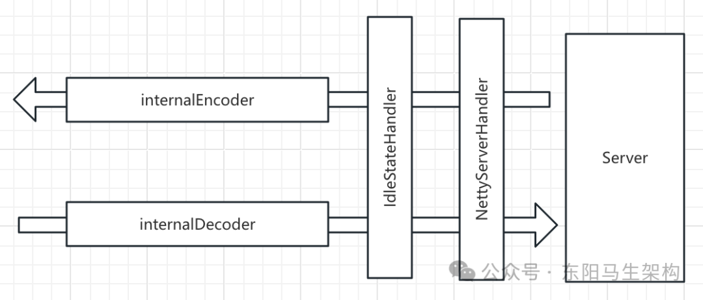

### (5)核心的ChannelHandler

```java
@SPI
public interface ChannelHandler {
    void connected(Channel channel) throws RemotingException;
    void disconnected(Channel channel) throws RemotingException;
    void sent(Channel channel, Object message) throws RemotingException;
    void received(Channel channel, Object message) throws RemotingException;
    void caught(Channel channel, Throwable exception) throws RemotingException;
}
```

ChannelHandler作为被@SPI注解修饰的扩展接口，也有4个核心的实现类。

#### 一.decoder和encoder

decoder和encoder它们都是NettyCodecAdapter的内部类，分别继承了Netty中的ByteToMessageDecoder和MessageToByteEncoder。

```java
final public class NettyCodecAdapter {
    private final ChannelHandler encoder = new InternalEncoder();
    private final ChannelHandler decoder = new InternalDecoder();

    private class InternalEncoder extends MessageToByteEncoder {
        ...
    }

    private class InternalDecoder extends ByteToMessageDecoder {
        ...
    }
    ...
}
```

AbstractEndpoint抽象类中有个Codec2类型的codec字段，InternalDecoder和InternalEncoder会将真正的编解码功能委托给NettyServer关联的这个Codec2对象去处理，如下所示：

```java
final public class NettyCodecAdapter {
    ...
    private class InternalDecoder extends ByteToMessageDecoder {
        @Override
        protected void decode(ChannelHandlerContext ctx, ByteBuf input, List<Object> out) throws Exception {
            //将ByteBuf封装成统一的ChannelBuffer
            ChannelBuffer message = new NettyBackedChannelBuffer(input);
            //拿到关联的Channel
            NettyChannel channel = NettyChannel.getOrAddChannel(ctx.channel(), url, handler);
            //decode object.
            do {
                //记录当前readerIndex的位置
                int saveReaderIndex = message.readerIndex();
                //委托给Codec2进行解码
                Object msg = codec.decode(channel, message);
                //当前接收到的数据不足一个消息的长度，会返回NEED_MORE_INPUT，这里会重置readerIndex，继续等待接收更多的数据
                if (msg == Codec2.DecodeResult.NEED_MORE_INPUT) {
                    message.readerIndex(saveReaderIndex);
                    break;
                } else {
                    if (saveReaderIndex == message.readerIndex()) {
                        throw new IOException("Decode without read data.");
                    }
                    if (msg != null) {
                        //将读取到的消息传递给后面的Handler处理
                        out.add(msg);
                    }
                }
            } while (message.readable());
        }
    }
}
```

#### 二.IdleStateHandler

它是Netty提供的一个工具型ChannelHandler，用于发送定时心跳请求或者自动关闭长时间空闲连接。

IdleStateHandler会通过lastReadTime、lastWriteTime等几个字段，记录最近一次读写事件的时间。然后在初始化时会创建一个定时任务，定时检测当前时间与最后一次读写时间的差值。如果差值超过设置的阈值，就会触发IdleStateEvent事件，并传递给后续的ChannelHandler进行处理。后续ChannelHandler的userEventTriggered()方法会根据接收到的IdleStateEvent事件，决定是关闭长时间空闲的连接还是发送心跳探活。其中，设置的阈值也就是NettyServer中设置的idleTimeout。

#### 三.NettyServerHandler

它继承了Netty提供的一个可以同时处理Inbound数据和Outbound数据的ChannelHandler，也就是ChannelDuplexHandler，如下继承关系图所示。

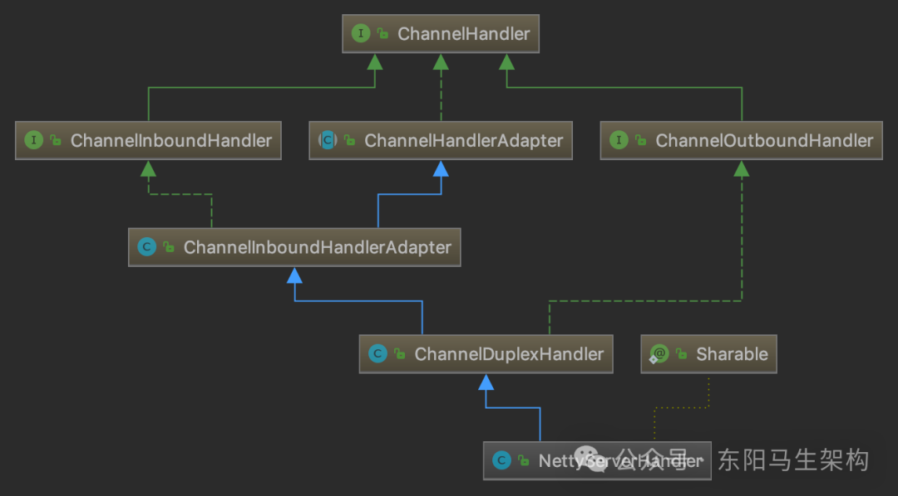

```typescript
@io.netty.channel.ChannelHandler.Sharable
public class NettyServerHandler extends ChannelDuplexHandler {
    private final Map<String, Channel> channels = new ConcurrentHashMap<String, Channel>();
    private final ChannelHandler handler;
    ...
}
```

在NettyServerHandler中有channels和handler两个核心字段。

核心字段一：channels(Map集合)

记录了当前Server创建的所有Channel。从下图中可以看到：连接创建(触发channelActive()方法)、连接断开(触发channelInactive()方法)会操作channels集合进行相应的增删。

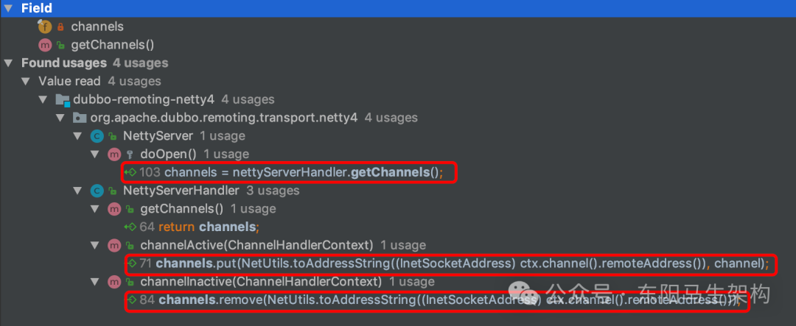

核心字段二：handler(ChannelHandler类型)

几乎NettyServerHandler内的所有方法都会触发该Dubbo ChannelHandler对象，如下图示：

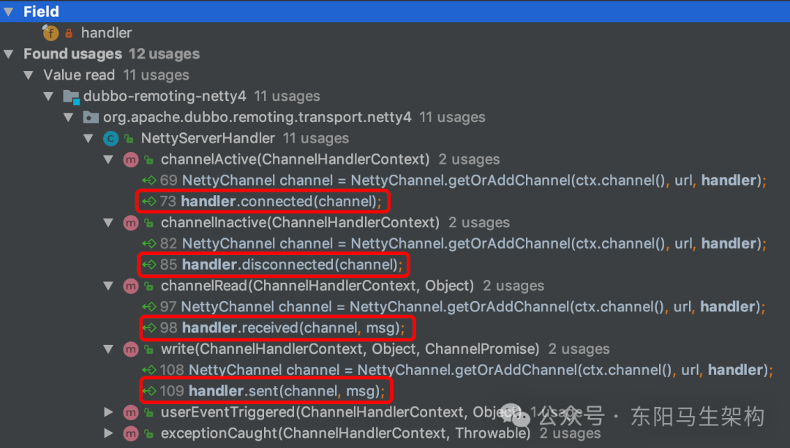

下面是NettyServerHandler的write()方法：

```java
public class NettyServerHandler extends ChannelDuplexHandler {
    ...
    @Override
    public void write(ChannelHandlerContext ctx, Object msg, ChannelPromise promise) throws Exception {
        //将发送的数据继续向下传递
        super.write(ctx, msg, promise);
        //并不影响消息的继续发送，只是触发sent()方法进行相关的处理，这也是方法名称是动词过去式的原因
        //其他方法可能没有那么明显，这里以write()方法为例进行说明
        NettyChannel channel = NettyChannel.getOrAddChannel(ctx.channel(), url, handler);
        handler.sent(channel, msg);
    }
    ...
}
```

在NettyServer创建NettyServerHandler时，可以看到下面的这行代码：

```java
public class NettyServer extends AbstractServer implements RemotingServer {
    ...
    protected void doOpen() throws Throwable {
        ...
        //创建NettyServerHandler
        final NettyServerHandler nettyServerHandler = new NettyServerHandler(getUrl(), this);
        ...
    }
    ...
}

public interface RemotingServer extends Endpoint, Resetable, IdleSensible {
    boolean isBound();
    Collection<Channel> getChannels();
    Channel getChannel(InetSocketAddress remoteAddress);
}
```

NettyServerHandler构造方法的第二个参数会传入NettyServer对象，追溯NettyServer的继承结构会发现它的最顶层父类AbstractPeer实现了ChannelHandler，并且将所有的方法委托给其中封装的ChannelHandler对象，如下图示(AbstractPeer的handler字段用法)。所以，NettyServerHandler会将数据委托给NettyServer父类的这个ChannelHandler进行处理。

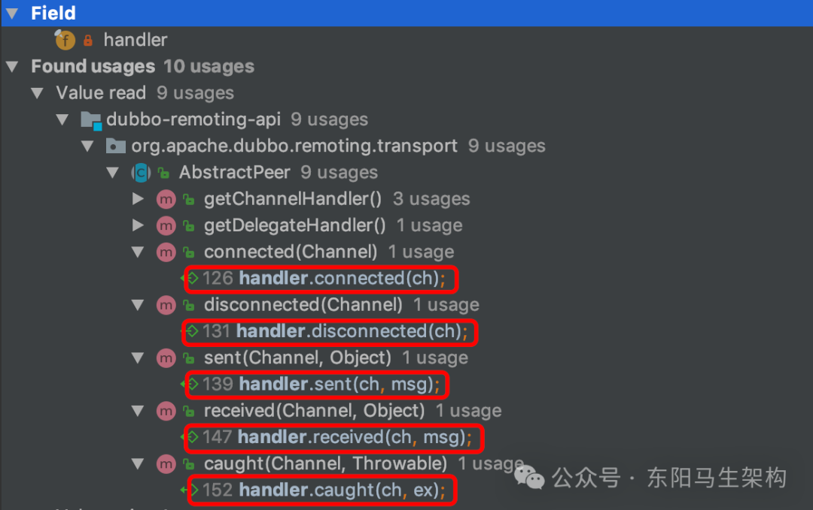

### (6)Transporter层的Server总结

NettyServer从AbstractPeer开始往下，一路继承下来。NettyServer拥有了Endpoint、ChannelHandler以及RemotingServer多个接口的能力，关联了一个ChannelHandler对象以及Codec2对象，并最终将数据委托给这两个对象进行处理。所以，上层调用方只需要实现ChannelHandler和Codec2这两个接口就可以了。

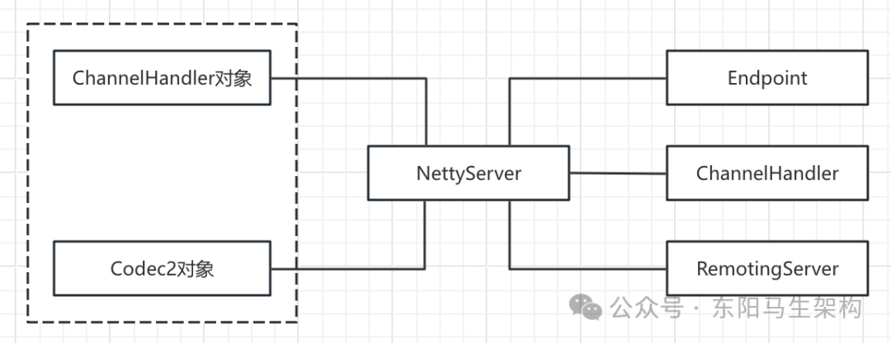

这里重点介绍了Transporter层中Server相关的实现。首先介绍了AbstractPeer这个最顶层的抽象类，介绍了Server、Client和Channel的公共属性。接着介绍了AbstractEndpoint抽象类，它提供了编解码等Server和Client所需的公共能力。最后介绍了AbstractServer抽象类以及基于Netty 4实现的NettyServer。同时还介绍了涉及的各种组件，如ExecutorRepository、NettyServerHandler等。

## 2.Transporter层的Client实现

### (1)Client继承线分析

### (2)Channel继承线分析

### (3)ChannelHandler继承线分析

### (4)Dispatcher与ChannelHandler

### (5)ThreadlessExecutor优化

### (6)Transporter层的Client总结

前面介绍了Transporter层中Server相关的核心抽象类以及基于Netty 4的实现类，下面继续介绍Transporter层中剩余的核心接口实现。主要涉及Client接口、Channel接口、ChannelHandler接口，以及相关的关键组件。

### (1)Client继承线分析

#### 一.AbstractClient的字段

#### 二.AbstractClient的构造方法

#### 三.AbstractClient的抽象方法

#### 四.继承AbstractClient的NettyClient

#### 五.NettyClientHandler的实现

AbstractServer和AbstractClient都继承了AbstractEndpoint抽象类，AbstractClient是对客户端的抽象，实现了客户端的公共逻辑。

```java
public abstract class AbstractServer extends AbstractEndpoint implements RemotingServer {
    ...
    ...
}

public abstract class AbstractClient extends AbstractEndpoint implements Client {
    ...
    ...
}
```

AbstractClient在继承AbstractEndpoint的同时，还实现了Clinet接口，如下继承关系图示：

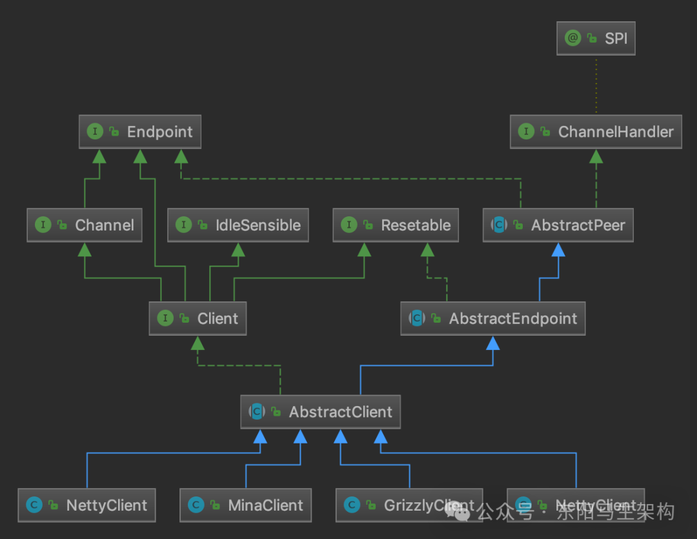

#### 一.AbstractClient的字段

```javascript
字段一：connectLock(Lock类型)
当Client底层进行连接、断开、重连等操作时，需要获取该锁进行同步。

字段二：needReconnect(Boolean类型)
在发送数据之前，会检查Client 底层的连接是否断开。
如果断开了，则会根据needReconnect字段决定是否重连。

字段三：executor(ExecutorService类型)
当前Client关联的线程池。

字段四：executorRepository(ExecutorRepository类型)
线程池仓库，负责管理线程池。
```

```java
public abstract class AbstractClient extends AbstractEndpoint implements Client {
    //当Client底层进行连接、断开、重连等操作时，需要获取该锁进行同步
    private final Lock connectLock = new ReentrantLock();

    //在发送数据之前，会检查Client 底层的连接是否断开
    //如果断开了，则会根据needReconnect字段决定是否重连
    private final boolean needReconnect;

    //当前Client关联的线程池
    protected volatile ExecutorService executor;

    //线程池仓库，负责管理线程池
    private ExecutorRepository executorRepository =
        ExtensionLoader.getExtensionLoader(ExecutorRepository.class).getDefaultExtension();
    ...
}

public interface Client extends Endpoint, Channel, Resetable, IdleSensible {
    void reconnect() throws RemotingException;
}
```

#### 二.AbstractClient的构造方法

在AbstractClient的构造方法中，会解析URL初始化needReconnect字段和executor字段，如下所示：

```java
public abstract class AbstractClient extends AbstractEndpoint implements Client {
    ...
    public AbstractClient(URL url, ChannelHandler handler) throws RemotingException {
        //调用父类的构造方法
        super(url, handler);
        //解析URL，初始化needReconnect值
        needReconnect = url.getParameter(Constants.SEND_RECONNECT_KEY, false);
        //解析URL，初始化executor
        initExecutor(url);
        //初始化底层的NIO库的相关组件
        doOpen();
        //创建底层连接
        connect();
        ...
    }
    ...
}

public interface Client extends Endpoint, Channel, Resetable, IdleSensible {
    void reconnect() throws RemotingException;
}
```

#### 三.AbstractClient的抽象方法

AbstractClient定义了doOpen()、doClose()、doConnect()、doDisConnect()和getChannel()五个抽象方法由子类实现。

```java
public abstract class AbstractClient extends AbstractEndpoint implements Client {
    ...
    protected abstract void doOpen() throws Throwable;
    protected abstract void doClose() throws Throwable;
    protected abstract void doConnect() throws Throwable;
    protected abstract void doDisConnect() throws Throwable;
    protected abstract Channel getChannel();
    ...
}

public interface Client extends Endpoint, Channel, Resetable, IdleSensible {
    void reconnect() throws RemotingException;
}
```

#### 四.继承AbstractClient的NettyClient

基于Netty 4实现的NettyClient继承了AbstractClient抽象类，实现了上述四个do*()抽象方法，这里重点关注doOpen()方法和doConnect()方法。

NettyClient的doOpen()方法，会通过Bootstrap构建客户端。其中会设置连接超时时间、keepalive等参数，以及创建和注册ChannelHandler。

```java
public class NettyClient extends AbstractClient {
    private Bootstrap bootstrap;
    ...

    @Override
    protected void doOpen() throws Throwable {
        //创建NettyClientHandler
        final NettyClientHandler nettyClientHandler = new NettyClientHandler(getUrl(), this);
        //创建Bootstrap
        bootstrap = new Bootstrap();
        bootstrap.group(NIO_EVENT_LOOP_GROUP)
            .option(ChannelOption.SO_KEEPALIVE, true)
            .option(ChannelOption.TCP_NODELAY, true)
            .option(ChannelOption.ALLOCATOR, PooledByteBufAllocator.DEFAULT)
            .channel(socketChannelClass());
        //设置连接超时时间，这里使用到AbstractEndpoint中的connectTimeout字段
        bootstrap.option(ChannelOption.CONNECT_TIMEOUT_MILLIS, Math.max(3000, getConnectTimeout()));
        bootstrap.handler(new ChannelInitializer<SocketChannel>() {
            @Override
            protected void initChannel(SocketChannel ch) throws Exception {
                //心跳请求的时间间隔
                int heartbeatInterval = UrlUtils.getHeartbeat(getUrl());
                //通过NettyCodecAdapter创建Netty中的编解码器
                NettyCodecAdapter adapter = new NettyCodecAdapter(getCodec(), getUrl(), NettyClient.this);
                ch.pipeline()
                    //注册ChannelHandler
                    .addLast("decoder", adapter.getDecoder())
                    .addLast("encoder", adapter.getEncoder())
                    .addLast("client-idle-handler", new IdleStateHandler(heartbeatInterval, 0, 0, MILLISECONDS))
                    .addLast("handler", nettyClientHandler);
            }
        }});
    }
    ...
}
```

通过doOpen()方法得到的Client端结构如下：

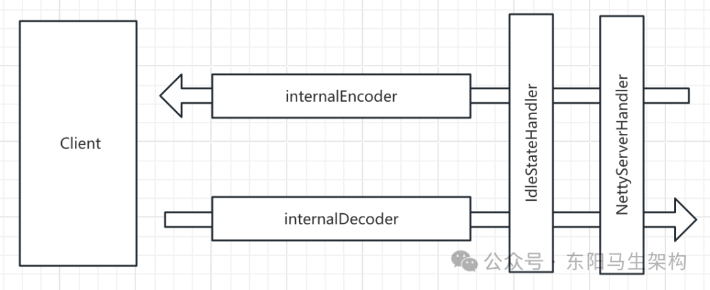

#### 五.NettyClientHandler的实现

NettyClientHandler的实现方法与前面介绍的NettyServerHandler的实现方法类似，同样继承了Netty的ChannelDuplexHandler，其中会将所有方法委托给NettyClient关联的ChannelHandler对象进行处理。

但两者在userEventTriggered()方法的实现上有所不同，NettyServerHandler在收到IdleStateEvent事件时会断开连接，而NettyClientHandler在收到IdleStateEvent事件时则会发送心跳消息。

```java
public class NettyClientHandler extends ChannelDuplexHandler {
    private final URL url;
    private final ChannelHandler handler;
    ...

    public NettyClientHandler(URL url, ChannelHandler handler) {
        ...
        this.url = url;
        this.handler = handler;
    }

    @Override
    public void userEventTriggered(ChannelHandlerContext ctx, Object evt) throws Exception {
        //send heartbeat when read idle.
        if (evt instanceof IdleStateEvent) {
            NettyChannel channel = NettyChannel.getOrAddChannel(ctx.channel(), url, handler);
            Request req = new Request();
            req.setVersion(Version.getProtocolVersion());
            req.setTwoWay(true);
            //发送心跳请求
            req.setEvent(HEARTBEAT_EVENT);
            channel.send(req);
        } else {
            super.userEventTriggered(ctx, evt);
        }
    }
    ...
}

public class NettyServerHandler extends ChannelDuplexHandler {
    ...
    @Override
    public void userEventTriggered(ChannelHandlerContext ctx, Object evt) throws Exception {
        if (evt instanceof IdleStateEvent) {
            NettyChannel channel = NettyChannel.getOrAddChannel(ctx.channel(), url, handler);
            try {
                logger.info("IdleStateEvent triggered, close channel " + channel);
                channel.close();
            } finally {
                NettyChannel.removeChannelIfDisconnected(ctx.channel());
            }
        }
        super.userEventTriggered(ctx, evt);
    }
    ...
}
```

### (2)Channel继承线分析

AbstractChannel和AbstractEndpoint一样，也继承了AbstractPeer这个抽象类。此外，AbstractChannel还实现了Channel接口。

```java
public abstract class AbstractEndpoint extends AbstractPeer implements Resetable {
    ...
    ...
}

public abstract class AbstractChannel extends AbstractPeer implements Channel {
    ...
    ...
}

public abstract class AbstractPeer implements Endpoint, ChannelHandler {
    ...
    ...
}

public interface Channel extends Endpoint {
    InetSocketAddress getRemoteAddress();
    boolean isConnected();
    boolean hasAttribute(String key);
    Object getAttribute(String key);
    void setAttribute(String key, Object value);
    void removeAttribute(String key);
}
```

AbstractChannel的实现非常简单，只是在send()方法中检测了底层连接的状态，没有实现具体的发送消息逻辑。

```java
public abstract class AbstractChannel extends AbstractPeer implements Channel {
    public AbstractChannel(URL url, ChannelHandler handler) {
        super(url, handler);
    }

    @Override
    public void send(Object message, boolean sent) throws RemotingException {
        if (isClosed()) {
            throw new RemotingException(this, "...");
        }
    }

    @Override
    public String toString() {
        return getLocalAddress() + " -> " + getRemoteAddress();
    }
}
```

这里以基于Netty 4实现的NettyChannel为例，分析它对AbstractChannel的实现。

#### 一.NettyChannel中的核心字段

```javascript
字段一：channel(Channel类型)
Netty框架中的Channel，与当前的Dubbo Channel对象一一对应；

字段二：attributes(Map<String, Object>类型)
当前Channel中附加属性，都会记录到该Map中；
NettyChannel中提供的getAttribute()、hasAttribute()、setAttribute()等方法，都是操作该集合；

字段三：active(AtomicBoolean类型)
用于标识当前Channel是否可用；

字段四：CHANNEL_MAP(ConcurrentMap<Channel, NettyChannel>类型)
在NettyChannel中还有一个静态的Map集合(CHANNEL_MAP字段)；
CHANNEL_MAP字段用来缓存当前JVM中Netty框架Channel与Dubbo Channel之间的映射关系；
```

```java
final class NettyChannel extends AbstractChannel {
    private final Channel channel;
    private final Map<String, Object> attributes = new ConcurrentHashMap<String, Object>();
    private final AtomicBoolean active = new AtomicBoolean(false);
    private static final ConcurrentMap<Channel, NettyChannel> CHANNEL_MAP = new ConcurrentHashMap<Channel, NettyChannel>();
    ...
}
```

从下图的调用关系中可知，NettyChannel提供了读写CHANNEL_MAP集合的方法。

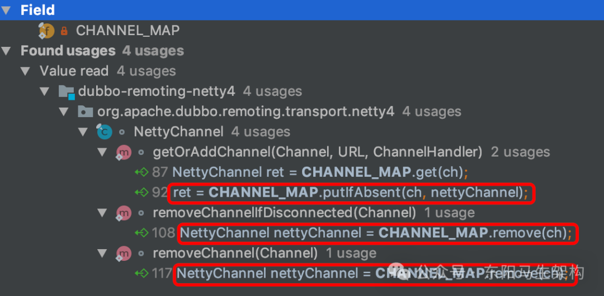

#### 二.NettyChannel的send()方法

send()方法会通过底层关联的Netty框架Channel将数据发送到对端。其中可以通过第二个参数指定是否等待发送操作结束，具体如下：

```java
final class NettyChannel extends AbstractChannel {
    ...
    @Override
    public void send(Object message, boolean sent) throws RemotingException {
        //调用AbstractChannel的send()方法检测连接是否可用
        super.send(message, sent);
        boolean success = true;
        int timeout = 0;
        //依赖Netty框架的Channel发送数据
        ChannelFuture future = channel.writeAndFlush(message);
        if (sent) {
            //等待发送结束，有超时时间
            timeout = getUrl().getPositiveParameter(TIMEOUT_KEY, DEFAULT_TIMEOUT);
            success = future.await(timeout);
        }
        Throwable cause = future.cause();
        if (cause != null) {
            throw cause;
        }
    }
    ...
}
```

### (3)ChannelHandler继承线分析

#### 一.ChannelHandlerDispatcher

#### 二.ChannelHandlerAdapter

#### 三.ChannelHandlerDelegate

#### 四.AbstractChannelHandlerDelegate

```java
@SPI
public interface ChannelHandler {
    void connected(Channel channel) throws RemotingException;
    void disconnected(Channel channel) throws RemotingException;
    void sent(Channel channel, Object message) throws RemotingException;
    void received(Channel channel, Object message) throws RemotingException;
    void caught(Channel channel, Throwable exception) throws RemotingException;
}
```

AbstractServer、AbstractClient以及AbstractChannel都是通过继承AbstractPeer来实现ChannelHandler接口的。但只是做了一层简单的委托(也可以说成是装饰器)，也就是将全部方法委托给了其底层关联的ChannelHandler对象。

下面介绍ChannelHandler的其他实现类，涉及的实现类如下ChannelHandler继承关系图所示：

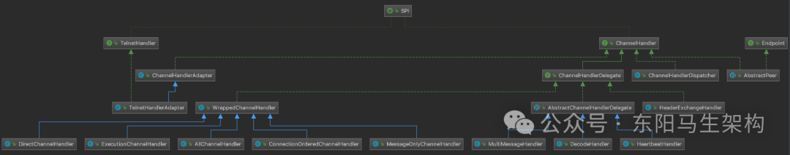

#### 一.ChannelHandlerDispatcher

ChannelHandlerDispatcher会负责将多个ChannelHandler对象聚合成一个ChannelHandler对象。

```typescript
public class ChannelHandlerDispatcher implements ChannelHandler {
    private final Collection<ChannelHandler> channelHandlers = new CopyOnWriteArraySet<ChannelHandler>();

    public ChannelHandlerDispatcher() {

    }

    public ChannelHandlerDispatcher(ChannelHandler... handlers) {
        this(handlers == null ? null : Arrays.asList(handlers));
    }

    public ChannelHandlerDispatcher(Collection<ChannelHandler> handlers) {
        if (CollectionUtils.isNotEmpty(handlers)) {
            this.channelHandlers.addAll(handlers);
        }
    }

    public Collection<ChannelHandler> getChannelHandlers() {
        return channelHandlers;
    }

    public ChannelHandlerDispatcher addChannelHandler(ChannelHandler handler) {
        this.channelHandlers.add(handler);
        return this;
    }

    public ChannelHandlerDispatcher removeChannelHandler(ChannelHandler handler) {
        this.channelHandlers.remove(handler);
        return this;
    }

    @Override
    public void connected(Channel channel) {
        for (ChannelHandler listener : channelHandlers) {
            try {
                listener.connected(channel);
            } catch (Throwable t) {
                logger.error(t.getMessage(), t);
            }
        }
    }

    @Override
    public void sent(Channel channel, Object message) {
        for (ChannelHandler listener : channelHandlers) {
            try {
                listener.sent(channel, message);
            } catch (Throwable t) {
                logger.error(t.getMessage(), t);
            }
        }
    }

    @Override
    public void received(Channel channel, Object message) {
        for (ChannelHandler listener : channelHandlers) {
            try {
                listener.received(channel, message);
            } catch (Throwable t) {
                logger.error(t.getMessage(), t);
            }
        }
    }
    ...
}
```

#### 二.ChannelHandlerAdapter

ChannelHandlerAdapter是ChannelHandler的一个空实现，TelnetHandlerAdapter会继承它并实现TelnetHandler接口。

```java
public abstract class ChannelHandlerAdapter implements ChannelHandler {
    boolean added;

    public ChannelHandlerAdapter() {

    }

    protected void ensureNotSharable() {
        if (this.isSharable()) {
            throw new IllegalStateException("ChannelHandler " + this.getClass().getName() + " is not allowed to be shared");
        }
    }

    public boolean isSharable() {
        Class<?> clazz = this.getClass();
        Map<Class<?>, Boolean> cache = InternalThreadLocalMap.get().handlerSharableCache();
        Boolean sharable = (Boolean)cache.get(clazz);
        if (sharable == null) {
            sharable = clazz.isAnnotationPresent(Sharable.class);
            cache.put(clazz, sharable);
        }
        return sharable;
    }

    public void handlerAdded(ChannelHandlerContext ctx) throws Exception {

    }

    public void handlerRemoved(ChannelHandlerContext ctx) throws Exception {

    }

    public void exceptionCaught(ChannelHandlerContext ctx, Throwable cause) throws Exception {
        ctx.fireExceptionCaught(cause);
    }
}
```

#### 三.ChannelHandlerDelegate

ChannelHandlerDelegate接口是对另一个ChannelHandler对象的封装，它的两个实现类AbstractChannelHandlerDelegate和WrappedChannelHandler也只封装了另一个ChannelHandler对象。

```java
public interface ChannelHandlerDelegate extends ChannelHandler {
    ChannelHandler getHandler();
}

public abstract class AbstractChannelHandlerDelegate implements ChannelHandlerDelegate {
    protected ChannelHandler handler;

    protected AbstractChannelHandlerDelegate(ChannelHandler handler) {
        Assert.notNull(handler, "handler == null");
        this.handler = handler;
    }

    @Override
    public ChannelHandler getHandler() {
        if (handler instanceof ChannelHandlerDelegate) {
            return ((ChannelHandlerDelegate) handler).getHandler();
        }
        return handler;
    }

    @Override
    public void connected(Channel channel) throws RemotingException {
        handler.connected(channel);
    }

    @Override
    public void disconnected(Channel channel) throws RemotingException {
        handler.disconnected(channel);
    }

    @Override
    public void sent(Channel channel, Object message) throws RemotingException {
        handler.sent(channel, message);
    }

    @Override
    public void received(Channel channel, Object message) throws RemotingException {
        handler.received(channel, message);
    }

    @Override
    public void caught(Channel channel, Throwable exception) throws RemotingException {
        handler.caught(channel, exception);
    }
}

public class WrappedChannelHandler implements ChannelHandlerDelegate {
    protected final ChannelHandler handler;
    protected final URL url;

    public WrappedChannelHandler(ChannelHandler handler, URL url) {
        this.handler = handler;
        this.url = url;
    }

    public void close() {
    }

    @Override
    public void connected(Channel channel) throws RemotingException {
        handler.connected(channel);
    }

    @Override
    public void disconnected(Channel channel) throws RemotingException {
        handler.disconnected(channel);
    }

    @Override
    public void sent(Channel channel, Object message) throws RemotingException {
        handler.sent(channel, message);
    }

    @Override
    public void received(Channel channel, Object message) throws RemotingException {
        handler.received(channel, message);
    }

    @Override
    public void caught(Channel channel, Throwable exception) throws RemotingException {
        handler.caught(channel, exception);
    }
    ...
}
```

#### 四.AbstractChannelHandlerDelegate

AbstractChannelHandlerDelegate会分别有三个实现类。

实现类一：MultiMessageHandler

专门处理MultiMessage的ChannelHandler实现。MultiMessage是Exchange层的一种消息类型，它其中封装了多个消息。在MultiMessageHandler收到MultiMessage消息时，received()方法会遍历其中的所有消息，并交给底层的ChannelHandler对象进行处理。

```java
public class MultiMessageHandler extends AbstractChannelHandlerDelegate {
    public MultiMessageHandler(ChannelHandler handler) {
        super(handler);
    }

    @SuppressWarnings("unchecked")
    @Override
    public void received(Channel channel, Object message) throws RemotingException {
        if (message instanceof MultiMessage) {
            MultiMessage list = (MultiMessage) message;
            for (Object obj : list) {
                handler.received(channel, obj);
            }
        } else {
            handler.received(channel, message);
        }
    }
}
```

实现类二：DecodeHandler

专门处理Decodeable的ChannelHandler实现。实现了Decodeable接口的类都会提供了一个decode()方法实现对自身的解码，DecodeHandler的received()方法就是通过该方法得到解码后的消息，然后传递给底层的ChannelHandler对象继续处理。

```java
public class DecodeHandler extends AbstractChannelHandlerDelegate {
    public DecodeHandler(ChannelHandler handler) {
        super(handler);
    }

    @Override
    public void received(Channel channel, Object message) throws RemotingException {
        if (message instanceof Decodeable) {
            decode(message);
        }
        if (message instanceof Request) {
            decode(((Request) message).getData());
        }
        if (message instanceof Response) {
            decode(((Response) message).getResult());
        }
        handler.received(channel, message);
    }

    private void decode(Object message) {
        if (message instanceof Decodeable) {
            try {
                ((Decodeable) message).decode();
                if (log.isDebugEnabled()) {
                    log.debug("Decode decodeable message " + message.getClass().getName());
                }
            } catch (Throwable e) {
                if (log.isWarnEnabled()) {
                    log.warn("Call Decodeable.decode failed: " + e.getMessage(), e);
                }
            }
        }
    }
}
```

实现类三：HeartbeatHandler

专门处理心跳消息的ChannelHandler实现。在HeartbeatHandler的received()方法接收心跳请求时，会生成相应的心跳响应并返回。在收到心跳响应时，会打印相应的日志。在收到其他类型的消息时，会传递给底层的ChannelHandler对象进行处理。下面是其核心实现：

```java
public class HeartbeatHandler extends AbstractChannelHandlerDelegate {
    ...
    public HeartbeatHandler(ChannelHandler handler) {
        super(handler);
    }

    @Override
    public void connected(Channel channel) throws RemotingException {
        setReadTimestamp(channel);
        setWriteTimestamp(channel);
        handler.connected(channel);
    }

    @Override
    public void disconnected(Channel channel) throws RemotingException {
        clearReadTimestamp(channel);
        clearWriteTimestamp(channel);
        handler.disconnected(channel);
    }

    @Override
    public void sent(Channel channel, Object message) throws RemotingException {
        setWriteTimestamp(channel);
        handler.sent(channel, message);
    }

    @Override
    public void received(Channel channel, Object message) throws RemotingException {
        //记录最近的读写事件时间戳
        setReadTimestamp(channel);
        //收到心跳请求
        if (isHeartbeatRequest(message)) {
            Request req = (Request) message;
            if (req.isTwoWay()) {
                //返回心跳响应，注意携带请求的ID
                Response res = new Response(req.getId(), req.getVersion());
                res.setEvent(HEARTBEAT_EVENT);
                channel.send(res);
                if (logger.isInfoEnabled()) {
                    int heartbeat = channel.getUrl().getParameter(Constants.HEARTBEAT_KEY, 0);
                    if (logger.isDebugEnabled()) {
                        logger.debug(...);
                    }
                }
            }
            return;
        }

        //收到心跳响应
        if (isHeartbeatResponse(message)) {
            if (logger.isDebugEnabled()) {
                logger.debug("Receive heartbeat response in thread " + Thread.currentThread().getName());
            }
            return;
        }
        handler.received(channel, message);
    }

    private void setReadTimestamp(Channel channel) {
        channel.setAttribute(KEY_READ_TIMESTAMP, System.currentTimeMillis());
    }

    private void setWriteTimestamp(Channel channel) {
        channel.setAttribute(KEY_WRITE_TIMESTAMP, System.currentTimeMillis());
    }

    private void clearReadTimestamp(Channel channel) {
        channel.removeAttribute(KEY_READ_TIMESTAMP);
    }

    private void clearWriteTimestamp(Channel channel) {
        channel.removeAttribute(KEY_WRITE_TIMESTAMP);
    }

    private boolean isHeartbeatRequest(Object message) {
        return message instanceof Request && ((Request) message).isHeartbeat();
    }

    private boolean isHeartbeatResponse(Object message) {
        return message instanceof Response && ((Response) message).isHeartbeat();
    }
}
```

另外，在received()和send()方法中，HeartbeatHandler会将最近一次的读写时间作为附加属性记录到Channel中。

由此可见，AbstractChannelHandlerDelegate下的三个实现，其实都是在原有ChannelHandler的基础上添加了一些增强功能，这是典型的装饰器模式的应用。

### (4)Dispatcher与ChannelHandler

#### 一.AllDispatcher与AllChannelHandler

#### 二.WrappedChannelHandler的剩余实现

接下来介绍ChannelHandlerDelegate接口的另一条继承线—WrappedChannelHandler，其子类主要会决定Dubbo以何种线程模型处理收到的事件和消息，这就是所谓的消息派发机制，与前面介绍的ThreadPool有紧密的联系。每个WrappedChannelHandler实现类的对象都由一个相应的Dispatcher实现类创建。

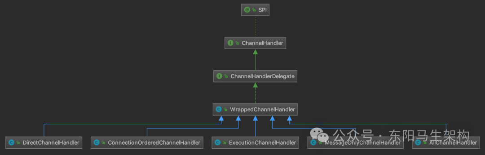

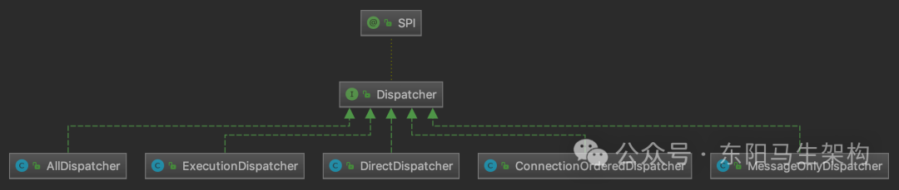

下面是Dispatcher接口的定义：

```kotlin
@SPI(AllDispatcher.NAME)
public interface Dispatcher {
    @Adaptive({Constants.DISPATCHER_KEY, "dispather", "channel.handler"})
    ChannelHandler dispatch(ChannelHandler handler, URL url);
}
```

#### 一.AllDispatcher与AllChannelHandler

AllDispatcher创建的是AllChannelHandler对象，它会将所有网络事件以及消息交给关联的线程池进行处理。AllChannelHandler覆盖了WrappedChannelHandler中除了sent()方法之外的其他网络事件处理方法，将调用其底层的ChannelHandler的逻辑放到关联的线程池中执行。

AllChannelHandler的connected()方法会将CONNECTED事件的处理封装成ChannelEventRunnable任务然后提交到线程池中执行，具体如下：

```java
public class AllDispatcher implements Dispatcher {
    public static final String NAME = "all";

    @Override
    public ChannelHandler dispatch(ChannelHandler handler, URL url) {
        return new AllChannelHandler(handler, url);
    }
}

public class AllChannelHandler extends WrappedChannelHandler {
    public AllChannelHandler(ChannelHandler handler, URL url) {
        super(handler, url);
    }

    @Override
    public void connected(Channel channel) throws RemotingException {
        //获取公共线程池
        ExecutorService executor = getExecutorService();
        try {
            //将CONNECTED事件的处理封装成ChannelEventRunnable提交到线程池中执行
            executor.execute(new ChannelEventRunnable(channel, handler, ChannelState.CONNECTED));
        } catch (Throwable t) {
            throw new ExecutionException("connect event", channel, getClass() + " error when process connected event .", t);
        }
    }
    ...
}

public class WrappedChannelHandler implements ChannelHandlerDelegate {
    ...
    public ExecutorService getExecutorService() {
        return getSharedExecutorService();
    }

    public ExecutorService getSharedExecutorService() {
        ExecutorRepository executorRepository =
            ExtensionLoader.getExtensionLoader(ExecutorRepository.class).getDefaultExtension();
        ExecutorService executor = executorRepository.getExecutor(url);
        if (executor == null) {
            executor = executorRepository.createExecutorIfAbsent(url);
        }
        return executor;
    }
    ...
}
```

AllChannelHandler父类的getExecutorService()方法会按照当前端点(Server或Client)的URL从ExecutorRepository中获取相应的公共线程池。

AllChannelHandler的disconnected()方法处理连接断开事件，caught()方法处理异常事件，也是按照同样的方式实现的。

```java
public class AllChannelHandler extends WrappedChannelHandler {
    ...
    @Override
    public void disconnected(Channel channel) throws RemotingException {
        ExecutorService executor = getExecutorService();
        try {
            executor.execute(new ChannelEventRunnable(channel, handler, ChannelState.DISCONNECTED));
        } catch (Throwable t) {
            throw new ExecutionException("disconnect event", channel, getClass() + " error when process disconnected event .", t);
        }
    }

    @Override
    public void caught(Channel channel, Throwable exception) throws RemotingException {
        ExecutorService executor = getExecutorService();
        try {
            executor.execute(new ChannelEventRunnable(channel, handler, ChannelState.CAUGHT, exception));
        } catch (Throwable t) {
            throw new ExecutionException("caught event", channel, getClass() + " error when process caught event .", t);
        }
    }
    ...
}
```

AllChannelHandler的received()方法会在当前端点收到数据的时候被调用。具体的执行流程是：先由IO线程(也就是Netty中的EventLoopGroup)从二进制流中解码出请求，然后调用AllChannelHandler的received()方法。其中会将请求提交给线程池执行，执行完后调用sent()方法，向对端写回响应结果。

```java
public class AllChannelHandler extends WrappedChannelHandler {
    ...
    @Override
    public void received(Channel channel, Object message) throws RemotingException {
        //获取线程池
        ExecutorService executor = getPreferredExecutorService(message);
        try {
            //将消息封装成ChannelEventRunnable任务，提交到线程池中执行
            executor.execute(new ChannelEventRunnable(channel, handler, ChannelState.RECEIVED, message));
        } catch (Throwable t) {
            //如果线程池满了，请求会被拒绝，这里会根据请求配置决定是否返回一个说明性的响应
            if (message instanceof Request && t instanceof RejectedExecutionException) {
                sendFeedback(channel, (Request) message, t);
                return;
            }
            throw new ExecutionException(message, channel, getClass() + " error when process received event .", t);
        }
    }
    ...
}
```

其中的getPreferredExecutorService()方法对响应做了特殊处理：如果请求在发送时指定了关联的线程池，在收到对应的响应消息时，会优先根据请求ID查找请求关联的线程池处理响应。

```java
public class WrappedChannelHandler implements ChannelHandlerDelegate {
    ...
    public ExecutorService getPreferredExecutorService(Object msg) {
        if (msg instanceof Response) {
            Response response = (Response) msg;
            //获取请求关联的DefaultFuture
            DefaultFuture responseFuture = DefaultFuture.getFuture(response.getId());
            if (responseFuture == null) {
                return getSharedExecutorService();
            } else {
                //如果请求关联了线程池，则会获取相关的线程来处理响应
                ExecutorService executor = responseFuture.getExecutor();
                if (executor == null || executor.isShutdown()) {
                    executor = getSharedExecutorService();
                }
                return executor;
            }
        } else {
            //请求
            return getSharedExecutorService();
        }
    }
    ...
}
```

上面的代码涉及了Request和Response的概念，是Exchange层的概念，它们是不同的消息类型。注意，AllChannelHandler并没有覆盖父类的sent()方法，也就是说，发送消息是直接在当前线程调用sent()方法完成的。

#### 二.WrappedChannelHandler的剩余实现

ExecutionChannelHandler(由ExecutionDispatcher创建)，只会将请求消息派发到线程池进行处理，也就是只重写了received()方法。对于响应消息以及其他网络事件，ExecutionChannelHandler会直接在IO线程中进行处理。其他网络事件指的是比如连接建立事件、连接断开事件、心跳消息等。

```java
public class ExecutionDispatcher implements Dispatcher {
    public static final String NAME = "execution";

    @Override
    public ChannelHandler dispatch(ChannelHandler handler, URL url) {
        return new ExecutionChannelHandler(handler, url);
    }
}

public class ExecutionChannelHandler extends WrappedChannelHandler {
    public ExecutionChannelHandler(ChannelHandler handler, URL url) {
        super(handler, url);
    }

    @Override
    public void received(Channel channel, Object message) throws RemotingException {
        ExecutorService executor = getPreferredExecutorService(message);
        if (message instanceof Request) {
            try {
                //获取线程池(请求绑定的线程池或是公共线程池)
                executor.execute(new ChannelEventRunnable(channel, handler, ChannelState.RECEIVED, message));
            } catch (Throwable t) {
                if (t instanceof RejectedExecutionException) {
                    sendFeedback(channel, (Request) message, t);
                }
                throw new ExecutionException(message, channel, getClass() + " error when process received event.", t);
            }
        } else if (executor instanceof ThreadlessExecutor) {
            //针对ThreadlessExecutor这种线程池类型的特殊处理
            executor.execute(new ChannelEventRunnable(channel, handler, ChannelState.RECEIVED, message));
        } else {
            handler.received(channel, message);
        }
    }
}
```

DirectChannelHandler(由DirectDispatcher创建)，会在IO线程中处理所有的消息和网络事件。

```java
public class DirectDispatcher implements Dispatcher {
    public static final String NAME = "direct";

    @Override
    public ChannelHandler dispatch(ChannelHandler handler, URL url) {
        return new DirectChannelHandler(handler, url);
    }
}

public class DirectChannelHandler extends WrappedChannelHandler {
    public DirectChannelHandler(ChannelHandler handler, URL url) {
        super(handler, url);
    }

    @Override
    public void received(Channel channel, Object message) throws RemotingException {
        ExecutorService executor = getPreferredExecutorService(message);
        if (executor instanceof ThreadlessExecutor) {
            try {
                executor.execute(new ChannelEventRunnable(channel, handler, ChannelState.RECEIVED, message));
            } catch (Throwable t) {
                throw new ExecutionException(message, channel, getClass() + " error when process received event .", t);
            }
        } else {
            handler.received(channel, message);
        }
    }
}
```

MessageOnlyChannelHandler(由MessageOnlyDispatcher创建)，会将所有收到的消息提交到线程池处理，其他网络事件则是由IO线程直接处理。

```java
public class MessageOnlyDispatcher implements Dispatcher {
    public static final String NAME = "message";

    @Override
    public ChannelHandler dispatch(ChannelHandler handler, URL url) {
        return new MessageOnlyChannelHandler(handler, url);
    }
}

public class MessageOnlyChannelHandler extends WrappedChannelHandler {
    public MessageOnlyChannelHandler(ChannelHandler handler, URL url) {
        super(handler, url);
    }

    @Override
    public void received(Channel channel, Object message) throws RemotingException {
        ExecutorService executor = getPreferredExecutorService(message);
        try {
            executor.execute(new ChannelEventRunnable(channel, handler, ChannelState.RECEIVED, message));
        } catch (Throwable t) {
            if(message instanceof Request && t instanceof RejectedExecutionException){
                sendFeedback(channel, (Request) message, t);
                return;
            }
            throw new ExecutionException(message, channel, getClass() + " error when process received event .", t);
        }
    }
}
```

ConnectionOrderedChannelHandler(由ConnectionOrderedDispatcher创建)，会将收到的消息交给线程池进行处理，对于连接建立以及断开事件，会提交到一个独立的线程池并排队进行处理。在ConnectionOrderedChannelHandler的构造方法中，会初始化一个线程池，该线程池的队列长度是固定的。

```java
public class ConnectionOrderedDispatcher implements Dispatcher {
    public static final String NAME = "connection";

    @Override
    public ChannelHandler dispatch(ChannelHandler handler, URL url) {
        return new ConnectionOrderedChannelHandler(handler, url);
    }
}

public class ConnectionOrderedChannelHandler extends WrappedChannelHandler {
    ...
    public ConnectionOrderedChannelHandler(ChannelHandler handler, URL url) {
        super(handler, url);
        String threadName = url.getParameter(THREAD_NAME_KEY, DEFAULT_THREAD_NAME);
        //注意，该线程池只有一个线程，队列的长度也是固定的，由URL中的connect.queue.capacity参数指定
        connectionExecutor = new ThreadPoolExecutor(1, 1,
            0L, TimeUnit.MILLISECONDS,
            new LinkedBlockingQueue<Runnable>(url.getPositiveParameter(CONNECT_QUEUE_CAPACITY, Integer.MAX_VALUE)),
            new NamedThreadFactory(threadName, true),
            new AbortPolicyWithReport(threadName, url)
        );
        queuewarninglimit = url.getParameter(CONNECT_QUEUE_WARNING_SIZE, DEFAULT_CONNECT_QUEUE_WARNING_SIZE);
    }

    @Override
    public void connected(Channel channel) throws RemotingException {
        try {
            checkQueueLength();
            connectionExecutor.execute(new ChannelEventRunnable(channel, handler, ChannelState.CONNECTED));
        } catch (Throwable t) {
            throw new ExecutionException("connect event", channel, getClass() + " error when process connected event .", t);
        }
    }

    @Override
    public void disconnected(Channel channel) throws RemotingException {
        try {
            checkQueueLength();
            connectionExecutor.execute(new ChannelEventRunnable(channel, handler, ChannelState.DISCONNECTED));
        } catch (Throwable t) {
            throw new ExecutionException("disconnected event", channel, getClass() + " error when process disconnected event .", t);
        }
    }
    ...
}
```

在ConnectionOrderedChannelHandler的connected()方法和disconnected()方法实现中，会将连接建立和断开事件交给上述connectionExecutor线程池排队处理。

### (5)ThreadlessExecutor优化

#### 一.ThreadlessExecutor的作用

#### 二.为什么会有ThreadlessExecutor

#### 三.ThreadlessExecutor的核心字段和逻辑

在前面介绍WrappedChannelHandler的各个实现时，会看到其中有针对ThreadlessExecutor这种线程池类型的特殊处理，例如ExecutionChannelHandler的received()方法中就有如下的分支逻辑。

```java
public class ExecutionChannelHandler extends WrappedChannelHandler {
    ...
    @Override
    public void received(Channel channel, Object message) throws RemotingException {
      ExecutorService executor = getPreferredExecutorService(message);
      if (message instanceof Request) {
          //获取线程池（请求绑定的线程池或是公共线程池）
          executor.execute(new ChannelEventRunnable(channel, handler, ChannelState.RECEIVED, message));
      } else if (executor instanceof ThreadlessExecutor) {
          //针对ThreadlessExecutor这种线程池类型的特殊处理
          executor.execute(new ChannelEventRunnable(channel, handler, ChannelState.RECEIVED, message));
      } else {
          handler.received(channel, message);
      }
    }
}
```

ThreadlessExecutor是一种特殊类型的线程池，与其他正常的线程池最主要的区别是：ThreadlessExecutor内部不管理任何线程。

#### 一.ThreadlessExecutor的作用

可以调用ThreadlessExecutor的execute()方法，将任务提交给这个线程池，但是这些提交的任务不会被调度到任何线程执行，而是存储在阻塞队列中，只有当其他线程调用ThreadlessExecutor的waitAndDrain()方法时才会真正执行。也就是说，执行任务的与调用waitAndDrain()方法的是同一个线程。

#### 二.为什么会有ThreadlessExecutor

那么为什么会有ThreadlessExecutor这个实现呢？这主要是因为Dubbo在2.7.5版本之前，WrappedChannelHandler会为每个连接启动一个线程池，而且没有ExecutorRepository的概念，不会根据URL复用同一个线程池，而是通过SPI找到ThreadPool实现来创建新的线程池。此时，Dubbo Consumer同步请求的线程模型如下图示：

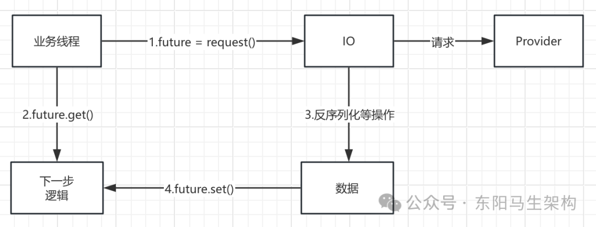

从图中可以看到其请求-响应流程：

```cs
步骤一：业务线程发出请求之后，拿到一个Future实例。

步骤二：业务线程紧接着调用Future.get()方法阻塞等待请求结果返回。

步骤三：当响应返回之后，交由连接关联的独立线程池进行反序列化等解析处理。

步骤四：待处理完成之后，将业务结果通过Future.set()方法返回给业务线程。
```

在这个设计里面，Consumer端会维护一个线程池，而且线程池是按照连接隔离的，即每个连接独享一个线程池。这样当面临需要消费大量服务且并发数比较大的场景时，例如网关类场景，可能会导致Consumer端线程个数不断增加，导致线程调度消耗过多CPU，也可能因为线程创建过多而导致OOM。

为了解决上述问题，Dubbo在2.7.5版本之后，引入了ThreadlessExecutor，其请求-响应流程如下：

```bash
步骤一：业务线程发出请求之后，拿到一个Future对象。

步骤二：业务线程会调用ThreadlessExecutor的waitAndDrain()方法。
waitAndDrain()方法会在阻塞队列上等待。

步骤三：当收到响应时，IO线程会生成一个任务。
通过ThreadlessExecutor的excute()方法将任务填充到ThreadlessExecutor队列中。

步骤四：业务线程会将上面添加的任务取出，并在本线程中执行。
得到业务结果之后，调用Future.set()方法进行设置，此时waitAndDrain()方法返回。

步骤五：业务线程从Future中拿到结果值。
```

```java
public class ThreadlessExecutor extends AbstractExecutorService {
    //阻塞队列，用来在IO线程和业务线程之间传递任务
    private final BlockingQueue<Runnable> queue = new LinkedBlockingQueue<>();

    //ThreadlessExecutor底层关联的共享线程池，当业务线程已经不再等待响应时，会由该共享线程执行提交的任务
    private ExecutorService sharedExecutor;

    //指向请求对应的DefaultFuture对象
    private CompletableFuture<?> waitingFuture;

    //当后续再次调用waitAndDrain()方法时
    //会检查finished字段，若为true则此次调用直接返回
    private boolean finished = false;

    //当后续再次调用execute()方法提交任务时
    //会根据waiting字段决定任务是放入queue队列等待业务线程执行，还是直接由sharedExecutor线程池执行
    private volatile boolean waiting = true;

    private final Object lock = new Object();

    public ThreadlessExecutor(ExecutorService sharedExecutor) {
        this.sharedExecutor = sharedExecutor;
    }

    //ThreadlessExecutor中的waitAndDrain()方法一般与一次RPC调用绑定，只会执行一次
    public void waitAndDrain() throws InterruptedException {
        //检测当前ThreadlessExecutor状态
        if (finished) {
            return;
        }

        //获取阻塞队列中的任务，如果阻塞队列中还没有任务，此处会阻塞
        Runnable runnable = queue.take();
        synchronized (lock) {
            //修改waiting状态
            waiting = false;
            //执行任务
            runnable.run();
        }

        //如果阻塞队列中还有其他任务，也需要一并执行
        runnable = queue.poll();
        while (runnable != null) {
            try {
                runnable.run();
            } catch (Throwable t) {
                logger.info(t);
            }
            runnable = queue.poll();
        }
        //修改finished状态
        finished = true;
    }
    ...
}
```

#### 三.ThreadlessExecutor的核心字段和逻辑

```sql
字段一：queue(LinkedBlockingQueue类型)
阻塞队列，用来在IO线程和业务线程之间传递任务。

字段二：waiting、finished(Boolean类型)
ThreadlessExecutor中的waitAndDrain()方法一般与一次RPC调用绑定，只会执行一次。
当后续再次调用waitAndDrain()方法时，会检查finished字段，若为true则此次调用直接返回。
当后续再次调用execute()方法提交任务时，会根据waiting字段决定任务是放入queue队列等待业务线程执行，还是直接由sharedExecutor线程池执行。

字段三：sharedExecutor(ExecutorService类型)
ThreadlessExecutor底层关联的共享线程池，当业务线程已经不再等待响应时，会由该共享线程执行提交的任务。

字段四：waitingFuture(CompletableFuture类型)
指向请求对应的DefaultFuture对象。
```

ThreadlessExecutor的execute()方法会根据waiting的值决定任务提交到哪里，代码如下：

```java
public class ThreadlessExecutor extends AbstractExecutorService {
    ...
    @Override
    public void execute(Runnable runnable) {
        synchronized (lock) {
            //判断业务线程是否还在等待响应结果
            if (!waiting) {
                //不等待，则直接交给共享线程池处理任务
                sharedExecutor.execute(runnable);
            } else {
                //业务线程还在等待，则将任务写入队列，然后由业务线程自己执行
                queue.add(runnable);
            }
        }
    }
    ...
}
```

ThreadlessExecutor的waitAndDrain()方法首先会检测finished的值，然后获取阻塞队列中的全部任务并执行。执行完成之后会修改finished和waiting字段，标识当前ThreadlessExecutor已经使用完毕 \+ 没有业务线程等待。

```java
public class ThreadlessExecutor extends AbstractExecutorService {
    ...
    public void waitAndDrain() throws InterruptedException {
        //检测当前ThreadlessExecutor状态
        if (finished) {
            return;
        }

        //获取阻塞队列中的任务，如果阻塞队列中还没有任务，此处会阻塞
        Runnable runnable = queue.take();
        synchronized (lock) {
            //修改waiting状态
            waiting = false;
            //执行任务
            runnable.run();
        }

        //如果阻塞队列中还有其他任务，也需要一并执行
        runnable = queue.poll();
        while (runnable != null) {
            runnable.run();
            runnable = queue.poll();
        }
        //修改finished状态
        finished = true;
    }
    ...
}
```

### (6)NettyServer对上层ChannelHandler的封装

至此，Transporter层对ChannelHandler的实现就介绍完了，其中涉及多个ChannelHandler装饰器。

为了更好理解，可以回到NettyServer中看它是如何对上层ChannelHandler进行封装的。NettyServer的构造方法会调用ChannelHandlers的wrap()方法对传入的ChannelHandler对象进行装饰。

```java
public class NettyServer extends AbstractServer implements RemotingServer {
    ...
    public NettyServer(URL url, ChannelHandler handler) throws RemotingException {
        super(ExecutorUtil.setThreadName(url, SERVER_THREAD_POOL_NAME), ChannelHandlers.wrap(handler, url));
    }
    ...
}

public class ChannelHandlers {
    ...
    public static ChannelHandler wrap(ChannelHandler handler, URL url) {
        return ChannelHandlers.getInstance().wrapInternal(handler, url);
    }

    protected ChannelHandler wrapInternal(ChannelHandler handler, URL url) {
        return new MultiMessageHandler(new HeartbeatHandler(ExtensionLoader.getExtensionLoader(Dispatcher.class)
            .getAdaptiveExtension().dispatch(handler, url)));
    }
    ...
}
```

因此根据前面的介绍，可以得到如下的Server端ChannelHandler结构图：

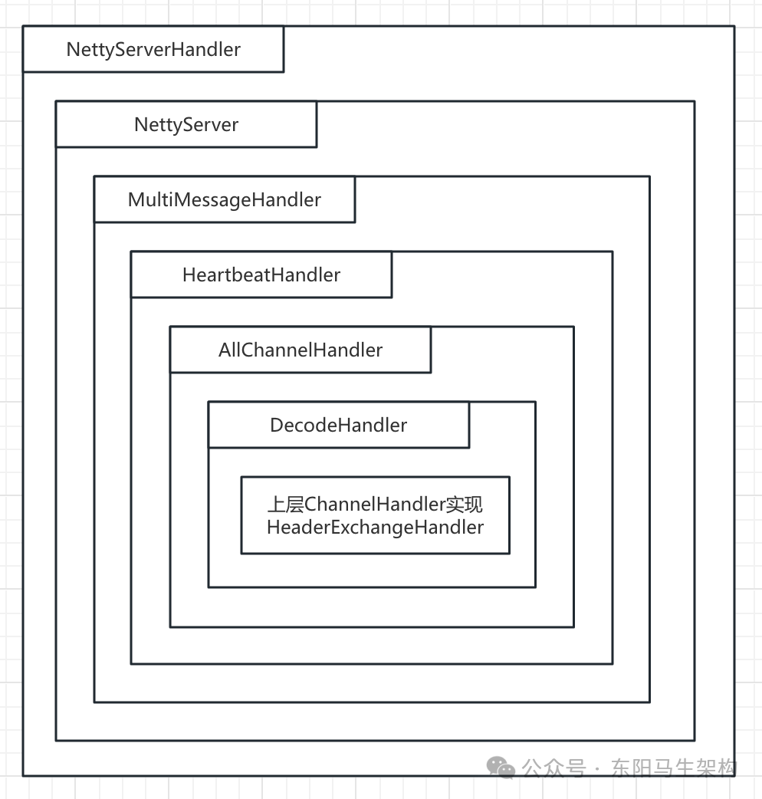

### (6)Transporter层的Client总结

这里重点介绍了Dubbo Transporter层中Client、 Channel、ChannelHandler相关的实现以及优化。首先介绍AbstractClient抽象接口以及基于Netty 4的NettyClient实现，接着介绍AbstractChannel抽象类以及NettyChannel实现，最后介绍ChannelHandler接口实现。其中详细介绍了WrappedChannelHandler等关键ChannelHandler实现，以及ThreadlessExecutor的优化。
