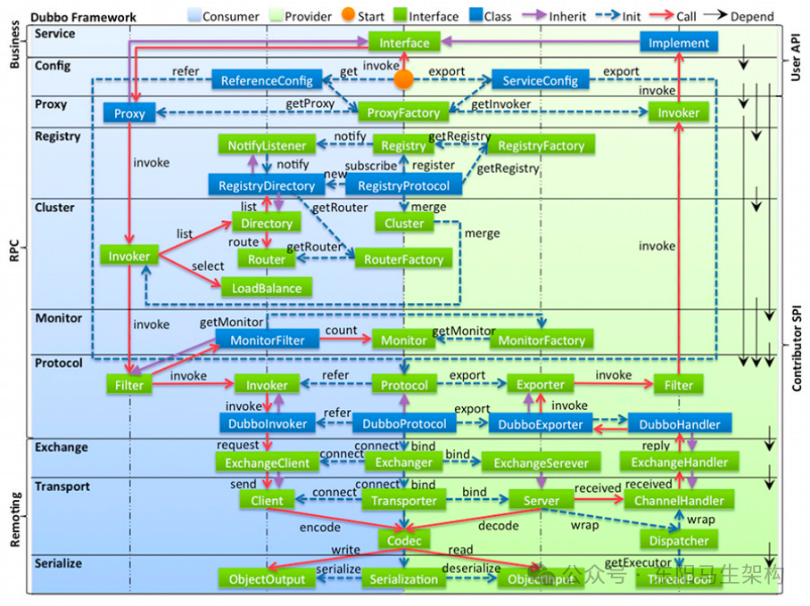
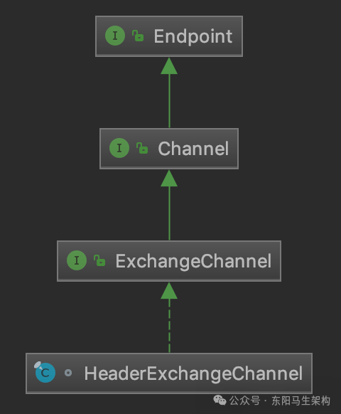
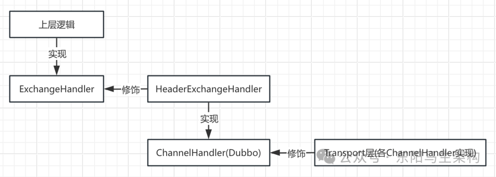
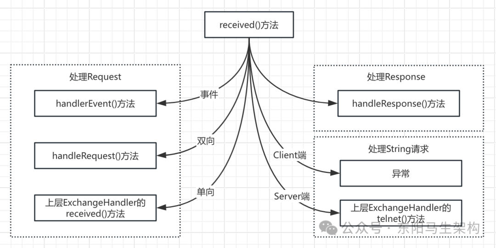
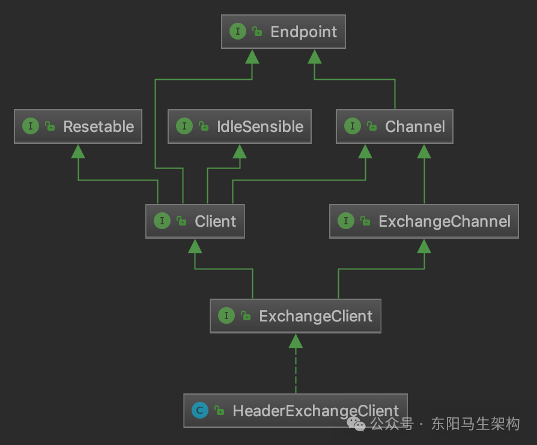
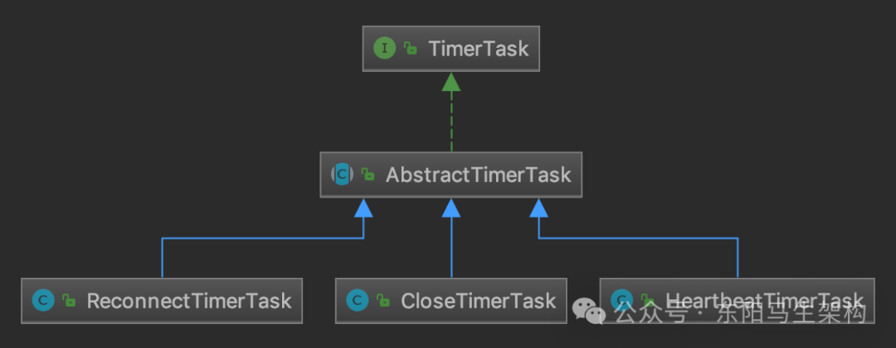
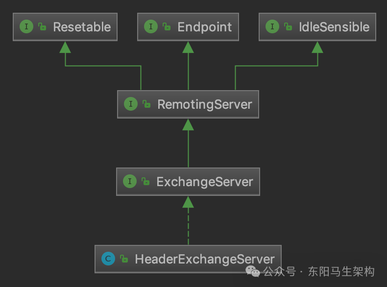
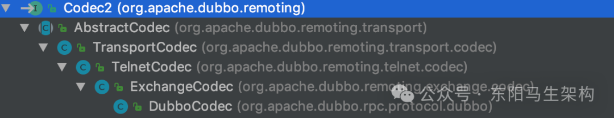

# Dubbo原理—7.服务通信之Exchange交换层

> **公众号**: 东阳马生架构  
> **发布时间**: 2025-07-24 09:00  

**大纲(17430字)**

- 1.Exchange层之请求和响应的处理
- 2.Exchange层之心跳重连+门面类+装饰器+协议


## 1.Exchange层之请求和响应的处理

### (1)Request和Response

### (2)ExchangeChannel & DefaultFuture

### (3)HeaderExchangeHandler

### (4)总结



前面介绍了Dubbo Remoting中的Transport层、Dubbo抽象出来的端到端的统一传输层接口、以及以Netty为基础的相关实现。接下来介绍Dubbo体系图中Transport层的上一层，也就是Dubbo Remoting层中的最顶层—Exchange层。

Dubbo将信息交换行为抽象成Exchange层。官方对这一层的说明是：封装了请求-响应的语义，即关注一问一答的交互模式，实现了同步转异步。Exchange层会以Request和Response为中心，针对Channel、ChannelHandler、Client、RemotingServer等接口进行实现。

下面从Request和Response这一对基础类开始介绍ExchangeChannel、HeaderExchangeHandler的核心实现。

### (1)Request和Response

Exchange层的Request和Response这两个类是Exchange层的核心对象，是对请求和响应的抽象。

#### 一.Request类的核心字段

```java
public class Request {
    //用于生成请求的自增ID
    //当递增到Long.MAX_VALUE之后，会溢出到Long.MIN_VALUE，可以继续使用该负数作为消息ID
    private static final AtomicLong INVOKE_ID = new AtomicLong(0);
    //请求的ID
    private final long mId;
    //请求版本号
    private String mVersion;
    //请求的双向标识，如果该字段设置为true，则Server端在收到请求后，需要给Client返回一个响应
    private boolean mTwoWay = true;
    //事件标识，例如心跳请求、只读请求等，都会带有这个标识
    private boolean mEvent = false;
    //请求发送到Server之后，由Decoder将二进制数据解码成Request对象，
    //如果解码环节遇到异常，则会设置该标识，然后交由其他ChannelHandler根据该标识做进一步处理
    private boolean mBroken = false;
    //请求体，可以是任何Java类型的对象，也可以是null
    private Object mData;
    ...
}
```

#### 二.Response类的核心字段

```typescript
public class Response {
    //响应ID，与相应请求的ID一致
    private long mId = 0;
    //当前协议的版本号，与请求消息的版本号一致
    private String mVersion;
    //响应状态码，有OK、CLIENT_TIMEOUT、SERVER_TIMEOUT等10多个可选值
    private byte mStatus = OK;
    private boolean mEvent = false;
    //可读的错误响应消息
    private String mErrorMsg;
    //响应体
    private Object mResult;
    ...
}
```

### (2)ExchangeChannel & DefaultFuture

#### 一.ExchangeChannel接口的定义

#### 二.ExchangeChannel接口的实现

#### 三.DefaultFuture的实现

#### 四.请求和响应时对DefaultFuture的处理

#### 五.响应超时时对DefaultFuture的处理

#### 一.ExchangeChannel接口的定义

前面介绍了Channel接口的功能以及Transport层对Channel接口的实现。在Exchange层中也会定义ExchangeChannel接口，它在Channel接口之上抽象了Exchange层的网络连接。

ExchangeChannel接口的定义如下，其中request()方法负责发送请求，它有两个重载，其中一个重载可以指定请求的超时时间，返回值都是Future对象。

```java
public interface ExchangeChannel extends Channel {
    CompletableFuture<Object> request(Object request, ExecutorService executor) throws RemotingException;
    CompletableFuture<Object> request(Object request, int timeout, ExecutorService executor) throws RemotingException;
    ExchangeHandler getExchangeHandler();
    void close(int timeout);
}

public interface Channel extends Endpoint {
    InetSocketAddress getRemoteAddress();
    boolean isConnected();
    boolean hasAttribute(String key);
    Object getAttribute(String key);
    void setAttribute(String key, Object value);
    void removeAttribute(String key);
}
```

#### 二.ExchangeChannel接口的实现

从如下HeaderExchangeChannel继承关系图可知，HeaderExchangeChannel是ExchangeChannel接口的实现。HeaderExchangeChannel本身是Channel的装饰器，封装了一个Channel对象。HeaderExchangeChannel的send()方法和request()方法都是依赖底层装饰的这个Channel对象来实现的。



```java
final class HeaderExchangeChannel implements ExchangeChannel {
    private final Channel channel;
    ...

    HeaderExchangeChannel(Channel channel) {
        if (channel == null) {
            throw new IllegalArgumentException("channel == null");
        }
        this.channel = channel;
    }

    @Override
    public void send(Object message) throws RemotingException {
        send(message, false);
    }

    @Override
    public void send(Object message, boolean sent) throws RemotingException {
        if (message instanceof Request || message instanceof Response || message instanceof String) {
            channel.send(message, sent);
        } else {
            Request request = new Request();
            request.setVersion(Version.getProtocolVersion());
            request.setTwoWay(false);
            request.setData(message);
            channel.send(request, sent);
        }
    }

    @Override
    public CompletableFuture<Object> request(Object request) throws RemotingException {
        return request(request, null);
    }

    @Override
    public CompletableFuture<Object> request(Object request, int timeout, ExecutorService executor) throws RemotingException {
        //create request.
        Request req = new Request();
        req.setVersion(Version.getProtocolVersion());
        req.setTwoWay(true);
        req.setData(request);
        DefaultFuture future = DefaultFuture.newFuture(channel, req, timeout, executor);
        try {
            channel.send(req);
        } catch (RemotingException e) {
            future.cancel();
            throw e;
        }
        return future;
    }
    ...
}
```

注意HeaderExchangeChannel的request()方法返回的是一个DefaultFuture对象。已知io.netty.channel.Channel的send()方法会返回一个ChannelFuture对象，表示此次发送操作是否完成。所以这里的DefaultFuture其实就表示此次请求-响应是否完成，即要收到响应为Future才算完成。

下面来介绍请求发送过程中涉及的DefaultFuture以及HeaderExchangeChannel的内容。

#### 三.DefaultFuture的实现

DefaultFuture继承自JDK的CompletableFuture，其中维护了两个static集合。

```javascript
集合一：CHANNELS(Map<Long, Channel> 集合)
管理请求与Channel之间的关联关系，其中key为请求ID，value为发送请求的Channel。

集合二：FUTURES(Map<Long, Channel> 集合)
管理请求与DefaultFuture之间的关联关系，其中key为请求ID，value为请求对应的Future。
```

DefaultFuture中核心的实例字段如下：

```bash
字段一：request(Request类型)和id(Long类型)
对应请求以及请求的ID。

字段二：channel(Channel类型)
发送请求的Channel。

字段三：timeout(int类型)
整个请求-响应交互完成的超时时间。

字段四：start(long类型)
该DefaultFuture的创建时间。

字段五：sent(volatilelong类型)
请求发送的时间。

字段六：timeoutCheckTask(Timeout类型)
该定时任务到期时，表示对端响应超时。

字段七：executor(ExecutorService类型)
请求关联的线程池。
```

DefaultFuture的newFuture()方法在创建DefaultFuture对象时，需要先初始化上述字段，并创建请求相应的超时定时任务。

```cpp
public class DefaultFuture extends CompletableFuture<Object> {
    private static final Map<Long, Channel> CHANNELS = new ConcurrentHashMap<>();
    private static final Map<Long, DefaultFuture> FUTURES = new ConcurrentHashMap<>();

    public static final Timer TIME_OUT_TIMER = new HashedWheelTimer(
        new NamedThreadFactory("dubbo-future-timeout", true),
        30,
        TimeUnit.MILLISECONDS
    );
    ...

    //对应请求ID
    private final Long id;
    //对应请求
    private final Request request;
    //发送请求的Channel
    private final Channel channel;
    //整个请求-响应交互完成的超时时间
    private final int timeout;
    //该DefaultFuture的创建时间
    private final long start = System.currentTimeMillis();
    //请求发送的时间
    private volatile long sent;
    //该定时任务到期时，表示对端响应超时
    private Timeout timeoutCheckTask;
    //请求关联的线程池
    private ExecutorService executor;
    ...

    public static DefaultFuture newFuture(Channel channel, Request request, int timeout, ExecutorService executor) {
        //创建DefaultFuture对象，并初始化其中各个
        final DefaultFuture future = new DefaultFuture(channel, request, timeout);
        future.setExecutor(executor);
        if (executor instanceof ThreadlessExecutor) {
            ((ThreadlessExecutor) executor).setWaitingFuture(future);
        }
        timeoutCheck(future);
        return future;
    }
    ...

    public static void sent(Channel channel, Request request) {
        DefaultFuture future = FUTURES.get(request.getId());
        if (future != null) {
            future.doSent();
        }
    }

    private void doSent() {
        sent = System.currentTimeMillis();
    }

    private static void timeoutCheck(DefaultFuture future) {
        TimeoutCheckTask task = new TimeoutCheckTask(future.getId());
        future.timeoutCheckTask = TIME_OUT_TIMER.newTimeout(task, future.getTimeout(), TimeUnit.MILLISECONDS);
    }
    ...
}
```

#### 四.请求和响应时对DefaultFuture的处理

在HeaderExchangeChannel的request()方法中通过newFuture()方法完成DefaultFuture对象的创建后，会将请求通过底层的Dubbo Channel发送出去，发送过程中会触发沿途ChannelHandler的sent()方法。其中的HeaderExchangeHandler会调用DefaultFuture的sent()方法更新sent字段，记录请求发送的时间戳。后续如果响应超时，则会将该发送时间戳添加到提示信息中。

```java
final class HeaderExchangeChannel implements ExchangeChannel {
    private final Channel channel;
    private volatile boolean closed = false;

    HeaderExchangeChannel(Channel channel) {
        if (channel == null) {
            throw new IllegalArgumentException("channel == null");
        }
        this.channel = channel;
    }
    ...

    @Override
    public CompletableFuture<Object> request(Object request) throws RemotingException {
        return request(request, null);
    }

    @Override
    public CompletableFuture<Object> request(Object request, int timeout) throws RemotingException {
        return request(request, timeout, null);
    }

    @Override
    public CompletableFuture<Object> request(Object request, int timeout, ExecutorService executor) throws RemotingException {
        if (closed) {
            throw new RemotingException(this.getLocalAddress(), null, "Failed to send request " + request + ", cause: The channel " + this + " is closed!");
        }

        //create request.
        Request req = new Request();
        req.setVersion(Version.getProtocolVersion());
        req.setTwoWay(true);
        req.setData(request);

        //通过newFuture()方法完成DefaultFuture对象的创建
        DefaultFuture future = DefaultFuture.newFuture(channel, req, timeout, executor);
        try {
            //将请求通过底层的Dubbo Channel发送出去
            channel.send(req);
        } catch (RemotingException e) {
            future.cancel();
            throw e;
        }
        return future;
    }
    ...
}

public class HeaderExchangeHandler implements ChannelHandlerDelegate {
    private final ExchangeHandler handler;

    public HeaderExchangeHandler(ExchangeHandler handler) {
        if (handler == null) {
            throw new IllegalArgumentException("handler == null");
        }
        this.handler = handler;
    }
    ...

    @Override
    public void sent(Channel channel, Object message) throws RemotingException {
        Throwable exception = null;
        try {
            ExchangeChannel exchangeChannel = HeaderExchangeChannel.getOrAddChannel(channel);
            handler.sent(exchangeChannel, message);
        } catch (Throwable t) {
            exception = t;
            HeaderExchangeChannel.removeChannelIfDisconnected(channel);
        }
        if (message instanceof Request) {
            Request request = (Request) message;
            //调用DefaultFuture的sent()方法更新sent字段
            DefaultFuture.sent(channel, request);
        }
        if (exception != null) {
            if (exception instanceof RuntimeException) {
                throw (RuntimeException) exception;
            } else if (exception instanceof RemotingException) {
                throw (RemotingException) exception;
            } else {
                throw new RemotingException(channel.getLocalAddress(), channel.getRemoteAddress(), exception.getMessage(), exception);
            }
        }
    }
    ...
}

public class DefaultFuture extends CompletableFuture<Object> {
    private static final Map<Long, DefaultFuture> FUTURES = new ConcurrentHashMap<>();
    //请求发送的时间
    private volatile long sent;
    ...

    public static void sent(Channel channel, Request request) {
        DefaultFuture future = FUTURES.get(request.getId());
        if (future != null) {
            future.doSent();
        }
    }

    private void doSent() {
        sent = System.currentTimeMillis();
    }
    ...
}
```

过一段时间后，Consumer会收到对端返回的响应。在读取到完整响应后，会触发Dubbo Channel中各个ChannelHandler的received()方法，其中就包括前面介绍的WrappedChannelHandler。

例如AllChannelHandler子类会将后续ChannelHandler的received()方法的调用封装成任务提交到线程池中，响应会提交到DefaultFuture关联的线程池中，比如ThreadlessExecutor，然后由业务线程继续后续的ChannelHandler调用。

当响应传递到HeaderExchangeHandler时，会通过调用handleResponse()方法进行处理。其中调用了DefaultFuture的received()方法，该方法会找到响应关联的DefaultFuture对象并调用doReceived()方法将DefaultFuture设置为完成状态。其中，寻找响应关联的DefaultFuture对象是根据请求ID从FUTURES集合查找的。

```java
public class HeaderExchangeHandler implements ChannelHandlerDelegate {
    private final ExchangeHandler handler;

    public HeaderExchangeHandler(ExchangeHandler handler) {
        if (handler == null) {
            throw new IllegalArgumentException("handler == null");
        }
        this.handler = handler;
    }
    ...

    @Override
    public void received(Channel channel, Object message) throws RemotingException {
        final ExchangeChannel exchangeChannel = HeaderExchangeChannel.getOrAddChannel(channel);
        //收到Request请求
        if (message instanceof Request) {
            //handle request.
            Request request = (Request) message;
            if (request.isEvent()) {
                //事件类型的请求
                handlerEvent(channel, request);
            } else {
                //非事件的请求
                if (request.isTwoWay()) {
                    handleRequest(exchangeChannel, request);
                } else {
                    handler.received(exchangeChannel, request.getData());
                }
            }
        } else if (message instanceof Response) {
            //当响应传递到HeaderExchangeHandler时，会通过调用handleResponse()方法进行处理
            handleResponse(channel, (Response) message);
        } else if (message instanceof String) {
            if (isClientSide(channel)) {
                Exception e = new Exception("Dubbo client can not supported string message: " + message + " in channel: " + channel + ", url: " + channel.getUrl());
                logger.error(e.getMessage(), e);
            } else {
                String echo = handler.telnet(channel, (String) message);
                if (echo != null && echo.length() > 0) {
                    channel.send(echo);
                }
            }
        } else {
            handler.received(exchangeChannel, message);
        }
    }

    static void handleResponse(Channel channel, Response response) throws RemotingException {
        if (response != null && !response.isHeartbeat()) {
            DefaultFuture.received(channel, response);
        }
    }
    ...
}

public class DefaultFuture extends CompletableFuture<Object> {
    ...
    public static void received(Channel channel, Response response, boolean timeout) {
        try {
            //清理FUTURES中记录的请求ID与DefaultFuture之间的映射关系
            DefaultFuture future = FUTURES.remove(response.getId());
            if (future != null) {
                Timeout t = future.timeoutCheckTask;
                //未超时，取消定时任务
                if (!timeout) {
                    t.cancel();
                }
                //调用doReceived()方法
                future.doReceived(response);
            } else {
                logger.warn("...");
            }
        } finally {
            //清理CHANNELS中记录的请求ID与Channel之间的映射关系
            CHANNELS.remove(response.getId());
        }
    }

    private void doReceived(Response res) {
        if (res == null) {
            throw new IllegalStateException("response cannot be null");
        }
        if (res.getStatus() == Response.OK) {
            //正常响应
            this.complete(res.getResult());
        } else if (res.getStatus() == Response.CLIENT_TIMEOUT || res.getStatus() == Response.SERVER_TIMEOUT) {
            //超时
            this.completeExceptionally(new TimeoutException(res.getStatus() == Response.SERVER_TIMEOUT, channel, res.getErrorMessage()));
        } else {
            //其他异常
            this.completeExceptionally(new RemotingException(channel, res.getErrorMessage()));
        }
        //下面是针对ThreadlessExecutor的兜底处理，主要是防止业务线程一直阻塞在ThreadlessExecutor上
        if (executor != null && executor instanceof ThreadlessExecutor) {
            ThreadlessExecutor threadlessExecutor = (ThreadlessExecutor) executor;
            if (threadlessExecutor.isWaiting()) {
                threadlessExecutor.notifyReturn(new IllegalStateException("..."));
            }
        }
    }
    ...
}
```

#### 五.响应超时时对DefaultFuture的处理

下面看响应超时的场景。在创建DefaultFuture时调用的timeoutCheck()方法中，会创建TimeoutCheckTask定时任务，并添加到时间轮中。

```cpp
public class DefaultFuture extends CompletableFuture<Object> {
    public static final Timer TIME_OUT_TIMER = new HashedWheelTimer(
        new NamedThreadFactory("dubbo-future-timeout", true),
        30,
        TimeUnit.MILLISECONDS
    );
    ...

    public static DefaultFuture newFuture(Channel channel, Request request, int timeout, ExecutorService executor) {
        //创建DefaultFuture对象，并初始化其中各个
        final DefaultFuture future = new DefaultFuture(channel, request, timeout);
        future.setExecutor(executor);
        if (executor instanceof ThreadlessExecutor) {
            ((ThreadlessExecutor) executor).setWaitingFuture(future);
        }
        timeoutCheck(future);
        return future;
    }

    private static void timeoutCheck(DefaultFuture future) {
        TimeoutCheckTask task = new TimeoutCheckTask(future.getId());
        future.timeoutCheckTask = TIME_OUT_TIMER.newTimeout(task, future.getTimeout(), TimeUnit.MILLISECONDS);
    }
    ...
}
```

TIME_OUT_TIMER是一个static的HashedWheelTimer对象，即Dubbo中对时间轮的实现，所有DefaultFuture对象都会共用这个对象。

TimeoutCheckTask是 DefaultFuture中的内部类，实现了TimerTask接口，可以提交到时间轮中等待执行。当响应超时时，TimeoutCheckTask会创建一个Response对象，并调用DefaultFuture的received()方法。

```cpp
public class DefaultFuture extends CompletableFuture<Object> {
    ...
    private static class TimeoutCheckTask implements TimerTask {
        private final Long requestID;
        TimeoutCheckTask(Long requestID) {
            this.requestID = requestID;
        }

        @Override
        public void run(Timeout timeout) {
            DefaultFuture future = DefaultFuture.getFuture(requestID);
            if (future.getExecutor() != null) {
                //提交到线程池执行，注意ThreadlessExecutor的情况
                future.getExecutor().execute(() -> notifyTimeout(future));
            } else {
                notifyTimeout(future);
            }
        }

        private void notifyTimeout(DefaultFuture future) {
            //没有收到对端的响应，这里会创建一个Response，表示超时的响应
            Response timeoutResponse = new Response(future.getId());
            //set timeout status.
            timeoutResponse.setStatus(future.isSent() ? Response.SERVER_TIMEOUT : Response.CLIENT_TIMEOUT);
            timeoutResponse.setErrorMessage(future.getTimeoutMessage(true));
            //handle response.
            DefaultFuture.received(future.getChannel(), timeoutResponse, true);
        }
    }
    ...
}
```

### (3)HeaderExchangeHandler

在前面介绍DefaultFuture时，已简单介绍了请求-响应的流程。其实无论是发送请求还是处理响应，都会涉及HeaderExchangeHandler。

```java
public interface ExchangeHandler extends ChannelHandler, TelnetHandler {
    CompletableFuture<Object> reply(ExchangeChannel channel, Object request) throws RemotingException;
}

public class HeaderExchangeHandler implements ChannelHandlerDelegate {
    private final ExchangeHandler handler;
    ...
}

@SPI
public interface ChannelHandler {
    void connected(Channel channel) throws RemotingException;
    void disconnected(Channel channel) throws RemotingException;
    void sent(Channel channel, Object message) throws RemotingException;
    void received(Channel channel, Object message) throws RemotingException;
    void caught(Channel channel, Throwable exception) throws RemotingException;
}
```

HeaderExchangeHandler是ExchangeHandler的装饰器，其中维护了一个ExchangeHandler对象。ExchangeHandler接口是Exchange层与上层交互的接口之一，上层调用方可以实现该接口完成自身的功能。然后再由HeaderExchangeHandler装饰，具备Exchange层处理Request-Response的能力。最后再由Transport层的各ChannelHandler装饰，具备Transport层的能力。如下ChannelHandler继承关系图所示：



HeaderExchangeHandler作为一个装饰器，其connected()、disconnected()、sent()、received()、caught()方法，最终都会转发给上层提供的ExchangeHandler进行处理，这里介绍HeaderExchangeHandler对Request和Response的处理逻辑。

#### 一.received()方法

received()方法会对收到的消息进行分类处理。



```java
public class HeaderExchangeHandler implements ChannelHandlerDelegate {
    private final ExchangeHandler handler;
    ...

    @Override
    public void received(Channel channel, Object message) throws RemotingException {
        final ExchangeChannel exchangeChannel = HeaderExchangeChannel.getOrAddChannel(channel);
        //收到Request请求
        if (message instanceof Request) {
            //handle request.
            Request request = (Request) message;
            if (request.isEvent()) {
                //事件类型的请求
                handlerEvent(channel, request);
            } else {
                //非事件的请求
                if (request.isTwoWay()) {
                    //双向请求调用handleRequest()方法
                    handleRequest(exchangeChannel, request);
                } else {
                    //单向请求委托给上层ExchangeHandler实现的received()方法
                    handler.received(exchangeChannel, request.getData());
                }
            }
        } else if (message instanceof Response) {
            //当响应传递到HeaderExchangeHandler时，会通过调用handleResponse()方法进行处理
            handleResponse(channel, (Response) message);
        } else if (message instanceof String) {
            //对String类型消息的处理
            if (isClientSide(channel)) {
                Exception e = new Exception("Dubbo client can not supported string message: " + message + " in channel: " + channel + ", url: " + channel.getUrl());
                logger.error(e.getMessage(), e);
            } else {
                String echo = handler.telnet(channel, (String) message);
                if (echo != null && echo.length() > 0) {
                    channel.send(echo);
                }
            }
        } else {
            handler.received(exchangeChannel, message);
        }
    }
    ...
}
```

情形一：只读请求会交给handlerEvent()方法进行处理。handlerEvent()方法会在Channel上设置channel.readonly标志，上层调用会读取该值。

```java
public class HeaderExchangeHandler implements ChannelHandlerDelegate {
    ...
    void handlerEvent(Channel channel, Request req) throws RemotingException {
        if (req.getData() != null && req.getData().equals(READONLY_EVENT)) {
            channel.setAttribute(Constants.CHANNEL_ATTRIBUTE_READONLY_KEY, Boolean.TRUE);
        }
    }
    ...
}
```

情形二：双向请求会交给handleRequest()方法进行处理。首先判断请求是否解码失败，如果是则返回异常响应。然后将正常解码的请求交给上层实现的ExchangeHandler并添加回调。上层ExchangeHandler处理完请求后会触发回调，根据处理结果填充响应结果和响应码并向对端发送。

```java
public class HeaderExchangeHandler implements ChannelHandlerDelegate {
    ...
    void handleRequest(final ExchangeChannel channel, Request req) throws RemotingException {
        Response res = new Response(req.getId(), req.getVersion());
        //请求解码失败
        if (req.isBroken()) {
            Object data = req.getData();
            String msg;
            ...
            res.setErrorMessage("Fail to decode request due to: " + msg);
            res.setStatus(Response.BAD_REQUEST);
            //将异常响应返回给对端
            channel.send(res);
            return;
        }
        Object msg = req.getData();
        //交给上层实现的ExchangeHandler进行处理
        CompletionStage<Object> future = handler.reply(channel, msg);
        future.whenComplete((appResult, t) -> {
            //处理结束后的回调
            if (t == null) {
                //返回正常响应
                res.setStatus(Response.OK);
                res.setResult(appResult);
            } else {
                //处理过程发生异常，设置异常信息和错误码
                res.setStatus(Response.SERVICE_ERROR);
                res.setErrorMessage(StringUtils.toString(t));
            }
            //发送响应
            channel.send(res);
        });
    }
    ...
}
```

情形三：单向请求直接委托给上层ExchangeHandler实现的received()方法进行处理。由于不需要响应，HeaderExchangeHandler不会关注处理结果。

情形四：Response响应则由handleResponse()方法进行处理。HeaderExchangeHandler会通过handleResponse()方法将关联的DefaultFuture设置为完成状态(或是异常完成状态)。

情形五：对于String类型的消息，HeaderExchangeHandler会根据当前服务的角色进行分类，具体与Dubbo对telnet的支持相关。

#### 二.sent()方法

sent()方法会通知上层ExchangeHandler实现的sent()方法。同时，还会针对Request请求，调用DefaultFuture的sent()方法去记录请求的具体发送时间。

```java
public class HeaderExchangeHandler implements ChannelHandlerDelegate {
    private final ExchangeHandler handler;
    ...

    @Override
    public void sent(Channel channel, Object message) throws RemotingException {
        Throwable exception = null;
        try {
            ExchangeChannel exchangeChannel = HeaderExchangeChannel.getOrAddChannel(channel);
            handler.sent(exchangeChannel, message);
        } catch (Throwable t) {
            exception = t;
            HeaderExchangeChannel.removeChannelIfDisconnected(channel);
        }
        if (message instanceof Request) {
            Request request = (Request) message;
            DefaultFuture.sent(channel, request);
        }
        if (exception != null) {
            if (exception instanceof RuntimeException) {
                throw (RuntimeException) exception;
            } else if (exception instanceof RemotingException) {
                throw (RemotingException) exception;
            } else {
                throw new RemotingException(channel.getLocalAddress(), channel.getRemoteAddress(), exception.getMessage(), exception);
            }
        }
    }
}

public class DefaultFuture extends CompletableFuture<Object> {
    private static final Map<Long, DefaultFuture> FUTURES = new ConcurrentHashMap<>();
    //请求发送的时间
    private volatile long sent;
    ...

    public static void sent(Channel channel, Request request) {
        DefaultFuture future = FUTURES.get(request.getId());
        if (future != null) {
            future.doSent();
        }
    }

    private void doSent() {
        sent = System.currentTimeMillis();
    }
    ...
}
```

#### 三.connected()方法

connected()方法会为Dubbo Channel创建相应的HeaderExchangeChannel，并将两者绑定，然后通知上层ExchangeHandler处理connect事件。

```java
public class HeaderExchangeHandler implements ChannelHandlerDelegate {
    private final ExchangeHandler handler;
    ...

    @Override
    public void connected(Channel channel) throws RemotingException {
        ExchangeChannel exchangeChannel = HeaderExchangeChannel.getOrAddChannel(channel);
        handler.connected(exchangeChannel);
    }
}
```

#### 四.disconnected()方法

在disconnected()方法中，首先会通知上层ExchangeHandler进行处理，之后调用DefaultFuture的closeChannel()方法通知DefaultFuture连接断开。其实就是创建并传递一个Response，该Response的状态码为CHANNEL_INACTIVE。这样就不会继续阻塞业务线程了，最后再将HeaderExchangeChannel与底层的Dubbo Channel解绑。

```java
public class HeaderExchangeHandler implements ChannelHandlerDelegate {
    private final ExchangeHandler handler;
    ...

    @Override
    public void disconnected(Channel channel) throws RemotingException {
        ExchangeChannel exchangeChannel = HeaderExchangeChannel.getOrAddChannel(channel);
        try {
            handler.disconnected(exchangeChannel);
        } finally {
            DefaultFuture.closeChannel(channel);
            HeaderExchangeChannel.removeChannel(channel);
        }
    }
}
```

### (4)总结

这里介绍了Dubbo Exchange层对Channel和ChannelHandler接口的实现。首先介绍了Exchange层中请求-响应模型的基本抽象，即Request类和Response类。然后介绍了ExchangeChannel对Channel接口的实现，同时还说明了发送请求之后得到的DefaultFuture对象。最后介绍了HeaderExchangeHandler如何将Transporter层的ChannelHandler对象与上层的ExchangeHandler对象相关联的。

## 2.Exchange层之心跳重连+门面类+装饰器+协议

### (1)HeaderExchangeClient

### (2)HeaderExchangeServer

### (3)HeaderExchanger

### (4)Dubbo协议与ExchangeCodec实现

### (1)HeaderExchangeClient

#### 一.HeaderExchangeClient主要功能

#### 二.HeaderExchangeClient核心字段

#### 三.HeaderExchangeClient构造方法

#### 四.HeaderExchangeClient的定时任务

#### 五.HeaderExchangeClient的关闭流程

#### 一.HeaderExchangeClient主要功能

HeaderExchangeClient是Client的装饰器，主要为其装饰的Client添加两个功能：

```
功能一：维持与Server的长连状态，这是通过定时发送心跳消息实现的
功能二：在因故障掉线后进行重连，这是通过定时检查连接状态实现的
```

因此，HeaderExchangeClient侧重时间轮资源的分配、定时任务的创建和取消。其继承关系图如下所示，它实现的是ExchangeClient接口，间接实现了ExchangeChannel接口和Client接口。其中ExchangeClient接口是个空接口，并没有定义任何方法。



```java
public class HeaderExchangeClient implements ExchangeClient {
    private final Client client;
    private final ExchangeChannel channel;
    private static final HashedWheelTimer IDLE_CHECK_TIMER =
        new HashedWheelTimer(new NamedThreadFactory("dubbo-client-idleCheck", true), 1, TimeUnit.SECONDS, TICKS_PER_WHEEL);
    private HeartbeatTimerTask heartBeatTimerTask;
    private ReconnectTimerTask reconnectTimerTask;
    ...
}

public interface ExchangeClient extends Client, ExchangeChannel {
}
```

#### 二.HeaderExchangeClient核心字段

```
字段一：client(Client类型)
被装饰的Client对象，HeaderExchangeClient中对Client接口的实现，都会委托给该对象进行处理。

字段二：channel(ExchangeChannel类型)
Client与服务端建立的连接，HeaderExchangeChannel也是一个装饰器。
HeaderExchangeClient中对ExchangeChannel接口的实现，都会委托给该对象进行处理。
```

#### 三.HeaderExchangeClient构造方法

HeaderExchangeClient构造方法的第一个参数client是Transport层的Client对象，第二个参数startTimer参与控制是否开启心跳定时任务和重连定时任务。如果为true才会进一步根据其他条件，最终决定是否启动定时任务。

```java
public class HeaderExchangeClient implements ExchangeClient {
    ...
    public HeaderExchangeClient(Client client, boolean startTimer) {
        Assert.notNull(client, "Client can't be null");
        this.client = client;
        this.channel = new HeaderExchangeChannel(client);
        if (startTimer) {
            URL url = client.getUrl();
            //开启重连定时任务
            startReconnectTask(url);
            //开启心跳定时任务
            startHeartBeatTask(url);
        }
    }
    ...
}
```

#### 四.HeaderExchangeClient的定时任务

心跳定时任务是在startHeartBeatTask()方法中启动的。当NettyClient当canHandleIdle()方法返回true时，表示该实现可以自己发送心跳请求，无须HeaderExchangeClient再启动一个定时任务。NettyClient主要依靠IdleStateHandler中的定时任务来触发心跳事件，依靠NettyClientHandler来发送心跳请求。对于无法自己发送心跳请求的Client实现，HeaderExchangeClient会为其启动HeartbeatTimerTask心跳定时任务。

```java
public class HeaderExchangeClient implements ExchangeClient {
    ...
    private void startHeartBeatTask(URL url) {
        //Client的具体实现决定是否启动该心跳任务
        if (!client.canHandleIdle()) {
            AbstractTimerTask.ChannelProvider cp = () -> Collections.singletonList(HeaderExchangeClient.this);
            //计算心跳间隔，最小间隔不能低于1s
            int heartbeat = getHeartbeat(url);
            long heartbeatTick = calculateLeastDuration(heartbeat);
            //创建心跳任务
            this.heartBeatTimerTask = new HeartbeatTimerTask(cp, heartbeatTick, heartbeat);
            //提交到IDLE_CHECK_TIMER这个时间轮中等待执行
            IDLE_CHECK_TIMER.newTimeout(heartBeatTimerTask, heartbeatTick, TimeUnit.MILLISECONDS);
        }
    }
    ...
}

public class HeartbeatTimerTask extends AbstractTimerTask {
    private final int heartbeat;

    HeartbeatTimerTask(ChannelProvider channelProvider, Long heartbeatTick, int heartbeat) {
        super(channelProvider, heartbeatTick);
        this.heartbeat = heartbeat;
    }

    @Override
    protected void doTask(Channel channel) {
        try {
            //获取最后一次读写时间
            Long lastRead = lastRead(channel);
            Long lastWrite = lastWrite(channel);
            if ((lastRead != null && now() - lastRead > heartbeat)
                    || (lastWrite != null && now() - lastWrite > heartbeat)) {
                //最后一次读写时间超过心跳时间，就会发送心跳请求
                Request req = new Request();
                req.setVersion(Version.getProtocolVersion());
                req.setTwoWay(true);
                req.setEvent(HEARTBEAT_EVENT);
                channel.send(req);
                if (logger.isDebugEnabled()) {
                    ...
                }
            }
        } catch (Throwable t) {
            logger.warn("Exception when heartbeat to remote channel " + channel.getRemoteAddress(), t);
        }
    }
}
```

重连定时任务是在startReconnectTask()方法中启动的，其中会根据URL中的参数决定是否启动任务，重连定时任务最终也是提交到IDLE_CHECK_TIMER这个时间轮中。

```java
public class HeaderExchangeClient implements ExchangeClient {
    ...
    private void startReconnectTask(URL url) {
        //根据URL中的参数决定是否启动任务
        if (shouldReconnect(url)) {
            AbstractTimerTask.ChannelProvider cp = () -> Collections.singletonList(HeaderExchangeClient.this);
            int idleTimeout = getIdleTimeout(url);
            long heartbeatTimeoutTick = calculateLeastDuration(idleTimeout);
            this.reconnectTimerTask = new ReconnectTimerTask(cp, heartbeatTimeoutTick, idleTimeout);
            IDLE_CHECK_TIMER.newTimeout(reconnectTimerTask, heartbeatTimeoutTick, TimeUnit.MILLISECONDS);
        }
    }
    ...
}

public class ReconnectTimerTask extends AbstractTimerTask {
    private final int idleTimeout;

    public ReconnectTimerTask(ChannelProvider channelProvider, Long heartbeatTimeoutTick, int idleTimeout) {
        super(channelProvider, heartbeatTimeoutTick);
        this.idleTimeout = idleTimeout;
    }

    @Override
    protected void doTask(Channel channel) {
        try {
            Long lastRead = lastRead(channel);
            Long now = now();
            //检测待处理Channel的连接状态
            if (!channel.isConnected()) {
                try {
                    logger.info("Initial connection to " + channel);
                    //断开的Channel会进行重连
                    ((Client) channel).reconnect();
                } catch (Exception e) {
                    logger.error("Fail to connect to " + channel, e);
                }
            }
            //检测读操作的空闲时间
            else if (lastRead != null && now - lastRead > idleTimeout) {
                logger.warn("Reconnect to channel " + channel + ", because heartbeat read idle time out: " + idleTimeout + "ms");
                try {
                    //空闲时间较长的Channel会进行重连
                    ((Client) channel).reconnect();
                } catch (Exception e) {
                    logger.error(channel + "reconnect failed during idle time.", e);
                }
            }
        } catch (Throwable t) {
            logger.warn("Exception when reconnect to remote channel " + channel.getRemoteAddress(), t);
        }
    }
}
```

如下是TimerTask继承关系图：



AbstractTimerTask抽象类如下：

```java
public abstract class AbstractTimerTask implements TimerTask {
    //定时任务会从该对象中获取Channel
    private final ChannelProvider channelProvider;
    //任务的过期时间
    private final Long tick;
    //任务是否已取消
    protected volatile boolean cancel = false;
    ...
}

public interface TimerTask {
    void run(Timeout timeout) throws Exception;
}
```

AbstractTimerTask抽象类的字段如下：

```typescript
字段一：channelProvider(ChannelProvider类型)
ChannelProvider是AbstractTimerTask抽象类中定义的内部接口，定时任务会从该对象中获取Channel。

字段二：tick(Long类型)
任务的过期时间。

字段三：cancel(boolean类型)
任务是否已取消。
```

AbstractTimerTask抽象类实现了TimerTask接口的run()方法，逻辑如下：首先会从ChannelProvider中获取此次任务相关的Channel集合(在Client端只有一个Channel，在Server端有多个Channel)。然后检查Channel的状态，针对未关闭的Channel执行doTask()方法处理。最后通过reput()方法将当前任务重新加入时间轮中，等待再次到期执行。

```java
public abstract class AbstractTimerTask implements TimerTask {
    ...
    public void run(Timeout timeout) throws Exception {
        //从ChannelProvider中获取任务要操作的Channel集合
        Collection<Channel> c = channelProvider.getChannels();
        for (Channel channel : c) {
            //检测Channel状态
            if (channel.isClosed()) {
                continue;
            }
            //执行任务
            doTask(channel);
        }
        //将当前任务重新加入时间轮中，等待执行
        reput(timeout, tick);
    }
    ...
}
```

AbstractTimerTask的doTask()方法是一个留给子类实现的抽象方法，不同的定时任务会执行不同的操作。例如，HeartbeatTimerTask的doTask()方法会读取最后一次读写时间，然后计算距离当前的时间。如果大于心跳间隔，就会发送一个心跳请求。

```java
public class HeartbeatTimerTask extends AbstractTimerTask {
    ...
    protected void doTask(Channel channel) {
        //获取最后一次读写时间
        Long lastRead = lastRead(channel);
        Long lastWrite = lastWrite(channel);
        if ((lastRead != null && now() - lastRead > heartbeat) || (lastWrite != null && now() - lastWrite > heartbeat)) {
            //最后一次读写时间超过心跳时间，就会发送心跳请求
            Request req = new Request();
            req.setVersion(Version.getProtocolVersion());
            req.setTwoWay(true);
            req.setEvent(HEARTBEAT_EVENT);
            channel.send(req);
        }
    }
    ...
}

public abstract class AbstractTimerTask implements TimerTask {
    ...
    static Long lastRead(Channel channel) {
        return (Long) channel.getAttribute(HeartbeatHandler.KEY_READ_TIMESTAMP);
    }

    static Long lastWrite(Channel channel) {
        return (Long) channel.getAttribute(HeartbeatHandler.KEY_WRITE_TIMESTAMP);
    }
    ...
}
```

HeartbeatTimerTask实现心跳定时任务的lastRead和lastWrite时间戳，都是从待处理Channel的附加属性中获取的，对应的Key分别是：

```
HeartbeatHandler.KEY_READ_TIMESTAMP
HeartbeatHandler.KEY_WRITE_TIMESTAMP
```

由于HeartbeatHandler属于Transport层，是一个ChannelHandler的装饰器，所以在其connected()、sent()方法中会记录最后一次写操作时间，在其connected()、received()方法中会记录最后一次读操作时间，在其disconnected()方法中会清理这两个时间戳。

```java
public abstract class AbstractChannelHandlerDelegate implements ChannelHandlerDelegate {
    protected ChannelHandler handler;

    protected AbstractChannelHandlerDelegate(ChannelHandler handler) {
        Assert.notNull(handler, "handler == null");
        this.handler = handler;
    }
    ...
}

public class HeartbeatHandler extends AbstractChannelHandlerDelegate {
    public static final String KEY_READ_TIMESTAMP = "READ_TIMESTAMP";
    public static final String KEY_WRITE_TIMESTAMP = "WRITE_TIMESTAMP";

    public HeartbeatHandler(ChannelHandler handler) {
        super(handler);
    }

    @Override
    public void connected(Channel channel) throws RemotingException {
        setReadTimestamp(channel);
        setWriteTimestamp(channel);
        handler.connected(channel);
    }

    @Override
    public void disconnected(Channel channel) throws RemotingException {
        clearReadTimestamp(channel);
        clearWriteTimestamp(channel);
        handler.disconnected(channel);
    }

    @Override
    public void sent(Channel channel, Object message) throws RemotingException {
        setWriteTimestamp(channel);
        handler.sent(channel, message);
    }

    @Override
    public void received(Channel channel, Object message) throws RemotingException {
        //记录最近的读写事件时间戳
        setReadTimestamp(channel);
        //收到心跳请求
        if (isHeartbeatRequest(message)) {
            Request req = (Request) message;
            if (req.isTwoWay()) {
                //返回心跳响应，注意携带请求的ID
                Response res = new Response(req.getId(), req.getVersion());
                res.setEvent(HEARTBEAT_EVENT);
                channel.send(res);
                if (logger.isInfoEnabled()) {
                    int heartbeat = channel.getUrl().getParameter(Constants.HEARTBEAT_KEY, 0);
                    if (logger.isDebugEnabled()) {
                        ...
                    }
                }
            }
            return;
        }
        //收到心跳响应
        if (isHeartbeatResponse(message)) {
            if (logger.isDebugEnabled()) {
                logger.debug("Receive heartbeat response in thread " + Thread.currentThread().getName());
            }
            return;
        }
        handler.received(channel, message);
    }

    private void setReadTimestamp(Channel channel) {
        channel.setAttribute(KEY_READ_TIMESTAMP, System.currentTimeMillis());
    }

    private void setWriteTimestamp(Channel channel) {
        channel.setAttribute(KEY_WRITE_TIMESTAMP, System.currentTimeMillis());
    }

    private void clearReadTimestamp(Channel channel) {
        channel.removeAttribute(KEY_READ_TIMESTAMP);
    }

    private void clearWriteTimestamp(Channel channel) {
        channel.removeAttribute(KEY_WRITE_TIMESTAMP);
    }
    ...
}
```

ReconnectTimerTask的doTask()方法会检测待处理Channel的连接状态以及读操作的空闲时间，对于断开或者空闲时间较长的Channel会进行重连。

```java
public class ReconnectTimerTask extends AbstractTimerTask {
    private final int idleTimeout;

    public ReconnectTimerTask(ChannelProvider channelProvider, Long heartbeatTimeoutTick, int idleTimeout) {
        super(channelProvider, heartbeatTimeoutTick);
        this.idleTimeout = idleTimeout;
    }

    @Override
    protected void doTask(Channel channel) {
        try {
            Long lastRead = lastRead(channel);
            Long now = now();
            //检测待处理Channel的连接状态
            if (!channel.isConnected()) {
                try {
                    logger.info("Initial connection to " + channel);
                    //断开的Channel会进行重连
                    ((Client) channel).reconnect();
                } catch (Exception e) {
                    logger.error("Fail to connect to " + channel, e);
                }
            }
            //检测读操作的空闲时间
            else if (lastRead != null && now - lastRead > idleTimeout) {
                logger.warn("Reconnect to channel " + channel + ", because heartbeat read idle time out: " + idleTimeout + "ms");
                try {
                    //空闲时间较长的Channel会进行重连
                    ((Client) channel).reconnect();
                } catch (Exception e) {
                    logger.error(channel + "reconnect failed during idle time.", e);
                }
            }
        } catch (Throwable t) {
            logger.warn("Exception when reconnect to remote channel " + channel.getRemoteAddress(), t);
        }
    }
}

public abstract class AbstractTimerTask implements TimerTask {
    ...
    static Long lastRead(Channel channel) {
        return (Long) channel.getAttribute(HeartbeatHandler.KEY_READ_TIMESTAMP);
    }
    ...
}
```

#### 五.HeaderExchangeClient的关闭流程

关闭HeaderExchangeClient的入口便是其close()方法，该方法会调用HeaderExchangeChannel的close()方法执行具体的关闭流程。

HeaderExchangeChannel的close()方法首先会将自身的closed字段设置为true，这样Channel就不会继续发送请求。如果当前Channel上还有请求未收到响应，会循环等待至收到响应。如果超时未收到响应，会创建一个状态码将连接关闭的Response交给DefaultFuture处理，与收到disconnected事件相同。然后会关闭Transport层的Channel。

以NettyChannel为例，NettyChannel的close()方法会先将自身的closed字段设置为true，然后清理CHANNEL_MAP缓存中的记录以及Channel的附加属性，最后才是关闭io.netty.channel.Channel。

```java
public class HeaderExchangeClient implements ExchangeClient {
    private final ExchangeChannel channel;
    ...

    public HeaderExchangeClient(Client client, boolean startTimer) {
        this.client = client;
        this.channel = new HeaderExchangeChannel(client);
        if (startTimer) {
            URL url = client.getUrl();
            startReconnectTask(url);
            startHeartBeatTask(url);
        }
    }

    @Override
    public void close(int timeout) {
        //将closing字段设置为true，closing字段其实是在AbstractPeer中
        startClose();
        //关闭心跳定时任务和重连定时任务
        doClose();
        //调用HeaderExchangeChannel的close()方法关闭HeaderExchangeChannel
        channel.close(timeout);
    }

    @Override
    public void startClose() {
        channel.startClose();
    }

    private void doClose() {
        if (heartBeatTimerTask != null) {
            heartBeatTimerTask.cancel();
        }
        if (reconnectTimerTask != null) {
            reconnectTimerTask.cancel();
        }
    }
    ...
}

final class HeaderExchangeChannel implements ExchangeChannel {
    ...
    //graceful close
    @Override
    public void close(int timeout) {
        if (closed) {
            return;
        }
        closed = true;
        if (timeout > 0) {
            long start = System.currentTimeMillis();
            while (DefaultFuture.hasFuture(channel) && System.currentTimeMillis() - start < timeout) {
                try {
                    Thread.sleep(10);
                } catch (InterruptedException e) {
                    logger.warn(e.getMessage(), e);
                }
            }
        }
        close();
    }

    @Override
    public void close() {
        try {
            //graceful close
            DefaultFuture.closeChannel(channel);
            //然后会关闭Transport层的Channel
            channel.close();
        } catch (Throwable e) {
            logger.warn(e.getMessage(), e);
        }
    }
    ...
}
```

### (2)HeaderExchangeServer

#### 一.HeaderExchangeServer的字段

#### 二.HeaderExchangeServer的构造方法

#### 三.HeaderExchangeServer的优雅关闭

HeaderExchangeServer的继承关系如下图所示，主要实现了Endpoint、RemotingServer、Resetable等这几个接口。



#### 一.HeaderExchangeServer的字段

HeaderExchangeServer是RemotingServer的装饰器，它所实现RemotingServer接口的大部分方法都会委托给其所装饰的RemotingServer对象。

```java
public class HeaderExchangeServer implements ExchangeServer {
    //被装饰的RemotingServer，比如NettyServer
    private final RemotingServer server;

    private AtomicBoolean closed = new AtomicBoolean(false);

    //关闭空闲连接的定时任务
    private CloseTimerTask closeTimerTask;

    private static final HashedWheelTimer IDLE_CHECK_TIMER =
        new HashedWheelTimer(new NamedThreadFactory("dubbo-server-idleCheck", true), 1, TimeUnit.SECONDS, TICKS_PER_WHEEL);
    ...
}

public interface ExchangeServer extends RemotingServer {
    Collection<ExchangeChannel> getExchangeChannels();
    ExchangeChannel getExchangeChannel(InetSocketAddress remoteAddress);
}

public interface RemotingServer extends Endpoint, Resetable, IdleSensible {
    boolean isBound();
    Collection<Channel> getChannels();
    Channel getChannel(InetSocketAddress remoteAddress);
}
```

#### 二.HeaderExchangeServer的构造方法

在HeaderExchangeServer的构造方法中，会启动一个CloseTimerTask定时任务，定期关闭长时间空闲的连接，具体的实现方式与HeaderExchangeClient中的两个定时任务类似。但NettyServer并没有启动该定时任务，而是靠NettyServerHandler和IdleStateHandler实现，原理与NettyClient类似。

```java
public class HeaderExchangeServer implements ExchangeServer {
    //被装饰的RemotingServer，比如NettyServer
    private final RemotingServer server;
    private AtomicBoolean closed = new AtomicBoolean(false);
    private CloseTimerTask closeTimerTask;
    private static final HashedWheelTimer IDLE_CHECK_TIMER =
        new HashedWheelTimer(new NamedThreadFactory("dubbo-server-idleCheck", true), 1, TimeUnit.SECONDS, TICKS_PER_WHEEL);
    ...

    public HeaderExchangeServer(RemotingServer server) {
        this.server = server;
        startIdleCheckTask(getUrl());
    }

    private void startIdleCheckTask(URL url) {
        if (!server.canHandleIdle()) {
            AbstractTimerTask.ChannelProvider cp = () -> unmodifiableCollection(HeaderExchangeServer.this.getChannels());
            int idleTimeout = getIdleTimeout(url);
            long idleTimeoutTick = calculateLeastDuration(idleTimeout);
            CloseTimerTask closeTimerTask = new CloseTimerTask(cp, idleTimeoutTick, idleTimeout);
            this.closeTimerTask = closeTimerTask;
            //init task and start timer.
            IDLE_CHECK_TIMER.newTimeout(closeTimerTask, idleTimeoutTick, TimeUnit.MILLISECONDS);
        }
    }
    ...
}

//关闭空闲连接的定时任务
public class CloseTimerTask extends AbstractTimerTask {
    private final int idleTimeout;
    public CloseTimerTask(ChannelProvider channelProvider, Long heartbeatTimeoutTick, int idleTimeout) {
        super(channelProvider, heartbeatTimeoutTick);
        this.idleTimeout = idleTimeout;
    }

    @Override
    protected void doTask(Channel channel) {
        Long lastRead = lastRead(channel);
        Long lastWrite = lastWrite(channel);
        Long now = now();
        //check ping & pong at server
        if ((lastRead != null && now - lastRead > idleTimeout) || (lastWrite != null && now - lastWrite > idleTimeout)) {
            logger.warn("...");
            channel.close();
        }
    }
}

public abstract class AbstractTimerTask implements TimerTask {
    ...
    static Long lastRead(Channel channel) {
        return (Long) channel.getAttribute(HeartbeatHandler.KEY_READ_TIMESTAMP);
    }

    static Long lastWrite(Channel channel) {
        return (Long) channel.getAttribute(HeartbeatHandler.KEY_WRITE_TIMESTAMP);
    }
    ...
}
```

#### 三.HeaderExchangeServer的优雅关闭

前面介绍Transport Server时，并没有过多介绍其关闭流程，下面通过HeaderExchangeServer.close()方法梳理整个Server端的关闭流程。

步骤一：将被装饰的RemotingServer的closing字段设置为true，表示这个Server端正在关闭，不再接受新Client的连接。可以参考AbstractServer的connected()方法，会发现Server正在关闭或是已经关闭时，则直接关闭新建的Client连接。此外，closing字段其实是在AbstractPeer中。

步骤二：向Client发送一个携带ReadOnly事件的请求，根据URL中的配置决定是否发送，默认为发送。Client端在接收到该请求后，它的HeaderExchangeHandler会在Channel上添加key为"channel.readonly"的附加信息，上层调用方会根据该附加信息，判断该连接是否可写。

步骤三：循环检测是否还存在Client与当前Server维持着长连接，直至全部Client断开连接或超时。

步骤四：更新closed字段为true，之后Client不会再发送任何请求或回复响应，以及取消CloseTimerTask定时任务。

步骤五：调用底层RemotingServer对象的close()方法。以NettyServer为例，其close()方法会先调用AbstractPeer的close()方法将自身的closed字段设置为true，然后调用NettyServer的doClose()方法关闭boss Channel(即用来接收客户端连接的Channel)，关闭channels集合中记录的Channel(这些Channel是与Client之间的连接)，清理channels集合，最后关闭bossGroup和workerGroup两个线程池。

```java
public class HeaderExchangeServer implements ExchangeServer {
    //被装饰的RemotingServer，比如NettyServer
    private final RemotingServer server;
    private CloseTimerTask closeTimerTask;
    private AtomicBoolean closed = new AtomicBoolean(false);
    ...

    @Override
    public void close(final int timeout) {
        //步骤一：将底层RemotingServer的closing字段设置为true，表示当前Server正在关闭，不再接收连接
        //closing字段其实是在AbstractPeer中
        startClose();
        if (timeout > 0) {
        final long max = (long) timeout;
            final long start = System.currentTimeMillis();
            if (getUrl().getParameter(Constants.CHANNEL_SEND_READONLYEVENT_KEY, true)) {
                //步骤二：发送ReadOnly事件请求通知客户端
                sendChannelReadOnlyEvent();
            }
            //步骤三：循环检测是否还存在Client与当前Server维持着长连接
            while (HeaderExchangeServer.this.isRunning() && System.currentTimeMillis() - start < max) {
                try {
                    //循环等待客户端断开连接
                    Thread.sleep(10);
                } catch (InterruptedException e) {
                    logger.warn(e.getMessage(), e);
                }
            }
        }
        //步骤四：将自身closed字段设置为true以及取消CloseTimerTask定时任务
        doClose();
        //步骤五：关闭Transport层的Server
        server.close(timeout);
    }

    @Override
    public void startClose() {
        server.startClose();
    }

    private void sendChannelReadOnlyEvent() {
        Request request = new Request();
        request.setEvent(READONLY_EVENT);
        request.setTwoWay(false);
        request.setVersion(Version.getProtocolVersion());
        Collection<Channel> channels = getChannels();
        //向Client发送一个携带ReadOnly事件的请求
        for (Channel channel : channels) {
            try {
                if (channel.isConnected()) {
                    channel.send(request, getUrl().getParameter(Constants.CHANNEL_READONLYEVENT_SENT_KEY, true));
                }
            } catch (RemotingException e) {
                logger.warn("send cannot write message error.", e);
            }
        }
    }

    private void doClose() {
        //更新closed字段为true
        if (!closed.compareAndSet(false, true)) {
            return;
        }
        //取消CloseTimerTask定时任务
        cancelCloseTask();
    }

    private void cancelCloseTask() {
        if (closeTimerTask != null) {
            closeTimerTask.cancel();
        }
    }
    ...
}

public class NettyServer extends AbstractServer implements RemotingServer {
    //用来接收客户端连接的boss Channel
    private io.netty.channel.Channel channel;
    //这些Channel是与Client之间的连接
    private Map<String, Channel> channels;
    private EventLoopGroup bossGroup;
    private EventLoopGroup workerGroup;
    ...

    @Override
    protected void doClose() throws Throwable {
        //关闭boss Channel(即用来接收客户端连接的Channel)
        if (channel != null) {
            channel.close();
        }
        ...
        //关闭channels集合中记录的Channel(这些Channel是与Client之间的连接)
        Collection<org.apache.dubbo.remoting.Channel> channels = getChannels();
        if (channels != null && channels.size() > 0) {
            for (org.apache.dubbo.remoting.Channel channel : channels) {
                try {
                    channel.close();
                } catch (Throwable e) {
                    logger.warn(e.getMessage(), e);
                }
            }
        }
        ...
        //关闭bossGroup和workerGroup两个线程池
        if (bootstrap != null) {
            bossGroup.shutdownGracefully();
            workerGroup.shutdownGracefully();
        }
        ...
        //清理channels集合
        if (channels != null) {
            channels.clear();
        }
    }
    ...
}

public abstract class AbstractServer extends AbstractEndpoint implements RemotingServer {
    ...
    @Override
    public void close() {
        if (logger.isInfoEnabled()) {
            logger.info("Close " + getClass().getSimpleName() + " bind " + getBindAddress() + ", export " + getLocalAddress());
        }
        ExecutorUtil.shutdownNow(executor, 100);
        try {
            //先调用AbstractPeer的close()方法将自身的closed字段设置为true
            super.close();
        } catch (Throwable e) {
            logger.warn(e.getMessage(), e);
        }
        try {
            //然后调用NettyServer的doClose()方法
            //关闭boss Channel，关闭channels集合中记录的Channel，清理channels集合，关闭bossGroup和workerGroup两个线程池
            doClose();
        } catch (Throwable e) {
            logger.warn(e.getMessage(), e);
        }
    }

    protected abstract void doClose() throws Throwable;
    ...
}

public abstract class AbstractEndpoint extends AbstractPeer implements Resetable {
    ...
    ...
}

public abstract class AbstractPeer implements Endpoint, ChannelHandler {
    private volatile boolean closing;
    private volatile boolean closed;
    ...

    @Override
    public void startClose() {
        if (isClosed()) {
            return;
        }
        closing = true;
    }

    @Override
    public void close() {
        closed = true;
    }
}
```

### (3)HeaderExchanger

对于上层来说，Exchange层的入口是Exchangers这个门面类。Exchangers提供了多个bind()以及connect()方法的重载，这些重载方法最终会通过SPI机制获取Exchanger接口的扩展实现，这个流程与Transport层的入口—Transporters门面类相同。

```java
public class Exchangers {
    static {
        //check duplicate jar package
        Version.checkDuplicate(Exchangers.class);
    }

    private Exchangers() {

    }

    public static ExchangeServer bind(String url, Replier<?> replier) throws RemotingException {
        return bind(URL.valueOf(url), replier);
    }

    public static ExchangeServer bind(URL url, Replier<?> replier) throws RemotingException {
        return bind(url, new ChannelHandlerAdapter(), replier);
    }

    public static ExchangeServer bind(String url, ChannelHandler handler, Replier<?> replier) throws RemotingException {
        return bind(URL.valueOf(url), handler, replier);
    }

    public static ExchangeServer bind(URL url, ChannelHandler handler, Replier<?> replier) throws RemotingException {
        return bind(url, new ExchangeHandlerDispatcher(replier, handler));
    }

    public static ExchangeServer bind(String url, ExchangeHandler handler) throws RemotingException {
        return bind(URL.valueOf(url), handler);
    }

    public static ExchangeServer bind(URL url, ExchangeHandler handler) throws RemotingException {
        if (url == null) {
            throw new IllegalArgumentException("url == null");
        }
        if (handler == null) {
            throw new IllegalArgumentException("handler == null");
        }
        url = url.addParameterIfAbsent(Constants.CODEC_KEY, "exchange");
        return getExchanger(url).bind(url, handler);
    }

    public static ExchangeClient connect(String url) throws RemotingException {
        return connect(URL.valueOf(url));
    }

    public static ExchangeClient connect(URL url) throws RemotingException {
        return connect(url, new ChannelHandlerAdapter(), null);
    }

    public static ExchangeClient connect(String url, Replier<?> replier) throws RemotingException {
        return connect(URL.valueOf(url), new ChannelHandlerAdapter(), replier);
    }
    public static ExchangeClient connect(URL url, Replier<?> replier) throws RemotingException {
        return connect(url, new ChannelHandlerAdapter(), replier);
    }
    public static ExchangeClient connect(String url, ChannelHandler handler, Replier<?> replier) throws RemotingException {
        return connect(URL.valueOf(url), handler, replier);
    }

    public static ExchangeClient connect(URL url, ChannelHandler handler, Replier<?> replier) throws RemotingException {
        return connect(url, new ExchangeHandlerDispatcher(replier, handler));
    }

    public static ExchangeClient connect(String url, ExchangeHandler handler) throws RemotingException {
        return connect(URL.valueOf(url), handler);
    }

    public static ExchangeClient connect(URL url, ExchangeHandler handler) throws RemotingException {
        if (url == null) {
            throw new IllegalArgumentException("url == null");
        }
        if (handler == null) {
            throw new IllegalArgumentException("handler == null");
        }
        url = url.addParameterIfAbsent(Constants.CODEC_KEY, "exchange");
        return getExchanger(url).connect(url, handler);
    }

    public static Exchanger getExchanger(URL url) {
        String type = url.getParameter(Constants.EXCHANGER_KEY, Constants.DEFAULT_EXCHANGER);
        return getExchanger(type);
    }

    public static Exchanger getExchanger(String type) {
        return ExtensionLoader.getExtensionLoader(Exchanger.class).getExtension(type);
    }
}
```

Exchanger接口的定义与前面介绍的Transporter接口非常类似，同样是被@SPI接口修饰。默认扩展名为header，对应的是HeaderExchanger这个实现。它的bind()方法和connect()方法也同样是被@Adaptive注解修饰，可以通过URL参数中的exchanger参数值指定扩展名称来覆盖默认值。

```java
@SPI(HeaderExchanger.NAME)
public interface Exchanger {
    @Adaptive({Constants.EXCHANGER_KEY})
    ExchangeServer bind(URL url, ExchangeHandler handler) throws RemotingException;
    @Adaptive({Constants.EXCHANGER_KEY})
    ExchangeClient connect(URL url, ExchangeHandler handler) throws RemotingException;
}
```

HeaderExchanger的connect()方法创建的是HeaderExchangeClient对象，bind()方法创建的是HeaderExchangeServer对象。

HeaderExchanger会为Transport层实现的Client实例和Server实例添加HeaderExchangeClient装饰器和HeaderExchangeServer装饰器。

同时，也会为上层实现的ExchangeHandler实例添加HeaderExchangeHandler和DecodeHandler装饰器。

```java
public class HeaderExchanger implements Exchanger {
    public static final String NAME = "header";

    @Override
    public ExchangeClient connect(URL url, ExchangeHandler handler) throws RemotingException {
        //一.传入的handler也属于交换层的ChannelHandler，一般由交换层上层的协议层实现
        //二.传入的handler会被交换层的ChannelHandler即HeaderExchangeHandler装饰
        //三.交换层的ChannelHandler即HeaderExchangeHandler又会被传输层的ChannelHandler即DecodeHandler装饰
        //四.传输层的ChannelHandler即DecodeHandler会被设置到传输层的NettyClient中
        //五.传输层的NettyClient又会被交换层的HeaderExchangeClient装饰
        //六.上层的协议层会通过交换层的HeaderExchangeClient提供的connect()方法创建一个用于网络通信的客户端来连接服务端，不会直接操作底层的NettyClient
        //七.当服务端的请求响应到来时：
        //首先经过传输层NettyServer的ChannelHandler即DecodeHandler进行处理
        //然后再由交换层的ChannelHandler即HeaderExchangeHandler进行处理
        //接着再由业务逻辑层的ChannelHandler即传入的handler进行处理
        return new HeaderExchangeClient(Transporters.connect(url, new DecodeHandler(new HeaderExchangeHandler(handler))), true);
    }

    @Override
    public ExchangeServer bind(URL url, ExchangeHandler handler) throws RemotingException {
        //一.传入的handler也属于交换层的ChannelHandler，一般由交换层上层的协议层实现
        //二.传入的handler会被交换层的ChannelHandler即HeaderExchangeHandler装饰
        //三.交换层的ChannelHandler即HeaderExchangeHandler又会被传输层的ChannelHandler即DecodeHandler装饰
        //四.传输层的ChannelHandler即DecodeHandler会被设置到传输层的NettyServer中
        //五.传输层的NettyServer又会被交换层的HeaderExchangeServer装饰
        //六.上层的协议层会通过交换层的HeaderExchangeServer提供的bind()方法创建一个用于网络通信的服务端，不会直接操作底层的NettyServer
        //七.当客户端的网络请求到来时：
        //首先经过传输层NettyServer的ChannelHandler即DecodeHandler进行处理
        //然后再由交换层的ChannelHandler即HeaderExchangeHandler进行处理
        //接着再由业务逻辑层的ChannelHandler即传入的handler进行处理
        return new HeaderExchangeServer(Transporters.bind(url, new DecodeHandler(new HeaderExchangeHandler(handler))));
    }
}

public class HeaderExchangeClient implements ExchangeClient {
    private final Client client;
    private final ExchangeChannel channel;

    public HeaderExchangeClient(Client client, boolean startTimer) {
        Assert.notNull(client, "Client can't be null");
        this.client = client;
        this.channel = new HeaderExchangeChannel(client);
        if (startTimer) {
            URL url = client.getUrl();
            startReconnectTask(url);
            startHeartBeatTask(url);
        }
    }
    ...
}

public class HeaderExchangeServer implements ExchangeServer {
    private final RemotingServer server;

    public HeaderExchangeServer(RemotingServer server) {
        Assert.notNull(server, "server == null");
        this.server = server;
        startIdleCheckTask(getUrl());
    }
    ...
}

public class HeaderExchangeHandler implements ChannelHandlerDelegate {
    private final ExchangeHandler handler;

    public HeaderExchangeHandler(ExchangeHandler handler) {
        if (handler == null) {
            throw new IllegalArgumentException("handler == null");
        }
        this.handler = handler;
    }
    ...
}

public class DecodeHandler extends AbstractChannelHandlerDelegate {
    public DecodeHandler(ChannelHandler handler) {
        super(handler);
    }
    ...
}

public abstract class AbstractChannelHandlerDelegate implements ChannelHandlerDelegate {
    protected ChannelHandler handler;

    protected AbstractChannelHandlerDelegate(ChannelHandler handler) {
        Assert.notNull(handler, "handler == null");
        this.handler = handler;
    }
    ...
}
```

### (4)Dubbo协议与ExchangeCodec实现

#### 一.AbstractCodec抽象类

#### 二.TransportCodec

#### 三.TelnetCodec

#### 四.ExchangeCodec

#### 五.Dubbo协议详情

在前面介绍Dubbo Remoting核心接口时提到，Codec2接口提供了encode()和decode()两个方法来实现消息与字节流之间的相互转换。注意：DecodeHandler是对请求体和响应结果的解码，Codec2是对整个请求和响应的编解码。

Transport层和Exchange层对Codec2接口的实现，涉及的类如下图示：



#### 一.AbstractCodec抽象类

AbstractCodec抽象类并没有实现Codec2中定义的接口方法，而是提供了几个给子类用的基础方法。

```java
public abstract class AbstractCodec implements Codec2 {
    private static final String CLIENT_SIDE = "client";
    private static final String SERVER_SIDE = "server";

    //检查编解码数据的长度，如果数据超长，会抛出异常
    protected static void checkPayload(Channel channel, long size) throws IOException {
        int payload = Constants.DEFAULT_PAYLOAD;
        if (channel != null && channel.getUrl() != null) {
            payload = channel.getUrl().getParameter(Constants.PAYLOAD_KEY, Constants.DEFAULT_PAYLOAD);
        }
        if (payload > 0 && size > payload) {
            ExceedPayloadLimitException e = new ExceedPayloadLimitException("...");
            logger.error(e);
            throw e;
        }
    }

    //通过SPI获取当前使用的序列化方式
    protected Serialization getSerialization(Channel channel) {
        return CodecSupport.getSerialization(channel.getUrl());
    }

    //判断当前是不是Client端
    protected boolean isClientSide(Channel channel) {
        String side = (String)channel.getAttribute(SIDE_KEY);
        if (CLIENT_SIDE.equals(side)) {
            return true;
        } else if (SERVER_SIDE.equals(side)) {
            return false;
        } else {
            InetSocketAddress address = channel.getRemoteAddress();
            URL url = channel.getUrl();
            boolean isClient = url.getPort() == address.getPort()
                && NetUtils.filterLocalHost(url.getIp()).equals(
                NetUtils.filterLocalHost(
                    address.getAddress().getHostAddress()
                )
            );
            channel.setAttribute(SIDE_KEY, isClient ? CLIENT_SIDE : SERVER_SIDE);
            return isClient;
        }
    }

    //判断当前是不是Server端
    protected boolean isServerSide(Channel channel) {
        return !isClientSide(channel);
    }
}
```

#### 二.TransportCodec

TransportCodec类被标记了@Deprecated注解，表示已经废弃。它的实现非常简单，会根据getSerialization()方法选择的序列化方法对传入消息或ChannelBuffer进行序列化或反序列化。

```java
@Deprecated
public class TransportCodec extends AbstractCodec {
    @Override
    public void encode(Channel channel, ChannelBuffer buffer, Object message) throws IOException {
        OutputStream output = new ChannelBufferOutputStream(buffer);
        ObjectOutput objectOutput = getSerialization(channel).serialize(channel.getUrl(), output);
        encodeData(channel, objectOutput, message);
        objectOutput.flushBuffer();
        if (objectOutput instanceof Cleanable) {
            ((Cleanable) objectOutput).cleanup();
        }
    }

    @Override
    public Object decode(Channel channel, ChannelBuffer buffer) throws IOException {
        InputStream input = new ChannelBufferInputStream(buffer);
        ObjectInput objectInput = getSerialization(channel).deserialize(channel.getUrl(), input);
        Object object = decodeData(channel, objectInput);
        if (objectInput instanceof Cleanable) {
            ((Cleanable) objectInput).cleanup();
        }
        return object;
    }

    protected void encodeData(Channel channel, ObjectOutput output, Object message) throws IOException {
        encodeData(output, message);
    }

    protected Object decodeData(Channel channel, ObjectInput input) throws IOException {
        return decodeData(input);
    }

    protected void encodeData(ObjectOutput output, Object message) throws IOException {
        output.writeObject(message);
    }

    protected Object decodeData(ObjectInput input) throws IOException {
        try {
            return input.readObject();
        } catch (ClassNotFoundException e) {
            throw new IOException("ClassNotFoundException: " + StringUtils.toString(e));
        }
    }
}
```

#### 三.TelnetCodec

TelnetCodec继承了TransportCodec序列化和反序列化的基本能力，还提供了处理Telnet命令的能力。

```java
public class TelnetCodec extends TransportCodec {
    ...
    @Override
    public void encode(Channel channel, ChannelBuffer buffer, Object message) throws IOException {
        if (message instanceof String) {
            if (isClientSide(channel)) {
                message = message + "\r\n";
            }
            byte[] msgData = ((String) message).getBytes(getCharset(channel).name());
            buffer.writeBytes(msgData);
        } else {
            super.encode(channel, buffer, message);
        }
    }

    @Override
    public Object decode(Channel channel, ChannelBuffer buffer) throws IOException {
        int readable = buffer.readableBytes();
        byte[] message = new byte[readable];
        buffer.readBytes(message);
        return decode(channel, buffer, readable, message);
    }
    ...
}
```

#### 四.ExchangeCodec

ExchangeCodec，它在TelnetCodec的基础之上，添加了处理协议头的能力。

```java
public class ExchangeCodec extends TelnetCodec {
    ...
    @Override
    public void encode(Channel channel, ChannelBuffer buffer, Object msg) throws IOException {
        if (msg instanceof Request) {
            encodeRequest(channel, buffer, (Request) msg);
        } else if (msg instanceof Response) {
            encodeResponse(channel, buffer, (Response) msg);
        } else {
            super.encode(channel, buffer, msg);
        }
    }

    @Override
    public Object decode(Channel channel, ChannelBuffer buffer) throws IOException {
        int readable = buffer.readableBytes();
        byte[] header = new byte[Math.min(readable, HEADER_LENGTH)];
        buffer.readBytes(header);
        return decode(channel, buffer, readable, header);
    }
    ...
}
```

#### 五.Dubbo协议详情

Dubbo协议中的含义如下：

```cs
0~7位和8~15位分别是Magic High和Magic Low，是固定魔数值(0xdabb)。
可以通过这两个Byte，快速判断一个数据包是否为Dubbo协议，类似Java字节码文件里的魔数。

16位是Req/Res标识，用于标识当前消息是请求还是响应。

17位是2Way标识，用于标识当前消息是单向还是双向。

18位是Event标识，用于标识当前消息是否为事件消息。

19~23位是序列化类型的标志，用于标识当前消息使用哪一种序列化算法。

24~31位是Status状态，用于记录响应的状态，仅在Req/Res为0(响应)时有用。

32~95位是Request ID，用于记录请求的唯一标识，类型为long。

96~127位是序列化后的内容长度，该值是按字节计数，int类型。

128位之后是可变的数据，被特定的序列化算法序列化后，每个部分都是一个byte[]或者byte。
```

如果是请求包(Req/Res=1)，则128位之后是可变数据的每个部分依次为：

```sql
Dubbo version
Service name
Service version
Method name
Method parameter types
Method arguments和Attachments
```

如果是响应包(Req/Res=0)，则128位之后是可变数据的每个部分依次为：

```cs
一.返回值类型(byte)
标识从服务器端返回的值类型。
包括返回空值(2)、正常响应值(1)和异常值(0)三种。

二.返回值
从服务端返回的响应bytes。
```

Dubbo协议中前128位是协议头，之后的内容是具体的负载数据，协议头就是通过ExchangeCodec实现编解码的。

ExchangeCodec的核心字段如下：

```cs
字段一：HEADER_LENGTH(int类型，值为16)
协议头的字节数，16字节，即128位。

字段二：MAGIC(short类型，值为0xdabb)
协议头的前16位，分为MAGIC_HIGH和MAGIC_LOW两个字节。

字段三：FLAG_REQUEST(byte类型，值为0x80)
用于设置Req/Res标志位。

字段四：FLAG_TWOWAY(byte类型，值为0x40)
用于设置2Way标志位。

字段五：FLAG_EVENT(byte类型，值为0x20)
用于设置Event标志位。

字段六：SERIALIZATION_MASK(int类型，值为0x1f)
用于获取序列化类型的标志位的掩码。
```

ExchangeCodec的encode()方法会根据需要编码的消息类型进行分类，其中encodeRequest()方法专门对Request对象进行编码。encodeResponse()方法编码响应的方式与encodeRequest()方法编码请求的方式类似。对于既不是Request也不是Response的消息，ExchangeCodec会使用从父类继承下来的能力来编码，比如对telnet命令的编码。

```java
public class ExchangeCodec extends TelnetCodec {
    protected static final int HEADER_LENGTH = 16;
    protected static final short MAGIC = (short) 0xdabb;
    protected static final byte FLAG_REQUEST = (byte) 0x80;
    protected static final byte FLAG_TWOWAY = (byte) 0x40;
    protected static final byte FLAG_EVENT = (byte) 0x20;
    protected static final int SERIALIZATION_MASK = 0x1f;
    protected static final short MAGIC = (short) 0xdabb;
    protected static final byte MAGIC_HIGH = Bytes.short2bytes(MAGIC)[0];
    protected static final byte MAGIC_LOW = Bytes.short2bytes(MAGIC)[1];
    ...

    @Override
    public void encode(Channel channel, ChannelBuffer buffer, Object msg) throws IOException {
        if (msg instanceof Request) {
            encodeRequest(channel, buffer, (Request) msg);
        } else if (msg instanceof Response) {
            encodeResponse(channel, buffer, (Response) msg);
        } else {
            super.encode(channel, buffer, msg);
        }
    }

    protected void encodeRequest(Channel channel, ChannelBuffer buffer, Request req) throws IOException {
        Serialization serialization = getSerialization(channel);
        //该数组用来暂存协议头
        byte[] header = new byte[HEADER_LENGTH];
        //在header数组的前两个字节中写入魔数
        Bytes.short2bytes(MAGIC, header);
        //根据当前使用的序列化设置协议头中的序列化标志位
        header[2] = (byte) (FLAG_REQUEST | serialization.getContentTypeId());
        if (req.isTwoWay()) {
            //设置协议头中的2Way标志位
            header[2] |= FLAG_TWOWAY;
        }
        if (req.isEvent()) {
            //设置协议头中的Event标志位
            header[2] |= FLAG_EVENT;
        }
        //将请求ID记录到请求头中
        Bytes.long2bytes(req.getId(), header, 4);

        //下面开始序列化请求，并统计序列化后的字节数
        //首先使用savedWriteIndex记录ChannelBuffer当前的写入位置
        int savedWriteIndex = buffer.writerIndex();
        //将写入位置后移16字节
        buffer.writerIndex(savedWriteIndex + HEADER_LENGTH);
        //根据选定的序列化方式对请求进行序列化
        ChannelBufferOutputStream bos = new ChannelBufferOutputStream(buffer);
        ObjectOutput out = serialization.serialize(channel.getUrl(), bos);
        if (req.isEvent()) {
            //对事件进行序列化
            encodeEventData(channel, out, req.getData());
        } else {
            //对Dubbo请求进行序列化，具体在DubboCodec中实现
            encodeRequestData(channel, out, req.getData(), req.getVersion());
        }
        out.flushBuffer();
        if (out instanceof Cleanable) {
            ((Cleanable) out).cleanup();
        }
        bos.flush();
        //完成序列化
        bos.close();
        //统计请求序列化之后，得到的字节数
        int len = bos.writtenBytes();
        //限制一下请求的字节长度
        checkPayload(channel, len);
        //将字节数写入header数组中
        Bytes.int2bytes(len, header, 12);

        //下面调整ChannelBuffer当前的写入位置，并将协议头写入Buffer中
        buffer.writerIndex(savedWriteIndex);
        //write header.
        buffer.writeBytes(header);
        //最后，将ChannelBuffer的写入位置移动到正确的位置
        buffer.writerIndex(savedWriteIndex + HEADER_LENGTH + len);
    }
    ...
}
```

ExchangeCodec的decode()方法是encode()方法的逆过程，会先检查魔数，然后读取协议头和后续消息的长度，最后根据协议头中的各个标志位构造相应的对象，以及反序列化数据。

### (5)总结

这里介绍了Dubbo Exchange层中对Client和Server接口的实现。首先介绍了HeaderExchangeClient对ExchangeClient接口的实现，以及HeaderExchangeServer对ExchangeServer接口的实现，这两者是在Transport层Client和Server的基础上添加了新的功能。接着介绍了HeaderExchanger这个门面类，它是用来创建HeaderExchangeClient/HeaderExchangeServer的。最后介绍了Dubbo协议的格式，以及处理Dubbo协议的ExchangeCodec实现。
