# Dubbo原理—8.RPC核心之服务发布和引用

> **公众号**: 东阳马生架构  
> **发布时间**: 2025-07-25 09:00  

**大纲(19530字)**

- 1.RPC层的核心接口
- 2.Protocol的实现之服务发布流程
- 3.Protocol的实现之服务引用创建和销毁


## 1.RPC层的核心接口

### (1)Protocol层的架构位置和模块

### (2)dubbo-rpc-api模块包结构

### (3)Dubbo RPC层核心接口

### (4)总结

### (1)Protocol层的架构位置和模块

前面已介绍了Dubbo架构中Dubbo Remoting层的相关内容，介绍了Dubbo底层的网络模型以及线程模型，接下来介绍Dubbo Remoting上面的一层即Protocol层。

Protocol层是Remoting层的使用者，会通过Exchangers门面类创建ExchangeClient以及ExchangeServer，还会创建相应的ChannelHandler实现以及Codec2实现并交给Exchange层进行装饰。


Protocol层在Dubbo源码中对应的是dubbo-rpc模块，该模块的结构如下图示：

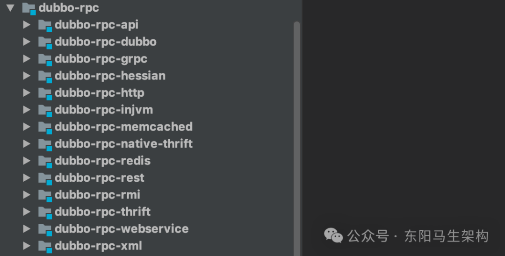

其中dubbo-rpc-api是对具体协议、服务发布、服务引用、代理等的抽象，是整个Protocol层的核心。剩余的模块，如dubbo-rpc-dubbo、dubbo-rpc-grpc、dubbo-rpc-http等，可以看作dubbo-rpc-api模块的具体实现。

### (2)dubbo-rpc-api模块包结构

首先看dubbo-rpc-api模块的包结构，如下所示：

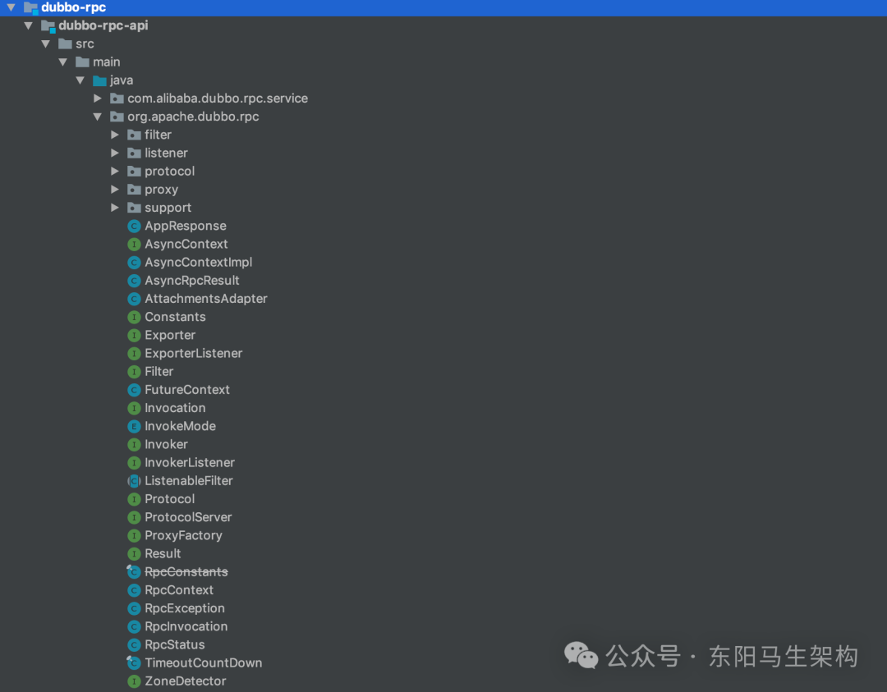

根据上图展示的dubbo-rpc-api模块结构，可以看到dubbo-rpc-api模块包括了以下几个核心包：

#### 一.filter包

在进行服务引用时会进行一系列的过滤，其中包括了很多过滤器。

#### 二.listener包

在服务发布和服务引用的过程中，可以添加一些Listener来监听相应的事件，与Listener相关的接口Adapter、Wrapper实现就在这个包内。

#### 三.protocol包

一些实现了Protocol接口以及Invoker接口的抽象类位于该包之中，它们主要是为Protocol接口的具体实现以及Invoker接口的具体实现提供一些公共逻辑。

#### 四.proxy包

提供了创建代理的能力，在这个包中支持JDK动态代理以及Javassist字节码两种方式生成本地代理类。

#### 五.support包

包括了RpcUtils工具类、Mock相关的Protocol实现以及Invoker实现。

没有在上述package中的接口和类，是更为核心的抽象接口，上述package内的类更多的是这些接口的实现类。下面介绍这些在org.apache.dubbo.rpc包下的核心接口。

### (3)Dubbo RPC层核心接口

#### 一.Invoker接口

#### 二.Invocation接口

#### 三.Result接口

#### 四.Exporter接口

#### 五.ExporterListener接口

#### 六.InvokerListener接口

#### 七.Protocol接口

#### 八.ProxyFactory接口

#### 九.ProtocolServer接口

#### 十.Filter接口

在Dubbo RPC层中涉及的核心接口有Invoker、Invocation、Protocol、Result、Exporter、ProtocolServer、Filter等。这些接口分别抽象了Dubbo RPC层的不同概念，看似相互独立，但又相互协同，一起构建出了Dubbo RPC层的骨架。下面介绍这些核心接口的含义。

#### 一.Invoker接口

Invoker接口是Dubbo中非常重要的一个接口，可以说Invoker渗透在整个Dubbo代码实现里，Dubbo中的很多设计思路都会向Invoker这个概念靠拢。

```cs
public interface Invoker<T> extends Node {
    //获取服务接口
    Class<T> getInterface();

    //进行一次远程调用
    Result invoke(Invocation invocation) throws RpcException;
}
```

下图对比展示了两种最关键的Invoker：服务提供Invoker和服务消费Invoker。

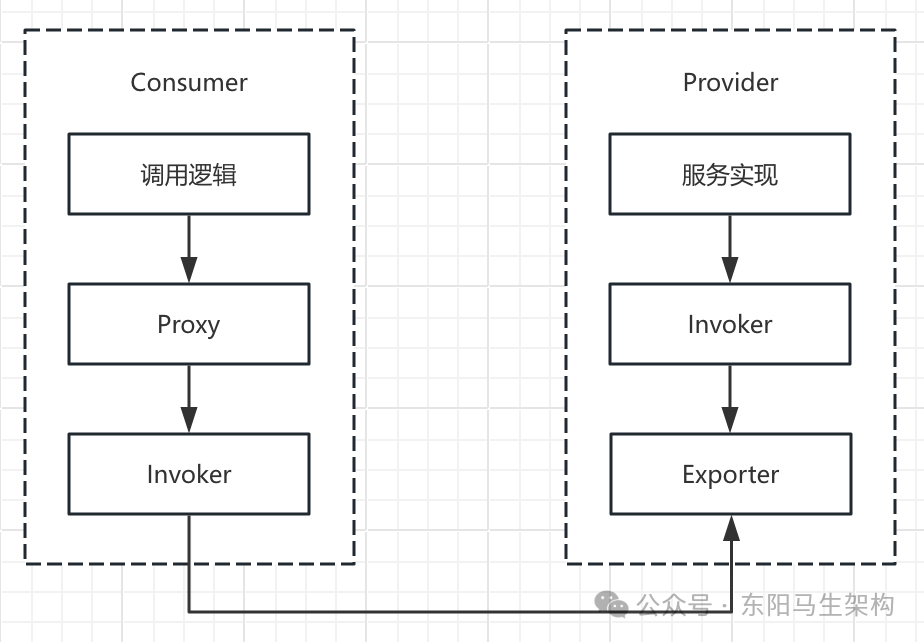

以dubbo-demo-annotation-consumer这个示例中的Consumer为例，它会拿到一个DemoService对象。如下所示，这其实是一个代理(即上图中的Proxy)，这个Proxy底层就会通过Invoker完成网络调用。

```typescript
@Component("demoServiceComponent")
public class DemoServiceComponent implements DemoService {
    @Reference
    private DemoService demoService;

    @Override
    public String sayHello(String name) {
        return demoService.sayHello(name);
    }

    @Override
    public CompletableFuture<String> sayHelloAsync(String name) {
        return null;
    }
}
```

dubbo-demo-annotation-provider示例中的Provider实现如下：

```typescript
@Service
public class DemoServiceImpl implements DemoService {
    private static final Logger logger = LoggerFactory.getLogger(DemoServiceImpl.class);

    @Override
    public String sayHello(String name) {
        logger.info("Hello " + name + ", request from consumer: " + RpcContext.getContext().getRemoteAddress());
        return "Hello " + name + ", response from provider: " + RpcContext.getContext().getLocalAddress();
    }

    @Override
    public CompletableFuture<String> sayHelloAsync(String name) {
        return null;
    }
}
```

这里的DemoServiceImpl类会被封装成为一个AbstractProxyInvoker实例，并新生成对应的Exporter实例。当Dubbo Protocol层收到一个请求之后，就会找到这个Exporter实例，并调用其对应的AbstractProxyInvoker实例，从而完成Provider逻辑的调用。

#### 二.Invocation接口

Invocation接口是Invoker.invoke()方法的参数，它抽象了一次RPC调用的目标服务和方法信息、相关参数信息、具体的参数值以及一些附加信息，具体定义如下：

```typescript
public interface Invocation {
    //调用Service的唯一标识
    String getTargetServiceUniqueName();

    //获取方法名称
    String getMethodName();

    //调用的服务名称
    String getServiceName();

    //参数类型集合
    Class<?>[] getParameterTypes();
    default String[] getCompatibleParamSignatures() {
        return Stream.of(getParameterTypes()).map(Class::getName).toArray(String[]::new);
    }

    //此次调用具体的参数值
    Object[] getArguments();

    //此次调用关联的Invoker对象
    Invoker<?> getInvoker();

    //Invoker对象可以设置一些KV属性，这些属性并不会传递给Provider
    Object put(Object key, Object value);
    Object get(Object key);
    Map<Object, Object> getAttributes();

    //Invocation可以携带一个KV信息作为附加信息，一并传递给Provider，注意与attribute的区分
    Map<String, String> getAttachments();
    Map<String, Object> getObjectAttachments();

    void setAttachment(String key, String value);
    void setObjectAttachment(String key, Object value);
    void setAttachmentIfAbsent(String key, String value);
    void setObjectAttachmentIfAbsent(String key, Object value);

    String getAttachment(String key);
    Object getObjectAttachment(String key);
    String getAttachment(String key, String defaultValue);
    Object getObjectAttachment(String key, Object defaultValue);
}
```

#### 三.Result接口

Result接口是Invoker.invoke()方法的返回值，它抽象了一次调用的返回值，其中包含了被调用方返回值(或是异常)以及附加信息。当然，也可以添加回调方法，在RPC调用方法结束时触发这些回调。

Result接口的具体定义如下：

```cs
public interface Result extends Serializable {
    //获取/设置此次调用的返回值
    Object getValue();
    void setValue(Object value);

    //如果此次调用发生异常，则可以通过下面三个方法获取
    Throwable getException();
    void setException(Throwable t);
    boolean hasException();

    //recreate()方法是一个复合操作
    //如果此次调用发生异常，则直接抛出异常
    //如果没有异常，则返回结果
    Object recreate() throws Throwable;

    //添加一个回调，当RPC调用完成时，会触发这里添加的回调
    Result whenCompleteWithContext(BiConsumer<Result, Throwable> fn);
    <U> CompletableFuture<U> thenApply(Function<Result, ? extends U> fn);

    //阻塞线程，等待此次RPC调用完成(或是超时)
    Result get() throws InterruptedException, ExecutionException;
    Result get(long timeout, TimeUnit unit) throws InterruptedException, ExecutionException, TimeoutException;

    //Result中同样可以携带附加信息
    Map<String, String> getAttachments();
    Map<String, Object> getObjectAttachments();

    void addAttachments(Map<String, String> map);
    void addObjectAttachments(Map<String, Object> map);

    void setAttachments(Map<String, String> map);
    void setObjectAttachments(Map<String, Object> map);

    String getAttachment(String key);
    Object getObjectAttachment(String key);

    String getAttachment(String key, String defaultValue);
    Object getObjectAttachment(String key, Object defaultValue);

    void setAttachment(String key, String value);
    void setAttachment(String key, Object value);
    void setObjectAttachment(String key, Object value);
}
```

#### 四.Exporter接口

在上面介绍Provider端的Invoker时提到，业务接口的实现会被包装成一个AbstractProxyInvoker对象，然后由Exporter发布出去，让Consumer可以调用到该服务。

Exporter发布Invoker的实现，就是让Provider能够根据请求的各种信息，找到对应的Invoker。因此可以维护一个Map，其中key根据请求中的信息构建，value为封装相应服务Bean的Exporter对象，这样就可以实现上述服务发布的要求了。

Exporter接口的定义如下：

```cs
public interface Exporter<T> {
    //获取底层封装的Invoker对象
    Invoker<T> getInvoker();

    //取消发布底层的Invoker对象
    void unexport();
}
```

#### 五.ExporterListener接口

为了监听服务发布事件以及取消发布事件，Dubbo定义了一个SPI扩展接口ExporterListener。虽然ExporterListener是个扩展接口，但是Dubbo本身并没有提供什么有用的扩展实现，需要我们自己提供具体实现监听感兴趣的事情。相应地，我们可以添加InvokerListener监听器，监听Consumer引用服务时触发的事件。

```java
@SPI
public interface ExporterListener {
    //当有服务发布的时候，会触发该方法
    void exported(Exporter<?> exporter) throws RpcException;

    //当有服务取消发布的时候，会触发该方法
    void unexported(Exporter<?> exporter);
}
```

#### 六.InvokerListener接口

InvokerListener也是一个扩展接口，定义如下：

```java
@SPI
public interface InvokerListener {
    //当进行服务引用的时候，会触发该方法
    void referred(Invoker<?> invoker) throws RpcException;

    //当销毁服务引用时，会触发该方法
    void destroyed(Invoker<?> invoker);
}
```

#### 七.Protocol接口

Protocol接口是整个Dubbo Protocol层的核心接口之一，其中定义了export()和refer()两个核心方法，是一个扩展接口。

在Protocol接口的实现中：export()方法并非简单将Invoker对象包装成Exporter对象返回，其中还涉及代理对象的创建、底层Server的启动等操作。refer()方法除了根据传入的type类型以及URL参数查询Invoker之外，还涉及相关Client的创建等操作。

```java
@SPI("dubbo")
public interface Protocol {
    //默认端口
    int getDefaultPort();

    //将一个Invoker发布出去，export()方法实现需要是幂等的
    //即同一个服务发布多次和发布一次的效果是相同的
    @Adaptive
    <T> Exporter<T> export(Invoker<T> invoker) throws RpcException;

    //引用一个Invoker，refer()方法会根据参数返回一个Invoker对象
    //Consumer端可以通过这个Invoker请求到Provider端的服务
    @Adaptive
    <T> Invoker<T> refer(Class<T> type, URL url) throws RpcException;

    //销毁export()方法以及refer()方法使用到的Invoker对象
    //释放当前Protocol对象底层占用的资源
    void destroy();

    //返回当前Protocol底层的全部ProtocolServer
    default List<ProtocolServer> getServers() {
        return Collections.emptyList();
    }
}
```

#### 八.ProxyFactory接口

Dubbo在Protocol层专门定义了一个ProxyFactory接口作为创建代理对象的工厂。ProxyFactory接口是一个扩展接口：定义了getProxy()方法为Invoker创建代理对象，定义了getInvoker()方法将代理对象反向封装成Invoker对象。

根据ProxyFactory上的@SPI注解可知，它的默认实现会使用javassist来创建代码对象。当然，Dubbo还提供了其他方式来创建代码，例如JDK动态代理。

```java
@SPI("javassist")
public interface ProxyFactory {
    //为传入的Invoker对象创建代理对象
    @Adaptive({PROXY_KEY})
    <T> T getProxy(Invoker<T> invoker) throws RpcException;

    @Adaptive({PROXY_KEY})
    <T> T getProxy(Invoker<T> invoker, boolean generic) throws RpcException;

    //将传入的代理对象封装成Invoker对象
    @Adaptive({PROXY_KEY})
    <T> Invoker<T> getInvoker(T proxy, Class<T> type, URL url) throws RpcException;
}
```

#### 九.ProtocolServer接口

ProtocolServer接口是对RemotingServer的一层简单封装，其实现非常简单。

```cs
public interface ProtocolServer {
    default RemotingServer getRemotingServer() {
        return null;
    }

    default void setRemotingServers(RemotingServer server) {

    }

    String getAddress();

    void setAddress(String address);

    default URL getUrl() {
        return null;
    }

    default void reset(URL url) {

    }

    void close();
}
```

#### 十.Filter接口

Java Web开发中的Filter接口是用来拦截HTTP请求的，Dubbo中的Filter接口功能与之类似，是用来拦截Dubbo请求的。在Dubbo的Filter接口中，定义了一个invoke()方法将请求传递给后续的Invoker进行处理，后续的Invoker对象也可能是一个Filter封装而成的。

Filter也是一个扩展接口，Dubbo提供了丰富的Filter实现来进行功能扩展，当然也可以自定义Filter实现来扩展Dubbo的功能。

Filter接口的具体定义如下：

```java
@SPI
public interface Filter {
    //将请求传给后续的Invoker进行处理
    Result invoke(Invoker<?> invoker, Invocation invocation) throws RpcException;

    //用于监听响应以及异常
    interface Listener {
        void onResponse(Result appResponse, Invoker<?> invoker, Invocation invocation);
        void onError(Throwable t, Invoker<?> invoker, Invocation invocation);
    }
}
```

### (4)总结

这里首先介绍了Dubbo RPC层在整个Dubbo框架中所处的位置，然后介绍dubbo-rpc-api层的结构以及其中各个包提供的基本功能，接着介绍Dubbo RPC层中的核心接口：如 Invoker、Invocation、Protocol、Result、ProxyFactory、ProtocolServer等核心接口，以及ExporterListener、Filter等扩展类接口。

## 2.Protocol的实现之服务发布流程

### (1)AbstractProtocol的核心字段

### (2)export的服务发布流程简析

### (3)export流程之封装传入的Invoker对象

### (4)export流程之服务端初始化

### (5)export流程之序列化优化处理

### (6)服务发布总结

### (1)AbstractProtocol的核心字段

#### 一.exporterMap

#### 二.serverMap

#### 三.invokers

下图展示了Protocol接口的继承关系：

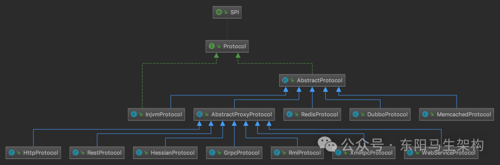

AbstractProtocol提供了一些Protocol实现需要的公共能力以及公共字段，它的核心字段有如下三个：

```typescript
public abstract class AbstractProtocol implements Protocol {
    //用于存储暴露出去的服务集合
    protected final Map<String, Exporter<?>> exporterMap = new ConcurrentHashMap<String, Exporter<?>>();

    //记录了全部的ProtocolServer实例
    protected final Map<String, ProtocolServer> serverMap = new ConcurrentHashMap<>();

    //Invoker对象(服务引用)集合
    protected final Set<Invoker<?>> invokers = new ConcurrentHashSet<Invoker<?>>();
    ...

    //创建ServiceKey
    protected static String serviceKey(URL url) {
        int port = url.getParameter(Constants.BIND_PORT_KEY, url.getPort());
        return serviceKey(port, url.getPath(), url.getParameter(VERSION_KEY), url.getParameter(GROUP_KEY));
    }

    protected static String serviceKey(int port, String serviceName, String serviceVersion, String serviceGroup) {
        return ProtocolUtils.serviceKey(port, serviceName, serviceVersion, serviceGroup);
    }

    public List<ProtocolServer> getServers() {
        return Collections.unmodifiableList(new ArrayList<>(serverMap.values()));
    }

    @Override
    public void destroy() {
        for (Invoker<?> invoker : invokers) {
            if (invoker != null) {
                invokers.remove(invoker);
                try {
                    if (logger.isInfoEnabled()) {
                        logger.info("Destroy reference: " + invoker.getUrl());
                    }
                    //关闭服务引用
                    invoker.destroy();
                } catch (Throwable t) {
                    logger.warn(t.getMessage(), t);
                }
            }
        }

        for (String key : new ArrayList<String>(exporterMap.keySet())) {
            Exporter<?> exporter = exporterMap.remove(key);
            if (exporter != null) {
                try {
                    if (logger.isInfoEnabled()) {
                        logger.info("Unexport service: " + exporter.getInvoker().getUrl());
                    }
                    //关闭暴露出去的服务
                    exporter.unexport();
                } catch (Throwable t) {
                    logger.warn(t.getMessage(), t);
                }
            }
        }
    }

    @Override
    public <T> Invoker<T> refer(Class<T> type, URL url) throws RpcException {
        return new AsyncToSyncInvoker<>(protocolBindingRefer(type, url));
    }

    protected abstract <T> Invoker<T> protocolBindingRefer(Class<T> type, URL url) throws RpcException;

    public Map<String, Exporter<?>> getExporterMap() {
        return exporterMap;
    }

    public Collection<Exporter<?>> getExporters() {
        return Collections.unmodifiableCollection(exporterMap.values());
    }
}
```

#### 一.exporterMap

用于存储暴露出去的服务集合，key是通过ProtocolUtils的serviceKey()方法创建的服务标识，value是封装了服务引用(Invoker对象)的发布出去的服务(Exporter对象)。其中的key会根据serviceGroup、serviceName、serviceVersion、port依次拼接而成。

```cs
public abstract class AbstractProtocol implements Protocol {
    //用于存储暴露出去的服务集合
    protected final Map<String, Exporter<?>> exporterMap = new ConcurrentHashMap<String, Exporter<?>>();
    ...

    //创建ServiceKey
    protected static String serviceKey(URL url) {
        int port = url.getParameter(Constants.BIND_PORT_KEY, url.getPort());
        return serviceKey(port, url.getPath(), url.getParameter(VERSION_KEY), url.getParameter(GROUP_KEY));
    }

    protected static String serviceKey(int port, String serviceName, String serviceVersion, String serviceGroup) {
        return ProtocolUtils.serviceKey(port, serviceName, serviceVersion, serviceGroup);
    }
    ...
}

public class ProtocolUtils {
    private static final ConcurrentMap<String, GroupServiceKeyCache> groupServiceKeyCacheMap = new ConcurrentHashMap<>();
    ...

    public static String serviceKey(int port, String serviceName, String serviceVersion, String serviceGroup) {
        serviceGroup = serviceGroup == null ? "" : serviceGroup;
        GroupServiceKeyCache groupServiceKeyCache = groupServiceKeyCacheMap.get(serviceGroup);
        if (groupServiceKeyCache == null) {
            groupServiceKeyCacheMap.putIfAbsent(serviceGroup, new GroupServiceKeyCache(serviceGroup));
            groupServiceKeyCache = groupServiceKeyCacheMap.get(serviceGroup);
        }
        return groupServiceKeyCache.getServiceKey(serviceName, serviceVersion, port);
    }
    ...
}

public class GroupServiceKeyCache {
    private final String serviceGroup;

    //ConcurrentMap<serviceName, ConcurrentMap<serviceVersion, ConcurrentMap<port, String>>>
    //serviceKeyMap是多层Map结构
    //第一层为serviceKeyMap，它的key是serviceName，它的value为第二层Map
    //第二层为versionMap，它的key是serviceVersion，它的value为第三层Map
    //第三层为portMap，它的key是port，它的value是serviceKey
    private final ConcurrentMap<String, ConcurrentMap<String, ConcurrentMap<Integer, String>>> serviceKeyMap;

    public GroupServiceKeyCache(String serviceGroup) {
        this.serviceGroup = serviceGroup;
        this.serviceKeyMap = new ConcurrentHashMap<>(512);
    }

    public String getServiceKey(String serviceName, String serviceVersion, int port) {
        ConcurrentMap<String, ConcurrentMap<Integer, String>> versionMap = serviceKeyMap.get(serviceName);
        if (versionMap == null) {
            serviceKeyMap.putIfAbsent(serviceName, new ConcurrentHashMap<>());
            versionMap = serviceKeyMap.get(serviceName);
        }

        serviceVersion = serviceVersion == null ? "" : serviceVersion;
        ConcurrentMap<Integer, String> portMap = versionMap.get(serviceVersion);
        if (portMap == null) {
            versionMap.putIfAbsent(serviceVersion, new ConcurrentHashMap<>());
            portMap = versionMap.get(serviceVersion);
        }

        String serviceKey = portMap.get(port);
        if (serviceKey == null) {
            //第三层Map的value便是由serviceGroup、serviceName、serviceVersion、port拼接而成
            serviceKey = createServiceKey(serviceName, serviceVersion, port);
            portMap.put(port, serviceKey);
        }

        return serviceKey;
    }

    private String createServiceKey(String serviceName, String serviceVersion, int port) {
        StringBuilder buf = new StringBuilder();
        if (StringUtils.isNotEmpty(serviceGroup)) {
            buf.append(serviceGroup).append('/');
        }
        buf.append(serviceName);
        if (StringUtils.isNotEmpty(serviceVersion) && !"0.0.0".equals(serviceVersion)) {
            buf.append(':').append(serviceVersion);
        }
        buf.append(':').append(port);
        return buf.toString();
    }
}
```

groupServiceKeyCacheMap结构图：

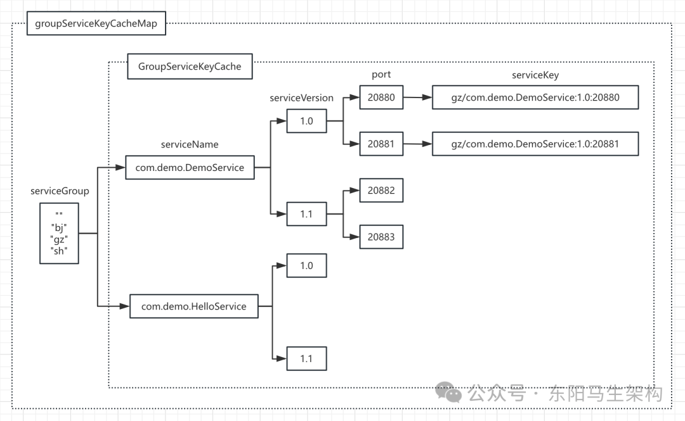

#### 二.serverMap

记录了全部的ProtocolServer实例。其中的key是host和port组成的字符串，value是监听该地址的ProtocolServer对象。

ProtocolServer就是对RemotingServer的一层简单封装，表示一个服务端。

#### 三.invokers

表示的是服务引用(Invoker对象)的集合。

AbstractProtocol没有对Protocol的export()方法进行实现，它对refer()方法的实现也是委托给了protocolBindingRefer()这个抽象方法，然后由子类实现。

AbstractProtocol唯一实现的方法就是destory()方法：首先会遍历invokers服务引用集合，销毁全部的服务引用(Invoker对象)，然后遍历全部的exporterMap集合，销毁全部的发布出去的服务(Exporter对象)。

具体实现如下：

```typescript
public abstract class AbstractProtocol implements Protocol {
    ...
    @Override
    public <T> Invoker<T> refer(Class<T> type, URL url) throws RpcException {
        return new AsyncToSyncInvoker<>(protocolBindingRefer(type, url));
    }

    protected abstract <T> Invoker<T> protocolBindingRefer(Class<T> type, URL url) throws RpcException;

    @Override
    public void destroy() {
        for (Invoker<?> invoker : invokers) {
            if (invoker != null) {
                invokers.remove(invoker);
                try {
                    if (logger.isInfoEnabled()) {
                        logger.info("Destroy reference: " + invoker.getUrl());
                    }
                    //关闭服务引用
                    invoker.destroy();
                } catch (Throwable t) {
                    logger.warn(t.getMessage(), t);
                }
            }
        }

        for (String key : new ArrayList<String>(exporterMap.keySet())) {
            Exporter<?> exporter = exporterMap.remove(key);
            if (exporter != null) {
                try {
                    if (logger.isInfoEnabled()) {
                        logger.info("Unexport service: " + exporter.getInvoker().getUrl());
                    }
                    //关闭暴露出去的服务
                    exporter.unexport();
                } catch (Throwable t) {
                    logger.warn(t.getMessage(), t);
                }
            }
        }
    }
    ...
}
```

### (2)export的服务发布流程简析

了解了AbstractProtocol提供的公共能力之后，下面介绍Dubbo默认使用的Protocol实现类DubboProtocol。

DubboProtocol的export()方法进行服务发布时的步骤如下：

```
步骤一：调用AbstractProtocol的serviceKey()方法创建ServiceKey
步骤二：将传入的Invoker对象封装成DubboExporter对象并记录到exporterMap集合中
步骤三：服务端初始化并启动ProtocolServer
步骤四：序列化的优化处理
```

```java
public class DubboProtocol extends AbstractProtocol {
    ...
    @Override
    public <T> Exporter<T> export(Invoker<T> invoker) throws RpcException {
        URL url = invoker.getUrl();
        //步骤一：调用AbstractProtocol的serviceKey()方法创建ServiceKey
        String key = serviceKey(url);

        //步骤二：将传入的Invoker对象封装成DubboExporter对象并记录到exporterMap集合中
        DubboExporter<T> exporter = new DubboExporter<T>(invoker, key, exporterMap);
        exporterMap.put(key, exporter);

        //export an stub service for dispatching event
        Boolean isStubSupportEvent = url.getParameter(STUB_EVENT_KEY, DEFAULT_STUB_EVENT);
        Boolean isCallbackservice = url.getParameter(IS_CALLBACK_SERVICE, false);
        ...

        //步骤三：服务端初始化并启动ProtocolServer
        openServer(url);

        //步骤四：序列化的优化处理
        optimizeSerialization(url);
        return exporter;
    }
    ...
}
```

### (3)export流程之封装传入的Invoker对象

DubboProtocol的export()方法会使用DubboExporter将传入的Invoker对象进行封装，DubboExporter的继承关系如下：

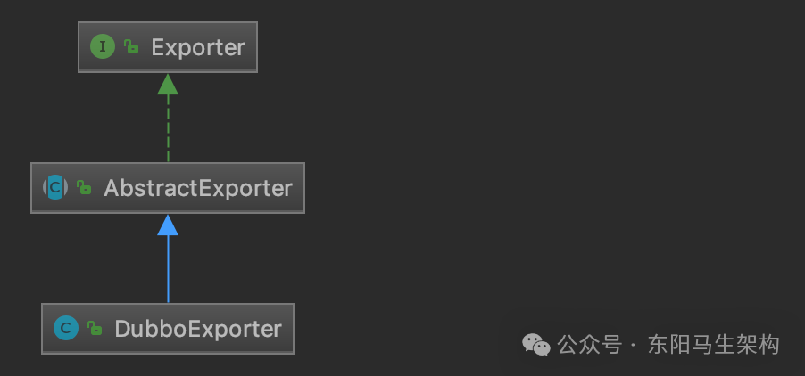

AbstractExporter中维护了一个Invoker对象以及一个unexported字段(boolean类型)。在它的unexport()方法中会设置unexported字段为true，并调用这个Invoker对象的destory()方法进行销毁。

```typescript
public abstract class AbstractExporter<T> implements Exporter<T> {
    private final Invoker<T> invoker;
    private volatile boolean unexported = false;

    public AbstractExporter(Invoker<T> invoker) {
        if (invoker == null) {
            throw new IllegalStateException("service invoker == null");
        }
        if (invoker.getInterface() == null) {
            throw new IllegalStateException("service type == null");
        }
        if (invoker.getUrl() == null) {
            throw new IllegalStateException("service url == null");
        }
        this.invoker = invoker;
    }

    @Override
    public Invoker<T> getInvoker() {
        return invoker;
    }

    @Override
    public void unexport() {
        if (unexported) {
            return;
        }
        unexported = true;
        getInvoker().destroy();
    }

    @Override
    public String toString() {
        return getInvoker().toString();
    }
}
```

DubboExporter会维护Invoker对象对应的ServiceKey以及DubboProtocol中的exportMap集合，它的unexport()方法除了会调用父类AbstractExporter的unexport()方法，还会清理该DubboExporter实例在exportMap中对应的元素。

```typescript
public class DubboExporter<T> extends AbstractExporter<T> {
    private final String key;
    private final Map<String, Exporter<?>> exporterMap;

    public DubboExporter(Invoker<T> invoker, String key, Map<String, Exporter<?>> exporterMap) {
        super(invoker);
        this.key = key;
        this.exporterMap = exporterMap;
    }

    @Override
    public void unexport() {
        super.unexport();
        exporterMap.remove(key);
    }
}
```

### (4)export流程之服务端初始化

#### 一.DubboProtocol的openServer()方法

#### 二.DubboProtocol的createServer()方法

#### 三.DubboProtocol的requestHandler字段

DubboProtocol的export()方法将传入的Invoker对象(服务引用)封装成DubboExporter对象(发布出去的服务)并记录到exporterMap集合中后，便会调用openServer()方法进行服务端初始化并启动ProtocolServer。

DubboProtocol的openServer()方法会一路调用前面介绍的Exchange层、Transport层，并最终创建NettyServer来接收客户端的请求。

```bash
DubboProtocol.export(Invoker<T>) (org.apache.dubbo.rpc.protocol.dubbo)
  DubboProtocol.openServer(URL)  (org.apache.dubbo.rpc.protocol.dubbo)
    DubboProtocol.createServer(URL)  (org.apache.dubbo.rpc.protocol.dubbo)
      Exchangers.bind(URL, ExchangeHandler)  (org.apache.dubbo.remoting.exchange)
        Exchanger.bind(URL, ExchangeHandler)  (org.apache.dubbo.remoting.exchange)
          HeaderExchanger.bind(URL, ExchangeHandler)  (org.apache.dubbo.remoting.exchange.support.header)
            Transporters.bind(URL, ChannelHandler...)  (org.apache.dubbo.remoting)
              Transporter.bind(URL, ChannelHandler)  (org.apache.dubbo.remoting)
                NettyTransporter.bind(URL, ChannelHandler)  (org.apache.dubbo.remoting.transport.netty4)
                  NettyServer.NettyServer(URL, ChannelHandler)  (org.apache.dubbo.remoting.transport.netty4)
```

#### 一.DubboProtocol的openServer()方法

openServer()方法首先会根据URL判断当前机器是否为服务端，只有服务端才能创建ProtocolServer并对外服务。如果是服务端，则会依靠serverMap集合检查是否已有ProtocolServer在监听URL指定的地址。如果没有，则调用createServer()方法创建。

```java
public class DubboProtocol extends AbstractProtocol {
    ...
    private void openServer(URL url) {
        //find server.
        //获取host:port这个地址
        String key = url.getAddress();
        //client can export a service which's only for server to invoke
        boolean isServer = url.getParameter(IS_SERVER_KEY, true);
        //只有Server端才能启动Server对象
        if (isServer) {
            ProtocolServer server = serverMap.get(key);
            //无ProtocolServer监听该地址
            if (server == null) {
                //DoubleCheck，防止并发问题
                synchronized (this) {
                    server = serverMap.get(key);
                    if (server == null) {
                        //调用createServer()方法创建ProtocolServer对象
                        serverMap.put(key, createServer(url));
                    }
                }
            } else {
                //server supports reset, use together with override
                server.reset(url);
            }
        }
    }
    ...
}
```

#### 二.DubboProtocol的createServer()方法

createServer()方法会先为URL添加一些参数值，之后再对一些参数值进行检测，相关的参数值如下：

```swift
参数一：HEARTBEAT_KEY
默认值为60000，表示默认的心跳时间间隔为60秒。

参数二：CHANNEL_READONLYEVENT_SENT_KEY
默认值为true，表示ReadOnly请求需要阻塞等待响应返回。
在Server关闭时，只能发送ReadOnly请求。
这些ReadOnly请求由这里设置的CHANNEL_READONLYEVENT_SENT_KEY参数值决定是否需要等待响应返回。

参数三：CODEC_KEY
默认值为dubbo，Codec2接口中@Adaptive注解的参数，都是获取该URL中的CODEC_KEY参数值。

参数四：SERVER_KEY
该参数指定了扩展实现名称，需要检查是否合法，默认值为Netty。
Transporter接口中@Adaptive注解的参数，它决定了Transport层使用的网络库实现，默认使用Netty 4实现。

参数五：CLIENT_KEY
该参数指定了扩展实现名称，需要检查是否合法。
同SERVER_KEY参数的检查流程。
```

添加完一些参数值后，就会通过Exchangers门面类创建出一个ExchangeServer对象，并封装成一个DubboProtocolServer对象返回。

```java
public class DubboProtocol extends AbstractProtocol {
    ...
    private ProtocolServer createServer(URL url) {
        //1.首先为URL添加一些参数值
        url = URLBuilder.from(url)
            //ReadOnly请求是否阻塞等待
            .addParameterIfAbsent(CHANNEL_READONLYEVENT_SENT_KEY, Boolean.TRUE.toString())
            //心跳间隔
            .addParameterIfAbsent(HEARTBEAT_KEY, String.valueOf(DEFAULT_HEARTBEAT))
            .addParameter(CODEC_KEY, DubboCodec.NAME)
            .build();

        //2.检测SERVER_KEY参数值
        String str = url.getParameter(SERVER_KEY, DEFAULT_REMOTING_SERVER);
        if (str != null && str.length() > 0 && !ExtensionLoader.getExtensionLoader(Transporter.class).hasExtension(str)) {
            throw new RpcException("Unsupported server type: " + str + ", url: " + url);
        }

        //通过Exchangers门面类，创建一个ExchangeServer对象
        ExchangeServer server;
        try {
            server = Exchangers.bind(url, requestHandler);
        } catch (RemotingException e) {
            throw new RpcException("Fail to start server(url: " + url + ") " + e.getMessage(), e);
        }

        //2.检测CLIENT_KEY参数值指定的Transporter扩展实现是否合法
        str = url.getParameter(CLIENT_KEY);
        if (str != null && str.length() > 0) {
            Set<String> supportedTypes = ExtensionLoader.getExtensionLoader(Transporter.class).getSupportedExtensions();
            if (!supportedTypes.contains(str)) {
                throw new RpcException("Unsupported client type: " + str);
            }
        }

        //将ExchangeServer对象封装成DubboProtocolServer对象返回
        return new DubboProtocolServer(server);
    }
    ...
}

public class DubboProtocolServer implements ProtocolServer {
    private RemotingServer server;
    private String address;

    public DubboProtocolServer(RemotingServer server) {
        this.server = server;
    }
    ...
}

public class Exchangers {
    ...
    //通过Exchangers门面类，创建ExchangeServer对象
    public static ExchangeServer bind(URL url, ExchangeHandler handler) throws RemotingException {
        ...
        url = url.addParameterIfAbsent(Constants.CODEC_KEY, "exchange");
        return getExchanger(url).bind(url, handler);
    }

    public static Exchanger getExchanger(URL url) {
        String type = url.getParameter(Constants.EXCHANGER_KEY, Constants.DEFAULT_EXCHANGER);
        return getExchanger(type);
    }

    public static Exchanger getExchanger(String type) {
        return ExtensionLoader.getExtensionLoader(Exchanger.class).getExtension(type);
    }
    ...
}

@SPI(HeaderExchanger.NAME)
public interface Exchanger {
    @Adaptive({Constants.EXCHANGER_KEY})
    ExchangeServer bind(URL url, ExchangeHandler handler) throws RemotingException;

    @Adaptive({Constants.EXCHANGER_KEY})
    ExchangeClient connect(URL url, ExchangeHandler handler) throws RemotingException;
}

public class HeaderExchanger implements Exchanger {
    public static final String NAME = "header";

    @Override
    public ExchangeClient connect(URL url, ExchangeHandler handler) throws RemotingException {
        //一.传入的handler也属于交换层的ChannelHandler，一般由交换层上层的协议层实现
        //二.传入的handler会被交换层的ChannelHandler即HeaderExchangeHandler装饰
        //三.交换层的ChannelHandler即HeaderExchangeHandler又会被传输层的ChannelHandler即DecodeHandler装饰
        //四.传输层的ChannelHandler即DecodeHandler会被设置到传输层的NettyClient中
        //五.传输层的NettyClient又会被交换层的HeaderExchangeClient装饰
        //六.上层的协议层会通过交换层的HeaderExchangeClient提供的connect()方法创建一个用于网络通信的客户端来连接服务端，不会直接操作底层的NettyClient
        //七.当服务端的请求响应到来时：
        //首先经过传输层NettyServer的ChannelHandler即DecodeHandler进行处理
        //然后再由交换层的ChannelHandler即HeaderExchangeHandler进行处理
        //接着再由业务逻辑层的ChannelHandler即传入的handler进行处理
        return new HeaderExchangeClient(Transporters.connect(url, new DecodeHandler(new HeaderExchangeHandler(handler))), true);
    }

    @Override
    public ExchangeServer bind(URL url, ExchangeHandler handler) throws RemotingException {
        //一.传入的handler也属于交换层的ChannelHandler，一般由交换层上层的协议层实现
        //二.传入的handler会被交换层的ChannelHandler即HeaderExchangeHandler装饰
        //三.交换层的ChannelHandler即HeaderExchangeHandler又会被传输层的ChannelHandler即DecodeHandler装饰
        //四.传输层的ChannelHandler即DecodeHandler会被设置到传输层的NettyServer中
        //五.传输层的NettyServer又会被交换层的HeaderExchangeServer装饰
        //六.上层的协议层会通过交换层的HeaderExchangeServer提供的bind()方法创建一个用于网络通信的服务端，不会直接操作底层的NettyServer
        //七.当客户端的网络请求到来时：
        //首先经过传输层NettyServer的ChannelHandler即DecodeHandler进行处理
        //然后再由交换层的ChannelHandler即HeaderExchangeHandler进行处理
        //接着再由业务逻辑层的ChannelHandler即传入的handler进行处理
        return new HeaderExchangeServer(Transporters.bind(url, new DecodeHandler(new HeaderExchangeHandler(handler))));
    }
}

public class HeaderExchangeServer implements ExchangeServer {
    private final RemotingServer server;

    public HeaderExchangeServer(RemotingServer server) {
        Assert.notNull(server, "server == null");
        this.server = server;
        startIdleCheckTask(getUrl());
    }
    ...
}

public class Transporters {
    ...
    public static RemotingServer bind(URL url, ChannelHandler... handlers) throws RemotingException {
        if (url == null) {
            throw new IllegalArgumentException("url == null");
        }
        if (handlers == null || handlers.length == 0) {
            throw new IllegalArgumentException("handlers == null");
        }
        ChannelHandler handler;
        if (handlers.length == 1) {
            handler = handlers[0];
        } else {
            handler = new ChannelHandlerDispatcher(handlers);
        }
        return getTransporter().bind(url, handler);
    }

    public static Transporter getTransporter() {
        return ExtensionLoader.getExtensionLoader(Transporter.class).getAdaptiveExtension();
    }
    ...
}

@SPI("netty")
public interface Transporter {
    //Bind a server.
    @Adaptive({Constants.SERVER_KEY, Constants.TRANSPORTER_KEY})
    RemotingServer bind(URL url, ChannelHandler handler) throws RemotingException;

    //Connect to a server.
    @Adaptive({Constants.CLIENT_KEY, Constants.TRANSPORTER_KEY})
    Client connect(URL url, ChannelHandler handler) throws RemotingException;
}

public class NettyTransporter implements Transporter {
    public static final String NAME = "netty";

    @Override
    public RemotingServer bind(URL url, ChannelHandler handler) throws RemotingException {
        return new NettyServer(url, handler);
    }

    @Override
    public Client connect(URL url, ChannelHandler handler) throws RemotingException {
        return new NettyClient(url, handler);
    }
}
```

‍‍DubboProtocol的createServer()方法在创建ExchangeServer时会创建实现了RemotingServer的NettyServer。而在创建NettyServer的过程中，指定用来编解码的Codec2接口实现，实际上是DubboCountCodec。

```java
public class NettyServer extends AbstractServer implements RemotingServer {
    //the cache for alive worker channel. <ip:port, dubbo channel>
    private Map<String, Channel> channels;

    //netty server bootstrap.
    private ServerBootstrap bootstrap;

    //the boss channel that receive connections and dispatch these to worker channel.
    private io.netty.channel.Channel channel;

    private EventLoopGroup bossGroup;
    private EventLoopGroup workerGroup;

    public NettyServer(URL url, ChannelHandler handler) throws RemotingException {
        //you can customize name and type of client thread pool by THREAD_NAME_KEY and THREADPOOL_KEY in CommonConstants.
        //the handler will be wrapped: MultiMessageHandler->HeartbeatHandler->handler
        super(ExecutorUtil.setThreadName(url, SERVER_THREAD_POOL_NAME), ChannelHandlers.wrap(handler, url));
    }

    //Init and start netty server
    @Override
    protected void doOpen() throws Throwable {
        //创建ServerBootstrap
        bootstrap = new ServerBootstrap();
        //创建boss EventLoopGroup
        bossGroup = NettyEventLoopFactory.eventLoopGroup(1, "NettyServerBoss");
        //创建worker EventLoopGroup
        workerGroup = NettyEventLoopFactory.eventLoopGroup(getUrl().getPositiveParameter(IO_THREADS_KEY, Constants.DEFAULT_IO_THREADS), "NettyServerWorker");

        //创建NettyServerHandler
        //它是一个Netty中的ChannelHandler实现
        //不是Dubbo Remoting层的ChannelHandler接口的实现
        final NettyServerHandler nettyServerHandler = new NettyServerHandler(getUrl(), this);

        //获取当前NettyServer创建的所有Channel
        //这里的channels集合中的Channel不是Netty中的Channel对象
        //而是Dubbo Remoting层的Channel对象
        channels = nettyServerHandler.getChannels();

        //初始化ServerBootstrap，指定boss和worker EventLoopGroup
        bootstrap.group(bossGroup, workerGroup)
        .channel(NettyEventLoopFactory.serverSocketChannelClass())
        .option(ChannelOption.SO_REUSEADDR, Boolean.TRUE)
        .childOption(ChannelOption.TCP_NODELAY, Boolean.TRUE)
        .childOption(ChannelOption.ALLOCATOR, PooledByteBufAllocator.DEFAULT)
        .childHandler(new ChannelInitializer<SocketChannel>() {
            @Override
            protected void initChannel(SocketChannel ch) throws Exception {
                //连接空闲超时时间
                int idleTimeout = UrlUtils.getIdleTimeout(getUrl());
                //NettyCodecAdapter中会创建Decoder和Encoder
                //其中会调用父类的getCodec()方法，来获取Codec2接口的实现，以进行后续的编解码处理
                NettyCodecAdapter adapter = new NettyCodecAdapter(getCodec(), getUrl(), NettyServer.this);
                if (getUrl().getParameter(SSL_ENABLED_KEY, false)) {
                    ch.pipeline().addLast("negotiation", SslHandlerInitializer.sslServerHandler(getUrl(), nettyServerHandler));
                }
                ch.pipeline()
                //注册Decoder和Encoder
                .addLast("decoder", adapter.getDecoder())
                .addLast("encoder", adapter.getEncoder())
                //注册IdleStateHandler
                .addLast("server-idle-handler", new IdleStateHandler(0, 0, idleTimeout, MILLISECONDS))
                //注册NettyServerHandler
                .addLast("handler", nettyServerHandler);
            }
        });
        //绑定指定的地址和端口
        ChannelFuture channelFuture = bootstrap.bind(getBindAddress());
        //等待bind操作完成
        channelFuture.syncUninterruptibly();
        channel = channelFuture.channel();
    }
    ...
}

final public class NettyCodecAdapter {
    private final ChannelHandler encoder = new InternalEncoder();
    private final ChannelHandler decoder = new InternalDecoder();
    private final Codec2 codec;
    private final URL url;
    private final org.apache.dubbo.remoting.ChannelHandler handler;

    public NettyCodecAdapter(Codec2 codec, URL url, org.apache.dubbo.remoting.ChannelHandler handler) {
        this.codec = codec;
        this.url = url;
        this.handler = handler;
    }

    public ChannelHandler getEncoder() {
        return encoder;
    }

    public ChannelHandler getDecoder() {
        return decoder;
    }

    private class InternalEncoder extends MessageToByteEncoder {
        @Override
        protected void encode(ChannelHandlerContext ctx, Object msg, ByteBuf out) throws Exception {
            org.apache.dubbo.remoting.buffer.ChannelBuffer buffer = new NettyBackedChannelBuffer(out);
            Channel ch = ctx.channel();
            NettyChannel channel = NettyChannel.getOrAddChannel(ch, url, handler);
            codec.encode(channel, buffer, msg);
        }
    }

    private class InternalDecoder extends ByteToMessageDecoder {
        @Override
        protected void decode(ChannelHandlerContext ctx, ByteBuf input, List<Object> out) throws Exception {
            //将ByteBuf封装成统一的ChannelBuffer
            ChannelBuffer message = new NettyBackedChannelBuffer(input);
            //拿到关联的Channel
            NettyChannel channel = NettyChannel.getOrAddChannel(ctx.channel(), url, handler);
            //decode object.
            do {
                //记录当前readerIndex的位置
                int saveReaderIndex = message.readerIndex();
                //委托给Codec2进行解码
                Object msg = codec.decode(channel, message);
                //当前接收到的数据不足一个消息的长度，会返回NEED_MORE_INPUT，
                //这里会重置readerIndex，继续等待接收更多的数据
                if (msg == Codec2.DecodeResult.NEED_MORE_INPUT) {
                    message.readerIndex(saveReaderIndex);
                    break;
                } else {
                    if (saveReaderIndex == message.readerIndex()) {
                        throw new IOException("Decode without read data.");
                    }
                    //将读取到的消息传递给后面的Handler处理
                    if (msg != null) {
                        out.add(msg);
                    }
                }
            } while (message.readable());
        }
    }
}

public abstract class AbstractServer extends AbstractEndpoint implements RemotingServer {
    ExecutorService executor;
    private InetSocketAddress localAddress;
    private InetSocketAddress bindAddress;
    private int accepts;
    private int idleTimeout;
    private ExecutorRepository executorRepository = ExtensionLoader.getExtensionLoader(ExecutorRepository.class).getDefaultExtension();

    public AbstractServer(URL url, ChannelHandler handler) throws RemotingException {
        //调用父类的构造方法
        super(url, handler);

        //根据传入的URL初始化localAddress和bindAddress
        localAddress = getUrl().toInetSocketAddress();
        String bindIp = getUrl().getParameter(Constants.BIND_IP_KEY, getUrl().getHost());
        int bindPort = getUrl().getParameter(Constants.BIND_PORT_KEY, getUrl().getPort());
        if (url.getParameter(ANYHOST_KEY, false) || NetUtils.isInvalidLocalHost(bindIp)) {
            bindIp = ANYHOST_VALUE;
        }
        bindAddress = new InetSocketAddress(bindIp, bindPort);

        //初始化accepts等字段
        this.accepts = url.getParameter(ACCEPTS_KEY, DEFAULT_ACCEPTS);
        this.idleTimeout = url.getParameter(IDLE_TIMEOUT_KEY, DEFAULT_IDLE_TIMEOUT);

        //调用doOpen()这个抽象方法启动Server
        doOpen();

        //获取该Server关联的线程池
        executor = executorRepository.createExecutorIfAbsent(url);
    }
    protected abstract void doOpen() throws Throwable;
    ...
}

public abstract class AbstractEndpoint extends AbstractPeer implements Resetable {
    private Codec2 codec;
    private int timeout;
    private int connectTimeout;

    public AbstractEndpoint(URL url, ChannelHandler handler) {
        //调用父类AbstractPeer的构造方法
        super(url, handler);
        //根据URL中的codec参数值，确定此处具体的Codec2实现类
        this.codec = getChannelCodec(url);
        //根据URL中的timeout参数确定timeout字段的值，默认1000
        this.timeout = url.getPositiveParameter(TIMEOUT_KEY, DEFAULT_TIMEOUT);
        //根据URL中的connect.timeout参数确定connectTimeout字段的值，默认3000
        this.connectTimeout = url.getPositiveParameter(Constants.CONNECT_TIMEOUT_KEY, Constants.DEFAULT_CONNECT_TIMEOUT);
    }

    protected static Codec2 getChannelCodec(URL url) {
        //根据URL的codec参数获取扩展名
        String codecName = url.getParameter(Constants.CODEC_KEY, "telnet");
        if (ExtensionLoader.getExtensionLoader(Codec2.class).hasExtension(codecName)) {
            //通过ExtensionLoader加载并实例化Codec2的具体扩展实现
            return ExtensionLoader.getExtensionLoader(Codec2.class).getExtension(codecName);
        } else {
            //Codec2接口不存在相应的扩展名，就尝试从Codec这个老接口的扩展名中查找，目前Codec接口已经废弃了
            return new CodecAdapter(ExtensionLoader.getExtensionLoader(Codec.class).getExtension(codecName));
        }
    }

    protected Codec2 getCodec() {
        return codec;
    }
    ...
}

@SPI
public interface Codec2 {
    @Adaptive({Constants.CODEC_KEY})
    void encode(Channel channel, ChannelBuffer buffer, Object message) throws IOException;

    @Adaptive({Constants.CODEC_KEY})
    Object decode(Channel channel, ChannelBuffer buffer) throws IOException;
    enum DecodeResult {
        NEED_MORE_INPUT, SKIP_SOME_INPUT
    }
}
```

DubboCountCodec对应的SPI配置如下：

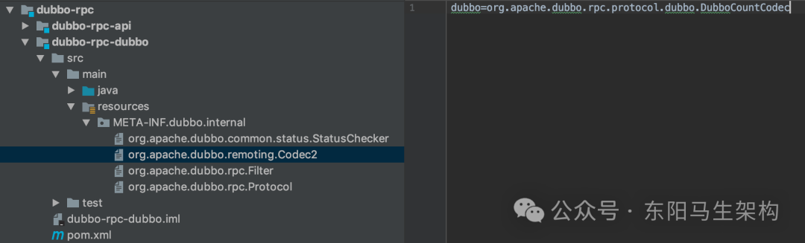

说明一：DubboCountCodec

DubboCountCodec中维护了一个DubboCodec对象，编解码的能力都是由DubboCodec提供的，它只负责在解码过程中控制ChannelBuffer的readerIndex指针。DubboCountCodec、DubboCodec都实现了Codec2接口，其中DubboCodec是ExchangeCodec的子类。

```java
public final class DubboCountCodec implements Codec2 {
    private DubboCodec codec = new DubboCodec();

    @Override
    public void encode(Channel channel, ChannelBuffer buffer, Object msg) throws IOException {
        //调用DubboCodec的父类ExchangeCodec的encode()方法
        codec.encode(channel, buffer, msg);
    }

    @Override
    public Object decode(Channel channel, ChannelBuffer buffer) throws IOException {
        //首先保存readerIndex指针位置
        int save = buffer.readerIndex();
        //创建MultiMessage对象，其中可以存储多条消息
        MultiMessage result = MultiMessage.create();
        do {
            //通过DubboCodec提供的解码能力解码一条消息
            //即调用DubboCodec的父类ExchangeCodec的decode()方法
            Object obj = codec.decode(channel, buffer);
            //如果可读字节数不足一条消息，则会重置readerIndex指针
            if (Codec2.DecodeResult.NEED_MORE_INPUT == obj) {
                buffer.readerIndex(save);
                break;
            } else {
                //将成功解码的消息添加到MultiMessage中暂存
                result.addMessage(obj);
                logMessageLength(obj, buffer.readerIndex() - save);
                save = buffer.readerIndex();
            }
        } while (true);

        if (result.isEmpty()) {
            //一条消息也未解码出来，则返回NEED_MORE_INPUT错误码
            return Codec2.DecodeResult.NEED_MORE_INPUT;
        }

        //只解码出来一条消息，则直接返回该条消息
        if (result.size() == 1) {
            return result.get(0);
        }

        //解码出多条消息的话，会将MultiMessage返回
        return result;
    }
    ...
}

public class ExchangeCodec extends TelnetCodec {
    ...
    @Override
    public void encode(Channel channel, ChannelBuffer buffer, Object msg) throws IOException {
        if (msg instanceof Request) {
            encodeRequest(channel, buffer, (Request) msg);
        } else if (msg instanceof Response) {
            encodeResponse(channel, buffer, (Response) msg);
        } else {
            super.encode(channel, buffer, msg);
        }
    }

    @Override
    public Object decode(Channel channel, ChannelBuffer buffer) throws IOException {
        int readable = buffer.readableBytes();
        byte[] header = new byte[Math.min(readable, HEADER_LENGTH)];
        buffer.readBytes(header);
        return decode(channel, buffer, readable, header);
    }

    @Override
    protected Object decode(Channel channel, ChannelBuffer buffer, int readable, byte[] header) throws IOException {
        //check magic number.
        if (readable > 0 && header[0] != MAGIC_HIGH || readable > 1 && header[1] != MAGIC_LOW) {
            int length = header.length;
            if (header.length < readable) {
                header = Bytes.copyOf(header, readable);
                buffer.readBytes(header, length, readable - length);
            }
            for (int i = 1; i < header.length - 1; i++) {
                if (header[i] == MAGIC_HIGH && header[i + 1] == MAGIC_LOW) {
                    buffer.readerIndex(buffer.readerIndex() - header.length + i);
                    header = Bytes.copyOf(header, i);
                    break;
                }
            }
            return super.decode(channel, buffer, readable, header);
        }

        //check length.
        if (readable < HEADER_LENGTH) {
            return DecodeResult.NEED_MORE_INPUT;
        }

        //get data length.
        int len = Bytes.bytes2int(header, 12);
        checkPayload(channel, len);
        int tt = len + HEADER_LENGTH;
        if (readable < tt) {
            return DecodeResult.NEED_MORE_INPUT;
        }

        //limit input stream.
        ChannelBufferInputStream is = new ChannelBufferInputStream(buffer, len);
        try {
            //比如调用encodeRequestData的decodeBody()方法来对请求体进行解码
            return decodeBody(channel, is, header);
        } finally {
            if (is.available() > 0) {
                try {
                    if (logger.isWarnEnabled()) {
                        logger.warn("Skip input stream " + is.available());
                    }
                    StreamUtils.skipUnusedStream(is);
                } catch (IOException e) {
                    logger.warn(e.getMessage(), e);
                }
            }
        }
    }

    protected void encodeRequest(Channel channel, ChannelBuffer buffer, Request req) throws IOException {
        Serialization serialization = getSerialization(channel);
        //该数组用来暂存协议头
        byte[] header = new byte[HEADER_LENGTH];
        //在header数组的前两个字节中写入魔数
        Bytes.short2bytes(MAGIC, header);

        //根据当前使用的序列化设置协议头中的序列化标志位
        header[2] = (byte) (FLAG_REQUEST | serialization.getContentTypeId());
        if (req.isTwoWay()) {
            //设置协议头中的2Way标志位
            header[2] |= FLAG_TWOWAY;
        }
        if (req.isEvent()) {
            //设置协议头中的Event标志位
            header[2] |= FLAG_EVENT;
        }

        //将请求ID记录到请求头中
        Bytes.long2bytes(req.getId(), header, 4);

        //下面开始序列化请求，并统计序列化后的字节数
        //首先使用savedWriteIndex记录ChannelBuffer当前的写入位置
        int savedWriteIndex = buffer.writerIndex();

        //将写入位置后移16字节
        buffer.writerIndex(savedWriteIndex + HEADER_LENGTH);

        //根据选定的序列化方式对请求进行序列化
        ChannelBufferOutputStream bos = new ChannelBufferOutputStream(buffer);
        ObjectOutput out = serialization.serialize(channel.getUrl(), bos);
        if (req.isEvent()) {
            //对事件进行序列化
            encodeEventData(channel, out, req.getData());
        } else {
            //比如，调用DubboCodec的encodeRequestData()方法对Dubbo请求进行序列化编码
            encodeRequestData(channel, out, req.getData(), req.getVersion());
        }
        out.flushBuffer();
        if (out instanceof Cleanable) {
            ((Cleanable) out).cleanup();
        }
        bos.flush();
        //完成序列化
        bos.close();

        //统计请求序列化之后，得到的字节数
        int len = bos.writtenBytes();
        //限制一下请求的字节长度
        checkPayload(channel, len);
        //将字节数写入header数组中
        Bytes.int2bytes(len, header, 12);
        //下面调整ChannelBuffer当前的写入位置，并将协议头写入Buffer中
        buffer.writerIndex(savedWriteIndex);
        //write header.
        buffer.writeBytes(header);
        //最后，将ChannelBuffer的写入位置移动到正确的位置
        buffer.writerIndex(savedWriteIndex + HEADER_LENGTH + len);
    }
    ...
}
```

DubboCountCodec及DubboCodec继承关系：

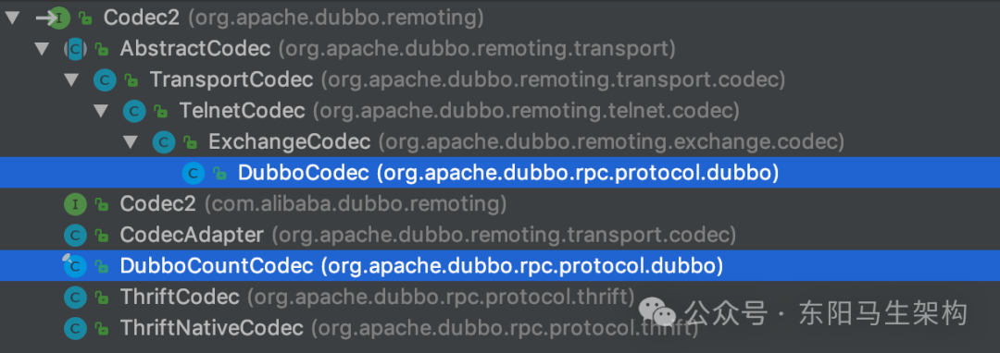

说明二：DubboCodec

由于ExchangeCodec只处理了Dubbo协议的请求头，而DubboCodec则是通过继承的方式，在ExchangeCodec基础之上，增加了按照Dubbo协议处理消息体的功能。

ExchangeCodec的encodeRequest()方法会调用encodeRequestData()方法完成请求体的编码。DubboCodec就覆盖了encodeRequestData()方法，按照Dubbo协议的格式编码Request请求体。

ExchangeCodec的decode()方法会调用decodeBody()方法完成请求体的解码。DubboCodec也覆盖了decodeBody()方法，按照Dubbo协议的格式解码Request请求体。

```kotlin
public class DubboCodec extends ExchangeCodec {
    ...
    @Override
    protected void encodeRequestData(Channel channel, ObjectOutput out, Object data, String version) throws IOException {
        //请求体相关的内容，都封装在了RpcInvocation
        RpcInvocation inv = (RpcInvocation) data;
        //写入版本号
        out.writeUTF(version);
        //写入服务名称
        String serviceName = inv.getAttachment(INTERFACE_KEY);
        if (serviceName == null) {
            serviceName = inv.getAttachment(PATH_KEY);
        }
        out.writeUTF(serviceName);
        out.writeUTF(inv.getAttachment(VERSION_KEY));
        //写入方法名称
        out.writeUTF(inv.getMethodName());
        //写入参数类型列表
        out.writeUTF(inv.getParameterTypesDesc());
        //依次写入全部参数
        Object[] args = inv.getArguments();
        if (args != null) {
            for (int i = 0; i < args.length; i++) {
                out.writeObject(encodeInvocationArgument(channel, inv, i));
            }
        }
        //依次写入全部的附加信息
        out.writeAttachments(inv.getObjectAttachments());
    }
    ...
}
```

说明三：RpcInvocation

根据DubboCodec的encodeRequestData()方法可知，请求体相关的内容都会封装在RpcInvocation中。RpcInvocation实现了Invocation接口，如下继承关系图示：

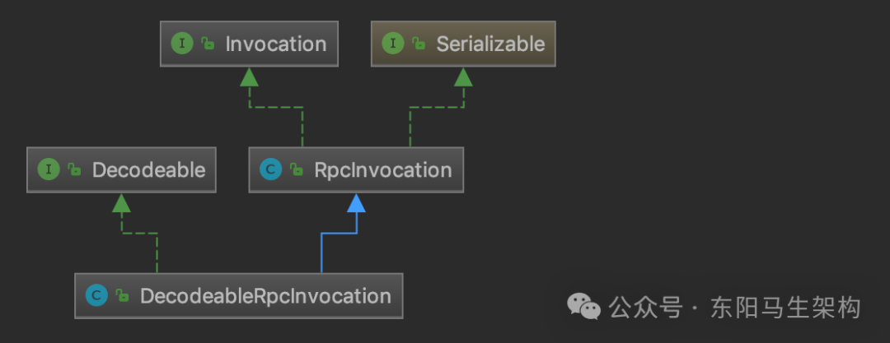

RpcInvocation中的核心字段如下，通过读写这些字段即可实现Invocation接口的全部方法。

```typescript
public class RpcInvocation implements Invocation, Serializable {
    //要调用的唯一服务名称，其实就是ServiceKey(即"interface/group:version")
    private String targetServiceUniqueName;
    //methodName(String类型)
    private String methodName;
    //调用的目标服务名称，示例中就是org.apache.dubbo.demo.DemoService
    private String serviceName;
    //记录了目标方法的全部参数类型
    private transient Class<?>[] parameterTypes;
    //参数列表签名
    private String parameterTypesDesc;
    private String[] compatibleParamSignatures;
    //具体参数值
    private Object[] arguments;
    //此次调用的附加信息，可以被序列化到请求中
    private Map<String, Object> attachments;
    //此次调用的属性信息，这些信息不能被发送出去
    private Map<Object, Object> attributes = new HashMap<Object, Object>();
    //此次调用关联的Invoker对象(服务引用)
    private transient Invoker<?> invoker;
    //返回值的类型
    private transient Class<?> returnType;
    private transient Type[] returnTypes;
    //此次调用的模式，分为SYNC、ASYNC和FUTURE三类
    private transient InvokeMode invokeMode;
    ...
}
```

RpcInvocation的子类DecodeableRpcInvocation是用来支持解码的，其实现的decode()方法正好是DubboCodec的encodeRequestData()方法对应的解码操作。在DubboCodec的decodeBody()方法中就调用了这个方法，调用关系如下所示：

```cs
Decodeable.decode() (org.apache.dubbo.remoting)
  DubboCodec.decodeBody(Channel, InputStream, byte[]) (org.apache.dubbo.rpc.protocol.dubbo)
    ExchangeCodec.decode(Channel, ChannelBuffer, int, byte[]) (org.apache.dubbo.remoting.exchange.codec)
      TelnetCodec.decode(Channel, ChannelBuffer) (org.apache.dubbo.remoting.telnet.codec)
        InternalDecoder in NettyCodecAdapter.decode(ChannelHandlerContext, ByteBuf, List<Object>) (org.apache.dubbo.remoting.transport.netty4)
```

在DubboCodec的decodeBody()方法中会根据DECODE_IN_IO_THREAD_KEY这个参数决定是否在DubboCodec中进行解码，DubboCodec是在IO线程中调用的。

```java
public class DubboCodec extends ExchangeCodec {
    ...
    @Override
    protected Object decodeBody(Channel channel, InputStream is, byte[] header) throws IOException {
        ...
        Request req = new Request(id);
        ...
        Object data;
        DecodeableRpcInvocation inv;
        if (channel.getUrl().getParameter(DECODE_IN_IO_THREAD_KEY, DEFAULT_DECODE_IN_IO_THREAD)) {
            inv = new DecodeableRpcInvocation(channel, req, is, proto);
            //调用DecodeableRpcInvocation的decode()方法
            inv.decode();
        } else {
            inv = new DecodeableRpcInvocation(channel, req, new UnsafeByteArrayInputStream(readMessageData(is)), proto);
        }
        data = inv;
        req.setData(data);
        ...
        return req;
    }
}
```

如果不在DubboCodec中解码，那会在哪里解码呢？根据前面的介绍，DecodeHandler(Transport层)的received()方法也是可以进行解码的。另外，DecodeableRpcInvocation中有一个hasDecoded字段来判断当前是否已经完成解码。这样，三者配合就可以根据DECODE_IN_IO_THREAD_KEY参数决定执行解码操作的线程。

根据Exchangers、HeaderExchanger、Transporters三个门面类的bind()方法，以及Dispatcher各实现提供的线程模型，可以知道各个ChannelHandler究竟会由哪个线程来执行。以AllDispatcher实现为例，在IO线程内执行的ChannelHandler实现依次有：InternalEncoder、InternalDecoder(两者底层都是调用DubboCodec)、IdleStateHandler、MultiMessageHandler、HeartbeatHandler和NettyServerHandler，在非IO线程内执行的ChannelHandler实现依次有：DecodeHandler、HeaderExchangeHandler和DubboProtocol的requestHandler。

#### 三.DubboProtocol的requestHandler字段

在DubboProtocol中有一个requestHandler字段，它是一个实现了ExchangeHandlerAdapter抽象类的匿名内部类的实例，间接实现了ExchangeHandler接口，其received()方法会调用其reply()方法，具体实现如下：

```typescript
public class DubboProtocol extends AbstractProtocol {
    ...
    private ExchangeHandler requestHandler = new ExchangeHandlerAdapter() {
        @Override
        public void received(Channel channel, Object message) throws RemotingException {
            if (message instanceof Invocation) {
                //调用这里的reply()方法
                reply((ExchangeChannel) channel, message);
            } else {
                super.received(channel, message);
            }
        }

        @Override
        public CompletableFuture<Object> reply(ExchangeChannel channel, Object message) throws RemotingException {
            if (!(message instanceof Invocation)) {
                throw new RemotingException("");
            }
            Invocation inv = (Invocation) message;
            //调用DubboProtocol的getInvoker()方法，获取此次调用对应的Invoker对象
            Invoker<?> invoker = getInvoker(channel, inv);
            if (Boolean.TRUE.toString().equals(inv.getObjectAttachments().get(IS_CALLBACK_SERVICE_INVOKE))) {
                String methodsStr = invoker.getUrl().getParameters().get("methods");
                boolean hasMethod = false;
                if (methodsStr == null || !methodsStr.contains(",")) {
                    hasMethod = inv.getMethodName().equals(methodsStr);
                } else {
                    String[] methods = methodsStr.split(",");
                    for (String method : methods) {
                        if (inv.getMethodName().equals(method)) {
                            hasMethod = true;
                            break;
                        }
                    }
                }
                if (!hasMethod) {
                    logger.warn("");
                    return null;
                }
            }
            //将客户端的地址记录到RpcContext中
            RpcContext.getContext().setRemoteAddress(channel.getRemoteAddress());
            //执行真正的调用
            Result result = invoker.invoke(inv);
            //返回结果
            return result.thenApply(Function.identity());
        }
        ...
    });

    Invoker<?> getInvoker(Channel channel, Invocation inv) throws RemotingException {
        ...
        //生成ServiceKey
        String serviceKey = serviceKey(
            port,
            path,
            (String) inv.getObjectAttachments().get(VERSION_KEY),
            (String) inv.getObjectAttachments().get(GROUP_KEY)
        );
        //从exporterMap集合查找DubboExporter对象
        DubboExporter<?> exporter = (DubboExporter<?>) exporterMap.get(serviceKey);
        ...
        //获取exporter中获取Invoker对象
        return exporter.getInvoker();
    }
    ...
}
```

### (5)export流程之序列化优化处理

DubboProtocol的export()方法在完成ProtocolServer的启动后，会调用optimizeSerialization()方法对指定的序列化算法进行优化。

```java
public class DubboProtocol extends AbstractProtocol {
    ...
    @Override
    public <T> Exporter<T> export(Invoker<T> invoker) throws RpcException {
        URL url = invoker.getUrl();
        //步骤一：调用AbstractProtocol的serviceKey()方法创建ServiceKey
        String key = serviceKey(url);

        //步骤二：将传入的Invoker对象封装成DubboExporter对象并记录到exporterMap集合中
        DubboExporter<T> exporter = new DubboExporter<T>(invoker, key, exporterMap);
        exporterMap.put(key, exporter);

        //export an stub service for dispatching event
        Boolean isStubSupportEvent = url.getParameter(STUB_EVENT_KEY, DEFAULT_STUB_EVENT);
        Boolean isCallbackservice = url.getParameter(IS_CALLBACK_SERVICE, false);
        ...

        //步骤三：服务端初始化并启动ProtocolServer
        openServer(url);

        //步骤四：序列化的优化处理
        optimizeSerialization(url);
        return exporter;
    }
    ...
}
```

一般来说，在使用某些序列化算法如Kryo、FST等时，为了让其能发挥出最佳的性能，最好将那些需要被序列化的类提前注册到Dubbo系统中。比如可以通过一个实现了SerializationOptimizer接口的优化器，并在配置中指定该优化器，如下所示：

```cs
public class SerializationOptimizerImpl implements SerializationOptimizer {
    public Collection<Class> getSerializableClasses() {
        List<Class> classes = new ArrayList<>();
        classes.add(xxxx.class);
        return classes;
    }
}
```

在DubboProtocol的optimizeSerialization()方法中，就会获取该优化器中注册的类，通知底层的序列化算法进行优化，序列化的性能将会被大大提升。

当然在进行序列化时，难免会级联到很多Java内部的类(如数组、各种集合类型等)，Kryo、FST等序列化算法已经自动将JDK中的常用类进行了注册，所以无须重复注册它们。

DubboProtocol的optimizeSerialization()方法进行序列化优化操作的实现如下：

```java
public class DubboProtocol extends AbstractProtocol {
    ...
    private void optimizeSerialization(URL url) throws RpcException {
        //根据URL中的optimizer参数值，确定SerializationOptimizer接口的实现类
        String className = url.getParameter(OPTIMIZER_KEY, "");
        Class clazz = Thread.currentThread().getContextClassLoader().loadClass(className);
        //创建SerializationOptimizer实现类的对象
        SerializationOptimizer optimizer = (SerializationOptimizer) clazz.newInstance();
        //调用getSerializableClasses()方法获取需要注册的类
        for (Class c : optimizer.getSerializableClasses()) {
            SerializableClassRegistry.registerClass(c);
        }
        optimizers.add(className);
    }
    ...
}
```

SerializableClassRegistry底层维护了一个static的Map(REGISTRATIONS字段)，registerClass()方法就是将待优化的类写入该集合中暂存。在使用Kryo、FST等序列化算法时，会读取该集合中的类，完成注册操作。

按照Dubbo官方说法：即使不注册任何类进行优化，Kryo和FST的性能依然普遍优于Hessian2和Dubbo序列化。

### (6)服务发布总结

这里主要介绍了DubboProtocol发布一个Dubbo服务的核心流程。首先介绍AbstractProtocol这个抽象类为Protocol实现类提供的公共能力和字段，然后结合Dubbo协议对应的DubboProtocol实现介绍发布一个Dubbo服务的核心流程。其中涉及整个服务端核心启动流程、RpcInvocation实现、DubboProtocol.requestHandler字段调用Invoker对象、以及序列化相关的优化处理等内容。

## 3.Protocol的实现之服务引用创建和销毁

### (1)refer流程和共享连接与独立连接

### (2)destroy方法释放底层资源

### (3)服务引用创建和销毁总结

上面以DubboProtocol的实现为基础，详细介绍了Dubbo服务发布的核心流程。接下来介绍DubboProtocol中服务引用的相关实现。

### (1)refer流程和共享连接与独立连接

#### 一.DubboProtocol的getClients()方法

#### 二.如何创建共享连接

#### 三.ExchangeClient的实现和装饰器

#### 四.如何创建独享连接

服务引用的实现入口其实就是DubboProtocol的protocolBindingRefer()方法。

```swift
public class DubboProtocol extends AbstractProtocol {
    ...
    @Override
    public <T> Invoker<T> protocolBindingRefer(Class<T> serviceType, URL url) throws RpcException {
        //进行序列化优化，注册需要优化的类
        optimizeSerialization(url);
        //创建DubboInvoker对象
        DubboInvoker<T> invoker = new DubboInvoker<T>(serviceType, url, getClients(url), invokers);
        //将上面创建DubboInvoker对象添加到invoker集合之中
        invokers.add(invoker);
        return invoker;
    }
    ...
}
```

#### 一.DubboProtocol的getClients()方法

getClients()方法会创建底层发送请求和接收响应的Client集合。其核心分为了两个部分：一个是针对共享连接的处理，另一个是针对独享连接的处理。

```typescript
public class DubboProtocol extends AbstractProtocol {
    ...
    private ExchangeClient[] getClients(URL url) {
        //是否使用共享连接
        boolean useShareConnect = false;
        //CONNECTIONS_KEY参数值决定了后续建立连接的数量
        int connections = url.getParameter(CONNECTIONS_KEY, 0);
        List<ReferenceCountExchangeClient> shareClients = null;
        //如果没有连接数的相关配置，默认使用共享连接的方式
        if (connections == 0) {
            useShareConnect = true;
            //确定建立共享连接的条数，默认只建立一条共享连接
            String shareConnectionsStr = url.getParameter(SHARE_CONNECTIONS_KEY, (String) null);
            connections = Integer.parseInt(StringUtils.isBlank(shareConnectionsStr) ? ConfigUtils.getProperty(SHARE_CONNECTIONS_KEY, DEFAULT_SHARE_CONNECTIONS) : shareConnectionsStr);
            //创建公共ExchangeClient集合
            shareClients = getSharedClient(url, connections);
        }
        //整理要返回的ExchangeClient集合
        ExchangeClient[] clients = new ExchangeClient[connections];
        for (int i = 0; i < clients.length; i++) {
            if (useShareConnect) {
                clients[i] = shareClients.get(i);
            } else {
                //不使用公共连接的情况下，会创建单独的ExchangeClient实例
                clients[i] = initClient(url);
            }
        }
        return clients;
    }
    ...
}
```

说明一：当使用独享连接时，对每个Service建立固定数量的Client，每个Client维护一个底层连接。如下图示，Provider 1暴露了多个服务，Consumer引用了Provider 1中的多个服务，独享连接就是针对每个Service都启动一个独享连接。

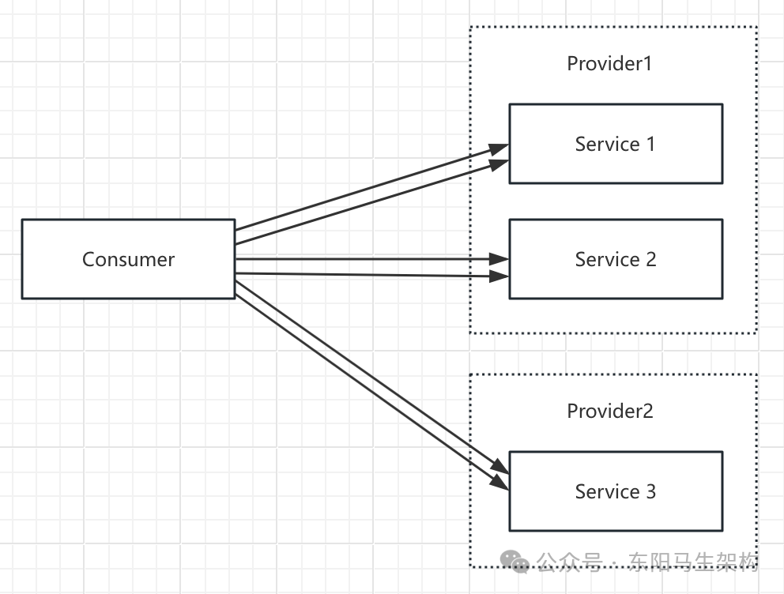

说明二：当使用共享连接时，会区分不同的网络地址(host:port)，一个地址只建立固定数量的共享连接。如下图所示，Provider 1暴露了多个服务，Consumer引用了Provider 1中的多个服务，共享连接就是Consumer调用Provider 1中的多个服务时，会通过固定数量的共享TCP长连接进行数据传输，这样就可以达到减少服务端连接数的目的。

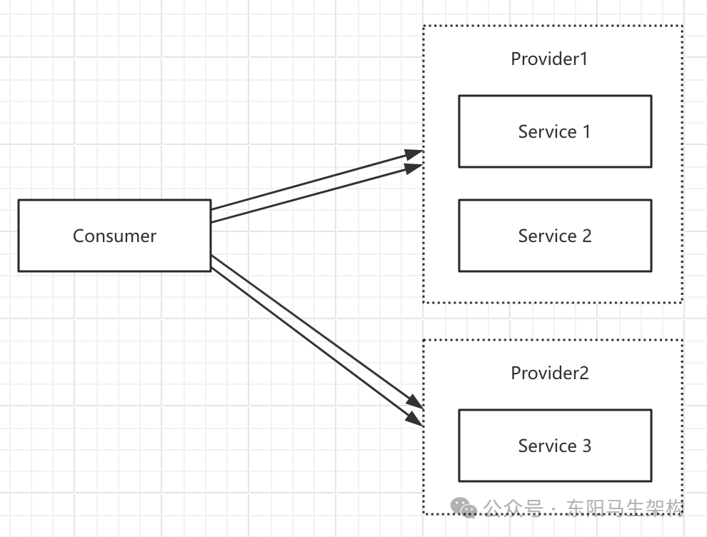

#### 二.如何创建共享连接

DubboProtocol的getSharedClient()方法可以创建共享连接，它会从referenceClientMap缓存中查询key对应的共享Client集合。如果查找到的Client集合全部可用，则直接使用这些缓存的Client，否则通过DubboProtocol的initClient()方法创建新的Client来补充替换缓存中不可用的Client。其中referenceClientMap缓存的key是由host和port拼接而成的字符串。

```typescript
public class DubboProtocol extends AbstractProtocol {
    //<host:port,Exchanger>
    private final Map<String, List<ReferenceCountExchangeClient>> referenceClientMap = new ConcurrentHashMap<>();
    private final ConcurrentMap<String, Object> locks = new ConcurrentHashMap<>();
    ...

    private List<ReferenceCountExchangeClient> getSharedClient(URL url, int connectNum) {
        //获取对端的地址(host:port)
        String key = url.getAddress();
        //从referenceClientMap集合中，获取与该地址连接的ReferenceCountExchangeClient集合
        List<ReferenceCountExchangeClient> clients = referenceClientMap.get(key);

        //检测上述客户端集合是否全部可用
        if (checkClientCanUse(clients)) {
            //客户端全部可用时
            batchClientRefIncr(clients);
            return clients;
        }

        locks.putIfAbsent(key, new Object());
        //针对指定地址的客户端进行加锁，分区加锁可以提高并发度
        synchronized (locks.get(key)) {
            clients = referenceClientMap.get(key);
            //double check，再次检测客户端是否全部可用
            if (checkClientCanUse(clients)) {
                batchClientRefIncr(clients);
                return clients;
            }
            //至少一个共享连接
            connectNum = Math.max(connectNum, 1);

            //如果当前Clients集合为空，则调用buildReferenceCountExchangeClientList()方法
            //直接通过initClient()方法初始化所有共享客户端
            if (CollectionUtils.isEmpty(clients)) {
                clients = buildReferenceCountExchangeClientList(url, connectNum);
                referenceClientMap.put(key, clients);
            } else {
                //如果只有部分共享客户端不可用，则只需要处理这些不可用的客户端
                for (int i = 0; i < clients.size(); i++) {
                    ReferenceCountExchangeClient referenceCountExchangeClient = clients.get(i);
                    if (referenceCountExchangeClient == null || referenceCountExchangeClient.isClosed()) {
                        clients.set(i, buildReferenceCountExchangeClient(url));
                        continue;
                    }
                    //增加引用
                    referenceCountExchangeClient.incrementAndGetCount();
                }
            }
            //清理locks集合中的锁对象，防止内存泄露
            locks.remove(key);
            return clients;
        }
    }

    //Bulk build client
    private List<ReferenceCountExchangeClient> buildReferenceCountExchangeClientList(URL url, int connectNum) {
        List<ReferenceCountExchangeClient> clients = new ArrayList<>();
        for (int i = 0; i < connectNum; i++) {
            clients.add(buildReferenceCountExchangeClient(url));
        }
        return clients;
    }

    //Build a single client
    //调用initClient()方法创建Client对象，然后再包装一层ReferenceCountExchangeClient进行装饰，最后返回
    //该方法主要用于创建共享Client
    private ReferenceCountExchangeClient buildReferenceCountExchangeClient(URL url) {
        ExchangeClient exchangeClient = initClient(url);
        //exchangeClient对象被ReferenceCountExchangeClient装饰后才返回
        return new ReferenceCountExchangeClient(exchangeClient);
    }

    //Create new connection
    private ExchangeClient initClient(URL url) {
        //client type setting.
        //获取客户端类型，并检查
        String str = url.getParameter(CLIENT_KEY, url.getParameter(SERVER_KEY, DEFAULT_REMOTING_CLIENT));
        //设置Codec2的扩展名
        url = url.addParameter(CODEC_KEY, DubboCodec.NAME);
        //设置默认的心跳间隔
        url = url.addParameterIfAbsent(HEARTBEAT_KEY, String.valueOf(DEFAULT_HEARTBEAT));
        //BIO is not allowed since it has severe performance issue.
        if (str != null && str.length() > 0 && !ExtensionLoader.getExtensionLoader(Transporter.class).hasExtension(str)) {
            throw new RpcException("Unsupported client type: ...");
        }

        ExchangeClient client;
        try {
            //如果配置了延迟创建连接的特性，则创建LazyConnectExchangeClient
            if (url.getParameter(LAZY_CONNECT_KEY, false)) {
                client = new LazyConnectExchangeClient(url, requestHandler);
            } else {
                client = Exchangers.connect(url, requestHandler);
            }
        } catch (RemotingException e) {
            throw new RpcException("Fail to create remoting client for service(" + url + "): " + e.getMessage(), e);
        }

        return client;
    }
    ...
}
```

#### 三.ExchangeClient的实现和装饰器

DubboProtocol的initClient()方法会返回一个ExchangeClient接口类型的对象，该对象会被ReferenceCountExchangeClient装饰，具体的装饰其实就是在原对象的基础上添加引用计数的功能。

ReferenceCountExchangeClient中除了持有被装饰的ExchangeClient对象外，还有一个referenceCount字段(AtomicInteger类型)，用于记录该Client被应用的次数。

从如下修改referenceCount的调用栈中可以看到：在ReferenceCountExchangeClient的构造方法以及incrementAndGetCount()方法中会增加引用次数，在close()方法中则会减少引用次数。这样对于同一个地址的共享连接，就可以满足：当引用次数减到0时底层的ExchangeClient连接关闭，当引用次数未减到0时底层的ExchangeClient不能关闭。

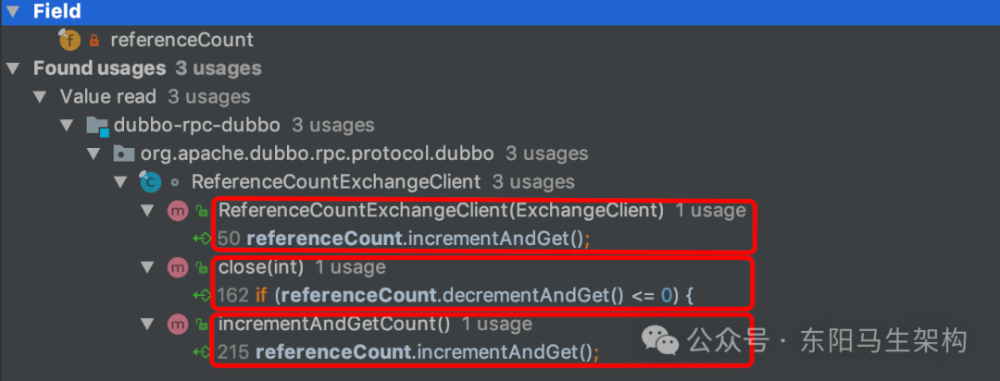

此外，ReferenceCountExchangeClient的close()方法在关闭底层ExchangeClient对象后，会立即创建一个LazyConnectExchangeClient，这也被称为幽灵连接。LazyConnectExchangeClient主要用于异常情况的兜底。

```typescript
final class ReferenceCountExchangeClient implements ExchangeClient {
    private final URL url;
    private final AtomicInteger referenceCount = new AtomicInteger(0);
    private ExchangeClient client;

    public ReferenceCountExchangeClient(ExchangeClient client) {
        this.client = client;
        referenceCount.incrementAndGet();
        this.url = client.getUrl();
    }

    public void incrementAndGetCount() {
        referenceCount.incrementAndGet();
    }

    @Override
    public void close(int timeout) {
        //引用次数减到0，关闭底层的ExchangeClient
        //具体操作有：停掉心跳任务、重连任务以及关闭底层Channel
        if (referenceCount.decrementAndGet() <= 0) {
            if (timeout == 0) {
                client.close();
            } else {
                client.close(timeout);
            }
            //创建LazyConnectExchangeClient，并将client字段指向该对象
            replaceWithLazyClient();
        }
    }

    private void replaceWithLazyClient() {
        //在原有的URL之上，添加一些LazyConnectExchangeClient特有的参数
        URL lazyUrl = URLBuilder.from(url)
            .addParameter(LAZY_CONNECT_INITIAL_STATE_KEY, Boolean.TRUE)
            .addParameter(RECONNECT_KEY, Boolean.FALSE)
            .addParameter(SEND_RECONNECT_KEY, Boolean.TRUE.toString())
            .addParameter("warning", Boolean.TRUE.toString())
            .addParameter(LazyConnectExchangeClient.REQUEST_WITH_WARNING_KEY, true)
            .addParameter("_client_memo", "referencecounthandler.replacewithlazyclient")
            .build();

        //如果当前client字段已经指向了LazyConnectExchangeClient，则不需要再次创建LazyConnectExchangeClient兜底了
        if (!(client instanceof LazyConnectExchangeClient) || client.isClosed()) {
            //ChannelHandler依旧使用原始ExchangeClient使用的Handler，即DubboProtocol中的requestHandler字段
            client = new LazyConnectExchangeClient(lazyUrl, client.getExchangeHandler());
        }
    }
    ...
}
```

LazyConnectExchangeClient也是ExchangeClient的装饰器，它会在原有ExchangeClient对象的基础上添加懒加载的功能。LazyConnectExchangeClient在构造方法中不会创建底层持有连接的Client，而是在需要发送请求时，才会调用initClient()方法进行Client的创建，调用关系如下：

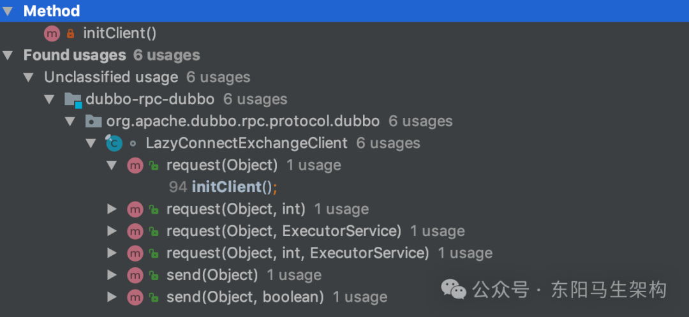

```java
final class LazyConnectExchangeClient implements ExchangeClient {
    private volatile ExchangeClient client;
    private final URL url;
    private final ExchangeHandler requestHandler;
    private final boolean initialState;
    protected final boolean requestWithWarning;

    public LazyConnectExchangeClient(URL url, ExchangeHandler requestHandler) {
        this.url = url.addParameter(SEND_RECONNECT_KEY, Boolean.TRUE.toString());
        this.requestHandler = requestHandler;
        this.initialState = url.getParameter(LAZY_CONNECT_INITIAL_STATE_KEY, DEFAULT_LAZY_CONNECT_INITIAL_STATE);
        this.requestWithWarning = url.getParameter(REQUEST_WITH_WARNING_KEY, false);
    }
    ...

    @Override
    public CompletableFuture<Object> request(Object request) throws RemotingException {
        warning();
        initClient();
        return client.request(request);
    }

    //warning()方法会根据当前URL携带的参数决定是否打印WARN级别日志
    //为了防止瞬间打印大量日志的情况发生，这里有打印的频率限制，默认每发送5000次请求打印1条日志
    private void warning() {
        if (requestWithWarning) {
            if (warningcount.get() % warning_period == 0) {
                logger.warn(new IllegalStateException("safe guard client , should not be called ,must have a bug."));
            }
            warningcount.incrementAndGet();
        }
    }

    private void initClient() throws RemotingException {
        //底层Client如果已经初始化过了，那么就不再初始化
        if (client != null) {
            return;
        }
        connectLock.lock();
        try {
            if (client != null) {
                return;
            }
            //通过Exchangers门面类，创建ExchangeClient对象
            this.client = Exchangers.connect(url, requestHandler);
        } finally {
            connectLock.unlock();
        }
    }
    ...
}
```

#### 四.如何创建独享连接

创建独享连接入口是DubboProtocol的initClient()方法，它首先会在URL中设置一些默认的参数，然后根据LAZY_CONNECT_KEY参数决定是否使用LazyConnectExchangeClient进行封装，实现懒加载功能。

```typescript
public class DubboProtocol extends AbstractProtocol {
    ...
    private ExchangeClient initClient(URL url) {
        //获取客户端类型，并检查
        String str = url.getParameter(CLIENT_KEY, url.getParameter(SERVER_KEY, DEFAULT_REMOTING_CLIENT));
        //设置Codec2的扩展名
        url = url.addParameter(CODEC_KEY, DubboCodec.NAME);
        //设置默认的心跳间隔
        url = url.addParameterIfAbsent(HEARTBEAT_KEY, String.valueOf(DEFAULT_HEARTBEAT));
        ...

        ExchangeClient client;
        //如果配置了延迟创建连接的特性，则创建LazyConnectExchangeClient
        if (url.getParameter(LAZY_CONNECT_KEY, false)) {
            client = new LazyConnectExchangeClient(url, requestHandler);
        } else {
            client = Exchangers.connect(url, requestHandler);
        }
        return client;
    }
    ...
}
```

### (2)destroy方法释放底层资源

在DubboProtocol销毁时，会调用destroy()方法释放底层资源。其中就涉及export流程中创建的ProtocolServer对象以及refer流程中创建的Client。

DubboProtocol的destroy()方法首先会逐个关闭serverMap集合中的ProtocolServer对象，然后再逐个关闭referenceClientMap集合中的Client，关闭ProtocolServer与关闭Client的逻辑相同。最后调用父类AbstractProtocol的destroy()方法，销毁全部Invoker对象。

注意：根据ReferenceCountExchangeClient的实现可以知道，只有引用减少到0时，底层的Client才会真正销毁。

```java
public class DubboProtocol extends AbstractProtocol {
    protected final Map<String, ProtocolServer> serverMap = new ConcurrentHashMap<>();
    ...

    @Override
    public void destroy() {
        //1.首先逐个关闭serverMap集合中的ProtocolServer对象
        for (String key : new ArrayList<>(serverMap.keySet())) {
            ProtocolServer protocolServer = serverMap.remove(key);
            if (protocolServer == null) {
                continue;
            }
            RemotingServer server = protocolServer.getRemotingServer();

            //在close()方法中，发送ReadOnly请求、阻塞指定时间、关闭底层的定时任务、关闭相关线程池，最终会断开所有连接，关闭Server。
            //这些逻辑在HeaderExchangeServer、NettyServer中
            server.close(ConfigurationUtils.getServerShutdownTimeout());

            //ConfigurationUtils.getServerShutdownTimeout()方法返回的阻塞时长默认是10秒
            //可以通过dubbo.service.shutdown.wait或是dubbo.service.shutdown.wait.seconds进行配置
        }

        //2.然后逐个关闭referenceClientMap集合中的Client
        for (String key : new ArrayList<>(referenceClientMap.keySet())) {
            List<ReferenceCountExchangeClient> clients = referenceClientMap.remove(key);
            if (CollectionUtils.isEmpty(clients)) {
                continue;
            }
            for (ReferenceCountExchangeClient client : clients) {
                closeReferenceCountExchangeClient(client);
            }
        }

        //3.最后调用父类AbstractProtocol的destroy()方法
        super.destroy();
    }

    private void closeReferenceCountExchangeClient(ReferenceCountExchangeClient client) {
        if (client == null) {
            return;
        }
        try {
            client.close(ConfigurationUtils.getServerShutdownTimeout());
        } catch (Throwable t) {
            logger.warn(t.getMessage(), t);
        }
    }
    ...
}

public class HeaderExchangeServer implements ExchangeServer {
    private final RemotingServer server;
    ...

    @Override
    public void close(final int timeout) {
        //将底层RemotingServer的closing字段设置为true，表示当前Server正在关闭，不再接收连接
        startClose();
        if (timeout > 0) {
            final long max = (long) timeout;
            final long start = System.currentTimeMillis();
            if (getUrl().getParameter(Constants.CHANNEL_SEND_READONLYEVENT_KEY, true)) {
                //发送ReadOnly事件请求通知客户端
                sendChannelReadOnlyEvent();
            }
            while (HeaderExchangeServer.this.isRunning() && System.currentTimeMillis() - start < max) {
                try {
                    //循环等待客户端断开连接
                    Thread.sleep(10);
                } catch (InterruptedException e) {
                    logger.warn(e.getMessage(), e);
                }
            }
        }
        //将自身closed字段设置为true，取消CloseTimerTask定时任务
        doClose();
        //关闭Transport层的Server
        server.close(timeout);
    }
    ...
}

final class ReferenceCountExchangeClient implements ExchangeClient {
    private final AtomicInteger referenceCount = new AtomicInteger(0);
    private ExchangeClient client;
    ...

    @Override
    public void close(int timeout) {
        //引用次数减到0，关闭底层的ExchangeClient
        //具体操作有：停掉心跳任务、重连任务以及关闭底层Channel
        if (referenceCount.decrementAndGet() <= 0) {
            if (timeout == 0) {
                client.close();
            } else {
                client.close(timeout);
            }
            //创建LazyConnectExchangeClient，并将client字段指向该对象
            replaceWithLazyClient();
        }
    }
    ...
}

public class HeaderExchangeClient implements ExchangeClient {
    private final Client client;
    private final ExchangeChannel channel;
    private HeartbeatTimerTask heartBeatTimerTask;
    private ReconnectTimerTask reconnectTimerTask;
    ...

    @Override
    public void close() {
        doClose();
        channel.close();
    }

    private void doClose() {
        if (heartBeatTimerTask != null) {
            heartBeatTimerTask.cancel();
        }
        if (reconnectTimerTask != null) {
            reconnectTimerTask.cancel();
        }
    }
    ...
}
```

### (3)服务引用创建和销毁总结

这里首先介绍了DubboProtocol初始化Client的核心逻辑以及如何创建共享连接和独立连接，接着介绍了ReferenceCountExchangeClient、LazyConnectExchangeClient等装饰器的功能和实现，最后介绍了destroy()方法释放底层资源的相关实现。
