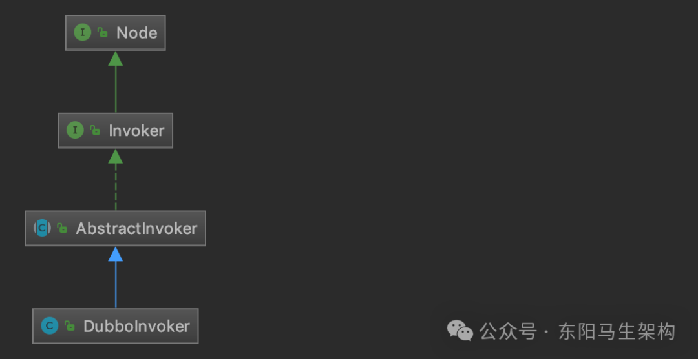
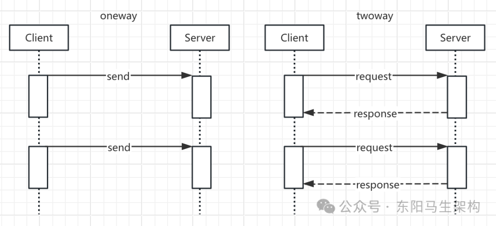
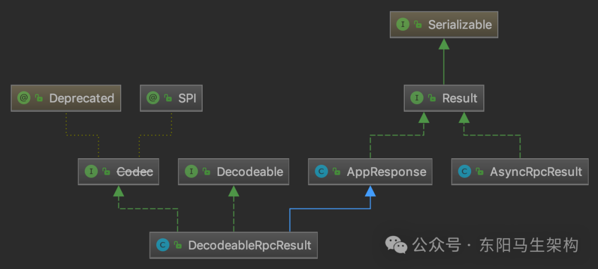
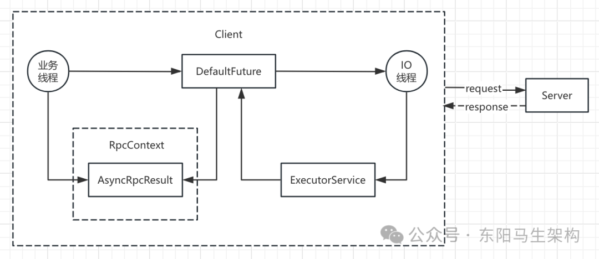

# Dubbo原理—9.RPC核心之Invoker接口

> **公众号**: 东阳马生架构  
> **发布时间**: 2025-07-28 09:00  

**大纲(26740字)**

- 1.服务发布和服务引用关于Handler的梳理
- 2.Invoker与AbstractInvoker
- 3.AbstractInvoker.invoke()中的RpcContext
- 4.DubboInvoker对两种请求的处理
- 5.Invoker的装饰器实现
- 6.Invoker接口总结


## 1.服务发布和服务引用关于Handler的梳理

### (1)服务发布和引用的示例和入口

### (2)协议层创建服务端和客户端

### (3)交换层和传输层创建服务端和客户端

### (4)底层的Netty接收到请求时的处理

### (5)收到的请求被各ChannelHandler逐一处理

上层业务Bean会被封装成Invoker对象，然后传入DubboProtocol的export()方法中。DubboProtocol的export()方法会将传入的Invoker对象封装成DubboExporter对象，并保存到exporterMap集合中进行缓存。

当DubboProtocol发布的ProtocolServer收到请求时，经过服务端的一系列解码处理，请求会到达DubboProtocol的requestHandler对象中。这个ExchangeHandler对象会从exporterMap集合中取出请求的Invoker并调用其invoke()方法处理请求。

DubboProtocol的protocolBindingRefer()方法则会在客户端将底层的ExchangeClient集合封装成DubboInvoker，然后由上层逻辑封装成代理对象，这样客户端业务层就可以像调用本地Bean一样，完成远程调用。

### (1)服务发布和引用的示例和入口

```java
//服务发布和服务引用时，都会通过代理工厂封装一个Invoker对象
public class Test {
    Exporter<?> demoExporter;
    Invoker<IDemoService> demoServiceInvoker;
    IDemoService demoService;

    public static ProxyFactory proxy = ExtensionLoader.getExtensionLoader(ProxyFactory.class).getAdaptiveExtension();
    private static DubboProtocol protocol = DubboProtocol.getDubboProtocol();

    private void init(int port) {
        URL demoUrl = URL.valueOf("dubbo://127.0.0.1:" + port + "/demo?" ...);
        //服务发布
        demoExporter = export(new DemoServiceImpl(), IDemoService.class, demoUrl);
        //服务引用
        demoServiceInvoker = (Invoker<IDemoService>) referInvoker(IDemoService.class, demoUrl);
        demoService = proxy.getProxy(demoServiceInvoker);
        Assertions.assertEquals("demo", demoService.demo());
    }

    private void destoy() {
        demoServiceInvoker.destroy();
        demoExporter.getInvoker().destroy();
    }

    public interface IDemoService {
        String demo();
    }

    public class DemoServiceImpl implements IDemoService {
        public String demo() {
            return "demo";
        }
    }

    public static <T> Exporter<T> export(T instance, Class<T> type, URL url) {
        //proxy.getInvoker()方法会将传入的代理对象封装成Invoker对象
        return protocol.export(proxy.getInvoker(instance, type, url));
    }

    public static Invoker<?> referInvoker(Class<?> type, URL url) {
        return (Invoker<?>) protocol.refer(type, url);
    }
    ...
}

@SPI("javassist")
public interface ProxyFactory {
    //为传入的Invoker对象创建代理对象
    @Adaptive({PROXY_KEY})
    <T> T getProxy(Invoker<T> invoker) throws RpcException;

    @Adaptive({PROXY_KEY})
    <T> T getProxy(Invoker<T> invoker, boolean generic) throws RpcException;

    //将传入的代理对象封装成Invoker对象
    @Adaptive({PROXY_KEY})
    <T> Invoker<T> getInvoker(T proxy, Class<T> type, URL url) throws RpcException;
}

public class JavassistProxyFactory extends AbstractProxyFactory {
    @Override
    @SuppressWarnings("unchecked")
    public <T> T getProxy(Invoker<T> invoker, Class<?>[] interfaces) {
        return (T) Proxy.getProxy(interfaces).newInstance(new InvokerInvocationHandler(invoker));
    }

    @Override
    public <T> Invoker<T> getInvoker(T proxy, Class<T> type, URL url) {
        //通过Wrapper创建一个包装类对象
        final Wrapper wrapper = Wrapper.getWrapper(proxy.getClass().getName().indexOf('$') < 0 ? proxy.getClass() : type);

        //创建一个实现了AbstractProxyInvoker的匿名内部类
        //其doInvoker()方法会直接委托给Wrapper对象的invokeMethod()方法
        return new AbstractProxyInvoker<T>(proxy, type, url) {
            @Override
            protected Object doInvoke(T proxy, String methodName, Class<?>[] parameterTypes, Object[] arguments) throws Throwable {
                return wrapper.invokeMethod(proxy, methodName, parameterTypes, arguments);
            }
        };
    }
}

public class DubboProtocol extends AbstractProtocol {
    ...
    //服务端发布服务
    @Override
    public <T> Exporter<T> export(Invoker<T> invoker) throws RpcException {
        URL url = invoker.getUrl();
        //创建ServiceKey
        String key = serviceKey(url);

        //将上层传入的Invoker对象封装成DubboExporter对象
        //然后记录到父类的exporterMap集合中
        DubboExporter<T> exporter = new DubboExporter<T>(invoker, key, exporterMap);
        exporterMap.put(key, exporter);

        //export an stub service for dispatching event
        Boolean isStubSupportEvent = url.getParameter(STUB_EVENT_KEY, DEFAULT_STUB_EVENT);
        Boolean isCallbackservice = url.getParameter(IS_CALLBACK_SERVICE, false);
        if (isStubSupportEvent && !isCallbackservice) {
            String stubServiceMethods = url.getParameter(STUB_EVENT_METHODS_KEY);
            if (stubServiceMethods == null || stubServiceMethods.length() == 0) {
                if (logger.isWarnEnabled()) {
                    logger.warn(new IllegalStateException("consumer [ ...");
                }
            }
        }

        //启动ProtocolServer
        openServer(url);
        //序列化的优化处理
        optimizeSerialization(url);

        return exporter;
    }

    //客户端发起服务调用
    @Override
    public <T> Invoker<T> protocolBindingRefer(Class<T> serviceType, URL url) throws RpcException {
        //进行序列化优化，注册需要优化的类
        optimizeSerialization(url);

        //创建DubboInvoker对象
        //但首先需要通过getClients()方法获取ExchangeClient对象
        DubboInvoker<T> invoker = new DubboInvoker<T>(serviceType, url, getClients(url), invokers);

        //将上面创建DubboInvoker对象添加到父类的invoker集合之中
        invokers.add(invoker);

        return invoker;
    }
    ...
}

public abstract class AbstractProtocol implements Protocol {
    protected final Map<String, Exporter<?>> exporterMap = new ConcurrentHashMap<String, Exporter<?>>();
    protected final Map<String, ProtocolServer> serverMap = new ConcurrentHashMap<>();
    protected final Set<Invoker<?>> invokers = new ConcurrentHashSet<Invoker<?>>();
    ...

    //客户端发起服务调用
    @Override
    public <T> Invoker<T> refer(Class<T> type, URL url) throws RpcException {
        return new AsyncToSyncInvoker<>(protocolBindingRefer(type, url));
    }

    protected abstract <T> Invoker<T> protocolBindingRefer(Class<T> type, URL url) throws RpcException;
    ...
}
```

### (2)协议层创建服务端和客户端

```java
//创建Server和Client时，会传入requestHandler
//这里关注createServer()方法和initClient()方法通过Exchangers门面类，来创建ExchangeServer和ExchangeClient对象
public class DubboProtocol extends AbstractProtocol {
    //服务端处理服务调用请求
    private ExchangeHandler requestHandler = new ExchangeHandlerAdapter() {
        ...
        @Override
        public void received(Channel channel, Object message) throws RemotingException {
            if (message instanceof Invocation) {
                reply((ExchangeChannel) channel, message);
            } else {
                super.received(channel, message);
            }
        }

        @Override
        public CompletableFuture<Object> reply(ExchangeChannel channel, Object message) throws RemotingException {
            if (!(message instanceof Invocation)) {
                throw new RemotingException(channel, "Unsupported request: " ...);
            }

            Invocation inv = (Invocation) message;
            //获取此次调用Invoker对象
            Invoker<?> invoker = getInvoker(channel, inv);
            ...

            //将客户端的地址记录到RpcContext中
            RpcContext.getContext().setRemoteAddress(channel.getRemoteAddress());
            //执行真正的调用
            Result result = invoker.invoke(inv);

            //返回结果
            return result.thenApply(Function.identity());
        }
        ...
    }
    ...

    private void openServer(URL url) {
        //find server.
        //获取host:port这个地址
        String key = url.getAddress();

        //client can export a service which's only for server to invoke
        boolean isServer = url.getParameter(IS_SERVER_KEY, true);

        //只有Server端才能启动Server对象
        if (isServer) {
            ProtocolServer server = serverMap.get(key);
            //无ProtocolServer监听该地址
            if (server == null) {
                //DoubleCheck，防止并发问题
                synchronized (this) {
                    server = serverMap.get(key);
                    if (server == null) {
                        //调用createServer()方法创建ProtocolServer对象
                        serverMap.put(key, createServer(url));
                    }
                }
            } else {
                //server supports reset, use together with override
                server.reset(url);
            }
        }
    }

    private ProtocolServer createServer(URL url) {
        //1.首先为URL添加一些默认值
        url = URLBuilder.from(url)
            //ReadOnly请求是否阻塞等待
            .addParameterIfAbsent(CHANNEL_READONLYEVENT_SENT_KEY, Boolean.TRUE.toString())
            //心跳间隔
            .addParameterIfAbsent(HEARTBEAT_KEY, String.valueOf(DEFAULT_HEARTBEAT))
            .addParameter(CODEC_KEY, DubboCodec.NAME)
            .build();

        //SERVER_KEY参数检查
        String str = url.getParameter(SERVER_KEY, DEFAULT_REMOTING_SERVER);
        if (str != null && str.length() > 0 && !ExtensionLoader.getExtensionLoader(Transporter.class).hasExtension(str)) {
            throw new RpcException("Unsupported server type: " + str + ", url: " + url);
        }

        ExchangeServer server;
        try {
            //通过Exchangers门面类，创建ExchangeServer对象
            server = Exchangers.bind(url, requestHandler);
        } catch (RemotingException e) {
            throw new RpcException("Fail to start server(url: " + url + ") " + e.getMessage(), e);
        }

        //检测CLIENT_KEY参数指定的Transporter扩展实现是否合法
        str = url.getParameter(CLIENT_KEY);
        if (str != null && str.length() > 0) {
            Set<String> supportedTypes = ExtensionLoader.getExtensionLoader(Transporter.class).getSupportedExtensions();
            if (!supportedTypes.contains(str)) {
                throw new RpcException("Unsupported client type: " + str);
            }
        }
        //将ExchangeServer封装成DubboProtocolServer返回
        return new DubboProtocolServer(server);
    }

    //客户端发起服务调用
    @Override
    public <T> Invoker<T> protocolBindingRefer(Class<T> serviceType, URL url) throws RpcException {
        //进行序列化优化，注册需要优化的类
        optimizeSerialization(url);

        //创建DubboInvoker对象
        //但首先需要通过getClients()方法获取ExchangeClient对象
        DubboInvoker<T> invoker = new DubboInvoker<T>(serviceType, url, getClients(url), invokers);

        //将上面创建DubboInvoker对象添加到invoker集合之中
        invokers.add(invoker);

        return invoker;
    }

    private ExchangeClient[] getClients(URL url) {
        //是否使用共享连接
        boolean useShareConnect = false;

        //CONNECTIONS_KEY参数值决定了后续建立连接的数量
        int connections = url.getParameter(CONNECTIONS_KEY, 0);

        List<ReferenceCountExchangeClient> shareClients = null;
        //如果没有连接数的相关配置，默认使用共享连接的方式
        if (connections == 0) {
            useShareConnect = true;
            //确定建立共享连接的条数，默认只建立一条共享连接
            String shareConnectionsStr = url.getParameter(SHARE_CONNECTIONS_KEY, (String) null);
            connections = Integer.parseInt(StringUtils.isBlank(shareConnectionsStr) ?
                    ConfigUtils.getProperty(SHARE_CONNECTIONS_KEY, DEFAULT_SHARE_CONNECTIONS) :
                    shareConnectionsStr
            );
            //也会通过initClient()方法创建公共ExchangeClient集合
            shareClients = getSharedClient(url, connections);
        }

        //整理要返回的ExchangeClient集合
        ExchangeClient[] clients = new ExchangeClient[connections];
        for (int i = 0; i < clients.length; i++) {
            if (useShareConnect) {
                clients[i] = shareClients.get(i);
            } else {
                //不使用公共连接的情况下，会创建单独的ExchangeClient实例
                clients[i] = initClient(url);
            }
        }
        return clients;
    }

    private ExchangeClient initClient(URL url) {
        //获取客户端类型，并检查
        String str = url.getParameter(CLIENT_KEY, url.getParameter(SERVER_KEY, DEFAULT_REMOTING_CLIENT));
        //设置Codec2的扩展名
        url = url.addParameter(CODEC_KEY, DubboCodec.NAME);
        //设置默认的心跳间隔
        url = url.addParameterIfAbsent(HEARTBEAT_KEY, String.valueOf(DEFAULT_HEARTBEAT));

        //BIO is not allowed since it has severe performance issue.
        if (str != null && str.length() > 0 && !ExtensionLoader.getExtensionLoader(Transporter.class).hasExtension(str)) {
            throw new RpcException("Unsupported client type: " ...);
        }

        ExchangeClient client;
        try {
            //如果配置了延迟创建连接的特性，则创建LazyConnectExchangeClient
            if (url.getParameter(LAZY_CONNECT_KEY, false)) {
                client = new LazyConnectExchangeClient(url, requestHandler);
            } else {
                //通过Exchangers门面类，创建ExchangeClient对象
                client = Exchangers.connect(url, requestHandler);
            }
        } catch (RemotingException e) {
            throw new RpcException("Fail to create remoting client for service(" + url + "): " + e.getMessage(), e);
        }
        return client;
    }
    ...
}
```

### (3)交换层和传输层创建服务端和客户端

```java
//NettyServer和NettyClient以及ChannelHandler的封装
public class Exchangers {
    ...
    //创建网络通信服务端
    public static ExchangeServer bind(URL url, ExchangeHandler handler) throws RemotingException {
        if (url == null) {
            throw new IllegalArgumentException("url == null");
        }

        if (handler == null) {
            throw new IllegalArgumentException("handler == null");
        }
        url = url.addParameterIfAbsent(Constants.CODEC_KEY, "exchange");

        return getExchanger(url).bind(url, handler);
    }

    //创建网络通信客户端
    public static ExchangeClient connect(URL url, ExchangeHandler handler) throws RemotingException {
        if (url == null) {
            throw new IllegalArgumentException("url == null");
        }

        if (handler == null) {
            throw new IllegalArgumentException("handler == null");
        }
        url = url.addParameterIfAbsent(Constants.CODEC_KEY, "exchange");

        return getExchanger(url).connect(url, handler);
    }

    public static Exchanger getExchanger(URL url) {
        String type = url.getParameter(Constants.EXCHANGER_KEY, Constants.DEFAULT_EXCHANGER);
        return getExchanger(type);
    }

    public static Exchanger getExchanger(String type) {
        //Exchanger的默认实现是HeaderExchanger
        return ExtensionLoader.getExtensionLoader(Exchanger.class).getExtension(type);
    }
    ...
}

@SPI(HeaderExchanger.NAME)
public interface Exchanger {
    @Adaptive({Constants.EXCHANGER_KEY})
    ExchangeServer bind(URL url, ExchangeHandler handler) throws RemotingException;

    @Adaptive({Constants.EXCHANGER_KEY})
    ExchangeClient connect(URL url, ExchangeHandler handler) throws RemotingException;
}

public class HeaderExchanger implements Exchanger {
    public static final String NAME = "header";

    @Override
    public ExchangeClient connect(URL url, ExchangeHandler handler) throws RemotingException {
        //一.传入的handler也属于交换层的ChannelHandler，一般由交换层上层的协议层实现
        //二.传入的handler会被交换层的ChannelHandler即HeaderExchangeHandler装饰
        //三.交换层的ChannelHandler即HeaderExchangeHandler又会被传输层的ChannelHandler即DecodeHandler装饰
        //四.传输层的ChannelHandler即DecodeHandler会被设置到传输层的NettyClient中
        //五.传输层的NettyClient又会被交换层的HeaderExchangeClient装饰
        //六.上层的协议层会通过交换层的HeaderExchangeClient提供的connect()方法创建一个用于网络通信的客户端来连接服务端，不会直接操作底层的NettyClient
        //七.当服务端的请求响应到来时：
        //首先经过传输层NettyServer的ChannelHandler即DecodeHandler进行处理
        //然后再由交换层的ChannelHandler即HeaderExchangeHandler进行处理
        //接着再由业务逻辑层的ChannelHandler即传入的handler进行处理
        return new HeaderExchangeClient(Transporters.connect(url, new DecodeHandler(new HeaderExchangeHandler(handler))), true);
    }

    @Override
    public ExchangeServer bind(URL url, ExchangeHandler handler) throws RemotingException {
        //一.传入的handler也属于交换层的ChannelHandler，一般由交换层上层的协议层实现
        //二.传入的handler会被交换层的ChannelHandler即HeaderExchangeHandler装饰
        //三.交换层的ChannelHandler即HeaderExchangeHandler又会被传输层的ChannelHandler即DecodeHandler装饰
        //四.传输层的ChannelHandler即DecodeHandler会被设置到传输层的NettyServer中
        //五.传输层的NettyServer又会被交换层的HeaderExchangeServer装饰
        //六.上层的协议层会通过交换层的HeaderExchangeServer提供的bind()方法创建一个用于网络通信的服务端，不会直接操作底层的NettyServer
        //七.当客户端的网络请求到来时：
        //首先经过传输层NettyServer的ChannelHandler即DecodeHandler进行处理
        //然后再由交换层的ChannelHandler即HeaderExchangeHandler进行处理
        //接着再由业务逻辑层的ChannelHandler即传入的handler进行处理
        return new HeaderExchangeServer(Transporters.bind(url, new DecodeHandler(new HeaderExchangeHandler(handler))));
    }
}

public class Transporters {
    ...
    public static RemotingServer bind(URL url, ChannelHandler... handlers) throws RemotingException {
        if (url == null) {
            throw new IllegalArgumentException("url == null");
        }

        if (handlers == null || handlers.length == 0) {
            throw new IllegalArgumentException("handlers == null");
        }

        ChannelHandler handler;
        if (handlers.length == 1) {
            handler = handlers[0];
        } else {
            handler = new ChannelHandlerDispatcher(handlers);
        }

        return getTransporter().bind(url, handler);
    }

    public static Client connect(URL url, ChannelHandler... handlers) throws RemotingException {
        if (url == null) {
            throw new IllegalArgumentException("url == null");
        }

        ChannelHandler handler;
        if (handlers == null || handlers.length == 0) {
            handler = new ChannelHandlerAdapter();
        } else if (handlers.length == 1) {
            handler = handlers[0];
        } else {
            handler = new ChannelHandlerDispatcher(handlers);
        }

        return getTransporter().connect(url, handler);
    }

    public static Transporter getTransporter() {
        //Transporter的默认实现是NettyTransporter
        return ExtensionLoader.getExtensionLoader(Transporter.class).getAdaptiveExtension();
    }
    ...
}

@SPI("netty")
public interface Transporter {
    //Bind a server.
    @Adaptive({Constants.SERVER_KEY, Constants.TRANSPORTER_KEY})
    RemotingServer bind(URL url, ChannelHandler handler) throws RemotingException;

    //Connect to a server.
    @Adaptive({Constants.CLIENT_KEY, Constants.TRANSPORTER_KEY})
    Client connect(URL url, ChannelHandler handler) throws RemotingException;
}

public class NettyTransporter implements Transporter {
    public static final String NAME = "netty";

    @Override
    public RemotingServer bind(URL url, ChannelHandler handler) throws RemotingException {
        return new NettyServer(url, handler);
    }

    @Override
    public Client connect(URL url, ChannelHandler handler) throws RemotingException {
        return new NettyClient(url, handler);
    }
}
```

### (4)底层的Netty接收到请求时的处理

```java
//首先，NettyServer的构造方法会传入经过装饰的DubboProtocol的requestHandler。
//所以，NettyServer便通过父类持有了DubboProtocol的requestHandler。
//然后，NettyServer本身也实现了ChannelHandler接口。
//接着，NettyServer创建NettyServerHandler添加到bootstrap时，
//会将自己作为ChannelHandler让NettyServerHandler进行装饰。
//所以，当底层的Netty接收到请求时，就会触发执行NettyServerHandler的channelRead()方法。
//从而，便会执行到由NettyServerHandler装饰的NettyServer这个ChannelHandler的received()方法。
//NettyServer这个ChannelHandler的received()方法，其实就是其祖先类AbstractPeer的received()方法。
//由于AbstractPeer的received()方法，会调用其持有的ChannelHandler的received()方法。
//而NettyServer持有的ChannelHandler正好是DubboProtocol的requestHandler。
//所以，最后会调用requestHandler的received()方法。
public class NettyServer extends AbstractServer implements RemotingServer {
    ...
    public NettyServer(URL url, ChannelHandler handler) throws RemotingException {
        //传入经过装饰的DubboProtocol的requestHandler，会通过ChannelHandlers的wrap()方法进行一系列装饰
        //由祖父类AbstractPeer的构造方法来持有传入的ChannelHandler
        super(ExecutorUtil.setThreadName(url, SERVER_THREAD_POOL_NAME), ChannelHandlers.wrap(handler, url));
    }

    @Override
    protected void doOpen() throws Throwable {
        //创建ServerBootstrap
        bootstrap = new ServerBootstrap();
        //创建boss EventLoopGroup
        bossGroup = NettyEventLoopFactory.eventLoopGroup(1, "NettyServerBoss");
        //创建worker EventLoopGroup
        workerGroup = NettyEventLoopFactory.eventLoopGroup(getUrl().getPositiveParameter(IO_THREADS_KEY, Constants.DEFAULT_IO_THREADS), "NettyServerWorker");

        //创建NettyServerHandler，它是一个Netty中的ChannelHandler实现，
        //不是Dubbo Remoting层的ChannelHandler接口的实现
        final NettyServerHandler nettyServerHandler = new NettyServerHandler(getUrl(), this);

        //获取当前NettyServer创建的所有Channel，这里的channels集合中的
        //Channel不是Netty中的Channel对象，而是Dubbo Remoting层的Channel对象
        channels = nettyServerHandler.getChannels();

        //初始化ServerBootstrap，指定boss和worker EventLoopGroup
        bootstrap.group(bossGroup, workerGroup)
        .channel(NettyEventLoopFactory.serverSocketChannelClass())
        .option(ChannelOption.SO_REUSEADDR, Boolean.TRUE)
        .childOption(ChannelOption.TCP_NODELAY, Boolean.TRUE)
        .childOption(ChannelOption.ALLOCATOR, PooledByteBufAllocator.DEFAULT)
        .childHandler(new ChannelInitializer<SocketChannel>() {
            @Override
            protected void initChannel(SocketChannel ch) throws Exception {
                //连接空闲超时时间
                int idleTimeout = UrlUtils.getIdleTimeout(getUrl());
                //NettyCodecAdapter中会创建Decoder和Encoder
                NettyCodecAdapter adapter = new NettyCodecAdapter(getCodec(), getUrl(), NettyServer.this);
                if (getUrl().getParameter(SSL_ENABLED_KEY, false)) {
                    ch.pipeline().addLast("negotiation", SslHandlerInitializer.sslServerHandler(getUrl(), nettyServerHandler));
                }
                ch.pipeline()
                //注册Decoder和Encoder
                .addLast("decoder", adapter.getDecoder())
                .addLast("encoder", adapter.getEncoder())
                //注册IdleStateHandler
                .addLast("server-idle-handler", new IdleStateHandler(0, 0, idleTimeout, MILLISECONDS))
                //注册NettyServerHandler
                .addLast("handler", nettyServerHandler);
            }
        });

        //绑定指定的地址和端口
        ChannelFuture channelFuture = bootstrap.bind(getBindAddress());
        //等待bind操作完成
        channelFuture.syncUninterruptibly();
        channel = channelFuture.channel();
    }
    ...
}

public class ChannelHandlers {
    private static ChannelHandlers INSTANCE = new ChannelHandlers();

    public static ChannelHandler wrap(ChannelHandler handler, URL url) {
        return ChannelHandlers.getInstance().wrapInternal(handler, url);
    }

    protected static ChannelHandlers getInstance() {
        return INSTANCE;
    }

    protected ChannelHandler wrapInternal(ChannelHandler handler, URL url) {
        //修饰传入的经过装饰的DubboProtocol的requestHandler
        //其中Dispatcher的默认扩展实现为AllDispatcher
        return new MultiMessageHandler(new HeartbeatHandler(
            ExtensionLoader.getExtensionLoader(Dispatcher.class).getAdaptiveExtension().dispatch(handler, url)
        ));
    }
    ...
}

public abstract class AbstractPeer implements Endpoint, ChannelHandler {
    private final ChannelHandler handler;
    private volatile URL url;

    public AbstractPeer(URL url, ChannelHandler handler) {
        this.url = url;
        this.handler = handler;
    }

    @Override
    public void received(Channel ch, Object msg) throws RemotingException {
        if (closed) {
            return;
        }
        //调用持有的ChannelHandler的received()方法
        handler.received(ch, msg);
    }
    ...
}

public class NettyServerHandler extends ChannelDuplexHandler {
    private final ChannelHandler handler;

    ...
    @Override
    public void channelRead(ChannelHandlerContext ctx, Object msg) throws Exception {
        NettyChannel channel = NettyChannel.getOrAddChannel(ctx.channel(), url, handler);
        //首先会调用NettyServer的received()方法
        //紧接着会调用MultiMessageHandler的received()方法
        //然后会调用HeartbeatHandler的received()方法
        //然后会调用AllChannelHandler的received()方法
        //然后会调用DecodeHandler的received()方法
        //然后会调用HeaderExchangeHandler的received()方法
        //最后会调用到DubboProtocol的requestHandler的received()方法
        handler.received(channel, msg);
    }
    ...
}
```

### (5)收到的请求被各ChannelHandler逐一处理

```java
public class MultiMessageHandler extends AbstractChannelHandlerDelegate {
    public MultiMessageHandler(ChannelHandler handler) {
        super(handler);
    }

    @SuppressWarnings("unchecked")
    @Override
    public void received(Channel channel, Object message) throws RemotingException {
        //接下来会调用HeartbeatHandler的received()方法
        if (message instanceof MultiMessage) {
            MultiMessage list = (MultiMessage) message;
            for (Object obj : list) {
                handler.received(channel, obj);
            }
        } else {
            handler.received(channel, message);
        }
    }
}

public class HeartbeatHandler extends AbstractChannelHandlerDelegate {
    public HeartbeatHandler(ChannelHandler handler) {
        super(handler);
    }

    @Override
    public void received(Channel channel, Object message) throws RemotingException {
        //记录最近的读写事件时间戳
        setReadTimestamp(channel);

        //收到心跳请求
        if (isHeartbeatRequest(message)) {
            Request req = (Request) message;
            if (req.isTwoWay()) {
                //返回心跳响应，注意，携带请求的ID
                Response res = new Response(req.getId(), req.getVersion());
                res.setEvent(HEARTBEAT_EVENT);
                channel.send(res);
                if (logger.isInfoEnabled()) {
                    int heartbeat = channel.getUrl().getParameter(Constants.HEARTBEAT_KEY, 0);
                    if (logger.isDebugEnabled()) {
                        logger.debug("Received heartbeat from remote channel " ...);
                    }
                }
            }
            return;
        }

        //收到心跳响应
        if (isHeartbeatResponse(message)) {
            if (logger.isDebugEnabled()) {
                logger.debug("Receive heartbeat response in thread " + Thread.currentThread().getName());
            }
            return;
        }

        //接下来会调用AllChannelHandler的received()方法
        handler.received(channel, message);
    }
    ...
}

@SPI(AllDispatcher.NAME)
public interface Dispatcher {
    //dispatch the message to threadpool.
    @Adaptive({Constants.DISPATCHER_KEY, "dispather", "channel.handler"})
    ChannelHandler dispatch(ChannelHandler handler, URL url);
}

public class AllDispatcher implements Dispatcher {
    public static final String NAME = "all";

    @Override
    public ChannelHandler dispatch(ChannelHandler handler, URL url) {
        return new AllChannelHandler(handler, url);
    }
}

public class AllChannelHandler extends WrappedChannelHandler {
    public AllChannelHandler(ChannelHandler handler, URL url) {
        super(handler, url);
    }

    @Override
    public void received(Channel channel, Object message) throws RemotingException {
        //获取线程池
        ExecutorService executor = getPreferredExecutorService(message);
        try {
            //将消息封装成ChannelEventRunnable任务，提交到线程池中执行
            //提交的任务会执行经过装饰的DubboProtocol的requestHandler的received()方法
            //也就是会执行DecodeHandler的received()方法
            executor.execute(new ChannelEventRunnable(channel, handler, ChannelState.RECEIVED, message));
        } catch (Throwable t) {
            //如果线程池满了，请求会被拒绝，这里会根据请求配置决定是否返回一个说明性的响应
            if(message instanceof Request && t instanceof RejectedExecutionException){
                sendFeedback(channel, (Request) message, t);
                return;
            }
            throw new ExecutionException(message, channel, getClass() + " error when process received event .", t);
        }
    }
    ...
}

public class DecodeHandler extends AbstractChannelHandlerDelegate {
    public DecodeHandler(ChannelHandler handler) {
        super(handler);
    }

    @Override
    public void received(Channel channel, Object message) throws RemotingException {
        if (message instanceof Decodeable) {
            decode(message);
        }
        if (message instanceof Request) {
            decode(((Request) message).getData());
        }
        if (message instanceof Response) {
            decode(((Response) message).getResult());
        }
        //接下来执行HeaderExchangeHandler的received()方法
        handler.received(channel, message);
    }
    ...
}

public class HeaderExchangeHandler implements ChannelHandlerDelegate {
    private final ExchangeHandler handler;

    public HeaderExchangeHandler(ExchangeHandler handler) {
        if (handler == null) {
            throw new IllegalArgumentException("handler == null");
        }
        this.handler = handler;
    }

    @Override
    public void received(Channel channel, Object message) throws RemotingException {
        final ExchangeChannel exchangeChannel = HeaderExchangeChannel.getOrAddChannel(channel);

        //收到Request请求
        //接下来会执行DubboProtocol的requestHandler的received()方法
        if (message instanceof Request) {
            //handle request.
            Request request = (Request) message;
            if (request.isEvent()) {
                //事件类型的请求
                handlerEvent(channel, request);
            } else {
                //非事件的请求
                if (request.isTwoWay()) {
                    handleRequest(exchangeChannel, request);
                } else {
                    handler.received(exchangeChannel, request.getData());
                }
            }
        } else if (message instanceof Response) {
            handleResponse(channel, (Response) message);
        } else if (message instanceof String) {
            if (isClientSide(channel)) {
                Exception e = new Exception("Dubbo client can not supported string message: ...");
                logger.error(e.getMessage(), e);
            } else {
                String echo = handler.telnet(channel, (String) message);
                if (echo != null && echo.length() > 0) {
                    channel.send(echo);
                }
            }
        } else {
            handler.received(exchangeChannel, message);
        }
    }
    ...
}

public class DubboProtocol extends AbstractProtocol {
    ...
    private ExchangeHandler requestHandler = new ExchangeHandlerAdapter() {
        @Override
        public void received(Channel channel, Object message) throws RemotingException {
            if (message instanceof Invocation) {
                reply((ExchangeChannel) channel, message);
            } else {
                super.received(channel, message);
            }
        }

        @Override
        public CompletableFuture<Object> reply(ExchangeChannel channel, Object message) throws RemotingException {
            if (!(message instanceof Invocation)) {
                throw new RemotingException(channel, "Unsupported request: ...");
            }

            Invocation inv = (Invocation) message;
            //获取此次调用Invoker对象
            Invoker<?> invoker = getInvoker(channel, inv);

            //need to consider backward-compatibility if it's a callback
            if (Boolean.TRUE.toString().equals(inv.getObjectAttachments().get(IS_CALLBACK_SERVICE_INVOKE))) {
                String methodsStr = invoker.getUrl().getParameters().get("methods");
                boolean hasMethod = false;
                if (methodsStr == null || !methodsStr.contains(",")) {
                    hasMethod = inv.getMethodName().equals(methodsStr);
                } else {
                    String[] methods = methodsStr.split(",");
                    for (String method : methods) {
                        if (inv.getMethodName().equals(method)) {
                            hasMethod = true;
                            break;
                        }
                    }
                }
                if (!hasMethod) {
                    logger.warn(new IllegalStateException("The methodName ...");
                    return null;
                }
            }

            //将客户端的地址记录到RpcContext中
            RpcContext.getContext().setRemoteAddress(channel.getRemoteAddress());

            //执行真正的调用
            Result result = invoker.invoke(inv);

            //返回结果
            return result.thenApply(Function.identity());
        }
        ...
    }

    Invoker<?> getInvoker(Channel channel, Invocation inv) throws RemotingException {
        boolean isCallBackServiceInvoke = false;
        boolean isStubServiceInvoke = false;
        int port = channel.getLocalAddress().getPort();
        String path = (String) inv.getObjectAttachments().get(PATH_KEY);

        //if it's callback service on client side
        isStubServiceInvoke = Boolean.TRUE.toString().equals(inv.getObjectAttachments().get(STUB_EVENT_KEY));
        if (isStubServiceInvoke) {
            port = channel.getRemoteAddress().getPort();
        }

        //callback
        isCallBackServiceInvoke = isClientSide(channel) && !isStubServiceInvoke;
        if (isCallBackServiceInvoke) {
            path += "." + inv.getObjectAttachments().get(CALLBACK_SERVICE_KEY);
            inv.getObjectAttachments().put(IS_CALLBACK_SERVICE_INVOKE, Boolean.TRUE.toString());
        }

        //生成ServiceKey
        String serviceKey = serviceKey(
            port,
            path,
            (String) inv.getObjectAttachments().get(VERSION_KEY),
            (String) inv.getObjectAttachments().get(GROUP_KEY)
        );

        //从exporterMap集合查找DubboExporter对象
        DubboExporter<?> exporter = (DubboExporter<?>) exporterMap.get(serviceKey);
        if (exporter == null) {
            throw new RemotingException(channel, "Not found exported service: ...");
        }

        //获取exporter中获取Invoker对象
        return exporter.getInvoker();
    }
    ...
}
```

## 2.Invoker与AbstractInvoker

### (1)AbstractInvoker的继承关系

### (2)AbstractInvoker的核心字段

### (3)AbstractInvoker的invoke()方法

### (1)AbstractInvoker的继承关系

最核心的DubboInvoker继承了AbstractInvoker抽象类，AbstractInvoker抽象类又实现了Invoker接口。



```cs
public class DubboInvoker<T> extends AbstractInvoker<T> {
    ...
}

public abstract class AbstractInvoker<T> implements Invoker<T> {
    ...
}

public interface Invoker<T> extends Node {
    //获取服务接口
    Class<T> getInterface();

    //进行一次远程调用
    Result invoke(Invocation invocation) throws RpcException;
}
```

### (2)AbstractInvoker的核心字段

```java
public abstract class AbstractInvoker<T> implements Invoker<T> {
    //该Invoker对象封装的业务接口类型，例如Demo示例中的DemoService接口
    private final Class<T> type;

    //与当前Invoker关联的URL对象，其中包含了全部的配置信息
    private final URL url;

    //当前Invoker关联的一些附加信息，这些附加信息可以来自关联的URL
    //在AbstractInvoker的构造函数的某个重载中，会调用convertAttachment()方法
    //其中就会从关联的URL对象获取指定的KV值记录到attachment集合中
    private final Map<String, Object> attachment;

    //用来控制当前Invoker的状态：available默认值为true
    private volatile boolean available = true;

    //用来控制当前Invoker的状态：destroyed默认值为false
    //在destroy()方法中会将available设置为false，将destroyed字段设置为true
    private AtomicBoolean destroyed = new AtomicBoolean(false);
    ...
}
```

### (3)AbstractInvoker的invoke()方法

AbstractInvoker的invoke()方法使用了模板方法模式的思想，该方法首先会对URL中的配置信息以及RpcContext中携带的附加信息进行处理并将其作为附加信息添加到Invocation中，然后调用doInvoke()方法发起远程调用(该方法由AbstractInvoker的子类具体实现)，最后得到AsyncRpcResult对象返回。

```java
public abstract class AbstractInvoker<T> implements Invoker<T> {
    ...
    @Override
    public Result invoke(Invocation inv) throws RpcException {
        ...
        //首先将传入的Invocation转换为RpcInvocation
        RpcInvocation invocation = (RpcInvocation) inv;
        invocation.setInvoker(this);

        //将前面介绍的attachment集合添加为Invocation的附加信息
        if (CollectionUtils.isNotEmptyMap(attachment)) {
            invocation.addObjectAttachmentsIfAbsent(attachment);
        }

        //将RpcContext的附加信息添加为Invocation的附加信息
        Map<String, Object> contextAttachments = RpcContext.getContext().getObjectAttachments();
        if (CollectionUtils.isNotEmptyMap(contextAttachments)) {
            invocation.addObjectAttachments(contextAttachments);
        }

        //设置此次调用的模式，异步还是同步
        invocation.setInvokeMode(RpcUtils.getInvokeMode(url, invocation));

        //如果是异步调用，给这次调用添加一个唯一ID
        RpcUtils.attachInvocationIdIfAsync(getUrl(), invocation);

        AsyncRpcResult asyncResult;
        try {
            //调用子类实现的doInvoke()方法
            asyncResult = (AsyncRpcResult) doInvoke(invocation);
        } catch (InvocationTargetException e) {
            ...
        } catch (RpcException e) {
            ...
        } catch (Throwable e) {
            ...
        }

        //设置RpcContext中的信息
        RpcContext.getContext().setFuture(new FutureAdapter(asyncResult.getResponseFuture()));
        return asyncResult;
    }

    protected abstract Result doInvoke(Invocation invocation) throws Throwable;
    ...
}
```

## 3.AbstractInvoker.invoke()中的RpcContext

### (1)RpcContext的两个ThreadLocal字段

### (2)JDK的ThreadLocal实现原理

### (3)Dubbo的InternalThreadLocal实现原理

### (4)RpcContext的其他字段

RpcContext是线程级别的上下文信息，通过自定义的InternalThreadLocal让每个线程都绑定一个RpcContext对象，用于存储一次请求被一个线程处理时的临时状态。当线程处理新的请求(Provider端)或者线程发起新的请求(Consumer端)时，RpcContext中存储的内容就会更新。

### (1)RpcContext的两个ThreadLocal字段

RpcContext有两个InternalThreadLocal类型的核心字段，这两个字段的定义如下：

```typescript
public class RpcContext {
    ...
    //在发起请求时，会使用该RpcContext来存储上下文信息
    private static final InternalThreadLocal<RpcContext> LOCAL = new InternalThreadLocal<RpcContext>() {
        @Override
        protected RpcContext initialValue() {
            return new RpcContext();
        }
    };

    //在接收到响应的时候，会使用该RpcContext来存储上下文信息
    private static final InternalThreadLocal<RpcContext> SERVER_LOCAL = new InternalThreadLocal<RpcContext>() {
        @Override
        protected RpcContext initialValue() {
            return new RpcContext();
        }
    };
    ...
}
```

### (2)JDK的ThreadLocal实现原理

不同的线程会创建对应的ThreadLocalMap，用于存放线程绑定的信息。

当调用ThreadLocal的get()方法获取变量时，首先会获取当前线程Thread，然后获取绑定到当前线程Thread的ThreadLocalMap，最后将当前ThreadLocal对象作为key去ThreadLocalMap表中获取线程绑定的数据。

当调用ThreadLocal的set()方法设置变量时，首先也会获取当前线程Thread，然后获取绑定到当前线程Thread的ThreadLocalMap，接着将ThreadLocal实例作为key、待存储的数据作为value存储到ThreadLocalMap中。

ThreadLocalMap是使用线性探测法(开放寻址法)来解决Hash冲突的，该方法一次探测下一个位置，直到有空的位置后插入。若整个空间都找不到有空的位置，则产生溢出。

```java
public class Thread implements Runnable {
    ...
    //每个线程都有一个ThreadLocalMap类型的成员变量，叫threadLocals
    ThreadLocal.ThreadLocalMap threadLocals = null;
    ...
}

public class ThreadLocal<T> {
    ...
    //从当前线程的成员变量ThreadLocalMap中获取一个值
    //如果当前线程的成员变量ThreadLocalMap为空，则调用setInitialValue()方法进行初始化
    public T get() {
        //获取当前线程
        Thread t = Thread.currentThread();

        //获取当前线程的成员变量ThreadLocalMap
        ThreadLocalMap map = getMap(t);

        //如果当前线程的成员变量ThreadLocalMap不为空
        if (map != null) {
            //以当前ThreadLocal对象为key，
            //调用当前线程的成员变量ThreadLocalMap的getEntry()方法，来获取对应的Entry对象
            ThreadLocalMap.Entry e = map.getEntry(this);
            if (e != null) {
                @SuppressWarnings("unchecked")
                T result = (T)e.value;
                return result;
            }
        }

        //如果当前线程的成员变量ThreadLocalMap为空，
        //或者ThreadLocalMap中key为当前ThreadLocal对象所对应的value为空
        //那么就需要进行初始化
        return setInitialValue();
    }

    //在当前线程中设置一个值，并保存在该线程的ThreadLocalMap中
    public void set(T value) {
        //首先通过Thread.currentThread()获取当前线程
        Thread t = Thread.currentThread();

        //然后获取当前线程的成员变量ThreadLocalMap
        ThreadLocalMap map = getMap(t);

        //判断当前线程的成员变量ThreadLocalMap是否为空
        if (map != null) {
            //如果不为空，则调用map.set()更新ThreadLocalMap中key为当前ThreadLocal对象所对应的value
            map.set(this, value);
        } else {
            //如果为空，则调用createMap()方法初始化当前线程的成员变量ThreadLocalMap
            createMap(t, value);
        }
    }

    //进行初始化并返回key为当前ThreadLocal对象所对应的value
    //该方法通过initialValue()方法获取初始值来初始化当前线程的成员变量ThreadLocalMap并赋值
    //如下两种情况需要进行初始化：
    //第一种情况: map不存在，表示当前线程的成员变量ThreadLocalMap还没初始化
    //第二种情况: map存在, 但是key为当前ThreadLocal对象所对应的value为空
    private T setInitialValue() {
        //调用initialValue()方法获取初始化的值
        T value = initialValue();
        //获取当前线程对象
        Thread t = Thread.currentThread();
        //获取当前线程的成员变量ThreadLocalMap
        ThreadLocalMap map = getMap(t);

        //判断当前线程的成员变量ThreadLocalMap是否为空
        if (map != null) {
            //如果不为空，则调用map.set()更新ThreadLocalMap中key为当前ThreadLocal对象所对应的value
            map.set(this, value);
        } else {
            //如果为空，则调用createMap()方法初始化当前线程的成员变量ThreadLocalMap
            createMap(t, value);
        }
        //返回初始化的value
        return value;
    }

    //Get the map associated with a ThreadLocal.
    //Overridden in  InheritableThreadLocal.
    ThreadLocalMap getMap(Thread t) {
        return t.threadLocals;
    }

    //返回当前线程的成员变量ThreadLocalMap中，key为当前ThreadLocal对象所对应的value的初始值
    protected T initialValue() {
        return null;
    }

    //初始化线程Thread的成员变量ThreadLocalMap
    void createMap(Thread t, T firstValue) {
        //这里的this是调用此方法的threadLocal对象
        //初始化ThreadLocalMap的第一个元素，key为调用此方法的threadLocal对象，value为传入的firstValue
        t.threadLocals = new ThreadLocalMap(this, firstValue);
    }

    static class ThreadLocalMap {
        static class Entry extends WeakReference<ThreadLocal<?>> {
            Entry(ThreadLocal<?> k, Object v) {
                super(k);
                value = v;
            }
        }
        //初始容量 —— 必须是2的整次幂
        private static final int INITIAL_CAPACITY = 16;
        //存放数据的table，同样，数组长度必须是2的整次幂
        private Entry[] table;
        //数组里面Entry的个数，可以用于判断table当前使用量是否超过阈值
        private int size = 0;
        //进行数组扩容的阈值
        private int threshold;
        ...

        private Entry getEntry(ThreadLocal<?> key) {
            //进行哈希运算
            int i = key.threadLocalHashCode & (table.length - 1);
            Entry e = table[i];
            if (e != null && e.get() == key) {
                return e;
            } else {
                return getEntryAfterMiss(key, i, e);
            }
        }

        //Version of getEntry method for use when key is not found in its direct hash slot.
        private Entry getEntryAfterMiss(ThreadLocal<?> key, int i, Entry e) {
            Entry[] tab = table;
            int len = tab.length;
            while (e != null) {
                ThreadLocal<?> k = e.get();
                if (k == key) {
                    return e;
                }
                if (k == null) {
                    //清理数组中的无效的key
                    expungeStaleEntry(i);
                } else {
                    //哈希冲突的处理
                    i = nextIndex(i, len);
                }
                e = tab[i];
            }
            return null;
        }

        private void set(ThreadLocal<?> key, Object value) {
            Entry[] tab = table;
            int len = tab.length;
            //首先根据ThreadLocal对象的hashCode和数组长度进行位与运算(即取模)，来获取元素放置的位置(即数组下标)
            int i = key.threadLocalHashCode & (len-1);
            //然后从i开始往后遍历到数组最后一个Entry(线性探索)
            for (Entry e = tab[i]; e != null; e = tab[i = nextIndex(i, len)]) {
                //获取Entry元素中的key
                ThreadLocal<?> k = e.get();
                //如果key相等，则覆盖value
                if (k == key) {
                    e.value = value;
                    return;
                }
                //如果key为null，则用新key、value覆盖
                //同时清理key = null的陈旧数据(弱引用)
                if (k == null) {
                    replaceStaleEntry(key, value, i);
                    return;
                }
            }

            //如果数组下标i的位置不存在数据，则直接将key和value封装成Entry对象存储到该位置
            tab[i] = new Entry(key, value);
            int sz = ++size;
            //如果超过阈值，就需要扩容了，cleanSomeSlots()方法会清理数组中的无效的key
            if (!cleanSomeSlots(i, sz) && sz >= threshold) {
                rehash();//扩容
            }
        }
        ...
    }
}
```

### (3)Dubbo的InternalThreadLocal实现原理

其底层的InternalThreadLocalMap采用数组结构存储数据，直接通过index获取变量，不会产生Hash冲突，数组扩容时不会产生rehash，所以性能更好。

在InternalThreadLocal的构造方法中，会通过InternalThreadLocalMap的静态变量NEXT_INDEX来初始化其index字段(AtomicInteger类型)。

在读取和设置InternalThreadLocal变量的入口中，首先需要获取当前线程绑定的InternalThreadLocalMap。

```java
public class InternalThreadLocal<V> {
    private static final int VARIABLES_TO_REMOVE_INDEX = InternalThreadLocalMap.nextVariableIndex();
    private final int index;

    public InternalThreadLocal() {
        //通过InternalThreadLocalMap的静态变量NEXT_INDEX来初始化index
        index = InternalThreadLocalMap.nextVariableIndex();
    }

    // Returns the current value for the current thread
    public final V get() {
        //获取当前线程绑定的InternalThreadLocalMap
        InternalThreadLocalMap threadLocalMap = InternalThreadLocalMap.get();

        //根据当前InternalThreadLocal对象的index字段，从InternalThreadLocalMap中读取相应的数据
        Object v = threadLocalMap.indexedVariable(index);
        if (v != InternalThreadLocalMap.UNSET) {
            //如果非UNSET，则表示读取到了有效数据，直接返回
            return (V) v;
        }

        //读取到UNSET值，则会调用initialize()方法进行初始化，其中首先会调用initialValue()方法进行初始化，
        //然后会调用前面介绍的setIndexedVariable()方法和addToVariablesToRemove()方法存储初始化得到的值
        return initialize(threadLocalMap);
    }

    private V initialize(InternalThreadLocalMap threadLocalMap) {
        V v = null;
        try {
            //返回初始值
            v = initialValue();
        } catch (Exception e) {
            throw new RuntimeException(e);
        }
        //将数据设置到InternalThreadLocalMap中
        threadLocalMap.setIndexedVariable(index, v);
        //将当前InternalThreadLocal记录到待删除集合中
        addToVariablesToRemove(threadLocalMap, this);
        return v;
    }

    //Returns the initial value for this thread-local variable.
    protected V initialValue() throws Exception {
        return null;
    }

    //Sets the value for the current thread.
    public final void set(V value) {
        if (value == null || value == InternalThreadLocalMap.UNSET) {
            //如果要存储的值为null或是UNSERT，则直接清除
            remove();
        } else {
            //获取当前线程绑定的InternalThreadLocalMap
            InternalThreadLocalMap threadLocalMap = InternalThreadLocalMap.get();
            if (threadLocalMap.setIndexedVariable(index, value)) {
                //将当前InternalThreadLocal记录到待删除集合中
                addToVariablesToRemove(threadLocalMap, this);
            }
        }
    }

    //将当前InternalThreadLocal记录到待删除集合中
    private static void addToVariablesToRemove(InternalThreadLocalMap threadLocalMap, InternalThreadLocal<?> variable) {
        //从InternalThreadLocalMap中读取index=VARIABLES_TO_REMOVE_INDEX的数据
        Object v = threadLocalMap.indexedVariable(VARIABLES_TO_REMOVE_INDEX);
        Set<InternalThreadLocal<?>> variablesToRemove;
        if (v == InternalThreadLocalMap.UNSET || v == null) {
            variablesToRemove = Collections.newSetFromMap(new IdentityHashMap<InternalThreadLocal<?>, Boolean>());
            threadLocalMap.setIndexedVariable(VARIABLES_TO_REMOVE_INDEX, variablesToRemove);
        } else {
            variablesToRemove = (Set<InternalThreadLocal<?>>) v;
        }
        variablesToRemove.add(variable);
    }
    ...
}
```

获取当前线程绑定的InternalThreadLocalMap时，会判断当前线程是否是InternalThread线程。如果是，则通过fastGet()方法获取基于InternalThreadLocal的InternalThreadLocalMap。如果不是，则通过slowGet()方法获取基于ThreadLocal的InternalThreadLocalMap。

InternalThread继承了Thread类，Dubbo的线程工厂NamedInternalThreadFactory创建的线程类其实都是InternalThread实例对象。根据ThreadPool接口实现可知，它们都是通过NamedInternalThreadFactory这个工厂类来创建线程的。

在InternalThread中提供了setThreadLocalMap()方法和threadLocalMap()方法，用于设置和获取InternalThreadLocalMap。

```java
public final class InternalThreadLocalMap {
    //用于存储绑定到当前线程的数据
    private Object[] indexedVariables;

    //自增索引，用于计算下次存储到indexedVariables数组中的位置
    private static final AtomicInteger NEXT_INDEX = new AtomicInteger();

    //当使用原生Thread时，会基于ThreadLocal存储InternalThreadLocalMap
    private static ThreadLocal<InternalThreadLocalMap> slowThreadLocalMap = new ThreadLocal<InternalThreadLocalMap>();

    //当一个与线程绑定的值被删除之后，会被设置为UNSET值
    public static final Object UNSET = new Object();
    ...

    public static InternalThreadLocalMap get() {
        //获取当前线程
        Thread thread = Thread.currentThread();

        //判断当前线程的类型
        if (thread instanceof InternalThread) {
            //如果是InternalThread类型，则获取InternalThreadLocal的InternalThreadLocalMap
            return fastGet((InternalThread) thread);
        }

        //如果是原生Thread类型，则获取基于ThreadLocal的InternalThreadLocalMap
        return slowGet();
    }

    private static InternalThreadLocalMap fastGet(InternalThread thread) {
        InternalThreadLocalMap threadLocalMap = thread.threadLocalMap();
        if (threadLocalMap == null) {
            thread.setThreadLocalMap(threadLocalMap = new InternalThreadLocalMap());
        }
        return threadLocalMap;
    }

    private static InternalThreadLocalMap slowGet() {
        ThreadLocal<InternalThreadLocalMap> slowThreadLocalMap = InternalThreadLocalMap.slowThreadLocalMap;
        InternalThreadLocalMap ret = slowThreadLocalMap.get();
        if (ret == null) {
            ret = new InternalThreadLocalMap();
            slowThreadLocalMap.set(ret);
        }
        return ret;
    }
    ...
}

public class InternalThread extends Thread {
    private InternalThreadLocalMap threadLocalMap;
    ...

    //Returns the internal data structure that keeps the threadLocal variables bound to this thread.
    //Note that this method is for internal use only, and thus is subject to change at any time.
    public final InternalThreadLocalMap threadLocalMap() {
        return threadLocalMap;
    }

    //Sets the internal data structure that keeps the threadLocal variables bound to this thread.
    //Note that this method is for internal use only, and thus is subject to change at any time.
    public final void setThreadLocalMap(InternalThreadLocalMap threadLocalMap) {
        this.threadLocalMap = threadLocalMap;
    }
}

@SPI("fixed")
public interface ThreadPool {
    @Adaptive({THREADPOOL_KEY})
    Executor getExecutor(URL url);
}

//Creates a thread pool that reuses a fixed number of threads
public class FixedThreadPool implements ThreadPool {
    @Override
    public Executor getExecutor(URL url) {
        String name = url.getParameter(THREAD_NAME_KEY, DEFAULT_THREAD_NAME);
        int threads = url.getParameter(THREADS_KEY, DEFAULT_THREADS);
        int queues = url.getParameter(QUEUES_KEY, DEFAULT_QUEUES);
        return new ThreadPoolExecutor(threads, threads, 0, TimeUnit.MILLISECONDS,
            queues == 0 ? new SynchronousQueue<Runnable>() : (queues < 0 ? new LinkedBlockingQueue<Runnable>() : new LinkedBlockingQueue<Runnable>(queues)),
            new NamedInternalThreadFactory(name, true), new AbortPolicyWithReport(name, url));
    }
}

public class NamedInternalThreadFactory extends NamedThreadFactory {
    ...
    @Override
    public Thread newThread(Runnable runnable) {
        String name = mPrefix + mThreadNum.getAndIncrement();
        InternalThread ret = new InternalThread(mGroup, runnable, name, 0);
        ret.setDaemon(mDaemon);
        return ret;
    }
}
```

在获取到InternalThreadLocalMap对象后，就可以调用其setIndexedVariable()方法和indexedVariable()方法进行变量读写了。

注意：InternalThreadLocal的静态变量会调用InternalThreadLocalMap的nextVariableIndex()方法得到的一个索引值，它在InternalThreadLocalMap数组的对应位置保存的是Set类型的集合。也就是所谓的待删除集合，该集合会绑定当前线程所有的InternalThreadLocal，这样就可以方便管理对象及内存的释放。

```java
public final class InternalThreadLocalMap {
    //用于存储绑定到当前线程的数据
    private Object[] indexedVariables;

    //自增索引，用于计算下次存储到indexedVariables数组中的位置
    private static final AtomicInteger NEXT_INDEX = new AtomicInteger();

    private InternalThreadLocalMap() {
        indexedVariables = newIndexedVariableTable();
    }
    ...

    public Object indexedVariable(int index) {
        Object[] lookup = indexedVariables;
        return index < lookup.length ? lookup[index] : UNSET;
    }

    public static int nextVariableIndex() {
        int index = NEXT_INDEX.getAndIncrement();
        if (index < 0) {
            NEXT_INDEX.decrementAndGet();
            throw new IllegalStateException("Too many thread-local indexed variables");
        }
        return index;
    }

    public boolean setIndexedVariable(int index, Object value) {
        Object[] lookup = indexedVariables;
        if (index < lookup.length) {
            //将value存储到index指定的位置
            Object oldValue = lookup[index];
            lookup[index] = value;
            return oldValue == UNSET;
        } else {
            //当index超过indexedVariables数组的长度时，需要对indexedVariables数组进行扩容
            expandIndexedVariableTableAndSet(index, value);
            return true;
        }
    }

    private void expandIndexedVariableTableAndSet(int index, Object value) {
        Object[] oldArray = indexedVariables;
        final int oldCapacity = oldArray.length;
        int newCapacity = index;
        newCapacity |= newCapacity >>> 1;
        newCapacity |= newCapacity >>> 2;
        newCapacity |= newCapacity >>> 4;
        newCapacity |= newCapacity >>> 8;
        newCapacity |= newCapacity >>> 16;
        newCapacity++;
        Object[] newArray = Arrays.copyOf(oldArray, newCapacity);
        Arrays.fill(newArray, oldCapacity, newArray.length, UNSET);
        newArray[index] = value;
        indexedVariables = newArray;
    }
    ...
}

public class InternalThreadLocal<V> {
    private static final int VARIABLES_TO_REMOVE_INDEX = InternalThreadLocalMap.nextVariableIndex();
    ...

    //将当前InternalThreadLocal记录到待删除集合中
    private static void addToVariablesToRemove(InternalThreadLocalMap threadLocalMap, InternalThreadLocal<?> variable) {
        //从InternalThreadLocalMap中读取index=VARIABLES_TO_REMOVE_INDEX的数据
        Object v = threadLocalMap.indexedVariable(VARIABLES_TO_REMOVE_INDEX);
        Set<InternalThreadLocal<?>> variablesToRemove;
        if (v == InternalThreadLocalMap.UNSET || v == null) {
            variablesToRemove = Collections.newSetFromMap(new IdentityHashMap<InternalThreadLocal<?>, Boolean>());
            threadLocalMap.setIndexedVariable(VARIABLES_TO_REMOVE_INDEX, variablesToRemove);
        } else {
            variablesToRemove = (Set<InternalThreadLocal<?>>) v;
        }
        variablesToRemove.add(variable);
    }
    ...
}
```

### (4)RpcContext的其他字段

在RpcContext中，LOCAL和SERVER_LOCAL两个InternalThreadLocal类型的字段都实现了initialValue()方法，都会创建并返回RpcContext对象。RpcContext作为调用的上下文信息，可以记录非常多的信息，其他一些核心字段如下。

```typescript
public class RpcContext {
    //在发起请求时，会使用该RpcContext来存储上下文信息
    private static final InternalThreadLocal<RpcContext> LOCAL = new InternalThreadLocal<RpcContext>() {
        @Override
        protected RpcContext initialValue() {
            return new RpcContext();
        }
    };

    //在接收到响应的时候，会使用该RpcContext来存储上下文信息
    private static final InternalThreadLocal<RpcContext> SERVER_LOCAL = new InternalThreadLocal<RpcContext>() {
        @Override
        protected RpcContext initialValue() {
            return new RpcContext();
        }
    };

    //记录调用上下文的附加信息，这些信息会被添加到Invocation中，并传递到远端节点
    protected final Map<String, Object> attachments = new HashMap<>();

    //记录上下文的键值对信息，但是不会被传递到远端节点
    private final Map<String, Object> values = new HashMap<String, Object>();

    //记录调用的方法名
    private String methodName;

    //记录调用的参数类型列表
    private Class<?>[] parameterTypes;

    //记录调用的具体的参数列表
    private Object[] arguments;

    //记录了自己的地址
    private InetSocketAddress localAddress;

    //记录了远端的地址
    private InetSocketAddress remoteAddress;

    //可用于记录底层关联的请求
    private Object request;

    //可用于记录底层关联的响应
    private Object response;

    //异步Context，存储异步调用相关的RpcContext以及异步请求相关的Future
    private AsyncContext asyncContext;
    ...
}
```

## 4.DubboInvoker对两种请求的处理

### (1)DubboInvoker.doInvoke()方法的处理流程

### (2)客户端对oneway请求和twoway请求的处理

### (3)服务端对oneway请求和twoway请求的处理

### (4)DubboInvoker对oneway请求的处理

### (5)DubboInvoker对twoway请求的处理

### (6)表示服务端响应的AppResponse及其子类

### (7)表示未完成的RPC调用的AsyncRpcResult

### (8)DubboInvoker的核心流程总结

### (1)DubboInvoker.doInvoke()方法的处理流程

DubboProtocol的protocolBindingRefer()方法会根据调用的业务接口类型以及URL创建底层的ExchangeClient集合并封装成DubboInvoker对象返回，而DubboInvoker则是AbstractInvoker的实现类。

在DubboInvoker的doInvoke()方法中，首先会选择此次调用使用的ExchangeClient对象，然后确定此次调用是否需要返回值，接着调用ExchangeClient的request()方法发送请求，最后对返回的Future进行简单封装并返回。

```java
public class DubboProtocol extends AbstractProtocol {
    ...
    //客户端发起服务调用
    @Override
    public <T> Invoker<T> protocolBindingRefer(Class<T> serviceType, URL url) throws RpcException {
        //进行序列化优化，注册需要优化的类
        optimizeSerialization(url);
        //创建DubboInvoker对象
        //但首先需要通过getClients()方法获取ExchangeClient对象
        DubboInvoker<T> invoker = new DubboInvoker<T>(serviceType, url, getClients(url), invokers);
        //将上面创建DubboInvoker对象添加到父类的invoker集合之中
        invokers.add(invoker);
        return invoker;
    }
    ...
}

public abstract class AbstractInvoker<T> implements Invoker<T> {
    ...
    //客户端发起服务调用
    @Override
    public Result invoke(Invocation inv) throws RpcException {
        ...
        //首先将传入的Invocation转换为RpcInvocation
        RpcInvocation invocation = (RpcInvocation) inv;
        invocation.setInvoker(this);
        //将前面介绍的attachment集合添加为Invocation的附加信息
        if (CollectionUtils.isNotEmptyMap(attachment)) {
            invocation.addObjectAttachmentsIfAbsent(attachment);
        }

        //将RpcContext的附加信息添加为Invocation的附加信息
        Map<String, Object> contextAttachments = RpcContext.getContext().getObjectAttachments();
        if (CollectionUtils.isNotEmptyMap(contextAttachments)) {
            invocation.addObjectAttachments(contextAttachments);
        }

        //设置此次调用的模式，异步还是同步
        invocation.setInvokeMode(RpcUtils.getInvokeMode(url, invocation));

        //如果是异步调用，给这次调用添加一个唯一ID
        RpcUtils.attachInvocationIdIfAsync(getUrl(), invocation);

        AsyncRpcResult asyncResult;
        try {
            //调用子类实现的doInvoke()方法
            asyncResult = (AsyncRpcResult) doInvoke(invocation);
        } catch (InvocationTargetException e) {
            ...
        } catch (RpcException e) {
            ...
        } catch (Throwable e) {
            ...
        }
        //设置RpcContext中的信息
        RpcContext.getContext().setFuture(new FutureAdapter(asyncResult.getResponseFuture()));
        return asyncResult;
    }

    protected abstract Result doInvoke(Invocation invocation) throws Throwable;
    ...
}

public class DubboInvoker<T> extends AbstractInvoker<T> {
    ...
    @Override
    protected Result doInvoke(final Invocation invocation) throws Throwable {
        RpcInvocation inv = (RpcInvocation) invocation;
        //此次调用的方法名称
        final String methodName = RpcUtils.getMethodName(invocation);
        //向Invocation中添加附加信息，这里将URL的path和version添加到附加信息中
        inv.setAttachment(PATH_KEY, getUrl().getPath());
        inv.setAttachment(VERSION_KEY, version);

        ExchangeClient currentClient;
        if (clients.length == 1) {
            //1.选择一个ExchangeClient实例来发起此次调用
            currentClient = clients[0];
        } else {
            currentClient = clients[index.getAndIncrement() % clients.length];
        }

        //2.确定此次调用是否需要返回值
        boolean isOneway = RpcUtils.isOneway(getUrl(), invocation);
        //根据调用的方法名称和配置计算此次调用的超时时间
        int timeout = calculateTimeout(invocation, methodName);
        if (isOneway) {
            //不需要关注返回值的请求
            boolean isSent = getUrl().getMethodParameter(methodName, Constants.SENT_KEY, false);
            currentClient.send(inv, isSent);
            //返回一个其responseFuture是CompletableFuture的AsyncRpcResult
            return AsyncRpcResult.newDefaultAsyncResult(invocation);
        } else {
            //需要关注返回值的请求
            //获取处理响应的线程池
            //对于同步请求，会使用ThreadlessExecutor
            //对于异步请求，则会使用共享的线程池
            ExecutorService executor = getCallbackExecutor(getUrl(), inv);

            //3.使用上面选出的ExchangeClient执行request()方法，将请求发送出去
            //返回的request是一个DefaultFuture
            CompletableFuture<Object> request = currentClient.request(inv, timeout, executor);

            //4.添加一个回调，取出其中的AppResponse对象
            //也就是将request转换成CompletableFuture<AppResponse>类型
            CompletableFuture<AppResponse> appResponseFuture = request.thenApply(obj -> (AppResponse) obj);
            FutureContext.getContext().setCompatibleFuture(appResponseFuture);

            //通过构造方法将appResponseFuture赋值为AsyncRpcResult的responseFuture
            //所以会返回一个其responseFuture是DefaultFuture的AsyncRpcResult
            AsyncRpcResult result = new AsyncRpcResult(appResponseFuture, inv);
            result.setExecutor(executor);
            return result;
        }
    }
    ...
}
```

### (2)客户端对oneway请求和twoway请求的处理

注意：RpcUtils的isOneway()方法会根据URL以及Invocation中的配置，决定此次调用是否为oneway调用方式。因为如果是oneway调用方式，则此次调用不需要返回值。

```typescript
public class RpcUtils {
    ...
    public static boolean isOneway(URL url, Invocation inv) {
        boolean isOneway;
        //首先判断Invocation中，"return"这个附加属性
        if (Boolean.FALSE.toString().equals(inv.getAttachment(RETURN_KEY))) {
            isOneway = true;
        } else {
            //之后判断URL中，调用方法对应的"return"配置
            isOneway = !url.getMethodParameter(getMethodName(inv), RETURN_KEY, true);
        }
        return isOneway;
    }
    ...
}
```

oneway指的是客户端发送消息后，不需要得到响应。所以对于那些不关心服务端响应的请求，就比较适合使用oneway通信。如下oneway和twoway通信方式对比图所示，可以看到发送oneway请求的方式是send()方法，发送twoway请求的方式是request()方法。



其中，ExchangeClient的request()方法会相应地创建DefaultFuture对象以及启动检测超时的定时任务，而ExchangeClient的send()方法则不会创建这些东西，它是直接将Invocation包装成oneway类型的Request发送出去。

```java
public class DubboProtocol extends AbstractProtocol {
    ...
    @Override
    public <T> Invoker<T> protocolBindingRefer(Class<T> serviceType, URL url) throws RpcException {
        //进行序列化优化，注册需要优化的类
        optimizeSerialization(url);

        //创建DubboInvoker对象
        DubboInvoker<T> invoker = new DubboInvoker<T>(serviceType, url, getClients(url), invokers);

        //将上面创建DubboInvoker对象添加到invoker集合之中
        invokers.add(invoker);

        return invoker;
    }

    private ExchangeClient[] getClients(URL url) {
        //是否使用共享连接
        boolean useShareConnect = false;

        //CONNECTIONS_KEY参数值决定了后续建立连接的数量
        int connections = url.getParameter(CONNECTIONS_KEY, 0);
        List<ReferenceCountExchangeClient> shareClients = null;

        // 如果没有连接数的相关配置，默认使用共享连接的方式
        if (connections == 0) {
            useShareConnect = true;
            //确定建立共享连接的条数，默认只建立一条共享连接
            String shareConnectionsStr = url.getParameter(SHARE_CONNECTIONS_KEY, (String) null);
            connections = Integer.parseInt(StringUtils.isBlank(shareConnectionsStr) ?
                ConfigUtils.getProperty(SHARE_CONNECTIONS_KEY, DEFAULT_SHARE_CONNECTIONS) : shareConnectionsStr);
            //创建公共ExchangeClient集合
            shareClients = getSharedClient(url, connections);
        }

        //整理要返回的ExchangeClient集合
        ExchangeClient[] clients = new ExchangeClient[connections];
        for (int i = 0; i < clients.length; i++) {
            if (useShareConnect) {
                clients[i] = shareClients.get(i);
            } else {
                //不使用公共连接的情况下，会创建单独的ExchangeClient实例
                clients[i] = initClient(url);
            }
        }

        return clients;
    }

    private ExchangeClient initClient(URL url) {
        //获取客户端类型，并检查
        String str = url.getParameter(CLIENT_KEY, url.getParameter(SERVER_KEY, DEFAULT_REMOTING_CLIENT));
        //设置Codec2的扩展名
        url = url.addParameter(CODEC_KEY, DubboCodec.NAME);
        //设置默认的心跳间隔
        url = url.addParameterIfAbsent(HEARTBEAT_KEY, String.valueOf(DEFAULT_HEARTBEAT));
        ...

        ExchangeClient client;
        try {
            //如果配置了延迟创建连接的特性，则创建LazyConnectExchangeClient
            if (url.getParameter(LAZY_CONNECT_KEY, false)) {
                client = new LazyConnectExchangeClient(url, requestHandler);
            } else {
                client = Exchangers.connect(url, requestHandler);
            }
        } catch (RemotingException e) {
            throw new RpcException("Fail to create remoting client for service(" + url + "): " + e.getMessage(), e);
        }
        return client;
    }
    ...
}

public class Exchangers {
    ...
    public static ExchangeClient connect(URL url, ExchangeHandler handler) throws RemotingException {
        ...
        url = url.addParameterIfAbsent(Constants.CODEC_KEY, "exchange");
        return getExchanger(url).connect(url, handler);
    }

    public static Exchanger getExchanger(URL url) {
        String type = url.getParameter(Constants.EXCHANGER_KEY, Constants.DEFAULT_EXCHANGER);
        return getExchanger(type);
    }

    public static Exchanger getExchanger(String type) {
        return ExtensionLoader.getExtensionLoader(Exchanger.class).getExtension(type);
    }
}

@SPI(HeaderExchanger.NAME)
public interface Exchanger {
    @Adaptive({Constants.EXCHANGER_KEY})
    ExchangeServer bind(URL url, ExchangeHandler handler) throws RemotingException;

    @Adaptive({Constants.EXCHANGER_KEY})
    ExchangeClient connect(URL url, ExchangeHandler handler) throws RemotingException;
}

public class HeaderExchanger implements Exchanger {
    public static final String NAME = "header";

    @Override
    public ExchangeClient connect(URL url, ExchangeHandler handler) throws RemotingException {
        return new HeaderExchangeClient(Transporters.connect(url, new DecodeHandler(new HeaderExchangeHandler(handler))), true);
    }

    @Override
    public ExchangeServer bind(URL url, ExchangeHandler handler) throws RemotingException {
        return new HeaderExchangeServer(Transporters.bind(url, new DecodeHandler(new HeaderExchangeHandler(handler))));
    }
}

public class HeaderExchangeClient implements ExchangeClient {
    private final Client client;
    private final ExchangeChannel channel;
    ...

    public HeaderExchangeClient(Client client, boolean startTimer) {
        this.client = client;
        this.channel = new HeaderExchangeChannel(client);
        ...
    }

    @Override
    public void send(Object message, boolean sent) throws RemotingException {
        channel.send(message, sent);
    }

    @Override
    public CompletableFuture<Object> request(Object request, int timeout, ExecutorService executor) throws RemotingException {
        return channel.request(request, timeout, executor);
    }
    ...
}

final class HeaderExchangeChannel implements ExchangeChannel {
    ...
    @Override
    public void send(Object message, boolean sent) throws RemotingException {
        if (closed) {
            throw new RemotingException(this.getLocalAddress(), null, "Failed to send message " + message + ", cause: The channel " + this + " is closed!");
        }

        if (message instanceof Request || message instanceof Response || message instanceof String) {
            channel.send(message, sent);
        } else {
            Request request = new Request();
            request.setVersion(Version.getProtocolVersion());
            request.setTwoWay(false);
            request.setData(message);
            channel.send(request, sent);
        }
    }

    @Override
    public CompletableFuture<Object> request(Object request, int timeout, ExecutorService executor) throws RemotingException {
        if (closed) {
            throw new RemotingException(this.getLocalAddress(), null, "Failed to send request " + request + ", cause: The channel " + this + " is closed!");
        }

        //create request.
        Request req = new Request();
        req.setVersion(Version.getProtocolVersion());
        req.setTwoWay(true);
        req.setData(request);

        DefaultFuture future = DefaultFuture.newFuture(channel, req, timeout, executor);
        try {
            channel.send(req);
        } catch (RemotingException e) {
            future.cancel();
            throw e;
        }
        return future;
    }
    ...
}

public class DefaultFuture extends CompletableFuture<Object> {
    private static final Map<Long, Channel> CHANNELS = new ConcurrentHashMap<>();
    private static final Map<Long, DefaultFuture> FUTURES = new ConcurrentHashMap<>();
    private final Long id;
    private final Channel channel;
    private final Request request;
    private final int timeout;

    public static final Timer TIME_OUT_TIMER = new HashedWheelTimer(
        new NamedThreadFactory("dubbo-future-timeout", true),
        30,
        TimeUnit.MILLISECONDS
    );
    ...

    private DefaultFuture(Channel channel, Request request, int timeout) {
        this.channel = channel;
        this.request = request;
        this.id = request.getId();
        this.timeout = timeout > 0 ? timeout : channel.getUrl().getPositiveParameter(TIMEOUT_KEY, DEFAULT_TIMEOUT);
        //put into waiting map.
        FUTURES.put(id, this);
        CHANNELS.put(id, channel);
    }

    public static DefaultFuture newFuture(Channel channel, Request request, int timeout, ExecutorService executor) {
        //1.创建DefaultFuture对象
        final DefaultFuture future = new DefaultFuture(channel, request, timeout);
        future.setExecutor(executor);
        //ThreadlessExecutor needs to hold the waiting future in case of circuit return.
        if (executor instanceof ThreadlessExecutor) {
            ((ThreadlessExecutor) executor).setWaitingFuture(future);
        }
        //2.timeout check，启动检测超时的定时任务
        timeoutCheck(future);
        return future;
    }

    private static void timeoutCheck(DefaultFuture future) {
        TimeoutCheckTask task = new TimeoutCheckTask(future.getId());
        future.timeoutCheckTask = TIME_OUT_TIMER.newTimeout(task, future.getTimeout(), TimeUnit.MILLISECONDS);
    }

    private static class TimeoutCheckTask implements TimerTask {
        private final Long requestID;

        TimeoutCheckTask(Long requestID) {
            this.requestID = requestID;
        }

        @Override
        public void run(Timeout timeout) {
            DefaultFuture future = DefaultFuture.getFuture(requestID);
            if (future == null || future.isDone()) {
                //检查该任务关联的DefaultFuture对象是否已经完成
                return;
            }
            if (future.getExecutor() != null) {
                //提交到线程池执行，注意ThreadlessExecutor的情况
                future.getExecutor().execute(() -> notifyTimeout(future));
            } else {
                notifyTimeout(future);
            }
        }

        private void notifyTimeout(DefaultFuture future) {
            //没有收到对端的响应，则创建一个Response表示超时的响应
            //create exception response.
            Response timeoutResponse = new Response(future.getId());
            //set timeout status.
            timeoutResponse.setStatus(future.isSent() ? Response.SERVER_TIMEOUT : Response.CLIENT_TIMEOUT);
            timeoutResponse.setErrorMessage(future.getTimeoutMessage(true));
            //handle response.
            DefaultFuture.received(future.getChannel(), timeoutResponse, true);
        }
    }
}
```

### (3)服务端对oneway请求和twoway请求的处理

在服务端的HeaderExchangeHandler的received()方法中，会针对oneway请求和twoway请求执行不同的分支处理。twoway请求由handleRequest()方法进行处理，其中会关注调用结果并创建Response对象返回给客户端。oneway请求则直接交给上层的DubboProtocol的requestHandler处理，完成方法调用后，不会返回任何Response对象。

```java
public class HeaderExchangeHandler implements ChannelHandlerDelegate {
    ...
    @Override
    public void received(Channel channel, Object message) throws RemotingException {
        final ExchangeChannel exchangeChannel = HeaderExchangeChannel.getOrAddChannel(channel);
        if (message instanceof Request) {
            //收到Request请求
            Request request = (Request) message;
            if (request.isEvent()) {
                //事件类型的请求
                handlerEvent(channel, request);
            } else {
                //非事件的请求
                if (request.isTwoWay()) {
                    //twoway
                    handleRequest(exchangeChannel, request);
                } else {
                    //oneway
                    //交给DubboProtocol的requestHandler的received()方法
                    handler.received(exchangeChannel, request.getData());
                }
            }
        } else if (message instanceof Response) {
            handleResponse(channel, (Response) message);
        } else if (message instanceof String) {
            if (isClientSide(channel)) {
                Exception e = new Exception("Dubbo client can not supported string message: " + message + " in channel: " + channel + ", url: " + channel.getUrl());
                logger.error(e.getMessage(), e);
            } else {
                String echo = handler.telnet(channel, (String) message);
                if (echo != null && echo.length() > 0) {
                    channel.send(echo);
                }
            }
        } else {
            //交给DubboProtocol的requestHandler的received()方法
            handler.received(exchangeChannel, message);
        }
    }

    void handleRequest(final ExchangeChannel channel, Request req) throws RemotingException {
        Response res = new Response(req.getId(), req.getVersion());
        //请求解码失败
        if (req.isBroken()) {
            Object data = req.getData();
            String msg;
            if (data == null) {
                msg = null;
            } else if (data instanceof Throwable) {
                msg = StringUtils.toString((Throwable) data);
            } else {
                msg = data.toString();
            }
            res.setErrorMessage("Fail to decode request due to: " + msg);
            res.setStatus(Response.BAD_REQUEST);
            //将异常响应返回给对端
            channel.send(res);
            return;
        }

        Object msg = req.getData();
        try {
            //交给上层实现的ExchangeHandler进行处理
            CompletionStage<Object> future = handler.reply(channel, msg);
            //处理结束后的回调
            future.whenComplete((appResult, t) -> {
                try {
                    //返回正常响应
                    if (t == null) {
                        res.setStatus(Response.OK);
                        res.setResult(appResult);
                    } else {
                        //处理过程发生异常，设置异常信息和错误码
                        res.setStatus(Response.SERVICE_ERROR);
                        res.setErrorMessage(StringUtils.toString(t));
                    }
                    //返回响应给对端
                    channel.send(res);
                } catch (RemotingException e) {
                    logger.warn("Send result to consumer failed, channel is " + channel + ", msg is " + e);
                }
            });
        } catch (Throwable e) {
            res.setStatus(Response.SERVICE_ERROR);
            res.setErrorMessage(StringUtils.toString(e));
            channel.send(res);
        }
    }
    ...
}

public class DubboProtocol extends AbstractProtocol {
    ...
    private ExchangeHandler requestHandler = new ExchangeHandlerAdapter() {
        @Override
        public void received(Channel channel, Object message) throws RemotingException {
            if (message instanceof Invocation) {
                reply((ExchangeChannel) channel, message);
            } else {
                super.received(channel, message);
            }
        }

        @Override
        public CompletableFuture<Object> reply(ExchangeChannel channel, Object message) throws RemotingException {
            if (!(message instanceof Invocation)) {
                throw new RemotingException(channel, "Unsupported request: ...");
            }

            Invocation inv = (Invocation) message;
            //获取此次调用Invoker对象
            Invoker<?> invoker = getInvoker(channel, inv);
            //need to consider backward-compatibility if it's a callback
            if (Boolean.TRUE.toString().equals(inv.getObjectAttachments().get(IS_CALLBACK_SERVICE_INVOKE))) {
                String methodsStr = invoker.getUrl().getParameters().get("methods");
                boolean hasMethod = false;
                if (methodsStr == null || !methodsStr.contains(",")) {
                    hasMethod = inv.getMethodName().equals(methodsStr);
                } else {
                    String[] methods = methodsStr.split(",");
                    for (String method : methods) {
                        if (inv.getMethodName().equals(method)) {
                            hasMethod = true;
                            break;
                        }
                    }
                }
                if (!hasMethod) {
                    logger.warn(new IllegalStateException("The methodName ...");
                    return null;
                }
            }

            //将客户端的地址记录到RpcContext中
            RpcContext.getContext().setRemoteAddress(channel.getRemoteAddress());
            //执行真正的调用
            Result result = invoker.invoke(inv);
            //返回结果
            return result.thenApply(Function.identity());
        }
        ...
    }
    ...
}
```

### (4)DubboInvoker对oneway请求的处理

DubboInvoker的doInvoke()方法对oneway请求的处理，会创建一个已完成状态的AsyncRpcResult对象，也就是其中的responseFuture是已完成状态。

```java
public class DubboInvoker<T> extends AbstractInvoker<T> {
    ...
    @Override
    protected Result doInvoke(final Invocation invocation) throws Throwable {
        RpcInvocation inv = (RpcInvocation) invocation;
        //此次调用的方法名称
        final String methodName = RpcUtils.getMethodName(invocation);
        //向Invocation中添加附加信息，这里将URL的path和version添加到附加信息中
        inv.setAttachment(PATH_KEY, getUrl().getPath());
        inv.setAttachment(VERSION_KEY, version);

        ExchangeClient currentClient;
        if (clients.length == 1) {
            //1.选择一个ExchangeClient实例来发起此次调用
            currentClient = clients[0];
        } else {
            currentClient = clients[index.getAndIncrement() % clients.length];
        }

        //2.确定此次调用是否需要返回值
        boolean isOneway = RpcUtils.isOneway(getUrl(), invocation);
        //根据调用的方法名称和配置计算此次调用的超时时间
        int timeout = calculateTimeout(invocation, methodName);
        if (isOneway) {
            //不需要关注返回值的请求
            boolean isSent = getUrl().getMethodParameter(methodName, Constants.SENT_KEY, false);
            currentClient.send(inv, isSent);
            //返回一个其responseFuture是CompletableFuture的AsyncRpcResult
            return AsyncRpcResult.newDefaultAsyncResult(invocation);
        } else {
            //需要关注返回值的请求
            //获取处理响应的线程池
            //对于同步请求，会使用ThreadlessExecutor
            //对于异步请求，则会使用共享的线程池
            ExecutorService executor = getCallbackExecutor(getUrl(), inv);
            //3.使用上面选出的ExchangeClient执行request()方法，将请求发送出去
            //返回的request是一个DefaultFuture
            CompletableFuture<Object> request = currentClient.request(inv, timeout, executor);
            //4.添加一个回调，取出其中的AppResponse对象
            //也就是将request转换成CompletableFuture<AppResponse>类型
            CompletableFuture<AppResponse> appResponseFuture = request.thenApply(obj -> (AppResponse) obj);
            FutureContext.getContext().setCompatibleFuture(appResponseFuture);
            //通过构造方法将appResponseFuture赋值为AsyncRpcResult的responseFuture
            //所以会返回一个其responseFuture是DefaultFuture的AsyncRpcResult
            AsyncRpcResult result = new AsyncRpcResult(appResponseFuture, inv);
            result.setExecutor(executor);
            return result;
        }
    }
    ...
}

public class AsyncRpcResult implements Result {
    ...
    public static AsyncRpcResult newDefaultAsyncResult(Invocation invocation) {
        return newDefaultAsyncResult(null, null, invocation);
    }

    public static AsyncRpcResult newDefaultAsyncResult(Object value, Throwable t, Invocation invocation) {
        CompletableFuture<AppResponse> future = new CompletableFuture<>();
        AppResponse result = new AppResponse();
        if (t != null) {
            result.setException(t);
        } else {
            result.setValue(value);
        }
        future.complete(result);
        return new AsyncRpcResult(future, invocation);
    }
    ...
}

public class AsyncRpcResult implements Result {
    private CompletableFuture<AppResponse> responseFuture;
    private Invocation invocation;
    private RpcContext storedContext;
    private RpcContext storedServerContext;

    public AsyncRpcResult(CompletableFuture<AppResponse> future, Invocation invocation) {
        this.responseFuture = future;
        this.invocation = invocation;
        this.storedContext = RpcContext.getContext();
        this.storedServerContext = RpcContext.getServerContext();
    }
    ...
}
```

### (5)DubboInvoker对twoway请求的处理

#### 一.根据同步还是异步模式获取处理响应的线程池

DubboInvoker的doInvoke()方法对twoway请求的处理，首先会调用getCallbackExecutor()方法根据不同的InvokeMode返回不同的线程池实现。

```cs
public class DubboInvoker<T> extends AbstractInvoker<T> {
    ...
    protected ExecutorService getCallbackExecutor(URL url, Invocation inv) {
        ExecutorService sharedExecutor =
            ExtensionLoader.getExtensionLoader(ExecutorRepository.class).getDefaultExtension().getExecutor(url);
        if (InvokeMode.SYNC == RpcUtils.getInvokeMode(getUrl(), inv)) {
            return new ThreadlessExecutor(sharedExecutor);
        } else {
            return sharedExecutor;
        }
    }
    ...
}
```

其中，InvokeMode有三个可选值，分别是SYNC、ASYNC和FUTURE。如果是SYNC模式，则返回的线程池是ThreadlessExecutor。至于其他两种异步模式，会根据URL选择对应的共享线程池。SYNC模式表示的是同步模式，是Dubbo的默认调用模式，客户端发送请求之后，客户端线程会阻塞等待服务端返回响应。

#### 二.调用ExchangeClient.request()发送请求

获取拿到线程池后，DubboInvoker的doInvoke()方法便会调用ExchangeClient的request()方法将请求发送出去。其中，ExchangeClient的request()方法会将Invocation包装成Request请求，同时会创建相应的DefaultFuture返回。此外，还会添加一个回调，取出其中的AppResponse对象。

### (6)表示服务端响应的AppResponse及其子类

#### 一.AppResponse和DecodeableRpcResult

AppResponse表示的是服务端返回的响应，它有一个子类DecodeableRpcResult。与这个子类相对应的是DecodeableRpcInvocation，表示的是客户端发出的请求。

```typescript
public class AppResponse implements Result {
    //响应结果，也就是服务端返回的结果值
    //注意，这是一个业务上的结果值
    //例如，在dubbo-demo模块中的Demo中，Provider端DemoServiceImpl返回的字符串
    private Object result;

    //服务端返回的异常信息
    private Throwable exception;

    //服务端返回的附加信息
    private Map<String, Object> attachments = new HashMap<>();

    public AppResponse() {
    }

    public AppResponse(Object result) {
        this.result = result;
    }

    public AppResponse(Throwable exception) {
        this.exception = exception;
    }
    ...
}

public class DecodeableRpcResult extends AppResponse implements Codec, Decodeable {
    ...
    ...
}
```

在DubboCodec的decodeBody()方法中，便使用到了DecodeableRpcResult。

```java
public class DubboCodec extends ExchangeCodec {
    ...
    @Override
    protected Object decodeBody(Channel channel, InputStream is, byte[] header) throws IOException {
        byte flag = header[2], proto = (byte) (flag & SERIALIZATION_MASK);
        //get request id.
        long id = Bytes.bytes2long(header, 4);
        if ((flag & FLAG_REQUEST) == 0) {
            //decode response.
            Response res = new Response(id);
            if ((flag & FLAG_EVENT) != 0) {
                res.setEvent(true);
            }

            //get status.
            byte status = header[3];
            res.setStatus(status);
            try {
                if (status == Response.OK) {
                    Object data;
                    if (res.isEvent()) {
                        ObjectInput in = CodecSupport.deserialize(channel.getUrl(), is, proto);
                        data = decodeEventData(channel, in);
                    } else {
                        DecodeableRpcResult result;
                        //这里会检查DECODE_IN_IO_THREAD_KEY参数
                        if (channel.getUrl().getParameter(DECODE_IN_IO_THREAD_KEY, DEFAULT_DECODE_IN_IO_THREAD)) {
                            result = new DecodeableRpcResult(channel, res, is, (Invocation) getRequestData(id), proto);
                            //调用DecodeableRpcResult的decode()方法在当前IO线程中解码
                            result.decode();
                        } else {
                            //这里只是读取数据，不会调用decode()方法在当前IO线程中进行解码
                            result = new DecodeableRpcResult(channel, res, new UnsafeByteArrayInputStream(readMessageData(is)), (Invocation) getRequestData(id), proto);
                        }
                        data = result;
                    }
                    //设置到Request请求的data字段
                    res.setResult(data);
                } else {
                    ObjectInput in = CodecSupport.deserialize(channel.getUrl(), is, proto);
                    res.setErrorMessage(in.readUTF());
                }
            } catch (Throwable t) {
                if (log.isWarnEnabled()) {
                    log.warn("Decode response failed: " + t.getMessage(), t);
                }
                res.setStatus(Response.CLIENT_ERROR);
                res.setErrorMessage(StringUtils.toString(t));
            }
            return res;
        } else {
            //decode request.
            Request req = new Request(id);
            req.setVersion(Version.getProtocolVersion());
            req.setTwoWay((flag & FLAG_TWOWAY) != 0);
            if ((flag & FLAG_EVENT) != 0) {
                req.setEvent(true);
            }

            try {
                Object data;
                if (req.isEvent()) {
                    ObjectInput in = CodecSupport.deserialize(channel.getUrl(), is, proto);
                    data = decodeEventData(channel, in);
                } else {
                    DecodeableRpcInvocation inv;
                    if (channel.getUrl().getParameter(DECODE_IN_IO_THREAD_KEY, DEFAULT_DECODE_IN_IO_THREAD)) {
                        inv = new DecodeableRpcInvocation(channel, req, is, proto);
                        inv.decode();
                    } else {
                        inv = new DecodeableRpcInvocation(channel, req, new UnsafeByteArrayInputStream(readMessageData(is)), proto);
                    }
                    data = inv;
                }
                req.setData(data);
            } catch (Throwable t) {
                if (log.isWarnEnabled()) {
                    log.warn("Decode request failed: " + t.getMessage(), t);
                }
                //bad request
                req.setBroken(true);
                req.setData(t);
            }
            return req;
        }
    }
    ...
}
```

#### 二.DecodeableRpcResult的解码流程

首先确定当前使用的序列化方式，并对字节流进行解码。然后读取一个byte的标志位，其可选值有六种枚举。比如标志位为RESPONSE_VALUE_WITH_ATTACHMENTS时，会先通过handleValue()方法处理返回值，其中会根据RpcInvocation中记录的返回值类型读取返回值，并设置到result字段。最后通过handleAttachment()方法读取返回的附加信息并设置到DecodeableRpcResult的attachments字段中。

```java
public class DecodeableRpcResult extends AppResponse implements Codec, Decodeable {
    ...
    @Override
    public Object decode(Channel channel, InputStream input) throws IOException {
        ...
        ObjectInput in = CodecSupport.getSerialization(channel.getUrl(), serializationType).deserialize(channel.getUrl(), input);
        byte flag = in.readByte();
        switch (flag) {
            case DubboCodec.RESPONSE_NULL_VALUE:
                break;
            case DubboCodec.RESPONSE_VALUE:
                handleValue(in);
                break;
            case DubboCodec.RESPONSE_WITH_EXCEPTION:
                handleException(in);
                break;
            case DubboCodec.RESPONSE_NULL_VALUE_WITH_ATTACHMENTS:
                handleAttachment(in);
                break;
            case DubboCodec.RESPONSE_VALUE_WITH_ATTACHMENTS:
                handleValue(in);
                handleAttachment(in);
                break;
            case DubboCodec.RESPONSE_WITH_EXCEPTION_WITH_ATTACHMENTS:
                handleException(in);
                handleAttachment(in);
                break;
            default:
                throw new IOException("Unknown result flag, expect '0' '1' '2' '3' '4' '5', but received: " + flag);
        }
        if (in instanceof Cleanable) {
            ((Cleanable) in).cleanup();
        }
        return this;
    }
    ...
}
```

### (7)表示未完成的RPC调用的AsyncRpcResult

#### 一.AsyncRpcResult核心字段和构造方法

#### 二.AsyncRpcResult如何添加回调处理异步请求

#### 三.AsyncRpcResult如何支持同步调用

#### 四.AsyncRpcResult与DefaultFuture

#### 五.2.7版本前Future异步功能的对比

DubboInvoker的doInvoke()方法会返回一个AsyncRpcResult对象。其中AsyncRpcResult表示的是一个异步的、未完成的RPC调用，它会记录对应RPC调用的信息(比如关联的RpcContext上下文和Invocation对象)。

#### 一.AsyncRpcResult核心字段和构造方法

在AsyncRpcResult构造方法中，除了接收发送请求后返回的CompletableFuture对象，还会将当前的RpcContext保存到storedContext和storedServerContext中。

```kotlin
public class AsyncRpcResult implements Result {
    //这个responseFuture字段与前文提到的DefaultFuture有紧密的联系，是DefaultFuture回调链上的一个Future
    //后面AsyncRpcResult之上添加的回调，实际上都是添加到这个Future之上；
    private CompletableFuture<AppResponse> responseFuture;

    //storedContext和storedServerContext用于存储相关的RpcContext对象
    //RpcContext是与线程绑定的，而真正执行AsyncRpcResult上添加的回调方法的线程
    //可能先后处理过多个不同的AsyncRpcResult，所以需要传递并保存当前的RpcContext
    private RpcContext storedContext;
    private RpcContext storedServerContext;

    //此次RPC调用关联的线程池
    private Executor executor;

    //此次RPC调用关联的Invocation对象
    private Invocation invocation;

    public AsyncRpcResult(CompletableFuture<AppResponse> future, Invocation invocation) {
        this.responseFuture = future;
        this.invocation = invocation;
        this.storedContext = RpcContext.getContext();
        this.storedServerContext = RpcContext.getServerContext();
    }
    ...
}
```

#### 二.AsyncRpcResult如何添加回调处理异步请求

通过whenCompleteWithContext()方法可以为AsyncRpcResult添加回调方法，这个回调方法会被包装一层并注册到responseFuture上。

```kotlin
public class AsyncRpcResult implements Result {
    private CompletableFuture<AppResponse> responseFuture;
    ...

    public Result whenCompleteWithContext(BiConsumer<Result, Throwable> fn) {
        this.responseFuture = this.responseFuture.whenComplete((v, t) -> {
            beforeContext.accept(v, t);
            fn.accept(v, t);
            afterContext.accept(v, t);
        });
        return this;
    }
    ...
}
```

这里的beforeContext首先会将当前线程的RpcContext记录到tmpContext中，然后会将构造函数中存储的RpcContext设置到当前线程中为后面的回调执行做准备。而afterContext则会恢复线程原有的RpcContext。

这样，AsyncRpcResult就可以不断地添加回调而不会丢失RpcContext的状态。可见，AsyncRpcResult就是为异步请求而设计的。

```php
public class AsyncRpcResult implements Result {
    ...
    private RpcContext tmpContext;
    private RpcContext tmpServerContext;

    private BiConsumer<Result, Throwable> beforeContext = (appResponse, t) -> {
        //将当前线程的RpcContext记录到tmpContext中
        tmpContext = RpcContext.getContext();
        tmpServerContext = RpcContext.getServerContext();
        //将构造函数中存储的RpcContext设置到当前线程中
        RpcContext.restoreContext(storedContext);
        RpcContext.restoreServerContext(storedServerContext);
    };

    private BiConsumer<Result, Throwable> afterContext = (appResponse, t) -> {
        //将tmpContext中存储的RpcContext恢复到当前线程绑定的RpcContext
        RpcContext.restoreContext(tmpContext);
        RpcContext.restoreServerContext(tmpServerContext);
    };
    ...
}
```

#### 三.AsyncRpcResult如何支持同步调用

根据前面介绍，RpcInvocation的InvokeMode字段中可以指定调用为SYNC模式，也就是同步调用模式。那么，AsyncRpcResult的异步设计是如何支持同步调用的呢？

AbstractProtocol的refer()方法会将DubboProtocol的protocolBindingRefer()方法返回的Invoker对象用AsyncToSyncInvoker进行封装。AsyncToSyncInvoker是Invoker的装饰器，负责将异步调用转换成同步调用。

```typescript
public abstract class AbstractProtocol implements Protocol {
    ...
    @Override
    public <T> Invoker<T> refer(Class<T> type, URL url) throws RpcException {
        return new AsyncToSyncInvoker<>(protocolBindingRefer(type, url));
    }
    ...
}

public class AsyncToSyncInvoker<T> implements Invoker<T> {
    private Invoker<T> invoker;

    public AsyncToSyncInvoker(Invoker<T> invoker) {
        this.invoker = invoker;
    }

    @Override
    public Result invoke(Invocation invocation) throws RpcException {
        //这里会调用DubboInvoker的invoke()方法
        //实际上就是调用AbstractInvoker的invoke()方法
        //从而会调用DubboInvoker的doInvoke()方法
        //DubboInvoker的doInvoke()方法会返回AsyncRpcResult对象
        //所以这里的asyncResult就是一个AsyncRpcResult对象
        //通过AsyncRpcResult的get()方法便实现了异步转同步
        Result asyncResult = invoker.invoke(invocation);
        if (InvokeMode.SYNC == ((RpcInvocation) invocation).getInvokeMode()) {
            //调用get()方法，阻塞等待响应返回
            asyncResult.get(Integer.MAX_VALUE, TimeUnit.MILLISECONDS);
        }

        return asyncResult;
    }

    public Class<T> getInterface() {
        return invoker.getInterface();
    }

    @Override
    public URL getUrl() {
        return invoker.getUrl();
    }

    @Override
    public boolean isAvailable() {
        return invoker.isAvailable();
    }

    @Override
    public void destroy() {
        invoker.destroy();
    }

    public Invoker<T> getInvoker() {
        return invoker;
    }
}
```

其实AsyncRpcResult的get()方法调用的就是responseFuture字段的get()方法。对于同步请求来说，会先调用ThreadlessExecutor的waitAndDrain()方法阻塞等待响应返回。

```java
public class AsyncRpcResult implements Result {
    private Executor executor;

    private CompletableFuture<AppResponse> responseFuture;
    ...

    public AsyncRpcResult(CompletableFuture<AppResponse> future, Invocation invocation) {
        this.responseFuture = future;
        ...
    }

    @Override
    public Result get(long timeout, TimeUnit unit) throws InterruptedException, ExecutionException, TimeoutException {
        if (executor != null && executor instanceof ThreadlessExecutor) {
            //针对ThreadlessExecutor的特殊处理，这里调用waitAndDrain()等待响应
            ThreadlessExecutor threadlessExecutor = (ThreadlessExecutor) executor;
            threadlessExecutor.waitAndDrain();
        }
        //非ThreadlessExecutor线程池的场景中，则直接调用Future(最底层是DefaultFuture)的get()方法阻塞
        return responseFuture.get(timeout, unit);
    }

    @Override
    public Result get() throws InterruptedException, ExecutionException {
        if (executor != null && executor instanceof ThreadlessExecutor) {
            ThreadlessExecutor threadlessExecutor = (ThreadlessExecutor) executor;
            threadlessExecutor.waitAndDrain();
        }
        return responseFuture.get();
    }
    ...
}
```

#### 四.AsyncRpcResult与DefaultFuture

首先，AsyncRpcResult与DefaultFuture的关系，可以从DubboInvoker的invoke()方法对twoway请求的处理代码中看出。

```java
public abstract class AbstractInvoker<T> implements Invoker<T> {
    ...
    @Override
    public Result invoke(Invocation inv) throws RpcException {
        ...
        //首先将传入的Invocation转换为RpcInvocation
        RpcInvocation invocation = (RpcInvocation) inv;
        invocation.setInvoker(this);

        //将前面介绍的attachment集合添加为Invocation的附加信息
        if (CollectionUtils.isNotEmptyMap(attachment)) {
            invocation.addObjectAttachmentsIfAbsent(attachment);
        }

        //将RpcContext的附加信息添加为Invocation的附加信息
        Map<String, Object> contextAttachments = RpcContext.getContext().getObjectAttachments();
        if (CollectionUtils.isNotEmptyMap(contextAttachments)) {
            invocation.addObjectAttachments(contextAttachments);
        }

        //设置此次调用的模式，异步还是同步
        invocation.setInvokeMode(RpcUtils.getInvokeMode(url, invocation));

        //如果是异步调用，给这次调用添加一个唯一ID
        RpcUtils.attachInvocationIdIfAsync(getUrl(), invocation);

        AsyncRpcResult asyncResult;
        try {
            //调用子类实现的doInvoke()方法
            asyncResult = (AsyncRpcResult) doInvoke(invocation);
        } catch (InvocationTargetException e) {
            ...
        } catch (RpcException e) {
            ...
        } catch (Throwable e) {
            ...
        }

        //设置RpcContext中的信息
        RpcContext.getContext().setFuture(new FutureAdapter(asyncResult.getResponseFuture()));
        return asyncResult;
    }

    protected abstract Result doInvoke(Invocation invocation) throws Throwable;
    ...
}

public class DubboInvoker<T> extends AbstractInvoker<T> {
    ...
    @Override
    protected Result doInvoke(final Invocation invocation) throws Throwable {
        RpcInvocation inv = (RpcInvocation) invocation;
        //此次调用的方法名称
        final String methodName = RpcUtils.getMethodName(invocation);
        //向Invocation中添加附加信息，这里将URL的path和version添加到附加信息中
        inv.setAttachment(PATH_KEY, getUrl().getPath());
        inv.setAttachment(VERSION_KEY, version);

        ExchangeClient currentClient;
        if (clients.length == 1) {
            //1.选择一个ExchangeClient实例来发起此次调用
            currentClient = clients[0];
        } else {
            currentClient = clients[index.getAndIncrement() % clients.length];
        }

        //2.确定此次调用是否需要返回值
        boolean isOneway = RpcUtils.isOneway(getUrl(), invocation);
        //根据调用的方法名称和配置计算此次调用的超时时间
        int timeout = calculateTimeout(invocation, methodName);
        if (isOneway) {
            //不需要关注返回值的请求
            boolean isSent = getUrl().getMethodParameter(methodName, Constants.SENT_KEY, false);
            currentClient.send(inv, isSent);
            //返回一个其responseFuture是CompletableFuture的AsyncRpcResult
            return AsyncRpcResult.newDefaultAsyncResult(invocation);
        } else {
            //需要关注返回值的请求
            //获取处理响应的线程池
            //对于同步请求，会使用ThreadlessExecutor
            //对于异步请求，则会使用共享的线程池
            ExecutorService executor = getCallbackExecutor(getUrl(), inv);
            //3.使用上面选出的ExchangeClient执行request()方法，将请求发送出去
            //返回的request是一个DefaultFuture
            CompletableFuture<Object> request = currentClient.request(inv, timeout, executor);
            //4.添加一个回调，取出其中的AppResponse对象
            //也就是将request转换成CompletableFuture<AppResponse>类型
            CompletableFuture<AppResponse> appResponseFuture = request.thenApply(obj -> (AppResponse) obj);
            FutureContext.getContext().setCompatibleFuture(appResponseFuture);
            //通过构造方法将appResponseFuture赋值为AsyncRpcResult的responseFuture
            //所以会返回一个其responseFuture是DefaultFuture的AsyncRpcResult
            AsyncRpcResult result = new AsyncRpcResult(appResponseFuture, inv);
            result.setExecutor(executor);
            return result;
        }
    }
    ...
}
```

然后，AsyncRpcResult实现了Result接口，其继承关系图如下所示：



AsyncRpcResult对Result接口的实现，都会先调用getAppResponse()方法从responseFuture中拿到AppResponse对象，然后再调用其对应的方法，比如getValue()方法。

```objectivec
一.处理twoway请求时
AsyncRpcResult的responseFuture为DefaultFuture

二.处理oneway请求时
AsyncRpcResult的responseFuture为CompletableFuture
```

```typescript
public class AsyncRpcResult implements Result {
    private CompletableFuture<AppResponse> responseFuture;
    ...

    //处理twoWay请求时，responseFuture会由构造方法传入
    //此时的responseFuture为DefaultFuture
    public AsyncRpcResult(CompletableFuture<AppResponse> future, Invocation invocation) {
        this.responseFuture = future;
        ...
    }

    public CompletableFuture<AppResponse> getResponseFuture() {
        return responseFuture;
    }

    //处理oneWay请求时，responseFuture的来源
    //此时的responseFuture为CompletableFuture
    public static AsyncRpcResult newDefaultAsyncResult(Object value, Throwable t, Invocation invocation) {
        //这个future会通过构造方法赋值给responseFuture
        CompletableFuture<AppResponse> future = new CompletableFuture<>();
        AppResponse result = new AppResponse();
        if (t != null) {
            result.setException(t);
        } else {
            result.setValue(value);
        }
        future.complete(result);
        return new AsyncRpcResult(future, invocation);
    }

    @Override
    public Object getValue() {
        return getAppResponse().getValue();
    }
    ...

    public Result getAppResponse() {
        //检测responseFuture是否已完成
        if (responseFuture.isDone()) {
            //获取AppResponse
            return responseFuture.get();
        }
        //根据调用方法的返回值，生成默认值
        return createDefaultValue(invocation);
    }

    private static Result createDefaultValue(Invocation invocation) {
        ConsumerMethodModel method = (ConsumerMethodModel) invocation.get(Constants.METHOD_MODEL);
        return method != null ? new AppResponse(defaultReturn(method.getReturnClass())) : new AppResponse();
    }
    ...
}
```

#### 五.2.7版本前Future异步功能的对比

在Dubbo 2.6.x及之前的版本提供了一定的异步编程能力，但其异步方式存在一些问题：比如Future获取方式不够直接，业务需要从RpcContext中手动获取。比如Future接口无法实现自动回调，而自定义ResponseFuture(这是Dubbo 2.6.x中的类)虽支持回调，但支持的异步场景有限，并且还不支持Future间的相互协调或组合等。比如不支持Provider端异步。

Dubbo 2.6.x及之前版本中使用的Future是在Java 5中引入的，所以存在以上一些功能设计上的问题，而在Java 8中引入的CompletableFuture进一步丰富了Future接口，很好地解决了这些问题。

Dubbo在2.7.0版本已经升级了对Java 8的支持，同时基于CompletableFuture对当前的异步功能进行了增强，弥补了上述不足。

因为CompletableFuture实现了CompletionStage和Future接口，所以它还是可以像以前一样通过get()阻塞或者通过isDone()方法轮询的方式获得结果，这就保证了同步调用依旧可用。当然在实际工作中，不是很建议用get()这样阻塞的方式来获取结果，因为这样就丢失了异步操作带来的性能提升。

另外，CompletableFuture提供了良好的回调方法。例如whenComplete()、whenCompleteAsync()等方法都可以在逻辑完成后，执行该方法中添加的action逻辑，实现回调的逻辑。以及，CompletableFuture很好地支持了Future间的相互协调或组合。例如thenApply()、thenApplyAsync()等方法。

正是由于CompletableFuture的增强，因而可以更加流畅地使用回调，不必因为等待一个响应而阻塞着调用线程。比如可以告诉CompletableFuture完成当前逻辑后，就去执行某个特定的函数。

以上，便是DubboInvoker涉及的同步调用、异步调用的原理和实现。

### (8)DubboInvoker的核心流程总结

DubboInvoker的核心流程图如下：



#### 一.客户端端发送请求时

首先会创建对应的DefaultFuture(其中记录了请求ID等信息)，然后依赖Netty的异步发送特性将请求发送到服务端。需要说明的是，这整个发送过程是不会阻塞任何线程的。之后会将DefaultFuture返回给上层。在这个返回过程中，DefaultFuture会被封装成AsyncRpcResult，同时也可以添加回调函数。

#### 二.客户端接收到响应结果时

首先会将响应结果交给关联的线程池(ExecutorService)或者业务线程(使用ThreadlessExecutor场景)进行处理，得到服务端返回的真正结果。拿到真正的返回结果后，会将结果设置到DefaultFuture中，并调用complete()方法将其设置为完成状态。此时，就会触发注册在DefaulFuture上的回调函数执行回调逻辑。

## 5.Invoker的装饰器实现

### (1)Listener相关的Invoker装饰器

### (2)Filter相关的Invoker装饰器

除了DubboInvoker之外，Invoker接口还有很多装饰器实现，接下来介绍的是Listener和Filter相关的Invoker实现。

### (1)Listener相关的Invoker装饰器

ProtocolListenerWrapper是Protocol的装饰器，在它的export()方法和refer()方法中，会分别在原有Exporter和Invoker基础上使用ListenerExporterWrapper和ListenerInvokerWrapper进行封装。

ListenerInvokerWrapper是Invoker的装饰器。ListenerExporterWrapper是Exporter的装饰器。

```swift
public class ProtocolListenerWrapper implements Protocol {
    private final Protocol protocol;
    ...

    @Override
    public <T> Exporter<T> export(Invoker<T> invoker) throws RpcException {
        if (UrlUtils.isRegistry(invoker.getUrl())) {
            return protocol.export(invoker);
        }
        return new ListenerExporterWrapper<T>(protocol.export(invoker), Collections.unmodifiableList(ExtensionLoader.getExtensionLoader(ExporterListener.class).getActivateExtension(invoker.getUrl(), EXPORTER_LISTENER_KEY)));
    }

    @Override
    public <T> Invoker<T> refer(Class<T> type, URL url) throws RpcException {
        if (UrlUtils.isRegistry(url)) {
            return protocol.refer(type, url);
        }
        return new ListenerInvokerWrapper<T>(protocol.refer(type, url), Collections.unmodifiableList(ExtensionLoader.getExtensionLoader(InvokerListener.class).getActivateExtension(url, INVOKER_LISTENER_KEY)));
    }
    ...
}
```

在ListenerInvokerWrapper的构造方法中：其参数除了被装饰的Invoker外，还有InvokerListener列表。其逻辑会遍历整个InvokerListener列表，并调用每个InvokerListener的referred()方法，通知它们该Invoker进行服务引用的事件。

在ListenerInvokerWrapper的destroy()方法中：首先会调用被装饰的Invoker对象的destroy()方法，之后循环调用全部InvokerListener的destroyed()方法，通知它们该Invoker被销毁的事件。

InvokerListener接口的实现可以通过referred()方法以及destroyed()方法，来监听服务引用事件和销毁服务引用事件。

```java
public class ListenerInvokerWrapper<T> implements Invoker<T> {
    ...
    private final Invoker<T> invoker;
    private final List<InvokerListener> listeners;

    public ListenerInvokerWrapper(Invoker<T> invoker, List<InvokerListener> listeners) {
        //底层被装饰的Invoker对象
        this.invoker = invoker;

        //监听器集合
        this.listeners = listeners;
        if (CollectionUtils.isNotEmpty(listeners)) {
            for (InvokerListener listener : listeners) {
                if (listener != null) {
                    //在服务引用过程中触发全部InvokerListener监听器
                    listener.referred(invoker);
                }
            }
        }
    }

    @Override
    public void destroy() {
        invoker.destroy();
        if (CollectionUtils.isNotEmpty(listeners)) {
            for (InvokerListener listener : listeners) {
                if (listener != null) {
                    listener.destroyed(invoker);
                }
            }
        }
    }
    ...
}

@SPI
public interface InvokerListener {
    //当进行服务引用时，会触发该方法
    void referred(Invoker<?> invoker) throws RpcException;

    //当销毁服务引用时，会触发该方法
    void destroyed(Invoker<?> invoker);
}
```

在ListenerExporterWrapper的构造方法中，会循环调用全部ExporterListener的exported()方法，通知它们该Invoker进行服务发布的事件。

ExporterListener接口的实现可以通过exported()方法和unexported()方法，来监听服务发布事件以及取消服务发布事件。

```java
public class ListenerExporterWrapper<T> implements Exporter<T> {
    private final Exporter<T> exporter;
    private final List<ExporterListener> listeners;

    public ListenerExporterWrapper(Exporter<T> exporter, List<ExporterListener> listeners) {
        this.exporter = exporter;
        this.listeners = listeners;
        if (CollectionUtils.isNotEmpty(listeners)) {
            RuntimeException exception = null;
            for (ExporterListener listener : listeners) {
                if (listener != null) {
                    listener.exported(this);
                }
            }
        }
    }
    ...

    @Override
    public void unexport() {
        exporter.unexport();
        if (CollectionUtils.isNotEmpty(listeners)) {
            RuntimeException exception = null;
            for (ExporterListener listener : listeners) {
                if (listener != null) {
                   listener.unexported(this);
                }
            }
        }
    }
    ...
}

@SPI
public interface ExporterListener {
    //当进行服务发布时，会触发该方法
    void exported(Exporter<?> exporter) throws RpcException;

    //当取消服务发布时，会触发该方法
    void unexported(Exporter<?> exporter);
}
```

### (2)Filter相关的Invoker装饰器

首先，Filter接口是Dubbo为用户提供的一个非常重要的扩展接口，可以将各个Filter串联成Filter链。

然后，ProtocolFilterWrapper是Protocol的装饰器，它的refer()方法和export()方法都会调用buildInvokerChain()方法来构造一个Filter链。

ProtocolFilterWrapper的buildInvokerChain()方法构造Filter链的逻辑是：首先根据URL中携带的配置信息，确定当前激活的Filter扩展实现有哪些，形成Filter集合。然后遍历Filter集合，将每个Filter实现封装成一个匿名Invoker。接着在这个匿名Invoker中，调用Filter的invoke()方法执行Filter的逻辑。最后由Filter内部的逻辑决定是否将调用传递到下一个Filter执行。

```java
public class ProtocolFilterWrapper implements Protocol {
    private final Protocol protocol;

    public ProtocolFilterWrapper(Protocol protocol) {
        this.protocol = protocol;
    }

    private static <T> Invoker<T> buildInvokerChain(final Invoker<T> invoker, String key, String group) {
        Invoker<T> last = invoker;
        //根据URL中携带的配置信息，确定当前激活的Filter扩展实现有哪些，形成Filter集合
        List<Filter> filters = ExtensionLoader.getExtensionLoader(Filter.class).getActivateExtension(invoker.getUrl(), key, group);

        if (!filters.isEmpty()) {
            //遍历Filter集合，将每个Filter实现封装成一个匿名Invoker
            for (int i = filters.size() - 1; i >= 0; i--) {
                final Filter filter = filters.get(i);
                final Invoker<T> next = last;
                last = new Invoker<T>() {
                    ...
                    @Override
                    public Result invoke(Invocation invocation) throws RpcException {
                        Result asyncResult;
                        try {
                            //调用Filter的invoke()方法执行Filter的逻辑，
                            //然后由Filter内部的逻辑决定是否将调用传递到下一个Filter执行
                            asyncResult = filter.invoke(next, invocation);
                        } catch (Exception e) {
                            ...
                        } finally {

                        }

                        return asyncResult.whenCompleteWithContext((r, t) -> {
                            if (filter instanceof ListenableFilter) {
                                ListenableFilter listenableFilter = ((ListenableFilter) filter);
                                Filter.Listener listener = listenableFilter.listener(invocation);
                                try {
                                    if (listener != null) {
                                        if (t == null) {
                                            listener.onResponse(r, invoker, invocation);
                                        } else {
                                            listener.onError(t, invoker, invocation);
                                        }
                                    }
                                } finally {
                                    listenableFilter.removeListener(invocation);
                                }
                            } else if (filter instanceof Filter.Listener) {
                                Filter.Listener listener = (Filter.Listener) filter;
                                if (t == null) {
                                    listener.onResponse(r, invoker, invocation);
                                } else {
                                    listener.onError(t, invoker, invocation);
                                }
                            }
                        });
                    }
                };
            }
        }
        return last;
    }

    @Override
    public <T> Exporter<T> export(Invoker<T> invoker) throws RpcException {
        if (UrlUtils.isRegistry(invoker.getUrl())) {
            return protocol.export(invoker);
        }
        return protocol.export(buildInvokerChain(invoker, SERVICE_FILTER_KEY, CommonConstants.PROVIDER));
    }

    @Override
    public <T> Invoker<T> refer(Class<T> type, URL url) throws RpcException {
        if (UrlUtils.isRegistry(url)) {
            return protocol.refer(type, url);
        }
        return buildInvokerChain(protocol.refer(type, url), REFERENCE_FILTER_KEY, CommonConstants.CONSUMER);
    }
    ...
}
```

在Filter接口内部还定义了一个Listener接口，有一些Filter实现会同时实现这个内部Listener接口。当Filter的invoke()方法执行正常结束时，可以调用该Listener的onResponse()方法进行通知。当Filter的invoke()方法执行出现异常时，可以调用该Listener的onError()方法进行通知。

```java
@SPI
public interface Filter {
    //将请求传给后续的Invoker进行处理
    Result invoke(Invoker<?> invoker, Invocation invocation) throws RpcException;

    //用于监听响应以及异常
    interface Listener {
        void onResponse(Result appResponse, Invoker<?> invoker, Invocation invocation);
        void onError(Throwable t, Invoker<?> invoker, Invocation invocation);
    }
}
```

另外还有一个ListenableFilter抽象类，它继承了Filter接口，在原有Filter的基础上添加了一个listeners集合。这个listeners集合是一个ConcurrentMap集合，用来记录一次请求需要触发的监听器。

在执行Filter.invoke()调用前，可以调用ListenableFilter的addListener()方法添加Filter.Listener实例进行监听。完成一次Filter.invoke()调用后，这些添加的Filter.Listener实例就会立即从listeners集合中删除。可见，这些Filter.Listener实例不会在调用之间共享。

```typescript
public abstract class ListenableFilter implements Filter {
    protected Listener listener = null;
    protected final ConcurrentMap<Invocation, Listener> listeners = new ConcurrentHashMap<>();

    public Listener listener() {
        return listener;
    }

    public Listener listener(Invocation invocation) {
        Listener invListener = listeners.get(invocation);
        if (invListener == null) {
            invListener = listener;
        }
        return invListener;
    }

    public void addListener(Invocation invocation, Listener listener) {
        listeners.putIfAbsent(invocation, listener);
    }

    //ProtocolFilterWrapper.buildInvokerChain()中Invoker的匿名实现就会调用该方法
    public void removeListener(Invocation invocation) {
        listeners.remove(invocation);
    }
}
```

## 6.Invoker接口总结

这里介绍了Dubbo最核心的接口—Invoker。

首先介绍了AbstractInvoker抽象类提供的公共能力。然后介绍了RpcContext的功能和涉及的组件，例如InternalThreadLocal、InternalThreadLocalMap等。接着介绍了DubboInvoker对doInvoke()方法的实现，并区分了oneway和twoway两种类型的请求。

然后介绍了Dubbo中Invoker接口的核心实现，这也是Dubbo最核心的实现之一。接着介绍了DubboInvoker对twoway请求的处理逻辑，其中展开介绍了涉及的DecodeableRpcResult以及AsyncRpcResult等核心类。同时介绍了Dubbo的同步、异步调用实现原理，说明了Dubbo在 2.7.x版本之后的相关改进。最后介绍了Invoker接口的几个装饰器，其中涉及用于注册监听器的ListenerInvokerWrapper以及Filter相关的Invoker装饰器。
