# JUC并发—15.红黑树详解

> **公众号**: 东阳马生架构  
> **发布时间**: 2025-03-03 21:12  

目录(12169字)

## 1.红黑树的定义性质和推论

## 2.红黑树的旋转操作

## 3.红黑树之添加结点的方法

## 4.红黑树之删除结点的方法一

## 5.红黑树之删除结点的方法二

## 1.红黑树的定义性质和推论

### (1)红黑树的定义和性质

### (2)红黑树的推论

### (1)红黑树的定义和性质

为了保持平衡二叉树的平衡性，插入和删除都要频繁调整结点的位置。为此在平衡二叉树的平衡标准上进一步放宽条件，引入红黑树的结构。

为了理解红黑树，对于n个结点的红黑树，会引入n+1个外部叶结点，以保证红黑树中每个结点(内部结点)的左右孩子均不为空。其中红黑树的叶结点是虚构的外部结点、是一个null结点。

一棵红黑树是满足如下红黑性质的二叉排序树：

性质一：每个结点或是红色或是黑色

性质二：根结点是黑色的

性质三：叶结点都是黑色的

性质四：红结点的父结点和孩子结点都是黑色的

性质五：每个结点到任一叶结点的简单路径上所含黑结点数量相同

从红黑树的某个结点出发(不含该结点)，到达一个叶结点的任一简单路径上的黑结点总数称为该结点的黑高(bh)，红黑树的根结点的黑高称为红黑树的黑高。

### (2)红黑树的推论

推论一：从根结点到叶结点的最长路径不大于最短路径的2倍

推论二：有n个内部结点的红黑树的高度h <= 2log(n+1)

推论三：新插入红黑树中的结点初始着色为红色

可见，红黑树的适度平衡，由平衡二叉树的高度平衡，降低到任一结点左右子树的高度，相差不超过2倍。从而降低了动态操作时，调整结点位置的频率。

对于一棵二叉查找树，如果插入和删除比较少，查找比较多，那么可以使用AVL树。否则，如果插入和删除比较多，那么使用红黑树会更加合适。但由于维护平衡二叉树的高度平衡所付出的代价比收益大，所以一般会使用红黑树。

假设新插入的结点初始着色为黑色，那么这个结点所在的路径就会比其他路径多出一个黑结点，这样就破坏了性质五，而且调整起来也比较麻烦。

如果新插入的结点初始着色为红色，此时所有路径上的黑结点数量不变，仅出现连续两个红结点才需要调整，这样调整起来就比较简单了。

## 2.红黑树的旋转操作

红黑树的基本操作是添加和删除。在对红黑树进行添加和删除之后，都会用到旋转方法。因为添加或者删除红黑树中的结点后，红黑树会发生变化。可能不满足红黑树的五条性质，这时就要通过旋转来恢复它是红黑树。旋转分为左旋和右旋，旋转操作仅仅是用来调整结点位置的，也就是为了满足红黑树的性质五。

#### 一.左旋

左旋是将x的右子树绕x逆时针旋转，使得x的右子树成为x的父亲，同时修改相关结点的引用。旋转之后，要求二叉查找树的属性依然满足。

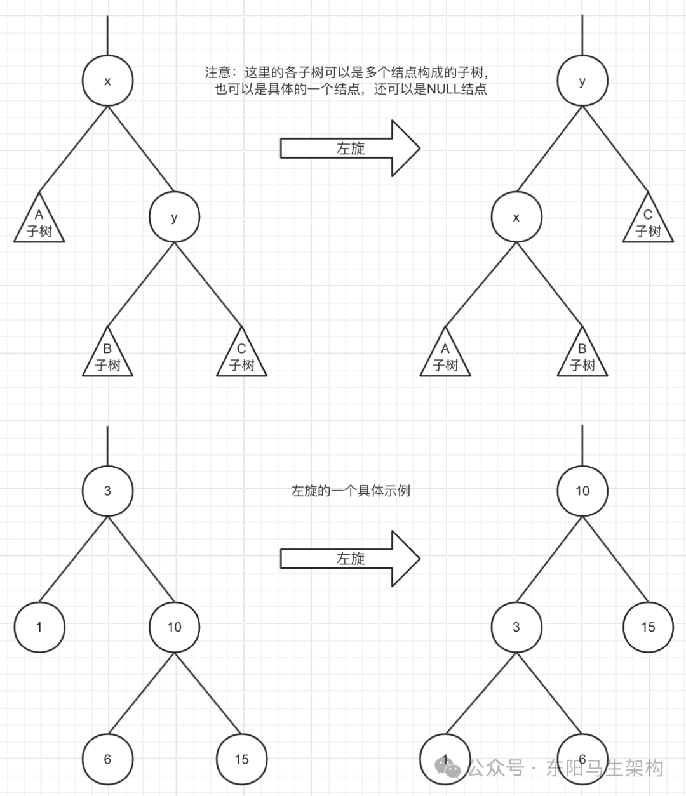

#### 二.右旋

右旋是将x的左子树绕x顺时针旋转，使得x的左子树成为x的父亲，同时注意修改相关结点的引用。旋转之后，要求二叉查找树的属性依然满足。

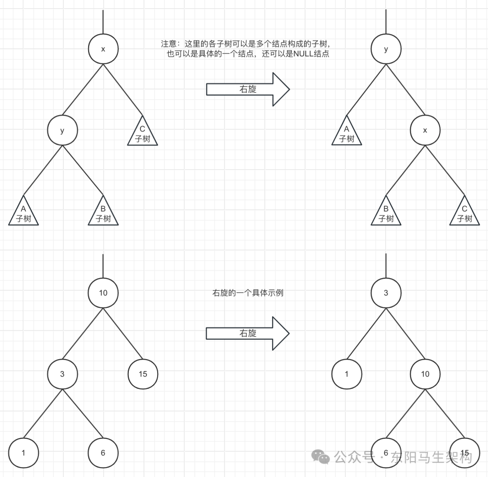

## 3.红黑树之添加结点的方法

### (1)添加操作的步骤

### (2)添加结点后可能面临的情况及处理措施

### (3)插入结点面临的几种情况以及处理措施总结

### (4)插入结点的处理思路总结

### (1)添加操作的步骤

#### 一.首先将红黑树当成一颗二叉查找树将结点插入

#### 二.然后将结点着为红色

#### 三.最后通过旋转和重新着色使之重新成为红黑树

### (2)添加结点后可能面临的情况及处理措施

情况一：新插入的结点为根结点

将新插入的结点变成黑色，从而满足根结点为黑色的要求。

情况二：新插入结点的父结点为黑色

这时候不需要进行任何调整操作，此时的二叉查找树仍然是一颗标准的红黑树。

情况三：新插入结点的父结点为红色，叔结点也为红色(不用考虑左右)

此时需要将叔结点和父结点改为黑色，爷结点改为红色。然后将爷结点当作插入结点看待，一直进行上面的操作，直到当前结点是根结点为止，然后将根结点变成黑色。

比如在如下的红黑树中插入一个值为125的结点：

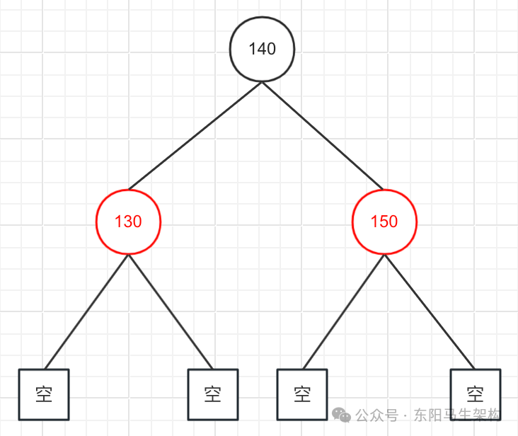

于是125结点和130结点都是红色的，这显然违背了规则4：

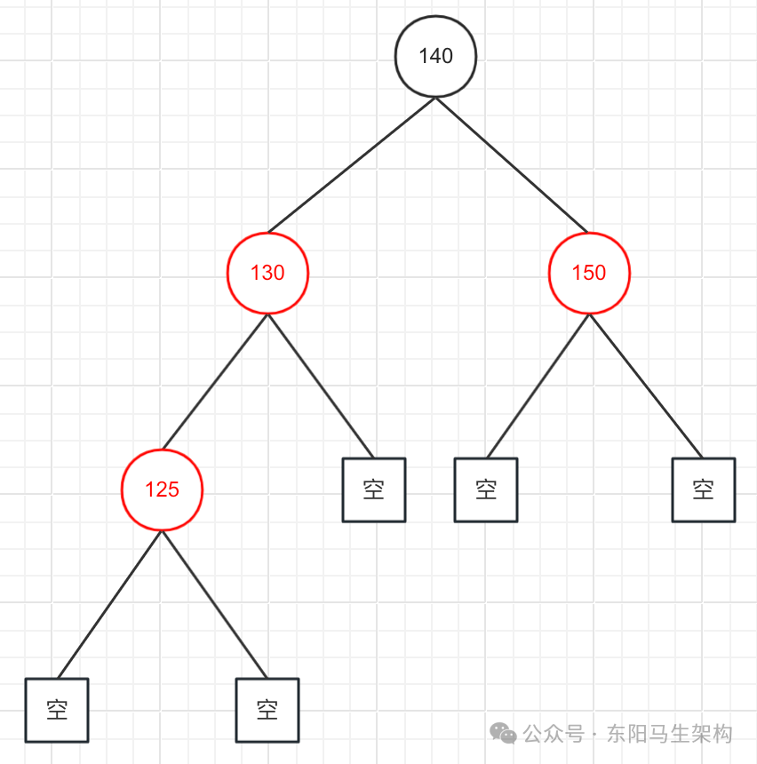

所以将新插入结点的父结点130和插入结点的叔结点150变成黑色，并将新插入结点的爷结点140变成红色，如下图示：

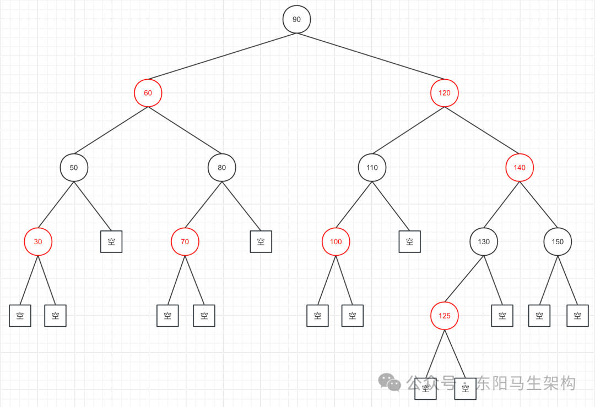

然后又将140结点当作新插入结点处理。因为140结点和新插入结点面临的情况都是一样的：和父结点都是红色。于是将140结点的父结点120和叔结点60变成黑色，爷结点90变成红色。因为爷结点90是根结点，要满足根结点是黑色的性质。所以又将140的爷结点90，也就是根结点变成黑色，如下图示：

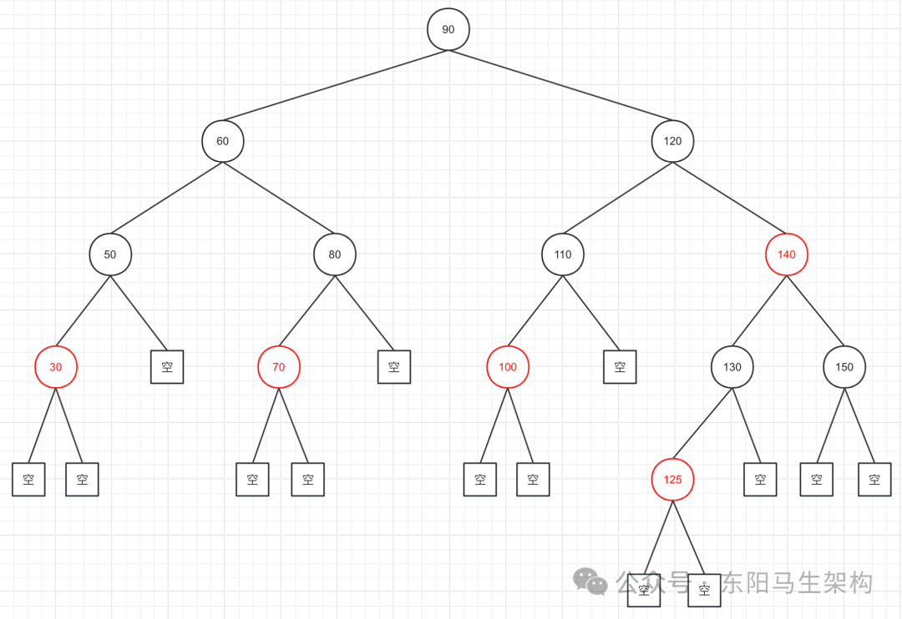

至此，为新插入结点125所做的旋转和重新着色的操作就完成了，现在该树已经成为标准的红黑树了。

情况四：新插入结点的父结点为红色，叔结点为黑色

#### 一.父结点为爷结点的左孩子，新插入结点为父结点的左孩子(LL)

#### 二.父结点为爷结点的右孩子，新插入结点为父结点的右孩子(RR)

上述两种情况都是同一个处理办法。比如新插入结点为25，其父结点30为红色，其叔结点为空的黑色叶结点，而且新插入结点和其父结点都是左孩子(右孩子)，如下图示：

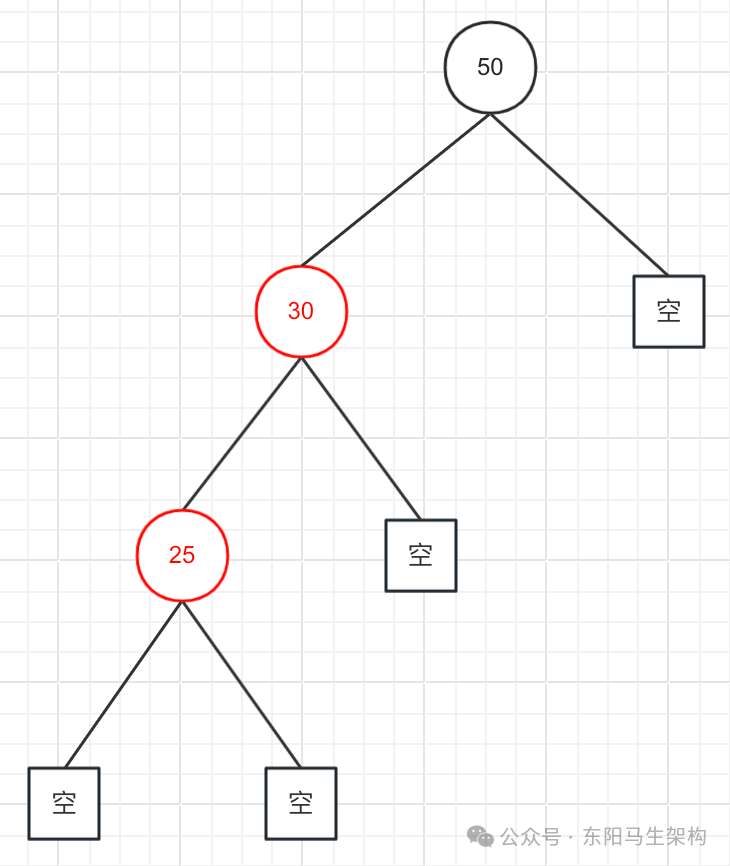

于是将其父结点和爷结点颜色互换，然后对爷结点进行一次右旋(左旋)，这样这颗树就完全满足红黑树的5个性质了。

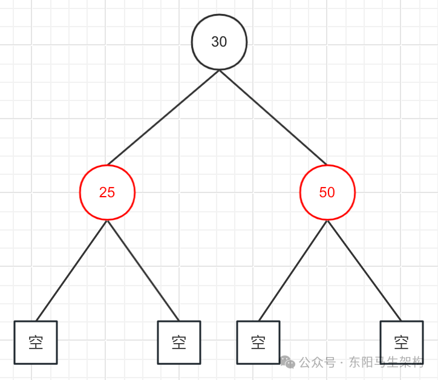

情况五：新插入结点的父结点是红色，叔结点是黑色

#### 一.新插入结点是父结点的右孩子，父结点是爷结点的左孩子(LR)

#### 二.新插入结点是父结点的左孩子，父结点是爷结点的右孩子(RL)

上述两种情况都是同一个处理办法。比如新插入结点126，其父结点125为红色，其叔结点为空的黑色叶结点。而且新插入结点是父结点的右孩子，父结点是爷结点的左孩子。

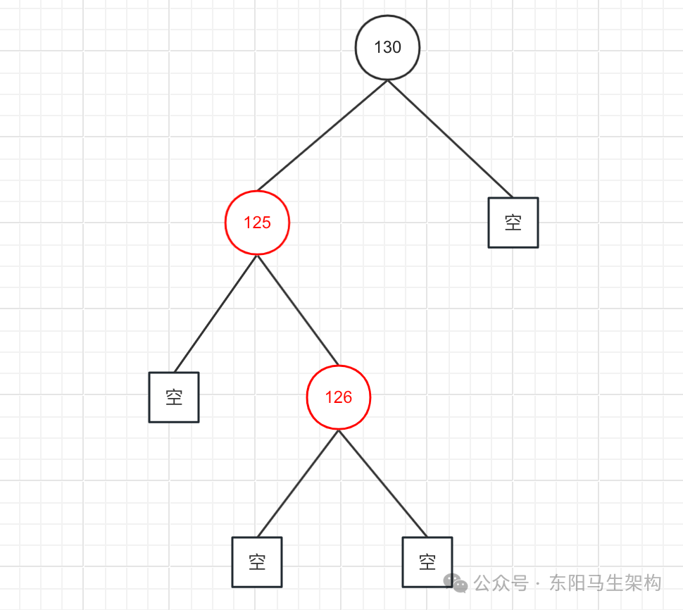

于是将父结点125看作是当前结点进行左旋，旋转结果如下：

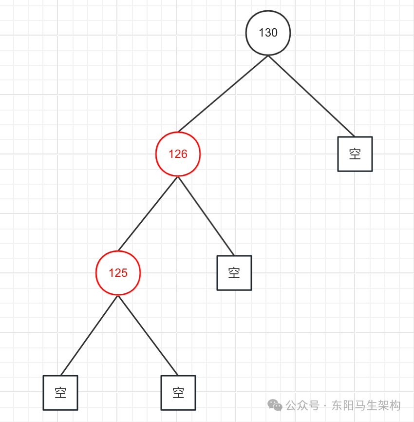

现在的当前结点是125，结点125的处境和上面的情况四是一样的。即父结点为红，叔结点为黑，插入结点为左孩子，父结点也为左孩子。于是继续按照情况四来处理上述情况：也就是将父结点和爷结点互换颜色，然后对爷结点进行右旋，如下所示：此时这棵树就是一颗标准的红黑树了。

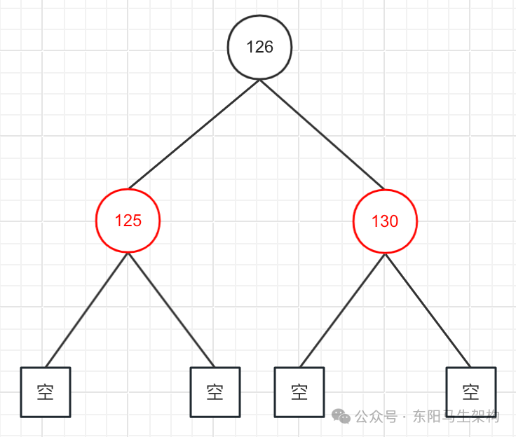

### (3)插入结点面临的几种情况以及处理措施总结

#### 一.插入的结点为根结点

直接将插入的结点变成黑色。

#### 二.父结点为黑色结点

此时不需要任何操作。

#### 三.父结点为红色，叔结点为红色

将叔结点和父结点改为黑色，爷结点改为红色。然后又将爷结点当作插入结点看待，一直进行上面操作。直到当前结点为根结点，然后将根结点变成黑色。

#### 四.父结点为红色，叔结点为黑色

情况一：父结点为左，插入结点为左 || 父结点为右，插入结点为右

将父结点和爷结点的颜色互换，然后对爷结点进行一次右旋(左旋)。

情况二：父结点为左，插入结点为右 || 父结点为右，插入结点为左

首先对父结点进行左旋(右旋)，左旋(右旋)后的情况必定是情况一，于是便可以按照情况一来进行处理。

### (4)插入结点的处理思路总结

结点的修正从当前插入结点的位置开始，将当前结点这棵小树(爷结点以下)调整平衡后，继续往上调整，直到平衡。

父结点和叔结点都为红色，就直接把这两个结点全部设置为黑色。然后把爷结点设置为红色，这就相当于把不平衡的问题交给了爷结点。如果爷结点因为这个变化导致不平衡，那么重复这个过程继续进行调整。

父结点为红色，叔结点为黑色，如果当前结点和父结点左右长度不一致。则旋转父结点使其变为一致，之后再旋转爷结点。

## 4.红黑树之删除结点的方法一

### (1)删除结点的过程原理

### (2)删除结点没有孩子且是黑色的4种情况

### (3)红黑树代码参考

### (1)删除结点的过程原理

首先按照二叉查找树的删除结点的方法进行删除。

#### 一.假设删除结点有两个孩子

那么根据二叉查找树的删除结点的方法，要找删除结点的中序后继填补，也就是需要找删除结点的右子树中最小的结点和删除结点进行位置交换。然后删除交换位置后，在原来中序后继结点位置的删除结点。由于原来的中序后继结点最多只有一个孩子，于是就将删除结点有两孩子转换为没有孩子或者只有一个孩子的情况了。

#### 二.假设删除结点只有一个孩子

由于删除结点还有一个空的黑色叶结点，所以其唯一孩子结点必然是红色。于是按照二叉查找树的删除方法，用红色的孩子结点替换删除结点即可。

#### 三.假设删除结点没有孩子

如果删除结点是红色，可以直接删除，无须调整。如果删除结点是黑色，那么有4种不同的情况。

### (2)删除结点没有孩子且是黑色的4种情况

假设删除结点为y，经过二叉查找树的删除方法删除结点之后，会使用结点x来替换结点y(如果y是叶结点，那么x是黑色的空叶结点)。删除y结点后将导致先前包含结点y的任何路径上的黑结点数量减1，因此结点y的任何祖先都不再满足红黑树的性质五。

修正办法就是将替换y的结点x视为还有额外一重黑色，定义为双黑结点。也就是说，如果将任何包含结点x的路径上的黑结点数量加1。在此假设下，性质五得到了满足，但是会多出了一个双黑结点，破坏了性质一。于是，删除操作便可以转化为将双黑结点恢复为普通结点的操作。

情况一：x的兄弟结点w是红色的

由于结点w是红色，所以结点w的父结点和孩子结点必然是黑色的。于是交换结点w和结点x的父结点x.p的颜色，然后对x.p做一次左旋，这次左旋不会破坏红黑树的任何规则。

如下图示，x的新兄弟结点是旋转之前w的某个孩子结点，其颜色为黑色，这样就将情况一转换为情况二、情况三或情况四了。

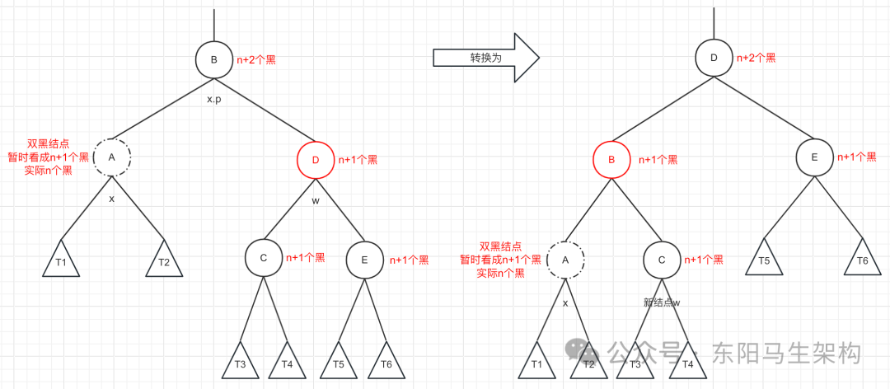

关于上图的补充说明：假设从结点A出发到叶结点的普通路径有n个黑色结点(包含出发结点)，那么从黑色结点B出发到叶结点的普通路径就应该有n + 2个黑色结点，于是从红色结点D出发到叶结点的普通路径就应该有n + 1个黑色结点，于是从黑色结点C出发到叶结点的普通路径就应该有n + 1个黑色结点，于是从黑色结点E出发到叶结点的普通路径就应该有n + 1个黑色结点。

情况二：x的兄弟结点w是黑色的，w的右孩子是红色，w的左孩子可红可黑

由于x的兄弟结点w的右孩子是红色，即红结点是其爷结点的右孩子的右孩子。所以交换x的兄弟结点w和x的父结点x.p的颜色，然后把w的右孩子着为黑色，并对x的父结点x.p做一次左旋，最后就可以将x恢复为普通的黑色结点。此时红黑树的性质不会再收到破坏了，其中x的父结点x.p是黑还是红不影响。


情况三：x的兄弟结点w是黑色的，w的右孩子是黑色，w的左孩子是红色

由于x的兄弟结点w的左孩子是红色，即红结点是其爷结点的右孩子的左孩子。所以交换x的兄弟结点w和其左孩子的颜色，然后对x的兄弟结点w做一次右旋。这样情况三就转换为情况二了，此时x的父结点x.p是黑还是红不影响。

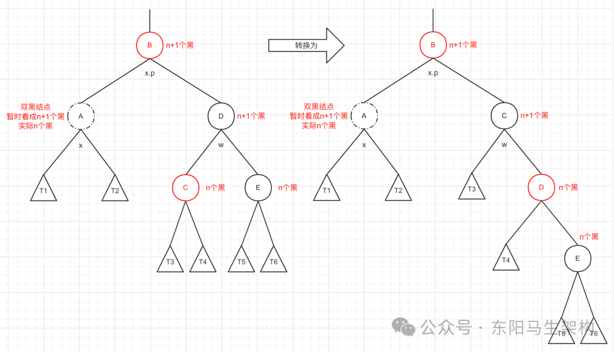

情况四：x的兄弟结点w是黑色的，w的右孩子是黑色，w的左孩子也是黑色

因为w也是黑色的，所以可以将x和其兄弟结点w上去掉一重黑色，从而使得x只有一重黑色，而其兄弟结点w则变成红色。

为了补偿从x和w中去掉的一重黑色，可以把x的父结点x.p额外着一层黑色，从而保持局部的黑高不变。

如果x.p的颜色是红色，此时将x.p着为黑色即可。如果x.p的颜色是黑色，那么则将x.p作为新结点x(x上升一层)来继续循环处理。

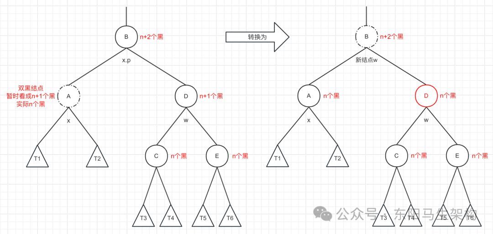

总结：

情况一：x的兄弟结点w是红色的

情况二：x的兄弟结点w是黑色的，w的右孩子是红色，w的左孩子可红可黑

情况三：x的兄弟结点w是黑色的，w的右孩子是黑色，w的左孩子是红色

情况四：x的兄弟结点w是黑色的，w的右孩子是黑色，w的左孩子也是黑色

### (3)红黑树代码参考

```typescript
public class RBTree<T extends Comparable<T>> {
    private RBTNode<T> root;//根结点
    private static final boolean RED = false;
    private static final boolean BLACK = true;

    public class RBTNode<T extends Comparable<T>> {
        boolean color;//颜色
        T key;//关键字(键值)
        RBTNode<T> left;//左孩子
        RBTNode<T> right;//右孩子
        RBTNode<T> parent;//父结点

        public RBTNode(T key, boolean color, RBTNode<T> parent, RBTNode<T> left, RBTNode<T> right) {
            this.key = key;
            this.color = color;
            this.parent = parent;
            this.left = left;
            this.right = right;
        }
        public T getKey() {
            return key;
        }
        @Override
        public String toString() {
            return "" + key + (this.color == RED ? "(红)" : "(黑)");
        }
    }
    public RBTree() {
        root = null;
    }

    //新建结点(key)，并将其插入到红黑树中，参数key是插入结点的键值
    public void insert(T key) {
        RBTNode<T> node = new RBTNode<T>(key, BLACK,null,null,null);
        //如果新建结点失败，则返回
        if (node != null) {
            insert(node);
        }
    }

    //将结点插入到红黑树中，参数node就是插入的结点
    private void insert(RBTNode<T> node) {
        int cmp;
        RBTNode<T> y = null;
        RBTNode<T> x = this.root;

        //1.将红黑树当作一颗二叉查找树，将结点添加到二叉查找树中
        while (x != null) {
            y = x;
            cmp = node.key.compareTo(x.key);
            if (cmp < 0) {
                x = x.left;
            } else {
                x = x.right;
            }
        }
        node.parent = y;
        if (y != null) {
            cmp = node.key.compareTo(y.key);
            if (cmp < 0) {
                y.left = node;
            } else {
                y.right = node;
            }
        } else {
            this.root = node;
        }
        //2.设置结点的颜色为红色
        node.color = RED;
        //3.将它重新修正为一颗红黑树
        insertFixUp(node);
    }

    //红黑树插入修正函数：在向红黑树中插入结点之后(失去平衡)再调用该函数，目的是将它重新塑造成一颗红黑树
    //参数node表示的是插入的结点
    private void insertFixUp(RBTNode<T> node) {
        RBTNode<T> parent, grandpa;//父结点、爷结点
        //若父结点存在，并且父结点的颜色是红色
        while (((parent = parentOf(node)) != null) && isRed(parent)) {
            //获取爷结点
            grandpa = parentOf(parent);
            //若父结点是爷结点的左孩子
            if (parent == grandpa.left) {
                //情形一：叔结点是红色
                RBTNode<T> uncle = grandpa.right;
                if ((uncle != null) && isRed(uncle)) {
                    //交换颜色
                    setBlack(uncle);
                    setBlack(parent);
                    setRed(grandpa);
                    node = grandpa;
                    continue;
                }
                //情形二：叔结点是黑色，且当前结点是右孩子
                if (parent.right == node) {
                    RBTNode<T> tmp;
                    //父结点左旋
                    leftRotate(parent);
                    tmp = parent;
                    parent = node;
                    node = tmp;
                }
                //情形三：叔结点是黑色，且当前结点是左孩子
                setBlack(parent);
                setRed(grandpa);
                //爷结点右旋
                rightRotate(grandpa);
            }
            //若父结点是爷结点的右孩子
            else {
                //情形一：叔结点是红色
                RBTNode<T> uncle = grandpa.left;
                if ((uncle != null) && isRed(uncle)) {
                    //交换颜色
                    setBlack(uncle);
                    setBlack(parent);
                    setRed(grandpa);
                    node = grandpa;
                    continue;
                }
                //情形二：叔结点是黑色，且当前结点是左孩子
                if (parent.left == node) {
                    RBTNode<T> tmp;
                    //父结点右旋
                    rightRotate(parent);
                    tmp = parent;
                    parent = node;
                    node = tmp;
                }
                //情形三：叔结点是黑色，且当前结点是右孩子
                setBlack(parent);
                setRed(grandpa);
                //爷结点左旋
                leftRotate(grandpa);
            }
        }
        //将根结点设为黑色
        setBlack(this.root);
    }

    //对红黑树的结点(x)进行左旋转
    // 左旋示意图(对结点x进行左旋)：
    //      px                             px
    //     /                              /
    //    x                              y
    //   / \      --(左旋)--             / \
    //  lx  y                          x   ry
    //     / \                        / \
    //    ly  ry                     lx ly
    private void leftRotate(RBTNode<T> x) {
        //设置x的右孩子为y
        RBTNode<T> y = x.right;

        //将y的左孩子设为x的右孩子
        //如果y的左孩子非空，将x设为y的左孩子的父亲
        x.right = y.left;
        if (y.left != null) {
            y.left.parent = x;
        }

        //将x的父亲设为y的父亲
        y.parent = x.parent;

        if (x.parent == null) {
            //如果x的父亲是空结点，则将y设为根结点
            this.root = y;
        } else {
            if (x.parent.left == x) {
                //如果x是它父结点的左孩子，则将y设为x的父结点的左孩子
                x.parent.left = y;
            } else {
                //如果x是它父结点的左孩子，则将y设为x的父结点的左孩子
                x.parent.right = y;
            }
        }

        //将x设为y的左孩子
        y.left = x;
        //将x的父结点设为y
        x.parent = y;
    }

    //对红黑树的结点(y)进行右旋转
    //右旋示意图(对结点y进行左旋)：
    //            py                             py
    //           /                               /
    //          y                               x
    //         / \       --(右旋)--            /  \
    //        x   ry                         lx   y
    //       / \                                 / \
    //      lx rx                              rx  ry
    private void rightRotate(RBTNode<T> y) {
        //设置x是当前结点的左孩子
        RBTNode<T> x = y.left;

        //将x的右孩子设为y的左孩子
        //如果x的右孩子不为空的话，将y设为x的右孩子的父亲
        y.left = x.right;
        if (x.right != null) {
            x.right.parent = y;
        }

        //将y的父亲设为x的父亲
        x.parent = y.parent;

        if (y.parent == null) {
            //如果y的父亲是空结点，则将x设为根结点
            this.root = x;
        } else {
            if (y == y.parent.right) {
                //如果y是它父结点的右孩子，则将x设为y的父结点的右孩子
                y.parent.right = x;
            } else {
                //y是它父结点的左孩子，将x设为x的父结点的左孩子
                y.parent.left = x;
            }
        }

        //将y设为x的右孩子
        x.right = y;
        //将y的父结点设为x
        y.parent = x;
    }

    //删除值为key的结点，并返回被删除的结点
    public void remove(T key) {
        RBTNode<T> node;
        if ((node = search(root, key)) != null) {
            remove(node);
        }
    }

    //删除结点(node)，并返回被删除的结点
    private void remove(RBTNode<T> node) {
        RBTNode<T> child, parent;
        boolean color;

        //被删除结点的左右孩子都不为空
        if ((node.left != null) && (node.right != null)) {
            //被删结点的后继结点称为取代结点
            //用它来取代被删结点的位置，然后再将被删结点去掉
            RBTNode<T> replace = node;

            //获取后继结点
            replace = replace.right;
            while (replace.left != null) {
                replace = replace.left;
            }

            //node结点不是根结点(只有根结点不存在父结点)
            if (parentOf(node) != null) {
                if (parentOf(node).left == node) {
                    parentOf(node).left = replace;
                } else {
                    parentOf(node).right = replace;
                }
            } else {
                //node结点是根结点，更新根结点
                this.root = replace;
            }

            //child是取代结点的右孩子，也是需要调整的结点
            //取代结点肯定不存在左孩子，因为它是一个后继结点
            child = replace.right;
            parent = parentOf(replace);
            //保存取代结点的颜色
            color = colorOf(replace);

            //被删除结点是它的后继结点的父结点
            if (parent == node) {
                parent = replace;
            } else {
                //child不为空
                if (child != null) {
                    setParent(child, parent);
                }
                parent.left = child;
                replace.right = node.right;
                setParent(node.right, replace);
            }

            replace.parent = node.parent;
            replace.color = node.color;
            replace.left = node.left;
            node.left.parent = replace;

            if (color == BLACK) {
                removeFixUp(child, parent);
            }
            node = null;
            return ;
        }

        if (node.left != null) {
            child = node.left;
        } else {
            child = node.right;
        }

        parent = node.parent;
        //保存取代结点的颜色
        color = node.color;

        if (child != null) {
            child.parent = parent;
        }

        //node结点不是根结点
        if (parent != null) {
            if (parent.left == node) {
                parent.left = child;
            } else {
                parent.right = child;
            }
        } else {
            this.root = child;
        }

        if (color == BLACK) {
            removeFixUp(child, parent);
        }
        node = null;
    }

    //红黑树删除修正函数：在从红黑树中删除插入结点之后(红黑树失去平衡)再调用该函数，目的是将它重新塑造成一颗红黑树
    //参数node就是待修正的结点
    private void removeFixUp(RBTNode<T> node, RBTNode<T> parent) {
        RBTNode<T> other;
        while ((node == null || isBlack(node)) && (node != this.root)) {
            if (parent.left == node) {
                other = parent.right;
                if (isRed(other)) {
                    //情形一: x的兄弟w是红色的
                    setBlack(other);
                    setRed(parent);
                    leftRotate(parent);
                    other = parent.right;
                }

                if ((other.left==null || isBlack(other.left)) && (other.right==null || isBlack(other.right))) {
                    //情形二: x的兄弟w是黑色，且w的俩个孩子也都是黑色的
                    setRed(other);
                    node = parent;
                    parent = parentOf(node);
                } else {
                    if (other.right==null || isBlack(other.right)) {
                        //情形三: x的兄弟w是黑色的，并且w的左孩子是红色，右孩子为黑色
                        setBlack(other.left);
                        setRed(other);
                        rightRotate(other);
                        other = parent.right;
                    }
                    //情形四: x的兄弟w是黑色的；并且w的右孩子是红色的，左孩子任意颜色
                    setColor(other, colorOf(parent));
                    setBlack(parent);
                    setBlack(other.right);
                    leftRotate(parent);
                    node = this.root;
                    break;
                }
            } else {
                other = parent.left;
                if (isRed(other)) {
                    //情形一: x的兄弟w是红色的
                    setBlack(other);
                    setRed(parent);
                    rightRotate(parent);
                    other = parent.left;
                }

                if ((other.left==null || isBlack(other.left)) && (other.right==null || isBlack(other.right))) {
                    //情形二: x的兄弟w是黑色，且w的俩个孩子也都是黑色的
                    setRed(other);
                    node = parent;
                    parent = parentOf(node);
                } else {
                    if (other.left==null || isBlack(other.left)) {
                        //情形三: x的兄弟w是黑色的，并且w的左孩子是红色，右孩子为黑色
                        setBlack(other.right);
                        setRed(other);
                        leftRotate(other);
                        other = parent.left;
                    }
                    //情形四: x的兄弟w是黑色的；并且w的右孩子是红色的，左孩子任意颜色
                    setColor(other, colorOf(parent));
                    setBlack(parent);
                    setBlack(other.left);
                    rightRotate(parent);
                    node = this.root;
                    break;
                }
            }
        }
        if (node != null) {
            setBlack(node);
        }
    }

    //清空红黑树
    public void clear() {
        destroy(root);
        root = null;
    }

    //销毁红黑树
    private void destroy(RBTNode<T> tree) {
        if (tree == null) {
            return ;
        }
        if (tree.left != null) {
            destroy(tree.left);
        }
        if (tree.right != null) {
            destroy(tree.right);
        }
        tree = null;
    }

    //打印整棵红黑树
    public void print() {
        if (root != null) {
            print(root, root.key, 0);
        }
    }

    //打印红黑树
    //key        -- 结点的键值
    //direction  --  0，表示该结点是根结点
    //              -1，表示该结点是它的父结点的左孩子
    //               1，表示该结点是它的父结点的右孩子
    private void print(RBTNode<T> tree, T key, int direction) {
        if (tree != null) {
            if (direction == 0) {
                //tree是根结点
                System.out.printf("%2d(B) is root\n", tree.key);
            } else {
                //tree是分支结点
                System.out.printf("%2d(%s) is %2d's %6s child\n", tree.key, isRed(tree)?"R":"B", key, direction==1?"right" : "left");
            }
            print(tree.left, tree.key, -1);
            print(tree.right,tree.key,  1);
        }
    }

    //先序遍历红黑树
    private void preOrder(RBTNode<T> tree) {
        if (tree != null) {
            System.out.print(tree.key+" ");
            preOrder(tree.left);
            preOrder(tree.right);
        }
    }

    public void preOrder() {
        preOrder(root);
    }

    //中序遍历红黑树
    private void inOrder(RBTNode<T> tree) {
        if (tree != null) {
            inOrder(tree.left);
            System.out.print(tree.key+" ");
            inOrder(tree.right);
        }
    }

    public void inOrder() {
        inOrder(root);
    }

    //后序遍历红黑树
    private void postOrder(RBTNode<T> tree) {
        if (tree != null) {
            postOrder(tree.left);
            postOrder(tree.right);
            System.out.print(tree.key+" ");
        }
    }

    public void postOrder() {
        postOrder(root);
    }

    //查找整棵红黑树中键值为key的结点--递归实现
    public RBTNode<T> search(T key) {
        return search(root, key);
    }
    //查找给定红黑树x中键值为key的结点--递归实现
    private RBTNode<T> search(RBTNode<T> x, T key) {
        if (x == null) {
            return x;
        }

        int cmp = key.compareTo(x.key);
        if (cmp < 0) {
            return search(x.left, key);
        } else if (cmp > 0) {
            return search(x.right, key);
        } else {
            return x;
        }
    }

    //查找整棵红黑树中键值为key的结点--非递归实现
    public RBTNode<T> iterativeSearch(T key) {
        return iterativeSearch(root, key);
    }
    //查找给定红黑树x中键值为key的结点--非递归实现
    private RBTNode<T> iterativeSearch(RBTNode<T> x, T key) {
        while (x!=null) {
            int cmp = key.compareTo(x.key);
            if (cmp < 0) {
                x = x.left;
            } else if (cmp > 0) {
                x = x.right;
            } else {
                return x;
            }
        }
        return x;
    }

    //查找红黑树中的最小结点
    public T minimum() {
        RBTNode<T> p = minimum(root);
        if (p != null) {
            return p.key;
        }
        return null;
    }
    //查找最小结点：返回tree为根结点的红黑树的最小结点
    private RBTNode<T> minimum(RBTNode<T> tree) {
        if (tree == null) {
            return null;
        }
        while (tree.left != null) {
            tree = tree.left;
        }
        return tree;
    }

    //查找红黑树中的最大结点
    public T maximum() {
        RBTNode<T> p = maximum(root);
        if (p != null) {
            return p.key;
        }
        return null;
    }
    //查找最大结点：返回tree为根结点的红黑树的最大结点
    private RBTNode<T> maximum(RBTNode<T> tree) {
        if (tree == null) {
            return null;
        }
        while (tree.right != null) {
            tree = tree.right;
        }
        return tree;
    }

    //找结点(x)的后继结点，即查找：红黑树中数据值大于该结点的最小结点
    public RBTNode<T> successor(RBTNode<T> x) {
        //如果x存在右孩子，则x的后继结点为：以其右孩子为根的子树的最小结点
        if (x.right != null) {
            return minimum(x.right);
        }
        //如果x没有右孩子，则x有以下两种可能：
        //一.x是一个左孩子，则x的后继结点为，它的父结点
        //二.x是一个右孩子，则查找x的最低的父结点，并且该父结点要具有左孩子，找到的这个最低的父结点就是x的后继结点
        RBTNode<T> y = x.parent;
        while ((y!=null) && (x==y.right)) {
            x = y;
            y = y.parent;
        }
        return y;
    }

    //找结点(x)的前驱结点，即查找：红黑树中数据值小于该结点的最大结点
    public RBTNode<T> predecessor(RBTNode<T> x) {
        //如果x存在左孩子，则x的前驱结点为：以其左孩子为根的子树的最大结点
        if (x.left != null) {
            return maximum(x.left);
        }
        //如果x没有左孩子，则x有以下两种可能：
        //一.x是一个右孩子，则x的前驱结点为它的父结点
        //二.x是一个左孩子，则查找x的最低的父结点，并且该父结点要具有右孩子，找到的这个最低的父结点就是x的前驱结点
        RBTNode<T> y = x.parent;
        while ((y != null) && (x == y.left)) {
            x = y;
            y = y.parent;
        }
        return y;
    }

    //获取结点的父结点
    private RBTNode<T> parentOf(RBTNode<T> node) {
        return node != null ? node.parent : null;
    }
    //获取结点的颜色
    private boolean colorOf(RBTNode<T> node) {
        return node != null ? node.color : BLACK;
    }
    //判断结点是否为红色
    private boolean isRed(RBTNode<T> node) {
        return ((node != null) && (node.color == RED)) ? true : false;
    }
    //判断结点是否为黑色
    private boolean isBlack(RBTNode<T> node) {
        return !isRed(node);
    }
    //设置结点为黑色
    private void setBlack(RBTNode<T> node) {
        if (node!=null) {
            node.color = BLACK;
        }
    }
    //设置结点为红色
    private void setRed(RBTNode<T> node) {
        if (node!=null) {
            node.color = RED;
        }
    }
    //设置结点的父结点
    private void setParent(RBTNode<T> node, RBTNode<T> parent) {
        if (node != null) {
            node.parent = parent;
        }
    }
    //设置结点的颜色
    private void setColor(RBTNode<T> node, boolean color) {
        if (node != null) {
            node.color = color;
        }
    }
}
```

## 5.红黑树之删除结点的方法二

### (1)删除结点的过程原理

### (2)删除结点的情况

### (3)情况一：删除结点没有孩子

### (4)情况二：删除结点只有一个孩子结点

### (1)删除结点的过程原理

#### 一.如果删除结点没有孩子或有一个孩子

那么按接下来介绍的不同情况，不通过二叉查找树的删除来分别处理。

#### 二.如果删除结点有两个孩子

那么可先按照二叉查找树的删除，转换为只有一个孩子或没有孩子的情况。也就是将红黑树当作一个二叉查找树，将删除结点从二叉查找树种删除。具体来说就是先找到删除结点右子树中最小的结点，然后交换删除结点和右子树最小的结点的值，再对交换值之后的结点删除。根据二叉查找树左小右大，可得删除结点右子树最小结点最多只有一个孩子。于是便将删除结点有两个孩子的情况，转换为有一个孩子或没有孩子的情况。

### (2)删除结点的情况

根据删除结点的孩子个数可分为三种情况：

#### 一.删除结点没有孩子

#### 二.删除结点有一个孩子

#### 三.删除结点有两个孩子

注意：这里的空叶结点不算孩子

删除结点没有孩子的情况：

#### 一.删除结点为红色

#### 二.删除结点为黑色，其兄弟结点没有孩子

#### 三.删除结点为黑色，其兄弟结点有一个孩子，且该孩子和兄弟结点同边

#### 四.删除结点为黑色，其兄弟结点有一个孩子，且该孩子和兄弟结点不同边

#### 五.删除结点为黑色，其兄弟结点有两个孩子(必然同色)，且兄弟结点为黑色

#### 六.删除结点为黑色，其兄弟结点有两个孩子(必然同色)，且兄弟结点为红色

删除结点只有一个孩子的情况：

一.删除结点为黑色，其唯一的孩子结点为红色。必定是红色，要不然不符合红黑树的性质五。

二.删除结点为红色，其孩子结点只能为黑。红黑树中不存在这种情况，要不然无法满足红黑树性质五。

删除结点有两个孩子的情况：

找到删除结点的右子树中最左的结点，然后进行两两值交换，这样删除结点的情况就变成了上面两种情况中的一种了。

### (3)情况一：删除结点没有孩子

#### 一.删除结点为红色

因为删除的是红色结点，不会影响红黑树的性质五，所以可直接删除。如下图示，假设现在要删除的结点是130：

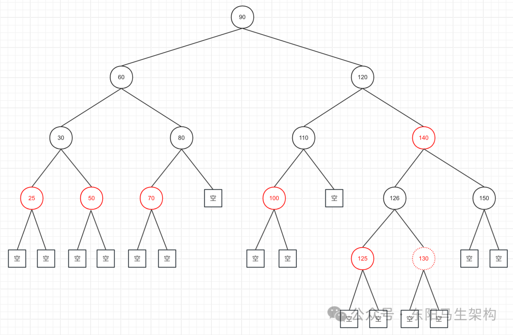

于是直接删除结点130，结果如下所示：

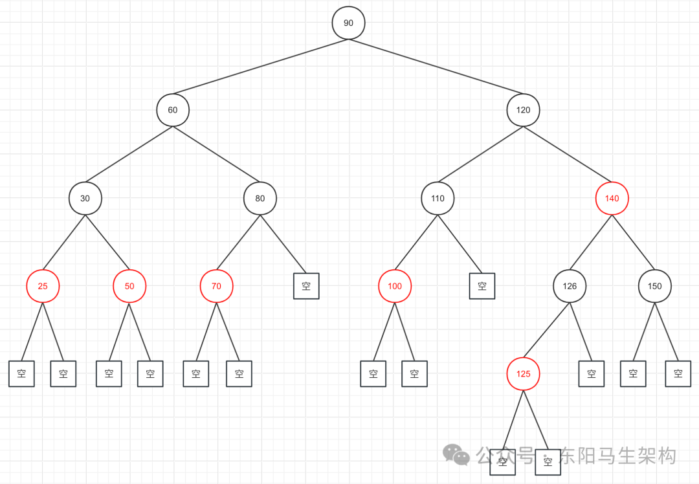

#### 二.删除结点为黑色，其兄弟结点没有孩子

这种情况下其兄弟结点也肯定是黑色，因为要满足红黑树的性质五。如下图示，假设现在要删除的结点是150：

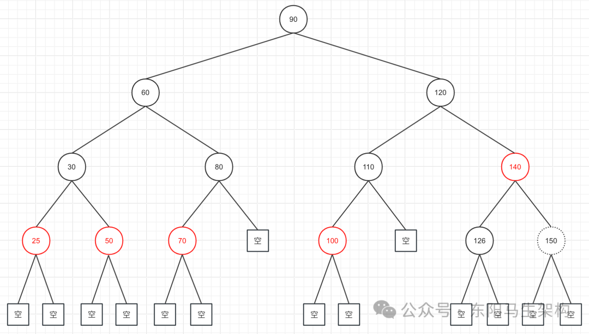

可以先删除结点150，然后将兄弟结点126变成红色，父亲结点140变成黑色，这样做的目的是为了满足红黑树的性质五。否则从根开始到最右边的叶子结点经过的黑色结点只有3个，而其他路径的黑色结点有4个，结果如下所示：

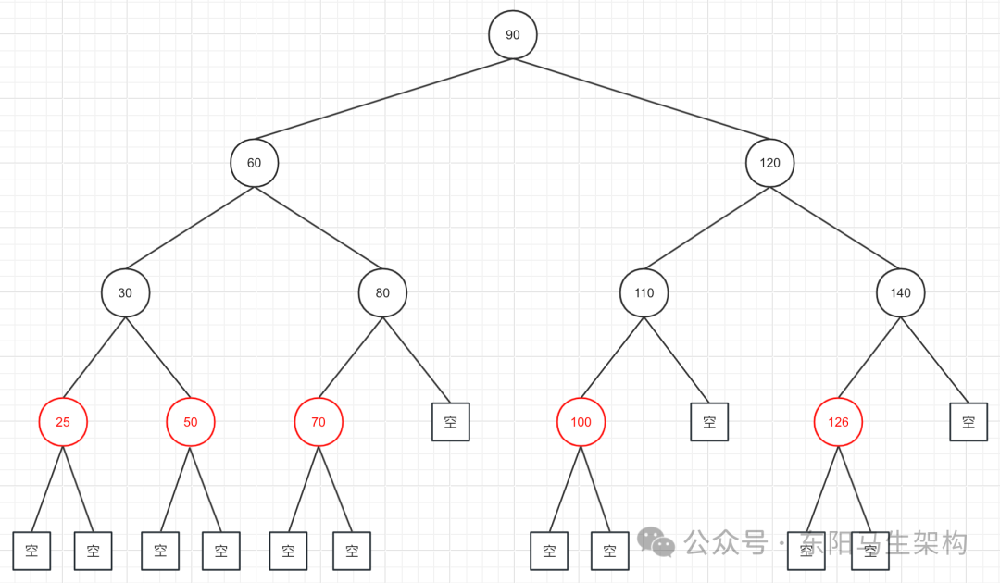

#### 三.删除结点为黑色，其兄弟结点有一个孩子，该孩子和兄弟结点同边

也就是兄弟结点和兄弟结点的孩子结点同为左子树或者同为右子树，根据红黑树的性质五，可以推导出其兄弟结点必然为黑色。否则父结点到删除结点的空叶结点与到兄弟结点的空叶结点的黑结点数不同，由于兄弟结点为黑色，所以兄弟结点的唯一孩子结点必然为红色。

如下图示，假设现在要删除结点110，其兄弟结点140只有一个孩子结点150，而且都是右子树。

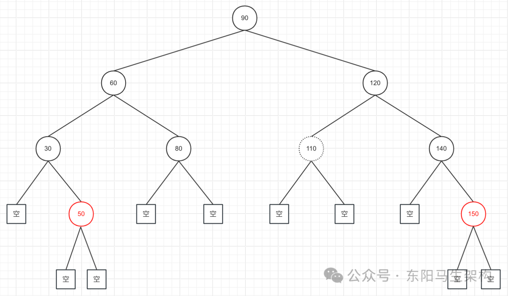

可先删除结点110。如果兄弟结点和兄弟结点的孩子都在右子树的话：对父亲结点进行左旋。如果兄弟结点和兄弟结点的孩子都在左子树的话：对父亲结点进行右旋。然后把兄弟结点的孩子结点150着为黑色，以满足红黑树的性质五。上图是都为右子树的情况，所以对父结点120进行左旋，结果如下：

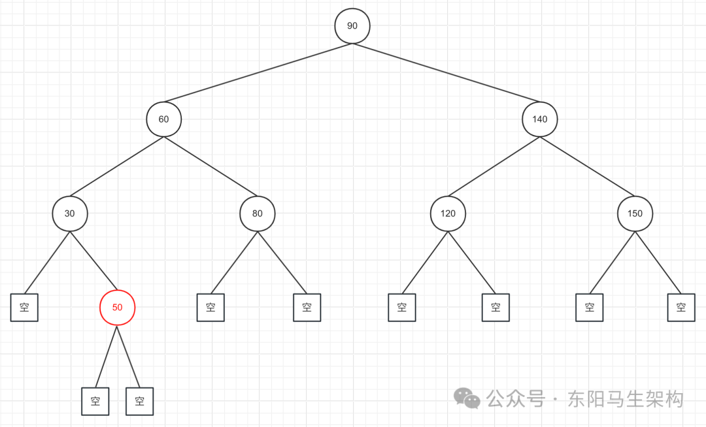

#### 四.删除结点为黑色，其兄弟结点有一个孩子，且该孩子和兄弟结点不同边

也就是兄弟结点和兄弟结点的孩子结点的位置是右左或者左右。根据红黑树的性质五，可以推导出其兄弟结点必然为黑色，否则父结点到删除结点的空叶结点与到兄弟结点的空叶结点的黑结点数不同。由于兄弟结点为黑色，所以兄弟结点的唯一孩子结点也必然为红色。

如下图示，假设现在要删除结点80。它的兄弟结点只有一个孩子，而且它的兄弟结点为左孩子，兄弟结点的孩子为右孩子。

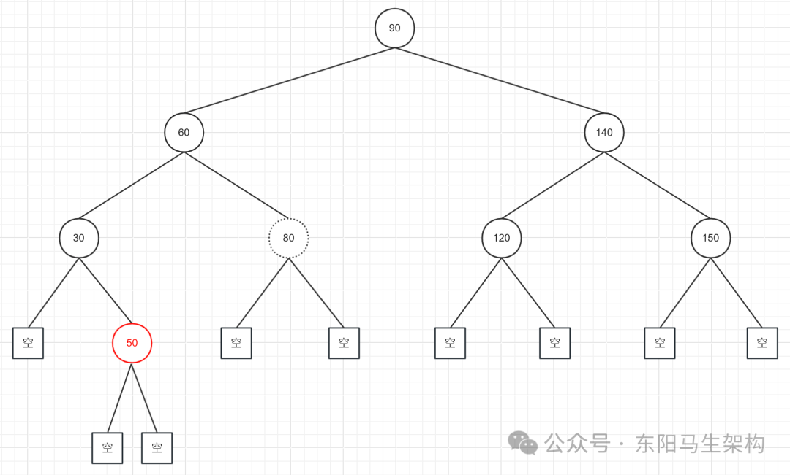

可先删除结点80，然后将兄弟结点和兄弟结点的孩子结点的颜色互换。如果兄弟结点是左子树，兄弟结点的孩子结点是右子树：则对兄弟结点左旋。如果兄弟结点是右子树，兄弟结点的孩子结点是左子树：则对兄弟结点右旋。上图的情况是进行左旋，也就是对兄弟结点30进行左旋，结果如下图示：

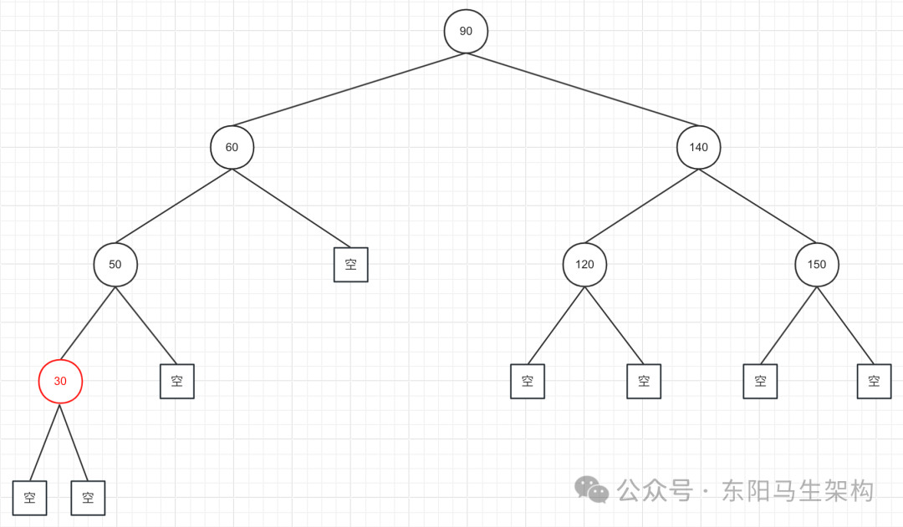

注意：现在还没有结束变换，我们发现变换后的红黑树和情况三很相似。兄弟结点50和兄弟结点50的子结点30处在同一边，于是按照情况三处理：如果兄弟结点和兄弟结点的孩子都是右子树，则对父结点进行左旋；如果兄弟结点和兄弟结点的孩子都是左子树，则对父结点进行右旋。然后把兄弟结点的孩子结点30着为黑色，以满足红黑树的性质五。上图的情况是都是左子树，所以对父结点60进行右旋，结果如下所示：

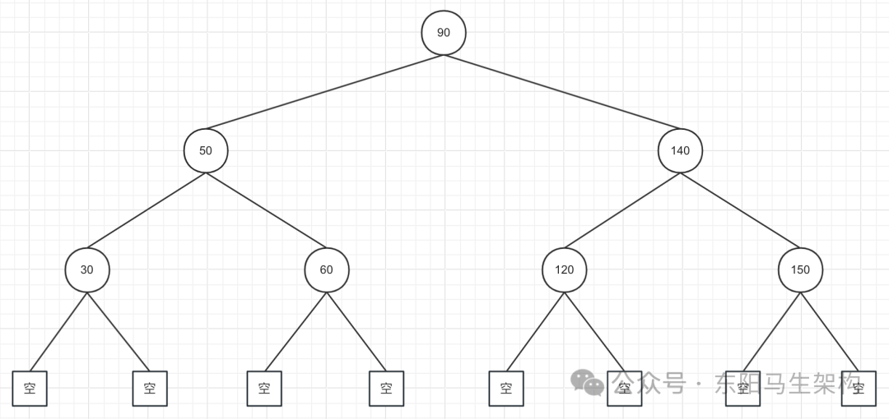

#### 五.删除结点为黑色，其兄弟结点有两个孩子(必然同色)，且兄弟结点为黑色

根据红黑树的性质五，可以推导出兄弟结点的两个孩子必然为红色。如下图示，假设现在要删除的结点是110。

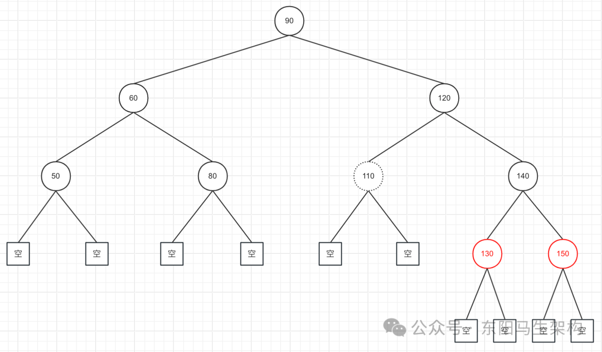

此时要对删除结点的父结点进行左旋(右旋)，兄弟结点的右(左)孩子着为黑色。

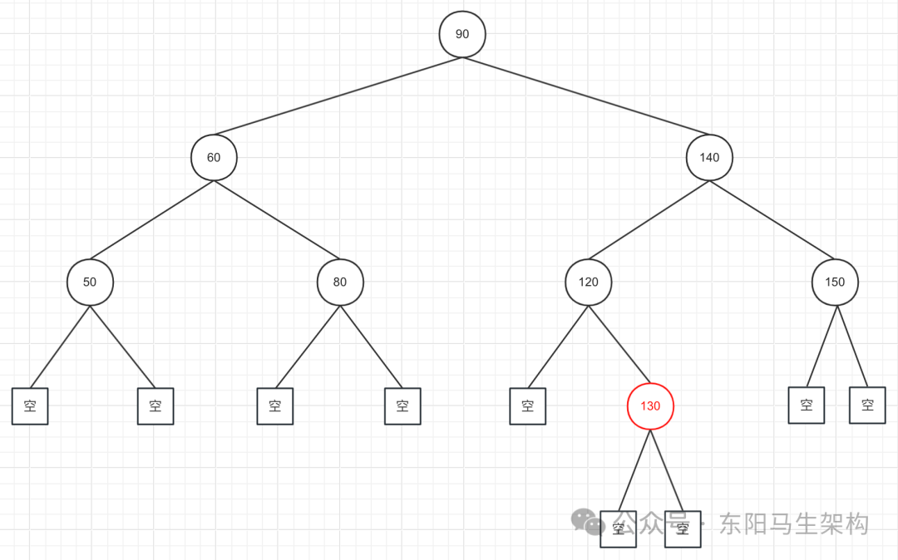

#### 六.删除结点为黑色，其兄弟结点有两个孩子(必然同色)，且兄弟结点为红色

根据红黑树的性质四或五，可以推导出兄弟结点的两个孩子必然为黑色，如下图示，假设现在要删除的结点是110。

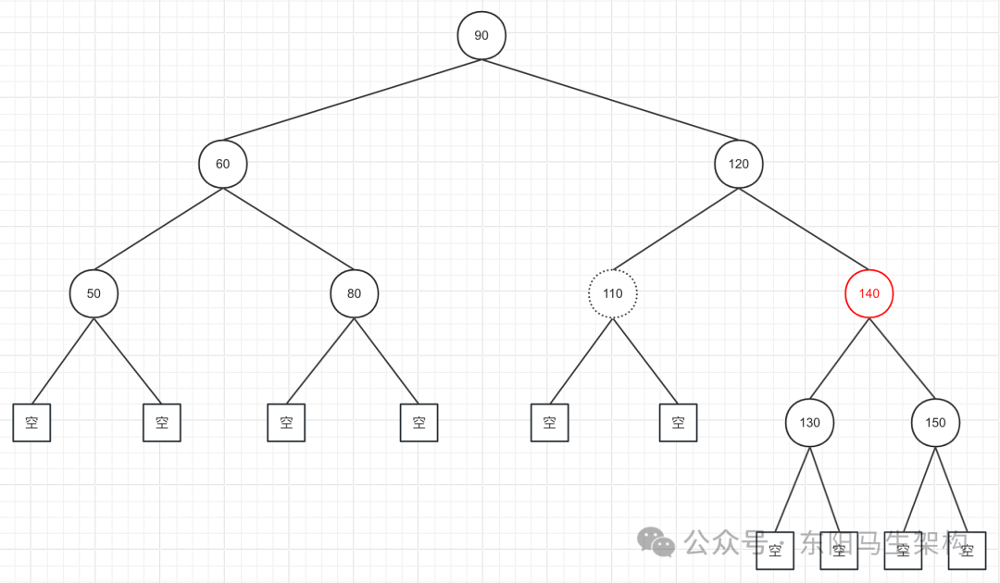

此时对删除结点的父结点进行左旋(右旋)，原兄弟结点的左(右)孩子着为红色。

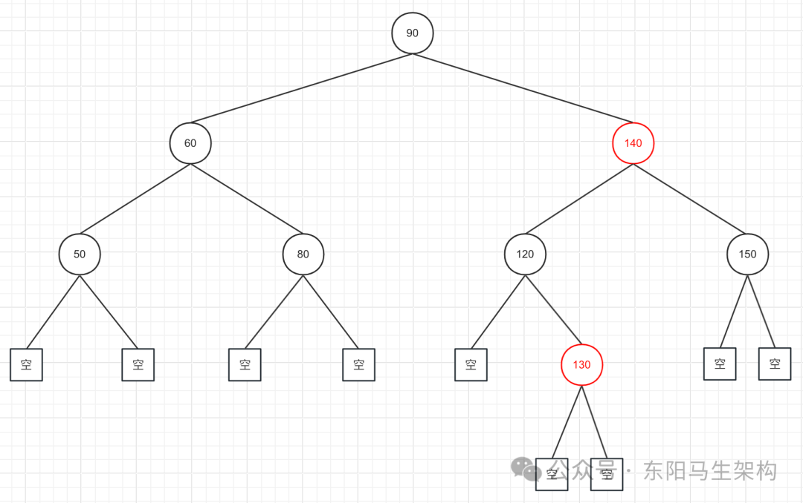

### (4)情况二：删除结点只有一个孩子结点

#### 一.删除结点为黑色，不管孩子结点是左孩子还是右孩子(必然为红色)

根据红黑树的性质五，由于删除结点为黑色，所以其孩子结点必然为红色。如下图示，假设现在要删除结点120，其唯一的孩子结点130为红色。

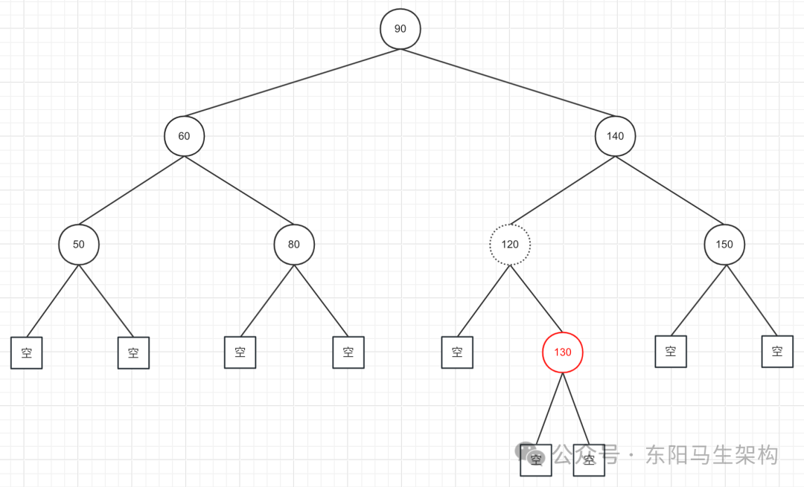

可先删除结点120，然后将孩子结点着为黑色，接着再将孩子结点放到被删除结点的位置。

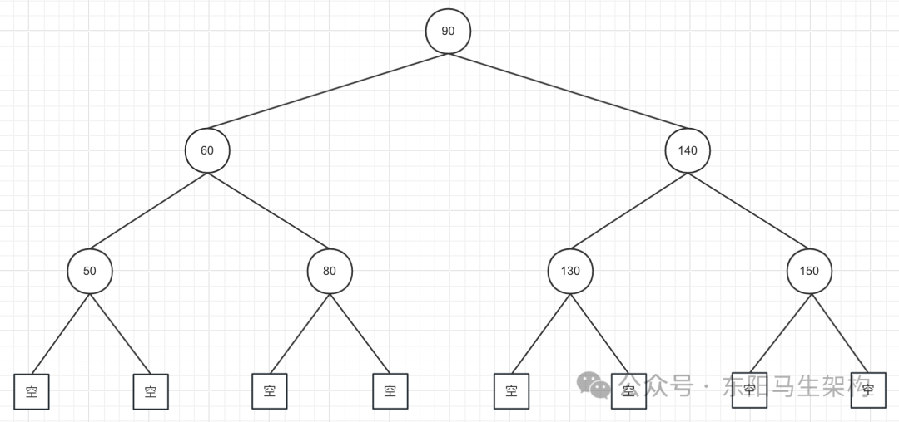

#### 二.删除结点为红色且有一个孩子结点的情况不存在

由于删除结点为红色，所以其孩子结点只能为黑色。于是删除结点只有一个红色孩子结点和一个黑色的孩子叶结点，这样就不能满足红黑树的性质五了，所以删除结点为红色且有一个孩子结点的情况不存在。

### (5)情况三：删除结点有两个孩子结点

如果删除结点有两个孩子，那么不能直接删除。而要先找到删除结点右子树中最小的结点，然后交换删除结点和右子树最小的结点的值，再进行删除。根据二叉查找树左小右大，可得删除结点右子树最小结点最多只有一个孩子。于是便将删除结点有两个孩子的情况，转换为有一个孩子或没有孩子的情况。

如下图示，假设现在要删除结点120。

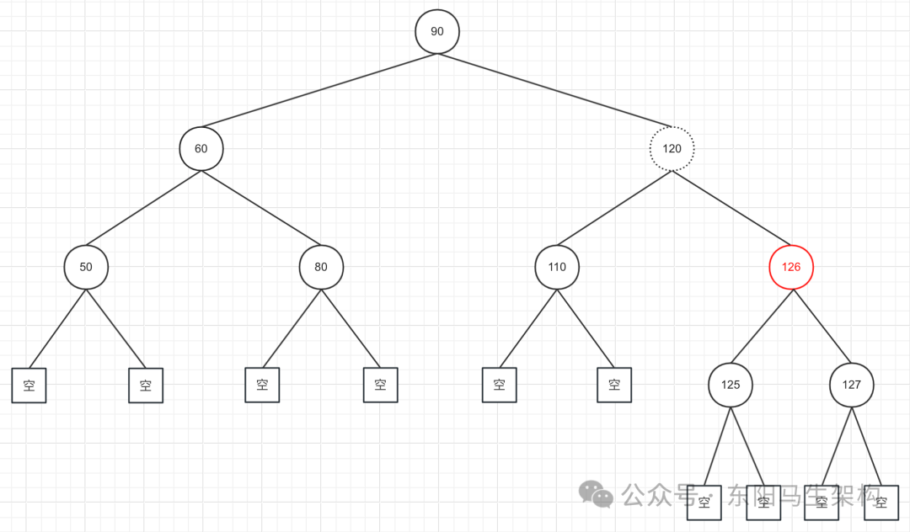

那么先找到结点120右子树中最左的结点125，然后交换120和125两者的值。

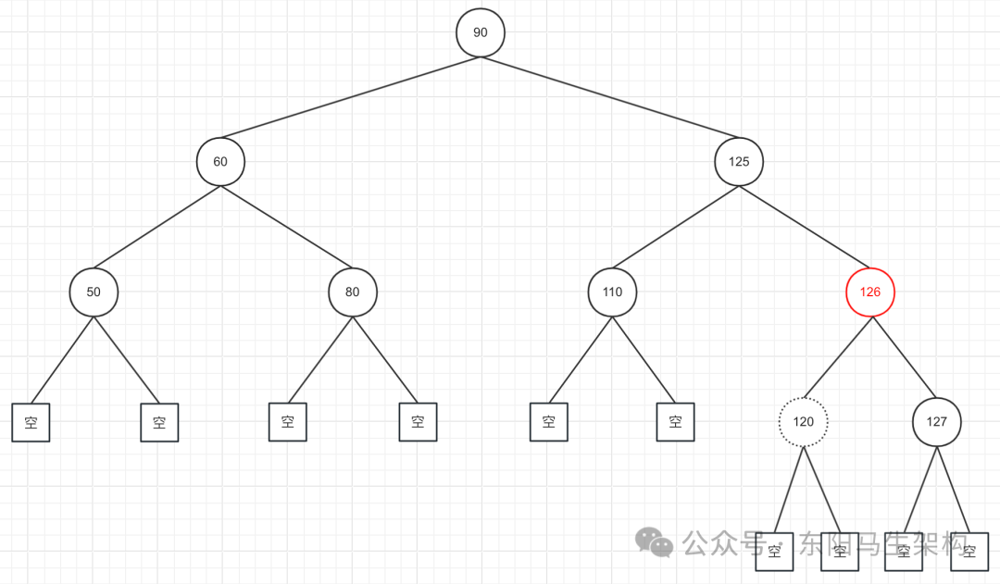

交换值之后，现在结点120仍然是要删除的结点。可发现删除结点120没有一个孩子，且其兄弟结点也没孩子，对应的情况为：删除结点为黑色，其兄弟结点没有孩子。于是将结点120的兄弟结点变红，父亲结点变黑。最后将结点120进行删除，结果如下图示：

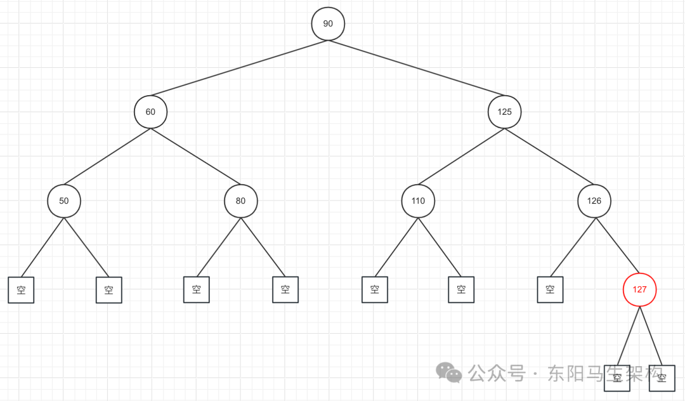
