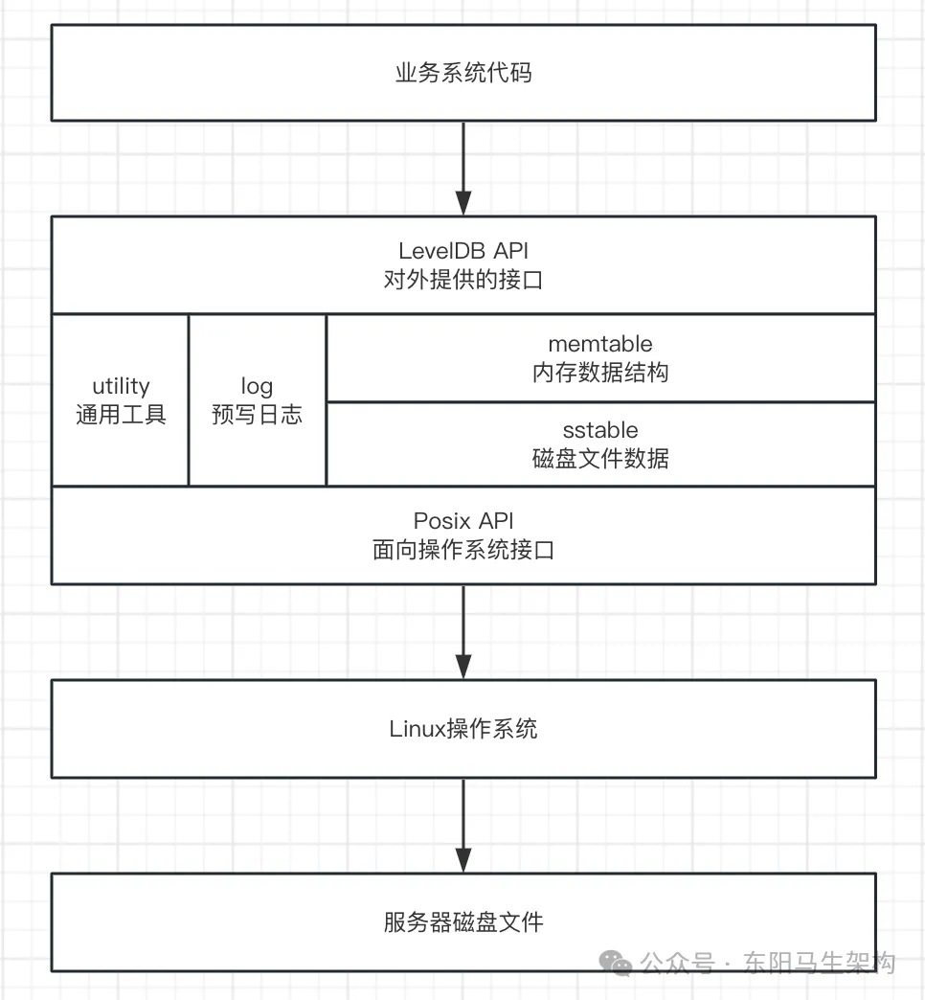
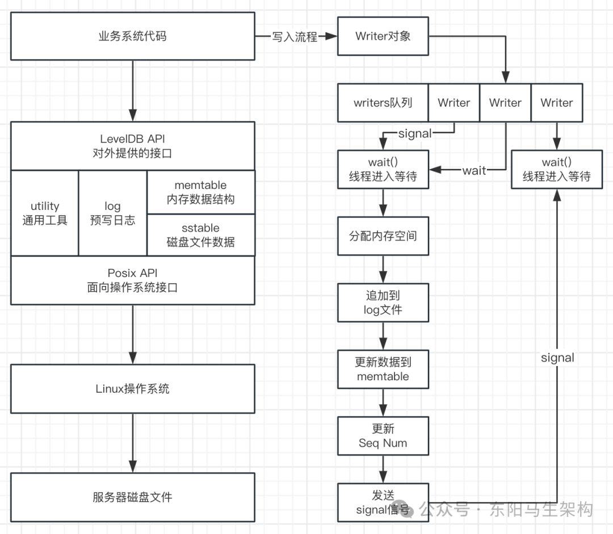
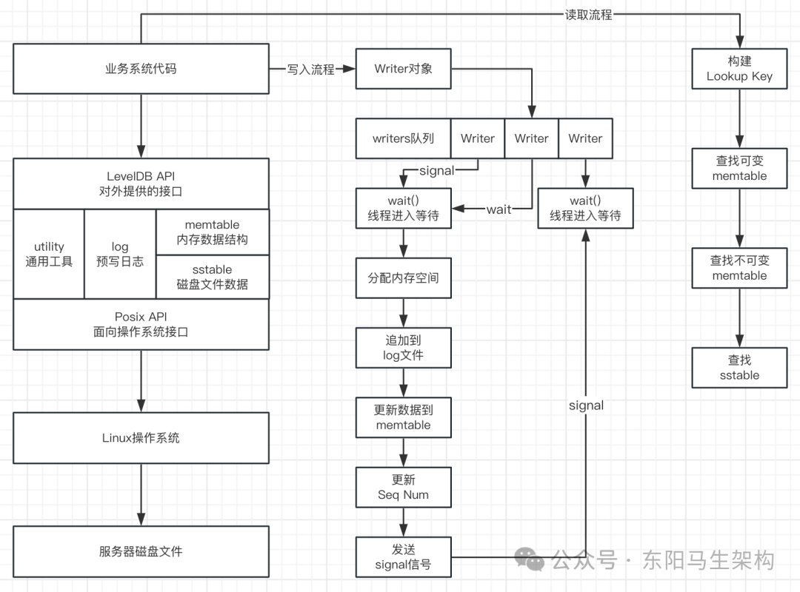
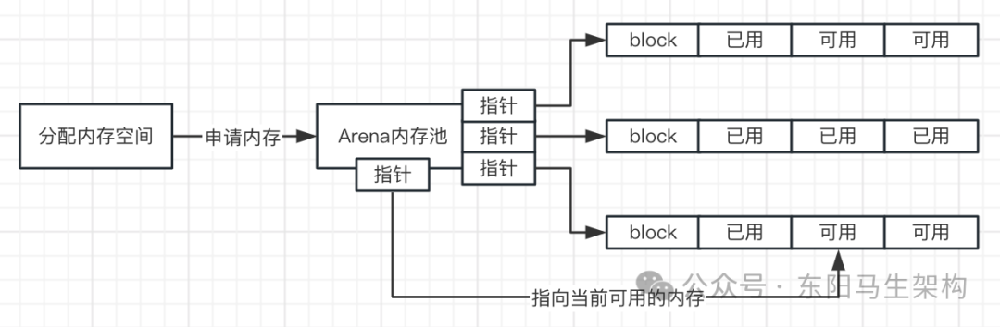
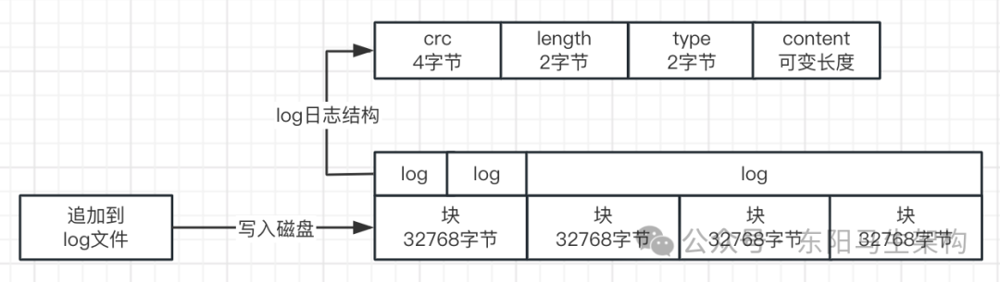
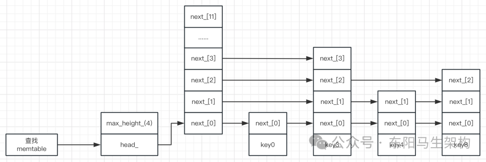
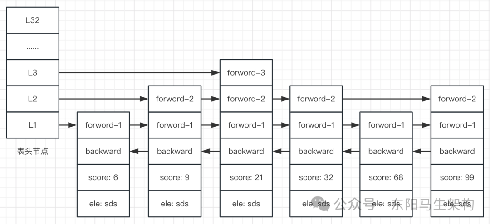
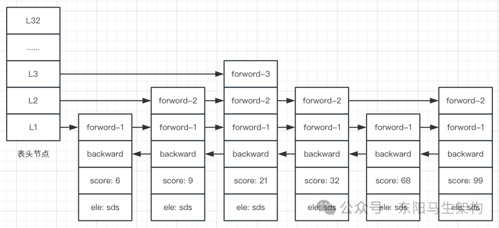
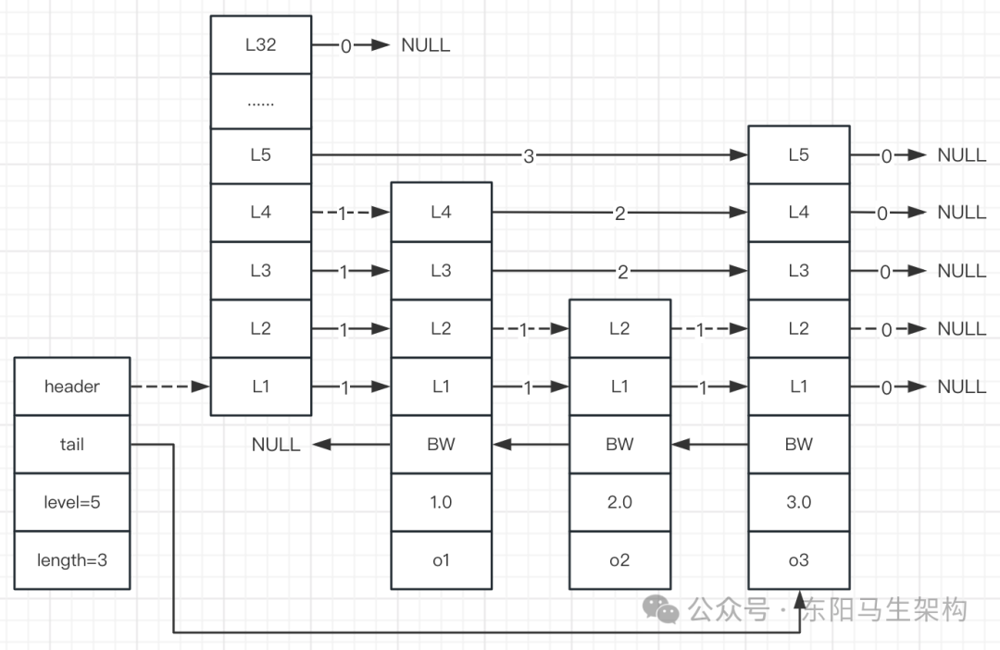
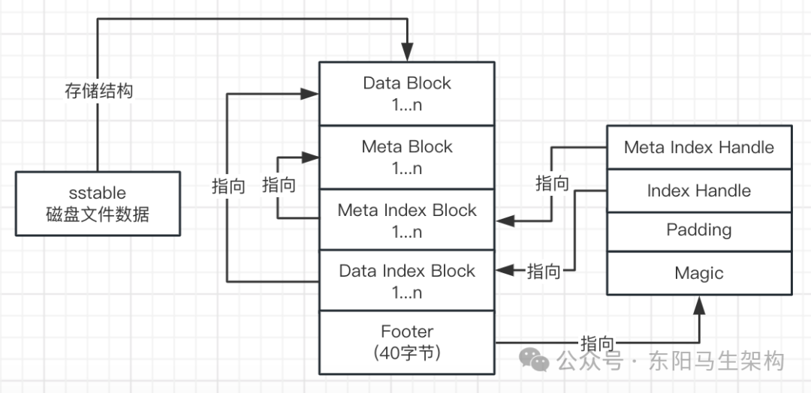

# LevelDB原理和EventBus源码

> **公众号**: 东阳马生架构  
> **发布时间**: 2025-08-18 09:00  

**大纲(12995字)**

- 1.RocksDB与LevelDB关系以及整体架构
- 2.LevelDB基于内存 + 磁盘的LSM树原理
- 3.LevelDB的并发写入操作会基于队列实现串行化
- 4.LevelDB基于Sequence Num的多版本快照机制
- 5.LevelDB的内存碎片问题以及内存池设计思想
- 6.LevelDB的log文件块存储以及预写日志结构
- 7.LevelDB写log日志时的刷盘机制
- 8.基于跳跃表的memtable
- 9.sstable文件存储结构和查找流程
- 10.EventBus的作用
- 11.自定义实现的EventBus
- 12.Guava实现的EventBus
- 13.EventBus源码之核心代码
- 14.EventBus源码之构造方法
- 15.EventBus源码之注册订阅者
- 16.EventBus源码之发布事件


## 1.RocksDB与LevelDB关系以及整体架构

### (1)RocksDB基于LevelDB并进行了优化和增强

### (2)LevelDB的整体架构

### (1)RocksDB基于LevelDB并进行了优化和增强

LevelDB是Google开源的单机版kv数据库，Facebook基于LevelDB开发了自己的RocksDB。

RocksDB对LevelDB做了很多性能优化和功能增强，比如针对SSD硬盘进行了性能优化、比如基于多核CPU进行高并发运转的增强优化、比如提供了很多企业级需要的功能。在磁盘文件里存储数据的多种压缩算法、按key进行范围查询、数据的管理和维护、数据统计、数据合并等。

RocksDB的内核就是LevelDB，TiDB的内核是RocksDB。LevelDB是单机版的kv数据库，HBase是分布式的kv数据库。

### (2)LevelDB的整体架构



## 2.LevelDB基于内存 + 磁盘的LSM树原理

### (1)LSM树介绍

### (2)往LSM树写入数据的原理

### (3)LevelDB与LSM树

### (1)LSM树介绍

LSM是一个树形的数据结构。LSM从树头开始，每次往下都会分几个树杈出来，最后会形成一课树。LSM树形数据结构有两颗树：一颗是在内存里，一棵是在磁盘文件里。LSM树在内存里的树是c0树，在磁盘里文件里的树是c1树。频繁访问的数据会放在内存c0树里，从而实现基于内存c0树的高性能读写。

往LSM树写数据时，首先会在log文件顺序追加一条WAL预写日志，然后把数据写入到内存的c0树里。

必须先写成功log日志文件，才能再写c0树，这时数据是不会丢失的。如果log日志写失败了，则不会写c0树，这次写入操作就会失败。如果log日志写成功了，才会写c0树。在写c0树时如果系统宕机了，内存里的c0树的数据全部都会丢失。但通过回放log日志文件里的变更日志，把这些数据的变更日志重做一遍，就可以把内存里的c0树的数据恢复出来。

使用LSM树的系统有LevelDB、HBase。两者都用了LSM树的"内存 + 磁盘"的两颗树的数据结构 + WAL预写日志。只不过LevelDB是单机版的，定位不是处理大数据。HBase是分布式版的，定位是处理海量数据、大数据量。HBase底层会基于：HDFS存储海量的WAL预写日志 \+ 海量磁盘上的c1树数据 \+ 海量机器的分布式内存存储c0树数据。

### (2)往LSM树写入数据的原理

首先将数据追加到log预写日志文件里，接着把数据写到内存c0树中。当c0树的大小达到阈值时，自动把c0树里的数据刷到磁盘的c1树里。刷完后，内存c0树对应的log文件数据就可以清空掉了。读数据时，先从c0树查询，如果没找到，再从c1树查询。

### (3)LevelDB与LSM树

LevelDB用了LSM树的结构去处理数据，具体就是用memtable数据结构实现c0树，用sstable文件结构实现c1树。

## 3.LevelDB的并发写入操作会基于队列实现串行化

### (1)LevelDB的读写核心

### (2)LevelDB写入数据的流程

### (3)LevelDB写入数据的原理

### (1)LevelDB的读写核心

往LevelDB写入数据时，LevelDB会基于队列实现多线程并发写入转换成串行写入。从LevelDB查数据时，会与Suquence Number快照序号有关系。LevelDB会基于Sequence Number实现多版本快照机制。

### (2)LevelDB写入数据的流程

#### 一.构建Writer对象

#### 二.将Writer对象写入writers队列

#### 三.通过wait()阻塞写入Writer对象到队列的线程

#### 四.数据写入完后通过signal()唤醒排第一的等待线程

#### 五.唤醒的线程首会分配内存空间

#### 六.然后将数据顺序写入log文件

#### 七.更新数据到memtable

#### 八.更新Sequence Number

#### 九.继续通过signal()唤醒排第一的等待线程



### (3)LevelDB写入数据的原理

多线程并发向LevelDB写入数据时，LevelDB会基于队列将写入串行化。所有线程都会把Writer对象入队，然后调用wait()进行等待。一个线程写入数据完毕后，再去通过signal()唤醒下一个线程来写入数据。从而让多线程高并发写入，转化成串行化写入。

由于LevelDB会将多线程并发写入，转换为基于队列串行化写入，所以并发能力会有所限制。

RocksDB所做的一些基于LevelDB的增强和优化，主要也是针对SSD固态硬盘提升磁盘读写性能、针对多核CPU实现高并发的写入增强。

虽然LevelDB写入数据时是串行化写入，但其性能也不差。因为每一次写入操作，都是首先往一个log文件进行顺序写追加，然后在内存写进行memtable更新。由于内存更新是很快的、文件追加顺序写也是很快的，所以每次写性能都是很高的。所以尽管多线程串行，但其并发能力也是很强的。

这和Redis很类似，高并发请求都是串行单线程来执行和处理的。只要每个请求的处理速度特别快，Redis的并发能力也会很强。

## 4.LevelDB基于Sequence Num的多版本快照机制

### (1)LevelDB的多版本数据快照

### (2)LevelDB读取数据的流程

### (1)LevelDB的多版本数据快照

进行kv存储时，无论是单机版的LevelDB，还是分布式版的HBase。它们都支持基于timestamp或Sequence Number的多版本快照机制。

比如写入一条kv数据，key是不变的，但value则会不断变化。第一次写入某kv数据时，其value就会绑定一个Sequence Number，可以指定一个时间戳来作为Sequence Number，当然也可以通过自定义实现自增的版本号。第二次更新该kv数据时，更新后的value值会对应另一个版本号。

所以一个key会拥有多个版本的数据快照，LevelDB可指定某个版本的数据快照进行读取。比如当key的值已更新为value=v2时，可以通过指定版本，把key的旧值value=v1读取出来。

### (2)LevelDB读取数据的流程

#### 一.构建Lookup key = key + Sequence Number

#### 二.查找可变的memtable

#### 三.查找不可变memtable

#### 四.查找sstable



## 5.LevelDB的内存碎片问题以及内存池设计思想

### (1)内存分配的问题

### (2)内存池的设计思想

### (1)内存分配的问题

LevelDB在写入数据时，必须先分配一块内存空间去存放数据。由于LevelDB是C语言实现的，所以需要自己去申请、分配和回收内存。C语言需要对内存进行精细化的控制，不像JVM可以自动进行内存管理。

### (2)内存池的设计思想

如果要自己分配内存，则势必会有内存碎片。内存碎片会导致大量的内存被浪费，内存利用率低下，影响程序性能。所以C语言实现的系统，一般都会自己去设计内存池。

LevelDB设计了一个叫Arena的内存池。首先会申请一大片连续的内存空间，然后把内存空间里拆分成一个一个规则平整的block。一个block大小为4KB，有可用和已用两种状态。需要使用内存时，就申请一个block作为一块内存。不需要使用内存时，就把block内存释放掉即可。



## 6.LevelDB的log文件块存储以及预写日志结构

### (1)log文件的块存储

### (2)log预写日志的结构

### (1)log文件的块存储

log文件在磁盘里是如何组织log日志的数据结构的？写入到log文件的一条一条log日志具有什么样的结构？这些log日志是如何存储在log磁盘文件里的？

log文件会被划分为很多的块，每个块是32768字节。一条log数据，数据很少时会写到一个块里，数据很多时会写到多个块里。所以一个块可能会写多条log数据，多个块可能才写一条log数据。

### (2)log预写日志的结构

一条log数据的结构组成：4字节的CRC校验和 \+ 2字节的Length长度数值 \+ 1字节的type \+ 可变长度的Content。

其中type有4种值：

```
kFullType，表示这条数据写入到一个块
kFirstType，表示这条数据写入到多个块，当前块是数据的第一个块
kMiddleType，表示这条数据写入到多个块，当前块是数据的中间块
kLastType，表示这条数据写入多个块，当前块是数据的最后一个块
```



## 7.LevelDB写log日志时的刷盘机制

LevelDB在写log日志时，默认情况下，数据会先写到OS管理的PageCache页缓存。当log日志写入到PageCache后，就算写入成功了。如果此时机器宕机，那么OS管理的PageCache页缓存里的数据就会丢失。因此：

#### 一.如果希望往LevelDB写入数据时数据不会丢失

那么LevelDB每次写log日志到PageCache后，都需要进行flush同步刷盘，同步刷盘完毕才能返回。这样就可以确保机器宕机时，数据也不会丢失。但是此时LevelDB的性能就会下降，并发能力也会下降。

#### 二.如果希望LevelDB的写入性能高并发能力强

那么LevelDB每次写log日志到PageCache后，不需要同步刷盘。只要log日志写入到PageCache后，就算写入成功并返回。

## 8.基于跳跃表的memtable

### (1)memtable的核心数据结构是跳跃表

### (2)跳跃表节点的查找

### (3)跳跃表节点的插入

### (4)跳跃表节点的遍历

### (1)memtable的核心数据结构是跳跃表



Redis的跳跃表由zskiplistNode和zskiplist两个数据结构来定义，zskiplistNode用于表示跳跃表节点，zskiplist用于保存跳跃表节点的相关信息。

跳跃表节点zskiplistNode的level数组可以包含多个元素。每个元素都包含一个指向其他节点的指针，所以每个节点都包含很多指针，可以通过这些层也就是指针来加快节点的查找和访问的速度，跳跃表中的节点其实已经按照分值排好序了的。

```objectivec
typeof struct zskiplist {
    //指向跳跃表的表头节点和表尾节点
    struct zskiplistNode *header, *tail;

    //记录跳跃表的长度，也就是跳跃表目前包含节点的数量
    unsigned long length;

    //记录目前跳跃表内，层数最大的那个节点的层数(表头节点的层数不计算在内，最多为32层)
    int level;
} zskiplist;

typeof struct zskiplistNode {
    //节点值
    sds ele;

    //节点分数，用于节点排序
    double score;

    //指向前驱节点的后退指针，一个节点只有第一层有前驱节点的后退指针
    struct zskiplistNode *backward;

    //每个层都有两个属性：前进指针和跨度
    struct zskiplistLevel {
        //指向本层后继节点的前进指针
        struct zskiplistNode *forward;

        //本层后继节点跨越了多少个第一层节点
        unsigned long span;
    } level[];
} zskiplistNode;
```

### (2)跳跃表节点的查找

查找某节点是否在跳跃表中：

#### 一.首先从跳跃表的表头节点的最高层开始查找

二.如果存在后继节点，并且后继节点的分值大于查找节点的分值，则沿着forword指针继续查找，即通过forward指针跳转到后继节点

#### 三.如果存在后继节点，但是后继节点的分值等于查找节点的分值，则该节点就是要查找的节点

#### 四.如果存在后继节点，但是后继节点的分值小于查找节点的分值，则在当前节点下降一层继续查找



查找跳跃表中指定索引的节点：

```cpp
zskiplistNode* zslGetElementByRank(zskiplist *zsl, unsigned long rank) {
    zskiplistNode *x;
    unsigned long traversed = 0;//累计跨度
    int i;

    x = zsl->header;
    for (i = zsl->level-1; i >= 0; i--) {
        while (x->level[i].forward && (traversed + x->level[i].span) <= rank) {
            traversed += x->level[i].span;
            x = x->level[i].forward;
        }
        if (traversed == rank) {
            return x;
        }
    }

    return NULL;
}
```

### (3)跳跃表节点的插入

一.根据跳跃表的表头节点遍历跳跃表的每一层，查找每一层插入位置的前驱节点。即遍历跳跃表各层，找到某一层中的如下这样的节点：该节点分数比新插入节点分数小，其后继节点分数比新插入节点分数大，那么该节点就是要找的插入位置的前驱节点

#### 二.随机生成新节点的层数

#### 三.如果新节点的层数比其他节点都大，这时跳跃表需要添加新的层，即增加表头节点的层数

#### 四.创建一个新节点，根据每一层插入位置的前驱节点，去插入新节点，并且更新前后节点的属性



```cpp
zskiplistNode *zslInsert(zskiplist *zsl, double score, sds ele) {
    zskiplistNode *update[ZSKIPLIST_MAXLEVEL], *x;
    unsigned int rank[ZSKIPLIST_MAXLEVEl];
    int i, level;

    serverAssert(!snan(score));
    //1.查找每层插入位置的前驱节点，记录到update[]数组，每层插入位置的前驱节点的跨度记录到rank[]数组
    x = zsl->header;
    for (i = zsl->level-1; i >= 0; i--) {
        rank[i] = i == (zsl->level-1) ? 0 : rank[i+1];
        while (x->level[i].forward &&
            (x->level[i].forward->score < score ||
                (x->level[i].forward->score == score && sdscmp(x->level[i].forward->ele, ele) < 0)
            )
        ) {
            rank[i] += x->level[i].span;
            x = x->level[i].forward;
        }
        update[i] = x;
    }

    //2.随机生成新节点的层数
    level = zslRandomLevel();

    //3.新节点的层数比其他节点都大，这时跳跃表就需要添加新的层
    if (level > zsl->level) {
        for (i = zsl->level; i < level; i++) {
            rank[i] = 0;
            update[i] = zsl->header;
            update[i]->level[i].span = zsl->length;
        }
        zsl->level = level;
    }

    //4.创建一个节点，然后遍历各层，插入新节点并更新前后节点属性
    x = zslCreateNode(level, score, ele);
    for (i = 0; i < level; i++) {
    	x->level[i].forward = update[i]->level[i].forward;
     	update[i]->level[i].forward = x;
      	x->level[i].span = update[i]->level[i].span - (rank[0] - rank[i]);
    	update[i]->level[i].span = (rank[0] - rank[i]) + 1;
    }

    //5.如果某节点存在比新节点层数大的层，则其前驱节点span需要加1，因为第一层插入了一个新节点
    for (i = level; i < zsl->level; i++) {
        update[i]->level[i].span++;
    }

    //6.设置新节点的backward属性，更新跳跃表的length长度
    x->backward = (update[0] == zsl->header) ? NULL : update[0];
    if (x->level[0].forward) {
    	x->level[0].forward->backward = x;
    } else {
    	zsl->tail = x;
    }
    zsl->length++;
    return x;
}
```

### (4)跳跃表节点的遍历

如下图中的虚线所示，从每个节点中"层数最高 + 跨度为1"的层开始，根据指针访问下一个节点。

#### 一.首先访问表头节点，根据第四层的前进指针访问到表中的第二个节点

#### 二.在第二个节点时，根据第二层的前进指针访问到表中的第三个节点

#### 三.在第三个节点时，根据第二层的前进指针访问到表中的第四个节点

#### 四.在第四个节点时，发现每一层的跨度都为0，可知已到达跳跃表表尾

注意：跨度的作用是用来计算排位的。在查找某个节点的过程中，将沿途访问过的所有层的跨度累计起来，得到的结果就是目标节点在跳跃表中的排位。



## 9.sstable文件存储结构和查找流程

memtable里的数据都是key-value对。将memtable的数据刷入sstable文件前，会对数据按照key进行排序。所以写入到sstable磁盘文件的数据，都是按照key排过序的。

一个sstable磁盘文件会划分为多个Block，每个Block是4KB。Data Block、Meta Block、Meta Index Block、Index Block、Footer。

读取sstable文件数据时先读Footer，从Footer中读取出Meta Index Handle、Index Handle、Padding、Magic，然后可以定位到对应的Index Block，接着根据Index去读取Data Block，这样就可以完成基于索引的磁盘数据读取。



## 10.EventBus的作用

EventBus可以解耦触发(发送)消息的对象和使用消息的对象，通常会用在生产者触发(发送)消息时不关心谁来消费消息时的场景。

在SpringBoot的很多项目中多个Service间可能偶尔会存在强关联，也就是在一个Service里引用另外一个Service，偶尔会导致相互引用。但大部分情况下Service间是没有什么关联的，所以解耦会更合适。

比如：删除一个用户是在UserService下实现的，用户的删除可能会触发很多相应的处理，分别在不同的Service下处理。这时如果不想在UserService里引入所有处理的Service，那么只需利用EventBus触发一个USER_DELETE的消息即可，然后所有订阅这个消息的Service收到消息后就可以自行处理。

## 11.自定义实现的EventBus

### (1)观察者模式(发布订阅模式)

### (2)EventBus的简单实现

### (1)观察者模式(发布订阅模式)

观察者模式又叫发布订阅模式。它定义了一种一对多的依赖关系，多个观察者对象可同时监听某主题对象。当该主题对象状态发生变化时，相应的所有观察者对象都可收到通知。

比如求职者订阅一些工作发布网站，当有工作机会时，他们会收到提醒。又或者是当用户注册网站成功时，发送一封邮件或者发送一条短信给用户。这些场景都可以使用观察者模式来解决。关于观察者模式的基本模型代码如下：

```typescript
public interface Subject {
    void registerObserver(Observer observer);
    void unregisterObserver(Observer observer);
    void notifyObservers(Message message);
}

interface Observer {
    void update(Message message);
}

@Data
class Message {
    String id;
    String name;
}

//具体的主题
class UserRegisterSubject implements Subject {
    List observerList = new ArrayList();

    public void registerObserver(Observer observer) {
    	observerList.add(observer);
    }

    public void unregisterObserver(Observer observer) {
    	observerList.remove(observer);
    }

    public void notifyObservers(Message message) {
    	for (Observer observer : observerList) {
    	    observer.update(message);
    	}
    }
}

//观察者
class RegNotificationObserver implements Observer {
    public void update(Message message) {
    	System.out.println("注册成功，已经发送邮件给" + message.getName());
    }
}

class RegOtherObserver implements Observer {
    public void update(Message message) {
    	System.out.println("注册成功，发送优惠券给" + message.getName());
    }
}

class Main {
    public static void main(String[] args) {
    	//实际使用的时候配合Spring使用
    	Subject subject = new UserRegisterSubject();
    	subject.registerObserver(new RegNotificationObserver());
    	subject.registerObserver(new RegOtherObserver());
    	boolean registSuccess = true;
    	if (registSuccess) {
    	    Message msg = new Message();
    	    msg.setId("123456");
    	    msg.setName("think123");
    	    subject.notifyObservers(msg);
    	}
    }
}
```

### (2)EventBus的简单实现

#### 一.首先需要包含一个Map

#### 二.然后提供注册的方法

#### 三.接着提供触发事件消息的方法

#### 四.EventBus的使用演示

#### 一.首先需要包含一个Map

Map的key是监听的topic，value是所有对该topic感兴趣的订阅者对象，所以value是一个数组。

#### 二.然后提供注册的方法

把订阅者对象注册进到这个Map中，通常这些订阅者都实现一个特定的接口或直接使用一个嵌入类。

#### 三.接着提供触发事件消息的方法

让所有订阅者对象处理事件消息。

```cs
public interface IEvent {
    //接收到消息后触发消息的处理调用
    //@param data 消息带的数据
    void invoke(String message, Object data);
}

public class EventBus {
    private volatile static EventBus instance;

    //Map的key是监听的topic，value是所有对该topic感兴趣的订阅者对象
    private final HashMap<String, List<IEvent>> dict = new HashMap<>();

    private EventBus() {

    }

    public static EventBus getInstance() {
        if (instance == null) {
            synchronized (EventBus.class) {
                if (instance == null) {
                    instance = new EventBus();
                }
            }
        }
        return instance;
    }

    //提供注册方法把订阅者对象注册进到这个Map中
    public void on(String message, IEvent userListener) {
        synchronized (EventBus.class) {
            if (!dict.containsKey(message)) {
                dict.put(message, new ArrayList<>());
            }
            List<IEvent> listeners = dict.get(message);
            listeners.add(userListener);
        }
    }

    //提供触发事件消息方法，让所有订阅者对象处理事件消息
    public void fire(String message, Object data) {
        if (dict.containsKey(message)) {
            List<IEvent> listeners = dict.get(message);
            listeners.forEach(listener -> listener.invoke(message, data));
        }
    }
}
```

#### 四.EventBus的使用演示

使用也很简单，就是发布者和订阅者约定一个topic名称。然后订阅者通过EventBus订阅topic，发布者通过EventBus触发topic。

```typescript
//测试自定义的EventBus
public class Test {
    public static void main(String[] args) {
        new Test1().fireEvent();
    }
}

class Test1 {
    public void fireEvent() {
        Test2 test2 = new Test2();
        EventBus.getInstance().on("Event1", test2);
        EventBus.getInstance().fire("Event1", "data1");
    }
}

class Test2 implements IEvent {
    @Override
    public void invoke(String message, Object data) {
        System.out.println(Thread.currentThread() + " test2接收到消息，主题是" + message + ",内容是" + data);
    }
}
```

## 12.Guava实现的EventBus

### (1)Guava的EventBus的优点

### (2)Guava的EventBus的使用步骤

### (1)Guava的EventBus的优点

EventBus是Guava的一个组件，通过发布订阅模式来对项目进行解耦。方便开发者使用很少的代码，就能够实现多组件间通信。相比自定义的EventBus，Guava的EventBus具有如下优点：

#### 一.面向接口编程

Executor、Dispatcher都是接口，使用方可以替换具体的实现类。

#### 二.使用依赖注入增强可测性

EventBus持有Executor、Dispatcher对象，这些对象可通过EventBus的构造器注入。这样使用者就可方便替换具体的实现，或者mock一个对象来用于测试。如果它们不是可注入的，而是直接在某方法内调用，就失去了替换的机会。当然，接口注入的方式还有很多，例如通过set方法、通过反射动态生成等。但通过构造器注入是最简单、最省心的方法。

#### 三.支持同步和异步二种方式

同步方式时，如果订阅者对消息的处理时间太长会影响生产者的正常执行。异步方式时，就是在构建EventBus时传递一个线程池对象。这样触发消息时会自动从线程池获取一个线程来处理消息，避免消息的处理影响生产者。

#### 四.使用了@Subscribe注解 + 反射

这使得任何类的任何方法都可以成为事件监听类，而不需要实现特定的监听者接口，只需在方法前加注解@Subscribe即可。

#### 五.省略了topic的概念

发送消息时通过消息对象类型(Class)来区分消息。

#### 六.考虑了异常处理机制

提供了SubscriberExceptionHandler接口让使用者来实现具体的处理逻辑。提供了DeadEvent类，将那些失去订阅者的事件统一归类到DeadEvent，由使用者自行实现一个Listener去处理它们。

#### 七.通过模板方法固化了整个调用流程

#### 八.线程安全CopyOnWriteArraySet

#### 九.允许构建多个消息中心的实例

### (2)Guava的EventBus的使用步骤

步骤一：首先需要实现一个Listener事件监听类

步骤二：构造EventBus

步骤三：通过EventBus注册Listener

步骤四：发布Event事件

步骤一：首先需要实现一个Listener事件监听类

一个Listener类可以通过不同的方法同时监听多个事件。任何类都能作为Listener，但有以下要求：

要求一：必须在监听方法上添加@Subscribe注解，表示该方法是一个监听方法。

要求二：监听方法只能有一个参数，这个参数就是要监听的事件，参数类的Class可以理解为就是要监听的EventType。

步骤二：构造EventBus

说明一：在一个系统中，根据用途不同，可以同时存在多个EventBus，不同的EventBus通过identifier来识别。

说明二：为方便使用，EventBus提供了多个构造器，使用者可以根据需要注入不同的实现类。最简单的构造器是一个无参构造器，全部使用默认实现。

说明三：在实际使用过程中，可以使用一个单例类来持有EventBus实例。如有需要，可以持有不同的EventBus实例用于不同的用途。

步骤三：通过EventBus注册Listener

也就是调用EventBus的register()方法来完成Listener的注册。

步骤四：发布Event事件

也就是调用EventBus的post()方法来完成Event事件的发布，下面是使用例子：

```java
//测试Guava的EventBus
public class Test {
    public static void main(String[] args) {
    	new Test1().fireEvent();
    }
}

public class Test1 {
    public void fireEvent() {
    	//Google Guava库的EventBus使用方式
    	//1.同步消息中心
    	EventBus eventBus = new EventBus();
    	MyListener listener = new MyListener();
    	eventBus.register(listener);
    	eventBus.post("EventString");
    	eventBus.post(new EventObject("EventObject", "EventName"));

    	//2.异步消息中心
    	ThreadPoolExecutor executor = new ThreadPoolExecutor(10, 20, 5, TimeUnit.SECONDS, new ArrayBlockingQueue<>(10), new ThreadPoolExecutor.AbortPolicy());
    	AsyncEventBus asyncEventBus = new AsyncEventBus(executor);
    	asyncEventBus.register(new MyListener());
    	asyncEventBus.post("EventString");
    	asyncEventBus.post(new EventObject("EventObject", "EventName"));
    }
}

public class MyListener {
    //添加Subscribe注解则表示要监听某个事件
    @Subscribe
    public void invoke(String event) {
    	//函数名随意，参数只能一个
    	System.out.println(Thread.currentThread() + " Listener接收到string消息，内容是" + event);
    }

    //一个Listener可以监听多个事件
    @Subscribe
    public void invoke(EventObject event) {
    	//函数名随意，参数只能一个
    	System.out.println(Thread.currentThread() + " Listener接收到object消息，内容是" + event.toString());
    }
}
```

## 13.EventBus源码之核心代码

### (1)EventBus的核心类说明

### (2)EventBus的核心代码

### (1)EventBus的核心类说明

#### 一.EventBus

EventBus是核心入口类，只需要实现Listener，并通过调用EventBus类的方法则可完成所有功能。

#### 二.SubscriberExceptionHandler

SubscriberExceptionHandler是异常处理接口，可替换自己的实现。

#### 三.Executor

Executor用于异步执行Listener的监听方法，可替换自己的实现。

#### 四.Dispatcher

Dispatcher是Event派发接口，可替换自己的实现，默认提供了3个实现类。

#### 五.SubscriberRegistry

SubscriberRegistry是事件注册类，也可以用来获取订阅者。

#### 六.Subscriber

Subscriber是订阅者，对Listener做了封装，屏蔽了复杂的调用逻辑。这使得使用者不必关心这些复杂逻辑，只要提供Listener的具体实现则可。

#### 七.SynchronizedSubscriber

SynchronizedSubscriber是支持并发调用的订阅者，可以通过在Listener的事件监听方法上添加AllowConcurrentEvents注解，来达到使用SynchronizedSubscriber的目的。

#### 八.Subscribe

Subscribe是一个注解类，可以在任何类的方法上添加该注解来表达该方法是一个事件监听方法。

#### 九.DeadEvent

DeadEvent用于记录那些已经没有订阅者的事件。

#### 十.SubscriberExceptionContext

SubscriberExceptionContext是异常上下文，用于订阅者在处理异常时记录相关的上下文信息，从而方便异常处理实现类获得这些信息来处理异常。

### (2)EventBus的核心代码

EventBus中主要的方法就是注册订阅者、移除订阅者、分发事件。

```cs
public class EventBus {
    //标识EventBus，可以理解为name
    private final String identifier;

    //具体的线程池，默认是directExecutor，单线程
    private final Executor executor;

    //异常处理器，负责处理异常
    private final SubscriberExceptionHandler exceptionHandler;

    //订阅中心，存储有哪些订阅者
    private final SubscriberRegistry subscribers = new SubscriberRegistry(this);

    //事件转发器，负责转发event给订阅者
    private final Dispatcher dispatcher;

    //无参构造器
    public EventBus() {
    	this("default");
    }

    //指定标识符构造器
    public EventBus(String identifier) {
        this(
            identifier,
            MoreExecutors.directExecutor(),
            Dispatcher.perThreadDispatchQueue(),
            LoggingHandler.INSTANCE
        );
    }

    //注入自定义异常类构造器
    public EventBus(SubscriberExceptionHandler exceptionHandler) {
        this(
            "default",
            MoreExecutors.directExecutor(),
            Dispatcher.perThreadDispatchQueue(),
            exceptionHandler
        );
    }

    //注入所有参数构造器，需注意的是，此方法不是public的，只能在包内访问
    EventBus(String identifier, Executor executor, Dispatcher dispatcher, SubscriberExceptionHandler exceptionHandler) {
        this.identifier = checkNotNull(identifier);
        this.executor = checkNotNull(executor);
        this.dispatcher = checkNotNull(dispatcher);
        this.exceptionHandler = checkNotNull(exceptionHandler);
    }
    ...

    //注册订阅者
    public void register(Object object) {
        subscribers.register(object);
    }

    //移除订阅者
    public void unregister(Object object) {
        subscribers.unregister(object);
    }

    //分发event事件给所有注册的订阅者
    public void post(Object event) {
        Iterator<Subscriber> eventSubscribers = subscribers.getSubscribers(event);
        if (eventSubscribers.hasNext()) {
            dispatcher.dispatch(event, eventSubscribers);
        } else if (!(event instanceof DeadEvent)) {
            post(new DeadEvent(this, event));
        }
    }
    ...
}
```

## 14.EventBus源码之构造方法

### (1)使用EventBus作为具体实现类的构造方法

### (2)使用AsyncEventBus作为实现类的构造方法

### (3)统一调用的构造方法

### (4)两种构造方法实现的区别

### (1)使用EventBus作为具体实现类的构造方法

```cs
public class EventBus {
    ...
    //无参构造器
    public EventBus() {
        this("default");
    }

    //指定标识符构造器
    public EventBus(String identifier) {
        this(identifier, MoreExecutors.directExecutor(), Dispatcher.perThreadDispatchQueue(), LoggingHandler.INSTANCE);
    }

    //注入自定义异常类构造器
    public EventBus(SubscriberExceptionHandler exceptionHandler) {
        this("default", MoreExecutors.directExecutor(), Dispatcher.perThreadDispatchQueue(), exceptionHandler);
    }
    ...
}
```

### (2)使用AsyncEventBus作为实现类的构造方法

```java
public class AsyncEventBus extends EventBus {
    public AsyncEventBus(String identifier, Executor executor) {
    	super(identifier, executor, Dispatcher.legacyAsync(), LoggingHandler.INSTANCE);
    }

    public AsyncEventBus(Executor executor, SubscriberExceptionHandler subscriberExceptionHandler) {
    	super("default", executor, Dispatcher.legacyAsync(), subscriberExceptionHandler);
    }

    public AsyncEventBus(Executor executor) {
    	super("default", executor, Dispatcher.legacyAsync(), LoggingHandler.INSTANCE);
    }
}
```

### (3)统一调用的构造方法

```kotlin
public class EventBus {
    private final String identifier;
    private final Executor executor;
    private final Dispatcher dispatcher;
    private final SubscriberExceptionHandler exceptionHandler;
    ...

    //注入所有参数构造器，需注意的是，此方法不是public的，只能在包内访问
    EventBus(String identifier, Executor executor, Dispatcher dispatcher, SubscriberExceptionHandler exceptionHandler) {
    	this.identifier = checkNotNull(identifier);
    	this.executor = checkNotNull(executor);
    	this.dispatcher = checkNotNull(dispatcher);
    	this.exceptionHandler = checkNotNull(exceptionHandler);
    }
    ...
}
```

参数的意义分别是：

```
identifier：类似当前EventBus对象的别名，描述EventBus的用途
executor：使用异步执行时传入的自定义线程池
dispatcher：指定分发消息的模式
exceptionHandler：处理订阅消息异常的方法
subscribers：注册订阅者的类
```

### (4)两种构造方法实现的区别

#### 一.EventBus实现

```javascript
identifier为default
executor执行器为MoreExecutors.directExecutor()
dispatcher为Dispatcher.perThreadDispatchQueue()
exceptionHandler为EventBus提供的LoggingHandler.INSTANCE
```

#### 二.AsyncEventBus实现

```javascript
identifier为default
executor执行器为自定义的对象
dispatcher为Dispatcher.legacyAsync()
exceptionHandler为EventBus提供的LoggingHandler.INSTANCE
```

#### 三.Dispatcher调度器

EventBus提供了三种类型的调度器，分别为：

```nginx
PerThreadQueuedDispatcher
LegacyAsyncDispatcher
ImmediateDispatcher
```

#### 四.Executor执行器

EventBus默认提供的是DirectExecutor，属于单线程的执行器。

## 15.EventBus源码之注册订阅者

### (1)EventBus注册订阅者的逻辑说明

### (2)从缓存中获取所有订阅者的详细逻辑

### (3)register()方法从缓存中获取到所有订阅者后进行缓存的逻辑总结

### (1)EventBus注册订阅者的逻辑说明

EventBus会通过register()方法注册订阅者。注册订阅者时，会调用findAllSubscribers()方法从缓存中加载已有的订阅者。为了保证线程安全，会使用CopyOnWriteArraySet来保存对应的订阅者。

订阅者为什么会存在多个并使用了Set来进行保存？这是因为EventBus的post()方法的参数是Object类型，而在订阅者中可能会存在多个方法可以处理这个类型的参数，也就是有多个订阅者都订阅了该事件，所以订阅者会存在多个。

注册订阅者时，从缓存中加载完已有的订阅者后，会根据订阅者的Class，加载所有标明了@Subscribe注解的方法，并将它们放到缓存中。

订阅者会被放入名为subscriberMethodsCache的静态final缓存中。静态final变量，意味着所有的EventBus实例都共享该缓存，所以通过该缓存可以有效的提高性能。

```swift
public class EventBus {
    private final SubscriberRegistry subscribers = new SubscriberRegistry(this);
    ...

    //注册订阅者
    public void register(Object object) {
        subscribers.register(object);
    }
    ...
}

final class SubscriberRegistry {
    ...
    void register(Object listener) {
        //从缓存中获取所有的订阅者
        //查找有Subscribe注解的方法，并封装为Subscriber，Multimap的key记录的Class就是要监听的对象的Class
        Multimap<Class<?>, Subscriber> listenerMethods = findAllSubscribers(listener);

        //将获取到的所有订阅者进行缓存
        for (Entry<Class<?>, Collection<Subscriber>> entry : listenerMethods.asMap().entrySet()) {
            //获取key值，即订阅者方法的参数类型
            Class<?> eventType = entry.getKey();

            //获取订阅者
            Collection<Subscriber> eventMethodsInListener = entry.getValue();

            //根据参数类型获取到所有的订阅者
            CopyOnWriteArraySet<Subscriber> eventSubscribers = subscribers.get(eventType);

            //使用CopyOnWriteArraySet，保证线程安全
            if (eventSubscribers == null) {
                CopyOnWriteArraySet<Subscriber> newSet = new CopyOnWriteArraySet<>();
                eventSubscribers = MoreObjects.firstNonNull(subscribers.putIfAbsent(eventType, newSet), newSet);
            }

            //将该订阅类型对应的订阅者保存到eventSubscribers中，也就是保存到了全局变量subscribers中
            eventSubscribers.addAll(eventMethodsInListener);
        }
    }

    //从缓存中获取所有的订阅者
    private Multimap<Class<?>, Subscriber> findAllSubscribers(Object listener) {
        Multimap<Class<?>, Subscriber> methodsInListener = HashMultimap.create();
        Class<?> clazz = listener.getClass();

        //遍历该对象中添加了@Subscribe注解的方法集合
        for (Method method : getAnnotatedMethods(clazz)) {
            Class<?>[] parameterTypes = method.getParameterTypes();

            //获取被传输的数据类型
            Class<?> eventType = parameterTypes[0];

            //Subscriber中保存了要执行的对象以及方法
            //eventType就是参数类型，这里就形成了参数类型---》订阅者的映射
            //而订阅者中保存了具体需要执行的类以及方法
            methodsInListener.put(eventType, Subscriber.create(bus, listener, method));
        }
        return methodsInListener;
    }

    private static ImmutableList<Method> getAnnotatedMethods(Class<?> clazz) {
        try {
            return subscriberMethodsCache.getUnchecked(clazz);
        } catch (UncheckedExecutionException e) {
            throwIfUnchecked(e.getCause());
            throw e;
        }
    }
    ...

    //静态final变量，意味着所有的EventBus实例都共享该缓存，该缓存可以有效的提高性能
    private static final LoadingCache<Class<?>, ImmutableList<Method>> subscriberMethodsCache =
        CacheBuilder.newBuilder().weakKeys().build(
            new CacheLoader<Class<?>, ImmutableList<Method>>() {
                @Override
                public ImmutableList<Method> load(Class<?> concreteClass) throws Exception {
                    return getAnnotatedMethodsNotCached(concreteClass);
                }
            }
        );

    //传入的clazz类就是Listener的Class
    private static ImmutableList<Method> getAnnotatedMethodsNotCached(Class<?> clazz) {
        //获取到传递的class对象的类以及父类以及实现的接口
        Set<? extends Class<?>> supertypes = TypeToken.of(clazz).getTypes().rawTypes();

        //创建一个Map集合
        Map<MethodIdentifier, Method> identifiers = Maps.newHashMap();

        //遍历得到的class对象
        for (Class<?> supertype : supertypes) {
            //获取class对象的所有方法
            for (Method method : supertype.getDeclaredMethods()) {
                //只处理被Subscribe注解标明的方法并且method不能是合成的(isSynthetic)
                //即如果方法上有Subscribe注解，并且isSynthetic表示方法不是由Java编译器生成的
                if (method.isAnnotationPresent(Subscribe.class) && !method.isSynthetic()) {
                    //获取该方法的参数类型
                    Class<?>[] parameterTypes = method.getParameterTypes();

                    //参数个数只能为1
                    checkArgument(parameterTypes.length == 1, "...", method, parameterTypes.length);
                    checkArgument(!parameterTypes[0].isPrimitive(), "...", method, parameterTypes[0].getName(), Primitives.wrap(parameterTypes[0]).getSimpleName());

                    //根据方法创建MethodIdentifier对象，其中包含方法名、方法的参数类型
                    MethodIdentifier ident = new MethodIdentifier(method);

                    //如果map集合中不包含该对象，就将ident和method对象存储到identifiers的map集合中
                    if (!identifiers.containsKey(ident)) {
                        identifiers.put(ident, method);
                    }
                }
            }
        }

        //返回map集合中的方法
        return ImmutableList.copyOf(identifiers.values());
    }
}

class Subscriber {
    static Subscriber create(EventBus bus, Object listener, Method method) {
        return isDeclaredThreadSafe(method) ? new Subscriber(bus, listener, method) : new SynchronizedSubscriber(bus, listener, method);
    }

    @Weak private EventBus bus;
    @VisibleForTesting final Object target;
    private final Method method;
    private final Executor executor;

    private Subscriber(EventBus bus, Object target, Method method) {
    	this.bus = bus;
    	this.target = checkNotNull(target);
    	this.method = method;
    	method.setAccessible(true);
    	this.executor = bus.executor();
    }
    ...
}
```

(2)findAllSubscribers()方法获取订阅者中对应的所有Subscriber对象的详细逻辑

步骤一：首先调用getAnnotatedMethods()方法，获取订阅者clazz及其多级父类以及实现的接口中所有添加了@Subscribe注解的方法

步骤二：然后遍历这些添加了@Subscribe的方法

步骤三：接着对遍历到的每个方法进行如下处理：获取该方法的参数类型，将第0个参数类型赋值给eventType。然后将eventType作为key、由订阅者对象和该方法构建Subscriber对象实例作为value，存储到Multimap集合中

步骤四：最后返回key为这些方法的参数类型，value为由这些方法构建的Subscriber对象的Multimap

### (3)register()方法将所有Subscriber对象进行缓存的详细逻辑

获取到Multimap集合后，会进行如下处理：

步骤一：获取key值，即获取订阅者中添加了@Subscribe注解的方法的参数类型

步骤二：获取Multimap集合中的Subscriber对象

步骤三：根据参数类型，获取全局变量subscribers中已有的Subscriber对象

步骤四：判断全局变量中的Subscriber对象集合是否为空。如果为空，则创建CopyOnWriteArraySet集合，使用subscribers的putIfAbsent()方法将订阅类型(参数类型)和Subscriber对象集合存储进去

步骤五：将该订阅类型对应的Subscriber对象集合保存到eventSubscribers中，也就是保存到了全局变量subscribers中

## 16.EventBus源码之发布事件

### (1)EventBus发布事件的整体说明

### (2)PerThreadQueuedDispatcher向订阅者发送事件的详细逻辑

### (1)EventBus发布事件的整体说明

发布事件时，只需要在发布事件的地方获取EventBus实例，然后调用post()方法则可。EventBus会通过post()方法发布事件。

在post()方法中，首先会根据参数找到前面处理好的对应关系，然后通过反射调用对应的方法。

Dispatcher是一个抽象类，它的作用是负责转发event给订阅者，提供不同的event顺序。默认的实现是PerThreadQueuedDispatcher，表示的是每个线程一个队列，最终会调用Subscriber的invokeSubscriberMethod()方法，即会调用添加了@Subscribe注解的方法。

```typescript
public class EventBus {
    private final SubscriberRegistry subscribers = new SubscriberRegistry(this);
    private final Dispatcher dispatcher;
    ...

    public void post(Object event) {
        //根据event找到订阅者，这里实际是根据event.Class来查找，也即和Listener的监听方法的参数的Class一致
        Iterator<Subscriber> eventSubscribers = subscribers.getSubscribers(event);
        if (eventSubscribers.hasNext()) {
            //通过dispatcher来派发事件，最终调用的是Subscriber的dispatchEvent方法
            dispatcher.dispatch(event, eventSubscribers);
        } else if (!(event instanceof DeadEvent)) {
            //对于找不到订阅者的包装成DeadEvent处理，实际上就是丢弃掉
            post(new DeadEvent(this, event));
        }
    }
    ...
}

abstract class Dispatcher {
    ...
    private static final class PerThreadQueuedDispatcher extends Dispatcher {
        private final ThreadLocal<Queue<Event>> queue =
            new ThreadLocal<Queue<Event>>() {
                @Override
                protected Queue<Event> initialValue() {
                    return Queues.newArrayDeque();
                }
            };

        private final ThreadLocal<Boolean> dispatching =
            new ThreadLocal<Boolean>() {
                @Override
                protected Boolean initialValue() {
                    return false;
                }
            };

        @Override
        void dispatch(Object event, Iterator<Subscriber> subscribers) {
            checkNotNull(event);
            checkNotNull(subscribers);

            //每个线程都对应一个队列，如果多线程插入则先来的先处理
            Queue<Event> queueForThread = queue.get();
            queueForThread.offer(new Event(event, subscribers));
            if (!dispatching.get()) {
                dispatching.set(true);
                try {
                    Event nextEvent;
                    //找到对应的订阅者进行处理
                    while ((nextEvent = queueForThread.poll()) != null) {
                        while (nextEvent.subscribers.hasNext()) {
                            nextEvent.subscribers.next().dispatchEvent(nextEvent.event);
                        }
                    }
                } finally {
                    dispatching.remove();
                    queue.remove();
                }
            }
        }

        private static final class Event {
            private final Object event;
            private final Iterator<Subscriber> subscribers;

            private Event(Object event, Iterator<Subscriber> subscribers) {
                this.event = event;
                this.subscribers = subscribers;
            }
        }
    }
    ...
}

class Subscriber {
    ...
    @Weak private EventBus bus;
    @VisibleForTesting final Object target;
    private final Method method;
    private final Executor executor;

    private Subscriber(EventBus bus, Object target, Method method) {
        this.bus = bus;
        this.target = checkNotNull(target);
        this.method = method;
        method.setAccessible(true);
        this.executor = bus.executor();
    }

    final void dispatchEvent(final Object event) {
        //通过executor来实现异步调用，这个executor在EventBus是可注入的，可以注入修改后的实现类
        executor.execute(
            new Runnable() {
                @Override
                public void run() {
                    try {
                        invokeSubscriberMethod(event);
                    } catch (InvocationTargetException e) {
                        //这里最终调用的是在EventBus中注入的SubscriberExceptionHandler，可以注入修改后的实现类
                        bus.handleSubscriberException(e.getCause(), context(event));
                    }
                }
            }
        );
    }

    @VisibleForTesting
    void invokeSubscriberMethod(Object event) throws InvocationTargetException {
        try {
            //反射调用方法执行
            //这里的method就是Listener的监听方法，target就是Listener对象，event就是这个监听方法的入参
            method.invoke(target, checkNotNull(event));
        } catch (IllegalArgumentException e) {
            throw new Error("Method rejected target/argument: " + event, e);
        } catch (IllegalAccessException e) {
            throw new Error("Method became inaccessible: " + event, e);
        } catch (InvocationTargetException e) {
            if (e.getCause() instanceof Error) {
                throw (Error) e.getCause();
            }
            throw e;
        }
    }
    ...
}
```

### (2)PerThreadQueuedDispatcher向订阅者发送事件的详细逻辑

步骤一：从ThreadLocal中获取创建的Queue队列。如果已创建则获取当前线程对应的Queue队列，否则初始化一个ArrayDeque队列，ArrayDeque是一个双端队列。ArrayDeque既可以实现队列的先进先出，也可以实现栈的先进后出。它是线程不安全的，而且不允许有null值。它是可以自动扩容的循环数组，每次扩容都是2的n次方，初始大小为16

步骤二：通过offer()方法将事件以及订阅者存储到队列尾部

步骤三：如果dispatching.get()返回为false，说明没有在分发事件。那么就将dispatching设置为true，表示正在分发事件

步骤四：循环获取队列头部的事件，然后再循环获取事件对应的订阅者，通过订阅者Subscriber对象的dispatchEvent方法发送event事件

步骤五：使用executor去执行添加了@Subscribe注解的方法，默认的executor执行器为MoreExecutors.directExecutor()，表示直接发送

步骤六：在executor中会通过反射去执行添加了@Subscribe注解的方法
