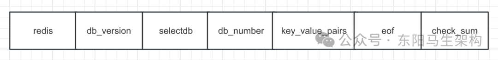

# Redis原理—2.单机数据库的实现

> **公众号**: 东阳马生架构  
> **发布时间**: 2024-12-09 20:28  

**大纲(12350字)**

- 1.Redis数据库的结构
- 2.读写Redis数据库键值时的处理
- 3.Redis数据库的构成
- 4.Redis过期键的删除策略
- 5.Redis的RDB持久化
- 6.Redis的AOF持久化
- 7.Redis的AOF重写机制
- 8.Redis持久化是影响其性能的高发地
- 9.Redis基于子进程实现持久化的使用建议
- 10.Redis持久化的阻塞场景
- 11.Redis服务器的文件事件
- 12.Redis服务器的文件事件处理器
- 13.Redis对文件事件的处理流程
- 14.Redis对时间事件的处理逻辑
- 15.客户端状态结构和服务器状态结构
- 16.Redis服务器对命令请求的处理


## 1.Redis数据库的结构

Redis服务器的所有数据库都保存在redisServer.db数组中，而redisServer.dbnum保存数据库数量。客户端通过修改目标数据库指针，让它指向redisServer.db数组中不同元素来切换数据库。数据库主要由dict和expires两个字典构成：

```javascript
//redisServer服务器
redisDb *db; //保存服务器所有数据库的数组
in dbnum; //数据库数量

//redisDb数据库
dict *dict; //键空间，保存所有键值对
dict *expires; //保存键的过期时间
```

## 2.读写Redis数据库键值时的处理

当使用Redis对数据库键值对进行读写时，服务器不仅仅只会对键空间执行指定的读写操作。

一.读取一个键后，服务器会根据键是否存在来更新服务器键空间hit和miss次数，对应于info status命令的keyspace_hits和keyspace_misses属性。

二.读取一个键后，服务器会更新键(redisObject)的LRU时间，计算空转时长。

三.如果发现键已过期，则会删除这个过期键。

四.如果客户端watch了某个键，那么服务器对该键修改后，会将该键标为脏(dirty)，从而让事务程序注意到这个键已被修改。

五.服务器每修改一个键后，都会对脏键计数器(dirty)的值增1，这个计数器会触发服务器的持久化以及复制操作。

六.如果服务器开启通知功能，那么在键修改后，会发送相应的数据库通知。

## 3.Redis数据库的构成

因为数据库由字典构成，所以对数据库的操作都建立在字典操作上。dict字典负责保存键值对，expires字典则负责保存键的过期时间。

数据库的键总是一个字符串对象，而值可以是任意一种Redis对象类型。

expires字典的键是一个指针，指向数据库中的某个键，而值则记录了数据库键的过期时间。

## 4.Redis过期键的删除策略

### (1)三种不同的过期键删除策略

### (2)Redis采用的删除机制

### (3)Redis主从服务器对过期键的处理

### (4)Redis客户端如何获取数据库中键的变化

### (5)缓存满了和缓存被污染了

### (6)Redis的LRU

### (7)Redis的LFU

### (1)三种不同的过期键删除策略

#### 一.定时删除：对键创建定时器，用定时器在键的过期时间来临时执行键的删除操作

#### 二.惰性删除：每次读取键的时候才检查键是否过期，若过期才删除

#### 三.定期删除：每隔一段时间对数据库进行一次检查，删除里面的过期键

定期删除对内存友好对CPU不友好，占用太多CPU时间，影响服务器响应时间和吞吐量。

惰性删除对CPU友好对内存不友好，浪费太多内存，有内存易泄露的危险。

定期删除的难点是确定删除操作执行的时长和频率。

#### 一.如果频率太高或时长太长，定期就会退化成定时，占用CPU

#### 二.如果频率太低或时长太短，定期又会和惰性一样，浪费内存

### (2)Redis采用的删除机制

维护每个键精准的过期删除机制，会导致消耗大量的CPU，这对于单线程的Redis来说成本太高。因此Redis采用惰性删除和定时删除机制，来实现过期键的内存回收。

Redis内部会维护一个定时任务，默认每秒运行10次。定时任务中删除过期键采用了自适应算法，根据键的过期比例，使用快慢两种速率模式进行回收。

快慢两种模式的内部删除逻辑相同，只是执行超时时间不同。快模式下超时时间为1毫秒且2秒内只能运行一次，慢模式下超时时间为25毫秒。

#### 一.定时任务在每个数据库中随机检查20个键，发现过期的就删除

#### 二.过期键数如果小于25%则退出，如果大于25%则继续循环回收

#### 三.如果循环回收的执行时间超过25毫秒，则改用快模式超时为1毫秒且2秒内只能运行一次

### (3)Redis主从服务器对过期键的处理

执行save命令或者bgsave命令所产生的新RDB快照文件不会包含已过期的键，执行bgrewriteaof命令所产生的重写AOF文件不会包含已过期的键。

当一个过期键被删掉之后，服务器会追加一条del命令到现有AOF文件末尾显式删除键。当主服务器删除一个过期键后，会向所有从服务器发送一条del命令进行显式删除键。

从服务器即使发现过期键也不会自作主张删除它，而是等待主节点发来del命令。这种统一、中心化的过期键删除策略可以保证主从服务器数据的一致性。当然，从服务器读取数据时也会检查是否过期。

### (4)Redis客户端如何获取数据库中键的变化

数据库的通知功能可以让客户端通过订阅给定的频道或者模式，来获知数据库中键的变化，以及数据库中命令的执行情况。

### (5)缓存满了和缓存被污染了

#### 一.缓存满了

缓存满了是指：Redis使用的内存空间超过了maxmemory的值。一般把缓存容量设置为总数据量的15%-30%，以兼顾访问性能和内存空间开销。

缓存被写满是不可避免的，Redis提供了8种缓存淘汰策略。其中allkeys指的是所有缓存数据，volatile指的是设置了过期时间的缓存数据。

```http
noeviction: 当Redis的内存达到maxmemory时，不执行任何操作，而是返回错误
allkeys-lru: 使用LRU算法从所有键中进行淘汰
allkeys-lfu: 使用LFU算法从所有键中进行淘汰
allkeys-random: 在所有键中，随机选择一个进行淘汰
volatile-lru: 在过期的键中使用LRU算法进行淘汰
volatile-lfu: 在过期的键中使用LFU算法进行淘汰
volatile-ttl: 在过期的键中，按照剩余存活时间从小到大进行淘汰
volatile-random: 在过期的键中，随机选择一个进行淘汰
```

#### 二.缓存被污染了

缓存被污染了是指：有些数据被访问的次数非常少，甚至只会被访问一次但却留在缓存中占用空间。缓存污染不严重时，只占少量的缓存空间，影响不大。缓存污染严重时，写入新缓存数据需要把污染数据淘汰掉，从而影响性能。

如果能明确数据在某段时间会被再次访问，则volatile-ttl可有效避免缓存污染。如果不能明确数据会被再次访问，则volatile-random、allkeys-random、volatile-ttl不能应对缓存污染。如果使用LRU淘汰策略时出现对大量数据进行一次全体读取且只读一次，那么也会产生缓存污染。

### (6)Redis的LRU实现

原版的LRU需要使用链表管理所有的缓存数据，这会带来额外的空间开销。如果缓存数据被大量访问，那么就需要频繁移动链表中的元素。

Redis简化了LRU的实现：

首先，Redis会默认记录每个数据的最近一次的访问时间(RedisObject的lru字段)。

接着，首次淘汰会随机选出N个数据进入待淘汰池，然后把淘汰池中lru字段值最小的数据淘汰出去。

再次淘汰时，继续随机选出N个数据，依次判断每个数据的lru字段值是否比淘汰池中最小的lru字段值还小。如果是，则加入淘汰池，然后把淘汰池中lru字段值最小的数据淘汰出去。

其中N的默认值是5，当N=10的时候，其实已经非常接近真实的LRU效果了，但N越大越消耗CPU。

LRU的选择：

如果业务数据有明显的冷热之分，则使用allkeys-lru。如果业务数据没有明显的冷热之分，则使用allkeys-random。如果业务数据有置顶需求，则使用volatile-lru，同时置顶数据不设过期时间。

### (7)Redis的LFU实现

ldt：lru字段的高16位，代表访问的时间戳。

counter：lru字段的低8位，代表访问次数。

LFU的计数规则是：每当数据被访问时，首先用计数器当前的值乘以配置项lfu_log_factor再加1，取其倒数得p。然后把这个p值和一个取值范围在(0,1)的随机数r比较大小，只有p>r时，计数器才加1。

首次淘汰会随机选出N个数据进入待淘汰池，把淘汰池中counter最小的数据淘汰出去。

再次淘汰时，继续随机选出N个数据，依次更新ldt和counter值并且判断counter是否比淘汰池中最小的counter还小。如果是，则加入淘汰池，最后遍历完这N个数据再把淘汰池最小的counter淘汰。

## 5.Redis的RDB持久化

### (1)生成RDB快照文件的时机

### (2)bgsave的流程

### (3)RDB的载入

### (4)RDB命令执行的注意事项

### (5)RDB的自动间隔性保存

### (6)RDB的文件结构

### (7)Redis周期执行bgsave命令

### (8)RDB的优缺点

### (1)生成RDB快照文件的时机

#### 一.执行save命令和bgsave命令

Redis的save命令和bgsave命令可以生成RDB快照文件。save命令会阻塞Redis服务器进程，直到RDB快照文件创建完毕为止。bgsave命令会派生出一个子进程，然后由子进程创建RDB快照文件，服务器进程(父进程)继续处理请求。注意：bgsave的阻塞只发生在fork子进程阶段，一般时间很短。

#### 二.全量复制也会生成RDB快照文件

#### 三."save mn"配置也会触发自动生成RDB快照文件

#### 四."debug reload"也会自动生成RDB快照文件

### (2)bgsave的流程

#### 一.执行bgsave命令，父进程判断当前是否存在正在执行的RDB或AOF子进程，存在则返回

#### 二.父进程执行fork操作创建子进程，fork操作中父进程会阻塞

#### 三.父进程fork完成后，不再阻塞父进程，可以继续响应其他命令

#### 四.子进程创建RDB快照文件，根据父进程内存生成临时快照文件，完成后对原有文件进行原子替换

#### 五.子进程发送信号给父进程表示完成，父进程更新统计信息

lastsave命令可以获取最后一次生成RDB的时间。

### (3)RDB的载入

RDB的载入工作是服务器启动时自动执行的，只要服务器启动时检测到RDB快照文件，就会自动载入。但如果服务器开启了AOF持久化功能，那么服务器会优先使用AOF文件载入。

### (4)RDB命令执行的注意事项

同时执行save命令和bgsave命令，会产生竞争条件，不能同时执行。同时执行两个bgsave命令，也会产生竞争条件，不能同时执行。bgrewriteaof和bgsave两个命令也不能同时执行，因为这两个命令会发出两个子进程，并且这两个子进程都同时执行大量的磁盘操作。

### (5)RDB的自动间隔性保存

redisServer有三个属性：

#### 一.serverparams属性表示服务器配置的save选项

#### 二.dirty计数器表示上次执行save或bgsave命令后进行了多少次修改

#### 三.lastsave属性表示上次执行save或bgsave的时间

### (6)RDB的文件结构



### (7)Redis周期执行bgsave命令

Redis服务器的周期性操作函数serverCron，默认每隔100毫秒就会执行一次。该函数中其中一项工作就是检查save选项所设置的保存条件是否满足，满足就执行bgsave命令。

### (8)RDB的优缺点

RDB的优点：

#### 一.RDB默认采用LZF算法生成紧凑压缩的二进制文件，代表某时间点上的数据快照，适合备份复制

#### 二.Redis加载RDB恢复数据远远快于AOF文件

RDB的缺点：

#### 一.RDB数据没办法做到实时持久化或秒级持久化，因为fork子进程是重量级操作，频繁执行成本过高

#### 二.RDB使用特定二进制格式保存，存在老版本Redis服务无法兼容新版本Redis的RDB格式的问题

## 6.Redis的AOF持久化

### (1)AOF持久化介绍

### (2)AOF的工作流程

### (3)AOF的协议格式

### (4)使用AOF缓冲区的原因

### (5)AOF缓冲区同步文件策略

### (6)系统调用write和fsync说明

### (7)文件写入和文件同步是AOF的两个主要步骤

### (8)Redis服务器的事件循环

### (1)AOF持久化介绍

AOF文件通过保存所有修改数据库的写命令请求来记录服务器的数据库状态，AOF文件中的所有命令都会以Redis命令请求协议的格式进行保存。而命令请求会先被保存到AOF缓冲区里，之后再定期写入并同步到AOF文件。

AOF的主要作用是解决数据持久化的实时性。开启AOF功能需要配置appendonly yes，默认不开启。

### (2)AOF的工作流程

命令写入(append)、文件同步(sync)、文件重写(rewrite)、重启加载(load)

#### 一.所有写入命令会追加到AOF缓冲区里

#### 二.AOF缓冲区根据对应的策略向硬盘做同步操作

#### 三.随着AOF文件越来越大，需要定期对AOF进行重写来压缩AOF文件

#### 四.重启Redis时，可以加载AOF文件进行数据恢复

### (3)AOF的协议格式

AOF命令写入的内容直接是文本协议格式，因为：

#### 一.文本协议具有很好的兼容性

#### 二.开启AOF后，所有写入命令都包含追加操作，直接采用协议格式，避免了二次处理开销

#### 三.文本协议具有可读性，方便直接修改处理

### (4)使用AOF缓冲区的原因

AOF把写入命令追加到AOF缓冲区的原因，也就是使用AOF缓冲区的原因。由于Redis使用单线程响应命令，如果每次写AOF文件命令都直接追加到硬盘，那么性能则取决于硬盘。先写入AOF缓冲区，Redis可以提供多种AOF缓冲区同步硬盘策略，在性能和安全性上作出平衡。

### (5)AOF缓冲区同步文件策略

AOF缓冲区同步文件策略由参数appendfsync控制，默认是everysec。

#### 一.appendfsync = always

命令写入AOF缓冲区后调用系统fsync操作同步到AOF文件，fsync完成后线程返回。

#### 二.appendfsync = everysec

命令写入AOF缓冲区后调用系统write操作，write操作完成后线程返回，fsync同步文件操作有专门线程每秒调用一次。

#### 三.appendfsync = no

命令写入AOF缓冲区后调用系统write操作，不对AOF文件做fsync同步。同步硬盘操作由操作系统负责，通常同步周期是最长30秒。

### (6)系统调用write和fsync说明

write操作会触发延迟写机制来提高IO性能。Linux在内核提供页缓冲区用来提高硬盘IO性能，write操作在写入OS Cache系统缓冲区后直接返回。同步硬盘操作依赖于系统调度机制，如页缓冲区空间写满或达到特定时间周期。同步文件之前，如果系统宕机，那么页缓冲区中的数据将丢失。

fsync针对单个文件操作(比如AOF文件)，进行强制硬盘同步。fsync将阻塞直到写入硬盘后返回，保证了数据持久化的实时性。

### (7)文件写入和文件同步是AOF的两个主要步骤

服务器会先将AOF缓冲区中的内容写入到AOF文件中，然后再对AOF文件进行同步到硬盘。

#### 一.appendfsync = always

服务器在每个事件循环都要将AOF缓冲区中的数据通过write调用写入到OS Cache系统缓冲区，然后马上通过fsync调用将OS Cache系统缓冲区的数据同步到AOF文件中。

#### 二.appendfsync = everysec

服务器在每个事件循环都要将AOF缓冲区中的数据通过write调用写入到OS Cache系统缓冲区，然后每隔一秒在子线程中通过fsync调用将OS Cache系统缓冲区的数据同步到AOF文件中。

#### 三.appendfsync = no

服务器在每个事件循环都要将AOF缓冲区中的数据通过write调用写入到OS Cache系统缓冲区，至于何时通过fsync调用将OS Cache系统缓冲区的数据同步到AOF文件中，则由操作系统控制。

### (8)Redis服务器的事件循环

Redis的服务器进程就是一个事件循环。这个循环中的文件事件负责接收客户端命令请求，以及向客户端发送命令回复。这个循环中的时间事件则负责执行像serverCron函数这些需要定时运行的函数。

因为服务器在处理文件事件时可能会执行写命令，使得一些内容被追加到AOF缓冲区里面。所以在服务器每次结束一个事件循环之前，都会调用flushAppendOnlyFIle函数，考虑是否需要将AOF缓冲区的内容写入和保存到AOF文件里。

```php
def eventLoop():
    while True:
        processFileEvents() //处理文件事件，可能有新内容追加到AOF缓冲区
        processTimeEvents() //处理时间事件
        flushAppendOnlyFile() //是否将AOF缓冲区的数据写入和保存到AOF文件里
```

## 7.Redis的AOF重写机制

### (1)为什么需要进行AOF重写

### (2)AOF重写功能的实现原理

### (3)AOF重写后文件体积变小的原因

### (4)AOF重写过程可以手动触发和自动触发

### (5)AOF重写对含有大量元素的键的处理

### (6)AOF重写功能的实现细节

### (7)AOF的重写流程

### (8)AOF重写过程中的阻塞风险

### (9)AOF重写时能否共享使用AOF本身的日志文件

### (10)AOF缓冲区能否被AOF重写缓冲区共用

### (1)为什么需要进行AOF重写

随着命令不断写入AOF文件，AOF文件会越来越大。因此，Redis引入了AOF重写机制来压缩文件体积。

### (2)AOF重写功能的实现原理

首先从数据库中读取键现在的值，然后用记录键值对的一条命令，代替之前记录该键值对的多条命令。

### (3)AOF重写后文件体积变小的原因

#### 一.Redis进程内已过期的数据不再写入文件

#### 二.旧的AOF文件含有无效命令，比如键的删除和多次修改，而新的AOF文件只保留最终数据的写入命令

#### 三.多条写命令可以合并为一条命令

### (4)AOF重写过程可以手动触发和自动触发

#### 一.手动触发：直接调用bgrewriteaof命令

#### 二.自动触发

```cpp
auto-aof-rewrite-min-size: 运行AOF重写时，AOF文件的最小体积，默认为64MB
auto-aof-rewrite-percentage: 代表当前AOF文件和上一次重写后AOF文件空间的比值
```

### (5)AOF重写对含有大量元素的键的处理

为了避免执行AOF重写后的命令时造成客户端输入缓冲区溢出，所以AOF重写程序在处理列表、哈希表、集合、有序集合这4种可能会带有多个元素的键时，会先检查键所包含的元素数量。如果元素的数量超过了64个，那么AOF重写程序将使用多条命令来记录键的值。

### (6)AOF重写功能的实现细节

由于AOF重写程序会进行大量的写入操作，所以执行AOF重写程序的线程将会被长时间阻塞。

由于Redis服务器使用单线程来处理命令请求，所以Redis将AOF重写程序放到子进程里执行。

使用子进程的好处(为什么不用线程)：

第一.子进程在进行AOF重写期间，服务器进程(父进程)可以不阻塞而继续处理命令请求

第二.子进程带有服务器进程的数据副本，使用子进程而不是线程，可以避免使用锁来实现数据安全

使用子进程的问题(数据持久化的实时性)：

因为子进程在进行AOF重写期间，服务器进程还需要继续处理命令请求，而新的命令会对现有的数据库状态进行修改，从而使当前的数据库状态和重写后的AOF文件所保存的数据库状态不一致。

数据不一致的解决方案：

为了解决这种数据不一致问题，Redis服务器设置了一个AOF重写缓冲区，这个AOF重写缓冲区在服务器创建子进程之后开始使用。当Redis服务器执行完一个写命令后，会将该命令以文本协议格式发送给AOF缓冲区和AOF重写缓冲区。

子进程完成AOF重写后的处理：

当子进程完成AOF重写工作后，会向父进程发送一个信号，父进程收到该信号后会调用信号处理函数进行如下处理：

#### 一.将AOF重写缓冲区的所有内容写入到新AOF文件中，保持数据一致性

#### 二.对新AOF文件改名，原子地覆盖现有AOF文件

注意：信号处理函数执行时，会对服务器进程(父进程)造成阻塞，其他时候，AOF后台重写不会阻塞服务器进程(父进程)。

使用AOF缓冲区的原因：

由于Redis使用单线程响应命令，如果每次写AOF文件命令都直接追加到硬盘，那么性能则取决于硬盘。先写入AOF缓冲区，Redis可以提供多种AOF缓冲区同步硬盘策略，在性能和安全性上作出平衡。

使用AOF重写缓冲区的原因：

由于Redis服务器使用单线程来处理命令请求，所以Redis将AOF重写程序放到子进程里执行。子进程在AOF重写完成后，可能会导致数据不一致问题的，因此需要解决数据不一致的问题。

### (7)AOF的重写流程

fork操作完成后，主进程会怎样，子进程会怎样，主进程会怎么做，子进程会怎么做？

步骤一：尝试执行AOF重写请求。如果当前进程正在执行AOF重写，那么请求不执行。如果当前进程正在执行bgsave操作，那么重写命令会被延迟到bgsave完成后再执行。

步骤二：父进程执行fork操作创建子进程，开销等同于bgsave过程。

步骤三：主进程fork操作完成后继续响应其他命令，所有修改命令依然写入AOF缓冲区，并根据appendfsync策略进行刷盘，保证原有AOF机制。

步骤四：由于fork操作运用写时复制技术，子进程只能共享fork操作时的内存数据。由于父进程依然响应命令，Redis使用AOF重写缓冲区保存这部分数据，防止新AOF文件生成期间丢失这部分数据。

步骤五：子进程根据内存快照，按照命令合并规则写入到新的AOF文件。每次批量写入硬盘的数据量默认为32M，防止单次刷盘数据过多造成硬盘阻塞。

步骤六：新AOF文件写入完成后，子进程发送信号给父进程。父进程把AOF重写缓冲区的数据写入到新的AOF文件，父进程使用新AOF文件原子性地替换旧的AOF文件，完成AOF重写。

### (8)AOF重写过程中的阻塞风险

问题：AOF重写过程中有没有其他潜在阻塞风险？

风险一：Redis主进程fork创建子进程时，内核需要创建用于管理子进程的进程控制块PCB。内核要把主进程的进程控制块PCB内容拷贝给子进程，这个创建和拷贝过程由内核执行，是会阻塞主进程的。而且在拷贝过程中，子进程要拷贝父进程的页表，这个过程的耗时和Redis实例的内存大小有关。如果Redis内存实例大，页表就会大，fork执行时间就长，阻塞主进程的时间也就长。

风险二：bgrewriteaof子进程会和父进程共享内存，当主进程处理写操作时(写时复制)，会申请新的内存空间。如果操作是bigkey，那么主进程会因为申请大空间而面临阻塞风险。因为操作系统在分配内存空间时，有查找和锁的开销，这会导致阻塞。

### (9)AOF重写时能否共享使用AOF本身的日志文件

不能，因为父子进程写同一个文件必然会产生竞争问题，AOF本身的日志文件是父进程进行write调用时写入的。

如果AOF重写失败，那么原来的AOF文件相当于污染了，无法恢复了。所以AOF重写时用一个新的文件，重写完再替换旧的文件。

### (10)AOF缓冲区能否被AOF重写缓冲区共用

#### 一.为什么要出现AOF缓冲区

因为直接将数据刷盘会影响单线程Redis的性能。

#### 二.为什么要出现AOF重写缓冲区

单线程的Redis需要使用子进程来进行AOF重写，期间父子进程操作的数据会出现不一致。

需要注意的是：AOF日志属于写后日志，MySQL日志属于写前日志。

## 8.Redis持久化是影响其性能的高发地

### (1)Redis的持久化是因为fork操作而耗时

### (2)如何改善fork操作导致的持久化耗时

### (1)Redis的持久化是因为fork操作而耗时

Redis在做RDB和AOF重写时，需要执行fork操作创建子进程。fork操作是一个重量级操作，虽然fork创建的子进程不需要拷贝父进程的物理内存空间，但是会复制父进程的空间内存列表。

fork操作的耗时和进程总内存量息息相关，如果使用虚拟化技术，fork操作会更耗时。正常情况下，fork耗时应该是每GB消耗20毫秒左右，可以通过Info status统计中latest_fork_usec获取最近一次fork操作耗时。

### (2)如何改善fork操作导致的持久化耗时

#### 一.优先使用物理机或高效支持fork操作的虚拟化技术，避免使用Xen

二.控制Redis实例最大可用内存，因为fork耗时跟Redis内存量成正比，控制Redis内存在10GB以下

#### 三.合理配置Linux内存分配策略，避免物理内存不足导致fork操作失败

#### 四.降低fork操作的频率，如放宽AOF自动触发时机，避免不必要的全面

## 9.Redis基于子进程实现持久化的使用建议

### (1)CPU方面的使用建议

### (2)内存方面的使用建议

### (3)磁盘方面的使用建议

子进程负责RDB或AOF文件的重写，它的运行涉及CPU、内存、硬盘。

### (1)CPU方面的使用建议

Redis是CPU密集型，所以不要做绑定单核CPU操作。否则，由于子进程非常消耗CPU，因此会和父进程产生激烈的单核资源竞争。如果部署多个Redis实例，应该尽量保证同一时刻只有一个子进程执行重写操作。

### (2)内存方面的使用建议

子进程通过fork操作产生，占用内存大小等同父进程，理论上要两倍以上的内存来完成持久化操作。但写时复制机制，让父子进程共享相同物理内存页，当父进程要写请求时才会创建页副本。所以要避免大量写入时做持久化操作，这会导致父进程维护大量的页副本。

### (3)磁盘方面的使用建议

不要和其他高硬盘负载的服务部署一起，如存储服务、消息队列服务。AOF重写期间最好不做fsync操作，高流量写入场景最好不开启AOF功能。

## 10.Redis持久化的阻塞场景

### (1)fork操作阻塞

### (2)AOF追加阻塞

持久化阻塞主线程的场景有：fork操作阻塞和AOF追加阻塞。

### (1)fork操作阻塞

fork操作阻塞时间跟内存量和系统有关，AOF追加阻塞说明硬盘资源紧张。

### (2)AOF追加阻塞

开启AOF持久化时，常用的同步硬盘的策略是everysec，用于平衡性能和数据安全性。

对于这种方式，Redis使用另一条线程，每秒执行fsync操作同步硬盘。当系统硬盘资源繁忙时，会造成Redis主线程阻塞。因为距上次同步时间超过2秒，主线程将会阻塞直到同步操作完成，从而保证持久化的实时性。所以everysec配置最多丢2秒数据，而不是1秒。

## 11.Redis服务器的文件事件

### (1)Redis服务器要处理两类事件

### (2)什么是文件事件

### (1)Redis服务器要处理两类事件

Redis服务器是一个事件驱动程序，服务器要处理两类事件：文件事件和时间事件。

### (2)什么是文件事件

Redis服务器通过套接字与客户端进行连接，而文件事件就是服务器对套接字操作的抽象。服务器与客户端的通信会产生相应的文件事件，而服务器则通过监听并处理这些事件来完成一系列网络通信操作。

## 12.Redis服务器的文件事件处理器

### (1)文件事件处理器的作用

### (2)文件事件处理器的构成

### (3)套接字产生的事件(事件的类型)

### (4)事件处理器的类型

### (1)文件事件处理器的作用

Redis基于Reactor模式开发了自己的网络事件处理器，这个处理器被称为文件事件处理器。

文件事件处理器使用IO多路复用程序来同时监听多个套接字，并根据套接字目前执行的任务来为套接字关联不同的事件处理器。

当被监听的套接字准备好执行连接应答(accept)、读取(read)、写入(write)、关闭(close)等操作时，与操作相对应的文件事件就会产生，这时文件事件处理器就会调用套接字之前关联好的事件处理器来处理这些事件。

### (2)文件事件处理器的构成

文件事件处理器的构成分为4个部分：套接字、IO多路复用程序、文件事件分派器、事件处理器。

文件事件是对套接字操作的抽象，每当一个套接字准备好执行连接应答、读取、写入、关闭等操作时，就会产生一个文件事件。一个服务器通常会连接多个套接字，所以多个文件事件可能会并发出现。

IO多路复用程序负责监听多个套接字，并向文件事件分派器传送产生了事件的套接字。

尽管多个文件事件可能会并发地出现，但IO多路复用程序总是会将所有产生事件的套接字都放到一个队列里。然后通过这个队列以有序、同步、每次一个套接字的方式，向文件事件分派器传送套接字。

文件事件分派器接收传来的套接字，并根据套接字产生的事件，调用相应的事件处理器。

### (3)套接字产生的事件(事件的类型)

IO多路复用程序可以监听多个套接字的AE_READABLE事件和AE_WRITEABLE事件。

#### 一.产生AE_READABLE事件

比如客户端套接字的write操作和close操作、服务器监听套接字的connect操作。

#### 二.产生AE_WRITEABLE事件

比如客户端套接字的read操作。

### (4)事件处理器的类型

两种套接字：监听套接字、客户端套接字。

四个处理器：连接应答处理器、命令请求处理器、命令回复处理器、复制处理器。

#### 一.连接应答处理器

对连接服务器的客户端应答，服务器要为监听套接字关联连接应答处理器。

#### 二.命令请求处理器

接收客户端传来的命令请求，服务器要为客户端套接字关联命令请求处理器。

#### 三.命令回复处理器

向客户端返回命令执行结果，服务器要为客户端套接字关联命令回复处理器。

#### 四.复制处理器

主从服务器进行复制操作时，需要关联复制处理器。

## 13.Redis对文件事件的处理流程

一次完整的客户端与服务器连接事件处理流程：

Redis服务器初始化时，程序会将连接应答处理器和服务器监听套接字的AE_READABLE事件关联起来。

Redis客户端向服务器发起连接，那么监听套接字会产生AE_READABLE事件，触发连接应答处理器执行。连接应答处理器会对客户端的连接请求进行应答，然后创建客户端套接字和客户端状态redisClient，并将客户端套接字的AE_READABLE事件与命令请求处理器关联起来。

当客户端向服务器发送命令请求时，客户端套接字将产生AE_READABLE事件，触发命令请求处理器执行。命令请求处理器读取客户端命令内容，然后传给相关程序去执行。

执行命令将产生命令回复，为了将这些回复传送给客户端，服务器会将客户端套接字的AE_WRITEABLE事件与命令回复处理器关联起来。

当客户端尝试读取命令时，客户端套接字将产生AE_WRITEABLE事件，触发命令回复处理器执行。当命令回复处理器将命令回复全部写入到套接字之后，服务器就会解除客户端套接字的AE_WRITEABLE事件与命令回复处理器的关联。

## 14.Redis对时间事件的处理逻辑

服务器将所有时间事件都放在一个无序链表中。每当时间事件执行器运行时，它就遍历整个链表，查找所有已达到的时间事件，并调用相应的事件处理器。

正常模式下，Redis服务器只使用serverCron一个时间事件，serverCron的工作有：

#### 一.更新服务器的各类统计信息，如时间、内存占用、数据库占用

#### 二.清理过期的键值对

#### 三.关闭和清理连接失效的客户端

#### 四.尝试进行AOF或RDB持久化操作

#### 五.如果服务器是主服务器，那么对从服务器进行定期同步

#### 六.如果处于集群模式，则对集群进行定期同步和连接测试

## 15.客户端状态结构和服务器状态结构

### (1)客户端状态redisClient的结构

### (2)服务器状态redisServer的结构

### (3)Redis服务器的主要功能

### (4)Redis服务端和客户端的通信协议RESP

### (1)客户端状态redisClient的结构

```cpp
redisDb *db; //记录客户端正在使用的数据库
int fd; //记录客户端的使用的套接字描述符
robj *name; //客户端的名字
int flag; //不同的标志来表示客户端的角色以及客户端所处状态
sds querybuf; //输入缓冲区，记录了客户端发送的命令请求，这个缓冲区的大小不能超过1G
robj **argv; //记录命令的参数
int argc; //记录命令的参数个数
redisCommand *cmd; //记录客户端要执行的命令在命令表中所对应的执行函数
char buf[]; //客户端固定大小的输出缓冲区，最大为16KB
list *reply; //客户端可变大小的输出缓冲区，最大不能超过服务器设置的限制
int authenticated; //身份认证
```

客户端输入缓冲区不能配置，强制限制在1G之内，但是不会受到maxmemory限制。客户端输出缓冲区支持普通客户端、发布订阅客户端、复制客户端配置，也不受maxmemory的限制。

输入缓冲区过大的两个主要原因：

#### 一.Redis的处理速度跟不上输入缓冲区的输入速度，且每次进入输入缓冲区的命令包含大量bigkey

#### 二.Redis发生了阻塞、短期内不能处理命令，造成客户端输入的命令积压在了输入缓冲区

### (2)服务器状态redisServer的结构

```cpp
redisDb *db; //数组，保存着服务器中所有的数据库
int dbnum; //数据库数量
saveparam *saveparams; //RDB的自动间隔性保存配置项
long dirty; //修改计数器: 上一次成功执行save或bgsave后，到当前执行了多少次修改
time_t lastsave; //上一次成功执行save或必bgsave保存的时间
sds aof_buf; //AOF缓冲区
list *clients; //保存了所有客户端状态的链表
redisClient *lua_client; //负责执行lua脚本的伪客户端
unsigned lrulock:22; //每10秒更新一次的时钟缓存，用该值减去redisObject.lru:22得出的就是键的空转时长
char *masterhost; //主服务器的地址
int masterport; //主服务器的端口
dict *pubsub_channels; //保存所有频道的订阅关系的字典
list *pubsub_patterns; //保存所有模块订阅系的链表
dict *lua_scripts; //lua脚本字典，字典的键是某lua脚本的SHA1校验和
list *slowlog; //保存了所有慢查询日志的链表
long long slowlog_log_slower_than; //执行时间超过多少微秒的请求被认为慢查询
unsigned long slowlog_max_len; //最多保存多少条慢查询日志
```

服务器状态结构使用clients链表连接起多个客户端状态，新添加的客户端会放到链表末尾。

处理lua脚本的伪客户端在服务器初始化时创建，这个客户端会一直存在，直到服务器关闭。

载入AOF文件时的伪客户端在载入工作开始时动态创建载入工作，完毕后关闭。

### (3)Redis服务器的主要功能

#### 一.数据库和键值对的操作命令，如set、del

#### 二.事物命令，如multi和watch

#### 三.脚本命令，如eval、evalsha

#### 四.RDB持久化命令，如save、bgsave

#### 五.AOF持久化命令，如bgrewriteaof

#### 六.复制命令，如replicaof

#### 七.发布与订阅命令，如publish和subscribe

#### 八.文件事件处理器

#### 九.时间事件处理器

### (4)Redis服务端和客户端的通信协议RESP

#### 一.客户端与服务端之间的通信协议是在TCP协议之上构建的

#### 二.Redis序列化协议RESP实现了客户端与服务端的正常交互

RESP这种通信协议简单高效，既能被机器解析，又能被人类识别。

## 16.Redis服务器对命令请求的处理

### (1)服务器处理命令请求的整个过程

### (2)服务器调用命令请求处理器执行的操作

### (3)命令执行器所执行的工作

### (4)服务器从启动到能处理客户端命令请求要执行

### (1)服务器处理命令请求的整个过程

#### 一.客户端将命令请求发送给服务器

#### 二.服务器读取命令请求，并分析出命令行参数

#### 三.服务器调用命令执行器，根据命令参数去命令表查找命令的实现函数，然后执行函数并得出命令回复

#### 四.服务器将命令回复返回给客户端

### (2)服务器调用命令请求处理器执行的操作

#### 一.读取套接字中协议格式的命令请求，并将其保存到客户端状态的输入缓冲区里面

#### 二.对输入缓冲区里的命令请求进行分析，提取命令请求中包含的参数，以及参数的个数

#### 三.调用命令执行器，执行客户端指定的命令

### (3)命令执行器所执行的工作

#### 一.查找命令实现

根据客户端状态的argv[0]参数，在命令表中查找参数所指定的命令，并将命令保存到cmd属性。

#### 二.执行预备操作

比如检查cmd是否NULL，参数个数是否正确，客户端是否通过身份证，是否正在使用订阅功能。

#### 三.调用命令的实现函数

产生的命令回复会保存在客户端状态的输出缓冲区里(buf属性和reply属性)，并且为客户端套接字关联命令回复处理器。

#### 四.执行后续工作

如果服务器开启了慢查询日志，则判断是否需要添加新的慢查询日志。如果开启的AOF持久化功能，那么要将写入的命令请求写入到AOF缓冲区里。如果有其他从服务器正在复制当前主服务器，那么需要将命令传播给所有从服务器。

### (4)服务器从启动到能处理客户端命令请求要执行

#### 一.初始化服务器状态

比如运行ID、配置文件路径、端口号、RDB和AOF持久化条件、创建命令表。

#### 二.载入服务器配置

#### 三.初始化服务器数据结构

比如clients链表、db数组、发布订阅pubsub_channel字典、lua、slowlog。

#### 四.还原数据库状态

#### 五.执行事件循环

```php
def eventLoop():
    while True:
        processFileEvents() //处理文件事件，可能有新内容追加到AOF缓冲区
        processTimeEvents() //处理时间事件
        flushAppendOnlyFile() //是否将AOF缓冲区的数据写入和保存到AOF文件里
```
