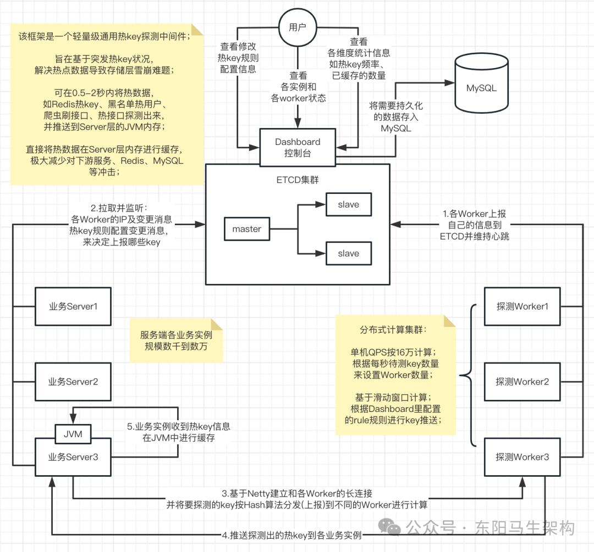
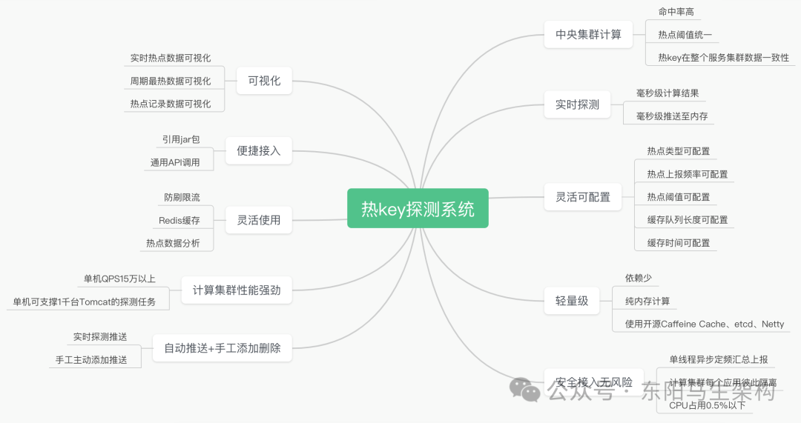

# Redis应用—6.热key探测设计与实践

> **公众号**: 东阳马生架构  
> **发布时间**: 2024-12-18 22:50  

**大纲(10354字)**

- 1.热key引发的巨大风险
- 2.以往热key问题怎么解决
- 3.热key进内存后的优势
- 4.热key探测关键指标
- 5.热key探测框架JdHotkey的简介
- 6.热key探测框架JdHotkey的组成
- 7.热key探测框架JdHotkey的工作流程
- 8.热key探测框架JdHotkey的性能表现
- 9.关于热key探测框架JdHotkey的一些问题
- 10.JdHotkey的安装部署与使用


## 1.热key引发的巨大风险

### (1)数据层的风险

### (2)服务层的风险

在拥有大量并发用户的系统中，热key一直以来都是一个不可避免的问题。某商品突然成爆款、海量用户突然涌入某店铺、秒杀瞬间的大量爬虫请求，这些突发的无法预知的热key都是系统潜在的巨大风险。风险是什么呢？主要是数据层，其次是服务层。

### (1)数据层的风险

热key对数据层的冲击显而易见，譬如数据存放在Redis或者MySQL中。以Redis为例，那个未知的热数据会按照Hash规则存放在某个Redis分片上。

平时使用时都是从该分片获取它的数据，由于Redis高性能 + 集群模式，每秒假设该分片能支撑20万次读取，这足以支持大部分的日常使用了。

但是以京东为例的这些头部互联网公司，很容易出现某个爆品。爆品会瞬间引入每秒百万级的请求，当然流量多数会在几秒内就消失。但就是这短短的几秒热key，就会瞬间造成其所在Redis分片集群瘫痪。

原因很简单：Redis作为一个单线程的结构，所有的请求到来后都会去排队。当请求量远大于自身处理能力时，后面的请求就会陷入等待、超时。

由于该Redis分片完全被这个key的请求给打满，导致该分片上所有其他数据操作都无法继续提供服务。也就是热key不仅仅影响自己，还会影响和它合租的数据。很显然，在这个极短的时间窗口内，无法快速扩容10倍来支撑这个热点的。虽然Redis已经很优秀，但这种场景下，Redis却成为了最大的瓶颈。

### (2)服务层的风险

热key对服务层的影响也不可小视。比如原本有1000台Tomcat，每台每秒能支撑1000QPS。假设数据层稳定、这样服务层每秒能承接100万个请求。

但是由于某个爆品的出现、或者由于大促优惠活动，突发大批机器人以远超正常用户的速度发起极其密集的请求，这些机器人轻易发出普通用户的百倍请求量，从而大幅挤占正常用户的资源。

原本能承接100万，现在来了150万，其中50万个是机器人请求。那么就导致了至少1/3的正常用户无法访问，带来较差的用户体验。

## 2.以往热key问题怎么解决

### (1)Redis热key的解决方式

### (2)刷子爬虫用户的解决方式

### (3)限流的方式

下面分别以Redis的热key、刷子用户、限流等典型的场景来看。

### (1)Redis热key的解决方式

这种场景的解决方式比较百花齐放，比较常见的有：

#### 一.使用二级缓存

读取到Redis的key-value信息后，就直接写入到JVM缓存多一份。同时设置JVM缓存过期时间，设置淘汰策略譬如队列满时淘汰最先加入的。或者使用Guava Cache或Caffeine Cache进行单机本地缓存。但是这种做法普遍整体命中率偏低。

#### 二.改写Redis源码加入热点探测功能

当Redis服务端发现有热key时就推送到JVM，但这种方法主要是不通用，而且有一定难度。

#### 三.改写Jedis、Letture等Redis客户端的jar

通过本地计算来探测热点key，如果发现是热key那么就在本地缓存起来，然后通知集群内其他机器。

### (2)刷子爬虫用户的解决方式

方式一：日常累积黑名单通过配置中心推送到JVM内存，但这种方法存在滞后无法实时感知的问题。

方式二：通过本地累加进行实时计算，单位时间内超过阈值的算刷子。如果服务器比较多，存在用户请求被分散，本地计算不能甄别刷子的问题。

方式三：引入其他组件如Redis，进行集中式累加计算，超过阈值的拉取到本地内存。问题就是需要频繁读写Redis，依旧存在Redis性能瓶颈问题。

### (3)限流的方式

#### 一.单机维度的限流多采用本地累加计数

#### 二.集群维度的限流多采用第三方中间件如Sentinel

#### 三.网关维度的限流多使用Nginx + Lua

### (4)总结

综上，我们会发现虽然它们都可以归结到热key这个领域内。但是并没有一个统一的解决方案，我们更期望于有一个统一的框架，这个统一的框架能解决所有的需要对热key进行实时感知的场景。

最好是无论是什么key、是什么维度，只要拼接好这个字符串，把它交给框架去探测，并且设定好判定为热key的阈值(比如2秒该字符串出现20次)。那么在毫秒时间内，该热key就能进入到应用的JVM内存中，而且在整个服务集群内保持一致性，要么集群一起都有，要么一起没有。

## 3.热key进内存后的优势

热key问题归根到底就是如何找到热key，并将热key放到JVM内存的问题。

只要该key在内存里，我们就能极快地对它做逻辑，内存访问和Redis访问的速度不在一个量级。比如刷子用户，可以对其屏蔽、降级、限制访问速度。比如热接口，可以进行限流、返回默认值。比如Redis的热key，可以极大地提高访问速度。

以Redis访问key为例，可以很容易的计算出性能指标。譬如有1000台服务器，某key所在的Redis集群能支撑20万/s的访问。那么平均每台机器每秒大概能访问该key200次，超过的部分就会进入等待。由于Redis的瓶颈，将极大地限制Server的性能。

而如果该key是在本地内存中，读取一个内存中的值，每秒多少万次都是很正常的，不存在数据层的瓶颈。当然，如果通过增加Redis集群规模的形式，也能提升数据的访问上限。但问题是事先不知道热key在哪，而全量增加Redis的规模会大大增加成本。

## 4.热key探测关键指标

### (1)实时性

### (2)准确性

### (3)集群一致性

### (4)高性能

### (1)实时性

这个很容易理解，key往往是突发性瞬间就热了，根本不允许手工去配置中心添加热key再推送到JVM。

热key大部分时间不可预知，来得非常迅速。可能某个商家上个活动，瞬间热key就出现了。如果短时间内没能进到内存，就有Redis集群被打爆的风险。

所以热key探测框架最重要的就是实时性，最好是某个key刚准备热，在1秒内它就已进到整个服务集群的内存里，1秒后就不会再去密集访问Redis了。

同理，对于刷子用户也一样，刚开始刷，1秒内就把它给禁掉了。

### (2)准确性

这个很重要，也容易实现。累加数量，做到不误探，精准探测，保证探测出的热key是完全符合用户自己设定的阈值。

### (3)集群一致性

这个比较重要，尤其是某些带删除key的场景，要能做到删key时整个集群内的该key都会删掉，以避免数据的错误。

### (4)高性能

这个是核心之一，高性能带来的就是低成本。热key探测目的就是为了降低数据层负载，提升应用层性能，节省资源。理论上，在不影响实时性的情况下，要完成实时热key探测，所消耗的机器资源越少，那么经济价值就越大。

## 5.热key探测框架JdHotkey的简介

### (1)热key探测框架JdHotkey的特点

### (2)热key探测框架JdHotkey的使用

### (3)热key探测框架JdHotkey的强实时性和高性能

### (4)热key探测框架JdHotkey的架构设计

在经历了多次被突发海量请求压垮数据层服务的场景，并时刻面临大量的爬虫刷子机器人用户的请求，京东根据既有经验设计开发了一套通用轻量级热key探测框架——JdHotkey。

### (1)热key探测框架JdHotkey的特点

热key探测框架JdHotkey具有：热数据探测、限流熔断、统计等多种功能。

它很轻量级，既不改Redis源码也不改Redis的客户端jar包。当然，它与Redis没一点关系，完全不依赖Redis，它是一个独立的系统。

### (2)热key探测框架JdHotkey的使用

首先部署好JdHotkey热key探测系统，然后在应用的Server代码里引入jar，之后在应用的Server代码中就可以像使用一个本地HashMap来使用该系统。

热key探测框架JdHotkey自身会完成如下一切处理：包括对待测key的上报、对热key的推送、本地热key的缓存、过期淘汰策略。框架只会告知是不是热key，其他的逻辑则由我们自己去实现即可。

### (3)热key探测框架JdHotkey的强实时性和高性能

热key探测框架JdHotkey有很强的实时性。默认下，500ms即可探测出待测key是否热key，是就会进到JVM内存中。当然，JdHotkey框架也提供了更快频率的设置方式。通常在非极端场景建议保持默认值即可，更高的频率会带来更大的资源消耗。

热key探测框架JdHotkey还有着强悍的性能表现。一台8核8G机器，在承担该框架热key探测计算任务时，每秒可处理来自数千台服务器发来的高达16万个的待测key。8核单机吞吐量16万，16核机器每秒可达30万+探测量，当然前提是CPU很稳定。

高性能代表了低成本，所以可以仅仅采用10台16核机器，即可完成每秒近300万次的key探测任务。一旦找到了热key，那该数据的访问耗时就和Redis不在一个数量级了。

### (4)热key探测框架JdHotkey的架构设计

热key探测框架JdHotkey的架构图如下所示：



## 6.热key探测框架JdHotkey的组成

### (1)etcd集群

### (2)Client端jar包

### (3)Worker端集群

### (4)Dashboard控制台

该框架主要由4个部分组成。

### (1)etcd集群

etcd是一个高性能的配置中心，etcd可以以极小的资源占用，提供高效的监听订阅服务。主要用于存放规则配置、Worker的IP、探测出的热key、手工添加的热key。

### (2)Client端jar包

就是在服务中添加的引用jar，引入后，就可以以便捷的方式去判断某key是否热是key。同时该jar还完成了：key上报、监听etcd的规则配置的变化、Worker信息变化、热key的变化、对热key进行本地Caffeine缓存等。

### (3)Worker端集群

Worker端是一个独立部署的Java程序，启动后会连接etcd，并定期上报自己的IP信息。Client端会通过etcd获取Worker端的地址并进行长连接。之后，Worker端主要就是对各个Client发来的待测key进行累加计算。当达到etcd里设定的rule阈值后，将热key推送到各个Client。

### (4)Dashboard控制台

控制台是一个带可视化界面的Java程序，也是连接到etcd。之后在控制台设置各个APP的key规则，譬如2秒出现20次算热key。然后当Worker探测出来热key后，会将key发往etcd。Dashboard也会监听热key信息，进行入库保存记录。同时，Dashboard也可以手工添加、删除热key，供各个Client端监听。

综上，可以看到热key探测框架JdHotkey没有依赖于任何定制化的组件。与Redis更是毫无关系，核心就是靠Netty连接，Client端送出待测key，然后由各个Worker完成分布式计算，算出热key后就直接推送到Client端，非常轻量级。

## 7.热key探测框架JdHotkey的工作流程

### (1)首先搭建etcd集群

### (2)启动Dashboard可视化界面

### (3)启动Worker集群

### (4)启动Client端

### (5)Client端主要有如下4个⽅法可供使⽤

### (1)首先搭建etcd集群

etcd是一个全局共用的配置中心，etcd能让所有的Client读取到完全一致的Worker信息和Rule信息。

### (2)启动Dashboard可视化界面

在界面上添加各个APP的待测规则，如app1它包含两个规则：第一个是userId_开头的key，如userId_abc，每2秒出现20次则算热key。第二个是skuId_开头的每1秒出现超过100次则算热key。只有命中规则的key才会被发送到Worker进行计算。

### (3)启动Worker集群

Worker集群可以配置APP级别的隔离，也可以不隔离。做了隔离后，这个app就只能使用这几个Worker，以避免其他APP在性能资源上产生竞争。

Worker启动后，会从etcd读取之前配置好的规则，并持续监听规则的变化。然后，Worker会定时上报自己的IP信息到etcd。如果一段时间没有上报，etcd会将该Worker信息删掉。

Worker上报的IP会供Client进行长连接，各Client以etcd里该app能用的Worker信息为准进行长连接，并且会根据Worker的数量将待测的key进行hash后平均分配到各个Worker。

之后，Worker就开始接收并计算各个Client发来的key。当某key达到规则里设定的阈值后，将其推送到该APP全部客户端jar。之后再推送一份到etcd，供Dashboard监听记录。

### (4)启动Client端

Client端启动后会连接etcd，通过etcd获取规则、获取专属的Worker IP信息，之后持续监听该信息。

获取到IP信息后，Client会通过Netty建立和Worker的长连接。

Client会启动一个定时任务：每500ms就批量发送一次待测key到对应的Worker机器。发送规则是key的HashCode对Worker数量取余，所以固定的key肯定会发送到同一个Worker。这500ms内，就是本地搜集累加待测key及其数量，到期就批量发出即可。注意，已经热了的key不会再次发送，除非本地该key缓存已过期。

当Worker探测出来热key后，会推送到Client。Client端会采用Caffeine进行本地缓存，会根据当初设置的rule里的过期时间进行本地过期设置。

当然，如果在控制台手工新增、删除了热key，那么Client端也会监听到，并会对本地Caffeine进行增删处理。这样，各个热key在整个Client集群内是保持一致性的。

jar包对外提供了判断是否是热key的方法。如果是热key，那么只需要关心自己的逻辑处理就好。是限流它、是降级它访问的接口、还是返回value，都依赖于自己的逻辑。

注意：我们关注的只有key本身，也就是一个字符串而已，而不关心value。那么此时必然有一个疑问：如果是Redis的热key，框架告诉了哪个是热key，并没有告知value。是的，该框架只提供了是否是热key的方法。如果是Redis热key，就需要用户自己去Redis获取value。然后调用框架的set方法，将value也set进去就好。如果不是热key，那么就走原来的逻辑即可。

所以可将JdHotkey框架当成一个具备热key的HashMap但需要自己维护value值。

综上，该框架以非常轻量级的做法，实现了毫秒级热key精准探测和集群一致性。适用于大量场景，任何对某些字符串有热度匹配需求的场景都可以使用。

### (5)Client端主要有如下4个⽅法可供使⽤

#### 一.boolean isHotKey(String key)

该⽅法会返回给定的key是否是热key。如果是则返回true，如果不是则返回false，并且会将key上报到探测集群进⾏数量计算。该⽅法通常⽤于只需要判断key是否热、不需要缓存value的场景，如刷⼦⽤户、接⼝访问频率等。

#### 二.Object get(String key)

该⽅法会返回给定的key在本地缓存的value值。可⽤于判断是热key后，再去获取本地缓存的value值，通常⽤于Redis热key缓存。

#### 三.void smartSet(String key, Object value)

⽅法给热key赋值value。如果是热key，该⽅法才会赋值，⾮热key，那么该方法什么也不做。

#### 四.Object getValue(String key)

该⽅法是⼀个整合⽅法，相当于isHotKey和get两个⽅法的整合，该⽅法直接返回本地缓存的value。如果是热key，则存在两种情况，1是返回value，2是返回null。返回null是因为尚未给它set真正的value，返回⾮null说明已经调⽤过set⽅法了，本地缓存value有值了。如果不是热key，则返回null，并且将key上报到探测集群进⾏数量探测。

## 8.热key探测框架JdHotkey的性能表现

### (1)etcd端

### (2)Worker端

### (1)etcd端

etcd性能优异，官方宣称秒级读写可达数万。框架仅仅使用etcd来进行热key的推送，以及其他少量信息的监听读写。数千级别的客户端连接，平时秒级百来个热key诞生。所以CPU占用率不超过5%，大部分时间在1%左右。

### (2)Worker端

Worker端是JdHotkey框架最核心的一环，也是承载分布式计算压力最大的部分，需要根据秒级各Client发来的key总量来进行资源分配。假如每秒有100万个key待测，那么需要知道单个Worker的处理能力，然后决定分配多少个Worker机器来均分这些计算任务。这里也是调优的核心，越高的QPS，就是越低的成本。

经过测试发现：8核8G的Worker，单机每秒可处理10万级别的key探测计算和推送任务。16核16G的Worker，则可较为轻松应对20万每秒的处理任务。



## 9.关于热key探测框架JdHotkey的一些问题

### (1)Worker挂了怎么办

由于Client根据Worker的数量对key进行Hash后分发，所以同一个key一定会被发往同一个Worker。

假设4台Worker挂了一台，那么key就自动Hash到另外3台。而在这个过程中，就会丢失最多一个探测周期内的所有发来的key。比如2秒10次算热，那么就可能全部被rehash，丢失这2秒的数据。

它的影响是什么呢？要不要去存下所有发来的key呢？首先挂机是极其罕见的事件，即便挂了，对于特别热的key，完全不影响。对于特别热的key，Hash丢几秒，不影响它继续瞬间变热。对于不热的key，它挂不挂，它也热不了。对于那些将热未热的，可能这次会让它热不起来。但也没有什么影响，因为业务服务完全可以吃下这个将热未热的key。

否则，引入一堆别的组件如存储、Worker间通信传输key等，那么它的复杂度、性能都会受影响，所以Worker挂了对系统没有任何影响。

### (2)为什么全部要Worker汇总计算，而不是客户端自己计算

首先，客户端是会本地累加的。在固定的上报周期内，如500ms内，本地就是在累加的。客户端会每500ms批量上报一次给Worker。如果上报频率很高，如10ms一次，那么大概率本地同一个key是没有累加。

有人会说，把这个间隔拉长。比如本地计算3秒后，本地判定热key，再上报给其他机器。那么这种场景首先对于京东是不可行的，哪怕1秒都不行。比如一个用户刷子，它在非常频繁地刷接口，一秒刷了500次，而正常用户一秒最多点5次，它已经是非常严重的刷子了，但本地还是判断不出它是不是刷子。

为什么不能把上报间隔拉长？

原因一：因为机器多，随便一个APP小组都有数千台机器，一秒500次请求。那么一个机器连1次都平均不到，大部分是0次，本地如何判断它是刷子呢？总不能访问一次就算它刷吧。

原因二：然后抢购场景，有些秒杀商品1-2秒就没了，流量就停了。如果本地计算了3秒才去上报，那活动已经结束了，这时热key已没价值了。

所以要在活动即将开始前的如10ms内，就要把该商品推送到所有Client的JVM里，根本等不了1秒。

### (3)为什么是Worker推送，而不是发送热key到etcd，客户端直接监听

原因一：Worker和Client是长连接，产生热key后直接推送过去，链路短耗时少。如果发到etcd，客户端再通过etcd获取，多了一层中转，耗时增加。

原因二：etcd性能不够，存在单点风险。比如有5000台Client，每秒产生100个热key，则每秒就对应50万次推送。用2台Worker就轻松完成，随着Worker横向扩展，每秒推送上限线性增加。但无论是etcd、Redis等任何组件，都不可能做到1秒50万次拉取或推送。因为Worker是各自隔离的，而etcd是单点的。

### (4)为什么是etcd而不是zk之类的

原因一：etcd里具备一个过期删除的功能，别的配置中心没有这个功能。etcd可以设置一个key几秒过期，etcd会自动删除它。删除时还会给所有监听的client回调，这个功能在这个框架里是在用的。

原因二：etcd的性能和稳定性、低负载等各项指标非常优异，完全满足需求。而zk在很多暴涨流量前面和高负载下，并不是那么稳定，性能也差得远。毕竟zk只有一个Leader机器可以处理事务请求。

## 10.JdHotkey的安装部署与使用

### (1)etcd安装

这⾥选择v3.4.18分⽀，创建如下etcd-install.sh脚本⽂件，执⾏脚本sh etch-install.sh即可下载安装。

```bash
#!/bin/bash
ETCD_VER=v3.4.18
# choose either URL
GOOGLE_URL=https://storage.googleapis.com/etcd
GITHUB_URL=https://github.com/etcd-io/etcd/releases/download
DOWNLOAD_URL=${GOOGLE_URL}
rm -f /tmp/etcd-${ETCD_VER}-linux-amd64.tar.gz
rm -rf /tmp/etcd-download-test && mkdir -p /tmp/etcd-download-test
curl -L ${DOWNLOAD_URL}/${ETCD_VER}/etcd-${ETCD_VER}-linux-amd64.tar.gz -o
/tmp/etcd-${ETCD_VER}-linux-amd64.tar.gz
tar xzvf /tmp/etcd-${ETCD_VER}-linux-amd64.tar.gz -C /tmp/etcd-download-
test --strip-components=1
rm -f /tmp/etcd-${ETCD_VER}-linux-amd64.tar.gz
/tmp/etcd-download-test/etcd --version
/tmp/etcd-download-test/etcdctl version
```

#### 一.单机启动

单机启动，使⽤如下命令：

```shell
$ nohup /tmp/etcd-download-test/etcd \
--listen-client-urls 'http://0.0.0.0:2379' \
--advertise-client-urls 'http://0.0.0.0:2379' 2>&1 &
```

查看节点状态，使用如下命令：

```shell
$ /tmp/etcd-download-test/etcdctl --write-out=table \
--endpoints=localhost:2379 endpoint status
```

#### 二.集群部署

⾸先准备三台机器，IP为192.168.10.97、192.168.10.102、192.168.10.103。在97这台机器上创建start-etcd.sh，并指定name为demo-etcd-1。将start-etcd.sh复制到其他两台机器上，在102这台机器上将name改为demo-etcd-2，host改为192.168.10.102。在103这台机器上将name改为demo-etcd-3，host改为192.168.10.103。

这样启动脚本就准备好了，接着在每台机器上，执⾏start-etcd.sh脚本。并且在其中⼀台机器上，查看集群状态：

```shell
$ /tmp/etcd-download-test/etcdctl --write-out=table \
--endpoints=192.168.10.97:2379,192.168.10.102:2379,192.168.10.103:2379 \
endpoint status
```

脚本start-etcd.sh如下：

```bash
#!/bin/bash
NAME=careerplan-etcd-1
HOST=http://192.168.10.97
PORT=2379
CLUSTER_PORT=2380
CLUSTER=demo-etcd-1=http://192.168.10.97:2380,demo-etcd-2=http://192.168.10.102:2380,demo-etcd-3=http://192.168.10.103:2380
CLUSTER_TOKEN=demo-etcd-token
CLUSTER_STATE=new
ETCD_CMD="/tmp/etcd-download-test/etcd --name ${NAME} \
--listen-client-urls ${HOST}:${PORT} \
--advertise-client-urls ${HOST}:${PORT} \
--listen-peer-urls ${HOST}:${CLUSTER_PORT} \
--initial-advertise-peer-urls ${HOST}:${CLUSTER_PORT} \
--initial-cluster ${CLUSTER} \
--initial-cluster-token ${CLUSTER_TOKEN} \
--initial-cluster-state ${CLUSTER_STATE} \
--auto-compaction-retention=10 \
--quota-backend-bytes=8589934592 \
$*"
echo -e "Running '${ETCD_CMD}'\nBEGIN ETCD OUTPUT\n"
nohup ${ETCD_CMD} > /tmp/logs/etcd.log 2>&1 &
```

### (2)创建数据库

由于JdHotkey的Dashboard需要依赖数据库，所以首先需要安装MySQL，然后创建名为hotkey_db的数据库，接着执⾏Dashboard模块中路径为./src/main/resource/db.sql里的数据库脚本。

### (3)部署JdHotkey项目

下载JdHotkey代码：

```shell
$ git clone https://gitee.com/jd-platform-opensource/hotkey.git
```

然后在hotkey项⽬⽬录下，通过maven打包编译代码，maven install。

#### 一.部署Dashboard

在dashboard/target⽬录下，打包会⽣成dashboard-0.0.2-SNAPSHOT.jar。将jar包上传⾄Dashboard服务器，启动Dashboard：

```diff
$ nohup java -jar dashboard-0.0.2-SNAPSHOT.jar \
 --etcd.server=192.168.10.97:2379,192.168.10.102:2379,192.168.10.103:2379 \
 --spring.datasource.url='jdbc:mysql://ip:port/hotkey_db?useUnicode=true&characterEncoding=utf-8&useSSL=false&serverTimezone=Asia/Shanghai&allowPublicKeyRetrieval=true' \
 --spring.datasource.username=root \
 --spring.datasource.password=123456 2>&1 &
```

其中etcd.serve参数，根据单机启动或者集群部署，来选择配置，数据库配置根据实际使⽤数据库来配置。

```javascript
访问http://192.168.10.97:8081/
⽤户名/密码：admin/123456
⽤户注销：http://192.168.10.97:8081/user/LoginOut

注：如果连接etcd失败，需要开通部分端⼝对外访问，直接点就关闭防⽕墙
systemctl stop firewalld.service
```

#### 二.部署Worker

Worker的部署与Dashboard类似。在worker/target⽬录下，打包会⽣成worker-0.0.4-SNAPSHOT.jar。将jar包上传⾄Worker服务器，启动Worker。

```diff
$ nohup java -jar worker-0.0.4-SNAPSHOT.jar \
 --etcd.server=192.168.10.97:2379,192.168.10.102:2379,192.168.10.103:2379 \
 --thread.count=8 2>&1 &
```

### (4)Client端的使用

#### 一.项⽬引⼊Client端jar包

第三步将hotkey项⽬通过maven打包后，会放在本地的maven仓库中，所以可使⽤如下maven坐标：

```xml
<!-- 京东hotkey，热key探测框架-->
<dependency>
    <groupId>com.jd.platform.hotkey</groupId>
    <artifactId>hotkey-client</artifactId>
    <version>${hotkey.version}</version>
</dependency>
```

#### 二.hotkey相关配置(application.yml)

```cs
# hotkey相关配置
hotkey:
    app-name: demo-redis
# etcd服务器地址，集群⽤逗号分隔
    etcd-server: http://192.168.10.97:2379
# 设置本地缓存最⼤数量，默认5万
    caffeine-size: 50000
# 批量推送key的间隔时间，默认500ms，该值越⼩，上报热key越频繁，相应越及时，建议根据实际情况调整
# 如单机每秒qps10个，那么0.5秒上报⼀次即可，否则是空跑。该值最⼩为1，即1ms上报⼀次。push-period: 500
```

#### 三.初始化hotkey

```java
//hotkey的配置信息
@Data
@Component
@ConfigurationProperties(prefix = "hotkey")
public class HotkeyProperties {
    private String appName;
    private String etcdServer;
    private Integer caffeineSize;
    private Long pushPeriod;
}

@Component
@EnableConfigurationProperties(HotkeyProperties.class)
public class HotkeyConfig {
    //配置内容对象
    @Autowired
    private HotkeyProperties hotkeyProperties;

    @PostConstruct
    public void initHotkey() {
        log.info("init hotkey, appName:{}, etcdServer:{}, caffeineSize:{}, pushPeriod:{}",
            hotkeyProperties.getAppName(), hotkeyProperties.getEtcdServer(),
            hotkeyProperties.getCaffeineSize(), hotkeyProperties.getPushPeriod());
        ClientStarter.Builder builder = new ClientStarter.Builder();
        ClientStarter starter = builder.setAppName(hotkeyProperties.getAppName())
            .setEtcdServer(hotkeyProperties.getEtcdServer())
            .setCaffeineSize(hotkeyProperties.getCaffeineSize())
            .setPushPeriod(hotkeyProperties.getPushPeriod())
            .build();
        starter.startPipeline();
    }
}
```

#### 四.在RedisCache中增加⼀个⽅法

先查hotkey内存中是否有数据。如果有就使⽤内存中的数据，减轻Redis的压⼒。如果没有，则查询Redis中的数据。如果还是没有，则查询数据库。

```cs
@Component
public class RedisCache {
    ...
    //缓存获取
    //首先尝试从内存中获取，内存中没有则从redis中获取
    //@param key
    //@return java.lang.String

    public Object getCache(String key) {
        //从内存中获取商品信息
        //如果是热key，则存在两种情况，1是返回value，2是返回null；
        //返回null是因为尚未给它set真正的value，返回非null说明已经调用过set方法了，本地缓存value有值了；
        //如果不是热key，则返回null，并且将key上报到探测集群进行数量探测；
        Object hotkeyValue = JdHotKeyStore.getValue(key);
        log.info("从内存中获取信息,key:{},value:{}", key, hotkeyValue);
        if (hotkeyValue != null) {
            return hotkeyValue;
        }
        String value = this.get(key);
        log.info("从缓存中获取信息,key:{},value:{}", key, value);

        //方法给热key赋值value，如果是热key，该方法才会赋值，非热key，什么也不做
        //如果是热key，存储在内存中
        //每次从缓存中获取数据后都尝试往热key中放一下
        //如果不放，则在成为热key之前，将数据放入缓存中了，但是没放到内存中
        //如果此时变成热key了，但是下次查询内存没查到，查缓存信息，查到了，就直接返回了，内存中就没有数据
        JdHotKeyStore.smartSet(key, value);
        return value;
    }
    ...
}
```

#### 五.以商品信息为例，使⽤hotkey

```typescript
@Service
public class GoodsServiceImpl implements GoodsService {
    ...
    private SkuInfoDTO getSkuInfoBySkuId(Long skuId) {
        String goodsInfoKey = RedisKeyConstants.GOODS_INFO_PREFIX + skuId;
        //从内存或者缓存中获取数据
        Object goodsInfoValue = redisCache.getCache(goodsInfoKey);

        if (Objects.equals(CacheSupport.EMPTY_CACHE, goodsInfoValue)) {
            //如果是空缓存，则是防止缓存穿透的，直接返回null
            return null;
        } else if (goodsInfoValue instanceof SkuInfoDTO) {
            //如果是对象，则是从内存中获取到的数据，直接返回
            return (SkuInfoDTO) goodsInfoValue;
        } else if (goodsInfoValue instanceof String) {
            //如果是字符串，则是从缓存中获取到的数据，重新设置过期时间，转换成对象之后返回
            redisCache.expire(goodsInfoKey, CacheSupport.generateCacheExpireSecond());
            return JsonUtil.json2Object((String) goodsInfoValue, SkuInfoDTO.class);
        }

        // 未在内存和缓存中获取到值，从数据库中获取
        return getSkuInfoBySkuIdFromDB(skuId);
    }
    ...
}
```

从DB中查询数据的⽅法如下：

```typescript
@Service
public class GoodsServiceImpl implements GoodsService {
    ...
    private SkuInfoDTO getSkuInfoBySkuIdFromDB(Long skuId) {
        String skuInfoLock = RedisKeyConstants.GOODS_LOCK_PREFIX + skuId;
        boolean lock = redisLock.lock(skuInfoLock);
        if (!lock) {
            log.info("缓存数据为空，从数据库查询商品信息时获取锁失败，skuId:{}", skuId);
            throw new BaseBizException("查询失败");
        }
        try {
            log.info("缓存数据为空，从数据库中获取数据，skuId:{}", skuId);
            SkuInfoDO skuInfoDO = skuInfoDAO.getById(skuId);
            String goodsInfoKey = RedisKeyConstants.GOODS_INFO_PREFIX + skuId;
            if (Objects.isNull(skuInfoDO)) {
                //如果商品编码对应的商品⼀开始不存在，设置空缓存，防⽌缓存穿透
                redisCache.setCache(goodsInfoKey, CacheSupport.EMPTY_CACHE, CacheSupport.generateCachePenetrationExpireSecond());
                return null;
            }
            SkuInfoDTO dto = skuInfoConverter.convertSkuInfoDTO(skuInfoDO);
            dto.setSkuId(skuInfoDO.getId());
            dto.setSkuImage(JSON.parseArray(skuInfoDO.getSkuImage(), SkuInfoDTO.ImageInfo.class));
            dto.setDetailImage(JSON.parseArray(skuInfoDO.getDetailImage(), SkuInfoDTO.ImageInfo.class));
            //设置缓存过期时间，2天加上随机⼏⼩时
            redisCache.setCache(goodsInfoKey, dto, CacheSupport.generateCacheExpireSecond());
            return dto;
        } finally {
            redisLock.unlock(skuInfoLock);
        }
    }
    ...
}
```

#### 六.接下来将缓存存储，改为setCache()⽅法

setCache()方法会尝试将数据存储在hotkey的内存中(如果是热key)，然后再将数据存储在缓存中。

```cs
@Component
public class RedisCache {
    ...
    //缓存存储
    //将数据存储在内存和Redis中，如果不是热key，就只存储Redis
    public void setCache(String key, Object value, int seconds) {
        //法给热key赋值value，如果是热key，该方法才会赋值，非热key，什么也不做
        //如果是热key，存储在内存中
        JdHotKeyStore.smartSet(key, value);
        this.set(key, JsonUtil.object2Json(value), seconds);
    }
    ...
}
```

#### 七.整合hotkey-client时遇到了jar包冲突的问题

将maven依赖调整为如下，指定gRPC的版本为1.30.1：

```xml
<!-- 这⾥指定gRPC的版本为1.30.1，因为hotkey中的etcd-java中依赖的版本会存在jar包冲突 -->
<dependency>
    <groupId>io.grpc</groupId>
    <artifactId>grpc-netty</artifactId>
    <version>${grpc-version}</version>
    <scope>compile</scope>
</dependency>
<dependency>
    <groupId>io.grpc</groupId>
    <artifactId>grpc-protobuf</artifactId>
    <version>${grpc-version}</version>
    <scope>compile</scope>
</dependency>
<dependency>
    <groupId>io.grpc</groupId>
    <artifactId>grpc-core</artifactId>
    <version>${grpc-version}</version>
    <scope>compile</scope>
</dependency>
<dependency>
    <groupId>io.grpc</groupId>
    <artifactId>grpc-context</artifactId>
    <version>${grpc-version}</version>
    <scope>compile</scope>
</dependency>
<dependency>
    <groupId>io.grpc</groupId>
    <artifactId>grpc-api</artifactId>
    <version>${grpc-version}</version>
    <scope>compile</scope>
</dependency>
<dependency>
    <groupId>io.grpc</groupId>
    <artifactId>grpc-stub</artifactId>
    <version>${grpc-version}</version>
    <scope>compile</scope>
</dependency>
<!-- 京东hotkey，热key探测框架-->
<dependency>
    <groupId>com.jd.platform.hotkey</groupId>
    <artifactId>hotkey-client</artifactId>
    <version>${hotkey.version}</version>
</dependency>
```
