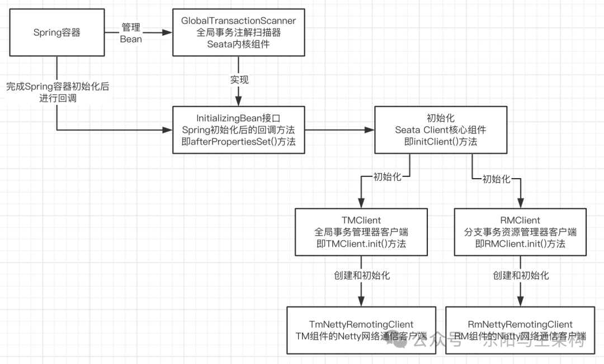
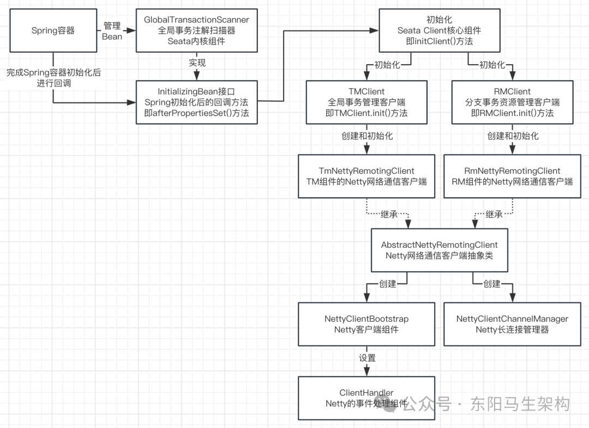
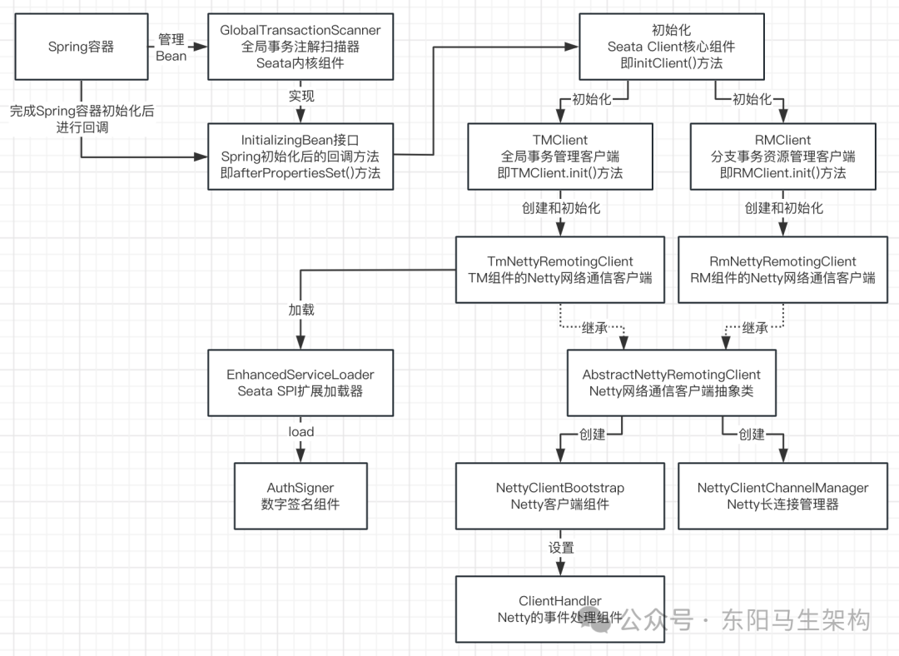
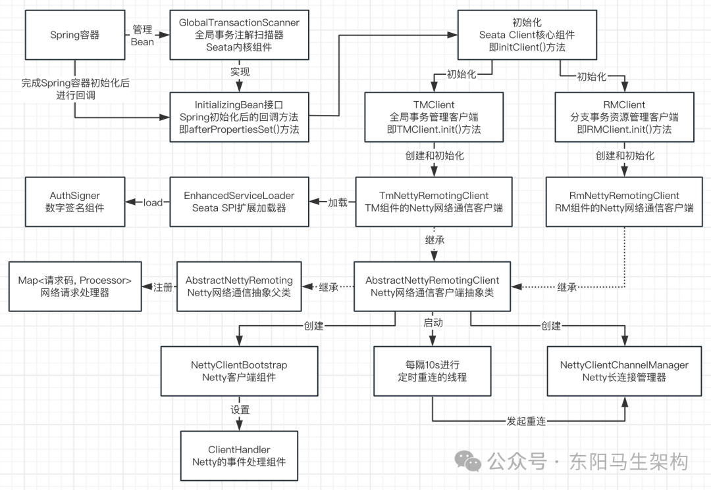
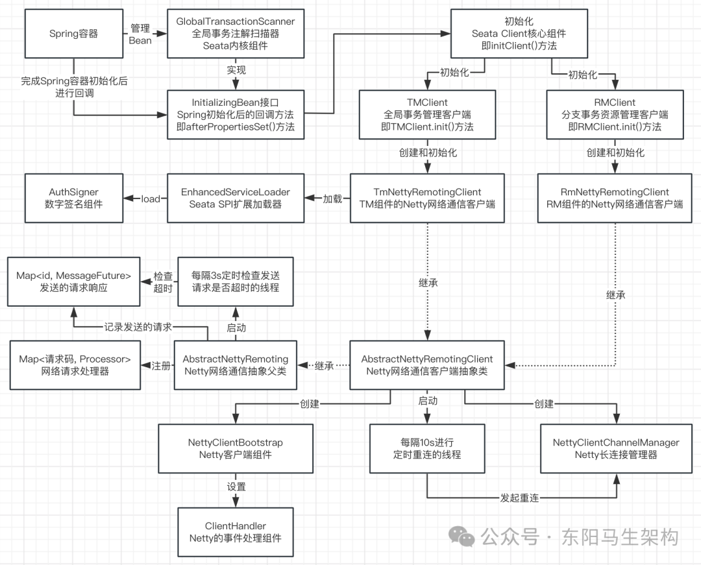
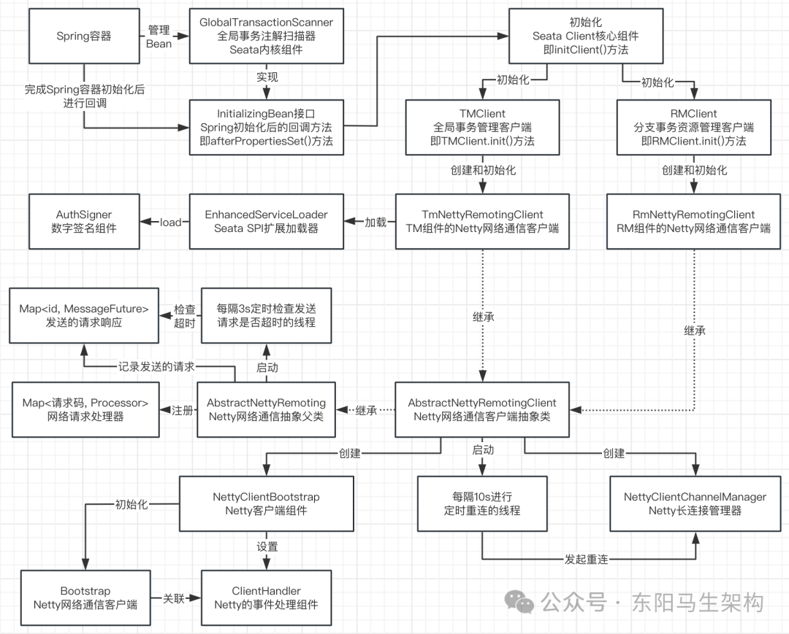
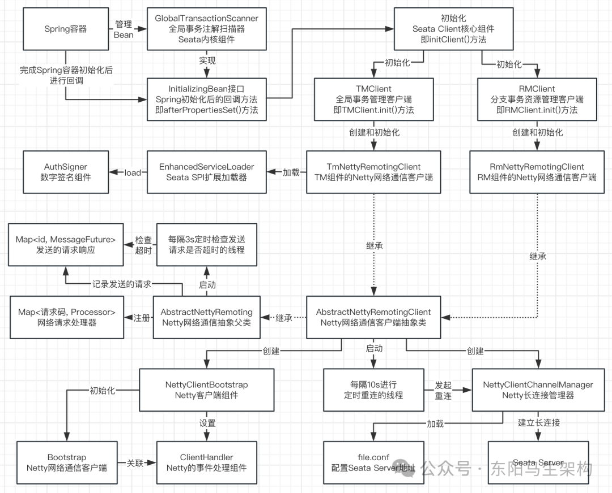
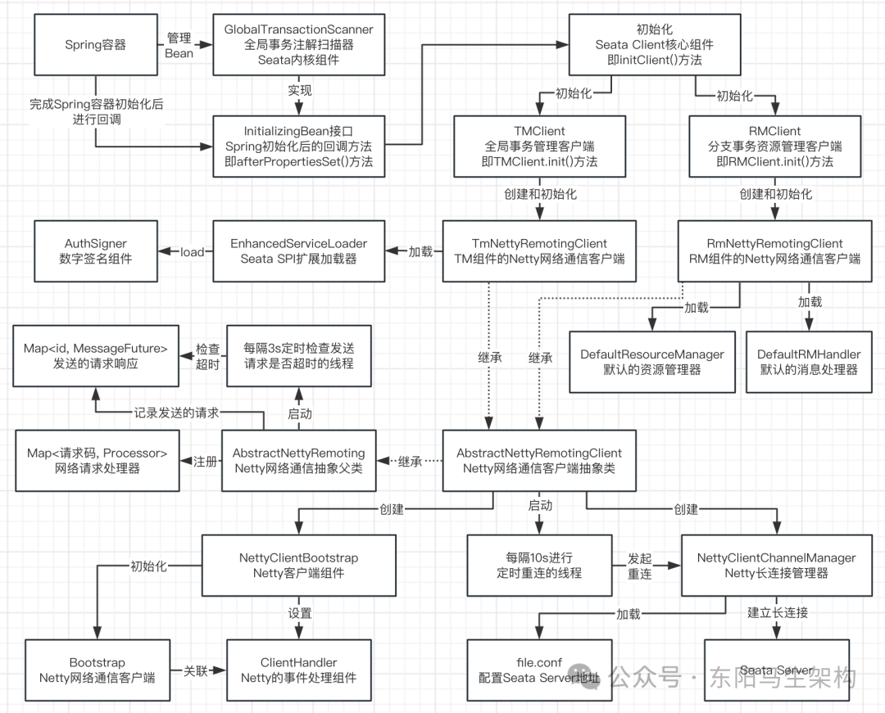
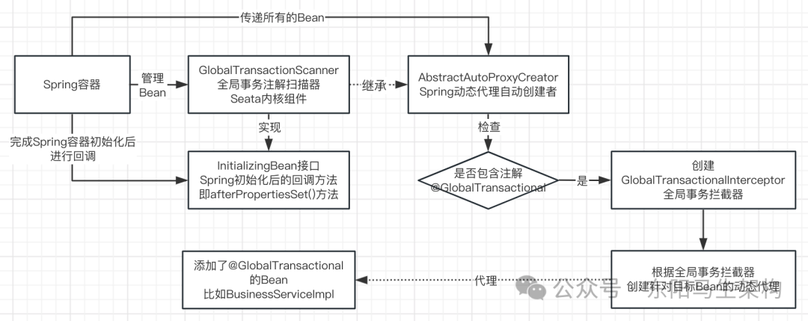

# Seata源码—3.全局事务注解扫描器的初始化

> **公众号**: 东阳马生架构  
> **发布时间**: 2025-05-16 19:30  

**大纲(16678字)**

- 1.全局事务注解扫描器继承的父类与实现的接口
- 2.全局事务注解扫描器的核心变量
- 3.Spring容器初始化后初始化Seata客户端的源码
- 4.TM全局事务管理器客户端初始化的源码
- 5.TM组件的Netty网络通信客户端初始化源码
- 6.Seata框架的SPI动态扩展机制源码
- 7.向Seata客户端注册网络请求处理器的源码
- 8.Seata客户端的定时调度任务源码
- 9.Seata客户端初始化Netty Bootstrap的源码
- 10.Seata客户端的寻址机制与连接服务端的源码
- 11.RM分支事务资源管理器客户端初始化的源码
- 12.全局事务注解扫描器扫描Bean是否有Seata注解
- 13.Seata全局事务拦截器的创建和初始化
- 14.基于Spring AOP创建全局事务动态代理的源码
- 15.全局事务注解扫描器的初始化总结


如下的代码都是位于seata-spring模块下。

## 1.全局事务注解扫描器继承的父类与实现的接口

在dubbo-business.xml配置文件中，会引入全局事务注解扫描器GlobalTransactionScanner。

```xml
<?xml version="1.0" encoding="UTF-8"?>
<beans xmlns="http://www.springframework.org/schema/beans"
       xmlns:xsi="http://www.w3.org/2001/XMLSchema-instance"
       xmlns:dubbo="http://dubbo.apache.org/schema/dubbo"
       xsi:schemaLocation="http://www.springframework.org/schema/beans http://www.springframework.org/schema/beans/spring-beans.xsd http://dubbo.apache.org/schema/dubbo http://dubbo.apache.org/schema/dubbo/dubbo.xsd">

    <dubbo:application name="dubbo-demo-app">
        <dubbo:parameter key="qos.enable" value="false"/>
        <dubbo:parameter key="qos.accept.foreign.ip" value="false"/>
        <dubbo:parameter key="qos.port" value="33333"/>
    </dubbo:application>

    <dubbo:registry address="zookeeper://localhost:2181" />
    <dubbo:reference id="orderService" check="false" interface="io.seata.samples.dubbo.service.OrderService"/>
    <dubbo:reference id="stockService" check="false" interface="io.seata.samples.dubbo.service.StockService"/>

    <bean id="business" class="io.seata.samples.dubbo.service.impl.BusinessServiceImpl">
        <property name="orderService" ref="orderService"/>
        <property name="stockService" ref="stockService"/>
    </bean>

    <!-- 全局事务注解扫描器 -->
    <bean class="io.seata.spring.annotation.GlobalTransactionScanner">
        <constructor-arg value="dubbo-demo-app"/>
        <constructor-arg value="my_test_tx_group"/>
    </bean>
</beans>
```

全局事务注解扫描器GlobalTransactionScanner的继承父类和实现接口：

```
继承父类：AbstractAutoProxyCreator——Spring的动态代理自动创建者；
实现接口：ConfigurationChangeListener——关注配置变更事件的监听器；
实现接口：InitializingBean——Spring Bean的初始化回调；
实现接口：ApplicationContextAware——让Spring Bean获取到Spring容器；
实现接口：DisposableBean——支持可抛弃Bean；
```

```java
//AbstractAutoProxyCreator：Spring的动态代理自动创建者
//ConfigurationChangeListener：关注配置变更事件的监听器
//InitializingBean：Spring Bean初始化回调
//ApplicationContextAware：让Bean可以获取Spring容器
//DisposableBean：支持可抛弃Bean
public class GlobalTransactionScanner extends AbstractAutoProxyCreator
        implements ConfigurationChangeListener, InitializingBean, ApplicationContextAware, DisposableBean {
    ...
    ...
}
```

## 2.全局事务注解扫描器的核心变量

### (1)ConfigurationChangeListener接口

### (2)InitializingBean接口

### (3)ApplicationContextAware接口

### (4)DisposableBean接口

### (5)GlobalTransactionScanner核心变量

### (1)ConfigurationChangeListener接口

实现了该接口的Bean，可以处理配置变更的事件。

```cs
//实现了该ConfigurationChangeListener接口的Bean：
//在发生配置变更事件时，可以进行相应的处理
public interface ConfigurationChangeListener {
    int CORE_LISTENER_THREAD = 1;
    int MAX_LISTENER_THREAD = 1;

    //默认的线程池
    ExecutorService EXECUTOR_SERVICE = new ThreadPoolExecutor(
        CORE_LISTENER_THREAD, MAX_LISTENER_THREAD,
        Integer.MAX_VALUE, TimeUnit.MILLISECONDS, new LinkedBlockingQueue<>(),
        new NamedThreadFactory("configListenerOperate", MAX_LISTENER_THREAD)
    );

    //处理配置变更的事件
    void onChangeEvent(ConfigurationChangeEvent event);

    //配置变更事件的默认处理：获取默认的线程池来处理配置变更的事件
    default void onProcessEvent(ConfigurationChangeEvent event) {
        getExecutorService().submit(() -> {
            //处理配置变更事件前的回调
            beforeEvent();
            //进行具体的配置变更事件处理
            onChangeEvent(event);
            //处理配置变更事件后的回调
            afterEvent();
        });
    }

    //关闭线程池
    default void onShutDown() {
        getExecutorService().shutdownNow();
    }

    //获取线程池
    default ExecutorService getExecutorService() {
        return EXECUTOR_SERVICE;
    }

    //处理配置变更事件前的默认回调
    default void beforeEvent() {
    }

    //处理配置变更事件后的默认回调
    default void afterEvent() {
    }
}
```

### (2)InitializingBean接口

实现了该接口的Bean，可以在初始化后进行回调。

```cs
//实现了该InitializingBean接口的Bean：
//它的所有properties属性被BeanFactory设置之后，
//可以通过afterPropertiesSet()这个回调方法，来处理一些特殊的初始化操作
public interface InitializingBean {
    void afterPropertiesSet() throws Exception;
}
```

### (3)ApplicationContextAware接口

实现了该接口的Bean，可以获取Spring容器。

```java
//实现了该ApplicationContextAware接口的Bean：
//可以通过setApplicationContext()方法将Spring容器注入到这个Bean里面
//注入 == set属性，代理 == wrap包装
public interface ApplicationContextAware extends Aware {
    void setApplicationContext(ApplicationContext applicationContext) throws BeansException;
}
```

### (4)DisposableBean接口

实现了该接口的Bean，可以在Spring容器被销毁时进行相应的回调处理。

```cs
//实现了该DisposableBean接口的Bean：
//当Spring容器被销毁时，可以通过destroy()方法释放资源
public interface DisposableBean {
    void destroy() throws Exception;
}
```

### (5)GlobalTransactionScanner核心变量

```java
//AbstractAutoProxyCreator：Spring的动态代理自动创建者
//ConfigurationChangeListener：关注配置变更事件的监听器
//InitializingBean：Spring Bean初始化回调
//ApplicationContextAware：用来获取Spring容器
//DisposableBean：支持可抛弃Bean
public class GlobalTransactionScanner extends AbstractAutoProxyCreator
        implements ConfigurationChangeListener, InitializingBean, ApplicationContextAware, DisposableBean {
    private static final long serialVersionUID = 1L;
    private static final Logger LOGGER = LoggerFactory.getLogger(GlobalTransactionScanner.class);
    private static final int AT_MODE = 1;
    private static final int MT_MODE = 2;
    private static final int ORDER_NUM = 1024;
    private static final int DEFAULT_MODE = AT_MODE + MT_MODE;
    private static final String SPRING_TRANSACTION_INTERCEPTOR_CLASS_NAME = "org.springframework.transaction.interceptor.TransactionInterceptor";
    private static final Set<String> PROXYED_SET = new HashSet<>();
    private static final Set<String> EXCLUDE_BEAN_NAME_SET = new HashSet<>();
    private static final Set<ScannerChecker> SCANNER_CHECKER_SET = new LinkedHashSet<>();

    //Spring容器
    private static ConfigurableListableBeanFactory beanFactory;

    //Spring AOP里对方法进行拦截的拦截器
    private MethodInterceptor interceptor;

    //对添加了@GlobalTransactional注解的方法进行拦截的AOP拦截器
    private MethodInterceptor globalTransactionalInterceptor;

    //应用程序ID，在XML里配置时注入进来的
    private final String applicationId;

    //分布式事务组
    private final String txServiceGroup;

    //分布式事务模式，默认就是AT事务
    private final int mode;

    //与阿里云整合使用的，accessKey和secretKey是进行身份认证和安全访问时需要用到
    private String accessKey;
    private String secretKey;

    //是否禁用全局事务，默认是false
    private volatile boolean disableGlobalTransaction = ConfigurationFactory.getInstance().getBoolean(ConfigurationKeys.DISABLE_GLOBAL_TRANSACTION, DEFAULT_DISABLE_GLOBAL_TRANSACTION);

    //确保初始化方法仅仅调用一次的CAS变量
    //通过Atomic CAS操作可以确保多线程并发下，方法只被调用一次
    //只有一个线程可以成功对initialized原子变量进行CAS操作
    private final AtomicBoolean initialized = new AtomicBoolean(false);

    //全局事务失败时会有一个handler处理钩子
    //比如当开启全局事务失败、提交全局事务失败、回滚全局事务失败、回滚重试全局事务失败时，都会在FailureHandler有相应的回调入口
    private final FailureHandler failureHandlerHook;

    //Spring容器
    private ApplicationContext applicationContext;
    ...
}
```

3.Spring容器初始化完触发Seata客户端初始化

Spring容器启动和初始化完毕后，会调用InitializingBean的afterPropertiesSet()方法进行回调处理。

GlobalTransactionScanner.afterPropertiesSet()方法会调用initClient()方法，并且会通过CAS操作确保initClient()方法仅执行一次。

initClient()方法是全局事务注解扫描器GlobalTransactionScanner的核心方法，它会负责对Seata客户端进行初始化。

对于Seata客户端来说，有两个重要的组件：一个是TM(即Transaction Manager)全局事务管理器组件，另一个是RM(即Resource Manager)分支事务资源管理器组件。

在initClient()方法中，会先调用TMClient的init()方法对TM全局事务管理器客户端进行初始化，然后调用RMClient的init()方法对RM分支事务资源管理器客户端进行初始化。



```typescript
//AbstractAutoProxyCreator：Spring的动态代理自动创建者
//ConfigurationChangeListener：关注配置变更事件的监听器
//InitializingBean：Spring Bean初始化回调
//ApplicationContextAware：让Bean可以获取Spring容器
//DisposableBean：支持可抛弃Bean
public class GlobalTransactionScanner extends AbstractAutoProxyCreator
        implements ConfigurationChangeListener, InitializingBean, ApplicationContextAware, DisposableBean {
    ...
    //确保初始化方法仅仅调用一次的CAS变量
    //通过Atomic CAS操作可以确保多线程并发下，方法只被调用一次
    //只有一个线程可以成功对initialized原子变量进行CAS操作
    private final AtomicBoolean initialized = new AtomicBoolean(false);
    ...

    public GlobalTransactionScanner(String applicationId, String txServiceGroup, int mode, FailureHandler failureHandlerHook) {
        setOrder(ORDER_NUM);
        //启用对目标class创建动态代理
        setProxyTargetClass(true);
        //设置应用程序ID
        this.applicationId = applicationId;
        //设置分布式事务服务分组
        this.txServiceGroup = txServiceGroup;
        //设置分布式事务模式，默认是AT
        this.mode = mode;
        //设置全局事务失败回调钩子
        this.failureHandlerHook = failureHandlerHook;
    }

    //DisposableBean接口的回调方法
    //当Spring容器被销毁、系统停止时，所做的一些资源销毁和释放
    @Override
    public void destroy() {
        ShutdownHook.getInstance().destroyAll();
    }

    //InitializingBean接口的回调方法
    //Spring容器启动和初始化完毕后，会调用如下的afterPropertiesSet()方法进行回调
    @Override
    public void afterPropertiesSet() {
        //是否禁用了全局事务，默认是false
        if (disableGlobalTransaction) {
            if (LOGGER.isInfoEnabled()) {
                LOGGER.info("Global transaction is disabled.");
            }
            ConfigurationCache.addConfigListener(ConfigurationKeys.DISABLE_GLOBAL_TRANSACTION, (ConfigurationChangeListener)this);
            return;
        }
        //通过CAS操作确保initClient()初始化动作仅仅执行一次
        if (initialized.compareAndSet(false, true)) {
            //initClient()方法会对Seata Client进行初始化，比如和Seata Server建立长连接
            //seata-samples的业务服务、订单服务、库存服务、账号服务的spring.xml配置文件里都配置了GlobalTransactionScanner这个Bean
            //而GlobalTransactionScanner这个Bean伴随着Spring容器的初始化完毕，都会回调其初始化逻辑initClient()
            initClient();
        }
    }

    //initClient()是核心方法，负责对Seata Client客户端进行初始化
    private void initClient() {
        if (LOGGER.isInfoEnabled()) {
            LOGGER.info("Initializing Global Transaction Clients ... ");
        }

        //对于Seata Client来说，最重要的组件有两个：
        //一个是TM，即Transaction Manager，全局事务管理器
        //一个是RM，即Resource Manager，分支事务资源管理器

        //init TM
        //TMClient.init()会对TM全局事务管理器客户端进行初始化
        TMClient.init(applicationId, txServiceGroup, accessKey, secretKey);
        if (LOGGER.isInfoEnabled()) {
            LOGGER.info("Transaction Manager Client is initialized. applicationId[{}] txServiceGroup[{}]", applicationId, txServiceGroup);
        }

        //init RM
        //RMClient.init()会对RM分支事务资源管理器客户端进行初始化
        RMClient.init(applicationId, txServiceGroup);
        if (LOGGER.isInfoEnabled()) {
            LOGGER.info("Resource Manager is initialized. applicationId[{}] txServiceGroup[{}]", applicationId, txServiceGroup);
        }
        if (LOGGER.isInfoEnabled()) {
            LOGGER.info("Global Transaction Clients are initialized. ");
        }

        //注册Spring容器被销毁时的回调钩子，释放TM和RM两个组件的一些资源
        registerSpringShutdownHook();
    }

    private void registerSpringShutdownHook() {
        if (applicationContext instanceof ConfigurableApplicationContext) {
            ((ConfigurableApplicationContext) applicationContext).registerShutdownHook();
            ShutdownHook.removeRuntimeShutdownHook();
        }
        ShutdownHook.getInstance().addDisposable(TmNettyRemotingClient.getInstance(applicationId, txServiceGroup));
        ShutdownHook.getInstance().addDisposable(RmNettyRemotingClient.getInstance(applicationId, txServiceGroup));
    }
    ...
}
```

## 4.TM全局事务管理器客户端初始化的源码

TM全局事务管理器在进行初始化之前，会先通过TmNettyRemotingClient的getInstance()方法获取TM组件的Netty网络通信客户端实例，该方法使用了Double Check双重检查机制。

对TM组件的Netty网络通信客户端实例TmNettyRemotingClient进行实例化时，会传入一个创建好的Netty网络通信客户端配置实例NettyClientConfig，以及一个创建好的线程池messageExecutor。

```java
public class TMClient {
    public static void init(String applicationId, String transactionServiceGroup) {
        init(applicationId, transactionServiceGroup, null, null);
    }

    public static void init(String applicationId, String transactionServiceGroup, String accessKey, String secretKey) {
        //获取TM组件的Netty网络通信客户端实例
        TmNettyRemotingClient tmNettyRemotingClient = TmNettyRemotingClient.getInstance(applicationId, transactionServiceGroup, accessKey, secretKey);
        tmNettyRemotingClient.init();
    }
}

public final class TmNettyRemotingClient extends AbstractNettyRemotingClient {
    ...
    public static TmNettyRemotingClient getInstance() {
        //Java并发编程里经典的Double Check
        if (instance == null) {
            synchronized (TmNettyRemotingClient.class) {
                if (instance == null) {
                    //创建一个NettyClientConfig，作为Netty网络通信客户端的配置
                    NettyClientConfig nettyClientConfig = new NettyClientConfig();
                    //创建一个线程池
                    final ThreadPoolExecutor messageExecutor = new ThreadPoolExecutor(
                        nettyClientConfig.getClientWorkerThreads(), nettyClientConfig.getClientWorkerThreads(),
                        KEEP_ALIVE_TIME, TimeUnit.SECONDS,
                        new LinkedBlockingQueue<>(MAX_QUEUE_SIZE),
                        new NamedThreadFactory(nettyClientConfig.getTmDispatchThreadPrefix(), nettyClientConfig.getClientWorkerThreads()),
                        RejectedPolicies.runsOldestTaskPolicy()
                    );
                    instance = new TmNettyRemotingClient(nettyClientConfig, null, messageExecutor);
                }
            }
        }
        return instance;
    }

    private TmNettyRemotingClient(NettyClientConfig nettyClientConfig, EventExecutorGroup eventExecutorGroup, ThreadPoolExecutor messageExecutor) {
        super(nettyClientConfig, eventExecutorGroup, messageExecutor, NettyPoolKey.TransactionRole.TMROLE);
        //安全认证signer数字签名组件
        //EnhancedServiceLoader对一个接口进行加载，类似于Seata SPI机制
        this.signer = EnhancedServiceLoader.load(AuthSigner.class);
    }
    ...
}

public class NettyClientConfig extends NettyBaseConfig {
    private int connectTimeoutMillis = 10000;//连接超时时间
    private int clientSocketSndBufSize = 153600;//客户端Socket发送Buffer大小
    private int clientSocketRcvBufSize = 153600;//客户端Socket接收Buffer大小
    private int clientWorkerThreads = WORKER_THREAD_SIZE;//客户端工作线程
    private final Class<? extends Channel> clientChannelClazz = CLIENT_CHANNEL_CLAZZ;//客户端Channel类
    private int perHostMaxConn = 2;//每个host的最大连接数
    private static final int PER_HOST_MIN_CONN = 2;
    private int pendingConnSize = Integer.MAX_VALUE;
    private static final long RPC_RM_REQUEST_TIMEOUT = CONFIG.getLong(ConfigurationKeys.RPC_RM_REQUEST_TIMEOUT, DEFAULT_RPC_RM_REQUEST_TIMEOUT);
    private static final long RPC_TM_REQUEST_TIMEOUT = CONFIG.getLong(ConfigurationKeys.RPC_TM_REQUEST_TIMEOUT, DEFAULT_RPC_TM_REQUEST_TIMEOUT);
    private static String vgroup;
    private static String clientAppName;
    private static int clientType;
    private static int maxInactiveChannelCheck = 10;
    private static final int MAX_NOT_WRITEABLE_RETRY = 2000;
    private static final int MAX_CHECK_ALIVE_RETRY = 300;
    private static final int CHECK_ALIVE_INTERVAL = 10;
    private static final String SOCKET_ADDRESS_START_CHAR = "/";
    private static final long MAX_ACQUIRE_CONN_MILLS = 60 * 1000L;
    private static final String RPC_DISPATCH_THREAD_PREFIX = "rpcDispatch";
    private static final int DEFAULT_MAX_POOL_ACTIVE = 1;
    private static final int DEFAULT_MIN_POOL_IDLE = 0;
    private static final boolean DEFAULT_POOL_TEST_BORROW = true;
    private static final boolean DEFAULT_POOL_TEST_RETURN = true;
    private static final boolean DEFAULT_POOL_LIFO = true;
    private static final boolean ENABLE_CLIENT_BATCH_SEND_REQUEST = CONFIG.getBoolean(ConfigurationKeys.ENABLE_CLIENT_BATCH_SEND_REQUEST, DEFAULT_ENABLE_CLIENT_BATCH_SEND_REQUEST);
    ...
}

public abstract class AbstractNettyRemotingClient extends AbstractNettyRemoting implements RemotingClient {
    ...
    private final NettyClientBootstrap clientBootstrap;
    private NettyClientChannelManager clientChannelManager;
    ...

    public AbstractNettyRemotingClient(NettyClientConfig nettyClientConfig, EventExecutorGroup eventExecutorGroup, ThreadPoolExecutor messageExecutor, NettyPoolKey.TransactionRole transactionRole) {
        super(messageExecutor);
        this.transactionRole = transactionRole;
        clientBootstrap = new NettyClientBootstrap(nettyClientConfig, eventExecutorGroup, transactionRole);
        clientBootstrap.setChannelHandlers(new ClientHandler());
        clientChannelManager = new NettyClientChannelManager(new NettyPoolableFactory(this, clientBootstrap), getPoolKeyFunction(), nettyClientConfig);
    }
    ...
}
```

## 5.TM组件的Netty网络通信客户端初始化源码

TmNettyRemotingClient进行网络通信初始化时，主要是通过继承的AbstractNettyRemotingClient的构造方法来初始化的。

在AbstractNettyRemotingClient的构造方法中，首先会创建Netty网络通信客户端实例NettyClientBootstrap，然后对该Netty网络通信客户端实例设置ChannelHandler为ClientHandler，接着会创建Netty长连接管理器实例NettyClientChannelManager。



```java
public abstract class AbstractNettyRemotingClient extends AbstractNettyRemoting implements RemotingClient {
    ...
    private final NettyClientBootstrap clientBootstrap;
    private NettyClientChannelManager clientChannelManager;
    ...

    public AbstractNettyRemotingClient(NettyClientConfig nettyClientConfig, EventExecutorGroup eventExecutorGroup, ThreadPoolExecutor messageExecutor, NettyPoolKey.TransactionRole transactionRole) {
        super(messageExecutor);
        this.transactionRole = transactionRole;
        //首先创建Netty网络通信客户端实例NettyClientBootstrap
        clientBootstrap = new NettyClientBootstrap(nettyClientConfig, eventExecutorGroup, transactionRole);
        //然后对该Netty网络通信客户端实例设置ChannelHandler
        clientBootstrap.setChannelHandlers(new ClientHandler());
        //接着创建Netty长连接管理器实例NettyClientChannelManager
        clientChannelManager = new NettyClientChannelManager(new NettyPoolableFactory(this, clientBootstrap), getPoolKeyFunction(), nettyClientConfig);
    }
    ...
}

public class NettyClientBootstrap implements RemotingBootstrap {
    private final NettyClientConfig nettyClientConfig;
    private final Bootstrap bootstrap = new Bootstrap();
    private final EventLoopGroup eventLoopGroupWorker;
    private EventExecutorGroup defaultEventExecutorGroup;
    private ChannelHandler[] channelHandlers;
    ...

    public NettyClientBootstrap(NettyClientConfig nettyClientConfig, final EventExecutorGroup eventExecutorGroup, NettyPoolKey.TransactionRole transactionRole) {
        this.nettyClientConfig = nettyClientConfig;
        int selectorThreadSizeThreadSize = this.nettyClientConfig.getClientSelectorThreadSize();
        this.transactionRole = transactionRole;
        this.eventLoopGroupWorker = new NioEventLoopGroup(selectorThreadSizeThreadSize, new NamedThreadFactory(getThreadPrefix(this.nettyClientConfig.getClientSelectorThreadPrefix()), selectorThreadSizeThreadSize));
        this.defaultEventExecutorGroup = eventExecutorGroup;
    }

    protected void setChannelHandlers(final ChannelHandler... handlers) {
        if (handlers != null) {
            channelHandlers = handlers;
        }
    }
    ...
}

public abstract class AbstractNettyRemotingClient extends AbstractNettyRemoting implements RemotingClient {
    ...
    @Sharable
    class ClientHandler extends ChannelDuplexHandler {
        @Override
        public void channelRead(final ChannelHandlerContext ctx, Object msg) throws Exception {
            if (!(msg instanceof RpcMessage)) {
                return;
            }
            processMessage(ctx, (RpcMessage) msg);
        }

        @Override
        public void channelWritabilityChanged(ChannelHandlerContext ctx) {
            synchronized (lock) {
                if (ctx.channel().isWritable()) {
                    lock.notifyAll();
                }
            }
            ctx.fireChannelWritabilityChanged();
        }

        @Override
        public void channelInactive(ChannelHandlerContext ctx) throws Exception {
            if (messageExecutor.isShutdown()) {
                return;
            }
            if (LOGGER.isInfoEnabled()) {
                LOGGER.info("channel inactive: {}", ctx.channel());
            }
            clientChannelManager.releaseChannel(ctx.channel(), NetUtil.toStringAddress(ctx.channel().remoteAddress()));
            super.channelInactive(ctx);
        }

        @Override
        public void userEventTriggered(ChannelHandlerContext ctx, Object evt) {
            if (evt instanceof IdleStateEvent) {
                IdleStateEvent idleStateEvent = (IdleStateEvent) evt;
                if (idleStateEvent.state() == IdleState.READER_IDLE) {
                    if (LOGGER.isInfoEnabled()) {
                        LOGGER.info("channel {} read idle.", ctx.channel());
                    }
                    try {
                        String serverAddress = NetUtil.toStringAddress(ctx.channel().remoteAddress());
                        clientChannelManager.invalidateObject(serverAddress, ctx.channel());
                    } catch (Exception exx) {
                        LOGGER.error(exx.getMessage());
                    } finally {
                        clientChannelManager.releaseChannel(ctx.channel(), getAddressFromContext(ctx));
                    }
                }
                if (idleStateEvent == IdleStateEvent.WRITER_IDLE_STATE_EVENT) {
                    try {
                        if (LOGGER.isDebugEnabled()) {
                            LOGGER.debug("will send ping msg,channel {}", ctx.channel());
                        }
                        AbstractNettyRemotingClient.this.sendAsyncRequest(ctx.channel(), HeartbeatMessage.PING);
                    } catch (Throwable throwable) {
                        LOGGER.error("send request error: {}", throwable.getMessage(), throwable);
                    }
                }
            }
        }

        @Override
        public void exceptionCaught(ChannelHandlerContext ctx, Throwable cause) throws Exception {
            LOGGER.error(FrameworkErrorCode.ExceptionCaught.getErrCode(), NetUtil.toStringAddress(ctx.channel().remoteAddress()) + "connect exception. " + cause.getMessage(), cause);
            clientChannelManager.releaseChannel(ctx.channel(), getAddressFromChannel(ctx.channel()));
            if (LOGGER.isInfoEnabled()) {
                LOGGER.info("remove exception rm channel:{}", ctx.channel());
            }
            super.exceptionCaught(ctx, cause);
        }

        @Override
        public void close(ChannelHandlerContext ctx, ChannelPromise future) throws Exception {
            if (LOGGER.isInfoEnabled()) {
                LOGGER.info(ctx + " will closed");
            }
            super.close(ctx, future);
        }
    }
    ...
}

//管理Netty客户端的网络连接
class NettyClientChannelManager {
    private final ConcurrentMap<String, Object> channelLocks = new ConcurrentHashMap<>();
    private final ConcurrentMap<String, NettyPoolKey> poolKeyMap = new ConcurrentHashMap<>();
    private final ConcurrentMap<String, Channel> channels = new ConcurrentHashMap<>();
    private final GenericKeyedObjectPool<NettyPoolKey, Channel> nettyClientKeyPool;
    private Function<String, NettyPoolKey> poolKeyFunction;

    NettyClientChannelManager(final NettyPoolableFactory keyPoolableFactory, final Function<String, NettyPoolKey> poolKeyFunction, final NettyClientConfig clientConfig) {
        nettyClientKeyPool = new GenericKeyedObjectPool<>(keyPoolableFactory);
        nettyClientKeyPool.setConfig(getNettyPoolConfig(clientConfig));
        this.poolKeyFunction = poolKeyFunction;
    }
    ...
}
```

## 6.Seata框架的SPI动态扩展机制源码

Seata的SPI扩展机制和Dubbo的SPI扩展机制是一样的。很多开源框架的内核源码里的关键组件，都会定义成接口。然后在框架运行过程中，就可以根据接口去加载可能实现的动态扩展。

这些动态扩展会在如下目录进行配置，这个目录下的文件名就是可以进行动态扩展的接口名称，文件里的内容就是该接口的实现类。

```bash
src/resources/META-INF.services
```

比如在src/resources/META-INF.services/目录下，有一个名为如下文件名的文件，表示可动态扩展的接口是如下接口名，该文件里配置的几个类就是实现了该接口的类。

```kotlin
文件名：io.seata.spring.annotation.ScannerChecker
接口名：io.seata.spring.annotation.ScannerChecker
```



```java
public final class TmNettyRemotingClient extends AbstractNettyRemotingClient {
    ...
    private TmNettyRemotingClient(NettyClientConfig nettyClientConfig, EventExecutorGroup eventExecutorGroup, ThreadPoolExecutor messageExecutor) {
        super(nettyClientConfig, eventExecutorGroup, messageExecutor, NettyPoolKey.TransactionRole.TMROLE);
        //安全认证signer数字签名组件
        //EnhancedServiceLoader对一个接口进行加载，类似于Seata SPI机制
        this.signer = EnhancedServiceLoader.load(AuthSigner.class);
    }
    ...
}

//The type Enhanced service loader.
public class EnhancedServiceLoader {
    ...
    //load service provider
    public static <S> S load(Class<S> service) throws EnhancedServiceNotFoundException {
        return InnerEnhancedServiceLoader.getServiceLoader(service).load(findClassLoader());
    }

    private static ClassLoader findClassLoader() {
        return EnhancedServiceLoader.class.getClassLoader();
    }
    ...

    private static class InnerEnhancedServiceLoader<S> {
        private static final Logger LOGGER = LoggerFactory.getLogger(InnerEnhancedServiceLoader.class);
        private static final String SERVICES_DIRECTORY = "META-INF/services/";
        private static final String SEATA_DIRECTORY = "META-INF/seata/";
        private static final ConcurrentMap<Class<?>, InnerEnhancedServiceLoader<?>> SERVICE_LOADERS = new ConcurrentHashMap<>();
        private final Class<S> type;
        private final Holder<List<ExtensionDefinition>> definitionsHolder = new Holder<>();
        private final ConcurrentMap<ExtensionDefinition, Holder<Object>> definitionToInstanceMap = new ConcurrentHashMap<>();
        private final ConcurrentMap<String, List<ExtensionDefinition>> nameToDefinitionsMap = new ConcurrentHashMap<>();
        private final ConcurrentMap<Class<?>, ExtensionDefinition> classToDefinitionMap = new ConcurrentHashMap<>();

        private InnerEnhancedServiceLoader(Class<S> type) {
            this.type = type;
        }
        ...

        //Get the ServiceLoader for the specified Class
        private static <S> InnerEnhancedServiceLoader<S> getServiceLoader(Class<S> type) {
            if (type == null) {
                throw new IllegalArgumentException("Enhanced Service type is null");
            }
            return (InnerEnhancedServiceLoader<S>)CollectionUtils.computeIfAbsent(SERVICE_LOADERS, type,key -> new InnerEnhancedServiceLoader<>(type));
        }

        //Specify classLoader to load the service provider
        private S load(ClassLoader loader) throws EnhancedServiceNotFoundException {
            return loadExtension(loader, null, null);
        }

        private S loadExtension(ClassLoader loader, Class[] argTypes, Object[] args) {
            try {
                loadAllExtensionClass(loader);
                ExtensionDefinition defaultExtensionDefinition = getDefaultExtensionDefinition();
                return getExtensionInstance(defaultExtensionDefinition, loader, argTypes, args);
            } catch (Throwable e) {
                if (e instanceof EnhancedServiceNotFoundException) {
                    throw (EnhancedServiceNotFoundException)e;
                } else {
                    throw new EnhancedServiceNotFoundException("not found service provider for : " + type.getName() + " caused by " + ExceptionUtils.getFullStackTrace(e));
                }
            }
        }

        private ExtensionDefinition getDefaultExtensionDefinition() {
            List<ExtensionDefinition> currentDefinitions = definitionsHolder.get();
            return CollectionUtils.getLast(currentDefinitions);
        }

        private S getExtensionInstance(ExtensionDefinition definition, ClassLoader loader, Class[] argTypes, Object[] args) {
            if (definition == null) {
                throw new EnhancedServiceNotFoundException("not found service provider for : " + type.getName());
            }
            if (Scope.SINGLETON.equals(definition.getScope())) {
                Holder<Object> holder = CollectionUtils.computeIfAbsent(definitionToInstanceMap, definition, key -> new Holder<>());
                Object instance = holder.get();
                if (instance == null) {
                    synchronized (holder) {
                        instance = holder.get();
                        if (instance == null) {
                            instance = createNewExtension(definition, loader, argTypes, args);
                            holder.set(instance);
                        }
                    }
                }
                return (S)instance;
            } else {
                return createNewExtension(definition, loader, argTypes, args);
            }
        }

        private S createNewExtension(ExtensionDefinition definition, ClassLoader loader, Class[] argTypes, Object[] args) {
            Class<?> clazz = definition.getServiceClass();
            try {
                S newInstance = initInstance(clazz, argTypes, args);
                return newInstance;
            } catch (Throwable t) {
                throw new IllegalStateException("Extension instance(definition: " + definition + ", class: " + type + ")  could not be instantiated: " + t.getMessage(), t);
            }
        }

        private S initInstance(Class implClazz, Class[] argTypes, Object[] args) throws IllegalAccessException, InstantiationException, NoSuchMethodException, InvocationTargetException {
            S s = null;
            if (argTypes != null && args != null) {
                //Constructor with arguments
                Constructor<S> constructor = implClazz.getDeclaredConstructor(argTypes);
                s = type.cast(constructor.newInstance(args));
            } else {
                //default Constructor
                s = type.cast(implClazz.newInstance());
            }
            if (s instanceof Initialize) {
                ((Initialize)s).init();
            }
            return s;
        }

        private List<Class> loadAllExtensionClass(ClassLoader loader) {
            List<ExtensionDefinition> definitions = definitionsHolder.get();
            if (definitions == null) {
                synchronized (definitionsHolder) {
                    definitions = definitionsHolder.get();
                    if (definitions == null) {
                        definitions = findAllExtensionDefinition(loader);
                        definitionsHolder.set(definitions);
                    }
                }
            }
            return definitions.stream().map(def -> def.getServiceClass()).collect(Collectors.toList());
        }

        private List<ExtensionDefinition> findAllExtensionDefinition(ClassLoader loader) {
            List<ExtensionDefinition> extensionDefinitions = new ArrayList<>();
            try {
                //Seata的SPI扩展机制和Dubbo的SPI扩展机制是一样的
                //对于开源框架的内核源码里的很多关键组件，都会定义接口
                //然后在开源框架的运行过程中，就可以针对这个接口去加载可能实现的动态扩展
                //这些动态扩展接口文件的配置位于：src/resources/META-INF.services
                //在该文件里对指定的接口定义自己的实现类，比如：src/resources/META-INF.services/io.seata.spring.annotation.ScannerChecker
                loadFile(SERVICES_DIRECTORY, loader, extensionDefinitions);
                loadFile(SEATA_DIRECTORY, loader, extensionDefinitions);
            } catch (IOException e) {
                throw new EnhancedServiceNotFoundException(e);
            }
            //After loaded all the extensions,sort the caches by order
            if (!nameToDefinitionsMap.isEmpty()) {
                for (List<ExtensionDefinition> definitions : nameToDefinitionsMap.values()) {
                    Collections.sort(definitions, (def1, def2) -> {
                        int o1 = def1.getOrder();
                        int o2 = def2.getOrder();
                        return Integer.compare(o1, o2);
                    });
                }
            }

            if (!extensionDefinitions.isEmpty()) {
                Collections.sort(extensionDefinitions, (definition1, definition2) -> {
                    int o1 = definition1.getOrder();
                    int o2 = definition2.getOrder();
                    return Integer.compare(o1, o2);
                });
            }
            return extensionDefinitions;
        }

        private void loadFile(String dir, ClassLoader loader, List<ExtensionDefinition> extensions) throws IOException {
            String fileName = dir + type.getName();
            Enumeration<java.net.URL> urls;
            if (loader != null) {
                urls = loader.getResources(fileName);
            } else {
                urls = ClassLoader.getSystemResources(fileName);
            }
            if (urls != null) {
                while (urls.hasMoreElements()) {
                    java.net.URL url = urls.nextElement();
                    try (BufferedReader reader = new BufferedReader(new InputStreamReader(url.openStream(), Constants.DEFAULT_CHARSET))) {
                        String line;
                        while ((line = reader.readLine()) != null) {
                            final int ci = line.indexOf('#');
                            if (ci >= 0) {
                                line = line.substring(0, ci);
                            }
                            line = line.trim();
                            if (line.length() > 0) {
                                try {
                                    ExtensionDefinition extensionDefinition = getUnloadedExtensionDefinition(line, loader);
                                    if (extensionDefinition == null) {
                                        if (LOGGER.isDebugEnabled()) {
                                            LOGGER.debug("The same extension {} has already been loaded, skipped", line);
                                        }
                                        continue;
                                    }
                                    extensions.add(extensionDefinition);
                                } catch (LinkageError | ClassNotFoundException e) {
                                    LOGGER.warn("Load [{}] class fail. {}", line, e.getMessage());
                                }
                            }
                        }
                    } catch (Throwable e) {
                        LOGGER.warn("load clazz instance error: {}", e.getMessage());
                    }
                }
            }
        }

        private ExtensionDefinition getUnloadedExtensionDefinition(String className, ClassLoader loader) throws ClassNotFoundException {
            //Check whether the definition has been loaded
            if (!isDefinitionContainsClazz(className, loader)) {
                Class<?> clazz = Class.forName(className, true, loader);
                String serviceName = null;
                Integer priority = 0;
                Scope scope = Scope.SINGLETON;
                LoadLevel loadLevel = clazz.getAnnotation(LoadLevel.class);
                if (loadLevel != null) {
                    serviceName = loadLevel.name();
                    priority = loadLevel.order();
                    scope = loadLevel.scope();
                }
                ExtensionDefinition result = new ExtensionDefinition(serviceName, priority, scope, clazz);
                classToDefinitionMap.put(clazz, result);
                if (serviceName != null) {
                    CollectionUtils.computeIfAbsent(nameToDefinitionsMap, serviceName, e -> new ArrayList<>()).add(result);
                }
                return result;
            }
            return null;
        }

        private boolean isDefinitionContainsClazz(String className, ClassLoader loader) {
            for (Map.Entry<Class<?>, ExtensionDefinition> entry : classToDefinitionMap.entrySet()) {
                if (!entry.getKey().getName().equals(className)) {
                    continue;
                }
                if (Objects.equals(entry.getValue().getServiceClass().getClassLoader(), loader)) {
                    return true;
                }
            }
            return false;
        }
        ...
    }
}
```

## 7.向Seata客户端注册网络请求处理器的源码

### (1)向Seata客户端注册网络请求处理器

### (2)初始化Seata客户端的Netty网络服务器



### (1)向Seata客户端注册网络请求处理器

这些网络请求处理器主要就是：对事务协调者进行响应的处理器和心跳消息处理器。

```typescript
public class TMClient {
    public static void init(String applicationId, String transactionServiceGroup) {
        init(applicationId, transactionServiceGroup, null, null);
    }

    public static void init(String applicationId, String transactionServiceGroup, String accessKey, String secretKey) {
        TmNettyRemotingClient tmNettyRemotingClient = TmNettyRemotingClient.getInstance(applicationId, transactionServiceGroup, accessKey, secretKey);
        tmNettyRemotingClient.init();
    }
}

public final class TmNettyRemotingClient extends AbstractNettyRemotingClient {
    ...
    private final AtomicBoolean initialized = new AtomicBoolean(false);

    @Override
    public void init() {
        //registry processor，注册一些请求处理器
        //由于Seata Server是可以主动给Seata Client发送请求过来的
        //所以Netty收到不同的请求时需要有不同的请求处理器来处理
        registerProcessor();
        if (initialized.compareAndSet(false, true)) {
            //初始化Netty网络服务器
            super.init();
            if (io.seata.common.util.StringUtils.isNotBlank(transactionServiceGroup)) {
                getClientChannelManager().reconnect(transactionServiceGroup);
            }
        }
    }

    private void registerProcessor() {
        //1.registry TC response processor，对事务协调者进行响应的处理器
        ClientOnResponseProcessor onResponseProcessor = new ClientOnResponseProcessor(mergeMsgMap, super.getFutures(), getTransactionMessageHandler());
        super.registerProcessor(MessageType.TYPE_SEATA_MERGE_RESULT, onResponseProcessor, null);
        super.registerProcessor(MessageType.TYPE_GLOBAL_BEGIN_RESULT, onResponseProcessor, null);
        super.registerProcessor(MessageType.TYPE_GLOBAL_COMMIT_RESULT, onResponseProcessor, null);
        super.registerProcessor(MessageType.TYPE_GLOBAL_REPORT_RESULT, onResponseProcessor, null);
        super.registerProcessor(MessageType.TYPE_GLOBAL_ROLLBACK_RESULT, onResponseProcessor, null);
        super.registerProcessor(MessageType.TYPE_GLOBAL_STATUS_RESULT, onResponseProcessor, null);
        super.registerProcessor(MessageType.TYPE_REG_CLT_RESULT, onResponseProcessor, null);
        super.registerProcessor(MessageType.TYPE_BATCH_RESULT_MSG, onResponseProcessor, null);
        //2.registry heartbeat message processor，心跳消息处理器
        ClientHeartbeatProcessor clientHeartbeatProcessor = new ClientHeartbeatProcessor();
        super.registerProcessor(MessageType.TYPE_HEARTBEAT_MSG, clientHeartbeatProcessor, null);
    }
    ...
}

public class ClientOnResponseProcessor implements RemotingProcessor {
    //The Merge msg map from io.seata.core.rpc.netty.AbstractNettyRemotingClient#mergeMsgMap
    private Map<Integer, MergeMessage> mergeMsgMap;
    //The Futures from io.seata.core.rpc.netty.AbstractNettyRemoting#futures
    private final ConcurrentMap<Integer, MessageFuture> futures;
    //To handle the received RPC message on upper level
    private final TransactionMessageHandler transactionMessageHandler;

    public ClientOnResponseProcessor(Map<Integer, MergeMessage> mergeMsgMap, ConcurrentHashMap<Integer, MessageFuture> futures, TransactionMessageHandler transactionMessageHandler) {
        this.mergeMsgMap = mergeMsgMap;
        this.futures = futures;
        this.transactionMessageHandler = transactionMessageHandler;
    }
    ...
}

public abstract class AbstractNettyRemotingClient extends AbstractNettyRemoting implements RemotingClient {
    ...
    @Override
    public void registerProcessor(int requestCode, RemotingProcessor processor, ExecutorService executor) {
        Pair<RemotingProcessor, ExecutorService> pair = new Pair<>(processor, executor);
        this.processorTable.put(requestCode, pair);
    }
    ...
}

public abstract class AbstractNettyRemoting implements Disposable {
    ...
    //This container holds all processors.
    protected final HashMap<Integer/*MessageType*/, Pair<RemotingProcessor, ExecutorService>> processorTable = new HashMap<>(32);
    ...
}
```

### (2)初始化Seata客户端的Netty网络服务器

```typescript
public abstract class AbstractNettyRemotingClient extends AbstractNettyRemoting implements RemotingClient {
    private NettyClientChannelManager clientChannelManager;
    private ExecutorService mergeSendExecutorService;
    private final NettyClientBootstrap clientBootstrap;
    ...

    @Override
    public void init() {
        //启动一个定时任务，每隔10s对tx分组发起一个重连接
        timerExecutor.scheduleAtFixedRate(new Runnable() {
            @Override
            public void run() {
                clientChannelManager.reconnect(getTransactionServiceGroup());
            }
        }, SCHEDULE_DELAY_MILLS, SCHEDULE_INTERVAL_MILLS, TimeUnit.MILLISECONDS);
        //是否启用客户端批量发送请求，默认是false
        if (this.isEnableClientBatchSendRequest()) {
            mergeSendExecutorService = new ThreadPoolExecutor(MAX_MERGE_SEND_THREAD,
                MAX_MERGE_SEND_THREAD,
                KEEP_ALIVE_TIME, TimeUnit.MILLISECONDS,
                new LinkedBlockingQueue<>(),
                new NamedThreadFactory(getThreadPrefix(), MAX_MERGE_SEND_THREAD)
            );
            mergeSendExecutorService.submit(new MergedSendRunnable());
        }
        super.init();
        //启动Seata客户端的Netty网络服务器
        clientBootstrap.start();
    }
    ...
}
```

## 8.Seata客户端的定时调度任务源码

Seata客户端在初始化时会启动两个定时任务：

#### 一.每隔10s对Seata服务端发起一个重连接

#### 二.每隔3秒检查发送的请求是否响应超时

```java
public abstract class AbstractNettyRemotingClient extends AbstractNettyRemoting implements RemotingClient {
    private NettyClientChannelManager clientChannelManager;
    private ExecutorService mergeSendExecutorService;
    private final NettyClientBootstrap clientBootstrap;
    private static final long SCHEDULE_INTERVAL_MILLS = 10 * 1000L;
    ...

    @Override
    public void init() {
        //启动一个定时任务，每隔10s对Seata服务端发起一个重连接
        timerExecutor.scheduleAtFixedRate(new Runnable() {
            @Override
            public void run() {
                clientChannelManager.reconnect(getTransactionServiceGroup());
            }
        }, SCHEDULE_DELAY_MILLS, SCHEDULE_INTERVAL_MILLS, TimeUnit.MILLISECONDS);
        //是否启用客户端批量发送请求，默认是false
        if (this.isEnableClientBatchSendRequest()) {
            mergeSendExecutorService = new ThreadPoolExecutor(MAX_MERGE_SEND_THREAD,
                MAX_MERGE_SEND_THREAD,
                KEEP_ALIVE_TIME, TimeUnit.MILLISECONDS,
                new LinkedBlockingQueue<>(),
                new NamedThreadFactory(getThreadPrefix(), MAX_MERGE_SEND_THREAD)
            );
            mergeSendExecutorService.submit(new MergedSendRunnable());
        }
        super.init();
        //启动Seata客户端的Netty网络服务器
        clientBootstrap.start();
    }
    ...
}

public abstract class AbstractNettyRemoting implements Disposable {
    //The Timer executor. 由单个线程进行调度的线程池
    protected final ScheduledExecutorService timerExecutor =
        new ScheduledThreadPoolExecutor(1, new NamedThreadFactory("timeoutChecker", 1, true));

    //Obtain the return result through MessageFuture blocking.
    protected final ConcurrentHashMap<Integer, MessageFuture> futures = new ConcurrentHashMap<>();
    protected volatile long nowMills = 0;
    private static final int TIMEOUT_CHECK_INTERVAL = 3000;
    ...

    public void init() {
        //启动一个定时任务，每隔3秒检查发送的请求是否响应超时
        timerExecutor.scheduleAtFixedRate(new Runnable() {
            @Override
            public void run() {
                for (Map.Entry<Integer, MessageFuture> entry : futures.entrySet()) {
                    MessageFuture future = entry.getValue();
                    if (future.isTimeout()) {
                        futures.remove(entry.getKey());
                        RpcMessage rpcMessage = future.getRequestMessage();
                        future.setResultMessage(new TimeoutException(String.format("msgId: %s ,msgType: %s ,msg: %s ,request timeout",
                            rpcMessage.getId(), String.valueOf(rpcMessage.getMessageType()), rpcMessage.getBody().toString())
                        ));
                        if (LOGGER.isDebugEnabled()) {
                            LOGGER.debug("timeout clear future: {}", entry.getValue().getRequestMessage().getBody());
                        }
                    }
                }
                nowMills = System.currentTimeMillis();
            }
        }, TIMEOUT_CHECK_INTERVAL, TIMEOUT_CHECK_INTERVAL, TimeUnit.MILLISECONDS);
    }
}
```



## 9.Seata客户端初始化Netty Bootstrap的源码

基于Netty的API构建一个Bootstrap：



```java
public final class TmNettyRemotingClient extends AbstractNettyRemotingClient {
    ...
    private final AtomicBoolean initialized = new AtomicBoolean(false);

    @Override
    public void init() {
        //registry processor，注册一些请求处理器
        //由于Seata Server是可以主动给Seata Client发送请求过来的
        //所以Netty收到不同的请求时需要有不同的请求处理器来处理
        registerProcessor();
        if (initialized.compareAndSet(false, true)) {
            //初始化Netty网络服务器
            super.init();
            if (io.seata.common.util.StringUtils.isNotBlank(transactionServiceGroup)) {
                //找到长连接管理器，对事务服务分组发起连接请求
                getClientChannelManager().reconnect(transactionServiceGroup);
            }
        }
    }
    ...
}

public abstract class AbstractNettyRemotingClient extends AbstractNettyRemoting implements RemotingClient {
    private NettyClientChannelManager clientChannelManager;
    private ExecutorService mergeSendExecutorService;
    private final NettyClientBootstrap clientBootstrap;
    private static final long SCHEDULE_INTERVAL_MILLS = 10 * 1000L;
    ...

    @Override
    public void init() {
        //启动一个定时任务，每隔10s对Seata服务端发起一个重连接
        timerExecutor.scheduleAtFixedRate(new Runnable() {
            @Override
            public void run() {
                clientChannelManager.reconnect(getTransactionServiceGroup());
            }
        }, SCHEDULE_DELAY_MILLS, SCHEDULE_INTERVAL_MILLS, TimeUnit.MILLISECONDS);
        //是否启用客户端批量发送请求，默认是false
        if (this.isEnableClientBatchSendRequest()) {
            mergeSendExecutorService = new ThreadPoolExecutor(MAX_MERGE_SEND_THREAD,
                MAX_MERGE_SEND_THREAD,
                KEEP_ALIVE_TIME, TimeUnit.MILLISECONDS,
                new LinkedBlockingQueue<>(),
                new NamedThreadFactory(getThreadPrefix(), MAX_MERGE_SEND_THREAD)
            );
            mergeSendExecutorService.submit(new MergedSendRunnable());
        }
        super.init();
        //启动Seata客户端的Netty网络服务器
        clientBootstrap.start();
    }
    ...
}

public class NettyClientBootstrap implements RemotingBootstrap {
    private final NettyClientConfig nettyClientConfig;
    private final Bootstrap bootstrap = new Bootstrap();
    private final EventLoopGroup eventLoopGroupWorker;
    private EventExecutorGroup defaultEventExecutorGroup;
    private ChannelHandler[] channelHandlers;
    ...

    public NettyClientBootstrap(NettyClientConfig nettyClientConfig, final EventExecutorGroup eventExecutorGroup, NettyPoolKey.TransactionRole transactionRole) {
        this.nettyClientConfig = nettyClientConfig;
        int selectorThreadSizeThreadSize = this.nettyClientConfig.getClientSelectorThreadSize();
        this.transactionRole = transactionRole;
        this.eventLoopGroupWorker = new NioEventLoopGroup(selectorThreadSizeThreadSize, new NamedThreadFactory(getThreadPrefix(this.nettyClientConfig.getClientSelectorThreadPrefix()), selectorThreadSizeThreadSize));
        this.defaultEventExecutorGroup = eventExecutorGroup;
    }

    @Override
    public void start() {
        if (this.defaultEventExecutorGroup == null) {
            this.defaultEventExecutorGroup = new DefaultEventExecutorGroup(nettyClientConfig.getClientWorkerThreads(), new NamedThreadFactory(getThreadPrefix(nettyClientConfig.getClientWorkerThreadPrefix()), nettyClientConfig.getClientWorkerThreads()));
        }
        //基于Netty的API构建一个Bootstrap
        //设置好对应的NioEventLoopGroup线程池组，默认1个线程就够了
        this.bootstrap.group(this.eventLoopGroupWorker)
            .channel(nettyClientConfig.getClientChannelClazz())
            .option(ChannelOption.TCP_NODELAY, true)
            .option(ChannelOption.SO_KEEPALIVE, true)
            .option(ChannelOption.CONNECT_TIMEOUT_MILLIS, nettyClientConfig.getConnectTimeoutMillis())
            .option(ChannelOption.SO_SNDBUF, nettyClientConfig.getClientSocketSndBufSize())
            .option(ChannelOption.SO_RCVBUF, nettyClientConfig.getClientSocketRcvBufSize());
        if (nettyClientConfig.enableNative()) {
            if (PlatformDependent.isOsx()) {
                if (LOGGER.isInfoEnabled()) {
                    LOGGER.info("client run on macOS");
                }
            } else {
                bootstrap.option(EpollChannelOption.EPOLL_MODE, EpollMode.EDGE_TRIGGERED).option(EpollChannelOption.TCP_QUICKACK, true);
            }
        }
        //对Netty网络通信数据处理组件pipeline进行初始化
        bootstrap.handler(
            new ChannelInitializer<SocketChannel>() {
                @Override
                public void initChannel(SocketChannel ch) {
                    ChannelPipeline pipeline = ch.pipeline();
                    //IdleStateHandler，空闲状态检查Handler
                    //如果有数据通过就记录一下时间
                    //如果超过很长时间没有数据通过，即处于空闲状态，那么就会触发一个user triggered event出去给ClientHandler来进行处理
                    pipeline.addLast(new IdleStateHandler(
                        nettyClientConfig.getChannelMaxReadIdleSeconds(),
                        nettyClientConfig.getChannelMaxWriteIdleSeconds(),
                        nettyClientConfig.getChannelMaxAllIdleSeconds()
                    ))
                    //基于Seata通信协议的编码器
                    .addLast(new ProtocolV1Decoder())
                    //基于Seata通信协议的解码器
                    .addLast(new ProtocolV1Encoder());
                    if (channelHandlers != null) {
                        addChannelPipelineLast(ch, channelHandlers);
                    }
                }
            }
        );
        if (initialized.compareAndSet(false, true) && LOGGER.isInfoEnabled()) {
            LOGGER.info("NettyClientBootstrap has started");
        }
    }
    ...
}
```

## 10.Seata客户端的寻址机制与连接服务端的源码

### (1)获取服务端地址的寻址机制

### (2)Seata客户端发起与服务端的连接



### (1)获取服务端地址的寻址机制

Seata客户端获取Seata服务端地址的方法是Netty长连接管理器NettyClientChannelManager的getAvailServerList()方法。

在getAvailServerList()方法中，首先会通过SPI机制获取注册中心服务实例，也就是注册中心工厂RegistryFactory会根据SPI机制构建出Seata的注册中心服务RegistryService的实例，然后再通过注册中心服务实例RegistryService的lookup()方法获取地址。

比如SPI获取到的注册中心服务实例是FileRegistryServiceImpl。那么其lookup()方法就会根据事务服务分组名称到file.conf里去找，找到映射的名字如default，然后根据default找到Seata服务端的地址列表。

```typescript
public final class TmNettyRemotingClient extends AbstractNettyRemotingClient {
    ...
    @Override
    public void init() {
        //registry processor，注册一些请求处理器
        //由于Seata Server是可以主动给Seata Client发送请求过来的
        //所以Netty收到不同的请求时需要有不同的请求处理器来处理
        registerProcessor();
        if (initialized.compareAndSet(false, true)) {
            //初始化Netty网络服务器
            super.init();
            if (io.seata.common.util.StringUtils.isNotBlank(transactionServiceGroup)) {
                //找到长连接管理器，对事务服务分组发起连接请求
                getClientChannelManager().reconnect(transactionServiceGroup);
            }
        }
    }
}

//Netty client pool manager. Netty的网络连接管理器
class NettyClientChannelManager {
    ...
    //Reconnect to remote server of current transaction service group.
    void reconnect(String transactionServiceGroup) {
        List<String> availList = null;
        try {
            //根据事务服务分组获取到Seata Server的地址列表
            //比如根据事务服务分组名称到file.conf里去找，找到映射的名字如default
            //然后根据default找到Seata Server的地址列表
            availList = getAvailServerList(transactionServiceGroup);
        } catch (Exception e) {
            LOGGER.error("Failed to get available servers: {}", e.getMessage(), e);
            return;
        }
        ...
    }
    ...

    private List<String> getAvailServerList(String transactionServiceGroup) throws Exception {
        List<InetSocketAddress> availInetSocketAddressList = RegistryFactory.getInstance().lookup(transactionServiceGroup);
        if (CollectionUtils.isEmpty(availInetSocketAddressList)) {
            return Collections.emptyList();
        }
        return availInetSocketAddressList.stream().map(NetUtil::toStringAddress).collect(Collectors.toList());
    }
}

public class RegistryFactory {
    public static RegistryService getInstance() {
        return RegistryFactoryHolder.INSTANCE;
    }

    private static class RegistryFactoryHolder {
        private static final RegistryService INSTANCE = buildRegistryService();
    }

    private static RegistryService buildRegistryService() {
        //接下来构建Seata注册中心服务RegistryService
        RegistryType registryType;
        String registryTypeName = ConfigurationFactory.CURRENT_FILE_INSTANCE.getConfig(ConfigurationKeys.FILE_ROOT_REGISTRY + ConfigurationKeys.FILE_CONFIG_SPLIT_CHAR + ConfigurationKeys.FILE_ROOT_TYPE);
        try {
            registryType = RegistryType.getType(registryTypeName);
        } catch (Exception exx) {
            throw new NotSupportYetException("not support registry type: " + registryTypeName);
        }
        //通过SPI机制进行加载，比如加载到FileRegistryServiceImpl实现类
        return EnhancedServiceLoader.load(RegistryProvider.class, Objects.requireNonNull(registryType).name()).provide();
    }
}

public class FileRegistryServiceImpl implements RegistryService<ConfigChangeListener> {
    ...
    @Override
    public List<InetSocketAddress> lookup(String key) throws Exception {
        String clusterName = getServiceGroup(key);
        if (clusterName == null) {
            return null;
        }
        String endpointStr = CONFIG.getConfig(PREFIX_SERVICE_ROOT + CONFIG_SPLIT_CHAR + clusterName + POSTFIX_GROUPLIST);
        if (StringUtils.isNullOrEmpty(endpointStr)) {
            throw new IllegalArgumentException(clusterName + POSTFIX_GROUPLIST + " is required");
        }
        String[] endpoints = endpointStr.split(ENDPOINT_SPLIT_CHAR);
        List<InetSocketAddress> inetSocketAddresses = new ArrayList<>();
        for (String endpoint : endpoints) {
            String[] ipAndPort = endpoint.split(IP_PORT_SPLIT_CHAR);
            if (ipAndPort.length != 2) {
                throw new IllegalArgumentException("endpoint format should like ip:port");
            }
            inetSocketAddresses.add(new InetSocketAddress(ipAndPort[0], Integer.parseInt(ipAndPort[1])));
        }
        return inetSocketAddresses;
    }
    ...
}
```

### (2)Seata客户端发起与服务端的连接

Netty长连接管理器NettyClientChannelManager的acquireChannel()方法会尝试获取连接。如果没有存活的连接，则会在获取到锁之后通过NettyClientChannelManager的doConnect()方法来发起连接。注意：使用到了Apache的Common Pool公共对象池来管理发起的连接。

```java
//Netty client pool manager. Netty的网络连接管理器
class NettyClientChannelManager {
    ...
    //Reconnect to remote server of current transaction service group.
    void reconnect(String transactionServiceGroup) {
        List<String> availList = null;
        try {
            //根据事务服务分组获取到Seata Server的地址列表
            //比如根据事务服务分组名称到file.conf里去找，找到映射的名字如default
            //然后根据default找到Seata Server的地址列表
            availList = getAvailServerList(transactionServiceGroup);
        } catch (Exception e) {
            LOGGER.error("Failed to get available servers: {}", e.getMessage(), e);
            return;
        }
        //availList一般都不会为空
        if (CollectionUtils.isEmpty(availList)) {
            RegistryService registryService = RegistryFactory.getInstance();
            String clusterName = registryService.getServiceGroup(transactionServiceGroup);
            if (StringUtils.isBlank(clusterName)) {
                LOGGER.error("can not get cluster name in registry config '{}{}', please make sure registry config correct", ConfigurationKeys.SERVICE_GROUP_MAPPING_PREFIX, transactionServiceGroup);
                return;
            }
            if (!(registryService instanceof FileRegistryServiceImpl)) {
                LOGGER.error("no available service found in cluster '{}', please make sure registry config correct and keep your seata server running", clusterName);
            }
            return;
        }
        Set<String> channelAddress = new HashSet<>(availList.size());
        try {
            //尝试和每个Seata Server去建立一个长连接
            for (String serverAddress : availList) {
                try {
                    acquireChannel(serverAddress);
                    channelAddress.add(serverAddress);
                } catch (Exception e) {
                    LOGGER.error("{} can not connect to {} cause:{}", FrameworkErrorCode.NetConnect.getErrCode(), serverAddress, e.getMessage(), e);
                }
            }
        } finally {
            if (CollectionUtils.isNotEmpty(channelAddress)) {
                List<InetSocketAddress> aliveAddress = new ArrayList<>(channelAddress.size());
                for (String address : channelAddress) {
                    String[] array = address.split(":");
                    aliveAddress.add(new InetSocketAddress(array[0], Integer.parseInt(array[1])));
                }
                RegistryFactory.getInstance().refreshAliveLookup(transactionServiceGroup, aliveAddress);
            } else {
                RegistryFactory.getInstance().refreshAliveLookup(transactionServiceGroup, Collections.emptyList());
            }
        }
    }

    //Acquire netty client channel connected to remote server.
    Channel acquireChannel(String serverAddress) {
        Channel channelToServer = channels.get(serverAddress);
        if (channelToServer != null) {
            channelToServer = getExistAliveChannel(channelToServer, serverAddress);
            if (channelToServer != null) {
                return channelToServer;
            }
        }
        if (LOGGER.isInfoEnabled()) {
            LOGGER.info("will connect to {}", serverAddress);
        }
        Object lockObj = CollectionUtils.computeIfAbsent(channelLocks, serverAddress, key -> new Object());
        //获取锁之后发起连接
        synchronized (lockObj) {
            return doConnect(serverAddress);
        }
    }
    ...

    private final ConcurrentMap<String, Channel> channels = new ConcurrentHashMap<>();
    private Function<String, NettyPoolKey> poolKeyFunction;
    private final GenericKeyedObjectPool<NettyPoolKey, Channel> nettyClientKeyPool;
    ...

    private Channel doConnect(String serverAddress) {
        Channel channelToServer = channels.get(serverAddress);
        if (channelToServer != null && channelToServer.isActive()) {
            return channelToServer;
        }
        Channel channelFromPool;
        try {
            NettyPoolKey currentPoolKey = poolKeyFunction.apply(serverAddress);
            if (currentPoolKey.getMessage() instanceof RegisterTMRequest) {
                poolKeyMap.put(serverAddress, currentPoolKey);
            } else {
                NettyPoolKey previousPoolKey = poolKeyMap.putIfAbsent(serverAddress, currentPoolKey);
                if (previousPoolKey != null && previousPoolKey.getMessage() instanceof RegisterRMRequest) {
                    RegisterRMRequest registerRMRequest = (RegisterRMRequest) currentPoolKey.getMessage();
                    ((RegisterRMRequest) previousPoolKey.getMessage()).setResourceIds(registerRMRequest.getResourceIds());
                }
            }
            //发起连接，最终会调用到NettyPoolableFactory的makeObject()方法
            channelFromPool = nettyClientKeyPool.borrowObject(poolKeyMap.get(serverAddress));
            channels.put(serverAddress, channelFromPool);
        } catch (Exception exx) {
            LOGGER.error("{} register RM failed.", FrameworkErrorCode.RegisterRM.getErrCode(), exx);
            throw new FrameworkException("can not register RM,err:" + exx.getMessage());
        }
        return channelFromPool;
    }
    ...
}

public class NettyPoolableFactory implements KeyedPoolableObjectFactory<NettyPoolKey, Channel> {
    private final AbstractNettyRemotingClient rpcRemotingClient;
    private final NettyClientBootstrap clientBootstrap;

    public NettyPoolableFactory(AbstractNettyRemotingClient rpcRemotingClient, NettyClientBootstrap clientBootstrap) {
        this.rpcRemotingClient = rpcRemotingClient;
        this.clientBootstrap = clientBootstrap;
    }

    @Override
    public Channel makeObject(NettyPoolKey key) {
        InetSocketAddress address = NetUtil.toInetSocketAddress(key.getAddress());
        if (LOGGER.isInfoEnabled()) {
            LOGGER.info("NettyPool create channel to " + key);
        }
        Channel tmpChannel = clientBootstrap.getNewChannel(address);
        long start = System.currentTimeMillis();
        Object response;
        Channel channelToServer = null;
        if (key.getMessage() == null) {
            throw new FrameworkException("register msg is null, role:" + key.getTransactionRole().name());
        }
        try {
            response = rpcRemotingClient.sendSyncRequest(tmpChannel, key.getMessage());
            if (!isRegisterSuccess(response, key.getTransactionRole())) {
                rpcRemotingClient.onRegisterMsgFail(key.getAddress(), tmpChannel, response, key.getMessage());
            } else {
                channelToServer = tmpChannel;
                rpcRemotingClient.onRegisterMsgSuccess(key.getAddress(), tmpChannel, response, key.getMessage());
            }
        } catch (Exception exx) {
            if (tmpChannel != null) {
                tmpChannel.close();
            }
            throw new FrameworkException("register " + key.getTransactionRole().name() + " error, errMsg:" + exx.getMessage());
        }
        if (LOGGER.isInfoEnabled()) {
            LOGGER.info("register success, cost " + (System.currentTimeMillis() - start) + " ms, version:" + getVersion(response, key.getTransactionRole()) + ",role:" + key.getTransactionRole().name() + ",channel:" + channelToServer);
        }
        return channelToServer;
    }
    ...
}
```

## 11.RM分支事务资源管理器客户端初始化的源码

RmNettyRemotingClient初始化时，会注入一个DefaultResourceManager实例以便可以获取根据SPI机制加载的资源管理器，以及注入一个DefaultRMHandler实例以便可以获取根据SPI机制加载的事务消息处理器。



```java
public class RMClient {
    public static void init(String applicationId, String transactionServiceGroup) {
        RmNettyRemotingClient rmNettyRemotingClient = RmNettyRemotingClient.getInstance(applicationId, transactionServiceGroup);
        rmNettyRemotingClient.setResourceManager(DefaultResourceManager.get());
        rmNettyRemotingClient.setTransactionMessageHandler(DefaultRMHandler.get());
        rmNettyRemotingClient.init();
    }
}

public class DefaultResourceManager implements ResourceManager {
    protected static Map<BranchType, ResourceManager> resourceManagers = new ConcurrentHashMap<>();

    private static class SingletonHolder {
        private static DefaultResourceManager INSTANCE = new DefaultResourceManager();
    }

    public static DefaultResourceManager get() {
        return SingletonHolder.INSTANCE;
    }

    private DefaultResourceManager() {
        initResourceManagers();
    }

    protected void initResourceManagers() {
        //通过SPI加载所有的ResourceManager资源管理器
        //比如：DataSourceManager、TCCResourceManager、SagaResourceManager、ResourceManagerXA
        List<ResourceManager> allResourceManagers = EnhancedServiceLoader.loadAll(ResourceManager.class);
        if (CollectionUtils.isNotEmpty(allResourceManagers)) {
            for (ResourceManager rm : allResourceManagers) {
                resourceManagers.put(rm.getBranchType(), rm);
            }
        }
    }
    ...
}

public class DefaultRMHandler extends AbstractRMHandler {
    protected static Map<BranchType, AbstractRMHandler> allRMHandlersMap = new ConcurrentHashMap<>();

    private static class SingletonHolder {
        private static AbstractRMHandler INSTANCE = new DefaultRMHandler();
    }

    public static AbstractRMHandler get() {
        return DefaultRMHandler.SingletonHolder.INSTANCE;
    }

    protected DefaultRMHandler() {
        initRMHandlers();
    }

    protected void initRMHandlers() {
        //通过SPI加载所有的RMHandler事务消息处理器
        //比如：RMHandlerAT、RMHandlerTCC、RMHandlerSaga、RMHandlerXA
        List<AbstractRMHandler> allRMHandlers = EnhancedServiceLoader.loadAll(AbstractRMHandler.class);
        if (CollectionUtils.isNotEmpty(allRMHandlers)) {
            for (AbstractRMHandler rmHandler : allRMHandlers) {
                allRMHandlersMap.put(rmHandler.getBranchType(), rmHandler);
            }
        }
    }
    ...
}

public final class RmNettyRemotingClient extends AbstractNettyRemotingClient {
    private final AtomicBoolean initialized = new AtomicBoolean(false);
    private ResourceManager resourceManager;
    ...

    @Override
    public void init() {
        //registry processor，注册一些请求处理器
        registerProcessor();
        if (initialized.compareAndSet(false, true)) {
            //和TmNettyRemotingClient.init()的一样
            super.init();
            if (resourceManager != null && !resourceManager.getManagedResources().isEmpty() && StringUtils.isNotBlank(transactionServiceGroup)) {
                //和TmNettyRemotingClient.init()的一样
                getClientChannelManager().reconnect(transactionServiceGroup);
            }
        }
    }

    private void registerProcessor() {
        //1.registry rm client handle branch commit processor
        RmBranchCommitProcessor rmBranchCommitProcessor = new RmBranchCommitProcessor(getTransactionMessageHandler(), this);
        super.registerProcessor(MessageType.TYPE_BRANCH_COMMIT, rmBranchCommitProcessor, messageExecutor);
        //2.registry rm client handle branch rollback processor
        RmBranchRollbackProcessor rmBranchRollbackProcessor = new RmBranchRollbackProcessor(getTransactionMessageHandler(), this);
        super.registerProcessor(MessageType.TYPE_BRANCH_ROLLBACK, rmBranchRollbackProcessor, messageExecutor);
        //3.registry rm handler undo log processor
        RmUndoLogProcessor rmUndoLogProcessor = new RmUndoLogProcessor(getTransactionMessageHandler());
        super.registerProcessor(MessageType.TYPE_RM_DELETE_UNDOLOG, rmUndoLogProcessor, messageExecutor);
        //4.registry TC response processor
        ClientOnResponseProcessor onResponseProcessor = new ClientOnResponseProcessor(mergeMsgMap, super.getFutures(), getTransactionMessageHandler());
        super.registerProcessor(MessageType.TYPE_SEATA_MERGE_RESULT, onResponseProcessor, null);
        super.registerProcessor(MessageType.TYPE_BRANCH_REGISTER_RESULT, onResponseProcessor, null);
        super.registerProcessor(MessageType.TYPE_BRANCH_STATUS_REPORT_RESULT, onResponseProcessor, null);
        super.registerProcessor(MessageType.TYPE_GLOBAL_LOCK_QUERY_RESULT, onResponseProcessor, null);
        super.registerProcessor(MessageType.TYPE_REG_RM_RESULT, onResponseProcessor, null);
        super.registerProcessor(MessageType.TYPE_BATCH_RESULT_MSG, onResponseProcessor, null);
        //5.registry heartbeat message processor
        ClientHeartbeatProcessor clientHeartbeatProcessor = new ClientHeartbeatProcessor();
        super.registerProcessor(MessageType.TYPE_HEARTBEAT_MSG, clientHeartbeatProcessor, null);
    }
    ...
}
```

## 12.全局事务注解扫描器扫描Bean是否有Seata注解

由于GlobalTransactionScanner继承自Spring的AbstractAutoProxyCreator，所以Spring会把Spring Bean传递给GlobalTransactionScanner进行判断，也就是让GlobalTransactionScanner重写的wrapIfNecessary()方法进行判断。

重写的wrapIfNecessary()方法会判断传递过来的Bean的Class或方法上是否添加了Seata的注解，从而决定是否需要针对Bean的Class创建动态代理，从而实现对添加了Seata的注解的方法进行拦截。

对传入的Bean创建动态代理时，是通过调用其继承的父类Spring的AbstractAutoProxyCreator的wrapIfNecessary()方法进行创建的。

这些Seata的注解包括：@GlobalTransactional、@GlobalLock、@TwoPhaseBusinessAction、@LocalTCC。

```typescript
//AbstractAutoProxyCreator：Spring的动态代理自动创建者
//ConfigurationChangeListener：关注配置变更事件的监听器
//InitializingBean：Spring Bean初始化回调
//ApplicationContextAware：用来获取Spring容器
//DisposableBean：支持可抛弃Bean
public class GlobalTransactionScanner extends AbstractAutoProxyCreator
        implements ConfigurationChangeListener, InitializingBean, ApplicationContextAware, DisposableBean {
    ...
    //Spring AOP里对方法进行拦截的拦截器
    private MethodInterceptor interceptor;

    //对添加了@GlobalTransactional注解的方法进行拦截的AOP拦截器
    private MethodInterceptor globalTransactionalInterceptor;
    ...

    //The following will be scanned, and added corresponding interceptor:
    //添加了如下注解的方法会被扫描到，然后方法会添加相应的拦截器进行拦截

    //TM:
    //@see io.seata.spring.annotation.GlobalTransactional // TM annotation
    //Corresponding interceptor:
    //@see io.seata.spring.annotation.GlobalTransactionalInterceptor#handleGlobalTransaction(MethodInvocation, AspectTransactional) // TM handler

    //GlobalLock:
    //@see io.seata.spring.annotation.GlobalLock // GlobalLock annotation
    //Corresponding interceptor:
    //@see io.seata.spring.annotation.GlobalTransactionalInterceptor# handleGlobalLock(MethodInvocation, GlobalLock)  // GlobalLock handler

    //TCC mode:
    //@see io.seata.rm.tcc.api.LocalTCC // TCC annotation on interface
    //@see io.seata.rm.tcc.api.TwoPhaseBusinessAction // TCC annotation on try method
    //@see io.seata.rm.tcc.remoting.RemotingParser // Remote TCC service parser
    //Corresponding interceptor:
    //@see io.seata.spring.tcc.TccActionInterceptor // the interceptor of TCC mode
    @Override
    //由于GlobalTransactionScanner继承了Spring提供的AbstractAutoProxyCreator，
    //所以Spring会把Spring Bean传递给GlobalTransactionScanner.wrapIfNecessary()进行判断；
    //让GlobalTransactionScanner来决定是否要根据Bean的Class、或者Bean的方法是否有上述注解，
    //从而决定是否需要针对Bean的Class创建动态代理，来对添加了注解的方法进行拦截；
    protected Object wrapIfNecessary(Object bean, String beanName, Object cacheKey) {
        //do checkers
        if (!doCheckers(bean, beanName)) {
            return bean;
        }
        try {
            synchronized (PROXYED_SET) {
                if (PROXYED_SET.contains(beanName)) {
                    return bean;
                }
                interceptor = null;
                //check TCC proxy
                //判断传递进来的Bean是否是TCC动态代理
                //服务启动时会把所有的Bean传递进来这个wrapIfNecessary()，检查这个Bean是否需要创建TCC动态代理
                if (TCCBeanParserUtils.isTccAutoProxy(bean, beanName, applicationContext)) {
                    //init tcc fence clean task if enable useTccFence
                    TCCBeanParserUtils.initTccFenceCleanTask(TCCBeanParserUtils.getRemotingDesc(beanName), applicationContext);
                    //TCC interceptor, proxy bean of sofa:reference/dubbo:reference, and LocalTCC
                    interceptor = new TccActionInterceptor(TCCBeanParserUtils.getRemotingDesc(beanName));
                    ConfigurationCache.addConfigListener(ConfigurationKeys.DISABLE_GLOBAL_TRANSACTION, (ConfigurationChangeListener)interceptor);
                } else {
                    //获取目标class的接口
                    Class<?> serviceInterface = SpringProxyUtils.findTargetClass(bean);
                    Class<?>[] interfacesIfJdk = SpringProxyUtils.findInterfaces(bean);
                    //existsAnnotation()方法会判断Bean的Class或Method是否添加了@GlobalTransactional等注解
                    if (!existsAnnotation(new Class[]{serviceInterface}) && !existsAnnotation(interfacesIfJdk)) {
                        return bean;
                    }
                    if (globalTransactionalInterceptor == null) {
                        //创建一个GlobalTransactionalInterceptor，即全局事务注解的拦截器
                        globalTransactionalInterceptor = new GlobalTransactionalInterceptor(failureHandlerHook);
                        ConfigurationCache.addConfigListener(ConfigurationKeys.DISABLE_GLOBAL_TRANSACTION, (ConfigurationChangeListener)globalTransactionalInterceptor);
                    }
                    interceptor = globalTransactionalInterceptor;
                }
                LOGGER.info("Bean[{}] with name [{}] would use interceptor [{}]", bean.getClass().getName(), beanName, interceptor.getClass().getName());
                if (!AopUtils.isAopProxy(bean)) {//如果这个Bean并不是AOP代理
                    //接下来会基于Spring的AbstractAutoProxyCreator创建针对目标Bean接口的动态代理
                    //这样后续调用到目标Bean的方法，就会调用到GlobalTransactionInterceptor拦截器
                    bean = super.wrapIfNecessary(bean, beanName, cacheKey);
                } else {
                    AdvisedSupport advised = SpringProxyUtils.getAdvisedSupport(bean);
                    Advisor[] advisor = buildAdvisors(beanName, getAdvicesAndAdvisorsForBean(null, null, null));
                    int pos;
                    for (Advisor avr : advisor) {
                        //Find the position based on the advisor's order, and add to advisors by pos
                        pos = findAddSeataAdvisorPosition(advised, avr);
                        advised.addAdvisor(pos, avr);
                    }
                }
                PROXYED_SET.add(beanName);
                return bean;
            }
        } catch (Exception exx) {
            throw new RuntimeException(exx);
        }
    }
    ...

    private boolean existsAnnotation(Class<?>[] classes) {
        if (CollectionUtils.isNotEmpty(classes)) {
            for (Class<?> clazz : classes) {
                if (clazz == null) {
                    continue;
                }
                //目标class是否被打了@GlobalTransactional注解
                GlobalTransactional trxAnno = clazz.getAnnotation(GlobalTransactional.class);
                if (trxAnno != null) {
                    return true;
                }
                //检查目标Spring Bean的各个方法，通过反射拿到添加了注解的一个方法
                Method[] methods = clazz.getMethods();
                for (Method method : methods) {
                    //如果方法上被加了如@GlobalTransactional注解，则返回true
                    trxAnno = method.getAnnotation(GlobalTransactional.class);
                    if (trxAnno != null) {
                        return true;
                    }
                    GlobalLock lockAnno = method.getAnnotation(GlobalLock.class);
                    if (lockAnno != null) {
                        return true;
                    }
                }
            }
        }
        return false;
    }
    ...
}
```

## 13.Seata全局事务拦截器的创建和初始化

如果传入GlobalTransactionScanner全局事务注解扫描器的wrapIfNecessary()方法的Bean，添加了比如@GlobalTransactional的全局事务注解，那么wrapIfNecessary()方法就会创建一个全局事务注解拦截器GlobalTransactionalInterceptor。

这个全局事务注解拦截器会被存放在GlobalTransactionScanner实例里的两个变量中：interceptor和globalTransactionalInterceptor。

```kotlin
public class GlobalTransactionalInterceptor implements ConfigurationChangeListener, MethodInterceptor, SeataInterceptor {
    ...
    public GlobalTransactionalInterceptor(FailureHandler failureHandler) {
        this.failureHandler = failureHandler == null ? DEFAULT_FAIL_HANDLER : failureHandler;
        this.disable = ConfigurationFactory.getInstance().getBoolean(ConfigurationKeys.DISABLE_GLOBAL_TRANSACTION, DEFAULT_DISABLE_GLOBAL_TRANSACTION);
        this.order = ConfigurationFactory.getInstance().getInt(ConfigurationKeys.TM_INTERCEPTOR_ORDER, TM_INTERCEPTOR_ORDER);
        degradeCheck = ConfigurationFactory.getInstance().getBoolean(ConfigurationKeys.CLIENT_DEGRADE_CHECK, DEFAULT_TM_DEGRADE_CHECK);
        if (degradeCheck) {
            ConfigurationCache.addConfigListener(ConfigurationKeys.CLIENT_DEGRADE_CHECK, this);
            degradeCheckPeriod = ConfigurationFactory.getInstance().getInt(ConfigurationKeys.CLIENT_DEGRADE_CHECK_PERIOD, DEFAULT_TM_DEGRADE_CHECK_PERIOD);
            degradeCheckAllowTimes = ConfigurationFactory.getInstance().getInt(ConfigurationKeys.CLIENT_DEGRADE_CHECK_ALLOW_TIMES, DEFAULT_TM_DEGRADE_CHECK_ALLOW_TIMES);
            EVENT_BUS.register(this);
            if (degradeCheckPeriod > 0 && degradeCheckAllowTimes > 0) {
                startDegradeCheck();
            }
        }
        this.initDefaultGlobalTransactionTimeout();
    }
    ...
}
```

## 14.基于Spring AOP创建全局事务动态代理的源码

全局事务注解扫描器GlobalTransactionScanner的wrapIfNecessary()方法，发现传入的Bean含有Seata的注解，需要为该Bean创建动态代理时，会调用父类Spring的AbstractAutoProxyCreator的wrapIfNecessary()方法来创建。

AbstractAutoProxyCreator的wrapIfNecessary()方法，会通过子类GlobalTransactionScanner的getAdvicesAndAdvisorsForBean()方法，获取在GlobalTransactionScanner的wrapIfNecessary()方法中构建的拦截器(也就是全局事务注解的拦截器GlobalTransactionalInterceptor)，然后创建传入的Bean的动态代理。

这样后续调用到传入Bean的方法时，就会先调用GlobalTransactionInterceptor拦截器。



```typescript
//关注配置变更事件的监听器、Spring Bean初始化回调、感知到Spring容器、支持可抛弃Bean
public class GlobalTransactionScanner extends AbstractAutoProxyCreator
        implements ConfigurationChangeListener, InitializingBean, ApplicationContextAware, DisposableBean {
    ...
    //Spring AOP里对方法进行拦截的拦截器
    private MethodInterceptor interceptor;

    @Override
    //由于GlobalTransactionScanner继承了Spring提供的AbstractAutoProxyCreator，
    //所以Spring会把Spring Bean传递给GlobalTransactionScanner.wrapIfNecessary()进行判断；
    //让GlobalTransactionScanner来决定是否要根据Bean的Class、或者Bean的方法是否有上述注解，
    //从而决定是否需要针对Bean的Class创建动态代理，来对添加了注解的方法进行拦截；
    protected Object wrapIfNecessary(Object bean, String beanName, Object cacheKey) {
        if (!doCheckers(bean, beanName)) {
            return bean;
        }
        try {
            synchronized (PROXYED_SET) {
                if (PROXYED_SET.contains(beanName)) {
                    return bean;
                }
                interceptor = null;

                //check TCC proxy
                //判断传递进来的Bean是否是TCC动态代理
                //服务启动时会把所有的Bean传递进来这个wrapIfNecessary()，检查这个Bean是否需要创建TCC动态代理
                if (TCCBeanParserUtils.isTccAutoProxy(bean, beanName, applicationContext)) {
                    //init tcc fence clean task if enable useTccFence
                    TCCBeanParserUtils.initTccFenceCleanTask(TCCBeanParserUtils.getRemotingDesc(beanName), applicationContext);
                    //TCC interceptor, proxy bean of sofa:reference/dubbo:reference, and LocalTCC
                    interceptor = new TccActionInterceptor(TCCBeanParserUtils.getRemotingDesc(beanName));
                    ConfigurationCache.addConfigListener(ConfigurationKeys.DISABLE_GLOBAL_TRANSACTION, (ConfigurationChangeListener)interceptor);
                } else {
                    //获取目标class的接口
                    Class<?> serviceInterface = SpringProxyUtils.findTargetClass(bean);
                    Class<?>[] interfacesIfJdk = SpringProxyUtils.findInterfaces(bean);

                    //existsAnnotation()方法会判断Bean的Class或Method是否添加了@GlobalTransactional等注解
                    if (!existsAnnotation(new Class[]{serviceInterface}) && !existsAnnotation(interfacesIfJdk)) {
                        return bean;
                    }

                    if (globalTransactionalInterceptor == null) {
                        //构建一个GlobalTransactionalInterceptor，即全局事务注解的拦截器
                        globalTransactionalInterceptor = new GlobalTransactionalInterceptor(failureHandlerHook);
                        ConfigurationCache.addConfigListener(ConfigurationKeys.DISABLE_GLOBAL_TRANSACTION, (ConfigurationChangeListener)globalTransactionalInterceptor);
                    }
                    interceptor = globalTransactionalInterceptor;
                }

                LOGGER.info("Bean[{}] with name [{}] would use interceptor [{}]", bean.getClass().getName(), beanName, interceptor.getClass().getName());
                if (!AopUtils.isAopProxy(bean)) {//如果这个Bean并不是AOP代理
                    //接下来会基于Spring的AbstractAutoProxyCreator创建针对目标Bean接口的动态代理
                    //这样后续调用到目标Bean的方法，就会调用到GlobalTransactionInterceptor拦截器
                    bean = super.wrapIfNecessary(bean, beanName, cacheKey);
                } else {
                    AdvisedSupport advised = SpringProxyUtils.getAdvisedSupport(bean);
                    Advisor[] advisor = buildAdvisors(beanName, getAdvicesAndAdvisorsForBean(null, null, null));
                    int pos;
                    for (Advisor avr : advisor) {
                        // Find the position based on the advisor's order, and add to advisors by pos
                        pos = findAddSeataAdvisorPosition(advised, avr);
                        advised.addAdvisor(pos, avr);
                    }
                }

                PROXYED_SET.add(beanName);
                return bean;
            }
        } catch (Exception exx) {
            throw new RuntimeException(exx);
        }
    }

    //获取指定的拦截器
    @Override
    protected Object[] getAdvicesAndAdvisorsForBean(Class beanClass, String beanName, TargetSource customTargetSource) throws BeansException {
        return new Object[]{interceptor};
    }
    ...
}

public abstract class AbstractAutoProxyCreator extends ProxyProcessorSupport
        implements SmartInstantiationAwareBeanPostProcessor, BeanFactoryAware {
    ...
    protected Object wrapIfNecessary(Object bean, String beanName, Object cacheKey) {
        if (StringUtils.hasLength(beanName) && this.targetSourcedBeans.contains(beanName)) {
            return bean;
        }
        if (Boolean.FALSE.equals(this.advisedBeans.get(cacheKey))) {
            return bean;
        }
        if (isInfrastructureClass(bean.getClass()) || shouldSkip(bean.getClass(), beanName)) {
            this.advisedBeans.put(cacheKey, Boolean.FALSE);
            return bean;
        }

        // Create proxy if we have advice. 获取指定的拦截器
        Object[] specificInterceptors = getAdvicesAndAdvisorsForBean(bean.getClass(), beanName, null);
        if (specificInterceptors != DO_NOT_PROXY) {
            this.advisedBeans.put(cacheKey, Boolean.TRUE);
            //创建动态代理
            Object proxy = createProxy(bean.getClass(), beanName, specificInterceptors, new SingletonTargetSource(bean));
            this.proxyTypes.put(cacheKey, proxy.getClass());
            return proxy;
        }
        this.advisedBeans.put(cacheKey, Boolean.FALSE);
        return bean;
    }

    //获取指定的拦截器
    protected abstract Object[] getAdvicesAndAdvisorsForBean(Class<?> beanClass, String beanName, @Nullable TargetSource customTargetSource) throws BeansException;
    ...
}
```

## 15.全局事务注解扫描器的初始化总结

全局事务注解扫描器GlobalTransactionScanner的初始化主要做了如下三项工作：

#### 一.初始化TM全局事务管理器客户端

#### 二.初始化RM分支事务资源管理器客户端

#### 三.对添加了Seata相关注解的Bean创建全局事务动态代理
