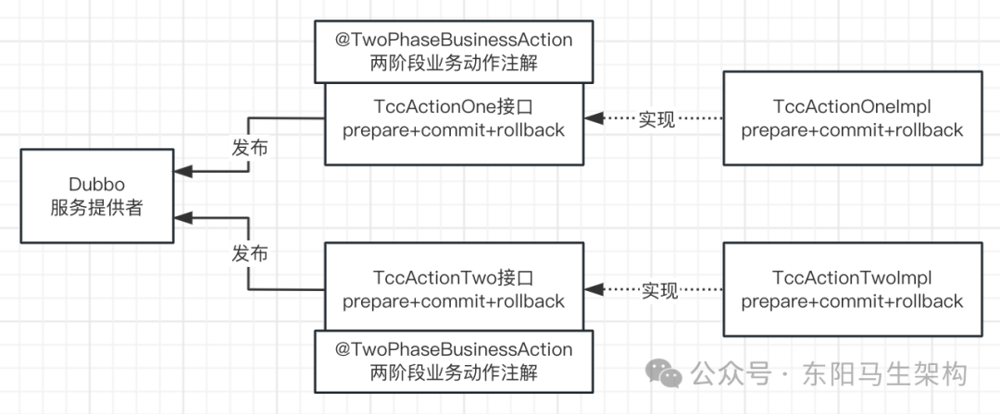
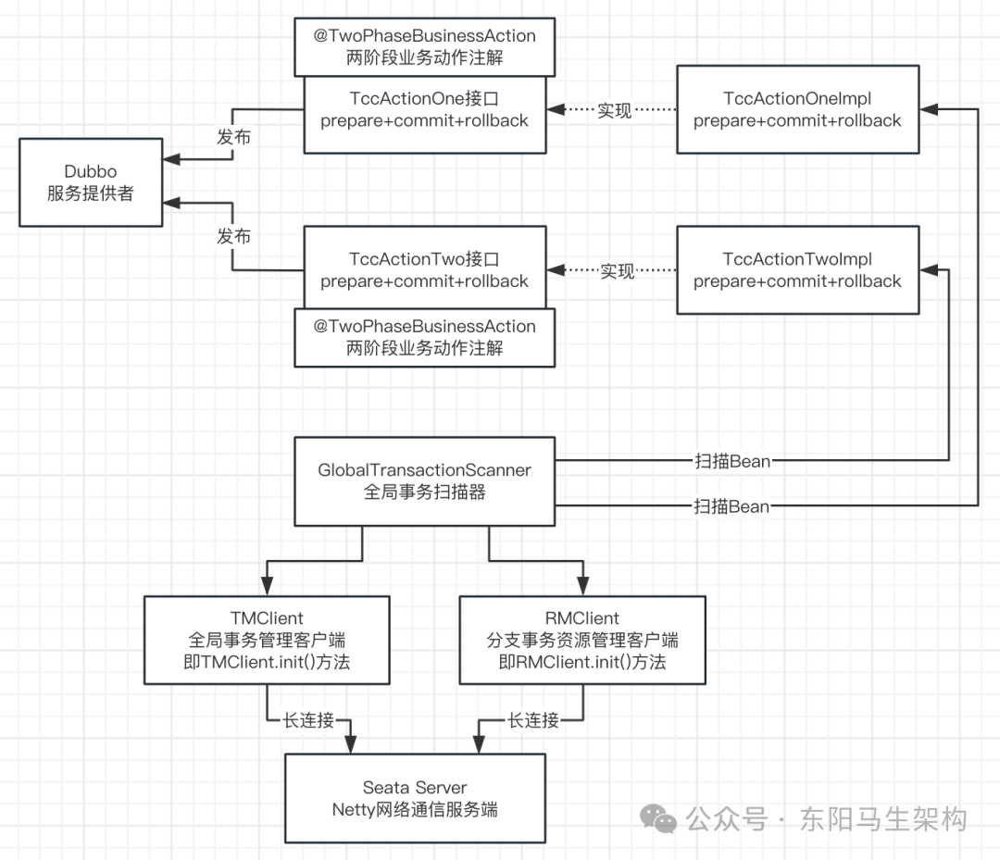
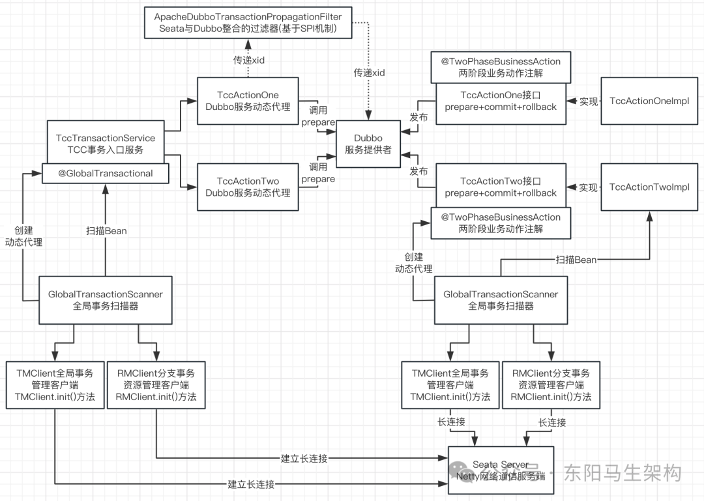
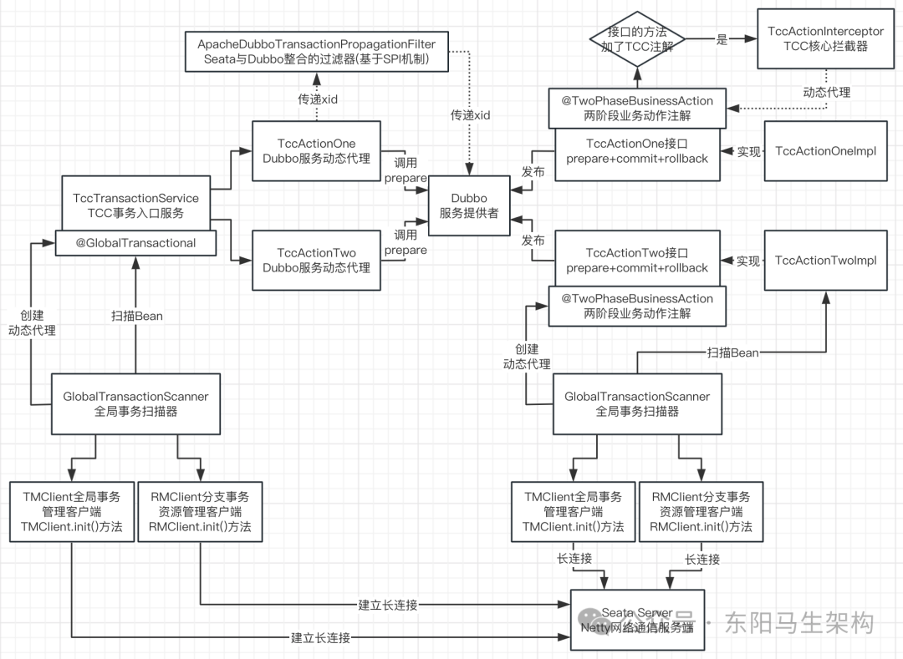
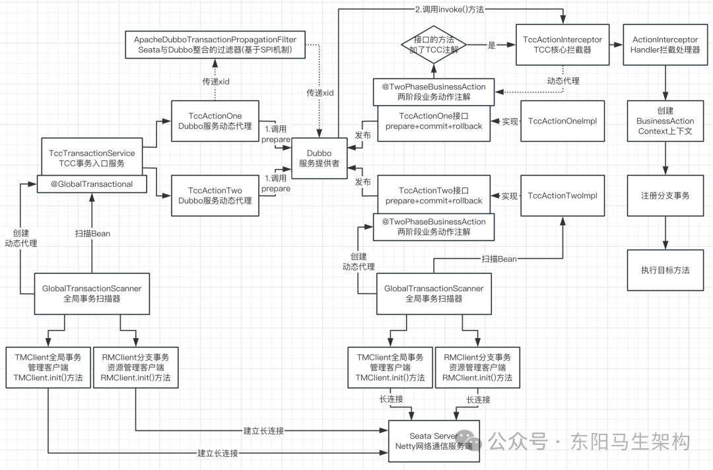
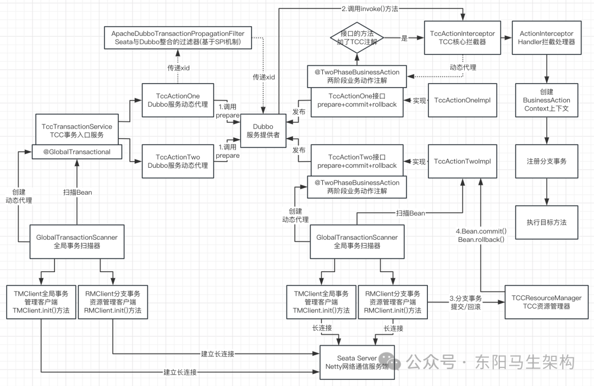

# Seata源码—7.Seata TCC模式的事务处理

> **公众号**: 东阳马生架构  
> **发布时间**: 2025-05-21 21:35  

**大纲(10730字)**

- 1.Seata TCC分布式事务案例配置
- 2.Seata TCC案例服务提供者启动分析
- 3.@TwoPhaseBusinessAction注解扫描源码
- 4.Seata TCC案例分布式事务入口分析
- 5.TCC核心注解扫描与代理创建入口源码
- 6.TCC动态代理拦截器TccActionInterceptor
- 7.Action拦截处理器ActionInterceptorHandler
- 8.Seata TCC分布式事务的注册提交回滚处理源码


## 1.Seata TCC分布式事务案例配置

### (1)位于seata-samples的tcc模块下的Demo工程

### (2)Demo工程的配置文件

### (3)Demo工程运行说明

### (1)位于seata-samples的tcc模块下的Demo工程

dubbo-tcc-sample模块主要演示了TCC模式下分布式事务的提交和回滚。该Demo中一个分布式事务内会有两个TCC事务参与者，这两个TCC事务参与者分别是TccActionOne和TccActionTwo。分布式事务提交则两者均提交，分布式事务回滚则两者均回滚。

这两个TCC事务参与者均是Dubbo远程服务。一个应用作为服务提供方，会实现这两个TCC参与者，并将它们发布成Dubbo服务。另外一个应用作为事务发起方，会订阅Dubbo服务，然后调用编排TCC参与者，执行远程Dubbo服务。

TccActionOne接口定义如下：

```java
public interface TccActionOne {
    @TwoPhaseBusinessAction(name = "DubboTccActionOne", commitMethod = "commit", rollbackMethod = "rollback")
    public boolean prepare(BusinessActionContext actionContext,

    @BusinessActionContextParameter(paramName = "a") int a);
    public boolean commit(BusinessActionContext actionContext);

    public boolean rollback(BusinessActionContext actionContext);
}
```

TccActionTwo接口定义如下：

```typescript
public interface TccActionTwo {
    @TwoPhaseBusinessAction(name = "DubboTccActionTwo", commitMethod = "commit", rollbackMethod = "rollback")
    public boolean prepare(BusinessActionContext actionContext,

    @BusinessActionContextParameter(paramName = "b") String b,
    @BusinessActionContextParameter(paramName = "c", index = 1) List list);
    public boolean commit(BusinessActionContext actionContext);

    public boolean rollback(BusinessActionContext actionContext);
}
```

### (2)Demo工程的配置文件

#### 一.seata-tcc.xml

```xml
<beans xmlns:xsi="http://www.w3.org/2001/XMLSchema-instance"
       xmlns="http://www.springframework.org/schema/beans"
       xsi:schemaLocation="http://www.springframework.org/schema/beans http://www.springframework.org/schema/beans/spring-beans.xsd"
       default-autowire="byName">

    <!-- fescar bean scanner -->
    <bean class="io.seata.spring.annotation.GlobalTransactionScanner">
        <constructor-arg value="tcc-sample"/>
        <constructor-arg value="my_test_tx_group"/>
    </bean>

    <bean id="tccActionOneImpl" class="io.seata.samples.tcc.dubbo.action.impl.TccActionOneImpl"/>
    <bean id="tccActionTwoImpl" class="io.seata.samples.tcc.dubbo.action.impl.TccActionTwoImpl"/>
    <bean id="tccTransactionService" class="io.seata.samples.tcc.dubbo.service.TccTransactionService"/>
</beans>
```

#### 二.seata-dubbo-provider.xml

```xml
<beans xmlns:xsi="http://www.w3.org/2001/XMLSchema-instance"
       xmlns:dubbo="http://code.alibabatech.com/schema/dubbo"
       xmlns="http://www.springframework.org/schema/beans"
       xsi:schemaLocation="http://www.springframework.org/schema/beans http://www.springframework.org/schema/beans/spring-beans.xsd
       http://code.alibabatech.com/schema/dubbo
       http://code.alibabatech.com/schema/dubbo/dubbo.xsd" default-autowire="byName">

    <dubbo:application name="tcc-sample">
        <dubbo:parameter key="qos.enable" value="false"/>
    </dubbo:application>

    <!--使用 zookeeper 注册中心暴露服务，注意要先开启 zookeeper-->
    <dubbo:registry address="zookeeper://127.0.0.1:2181"/>
    <dubbo:protocol name="dubbo" port="-1"/>
    <dubbo:provider timeout="10000" threads="10" threadpool="fixed" loadbalance="roundrobin"/>

    <!-- 第一个TCC 参与者服务发布 -->
    <dubbo:service interface="io.seata.samples.tcc.dubbo.action.TccActionOne" ref="tccActionOneImpl"/>

    <!-- 第二个TCC 参与者服务发布 -->
    <dubbo:service interface="io.seata.samples.tcc.dubbo.action.TccActionTwo" ref="tccActionTwoImpl"/>
</beans>
```

#### 三.seata-dubbo-reference.xml

```xml
<beans xmlns:xsi="http://www.w3.org/2001/XMLSchema-instance"
       xmlns:dubbo="http://code.alibabatech.com/schema/dubbo"
       xmlns="http://www.springframework.org/schema/beans"
       xsi:schemaLocation="http://www.springframework.org/schema/beans http://www.springframework.org/schema/beans/spring-beans.xsd
       http://code.alibabatech.com/schema/dubbo
       http://code.alibabatech.com/schema/dubbo/dubbo.xsd" default-autowire="byName">

    <dubbo:application name="tcc-sample-reference">
        <dubbo:parameter key="qos.enable" value="false"/>
    </dubbo:application>

    <!--使用 zookeeper 注册中心暴露服务，注意要先开启 zookeeper-->
    <dubbo:registry address="zookeeper://127.0.0.1:2181"/>
    <dubbo:protocol name="dubbo" port="-1"/>
    <dubbo:provider timeout="10000" threads="10" threadpool="fixed" loadbalance="roundrobin"/>

    <!-- 第一个TCC参与者 服务订阅 -->
    <dubbo:reference id="tccActionOne" interface="io.seata.samples.tcc.dubbo.action.TccActionOne" check="false" lazy="true"/>

    <!-- 第二个TCC参与者 服务订阅 -->
    <dubbo:reference id="tccActionTwo" interface="io.seata.samples.tcc.dubbo.action.TccActionTwo" check="false" lazy="true"/>
</beans>
```

### (3)Demo工程运行指南

#### 一.启动Seata Server

#### 二.启动Dubbo服务应用

运行DubboTccProviderStarter。该应用会发布Dubbo服务，并且实现了两个TCC参与者。

```typescript
public class TccProviderStarter extends AbstractStarter {
    public static void main(String[] args) throws Exception {
        new TccProviderStarter().start0(args);
    }

    @Override
    protected void start0(String[] args) throws Exception {
        ClassPathXmlApplicationContext applicationContext = new ClassPathXmlApplicationContext(
            new String[]{"spring/seata-tcc.xml", "spring/seata-dubbo-provider.xml"}
        );
        new ApplicationKeeper().keep();
    }
}

public class TccActionOneImpl implements TccActionOne {
    @Override
    public boolean prepare(BusinessActionContext actionContext, int a) {
        String xid = actionContext.getXid();
        System.out.println("TccActionOne prepare, xid:" + xid + ", a:" + a);
        return true;
    }

    @Override
    public boolean commit(BusinessActionContext actionContext) {
        String xid = actionContext.getXid();
        System.out.println("TccActionOne commit, xid:" + xid + ", a:" + actionContext.getActionContext("a"));
        ResultHolder.setActionOneResult(xid, "T");
        return true;
    }

    @Override
    public boolean rollback(BusinessActionContext actionContext) {
        String xid = actionContext.getXid();
        System.out.println("TccActionOne rollback, xid:" + xid + ", a:" + actionContext.getActionContext("a"));
        ResultHolder.setActionOneResult(xid, "R");
        return true;
    }
}

public class TccActionTwoImpl implements TccActionTwo {
    @Override
    public boolean prepare(BusinessActionContext actionContext, String b, List list) {
        String xid = actionContext.getXid();
        System.out.println("TccActionTwo prepare, xid:" + xid + ", b:" + b + ", c:" + list.get(1));
        return true;
    }

    @Override
    public boolean commit(BusinessActionContext actionContext) {
        String xid = actionContext.getXid();
        System.out.println("TccActionTwo commit, xid:" + xid + ", b:" + actionContext.getActionContext("b") + ", c:" + actionContext.getActionContext("c"));
        ResultHolder.setActionTwoResult(xid, "T");
        return true;
    }

    @Override
    public boolean rollback(BusinessActionContext actionContext) {
        String xid = actionContext.getXid();
        System.out.println("TccActionTwo rollback, xid:" + xid + ", b:" + actionContext.getActionContext("b") + ", c:" + actionContext.getActionContext("c"));
        ResultHolder.setActionTwoResult(xid, "R");
        return true;
    }
}
```

#### 三.启动事务应用

运行TccConsumerStarter。该应用会订阅Dubbo服务，发起分布式事务，调用上述两个TCC参与者，内含TCC事务提交场景和TCC事务回滚场景的演示。

```java
public class TccConsumerStarter extends AbstractStarter {
    static TccTransactionService tccTransactionService = null;

    public static void main(String[] args) throws Exception {
        new TccConsumerStarter().start0(args);
    }

    @Override
    protected void start0(String[] args) throws Exception {
        ClassPathXmlApplicationContext applicationContext = new ClassPathXmlApplicationContext(
            new String[]{"spring/seata-tcc.xml", "spring/seata-dubbo-reference.xml"}
        );
        tccTransactionService = (TccTransactionService) applicationContext.getBean("tccTransactionService");

        //分布式事务提交demo
        transactionCommitDemo();

        //分布式事务回滚demo
        transactionRollbackDemo();
    }

    private static void transactionCommitDemo() throws InterruptedException {
        String txId = tccTransactionService.doTransactionCommit();
        System.out.println(txId);
        Assert.isTrue(StringUtils.isNotEmpty(txId), "事务开启失败");
        System.out.println("transaction commit demo finish.");
    }

    private static void transactionRollbackDemo() throws InterruptedException {
        Map map = new HashMap(16);
        try {
            tccTransactionService.doTransactionRollback(map);
            Assert.isTrue(false, "分布式事务未回滚");
        } catch (Throwable t) {
            Assert.isTrue(true, "分布式事务异常回滚");
        }
        String txId = (String) map.get("xid");
        System.out.println(txId);
        System.out.println("transaction rollback demo finish.");
    }
}

public class TccTransactionService {
    private TccActionOne tccActionOne;
    private TccActionTwo tccActionTwo;

    //提交分布式事务
    @GlobalTransactional
    public String doTransactionCommit() {
        //第一个TCC事务参与者
        boolean result = tccActionOne.prepare(null, 1);
        if (!result) {
            throw new RuntimeException("TccActionOne failed.");
        }

        List list = new ArrayList();
        list.add("c1");
        list.add("c2");

        //第二个TCC事务参与者
        result = tccActionTwo.prepare(null, "two", list);
        if (!result) {
            throw new RuntimeException("TccActionTwo failed.");
        }
        return RootContext.getXID();
    }

    //回滚分布式事务
    @GlobalTransactional
    public String doTransactionRollback(Map map) {
        //第一个TCC事务参与者
        boolean result = tccActionOne.prepare(null, 1);
        if (!result) {
            throw new RuntimeException("TccActionOne failed.");
        }
        List list = new ArrayList();
        list.add("c1");
        list.add("c2");

        //第二个TCC事务参与者
        result = tccActionTwo.prepare(null, "two", list);
        if (!result) {
            throw new RuntimeException("TccActionTwo failed.");
        }
        map.put("xid", RootContext.getXID());
        throw new RuntimeException("transacton rollback");
    }

    public void setTccActionOne(TccActionOne tccActionOne) {
        this.tccActionOne = tccActionOne;
    }

    public void setTccActionTwo(TccActionTwo tccActionTwo) {
        this.tccActionTwo = tccActionTwo;
    }
}
```

## 2.Seata TCC案例服务提供者启动分析

添加了@TwoPhaseBusinessAction注解的接口发布成Dubbo服务：



## 3.@TwoPhaseBusinessAction注解扫描源码

### (1)全局事务注解扫描器的wrapIfNecessary()方法扫描Spring Bean

(2)TCCBeanParserUtils的isTccAutoProxy()方法判断是否要创建TCC动态代理

### (1)全局事务注解扫描器的wrapIfNecessary()方法扫描Spring Bean

全局事务注解扫描器GlobalTransactionScanner会在调用initClient()方法初始化Seata Client客户端后，通过wrapIfNecessary()方法扫描Spring Bean中含有@TwoPhaseBusinessAction注解的方法。



```typescript
//AbstractAutoProxyCreator：Spring的动态代理自动创建者
//ConfigurationChangeListener：关注配置变更事件的监听器
//InitializingBean：Spring Bean初始化回调
//ApplicationContextAware：用来感知Spring容器
//DisposableBean：支持可抛弃Bean
public class GlobalTransactionScanner extends AbstractAutoProxyCreator
        implements ConfigurationChangeListener, InitializingBean, ApplicationContextAware, DisposableBean {
    ...

    //InitializingBean接口的回调方法
    //Spring容器启动和初始化完毕后，会调用如下的afterPropertiesSet()方法进行回调
    @Override
    public void afterPropertiesSet() {
        //是否禁用了全局事务，默认是false
        if (disableGlobalTransaction) {
            if (LOGGER.isInfoEnabled()) {
                LOGGER.info("Global transaction is disabled.");
            }
            ConfigurationCache.addConfigListener(ConfigurationKeys.DISABLE_GLOBAL_TRANSACTION, (ConfigurationChangeListener)this);
            return;
        }

        //通过CAS操作确保initClient()初始化动作仅仅执行一次
        if (initialized.compareAndSet(false, true)) {
            //initClient()方法会对Seata Client进行初始化，比如和Seata Server建立长连接
            //seata-samples的tcc模块的seata-tcc.xml配置文件里都配置了GlobalTransactionScanner这个Bean
            //而GlobalTransactionScanner这个Bean伴随着Spring容器的初始化完毕，都会回调其初始化逻辑initClient()
            initClient();
        }
    }

    //initClient()是核心方法，负责对Seata Client客户端进行初始化
    private void initClient() {
        if (LOGGER.isInfoEnabled()) {
            LOGGER.info("Initializing Global Transaction Clients ... ");
        }

        if (DEFAULT_TX_GROUP_OLD.equals(txServiceGroup)) {
            LOGGER.warn("...", DEFAULT_TX_GROUP_OLD, DEFAULT_TX_GROUP);
        }

        if (StringUtils.isNullOrEmpty(applicationId) || StringUtils.isNullOrEmpty(txServiceGroup)) {
            throw new IllegalArgumentException(String.format("applicationId: %s, txServiceGroup: %s", applicationId, txServiceGroup));
        }

        //对于Seata Client来说，最重要的组件有两个：
        //一个是TM，即Transaction Manager，用来管理全局事务
        //一个是RM，即Resource Manager，用来管理各分支事务的数据源

        //init TM
        //TMClient.init()会对客户端的TM全局事务管理器进行初始化
        TMClient.init(applicationId, txServiceGroup, accessKey, secretKey);
        if (LOGGER.isInfoEnabled()) {
            LOGGER.info("Transaction Manager Client is initialized. applicationId[{}] txServiceGroup[{}]", applicationId, txServiceGroup);
        }

        //init RM
        //RMClient.init()会对客户端的RM分支事务资源管理器进行初始化
        RMClient.init(applicationId, txServiceGroup);
        if (LOGGER.isInfoEnabled()) {
            LOGGER.info("Resource Manager is initialized. applicationId[{}] txServiceGroup[{}]", applicationId, txServiceGroup);
        }
        if (LOGGER.isInfoEnabled()) {
            LOGGER.info("Global Transaction Clients are initialized. ");
        }

        //注册Spring容器被销毁时的回调钩子，释放TM和RM两个组件的一些资源
        registerSpringShutdownHook();
    }

    //The following will be scanned, and added corresponding interceptor:
    //添加了如下注解的方法会被扫描到，然后方法会添加相应的拦截器进行拦截

    //TM:
    //@see io.seata.spring.annotation.GlobalTransactional // TM annotation
    //Corresponding interceptor:
    //@see io.seata.spring.annotation.GlobalTransactionalInterceptor#handleGlobalTransaction(MethodInvocation, AspectTransactional) // TM handler

    //GlobalLock:
    //@see io.seata.spring.annotation.GlobalLock // GlobalLock annotation
    //Corresponding interceptor:
    //@see io.seata.spring.annotation.GlobalTransactionalInterceptor# handleGlobalLock(MethodInvocation, GlobalLock)  // GlobalLock handler

    //TCC mode:
    //@see io.seata.rm.tcc.api.LocalTCC // TCC annotation on interface
    //@see io.seata.rm.tcc.api.TwoPhaseBusinessAction // TCC annotation on try method
    //@see io.seata.rm.tcc.remoting.RemotingParser // Remote TCC service parser
    //Corresponding interceptor:
    //@see io.seata.spring.tcc.TccActionInterceptor // the interceptor of TCC mode

    @Override
    //由于GlobalTransactionScanner继承了Spring提供的AbstractAutoProxyCreator，
    //所以Spring会把Spring Bean传递给GlobalTransactionScanner.wrapIfNecessary()进行判断；
    //让GlobalTransactionScanner来决定是否要根据Bean的Class、或者Bean的方法是否有上述注解，
    //从而决定是否需要针对Bean的Class创建动态代理，来对添加了注解的方法进行拦截；
    protected Object wrapIfNecessary(Object bean, String beanName, Object cacheKey) {
        //do checkers
        if (!doCheckers(bean, beanName)) {
            return bean;
        }

        try {
            synchronized (PROXYED_SET) {
                if (PROXYED_SET.contains(beanName)) {
                    return bean;
                }
                interceptor = null;
                //check TCC proxy
                //判断传递进来的Bean是否是TCC动态代理
                //服务启动时会把所有的Bean传递进来这个wrapIfNecessary()，检查这个Bean是否需要创建TCC动态代理
                if (TCCBeanParserUtils.isTccAutoProxy(bean, beanName, applicationContext)) {
                    //init tcc fence clean task if enable useTccFence
                    TCCBeanParserUtils.initTccFenceCleanTask(TCCBeanParserUtils.getRemotingDesc(beanName), applicationContext);
                    //TCC interceptor, proxy bean of sofa:reference/dubbo:reference, and LocalTCC
                    interceptor = new TccActionInterceptor(TCCBeanParserUtils.getRemotingDesc(beanName));
                    ConfigurationCache.addConfigListener(ConfigurationKeys.DISABLE_GLOBAL_TRANSACTION, (ConfigurationChangeListener)interceptor);
                } else {
                    //获取目标class的接口
                    Class<?> serviceInterface = SpringProxyUtils.findTargetClass(bean);
                    Class<?>[] interfacesIfJdk = SpringProxyUtils.findInterfaces(bean);
                    //existsAnnotation()方法会判断Bean的Class或Method是否添加了@GlobalTransactional等注解
                    if (!existsAnnotation(new Class[]{serviceInterface}) && !existsAnnotation(interfacesIfJdk)) {
                        return bean;
                    }
                    if (globalTransactionalInterceptor == null) {
                        //构建一个GlobalTransactionalInterceptor，即全局事务注解的拦截器
                        globalTransactionalInterceptor = new GlobalTransactionalInterceptor(failureHandlerHook);
                        ConfigurationCache.addConfigListener(ConfigurationKeys.DISABLE_GLOBAL_TRANSACTION, (ConfigurationChangeListener)globalTransactionalInterceptor);
                    }
                    interceptor = globalTransactionalInterceptor;
                }

                LOGGER.info("Bean[{}] with name [{}] would use interceptor [{}]", bean.getClass().getName(), beanName, interceptor.getClass().getName());
                if (!AopUtils.isAopProxy(bean)) {//如果这个Bean并不是AOP代理
                    //接下来会基于Spring的AbstractAutoProxyCreator创建针对目标Bean接口的动态代理
                    //这样后续调用到目标Bean的方法，就会调用到TccActionInterceptor拦截器
                    bean = super.wrapIfNecessary(bean, beanName, cacheKey);
                } else {
                    AdvisedSupport advised = SpringProxyUtils.getAdvisedSupport(bean);
                    Advisor[] advisor = buildAdvisors(beanName, getAdvicesAndAdvisorsForBean(null, null, null));
                    int pos;
                    for (Advisor avr : advisor) {
                        //Find the position based on the advisor's order, and add to advisors by pos
                        pos = findAddSeataAdvisorPosition(advised, avr);
                        advised.addAdvisor(pos, avr);
                    }
                }
                PROXYED_SET.add(beanName);
                return bean;
            }
        } catch (Exception exx) {
            throw new RuntimeException(exx);
        }
    }
    ...
}
```

(2)TCCBeanParserUtils的isTccAutoProxy()方法判断是否要创建TCC动态代理

```kotlin
public class TCCBeanParserUtils {
    private TCCBeanParserUtils() {
    }

    //is auto proxy TCC bean
    public static boolean isTccAutoProxy(Object bean, String beanName, ApplicationContext applicationContext) {
        boolean isRemotingBean = parserRemotingServiceInfo(bean, beanName);
        //get RemotingBean description
        RemotingDesc remotingDesc = DefaultRemotingParser.get().getRemotingBeanDesc(beanName);

        //is remoting bean
        if (isRemotingBean) {
            if (remotingDesc != null && remotingDesc.getProtocol() == Protocols.IN_JVM) {
                //LocalTCC
                //创建一个local tcc代理
                return isTccProxyTargetBean(remotingDesc);
            } else {
                //sofa:reference / dubbo:reference, factory bean
                return false;
            }
        } else {
            if (remotingDesc == null) {
                //check FactoryBean
                if (isRemotingFactoryBean(bean, beanName, applicationContext)) {
                    remotingDesc = DefaultRemotingParser.get().getRemotingBeanDesc(beanName);
                    return isTccProxyTargetBean(remotingDesc);
                } else {
                    return false;
                }
            } else {
                return isTccProxyTargetBean(remotingDesc);
            }
        }
    }
    ...

    //is TCC proxy-bean/target-bean: LocalTCC , the proxy bean of sofa:reference/dubbo:reference
    public static boolean isTccProxyTargetBean(RemotingDesc remotingDesc) {
        if (remotingDesc == null) {
            return false;
        }

        //check if it is TCC bean
        boolean isTccClazz = false;

        //针对我们的class拿到一个接口class
        Class<?> tccInterfaceClazz = remotingDesc.getInterfaceClass();

        //获取我们的接口里定义的所有的方法
        Method[] methods = tccInterfaceClazz.getMethods();
        TwoPhaseBusinessAction twoPhaseBusinessAction;

        //遍历所有的方法
        for (Method method : methods) {
            //获取的方法是否加了@TwoPhaseBusinessAction注解
            twoPhaseBusinessAction = method.getAnnotation(TwoPhaseBusinessAction.class);
            if (twoPhaseBusinessAction != null) {
                isTccClazz = true;
                break;
            }
        }

        if (!isTccClazz) {
            return false;
        }
        short protocols = remotingDesc.getProtocol();

        //LocalTCC
        if (Protocols.IN_JVM == protocols) {
            //in jvm TCC bean , AOP
            return true;
        }

        //sofa:reference /  dubbo:reference, AOP
        return remotingDesc.isReference();
    }
    ...
}
```

## 4.Seata TCC案例分布式事务入口分析

TccTransactionService作为分布式事务的入口，其提交事务和回滚事务的接口都会被添加上@GlobalTransactional注解。

所以应用启动时，TccTransactionService的Bean就会被GlobalTransactionScanner扫描，然后其下添加了@GlobalTransactional注解的接口就会被创建动态代理。

在TccTransactionService的提交分布式事务的接口中，会先后调用TccActionOne和TccActionTwo两个Dubbo服务。并且在调用两个Dubbo服务时，会通过ApacheDubboTransactionPropagationFilter传递xid。



```typescript
public class TccTransactionService {
    private TccActionOne tccActionOne;
    private TccActionTwo tccActionTwo;

    //提交分布式事务
    @GlobalTransactional
    public String doTransactionCommit() {
        //第一个TCC事务参与者
        boolean result = tccActionOne.prepare(null, 1);
        if (!result) {
            throw new RuntimeException("TccActionOne failed.");
        }

        List list = new ArrayList();
        list.add("c1");
        list.add("c2");

        //第二个TCC事务参与者
        result = tccActionTwo.prepare(null, "two", list);
        if (!result) {
            throw new RuntimeException("TccActionTwo failed.");
        }
        return RootContext.getXID();
    }

    //回滚分布式事务
    @GlobalTransactional
    public String doTransactionRollback(Map map) {
        //第一个TCC事务参与者
        boolean result = tccActionOne.prepare(null, 1);
        if (!result) {
            throw new RuntimeException("TccActionOne failed.");
        }

        List list = new ArrayList();
        list.add("c1");
        list.add("c2");

        //第二个TCC事务参与者
        result = tccActionTwo.prepare(null, "two", list);
        if (!result) {
            throw new RuntimeException("TccActionTwo failed.");
        }
        map.put("xid", RootContext.getXID());
        throw new RuntimeException("transacton rollback");
    }

    public void setTccActionOne(TccActionOne tccActionOne) {
        this.tccActionOne = tccActionOne;
    }

    public void setTccActionTwo(TccActionTwo tccActionTwo) {
        this.tccActionTwo = tccActionTwo;
    }
}
```

## 5.TCC核心注解扫描与代理创建入口源码

GlobalTransactionScanner的wrapIfNecessary()方法会扫描Spring Bean。TCCBeanParserUtils的isTccAutoProxy()方法会通过判断扫描的Spring Bean中的方法是否添加了TCC的注解，来决定是否要对Bean的方法进行TCC动态代理。

注意，其中TCC的注解有两个：@LocalTCC、@TwoPhaseBusinessAction



```kotlin
public class GlobalTransactionScanner extends AbstractAutoProxyCreator
        implements ConfigurationChangeListener, InitializingBean, ApplicationContextAware, DisposableBean {
    ...
    @Override
    //由于GlobalTransactionScanner继承了Spring提供的AbstractAutoProxyCreator，
    //所以Spring会把Spring Bean传递给GlobalTransactionScanner.wrapIfNecessary()进行判断；
    //让GlobalTransactionScanner来决定是否要根据Bean的Class、或者Bean的方法是否有上述注解，
    //从而决定是否需要针对Bean的Class创建动态代理，来对添加了注解的方法进行拦截；
    protected Object wrapIfNecessary(Object bean, String beanName, Object cacheKey) {
        //do checkers
        if (!doCheckers(bean, beanName)) {
            return bean;
        }
        try {
            synchronized (PROXYED_SET) {
                if (PROXYED_SET.contains(beanName)) {
                    return bean;
                }
                interceptor = null;

                //check TCC proxy
                //判断传递进来的Bean是否是TCC动态代理
                //服务启动时会把所有的Bean传递进来这个wrapIfNecessary()，检查这个Bean是否需要创建TCC动态代理
                if (TCCBeanParserUtils.isTccAutoProxy(bean, beanName, applicationContext)) {
                    //init tcc fence clean task if enable useTccFence
                    TCCBeanParserUtils.initTccFenceCleanTask(TCCBeanParserUtils.getRemotingDesc(beanName), applicationContext);

                    //TCC interceptor, proxy bean of sofa:reference/dubbo:reference, and LocalTCC
                    interceptor = new TccActionInterceptor(TCCBeanParserUtils.getRemotingDesc(beanName));
                    ConfigurationCache.addConfigListener(ConfigurationKeys.DISABLE_GLOBAL_TRANSACTION, (ConfigurationChangeListener)interceptor);
                } else {
                    //获取目标class的接口
                    Class<?> serviceInterface = SpringProxyUtils.findTargetClass(bean);
                    Class<?>[] interfacesIfJdk = SpringProxyUtils.findInterfaces(bean);

                    //existsAnnotation()方法会判断Bean的Class或Method是否添加了@GlobalTransactional等注解
                    if (!existsAnnotation(new Class[]{serviceInterface}) && !existsAnnotation(interfacesIfJdk)) {
                        return bean;
                    }

                    if (globalTransactionalInterceptor == null) {
                        //构建一个GlobalTransactionalInterceptor，即全局事务注解的拦截器
                        globalTransactionalInterceptor = new GlobalTransactionalInterceptor(failureHandlerHook);
                        ConfigurationCache.addConfigListener(ConfigurationKeys.DISABLE_GLOBAL_TRANSACTION, (ConfigurationChangeListener)globalTransactionalInterceptor);
                    }
                    interceptor = globalTransactionalInterceptor;
                }

                LOGGER.info("Bean[{}] with name [{}] would use interceptor [{}]", bean.getClass().getName(), beanName, interceptor.getClass().getName());
                if (!AopUtils.isAopProxy(bean)) {//如果这个Bean并不是AOP代理
                    //接下来会基于Spring的AbstractAutoProxyCreator创建针对目标Bean接口的动态代理
                    //这样后续调用到目标Bean的方法，就会调用到TccActionInterceptor拦截器
                    bean = super.wrapIfNecessary(bean, beanName, cacheKey);
                } else {
                    AdvisedSupport advised = SpringProxyUtils.getAdvisedSupport(bean);
                    Advisor[] advisor = buildAdvisors(beanName, getAdvicesAndAdvisorsForBean(null, null, null));
                    int pos;
                    for (Advisor avr : advisor) {
                        //Find the position based on the advisor's order, and add to advisors by pos
                        pos = findAddSeataAdvisorPosition(advised, avr);
                        advised.addAdvisor(pos, avr);
                    }
                }
                PROXYED_SET.add(beanName);
                return bean;
            }
        } catch (Exception exx) {
            throw new RuntimeException(exx);
        }
    }
    ...
}

public class TCCBeanParserUtils {
    private TCCBeanParserUtils() {
    }

    //is auto proxy TCC bean
    public static boolean isTccAutoProxy(Object bean, String beanName, ApplicationContext applicationContext) {
        boolean isRemotingBean = parserRemotingServiceInfo(bean, beanName);

        //get RemotingBean description
        RemotingDesc remotingDesc = DefaultRemotingParser.get().getRemotingBeanDesc(beanName);

        //is remoting bean
        if (isRemotingBean) {
            if (remotingDesc != null && remotingDesc.getProtocol() == Protocols.IN_JVM) {
                //LocalTCC
                //创建一个local tcc代理
                return isTccProxyTargetBean(remotingDesc);
            } else {
                //sofa:reference / dubbo:reference, factory bean
                return false;
            }
        } else {
            if (remotingDesc == null) {
                //check FactoryBean
                if (isRemotingFactoryBean(bean, beanName, applicationContext)) {
                    remotingDesc = DefaultRemotingParser.get().getRemotingBeanDesc(beanName);
                    return isTccProxyTargetBean(remotingDesc);
                } else {
                    return false;
                }
            } else {
                return isTccProxyTargetBean(remotingDesc);
            }
        }
    }
    ...

    //is TCC proxy-bean/target-bean: LocalTCC , the proxy bean of sofa:reference/dubbo:reference
    public static boolean isTccProxyTargetBean(RemotingDesc remotingDesc) {
        if (remotingDesc == null) {
            return false;
        }

        //check if it is TCC bean
        boolean isTccClazz = false;

        //针对我们的class拿到一个接口class
        Class<?> tccInterfaceClazz = remotingDesc.getInterfaceClass();

        //获取我们的接口里定义的所有的方法
        Method[] methods = tccInterfaceClazz.getMethods();
        TwoPhaseBusinessAction twoPhaseBusinessAction;

        //遍历所有的方法
        for (Method method : methods) {
            //获取的方法是否加了@TwoPhaseBusinessAction注解
            twoPhaseBusinessAction = method.getAnnotation(TwoPhaseBusinessAction.class);
            if (twoPhaseBusinessAction != null) {
                isTccClazz = true;
                break;
            }
        }

        if (!isTccClazz) {
            return false;
        }

        short protocols = remotingDesc.getProtocol();

        //LocalTCC
        if (Protocols.IN_JVM == protocols) {
            //in jvm TCC bean , AOP
            return true;
        }

        //sofa:reference /  dubbo:reference, AOP
        return remotingDesc.isReference();
    }
    ...
}
```

## 6.TCC动态代理拦截器TccActionInterceptor

如果调用添加了TCC的注解的方法，就会执行TccActionInterceptor的invoke()方法，此外只有分支事务的方法才会有可能被TCC动态代理。

在TccActionInterceptor的invoke()方法中，会通过ActionInterceptorHandler的proceed()方法来执行具体拦截逻辑。

```kotlin
public class TccActionInterceptor implements MethodInterceptor, ConfigurationChangeListener, Ordered {
    //Action拦截处理器
    private ActionInterceptorHandler actionInterceptorHandler = new ActionInterceptorHandler();
    private volatile boolean disable = ConfigurationFactory.getInstance().getBoolean(ConfigurationKeys.DISABLE_GLOBAL_TRANSACTION, DEFAULT_DISABLE_GLOBAL_TRANSACTION);
    ...

    //如果调用添加了TCC的注解的方法，就会执行如下invoke()方法
    @Override
    public Object invoke(final MethodInvocation invocation) throws Throwable {
        //当前必须是在全局事务里，也就是说分支事务的方法才会有可能被TCC动态代理
        if (!RootContext.inGlobalTransaction() || disable || RootContext.inSagaBranch()) {
            //not in transaction, or this interceptor is disabled
            return invocation.proceed();
        }

        //本次调用的是哪个方法，在class接口里找到这个方法
        Method method = getActionInterfaceMethod(invocation);

        //然后才能找到接口里定义的那个方法上面加的一个注解
        TwoPhaseBusinessAction businessAction = method.getAnnotation(TwoPhaseBusinessAction.class);

        //try method
        if (businessAction != null) {
            //save the xid
            String xid = RootContext.getXID();

            //save the previous branchType
            BranchType previousBranchType = RootContext.getBranchType();

            //if not TCC, bind TCC branchType
            if (BranchType.TCC != previousBranchType) {
                RootContext.bindBranchType(BranchType.TCC);
            }

            try {
                //Handler the TCC Aspect, and return the business result
                //传入actionInterceptorHandler的参数分别是：方法、调用方法传递进来的参数、全局事务xid、分支事务注解、目标方法执行
                return actionInterceptorHandler.proceed(method, invocation.getArguments(), xid, businessAction, invocation::proceed);
            } finally {
                //if not TCC, unbind branchType
                if (BranchType.TCC != previousBranchType) {
                    RootContext.unbindBranchType();
                }
                //MDC remove branchId
                MDC.remove(RootContext.MDC_KEY_BRANCH_ID);
            }
        }

        //not TCC try method
        return invocation.proceed();
    }

    //get the method from interface
    protected Method getActionInterfaceMethod(MethodInvocation invocation) {
        Class<?> interfaceType = null;
        try {
            if (remotingDesc == null) {
                interfaceType = getProxyInterface(invocation.getThis());
            } else {
                interfaceType = remotingDesc.getInterfaceClass();
            }
            if (interfaceType == null && remotingDesc != null && remotingDesc.getInterfaceClassName() != null) {
                interfaceType = Class.forName(remotingDesc.getInterfaceClassName(), true, Thread.currentThread().getContextClassLoader());
            }
            if (interfaceType == null) {
                return invocation.getMethod();
            }
            return interfaceType.getMethod(invocation.getMethod().getName(), invocation.getMethod().getParameterTypes());
        } catch (NoSuchMethodException e) {
            if (interfaceType != null && !"toString".equals(invocation.getMethod().getName())) {
                LOGGER.warn("no such method '{}' from interface {}", invocation.getMethod().getName(), interfaceType.getName());
            }
            return invocation.getMethod();
        } catch (Exception e) {
            LOGGER.warn("get Method from interface failed", e);
            return invocation.getMethod();
        }
    }

    //get the interface of proxy
    @Nullable
    protected Class<?> getProxyInterface(Object proxyBean) throws Exception {
        if (DubboUtil.isDubboProxyName(proxyBean.getClass().getName())) {
            //dubbo javaassist proxy
            return DubboUtil.getAssistInterface(proxyBean);
        } else {
            //jdk/cglib proxy
            return SpringProxyUtils.getTargetInterface(proxyBean);
        }
    }
    ...
}
```

## 7.Action拦截处理器ActionInterceptorHandler

Action拦截处理器ActionInterceptorHandler的主要工作是：设置业务动作上下文 \+ 注册分支事务 \+ 执行目标方法。



注意：设置业务动作上下文时，会判断执行方法入参中是否有业务动作上下文。注册分支事务前，会从执行方法入参中提取数据设置到业务动作上下文。

```typescript
//Handler the TCC Participant Aspect : Setting Context, Creating Branch Record
public class ActionInterceptorHandler {
    ...
    public Object proceed(Method method, Object[] arguments, String xid, TwoPhaseBusinessAction businessAction, Callback<Object> targetCallback) throws Throwable {
        //1.设置业务动作上下文
        //Get action context from arguments, or create a new one and then reset to arguments
        BusinessActionContext actionContext = getOrCreateActionContextAndResetToArguments(method.getParameterTypes(), arguments);

        //Set the xid
        actionContext.setXid(xid);

        //Set the action name，我们自己定义的tcc业务动作名称
        String actionName = businessAction.name();
        actionContext.setActionName(actionName);

        //Set the delay report，延迟report上报
        actionContext.setDelayReport(businessAction.isDelayReport());

        //Creating Branch Record
        //2.发起分支事务的注册，注册成功才会获取到一个branchId
        String branchId = doTccActionLogStore(method, arguments, businessAction, actionContext);
        actionContext.setBranchId(branchId);

        //MDC put branchId
        MDC.put(RootContext.MDC_KEY_BRANCH_ID, branchId);

        //save the previous action context
        BusinessActionContext previousActionContext = BusinessActionContextUtil.getContext();
        try {
            //share actionContext implicitly
            BusinessActionContextUtil.setContext(actionContext);
            if (businessAction.useTCCFence()) {
                try {
                    //Use TCC Fence, and return the business result
                    return TCCFenceHandler.prepareFence(xid, Long.valueOf(branchId), actionName, targetCallback);
                } catch (SkipCallbackWrapperException | UndeclaredThrowableException e) {
                    Throwable originException = e.getCause();
                    if (originException instanceof FrameworkException) {
                        LOGGER.error("[{}] prepare TCC fence error: {}", xid, originException.getMessage());
                    }
                    throw originException;
                }
            } else {
                //Execute business, and return the business result
                //3.执行目标方法
                return targetCallback.execute();
            }
        } finally {
            try {
                //to report business action context finally if the actionContext.getUpdated() is true
                BusinessActionContextUtil.reportContext(actionContext);
            } finally {
                if (previousActionContext != null) {
                    //recovery the previous action context
                    BusinessActionContextUtil.setContext(previousActionContext);
                } else {
                    //clear the action context
                    BusinessActionContextUtil.clear();
                }
            }
        }
    }
    ...

    //Get or create action context, and reset to arguments
    @Nonnull
    protected BusinessActionContext getOrCreateActionContextAndResetToArguments(Class<?>[] parameterTypes, Object[] arguments) {
        BusinessActionContext actionContext = null;

        //get the action context from arguments
        int argIndex = 0;

        //遍历方法调用时传入的参数类型
        for (Class<?> parameterType : parameterTypes) {
            //如果某个参数类型是BusinessActionContext，因为prepare方法是可以接收一个BusinessActionContext类型的入参的
            if (BusinessActionContext.class.isAssignableFrom(parameterType)) {
                //尝试获取这个位置的参数对象，但基本是空的
                actionContext = (BusinessActionContext) arguments[argIndex];
                if (actionContext == null) {
                    //If the action context exists in arguments but is null, create a new one and reset the action context to the arguments
                    //创建一个BusinessActionContext对象，把一个空的上下文传递到方法入参里
                    actionContext = new BusinessActionContext();
                    arguments[argIndex] = actionContext;
                } else {
                    //Reset the updated, avoid unnecessary reporting
                    actionContext.setUpdated(null);
                }
                break;
            }
            argIndex++;
        }

        //if null, create a new one
        if (actionContext == null) {
            actionContext = new BusinessActionContext();
        }

        return actionContext;
    }
    ...

    //Creating Branch Record
    protected String doTccActionLogStore(Method method, Object[] arguments, TwoPhaseBusinessAction businessAction, BusinessActionContext actionContext) {
        String actionName = actionContext.getActionName();
        String xid = actionContext.getXid();

        //region fetch context and init action context
        //从方法入参里提取出来一些数据放入到上下文里去
        Map<String, Object> context = fetchActionRequestContext(method, arguments);
        context.put(Constants.ACTION_START_TIME, System.currentTimeMillis());

        //Init business context
        initBusinessContext(context, method, businessAction);

        //Init running environment context
        initFrameworkContext(context);
        Map<String, Object> originContext = actionContext.getActionContext();
        if (CollectionUtils.isNotEmpty(originContext)) {
            //Merge context and origin context if it exists.
            //@since: above 1.4.2
            originContext.putAll(context);
            context = originContext;
        } else {
            actionContext.setActionContext(context);
        }

        //endregion
        //Init applicationData
        Map<String, Object> applicationContext = Collections.singletonMap(Constants.TCC_ACTION_CONTEXT, context);
        String applicationContextStr = JSON.toJSONString(applicationContext);
        try {
            //registry branch record
            //分支事务注册
            Long branchId = DefaultResourceManager.get().branchRegister(BranchType.TCC, actionName, null, xid, applicationContextStr, null);
            return String.valueOf(branchId);
        } catch (Throwable t) {
            String msg = String.format("TCC branch Register error, xid: %s", xid);
            LOGGER.error(msg, t);
            throw new FrameworkException(t, msg);
        }
    }
    ...

    //Extracting context data from parameters, add them to the context
    protected Map<String, Object> fetchActionRequestContext(Method method, Object[] arguments) {
        Map<String, Object> context = new HashMap<>(8);
        Annotation[][] parameterAnnotations = method.getParameterAnnotations();

        //方法的入参也是可以添加注解的
        for (int i = 0; i < parameterAnnotations.length; i++) {
            for (int j = 0; j < parameterAnnotations[i].length; j++) {
                //如果某个入参添加了一个@BusinessActionContextParameter注解
                if (parameterAnnotations[i][j] instanceof BusinessActionContextParameter) {
                    //get annotation
                    BusinessActionContextParameter annotation = (BusinessActionContextParameter) parameterAnnotations[i][j];
                    if (arguments[i] == null) {
                        throw new IllegalArgumentException("@BusinessActionContextParameter 's params can not null");
                    }
                    //get param
                    Object paramObject = arguments[i];
                    if (paramObject == null) {
                        continue;
                    }
                    //load param by the config of annotation, and then put into the context
                    //根据注解的配置提取入参的名称和值，把这个名称和值放入到BusinessActionContext里
                    ActionContextUtil.loadParamByAnnotationAndPutToContext(ParamType.PARAM, "", paramObject, annotation, context);
                }
            }
        }
        return context;
    }
}
```

## 8.Seata TCC分布式事务的注册提交回滚处理源码

### (1)TCC分支事务的注册

### (2)TCC分支事务的提交

### (3)TCC分支事务的回滚



从TCC的分支事务注册提交回滚过程可知：TCC和AT是可以混合使用的。

### (1)TCC分支事务的注册

Action拦截处理器在注册TCC的分支事务时，会调用DefaultResourceManager的branchRegister()方法。

```typescript
public class DefaultResourceManager implements ResourceManager {
    //all resource managers
    protected static Map<BranchType, ResourceManager> resourceManagers = new ConcurrentHashMap<>();

    private static class SingletonHolder {
        private static DefaultResourceManager INSTANCE = new DefaultResourceManager();
    }

    public static DefaultResourceManager get() {
        return SingletonHolder.INSTANCE;
    }

    private DefaultResourceManager() {
        initResourceManagers();
    }

    protected void initResourceManagers() {
        //init all resource managers
        //通过SPI加载所有的ResourceManager资源管理器
        //比如：DataSourceManager、TCCResourceManager、SagaResourceManager、ResourceManagerXA
        List<ResourceManager> allResourceManagers = EnhancedServiceLoader.loadAll(ResourceManager.class);
        if (CollectionUtils.isNotEmpty(allResourceManagers)) {
            for (ResourceManager rm : allResourceManagers) {
                resourceManagers.put(rm.getBranchType(), rm);
            }
        }
    }
    ...

    //注册分支事务
    @Override
    public Long branchRegister(BranchType branchType, String resourceId, String clientId, String xid, String applicationData, String lockKeys) throws TransactionException {
        return getResourceManager(branchType).branchRegister(branchType, resourceId, clientId, xid, applicationData, lockKeys);
    }

    public ResourceManager getResourceManager(BranchType branchType) {
        ResourceManager rm = resourceManagers.get(branchType);
        if (rm == null) {
            throw new FrameworkException("No ResourceManager for BranchType:" + branchType.name());
        }
        return rm;
    }
    ...
}

public class TCCResourceManager extends AbstractResourceManager {
    ...
    ...
}

public abstract class AbstractResourceManager implements ResourceManager {
    //registry branch record
    @Override
    public Long branchRegister(BranchType branchType, String resourceId, String clientId, String xid, String applicationData, String lockKeys) throws TransactionException {
        try {
            BranchRegisterRequest request = new BranchRegisterRequest();
            request.setXid(xid);//xid是全局事务id
            request.setLockKey(lockKeys);//这次分支事务要更新数据全局锁keys
            request.setResourceId(resourceId);//分支事务对应的资源id
            request.setBranchType(branchType);//分支事务类型
            request.setApplicationData(applicationData);//应用数据
            BranchRegisterResponse response = (BranchRegisterResponse) RmNettyRemotingClient.getInstance().sendSyncRequest(request);
            if (response.getResultCode() == ResultCode.Failed) {
                throw new RmTransactionException(response.getTransactionExceptionCode(), String.format("Response[ %s ]", response.getMsg()));
            }
            return response.getBranchId();
        } catch (TimeoutException toe) {
            throw new RmTransactionException(TransactionExceptionCode.IO, "RPC Timeout", toe);
        } catch (RuntimeException rex) {
            throw new RmTransactionException(TransactionExceptionCode.BranchRegisterFailed, "Runtime", rex);
        }
    }
    ...
}
```

### (2)TCC分支事务的提交

```typescript
public class TCCResourceManager extends AbstractResourceManager {
    ...
    //TCC branch commit，分支事务的提交
    @Override
    public BranchStatus branchCommit(BranchType branchType, String xid, long branchId, String resourceId, String applicationData) throws TransactionException {
        TCCResource tccResource = (TCCResource) tccResourceCache.get(resourceId);
        if (tccResource == null) {
            throw new ShouldNeverHappenException(String.format("TCC resource is not exist, resourceId: %s", resourceId));
        }

        //获取到目标的Bean
        Object targetTCCBean = tccResource.getTargetBean();

        //获取到目标Bean的commit方法
        Method commitMethod = tccResource.getCommitMethod();
        if (targetTCCBean == null || commitMethod == null) {
            throw new ShouldNeverHappenException(String.format("TCC resource is not available, resourceId: %s", resourceId));
        }

        try {
            //BusinessActionContext
            BusinessActionContext businessActionContext = getBusinessActionContext(xid, branchId, resourceId, applicationData);
            Object[] args = this.getTwoPhaseCommitArgs(tccResource, businessActionContext);
            Object ret;
            boolean result;

            //add idempotent and anti hanging
            if (Boolean.TRUE.equals(businessActionContext.getActionContext(Constants.USE_TCC_FENCE))) {
                try {
                    result = TCCFenceHandler.commitFence(commitMethod, targetTCCBean, xid, branchId, args);
                } catch (SkipCallbackWrapperException | UndeclaredThrowableException e) {
                    throw e.getCause();
                }
            } else {
                ret = commitMethod.invoke(targetTCCBean, args);
                if (ret != null) {
                    if (ret instanceof TwoPhaseResult) {
                        result = ((TwoPhaseResult) ret).isSuccess();
                    } else {
                        result = (boolean) ret;
                    }
                } else {
                    result = true;
                }
            }
            LOGGER.info("TCC resource commit result : {}, xid: {}, branchId: {}, resourceId: {}", result, xid, branchId, resourceId);
            return result ? BranchStatus.PhaseTwo_Committed : BranchStatus.PhaseTwo_CommitFailed_Retryable;
        } catch (Throwable t) {
            String msg = String.format("commit TCC resource error, resourceId: %s, xid: %s.", resourceId, xid);
            LOGGER.error(msg, t);
            return BranchStatus.PhaseTwo_CommitFailed_Retryable;
        }
    }
    ...
}
```

### (3)TCC分支事务的回滚

```typescript
public class TCCResourceManager extends AbstractResourceManager {
    ...
    //TCC branch rollback，分支事务的回滚
    @Override
    public BranchStatus branchRollback(BranchType branchType, String xid, long branchId, String resourceId, String applicationData) throws TransactionException {
        TCCResource tccResource = (TCCResource) tccResourceCache.get(resourceId);
        if (tccResource == null) {
            throw new ShouldNeverHappenException(String.format("TCC resource is not exist, resourceId: %s", resourceId));
        }

        Object targetTCCBean = tccResource.getTargetBean();
        Method rollbackMethod = tccResource.getRollbackMethod();
        if (targetTCCBean == null || rollbackMethod == null) {
            throw new ShouldNeverHappenException(String.format("TCC resource is not available, resourceId: %s", resourceId));
        }

        try {
            //BusinessActionContext
            BusinessActionContext businessActionContext = getBusinessActionContext(xid, branchId, resourceId, applicationData);
            Object[] args = this.getTwoPhaseRollbackArgs(tccResource, businessActionContext);
            Object ret;
            boolean result;

            //add idempotent and anti hanging
            if (Boolean.TRUE.equals(businessActionContext.getActionContext(Constants.USE_TCC_FENCE))) {
                try {
                    result = TCCFenceHandler.rollbackFence(rollbackMethod, targetTCCBean, xid, branchId, args, tccResource.getActionName());
                } catch (SkipCallbackWrapperException | UndeclaredThrowableException e) {
                    throw e.getCause();
                }
            } else {
                ret = rollbackMethod.invoke(targetTCCBean, args);
                if (ret != null) {
                    if (ret instanceof TwoPhaseResult) {
                        result = ((TwoPhaseResult) ret).isSuccess();
                    } else {
                        result = (boolean) ret;
                    }
                } else {
                    result = true;
                }
            }
            LOGGER.info("TCC resource rollback result : {}, xid: {}, branchId: {}, resourceId: {}", result, xid, branchId, resourceId);
            return result ? BranchStatus.PhaseTwo_Rollbacked : BranchStatus.PhaseTwo_RollbackFailed_Retryable;
        } catch (Throwable t) {
            String msg = String.format("rollback TCC resource error, resourceId: %s, xid: %s.", resourceId, xid);
            LOGGER.error(msg, t);
            return BranchStatus.PhaseTwo_RollbackFailed_Retryable;
        }
    }
    ...
}
```
