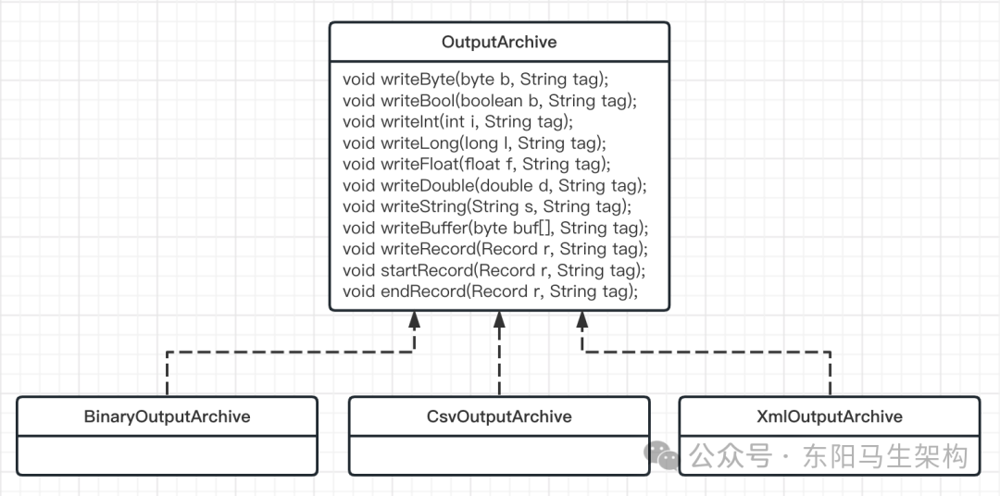
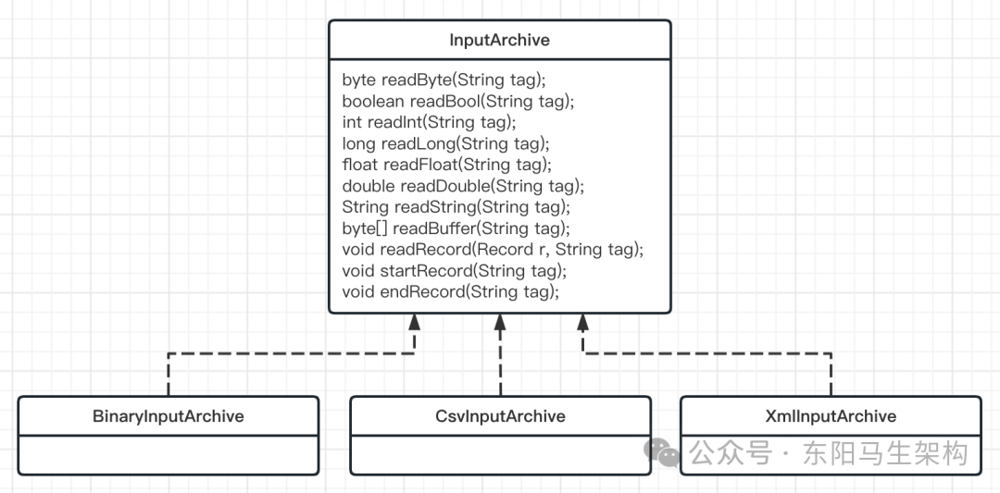
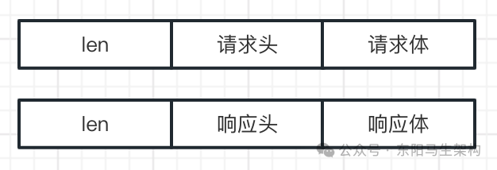

# zk源码—2.通信协议和客户端原理

> **公众号**: 东阳马生架构  
> **发布时间**: 2025-04-07 22:42  

**大纲(20420字)**

- 1.ZooKeeper如何进行序列化
- 2.深入分析Jute的底层实现原理
- 3.ZooKeeper的网络通信协议详解
- 4.客户端的核心组件和初始化过程
- 5.客户端核心组件HostProvider
- 6.客户端核心组件ClientCnxn
- 7.客户端工作原理之会话创建过程


## 1.ZooKeeper如何进行序列化

### (1)什么是序列化以及为什么要进行序列化操作

### (2)ZooKeeper中的序列化方案

### (3)如何使用Jute实现序列化

### (4)Jute在ZooKeeper中的底层实现

### (5)总结

要实现zk客户端与服务端的相互通信，就要解决通过网络传输数据的问题。而要通过网络传输定义好的Java对象数据，就必须要先对其进行序列化。

### (1)什么是序列化以及为什么要进行序列化操作

#### 一.什么是序列化

序列化是指将我们定义好的Java类型转化成数据流的形式。因为在网络传输过程中，TCP协议采用流通信方式，提供可读写的字节流。这种设计的好处是能避免在网络传输过程中经常出现的问题，比如消息丢失、消息重复和排序等问题。

#### 二.什么时候需要序列化

通过网络传递对象或者将对象信息进行持久化时，就要将对象进行序列化。

#### 三.Java中的序列化和反序列化

我们较为熟悉的序列化操作是：当需要序列化一个Java对象时，首先要实现一个Serializable接口。

```java
public class User implements Serializable {
    private static final long serialVersionUID = 1L;
    private Long ids;
    private String name;
    ...
}
```

实现了Serializable接口后并没有做什么实际的工作。Serializable接口仅仅是一个没有任何内容的空接口，它的作用就是标识该类是需要进行序列化的。Serializable接口的序列化与zk序列化实现方法有很大的不同。

```kotlin
public interface Serializable {

}
```

定义好序列化接口后，再看看如何进行序列化和反序列化操作。Java中的序列化和反序列化，主要用到了ObjectInputStream和ObjectOutputStream两个IO类。其中ObjectOutputStream负责将对象进行序列化字节流然后存储到本地，ObjectInputStream负责从本地存储中读取出字节流信息然后反序列化出对象。

```java
//序列化
ObjectOutputStream oo = new ObjectOutputStream();
oo.writeObject(user);

//反序列化
ObjectInputStream ois = new ObjectInputStream();
User user = (User) ois.readObject();
```

### (2)ZooKeeper中的序列化方案

zk并没有采用和Java一样的序列化方式，而是采用Jute框架来处理zk中的序列化。

Jute框架最早作为Hadoop的序列化组件，之后Jute组件从Hadoop中独立出来，成为一个独立的序列化解决方案。

虽然zk一直使用Jute框架作为其序列化的解决方案，但这并不意味着Jute相对其他框架性能更好，反倒是Apache Avro、Thrift等框架在性能上优于Jute。zk之所以一直采用Jute作为序列化解决方案，主要是因为新老版本兼容问题。也许在之后的版本中，zk会选择更加高效的序列化解决方案。

### (3)如何使用Jute实现序列化

#### 一.要进行序列化或反序列化的类需实现Record接口

#### 二.对实现Record接口的类进行序列化和反序列化需要构建一个序列化器

#### 三.使用Jute进行序列化和反序列化的步骤总结

#### 一.要进行序列化或反序列化的类需实现Record接口

如果在zk中要想将某个Java类进行序列化：那么首先需要该类实现Record接口的serialize()方法和deserialize()方法。serialize()和deserialize()这两个方法分别是序列化方法和反序列化方法。

下面定义了一个名为TestJute的类，给出了在zk中进行序列化的具体实现。为了能够对TestJute对象进行序列化，首先需要TestJute类实现Record接口，并在对应的serialize()方法和deserialize()方法中实现具体的逻辑。

在TestJute类的序列化方法serialize()中，要实现的逻辑是：首先通过字符类型参数tag传递标记序列化标识符，然后使用writeLong()和writeString()等方法分别将对象属性字段进行序列化。在TestJute类的反序列化方法derseralize()中，其实现过程则与序列化过程相反。

序列化和反序列化的实现逻辑编码方式其实是相对固定的：都是先通过startRecord()方法开启一段序列化操作，然后通过writeLong()、readLong()等方法执行序列化或反序列化。

```typescript
class TestJute implements Record {
    private long id;
    private String name;
    ...
    public void serialize(OutputArchive a_, String tag) {
        a_.startRecord(this.tag);
        a_.writeLong(id, "id");
        a_.writeString(type, "name");
        a_.endRecord(this, tag);
    }

    public void deserialize(INputArchive a_, String tag) {
        a_.startRecord(tag);
        ids = a_.readLong("id");
        name = a_.readString("name");
        a_.endRecord(tag);
    }
}
```

#### 二.对实现Record接口的类进行序列化和反序列化需要构建一个序列化器

对TestJute对象进行序列化和反序列化的代码：

```java
//开始序列化
ByteArrayOutputStream baos = new ByteArrayOutputStream();
BinaryOutputArchive boa = BinaryOutputArchive.getArchive(baos);
new TestJute(1L, "demo").serialize(boa, "test") ;
//这里通常是TCP网络传输对象
ByteBuffer bb = ByteBuffer.wrap(baos.toByteArray());

//开始反序列化
ByteBufferInputStream bbis = new ByteBufferInputStream(incomingBuffer);
BinaryInputArchive bbia = BinaryInputArchive.getArchive(bbis);
TestJute testJute = new TestJute();
testJute.deserialize(bbia, "test");
```

#### 三.使用Jute进行序列化和反序列化的步骤总结

步骤一：类需要实现Record接口的serialize()和deserialize()方法。

步骤二：构建一个序列化器BinaryOutputArchive或BinaryInputArchive。

步骤三：调用类的serialize()方法，将对象序列化到指定的tag中去。

步骤四：调用类的deserialize()方法，从指定的tag中反序列化出对象。

### (4)Jute在ZooKeeper中的底层实现

Record接口是zk中专门用来进行网络传输或本地存储时使用的数据类型。因此zk中所有要进行网络传输或本地磁盘存储的类，都要实现Record接口。

```java
public interface Record {
    public void serialize(OutputArchive archive, String tag) throws IOException;
    public void deserialize(InputArchive archive, String tag) throws IOException;
}
```

Record接口的内部实现逻辑非常简单，只是定义了一个序列化方法serialize()和一个反序列化方法deserialize()。但起到关键作用的则是两个重要的类：OutputArchive和InputArchive。这两个类才是真正的序列化器和反序列化器，并且通过参数tag可以对多个序列化和反序列化的对象进行标识。

OutputArchive类定义了可以进行序列化的参数类型，使用方可以根据不同的序列化方式调用不同的实现类进行序列化操作。其中，Jute提供了Binary、CSV、XML等不同的序列化方式。



InputArchive类定义了可以进行反序列化的参数类型，使用方可以根据不同的反序列化方式调用不同的实现类进行反序列化操作。其中，Jute提供了Binary、CSV、XML等不同的反序列化方式。



注意：无论是序列化还是反序列化，都可以对多个对象进行操作。在调用Record的序列化和反序列化方法时，需要传入参数tag表示操作的是哪个对象。

### (5)总结

#### 一.什么是序列化以及为什么要进行序列化

序列化就是将对象编译成字节码，从而方便将对象信息存储到本地或者通过网络进行传输。

#### 二.Java中和zk中的序列化方式

在Java中，Serializable接口是一个空接口，只是起到标识作用，用来标识实现了Serializable接口的对象是需要进行序列化的。

在zk中，要进行(反)序列化的对象需要实现Record接口里的两个方法，这两个方法分别是serialize()和deserialize()。

## 2.深入分析Jute的底层实现原理

### (1)简述Jute序列化

### (2)Jute的核心算法(底层原理)

### (3)Binary方式的序列化

### (4)XML方式的序列化

### (5)CSV方式的序列化

### (6)总结

### (1)简述Jute序列化

Jute框架给出了3种具体的序列化方式：Binary方式、CSV方式、XML方式。序列化方式可以理解成将Java对象转化成特定格式，从而更加方便进行网络传输和本地化存储。

之所以提供这3种方式的格式化文件，是因为这3种方式可以跨平台和具有普遍性。

### (2)Jute的核心算法(底层原理)

使用Jute实现序列化时需要实现Record接口。而在Record接口的内部，真正起作用的是两个工具类：分别是OutputArchive序列化器和InputArchive反序列化器。

OutputArchive只是一个接口，规定了一系列序列化相关的操作。Jute通过三个具体实现类分别实现了Binary、CSV、XML方式下的序列化操作。

### (3)Binary方式的序列化

Binary序列化方式其实就是二进制的序列化方式。采用这种方式的序列化就是将Java对象信息转化成二进制的文件格式。

在Jute框架中实现Binary序列化方式的类是BinaryOutputArchive。在Jute框架中采用二进制方式进行序列化时，便会采用该类作为具体实现类。

这里以调用Record接口中的writeString()方法为例，writeString()方法会将Java对象的String字符类型进行Binary序列化。

当调用BinaryOutputArchive的writeString()方法时，首先会判断要进行序列化的字符串是否为空。如果为空，则调用writeInt()方法，将空字符串当作值为-1的int进行序列化。如果不为空，则调用BinaryOutputArchive的stringToByteBuffer()方法对字符串进行序列化。

除了writeString()方法外，其他的如writeInt()、wirteDoule()等方法，则是通过调用DataOutput接口中的相关方法来实现具体的序列化操作的。

BinaryOutputArchive的stringToByteBuffer()方法在将字符串转化成二进制字节流的过程中，首先会将字符串转化成字符数组CharSequence对象，然后根据ASCII编码判断字符类型：如果是字母，那么就使用1个byte进行存储。如果是诸如"¥"等符号，那么就采用两个byte进行存储。如果是汉字，那么就采用3个byte进行存储。

```java
public class BinaryOutputArchive implements OutputArchive {
    private ByteBuffer bb = ByteBuffer.allocate(1024);
    private DataOutput out;

    public static BinaryOutputArchive getArchive(OutputStream strm) {
        return new BinaryOutputArchive(new DataOutputStream(strm));
    }
    ...
    public void writeString(String s, String tag) throws IOException {
        if (s == null) {
            //如果为空，则调用writeInt方法，将空字符串当作值为-1的int进行序列化
            writeInt(-1, "len");
            return;
        }
        //如果不为空，则调用stringToByteBuffer方法对字符串进行序列化操作
        ByteBuffer bb = stringToByteBuffer(s);
        writeInt(bb.remaining(), "len");
        out.write(bb.array(), bb.position(), bb.limit());
    }

    final private ByteBuffer stringToByteBuffer(CharSequence s) {
        bb.clear();
        final int len = s.length();
        for (int i = 0; i < len; i++) {
            if (bb.remaining() < 3) {
                ByteBuffer n = ByteBuffer.allocate(bb.capacity() << 1);
                bb.flip();
                n.put(bb);
                bb = n;
            }
            char c = s.charAt(i);
            if (c < 0x80) {
                bb.put((byte) c);
            } else if (c < 0x800) {
                bb.put((byte) (0xc0 | (c >> 6)));
                bb.put((byte) (0x80 | (c & 0x3f)));
            } else {
                bb.put((byte) (0xe0 | (c >> 12)));
                bb.put((byte) (0x80 | ((c >> 6) & 0x3f)));
                bb.put((byte) (0x80 | (c & 0x3f)));
            }
        }
        bb.flip();
        return bb;
    }
    ...
}
```

总结：Binary二进制序列化方式的底层实现相对简单，只是将对应的Java对象转化成二进制字节流的方式。Binary方式序列化的优点有很多，因为各操作系统的底层都是对二进制文件进行操作的，而且各操作系统对二进制文件的编译与解析也是一样的。所以优点是各系统都能对二进制文件进行操作，跨平台的支持性更好，缺点就是会存在不同操作系统下，产生大端小端的问题。

### (4)XML方式的序列化

XML是一种可扩展的标记语言，当初设计的目的就是用来传输和存储数据。XML很像HTML语言，而与HTML语言不同的是XML需要自己定义标签。在XML文件中每个标签都是自定义的，而每个标签就对应一项内容。一个简单的XML的格式如下所示：

```xml
<note>
    <to>全班同学</to>
    <from>王老师</form>
    <heading>下周数学课</heading>
    <body>伽罗瓦群论</body>
</note>
```

在Jute框架中实现XML序列化方式的类是XmlOutputArchive。在Jute框架中采用XML方式实现序列化时，便会采用该类作为具体实现类。

这里以调用Record接口中的writeString()方法为例，writeString()方法会将Java对象的String字符类型进行XML序列化。

当调用XmlOutputArchive的writeString()方法时，首先会调用printBeginEnvelope()方法。通过printBeginEnvelope()方法来标记要序列化的字段名称，之后使用"<string>"和"</string>"作为自定义标签，来封装传入的字符串。

```typescript
class XmlOutputArchive implements OutputArchive {
    private PrintStream stream;
    private Stack<String> compoundStack;
    ...
    public void writeString(String s, String tag) throws IOException {
        printBeginEnvelope(tag);
        stream.print("<string>");
        stream.print(Utils.toXMLString(s));
        stream.print("</string>");
        printEndEnvelope(tag);
    }

    private void printBeginEnvelope(String tag) {
        if (!compoundStack.empty()) {
            String s = compoundStack.peek();
            if ("struct".equals(s)) {
                putIndent();
                stream.print("<member>\n");
                addIndent();
                putIndent();
                stream.print("<name>"+tag+"</name>\n");
                putIndent();
                stream.print("<value>");
            } else if ("vector".equals(s)) {
                stream.print("<value>");
            } else if ("map".equals(s)) {
                stream.print("<value>");
            }
        } else {
            stream.print("<value>");
        }
    }
    ...
}
```

可见，XmlOutputArchive的基本原理就是根据XML格式的要求解析传入的参数，并将参数按Jute定义好的格式，采用Jute设定好的默认标签，将传入的信息封装成对应的序列化文件。

采用XML方式进行序列化的优点是：通过可扩展标记协议，不同平台对序列化和反序列化的方式都是一样的。所以XML方式的优点是不会存在因为平台不同而产生差异，也不会出现如Binary二进制序列化方式中产生的大端小端问题。XML方式的缺点则是序列化和反序列化的性能不如二进制方式。在序列化后产生的文件相比与二进制方式，同样的信息所产生的文件更大。

### (5)CSV方式的序列化

CSV方式和XML方式很像，只是所采用的转化格式不同，CSV格式采用逗号将文本进行分割。

在Jute框架中实现CSV序列化的类是CsvOutputArchive，在Jute框架采用CSV方式实现序列化时，便会采用该类作为具体实现类。

这里以调用Record接口中的writeString()方法为例，writeString()方法会将Java对象的String字符类型进行CSV序列化。

当调用CsvOutputArchive的writeString()方法时，首先会调用printCommaUnlessFirst()方法生成一个逗号分隔符，然后将需要序列化的字符串值转换成CSV编码格式追加到字节数组中。

```typescript
public class CsvOutputArchive implements OutputArchive {
    private PrintStream stream;
    private boolean isFirst = true;
    ...
    public void writeString(String s, String tag) throws IOException {
        printCommaUnlessFirst();
        stream.print(Utils.toCSVString(s));
        throwExceptionOnError(tag);
    }

    private void printCommaUnlessFirst() {
        if (!isFirst) {
            stream.print(",");
        }
        isFirst = false;
    }
    ...
}
```

### (6)总结

#### 一.三种方式比较

Binary方式最为简单、性能也最好，但有大端小端问题。XML方式作为可扩展的标记语言跨平台性更强，占用空间大。CSV方式介于两者之间实现起来也相比XML格式更加简单。

之所以需要深入了解Jute的底层实现原理，是为了在开发中更好使用zk。在发生诸如客户端与服务端通信中信息发送不完整或解析错误等情况时，能通过底层序列化模块入手排查信息错误，进一步提高日常设计和解决问题的能力。

#### 二.zk默认的序列化实现方式

zk默认的序列化实现方式是Binary二进制方式，这是因为二进制具有更好的性能。

## 3.ZooKeeper的网络通信协议详解

### (1)ZooKeeper协议简述

### (2)ZooKeeper通信协议的底层实现之请求协议

### (3)ZooKeeper协议的底层实现之响应协议

### (4)总结

### (1)ZooKeeper协议简述

zk基于TCP/IP协议，实现了自己的通信协议来完成网络通信。zk通信协议整体上的设计非常简单。

一次客户端的请求，主要由请求头和请求体组成。

一次服务端的响应，主要由响应头和响应体组成。



### (2)ZooKeeper通信协议的底层实现之请求协议

#### 一.请求头RequestHeader

#### 二.请求体Request

实现一：会话创建请求ConnectRequest

实现二：节点数据查询请求GetDataRequest

实现三：节点数据更新请求SetDataRequest

请求协议就是客户端向服务端发送请求的协议，比如常用的会话创建、数据节点查询等操作，都会使用请求协议来完成客户端与服务端的网络通信。

#### 一.请求头RequestHeader

在zk中请求头是通过RequestHeader类实现的，RequestHeader类实现了Record接口，用于网络传输时进行序列化操作。可以看到RequestHeader类中只有两个属性字段，分别是xid和type。其中xid字段表示客户端序号用于记录客户端请求的发起顺序，type字段表示请求操作的类型。

```java
class RequestHeader implements Record {
    private int xid;//客户端序号用于记录客户端请求的发起顺序
    private int type;//请求操作的类型
    ...
    public void serialize(OutputArchive a_, String tag) throws java.io.IOException {
        a_.startRecord(this,tag);
        a_.writeInt(xid,"xid");
        a_.writeInt(type,"type");
        a_.endRecord(this,tag);
    }

    public void deserialize(InputArchive a_, String tag) throws java.io.IOException {
        a_.startRecord(tag);
        xid=a_.readInt("xid");
        type=a_.readInt("type");
        a_.endRecord(tag);
    }
    ...
}
```

#### 二.请求体Request

请求协议的请求体部分是指请求的主体内容部分，包含了请求的所有内容。不同的请求类型，其请求体部分的结构是不同的。接下来介绍会话创建、数据节点查询、数据节点更新的三种请求体实现。

实现一：会话创建请求ConnectRequest

zk客户端发起会话时，会向服务端发送一个会话创建请求。该请求的作用就是通知zk服务端需要处理一个来自客户端的访问连接。服务端处理会话创建请求时所需要的所有信息都包括在请求体内。

会话创建请求的请求体是通过ConnectRequest类实现的。ConnectRequest类实现了Record接口，用于网络传输时进行序列化操作。可以看到，ConnectRequest类一共有五种属性字段，分别是：protocolVersion表示该请求协议的版本信息，lastZxidSeen表示最后一次接收到的服务器的zxid序号，timeOut表示会话的超时时间，sessionId表示会话标识符，password表示会话密码。zk服务端在接收一个请求时，就会根据请求体的这些信息进行相关操作。

```java
public class ConnectRequest implements Record {
    private int protocolVersion;//表示该请求协议的版本信息
    private long lastZxidSeen;//表示最后一次接收到的服务器的zxid序号
    private int timeOut;//表示会话的超时时间
    private long sessionId;//表示会话标识符
    private byte[] passwd;//表示会话的密码
    ...
    public void serialize(OutputArchive a_, String tag) throws java.io.IOException {
        a_.startRecord(this,tag);
        a_.writeInt(protocolVersion,"protocolVersion");
        a_.writeLong(lastZxidSeen,"lastZxidSeen");
        a_.writeInt(timeOut,"timeOut");
        a_.writeLong(sessionId,"sessionId");
        a_.writeBuffer(passwd,"passwd");
        a_.endRecord(this,tag);
    }

    public void deserialize(InputArchive a_, String tag) throws java.io.IOException {
        a_.startRecord(tag);
        protocolVersion=a_.readInt("protocolVersion");
        lastZxidSeen=a_.readLong("lastZxidSeen");
        timeOut=a_.readInt("timeOut");
        sessionId=a_.readLong("sessionId");
        passwd=a_.readBuffer("passwd");
        a_.endRecord(tag);
    }
}
```

实现二：节点数据查询请求GetDataRequest

当zk客户端向服务端发送一个节点数据查询请求时，节点数据查询请求的请求体是通过GetDataRequest类实现的。GetDataRequest类实现了Record接口，用于网络传输时进行序列化操作。可以看到，GetDataRequest类具有两个属性字段，分别是：path表示要请求的数据节点路径，watch表示该节点是否注册Watcher事件。

```java
public class GetDataRequest implements Record {
    private String path;//表示要请求的数据节点路径
    private boolean watch;//表示该节点是否注册Watcher事件
    ...
    public void serialize(OutputArchive a_, String tag) throws java.io.IOException {
        a_.startRecord(this,tag);
        a_.writeString(path,"path");
        a_.writeBool(watch,"watch");
        a_.endRecord(this,tag);
    }

    public void deserialize(InputArchive a_, String tag) throws java.io.IOException {
        a_.startRecord(tag);
        path=a_.readString("path");
        watch=a_.readBool("watch");
        a_.endRecord(tag);
    }
    ...
}
```

实现三：节点数据更新请求SetDataRequest

当zk客户端向服务端发送一个节点数据更新请求时，节点数据更新请求的请求体是通过SetDataRequest类实现的。SetDataRequest类实现了Record接口，用于网络传输时进行序列化操作。可以看到，SetDataRequest类具有三个属性，分别是：path表示节点的路径，data表示节点数据信息，version表示节点数据的期望版本号，用于乐观锁的验证。

```java
public class SetDataRequest implements Record {
    private String path;//表示节点的路径
    private byte[] data;//表示节点数据信息
    private int version;//表示节点数据的期望版本号，用于乐观锁的验证
    ...
    public void serialize(OutputArchive a_, String tag) throws java.io.IOException {
        a_.startRecord(this,tag);
        a_.writeString(path,"path");
        a_.writeBuffer(data,"data");
        a_.writeInt(version,"version");
        a_.endRecord(this,tag);
    }

    public void deserialize(InputArchive a_, String tag) throws java.io.IOException {
        a_.startRecord(tag);
        path=a_.readString("path");
        data=a_.readBuffer("data");
        version=a_.readInt("version");
        a_.endRecord(tag);
    }
    ...
}
```

### (3)ZooKeeper协议的底层实现之响应协议

#### 一.响应头ReplyHeader

#### 二.响应体Response

实现一：会话创建响应ConnectResponse

实现二：节点数据查询响应GetDataResponse

实现三：节点数据更新响应SetDataResponse

响应可理解为服务端在处理完客户端的请求后，返回相关信息给客户端。服务端采用的响应协议类型需要根据客户端的请求协议类型来选择。在zk服务端向客户端返回的响应中，包括了响应头和响应体，所以响应协议包含了响应头和响应体两部分。

#### 一.响应头ReplyHeader

与客户端的请求头不同的是，服务端的响应头多了一个错误状态字段，服务端的响应头的具体实现类是ReplyHeader。

```java
public class ReplyHeader implements Record {
    private int xid;
    private long zxid;
    private int err;
    ...
    public void serialize(OutputArchive a_, String tag) throws java.io.IOException {
        a_.startRecord(this,tag);
        a_.writeInt(xid,"xid");
        a_.writeLong(zxid,"zxid");
        a_.writeInt(err,"err");
        a_.endRecord(this,tag);
    }

    public void deserialize(InputArchive a_, String tag) throws java.io.IOException {
        a_.startRecord(tag);
        xid=a_.readInt("xid");
        zxid=a_.readLong("zxid");
        err=a_.readInt("err");
        a_.endRecord(tag);
    }
    ...
}
```

#### 二.响应体Response

响应协议的响应体部分是指响应的主体内容部分，包含了响应的所有数据。不同的响应类型，其响应体部分的结构是不同的。接下来介绍会话创建、数据节点查询、数据节点更新的三种响应体实现。

实现一：会话创建响应ConnectResponse

针对客户端的会话创建请求，服务端会返回一个会话创建响应。会话创建响应的响应体是通过ConnectRespose类来实现的。ConnectRespose类实现了Record接口，用于网络传输时进行序列化操作。可以看到，ConnectRespose类具有四个属性，分别是：protocolVersion表示请求协议的版本信息，timeOut表示会话超时时间，sessionId表示会话标识符，passwd表示会话密码。

```java
public class ConnectResponse implements Record {
    private int protocolVersion;//请求协议的版本信息
    private int timeOut;//会话超时时间
    private long sessionId;//会话标识符
    private byte[] passwd;//会话密码
    ...
    public void serialize(OutputArchive a_, String tag) throws java.io.IOException {
        a_.startRecord(this,tag);
        a_.writeInt(protocolVersion,"protocolVersion");
        a_.writeInt(timeOut,"timeOut");
        a_.writeLong(sessionId,"sessionId");
        a_.writeBuffer(passwd,"passwd");
        a_.endRecord(this,tag);
    }

    public void deserialize(InputArchive a_, String tag) throws java.io.IOException {
        a_.startRecord(tag);
        protocolVersion=a_.readInt("protocolVersion");
        timeOut=a_.readInt("timeOut");
        sessionId=a_.readLong("sessionId");
        passwd=a_.readBuffer("passwd");
        a_.endRecord(tag);
    }
    ...
}
```

实现二：节点数据查询响应GetDataResponse

针对客户端的节点数据查询请求，服务端会返回一个节点数据查询响应。节点数据查询响应的响应体是通过GetDataResponse类来实现的。GetDataResponse类实现了Record接口，用于网络传输时进行序列化操作。可以看到，GetDataResponse类具有两个属性，分别是：data表示节点数据的内容，stat表示节点的状态信息。

```java
public class GetDataResponse implements Record {
    private byte[] data;//节点数据的内容
    private org.apache.zookeeper.data.Stat stat;//表示节点的状态信息
    ...
    public void serialize(OutputArchive a_, String tag) throws java.io.IOException {
        a_.startRecord(this,tag);
        a_.writeBuffer(data,"data");
        a_.writeRecord(stat,"stat");
        a_.endRecord(this,tag);
    }

    public void deserialize(InputArchive a_, String tag) throws java.io.IOException {
        a_.startRecord(tag);
        data=a_.readBuffer("data");
        stat= new org.apache.zookeeper.data.Stat();
        a_.readRecord(stat,"stat");
        a_.endRecord(tag);
    }
    ...
}
```

实现三：节点数据更新响应SetDataResponse

针对客户端的节点数据更新请求，服务端会返回一个节点数据更新响应。节点数据更新响应的响应体是通过SetDataResponse类来实现的。SetDataResponse类实现了Record接口，用于网络传输时进行序列化操作。可以看到，SetDataResponse类只有一个属性：stat表示该节点数据更新后的最新状态信息。

```java
public class SetDataResponse implements Record {
    private org.apache.zookeeper.data.Stat stat;//表示该节点数据更新后的最新状态信息
    ...
    public void serialize(OutputArchive a_, String tag) throws java.io.IOException {
        a_.startRecord(this,tag);
        a_.writeRecord(stat,"stat");
        a_.endRecord(this,tag);
    }

    public void deserialize(InputArchive a_, String tag) throws java.io.IOException {
        a_.startRecord(tag);
        stat= new org.apache.zookeeper.data.Stat();
        a_.readRecord(stat,"stat");
        a_.endRecord(tag);
    }
    ...
}
```

### (4)总结

zk中的网络通信协议是通过不同的类具体实现的。

ZooKeeper通信协议的底层实现之请求协议：

#### 一.请求头RequestHeader

#### 二.请求体Request

实现一：会话创建请求ConnectRequest

实现二：节点数据查询请求GetDataRequest

实现三：节点数据更新请求SetDataRequest

ZooKeeper协议的底层实现之响应协议：

#### 一.响应头ReplyHeader

#### 二.响应体Response

实现一：会话创建响应ConnectResponse

实现二：节点数据查询响应GetDataResponse

实现三：节点数据更新响应SetDataResponse

问题：一个会话如果超时，服务器端就会主动关闭会话，zk可以在会话请求的请求体中设置会话超时时间。但为什么经常会遇到明明已通过客户端设置了指定的超时时间，而在实际执行时会话时的超时时间却远小于指定设置的时间？

这是因为zk服务端处理会话超时时间不仅使用客户端传来的超时时间，还会根据配置的minSessionTimeout和maxSessionTimeout来调整时间，这在日常开发设置中是需要注意的。

## 4.客户端的核心组件和初始化过程

### (1)zk的客户端的核心组件

### (2)客户端的初始化过程

### (1)zk的客户端的核心组件

#### 一.ZooKeeper

#### 二.ZKWatchManager

#### 三.HostProvider

#### 四.ClientCnxn

#### 一.ZooKeeper

```java
public class ZooKeeper implements AutoCloseable {
    protected final ZKWatchManager watchManager;
    protected final HostProvider hostProvider;
    protected final ClientCnxn cnxn;
    ...
}
```

#### 二.ZKWatchManager

```typescript
public class ZooKeeper implements AutoCloseable {
    ...
    static class ZKWatchManager implements ClientWatchManager {
        private final Map<String, Set<Watcher>> dataWatches = new HashMap<String, Set<Watcher>>();
        private final Map<String, Set<Watcher>> existWatches = new HashMap<String, Set<Watcher>>();
        private final Map<String, Set<Watcher>> childWatches = new HashMap<String, Set<Watcher>>();
        protected volatile Watcher defaultWatcher;
        ...
    }
    ...
}
```

#### 三.HostProvider

```cs
public interface HostProvider {
    public int size();
    public InetSocketAddress next(long spinDelay);
    public void onConnected();
}
```

#### 四.ClientCnxn

```kotlin
public class ClientCnxn {
    private final ZooKeeper zooKeeper;
    private final ClientWatchManager watcher;
    final SendThread sendThread;
    final EventThread eventThread;
    private final HostProvider hostProvider;
    ...
}
```

### (2)客户端的初始化过程

#### 一.设置默认Watcher实例

#### 二.设置zk服务器地址列表

#### 三.创建ClientCnxn实例

如果在zk的构造方法中传入一个Watcher对象，那么zk就会将该Watcher对象保存在ZKWatchManager的defaultWatcher，作为整个客户端会话期间的默认Watcher实例。

```java
public class ZooKeeper implements AutoCloseable {
    protected final ZKWatchManager watchManager;
    protected final HostProvider hostProvider;
    protected final ClientCnxn cnxn;
    ...
    public ZooKeeper(String connectString, int sessionTimeout, Watcher watcher, long sessionId, byte[] sessionPasswd, boolean canBeReadOnly, HostProvider aHostProvider, ZKClientConfig clientConfig) throws IOException {
        ...
        //1.设置默认Watcher
        watchManager = defaultWatchManager();
        watchManager.defaultWatcher = watcher;
        ...
        //2.设置zk服务器地址列表
        hostProvider = aHostProvider;
        //3.创建ClientCnxn
        cnxn = new ClientCnxn(connectStringParser.getChrootPath(), hostProvider, sessionTimeout, this, watchManager, getClientCnxnSocket(), sessionId, sessionPasswd, canBeReadOnly);
        ...
    }
    ...
}
```

## 5.客户端核心组件HostProvider

### (1)HostProvider的创建

### (2)HostProvider的next()方法

### (1)HostProvider的创建

在使用zk的构造方法时会传入zk服务器地址列表，即connectString参数。zk客户端内部接收到这个服务器地址列表后，会首先将该列表放入ConnectStringParser解析器中封装起来。ConnectStringParser解析器会对传入的connectString进行如下处理：

#### 一.解析chrootPath

通过设置chrootPath，可以让客户端应用与zk服务端的一棵子树相对应。在多个应用共用一个zk集群的场景下，可以实现不同应用间的相互隔离。

#### 二.保存服务器地址列表

在ConnectStringParser解析器中会对服务器地址进行如下处理：先将服务器地址和相应的端口封装成一个InetSocketAddress对象，然后以ArrayList的形式保存在ConnectStringParser的serverAddresses属性中。

经过ConnectStringParser解析器对connectString解析后，便获取处理好的服务器地址列表，然后封装到StaticHostProvider中。

```java
public class ZooKeeper implements AutoCloseable {
    ...
    public ZooKeeper(String connectString, int sessionTimeout, Watcher watcher, long sessionId, byte[] sessionPasswd, boolean canBeReadOnly) throws IOException {
        this(connectString, sessionTimeout, watcher, sessionId, sessionPasswd, canBeReadOnly, createDefaultHostProvider(connectString));
    }

    private static HostProvider createDefaultHostProvider(String connectString) {
        //将经过处理的服务器地址列表封装到StaticHostProvider中
        return new StaticHostProvider(new ConnectStringParser(connectString).getServerAddresses());
    }
    ...
}

public final class ConnectStringParser {
    private static final int DEFAULT_PORT = 2181;
    private final String chrootPath;
    private final ArrayList<InetSocketAddress> serverAddresses = new ArrayList<InetSocketAddress>();

    public ConnectStringParser(String connectString) {
        int off = connectString.indexOf('/');
        //解析chrootPath
        if (off >= 0) {
            String chrootPath = connectString.substring(off);
            if (chrootPath.length() == 1) {
                this.chrootPath = null;
            } else {
                PathUtils.validatePath(chrootPath);
                this.chrootPath = chrootPath;
            }
            connectString = connectString.substring(0, off);
        } else {
            this.chrootPath = null;
        }

        //2.保存服务器地址列表
        List<String> hostsList = split(connectString,",");
        for (String host : hostsList) {
            int port = DEFAULT_PORT;
            String[] hostAndPort = NetUtils.getIPV6HostAndPort(host);
            if (hostAndPort.length != 0) {
                host = hostAndPort[0];
                if (hostAndPort.length == 2) {
                    port = Integer.parseInt(hostAndPort[1]);
                }
            } else {
                int pidx = host.lastIndexOf(':');
                if (pidx >= 0) {
                    if (pidx < host.length() - 1) {
                        port = Integer.parseInt(host.substring(pidx + 1));
                    }
                    host = host.substring(0, pidx);
                }
            }
            serverAddresses.add(InetSocketAddress.createUnresolved(host, port));
        }
    }

    public String getChrootPath() {
        return chrootPath;
    }

    public ArrayList<InetSocketAddress> getServerAddresses() {
        return serverAddresses;
    }
}
```

### (2)HostProvider的next()方法

#### 一.StaticHostProvider的next()方法需要返回已解析的地址

需要注意的是：在ConnectStringParser的serverAddresses属性中保存的服务器地址列表，都是还没有被解析的InetSocketAddress。

所以HostProvider的方法就会负责对InetSocketAddress列表进行解析，然后HostProvider的next()方法返回的必须是已被解析的InetSocketAddress。

```cs
public interface HostProvider {
    public int size();
    public InetSocketAddress next(long spinDelay);
    public void onConnected();
}
```

#### 二.StaticHostProvider解析服务器地址时会随机打散列表

针对ConnectStringParser.serverAddresses中没有被解析的服务器地址，StaticHostProvider会对这些地址逐个解析然后放入其serverAddresses中，同时会使用Collections.shuffle()方法来随机打散服务器地址列表。

调用StaticHostProvider的next()方法时，会从其serverAddresses中获取一个可用的地址。这个next()方法会先将随机打散后的地址列表拼装成一个环形循环队列。然后在之后的使用过程中，一直按拼装的顺序来获取服务器地址。这个随机打散的过程是一次性的。

```java
public final class StaticHostProvider implements HostProvider {
    private List<InetSocketAddress> serverAddresses = new ArrayList<InetSocketAddress>(5);
    private int lastIndex = -1;
    private int currentIndex = -1;
    ...
    public StaticHostProvider(Collection<InetSocketAddress> serverAddresses) {
        init(serverAddresses, System.currentTimeMillis() ^ this.hashCode(),
            new Resolver() {
                @Override
                public InetAddress[] getAllByName(String name) throws UnknownHostException {
                    return InetAddress.getAllByName(name);
                }
            }
        );
    }

    private void init(Collection<InetSocketAddress> serverAddresses, long randomnessSeed, Resolver resolver) {
        ...
        //随机打散传入的服务器地址列表
        this.serverAddresses = shuffle(serverAddresses);
        currentIndex = -1;
        lastIndex = -1;
    }

    private List<InetSocketAddress> shuffle(Collection<InetSocketAddress> serverAddresses) {
        List<InetSocketAddress> tmpList = new ArrayList<>(serverAddresses.size());
        tmpList.addAll(serverAddresses);
        Collections.shuffle(tmpList, sourceOfRandomness);
        return tmpList;
    }
    ...
}
```

#### 三.StaticHostProvider中的环形循环队列实现

StaticHostProvider会为循环队列创建两个游标：currentIndex和lastIndex。currentIndex表示循环队列中当前遍历到的那个元素位置，初始值为-1。lastIndex表示当前正在使用的服务器地址位置，初始值为-1。每次执行next()方法时，都会先将currentIndex游标向前移动1位。如果发现游标移动超过了整个地址列表的长度，那么就重置为0。

对于服务器地址列表提供得比较少的场景：如果发现当前游标的位置和上次已经使用过的地址位置一样，也就是currentIndex和lastIndex游标值相同时，就进行spinDelay毫秒等待。

```java
public final class StaticHostProvider implements HostProvider {
    private List<InetSocketAddress> serverAddresses = new ArrayList<InetSocketAddress>(5);
    private int lastIndex = -1;
    private int currentIndex = -1;
    ...
    public InetSocketAddress next(long spinDelay) {
        boolean needToSleep = false;
        InetSocketAddress addr;
        synchronized(this) {
            ...
            ++currentIndex;
            if (currentIndex == serverAddresses.size()) {
                currentIndex = 0;
            }
            addr = serverAddresses.get(currentIndex);
            needToSleep = needToSleep || (currentIndex == lastIndex && spinDelay > 0);
            if (lastIndex == -1) {
                // We don't want to sleep on the first ever connect attempt.
                lastIndex = 0;
            }
        }
        if (needToSleep) {
            try {
                Thread.sleep(spinDelay);
            } catch (InterruptedException e) {
                LOG.warn("Unexpected exception", e);
            }
        }
        return resolve(addr);
    }

    public synchronized void onConnected() {
        lastIndex = currentIndex;
        reconfigMode = false;
    }
    ...
}
```

## 6.客户端核心组件ClientCnxn

### (1)客户端核心类ClientCnxn和Packet

### (2)请求队列outgoingQueue与响应等待队列pendingQueue

### (3)SendThread

### (4)EventThread

### (5)总结

### (1)客户端核心类ClientCnxn和Packet

#### 一.ClientCnxn

ClientCnxn是zk客户端的核心工作类，负责维护客户端与服务端间的网络连接并进行一系列网络通信。

#### 二.Packet

Packet是ClientCnxn内部定义的、作为zk客户端中请求与响应的载体。也就是说Packet可以看作是一个用来进行网络通信的数据结构，Packet的主要作用是封装网络通信协议层的数据。

Packet中包含了一些请求协议的相关属性字段：请求头信息requestHeader、响应头信息replyHeader、请求体request、响应体response、节点路径clientPath以及serverPath、Watcher监控信息。

Packet的createBB()方法负责对Packet对象进行序列化，最终生成可用于底层网络传输的ByteBuffer对象。该方法只会将requestHeader、request和readOnly三个属性进行序列化。Packet的其余属性保存在客户端的上下文，不进行服务端的网络传输。

```java
public class ApiOperatorDemo implements Watcher {
    private final static String CONNECT_STRING = "192.168.30.10:2181";
    private static CountDownLatch countDownLatch = new CountDownLatch(1);
    private static ZooKeeper zookeeper;

    public static void main(String[] args) throws Exception {
        zookeeper = new ZooKeeper(CONNECT_STRING, 5000, new ApiOperatorDemo());
        countDownLatch.await();
        String result = zookeeper.setData("/node", "test".getBytes(), ZooDefs.Ids.OPEN_ACL_UNSAFE, CreateMode.PERSISTENT);
    }

    @Override
    public void process(WatchedEvent watchedEvent) {
        //如果当前的连接状态是连接成功的，那么通过计数器去控制
        if (watchedEvent.getState() == Event.KeeperState.SyncConnected) {
            countDownLatch.countDown();
        }
    }
}

public class ZooKeeper implements AutoCloseable {
    protected final ClientCnxn cnxn;

    public ZooKeeper(String connectString, int sessionTimeout, Watcher watcher, boolean canBeReadOnly,
        HostProvider aHostProvider, ZKClientConfig clientConfig) throws IOException {
        if (clientConfig == null) {
            clientConfig = new ZKClientConfig();
        }
        this.clientConfig = clientConfig;
        watchManager = defaultWatchManager();
        watchManager.defaultWatcher = watcher;
        ConnectStringParser connectStringParser = new ConnectStringParser(connectString);
        hostProvider = aHostProvider;
        //创建ClientCnxn实例
        cnxn = createConnection(connectStringParser.getChrootPath(), hostProvider, sessionTimeout, this, watchManager, getClientCnxnSocket(), canBeReadOnly);
        cnxn.start();
    }

    protected ClientCnxn createConnection(String chrootPath, HostProvider hostProvider, int sessionTimeout,
        ZooKeeper zooKeeper, ClientWatchManager watcher, ClientCnxnSocket clientCnxnSocket, boolean canBeReadOnly) throws IOException {
        return new ClientCnxn(chrootPath, hostProvider, sessionTimeout, this, watchManager, clientCnxnSocket, canBeReadOnly);
    }

    private ClientCnxnSocket getClientCnxnSocket() throws IOException {
        String clientCnxnSocketName = getClientConfig().getProperty(ZKClientConfig.ZOOKEEPER_CLIENT_CNXN_SOCKET);
        if (clientCnxnSocketName == null || clientCnxnSocketName.equals(ClientCnxnSocketNIO.class.getSimpleName())) {
            clientCnxnSocketName = ClientCnxnSocketNIO.class.getName();
        } else if (clientCnxnSocketName.equals(ClientCnxnSocketNetty.class.getSimpleName())) {
            clientCnxnSocketName = ClientCnxnSocketNetty.class.getName();
        }
        Constructor<?> clientCxnConstructor = Class.forName(clientCnxnSocketName).getDeclaredConstructor(ZKClientConfig.class);
        ClientCnxnSocket clientCxnSocket = (ClientCnxnSocket) clientCxnConstructor.newInstance(getClientConfig());
        return clientCxnSocket;
    }
    ...
    public Stat setData(final String path, byte data[], int version) {
        final String clientPath = path;
        PathUtils.validatePath(clientPath);
        final String serverPath = prependChroot(clientPath);

        RequestHeader h = new RequestHeader();
        h.setType(ZooDefs.OpCode.setData);
        SetDataRequest request = new SetDataRequest();
        request.setPath(serverPath);
        request.setData(data);
        request.setVersion(version);
        SetDataResponse response = new SetDataResponse();
        //提交请求
        ReplyHeader r = cnxn.submitRequest(h, request, response, null);
        ...
        return response.getStat();
    }
    ...
}

public class ClientCnxn {
    final SendThread sendThread;
    final EventThread eventThread;

    public ClientCnxn(String chrootPath, HostProvider hostProvider, int sessionTimeout, ZooKeeper zooKeeper,
            ClientWatchManager watcher, ClientCnxnSocket clientCnxnSocket, long sessionId, byte[] sessionPasswd, boolean canBeReadOnly) {
        ...
        sendThread = new SendThread(clientCnxnSocket);
        eventThread = new EventThread();
        ...
    }

    public void start() {
        sendThread.start();
        eventThread.start();
    }
    ...
    public ReplyHeader submitRequest(RequestHeader h, Record request, Record response, WatchRegistration watchRegistration) {
        return submitRequest(h, request, response, watchRegistration, null);
    }

    public ReplyHeader submitRequest(RequestHeader h, Record request, Record response, WatchRegistration watchRegistration, WatchDeregistration watchDeregistration) {
        ReplyHeader r = new ReplyHeader();
        //封装成Packet对象
        Packet packet = queuePacket(h, r, request, response, null, null, null, null, watchRegistration, watchDeregistration);
        synchronized (packet) {
            if (requestTimeout > 0) {
                waitForPacketFinish(r, packet);
            } else {
                while (!packet.finished) {
                    packet.wait();
                }
            }
        }
        if (r.getErr() == Code.REQUESTTIMEOUT.intValue()) {
            sendThread.cleanAndNotifyState();
        }
        return r;
    }

    public Packet queuePacket(RequestHeader h, ReplyHeader r, Record request, Record response, AsyncCallback cb, String clientPath,
            String serverPath, Object ctx, WatchRegistration watchRegistration, WatchDeregistration watchDeregistration) {
        Packet packet = null;
        packet = new Packet(h, r, request, response, watchRegistration);
        packet.cb = cb;
        packet.ctx = ctx;
        packet.clientPath = clientPath;
        packet.serverPath = serverPath;
        packet.watchDeregistration = watchDeregistration;
        synchronized (state) {
            if (!state.isAlive() || closing) {
                conLossPacket(packet);
            } else {
                if (h.getType() == OpCode.closeSession) {
                    closing = true;
                }
                //将Packet对象添加到outgoingQueue队列，后续请求的发送交给SendThread来处理
                outgoingQueue.add(packet);
            }
        }
        sendThread.getClientCnxnSocket().packetAdded();
        return packet;
    }
    ...
    static class Packet {
        RequestHeader requestHeader;//请求头
        ReplyHeader replyHeader;//响应头
        Record request;//请求体
        Record response;//响应体
        ByteBuffer bb;
        String clientPath;//节点路径
        String serverPath;//节点路径
        boolean finished;
        AsyncCallback cb;
        Object ctx;
        WatchRegistration watchRegistration;
        public boolean readOnly;
        WatchDeregistration watchDeregistration;
        ...
        public void createBB() {
            try {
                ByteArrayOutputStream baos = new ByteArrayOutputStream();
                BinaryOutputArchive boa = BinaryOutputArchive.getArchive(baos);
                boa.writeInt(-1, "len"); // We'll fill this in later
                if (requestHeader != null) {
                    requestHeader.serialize(boa, "header");
                }
                if (request instanceof ConnectRequest) {
                    request.serialize(boa, "connect");
                    // append "am-I-allowed-to-be-readonly" flag
                    boa.writeBool(readOnly, "readOnly");
                } else if (request != null) {
                    request.serialize(boa, "request");
                }
                baos.close();
                this.bb = ByteBuffer.wrap(baos.toByteArray());
                this.bb.putInt(this.bb.capacity() - 4);
                this.bb.rewind();
            } catch (IOException e) {
                LOG.warn("Ignoring unexpected exception", e);
            }
        }
    }
  ...
}
```

### (2)请求队列outgoingQueue与响应等待队列pendingQueue

ClientCnxn中有两个核心的队列outgoingQueue和pendingQueue，分别代表客户端的请求发送队列和服务端的响应等待队列。

outgoingQueue队列是一个客户端的请求发送队列，专门用于存储那些需要发送到服务端的Packet集合。

pendingQueue队列是一个服务端的响应等待队列，用于存储已从客户端发送到服务端，但是需要等待服务端响应的Packet集合。

当zk客户端对请求信息进行封装和序列化后，zk不会立刻就将一个请求信息通过网络直接发送给服务端，而是会先将请求信息添加到请求队列中，之后通过SendThread线程来处理相关的请求发送操作。

```java
public class ClientCnxn {
    final SendThread sendThread;
    final EventThread eventThread;
    private final LinkedList<Packet> pendingQueue = new LinkedList<Packet>();
    private final LinkedBlockingDeque<Packet> outgoingQueue = new LinkedBlockingDeque<Packet>();
    ...
    public ClientCnxn(String chrootPath, HostProvider hostProvider, int sessionTimeout, ZooKeeper zooKeeper,
            ClientWatchManager watcher, ClientCnxnSocket clientCnxnSocket, long sessionId, byte[] sessionPasswd, boolean canBeReadOnly) {
        ...
        sendThread = new SendThread(clientCnxnSocket);
        eventThread = new EventThread();
        ...
    }

    public void start() {
        sendThread.start();
        eventThread.start();
    }
    ...
    class SendThread extends ZooKeeperThread {
        private final ClientCnxnSocket clientCnxnSocket;

        SendThread(ClientCnxnSocket clientCnxnSocket) {
            super(makeThreadName("-SendThread()"));
            state = States.CONNECTING;
            this.clientCnxnSocket = clientCnxnSocket;
            setDaemon(true);
        }
        ...
        @Override
        public void run() {
            ...
            while (state.isAlive()) {
                ...
                //通过clientCnxnSocket.doTransport方法处理请求发送和响应接收
                clientCnxnSocket.doTransport(to, pendingQueue, ClientCnxn.this);
                ...
            }
            ...
        }
    }
}
```

#### 一.请求发送

SendThread线程在调用ClientCnxnSocket的doTransport()方法时，会从ClientCnxn的outgoingQueue队列中提取出一个可发送的Packet对象，同时生成一个客户端请求序号XID并将其设置到Packet对象的请求头中，然后再调用Packet对象的createBB方法进行序列化，最后才发送出去。

请求发送完毕后，会立即将该Packet对象保存到pendingQueue队列中，以便等待服务端的响应返回后可以进行相应的处理。

```java
public class ClientCnxnSocketNIO extends ClientCnxnSocket {
    private final Selector selector = Selector.open();
    protected ClientCnxn.SendThread sendThread;
    protected LinkedBlockingDeque<Packet> outgoingQueue;
    ...
    @Override
    void doTransport(int waitTimeOut, List<Packet> pendingQueue, ClientCnxn cnxn) {
        selector.select(waitTimeOut);
        Set<SelectionKey> selected;
        synchronized (this) {
            selected = selector.selectedKeys();
        }
        updateNow();
        for (SelectionKey k : selected) {
            SocketChannel sc = ((SocketChannel) k.channel());
            if ((k.readyOps() & SelectionKey.OP_CONNECT) != 0) {
                if (sc.finishConnect()) {
                    updateLastSendAndHeard();
                    updateSocketAddresses();
                    sendThread.primeConnection();
                }
            } else if ((k.readyOps() & (SelectionKey.OP_READ | SelectionKey.OP_WRITE)) != 0) {
                //通过doIO方法处理请求发送和响应接收
                doIO(pendingQueue, cnxn);
            }
        }
        if (sendThread.getZkState().isConnected()) {
            if (findSendablePacket(outgoingQueue, sendThread.tunnelAuthInProgress()) != null) {
                enableWrite();
            }
        }
        selected.clear();
    }

    void doIO(List<Packet> pendingQueue, ClientCnxn cnxn) throws InterruptedException, IOException {
        SocketChannel sock = (SocketChannel) sockKey.channel();
        //处理响应接收
        if (sockKey.isReadable()) {
            ...
        }
        //处理请求发送
        if (sockKey.isWritable()) {
            //从outgoingQueue队列中提取出一个可发送的Packet对象
            Packet p = findSendablePacket(outgoingQueue, sendThread.tunnelAuthInProgress());
            if (p != null) {
                updateLastSend();
                if (p.bb == null) {
                    if ((p.requestHeader != null) && (p.requestHeader.getType() != OpCode.ping) && (p.requestHeader.getType() != OpCode.auth)) {
                        //同时生成一个客户端请求序号XID并将其设置到Packet对象的请求头中
                        p.requestHeader.setXid(cnxn.getXid());
                    }
                    //进行序列化
                    p.createBB();
                }
                //发送请求给服务端
                sock.write(p.bb);
                if (!p.bb.hasRemaining()) {
                    sentCount.getAndIncrement();
                    outgoingQueue.removeFirstOccurrence(p);
                    if (p.requestHeader != null && p.requestHeader.getType() != OpCode.ping && p.requestHeader.getType() != OpCode.auth) {
                        synchronized (pendingQueue) {
                            pendingQueue.add(p);
                        }
                    }
                }
            }
            if (outgoingQueue.isEmpty()) {
                disableWrite();
            } else if (!initialized && p != null && !p.bb.hasRemaining()) {
                disableWrite();
            } else {
                enableWrite();
            }
        }
    }
    ...
}
```

#### 二.响应接收

客户端获取到来自服务端的响应后，其中的SendThread线程在调用ClientCnxnSocket的doTransport()方法时，便会调用ClientCnxnSocket的doIO()方法，根据不同的响应进行不同的处理。

情况一：如果检测到当前客户端尚未进行初始化，则客户端和服务端还在创建会话，那么此时就直接将收到的ByteBuffer序列化成ConnectResponse对象。

情况二：如果接收到的服务端响应是一个事件，那么此时就会将接收到的ByteBuffer序列化成WatcherEvent对象，并将WatchedEvent对象放入待处理队列waitingEvents中。

情况三：如果接收到的服务端响应是一个常规的请求响应，那么就从pendingQueue队列中取出一个Packet对象来进行处理；此时zk客户端会检验服务端响应中包含的XID值来确保请求处理的顺序性，然后再将接收到的ByteBuffer序列化成相应的Response对象。

最后，会在finishPacket()方法中处理Packet对象中关联的Watcher事件。

```java
public class ClientCnxnSocketNIO extends ClientCnxnSocket {
    ...
    void doIO(List<Packet> pendingQueue, ClientCnxn cnxn) throws InterruptedException, IOException {
        SocketChannel sock = (SocketChannel) sockKey.channel();
        //处理响应接收
        if (sockKey.isReadable()) {
            int rc = sock.read(incomingBuffer);
            ...
            if (!incomingBuffer.hasRemaining()) {
                incomingBuffer.flip();
                if (incomingBuffer == lenBuffer) {
                    recvCount.getAndIncrement();
                    readLength();
                } else if (!initialized) {
                    //如果检测到当前客户端的网络练车ClientCnxnSocket尚未进行初始化
                    readConnectResult();
                    enableRead();
                    if (findSendablePacket(outgoingQueue, sendThread.tunnelAuthInProgress()) != null) {
                        enableWrite();
                    }
                    lenBuffer.clear();
                    incomingBuffer = lenBuffer;
                    updateLastHeard();
                    initialized = true;
                } else {
                    //处理服务端返回的响应
                    sendThread.readResponse(incomingBuffer);
                    lenBuffer.clear();
                    incomingBuffer = lenBuffer;
                    updateLastHeard();
                }
            }
        }
        //处理请求发送
        if (sockKey.isWritable()) {
            ...
        }
    }
    ...
}

abstract class ClientCnxnSocket {
    protected ByteBuffer incomingBuffer = lenBuffer;
    ...
    void readConnectResult() throws IOException {
        ByteBufferInputStream bbis = new ByteBufferInputStream(incomingBuffer);
        BinaryInputArchive bbia = BinaryInputArchive.getArchive(bbis);
        //将接收到的ByteBuffer序列化成ConnectResponse对象
        ConnectResponse conRsp = new ConnectResponse();
        conRsp.deserialize(bbia, "connect");

        // read "is read-only" flag
        boolean isRO = false;
        isRO = bbia.readBool("readOnly");

        this.sessionId = conRsp.getSessionId();
        //通过SendThread.onConnected方法建立连接
        sendThread.onConnected(conRsp.getTimeOut(), this.sessionId, conRsp.getPasswd(), isRO);
    }
    ...
}

public class ClientCnxn {
    ...
    class SendThread extends ZooKeeperThread {
        private final ClientCnxnSocket clientCnxnSocket;
        ...
        void readResponse(ByteBuffer incomingBuffer) throws IOException {
            ByteBufferInputStream bbis = new ByteBufferInputStream(incomingBuffer);
            BinaryInputArchive bbia = BinaryInputArchive.getArchive(bbis);
            ReplyHeader replyHdr = new ReplyHeader();
            replyHdr.deserialize(bbia, "header");
            ...
            //如果服务端返回的响应是一个事件
            if (replyHdr.getXid() == -1) {
                //将接收到的ByteBuffer序列化成WatcherEvent对象
                WatcherEvent event = new WatcherEvent();
                event.deserialize(bbia, "response");
                ...
                WatchedEvent we = new WatchedEvent(event);
                ...
                //将WatchedEvent对象放入待处理队列waitingEvents中
                eventThread.queueEvent( we );
                return;
            }
            ...
            //如果服务端返回的响应是一个常规的请求响应
            Packet packet;
            synchronized (pendingQueue) {
                //从pendingQueue队列中取出一个Packet
                packet = pendingQueue.remove();
            }
            try {
                if (packet.requestHeader.getXid() != replyHdr.getXid()) {
                    packet.replyHeader.setErr(KeeperException.Code.CONNECTIONLOSS.intValue());
                    throw new IOException("...");
                }
                packet.replyHeader.setXid(replyHdr.getXid());
                packet.replyHeader.setErr(replyHdr.getErr());
                packet.replyHeader.setZxid(replyHdr.getZxid());
                if (replyHdr.getZxid() > 0) {
                    lastZxid = replyHdr.getZxid();
                }
                //将接收到的ByteBuffer序列化成Response对象
                if (packet.response != null && replyHdr.getErr() == 0) {
                    packet.response.deserialize(bbia, "response");
                }
            } finally {
                finishPacket(packet);
            }
        }
    }
    ...
    protected void finishPacket(Packet p) {
        int err = p.replyHeader.getErr();
        if (p.watchRegistration != null) {
            p.watchRegistration.register(err);
        }
        if (p.watchDeregistration != null) {
            Map<EventType, Set<Watcher>> materializedWatchers = null;
            materializedWatchers = p.watchDeregistration.unregister(err);
            for (Entry<EventType, Set<Watcher>> entry : materializedWatchers.entrySet()) {
                Set<Watcher> watchers = entry.getValue();
                if (watchers.size() > 0) {
                    queueEvent(p.watchDeregistration.getClientPath(), err, watchers, entry.getKey());
                    p.replyHeader.setErr(Code.OK.intValue());
                }
            }
        }
        if (p.cb == null) {
            synchronized (p) {
                p.finished = true;
                //客户端封装好Packet发送请求时，会调用Packet对象的wait()方法进行阻塞，这里就进行了通知
                p.notifyAll();
            }
        } else {
            p.finished = true;
            eventThread.queuePacket(p);
        }
    }
    ...
}
```

### (3)SendThread

SendThread是客户端ClientCnxn内部的一个IO调度线程，SendThread的作用是用于管理客户端和服务端之间的所有网络IO操作。

在zk客户端的实际运行过程中：

#### 一.一方面SendThread会维护客户端与服务端之间的会话生命周期

通过在一定的周期频率内向服务端发送一个PING包来实现心跳检测。同时如果客户端和服务端出现TCP连接断开，就会自动完成重连操作。

#### 二.另一方面SendThread会管理客户端所有的请求发送和响应接收操作

将上层客户端API操作转换成相应的请求协议并发送到服务端，并且完成对同步调用的返回和异步调用的回调，同时SendThread还负责将来自服务端的事件传递给EventThread去处理。

注意：为了向服务端证明自己还存活，客户端会周期性发送Ping包给服务端。服务端收到Ping包之后，会根据当前时间重置与客户端的Session时间，更新该Session的请求延迟时间，进而保持客户端与服务端的连接状态。

```java
public class ClientCnxn {
    ...
    class SendThread extends ZooKeeperThread {
        private final ClientCnxnSocket clientCnxnSocket;
        ...
        //处理服务端的响应
        void readResponse(ByteBuffer incomingBuffer) throws IOException {
            ...
            eventThread.queueEvent( we );
            ...
            finishPacket(packet);
            ...
        }

        @Override
        public void run() {
            ...
            while (state.isAlive()) {
                ...
                //出现TCP连接断开，就会自动完成重连操作
                if (!clientCnxnSocket.isConnected()) {
                    if (rwServerAddress != null) {
                        serverAddress = rwServerAddress;
                        rwServerAddress = null;
                    } else {
                        serverAddress = hostProvider.next(1000);
                    }
                    startConnect(serverAddress);
                    clientCnxnSocket.updateLastSendAndHeard();
                }
                ...
                if (state.isConnected()) {
                    ...
                    //发送PING包进行心跳检测
                    sendPing();
                    ...
                }
            }
            ...
            //处理请求发送和响应接收
            clientCnxnSocket.doTransport(to, pendingQueue, ClientCnxn.this);
        }

        private void sendPing() {
            lastPingSentNs = System.nanoTime();
            RequestHeader h = new RequestHeader(-2, OpCode.ping);
            queuePacket(h, null, null, null, null, null, null, null, null);
        }
        ...
    }
    ...
}
```

### (4)EventThread

EventThread是客户端ClientCnxn内部的另一个核心线程，EventThread负责触发客户端注册的Watcher监听和异步接口注册的回调。

EventThread中有一个waitingEvents队列，临时存放要被触发的Object，这些Object包括客户端注册的Watcher监听和异步接口中注册的回调。

EventThread会不断从waitingEvents队列中取出Object，然后识别出具体类型是Watcher监听还是AsyncCallback回调，最后分别调用process()方法和processResult()方法来实现事件触发和回调。

```typescript
public class ClientCnxn {
    ...
    class EventThread extends ZooKeeperThread {
        private final LinkedBlockingQueue<Object> waitingEvents = new LinkedBlockingQueue<Object>();

        EventThread() {
            super(makeThreadName("-EventThread"));
            setDaemon(true);
        }

        @Override
        public void run() {
            isRunning = true;
            while (true) {
                Object event = waitingEvents.take();
                if (event == eventOfDeath) {
                    wasKilled = true;
                } else {
                    processEvent(event);
                }
                if (wasKilled) {
                    synchronized (waitingEvents) {
                        if (waitingEvents.isEmpty()) {
                            isRunning = false;
                            break;
                        }
                    }
                }
            }
        }

        public void queuePacket(Packet packet) {
            if (wasKilled) {
                synchronized (waitingEvents) {
                    if (isRunning) waitingEvents.add(packet);
                    else processEvent(packet);
                }
            } else {
                waitingEvents.add(packet);
            }
        }
        ...
    }
    ...
}
```

### (5)总结

客户端ClientCnxn的工作原理：

当客户端向服务端发送请求操作时，首先会将请求信息封装成Packet对象并加入outgoingQueue请求队列中，之后通过SendThread网络IO调度线程将请求发送给服务端。当客户端接收到服务端响应时，通过EventThread线程来处理服务端响应及触发Watcher监听和异步回调。

## 7.客户端工作原理之会话创建过程

### (1)初始化阶段：实例化ZooKeeper对象

### (2)会话创建阶段：建立连接并发送会话创建请求

### (3)响应处理阶段：接收会话创建请求的响应

### (1)初始化阶段：实例化ZooKeeper对象

#### 一.初始化ZooKeeper对象

#### 二.设置会话默认的Watcher

#### 三.构造服务器地址管理器StaticHostProvider

#### 四.创建并初始化客户端的网络连接器ClientCnxn

#### 五.初始化SendThread和EventThread

#### 一.初始化ZooKeeper对象

通过调用ZooKeeper的构造方法来实例化一个ZooKeeper对象。在初始化过程中，会创建客户端的Watcher管理器ZKWatchManager。

#### 二.设置会话默认的Watcher

如果在ZooKeeper的构造方法中传入了一个Watcher对象，那么客户端会将该对象作为默认的Watcher，保存在客户端的Watcher管理器ZKWatchManager中。

#### 三.构造服务器地址管理器StaticHostProvider

在ZooKeeper构造方法中传入的服务器地址字符串，客户端会将其存放在服务器地址列表管理器StaticHostProvider中。

#### 四.创建并初始化客户端的网络连接器ClientCnxn

创建的网络连接器ClientXnxn是用来管理客户端与服务端的网络交互。ClientCnxn中有两个核心的队列outgoingQueue和pendingQueue，分别代表客户端的请求发送队列和服务端的响应等待队列。ClientCnxn是客户端的网络连接器，ClientCnxnSocket是客户端的网络连接，ClientCnxn构造方法会传入ClientCnxnSocket。

#### 五.初始化SendThread和EventThread

ClientCnxn的构造方法会创建两个核心线程SendThread和EventThread。SendThread用于管理客户端和服务端之间的所有网络IO，EventThread用于处理客户端的事件，比如Watcher和回调等。

初始化SendThread时，会将ClientCnxnSocket分配给SendThread作为底层网络IO处理器。初始化EventThread时，会初始化队列waitingEvents用于存放所有等待被客户端处理的事件。

```java
public class CreateSessionDemo {
    private final static String CONNECTSTRING = "192.168.1.5:2181";
    private static CountDownLatch countDownLatch = new CountDownLatch(1);

    public static void main(String[] args) throws Exception {
        //创建zk
        ZooKeeper zooKeeper = new ZooKeeper(CONNECTSTRING, 5000, new Watcher() {
            public void process(WatchedEvent watchedEvent) {
                //如果当前的连接状态是连接成功, 则通过计数器去控制, 否则进行阻塞, 因为连接是需要时间的
                //如果已经获得连接了, 那么状态会是SyncConnected
                if (watchedEvent.getState() == Event.KeeperState.SyncConnected){
                    countDownLatch.countDown();
                    System.out.println(watchedEvent.getState());
                }
                //如果数据发生了变化
                if (watchedEvent.getType() == Event.EventType.NodeDataChanged) {
                    System.out.println("节点发生了变化, 路径: " + watchedEvent.getPath());
                }
            }
        });
        //进行阻塞
        countDownLatch.await();
        ...
    }
}

public class ZooKeeper implements AutoCloseable {
    protected final ClientCnxn cnxn;
    protected final ZKWatchManager watchManager;//ZKWatchManager实现了ClientWatchManager
    ...
    //1.初始化ZooKeeper对象
    public ZooKeeper(String connectString, int sessionTimeout, Watcher watcher, boolean canBeReadOnly, HostProvider aHostProvider, ZKClientConfig clientConfig) throws IOException {
        ...
        //创建客户端的Watcher管理器ZKWatchManager
        watchManager = defaultWatchManager();
        //2.设置会话默认的Watcher，保存在客户端的Watcher管理器ZKWatchManager中
        watchManager.defaultWatcher = watcher;
        ConnectStringParser connectStringParser = new ConnectStringParser(connectString);
        //3.构造服务器地址列表管理器StaticHostProvider
        hostProvider = aHostProvider;
        //4.创建并初始化客户端的网络连接器ClientCnxn + 5.初始化SendThread和EventThread
        cnxn = createConnection(connectStringParser.getChrootPath(), hostProvider, sessionTimeout, this, watchManager, getClientCnxnSocket(), canBeReadOnly);
        //6.启动SendThread和EventThread
        cnxn.start();
    }

    protected ClientCnxn createConnection(String chrootPath, HostProvider hostProvider, int sessionTimeout, ZooKeeper zooKeeper, ClientWatchManager watcher, ClientCnxnSocket clientCnxnSocket, boolean canBeReadOnly) throws IOException {
        return new ClientCnxn(chrootPath, hostProvider, sessionTimeout, this, watchManager, clientCnxnSocket, canBeReadOnly);
    }

    //从配置中获取客户端使用的网络连接配置：使用NIO还是Netty，然后通过反射进行实例化客户端Socket
    private ClientCnxnSocket getClientCnxnSocket() throws IOException {
        String clientCnxnSocketName = getClientConfig().getProperty(ZKClientConfig.ZOOKEEPER_CLIENT_CNXN_SOCKET);
        if (clientCnxnSocketName == null) {
            clientCnxnSocketName = ClientCnxnSocketNIO.class.getName();
        }
        Constructor<?> clientCxnConstructor = Class.forName(clientCnxnSocketName).getDeclaredConstructor(ZKClientConfig.class);
        ClientCnxnSocket clientCxnSocket = (ClientCnxnSocket) clientCxnConstructor.newInstance(getClientConfig());
        return clientCxnSocket;
    }

    static class ZKWatchManager implements ClientWatchManager {
        private final Map<String, Set<Watcher>> dataWatches = new HashMap<String, Set<Watcher>>();
        private final Map<String, Set<Watcher>> existWatches = new HashMap<String, Set<Watcher>>();
        private final Map<String, Set<Watcher>> childWatches = new HashMap<String, Set<Watcher>>();
        protected volatile Watcher defaultWatcher;
        ...
    }

    protected ZKWatchManager defaultWatchManager() {
        //创建客户端的Watcher管理器ZKWatchManager
        return new ZKWatchManager(getClientConfig().getBoolean(ZKClientConfig.DISABLE_AUTO_WATCH_RESET));
    }
    ...
}

public class ClientCnxn {
    final SendThread sendThread;
    final EventThread eventThread;
    private final LinkedList<Packet> pendingQueue = new LinkedList<Packet>();
    private final LinkedBlockingDeque<Packet> outgoingQueue = new LinkedBlockingDeque<Packet>();
    private final HostProvider hostProvider;

    public ClientCnxn(String chrootPath, HostProvider hostProvider, int sessionTimeout, ZooKeeper zooKeeper, ClientWatchManager watcher, ClientCnxnSocket clientCnxnSocket, long sessionId, byte[] sessionPasswd, boolean canBeReadOnly) {
        ...
        this.hostProvider = hostProvider;
        //5.初始化SendThread和EventThread
        sendThread = new SendThread(clientCnxnSocket);
        eventThread = new EventThread();
        ...
    }

    class SendThread extends ZooKeeperThread {
        private final ClientCnxnSocket clientCnxnSocket;
        ...
        SendThread(ClientCnxnSocket clientCnxnSocket) {
            super(makeThreadName("-SendThread()"));
            //客户端刚开始创建ZooKeeper对象时，设置其会话状态为CONNECTING
            state = States.CONNECTING;
            this.clientCnxnSocket = clientCnxnSocket;
            //设置为守护线程
            setDaemon(true);
        }
        ...
    }

    class EventThread extends ZooKeeperThread {
        private final LinkedBlockingQueue<Object> waitingEvents = new LinkedBlockingQueue<Object>();
        EventThread() {
            super(makeThreadName("-EventThread"));
            setDaemon(true);
        }
    }
    ...
}
```

### (2)会话创建阶段：建立连接并发送会话创建请求

#### 一.启动SendThread和EventThread

#### 二.获取一个服务端地址

#### 三.创建TCP连接

#### 四.构造ConnectRequest请求

#### 五.发送ConnectRequest请求

#### 一.启动SendThread和EventThread

即执行SendThread和EventThread的run()方法。

#### 二.获取一个服务端地址

在开始创建TCP连接前，SendThread需要先获取一个zk服务端地址，也就是通过StaticHostProvider的next()方法获取出一个地址。

然后把该地址委托给初始化SendThread时传入的ClientCnxnSocket去创建一个TCP连接。

#### 三.创建TCP连接

首先在SocketChannel中注册OP_CONNECT，表明发起建立TCP连接的请求。

然后执行SendThread的primeConnection()方法发起创建TCP长连接的请求。

#### 四.构造ConnectRequest请求

SendThread的primeConnection()方法会构造出一个ConnectRequest请求，ConnectRequest请求代表着客户端向服务端发起的是一个创建会话请求。

SendThread的primeConnection()方法会将该请求包装成IO层的Packet对象，然后将该Packet对象放入outgoingQueue请求发送队列中。

#### 五.发送ConnectRequest请求

ClientCnxnSocket会从outgoingQueue请求发送队列取出待发送的Packet，然后将其序列化成ByteBuffer后再发送给服务端。

ClientCnxnSocket是客户端的网络连接，ClientCnxn是客户端的网络连接器。

```java
public class ZooKeeper implements AutoCloseable {
    protected final ClientCnxn cnxn;
    ...
    //初始化ZooKeeper对象
    public ZooKeeper(String connectString, int sessionTimeout, Watcher watcher, boolean canBeReadOnly, HostProvider aHostProvider, ZKClientConfig clientConfig) throws IOException {
        ...
        cnxn = createConnection(connectStringParser.getChrootPath(), hostProvider, sessionTimeout, this, watchManager, getClientCnxnSocket(), canBeReadOnly);
        //启动SendThread和EventThread
        cnxn.start();
    }
    ...
}

public class ClientCnxn {
    //1.启动SendThread和EventThread
    public void start() {
        sendThread.start();
        eventThread.start();
    }

    class SendThread extends ZooKeeperThread {
        private final ClientCnxnSocket clientCnxnSocket;
        ...
        SendThread(ClientCnxnSocket clientCnxnSocket) {
            super(makeThreadName("-SendThread()"));
            //客户端刚开始创建ZooKeeper对象时，设置其会话状态为CONNECTING
            state = States.CONNECTING;
            this.clientCnxnSocket = clientCnxnSocket;
            //设置为守护线程
            setDaemon(true);
        }

        @Override
        public void run() {
            clientCnxnSocket.introduce(this, sessionId, outgoingQueue);
            InetSocketAddress serverAddress = null;
            ...
            while (state.isAlive()) {
                ...
                //2.获取其中一个zk服务端的地址
                serverAddress = hostProvider.next(1000);
                //向zk服务端发起建立连接请求
                startConnect(serverAddress);
                ...
                //4.构造请求 + 5.发送请求 + 处理响应
                clientCnxnSocket.doTransport(to, pendingQueue, ClientCnxn.this);
            }
            ...
        }

        private void startConnect(InetSocketAddress addr) throws IOException {
            ...
            //3.委托给初始化SendThread时传给SendThread的clientCnxnSocket去创建TCP连接
            //接下来以ClientCnxnSocketNetty的connect为例
            clientCnxnSocket.connect(addr);
        }

        void primeConnection() throws IOException {
            ...
            long sessId = (seenRwServerBefore) ? sessionId : 0;
            //4.构造ConnectRequest请求-会话创建请求
            ConnectRequest conReq = new ConnectRequest(0, lastZxid, sessionTimeout, sessId, sessionPasswd);
            ...
            //把会话创建请求放入请求发送队列outgoingQueue
            outgoingQueue.addFirst(new Packet(null, null, conReq, null, null, readOnly));
            ...
        }
        ...
    }
    ...
}

public class ClientCnxnSocketNIO extends ClientCnxnSocket {
    ...
    void connect(InetSocketAddress addr) throws IOException {
        SocketChannel sock = createSock();
        //3.创建TCP长连接
        registerAndConnect(sock, addr);
        initialized = false;
        //Reset incomingBuffer
        lenBuffer.clear();
        incomingBuffer = lenBuffer;
    }

    void registerAndConnect(SocketChannel sock, InetSocketAddress addr) throws IOException {
        //先在SocketChannel中注册OP_CONNECT事件，表明发起建立TCP连接的请求
        sockKey = sock.register(selector, SelectionKey.OP_CONNECT);
        boolean immediateConnect = sock.connect(addr);
        if (immediateConnect) {
            sendThread.primeConnection();
        }
    }

    void doTransport(int waitTimeOut, List<Packet> pendingQueue, ClientCnxn cnxn) throws IOException, InterruptedException {
        selector.select(waitTimeOut);
        Set<SelectionKey> selected;
        synchronized (this) {
            selected = selector.selectedKeys();
        }
        ...
        for (SelectionKey k : selected) {
            SocketChannel sc = ((SocketChannel) k.channel());
            if ((k.readyOps() & SelectionKey.OP_CONNECT) != 0) {
                //对于要发起建立TCP连接的请求，则执行sendThread.primeConnection()方法
                if (sc.finishConnect()) {
                    updateLastSendAndHeard();
                    updateSocketAddresses();
                    //比如处理发送会话创建的请求
                    sendThread.primeConnection();
                }
            } else if ((k.readyOps() & (SelectionKey.OP_READ | SelectionKey.OP_WRITE)) != 0) {
                //处理建立好TCP连接后的其他读写请求
                doIO(pendingQueue, cnxn);
            }
        }
        ...
    }

    void doIO(List<Packet> pendingQueue, ClientCnxn cnxn) {
        SocketChannel sock = (SocketChannel) sockKey.channel();
        ...
        //6.接收服务端对会话创建请求的响应
        if (sockKey.isReadable()) {
            ...
        }
        //5.发送会话创建请求
        if (sockKey.isWritable()) {
            //从outgoingQueue中取出会话创建请求的Packet对象
            Packet p = findSendablePacket(outgoingQueue, sendThread.tunnelAuthInProgress());
            ...
            //进行序列化后发送到服务端
            p.createBB();
            sock.write(p.bb);
            outgoingQueue.removeFirstOccurrence(p);
            pendingQueue.add(p);
            ...
        }
        ...
    }
    ...
}
```

### (3)响应处理阶段：接收会话创建请求的响应

#### 一.接收服务端对会话创建请求的响应

#### 二.处理会话创建请求的响应

#### 三.更新ClientCnxn客户端连接器

#### 四.生成SyncConnected-None事件

#### 五.从ZKWatchManager查询Watcher

#### 六.EventThread线程触发处理Watcher

#### 一.接收服务端对会话创建请求的响应

客户端的网络连接接收到服务端响应后，会先判断自己是否已被初始化。如果尚未初始化，那么就认为该响应是会话创建请求的响应，直接通过ClientCnxnSocket的readConnectResult()方法进行处理。ClientCnxnSocket是客户端的网络连接，ClientCnxn是客户端的网络连接器。

#### 二.处理会话创建请求的响应

ClientCnxnSocket的readConnectResult()方法会对响应进行反序列化，也就是反序列化成ConnectResponse对象，然后再从该对象中获取出会话ID。

#### 三.更新ClientCnxn客户端连接器

服务端的响应表明连接成功，那么就需要通知SendThread线程，通过SendThread线程进一步更新ClientCnxn客户端连接器的信息，包括readTimeout、connectTimeout、会话状态、HostProvider.lastIndex。

#### 四.生成SyncConnected-None事件

为了让上层应用感知会话已成功创建，SendThread会生成一个SyncConnected-None事件代表会话创建成功，并将该事件通过EventThread的queueEvent()方法传递给EventThread线程。

#### 五.从ZKWatchManager查询Watcher

EventThread线程通过queueEvent方法收到事件后，会从ZKWatchManager管理器查询出对应的Watcher，然后将Watcher放到EventThread的waitingEvents队列中。

客户端的Watcher管理器是ZKWatchManager。

服务端的Watcher管理器是WatchManager。

#### 六.EventThread线程触发处理Watcher

EventThread线程会不断从waitingEvents队列取出待处理的Watcher对象，然后调用Watcher的process()方法来触发Watcher。

```java
public class ClientCnxnSocketNIO extends ClientCnxnSocket {
    ...
    void doIO(List<Packet> pendingQueue, ClientCnxn cnxn) {
        SocketChannel sock = (SocketChannel) sockKey.channel();
        ...
        //1.接收服务端对会话创建请求的响应
        if (sockKey.isReadable()) {
            int rc = sock.read(incomingBuffer);
            if (!incomingBuffer.hasRemaining()) {
                incomingBuffer.flip();
                if (incomingBuffer == lenBuffer) {
                    recvCount.getAndIncrement();
                    readLength();
                } else if (!initialized) {//判断客户端的网络连接是否已初始化
                    //收到服务端响应时，还没有建立连接，说明这次响应是对建立TCP连接的响应
                    //2.处理会话创建请求的响应
                    readConnectResult();
                    enableRead();
                    if (findSendablePacket(outgoingQueue, sendThread.tunnelAuthInProgress()) != null) {
                        enableWrite();
                    }
                    lenBuffer.clear();
                    incomingBuffer = lenBuffer;
                    updateLastHeard();
                    initialized = true;//设置客户端的网络连接为已初始化
                } else {
                    //处理服务端的非建立连接请求的响应
                    sendThread.readResponse(incomingBuffer);
                    lenBuffer.clear();
                    incomingBuffer = lenBuffer;
                    updateLastHeard();
                }
            }
        }
        if (sockKey.isWritable()) {
            ...
        }
    }
    ...
}

abstract class ClientCnxnSocket {
    ...
    void readConnectResult() throws IOException {
        //对会话创建请求的响应进行反序列化
        ByteBufferInputStream bbis = new ByteBufferInputStream(incomingBuffer);
        BinaryInputArchive bbia = BinaryInputArchive.getArchive(bbis);
        ConnectResponse conRsp = new ConnectResponse();
        conRsp.deserialize(bbia, "connect");

        boolean isRO = false;
        try {
            isRO = bbia.readBool("readOnly");
        } catch (IOException e) {
            LOG.warn("Connected to an old server; r-o mode will be unavailable");
        }
        this.sessionId = conRsp.getSessionId();
        //3.更新ClientCnxn客户端连接器：包括状态、HostProvider的lastIndex游标
        sendThread.onConnected(conRsp.getTimeOut(), this.sessionId, conRsp.getPasswd(), isRO);
    }
    ...
}

public class ClientCnxn {
    ...
    class SendThread extends ZooKeeperThread {
        private final ClientCnxnSocket clientCnxnSocket;
        ...
        void onConnected(int _negotiatedSessionTimeout, long _sessionId, byte[] _sessionPasswd, boolean isRO) throws IOException {
            negotiatedSessionTimeout = _negotiatedSessionTimeout;
            if (negotiatedSessionTimeout <= 0) {
                changeZkState(States.CLOSED);
                eventThread.queueEvent(new WatchedEvent(Watcher.Event.EventType.None, Watcher.Event.KeeperState.Expired, null));
                eventThread.queueEventOfDeath();
            }
            readTimeout = negotiatedSessionTimeout * 2 / 3;
            connectTimeout = negotiatedSessionTimeout / hostProvider.size();
            hostProvider.onConnected();
            sessionId = _sessionId;
            sessionPasswd = _sessionPasswd;
            changeZkState((isRO) ? States.CONNECTEDREADONLY : States.CONNECTED);
            KeeperState eventState = (isRO) ? KeeperState.ConnectedReadOnly : KeeperState.SyncConnected;
            //4.生成SyncConnected-None事件
            eventThread.queueEvent(new WatchedEvent(Watcher.Event.EventType.None, eventState, null));
        }
    }

    private final ClientWatchManager watcher;

    class EventThread extends ZooKeeperThread {
        private final LinkedBlockingQueue<Object> waitingEvents = new LinkedBlockingQueue<Object>();

        public void queueEvent(WatchedEvent event) {
            queueEvent(event, null);
        }

        private void queueEvent(WatchedEvent event, Set<Watcher> materializedWatchers) {
            if (event.getType() == EventType.None && sessionState == event.getState()) {
                return;
            }
            sessionState = event.getState();
            final Set<Watcher> watchers;
            if (materializedWatchers == null) {
                watchers = watcher.materialize(event.getState(), event.getType(), event.getPath());
            } else {
                watchers = new HashSet<Watcher>();
                watchers.addAll(materializedWatchers);
            }
            WatcherSetEventPair pair = new WatcherSetEventPair(watchers, event);
            waitingEvents.add(pair);
        }

        public void run() {
            isRunning = true;
            while (true) {
                Object event = waitingEvents.take();
                if (event == eventOfDeath) {
                    wasKilled = true;
                } else {
                    //5.EventThread触发处理Watcher
                    processEvent(event);
                }
                if (wasKilled)
                    synchronized (waitingEvents) {
                        if (waitingEvents.isEmpty()) {
                            isRunning = false;
                            break;
                        }
                    }
                }
            }
        }

        private void processEvent(Object event) {
            if (event instanceof WatcherSetEventPair) {
                WatcherSetEventPair pair = (WatcherSetEventPair) event;
                for (Watcher watcher : pair.watchers) {
                     watcher.process(pair.event);
                }
            }
            ...
        }
        ...
    }
}
```
