# 面试准备之MySQL要点总结三

> **公众号**: 东阳马生架构  
> **发布时间**: 2025-08-29 09:00  

大纲(39700字)

#### 一.索引原理等数据结构

#### 二.锁机制的原理整理

简历关键词：深入了解内存模型、存储模型、事务和索引原理、锁机制原理等。

#### 一.索引原理等数据结构

## 1.索引原理

## 2.二叉查找树

## 3.平衡二叉树(AVL树)

## 4.红黑树

## 5.B-Tree

## 6.B+Tree

## 7.Hash索引

## 8.聚簇索引与非聚簇索引

## 1.索引原理

索引会在数据文件中(ibd文件)，通过数据页(Page)进行存储。索引可以加快检索速度，但也会降低增删改速度，索引维护需要代价。

MySQL默认使用B+树结构管理索引。B+树中的B代表平衡，B+树是由二叉树、平衡二叉树(AVL)和B-Tree逐步优化而来的。

## 2.二叉树

### (1)二叉树的定义

二叉树是n个结点的有限集合：或者为空二叉树，即n=0。或者由一个根结点和两个互不相交的被称为根的左子树和右子树组成，左子树和右子树又分别是一棵二叉树。

二叉树的特点是每个结点至多有两棵子树，子树分左右且次序不能颠倒。

二叉树是有序树，若将其左右子树颠倒，则成为另一棵不同的二叉树。

### (2)特殊的二叉树

#### 一.满二叉树

一棵高度为h，且含有2^h - 1个结点的二叉树称为满二叉树。

#### 二.完全二叉树

高度为h、有n个结点的二叉树，当且仅当其每个结点都与高度为h的满二叉树中编号为1～n的结点一一对应时，称为完全二叉树。

#### 三.二叉排序树

左子树上所有结点的值均小于根结点的值。

右子树上所有结点的值均大于根结点的值。

左子树和右子树又各是一棵二叉排序树。

#### 四.平衡二叉树

树上任一结点的左子树和右子树的高度差不超过1。

### (3)二叉树的存储

#### 一.完全二叉树和满二叉树采用顺序存储比较合适

顺序存储指用一组地址连续的存储单元依次存储完全二叉树上的元素，也就是将完全二叉树上编号为i的元素存储在一维数组的下标为i-1的位置中。

#### 二.普通二叉树一般采用链式存储比较合适

由于顺序存储的空间利用率较低，因此二叉树一般采用链式存储结构，链式存储就是用链表结点来存储二叉树中的每个结点。

在二叉树中，结点结构通常包括若干数据域和若干指针域。二叉链表至少包含3个域：数据域data、左指针域lchild、右指针域rchild。

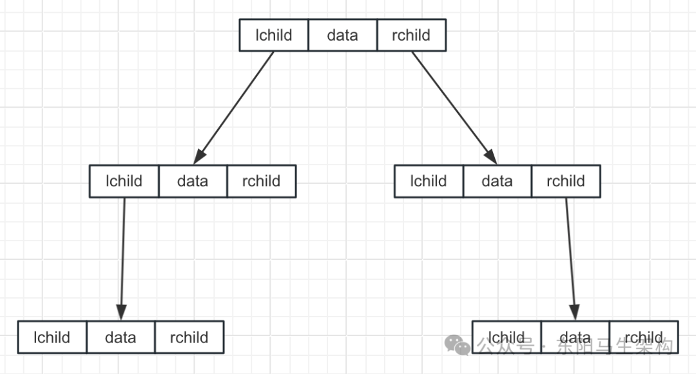

### (4)二叉树的遍历

#### 一.先序遍历

步骤1：访问根结点；

步骤2：先序遍历左子树；

步骤3：先序遍历右子树；

```cs
publicvoidpreOrder(BiTree t) {
    if (t != null) {
        visit(t);//访问根结点
        preOrder(t.getLchild());//递归遍历左子树
        preOrder(t.getRchild());//递归遍历右子树
    }
}
```

#### 二.中序遍历

步骤1：中序遍历左子树；

步骤2：访问根结点；

步骤3：中序遍历右子树；

```cs
publicvoidinOrder(BiTree t) {
    if (t != null) {
        inOrder(t.getLchild());//递归遍历左子树
        visit(t);//访问根结点
        inOrder(t.getRchild());//递归遍历右子树
    }
}
```

#### 三.后序遍历

步骤1：后序遍历左子树；

步骤2：后序遍历右子树；

步骤3：访问根结点；

```cs
publicvoidpostOrder(BiTree t) {
    if (t != null) {
        postOrder(t.getLchild());//递归遍历左子树
        postOrder(t.getRchild());//递归遍历右子树
        visit(t);//访问根结点
    }
}
```

例子如下所示：

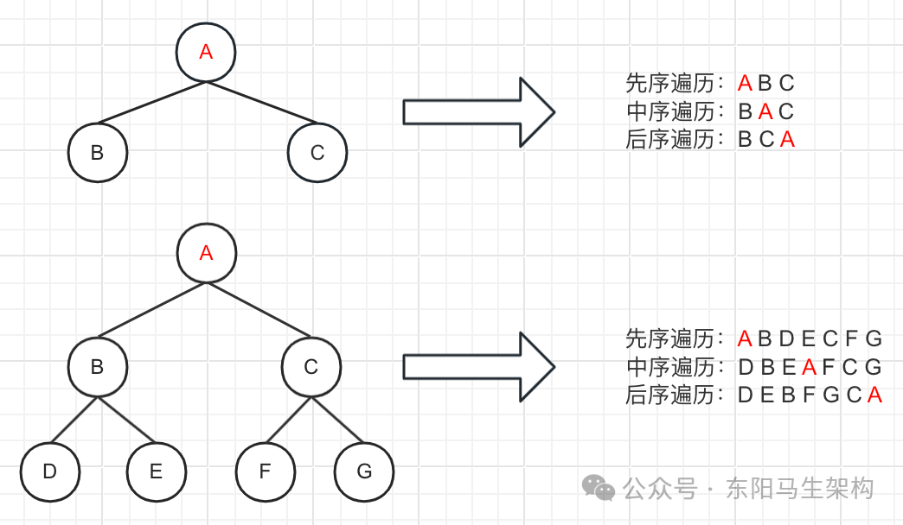

## 3.二叉查找树(二叉排序树BST)

### (1)没有索引的查询

如下数据库的一张表有两列：分别是Col1和Col2。

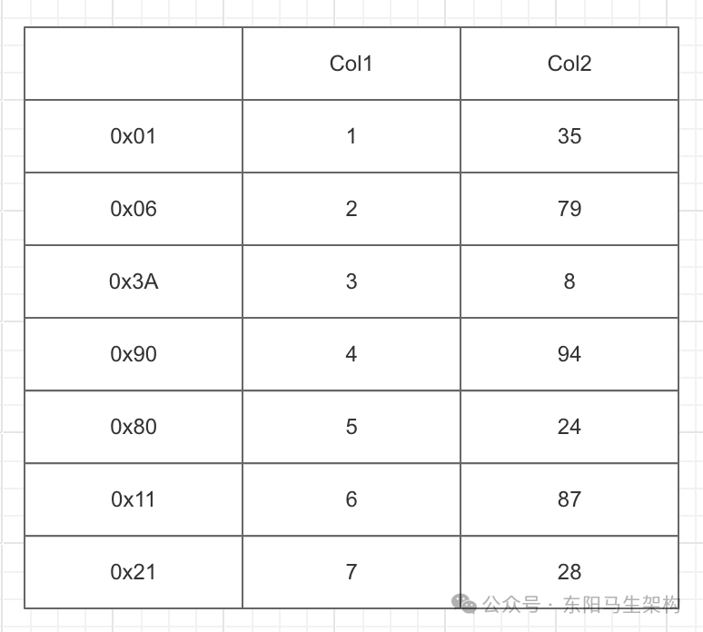

查找col2=87的这行数据，SQL语句如下：

```cs
mysql> select * from a where col2 = 87;
```

如果执行上面的查询时没有使用索引，那么会从磁盘中扫描一条一条的数据进行对比来找到结果。当数据表很大且数据又在表尾的时候，需要花费很多时间进行检索，效率比较低下。

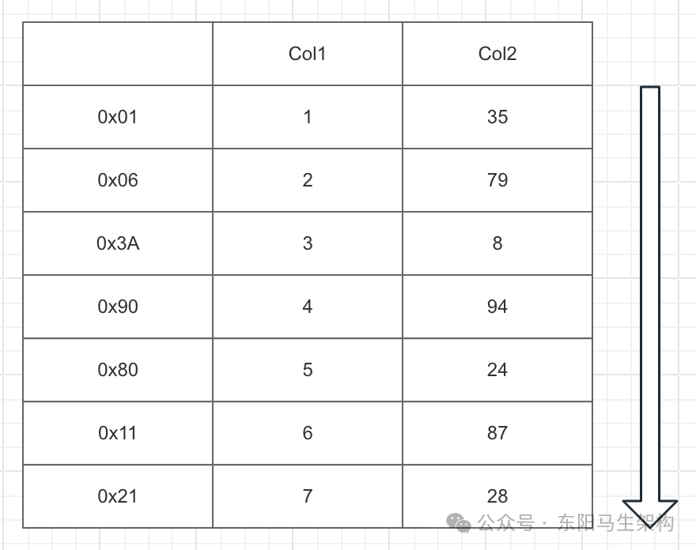

### (2)使用二叉查找树进行优化

为了加快查找，可以维护一个二叉树。

二叉树具有的性质：

左子树的键值小于根的键值，右子树的键值大于根的键值(左小右大)；

每个结点分别保存字段数据和一个指向对应数据记录物理地址的指针；

这样查找时，就可以使用二叉树查找获取相应的数据，从而快速检索出符合条件的记录。

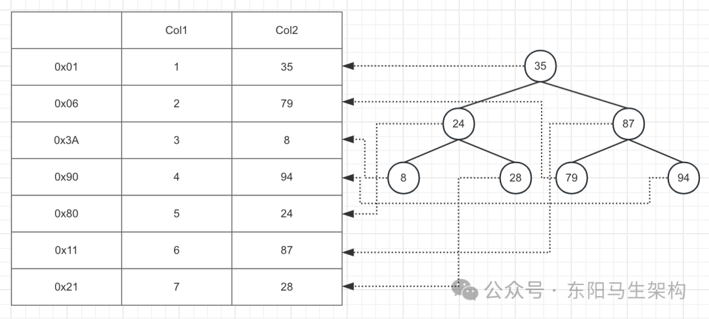

对该二叉树的结点进行查找发现：深度为1的结点的查找次数为1，深度为2的查找次数为2，深度为n的结点的查找次数为n。因此其平均查找次数为：(1+2+2+3+3+3+3) / 6 = 2.8次。

### (3)二叉查找树的定义

二叉排序树(二叉查找树)或者是一棵空树，或者是具有以下特性的二叉树：

一.若左子树非空，则左子树上所有结点的值均小于根结点的值；

二.若右子树非空，则右子树上所有结点的值均大于根结点的值；

三.左右子树也分别是一棵二叉排序树；

根据二叉查找树的定义：左子树结点值 < 根结点值 < 右子树结点值，所以对二叉查找树进行中序遍历，可以得到一个递增的有序序列。

### (4)二叉查找树的查找

二叉排序树的查找是从根结点开始，沿某个分支逐层向下比较的过程。若二叉排序树非空，先将给定值与根结点的值比较，如果相等，则查找成功。

如果查找结点值key小于根结点的值，则在根结点的左子树上查找。如果查找结点值key大于根结点的值，则在根结点的右子树上查找。

```cs
public BSTNode bstSearch(BiTree t, ElemType key) {
    while (t != null && key != t.getData()) {//若二叉查找树为空或等于根结点值，则结束循环
        if (key < t.getData()) {
            t = t.getLchild();//小于，则在左子树上查找
        } else {
            t = t.getRchild();//大于，则在右子树上查找
        }
        return T;
    }
}
```

### (5)二叉查找树的插入

二叉排序树的特点是树的结构通常不是一次生成的，而是在查找过程中，发现树中不存在结点值等于插入值的时候，再进行插入的。

插入的过程如下：

若原二叉排序树为空，则直接插入结点，否则：

若插入结点值小于根结点值，则插入到左子树；

若插入结点值大于根结点值，则插入到右子树；

插入的结点一定是一个新添加的叶结点，而且是查找失败时的查找路径上访问的最后一个结点的左孩子或右孩子。

```kotlin
public int bstInsert(BiTree t, KeyType key) {
    if (t == null) {//原二叉查找树为空，新插入的记录为根结点
        t.data = key;
        t.lchild = null;
        t.rchild = null;
        return1;//返回1，插入成功
    } elseif (key == t.getData()) {//树中存在相同值的结点，插入失败
        return0;
    } elseif (key < t.getData()) {//插入到t的左子树
        return bstInsert(t.getLchild(), key);
    } else {//插入到t的右子树
        return bstInsert(t.getRchild(), key);
    }
}
```

### (6)二叉查找树的删除

一.若删除结点没有左右子树，则直接删除；

二.若删除结点右子树为空，则用左子女填补；

三.若删除结点左子树为空，则用右子女填补；

四.若删除结点左右子树均不空，则在右子树上找中序第一个子女填补；

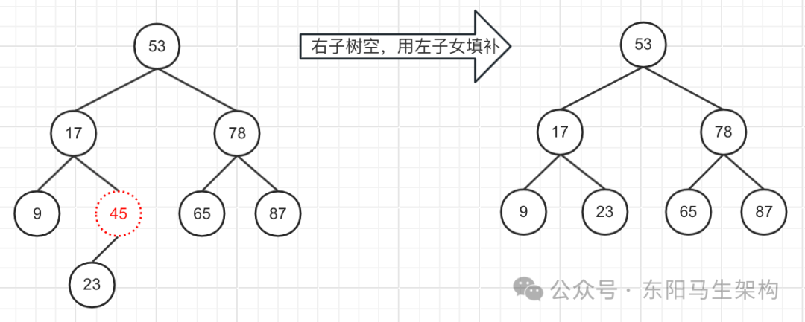

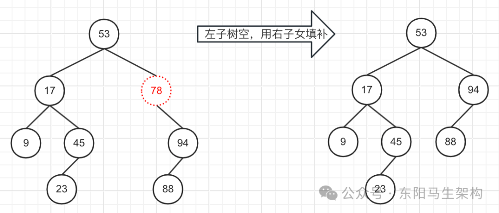

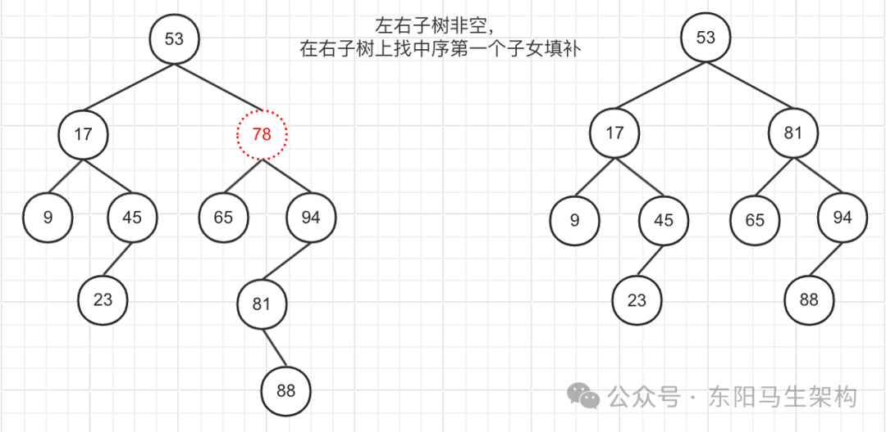

### (7)二叉查找树的缺点

MySQL索引底层使用的并不是二叉树，因为二叉树有个不平衡的缺点。在存储有序的数据时，最终的排列结构会形成一个单向链表，如下图示：树的高度过高，这时候读取某个指定结点的效率会很低。

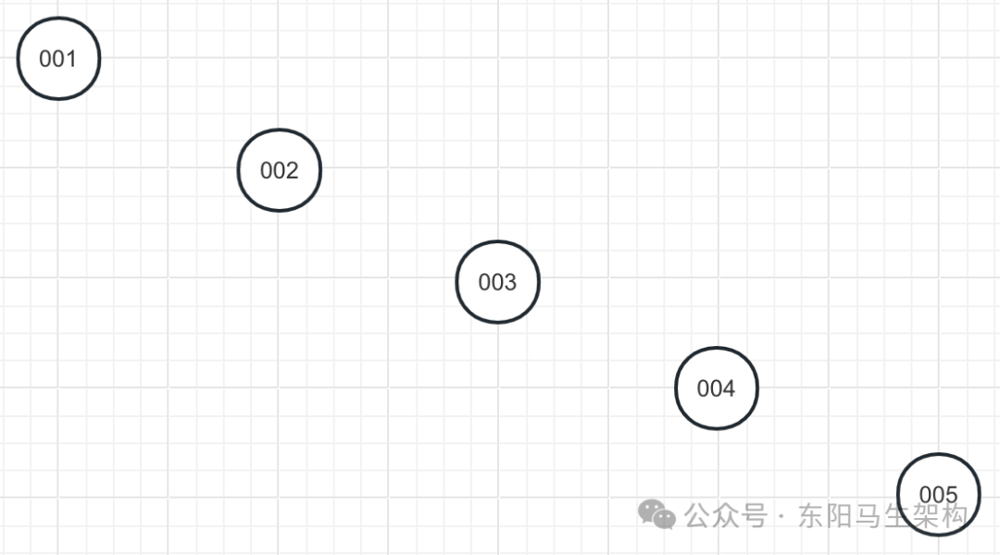

## 4.平衡二叉树(AVL树)

### (1)平衡二叉树的定义

#### 一.定义

为了避免二叉排序树的高度增长过快，降低二叉排序树的性能。规定在插入和删除二叉树结点时，要保证任意结点左右子树高度差不超1，这样的二叉排序树就称为平衡二叉树。

平衡二叉树可定义为：

或者是一棵空树，或者是具有下列性质的二叉树，它的左子树和右子树都是平衡二叉树，且左右子树的高度差绝对值不超1。

#### 二.总结

由于二叉查找树存在不平衡的问题，所以可以通过叶子结点自旋和调整，让二叉树始终保持基本平衡的状态，这样就能够保持二叉查找树的最佳性能。

AVL树就是基于以上思路的自动调整平衡的二叉树。平衡二叉树(AVL树)在符合二叉查找树的条件下，还满足任何结点的左右子树的高度差最大为1。

### (2)AVL树与非AVL树对比

左边是AVL树，它的任何结点的两个子树的高度差 <= 1。右边不是AVL树，其根结点的左子树高度为3，而右子树高度为1。

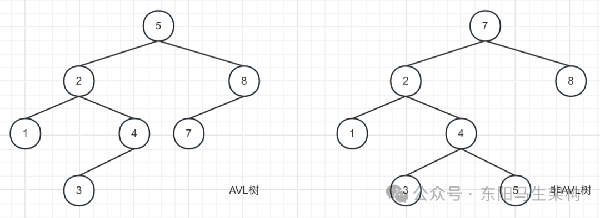

### (3)AVL树的插入

二叉排序树保证平衡的基本思想如下：

每当在二叉排序树中插入(或删除)一个结点时，首先检查其插入路径上的结点是否因为此次操作而导致了不平衡。若导致不平衡，则先找到插入路径上离插入结点最近的最小不平衡子树。再调整最小不平衡子树的各结点的位置关系，使之重新达到平衡。

AVL树失去平衡后，可以通过旋转使其恢复平衡。接下来介绍四种失去平衡的情况下对应的旋转方式。下面所说的根结点，指的是最小不平衡子树的根结点。

#### 一.LL旋转(右单旋转)—根结点的左子树高度比右子树高度高2

插入的具体情况是：在根结点的左孩子(L)的左子树(L)上插入新结点。

步骤1：原来根结点的左孩子作为新的根结点；

步骤2：原来根结点作为新根结点的右孩子；

步骤3：原来根结点的左孩子的右孩子作为新根结点的右孩子的左孩子；

注意：旋转时是按插入结点的爷结点进行右单上旋；

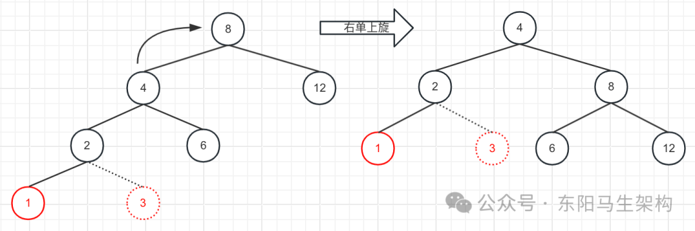

#### 二.RR旋转(左单旋转)—根结点的右子树高度比左子树高度高2

插入的具体情况是：在根结点的右孩子(R)的右子树(R)上插入新结点。

步骤1：原根结点的右孩子作为新根结点；

步骤2：原根结点作为新根结点的左孩子；

步骤3：原来根结点的右孩子的左孩子作为新根结点的左孩子的右孩子；

注意：旋转时是按插入结点的爷结点进行左单上旋；

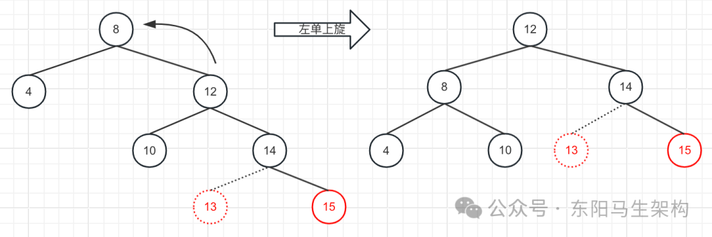

#### 三.LR旋转(先左旋后右旋)

插入的具体情况是：在根结点的左孩子(L)的右子树(R)上插入新结点。如果还是按插入结点的爷结点使用右单上旋，那么旋转后的高度差还是2。

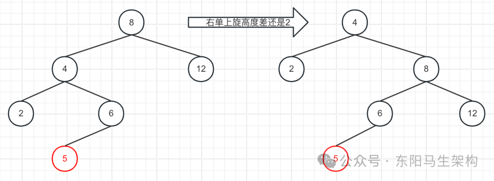

所以，这种情况需要先左旋再右旋。左旋时是按插入结点的爷结点进行左下旋，右旋时是按插入结点的爷(父)结点进行右上旋。

情况一：

在根结点的左孩子(L)的右子树(R)上插入左结点

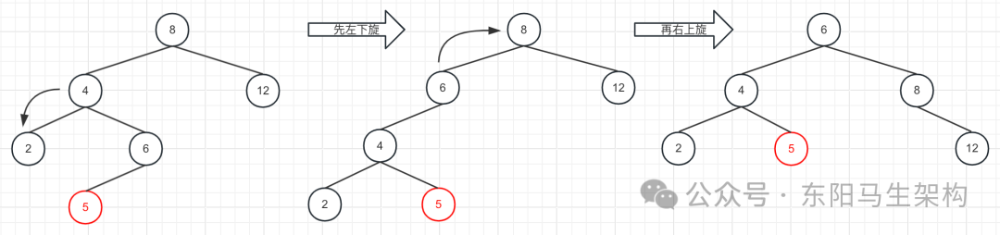

情况二：

在根结点的左孩子(L)的右子树(R)上插入右结点

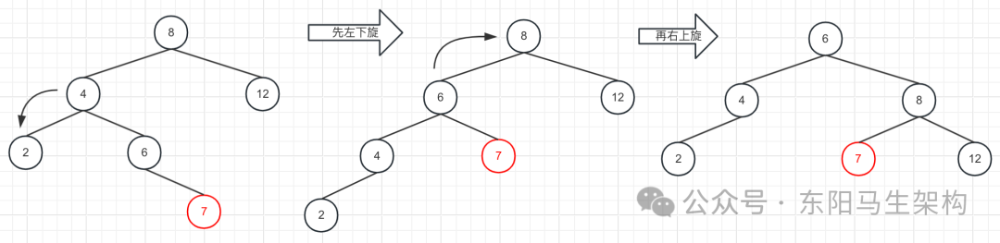

#### 四.RL旋转(先右旋后左旋)

插入的具体情况是：在根结点的右孩子(R)的左子树(L)上插入新结点。如果还是按插入结点的爷结点使用左上旋转，那么旋转后的高度差还是2。

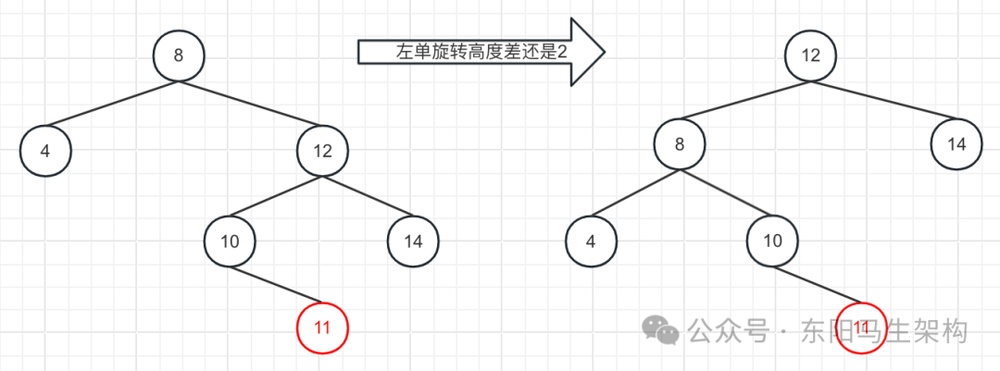

所以，这种情况需要先右旋再左旋。右旋时是按插入结点的爷结点进行右下旋，左旋时是按插入结点的爷(父)结点进行左上旋。

情况一：

在根结点的右孩子(R)的左子树(L)上插入右结点

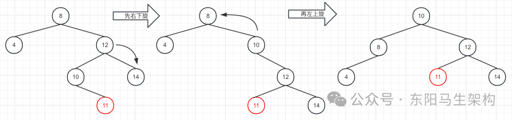

情况二：

在根结点的右孩子(R)的左子树(L)上插入左结点

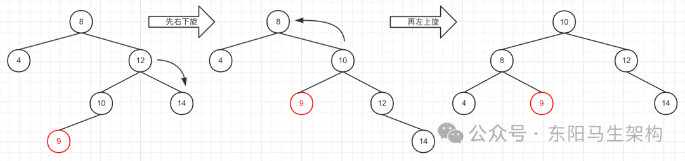

### (4)AVL树的删除

以删除结点w为例说明AVL树删除操作的步骤：

#### 一.用二叉排序树的方法对结点w执行删除操作

#### 二.从结点w开始向上回溯，找到第一个不平衡的结点z(最小不平衡子树)

最小不平衡子树的根结点为结点z，结点z的高度最高的孩子结点为y，结点y的高度最高的孩子结点为x。

#### 三.对以结点z为根结点的最小不平衡子树进行调整

其中结点x、结点y、结点z的位置情况有四种：

#### 一.y在z的左，x在y的左(LL，右单旋转)

#### 二.y在z的右，x在y的右(RR，左单旋转)

#### 三.y在z的左，x在y的右(LR，先左旋后右旋)

#### 四.y在z的右，x在y的左(RL，先右旋后左旋)

### (5)AVL树的优缺点

AVL树的优点：

一.叶子结点的层级减少；

二.形态上能够保持平衡；

三.查询效率提升，大量的顺序插入也不会导致查询性能的降低；

AVL树的缺点：

一.一个结点最多分裂出两个子结点，树的高度太高，导致IO次数过多；

二.结点里面只保存着一个关键字，每次操作获取的目标数据太少；

## 4.红黑树

### (1)红黑树的定义和性质

为了保持平衡二叉树的平衡性，插入和删除都要频繁调整结点的位置。为此在平衡二叉树的平衡标准上进一步放宽条件，引入红黑树的结构。

为了理解红黑树，对于n个结点的红黑树，会引入n+1个外部叶结点，以保证红黑树中每个结点(内部结点)的左右孩子均不为空，其中红黑树的叶结点是虚构的外部结点、是一个null结点。

一棵红黑树是满足如下性质的二叉排序树：

性质一：每个结点或是红色或是黑色

性质二：根结点是黑色

性质三：叶结点都是黑色

性质四：红结点的父结点和孩子结点都是黑色

性质五：每个结点到任一叶结点的简单路径上所含黑结点数量相同

从红黑树的某个结点出发(不含该结点)，到达一个叶结点的任一简单路径上的黑结点总数称为该结点的黑高(bh)，红黑树的根结点的黑高称为红黑树的黑高。

### (2)红黑树的推论

推论一：从根结点到叶结点的最长路径不大于最短路径的2倍；

推论二：有n个内部结点的红黑树的高度h <= 2log(n+1)；

推论三：新插入红黑树中的结点初始着色为红色；

可见，红黑树的适度平衡，由平衡二叉树的高度平衡，降低到任一结点左右子树的高度，相差不超过2倍，从而降低了动态操作时，调整结点位置的频率。

对于一棵二叉查找树，如果插入和删除比较少，查找比较多，可用AVL树。如果插入和删除比较多，那么使用红黑树会更加合适。但由于维护平衡二叉树的高度平衡所付出的代价比收益大，一般用红黑树。

假设新插入的结点初始着色为黑色，那么这个结点所在的路径就会比其他路径多出一个黑结点，这样就破坏了性质五，而且调整起来也比较麻烦。

如果新插入的结点初始着色为红色，此时所有路径上的黑结点数量不变，仅出现连续两个红结点才需要调整，这样调整起来就比较简单了。

### (3)红黑树的插入

用二叉查找树的插入法插入结点z，并着色为红色。

若插入结点z的父结点是黑色，则无须做任何调整，此时就是一棵标准红黑树；

若插入结点z的父结点是根结点，则将结点z着色为黑色(树的黑高增加1)；

若插入结点z不是根结点 \+ 插入结点z的父结点是红色，则分如下三种情况处理：

情况一：插入结点z的叔结点y是黑色的，且插入结点z是一个左孩子

A.如果结点z是爷结点的左孩子(L)的左孩子(L)

首先对结点z的父结点做一次右上旋转(LL，右单旋转)，然后交换结点z的原父结点和原爷结点的颜色。这样就可以保持性质五，也不会改变红黑树的黑高，且红黑树也不会再有连续的两个红结点。

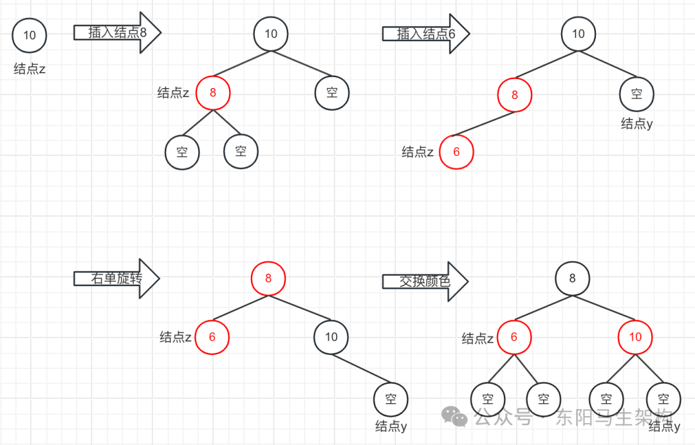

B.如果结点z是爷结点的右孩子(R)的左孩子(L)

首先对结点z的父结点做一次右下旋转，这样就会转变为情况二B。然后再对结点z的新父结点做一次左下旋转(RL，先右旋再左旋)，最后交换结点z和右旋后结点z的父结点的颜色。

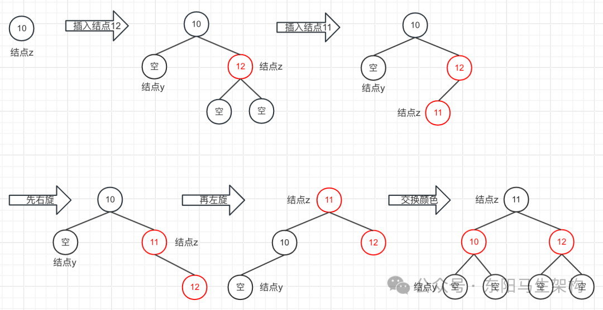

情况二：插入结点z的叔结点y是黑色的，且插入结点z是一个右孩子

A.如果结点z是爷结点的左孩子(L)的右孩子(R)

首先对结点z的父结点做一次左下旋转，这样就会转变为情况一A。然后再对结点z的新父结点做一次右下旋转(LR，先左旋再右旋)，最后交换结点z和左旋后结点z的父结点的颜色。

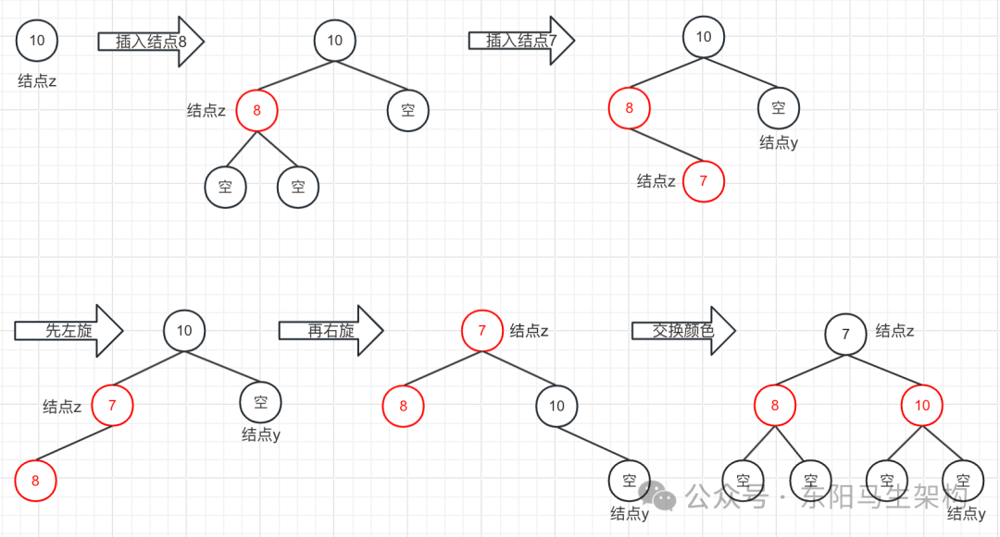

B.如果结点z是爷结点的右孩子(R)的右孩子(R)

首先对结点z的父结点做一次左上旋转(RR，左单旋转)，然后交换结点z的原父结点和原爷结点的颜色。这样就可以保持性质五，也不会改变红黑树的黑高，且红黑树也不会再有连续的两个红结点。

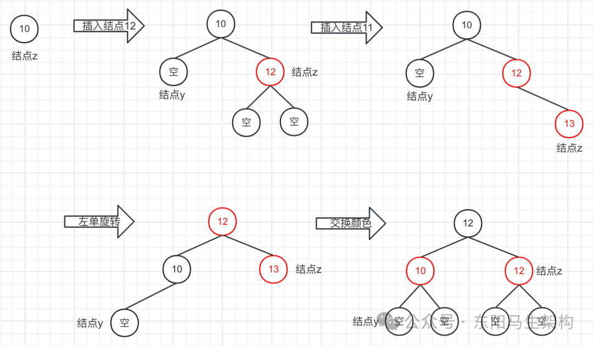

情况三：插入结点z的叔结点y是红色(插入结点z是左孩子还是右孩子不影响)

此时，结点z的父结点和叔结点y都是红色，结点z的爷结点是黑色。所以将结点z的父结点和叔结点y着为黑色，将结点z的爷结点着为红色。如果爷结点是根结点，那么继续着为黑色，这样也能保持性质五。

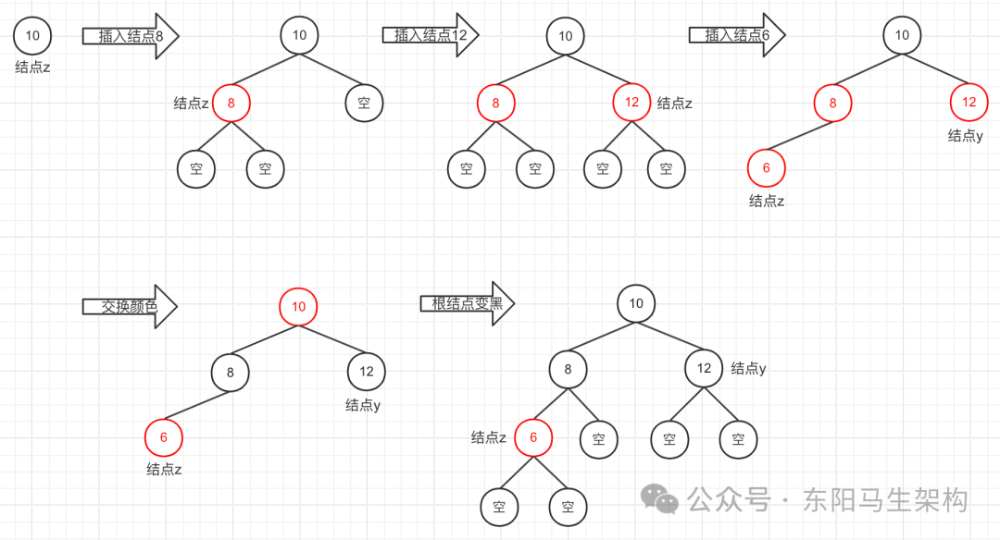

插入结点的情况总结：

#### 一.插入结点为根结点

直接将插入的结点变成黑色。

#### 二.父结点为黑色结点

此时不需要任何操作。

#### 三.父结点为红色，叔结点为红色

将叔结点和父结点改为黑色，爷结点改为红色。然后又将爷结点当作插入结点看待，一直进行上面操作。直到当前结点为根结点，然后将根结点变成黑色。

#### 四.父结点为红色，叔结点为黑色

情况一：父结点为左，插入结点为左 || 父结点为右，插入结点为右

将父结点和爷结点的颜色互换，然后对爷结点进行一次右旋(左旋)。

情况二：父结点为左，插入结点为右 || 父结点为右，插入结点为左

首先对父结点进行左旋(右旋)，左旋(右旋)后的情况必定是情况一，于是便可以按照情况一来进行处理。

### (4)红黑树的删除

#### 一.删除结点的过程原理

首先按二叉查找树的删除方法进行删除。

假设删除结点有两个孩子：

那么根据二叉查找树的删除结点的方法，要找删除结点的中序后继填补，也就是需要找删除结点的右子树中最小的结点和删除结点进行位置交换，然后删除交换位置后，在原来中序后继结点位置的删除结点。由于原来的中序后继结点(因为是最小的)最多只有一个孩子，于是就将删除结点有两孩子转换为没有孩子或者只有一个孩子的情况了。

假设删除结点只有一个孩子：

由于删除结点还有一个空的黑色叶结点，其唯一孩子结点也会有一个空的黑色叶结点，所以其唯一孩子结点必然是红色。于是按照二叉查找树的删除方法，用红色的孩子结点替换删除结点即可。

假设删除结点没有孩子：

如果删除结点是红色，可以直接删除，无须调整；如果删除结点是黑色，那么有4种不同的情况；

#### 二.删除结点没有孩子且是黑色的4种情况

假设删除结点为y，经过二叉查找树的删除方法删除结点之后，会使用结点x来替换结点y(如果y是叶结点，那么x是黑色的空叶结点)。删除y结点后将导致先前包含结点y的任何路径上的黑结点数量减1，因此结点y的任何祖先都不再满足红黑树的性质五。

修正办法就是将替换y的结点x视为还有额外一重黑色，定义为双黑结点。也就是说，如果将任何包含结点x的路径上的黑结点数量加1。在此假设下，性质五得到了满足，但多出了一个双黑结点，破坏了性质一。于是，删除操作便可以转化为将双黑结点恢复为普通结点的操作。

情况一：x的兄弟结点w是红色的

由于结点w是红色，所以结点w的父结点和孩子结点必然是黑色的。于是交换结点w和结点x的父结点x.p的颜色，然后对x.p做一次左旋，这次左旋不会破坏红黑树的任何规则。

如下图示，x的新兄弟结点是旋转之前w的某个孩子结点，其颜色为黑色。这样就将情况一转换为情况二、情况三或情况四了。


关于上图的补充说明：

假设从结点A出发到叶结点的普通路径有n个黑色结点(包含出发结点)，那么从黑色结点B出发到叶结点的普通路径就应该有n + 2个黑色结点，从红色结点D出发到叶结点的普通路径就应该有n + 1个黑色结点，从黑色结点C出发到叶结点的普通路径就应该有n + 1个黑色结点，从黑色结点E出发到叶结点的普通路径就应该有n + 1个黑色结点。

情况二：x的兄弟结点w是黑色的，w的右孩子是红色，w的左孩子可红可黑

由于x的兄弟结点w的右孩子是红色，即红结点是其爷结点的右孩子的右孩子。所以交换x的兄弟结点w和x的父结点x.p的颜色，然后把w的右孩子着为黑色，并对x的父结点x.p做一次左旋，最后就可以将x恢复为普通的黑色结点。此时红黑树的性质不会再收到破坏了，其中x的父结点x.p是黑还是红不影响。

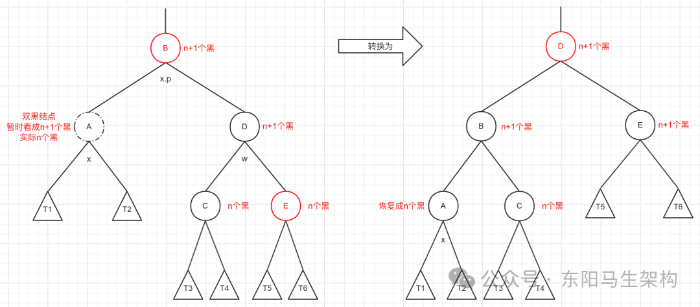

情况三：x的兄弟结点w是黑色的，w的右孩子是黑色，w的左孩子是红色

由于x的兄弟结点w的左孩子是红色，即红结点是其爷结点的右孩子的左孩子，所以交换x的兄弟结点w和其左孩子的颜色，然后对x的兄弟结点w做一次右旋。这样情况三就转换为情况二了，此时x的父结点x.p是黑还是红不影响。


情况四：x的兄弟结点w是黑色的，w的右孩子是黑色，w的左孩子也是黑色

因为w也是黑色的，所以可以将x和其兄弟结点w上去掉一重黑色，从而使得x只有一重黑色，而其兄弟结点w则变成红色。

为了补偿从x和w中去掉的一重黑色，可以把x的父结点x.p额外着一层黑色，从而保持局部的黑高不变。

如果x.p是红色，此时将x.p着为黑色即可；

如果x.p是黑色，则将x.p作为新结点x(x上升一层)来继续循环处理；


总结：

情况一：x的兄弟结点w是红色的

情况二：x的兄弟结点w是黑色的，w的右孩子是红色，w的左孩子可红可黑

情况三：x的兄弟结点w是黑色的，w的右孩子是黑色，w的左孩子是红色

情况四：x的兄弟结点w是黑色的，w的右孩子是黑色，w的左孩子也是黑色

## 5.B-Tree

因为AVL树存在的缺陷，MySQL并没有把它作为索引存储的数据结构，如何通过降低树的高度减少磁盘IO是数据库提升性能的关键。如果每个结点多存储一些数据，每次磁盘IO就能多加载一些数据到内存，B-Tree就是基于这样的思想设计的。

### (1)B-Tree介绍

B-Tree是一种平衡的多路查找树，B树允许一个结点存放多个数据。这样在尽可能减少树的深度的同时，存放更多的数据，也就是把瘦高的树变得矮胖。

B-Tree中所有结点的子树个数的最大值称为B-Tree的阶，用m表示。一棵m阶的B树，如果不为空，就必须满足以下条件。

m阶的B-Tree要满足以下条件：

#### 一.每个结点最多拥有m个子树

#### 二.每个结点最多拥有m-1个数据

#### 三.根结点至少有两个子树

#### 四.分支结点至少有(m/2)棵子树，防止变成二叉树

#### 五.所有叶子结点都在同一层，并且以升序排序

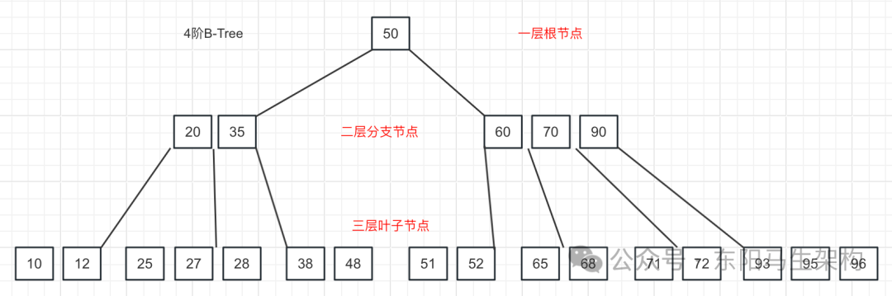

什么是B-Tree的阶？

所有结点中，结点[60, 70, 90]拥有的子结点数目最多。由于结点[60, 70, 90]拥有四个子结点(灰色结点)，所以上面的B-Tree为4阶B树。

### (2)B-Tree结构存储索引的特点

为了描述B-Tree首先定义一条记录为一个键值对[key, data]，key为记录的键值，对应表中的主键值(聚簇索引)，data为一行记录中除主键外的数据。对于不同的记录，key值互不相同。

B-Tree结构存储索引的特点如下：

#### 一.索引值和data数据分布在整棵树的各个结点中

#### 二.白色块部分是指针，存储着子结点的地址信息

#### 三.每个结点可以存放多个索引值及对应的data数据

#### 四.树结点中的多个索引值从左到右升序排列

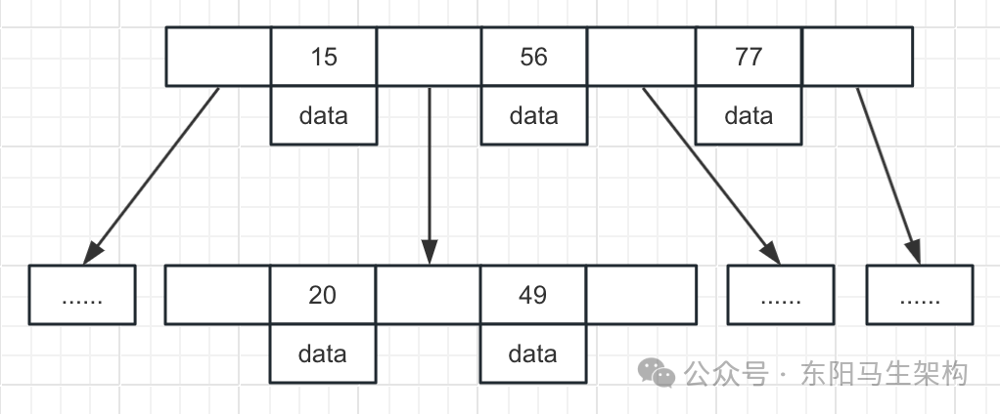

### (3)B-Tree的查找操作

B-Tree的每个结点的元素可以视为一次IO读取，树的高度表示最多的IO次数。

在相同数量的总元素个数下：每个结点的元素个数越多，高度越低，查询所需的IO次数越少。

B-Tree的查找可以分为3步：

步骤1：首先要查找结点

因为B-Tree通常是在磁盘上存储的，所以这步需要进行磁盘IO操作。

步骤2：然后查找关键字

当找到某个结点后将该结点读入内存，然后通过顺序或折半查找来查找关键字，如果命中就结束查找。

步骤3：若没有找到关键字，则需要判断大小来找到合适的分支继续查找。如果已经找到了叶子结点，就结束查询。

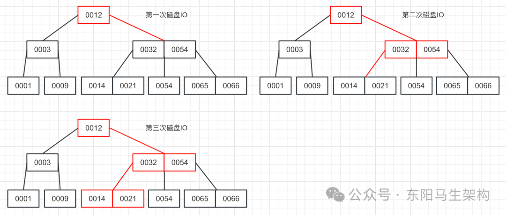

下面是在一个3阶B-Tree中查找元素21的过程：

```makefile
演示地址: https://www.cs.usfca.edu/~galles/visualization/BTree.html
插入顺序: 32 3 12 54 1 9 14 21 54 65 66
```

### (4)B-Tree总结

优点：B树可以在内部结点存储键值和相关记录数据，把频繁访问的数据放在靠近根结点位置，可提高热点数据的查询效率。

缺点：B树中每个结点不仅包含数据的key值，还有data数据。所以当data数据较大时，会导致每个结点存储的key值减少，并且导致B树的层数变高，增加查询时的IO次数。

使用场景：B树主要应用于文件系统以及部分数据库索引，如MongoDB。大部分关系型数据库索引则是使用B+树实现。

## 6.B+Tree

B+Tree是在B-Tree基础上的一种优化，使其更适合实现存储索引结构。InnoDB存储引擎就是用B+Tree实现其索引结构。

### (1)B+Tree的特征

特征一：非叶子结点只存储键值信息

特征二：所有叶子结点之间都有一个链指针

特征三：数据记录都存放在叶子结点中

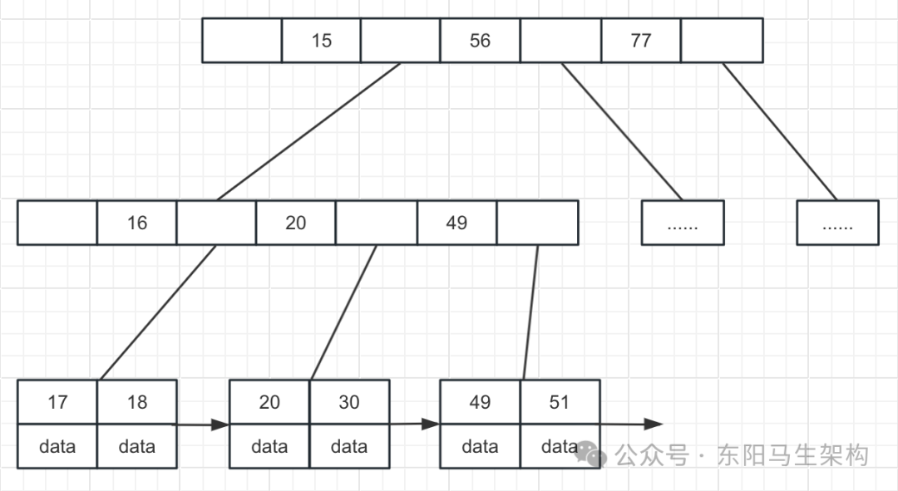

### (2)B+Tree的优点

优点一：B+Tree降低树高和增大结点存储数据量

B+Tree是B-Tree的变种，B-Tree能解决的问题，B+Tree也能够解决。

优点二：B+Tree扫库和扫表能力更强

对B-Tree的数据表的所有数据进行扫描，需要遍历整棵树。对B+Tree的数据表的所有数据进行扫描，只需遍历所有叶子结点。因为B+Tree的叶子结点才存放完整的数据，以及之间有指针进行链接。

优点三：B+Tree磁盘读写能力更强，因根结点和分支结点不保存数据

如果所有根结点和分支结点同样大小，B+Tree保存的key要比B-Tree多。所以B+Tree读写一次磁盘加载的关键字key要比B-Tree更多。

优点四：B+Tree排序能力更强

B+Tree天然具有排序功能。

优点五：B+Tree查询效率更加稳定，每次查询数据的IO次数相对稳定

当然如果直接看B-Tree可以根据根结点命中而直接返回，则效率更高。

### (3)一棵B+Tree可以存放多少数据

#### 一.B+树是如何存放的

B+Tree的结点的大小等于一个数据页的大小(16K)。B+Tree的根结点保存在内存中，子结点才存储在磁盘上。

设计一个结点等于一个页的目的是每个结点只需一次IO就可完全载入。InnoDB的一个数据页的大小是16K，所以每个结点的大小也是16K。

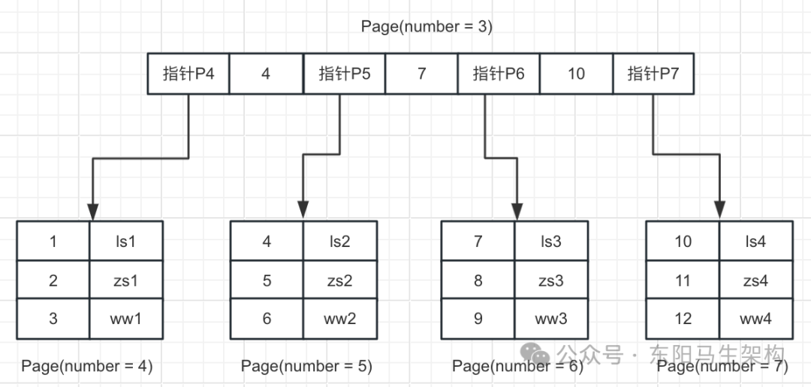

假设一个B+树高为2，即存在一个根结点和若干个叶子结点。那么这棵B+树的存放总记录数为：根结点指针数 * 单个叶子结点记录行数。

#### 二.计算根结点指针数

假设表的主键为int类型占用4字节，指针大小为6字节。那么一个页即B+Tree中的一个结点，大概可以存储的指针数量为：16384B / (4B + 6B) = 1638，一个结点最多可存储1638个索引指针。

#### 三.计算每个叶子结点的记录数

假设一行记录的数据大小为1K，那么一个叶子结点就可以存储16行数据：16K / 1K = 16。

#### 四.一棵高度为2的B+Tree可以存放多少记录数

一棵高度为2的B+Tree可以存放：1638 * 16 = 2.6万条数据记录，同理一棵高度为3的B+Tree可存放：1638 * 1638 * 16 = 4千万条记录。所以一个高度为3的B+Tree就可以满足千万级别的数据存储。

InnoDB中的B+Tree的高度一般就是1～3层，由于查找一次数据页代表一次IO，所以通过主键索引查询通常只需要1～3次IO即可查到数据。

## 7.Hash索引

### (1)Hash索引

MySQL中索引的数据结构有两种：一种是B+Tree，另一种是Hash。Hash底层是由Hash表来实现的，根据键值存储数据，非常适合根据key查找value值，也就是单个key查询，或者等值查询。

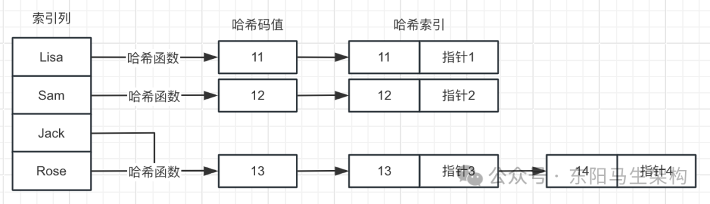

对于每一行数据，存储引擎都会对所有的索引列计算一个哈希码。哈希码是一个较小的值，如果出现哈希码值相同的情况会拉出一条链表。

### (2)Hsah索引的优点

一.因为索引自身只需要存储对应的Hash值，所以索引结构非常紧凑。只做等值查询而不包含排序或范围查询的需求，都适合使用哈希索引。

二.没有哈希冲突的情况下，等值查询访问哈希索引的数据非常快。如果发生Hash冲突，必须遍历链表中的所有行指针，逐行进行比较。

### (3)Hash索引的缺点

缺点一：哈希索引只包含哈希值和行指针，不存储字段值，所以不能使用索引中的值来避免读取行。

缺点二：哈希索引只支持等值比较查询，不支持任何范围查询和部分索引列匹配查找。

缺点三：哈希索引数据并不是按照索引值顺序存储的，所以也就无法用于排序。

缺点四：如果发生哈希冲突，存储引擎就必须遍历链表，来逐行比较。

## 8.聚簇索引与非聚簇索引

假设有一个表中的记录如下，表中id是聚集索引，name是普通索引；

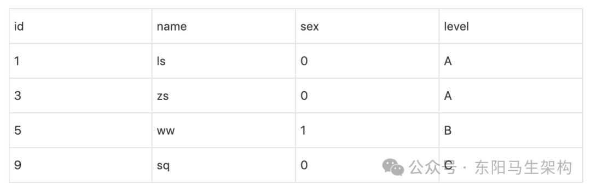

### (1)聚簇索引(主键索引)

聚簇索引将数据存储与索引放到了一块，索引结构的叶子结点保存了行数据。

聚簇索引是一种数据存储方式，InnoDB的聚簇索引就是按照主键顺序构建B+Tree结构。

B+Tree的叶子结点就是行记录，行记录和主键值紧凑地存储在一起，这也意味着InnoDB的主键索引就是数据表本身。主键索引按主键顺序存放了整张表的数据，占用的空间是整个表的大小，通常说的主键索引就是聚簇索引。

InnoDB的表要求必须要有聚簇索引：

#### 一.如果表定义了主键，则主键索引就是聚簇索引

#### 二.如果表没有定义主键，则第一个非空的唯一列作为聚簇索引

#### 三.如果表没有定义主键 + 也没有非空的唯一列，则会创建一个隐藏的row-id作为聚簇索引

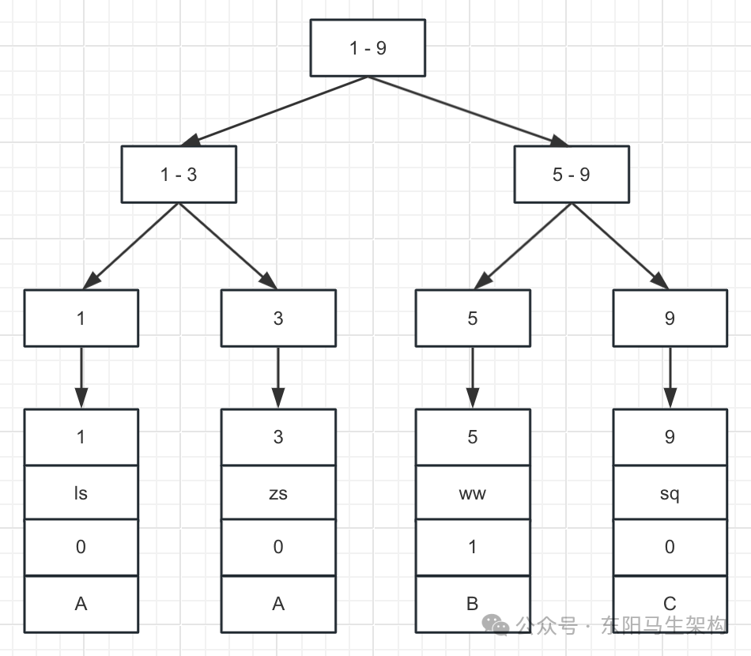

### (2)非聚簇索引(非主键索引或二级索引)

非聚簇索引将数据与索引分开存储，索引结构的叶子结点只保存索引列和主键信息。

InnoDB的二级索引，是根据索引列构建B+Tree结构，但在B+Tree的叶子结点中只存储索引列和主键的信息，所以二级索引占用的空间会比聚簇索引小很多。通常创建二级索引就是为了提升查询效率，一个表InnoDB只能创建一个聚簇索引，但可以创建多个二级索引。

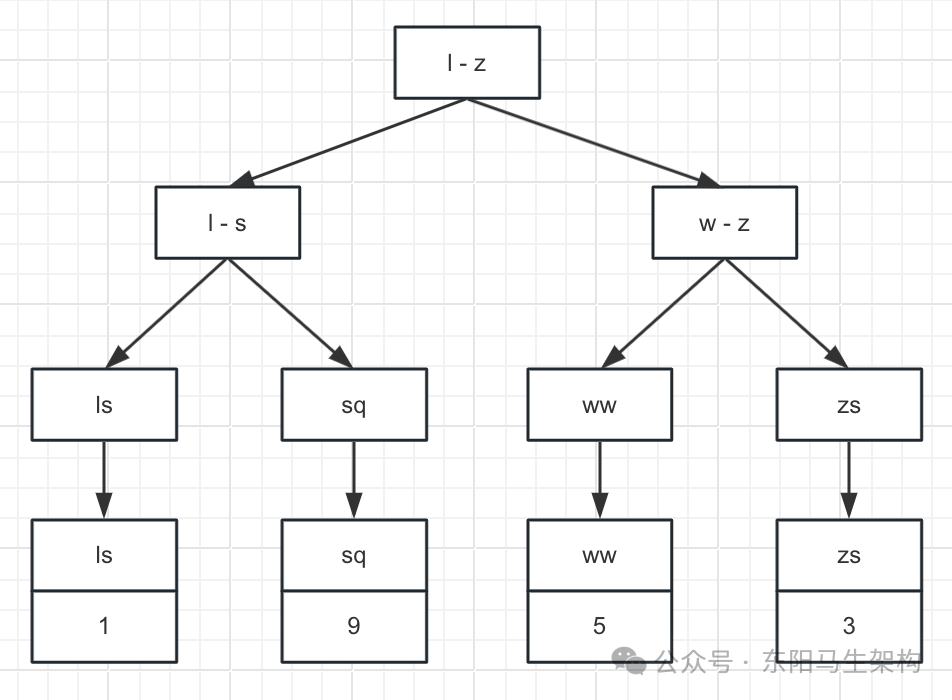

### (3)使用聚簇索引时要注意的问题

#### 一.主键最好不要使用UUID

因为UUID的值太过离散，不适合排序且可能新增的UUID会插入在索引树中间的位置，导致索引树调整复杂度变大，消耗更多的时间和资源。

#### 二.建议使用int类型的自增

方便排序且会在索引树的末尾增加主键值，对索引树的结构影响最小。主键值占用的存储空间越大，二级索引中保存的主键值也会跟着变大，占用的存储空间会影响到IO操作读取到的数据量。

### (4)使用非聚簇索引要注意的问题

#### 一.什么是回表

下面来执行这样一条SQL语句：

```shell
mysql>  select * from A where name = 'ls';
```

在通过name进行查询时，需要扫描两遍索引树：

#### 一.先通过非聚簇索引定位到主键值 = 1

#### 二.根据主键值在聚簇索引中定位到具体记录

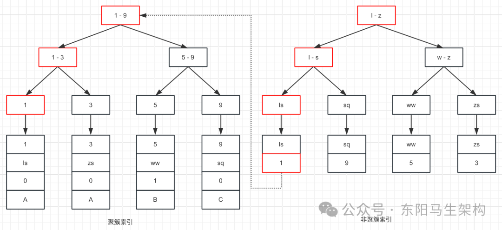

回表总结：先根据普通索引查询主键值，再根据主键值在聚集索引中获取行记录。回表查询，相对于只扫描一遍聚集索引树的性能要低一些。

#### 二.使用覆盖索引来避免回表

什么是覆盖索引：

如果一个索引包含了所有需要查询的字段值，那么该索引就是覆盖索引。覆盖索引是一种避免回表查询的优化策略，只需在一棵索引树上就能获取所需的所有列数据，无需回表，速度更快。

覆盖索引的实现方式：

对被查询的字段建立普通索引或联合索引，查询时直接返回索引数据。不需要再通过聚集索引去定位行记录，避免了回表。

#### 二.锁机制的原理整理

## 1.锁概述

## 2.锁分类

## 3.锁实战之全局锁

## 4.锁实战之表级锁(偏读)

## 5.锁实战之行级锁(偏写)—行级锁升级表级锁

## 6.锁实战之行级锁(偏写)—间隙锁

## 7.锁实战之行级锁(偏写)—临键锁

## 8.锁实战之行级锁(偏写)—幻读演示和解决

## 9.锁实战之行级锁(偏写)—优化建议

## 10.锁实战之乐观锁

## 11.行锁原理

## 12.死锁与解决方案

## 1.锁概述

undo log版本链 \+ Read View机制实现的MVCC多版本并发控制，可以防止事务并发读写同一数据时出现的脏读+不可重复读+幻读问题。但除脏读+不可重复读+幻读问题外，并发读写同一数据还有脏写问题。就是当多个事务并发更新同一条数据时，此时就可能会出现脏写问题，比如：

一.事务A对数据进行操作，将值修改为A。

二.事务B也对该数据进行操作，将值修改为B。

三.接着事务A进行了回滚，将值恢复成NULL。

四.事务B发现数据值B没有了，出现数据不一致。

脏写：一个事务修改了另一个没提交的事务修改过的值，导致数据可能不一致。因为这个没提交的事务有可能会回滚。

## 2.锁分类

### (1)从操作的粒度可分为表级锁、行级锁和页级锁

#### 一.表级锁：每次操作锁住整张表

锁定粒度最大，发生锁冲突概率最高，并发度最低，应用在MyISAM、InnoDB、BDB存储引擎中。

#### 二.行级锁：每次操作锁住一行数据

锁定粒度最小，发生锁冲突的概率最低，并发度最高，应用在InnoDB存储引擎中。

#### 三.页级锁：每次锁定相邻的一组记录

锁定粒度界于表锁和行锁间，开销和加锁时间界于表锁和行锁间。并发度一般，应用在BDB存储引擎中。

### (2)从操作的类型可分为读锁和写锁

#### 一.读锁(S锁)：共享锁，行级锁

针对同一份数据，多个读操作可以同时进行而不会互相影响。事务A对记录添加了S锁，可以对记录进行读操作，不能做修改。其他事务可以对该记录追加S锁，但不能追加X锁。要追加X锁，要等记录的S锁全部释放。

#### 二.写锁(X锁)：排它锁，行级锁

当前写操作没有完成前，它会阻断其他事务的写锁和读锁请求。事务A对记录添加了X锁，可以对记录进行读和修改，其他事务不能对记录进行读和修改。

#### 三.IS锁：意向共享锁，表级锁

已加S锁的表肯定会有IS锁，反过来，有IS锁的表不一定会有S锁。

#### 四.IX锁：意向排它锁，表级锁

已加X锁的表肯定会有IX锁，反过来，有IX锁的表不一定会有X锁。

### (3)从操作的性能可分为乐观锁和悲观锁

#### 一.乐观锁

一般的实现方式是对记录数据版本进行对比。在数据库表中有一个version字段，根据该字段进行冲突检测。如果有冲突就提示错误信息，所以乐观锁属于代码层面的锁控制。

#### 二.悲观锁

修改一条数据时，为避免被其他事务同时修改，在修改前先锁定。共享锁和排它锁都是悲观锁的不同实现，属于数据库提供的锁机制。

根据加锁的范围，MySQL的锁可以分为：全局锁、表级锁和行级锁三类。

## 3.锁实战之全局锁

### (1)什么是全局锁

全局锁是对整个数据库实例加锁，添加全局锁后，以下语句会被阻塞：

#### 一.数据更新语句(增删改)

#### 二.数据定义语句(建表、修改表结构等)

#### 三.更新类事务的提交语句

全局锁命令(FTWRL)：

```shell
mysql> flush tables with read lock;
```

### (2)全局锁使用场景

全局锁的典型使用场景是：全库逻辑备份(mysqldump)。通过全局锁保证不会有其他线程对数据库进行更新，然后对整个库备份，在备份过程中整个库完全处于只读状态。

值得注意的是，当使用MySQL的逻辑备份工具mysqldump进行备份时：

#### 一.添加--single-transaction参数时可正常更新

可以在导数据之前就启动一个事务，来确保拿到一致性快照视图。由于MVCC的支持，这个过程中数据是可以正常更新的。

#### 二.--single-transaction参数只适用于所有表都使用InnoDB引擎的情况

如果有表没有使用事务引擎，那么备份就需要使用FTWRL命令。

### (3)数据库全局锁的两种方法

```shell
-- 方式一
mysql> flush tables with read lock;

-- 方式二(不建议)：
mysql>set global readonly = true;
```

执行FTWRL命令后由于客户端发生异常断开，那么MySQL会自动释放这个全局锁，整个库回到可以正常更新的状态。

将整个库设置为readonly后，如果客户端发生异常，那么数据库就会一直保持readonly状态，导致整个库长时间不可写。

## 4.锁实战之表级锁(偏读)

表级锁是MySQL中锁定粒度最大的锁，表示对当前操作的整张表加锁。它实现简单，资源消耗较少，被大部分MySQL引擎支持，最常使用的MyISAM与InnoDB都支持表级锁定。

表级锁的特点：开销小，加锁快，出现死锁的概率比较低。锁定的粒度比较大，发生锁冲突的概率比较高，并发度比较低。MyISAM引擎默认使用表级锁。

表级锁的分类：表共享读锁与表独占写锁。

### (1)数据准备

```sql
-- 创建表选择MyISAM存储引擎
createtable mylock01(
    idint primary key auto_increment,
    title varchar(20)
) engine myisam;

createtable mylock02(
    idint primary key auto_increment,
    title varchar(20)
) engine myisam;

insertinto mylock01(title) values('a1'),('b1'),('c1'),('d1'),('e1');
insertinto mylock02(title) values('a2'),('b2'),('c2'),('d2'),('e2');
```

### (2)加锁语法

#### 一.查询表中加过的锁

```ruby
-- 0表示没有加锁，当前的所有数据库表都没有加锁
mysql> show open tables;
+----------+----------+--------+-------------+
| Database | Table    | In_use | Name_locked |
+----------+----------+--------+-------------+
| test     | mylock02 |      0|           0 |
| test     | test1    |      0 |           0|
| test     | mylock01 |      0|           0 |
+----------+----------+--------+-------------+

-- 查询加锁的表，条件In_use大于0
mysql> show open tables where In_use > 0;
Empty set (0.00 sec)
```

#### 二.手动加表锁

语法格式：LOCK TABLE 表名 READ(WRITE), 表名2 READ(WRITE) ...;

```ruby
-- 为mylock01加读锁(共享锁)，给mylock02加写锁(排它锁)
mysql> lock table mylock01 read, mylock02 write;
Query OK, 0 rows affected (0.00 sec)

mysql> show open tables where In_use > 0;
+-----------+----------+--------+-------------+
| Database  | Table    | In_use | Name_locked |
+-----------+----------+--------+-------------+
| test_lock | mylock01 |      1|           0 |
| test_lock | mylock02 |      1 |           0|
+-----------+----------+--------+-------------+
```

#### 三.释放锁，解除锁定

```shell
mysql> unlock tables;
mysql> show open tables where In_use > 0;
Empty set (0.00 sec)
```

### (3)加读锁测试

开启session1和session2两个会话窗口：

#### 一.在session1中对mylock01表加读锁

```shell
mysql> lock table mylock01 read;
```

#### 二.对mylock01进行读操作，两个窗口都可以读

```cs
mysql> select * from mylock01;
```

#### 三.在session1进行写操作失败

```bash
mysql> update mylock set title='a123'where id=1;
ERROR 1100 (HY000): Table 'mylock' was not locked with LOCK TABLES
```

#### 四.在session1中读取其他表不允许，比如读取mylock02表，读取失败，不能读取未锁定的表

```python
mysql> select * from mylock02;
ERROR 1100 (HY000): Table 'mylock02' was not locked with LOCK TABLES
```

#### 五.在session2中对mylock01表进行写操，执行后一直阻塞

```shell
mysql> update mylock01 set title='a123'where id = 1;
```

#### 六.session1解除mylock01的锁定，session2的修改执行成功

```shell
mysql> unlock tables;
mysql> update mylock01 set title='a123'where id = 1;
Query OK, 1 row affected (47.83 sec)
```

结论：对MyISAM表的读写操作加读锁，不会阻塞其他进程对同一表的读请求。但会阻塞其他进程对同一表的写请求，只有当读锁释放后才执行写操作。

### (4)加写锁测试

#### 一.在session1中对mylock01表加写

```shell
mysql> lock table mylock01 write;
```

#### 二.在session1中，对mylock01进行读写操作，都是可以进行的

```shell
mysql> select * from mylock01 where id = 1;
mysql> update mylock01 set title = 'a123'where id = 1;
```

#### 三.在session1中读其他表还是不允许

```cs
mysql> select * from mylock02 where id = 1;
ERROR 1100 (HY000): Table 'mylock02' was not locked with LOCK TABLES
```

#### 四.在session2中读mylock01表，读操作被阻塞

```cs
mysql> select * from mylock01;
```

#### 五.在session2中对mylock01表进行写操作，仍然被阻塞

```shell
mysql> update mylock01 set title = 'a456'where id = 1;
```

#### 六.session1释放锁，session2操作执行成功

```shell
mysql> unlock tables;
```

结论：对MyISAM表加写锁，会阻塞其他进程对同一表的读和写操作。只有当写锁释放后，才会执行其他进程的读和写操作。

## 5.锁实战之行级锁(偏写)—行级锁升级表级锁

### (1)行级锁介绍

行锁是MySQL锁中粒度最小的一种锁。因为锁的粒度很小，所以发生资源争抢概率最小，并发性能最大。但会造成死锁，每次加锁和释放锁的开销也比较大。

#### 一.使用MySQL行级锁的三个前提

前提一：使用InnoDB引擎

前提二：开启事务，保证隔离级别是RR

前提三：行级锁要使用到索引才能生效

#### 二.InnoDB行级锁的类型

类型一：共享锁(S锁)

当事务对数据加上共享锁后，其他用户可以并发读取数据。但任何事务都不能对数据进行修改，直到已释放所有共享锁。

类型二：排它锁(X锁)

事务T对数据A加上排它锁后，其他事务不能再对数据A加任何类型的锁。获取到排它锁的事务既能读数据，又能修改数据。

#### 三.加锁的方式

InnoDB引擎默认会为增删改SQL语句涉及到的数据，自动加上排他锁。select查询语句默认不加任何锁，如果要加也可以使用下面的方式。

方式一：查询加共享锁(S锁)

```shell
mysql> select * from table_name where ... lock in share mode;
```

方式二：查询加排他锁(x锁)

```cs
mysql> select * from table_name where ... for update;
```

#### 四.锁兼容

共享锁只能兼容共享锁，不兼容排它锁，排它锁互斥共享锁和其它排它锁。


### (2)行锁测试

#### 一.数据准备

```cs
create table innodb_lock(
    id int primary key auto_increment,
    name varchar(20),
    age int,
    index idx_name(name)
);
insert into innodb_lock values(null,'a',13);
insert into innodb_lock values(null,'a',23);
insert into innodb_lock values(null,'a',33);
insert into innodb_lock values(null,'a',43);
insert into innodb_lock values(null,'a',43);
insert into innodb_lock values(null,'b',53);
insert into innodb_lock values(null,'c',63);
insert into innodb_lock values(null,'d',73);

mysql> select * from innodb_lock;
+----+------+------+
| id | name | age  |
+----+------+------+
|  1 | a    |   13 |
|  2 | a    |   23 |
|  3 | a    |   33 |
|  4 | a    |   43 |
|  5 | a    |   43 |
|  6 | b    |   53 |
|  7 | c    |   63 |
|  8 | d    |   73 |
+----+------+------+
8rows inset (0.00 sec)
```

#### 二.打开两个窗口，开启手动提交事务(提交或者回滚事务就会释放锁)

```sql
#开启MySQL数据库手动提交
SET autocommit = 0;
```

#### 三.窗口1中对id为5的数据进行更新操作，但是不commit

执行之后，在当前窗口查看表数据，发现被修改了。

```ruby
mysql> set autocommit = 0;
Query OK, 0 rows affected (0.00 sec)

mysql> update innodb_lock set name = 'aaa' where id = 5;
Query OK, 1 row affected (0.00 sec)
Rows matched:1  Changed:1  Warnings:0

mysql> select * from innodb_lock;
+----+------+------+
| id | name | age  |
+----+------+------+
|  1 | a    |   13 |
|  2 | a    |   23 |
|  3 | a    |   33 |
|  4 | a    |   43 |
|  5 | aaa  |   43 |
|  6 | b    |   53 |
|  7 | c    |   63 |
|  8 | d    |   73 |
+----+------+------+
8 rows in set (0.00 sec)
```

#### 四.在窗口2查看表信息，无法看到更新的内容

在排它锁(写锁)的情况下，一个事务不允许读取另一个事务没有提交的内容，避免了脏读。但后来的事务可操作其他数据行，解决了表锁的并发性能比较低的问题。

```ruby
mysql> select * from innodb_lock;
+----+------+------+
| id | name | age  |
+----+------+------+
|  1 | a    |   13 |
|  2 | a    |   23 |
|  3 | a    |   33 |
|  4 | a    |   43 |
|  5 | a    |   43 |
|  6 | b    |   53 |
|  7 | c    |   63 |
|  8 | d    |   73 |
+----+------+------+
8 rows in set (0.00 sec)
```

#### 五.在窗口2中继续尝试更新id=5的数据，结果发现被阻塞了

因为窗口1还没提交对id=5的数据的更新，但在窗口2中可以修改id不是5的数据。

```ruby
mysql> update innodb_lock set name = 'aaa' where id = 5;
-- 阻塞

mysql> update innodb_lock set name = 'a' where id = 6;
Query OK, 1 row affected (0.01 sec)

mysql> select * from innodb_lock;
+----+------+------+
| id | name | age  |
+----+------+------+
|  1 | a    |   13 |
|  2 | a    |   23 |
|  3 | a    |   33 |
|  4 | a    |   43 |
|  5 | a    |   43 |
|  6 | a    |   53 |
|  7 | c    |   63 |
|  8 | d    |   73 |
+----+------+------+
8 rows in set (0.00 sec)
```

#### 六.窗口1commit后，重新开启事务读取innodb_lock表id=5的这行数据

```ruby
mysql> begin;
Query OK, 0 rows affected (0.00 sec)

mysql> select * from innodb_lock where id = 5;
+----+------+------+
| id | name | age  |
+----+------+------+
|  5 | aaa  |   43 |
+----+------+------+
1 row in set (0.00 sec)
```

#### 七.窗口2开启事务，对id=5的数据进行修改，然后提交事务

```ruby
mysql> begin;
mysql> update innodb_lock set name = 'a' where id = 5;
mysql> commit;
Query OK, 0 rows affected (0.00 sec)

mysql> select * from innodb_lock;
+----+------+------+
| id | name | age  |
+----+------+------+
|  1 | a    |   13 |
|  2 | a    |   23 |
|  3 | a    |   33 |
|  4 | a    |   43 |
|  5 | a    |   43 |
|  6 | a    |   53 |
|  7 | c    |   63 |
|  8 | d    |   73 |
+----+------+------+
8 rows in set (0.00 sec)
```

#### 八.窗口2提交事务后，窗口1再次查询，还是之前的查询结果

```ruby
mysql> select * from innodb_lock where id = 5;
+----+------+------+
| id | name | age  |
+----+------+------+
|  5 | aaa  |   43 |
+----+------+------+
1 row in set (0.00 sec)
```

结论：在有排它锁的情况下，一个事务内多次读取同一数据的结果始终保持一致，避免了不可重复读。

### (3)InnoDB行级锁升级为表级锁

InnoDB中的行级锁是对索引加的锁，而不是对数据记录加的锁。在不通过索引查询并更新数据时，InnoDB就会使用表级锁。

但是是否通过索引查询并更新数据，还要看MySQL的执行计划，MySQL的优化器会判断是一条SQL执行的最佳策略。

若MySQL觉得执行索引查询还不如全表扫描速度快，那么MySQL就会使用全表扫描来查询。即使在SQL语句中使用了索引，最后还是执行为全表扫描，因为加的是表锁。

下面是行级锁升级为表级锁的原因：

原因一：更新操作未使用到索引

原因二：更新操作时索引失效

原因三：更新的索引字段重复率过高(一般重复率超过30%)

接下来对上面的几种情况进行一下演示：

#### 一.更新操作未使用索引导致行级锁升级为表级锁

```ruby
mysql> show index from innodb_lock;
+-------------+------------+----------+--------------+-------------+-----------+-------------+----------+--------+------+------------+---------+---------------+
| Table       | Non_unique | Key_name | Seq_in_index | Column_name | Collation | Cardinality | Sub_part | Packed | Null | Index_type | Comment | Index_comment |
+-------------+------------+----------+--------------+-------------+-----------+-------------+----------+--------+------+------------+---------+---------------+
| innodb_lock |          0| PRIMARY  |            1| id          | A         |           8 |     NULL | NULL   |      | BTREE      |         |               |
| innodb_lock |          1| idx_name |            1| name        | A         |           4 |     NULL | NULL   | YES  | BTREE      |         |               |
+-------------+------------+----------+--------------+-------------+-----------+-------------+----------+--------+------+------------+---------+---------------+
2 rows in set (0.00 sec)

-- 窗口1中，设置手动提交，更新数据成功，但是不提交
mysql> set autocommit = 0;
Query OK, 0 rows affected (0.00 sec)

mysql> update innodb_lock set name = 'lisi' where age = 63; -- 更新操作未使用上索引
Query OK, 1 row affected (0.00 sec)
Rows matched:1  Changed:1  Warnings:0

-- 窗口2中，开启事务，然后对ID为6的数据进行修改，但是发生阻塞
-- 窗口1中修改的age=63的数据的id是7，与窗口2中修改的不是同一条数据
-- 如果行级锁生效，那么窗口2是不会被阻塞正常操作的，所以可知行级锁升级为了表级锁
mysql> update innodb_lock set name = 'wangwu' where id = 6;
-- 阻塞
```

#### 二.更新操作索引失效导致行级锁升级为表级锁

```ruby
mysql> show index from innodb_lock;
+-------------+------------+----------+--------------+-------------+-----------+-------------+----------+--------+------+------------+---------+---------------+
| Table       | Non_unique | Key_name | Seq_in_index | Column_name | Collation | Cardinality | Sub_part | Packed | Null | Index_type | Comment | Index_comment |
+-------------+------------+----------+--------------+-------------+-----------+-------------+----------+--------+------+------------+---------+---------------+
| innodb_lock |          0| PRIMARY  |            1| id          | A         |           8 |     NULL | NULL   |      | BTREE      |         |               |
| innodb_lock |          1| idx_name |            1| name        | A         |           4 |     NULL | NULL   | YES  | BTREE      |         |               |
+-------------+------------+----------+--------------+-------------+-----------+-------------+----------+--------+------+------------+---------+---------------+
2 rows in set (0.00 sec)

-- 窗口1中，设置手动提交，更新数据成功，但是不提交；或者直接在上述情况下执行rollback；
mysql> set autocommit = 0;
Query OK, 0 rows affected (0.00 sec)

mysql> update innodb_lock set name = 'lisi' where name like '%c';

-- 窗口2中，开启事务，然后对ID为6的数据进行修改，但是发生阻塞
mysql> update innodb_lock set name = 'wangwu' where id = 6;
-- 阻塞
```

#### 三.更新的索引字段重复率过高，导致索引失效(一般重复率超过30%)

```ruby
-- 窗口1，执行查询并添加排它锁
mysql> set autocommit = 0;
Query OK, 0 rows affected (0.00 sec)

mysql> select * from innodb_lock where name = 'a'for update;
+----+------+------+
| id | name | age  |
+----+------+------+
|  1 | a    |   13 |
|  2 | a    |   23 |
|  3 | a    |   33 |
|  4 | a    |   43 |
|  5 | a    |   43 |
|  6 | a    |   53 |
+----+------+------+
6 rows in set (0.00 sec)

-- 窗口2
mysql> update innodb_lock set name = 'wangwu' where id = 7;
-- 发生阻塞，原因是name字段虽然有索引，但是字段值重复率太高，MySQL放弃了该索引

-- 窗口1，开启事务，查询name = b的数据，并加入排它锁
mysql> begin;
Query OK, 0 rows affected (0.00 sec)

mysql> select * from innodb_lock where name = 'b'for update;
Empty set (0.00 sec)

-- 窗口2，开启事务，查询name = d的数据，并加入排它锁，查询到了结果
-- 没有阻塞的原因是name字段的索引生效了，还是行级锁，锁没有升级
mysql> begin;
Query OK, 0 rows affected (0.00 sec)

mysql> select * from innodb_lock where name = 'd'for update;
+----+------+------+
| id | name | age  |
+----+------+------+
|  8 | d    |   73 |
+----+------+------+
1 row in set (0.00 sec)


-- 通过Explain进行分析，可以看到两条SQL的索引使用情况
mysql> explain select * from innodb_lock where name = 'b';
+----+-------------+-------------+------------+------+---------------+----------+---------+-------+------+----------+-------+
| id | select_type | table       | partitions | type | possible_keys | key      | key_len | ref   | rows | filtered | Extra |
+----+-------------+-------------+------------+------+---------------+----------+---------+-------+------+----------+-------+
|  1| SIMPLE      | innodb_lock | NULL       | ref  | idx_name      | idx_name | 63      | const |    1 |   100.00| NULL  |
+----+-------------+-------------+------------+------+---------------+----------+---------+-------+------+----------+-------+
1 row in set, 1 warning (0.00 sec)

mysql> explain select * from innodb_lock where name = 'a';
+----+-------------+-------------+------------+------+---------------+------+---------+------+------+----------+-------------+
| id | select_type | table       | partitions | type | possible_keys | key  | key_len | ref  | rows | filtered | Extra       |
+----+-------------+-------------+------------+------+---------------+------+---------+------+------+----------+-------------+
|  1| SIMPLE      | innodb_lock | NULL       | ALL  | idx_name      | NULL | NULL    | NULL |    8 |    75.00| Using where |
+----+-------------+-------------+------------+------+---------------+------+---------+------+------+----------+-------------+
1 row in set, 1 warning (0.00 sec)
```

### (4)查询SQL的锁测试

#### 一.查询时的排它锁测试

select语句加排它锁方式：

```shell
mysql> select * from table where ... for update;
```

for update的作用：for update是在数据库中上锁用的，可以为数据库中的行添加一个排它锁。存在高并发且对数据的准确性有要求的场景，可以选择使用for update，for update = 当前读。

for update的注意点：for update仅适用于InnoDB，for update必须开启事务，在begin与commit之间执行才生效。

在窗口1中，首先开启事务，然后对id为1的数据进行排他查询。

```ruby
-- 窗口1
mysql> begin;
mysql> select * from innodb_lock where id = 1for update;
+----+------+------+
| id | name | age  |
+----+------+------+
|  1 | a    |   13 |
+----+------+------+
1 row in set (0.00 sec)
```

在窗口2中，对同一数据分别使用"排它锁"和"共享锁"两种方式查询。

```cs
-- 窗口2
-- 尝试更新
mysql> update innodb_lock set name = 'a'where id = 1;
-- 阻塞

-- 排他锁查询
mysql> select * from innodb_lock where id = 1for update;
-- 阻塞

-- 共享锁查询
mysql> select * from innodb_lock where id = 1lockin share mode;
-- 阻塞
```

我们看到开了窗口2的排它锁查询和共享锁查询都会处于阻塞状态。因为id=1的数据已经被加上了排他锁，此处阻塞是等待排他锁释放。如果只是使用普通查询，我们发现是可以的。

```cs
mysql> select * from innodb_lock where id = 1;
```

#### 二.查询时的共享锁测试

添加共享锁：

```shell
mysql> select * from table_name where ... lock in share mode;
```

事务获取了共享锁，在其他查询中也只能加共享锁，但不能加排它锁。lock in share mode = 当前读。

窗口1开启事务，使用共享锁查询id=2的数据，但是不要提交事务。

```cs
-- 窗口1
mysql> begin;
Query OK, 0rows affected (0.00 sec)

mysql> select * from innodb_lock where id = 2lockin share mode;
+----+------+------+
| id | name | age  |
+----+------+------+
|  2 | a    |   23 |
+----+------+------+
1row inset (0.00 sec)
```

窗口2开启事务，使用普通查询和共享锁查询id=2的数据是可以的。

```cs
-- 窗口2
mysql> begin;
Query OK, 0rows affected (0.00 sec)

mysql> select * from innodb_lock where id = 2lockin share mode;
+----+------+------+
| id | name | age  |
+----+------+------+
|  2 | a    |   23 |
+----+------+------+
1row inset (0.00 sec)
```

加排它锁就查不到，因为排它锁与共享锁不能存在同一数据上。

```shell
-- 窗口2
-- 排它查同一条数据阻塞
mysql> select * from innodb_lock where id = 2 for update;
-- 阻塞

-- 排它更新同一条数据阻塞
mysql> update innodb_lock set name = 'b'where id = 2;
-- 阻塞
```

### (5)行锁的三种加锁模式

在使用行锁时，有三种不同的加锁模式：记录锁、间隙锁、临键锁。

#### 一.记录锁(Record Lock)

记录锁就是为某行记录加锁(也就是行锁)。

特点一：列必须为唯一索引列或主键列，否则加的锁就会变成临键锁。

特点二：查询语句为精准匹配= ，不能为>、<、like等，否则会退化成临键锁。

总结：使用记录锁的条件是使用主键索引或唯一索引，而且是等值查询。

比如下面的两条SQL就是添加了记录锁：

```sql
-- 在id=1的数据上添加记录锁，阻止其他事务对其进行更新操作
select * fromtestwhereid = 1forupdate;

-- 通过主键索引和唯一索引对数据进行update操作时，也会对该行数据加记录锁
updatetestset age = 50whereid = 1; -- id是主键
```

记录锁也是排它锁(X锁)，所以会阻塞其他事务对同一数据插入、更新、删除。

#### 二.间隙锁(Gap Lock)

间隙锁就是封锁索引记录中的间隔。这里的间隔可能是两个索引记录之间，也可能是第一个索引记录之前或最后一个索引记录之后的空间。

```sql
select * fromtablewhereidbetween1and10forupdate;
```

即所有在(1，10)区间内的记录行都会被锁住，所有id为2、3、4、5、6、7、8、9的数据行的插入会被阻塞，但是1和10两条记录行并不会被锁住。

#### 三.临键锁(Next-Key Lock)

Next-Key锁就是记录锁 \+ 间隙锁，既锁定一个范围，还锁定记录本身。InnoDB默认加锁方式是Next-Key锁，通过临建锁可以解决当前读情况下的幻读问题。

每个数据行上的非唯一索引列(普通索引列)上都会存在一把临键锁。当某个事务持有该数据行的临键锁时，会锁住一段左开右闭区间的数据。

## 6.锁实战之行级锁(偏写)—间隙锁

### (1)间隙锁的产生

间隙锁是用来封锁索引记录中的间隔的。

产生间隙锁的情况(RR事务隔离级别)

情况一：使用普通索引锁定

情况二：使用多列唯一索引

情况三：使用主键索引锁定多行记录

### (2)查看间隙锁设置

innodb_locks_unsafe_for_binlog参数表示是否禁用间隙锁。

```ruby
mysql> show variables like 'innodb_locks_unsafe_for_binlog';
+--------------------------------+-------+
| Variable_name                  | Value |
+--------------------------------+-------+
| innodb_locks_unsafe_for_binlog | OFF   |
+--------------------------------+-------+
```

innodb_locks_unsafe_for_binlog默认值为OFF，即启用间隙锁。此参数是只读模式，如果想要禁用间隙锁，需修改my.cnf并重启才行。

```ini
# 在my.cnf里面的[mysqld]添加
[mysqld]
innodb_locks_unsafe_for_binlog = 1
```

### (3)主键索引的间隙锁

准备数据：

```sql
createtable test_Gaplock (
    idint primary key auto_increment,
    namevarchar(32) defaultnull
);

insertinto test_Gaplock values(1, '路飞'),(5, '乔巴'),(7, '娜美'),(11, '乌索普');
```

在进行测试前，先来看test表中存在的隐藏间隙：

```ruby
mysql> select * from test_Gaplock;
+----+-----------+
| id | name      |
+----+-----------+
|  1| 路飞       |
|  5 | 乔巴       |
|  7| 娜美       |
| 11 | 乌索普     |
+----+-----------+
4 rows in set (0.00 sec)

---- (无穷小, 1]
---- (1, 5]
---- (5, 7]
---- (7, 11]
---- (11, 无穷大]
```

测试1：只使用记录锁，不会产生间隙锁。

使用记录锁的条件：主键索引或唯一索引，而且where条件是等值查询。

```cs
-- 窗口1，开启事务1
mysql> begin;
Query OK, 0rows affected (0.00 sec)

-- 窗口1，查询id = 5的数据并加记录锁
-- 当然也可以通过"update test_Gaplock set name = test where id = 5"来加记录锁
mysql> select * from test_Gaplock where id = 5for update;
+----+--------+
| id | name   |
+----+--------+
|  5 | 乔巴    |
+----+--------+

-- 窗口1，延时30秒执行，防止锁释放
mysql> selectsleep(30);
+-----------+
| sleep(30) |
+-----------+
|         0 |
+-----------+


-- 窗口2，开启事务2，插入一条数据，成功
mysql> insert intotest_Gaplock(id, name) values(4, '索隆');
Query OK, 1row affected (0.12 sec)

-- 窗口2，事务3，插入一条数据，成功
mysql> insert intotest_Gaplock(id, name) values(8, '罗宾');
Query OK, 1row affected (0.12 sec)

-- 窗口1，提交事务1，释放事务1的锁
commit;
```

结论：由于是主键索引，并且使用等值查询。所以事务1只会对id = 5的数据加上记录锁，而不会产生间隙锁。

测试2：产生间隙锁的情况

清空表数据，重新插入数据继续通过id进行测试。

```ruby
mysql> truncate test_Gaplock;
mysql> insert into test_Gaplock values(1, '路飞'),(5, '乔巴'),(7, '娜美'),(11, '乌索普');
mysql> select * from test_Gaplock;
+----+-----------+
| id | name      |
+----+-----------+
|  1| 路飞       |
|  5 | 乔巴       |
|  7| 娜美       |
| 11 | 乌索普     |
+----+-----------+


-- 窗口1，开启事务
mysql> begin;
Query OK, 0 rows affected (0.00 sec)

-- 窗口1，查询id在7~11范围的数据并加间隙锁
-- 当然也可以通过"update test_Gaplock set name = test where id between 5 and 7"来加间隙锁
mysql> select * from test_Gaplock where id between 5 and 7 for update;
+----+--------+
| id | name   |
+----+--------+
|  5 | 乔巴    |
|  7| 娜美    |
+----+--------+
2 rows in set (0.00 sec)

-- 窗口1，延时30秒执行，防止锁释放
mysql> select sleep(30);
+-----------+
| sleep(30) |
+-----------+
|         0 |
+-----------+
1 row in set (30.00 sec)


-- 窗口2，开启一个插入事务，正常执行
mysql> insert into test_Gaplock(id, name) values(3, '大和'); -- 正常执行
Query OK, 1 row affected (0.10 sec)

-- 窗口2，开启一个插入事务，正常执行
mysql> insert into test_Gaplock(id, name) values(4, '凯多'); -- 正常执行
Query OK, 1 row affected (0.00 sec)

-- 窗口2，开启一个插入事务，阻塞
mysql> insert into test_Gaplock(id, name) values(6, '大妈'); -- 阻塞
ERROR 1205 (HY000): Lock wait timeout exceeded; try restarting transaction

-- 窗口2，开启一个插入事务，阻塞
mysql> insert into test_Gaplock(id, name) values(8, '山治'); -- 阻塞
^C^C -- query aborted
ERROR 1317 (70100): Query execution was interrupted

-- 窗口2，开启一个插入事务，阻塞
mysql> insert into test_Gaplock(id, name) values(9, '艾斯'); -- 阻塞
^C^C -- query aborted
ERROR 1317 (70100): Query execution was interrupted

-- 窗口2，开启一个插入事务，阻塞
mysql> insert into test_Gaplock(id, name) values(11, '白胡子'); -- 阻塞
^C^C -- query aborted
ERROR 1317 (70100): Query execution was interrupted

-- 窗口2，开启一个插入事务，正常执行
mysql> insert into test_Gaplock(id, name) values(12, '黑胡子');
Query OK, 1 row affected (0.00 sec)

-- 窗口1，事务1提交事务
commit;
```

结论：事务1执行的是："select * from test_Gaplock where id between 5 and 7 for update"，其中(5, 7]和(7, 11]这两个区间，是不允许插入数据的，其他区间可插入。也就是给(5, 7]这个区间加锁时，会锁住(5, 7]和(7, 11]这两个区间。

where id between 5 and 7在范围查询时间隙锁的添加方式是：过滤条件的最左侧值作为左区间，也就是记录值id = 5。向右寻找最靠近检索条件的记录值id = 11，那么锁定的区间就是(5, 11)。

测试3：清空表数据，重新插入原始数据，对不存在的数据进行加锁

```cs
mysql> truncate test_Gaplock;
mysql> insert into test_Gaplock values(1, '路飞'),(5, '乔巴'),(7, '娜美'),(11, '乌索普');
mysql> select * from test_Gaplock;
+----+-----------+
| id | name      |
+----+-----------+
|  1 | 路飞       |
|  5 | 乔巴       |
|  7 | 娜美       |
| 11 | 乌索普      |
+----+-----------+


-- 窗口1，开启事务1
mysql> begin;
Query OK, 0rows affected (0.00 sec)

-- 窗口1，查询不存在id = 3的数据
mysql> select * from test_Gaplock where id = 3for update;
Empty set (0.00 sec)

-- 窗口1，延时30秒执行，防止锁释放
mysql> selectsleep(30);


-- 窗口2，开启一个独立的事务，执行插入操作
mysql> insert intotest_Gaplock(id, name) values(2, '大和'); -- 阻塞
^C^C -- query aborted
ERROR 1317 (70100): Query execution was interrupted

-- 窗口2，开启一个独立的事务，执行插入操作
mysql> insert intotest_Gaplock(id, name) values(4, '凯多'); -- 阻塞
^C^C -- query aborted
ERROR 1317 (70100): Query execution was interrupted

-- 窗口2，开启一个独立的事务，执行插入操作
mysql> insert intotest_Gaplock(id, name) values(6, '大妈'); -- 正常执行
Query OK, 1row affected (0.00 sec)

-- 窗口2，开启一个独立的事务，执行插入操作
mysql> insert intotest_Gaplock(id, name) values(8, '山治'); -- 正常执行
Query OK, 1row affected (0.00 sec)
```

结论：对于指定查询某一条记录的加锁语句。如果记录不存在，会产生记录锁和间隙锁，封锁该记录附近的范围区间。如果记录存在，则只会产生记录锁，只封锁该记录。上述例子中，"select * from test_Gaplock where id = 3 for update;"产生的间隙锁范围是(1, 5)，这个区间的起始位置是离id=3最近的记录值。

### (4)普通索引的间隙锁

#### 一.数据准备

```sql
-- 创建表
createtable test_Gaplock2(
    idint primary key auto_increment,
    numberint,
    index idx_n(number)
);

-- 插入数据
insertinto test_Gaplock2 values(1, 1), (5, 3), (7, 8), (11, 12);
```

#### 二.分析test_Gaplock2表中，number2索引存在的隐藏间隙

```ruby
mysql> select * from test_Gaplock2;
+----+--------+
| id | number |
+----+--------+
|  1|      1 |
|  5 |      3|
|  7|      8 |
| 11 |     12|
+----+--------+
4 rows in set (0.00 sec)

--- (无穷小, 1]
--- (1, 3]
--- (3, 8]
--- (8, 12]
--- (12, 无穷大]
```

#### 三.案例测试

```cs
-- 窗口1，开启事务
mysql> begin;
Query OK, 0rows affected (0.00 sec)

-- 窗口1，查询number = 3的数据添加间隙锁
mysql> select * from test_Gaplock2 where number = 3for update;
+----+--------+
| id | number |
+----+--------+
|  5 |      3 |
+----+--------+
1row inset (0.00 sec)

-- 窗口1，延时30秒执行，防止锁释放
mysql> selectsleep(30);
+-----------+
| sleep(30) |
+-----------+
|         0 |
+-----------+


-- 窗口2，开启一个独立的事务，执行插入操作
mysql> insert intotest_Gaplock2 (number) values(0); -- 执行成功
Query OK, 1row affected (0.00 sec)

-- 窗口2，开启一个独立的事务，执行插入操作
mysql> insert intotest_Gaplock2 (number) values(1); -- 阻塞
^C^C -- query aborted
ERROR 1317 (70100): Query execution was interrupted

-- 窗口2，开启一个独立的事务，执行插入操作
mysql> insert intotest_Gaplock2 (number) values(2); -- 阻塞
^C^C -- query aborted
ERROR 1317 (70100): Query execution was interrupted

-- 窗口2，开启一个独立的事务，执行插入操作
mysql> insert intotest_Gaplock2 (number) values(4); -- 阻塞
^C^C -- query aborted
ERROR 1317 (70100): Query execution was interrupted

-- 窗口2，开启一个独立的事务，执行插入操作
mysql> insert intotest_Gaplock2 (number) values(8); -- 执行成功
Query OK, 1row affected (0.01 sec)

-- 窗口2，开启一个独立的事务，执行插入操作
mysql> insert intotest_Gaplock2 (number) values(9); -- 执行成功
Query OK, 1row affected (0.00 sec)

-- 窗口2，开启一个独立的事务，执行插入操作
mysql> insert intotest_Gaplock2 (number) values(10); -- 执行成功
Query OK, 1row affected (0.01 sec)

-- 窗口1，提交事务1
commit;
```

结论：使用普通索引：number = 3 for update时，产生了间隙锁。因为产生了间隙锁，number的区间在(1, 8)的间隙中，插入语句都被阻塞了。而不在这个范围内的语句，都是正常执行。

```ruby
+----+--------+
| id | number |
+----+--------+
|12|      0 | --执行成功
| 1  |      1|
|5  |      3 |
| 7  |      8|
|16|      8 | --执行成功
| 17 |      9| --执行成功
|18|     10 | --执行成功
| 11 |     12|
+----+--------+
```

#### 四.接着进行测试(首先将数据还原)

```cs
mysql> truncate test_Gaplock2;
mysql> insert into test_Gaplock2 values(1, 1), (5, 3), (7, 8), (11, 12);
mysql> select * from test_Gaplock2;
+----+--------+
| id | number |
+----+--------+
|  1 |      1 |
|  5 |      3 |
|  7 |      8 |
| 11 |     12 |
+----+--------+


-- 窗口1，开启事务
mysql> begin;
Query OK, 0rows affected (0.00 sec)

-- 窗口1，查询number = 3的数据添加间隙锁
mysql> select * from test_Gaplock2 where number = 3for update;
+----+--------+
| id | number |
+----+--------+
|  5 |      3 |
+----+--------+
1row inset (0.00 sec)

-- 窗口1，延时30秒执行，防止锁释放
mysql> selectsleep(30);
+-----------+
| sleep(30) |
+-----------+
|         0 |
+-----------+


-- 窗口2，开启一个独立的事务1，执行插入操作
mysql> insert intotest_Gaplock2(id, number) values(2, 1); -- 阻塞
^C^C -- query aborted
ERROR 1317 (70100): Query execution was interrupted

-- 窗口2，开启一个独立的事务2，执行插入操作
mysql> insert intotest_Gaplock2(id, number) values(3, 2);-- 阻塞
^C^C -- query aborted
ERROR 1317 (70100): Query execution was interrupted

-- 窗口2，开启一个独立的事务3，执行插入操作
mysql> insert intotest_Gaplock2(id, number) values(6, 8);-- 阻塞
^C^C -- query aborted
ERROR 1317 (70100): Query execution was interrupted

-- 窗口2，开启一个独立的事务4，执行插入操作
mysql> insert intotest_Gaplock2(id, number) values(8, 8);-- 正常执行
Query OK, 1row affected (0.00 sec)

-- 窗口2，开启一个独立的事务5，执行插入操作
mysql> insert intotest_Gaplock2(id, number) values(9, 9);-- 正常执行
Query OK, 1row affected (0.00 sec)

-- 窗口2，开启一个独立的事务6，执行插入操作
mysql> insert intotest_Gaplock2(id, number) values(10, 12);-- 正常执行
Query OK, 1row affected (0.00 sec)

-- 窗口2，开启一个独立的事务7，执行插入操作
mysql> update test_Gaplock2 set number = 5where id = 11 and number = 12;  -- 阻塞
^C^C -- query aborted
ERROR 1317 (70100): Query execution was interrupted

-- 窗口1，提交事务1
commit;
```

可以通过按顺序列出原始数据和要插入的数据，判断是否在间隙范围来分析阻塞的原因：

```ruby
+----+--------+
| id | number |
+----+--------+
|1  |     1  | --原始数据
| 2  |     1  | --间隙数据，阻塞
|3  |     2  | --间隙数据，阻塞
| 4  |     2  | --间隙数据，阻塞
|5  |     3  | --原始数据，加锁
| 6  |     8  | --间隙数据，阻塞
|7  |     8  | --原始数据
| 8  |     8  | --间隙数据，正常
|9  |     9  | --间隙数据，正常
| 10 |     12| --间隙数据，正常
|11|     12 | --原始数据
| ...|     ...| --间隙数据，正常
```

时间点1：原始数据Id值为：1、5、7、11，原始数据number值为：1、3、8、12。

时间点2：事务3添加数据(id = 6，number = 8)是在(3, 8)的区间里，所以被阻塞。

时间点3：当加锁字段number相同时，会根据主键id进行排序。事务4添加数据(id = 8，number = 8)，这条数据的id在(8, 12)的区间里，不在满足间隙的原始数据范围内了，所以不会被阻塞。

时间点4：事务7要设置number = 5，修改后的值在(3, 8)的区间里，所以被阻塞。

结论：在普通索引列上，不管是何种查询，只要加锁，都会产生间隙锁。

## 7.锁实战之行级锁(偏写)—临键锁

Next-Key锁 = 记录锁 \+ 间隙锁，可以理解为一种特殊的间隙锁。通过临建锁可以解决幻读的问题。

每个数据行上的非主键索引列(普通索引列)上会存在一把临键锁，当某个事务持有该数据行的临键锁时，会锁住一段左开右闭区间的数据。

当InnoDB搜索或扫描索引时，在它遇到的索引记录上所设置的锁就是Next-Key Lock，它会锁定索引记录本身以及该索引记录前面的Gap。

### (1)加锁原则

原则一：加锁的基本单位是Next-Key Lock，Next-Key Lock是左开右闭区间。

原则二：查找过程中访问到的对象才会加锁。

原则三：主键索引或唯一索引上的等值查询，Next-Key Lock退化为记录锁(行锁)。

原则四：非主键索引或非唯一索引上的等值查询，向右遍历且最后一个值不满足等值条件时，Next-Key Lock退化为间隙锁。

原则五：唯一索引上的范围查询会访问到不满足条件的第一个值为止。

#### 一.lock in share mode与for update的区别

lock in share mode加读锁(共享锁)，lock in share mode只锁覆盖索引。lock in share mode的加锁内容是：非主键索引树中符合条件的索引项。

for update加的是写锁(排它锁)，for update的加锁内容是：非主键索引树中符合条件的索引项，以及其对应主键索引树中的索引项，所以for update在两个索引树上都加了锁。

#### 二.lock in share mode与for update的共同点

两者都属于当前读范围。

### (2)Next-Key Lock案例演示

#### 一.数据准备

```sql
createtable test_NK(
    idint primary key,
    num1 int,
    num2 int,
    key idx_num1(num1)
);

insertinto test_NK values(5, 5, 5),(10, 10, 10),(20, 20, 20),(25, 25, 25);
```

二.在更新时，不仅对下面的5条数据加行锁，还会对中间的取值范围增加6个临键锁，该索引可能被锁住的范围如下：

```ruby
-- 加行锁的5条数据
| id (主键)  | num1(普通索引)  | num2(无索引)  |
| --------- | -------------- | ------------ |
| 5         |5              | 5            |
| 10        |10             | 10           |
| 15        |15             | 15           |
| 20        |20             | 20           |
| 25        |25             | 25           |

-- 中间的取值范围
(-∞, 5], (5, 10], (10, 15], (15, 20], (20, 25], (25, +∞)
```

测试1：等值查询普通索引

```cs
-- 窗口1，开启事务1，查询num1 = 5的记录，并添加共享锁
mysql> begin;
Query OK, 0rows affected (0.00 sec)

-- 窗口1，查询num1 = 5的记录，并添加共享锁
mysql> select id from test_NK where num1 = 5lockin share mode;
+----+
| id |
+----+
|  5 |
+----+
1row inset (0.01 sec)

-- 窗口2，开启事务2，执行插入操作
mysql> update test_NK set num2 = num2 + 1where id = 5; -- 执行成功
Query OK, 1row affected (0.01 sec)

-- 窗口2，开启事务，执行插入操作
mysql> insert into test_NK values(7, 7, 7); --阻塞
mysql> insert into test_NK values(4, 4, 4); --阻塞
mysql> insert into test_NK values(10, 10, 10); -- 主键已存在
ERROR 1062 (23000): Duplicate entry '10'for key 'PRIMARY'
mysql> insert into test_NK values(12, 12, 12); --执行成功
```

分析上面部分SQL语句发生阻塞的原因：

原因一：初步加锁，加锁的范围是(0, 5]，(5, 10]的临键锁。

原因二：根据原则4，由于查询是等值查询且最后一个值不满足查询要求，锁Next-Key退化为间隙锁，最终锁定的范围是(0, 10)。

原因三：因为加锁范围是(0, 10)，所以insert id = 4和 id=7都阻塞了。

原因四：因为num1是普通索引列，lock in share mode只对非主键索引加锁，没有对主键索引加锁，所以对主键id = 5的update操作正常执行。

测试2：范围查询主键索引

```cs
mysql> truncate test_NK;
mysql> insert into test_NK values(5, 5, 5),(10, 10, 10),(20, 20, 20),(25, 25, 25);
mysql> select * from test_NK;
+----+------+------+
| id | num1 | num2 |
+----+------+------+
|  5 |    5 |    5 |
| 10 |   10 |   10 |
| 20 |   20 |   20 |
| 25 |   25 |   25 |
+----+------+------+


-- 窗口1，开启事务1
mysql> begin;
Query OK, 0rows affected (0.00 sec)

-- 窗口1，执行一个条件是id的范围查询
mysql> select * from test_NK where id > 10 and id < 15 for update;
Empty set (0.00 sec)


-- 窗口2, 每一条SQL都是一个独立事务
-- 间隙范围: (-∞, 5]、(5, 10]、(10, 15]、(15, 20]、(20, 25]、(25, +∞)
mysql> insert into test_NK values(9, 9, 9); -- 成功
mysql> insert into test_NK values(12, 12, 12); -- 阻塞
mysql> insert into test_NK values(14, 14, 14); -- 阻塞
mysql> insert into test_NK values(16, 16, 16); -- 阻塞
mysql> insert into test_NK values(17, 17, 17); -- 阻塞
mysql> insert into test_NK values(18, 18, 18); -- 阻塞
mysql> insert into test_NK values(19, 19, 19); -- 阻塞
mysql> insert into test_NK values(20, 20, 20); -- 阻塞
mysql> insert into test_NK values(21, 21, 21); -- 成功
Query OK, 1row affected (0.00 sec)
```

分析上面部分SQL语句发生阻塞的原因：根据原则5，唯一索引上的范围查询会访问到不满足条件的第一个值为止。所以锁定范围是(10, 15]、(15, 20]，也就是(10, 20)。

测试3：范围查询普通索引

```cs
-- 窗口1，开启事务1
mysql> begin;
Query OK, 0rows affected (0.00 sec)

-- 窗口1，通过索引字段num1进行范围查询，并加排它锁
mysql> select * from test_NK where num1 >= 10 and num1 < 15for update;
+----+------+------+
| id | num1 | num2 |
+----+------+------+
| 10 |   10 |   10 |
+----+------+------+


-- 窗口2，每一条SQL都是一个独立事务
-- 间隙范围: (-∞, 5]、(5, 10]、(10, 15]、(15, 20]、(20, 25]、(25, +∞)
mysql> insert into test_NK values(9, 9, 9); -- 阻塞
mysql> insert into test_NK values(13, 13, 13); -- 阻塞
mysql> insert into test_NK values(16, 16, 16); -- 阻塞
mysql> insert into test_NK values(19, 19, 19); -- 阻塞
mysql> insert into test_NK values(21, 21, 21); -- 正常
Query OK, 1row affected (0.00 sec)
```

分析上面部分SQL语句发生阻塞的原因：InnoDB存储引擎会对普通索引的下一个键值加上Gap Lock。所以原本临键锁锁定是(5, 10]、(10, 15]，而15下一个键值是(15, 20]，所以插入5 ~ 20之间的值的时候都会被锁定，要求等待。

## 8.锁实战之行级锁(偏写)—幻读演示和解决

### (1)什么是幻读

幻读指的是同一事务下不同的时间点，同样的范围查询得到不同的结果。比如一个事务中同样的查询执行了两次，第二次比第一次多了一行记录。

### (2)什么时候产生幻读

#### 一.快照读—查询的都是快照版本

因为基于MVCC来查询快照的某个版本，所以不会存在幻读的问题。MVCC下的查询其实就是快照读。

对于RC级别来说，因为每次查询都新生成一个Read View，即查询的都是最新的快照。所以每次查询可能会得到不一样的数据，造成不可重复读 + 幻读。

对于RR级别来说，因为只有第一次查询时生成Read View，即查询的是事务开始时的快照。所以不存在不可重复读问题，当然就更不可能有幻读的问题。

#### 二.当前读—可能会出现幻读

在RR级别下，如果是快照读，当前事务不会看到别的事务插入的数据，因此幻读问题只会在当前读的情况下才会出现。

当前读指的是SQL读取的数据是最新的版本(修改并且已经提交)。当前读包括：lock in share mode、for update、insert、update、delete。

### (3)幻读问题演示与解决

下面是一张user表：

```ruby
| id   | username | age  |
| ---- | -------- | ---- |
| 1    | Jack     | 20   |
| 2    | Tom      | 18   |
```

#### 一.接下来对user表进行一些事务性操作

如下图示：

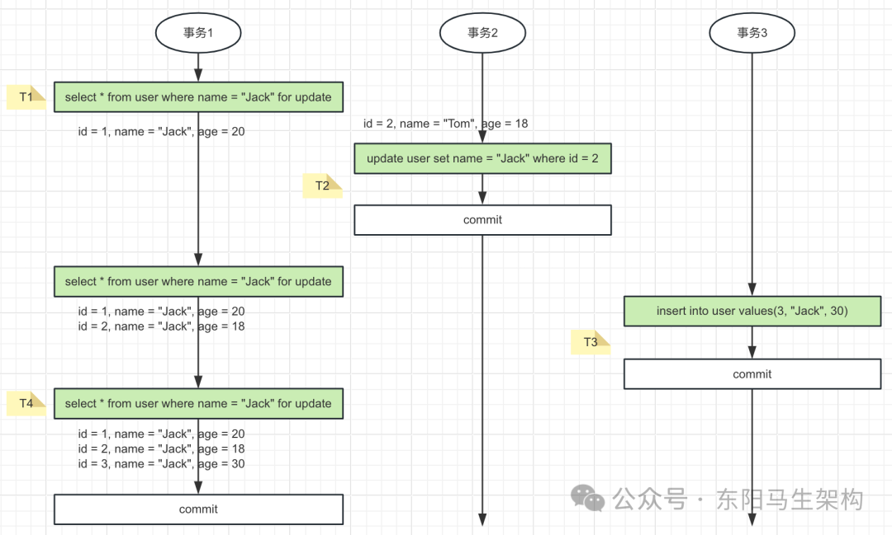

说明一：事务1中执行三次查询，都是要查出name = "Jack"的记录行，这里假设name = "Jack"的这条数据行上加了行锁。

说明二：事务1第一次查询只返回id = 1这一行。

说明三：事务1第二次查询前，事务2把id = 2这一行的name改成了Jack。因此事务1第二次查询的结果是id = 1和id = 2这两行。

说明四：事务1第三次查询前，事务3插入一行name = "Jack"的新数据。因此事务1第三次查询的结果是id = 1 、id = 2、id = 3这三行。

说明五：事务1第三次查询时，查询出了不存在的行，这就发生了幻读。

#### 二.继续分析下面这个场景

如下图示：

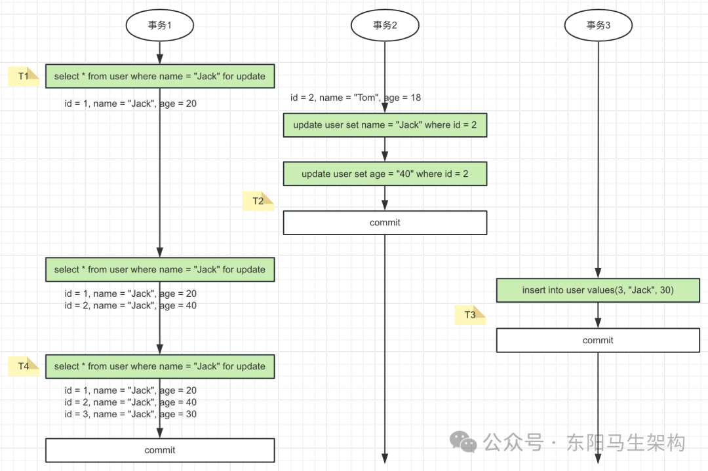

说明一：在事务2中添加一条SQL语句，把id = 2的这行数据的age字段改为40。即事务2对id = 2的行记录会先修改name = "Jack"，再修改age = 40。

说明二：在这之前，事务1只给id = 1的这一行加锁，没有对id = 2这一行加锁。所以事务2可以执行这条update语句。

说明三：但是事务2的修改操作先修改name = "Jack"，再修改age = 40，其实是破坏了事务1要把所有的name = "Jack"的行锁住的声明语义。

#### 三.接下来再给事务1加上一条SQL语句

如下图示：

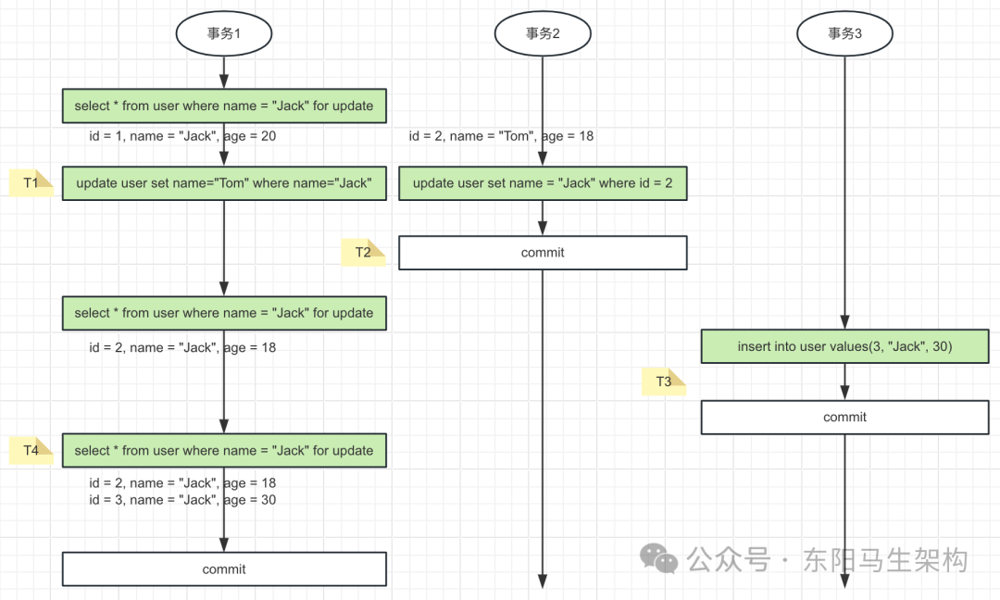

在上图的四个时刻中：

说明一：经过T1时刻，id = 1这一行变成了(1, "Tom", 20)。

说明二：经过T2时刻，id = 2这一行变成了(2, "Jack", 18)。

说明三：经过T3时刻，多了一行(3, "Jack", 30)。

再看一下对应的binlog日志中记录的操作内容：

T2时刻，事务2提交，写入了2条update语句到binlog：

```sql
updateusersetname = "Jack"whereid = 2; -- (2,"Jack",18)
```

T3时刻，事务3提交，写入了1条insert语句到binlog：

```sql
insertintouservalues(3, "Jack", 30) -- (3,"Jack",30)
```

T4时刻，事务1提交，binlog中写入了：

```sql
updateusersetname = "Tom"wherename = "Jack";
```

加锁的目的是为了保证数据的一致性。一致性不单单是指数据的一致性，还包括了日志的一致性。T4时刻的操作，把所有的name = "Jack"的行都改成了name = "Tom"。基于binlog进行主从复制时，id = 2和id = 3这两行的name都变成了Tom。也就是说id = 2和id = 3这两行，出现了主从数据不一致。主库的这两行数据是Jack，从库的这两行数据却变成了Tom。出现不一致的原因是：T1时刻只假设事务1只在id = 1的这一行加行锁。

#### 四.接下来再假设事务1加锁的范围是所有行

这样事务2的更新就会阻塞，直到T4时刻事务1提交commit释放锁。

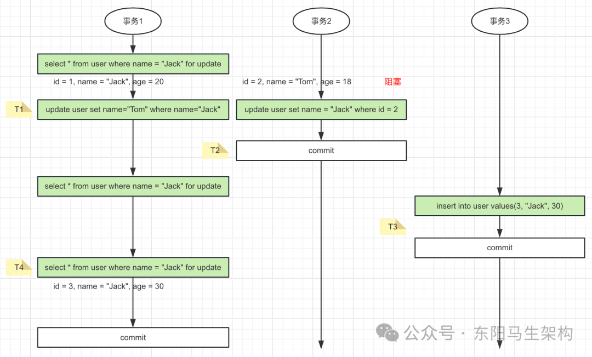

事务1将所有的行都加了写锁，所以事务2在执行第一个update语句时就被锁住了，需要等到T4时刻事务1提交后，事务2才能继续执行。再次查看binlog的写入情况，此时的执行顺序是这样的：

```sql
-- 事务3
insertintouservalues(3,"Jack",30); -- (3,"Jack",30)
-- 事务1
updateusersetname = "Tom"wherename = "Jack";
-- 事务2
updateusersetname = "Jack"whereid = 2; -- (2,"Jack",18)
```

这样看事务2的问题解决了，但是需要注意的是事务3在数据库里面的结果是(3, "Jack", 30)。而根据binlog的执行结果则是(3, "Tom", 30)，对所有行加锁还是阻止不了id = 3这一行的插入和更新，还是出现了幻读。原因是给所有行加锁时，id = 3这一行还不存在，扫描不到而加不上锁。

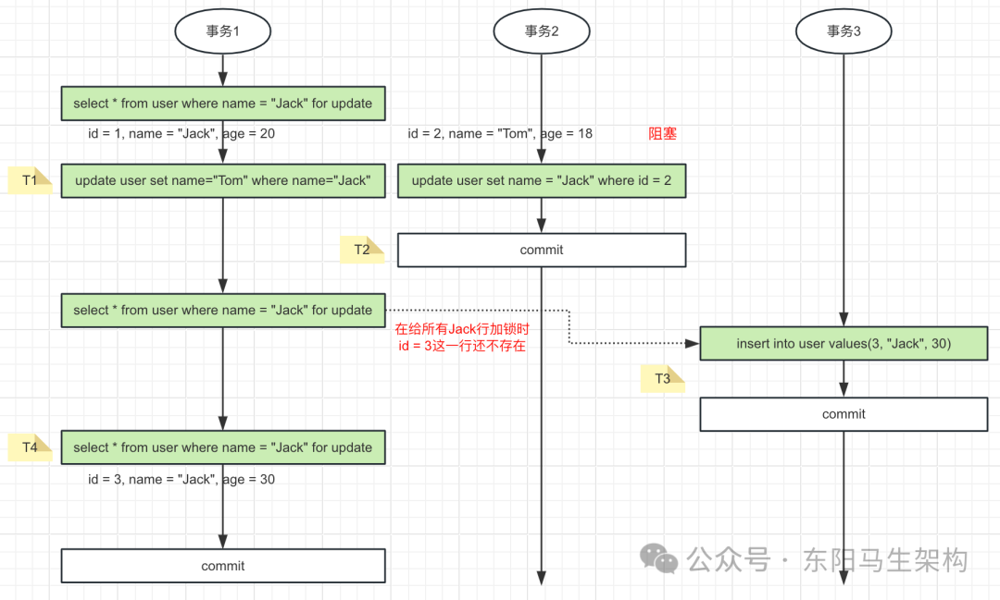

### (4)MySQL如何解决幻读

产生幻读的原因：行锁只能锁住行，但新插入的记录操作的是行间隙。因此为了解决幻读问题，InnoDB引入了间隙锁。

这样在执行select * from user where name = "Jack" for update时，不仅仅给数据库表中已有的n个记录加上了行锁，同时还增加了N+1个间隙锁，保护这些间隙，不允许插入值。

行锁 \+ 间隙锁解决了幻读问题，这种锁叫做临键锁Next-Key Lock。

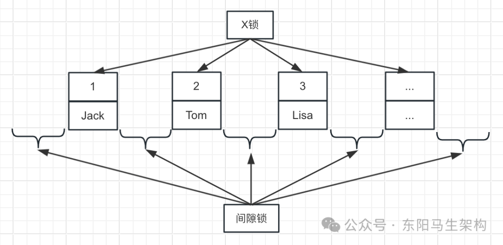

## 9.锁实战之行级锁(偏写)—优化建议

InnoDB存储引擎实现的行级锁定，虽然在锁定机制实现方面带来的性能损耗可能比表级锁定要更高一些，但是在整体并发处理能力方面要远远优于MyISAM的表级锁定的。当系统并发量较高时，InnoDB的整体性能就会比MyISAM更有明显优势。

但是，InnoDB的行级锁定同样也有其脆弱的一面。如果使用不当，那InnoDB的整体性能可能会比MyISAM更差。要想合理利用InnoDB的行级锁定，做到扬长避短，有如下建议：

建议一：尽可能让所有的数据检索都通过索引来完成，从而避免InnoDB因为无法通过索引键加锁而升级为表级锁定。

建议二：合理设计索引，让InnoDB在索引键上加锁时尽可能准确，尽可能的缩小锁定范围，避免造成不必要的锁定而影响其他SQL查询的执行。

建议三：尽量减少基于范围的数据检索过滤条件，避免因间隙锁带来的负面影响而锁定了不该锁定的记录。

建议四：尽量控制事务的大小，减少锁定的资源量和锁定时间长度。

建议五：在业务环境允许的情况下，尽量使用较低级别的事务隔离，以减少MySQL因为实现事务隔离级别所带来的附加成本。

可以通过检查InnoDB_row_lock状态变量来分析系统上的行锁的争夺情况：

```ruby
mysql> show status like 'InnoDB_row_lock%';
+-------------------------------+--------+
| Variable_name                 | Value  |
+-------------------------------+--------+
| Innodb_row_lock_current_waits | 0      |
| Innodb_row_lock_time          |522443|
| Innodb_row_lock_time_avg      | 18658  |
| Innodb_row_lock_time_max      |51068  |
| Innodb_row_lock_waits         | 28     |
+-------------------------------+--------+
5 rows in set (0.00 sec)
```

InnoDB的行级锁定状态变量不仅记录了锁定等待次数，还记录了锁定总时长、每次平均时长、以及最大时长，此外还有一个非累积状态量显示了当前正在等待锁定的等待数量。

对各个状态量的说明如下：

一.InnoDB_row_lock_current_waits：当前正在等待锁定的数量。

二.InnoDB_row_lock_time：从系统启动到现在锁定总时间长度。

三.InnoDB_row_lock_time_avg：每次等待所花平均时间。

四.InnoDB_row_lock_time_max：系统启动后等待最长的一次所花的时间。

五.InnoDB_row_lock_waits：系统启动后到现在总共等待的次数。

对于这5个状态变量，比较重要的主要是：

#### 一.InnoDB_row_lock_time_avg(等待平均时长)

#### 二.InnoDB_row_lock_waits(等待总次数)

#### 三.InnoDB_row_lock_time(等待总时长)

尤其是当等待次数很高，而且每次等待时长也不小的时候，就要分析为何有如此多的等待，然后根据分析结果着手指定优化计划。

## 10.锁实战之乐观锁

行锁、表锁、读锁、写锁、共享锁、排他锁其实都属于悲观锁。

### (1)什么是乐观锁

乐观锁是相对于悲观锁而言的，乐观锁不是数据库提供的功能，需要开发者自己去实现。

在操作数据库时，想法很乐观，认为这次的操作不会导致冲突。因此在数据库操作时并不做任何的特殊处理，而是在进行事务提交时再去判断是否有冲突；

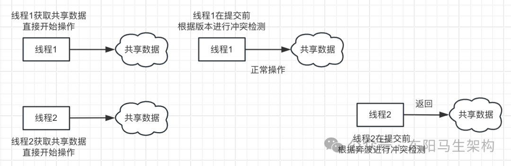

### (2)乐观锁实现方式

乐观锁的概念中其实已经阐述了它的具体实现细节，主要就是两个步骤：冲突检测和数据更新。

比较典型的一种实现方式就是CAS(Compare and Swap)。CAS是一种常见的降低读写锁冲突，保证数据一致性的乐观锁机制。当多个线程使用CAS同时更新某变量时，只有其中一个线程能更新成功。而其它线程都失败，失败的线程并不会被挂起，而是可以再次尝试。

比如一个扣减库存操作，可通过乐观锁实现：

```sql
-- 查询商品库存信息，查询结果为: quantity = 3
mysql> select quantity from items whereid = 1;
-- 修改商品库存为2
mysql> update items set quantity = 2whereid = 1and quantity = 3;
```

上述SQL在更新前，会先查询一下库存表中当前库存数(quantity)，然后在update时，会把库存数作为一个修改条件。

提交更新时，首先获取当前库存数，然后对比第一次取出来的库存数。如果当前库存数与第一次取出来的库存数相等，那么才允许更新。

### (3)CAS导致的ABA问题

CAS乐观锁机制确实能够提升吞吐，并保证一致性，但在极端情况下可能会出现ABA问题。

时间点一：并发线程1获取出数据的初始值是A，后续实施CAS乐观锁，期望数据仍是A时，修改才能成功。

时间点二：并发线程2将数据修改成B。

时间点三：并发线程3将数据修改回A。

时间点四：并发线程1使用CAS检测发现数据值还是A，于是进行修改。

但是并发线程1在修改数据时，虽然还是A，但已经不是初始条件的A了。中间发生了A变B，B又变A的变化。此A已经非彼A，数据却成功修改，可能导致错误。这就是CAS引发的所谓的ABA问题。

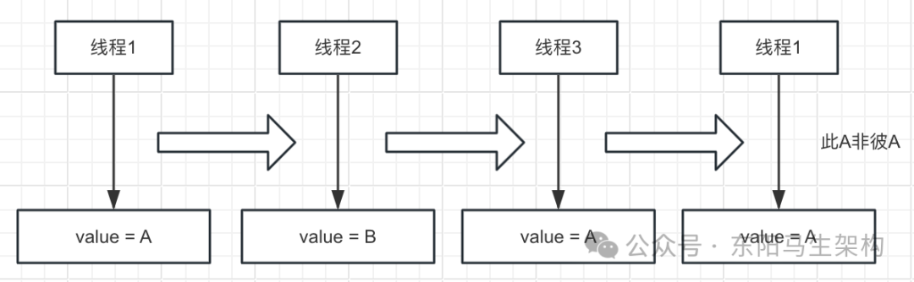

### (4)解决ABA问题的方法

设计一个单独的可以顺序递增的version字段，每操作一次就将相应记录的version版本号加1。version是用来查看被读的记录有无变化，version的作用是防止记录在业务处理期间被其他事务修改。

以下单操作为例：

```sql
-- 1.查询出商品信息 version = 1
mysql> select (quantity, version) from items whereid = 1;
-- 2.根据商品生成订单
mysql> insertinto orders ...
mysql> insertinto items ...
-- 3.修改商品库存，同时递增版本字段值
mysql> update products set quantity=quantity-1, version=version+1whereid=1andversion=#{version};
```

除了手动实现乐观锁外，许多数据库访问框架也封装了乐观锁的实现，比如MyBatis框架可以使用OptimisticLocker插件来扩展乐观锁。

## 11.行锁原理

### (1)SQL语句背后的锁实现原理

#### 一.InnoDB存储引擎3种行锁算法

#### 二.MVCC中的快照读和当前读

#### 三.插入、更新、删除操作都归为当前读

#### 四.MySQL两阶段封锁协议

#### 一.InnoDB存储引擎3种行锁算法

InnoDB引擎的行锁是通过对索引页和数据页上的记录加锁实现的，主要实现算法有3种：Record Lock、Gap Lock和Next-key Lock。

算法一：Record Lock锁(记录锁，RC、RR隔离级别都支持)

记录锁，锁定单个行记录的锁。

算法二：Gap Lock锁(间隙锁，RR隔离级别支持)

间隙锁，锁定索引记录间隙(不包括记录本身)，确保索引记录间隙不变。

算法三：Next-Key Lock锁(记录锁 + 间隙锁，RR隔离级别支持)

记录锁和间隙锁组合，同时锁住数据，并且锁住数据前后范围。

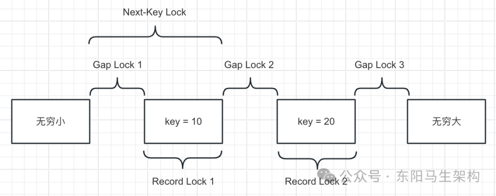

#### 二.MVCC中的快照读和当前读

MySQL支持MVCC多版本并发控制机制，MVCC实现了数据库的读不加锁，读写不冲突，提高了系统的并发性能。

普通的select操作属于快照读，不加锁。

```sql
mysql> select * fromtablewhere ...;
```

特殊的读操作、插入、更新、删除操作，都属于当前读，需要加锁。

```sql
mysql> select * fromtablewhere ... lockinsharemode;
mysql> select * fromtablewhere ... forupdate;
mysql> insertintotablevalues (...);
mysql> updatetableset ... where ...;
mysql> deletefromtablewhere ...;
```

当前读会读取记录的最新版本，并且读取后还要对读取记录加锁，保证其他并发事务不能修改当前记录。其中除了lock in share mode对读取记录加S锁 (共享锁)外，其他操作如for update、insert、update、delete都是加X锁 (排它锁)。

#### 三.插入、更新、删除操作都归为当前读

下面是一个Update操作的具体流程：

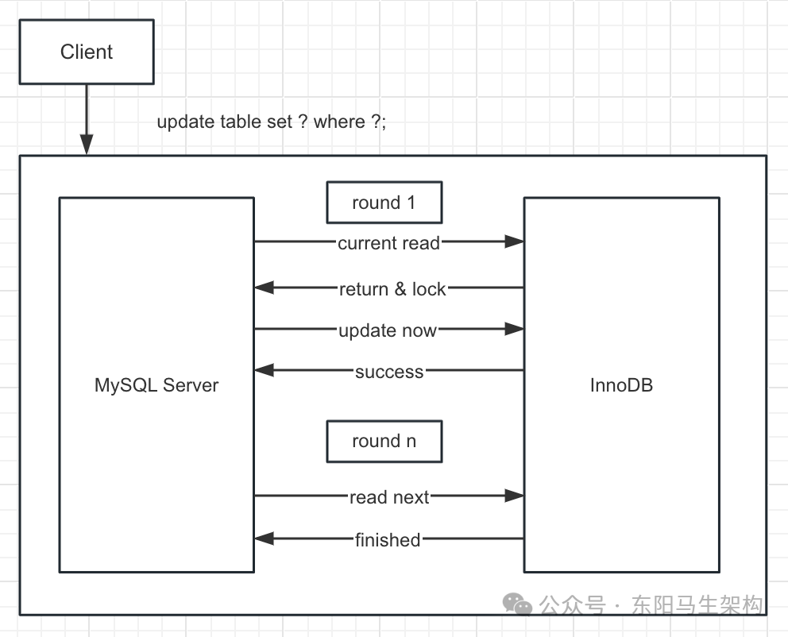

时间点1：当更新语句发送给MySQL后，MySQL Server会根据where条件，读取第一个满足条件的记录。InnoDB引擎会将查询到的第一条记录返回，并加上锁(当前读)。

时间点2：MySQL Server收到这条加锁的记录后，再发起一个更新请求去更新记录。

时间点3：一条记录操作完成再读取下一条记录，直到没有满足条件的记录为止。

总结：通过上面的分析，可以知道Update操作内部就包含了一个当前读，同理Delete操作内部也一样包含一个当前读。Insert操作触发唯一键检查时，也会有一个当前读，判断主键是否已存在。

#### 四.MySQL两阶段封锁协议

两阶段封锁协议主要用于保证单机事务中的一致性与隔离性，该协议要求每个事务分两个阶段提出加锁和解锁申请。注意：保证分布式事务中的一致性与隔离性可用两阶段提交协议。

阶段一：增长阶段

事务可以获得锁，但不能释放锁。即对任何数据进行读、写操作之前，首先要申请并获得对该数据的封锁。

阶段二：缩减阶段

事务可以释放锁，但不能获得锁。即释放一个封锁之后，事务不再申请和获得其它任何封锁。

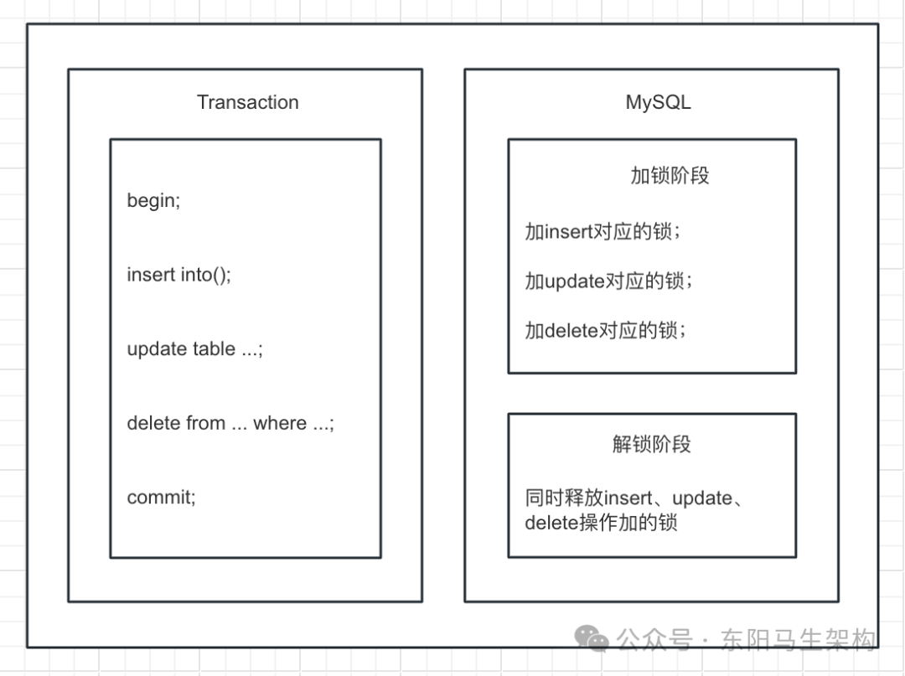

从上图可以看出：两阶段封锁协议2PL就是将加锁/解锁分为两个完全不相交的阶段。

加锁阶段：只加锁，不解锁。

解锁阶段：只解锁，不加锁。

两阶段封锁协议实现了事务集的串行化调度。但同时，一个事务的失败可能会引起一连串事务的回滚(可能级联回滚)，并且两阶段封锁协议并不保证不会发生死锁(可能发生死锁)，数据库系统必须采取其他的措施，预防和解决死锁问题。

### (2)InnoDB引擎加锁原理分析

SQL1：下面的查询语句加锁了吗？加的是什么锁？

```sql
mysql> select * from v1 where t1.id = 1;
```

分析查询语句的加锁需要考虑当前的隔离级别。该语句在串行化下MVCC会降级成Lock-Based CC，会加读锁。在其他三种隔离级别下，由于MVCC快照读，所以会不加锁。

SQL2：下面的这条SQL又是怎么加锁的？

```javascript
mysql> deletefrom v1 where id = 10;
```

分析增删改语句的加锁情况时，需要注意如下问题：

问题1：id列是不是主键？

问题2：当前系统的隔离级别是什么？

问题3：id列如果不是主键，那么id列上有索引吗？

问题4：id列上如果有二级索引，那么这个索引是唯一索引吗？

问题5：两个SQL的执行计划是什么？索引扫描？全表扫描？

#### 一.RC级别加锁机制

组合一：id主键 + RC级别

组合二：id不是主键但是唯一索引 + RC级别

组合三：id非唯一索引 + RC级别

组合四：id无索引 + RC级别

组合一：id主键 + RC级别

当id是主键时，只需要在该条SQL操作的数据记录上加写锁即可。

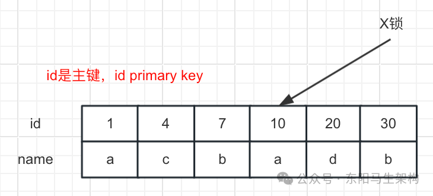

组合二：id不是主键但是唯一索引 + RC级别

因为id是唯一索引，where会通过id列的索引进行过滤。在找到id = 10的记录后，会对非聚簇索引树上id = 10的记录加X锁。同时回表查询主键索引name = d的记录，并对name = d的记录也加X锁。

注意下图中：id是唯一索引(非聚簇索引)，name是主键索引(聚簇索引)。

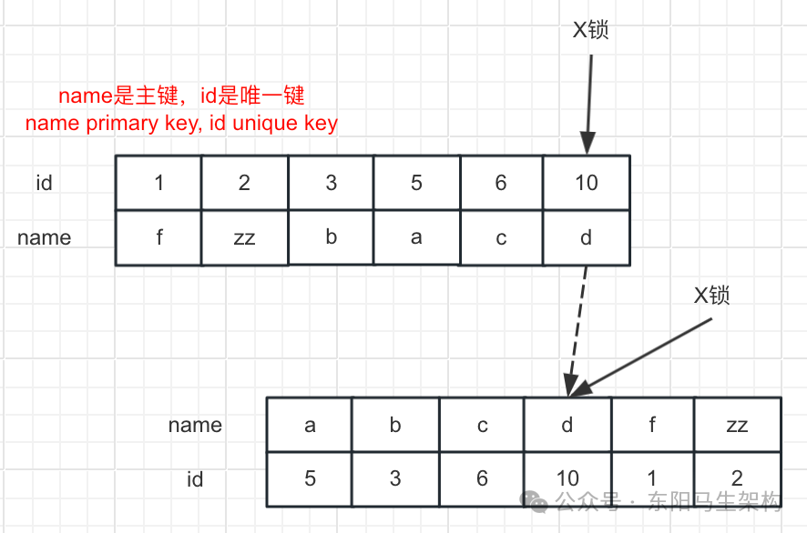

唯一索引与主键索引都需要加锁。

因为在执行这条删除语句时：如果并发出现了一条更新语句，而更新语句的where条件是name字段。此时如果根据id对数据进行的删除操作，没有对相应主键索引记录加锁，那么更新语句在更新同样记录时就不知有删除操作的存在从而进行更新。删除非聚簇索引上的某一行记录时，也会删除对应的聚簇索引上的记录。这样就违反了同一数据行上的写操作需要串行化执行的原则。

组合三：id非唯一索引 + RC级别

对id索引(非聚簇索引)中符合条件的多条记录都加上X锁，再把对应的name索引(主键索引)上的多条记录也加上X锁。

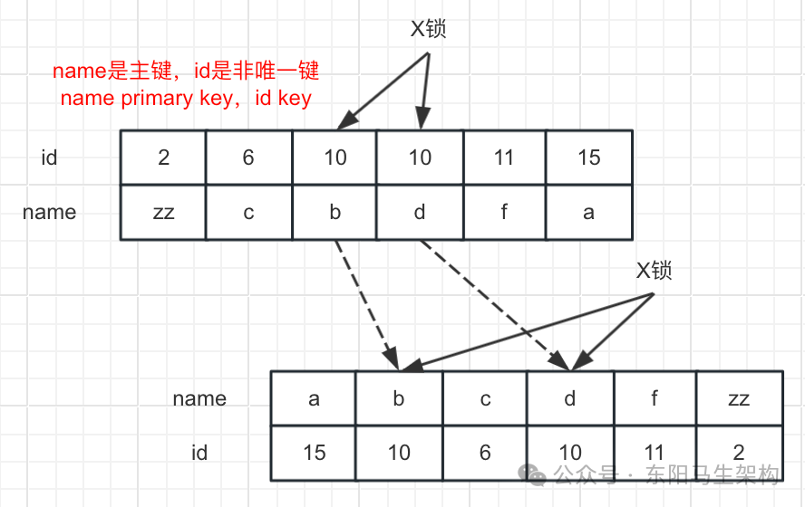

与组合二的区别在于：

在id是非唯一索引列的情况下，会对满足条件的多条数据都加上X锁。而组合二因为id是唯一索引列，所以只会对一条数据加上X锁。

组合四：id无索引 + RC级别

由于没有索引，所以只需删除聚簇索引上的记录即可。由于没有索引，所以执行计划用的是全表扫描。既然是全表扫描，所以会对主键索引上每一条记录施加X锁。

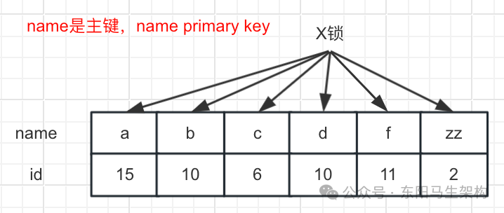

为什么会对所有记录加X锁，而不是表锁或对符合条件的数据加X锁呢？这是由于InnoDB的实现决定的。由于没有索引，无法在存储引擎层过滤(执行计划里的Using Where)，所以存储引擎只能对每一条数据加锁，并返回给Server层进行过滤。

实际上InnoDB在实现中会有一些改进：Server层在过滤时对不满足条件的记录会立即执行unlock_row方法，对不满足条件的记录解锁(违背2PL)，保证只有满足条件的记录持有X锁，但是对每条数据加锁的步骤是没法省略的。

#### 二.RR级别加锁机制

组合五：id主键 + RR，与组合一相同

组合六：id唯一索引 + RR，与组合二相同

组合七：id非唯一索引 + RR

组合八：id无索引 + RR级别

组合九：Serializable

组合五：id主键 + RR，与组合一相同

当id是主键时，只需要在该条SQL操作的数据记录上加写锁即可。


组合六：id唯一索引 + RR，与组合二相同

因为id是唯一索引，where会通过id列的索引进行过滤。在找到id = 10的记录后，会对非聚簇索引树上id = 10的记录加X锁。同时回表查询主键索引name = d的记录，并对name = d的记录也加X锁。

注意下图中：id是唯一索引(非聚簇索引)，name是主键索引(聚簇索引)。


唯一索引与主键索引都需要加锁。

因为在执行这条删除语句时：如果并发出现了一条更新语句，而更新语句的where条件是name字段。此时如果根据id对数据进行的删除操作，没有对相应主键索引记录加锁，那么更新语句在更新同样记录时就不知有删除操作的存在从而进行更新。删除非聚簇索引上的某一行记录时，也会删除对应的聚簇索引上的记录。这样就违反了同一数据行上的写操作需要串行化执行的原则。

组合七：id非唯一索引 + RR

RC隔离级别下允许幻读的出现，RR隔离级别下不允许幻读的出现。InnoDB在默认RR隔离级别下，通过增加间隙锁来解决当前读的幻读问题。

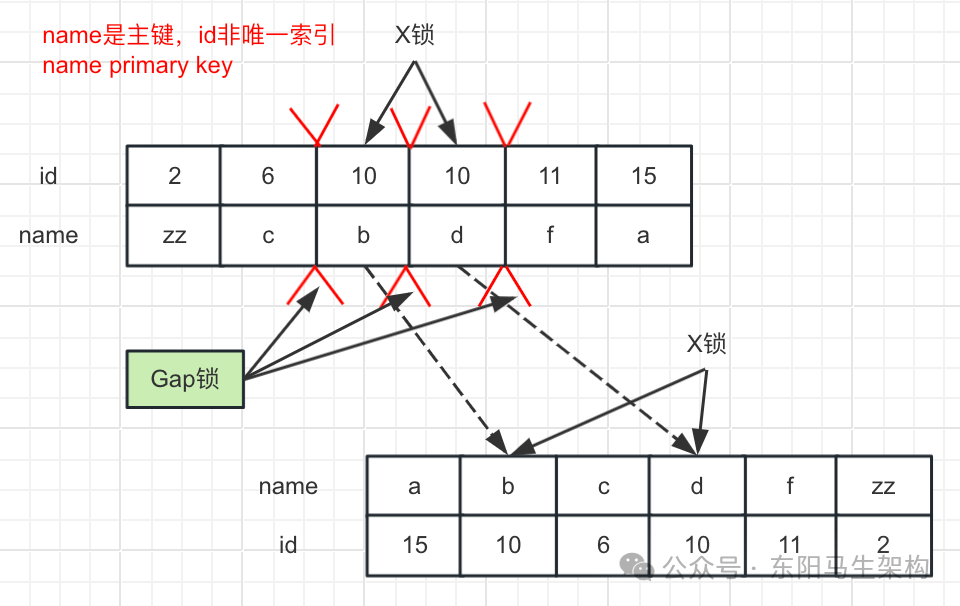

上图中name是主键索引，id是普通非唯一索引。

步骤一：首先对id索引(非聚簇索引)中符合条件的记录施加X锁。

步骤二：对非聚簇索引中施加了X锁的记录前后间隙施加间隙锁。

步骤三：对id索引(非聚簇索引)对应的主键索引的记录施加X锁。

施加了间隙锁后，数据的前后都不会插入新的数据，可以保证两次当前读的结果完全一致。

注意：对非聚簇索引中符合条件的记录添加间隙锁和X锁的时候，聚簇索引中相对应的记录不需要加间隙锁，只需要加X锁。

组合八：id无索引 + RR级别

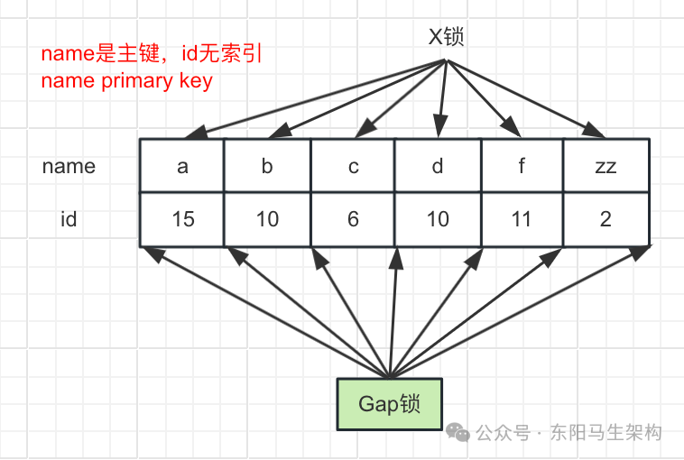

RR级别下如果进行全表扫描的当前读，那么会锁上聚簇索引的所有记录。同时锁上聚簇索引内的所有间隙，杜绝所有并发更新、删除、插入操作。当然也可以触发Semi-Consistent Read，来缓解加锁开销与并发影响。但是Semi-Consistent Read本身也会带来其他问题，不建议使用。

组合九：Serializable

```cs
mysql> select * from t1 where id = 10;
```

这条SQL在RC、RR隔离级别下，都是快照读，不加锁。但是在Serializable隔离级别，SQL1会加读锁。也就是说快照读不复存在，MVCC并发控制降级为Lock-Based CC。

InnoDB中读不加锁，并不适用于所有情况，而是与隔离级别有关的。Serializable隔离级别，读不加锁就不成立，所有读操作，都是当前读。

### (3)复杂SQL的加锁分析

数据库中有一张T1表，字段信息如下：

```sql
Table: t1(id primary key, userid, blogid, pubtime, comment)
-- id为主键, userid与comment字段创建了联合索引
Index:  idx_pu(pubtime, user_id)
```

在RR级别下，分析如下SQL会加什么锁，假设SQL走的是idx_pu索引。

```python
mysql> delete from t1
where pubtime > 1and pubtime < 20and userid = 'hdc'and comment isnot null;
```

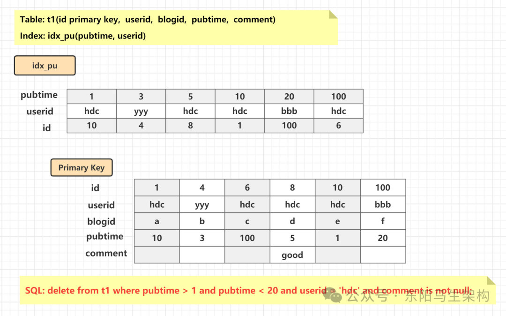

分析SQL中的条件构成：

一.Index key是：pubtime > 1 and puptime < 20，此条件用于确定在idx_pu索引上的查询范围。

二.Index Filter是：userid = "hdc"，此条件可以在idx_pu索引上进行过滤，但不属于Index Key。

三.Table Filter是：comment is not NULL，此条件无法在idx_pu索引上进行过滤，只能在聚簇索引上进行过滤。

SQL中的where条件提取：

所有SQL的where条件可归纳为3大类：

#### 一.Index Key

用于确定SQL查询在索引中的连续范围(起始 + 结束)的查询条件。由于一个范围，至少包含一个起始与一个终止，因此Index Key也被拆分为Index First Key和Index Last Key，分别用于定位索引查找的起始，以及索引查询的终止条件。

#### 二.Index Filter

Index Filter用于过滤索引查询范围中不满足查询条件的记录。因此对于索引范围中的每一条记录，均需要与Index Filter进行对比。若不满足Index Filter则直接丢弃，继续读取索引下一条记录。

#### 三.Table Filter

所有不属于索引列的查询条件都在Table Filter中。

假设现已满足Index key和Index Filter的条件，并回表读取了完整记录。接下来就是要判断完整记录是否满足Table Filter中的查询条件：如果不满足，则跳过当前记录，继续读取索引的下一条记录；如果满足，则返回记录给前端用户。

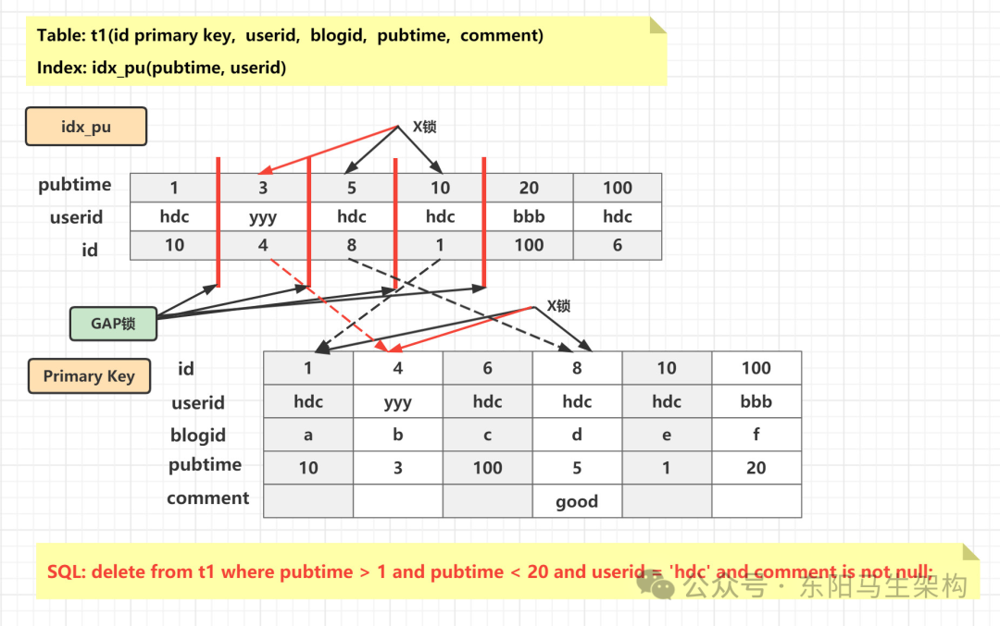

在RR隔离级别下，根据上图和下面的分析，就是这条SQL的加锁情况：

第一：由Index Key所确定的范围被加上了间隙锁

第二：Index Filter锁给定的条件(userid = "hdc")，在index上过滤

Index Filter锁给定的条件(userid = "hdc")何时过滤，视MySQL版本而定。在5.6版本前，不支持ICP，因此Index Filter在Server层过滤。在5.6版本后，支持Index Condition Pushdown(ICP)，则在index上过滤。若不支持ICP，不满足Index Filter的记录，也需要对记录加上X锁。若支持ICP，则不满足Index Filter的记录，无需对记录加上X锁。图中，用红色箭头标出的X锁，是否要加，视是否支持ICP而定。ICP是MySQL使用索引从表中检索行数据的一种优化方式。

禁用ICP时，存储引擎会通过遍历索引定位基表中的行。然后返回给Server层，再去为这些数据行进行where条件的过滤。

启用ICP时，如果where条件可使用索引，会把过滤操作放到存储引擎层。存储引擎通过索引过滤，把满足的行从表中读取出。

ICP可减少存储引擎必须访问基表的次数，ICP也可减少Server层必须访问存储引擎的次数。

第三：Table Filter的过滤条件，会从聚簇索引中读取到Server层过滤

因此聚簇索引上也需要X锁。

第四：最后选取出一条满足条件的记录

这条记录就是[8, hdc, d, 5, good]。但是加锁的数量，要远远大于满足条件的记录数量。

### (4)在RR隔离级别下如何判断一个复杂SQL应该加什么样的锁

首先需要提取其where条件。

Index Key确定的范围，需要加上间隙锁。

Index Filter过滤条件，满足Index Filter的记录加X锁，否则不加X锁。

Table Filter过滤条件，无论是否满足都需要加X锁。

## 12.死锁与解决方案

### (1)表的死锁

#### 一.产生原因

用户A访问表A锁住了表A，然后又访问表B。另一个用户B访问表B锁住了表B，然后企图访问表A。这时用户A由于用户B已经锁住表B，它要等用户B释放表B才能继续。同样用户B要等用户A释放表A才能继续，这就死锁就产生了。

用户A --> A表(表锁) --> B表(表锁)

用户B --> B表(表锁) --> A表(表锁)

#### 二.解决方案

这种死锁比较常见，是由于程序的BUG产生的，除了调整的程序的逻辑没有其它的办法。仔细分析程序的逻辑，对于数据库的多表操作时：尽量按照相同的顺序进行处理，尽量避免同时锁定两个资源。如操作A和B两张表时，总是按先A后B的顺序处理。两线程必须同时锁定两个资源时，要保证按照相同的顺序来锁定资源。

### (2)行级锁死锁

#### 一.产生原因1

如果在事务中执行了一条没有索引条件的查询，引发全表扫描，把行级锁上升为全表记录锁定(等价于表级锁)。多个这样的事务执行后，就容易产生死锁和阻塞。最终应用系统会越来越慢，发生阻塞或死锁。

解决方案1：

SQL语句中不要使用太复杂的关联多表的查询。使用explain对SQL进行分析，对于有全表扫描和全表锁定的SQL，建立相应的索引进行优化。

#### 二.产生原因2

两个事务分别想拿到对方持有的锁，互相等待，于是产生死锁。

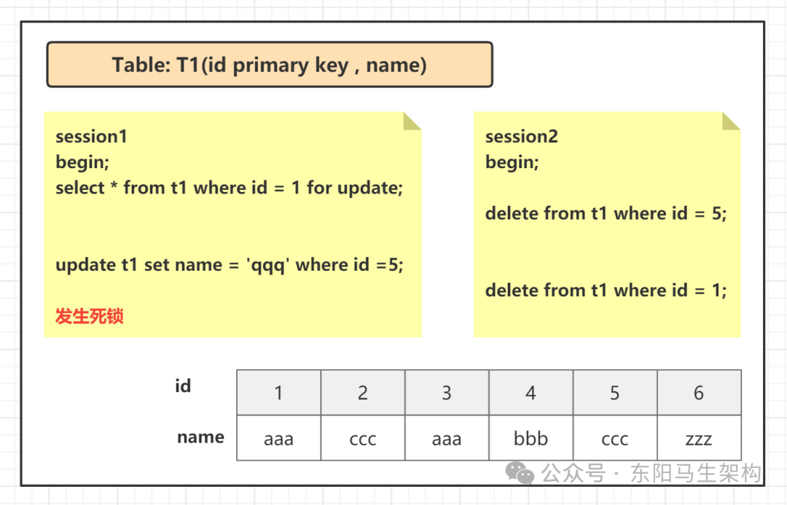

#### 三.产生原因3

每个事务只有一个SQL，但有时还是会发生死锁。

在下图的展示中：id是主键索引，name是普通索引，pubtime也是普通索引，箭头上的数字1和2表示的是加锁的顺序。

事务1从name索引出发，读到的[hdc, 1], [hdc, 6]均满足条件，不仅会加name索引上的记录X锁，而且会加聚簇索引上的记录X锁，加锁顺序为先[1, hdc, 100]后[6, hdc, 10]。

事务2从pubtime索引出发，[10, 6], [100, 1]均满足过滤条件，同样也会加聚簇索引上的记录X锁，加锁顺序为先[6, hdc, 10]后[1, hdc, 100]，但是加锁时发现跟事务1的加锁顺序正好相反。

两个事务恰好都持有了第一把锁，请求加第二把锁，死锁就发生了。

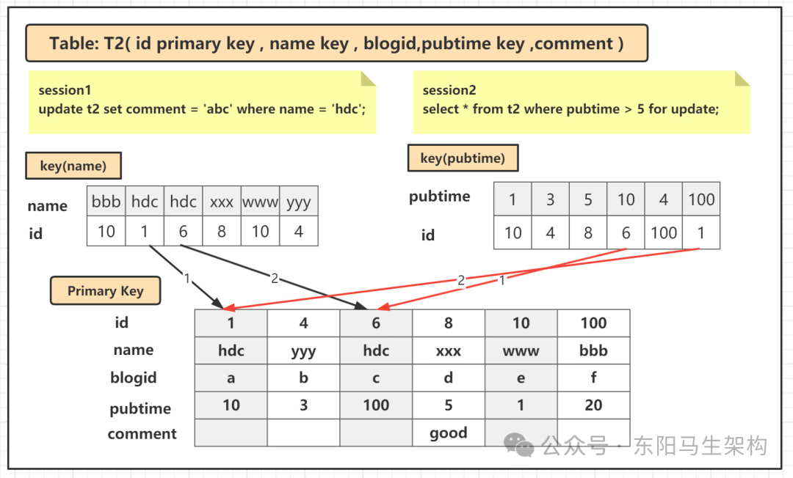

解决方案：上面出现死锁的原因是对索引行加锁顺序的不一致而导致的。所以如果可以，尽量以相同的顺序来访问索引记录和表(针对原因2)。比如在程序以批量方式处理数据时，如果事先对数据排序(针对原因3)，就可以保证每个线程按固定的顺序来处理记录，从而能大大减少出现死锁的情况。

### (3)死锁案例演示

接下来演示一下对于发生死锁的分析过程：

#### 一.数据准备

```sql
createtable test_deadLock(
    idint primary key,
    namevarchar(50),
    age int
);

insertinto test_deadLock values(1, 'lisi', 11),(2, 'zhangsan', 22),(3, 'wangwu', 33);
```

#### 二.数据库隔离级别查看

```sql
select @@tx_isolation;
+-----------------+
| @@tx_isolation  |
+-----------------+
| REPEATABLE-READ |
+-----------------+
```

#### 三.查看加锁信息

```cs
-- information_schema.innodb_trx: 当前出现的锁
mysql> select * from information_schema.innodb_locks;

-- information_schema.innodb_trx: 当前运行的所有事务
mysql> select * from information_schema.innodb_trx;

-- information_schema.innodb_lock_waits: 锁等待的对应关系
mysql> select * from information_schema.innodb_lock_waits;
```

#### 四.查看InnoDB状态

InnoDB状态会包含最近的死锁日志信息。

```shell
mysql> show engine innodb status;
```

#### 五.案例分析

作为第一个示例，这里进行细致的分析。两个事务每执行一条SQL，可以查看下innodb锁状态、锁等待信息及当前innodb事务列表信息，最后可以通过"show engine innodb status;"查看最近的死锁日志信息。

第一步：事务1执行begin开始事务执行一条SQL，查询id=1的数据。

```ruby
-- 窗口1，开启事务
mysql> begin;
Query OK, 0 rows affected (0.00 sec)

-- 窗口1，查询id=1的数据
mysql> select * from test_deadLock where id = 1for update;
+----+------+------+
| id | name | age  |
+----+------+------+
|  1 | lisi |   11 |
+----+------+------+
1 row in set (0.00 sec)
```

分析加锁过程：

过程1：事务1进行首先申请IX锁(意向排它锁，因为是for update)。

过程2：然后申请X锁，查询是否存在id=1的记录。

过程3：存在该记录，因为id字段是唯一索引，所以添加的是记录锁。

第二步：查看information_schema.innodb_trx表，发现存在事务1的信息。

```cs
mysql> select
    trx_id '事务id',
    trx_state '事务状态',
    trx_started '事务开始时间',
    trx_weight '事务权重',
    trx_mysql_thread_id '事务线程ID',
    trx_tables_locked '事务拥有锁个数',
    trx_lock_memory_bytes '事务锁住内存大小',
    trx_rows_locked '事务锁住行数',
    trx_rows_modified '事务更改行数'
from information_schema.innodb_trx;
```

第三步：执行事务2的delete语句，删除成功，因为id=3的数据没被加锁。

```shell
-- 窗口2
mysql> begin;
mysql> delete from test_deadLock where id = 3; -- 删除成功
```

切换窗口查看事务信息，发现innodb_trx已经有T1、T2两个事务信息。

```cs
-- 窗口1
mysql> select
    trx_id '事务id',
    trx_state '事务状态',
    trx_weight '事务权重',
    trx_mysql_thread_id '事务线程ID',
    trx_tables_locked '事务拥有多少个锁',
    trx_lock_memory_bytes '事务锁住的内存大小',
    trx_rows_locked '事务锁住的行数',
    trx_rows_modified '事务更改的行数'
from information_schema.innodb_trx;
```

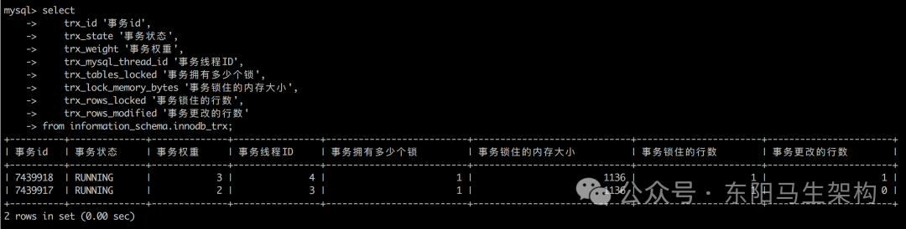

第四步：事务1对id = 3的记录进行修改，发生阻塞

因为id = 3的数据的X锁已经被事务2拿到，其他事务的操作只能被阻塞。

```shell
-- 窗口1
mysql> update test_deadLock set name = 'aaa'where id = 3;
-- 阻塞
```

第五步：此时查看当前锁信息

```sql
-- 窗口2，在事务1还在更新阻塞时去窗口2查看当前锁信息
select
    lock_id '锁ID',
    lock_trx_id '拥有锁的事务ID',
    lock_mode '锁模式',
    lock_type '锁类型',
    lock_table '被锁的索引',
    lock_space '被锁的表空间号',
    lock_page '被锁的页号',
    lock_rec '被锁的记录号',
    lock_data '被锁的数据'
from information_schema.innodb_locks;
```

lock_rec = 4表示是对唯一索引进行的加锁，lock_mode = X表示这里加的是X锁。

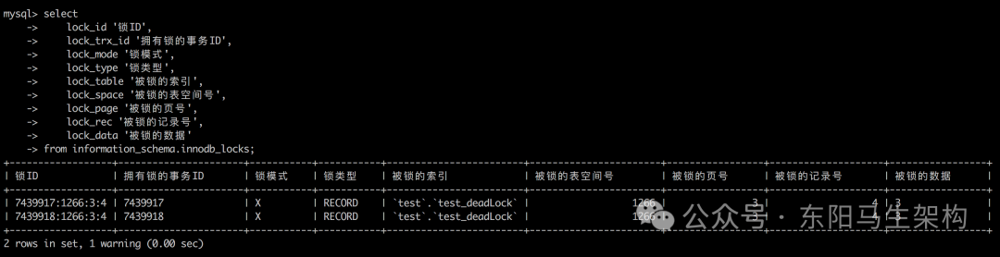

```sql
-- 窗口2，在事务1还在更新阻塞时去窗口2查看锁等待的对应关系
select
    requesting_trx_id '请求锁的事务ID',
    requested_lock_id '请求锁的锁ID',
    blocking_trx_id '当前拥有锁的事务ID',
    blocking_lock_id '当前拥有锁的锁ID'
from information_schema.innodb_lock_waits;
```

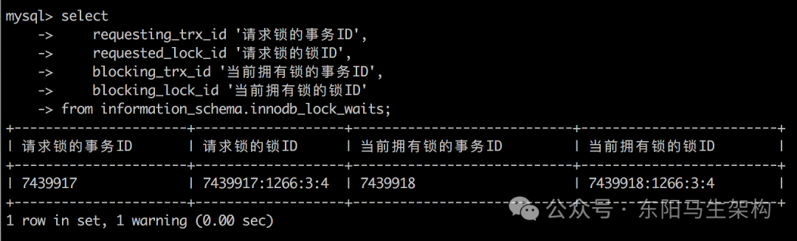

第六步：在事务2执行删除id = 1的数据成功。

```javascript
-- 窗口2，执行删除 id = 1的数据成功
mysql> deletefrom test_deadLock where id = 1;
Query OK, 1 row affected (0.00 sec)
```

第七步：但是发现事务1已经检测到了死锁的发生。

```ruby
-- 窗口1
mysql> update test_deadLock set name = 'aaa' where id = 3;
ERROR 1213 (40001): Deadlock found when trying to get lock; try restarting transaction

-- 窗口1，commit事务1，更新操作失败
mysql> commit;
Query OK, 0 rows affected (0.00 sec)

mysql> select * from test_deadLock;
+----+----------+------+
| id | name     | age  |
+----+----------+------+
|  1 | lisi     |   11 |
|  2 | zhangsan |   22 |
+----+----------+------+
2 rows in set (0.00 sec)

-- 事务2 commit，删除操作成功
mysql> commit;

mysql> select * from test_deadLock;
+----+----------+------+
| id | name     | age  |
+----+----------+------+
|  1 | lisi     |   11 |
|  2 | zhangsan |   22 |
+----+----------+------+
2 rows in set (0.00 sec)
```

事务1和事务2的整个死锁过程操作梳理如下：

```cs
-- 事务1
mysql> begin;
-- 查询id=1的数据
mysql> select * from test_deadLock where id = 1for update;
mysql> update test_deadLock set name = 'aaa'where id = 3;
-- 阻塞
ERROR 1213 (40001): Deadlock found when trying to getlock; try restarting transaction

-- 事务2
mysql> begin;
mysql> delete from test_deadLock where id = 3; -- 删除成功
mysql> delete from test_deadLock where id = 1; -- 删除成功
```

第八步：查看死锁日志

ACTIVE 309 sec：表示事务活动时间。

starting index read：表示读取索引。

tables in use 1：表示有一张表被使用了。

LOCK WAIT 3 lock struct(s)：表示该事务的锁链表的长度为3，每个链表节点代表该事务持有的一个锁结构，如表锁、记录锁等。

heap size 1136：为事务分配的锁堆内存大小。

3 row lock(s)：表示当前事务持有的行锁个数/Gap锁的个数。

```perl
LATEST DETECTED DEADLOCK
------------------------
2021-04-0406:22:010x7fa66b39d700
*** (1) TRANSACTION: 事务1
TRANSACTION 7439917, ACTIVE 309 sec starting indexread
-- 事务编号7439917，活跃秒数309，starting indexread表示事务状态为根据索引读取数据
mysql tables in use1, locked 1

-- 表示有一张表被使用了，locked 1表示表上有一个表锁，对于DML语句为LOCK_IX
LOCK WAIT 3 lock struct(s), heap size 1136, 3 row lock(s)
MySQL thread id 20, OS thread handle 140352739985152, query id 837 localhost root updating

update test_deadLock set name = 'aaa' where id = 3
--当前正在等待锁的SQL语句

*** (1) WAITING FOR THIS LOCK TO BE GRANTED:
RECORD LOCKS space id 248 page no3 n bits 72index PRIMARY of table `test`.`test_deadLock` trx id 7439917 lock_mode X locks rec but not gap waiting
Record lock, heap no4 PHYSICAL RECORD: n_fields 5; compact format; info bits 32
0: len 4; hex80000003; asc     ;;
1: len 6; hex000000004059; asc     @Y;;
2: len 7; hex4100000193256b; asc A    %k;;
3: len 6; hex77616e677775; asc wangwu;;
4: len 4; hex80000021; asc    !;;

*** (2) TRANSACTION:
TRANSACTION 7439918, ACTIVE 300 sec starting indexread
mysql tables in use1, locked 1
3 lock struct(s), heap size 1136, 2 row lock(s), undo log entries 1
MySQL thread id 19, OS thread handle 140352740251392, query id 838 localhost root updating
delete from test_deadLock where id = 1
*** (2) HOLDS THE LOCK(S):
RECORD LOCKS space id 248 page no3 n bits 72index PRIMARY of table `test`.`test_deadLock` trx id 7439918 lock_mode X locks rec but not gap
Record lock, heap no4 PHYSICAL RECORD: n_fields 5; compact format; info bits 32
0: len 4; hex80000003; asc     ;;
1: len 6; hex000000004059; asc     @Y;;
2: len 7; hex4100000193256b; asc A    %k;;
3: len 6; hex77616e677775; asc wangwu;;
4: len 4; hex80000021; asc    !;;

*** (2) WAITING FOR THIS LOCK TO BE GRANTED:
RECORD LOCKS space id 248 page no3 n bits 72index PRIMARY of table `test`.`test_deadLock` trx id 7439918 lock_mode X locks rec but not gap waiting
Record lock, heap no2 PHYSICAL RECORD: n_fields 5; compact format; info bits 0
0: len 4; hex80000001; asc     ;;
1: len 6; hex00000000403d; asc     @=;;
2: len 7; hex b0000001240110; asc     $  ;;
3: len 4; hex6c697369; asc lisi;;
4: len 4; hex8000000b; asc     ;;
```

### (4)死锁总结

#### 一.对索引加锁顺序的不一致很可能会导致死锁

所以尽量以相同的顺序来访问索引记录和表，在程序以批量方式处理数据时，如果事先对数据排序，保证每个线程按固定的顺序来处理数据，可大大减少出现死锁的情况。

#### 二.间隙锁往往是程序中导致死锁的真凶

由于默认隔离级别是RR，所以是要使用间隙锁的。但如果能确定幻读和不可重复读对应用影响不大，可以考虑降低隔离级别，改成RC可以避免间隙锁导致的死锁。

#### 三.为表添加合理的索引

如果不走索引将会为表的每一行记录加锁，死锁的概率就会增大。

#### 四.避免大事务，尽量将大事务拆成多个小事务

因为大事务占用资源多、耗时长，与其他事务冲突的概率也会变高。

#### 五.避免在同时运行多个对同一表进行读写的脚本

要特别注意加锁且操作数据量比较大的SQL语句。

#### 六.设置锁等待超时参数

这个参数就是innodb_lock_wait_timeout。在并发高的情况下，如果大量事务因无法立即获得所需的锁而挂起，会占用大量计算机资源，造成严重性能问题，甚至拖跨数据库。通过设置合适的锁等待超时阈值，可以避免这种情况发生。
