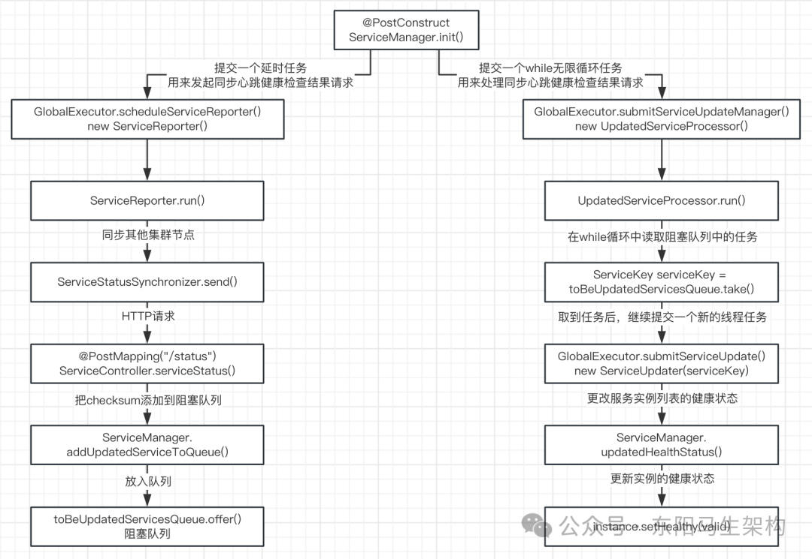
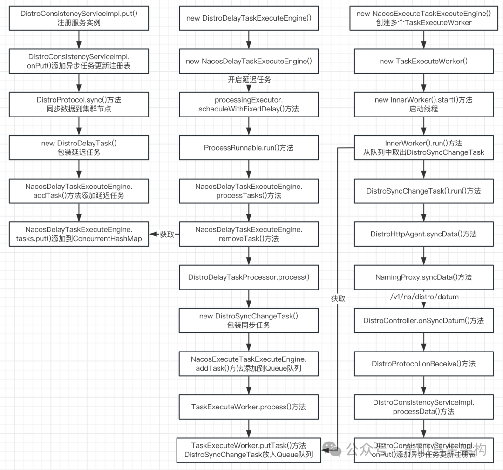
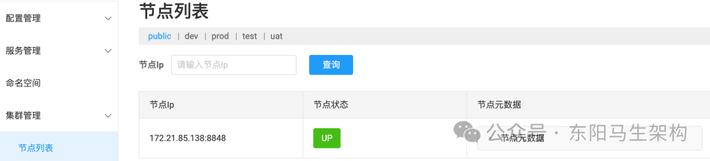
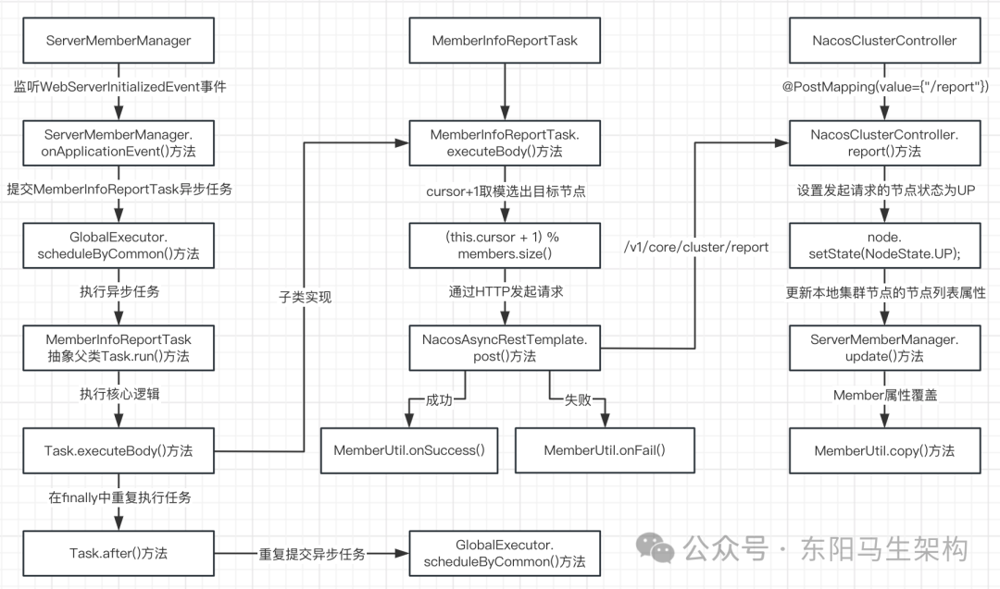
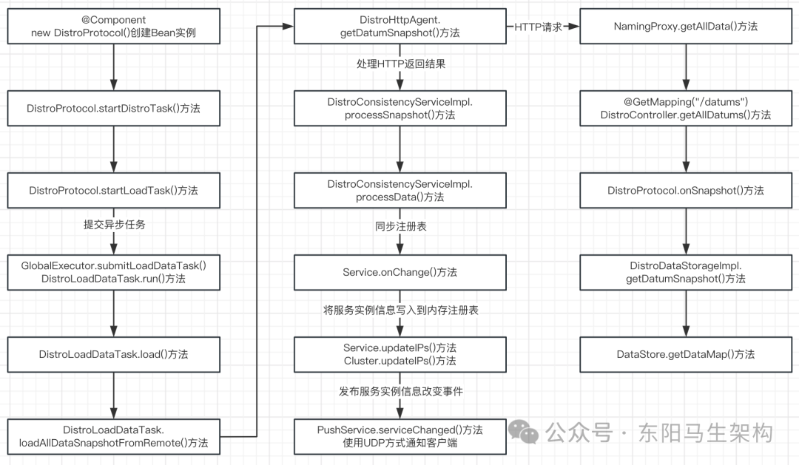
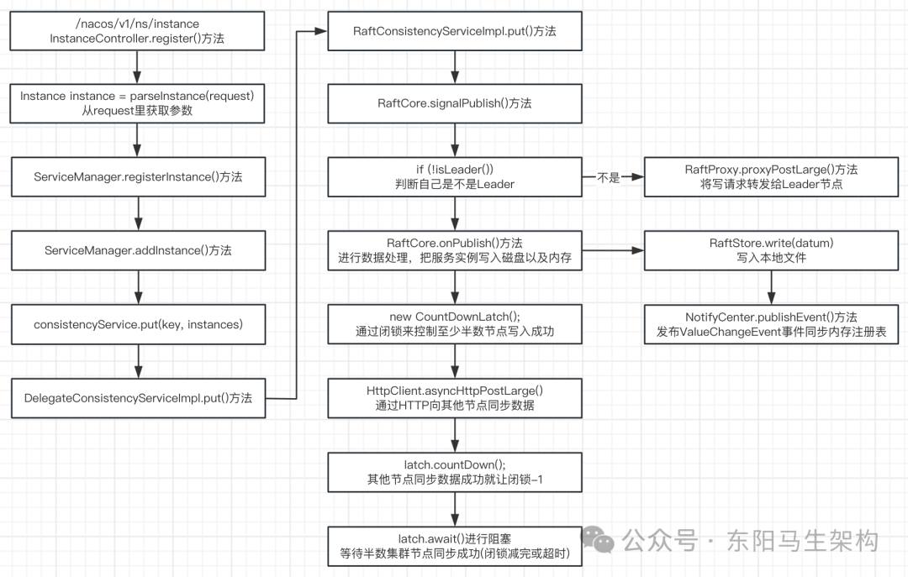
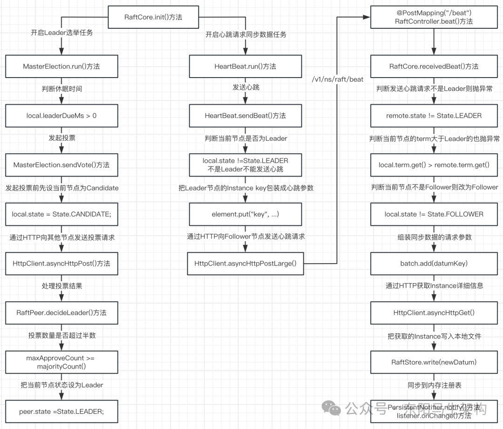

# 面试准备之Nacos要点总结三

> **公众号**: 东阳马生架构  
> **发布时间**: 2025-11-12 09:00  

**大纲(13265字)**

- 1.Nacos集群的几个问题
- 2.单节点对服务进行心跳健康检查和同步检查结果
- 3.集群新增服务实例时如何同步给其他节点
- 4.集群节点的健康状态变动时的数据同步
- 5.集群新增节点时如何同步已有服务实例数据
- 6.CAP原则与Raft协议
- 7.Nacos实现的Raft协议是如何写入数据的
- 8.Nacos实现的Raft协议是如何选举Leader节点的
- 9.Nacos实现的Raft协议是如何同步数据的
- 10.Nacos如何实现Raft协议的简单总结


## 1.Nacos集群的几个问题

问题一：在单机模式下，Nacos服务端会开启心跳健康检查的定时任务。那么在集群模式下，是否有必要让全部集群节点都执行这个定时任务？

问题二：Nacos服务端通过心跳健康检查的定时任务感知服务实例健康状态改变时，如何把服务实例的健康状态同步给其他Nacos集群节点？

问题三：一个新服务实例发起注册请求，只会有一个Nacos集群节点处理对应请求，那么处理完注册请求后，集群节点间应该如何同步服务实例数据？

问题四：假设Nacos集群有三个节点，现在需要新增了一个节点，那么新增的节点应该如何从集群中同步已存在的服务实例数据？

问题五：Nacos集群节点相互之间，是否有心跳机制来检测集群节点是否可用？

## 2.单节点对服务进行心跳健康检查和同步检查结果

### (1)集群对服务进行心跳健康检查的架构设计

假设Nacos集群有三个节点：现已知单机模式下的Nacos服务端是会开启心跳健康检查的定时任务的。既然集群节点有三个，是否每个节点都要执行心跳健康检查的定时任务？

方案一：三个节点全都去执行心跳健康检查任务。如果每个节点执行的结果都不同，那么以哪个为准？

方案二：只有一个节点去执行心跳健康检查任务，然后把检查结果同步给其他节点。

明显方案二逻辑简洁清晰，而Nacos集群也选择了方案二。在Nacos集群模式下，三个节点都会开启一个心跳健康检查的定时任务，但只有一个节点会真正地执行心跳健康检查的逻辑。然后在检查完成后，会开启一个定时任务将检查结果同步给其他节点。

### (2)选择一个节点对服务进行心跳健康检查的源码

对服务进行心跳健康检查的任务，其实就是ClientBeatCheckTask任务。Nacos服务端在处理服务实例注册接口请求时，就会开启这个任务。如下所示：


ClientBeatCheckTask这个类是一个线程任务。在ClientBeatCheckTask的run()方法中，一开始就有两个if判断。第一个if判断：判断当前节点在集群模式下是否需要对该Service执行心跳健康检查任务。第二个if判断：是否开启了健康检查任务，默认是开启的。注意：ClientBeatProcessor用于处理服务实例的心跳，服务实例和服务都需要心跳健康检查。

在集群模式下，为了保证只有一个节点对该Service执行心跳健康检查，就需要第一个if判断中的DistroMapper的responsible()方法来实现了。通过DistroMapper的responsible()方法可知：只会有一个集群节点能够对该Service执行心跳健康检查。而其他的集群节点，并不会去执行对该Service的心跳健康检查。

### (3)集群之间同步服务的健康状态的实现

既然集群中只有一个节点能够对某Service执行心跳健康检查，那么心跳健康检查的结果应该如何同步给集群的其他节点。

#### 一.集群间同步服务的健康状态的实现逻辑

每个节点都会有一个定时任务，用来同步心跳健康检查的结果给其他节点。该异步任务会通过HTTP方式，调用其他集群节点的接口来实现数据同步。

#### 二.集群间同步服务的健康状态的实现细节

在ServiceManager类中，有一个init()方法。该方法被@PostConstruct注解修饰了。在创建ServiceManager这个Bean时，便会调用这个init()方法。而在这个方法中，就会开启同步心跳健康检查结果的定时任务。

其中与同步服务实例健康状态相关的有两个异步任务：第一个是用来发起同步心跳健康检查结果请求的异步任务，第二个是用来处理同步心跳健康检查结果请求的异步任务。处理请求的思路是：内存队列削峰 \+ 异步任务提速。

#### 三.第一个异步任务ServiceReporter

首先从内存注册表中，获取全部的服务名称。ServiceManager的getAllServiceNames()方法返回的是一个Map对象。其中的key是对应的命名空间ID，value是对应命名空间下的全部服务名称。然后遍历allServiceNames中的内容，此时会有两个for循环来处理。最后这个任务执行完，会继续提交一个延时执行的任务进行健康检查。

第一个for循环：遍历某命名空间ID下的全部服务名称，封装请求参数。

首先采用同样的Hash算法，判断遍历到的Service是否需要同步健康结果。如果需要执行，则把参数放到ServiceChecksum对象中。然后通过JacksonUtils转成JSON数据后，再放到Message请求参数对象。

第二个for循环：遍历集群节点，发送请求给其他节点进行数据同步。

首先判断是否是自身节点，如果是则跳过。否则调用ServiceStatusSynchronizer的send()方法。通过向其他集群节点的接口发起请求，来实现心跳健康检查结果的同步。集群节点同步的核心方法就在ServiceStatusSynchronizer的send()方法中。

通过ServiceStatusSynchronizer的send()方法中的代码可知，最终会通过HTTP方式进行数据同步，请求地址是"v1/ns/service/status"。该请求地址对应的请求处理入口是ServiceController的serviceStatus()方法。

在ServiceController的serviceStatus()方法中，如果通过对比入参和注册表的ServiceChecksum后，发现服务状态发生了改变，那么就会调用ServiceManager.addUpdatedServiceToQueue()方法。

在addUpdatedServiceToQueue()方法中，首先会把传入的参数包装成ServiceKey对象，然后放入到toBeUpdatedServicesQueue阻塞队列中。

既然最后会将ServiceKey对象放入到阻塞队列中，那必然有一个异步任务，从阻塞队列中获取ServiceKey对象进行处理。这个处理逻辑和处理服务实例注册时，将Pair对象放入阻塞队列一样，而这个异步任务便是ServiceManager的init()方法的第二个异步任务。

#### 四.第二个异步任务UpdatedServiceProcessor

UpdatedServiceProcessor的run()方法中有一个while无限循环，这个while无限循环会从toBeUpdatedServicesQueue阻塞队列中一直取任务。取得任务ServiceKey对象后，会将其封装成ServiceUpdater对象，然后继续将ServiceUpdater对象作为一个任务提交给一个线程池。

这个心跳健康检查结果的数据同步逻辑，和服务实例注册的处理逻辑类似，都使用了"阻塞队列 \+ 异步任务"的设计思想。放入阻塞队列是为了削峰，从阻塞队列取出任务再提交线程池是为了提速。

线程池在执行同步健康状态任务时，即执行ServiceUpdater的run()方法时，会调用ServiceManager的updatedHealthStatus()方法来更改服务的健康状态。

在ServiceManager的updatedHealthStatus()方法中，首先会解析参数，然后获取注册表中全部的Instance实例，并遍历实例。如果实例的健康状态有变动，则直接更改实例的healthy属性，并且针对healthy有变动的实例，发布服务改变事件通知客户端进行更新。

### (4)总结

问题一：在单机模式下，Nacos服务端会开启一个对服务进行心跳健康检查的定时任务。那么在集群模式下，是否有必要让全部节点都执行这个定时任务？

答：当Service的init()方法执行心跳健康检查任务时，首先会有一个逻辑判断。具体就是根据服务名称进行哈希运算，然后结合集群节点数量进行取模，最终选出一个节点来执行心跳健康检查任务。所以Nacos服务端对服务Service的心跳健康检查任务，在集群架构下，并不是每一台集群机器都会执行这个任务的，而是通过算法选出一台机器来执行，然后再把结果同步给其他集群节点。

问题二：Nacos服务端通过心跳健康检查的定时任务感知服务的健康状态改变时，如何把服务的健康状态同步给其他Nacos集群节点？

答：当Nacos服务端也就是Service的init()方法执行完成心跳健康检查任务后，ServiceManager的init()方法会有一个定时任务，同步检查结果到其他节点。这个定时任务会使用HTTP的方式来进行心跳健康检查结果的同步。这个定时任务执行完，会继续创建一个延迟执行的定时任务继续进行同步。

ServiceManager的init()方法还有一个定时任务用来处理检查结果的同步请求。这个定时任务的设计采用了：内存阻塞队列 \+ 异步任务的方式。这个定时任务会通过while无限循环一直从阻塞队列获取数据进行处理。



## 3.集群新增服务实例时如何同步给其他节点

### (1)新增服务实例时同步给集群其他节点的架构

Nacos使用的架构是：双层内存队列 \+ 异步任务。

第一层：

Nacos会使用一个ConcurrentHashMap作为延迟任务的存储容器，把新增服务实例的信息包装成一个DistroDelayTask任务，放入到该Map中。

DistroTaskEngineHolder有一个属性叫DistroDelayTaskExecuteEngine，该属性父类构造方法会开启一个异步任务从ConcurrentHashMap获取DistroDelayTask任务。

第二层：

Nacos会使用BlockingQueue作为同步任务的存储容器，根据参数创建DistroSyncChangeTask线程任务，并放入BlockingQueue。

Nacos会开启一个InnerWorker异步任务，它会从BlockingQueue取出DistroSyncChangeTask并调用其run()方法。

在DistroSyncChangeTask的run()方法中，最后会通过HTTP方式，调用其他集群节点的API接口来完成数据同步。

### (2)新增服务实例时同步给集群其他节点的细节

#### 一.构造延迟任务存储在Map中 + 异步任务处理

Nacos服务端在处理服务实例注册请求时，会调用DistroConsistencyServiceImpl的onPut()方法来触发更新内存注册表，然后才调用DistroProtocol的sync()方法进行集群数据的同步。

在DistroProtocol的sync()方法的for循环会遍历除自身外的其他集群节点。这个集群节点数据是在搭建Nacos集群时，在cluster.conf文件中配置的，所以Nacos服务端能够获取到整个集群节点的信息。遍历除自身外的集群节点，是因为自己本身是不需要进行数据同步的，当前节点自己只需要同步数据到其他集群节点即可。

DistroProtocol的sync()方法的for循环最后封装一个DistroDelayTask任务，然后调用NacosDelayTaskExecuteEngine的addTask()方法添加到tasks属性，也就是ConcurrentHashMap类型的tasks属性中，其中DistroDelayTask任务实现了NacosTask任务。

而NacosDelayTaskExecuteEngine在初始化时，会开启一个异步任务。这个异步任务会执行ProcessRunnable的run()方法，接着会执行NacosDelayTaskExecuteEngine的processTasks()方法。

在processTasks()方法中，先从tasks这个map中获取全部的key进行遍历，然后根据key调用NacosDelayTaskExecuteEngine的removeTask()方法。removeTask()方法会将从tasks这个map中获取到的延迟任务进行删除然后返回，接着根据taskKey获取DistroDelayTaskProcessor同步任务处理器，最后调用DistroDelayTaskProcessor的process()方法，把从removeTask()方法返回的NacosTask延迟任务放入第二层内存队列中。

#### 二.构造同步任务存储在Queue中 + 异步任务处理

在DistroDelayTaskProcessor的process()方法中，会把获取到的NacosTask延迟任务放入第二层内存队列。也就是先将NacosTask任务对象转换为DistroDelayTask延迟任务对象，然后包装一个DistroSyncChangeTask同步任务对象，最后调用NacosExecuteTaskExecuteEngine的addTask()方法添加到队列中。

具体在执行NacosExecuteTaskExecuteEngine的addTask()方法时，会调用同一个类下的getWorker()方法获取其中一个TaskExecuteWorker。然后通过调用TaskExecuteWorker的process()方法，把DistroSyncChangeTask同步任务放入TaskExecuteWorker的queue队列。

创建NacosExecuteTaskExecuteEngine时会创建多个TaskExecuteWorker，而TaskExecuteWorker初始化时又会启动一个InnerWorker线程。这个InnerWorker线程会不断从阻塞队列中取出同步任务进行处理，也就是InnerWorker的run()方法会调用DistroSyncChangeTask的run()方法，通过DistroSyncChangeTask的run()方法来处理服务实例数据的集群同步。

#### 三.同步服务实例数据到集群节点的核心方法

在DistroSyncChangeTask的run()方法中，会先获取DistroHttpAgent，然后调用DistroHttpAgent的syncData()方法，通过HTTP方式把新增的服务实例数据同步给其他集群节点。向集群节点进行同步服务实例数据的地址是：/v1/ns/distro/datum，这对应于DistroController的onSyncDatum()方法。

DistroController的onSyncDatum()方法会遍历传递过来的服务实例对象。如果调用ServiceManager的containService()方法时发现服务不存在，则先通过ServiceManager的createEmptyService()方法创建空的服务，然后会调用DistroProtocol的onReceive()方法注册服务实例，接着会调用DistroConsistencyServiceImpl的processData()方法进行处理，最后又会调用实例注册时的DistroConsistencyServiceImpl的onPut()方法。

### (4)总结

一开始调用DistroConsistencyServiceImpl的put()方法进行服务实例注册时，会调用DistroProtocol的sync()方法同步新增的服务实例给其他集群节点，然后会构造延迟任务存储在Map中 \+ 异步任务处理，接着继续构造同步任务存储在阻塞队列Queue中 \+ 异步任务处理，最后异步任务会发起HTTP请求来进行服务实例的数据同步，最终又调用回DistroConsistencyServiceImpl的onPut()方法来更新注册表。所以集群的每个节点都会有所有服务实例的数据。

之所以使用双层内存队列，而不是使用一个内存队列，直接将同步新增服务实例的任务异步交给TaskExecuteWorker进行处理，是因为希望通过加多一个内存队列进行中转来进一步提升处理的性能。服务实例的注册是有可能出现超高并发的，比如上千台机器同时启动，那么就会对Nacos服务端产生上千并发的服务实例注册请求。这时候如果只有一个内存队列，那么上千的新增服务实例的同步请求任务在竞争锁进入TaskExecuteWorker的阻塞队列(内存队列)时，就会让发起服务实例注册请求的Nacos客户端等待Nacos服务端响应的时间过长。



## 4.集群节点的健康状态变动时的数据同步

### (1)Nacos后台管理的集群管理模块介绍

在集群管理模块下，可以看到每个节点的状态和元数据。节点IP就是节点的IP地址以及端口，节点状态就是标识当前节点是否可用，节点元数据就是相关的Raft信息。



其中节点元数据示例如下：

```json
{
    // 最后刷新时间
    "lastRefreshTime": 1674093895774,
    // raft 元信息
    "raftMetaData": {
        "metaDataMap": {
            "naming_persistent_service": {
                // leader IP 地址
                "leader": "10.0.16.3:7849",
                // raft 分组节点
                "raftGroupMember": [
                    "10.0.16.3:7850",
                    "10.0.16.3:7848",
                    "10.0.16.3:7849"
                ],
                "term": 1
            }
        }
    },
    // raft 端口
    "raftPort": "7849",
    // Nacos 版本
    "version": "1.4.1"
}
```

### (2)集群节点启动时开启节点健康检查任务的细节

因为ServerMemberManager这个Bean会监听WebServerInitializedEvent事件，所以Spring启动时会执行ServerMemberManager的onApplicationEvent()方法。该方法会在集群模式下开启一个集群节点的健康检查任务，也就是会执行MemberInfoReportTask的run()方法，即执行Task的run()方法。

由于MemberInfoReportTask类继承了使用模版设计模式的抽象父类Task，所以执行Task的run()方法时：会先执行MemberInfoReportTask的executeBody()方法，然后会执行MemberInfoReportTask的after()方法。

在MemberInfoReportTask的executeBody()方法中：首先会获取除自身以外的其他集群节点List，然后通过对cursor变量自增后取模，来选出本次请求的目标节点Member，最后通过HTTP方式(/v1/core/cluster/report)对目标节点Member发起请求。如果目标节点返回成功，则执行MemberUtil的onSuccess()方法。如果目标节点返回失败，则执行MemberUtil的onFail()方法，并且把目标节点Member的state属性修改为DOWN。

最后在MemberInfoReportTask的after()方法中：又会重新提交这个MemberInfoReportTask健康检查任务，反复执行。

### (3)集群节点收到健康检查请求后的数据同步细节

集群节点收到某集群节点发来的"/v1/core/cluster/report"请求后，会调用NacosClusterController的report()方法来处理请求。在report()方法中，会把发起请求的来源节点状态直接设置成UP状态，然后调用ServerMemberManager的update()方法来更新来源节点属性。在update()方法中，会把存放在serverList中对应的节点Member进行更新，也就是通过MemberUtil的copy()方法覆盖老对象的属性来实现更新。

注意：因为serverList属性在集群中的每个节点都存在一份，所以节点收到健康检查请求后，要对其serverList属性中的节点进行更新。

### (4)总结

在Nacos集群架构下，集群节点间的健康状态如何进行同步。简单来说，集群节点间是会相互进行通信的。如果通信失败，那么就会把通信节点的状态属性修改为DOWN。



## 5.集群新增节点时如何同步已有服务实例数据

### (1)节点启动时加载服务实例数据的异步任务

Nacos服务端会有一个DistroProtocol类，它是一个Bean对象，在Spring项目启动时会创建这个DistroProtocol类型的Bean。

创建DistroProtocol类型的Bean时，会执行DistroProtocol的构造方法，从而调用DistroProtocol的startLoadTask()方法开启一个加载数据的异步任务。

在DistroProtocol的startLoadTask()方法中，会提交一个异步任务，并且会通过传入一个回调方法来标志是否已初始化成功。其中提交的任务类型是DistroLoadDataTask，所以会执行DistroLoadDataTask的run()方法，接着会执行DistroLoadDataTask的load()方法，然后执行该任务类的loadAllDataSnapshotFromRemote()方法，从而获取其他集群节点上的全部服务实例数据并更新本地注册表。

在loadAllDataSnapshotFromRemote()方法中，首先会遍历除自身节点外的其他集群节点。然后调用DistroHttpAgent的getDatumSnapshot()方法，通过HTTP请求"/v1/ns/distro/datums"获取目标节点的全部服务实例数据。接着再调用DistroConsistencyServiceImpl的processSnapshot()方法，将获取到的全部服务实例数据写入到本地注册表中。其中只要有一个集群节点数据同步成功，那么这个方法就结束。否则就继续遍历下一个集群节点，获取全部服务实例数据然后同步本地。

Nacos服务端在处理服务实例注册时，采用的是内存队列 \+ 异步任务。异步任务会调用listener的onChange()方法利用写时复制来更新本地注册表。而processSnapshot()方法也会调用listener的onChange()方法来更新注册表，其中listener的onChange()方法对应的实现其实就是Service的onChange()方法。

总结：Nacos服务端集群节点启动时，会创建一个DistroProtocol类型的Bean对象，在这个DistroProtocol类型的Bean对象的构造方法会开启一个异步任务。该异步任务的主要逻辑是通过HTTP方式从其他集群节点获取服务数据，然后把获取到的服务实例数据更新到本地的内存注册表，完成数据同步。而且只要成功从某一个集群节点完成数据同步，那整个任务逻辑就结束。

此外，向某个集群节点获取全部服务实例数据时，是向"/v1/ns/distro/datums"接口发起HTTP请求来进行获取的。

### (2)节点处理获取全部服务实例数据请求的细节

Nacos集群节点收到"/v1/ns/distro/datums"的HTTP请求后，便会执行DistroController的getAllDatums()方法。也就是调用DistroProtocol的onSnapshot()方法获取数据，然后直接返回。接着会调用DistroDataStorageImpl的getDatumSnapshot()方法。

getDatumSnapshot()方法会从DataStore的getDataMap()方法获取结果。进行服务实例注册时，会把服务实例信息存一份放在DataStore的Map中。进行服务实例同步时，也会把服务实例信息存放到DataStore的Map中。所以在DataStore里，会包含整个服务实例信息的数据。这里获取全部服务实例数据的接口，也是利用DataStore来实现的，而不是从内存注册表中获取。

注意：DataStore数据最后还是存到内存的。通过使用DataStore，可以实现以下功能和好处：

#### 一.数据持久化

DataStore可将节点数据持久化到磁盘或其他介质，以确保数据的持久性。这样即使系统重启或发生故障，节点数据也能够得到恢复和保留。毕竟Datum的key是ServiceName、value是Instance实例列表，而Instance实例中又会包含所属的ClusterName、IP和Port，所以根据DataStore可以恢复完整的内存注册表。

```typescript
Map<string, map> serviceMap;
Map(namespace, Map(group::serviceName, Service));
```

#### 二.数据同步

DataStore可以协调和同步节点数据的访问和更新。当多个节点同时注册或更新数据时，DataStore可确保数据的一致性和正确性，避免数据冲突和不一致的情况。

#### 三.数据管理

DataStore提供了对节点数据的管理功能，包括增加、更新、删除等操作。通过使用适当的数据结构和算法，可以高效地管理大量的节点数据，并支持快速的数据访问和查询。

#### 四.数据访问控制

DataStore可以实现对节点数据的访问控制和权限管理，只有具有相应权限的节点或用户才能访问和修改特定的节点数据，提高数据的安全性和保密性。

DataStore在Nacos中充当了节点数据的中央存储和管理器。通过提供持久化 + 同步 + 管理 + 访问控制等功能，确保节点数据的可靠性 + 一致性 + 安全性，是实现节点数据存储和操作的核心组件之一。

### (3)总结

Nacos集群架构下新增一个集群节点时，新节点会如何进行服务数据同步：

首先利用了DistroProtocol类的Bean对象的构造方法开启异步任务，通过HTTP方式去请求其他集群节点的全部数据。

当新节点获取全部数据后，会调用Service的onChange()方法，然后利用写时复制机制更新本地内存注册表。

Nacos集群节点在处理获取全部服务实例数据的请求时，并不是从内存注册表中获取的，而是通过DataStore来获取。



## 6.CAP原则与Raft协议

### (1)CAP分别指的是什么

#### 一.C指的是一致性Consistency

各个集群节点之间的数据，必须要保证一致。

#### 二.A指的是可用性Availability

在分布式架构中，每个请求都能在合理的时间内获得符合预期的响应。

#### 三.P指的是分区容错性Partition Tolerance

当集群节点间出现网络问题，整个系统依然能正常提供服务。

在CAP原则中，我们首先要保证P即分区容错性。

### (2)什么是分区以及容错

分区指的是网络分区。如果在分布式架构中，出现了网络通信问题。比如节点A可以和节点B相互通信，但是不能和节点C、D进行通信。但是节点C、D之间是可以通信的，这种情况下就是出现了网络分区。

容错是指在分布式架构中，集群节点出现分区情况时，整个系统仍然要保持对外提供服务的能力，不能因为网络分区而导致整个系统不能对外提供服务。

在CAP原则下：由于P是首要保证的，所以C、A就不能兼得，必须要舍弃其一。因此需要根据业务来权衡，是更注重可用性、还是更加注重一致性。

### (3)为什么不能同时满足CAP原则

首先前提条件是，需要满足P。

情况一：假设在分布式集群中选择使用CP架构，更加注重数据的一致性。这时出现了网络分区，节点A、B与节点C之间网络不互通。如果此时向集群写入一个数据，由于节点A、B能够网络互通，所以节点A、B写入的数据可以相互同步，但是节点C没办法做数据同步。那么在这种情况下，如何才能保证数据的一致性呢？

此时只能将节点C暂时看作不可用的状态，等网络恢复和数据同步好了，节点C才能正常地提供服务。否则下一次用户向集群请求获取数据时，请求到了节点C。但由于网络分区导致节点C并未同步数据，那么本次查询就查不到数据，这样就达不到CP架构的一致性要求了。所以肯定需要舍弃节点C的可用性。

情况二：假设在分布式集群中选择使用AP架构，更加注重数据的可用性。这时出现了网络分区，节点A、B与节点C之间网络不互通。虽然节点C暂时由于网络不通的原因，无法进行数据同步。但是由于集群更加注重服务的可用性，所以节点C还是可以正常提供服务。只是节点C和节点A、B之间的数据略有差异，但不影响节点的正常使用。所以就需要舍弃节点C的数据一致性。

在AP架构中，集群节点间的数据也需要同步。集群节点数据的同步一般都是通过一些异步任务来保证数据的最终一致性，只是同步时效没有那么及时。

在CP架构中，可以通过Raft协议实现数据一致性。Raft协议就是在分布式架构下，多节点保证数据一致性的协议。

### (4)Raft协议定义节点的三种状态

Raft协议对集群节点定义了三种状态：

#### 一.Follower追随者

这是默认的状态，所有的集群节点一开始都是Follower状态。

#### 二.Candidate候选者

当某集群节点开始发起投票选举Leader时，首先会投给自己一票，这时就会从Follower状态变成Candidate状态。

#### 三.Leader领导者

当某集群节点获得了大多数集群节点的投票，那么就会变成Leader状态。

### (5)Raft协议的数据同步流程

#### 一.Raft协议是如何处理数据写入请求

在Raft协议中，只有Leader节点才会处理客户端数据的写入请求。如果非Leader节点收到了写入请求，会转发到Leader节点上进行处理。

数据的写入一共有两个状态：uncommit和commit。这个两个状态对应于两阶段提交，可以保证数据正确写入成功。

当Leader节点接收到一个数据写入请求时：首先会在自身的节点进行数据处理，然后马上同步给集群的其他节点，此时Leader节点的这个数据的状态是uncommit状态。只有当半数以上的其他节点写入成功，Leader节点才会把数据写入成功。当Leader节点最终把数据写入成功后，会通知其他节点进行commit，此时Leader节点的这个数据的状态是commit状态。

#### 二.非Leader节点写入失败如何处理

由于Leader节点只需要有半数以上的节点写入成功即可，所以如果有部分非Leader节点没有写入或写入失败，该如何处理？

Raft协议中的Leader节点和Follower节点会有心跳机制。在心跳传输过程中，Leader节点会把最新的数据传给其他Follower节点，以保证Follower节点中的数据和Leader节点的数据是一致的。

需要注意的是：当Follower节点没有在指定时间内接收到Leader节点发送过来的心跳包，Follower节点就会认为Leader节点挂掉了，此时Follower节点会把自身状态修改为Candidate并且重新发起投票。

```perl
https://thesecretlivesofdata.com/raft/#home
```

```swift
Let's say we have a single node system.
For this example, you can think of our node as a database server that stores a single value.
We also have a client that can send a value to the server.
Coming to agreement, or consensus, on that value is easy with one node.
But how do we come to consensus if we have multiple nodes?
That's the problem of distributed consensus.
Raftis a protocolfor implementing distributed consensus.
Let's look at a highlevel overview of how it works.

A node can be in1of3 states: the Follower state, the Candidate state, or the Leader state.
All our nodes startin the follower state.
If followers don't hear from a leader then they can become a candidate.
The candidate then requests votes from other nodes.
Nodes will reply with their vote.
The candidate becomes the leader if it gets votes from a majority of nodes.
This process is called LeaderElection.

All changes to the system now go through the leader.
Each change is added as an entry in the node's log.
This log entry is currently uncommitted so it won't update the node's value.
Tocommit the entry the node first replicates it to the follower nodes...
then the leader waits until a majority of nodes have written the entry.
The entry isnow committed on the leader node and the node state is"5".
The leader then notifies the followers that the entry is committed.
The cluster has now come to consensus about the system state.
This process is called LogReplication.
```

### (6)Raft协议的Leader选举流程

Leader是如何选举出来的？

#### 一.选举超时时间和选举步骤

假设使用了Raft协议的集群有3个节点：那么一开始，三个节点都会在倒计时中进行等待，此时会有一个称为Election Timeout的随机休眠时间或选举超时时间，该选举超时时间会被随机分配到150ms到300ms之间。

等待超过选举超时时间过后，节点会马上进行投票，投票分为如下几个步骤：

步骤一：先投给自己一票，并且把自己节点状态修改为Candidate

步骤二：向其他集群节点进行投票

步骤三：获取投票结果，如果过半节点投自己，则把状态修改为Leader

一旦Leader节点选举出来，其他节点的数据都要以Leader节点的为准。因此Leader节点会马上通过心跳机制，同步数据给其他节点。

```perl
https://thesecretlivesofdata.com/raft/#election
```

```bash
In Raft there are two timeout settings which control elections.

First is the election timeout.
The election timeout is the amount of time a follower waits until becoming a candidate.
The election timeout is randomized to be between 150ms and300ms.
After the election timeout the follower becomes a candidate and starts a new election term...
...votes for itself...
...and sends out Request Vote messages to other nodes.
If the receiving node hasn't voted yet in this term then it votes for the candidate...
...and the node resets its election timeout.
Once a candidate has a majority of votes it becomes leader.
The leader begins sending out Append Entries messages to its followers.

Second is the heartbeat timeout.
These messages are sent in intervals specified by the heartbeat timeout.
Followers then respond to each Append Entries message.

This election term will continue until a follower stops receiving heartbeats and becomes a candidate.
Let's stop the leader and watch a re-election happen.
Node B is now leader of term 2.
Requiring a majority of votes guarantees that only one leader can be elected per term.

If two nodes become candidates at the same timethen a split vote can occur.
Let's take a look at a split vote example...
Two nodes both start an election for the same term...
...and each reaches a single follower node before the other.
Now each candidate has 2 votes and can receive no more forthis term.
The nodes will wait for a new election andtry again.
Node A received a majority of votes in term 5 so it becomes leader.
```

#### 二.不同的选举情况分析

如果集群启动时，节点C率先等待超过了选举超时时间。那么节点C会马上发起投票，并改变它自己的状态变为Candidate。等节点C获取超过半数以上的投票，那么它就会成为Leader节点。

如果在集群运行中，Leader节点突然下线。那么这时候其他的Follower节点会重新进行Leader选举。假设原本的Leader节点是B，但由于B突然下线，节点A、C会重新发起投票，最终节点C成为新的Leader节点。并且重新选举Leader后，Trem(任期)会进行递增。Term可理解为Leader的选举次数，次数越大说明数据肯定是最全的。

如果有四个节点，其中有两个Candidate节点都有2票，没有过半。在这种情况下，则会让全部节点重新进行随机睡眠，重新进行Leader选举。

### (7)Raft协议如何解决脑裂问题

在Raft协议的一些情况下，可能会产生多个Leader节点。那么多个Leader节点是如何产生的？多个Leader会不会有冲突？

如果在一个集群下，出现了两个Leader节点，那么这就是脑裂问题。假设集群节点有5个，节点B是Leader，但由于发生了网络分区问题。节点A、B可以相互通信，可是节点C、D、E不能和Leader进行通信。那么节点C、D、E将会重新进行Leader选举，最终节点C也成为了Leader。此时，在原本一个集群下，就会产生两个Leader节点。

此时，如果有客户端来进行写数据：

第一个客户端请求到了节点B，由于节点B所在分区网络只有一个Follower节点，达不到半数以上要求，所以节点B的数据一直处于uncommit状态，数据也不会写入成功。

第二个客户端请求到了节点C，由于节点C所在分区网络有两个Follower节点，有半数以上支持，所以节点C的数据是能够写入成功的。

假如网络突然恢复，5个节点都可以相互通信，那么怎么处理两个Leader。这时两个Leader会相互发送心跳。节点B会发现节点C的Term比自己大，所以会认节点C为Leader并自动转换为Follower节点。

```perl
https://thesecretlivesofdata.com/raft/#replication
```

```swift
Once we have a leader elected we need to replicate all changes to our systemtoall nodes.
This is done byusing the same Append Entries message that was used for heartbeats.
Let's walk through the process.

First a client sends a changeto the leader. Setvalueby"5".
The changeis appended to the leader's log...
...then the change is sent to the followers on the next heartbeat.
An entry is committed once a majority of followers acknowledge it...
...and a response is sent to the client.

Now let's send a command toincrement the valueby"2".
Our systemvalueisnowupdatedto"7".
Raft can even stay consistentin the face of network partitions.

Let's add a partitionto separate A & B from C, D & E.
Because of our partition we now have two leaders in different terms.
Let's add another clientand try toupdateboth leaders.
One client will try toset the valueof node B to"3".
Node B cannot replicateto a majority so its log entry stays uncommitted.
The other client will try toset the valueof node C to"8".
This will succeed because it can replicateto a majority.

Now let's heal the network partition.
Node B will see the higher election term and step down.
Both nodes A & B will roll back their uncommitted entries andmatch the new leader's log.
Our logisnowconsistent across our cluster.
```

### (8)总结

Raft协议相关论文：

```javascript
https://raft.github.io/raft.pdf
```

Raft协议详细流程演示：

```javascript
https://thesecretlivesofdata.com/raft/
```

Nacos既支持AP架构，也支持CP架构。前面介绍的集群源码，是属于AP架构的。在源码中可以看到很多异步任务，说明是比较看重可用性。由于是使用定时任务，那么数据会在某些特定时间出现不一致的情况，但最终还是会保证一致性。

## 7.Nacos实现的Raft协议是如何写入数据的

### (1)Nacos 1.4.1版本实现Raft协议说明

Nacos 1.4.1版本并没有完全按照标准的Raft协议所定义的流程来实现，所以该版本的实现中会存在一些问题。并且Nacos 1.4.1版本，已标注后期会删除这套实现。

Nacos 2.x版本会采用JRaft来实现Raft协议，JRaft就是完全按照Raft协议定义的流程来实现的。所以早期版本实现的Raft协议，没必要仔细研究，大概知道流程即可。

### (2)Nacos实现的Raft协议是如何写入数据的

在Raft协议里只有Leader节点才会操作数据，并且会有两阶段提交的动作，所以可以通过服务实例注册的处理为入口进行分析。

在进行服务实例注册时：会通过一个key来选择调用不同ConsistencyService实现类的put()方法。而这个key中会包含一个很关键的属性叫做ephemeral，ephemeral默认是true，所以最终会执行AP架构下的服务注册。我们可以在yml配置文件中，把ephemeral属性设置为false，那么在服务实例注册时，就会执行CP架构下的服务注册。不过，注册中心一般很少使用CP架构。

如果执行的是CP架构下的服务注册，那么最终会调用RaftConsistencyServiceImpl的put()方法，从而触发调用Raft协议的核心方法：RaftCore的signalPublish()方法。

RaftCore的signalPublish()方法中的逻辑大概分成三部分：

第一部分：方法一开始就会判断自身节点是不是Leader节点，如果不是则会通过HTTP方式转发给Leader节点进行处理。

第二部分：RaftCore的signalPublish()方法中有一行核心代码onPublish()，即如果是Leader节点则会执行RaftCore的onPublish()方法来处理数据。该方法会先把数据写入到本地文件，然后马上同步给内存注册表。

RaftStore的write(datum)方法会把服务实例信息持久化到本地文件，即把Instance服务实例信息以JSON格式持久化到Nacos服务端目录下，并且存储的文件是以命名空间#[#分组](<javascript:;>)@@服务名来命名的。而持久化的服务实例信息，在下一次服务端重启时会重新加载到内存注册表中。

服务实例信息持久化后，会通过NotifyCenter发布ValueChangeEvent事件更新注册表。RaftCore的init()方法会向NotifyCenter注册一个订阅者PersistentNotifier。所以NotifyCenter发布ValueChangeEvent事件时，就会被PersistentNotifier的onEvent()方法监听到，然后执行PersistentNotifier的notify()方法，最后会执行Service的onChange()方法来更新内存注册表。

第三部分：主要就是遍历集群节点，向每个节点发起通知请求来进行数据同步，这里会使用CountDownLatch闭锁来实现控制集群半数节点同步成功。

在创建CountDownLatch闭锁时，会获取集群半数的数量来创建闭锁。每当有一个集群节点同步成功，就对CountDownLatch闭锁进行减1。最后使用闭锁的await()方法进行等待，直到闭锁减完或超时才继续执行。这样通过CountDownLatch并发工具类就能实现需要过半节点成功的功能。

### (3)RaftCore的signalPublish()方法总结

首先会判断自身节点是不是Leader，如果不是，则会转发给Leader处理。如果是Leader，则会对数据进行处理，先是写入到本地文件，然后同步到内存注册表，最后会通知其他Follower节点进行数据同步。

可见Nacos 1.4.1版本在数据的写入实现上，并没有两阶段提交的处理。而是Leader自身处理数据完成后，直接就去同步给其他集群节点。哪怕集群节点同步失败或没有过半节点成功，Leader的数据也不会回滚而只抛出异常。所以，Nacos 1.4.1版本只是实现了Raft的简化版，后续也会被废弃掉的。

## 8.Nacos实现的Raft协议是如何选举Leader节点的

### (1)初始化RaftCore实例时会开启两个异步任务

在RaftCore的init()方法中，会开启两个异步任务。第一个异步任务的作用是选举Leader节点，第二个异步任务的作用是发送心跳同步数据。

### (2)选举Leader节点的MasterElection异步任务

MasterElection的run()方法就体现了Raft协议进行Leader选举的第一步。即每个节点会进行休眠，如果时间没到则返回然后重新执行异步任务。等休眠时间到了才会调用MasterElection的sendVote()方法发起投票。

一旦执行MasterElection的sendVote()方法发起投票：会先把选举周期+1，然后投票给自己，接着修改节点状态为Candidate。做完这些准备工作后，才会以HTTP形式向其他节点发送投票请求。

其他节点返回投票信息时，会调用RaftPeerSet的decideLeader()方法处理。这个方法会处理其他节点返回的投票信息，具体逻辑如下：

首先用一个Map记录每个节点返回的投票信息，然后遍历这个Map去统计投票数量，最后比较当前节点的累计票数，是否已超过集群节点半数。如果超过，则把当前节点的状态修改为Leader。

## 9.Nacos实现的Raft协议是如何同步数据的

### (1)Leader节点如何发送心跳来同步数据

RaftCore的init()方法会开启另外一个异步任务HeartBeat。HeartBeat的run()方法会调用HeartBeat的sendBeat()方法来发送心跳请求。

其中只有Leader节点才会发送心跳请求。Leader在调用HeartBeat的sendBeat()方法发送心跳同步数据请求时，会将Instance的key作为心跳的参数发送给其他Follower节点。Follower节点接收到Leader的心跳请求后，会比较请求中的数据与自身数据的差异，如果存在差异则向Leader同步。

HeartBeat的sendBeat()方法主要包括三部分：

第一部分：判断当前节点是不是Leader，如果不是Leader则不能发送心跳。

第二部分：组装发送心跳包的参数。只会把datum.key放入进去，并不会把整个Instance信息传输过去。Follower节点拿到心跳包中的key之后，发现部分key在自身节点是不存在的，那么这时Follower节点就会根据这些key向Leader节点获取Instance的详细信息进行同步。

第三部分：向其他Follower节点发送心跳数据，是通过HTTP的方式来发起心跳请求的，请求地址为：/v1/ns/raft/beat。

### (2)Follower节点如何处理心跳来同步数据

Follower节点收到Leader节点发送过来的HTTP请求"/v1/ns/raft/beat"时，会执行RaftController类中的beat()方法，接着会执行RaftCore的receivedBeat()方法来进行具体的心跳处理。

RaftCore.receivedBeat()方法的具体逻辑如下：

#### 一.首先会进行一些判断

第一个判断：Follower节点接收到的心跳请求如果不是Leader节点发出的会直接抛出异常。

第二个判断：Follower节点的term只会小于等于Leader节点的term，如果大于，则直接抛出异常。

第三个判断：如果自身节点的状态不是Follower，需要把状态改为Follower。因为有可能自身节点之前是Leader，但因为网络原因出现了脑裂问题。等网络恢复后，自身节点收到新Leader发来的心跳，新Leader的term比自身节点要大，那么它就需要切换成Follower节点。

#### 二.然后对自身节点的datums中的key和心跳请求中的key进行比对

如果发现自身节点数据缺少了，那么就会记录到batch中，然后把batch中的key进行拆分包装成请求参数，最后通过HTTP方式向Leader节点查询这些key对应的Instance详细信息。

Follower节点拿到Leader节点返回的Instance服务实例信息后，会继续调用RaftStore.write()、PersistentNotifier.notify()这两个方法，一个将数据持久化到本地文件、一个将数据同步到内存注册表，从而最终完成以Leader节点为准的心跳请求同步数据的流程。

## 10.Nacos如何实现Raft协议的简单总结

Nacos实现的Raft协议主要包括三部分内容：

#### 一.Nacos集群如何使用Raft协议写入数据

#### 二.Nacos集群如何选举Leader节点

#### 三.Nacos集群如何让Leader实现心跳请求同步数据

Nacos早期版本实现的只是Raft协议的简化版本，并没有两阶段提交的处理。而是Leader节点处理数据完成后，直接就去同步给其他集群节点。哪怕集群节点同步失败或没有过半节点成功，Leader的数据也不会回滚而只抛出异常。所以，Nacos早期版本的Raft实现，后期也会废弃使用。

如下是Nacos实现的Raft协议在注册服务实例时集群处理数据的流程：



如下是Nacos实现的Raft协议处理Leader选举和通过心跳同步数据的流程：


