# 面试准备之Nacos要点总结二

> **公众号**: 东阳马生架构  
> **发布时间**: 2025-11-11 09:00  

**大纲(11860字)**

- 1.客户端如何发起服务注册 + 发送服务心跳
- 2.服务端如何处理客户端的服务注册请求
- 3.注册服务—如何实现高并发支撑上百万服务注册
- 4.内存注册表—如何处理注册表的高并发读写冲突
- 5.服务发现—服务之间的调用请求链路分析
- 6.服务端如何维护不健康的微服务实例
- 7.服务下线时涉及的处理
- 8.服务注册发现总结


## 1.客户端如何发起服务注册 + 发送服务心跳

### (1)Nacos客户端项目启动时为什么会自动注册服务

Nacos客户端就是引入了nacos-discovery + nacos-client依赖的项目。引入spring-cloud-starter-alibaba-nacos-discovery后，才自动注册服务。查看这个依赖包中的spring.factories文件，发现有一些Configuration类。

Spring Boot启动时会扫描spring.factories文件，然后创建里面的配置类。

在spring.pactories文件中，与注册相关的类就是：NacosServiceRegistryAutoConfiguration这个Nacos服务注册自动配置类。

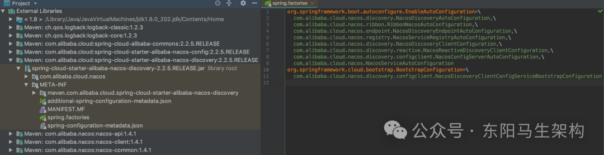

Nacos服务注册自动配置类NacosServiceRegistryAutoConfiguration如下，该配置类创建了三个Bean。

第一个Bean：NacosServiceRegistry

这个Bean在创建时，会传入加载了yml配置文件内容的类NacosDiscoveryProperties。

第二个Bean：NacosRegistration

这个Bean在创建时，会传入加载了yml配置文件内容的类NacosDiscoveryProperties。

第三个Bean：NacosAutoServiceRegistration

这个Bean在创建时，会传入NacosServiceRegistry和NacosRegistration两个Bean。然后该Bean继承了AbstractAutoServiceRegistration抽象类。该抽象类实现了ApplicationListener接口，所以项目启动时便是利用了Spring的监听事件来实现自动注册服务的。因为在Spring容器启动的最后会执行finishRefresh()方法，然后会发布一个事件，该事件会触发调用onApplicationEvent()方法。

调用AbstractAutoServiceRegistration的onApplicationEvent()方法时，首先会调用AbstractAutoServiceRegistration的bind()方法，然后调用AbstractAutoServiceRegistration的start()方法，接着调用AbstractAutoServiceRegistration的register()方法发起注册，也就是调用this.serviceRegistry的register()方法完成服务注册的具体工作。

其中，AbstractAutoServiceRegistration的serviceRegistry属性，是在服务注册自动配置类NacosServiceRegistryAutoConfiguration，创建第三个Bean—NacosAutoServiceRegistration时，通过传入其创建的第一个Bean—NacosServiceRegistry进行赋值的。

Nacos客户端项目启动时自动触发服务实例注册的流程总结：Spring监听器调用onApplicationEvent()方法 -> bind()方法 -> start()方法 -> register()方法，最后register()方法会调用serviceRegistry属性的register()方法进行注册。

整个流程具体来说就是：首先通过spring.factories文件，找到一个注册相关的Configuration配置类，这个配置类里面定义了三个Bean对象。创建第三个Bean对象时，需要第一个、第二个Bean对象作为参数传进去。第一个Bean对象里面就有真正进行服务注册的register()方法，并且第一个Bean对象会赋值给第三个Bean对象中的serviceRegistry属性。在第三个Bean对象的父类会实现Spring的监听器方法。所以在Spring容器启动时会发布监听事件，从而触发执行Nacos注册逻辑。

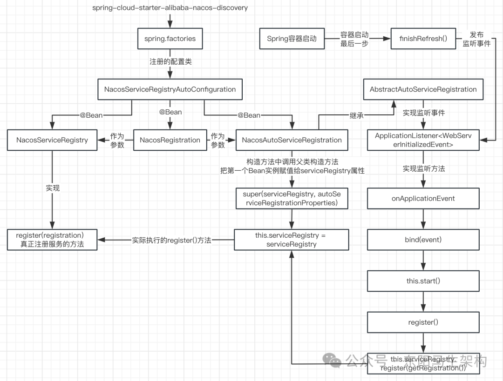

### (2)Nacos客户端通过什么方式注册服务

项目启动时是通过NacosServiceRegistry的register()方法发起服务注册的，然后会调用NacosNamingService的registerInstance()方法注册服务实例，接着调用NamingProxy的registerService()方法组装参数发起服务注册请求，接着调用NamingProxy的reqApi()方法向Nacos服务端发起服务注册请求，也就是调用NamingProxy的callServer()方法向Nacos服务端发送注册请求。

在NamingProxy的callServer()方法中，首先会调用NacosRestTemplate的exchangeForm()方法发起HTTP请求，然后会调用this.requestClient()的execute()方法执行HTTP请求的发送，接着会调用DefaultHttpClientRequest的execute()方法处理请求的发送，也就是通过Apache的CloseableHttpClient组件来处理发送HTTP请求。

注意：NacosServiceRegistry是属于nacos-discovery包中的类，NacosNamingService是属于nacos-client包中的类。

由此可知：Nacos客户端是通过HTTP的方式往Nacos服务端发起服务注册的，Nacos服务端会提供服务注册的API接口给Nacos客户端进行HTTP调用，Nacos官方Open API文档中注册服务实例的接口说明如下：

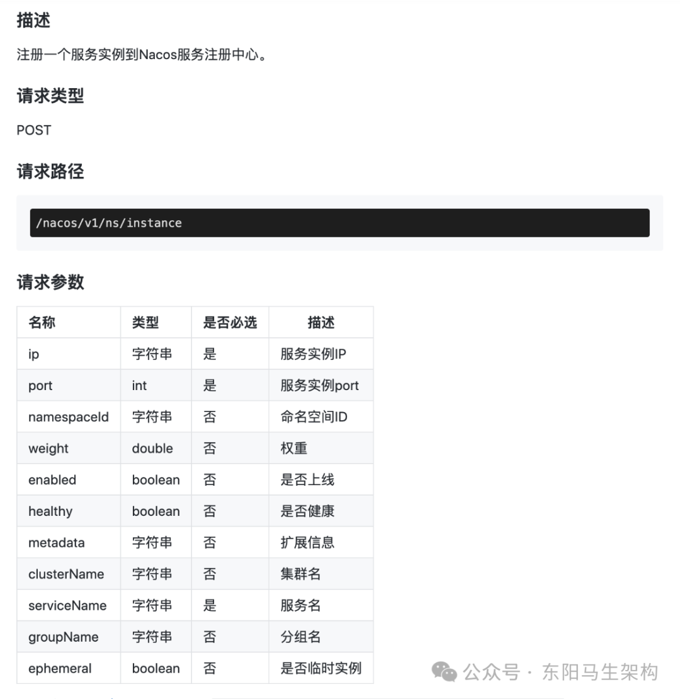

### (3)Nacos客户端如何发送服务心跳

调用NacosNamingService的registerInstance()方法注册服务实例时，在调用NamingProxy的registerService()方法来注册服务实例之前，会根据注册的服务实例是临时实例来构建和添加心跳信息到beatReactor，也就是调用BeatReactor的buildBeatInfo()方法和addBeatInfo()方法。

在BeatReactor的buildBeatInfo()方法中，会通过beatInfo的setPeriod()方法设置心跳间隔时间，默认是5秒。

在BeatReactor的addBeatInfo()方法中，倒数第二行会开启一个延时执行的任务，执行的任务是根据心跳信息BeatInfo封装的BeatTask。该BeatTask任务会交给BeatReactor的ScheduledExecutorService来执行，并通过beatInfo的getPeriod()方法获取延时执行的时间为5秒。

在BeatTask的run()方法中，就会调用NamingProxy的sendBeat()方法发送心跳请求给Nacos服务端，也就是调用NamingProxy的reqApi()方法向Nacos服务端发起心跳请求。如果返回的心跳响应表明服务实例不存在则重新发起服务实例注册请求。无论心跳响应如何，继续根据心跳信息BeatInfo封装一个BeatTask任务，然后将该任务交给线程池ScheduledExecutorService来延时5秒执行。

由此可见，在客户端在发起服务注册期间，会开启一个心跳健康检查的延时任务，这个任务每间隔5s执行一次。任务内容就是通过HTTP请求调用发送Nacos提供的服务实例心跳接口。Nacos官方Open API文档中服务实例心跳接口说明如下：

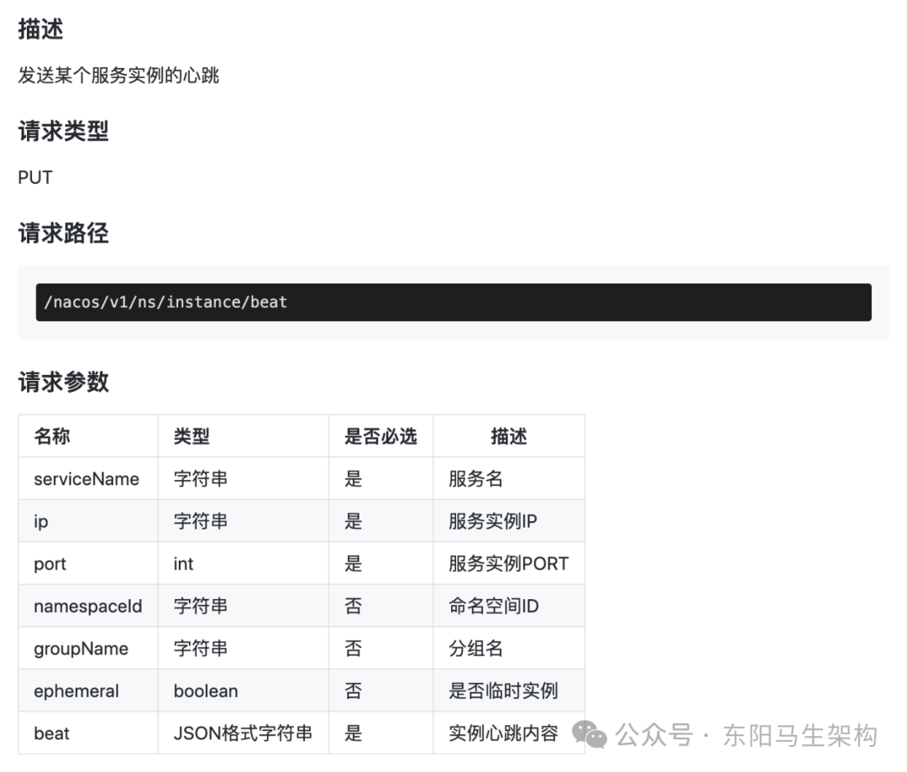

如下是客户端发起服务注册 + 发送服务心跳的整个流程图：

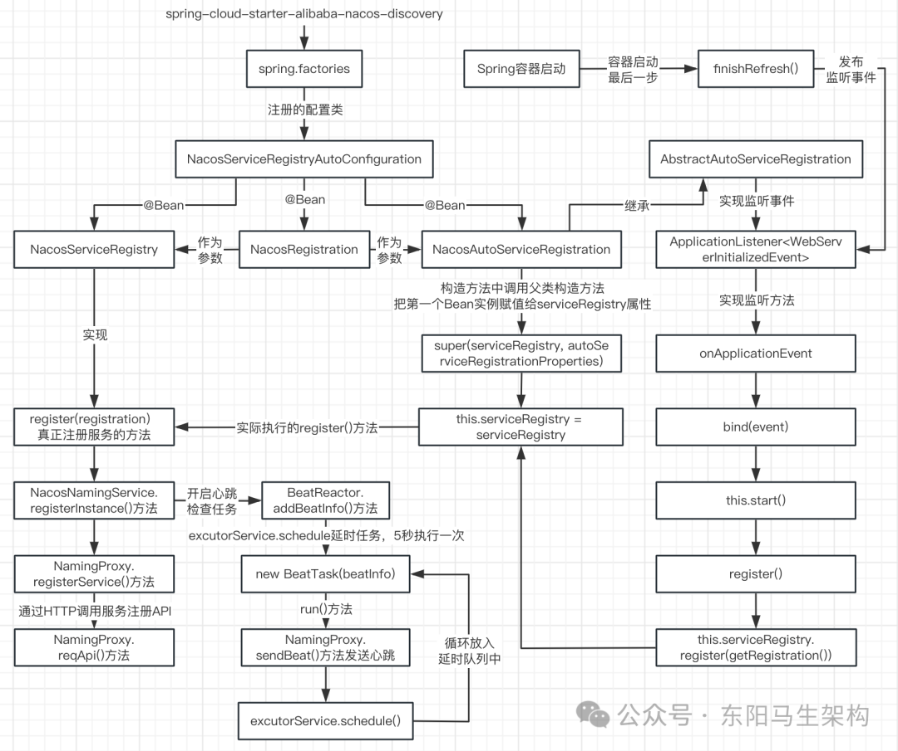

## 2.服务端如何处理客户端的服务注册请求

### (1)客户端自动发送服务注册请求梳理

首先，从spring-cloud-starter-alibaba-nacos-discovery中，发现在spring.factories文件定义了很多Configuration配置类，其中就包括了NacosServiceRegistryAutoConfiguration配置类。这个配置类会创建三个Bean对象，其中有个Bean对象便实现了一个监听事件方法。

然后，Spring容器启动时，会发布一个事件。这个事件会被名为NacosAutoServiceRegistration的Bean对象监听到，从而自动发起Nacos服务注册。在注册时会开启心跳健康延时任务，每隔5s执行一次。不管是服务注册还是心跳检查，都是通过HTTP方式调用Nacos服务端。

客户端向服务端发起服务注册请求是通过HTTP接口"/nacos/v1/ns/instance"来实现的，客户端向服务端发起心跳请求是通过HTTP接口"/nacos/v1/ns/instance/beat"来实现的。

### (2)Nacos服务端处理服务注册请求的代码入口

Nacos服务端有一个叫nacos-naming的模块，这个nacos-naming模块其实就是一个Spring Boot项目，模块中的controllers包则是用来处理服务相关的HTTP请求。

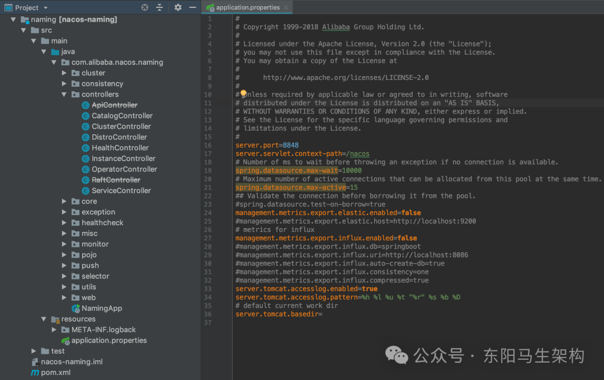

由于服务端处理服务注册请求的地址是"/nacos/v1/ns/instance"，所以对服务实例进行处理的入口是controllers包下的InstanceController。InstanceController的代码很好地遵守了Restful风格，其中的regsiter()方法注册新服务实例对应@PostMapping、deregister()方法注销服务实例对应@DeleteMapping、update()方法修改服务实例对应@PutMapping。虽然都可以使用@PostMapping，但Nacos就严格按照了Restful标准。

### (3)Nacos服务端处理服务注册请求的实现分析

对于Nacos客户端的服务实例注册请求，会由InstanceController的register()方法进行处理。该方法首先会从请求参数中获取Instance服务实例，然后调用ServiceManager的registerInstance()方法来进行服务实例注册。ServiceManager是Nacos的服务管理者，拥有所有的服务列表，可以通过它来管理所有服务的注册、销毁、修改等。

在ServiceManager的registerInstance()方法中：首先会通过调用ServiceManager的createEmptyService()方法创建一个空服务，然后通过ServiceManager的addInstance()方法添加注册请求中的服务实例。

在ServiceManager的addInstance()方法中：首先构建出要注册的服务实例对应的服务的key，然后使用synchronized锁住要注册的服务实例对应的服务，接着获取要注册的服务实例对应的服务的最新服务实例列表，最后执行DelegateConsistencyServiceImpl的put()方法更新服务实例列表。

DelegateConsistencyServiceImpl的put()方法更新服务实例列表存储时：首先会根据表示服务的key来选择不同的ConsistencyService。如果是临时服务实例，则调用DistroConsistencyServiceImpl的put()方法。如果是持久化服务实例，则调用PersistentConsistencyServiceDelegateImpl的put()方法。

在DistroConsistencyServiceImpl的put()方法中：首先会调用DistroConsistencyServiceImpl的onPut()方法，把包含当前注册的服务实例的、最新服务实例列表存储到DataStore中，然后调用DistroProtocol的sync()方法进行集群节点间的服务实例数据同步，其中DataStore用于存储所有已注册的服务实例数据。

而在DistroConsistencyServiceImpl的onPut()方法中：会先创建Datum对象，注入服务key和服务的所有服务实例Instances，然后才将Datum对象添加到DataStore的Map对象里。最后调用Notifier的addTask()方法添加一个数据变更的任务，也就是把key、action封装成Pair对象，放入一个Notifier的阻塞队列中。

注意：在DistroConsistencyServiceImpl初始化完成后，会提交一个进行无限for循环的任务给一个单线程的线程池来执行。无限for循环中会不断从阻塞队列中获取Pair对象进行处理。而在进行服务实例注册时，会往该任务的阻塞队列添加Pair对象。

### (4)服务端接收到服务实例注册请求后的处理总结

register()注册方法会先从Request对象中获取从客户端传过来的参数，然后在addInstance()方法中会创建一个可以表示服务的key，接着调用DelegateConsistencyServiceImpl的put()方法，根据这个key可以选择具体的ConsistencyService实现类。

在这个put()方法中，通过key选择的是EphemeralConsistencyService，所以会调用DistroConsistencyServiceImpl的put()方法处理服务实例列表。

在DistroConsistencyServiceImpl的put()方法中又调用了onPut()方法，即把key、Instances封装成Datum对象，放入到DataStore的Map里。最后调用addTask()方法，将本次服务实例数据的变更包装成Pair对象，然后放入到一个阻塞队列里，由一个执行无限for循环的线程处理队列。

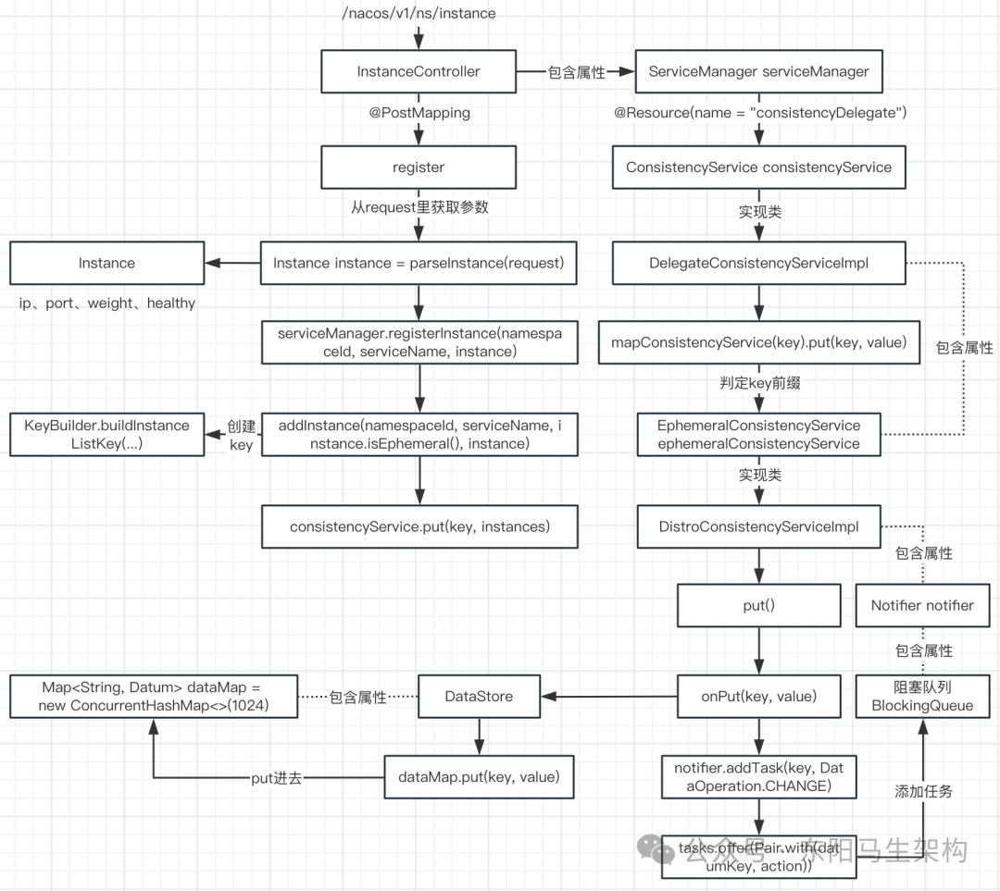

## 3.注册服务—如何实现高并发支撑上百万服务注册

### (1)服务端处理客户端的服务注册请求梳理

Nacos客户端自动注册服务实例时，会通过HTTP的方式，请求"/nacos/v1/ns/instance"地址来调用Nacos服务端的实例注册接口。通过该地址可以找到Nacos服务端naming模块的InstanceController类。在这个类中有个register()方法，它就是服务端处理服务注册请求的入口。在这个register()方法的最后，会调用Notifier的addTask()方法，也就是把key、action包装成Pair对象，放入到一个BlockingQueue里。至此，InstanceController类中register()方法的注册逻辑就执行完了。

### (2)Nacos的异步任务设计思想

#### 一.Nacos服务实例注册的压测性能

参考服务发现性能测试报告。通过对3节点的集群进行服务发现性能压测，可得到接口性能负载和容量。压测容量服务数可达60W，实例注册数达110W，集群运行持续稳定。注册/查询实例TPS达到13000以上，接口达到预期。

#### 二.Nacos服务端添加和处理异步任务的流程

首先客户端发起服务实例注册，服务端把接收的参数包装成一个Pair对象，最后放入到一个BlookingQueue里。这时对服务实例注册接口的处理已结束，服务端返回客户端响应消息了。

然后Nacos服务端会在后台开启一个单线程异步任务，这个任务会不断地获取BlookingQueue队列中的Pair对象。从这个队列获取出Pair对象后，会把信息写入注册表，从而完成服务注册。

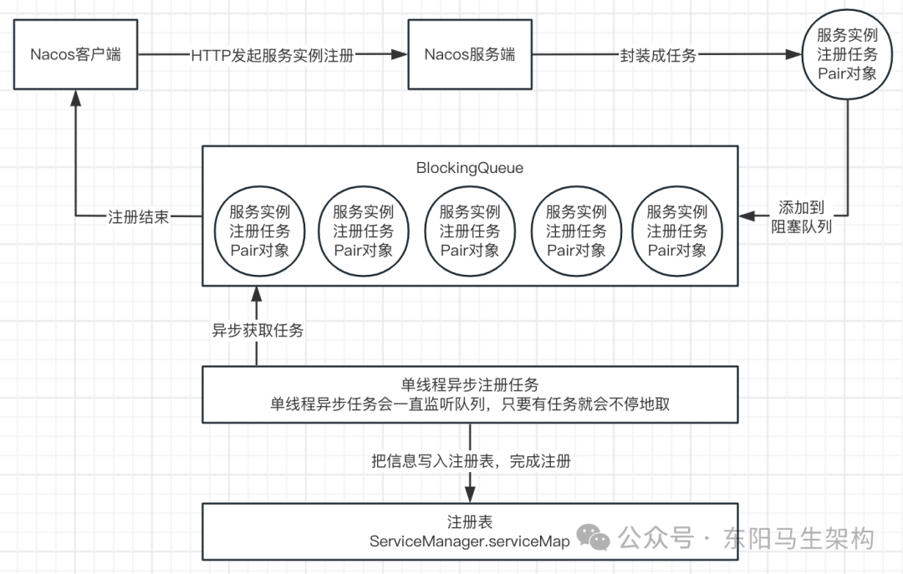

#### 三.Nacos采用异步任务来处理服务注册的好处—支撑高并发

好处一：接口响应时效更快

其实Nacos服务端处理服务实例注册的接口，并没有执行真正注册的动作。只是把信息包装好，放入到队列中，接口就结束返回响应给客户端了。由于代码逻辑非常简单，所以响应时效会更快。

好处二：保证服务稳定性

哪怕同时有1千个、1万个客户端同时发起实例注册请求接口，最后只是把服务实例注册任务放入到一个阻塞队列中。这就相当于使用消息队列进行流量削峰一样，后续复杂的处理逻辑，由消费者慢慢处理，异步任务就相当于消费者。

好处三：解决写时并发冲突

Nacos服务端，只有一个单线程在处理队列中的任务。也就是把阻塞队列中的服务实例注册信息，同步到Nacos的注册表中。既然是单线程进行写操作，所以就不用考虑多线程并发写的问题。虽然只会有一个线程在进行写，但是可能会有其他线程在进行读。所以会存在读写并发冲突，此时Nacos会使用写时复制策略来处理。

### (3)异步任务和内存队列分析

#### 一.异步任务的初始化和处理流程

在创建DistroConsistencyServiceImpl类实例时，会直接创建一个实现了Runnable接口的Notifier类实例。

在DistroConsistencyServiceImpl类中有个init()方法。由于这个init()方法上加了@PostConstruct注解，所以在Spring创建这个类实例时会自动调用这个init()方法。init()方法会提交这个实现了Runnable接口的Notifier任务给线程池运行。

而在Notifier类的run()方法中，会通过无限for循环不断从tasks阻塞队列中获取任务来进行处理。获取出任务后，如果判断出action类型为CHANGE类型，则先把Instances对象从DataStore类中取出来，再调用listener的onChange()方法来将服务实例信息写入到注册表中。

#### 二.关于无限for循环的问题

无限循环是否合理、是否会占用CPU资源、如果异常是否会导致循环结束？

因为Nacos服务端要一直处理Nacos客户端所发起的服务实例注册请求，而Nacos服务端它是不知道到底有多少个客户端需要进行服务注册的，所以只能写一个无限for循环一直不断重复地去执行。

既然是无限循环，就要考虑是否占用CPU资源的问题。tasks是一个阻塞队列BlockingQueue：第一.阻塞队列的特点就是不会占用CPU的资源，第二.tasks的take()方法会一直阻塞直到取得元素或当前线程中断。

在处理过程中，如果抛出未知异常，会直接被for循环中的try catch掉，继续循环处理下一个任务。

总结：异步任务是提升性能的一种方式。很多开源框架为了提升自身处理性能，都会采利用异步任务 + 内存队列。

## 4.内存注册表—如何处理注册表的高并发读写冲突

### (1)服务实例注册的客户端和服务端实现梳理

#### 一.客户端发起服务注册的实现梳理

订单服务、库存服务的项目引入nacos-discovery服务注册中心依赖后，当项目启动时，就会扫描到依赖中的spring.factories文件，然后去创建spring.factories文件中定义的配置类。

在spring.factories文件中：有一个名为NacosServiceRegistryAutoConfiguration配置类，在这个配置类定义了三个Bean对象：NacosServiceRegistry、NacosRegistration和NacosAutoServiceRegistration。

NacosAutoServiceRegistration类的父类实现了ApplicationListener接口，也就是实现了onApplicationEvent()这个监听事件方法。当Spring容器启动时，会发布WebServerInitializedEvent监听事件，从而被Nacos客户端即NacosAutoServiceRegistration的监听方法监听到。

这个监听事件方法会调用NacosServiceRegistry类中的register()方法，register()方法又会调用Nacos服务端实例注册的HTTP接口完成服务注册。

在发起服务实例注册接口的调用前，客户端还会开启一个BeatTask任务，这个BeatTask任务会每隔5秒向Nacos服务端发送心跳检查请求。

#### 二.服务端处理服务注册的实现梳理

Nacos服务端处理服务注册的HTTP接口是：/nacos/v1/ns/instance。由于Nacos服务端也是个Spring Boot项目，所以通过架构图找到Nacos源码的naming模块，然后就可以通过请求地址定位到InstanceController类。

在InstanceController类中会有对应HTTP接口的register()方法，该方法最终会把客户端的实例对象包装成Datum对象放入DataStore类中，然后再包装一个Pair对象，放入Notifier的tasks内存阻塞队列。

DistroConsistencyServiceImpl中有个@PostConstruct修饰的init()方法。在该类被实例化后，这个init()方法会把一个Notifier任务提交给一个线程池执行。

Notifier的run()方法，首先会不断循环从tasks阻塞队列中获取Pair对象，然后调用Notifier的handle()方法把Instances对象从DataStore类中取出来，接着调用listener.onChange()方法把服务实例数据写入到注册表中。

### (2)Nacos注册表结构

#### 一.Nacos注册表的使用

在ServiceManager类中有一个serviceMap属性，它就是Nacos的内存注册表，Nacos注册表就是用来存放微服务实例注册信息的地方。客户端在调用其他微服务时，会先调用Nacos查询实例列表接口，查询当前可用服务，从而发起微服务调用。

#### 二.Nacos注册表的结构分析

ServiceManager的serviceMap属性，即注册表结构由两层Map组合而成。也就是：Map(namespace, Map(group::serviceName, Service))。

Nacos支持对服务进行分类，最上层是一个命名空间Namespace。命名空间Namespace默认是public，也可以自定义为dev、test等。

在public命名空间下，可以包含不同的分组Group。比如定义两个分组Group：DEFAULT_GROUP_1、DEFAULT_GROUP_2。这样命名空间Namespace和分组Group就对应注册表最外层的两个Map。

在ServiceManager.serviceMap的内层Map中，其value是个Service对象。在Service类中，有一个clusterMap属性。clusterMap的key是对应的集群名字，如北京集群、广州集群等。clusterMap的value是个Cluster对象，用来存放某集群下的所有实例对象。

在Cluster类中，存在两个不同实例类型的Set集合，这两个集合就会存储具体的Instance实例对象，Instance实例对象里会包含实例的IP、Port等信息。

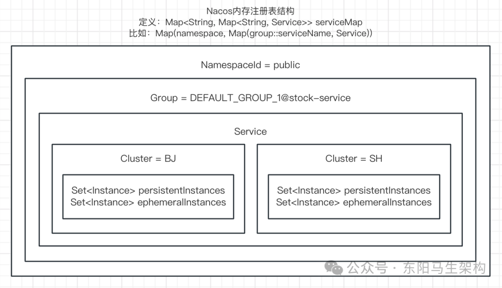

#### 三.Nacos注册表的设计原因

之所以Nacos要这么设计注册表，那是为了灵活应对不同的使用场景。如果项目简单，测试、预发、生产不同环境都使用同一个Nacos服务端，那么可以通过命名空间来区分。

如果项目复杂，不同环境使用不同的Nacos服务端，那么可以通过命名空间来区分不同的模块。而订单模块下可以细分很多微服务，然后通过分组来区分不同的环境。包括在Service对象里，同一个服务也可能在多个地区都有部署。比如北京服务器部署2台、广州服务器部署2台等。

### (3)写时复制机制介绍

Nacos服务端把新注册的实例写入到注册表中，用的就是写时复制机制。写时复制机制，能够很好地避免读写并发冲突。

写时复制：Copy On Write。在数据写入到某存储位置时，首先将原有内容拷贝出来，写到另一处地方，然后再将原来的引用地址修改成新对象的地址。

下面展示了一个并发冲突的例子：

```typescript
public static void main(String[] args) {
    //假设objectSet是用来存放实例信息
    Set<Object> objectSet = new HashSet<>();

    //模拟异步任务，写入数据
    new Thread(new Runnable() {
        @Override
        public void run() {
            try {
                //先睡眠一下，否则还没开始读，就已经写完了
                Thread.sleep(100L);
            } catch (InterruptedException e) {
                e.printStackTrace();
            }
            //写入10w条数据
            for (int i = 0; i < 100000; i++) {
                objectSet.add(i);
            }
        }
    }).start();

    //死循环一直读取数据，模拟高并发场景
    for (; ;) {
        for (Object o : objectSet) {
            System.out.println(o);
        }
    }
}
```

运行上面的代码就会抛出如下异常信息：

```cpp
Exception in thread "main" java.util.ConcurrentModificationException
```

意思是在对集合迭代、读取时，如果同时对其进行修改，就会抛出ConcurrentModificationException异常。

这时候就可以采用写时复制来避免这个问题。先创建一个复制对象，把原来的数据复制一份到该复制对象上。然后在复制对象上进行新增、修改的操作，这时是不会影响原来数据的。等到在复制对象上进行的操作完成之后，再把原来对象的引用地址直接修改为复制对象的引用。

### (4)Nacos服务注册写入注册表实现分析

在执行Notifier的handle()方法时，核心的代码是：

```cs
//把Instances信息写到注册表里去
listener.onChange(datumKey, dataStore.get(datumKey).value);
```

dataStore.get(datumKey).value就是从DataStore中获取Instances对象。listener.onChange()其实就是调用Service的onChange()方法更新注册表。

因为在注册某个服务的第一个实例时，创建的服务Service会作为Listener添加到ConsistencyService的listeners，并且已经将新创建的服务Service放入到了ServiceManager的注册表中了。所以线程池执行Notifier的handle()方法时，就能遍历所有Service进行更新。

其实注册表serviceMap只是存放了Service对象的引用，而ConsistencyService的listeners也存放了Service对象的引用。当遍历ConsistencyService的listeners，执行Service.onChange()方法时，更新的就是JVM在堆内存中的Service实例对象，也就更新了注册表。因为注册表是一个Map，最终都是引用到对内存中的Service实例对象。

Service的onChange()方法需要传入两个参数：参数一是key，这个key是由KeyBuilder的buildInstanceListKey()代码创建出来的。参数二是Instances，里面有个InstanceList属性，可以存放多个Instance实例对象。实际上Instances参数可能会包含之前多个已经注册的Instance实例信息，并且一定会包含当前新注册的Instance实例信息。

Service的onChange()方法，最后会调用Service的updateIPs()方法。Service的updateIPs()方法又会调用Cluster的updateIps()方法，会把新注册的Instance更新到Cluster对象实例中。

在Cluster的updateIps()方法中，便会通过写时复制机制来更新实例Set。如果不用写时复制，那么就会并发读写同一个Set对象。如果使用写时复制，那么同一时间的读和写都是不同的Set对象。即使用新对象替换旧对象那一刻还有线程没迭代读完旧对象，也不影响。因为没有迭代读完旧对象的线程继续进行迭代读，替换的只是对象引用。ephemeralInstances变量只是引用了Set对象的地址而已。这里说的替换，只是让ephemeralInstances变量引用另外Set对象的地址。

从中可以看出，全程都没有对之前注册表中的数据进行操作。而是先拿出来，最后直接把新的数据替换过去，这样就完成了注册表修改。从而避免了对Set的并发读写冲突。

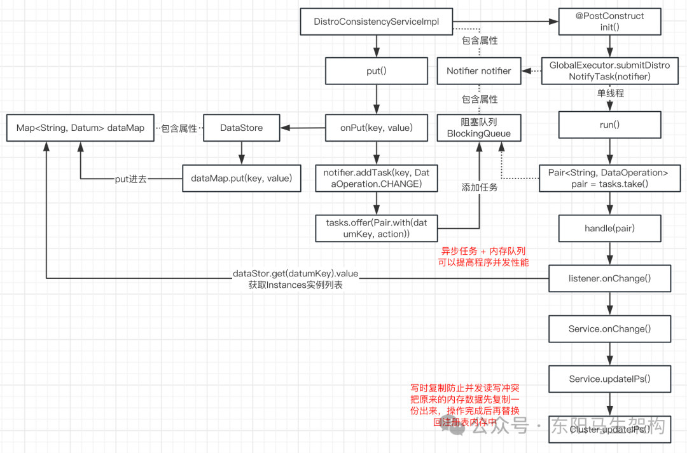

## 5.服务发现—服务之间的调用请求链路分析

### (1)微服务通过Nacos完成服务调用的请求流程

按照Nacos使用简介里的案例：订单服务和库存服务完成Nacos注册后，会通过Feign来完成服务间的调用。如下图示：

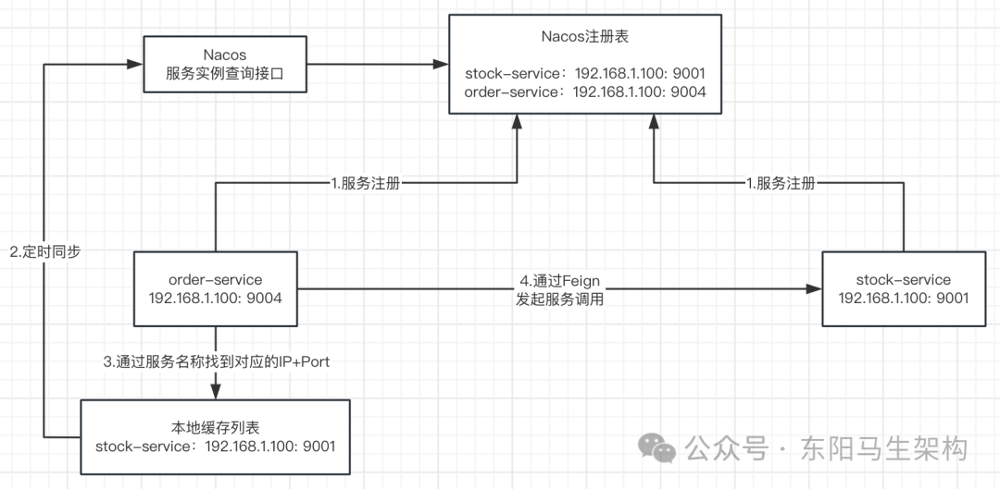

步骤一：首先每个客户端都会有一个微服务本地缓存列表，这个缓存列表会定时从注册中心获取最新的列表来更新本地缓存。

步骤二：然后当order-service需要调用stock-service时，order-service会先根据服务名称去本地缓存列表中找对应的微服务实例。但通过服务名称可能会找到多个，所以需要负载均衡选择其中一个。

步骤三：最后把服务名称更换为IP + Port，通过Feign发起HTTP调用获取返回结果。

### (2)Nacos客户端进行服务发现的实现

#### 一.nacos-discovery通过引入Ribbon实现服务调用时的负载均衡

Nacos客户端就是引入了nacos-discovery + nacos-client依赖的项目。由于nacos-discovery整合了Ribbon，所以Ribbon可以调用Nacos服务端的服务实例查询列表接口。于是Nacos客户端便借助Ribbon实现了服务调用时的负载均衡，即Ribbon会从服务实例列表中选择一个服务实例给客户端进行服务调用。

在nacos-discovery的pom.xml中，可以看到它引入了Ribbon依赖：

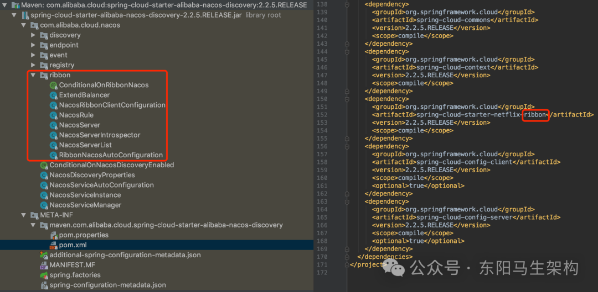

#### 二.nacos-discovery如何整合Ribbon实现服务调用时的负载均衡

在Ribbon中会有一个ServerList接口，如下所示：这就是一个扩展接口，这个接口的作用就是获取Server列表。然后nacos-discovery会针对这个接口进行实现，从而整合Ribbon。从引入的包来看：loadbalancer是属于Ribbon源码包下的，而LoadBalancer则是Ribbon中的负载均衡器。负载均衡器会结合IRule负载均衡策略，从服务实例列表中选择一个实例。

当Nacos客户端进行微服务调用时，会通过Ribbon来选出一个微服务实例。也就是Ribbon会通过调用NacosServerList的getUpdatedListOfServers()方法选出一个微服务实例。

nacos-discovery的NacosServerList类继承了AbstractServerList类，而且实现了Ribbon的ServerList接口的两个方法。

NacosServerList的核心方法是NacosServerList的getServers()方法，因为nacos-discovery实现Ribbon的两个接口都调用到了该方法。

在nacos-discovery的NacosServerList的getServers()方法中，会调用nacos-client的NacosNamingService的selectInstances()方法，来获取服务实例列表。

#### 三.nacos-client如何进行服务发现

在nacos-client的NacosNamingService的selectInstances()方法中：首先会调用HostReactor的getServiceInfo()方法获取服务实例列表，然后调用HostReactor的getServiceInfo0()方法尝试从本地缓存获取，接着调用HostReactor的updateServiceNow()方法查询并更新缓存，也就是调用HostReactor的updateService()方法查询并更新缓存。即先调用NamingProxy的queryList()方法来查询服务端的服务实例列表，再调用HostReactor的processServiceJson()方法更新本地缓存。最后调用HostReactor的scheduleUpdateIfAbsent()方法提交同步缓存任务。

所以nacos-client的HostReactor的getServiceInfo()方法是服务发现的核心，它会先到本地缓存中去查询对应的服务实例列表。如果本地缓存查不到对应的服务数据，则到服务端去查询服务实例列表。当获取完服务实例列表后，会向调度线程池提交一个延迟执行的任务，在延迟任务中会执行UpdateTask任务的run()方法。

UpdateTask任务的run()方法：会调用updateService()方法查询服务实例列表并更新本地缓存。当该任务执行完毕时，会继续向调度线程池提交一个延迟执行的任务，从而实现不断重复地更新本地缓存的服务实例列表。

### (3)Nacos服务端进行服务实例查询的实现

由于Nacos客户端向服务端发起查询服务实例列表的请求时，调用的是HTTP下的"/nacos/v1/ns/instance/list"接口，所以Nacos服务端处理该请求的入口是InstanceController的list()方法。

### (4)总结

#### 一.微服务之间进行调用时获取微服务列表的流程

每一个客户端本地都会缓存微服务列表。在客户端发起请求前，会通过微服务名称找到对应的微服务列表，最终选举一台被调用的实例对象，进行HTTP调用。而且本地缓存列表会有一个定时任务，及时对微服务列表进行更新。

#### 二.Nacos客户端进行服务发现的实现

首先Nacos客户端指引入了nacos-discovery + nacos-client依赖的项目，其中nacos-discovery会整合Ribbon。

Nacos客户端在微服务调用前，会向Nacos服务端发起服务列表查询请求，然后把请求结果缓存本地，同时会不断开启延迟执行任务维护本地缓存。而Nacos服务端查询服务实例列表的接口，会从内存注册表中获取数据。

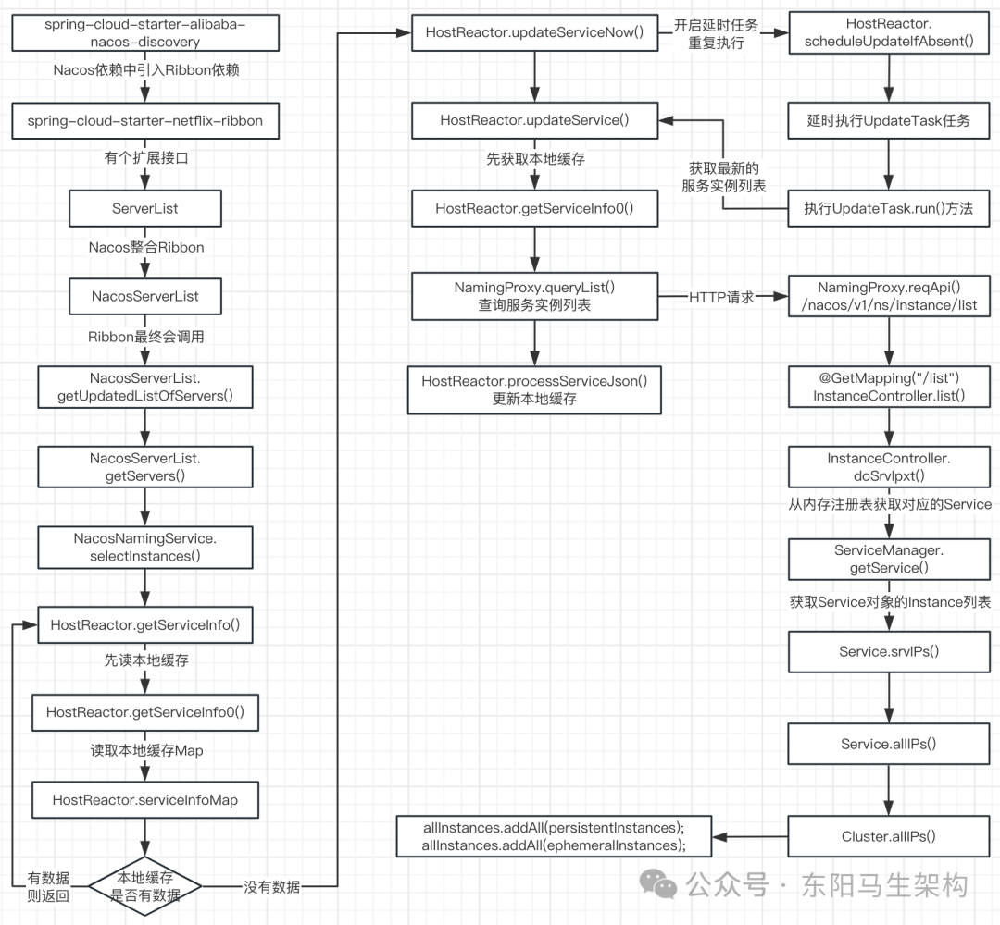

## 6.服务端如何维护不健康的微服务实例

### (1)Nacos服务管理的心跳机制

Nacos客户端发起服务实例注册时，会开启一个发送心跳任务。该任务会每隔5s调用一次服务端的实例心跳接口，告诉服务端它还活着。服务端接收到实例心跳接口的请求后，先通过IP + Port找到对应Instance。然后把Instance对象的lastBeat属性修改成当前最新的时间，再返回响应。

当服务端接收到客户端的服务注册请求时，也会开启一个健康检查任务。这个任务就是专门用来判断Instance状态是否可用的，也就是对比每一个Instance的lastBeat属性和当前时间。如果lastBeat超过当前时间15s，表示实例状态不健康。如果lastBeat超过当前时间30s，Nacos则会自动把该实例进行删除。

### (2)服务端处理心跳请求的实现

#### 一.客户端发送心跳请求的实现

调用NacosNamingService的registerInstance()方法注册服务实例时，在调用NamingProxy的registerService()方法来注册服务实例之前，会根据注册的服务实例是临时实例来构建和添加心跳信息到beatReactor，也就是调用BeatReactor的buildBeatInfo()和addBeatInfo()方法。

在BeatReactor的buildBeatInfo()方法中，会通过BeatInfo的setPeriod()方法设置心跳间隔时间，默认是5秒。

在BeatReactor的addBeatInfo()方法中，倒数第二行会开启一个延时执行的任务。执行的任务是根据心跳信息BeatInfo封装的BeatTask。该BeatTask任务会交给BeatReactor的ScheduledExecutorService来执行，并通过BeatInfo的getPeriod()方法获取延时执行的时间为5秒。

在BeatTask的run()方法中，就会调用NamingProxy的sendBeat()方法发送心跳请求给Nacos服务端，也就是调用NamingProxy的reqApi()方法向Nacos服务端发起心跳请求。如果返回的心跳响应表明服务实例不存在，则重新发起服务实例注册请求。无论心跳响应如何，继续根据心跳信息BeatInfo封装一个BeatTask任务，然后将该任务交给线程池ScheduledExecutorService来延时5秒执行。

由此可见，在客户端在发起服务注册期间，会开启一个心跳健康检查的延时任务，这个任务每间隔5s执行一次。任务内容就是通过HTTP请求调用发送Nacos提供的服务实例心跳接口。

#### 二.服务端处理心跳请求的实现

服务端的InstanceController的beat()方法，会处理客户端发来的心跳请求。首先会尝试从ServiceManager的注册表中获取对应的Instance实例对象。如果在内存注册表中找不到对应的Instance实例对象，则直接调用ServiceManager的registerInstance()方法进行服务注册。

如果在内存注册表中可以找到对应的Instance实例对象，那么就从ServiceManager的注册表中取出对应的Service服务对象，这样后续对Service的Cluster的Instance进行修改时，就会修改到注册表数据。接着执行Service的processClientBeat()方法，该方法会提交一个异步任务ClientBeatProcessor给线程池，其中线程池的线程数是可用线程数的一半。

在ClientBeatProcessor的run()方法中：会先通过集群名找到所有的临时实例列表。然后通过for循环对这些临时实例进行IP + Port判断，找出对应的Instance实例对象。找出对应的Instance后，接着把Instance的lastBeat属性修改成当前时间。然后判断当前Instance的状态是否不健康，若是则重新标记成健康状态。

#### 三.服务端处理心跳请求总结

首先通过请求参数，在ServiceManager的内存注册表中找Instance对象。如果找不到对应的Instance对象，那么会重新进行服务注册。如果找到对应的Instance对象，则继续从ServiceManager的内存注册表中找出对应的Service对象，然后通过Service对象提交一个ClientBeatProcessor异步任务。

在这个异步任务中，会找到相同集群下的所有临时实例。然后通过for循环，并根据IP + Port来找到对应的Instance实例对象。接着修改Instance实例对象的lastBeat属性为当前时间，并且判断Instance实例对象是否健康，如果不健康则重新标记为健康状态。

对于健康的客户端实例，每5s会定时发送实例心跳请求。对于不健康的客户端实例，则不会每5s发送实例心跳请求。所以对于不健康的服务实例，Nacos是如何感知和处理的？

### (3)服务端定时检查心跳是否健康的实现

#### 一.Service服务被创建时的处理流程

#### 二.异步任务ClientBeatCheckTask的run()方法的核心逻辑

#### 一.Service服务被创建时的处理流程

ServiceManager的registerInstance()方法处理服务注册请求时，会调用ServiceManager的createEmptyService()方法看是否需要创建服务。

在ServiceManager的createEmptyService()方法中，如果需要创建一个新的服务Service，则会先new一个Service对象，然后调用ServiceManager的putServiceAndInit()方法。

ServiceManager的putServiceAndInit()方法会将新的Service放入注册表，然后调用Service的init()方法提交一个异步任务ClientBeatCheckTask到线程池，其中线程池的线程数是可用线程数的一半。

#### 二.异步任务ClientBeatCheckTask的run()方法的核心逻辑

ClientBeatCheckTask的run()方法的作用就是进行服务实例的健康检查。即检查哪些客户端服务实例是不健康的，如果不健康就对它进行处理。

第一个循环的主要作用是：找出哪些Instance服务实例是不健康的。如果不健康就需要把Instance实例的healthy属性更改为false，而判断不健康的依据就是Instance实例的lastBeat属性。如果是健康的，则客户端每5s会发送一次心跳请求更新lastBeat属性。如果是不健康的，那么lastBeat属性是不会变化的。一旦超过15s还没变化，这个Instance就会被定时任务标记为不健康。

第二个循环的主要作用是：找出哪些Instance是可以删除的。Instance服务实例可以被删除的依据还是lastBeat属性，一旦超过30s没更新lastBeat属性，定时任务则会把该Instance删除掉。

### (4)Nacos维护微服务实例的健康状态总结

Nacos客户端会有一个心跳任务，每隔5s会给Nacos服务端发送心跳，Nacos服务端会根据心跳时间修改对应Instance实例的lastBeat属性。

并且Nacos服务端在注册一个服务实例时，会按Service服务维度提交一个心跳健康检查任务给线程池定时执行。把超过15s没有心跳的Instance微服务实例设置为不健康状态，把超过30s没有心跳的Instance微服务实例直接从注册表中删除。

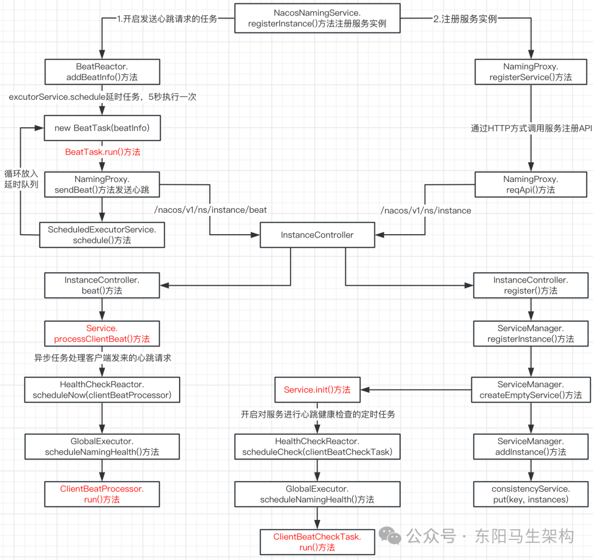

## 7.服务下线时涉及的处理

### (1)Nacos客户端服务下线的实现

Nacos客户端的Spring容器被销毁时，会通知Nacos服务端进行服务下线。首先会触发调用AbstractAutoServiceRegistration的destroy()方法。因为该类实现了Spring监听器，并且该方法被@PreDestroy注解修饰。@PreDestroy注解的作用是：Spring容器销毁时回调被该注解修饰的方法。

然后调用NacosServiceRegistry的deregister()方法 ->NamingService的deregisterInstance()方法 -> NamingProxy的deregisterService()方法，最后调用NamingProxy的reqApi()方法向"/nacos/v1/ns/instance"接口发起删除请求。

### (2)Nacos服务端处理服务下线的实现

Nacos服务端处理服务下线的入口是InstanceController的deregister()方法，然后会调用ServiceManager的removeInstance()方法移除注册表里的实例，也就是调用ServiceManager的substractIpAddresses()方法。其中会传入remove参数执行ServiceManager的updateIpAddresses()方法，该方法的返回结果不会包含要删除的实例。

在ServiceManager的updateIpAddresses()方法中，判断入参action如果是remove，那么会把对应的Instance移除掉。但此时并不操作内存注册表，只是在返回的结果中删除对应的Instance实例。然后和注册逻辑一样，通过异步任务 + 内存队列的方式，去修改注册表。

### (3)Nacos服务端发送服务变动事件给客户端的实现

#### 一.处理服务注册或服务下线时让客户端感知的方案

Nacos客户端进行服务注册或服务下线时，其他Nacos客户端如何感知。

方案一：其他Nacos客户端在服务发现时通过定时任务去更新客户端本地缓存，但是这样做会有几秒钟的延迟。

方案二：当Nacos服务端的注册表发生了变动，服务端主动通知客户端。其实Nacos服务端在处理服务注册或服务下线时的最后逻辑是一样的。即在通过写时复制修改完注册表后，服务端会发布一个变动事件。然后通过UDP方式通知每一个客户端，从而让客户端更快感知服务变动。

#### 二.处理服务注册或服务下线时发布服务变动事件

服务注册或服务下线时，都会调用ConsistencyService的put()方法，将本次操作包装成Pair对象放入阻塞队列，然后由异步任务Notifier来处理阻塞队列中的Pair对象。

异步任务Notifier对阻塞队列中的Pair对象进行处理时，会调用Pair对象对应的Service服务的onChange()方法，而Service的onChange()方法又会调用Service的updateIPs()方法。

在Service的updateIPs()方法中：会先调用Cluster的updateIps()方法通过写时复制机制去修改注册表，然后调用PushService的serviceChanged()方法发布服务变动事件。

#### 三.监听服务变动事件并通过UDP发送通知给客户端

PushService的serviceChanged()方法发布服务变动事件。由于PushService实现了ApplicationListener，所以PushService的onApplicationEvent()方法会收到发布的服务变动事件，然后调用PushService的udpPush()方法通过UDP协议主动通知客户端。

总结：如果Nacos服务端的注册表发生变动，会通过UDP协议主动通知客户端。UDP协议比较轻量化，它无需建立连接就可以发送封装的IP数据包。虽然UDP协议下的传输不可靠，但是不可靠也没关系。因为每个客户端本地还有一个定时任务去更新本地实例列表缓存。

### (4)服务下线的处理总结

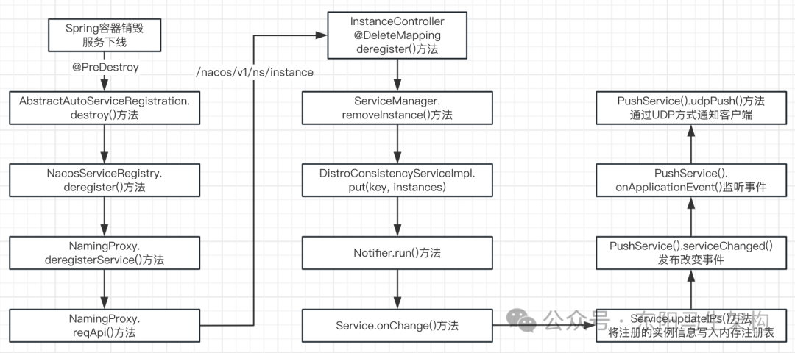

## 8.服务注册发现总结

#### 一.客户端

nacos-discovery利用了Spring的事件监听机制，在Spring容器启动时的调用Nacos服务端提供的服务实例注册接口。在调用服务实例注册接口时，客户端会开启一个异步任务来做发送心跳。

在客户端进行微服务调用时，nacos-discovery会整合Ribbon，然后查询Nacos服务端的服务实例列表来维护本地缓存，从而通过Ribbon实现服务调用时的负载均衡。

在关闭Spring容器时，会触发Nacos客户端销毁的方法，然后调用Nacos服务端的服务下线接口，从而完成服务下线流程。

#### 二.服务端

服务端的核心功能：服务注册、服务查询、服务下线、心跳健康。服务注册的实现要点：异步任务 + 内存阻塞队列、内存注册表、写时复制。

服务端也会开启心跳健康检查的定时任务来检查不健康的实例。如果发现Instance超过15秒没有心跳，则标记为不健康。如果发现Instance超过30秒没有心跳，则会直接删除。

进行服务查询时，是直接从内存注册表中获取Instance列表进行返回。
