# 面试准备之Nacos要点总结四

> **公众号**: 东阳马生架构  
> **发布时间**: 2025-11-14 09:00  

**大纲(12724字)**

- 1.Nacos 2.x版本的一些变化
- 2.客户端升级gRPC发起服务注册
- 3.服务端进行服务注册时的处理
- 4.客户端服务发现和服务端处理服务订阅的实现
- 5.服务变动时如何通知订阅的客户端
- 6.微服务实例信息如何同步集群节点
- 7.服务端对服务实例进行健康检查
- 8.服务下线如何注销注册表和客户端等信息
- 9.事件驱动架构实现分析
- 10.gRPC客户端初始化分析
- 11.gRPC客户端的心跳机制(健康检查)
- 12.gRPC服务端如何处理客户端的建立连接请求
- 13.gRPC服务端如何映射各种请求与对应的Handler处理类
- 14.gRPC简单介绍


## 1.Nacos 2.x版本的一些变化

变化一：客户端和服务端的交互方式由HTTP升级为gRPC

Nacos 1.x服务端会提供一系列的HTTP接口供客户端请求调用，Nacos 2.x服务端会定义一些列Handler处理类来处理客户端的gRPC请求。

Nacos 1.x进行服务注册时使用的是HTTP短连接，Nacos 2.x进行服务注册时使用的是RPC长连接。

变化二：注册中心的注册表由双重Map结构变为轻量的一个Map

Nacos 1.x版本中的注册中心是使用双重Map结构来存储注册表的，这样使得注册表还是比较重量级的，在并发高时也需要考虑并发冲突。

Nacos 2.x版本则把注册表轻量化了，服务端在处理服务注册时，只是简单地往一个Map记写入客户端连接的ID。

变化三：大量使用了事件驱动

Nacos 2.x版本的Nacos里，使用了非常多的事件驱动。比如服务注册、服务销毁、服务变更等都先通过通知中心来发布一个事件，然后通过处理事件来来处理后续的逻辑流程。

## 2.客户端升级gRPC发起服务注册

### (1)客户端和服务端的版本选择

```xml
<!-- 使用的是Nacos 1.4.1 -->
<!-- <properties>
    <java.version>1.8</java.version>
    <spring-cloud.version>Hoxton.SR8</spring-cloud.version>
    <spring-cloud-alibaba.version>2.2.5.RELEASE</spring-cloud-alibaba.version>
</properties> -->

<!-- 使用的是Nacos 2.1.0 -->
<properties>
    <java.version>1.8</java.version>
    <spring-cloud.version>Hoxton.SR12</spring-cloud.version>
    <spring-cloud-alibaba.version>2.2.8.RELEASE</spring-cloud-alibaba.version>
</properties>
```

### (2)Nacos客户端项目启动时自动触发服务实例注册

spring-cloud-starter-alibaba-nacos-discovery依赖包会自动注册服务。查看这个依赖包中的spring.factories文件，会指定一些Configuration类。Spring Boot启动时会扫描spring.factories文件，然后创建里面的配置类。

在spring.pactories文件中，与注册相关的类就是：NacosServiceRegistryAutoConfiguration这个Nacos服务注册自动配置类。


Nacos服务注册自动配置类NacosServiceRegistryAutoConfiguration如下，该配置类创建了三个Bean：

第一个Bean：NacosServiceRegistry

这个Bean在创建时，会传入加载了yml配置文件内容的类NacosDiscoveryProperties。

第二个Bean：NacosRegistration

这个Bean在创建时，会传入加载了yml配置文件内容的类NacosDiscoveryProperties。

第三个Bean：NacosAutoServiceRegistration

这个Bean在创建时，会传入NacosServiceRegistry和NacosRegistration两个Bean，然后该Bean继承了AbstractAutoServiceRegistration抽象类。该抽象类实现了ApplicationListener接口，所以项目启动时便是利用了Spring的监听事件来实现自动注册服务的。因为在Spring容器启动的最后会执行finishRefresh()方法，然后会发布一个事件，该事件会触发调用onApplicationEvent()方法。

调用AbstractAutoServiceRegistration的onApplicationEvent()方法时，首先会调用AbstractAutoServiceRegistration的bind()方法，然后调用AbstractAutoServiceRegistration的start()方法，接着调用AbstractAutoServiceRegistration的register()方法发起注册，也就是调用this.serviceRegistry的register()方法完成服务注册的具体工作。

而AbstractAutoServiceRegistration的serviceRegistry属性，是在服务注册自动配置类NacosServiceRegistryAutoConfiguration，创建第三个Bean—NacosAutoServiceRegistration时，通过传入其创建的第一个Bean—NacosServiceRegistry进行赋值的。

总结：

Nacos客户端项目启动时自动触发注册服务实例的流程：Spring监听器调用onApplicationEvent() -> bind() -> start() -> register()，最后register()方法会调用serviceRegistry属性的register()方法进行注册。

整个流程具体来说就是：首先通过spring.factories文件，找到一个注册相关的Configuration配置类，这个配置类里面定义了三个Bean对象。创建第三个Bean对象时，需要第一个、第二个Bean对象作为参数传进去。第一个Bean对象里面就有真正进行服务注册的register()方法，并且第一个Bean对象会赋值给第三个Bean对象中的serviceRegistry属性，在第三个Bean对象的父类会实现Spring的监听器方法。所以在Spring容器启动时会发布监听事件，从而触发执行Nacos注册逻辑。

### (3)Nacos客户端通过gRPC方式发起服务实例注册

nacos-client会提供接口给Nacos客户端调用来进行服务实例注册。

在NacosNamingService提供的服务注册接口registerInstance()中，会调用NamingClientProxyDelegate的registerService()方法来注册服务。此时会先调用NamingClientProxyDelegate的getExecuteClientProxy()方法，来判断要注册的服务实例是否为临时实例来获取gRPC代理还是HTTP代理。如果注册的是临时实例，则使用gRPC方式注册，否则用HTTP方式注册，然后再调用NamingGrpcClientProxy的registerService()方法注册服务。

在NamingGrpcClientProxy的registerService()方法中，则会调用NamingGrpcClientProxy的doRegisterService()方法执行注册。此时先根据要注册的服务信息创建一个InstanceRequest请求参数对象，然后调用NamingGrpcClientProxy的requestToServer()方法发出请求，也就是通过调用RpcClient的request()方法向Nacos服务端发出gRPC请求。

至于RpcClient的request()方法的底层实现，则是通过一个本地存根代理类grpcFutureServiceStub调用gRPC的接口，来实现向Nacos服务端发起RPC调用的。

### (4)总结

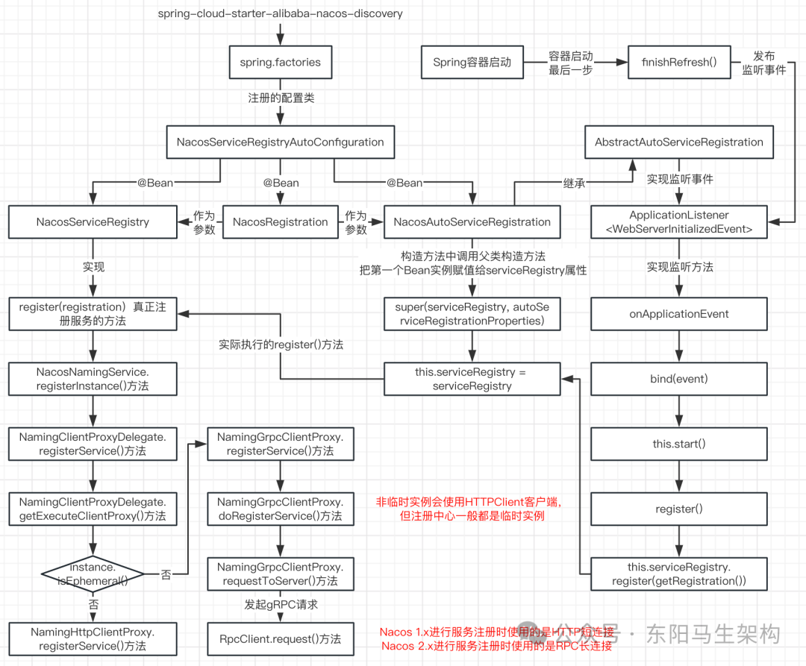

## 3.服务端进行服务注册时的处理

### (1)服务端处理客户端发起的服务注册请求

客户端向服务端发起服务注册时，会先根据要注册的服务信息来创建一个InstanceRequest请求参数对象，再调用NamingGrpcClientProxy的requestToServer()方法向服务端发请求，也就是通过调用RpcClient的request()方法来向服务端发出gRPC请求。

InstanceRequestHandler的handle()方法就是用来处理服务注册请求的，该方法会继续调用InstanceRequestHandler的registerInstance()方法，根据客户端发过来的请求类型来选择是注册服务还是注销服务。

如果客户端发过来的请求类型是注册服务实例，则调用EphemeralClientOperationServiceImpl的registerInstance()方法，在该方法中：

#### 一.首先会调用ServiceManager的getSingleton()方法

根据由请求信息创建的Service对象获取一个已注册的Service对象。

需要注意：在Nacos 1.x中，ServiceManager使用一个双层Map存放服务和命名空间。在Nacos 2.x中，ServiceManager则使用两个Map存放服务和命名空间。

```javascript
在Nacos 1.x中的双层Map是：
Map<String, Map<String, Service>>；
例如Map(namespace, Map(group::serviceName, Service))；

在Nacos 2.x中的两个Map是：
ConcurrentHashMap<Service, Service>、
ConcurrentHashMap<String_namespace, Set<Service>>；
```

#### 二.然后调用ClientManagerDelegate的getClient()方法

根据请求参数中的connectionId来获取一个IpPortBasedClient对象。在执行ClientManagerDelegate的getClient()方法时，会先根据connectionId选出具体的ClientManager实现类，接着再调用比如EphemeralIpPortClientManager的getClient()方法，从EphemeralIpPortClientManager.clients属性中获取一个Client对象。clients属性是一个ConcurrentMap，key是请求参数中的connectionId，value是继承了实现Client接口的AbstractClient的IpPortBasedClient对象。

需要注意：Nacos中的gRPC底层是基于Netty实现的。当客户端和服务端建立长连接后，服务端会生成SocketChannel连接对象，这个SocketChannel连接对象就代表了客户端。Nacos会在这个SocketChannel连接对象的基础上，封装一个Client对象，并且生成一个connectionId将SocketChannel对象与Client对象关联起来。

所以当要进行服务注册的客户端和服务端建立好长连接后，服务端就会为客户端创建一个IpPortBasedClient对象，并将该对象存放在EphemeralIpPortClientManager.clients属性里。

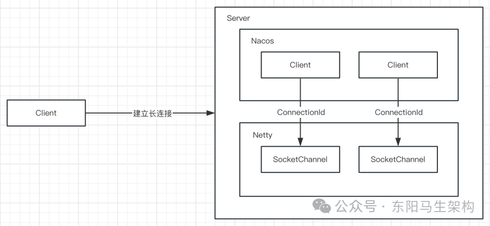

#### 三.接着调用ClientOperationService的getPublishInfo()方法

将请求中的instance实例信息封装为InstancePublishInfo对象。

#### 四.然后调用IpPortBasedClient对象的addServiceInstance()方法

往IpPortBasedClient对象里添加Service对象 -> InstancePublishInfo对象。

由于IpPortBasedClient继承自实现了Client接口的AbstractClient抽象类，所以实际是调用AbstractClient的addServiceInstance()方法添加服务实例。

在AbstractClient抽象类中，有一个名为publishers的属性。它是一个ConcurrentHashMap，用于存储客户端服务注册请求中的Instance信息。就是记录该客户端提供的服务和服务实例，一个客户端可提供多个服务，当然这些信息已经被封装为InstancePublishInfo对象了。所以AbstractClient.publishers属性的key为已注册的Service，value是根据请求中的Instance实例信息封装的InstancePublishInfo对象。

在AbstractClient的addServiceInstance()方法中，首先往publishers放入这次要注册的Service对象和客户端Instance实例，然后发布客户端改变事件ClientChangedEvent，用来同步集群间的数据。

#### 五.最后发布客户端注册服务实例事件和服务实例元数据事件

客户端注册服务实例事件是ClientRegisterServiceEvent，服务实例元数据事件是InstanceMetadataEvent。

### (2)服务端对客户端注册事件的处理实现

#### 一.服务端处理客户端的服务注册请求时的主要工作

往三个ConcurrentHashMap里放入内容 \+ 发布三个事件。

三个ConcurrentHashMap分别是：第一个是ServiceManager中的，key是根据请求参数创建的Service对象，value是已经注册的Service对象。第二个是ServiceManager中的，key是命名空间，value是相同命名空间的已注册的Service对象集合。第三个是AbstractClient中的，key是注册的Service服务对象，value是根据请求中的Instance实例封装的InstancePublishInfo对象。

三个事件分别是：第一个是在AbstractClient的addServiceInstance()方法中，发布的ClientChangedEvent客户端改变事件。第二个是在EphemeralClientOperationService的registerInstance()方法中，发布的ClientRegisterServiceEvent客户端注册事件。第三个是在EphemeralClientOperationService的registerInstance()方法中，发布的InstanceMetadataEvent服务实例元数据事件。

#### 二.服务端对客户端注册事件ClientRegisterServiceEvent的处理

当执行EphemeralClientOperationService的registerInstance()方法，发布一个ClientRegisterServiceEvent客户端注册事件时，便会触发执行ClientServiceIndexesManager的onEvent()方法，然后执行ClientServiceIndexesManager的handleClientOperation()方法，最终调用ClientServiceIndexesManager的addPublisherIndexes()方法。

其中addPublisherIndexes()方法会把clientId放入到publisherIndexes中。publisherIndexes是一个ConcurrentMap，它的key是要注册的服务实例所属的服务Service对象，它的value是某服务Service对象下的所有clientId即connectionId。由于connectionId代表了一个Client对象，也就是一个客户端，所以publisherIndexes的value可理解为服务Service下的所有客户端实例。

### (3)总结

服务端处理服务实例注册时，会使用多个Map来存储微服务实例的信息。在注册表也就是ClientServiceIndexesManager.publisherIndexes属性中，只是简单记录每个Service服务对象下包含的clientId字符串集合。通过clientId可以在clients属性中获取到IpPortBasedClient对象，IpPortBasedClient的父类AbstractClient会存储对应的Instance实例信息，所以这样的注册表是可记录每个Service服务包含的所有Instance实例的。

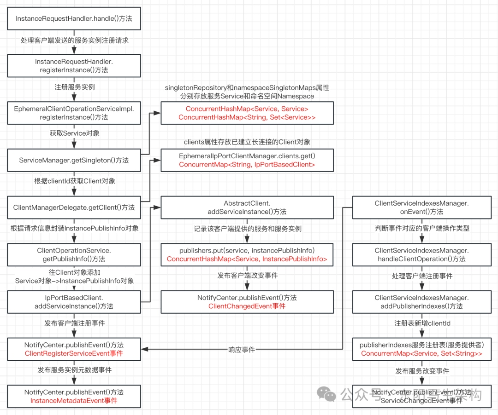

## 4.客户端服务发现和服务端处理服务订阅的实现

### (1)Nacos客户端进行服务发现的实现

#### 一.nacos-discovery引入Ribbon实现服务调用时的负载均衡

Nacos客户端就是引入了nacos-discovery + nacos-client依赖的项目。由于nacos-discovery整合了Ribbon，所以Ribbon可以调用Nacos服务端的服务实例查询列表接口。于是Nacos客户端便借助Ribbon实现了服务调用时的负载均衡，即Ribbon会从服务实例列表中选择一个服务实例给客户端进行服务调用。

在nacos-discovery的pom.xml中，可以看到它引入了Ribbon依赖：

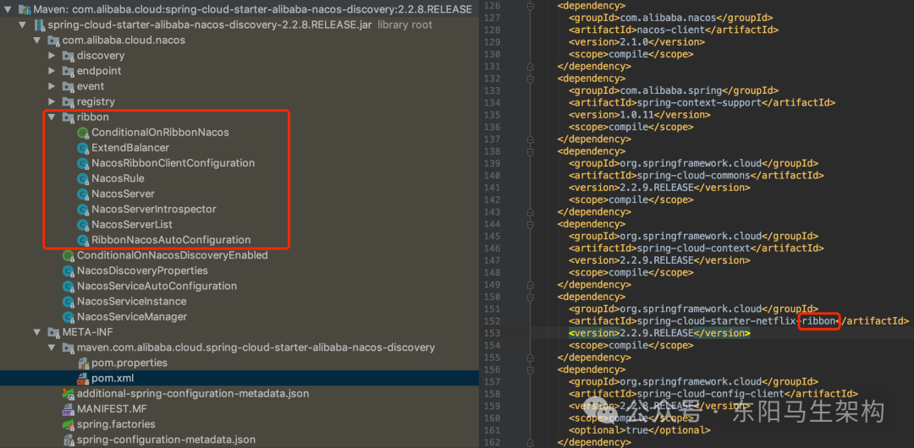

#### 二.nacos-discovery如何整合Ribbon实现服务调用时的负载均衡

在Ribbon中会有一个ServerList接口，如下所示：ServerList就是一个扩展接口，这个接口的作用就是获取Server列表。然后nacos-discovery会针对这个接口进行实现，从而整合Ribbon。

从引入的包来看，loadbalancer是属于Ribbon源码包下的。而LoadBalancer则是Ribbon中的负载均衡器。负载均衡器会结合IRule负载均衡策略，从服务实例列表中选择一个实例。

当Nacos客户端进行微服务调用时，会通过Ribbon来选出一个服务实例，此时Ribbon会调用NacosServerList的getUpdatedListOfServers()方法获取服务实例列表。

nacos-discovery的NacosServerList类继承了AbstractServerList类，而且实现了Ribbon的ServerList接口的两个方法。

NacosServerList的核心方法是getServers()，因为nacos-discovery实现Ribbon的两个接口都调用到了该方法。

在nacos-discovery的NacosServerList的getServers()方法中，会调用nacos-client的NacosNamingService的selectInstances()方法，来获取服务实例列表。

#### 三.nacos-client如何进行服务发现

在nacos-client的NacosNamingService的selectInstances()方法中，首先会调用ServiceInfoHolder的getServiceInfo()方法从本地缓存获取数据。ServiceInfoHolder的serviceInfoMap中的value是一个ServiceInfo对象，在ServiceInfo对象中会有一个Listhosts属性来存放实例数据。

如果ServiceInfoHolder中的本地缓存没有对应的ServiceInfo对象，那么就会调用NamingClientProxyDelegate的subscribe()方法。该方法首先会开启一个查询服务实例列表的延时执行的任务，然后通过Client对象发送订阅请求，去服务端实时获取服务实例数据。

具体来说就是先调用ServiceInfoUpdateService的scheduleUpdateIfAbsent()方法，开启一个延迟执行查询服务实例列表的UpdateTask任务，然后再次调用ServiceInfoHolder的getServiceInfoMap()方法查询本地缓存。如果本地缓存为空，则向服务端发起gRPC请求获取服务实例数据，也就是通过调用NamingGrpcClientProxy的subscribe()方法，触发调用NamingGrpcClientProxy的doSubscribe()方法，再触发调用NamingGrpcClientProxy的requestToServer()方法，接着调用RpcClient的request()方法发送gRPC请求给服务端，最后调用ServiceInfoHolder的processServiceInfo()方法更新本地缓存。

其中UpdateTask任务的run()方法会先调用NamingClientProxy.queryInstancesOfService()方法，然后调用ServiceInfoHolder的processServiceInfo()方法向服务端查询服务实例列表以及更新本地服务实例缓存。当该任务执行完毕时，会继续向调度线程池提交一个延迟6s执行的任务，从而实现不断更新本地缓存的服务实例列表。

在ServiceInfoHolder的processServiceInfo()方法更新本地服务实例缓存中，会判断服务实例是否发生改变。如果有改变，那么客户端会先发布一个服务实例改变事件InstancesChangeEvent，然后把新的服务实例数据写入本地磁盘。

### (2)Nacos服务端处理服务订阅请求的实现

假设order-service需要调用stock-service的接口，那么order-service(Nacos客户端)就要向Nacos服务端订阅stock-service服务，也就是order-service需要从服务端获取到stock-service的所有服务实例。

客户端向服务端发起订阅请求的参数类型是SubscribeServiceRequest。服务订阅请求的处理方法是SubscribeServiceRequestHandler的handle()，该方法会先从SubscribeServiceRequest对象里获取信息构建Service对象，然后再根据RequestMeta请求元数据构建Subscriber对象，接着就会调用ServiceStorage的getData()方法读取缓存中的服务实例，以及通过clientOperationService的subscribeService()方法添加订阅者。

#### 一.根据要查询的Service对象读取缓存

调用的方法是ServiceStorage.getData()：

```shell
-> serviceDataIndexes.get()
-> ServiceStorage.getPushData()方法
-> ServiceStorage.emptyServiceInfo()方法
-> ServiceStorage.getAllInstancesFromIndex()方法
-> ClientServiceIndexesManager.getAllClientsRegisteredService()方法
-> ServiceStorage.getInstanceInfo()方法根据clientId获取Instance对象
-> EphemeralIpPortClientManager.getClient()方法
-> AbstractClient.getInstancePublishInfo()方法
-> ServiceStorage.parseInstance()方法
-> serviceDataIndexes.put() + serviceClusterIndex.put()
```

ServiceStorage的getData()方法在读取缓存时，获取要查询的Service服务对象下的全部Instance实例会分三步：一是从注册表中获取要查询的Service对象下的全部clientId，二是根据clientId获取对应的Client对象，三是根据Client对象获取对应的Instance信息。

#### 二.添加订阅者即Subscriber对象

调用的方法是EphemeralClientOperationServiceImpl.subscribeService()，添加订阅者其实就是先根据clientId找出对应的客户端Client对象，然后往AbstractClient.subscribers属性放入服务对象和对应的订阅者对象，最后再发布一个客户端订阅服务事件ClientSubscribeServiceEvent。

这个事件会被ClientServiceIndexesManager的onEvent()方法处理，即调用ClientServiceIndexesManager的addSubscriberIndexes()方法，该方法会继续发布一个服务订阅事件ServiceSubscribedEvent。

### (3)总结

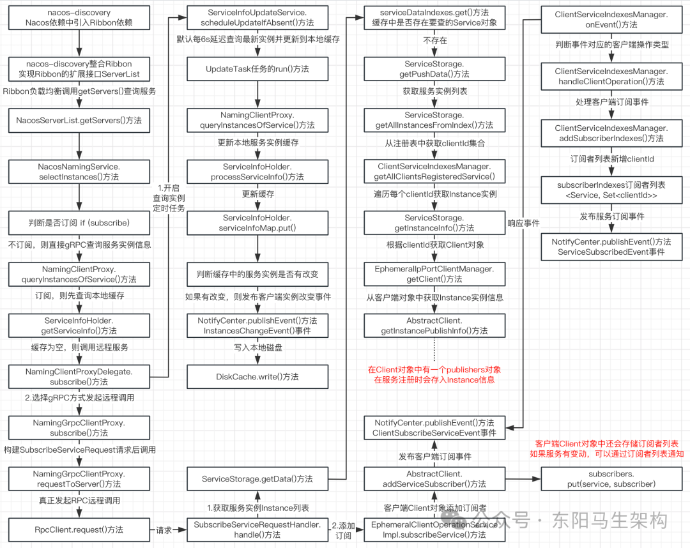

## 5.服务变动时如何通知订阅的客户端

### (1)服务注册和服务订阅时发布的客户端注册和订阅事件的处理

#### 一.服务注册

Nacos客户端注册服务实例时，Nacos服务端会发布ClientRegisterServiceEvent客户端注册服务实例事件。Nacos服务端在处理客户端注册服务实例事件时，会把clientId写入到注册表，然后接着发布ServiceChangedEvent服务改变事件。

#### 二.服务订阅

客户端查询微服务实例列表进行服务发现时，调用的是订阅接口。服务端处理客户端的订阅请求时会发布ClientSubscribeServiceEvent事件，这个事件的处理逻辑是先向订阅表添加clientId到所订阅服务对应的集合中，如果第一次添加clientId则发布一个ServiceSubscribedEvent服务订阅事件。

### (2)延迟任务的执行引擎实现

#### 一.什么是延迟任务执行引擎

延迟任务执行引擎就是可以往执行引擎中添加任务，该任务会被延时执行。Nacos的延迟任务执行引擎就是NacosDelayTaskExecuteEngine类。

Nacos会通过延迟任务执行引擎来处理服务改变事件和服务订阅事件，即ServiceChangedEvent和ServiceSubscribedEvent。

#### 二.延迟任务执行引擎的执行原理

首先，Nacos会定义一个名为NacosTaskProcessor的任务处理器接口。NacosTaskProcessor是一个Interface ，它有很多个实现类。

然后，执行引擎会记录相关的任务处理器实现类。NacosDelayTaskExecuteEngine继承自AbstractNacosTaskExecuteEngine，AbstractNacosTaskExecuteEngine相当于任务执行引擎中心。AbstractNacosTaskExecuteEngine有两个属性来记录这些处理器实现类，并提供了两个方法可以向任务执行引擎中心添加处理器，这两个方法分别是addProcessor()方法和setDefaultTaskProcessor()方法。

接着，创建NacosDelayTaskExecuteEngine时会开启一个定时执行的任务，该定时执行的任务会定时执行ProcessRunnable的run()方法。

延时任务执行引擎有一个Map类型的tasks属性存放所有延迟执行的任务，而在ProcessRunnable的run()方法中，会触发调用其processTasks()方法。processTasks()方法会从tasks属性中获取全部的延迟任务，然后遍历处理。即先通过任务key获取具体的任务，再通过任务key获取对应的处理器，接着调用NacosTaskProcessor的process()方法，来完成延迟任务的执行。

最后，NacosDelayTaskExecuteEngine会提供一个addTask()方法，这个方法可以将延迟执行的任务添加到延时任务执行引擎的tasks属性中。

### (3)处理客户端注册和订阅事件时发布的服务变动和服务订阅事件的处理

#### 一.服务端处理服务变动和服务订阅事件的入口

处理入口是：NamingSubscriberServiceV2Impl的onEvent()方法。其中，对事件的处理使用了双层内存队列(存储延迟任务 + 同步任务)的异步处理方式。

onEvent()方法主要会往延迟任务执行引擎中添加任务，也就是首先会根据不同的事件类型构建不同的PushDelayTask任务，然后调用延迟任务执行引擎NacosDelayTaskExecuteEngine的addTask()方法，把PushDelayTask延迟任务添加到PushDelayTaskExecuteEngine的任务池。

创建继承自NacosDelayTaskExecuteEngine的PushDelayTaskExecuteEngine延迟任务执行引擎时会创建一个定时任务，定时从任务池中取出任务，然后调用对应的任务处理器的process()方法。

PushDelayTask任务对应的任务处理器是PushDelayTaskProcessor，所以最终会触发执行PushDelayTaskProcessor的process()方法。

在执行PushDelayTaskProcessor的process()方法时，会调用NamingExecuteTaskDispatcher的dispatchAndExecuteTask()方法，提交由PushDelayTask任务封装的PushExecuteTask任务给NacosExecuteTaskExecuteEngine进行处理，此时会调用NacosExecuteTaskExecuteEngine的addTask()方法添加任务。

其中，PushExecuteTask任务会被分发到NacosExecuteTaskExecuteEngine执行引擎中的一个TaskExecuteWorker处理，TaskExecuteWorker的process()方法会把PushExecuteTask任务放入队列。由于TaskExecuteWorker初始化时会启动一个线程不断从队列中获取任务并执行，所以最终便会执行到PushExecuteTask的run()方法。

#### 二.执行推送的任务PushExecuteTask说明

在PushExecuteTask的run()方法中，首先会从ServiceStorage获取要推送的服务Service最新的实例数据包装，然后调用PushExecuteTask的getTargetClientIds()方法获取要推送的clientId，接着根据clientId获取订阅了Service服务的的客户端订阅者对象，最后调用PushExecutorDelegate的doPushWithCallback()方法，也就是调用PushExecutorRpcImpl的doPushWithCallback()方法回调客户端，即调用RpcPushService的pushWithCallback()方法回调客户端，即调用GrpcConnection的asyncRequest()方法向客户端发送RPC请求。

执行PushExecuteTask的getTargetClientIds()方法获取要推送的clientId时，会根据PushDelayTask的pushToAll属性来获取对应的clientId。因为在NamingSubscriberServiceV2Impl的onEvent()方法中，如果处理的是服务改变事件，则构造的PushDelayTask是面向所有客户端。如果处理的是服务订阅事件，则构造的PushDelayTask是面向一个客户端。

所以如果PushDelayTask要面向所有客户端推送Service服务实例数据，那么就调用ClientServiceIndexesManager的getAllClientsSubscribeService()方法，从订阅者列表中获取订阅了Service服务的所有clientId。如果PushDelayTask要面向单个客户端推送Service服务实例数据，则通过PushDelayTask的getTargetClients()方法获取对应的clientId即可。

总结：服务变动需要通知全部订阅了该Service服务的客户端对象，服务订阅只需要通知当前订阅者客户端对象即可。

#### 三.客户端收到服务端发送的Service服务实例数据推送的处理

NamingPushRequestHandler的requestReply()方法会处理服务端的推送，即调用ServiceInfoHolder的processServiceInfo()方法更新本地缓存。

### (4)总结

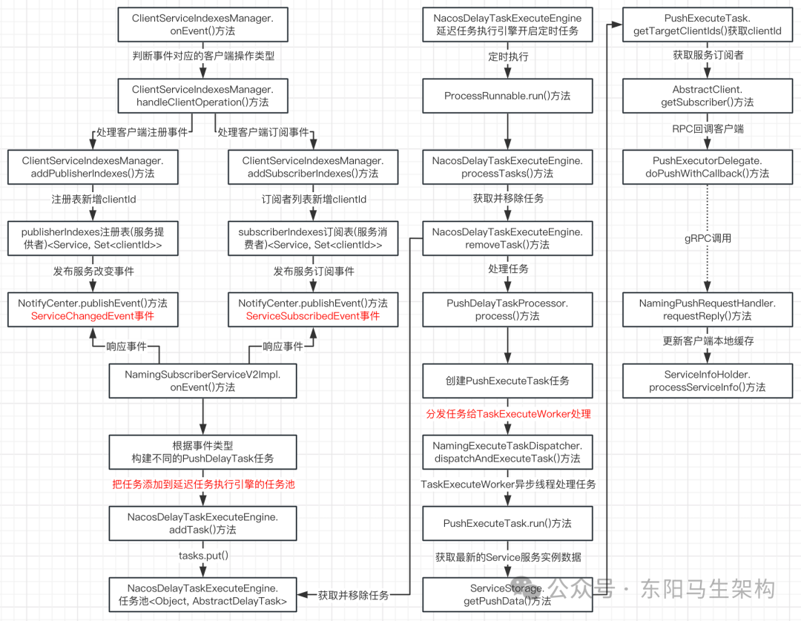

## 6.微服务实例信息如何同步集群节点

### (1)服务端处理服务注册时会发布一个ClientChangedEvent事件

ClientChangedEvent事件的作用就是向集群节点同步服务实例数据的。

### (2)ClientChangedEvent事件的处理实现

DistroClientDataProcessor的onEvent()方法会响应ClientChangedEvent。该方法如果判断出事件类型为ClientChangedEvent事件，那么就会执行DistroClientDataProcessor的syncToAllServer()方法，然后调用DistroProtocol的sync()方法进行集群节点同步处理。

DistroProtocol的sync()方法会遍历集群中除自身节点外的其他节点，然后对遍历到的每个节点执行DistroProtocol的syncToTarget()方法。

在DistroProtocol的syncToTarget()方法中，首先把要同步的集群节点targetServer包装成DistroKey对象，然后根据DistroKey对象创建DistroDelayTask延迟任务，接着调用NacosDelayTaskExecuteEngine的addTask()方法，往延迟任务执行引擎的tasks中添加任务。

NacosDelayTaskExecuteEngine在初始化时会启动一个定时任务，这个定时任务会定时执行ProcessRunnable的run()方法。而ProcessRunnable的run()方法会不断从任务池tasks中取出延迟任务处理，处理DistroDelayTask任务时会调用DistroDelayTaskProcessor的process()方法。

在执行DistroDelayTaskProcessor的process()方法时，会先根据DistroDelayTask任务封装一个DistroSyncChangeTask任务，然后调用NacosExecuteTaskExecuteEngine的addTask()方法。也就是调用TaskExecuteWorker的process()方法，将DistroSyncChangeTask任务添加到TaskExecuteWorker的阻塞队列中，同时创建TaskExecuteWorker时会启动线程不断从队列中取出任务处理。因此最终会执行DistroSyncChangeTask的run()方法。

执行DistroSyncChangeTask的run()方法，其实就是执行AbstractDistroExecuteTask的run()方法。AbstractDistroExecuteTask的run()方法会先获取请求数据，然后调用DistroClientTransportAgent的syncData()方法同步集群节点，也就是调用ClusterRpcClientProxy的sendRequest()方法发送数据同步请求，最终会调用RpcClient的request()方法 -> GrpcConnection的request()方法。

### (3)集群节点处理数据同步请求的实现

通过DistroClientTransportAgent的syncData()方法发送的数据同步请求，会被DistroDataRequestHandler的handle()方法处理。然后会调用DistroDataRequestHandler的handleSyncData()方法，接着调用DistroProtocol的onReceive()方法，于是最终会调用到DistroClientDataProcessor.processData()方法。

在执行DistroClientDataProcessor的processData()方法时，如果是同步服务实例新增、修改后的数据，则执行DistroClientDataProcessor的handlerClientSyncData()方法。该方法会和处理服务注册时一样，发布一个客户端注册服务实例的事件。如果是同步服务实例删除后的数据，则调用EphemeralIpPortClientManager的clientDisconnected()方法。首先移除客户端对象信息，然后发布一个客户端注销服务实例的事件。

其中客户端注销服务实例的事件ClientDisconnectEvent，首先会被ClientServiceIndexesManager的onEvent()方法进行处理，处理时会调用ClientServiceIndexesManager的handleClientDisconnect()方法，移除ClientServiceIndexesManager订阅者列表的元素和注册表的元素。然后会被DistroClientDataProcessor的onEvent()方法进行处理，进行集群节点之间的数据同步。

### (4)总结

#### 一.执行引擎的总结

延时任务执行引擎的实现原理是引擎有一个Map类型的tasks任务池，这个任务池可以根据key映射对应的任务处理器。引擎会定时从任务池中获取任务，执行任务处理器的处理方法处理任务。

任务执行引擎的实现原理是会创建多个任务执行Worker，每个任务执行Worker都会有一个阻塞队列。向任务执行引擎添加任务时会将任务添加到其中一个Woker的阻塞队列中，Worker在初始化时就会启动一个线程不断取出阻塞队列中的任务来处理。所以任务执行引擎会通过阻塞队列 + 异步任务的方式来实现。

#### 二.用于向集群节点同步数据的客户端改变事件的处理流程总结

步骤一：先创建DistroDelayTask延迟任务放入到延迟任务执行引擎的任务池，DistroDelayTask延迟任务会由DistroDelayTaskProcessor处理器处理。

步骤二：DistroDelayTaskProcessor处理时会创建DistroSyncChangeTask任务，然后再将任务分发添加到执行引擎中的任务执行Worker的阻塞队列中。

步骤三：任务执行Worker会从队列中获取并执行DistroSyncChangeTask任务，也就是执行引擎会触发调用AbstractDistroExecuteTask的run()方法，从而调用DistroSyncChangeTask的doExecuteWithCallback()方法。

步骤四：doExecuteWithCallback()方法会获取最新的微服务实例列表，然后通过DistroClientTransportAgent的syncData()方法发送数据同步请求。

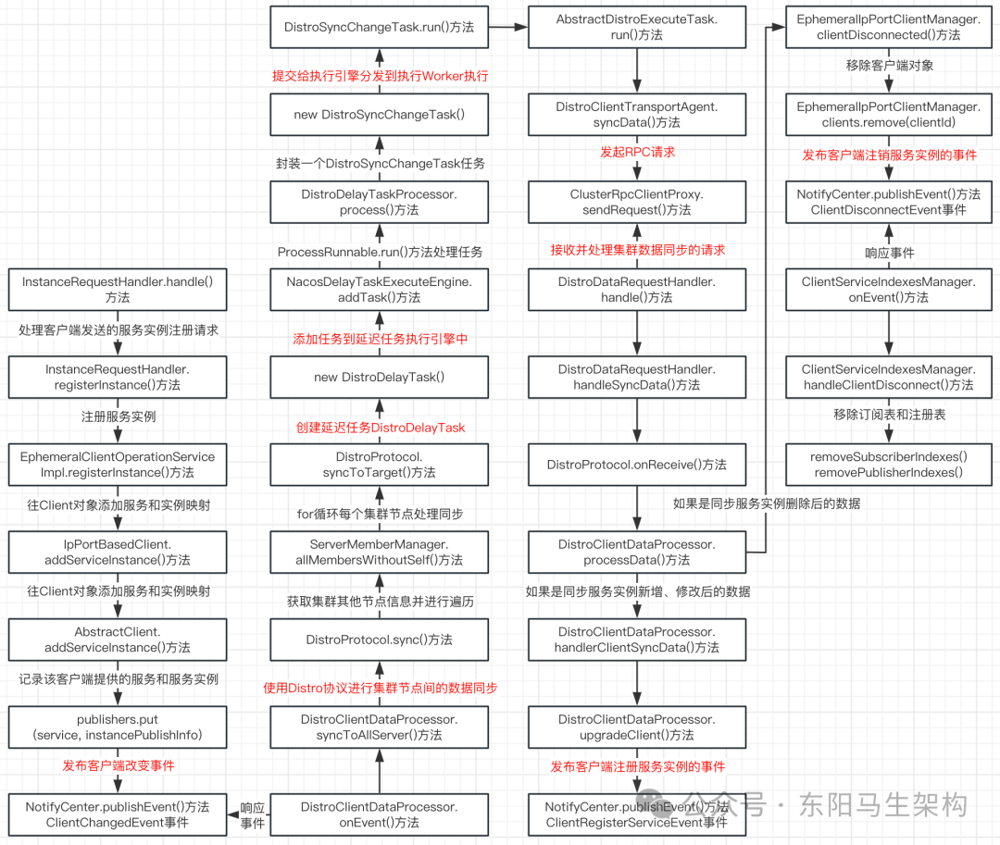

## 7.服务端对服务实例进行健康检查

### (1)服务端对服务实例进行健康检查的设计逻辑

#### 一.首先会获取所有客户端的Connection连接对象

Connection连接对象里有个属性叫lastActiveTime，表示的是最后存活时间。

#### 二.然后判断当前时间-最后存活时间是否大于20s

如果大于，则把该Connection连接对象的connectionId放入到一个集合里。这个集合是一个名为outDatedConnections的待移除集合Set，此时该Connection连接对象并不会马上删除。

#### 三.当判断完全部的Connection连接对象后会遍历outDatedConnections集合

向遍历到的Connection连接对象发起一次请求，确认是否真的下线。如果响应成功，则往successConnections集合中添加connectionId，并且刷新Connection连接对象的lastActiveTime属性。这个机制有一个专业的名称叫做：探活机制。

#### 四.遍历待移除集合进行注销并且在注销之前先判断一下是否探活成功

也就是connectionId存在于待移除集合outDatedConnections中，但是不存在于探活成功集合successConnections中，那么这个connectionId对应的客户端就会被注销掉。

### (2)服务端对服务实例进行健康检查的实现

对服务实例进行健康检查的源码入口是ConnectionManager的start()方法。

### (3)服务端检查服务实例不健康后的注销处理

进行注销处理的方法是ConnectionManager的unregister()方法。该方法主要会移除Connection连接对象 + 清除一些数据，以及发布一个ClientDisconnectEvent客户端注销事件。

ClientDisconnectEvent客户端注销事件会被两个监听响应：一是ClientServiceIndexesManager的onEvent()方法用来移除注册表 + 订阅表信息，二是DistroClientDataProcessor的onEvent()方法用来同步服务实例被注销后的数据。

### (4)总结

在Nacos 1.4.1版本中的服务健康检查：是15s没心跳则把健康状态修改为不健康，30s没心跳则把实例对象移除。

在Nacos 2.1.0版本中的服务健康检查：是20s没心跳则把客户端放入一个过期集合，此时并不移除客户端连接。由于引入了gRPC长连接，所以可以新增探活机制检查过期集合中的连接。服务端发送探活请求给客户端时的代价并不大，可确保客户端下线。

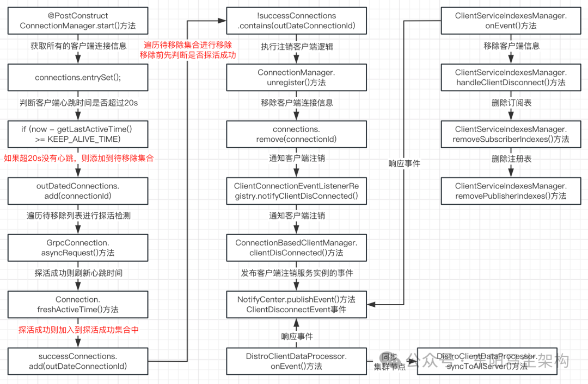

## 8.服务下线如何注销注册表和客户端等信息

### (1)客户端发出服务下线请求的实现

Nacos客户端发起服务下线的入口在AbstractAutoServiceRegistration这个类之中，而AbstractAutoServiceRegistration是nacos-discovery中的类。

由于AbstractAutoServiceRegistration的destroy()方法被@PreDestroy修饰，所以当容器关闭时，会调用AbstractAutoServiceRegistration的destroy()方法。该方法最后会触发调用NacosNamingService的deregisterInstance()方法，然后调用NamingClientProxyDelegate的deregisterService()方法，接着调用NamingGrpcClientProxy的deregisterService()方法。和客户端发起服务注册一样，首先会创建请求参数对象，然后通过NamingGrpcClientProxy的requestToServer()方法发起请求，也就是调用RpcClient的request()方法发起gRPC请求进行服务下线。

### (2)服务端处理服务下线请求的实现

服务注册时请求参数InstanceRequest的类型是REGISTER_INSTANCE，服务下线时请求参数InstanceRequest的类型是DE_REGISTER_INSTANCE。

处理服务注册和服务下线的入口是InstanceRequestHandler的handle()方法，这个方法会触发调用InstanceRequestHandler的deregisterInstance()方法，也就是调用EphemeralClientOperationServiceImpl的deregisterInstance()方法。

在EphemeralClientOperationServiceImpl的deregisterInstance()方法中，会在移除Client对象中的instance信息时，发布ClientChangedEvent事件，然后接着发布客户端注销服务实例的事件ClientDeregisterServiceEvent。

其中ClientChangedEvent事件是用来同步数据给集群节点的，ClientDeregisterServiceEvent事件是用来移除注册表 + 订阅表的服务实例。移除注册表 + 订阅表的服务实例时，还会发布ServiceChangeEvent事件，ServiceChangeEvent事件是用来通知订阅了该服务的Nacos客户端的。同理，服务注册时其实也会发布类似的三个事件。

#### 一.处理ClientChangedEvent事件

也就是同步数据到集群节点。

#### 二.处理ClientDeregisterServiceEvent事件

也就是移除注册表 + 订阅表的服务实例。

#### 三.处理ServiceChangeEvent事件

也就是通知订阅了该服务的客户端。

### (3)总结

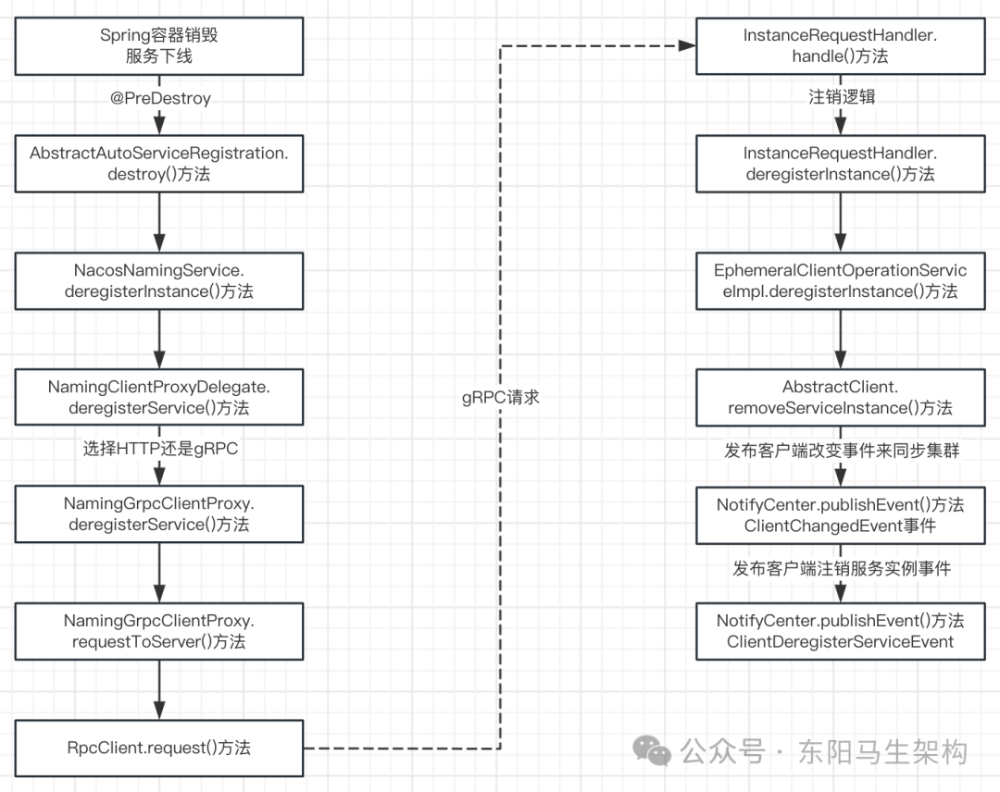

9.事件驱动架构实现

Nacos 2.x大量使用了事件发布的动作，比如客户端注册服务实例、客户端下线服务实例、服务改变、服务订阅等。

### (1)如何使用Nacos的事件发布

#### 一.首先自定义一个事件

#### 二.然后定义一个订阅者

有了事件之后，还需要一个订阅者，这样发布的事件才能被这个订阅者进行处理。

自定义的订阅者需要继承Nacos的SmartSubscriber抽象类，自定义的订阅者需要实现三个方法。

方法一：构造方法

需要将自定义的订阅者注册到Nacos的通知中心NotifyCenter里，这样NotifyCenter在发布自定义事件时，才能让自定义的订阅者进行响应。

方法二：subscribeTypes()方法

实现该方法时，需要把自定义的事件添加到方法的返回结果中，所以可以通过该方法获取自定义订阅者监听了哪些事件。

方法三：onEvent()方法

Nacos的通知中心NotifyCenter在发布自定义事件时，便会调用该方法，所以该方法中需要实现自定义订阅者对自定义事件的处理。

#### 三.最后通过Nacos的通知中心NotifyCenter发布自定义事件

这样便完成了自定义事件、自定义订阅者通过Nacos实现发布订阅功能。

### (2)Nacos通知中心的事件发布实现

通知中心NotifyCenter执行publishEvent()方法发布事件时，比如会调用DefaultPublisher的publish()方法来发布事件。

DefaultPublisher的publish()方法会先把事件放入到一个阻塞队列queue中，而在DefaultPublisher创建时会启动一个线程从阻塞队列取出事件来处理。处理时就会调用到DefaultPublisher的receiveEvent()方法通知事件订阅者，也就是执行DefaultPublisher的notifySubscriber()方法通知事件订阅者。

在DefaultPublisher的notifySubscriber()方法中，首先会创建一个调用订阅者的onEvent()方法的任务，然后如果订阅者有线程池，则将任务提交给订阅者的线程池去执行。如果订阅者没有线程池，则直接执行该任务。

可见事件的发布也使用了阻塞队列 + 异步任务，来实现对订阅者的通知。

### (3)Nacos通知中心注册订阅者的实现

在执行NotifyCenter的registerSubscriber()方法注册订阅者时，会调用订阅者实现的subscribeTypes()方法获取订阅者要监听的所有事件，然后遍历这些事件并调用NotifyCenter的addSubscriber()方法。

执行NotifyCenter的addSubscriber()方法时会为这些事件添加订阅者。由于每个事件都会对应一个EventPublisher对象，所以会先从NotifyCenter.publisherMap中获取EventPublisher对象，然后调用EventPublisher的addSubscriber()方法向EventPublisher添加订阅者，从而完成向通知中心注册订阅者。

## 10.gRPC客户端初始化分析

### (1)gRPC客户端代理初始化的实现

Nacos客户端注册服务实例时会调用NacosNamingService的registerInstance()方法，接着会调用NamingClientProxyDelegate的registerService()方法，然后判断注册的服务实例是不是临时的。如果注册的服务实例是临时的，那么就使用gRPC客户端代理去进行注册。如果注册的服务实例不是临时的，那么就使用HTTP客户端代理去进行注册。

NacosNamingService的init()方法在创建客户端代理，也就是执行NamingClientProxyDelegate的构造方法时，便会创建和初始化gRPC客户端代理NamingGrpcClientProxy。

创建和初始化gRPC客户端代理NamingGrpcClientProxy时，首先会由RpcClientFactory的createClient()方法创建一个RpcClient对象，并将GrpcClient对象赋值给NamingGrpcClientProxy的rpcClient属性，然后调用NamingGrpcClientProxy的start()方法启动RPC客户端连接。

在NamingGrpcClientProxy的start()方法中，会先注册一个用于处理服务端推送请求的NamingPushRequestHandler，然后调用RpcClient的start()方法启动RPC客户端即RpcClient对象，最后将NamingGrpcClientProxy自己作为订阅者向通知中心进行注册。

### (2)gRPC客户端启动的实现

NamingGrpcClientProxy的start()方法会通过调用RpcClient的start()方法，来启动RPC客户端即RpcClient对象。

在RpcClient的start()方法中，首先会利用CAS来修改RPC客户端(RpcClient)的状态，也就是将RpcClient.rpcClientStatus属性从INITIALIZED更新为STARTING。

然后会创建一个核心线程数为2的线程池，并提交两个任务。任务一是处理连接成功或连接断开时的线程，任务二是处理重连或健康检查的线程。

接着会创建Connection连接对象，也就是在while循环中调用GrpcClient的connectToServer()方法，尝试与服务端建立连接。如果连接失败，则会抛出异常并且进行重试，由于是同步连接，所以最大重试次数是3。

最后当客户端与服务端成功建立连接后，会把对应的Connection连接对象赋值给RpcClient.currentConnection属性，并且修改RpcClient.rpcClientStatus属性即RPC客户端状态为RUNNING。

如果客户端与服务端连接失败，则会通过异步尝试进行连接，也就是调用RpcClient的switchServerAsync()方法，往RpcClient的reconnectionSignal队列中放入一个ReconnectContext对象，reconnectionSignal队列中的元素会交给任务2来处理。

### (3)gRPC客户端发起与服务端建立连接请求的实现

gRPC客户端与服务端建立连接的方法是GrpcClient的connectToServer()方法。该方法首先会获取进行网络通信的端口号，因为gRPC服务需要额外占用一个端口的，所以这个端口号是在Nacos的8848基础上 + 偏移量1000，变成9848。

在建立连接之前，会先检查一下服务端，如果没问题才发起连接请求，接着就会调用GrpcConnection的sendRequest()方法发起连接请求，最后返回GrpcConnection连接对象。

### (4)总结

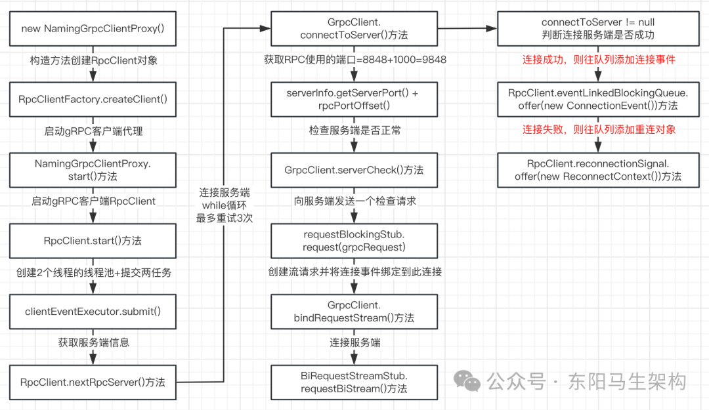

## 11.gRPC客户端的心跳机制(健康检查)

RpcClient的start()方法会调用GrpcClient的connectToServer()方法连接服务端，不管连接是否成功，最后都会往不同的阻塞队列中添加事件。

如果连接成功，那么就往RpcClient的eventLinkedBlockingQueue添加连接事件。如果连接失败，那么就往RpcClient的reconnectionSignal队列添加重连对象。而这两个阻塞队列中的数据处理，便是由执行RpcClient的start()方法时启动的两个线程任务进行处理的。

### (1)线程任务一：处理连接成功或连接断开时的通知

这个任务主要在连接成功或者连接断开时，修改一些属性状态。通过eventLinkedBlockingQueue的take()方法从队列取到连接事件后，会判断连接事件是否建立连接还是断开连接。

如果是建立连接，那么就调用RpcClient的notifyConnected()方法，把执行NamingGrpcClientProxy的start()方法时所注册的NamingGrpcRedoService对象的connected属性设置为true。

如果是断开连接，那么就调用RpcClient的notifyDisConnected()方法，把执行NamingGrpcClientProxy的start()方法时所注册的NamingGrpcRedoService对象的connected属性设置为false。

### (2)线程任务二：处理重连或健康检查

如果RpcClient的start()方法在调用GrpcClient的connectToServer()方法连接服务端时失败了，那么会往RpcClient.reconnectionSignal队列添加重连对象的，而这个任务就会获取reconnectionSignal队列中的重连对象进行重连。

因为reconnectionSignal中的数据是当连接失败时放入的，所以如果从reconnectionSignal中获取不到重连对象，等同于连接成功。

注意：这个任务从reconnectionSignal阻塞队列中获取重连对象时，调用的是阻塞队列的take()方法，而不是阻塞队列的poll()方法。BlockingQueue的take()方法，如果读取不到数据，会一直处于阻塞状态。BlockingQueue的poll()方法，在指定的时间内读取不到数据，会返回null。

情况一：如果从reconnectionSignal队列中获取到的重连对象为null

首先判断存活时间是否大于 5s，如果大于则调用RpcClient.healthCheck()方法发起健康检查的RPC请求。健康检查的触发方法是currentConnection.request()方法，健康检查的请求类型是HealthCheckRequest。

如果健康检查成功，只需刷新存活时间即可。如果健康检查失败，则需要尝试与服务端重新建立连接。

情况二：如果从reconnectionSignal队列中获取到的重连对象不为null

那么就调用RpcClient的reconnect()方法进行重新连接，该方法会通过GrpcClient的connectToServer()方法尝试与服务端建立连接。

### (3)总结

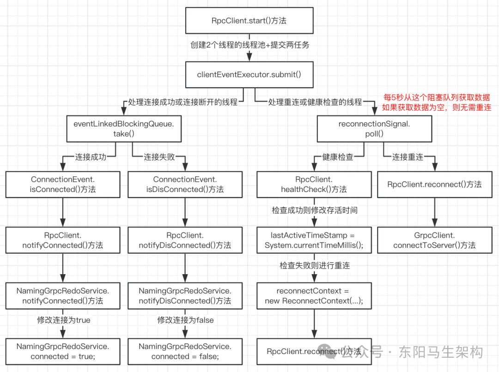

## 12.gRPC服务端如何处理客户端的建立连接请求

### (1)gRPC服务端是如何启动的

BaseRpcServer类有一个被@PostConstruct修饰的start()方法，该方法会调用BaseGrpcServer的startServer()方法来启动gRPC服务端。

在BaseGrpcServer的startServer()方法中，首先会调用BaseGrpcServer的addServices()方法添加服务，然后会使用建造者模式通过ServerBuilder创建gRPC框架的Server对象，最后启动gRPC框架的Server服务端，即启动一个NettyServer服务端。

### (2)connectionId如何绑定Client对象的

BaseGrpcServer的startServer()方法在执行addServices()方法添加服务时，就会对connectionId与Client对象进行绑定。

绑定会由GrpcBiStreamRequestAcceptor的requestBiStream()方法触发。具体就是会调用ConnectionManager.register()方法来实现绑定，即先通过执行"connections.put(connectionId, connection)"代码，将connectionId和connection连接对象，放入到ConnectionManager的connections这个Map属性中。再执行ClientConnectionEventListenerRegistry的notifyClientConnected()方法，把Connection连接对象包装成Client对象。

将Connection连接对象包装成Client对象时，又会继续调用ConnectionBasedClientManager的clientConnected()方法，该方法便会根据connectionId创建出一个Client对象，然后将其放入到ConnectionBasedClientManager的clients这个Map中，从而实现connectionId与Client对象的关联。

### (3)总结

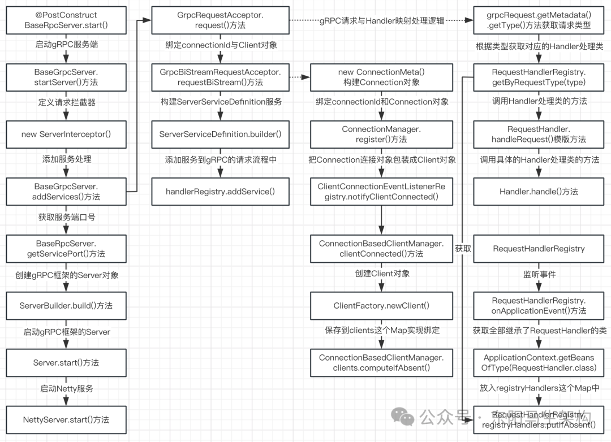

## 13.gRPC服务端如何映射各种请求与对应的Handler处理类

gRPC服务端会如何处理客户端请求，如何找到对应的Handler处理类。

在gRPC服务端启动时，会调用BaseGrpcServer的startServer()方法，其中就会执行到BaseGrpcServer的addServices()方法。在BaseGrpcServer的addServices()方法中，就会进行请求与Handler映射，也就是调用GrpcRequestAcceptor的request()方法进行请求与Handler映射。

在GrpcRequestAcceptor的request()方法中，首先会从请求对象中获取请求type，然后会通过请求type获取一个Handler对象，最后调用RequestHandler的模版方法handleRequest()，从而调用具体Handler对象的handle()方法。

## 14.gRPC简单介绍

### (1)gRPC是什么

gRPC是一个高性能、开源和通用的RPC框架。gRPC基于ProtoBuf序列化协议开发，且支持众多开发语言。gRPC是面向服务端和移动端，基于HTTP 2设计的，带来诸如双向流、流控、头部压缩、单TCP连接上的多复用请求等特。这些特性使得其在移动设备上表现更好，更省电和节省空间占用。

### (2)gRPC的特性

#### 一.gRPC可以跨语言使用

#### 二.基于IDL(接口定义语言Interface Define Language)文件定义服务

通过proto3工具生成指定语言的数据结构、服务端接口以及客户端Stub。

#### 三.通信协议基于标准的HTTP 2设计

支持双向流、消息头压缩、单TCP的多路复用、服务端推送等特性，这些特性使得gRPC在移动端设备上更加省电和节省网络流量。

#### 四.序列化支持ProtoBuf和JSON

ProtoBuf是一种语言无关的高性能序列化框架，它是基于HTTP2和ProtoBuf的，这保障了gRPC调用的高性能。

#### 五.安装简单，扩展方便

使用gRPC框架每秒可达到百万RPC。

### (3)gRPC和Dubbo的区别

#### 一.通讯协议

gRPC基于HTTP 2.0，Dubbo基于TCP。

#### 二.序列化

gRPC使用ProtoBuf，Dubbo使用Hession2等基于Java的序列化技术。

#### 三.服务注册与发现

gRPC是应用级别的服务注册，Dubbo2.0及之前的版本都是基于更细力度的服务来进行注册，Dubbo3.0之后转向应用级别的服务注册。

#### 四.编程语言

gRPC可以使用任何语言(HTTP和ProtoBuf天然就是跨语言的)，而Dubbo只能使用在构建在JVM之上的语言。

#### 五.服务治理

gRPC自身的服务治理能力很弱，只能基于HTTP连接维度进行容错，而Dubbo可以基于服务维度进行治理。

总结：gRPC的优势在于跨语言、跨平台，但服务治理能力弱。Dubbo服务治理能力强，但受编程语言限制无法跨语言使用。
