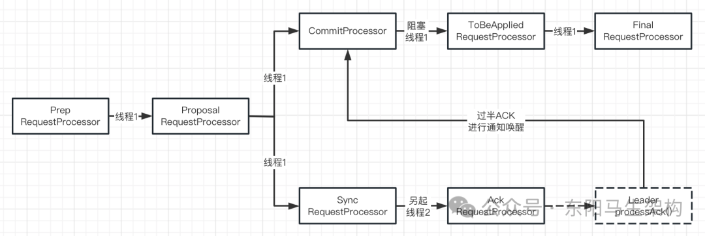
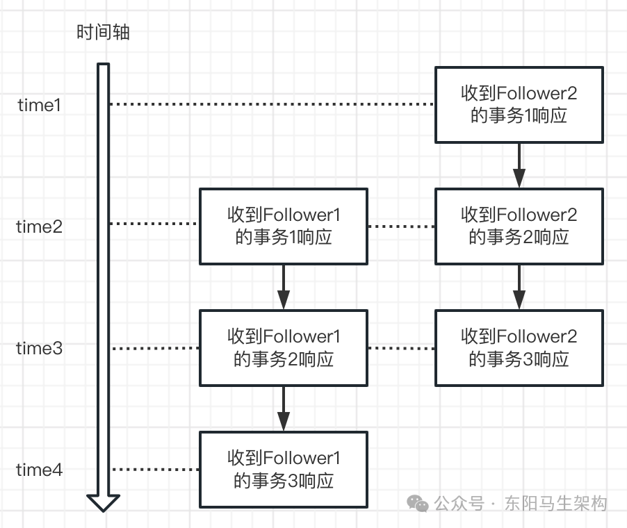
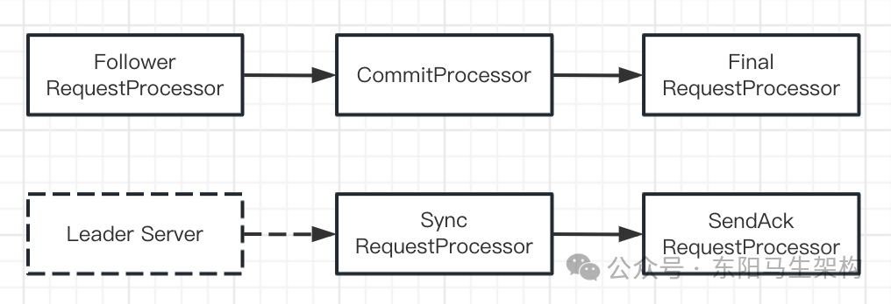
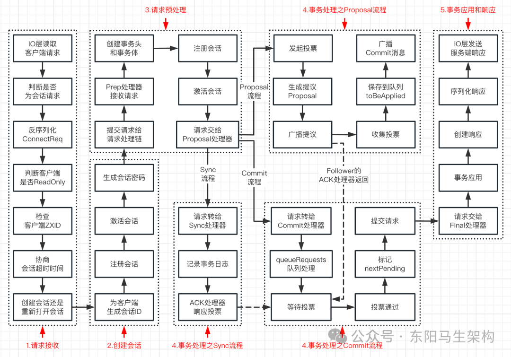
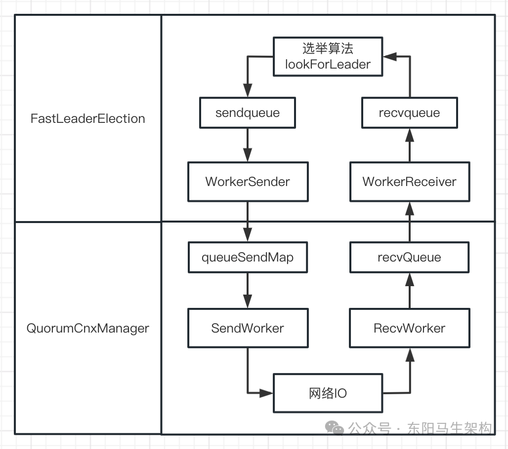
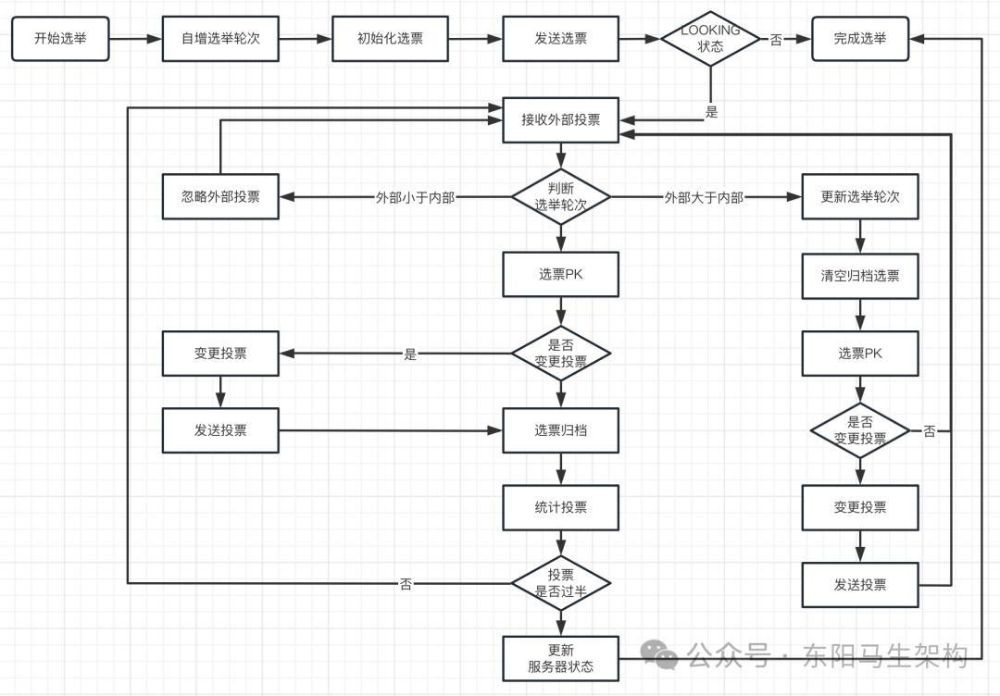

# 面试准备之ZooKeeper要点总结四

> **公众号**: 东阳马生架构  
> **发布时间**: 2025-10-09 09:00  

**大纲(15840字)**

- 1.服务器的请求处理链
- 2.服务端处理会话创建请求的流程
- 3.zk是如何实现数据一致性的
- 4.zk是如何进行Leader选举的
- 5.zk的数据存储原理之内存数据
- 6.zk的数据存储原理之事务日志
- 7.zk的数据存储原理之数据快照
- 8.zk的数据存储原理之数据初始化和数据同步流程


## 1.服务器的请求处理链

### (1)Leader服务器的请求处理链

当客户端需要和zk服务端进行相互协调通信时，首先要通过Leader服务器建立该客户端与服务端的连接会话。当会话创建成功后，zk服务端就可以接收来自客户端的请求操作了。

Leader服务器是zk集群的核心，其主要工作是：

工作一：处理事务请求，保证集群事务处理的顺序性

工作二：集群内各服务器的调度者

zk服务端会使用责任链模式来处理每一个客户端的请求。在服务端启动时，会进行请求处理链的初始化。Leader服务器的请求处理链如下图示，主要有7个请求处理器。



#### 一.PrepRequestProcessor请求预处理器

zk中的事务请求就是会改变服务器状态的请求。事务请求包括创建节点、更新节点、删除节点、创建会话等请求。

PrepRequestProcessor是Leader服务器的请求预处理器(Prepare)，它能够识别出当前客户端请求是否是事务请求，它会对事务请求进行一系列的预处理操作。这些预处理包括：创建请求事务头事务体、会话检查、ACL检查等。

PrepRequestProcessor实现了RequestProcessor接口并继承了zk线程，而且还有一个RequestProcessor类型的nextProcessor属性字段，nextProcessor属性字段的作用是指向下一个请求处理器。

Leader服务器在开始处理请求时，会调用PrepRequestProcessor的processRequest()方法将请求添加到队列。请求预处理器的线程启动后会不断从submittedRequests队列取出请求，然后把请求交给PrepRequestProcessor的pRequest()方法进行预处理。在pRequest()方法中，会根据请求类型来判断请求是否是事务请求。如果是事务请求，就调用pRequest2Txn()方法对事务请求进行预处理。之后再将请求交给nextProcessor属性字段指向的处理器进行下一步处理。

PrepRequestProcessor处理器也是一个线程，它会先把请求添加到队列，然后由线程进行处理。

PrepRequestProcessor的nextProcessor属性指向的是ProposalRequestProcessor处理器。

有两个入口会触发调用PrepRequestProcessor的processRequest()方法。

第一是Leader服务器监听到Learner转发给Leader的事务请求。也就是在不断运行的LearnerHandler线程中发现Learner给Leader发送请求时，会调用LeaderZooKeeperServer.submitLearnerRequest方法来触发。

第二是zk服务端监听到的来自客户端的事务请求。此时会先调用ZooKeeperServer的processPacket()方法处理Socket的读请求，然后再调用ZooKeeperServer的submitRequest()方法提交读请求，最后就会调用ZooKeeperServer的firstProcessor的processRequest()方法。firstProcessor的processRequest()方法执行完便进入PrepRequestProcessor。

#### 二.ProposalRequestProcessor事务投票处理器

ProposalRequestProcessor处理器是Leader服务器的事务投票处理器。它是PrepRequestProcessor请求预处理器的下一个处理器，它的主要作用是对事务请求进行处理，包括创建提议、发起投票。

对于非事务请求：它会将请求直接交给CommitProcessor处理器处理，不再做其他处理。

对于事务请求：除了将请求交给CommitProcessor处理器外，还会创建请求对应的Proposal提议，并将Proposal提议发送给所有Follower来发起一次集群内的事务投票，同时还会将事务请求交给SyncRequestProcessor处理器来记录事务日志。

提议是指：当处理一个事务请求时，zk会先在服务端发起一次投票流程。该投票的主要作用是通知zk服务端的各机器处理事务请求，从而避免因某个机器出现问题而造成事务不一致的问题。

ProposalRequestProcessor事务投票处理器的三个子流程分别是：Commit流程、Proposal流程、Sync流程。

流程一：Commit流程

完成Proposal流程后，zk服务器上的数据还没有进行任何改变。完成Proposal流程只是说明zk服务端可以执行事务请求操作了，真正执行具体数据的变更需要在Commit流程中实现。Commit流程的主要作用就是完成请求的执行。该流程是由CommitProcessor处理器来实现的。

流程二：Proposal流程

处理事务请求时，zk要取得集群中过半机器的投票才能修改数据。Proposal流程的主要工作就是投票和统计投票结果。

流程三：Sync流程

Sync流程是由SyncRequestProcessor处理器来实现的。

ProposalRequestProcessor处理器不是一个线程，它的nextProcessor就是CommitProcessor处理器，它会调用SyncRequestProcessor处理器的processRequest()方法。

#### 三.SyncRequestProcessor事务日志处理器

SyncRequestProcessor处理器是事务日志处理器。它的作用是将事务请求记录到事务日志文件中，同时触发zk进行数据快照。

SyncRequestProcessor处理器也是一个线程，它会先把请求添加到队列，然后由线程处理，它的nextProcessor是AckRequestProcessor处理器。

#### 四.AckRequestProcessor投票反馈处理器

SyncRequestProcessor的nextProcessor就是AckRequestProcessor，AckRequestProcessor是Leader特有的处理器。

它负责在SyncRequestProcessor处理器完成事务日志记录后，通过Leader的processAck()方法向Proposal提议添加来自Leader的ACK响应。也就是将Leader的SID添加到Proposal提议的投票收集器里，然后调用Leader的tryToCommit()方法检查提议是否已有过半ACK并尝试提交。

同理，如果Leader收到Follower对该Proposal提议请求返回的ACK响应，也会通过Leader的processAck()方法向提议添加来自Follower的ACK响应，也就是将Follower的SID添加到Proposal提议的投票收集器里，然后调用Leader的tryToCommit()方法检查提议是否已有过半ACK来尝试提交。

AckRequestProcessor处理器不是一个线程，它没有nextProcessor属性字段。

#### 五.CommitProcessor事务提交处理器

ProposalRequestProcessor的nextProcessor就是CommitProcessor处理器，CommitProcessor就是事务提交处理器。

对于非事务请求，CommitProcessor会将其转交给nextProcessor处理。对于事务请求，CommitProcessor会阻塞等待Proposal提议可以被提交。

CommitProcessor有个LinkedBlockingQueue队列queuedRequests。当调用CommitProcessor的processRequest()方法时，请求会被添加到该队列。CommitProcessor线程会从queuedRequests队列中取出请求进行处理。此外还通过nextPending和committedRequests队列保证请求的顺序处理。

CommitProcessor处理器也是一个线程，它会先把请求添加到队列，然后由线程处理，它的nextProcessor是ToBeAppliedRequestProcessor.

如何理解保证事务请求的顺序处理：

顺序排队的事务请求在被ProposalRequestProcessor处理的过程中，首先会执行CommitProcessor的processRequest()方法将请求加入请求队列，所以请求队列queuedRequests里面的请求是按顺序排好的。然后会生成Proposal提议发送给Follower并收集ACK响应，最后当ACK响应过半时才调用CommitProcessor的commit()方法，此时可以进行提交的请求就会被添加到CommitProcessor的committedRequests队列中。

是否会因网络原因，导致CommitProcessor的committedRequests队列里的请求并不一定按顺序排好呢？

事务请求能保证顺序处理的根本原因是：

整个Proposal消息广播过程是基于FIFO特性的TCP协议来进行网络通信的，所以能够很容易保证消息广播过程中消息接收和发送的顺序性。也就是广播时是由一个主进程Leader去通过FIFO的TCP协议进行发送的，所以每个Follower接收到的Proposal和Commit请求都会按顺序进入队列。

客户端并发执行的事务请求到达Leader时一定会按顺序入队。然后Leader对事务请求进行广播时，也会按顺序进行广播。被单一Leader进行顺序广播的多个事务请求也会顺序到达某Follower。所以某Follower收到的多个Proposal提议也会按广播时的顺序进入队列，之后某Follower都会按广播时的顺序发送ACK响应给Leader。

所以Leader收到某Follower的ACK响应都是按广播时的顺序收到的。即使Leader先收到Follower2响应的事务2，后收到Follower1的响应事务1，但最终统计过半选票时，Leader会发现事务1首先过半从而优先保证事务1的顺序。



当然，Leader的processAck()方法会先确保要被提交的请求ZXID比上次大。此外，Leader的tryToCommit()方法也会首先确保前一个事务提交了才能处理。以及Follower在接收到Proposal和Commit请求就是按顺序响应，即若Follower要提交的事务ID不是pendingTxns的头部元素，那么就退出程序。最后结合CommitProcessor里的queuedRequests \+ committedRequests \+ nextPending，于是便能保证事务请求的顺序处理。

#### 六.ToBeAppliedRequestProcessor处理器

Leader中有一个toBeApplied队列，专门存储那些可以被提交的Proposal提议。ToBeAppliedRequestProcessor会把已被CommitProcessor处理过的请求，转交给下一个处理器处理，并把请求从Leader的toBeApplied队列中移除。

ToBeAppliedRequestProcessor处理器不是一个线程，它的next是FinalRequestProcessor处理器。

#### 七.FinalRequestProcessor处理器

FinalRequestProcessor处理器用来处理返回客户端响应前的收尾工作，包括创建客户端的响应、将事务请求应用到内存数据库中。

FinalRequestProcessor处理器不是一个线程，它也没有nextProcessor属性字段。

总结：

```perl
PrepRequestProcessor的nextProcessor就是ProposalRequestProcessor；
ProposalRequestProcessor的nextProcessor就是CommitProcessor；
CommitProcessor的nextProcessor就是ToBeAppliedRequestProcessor；
ToBeAppliedRequestProcessor的next是FinalRequestProcessor；
FinalRequestProcessor没有nextProcessor属性字段；

ProposalRequestProcessor会调用SyncRequestProcessor处理器的方法；
SyncRequestProcessor的nextProcessor就是AckRequestProcessor；
AckRequestProcessor没有nextProcessor属性字段；

PrepRequestProcessor处理器是一个线程；
ProposalRequestProcessor处理器不是一个线程；
CommitProcessor处理器是一个线程；
ToBeAppliedRequestProcessor处理器不是一个线程；
FinalRequestProcessor处理器不是一个线程；

SyncRequestProcessor处理器是一个线程；
AckRequestProcessor处理器不是一个线程；
```

### (2)Follower服务器的请求处理链

Follower服务器的主要工作是：

#### 一.处理非事务请求 \+ 转发事务请求给Leader服务器

#### 二.参与事务请求的Proposal提议的投票

#### 三.参与Leader选举投票

Follower服务器的请求处理链如下图示：



Leader服务器的第一个处理器是LeaderRequestProcessor，Follower服务器的第一个处理器是FollowerRequestProcessor。由于不需要处理事务请求的投票，所以Follower服务器没有ProposalRequestProcessor处理器。

#### 一.FollowerRequestProcessor请求转发处理器

FollowerRequestProcessor主要工作是识别当前请求是否是事务请求。如果是事务请求，那么Follower就会将该事务请求转发给Leader服务器。FollowerRequestProcessor处理器会通过调用Learner的request()方法实现请求转发。Learner的request方法会往输出流leaderOs中写入请求数据来发给Leader。输出流leaderOs在Follower和Leader建立好连接时就已经初始化好了的。

#### 二.SendAckRequestProcessor投票反馈处理器

Leader的请求处理链有个叫AckRequestProcessor的投票反馈处理器，主要负责在执行完SyncRequestProcessor处理器记录好事务日志后，向Proposal提议反馈来自Leader的ACK响应。

Follower的请求处理链也有个叫SendAckRequestProcessor的投票反馈处理器，主要负责在执行完SyncRequestProcessor处理器记录好事务日志后，通过发送消息给Leader来向Proposal提议反馈来自Follower的ACK响应。

Follower请求处理链的SyncRequestProcessor处理器会启动一个线程。SyncRequestProcessor处理器会先把请求添加到队列，然后由线程处理。SyncRequestProcessor的nextProcessor就是SendAckRequestProcessor请求处理器。SendAckRequestProcessor不是一个线程。

## 2.服务端处理会话创建请求的流程

zk服务端(即Leader服务器)对会话创建请求的处理，可以分为六大环节：

```sql
(1)请求接收
一.首先读取客户端的会话创建请求
二.然后判断是否是会话创建请求
三.接着反序列化输入流成一个ConnectRequest请求
四.然后判断客户端是否readOnly客户端
五.接着检查客户端的ZXID
六.然后协商会话超时时间
七.最后判断是否需要重新创建会话

(2)会话创建
一.为客户端生成sessionID
二.注册会话
三.激活会话
四.生成会话密码

(3)请求预处理
一.将请求交给PrepRequestProcessor请求预处理器
二.创建和设置请求的事务头TxnHeader
三.创建和设置请求的事务体CreateSessionTxn
四.注册与激活会话

(4)事务处理
Sync流程
一.将请求交给ProposalRequestProcessor请求处理器处理
二.将请求交给SyncRequestProcessor请求处理器处理

Proposal流程
一.调用Leader的propose()方法发起投票
二.在Leader的propose()方法中生成Proposal提议
三.调用Leader的sendPacket()方法广播提议
四.调用Leader的processAck()方法收集投票
五.在Leader的tryToCommit()方法中将请求放入toBeApplied队列中
六.在Leader的tryToCommit()方法中广播Commit消息

Commit流程
一.将请求交给CommitProcessor请求处理器处理
二.处理queuedRequests请求队列
三.等待Proposal提议的投票
四.投票通过
五.标记nextPending
六.提交请求

(5)事务应用和响应
一.将请求交给FinalRequestProcessor请求处理器处理
二.首先进行事务应用
三.然后创建响应
四.最后序列化响应并发送给客户端
```

整体流程图如下：



### (1)请求接收环节

入口一：ServerCnxnFactory的SelectorThread线程收到来自客户端的会话创建请求。接下来的NIOServerCnxn的doIO()方法会处理客户端发来的会话创建请求，具体步骤如下：

#### 一.首先读取客户端的会话创建请求

NIOServerCnxn的doIO()方法会从Socket读取客户端的会话创建请求。一个NIOServerCnxn实例维护一个客户端连接，一个LearnerHandler实例维护一个Learner连接。客户端与服务端的所有通信都会经过NIOServerCnxn的doIO()方法进行处理。NIOServerCnxn的doIO()方法会将收到的客户端的会话创建请求读取出来。

#### 二.然后判断是否是会话创建请求

NIOServerCnxn的readPayload()方法会判断是否是会话创建请求。通过NIOServerCnxn实例是否已被初始化，来判断是否为会话创建请求。如果NIOServerCnxn实例没有被初始化，那么该请求一定是会话创建请求。

#### 三.接着反序列化输入流成ConnectRequest请求

在ZooKeeperServer的processConnectRequest()方法中对输入流进行反序列化。

#### 四.然后判断客户端是否readOnly客户端

如果当前zk服务端是以readOnly模式启动的，那么所有来自非readOnly客户端的请求都无法被处理。

#### 五.接着检查客户端的ZXID

服务端的ZXID必须大于客户端的ZXID。如果客户端发送过来的会话创建请求的ZXID大于服务端的ZXID，则抛异常。

#### 六.然后协商会话超时时间

客户端在构造ZooKeeper实例时，会有一个会话超时时间sessionTimeout。服务端接收到客户端的会话创建请求后，会结合自己的超时时间来决定。

#### 七.最后判断是否需要重新创建会话

服务端会根据会话创建请求中是否包含sessionID来判断是否需要创建会话。如果会话创建请求已包含了sessionID，则认为客户端正在进行会话重连。此时就需要执行ZooKeeperServer的reopenSession()方法重新打开会话，否则就执行ZooKeeperServer的createSession()方法创建会话。重新打开会话可能发生在两次请求前后，由不同的Follower接收到进行处理。

注意：如果客户端的会话创建请求发到了Leader服务器，则直接走入口一的流程。如果客户端的会话创建请求发到了Follower服务器，除了走入口一的流程，还要通过ZooKeeperServer的submitRequest()方法，进入FollowerRequestProcessor处理器的processRequest()方法，最后将会话创建请求转发给Leader，走入口二的流程。

入口二：Leader创建的LearnerHandler收到来自Learner转发的会话创建请求。

### (2)会话创建环节

接下来分析执行ZooKeeperServer的createSession()方法创建会话的环节。步骤如下：

#### 一.为客户端生成sessionID

根据原子类的nextSessionId来为客户端生成sessionID。

#### 二.注册会话

也就是注册会话到sessionsById和sessionsWithTimeout中。

#### 三.激活会话

也就是更新会话管理器的过期队列sessionExpiryQueue。

#### 四.生成会话密码

服务端在为客户端创建一个会话时，会同时为客户端生成一个会话密码。这个会话密码会连同会话ID一起发给客户端，作为会话在集群中通行证。

### (3)请求预处理环节

在ZooKeeperServer的createSession()方法中完成创建会话后，便会执行ZooKeeperServer的submitRequest()方法把请求提交给请求处理链。

#### 一.将请求交给PrepRequestProcessor处理器

收到的会话创建请求会交给Leader的PrepRequestProcessor请求预处理器处理。在ZooKeeperServer的submitRequest()方法把请求提交给第一个请求处理器前，会执行ZooKeeperServer的touch()方法进行一次会话的激活。之后，请求就会被PrepRequestProcessor预处理器进行处理。

#### 二.创建和设置请求的事务头TxnHeader

通过request.setHdr(new TxnHeader())创建事务头。之后就可通过request.getHdr()方法判断请求是否有事务头来识别请求是否为事务请求。

#### 三.创建和设置请求的事务体CreateSessionTxn

通过request.setTxn(new CreateSessionTxn())创建事务体。

#### 四.注册与激活会话

也就是注册会话和更新会话管理器的过期队列。由于在会话创建环节已经注册过会话和已经更新过会话管理器的过期队列了，所以这里进行会话注册和过期队列更新是为了处理Learner转发的会话创建请求。对于Learner转发的会话请求，虽然在Learner的会话管理器注册了会话，但还没在Leader的会话管理器中进行注册，因此需要在预处理器进行注册。

### (4)事务处理环节

收到的会话创建请求经过Leader的PrepRequestProcessor请求预处理器处理后，便会被下一个处理器ProposalRequestProcessor事务投票处理器处理。

ProposalRequestProcessor处理器是与Proposal提议相关的处理器，Proposal提议是zk中针对事务请求发起一个投票流程时对事务请求的包装。

从ProposalRequestProcessor事务投票处理器将请求处理分成三个流程：Commit流程、Proposal流程、Sync流程。

Sync流程：

Sync流程就是使用SyncRequestProcessor事务日志处理器记录事务日志。

ProposalRequestProcessor的processRequest()方法处理请求时，首先会判断该请求是否是事务请求，如果是则通过事务日志将其记录下来。Leader和Follower的请求处理链中都有这个事务日志处理器SyncRequestProcessor。

通过SyncRequestProcessor处理器完成事务日志记录后，Leader会由AckRequestProcessor向Leader自己发送ACK消息，每个Follower也都会由SendAckRequestProcessor向Leader发送ACK消息。从而表明每个服务器自身已完成事务日志的记录，以便Leader的Proposal提议的投票收集器可以统计投票情况。

Leader中的AckRequestProcessor处理器和Follower中的SendAckRequestProcessor处理器，最终都会触发调用Leader的processAck()方法和tryToCommit()方法，而Leader的tryToCommit()方法又会调用CommitProcessor的commit()方法进行事务提交。

Proposal流程：

zk客户端的每个事务请求都需要zk集群中过半机器投票认可才能提交到内存数据库，所以ProposalRequestProcessor处理器会执行如下Proposal流程：

#### 一.调用Leader的propose()方法发起投票

如果ProposalRequestProcessor处理器发现当前请求是事务请求，那么接下来就会调用Leader的propose()方法发起一轮事务投票。在发起事务投票前，Leader的propose()方法会先检查服务端ZXID是否可用。如果当前服务端的ZXID可用，就可以开始事务投票。

#### 二.在Leader的propose()方法中生成Proposal

根据请求创建Proposal提议对象，作为zk服务器状态的一次变更申请。

#### 三.调用Leader的sendPacket()方法广播提议

生成提议后，先将提议放入投票箱outstandingProposals队列中，然后再将该提议广播给所有的Follower服务器。

#### 四.调用Leader的processAck()方法收集投票

Follower服务器接收到Leader发过来的这个提议后，会先经过SyncRequestProcessor处理器进行事务日志记录。完成事务日志的记录后，Proposal提议请求会交给SendAckRequestProcessor处理，SendAckRequestProcessor就会发送ACK消息给Leader服务器。Leader服务器会通过LearnerHandler收到Follower发送的ACK消息，然后调用Leader的processAck()方法来统计提议的投票情况。

#### 五.在Leader的tryToCommit()方法中将请求放入toBeApplied队列中

Leader的tryToCommit()方法首先会判断提议是否获得集群过半机器的投票。如果获得则表明提议通过，接下来就会将请求放入toBeApplied队列。

#### 六.在Leader的tryToCommit()方法中广播Commit消息

当Leader的tryToCommit()方法确认提议已经可以被提交后，就会向Leader和Follower服务器发送Commit消息，让所有服务器提交事务。

注意：由于Observer服务器并未参与提议投票，因此没保存关于提议的任何消息。所以在广播Commit消息时，需要区别对待。Leader会广播一种叫INFORM的消息给Observer，该消息包含提议的内容。由于Follower服务器参与提议投票，已保存所有关于提议的消息，因此Leader只需向Follower服务器广播提议的ZXID即可。

Commit流程：

ProposalRequestProcessor请求处理器的nextProcessor就是CommitProcessor。注意：Commit流程会处理事务请求和非事务请求。

#### 一.将请求交给CommitProcessor请求处理器处理

ProposalRequestProcessor的processRequest()方法在处理请求时，首先就会将请求交给CommitProcessor请求处理器处理。CommitProcessor请求处理器收到请求后，不会立即处理，会先将请求放入queuedRequests队列中。

#### 二.处理queuedRequests请求队列

CommitProcessor会启动一个线程来处理queuedRequests请求队列，CommitProcessor会有个单独的线程处理从上一个处理器流转来的请求。

#### 三.等待Proposal提议的投票

在ProposalRequestProcessor的Commit流程处理的同时，ProposalRequestProcessor的Proposal流程会生成一个提议Proposal，然后将该Proposal提议广播给所有的Follower服务器。所以此时会阻塞Commit流程，等待Proposal提议的投票结束。

#### 四.投票通过

当Leader的tryToCommit()方法发现Proposal提议的投票通过时，会调用CommitProcessor的commit()方法。此时该方法会将请求放入到committedRequests队列中，同时唤醒被阻塞的Commit流程。

#### 五.标记nextPending

如果从queuedRequests队列中取出的请求是一个事务请求，那么就需要进行集群中各服务器之间的投票处理，同时需要将nextPending标记为当前请求。

标记nextPending的作用：一是为了确保事务请求的顺序性，二是便于CommitProcessor检测当前集群中是否正在进行事务请求的投票。

#### 六.提交请求

一旦发现committedRequests队列中已经有可以提交的请求，那么Commit流程就会开始提交请求。

在提交请求前，为了保证事务请求的顺序执行，Commit流程还会对比：标记的nextPending和committedRequests队列的第一个请求是否一致。

### (5)事务应用和响应环节

#### 一.将请求交给FinalRequestProcessor请求处理器处理

事务应用和响应环节发生在FinalRequestProcessor请求处理器中。

#### 二.首先进行事务应用

如果是会话创建请求，则进行会话创建的事务应用。如果是setData请求，则进行setData的事务应用。由于在前面只是将事务请求记录到事务日志，而内存数据库状态还未变更，因此在该环节需要将事务变更应用到内存数据库中去。

对于会话创建请求，由于会话的管理是由SessionTracker负责的。而在会话创建的环节，zk已经已经将会话信息注册到了SessionTracker中。因此此时无须对内存数据库做处理，只需再次向SessionTracker注册即可。

#### 三.然后创建响应

例如对于setData请求来说，会创建SetDataResponse响应。

#### 四.最后序列化响应并发送给客户端

调用ServerCnxn的sendResponse()方法序列化响应并发送响应给客户端。

## 3.zk是如何实现数据一致性的

zk集群中的服务器分为Leader服务器、Follower服务器及Observer服务器。Leader选举是一个过程，在这个过程中主要做了两项工作：

工作一：选举出Leader服务器

工作二：进行数据同步

zk中实现的一致性不是强一致性，而是最终一致性。即集群中各个服务器上的数据并不是每时每刻都保持一致的，而是即经过一段时间后，集群服务器上的数据才最终保持一致。

Leader服务器主要负责处理事务请求，当Leader服务器接收到客户端的事务请求时，会先向集群中的各机器针对该请求的提议发起投票询问。

### (1)数据一致性分析

zk在集群中采取的是多数原则的方式来保证数据一致性。即当一个事务请求导致服务器上的数据发生改变时，只要保证多数机器的数据都正确变更了，就可保证系统数据一致性。

因为每个Follower服务器都可以看作是Leader服务器的数据副本，所以只要保证集群中大多数机器数据是一致的，那么在集群中个别机器出现故障时，zk集群依然能保证稳定运行。

### (2)实现数据一致性的广播模式

一.首先Leader启动时会创建网络连接管理器LearnerCnxAcceptor等待Learner的连接

LearnerCnxAcceptor监听到Learner发起的连接后，会新建一个LearnerHandler实例专门负责Leader和该Learner之间的连接。启动LearnerHandler时，又会开启一个线程专门负责发送消息给Learner。如果Learner发生故障，那么Leader中为该Learner维护的LearnerHandler的ping()方法会检测到然后关闭相关线程和实例。

#### 二.然后Leader处理Learner的事务投票响应后进行事务提交

Leader有一个HashSet为forwardingFollowers，用来管理Follower服务器。当Leader对一个事务请求发起Proposal提议的投票并发现投票通过后，也就是调用如下方法时：

```sql
Leader的processAck()方法 ->
Leader的tryToCommit()方法 ->
Leader的commit()方法 ->
Leader的sendPacket()方法
```

会在Leader的sendPacket()方法中遍历forwardingFollowers里的LearnerHandler实例，将Commit请求交给Learner和Leader建立连接时生成的LearnerHandler，最后由Leader的每个LearnerHandler实例广播给对应的Learner进行事务提交。

### (3)实现数据一致性的恢复模式

当Leader故障时，Follower服务器会发生如下操作：首先Follower的followLeader()方法里的while循环会被中断运行，然后在QuorumPeer线程中就会触发执行Follower的shutdown()方法，接着执行QuorumPeer的updateServerState()方法更改节点的状态为LOOKING，之后Follower服务器在QuorumPeer线程中会重新进行Leader选举。

重新选举Leader需要经历一段时间，此时集群会短暂没有Leader服务器，而且重新选举Leader期间，Follower也会被关闭。

注意：Leader故障时，ZooKeeperServer的shutdown()方法会关闭firstProcessor线程。所以恢复模式下的选举过程中，发送到Learner的请求会进入firstProcessor，但是这些请求都会先被queuedRequests存起来，暂时不处理。

## 4.zk是如何进行Leader选举的

### (1)服务器启动时的Leader选举流程概述

一个zk服务要想满足集群运行方式，至少需要三台服务器。下面以3台机器组成的服务器集群为例。当只有一台服务器启动时，是无法进行Leader选举的。当有两台服务器启动，两台机器能相互通信时，每台机器都会试图找到一个Leader，于是便进入了Leader选举流程。

#### 一.向其他服务器发出一个投自己的投票

每个服务器刚启动时，都会将自己作为Leader服务器来生成投票。投票包括的信息是：服务器ID(SID)、事务ID(ZXID)，可记为(SID, ZXID)。该投票信息会发给集群中的其他所有机器。

#### 二.接收来自其他服务器的投票

每个服务器接收到投票后，首先会检查该投票的有效性，包括检查是否是本轮投票、是否来自LOOKING状态的服务器等。

#### 三.PK投票

每个服务器接收到投票并检查有效后，会PK自己的投票和收到的投票。

PK规则一：ZXID比较大的优先作为Leader

PK规则二：ZXID相同则SID较大的为Leader

PK出的Leader不是服务器自己，则更新自己的投票并重新把投票发出去。

#### 四.统计投票

每次投票后，都会统计所有投票，判断是否已有过半机器收到相同投票。

#### 五.改变服务器状态

一旦确定了Leader，每个服务器都会更新自己的状态。如果是Leader，那么服务器状态就变为LEADING。如果是Follower，那么服务器状态就变为FOLLOWING。

### (2)服务器运行时的Leader选举流程概述

zk集群一旦选出一个Leader，所有服务器的集群角色一般不会再发生变化。如果有非Leader挂了或新机器加入，此时是不会影响Leader的。如果Leader挂了，那么整个集群将暂时无法服务，进入新一轮Leader选举。服务器运行期间的Leader选举和启动时的Leader选举过程是一致的。

#### 一.变更状态

当Leader挂了，Follower服务器都会将其服务器状态变更为LOOKING。变更为LOOKING状态后，Follower服务器便开始进入Leader选举流程。

#### 二.向其他服务器发出一个投自己的投票

#### 三.接收来自其他服务器的投票

#### 四.PK投票

#### 五.统计投票

#### 六.改变服务器状态

### (3)Leader选举的规则

#### 一.集群进入Leader选举的情况

情况一：集群一开始启动时没有Leader

情况二：集群运行期间Leader挂了

#### 二.一台机器进入Leader选举的情况

情况一：集群中本来就已经存在一个Leader了，即该机器是加入集群的。这种情况通常是集群中的某一台机器启动比较晚，在它启动前集群已工作。对于这种情况，当该机器试图去选举Leader时，会被告知当前的Leader。于是该机器只需要和Leader建立起连接，并进行数据同步即可。

情况二：集群中确实不存在Leader。

#### 三.变更投票的规则

集群中的每台机器在发出自己的投票后，都会开始收到其他机器的投票。每台机器都会根据如下规则来PK收到的投票，并以此决定是否变更投票。每次PK投票，都是对比(vote_sid, vote_zxid)和(self_sid, self_zxid)的过程。

规则一：如果vote_zxid大于self_zxid，那么就认可收到的投票(vote_sid, vote_zxid)，并再次将该投票发送出去。

规则二：如果vote_zxid小于self_zxid，那么就坚持自己的投票(self_sid, self_zxid)，不做任何变更。

规则三：如果vote_zxid等于self_zxid，且vote_sid大于self_sid，那么就认可收到的投票(vote_sid, vote_zxid)，并再次将该投票发送出去。

规则四：如果vote_zxid等于self_zxid，且vote_sid小于self_sid，那么就坚持自己的投票(self_sid, self_zxid)，不做任何变更。

#### 四.确定Leader的规则

如果一台机器收到了过半相同投票，那么这个投票对应的SID就是Leader。哪台服务器上的数据越新，ZXID越大，那么就越有可能成为Leader。

### (4)Leader选举的实现细节

#### 一.服务器状态

QuorumPeer的ServerState枚举类列举了4种服务器状态。

```java
public class QuorumPeer extends ZooKeeperThread implements QuorumStats.Provider {
    ...
    public enum ServerState {
        //寻找Leader状态
        LOOKING,//当服务器处于该状态时，认为集群中没有Leader，因此会进入Leader选举流程
        //跟随者状态
        FOLLOWING,//表明当前服务器的集群角色是Follower
        //领导者状态
        LEADING,//表明当前服务器的集群角色是Leader
        //观察者状态
        OBSERVING;//表明当前服务器的集群角色是Observer
    }
    ...
}
```

#### 二.投票数据结构

```cpp
public class Vote {
    final private long id;//被选举的Leader的SID
    final private long zxid;//被选举的Leader的ZXID
    final private long electionEpoch;//选举轮次，每次进入新一轮的投票后，都会对该值加1
    final private long peerEpoch;//被选举的Leader的epoch
    final private ServerState state;//当前服务器的状态
    ...
}
```

#### 三.网络连接管理器QuorumCnxManager

```
ClientCnxn是zk客户端用于处理客户端请求的网络连接管理器；
ServerCnxnFactory是zk服务端用于处理客户端请求的网络连接工厂；
LearnerCnxAcceptor是Leader用来处理Learner连接的网络连接管理器；
LearnerHandler是Leader用来处理Learner请求的网络处理器；
QuorumCnxManager是QurumPeer处理Leader选举的网络连接管理器；
```

每个服务器启动时，都会启动一个QuorumCnxManager。QuorumCnxManager会负责Leader选举过程中服务器间的网络通信。

QuorumCnxManager的核心数据结构：

```
消息接收队列：recvQueue
各服务器的消息发送队列集合：queueSendMap
各服务器的发送器集合：senderWorkerMap
各服务器的最近发送消息集合：lastMessageSent
```

```swift
public class QuorumCnxManager {
    //消息接收队列，用于存放从其他服务器接收到的消息
    public final ArrayBlockingQueue<Message> recvQueue;
    //各服务器对应的消息发送队列集合，用于保存那些待发送的消息，按SID分组，保证各台机器间的消息发送互不影响
    final ConcurrentHashMap<Long, ArrayBlockingQueue<ByteBuffer>> queueSendMap;
    //各服务器对应的发送器集合，按SID分组，每一台服务器都对应一个SendWorker发送器负责消息的发送
    final ConcurrentHashMap<Long, SendWorker> senderWorkerMap;
    //各服务器对应的最近发送消息集合，在这个集合中会为每个SID保留最近发送过的一个消息
    final ConcurrentHashMap<Long, ByteBuffer> lastMessageSent;
    ...
}
```

#### 四.建立连接和消息接收与发送

为了能够相互投票，zk集群中的所有机器都需要两两建立网络连接。QuorumCnxManager启动时，会创建一个ServerSocket来监听3888端口。开启监听后，服务器就能接收到其他服务器发起的创建连接请求。在QuorumPeer启动时，会通过Election的lookForLeader()方法来发起连接。

服务器在收到其他服务器的连接请求时，会由QuorumCnxManager的receiveConnection()方法处理。为了避免两台机器重复创建TCP连接，zk设计了一套建立TCP连接的规则：只允许SID大的服务器主动和其他服务器建立连接，否则断开当前连接。

在QuorumCnxManager的receiveConnection()方法中，服务器会通过对比自己和远程服务器的SID值来判断是否接受连接请求。如果当前服务器发现自己的SID值更大，那么会断开当前连接，然后自己主动去和远程服务器建立连接。

一旦建立起连接，就会根据远程服务器的SID，创建并启动相应的消息发送器SendWorker和消息接收器RecvWorker。

消息的接收过程是由消息接收器RecvWorker负责的，zk服务器会为每个远程服务器单独分配一个消息接收器RecvWorker。每个RecvWorker只需不断从TCP连接中读取消息保存到recvQueue队列中。

消息的发送过程是由消息发送器SendWorker负责的，zk服务器会为每个远程服务器单独分配一个消息发送器SendWorker。每个SendWorker只需不断从对应的消息发送队列获取消息进行发送即可。

一旦zk服务器发现针对当前远程服务器的消息发送队列为空，那么就从lastMessageSent中取出一个最近发送的消息进行再次发送，以此解决上次发送的消息没有被接收到和没有被正确处理的问题。

#### 五.FastLeaderElection的选票管理

FastLeaderElection的核心数据结构：

选票发送队列：sendqueue

选票接收队列：recvqueue

选票管理器：messenger

选票接收器：WorkerReceiver

选票发送器：WorkerSender

选票接收器WorkerReceiver会不断从QuorumCnxManager中，获取其他服务器发来的选举投票消息并转换成一个选票，然后保存到recvqueue选票接收队列中。在此过程中，如果发现其他服务器发来的投票的选举轮次小于当前服务器，那么就直接忽略这个其他服务器发来的投票，同时立即发出自己的投票。

选票发送器WorkerSender会不断从sendqueue队列中获取待发送的选票，并将其传递给QuorumCnxManager中进行发送。

如下是选票管理各组件间的协作图：



### (5)Leader选举算法的实现流程

当zk服务器检测到当前服务器状态为LOOKING时，就会触发Leader选举，也就是调用FastLeaderElection的lookForLeader()方法来进行Leader选举。Leader选举算法的具体流程如下：



#### 一.自增选举轮次

FastLeaderElection.logicalclock用于标识当前Leader的选举轮次，Leader选举规定所有有效的投票都必须在同一轮次中。

#### 二.初始化选票

在开始新一轮投票之前，每个服务器都会首先初始化自己的选票。在初始化阶段，每个服务器都会将自己推荐为Leader。

#### 三.发送初始化选票

在完成选票的初始化后，服务器就会发起第一次投票。zk会将刚刚初始化好的选票放入sendqueue选票发送队列中，然后由选票发送器WorkerSender负责发送出去。

#### 四.接收外部投票

接着通过一个while循环不断从recvqueue选票接收队列中获取外部投票。如果服务器发现无法获取到任何的外部投票，那么就会确认和其他服务器建立的连接是否还有效。如果发现连接没有效，那么就会马上建立连接。如果连接还有效，那么就再次发送服务器自己的内部投票。

#### 五.判断选举轮次

判断选举轮次的原因：只有在同一个选举轮次的投票才是有效的投票。

情况一：如果外部投票的选举轮次大于内部投票，那么服务器会先更新自己的选举轮次logicalclock。然后清空所有已经收到的投票，即清空归档选票集合recvset。接着让内部投票和外部投票进行PK以确定是否要变更内部投票。

情况二：如果外部投票的选举轮次小于内部投票，那么服务器会直接忽略该外部投票，不做任何处理。

情况三：如果外部投票的选举轮次等于内部投票，那么就让内部投票和外部投票进行PK。

#### 六.选票PK

在接收到来自其他服务器的有效的外部投票后，接着通过FastLeaderElection的totalOrderPredicate()方法进行选票PK。主要从选举轮次、ZXID、和SID来考虑。如果外部投票的选举轮次大，则进行投票变更。如果选举轮次一致，且外部投票的ZXID大，则进行投票变更。如果选举轮次+ZXID一致，且外部投票的SID大，也进行投票变更。

#### 七.变更投票

也就是使用外部投票的选票信息来覆盖内部投票。

#### 八.选票归档

无论是否变更投票，都会将收到的有效的外部投票放入选票集合recvset。recvset会按SID记录当前服务器在本轮次的选举中收到的所有外部投票。

#### 九.统计投票

完成选票归档后，就可以开始统计投票了。统计投票就是确定是否已有过半服务器认可当前的内部投票。如果是，则终止投票；否则，继续接收外部投票进行处理。

#### 十.更新服务器状态

判断被过半服务器认可的投票对应的Leader是否是自己。如果是自己，则更新服务器状态为LEADING，否则FOLLOWING。

注意finalizeWait：

如果统计投票发现已经有过半的服务器认可了当前的投票，那么zk并不会立即更新服务器状态，而是会等待一段finalizeWait时间(200毫秒)来确定是否有新的更优的投票。

## 5.zk的数据存储原理之内存数据

从数据存储位置角度看，zk产生的数据可以分为内存数据和磁盘数据。从数据的种类和作用看，又可以分为事务日志数据和全量数据快照。

zk的数据模型是一棵树。zk存储了整棵树的内容，包括所有的节点路径、节点数据及ACL信息等。zk会定时将整棵树的数据存储到磁盘上。

### (1)DataNode

DataNode是数据存储的最小单元，DataNode会保存：节点的数据内容、ACL列表、节点状态和子节点列表。

### (2)DataTree和nodes

DataTree是zk内存数据存储的核心，代表了内存中的一份完整数据，它不包含任何与网络、客户端连接以及请求处理相关的逻辑。DataTree用于存储所有zk节点的路径、内容及其ACL信息，它的核心存储结构是一个ConcurrentHashMap类型的nodes。

在DataTree.nodes这个Map中，存放了zk上所有的数据节点。对zk数据的所有操作，都是对DataTree.nodes这个Map进行操作的。DataTree.nodes的key是节点路径path，value是节点内容DataNode。DataTree.ephemerals专门存储了zk的临时节点，以便实时访问和及时清理。

### (3)ZKDatabase

ZKDatabase是zk的内存数据库，它负责管理zk的所有会话、DataTree存储和事务日志，它会定时向磁盘dump数据快照。在zk服务器启动时会通过磁盘上的事务日志和快照文件恢复ZKDatabase。

## 6.zk的数据存储原理之事务日志

### (1)事务日志的存储

部署zk集群时需要默认配置一个目录dataDir，用于存储事务日志文件。zk中也可以为事务日志单独分配一个文件存储目录dataLogDir。

zk的事务日志文件都具有两个特点：

#### 一.文件大小都是64M

#### 二.文件名后缀都是一个十六进制的、写入文件的第一条事务记录的ZXID

使用ZXID作为后缀，可迅速定位某一个事务操作所在的事务日志文件。由于ZXID的高32位当表当前Leader周期，低32位代表事务操作的计数器。所以将ZXID作为文件后缀，可以清楚看出当前运行的zk的Leader周期。

### (2)事务日志的写入之FileTxnLog的创建

zk会通过FileTxnLog类来实现事务日志的写入操作。zk服务端启动时会先创建数据管理器FileTxnSnapLog，在FileTxnSnapLog的构造方法中便会创建FileTxnLog实例。

### (3)事务日志的写入之FileTxnLog写入日志的步骤

FileTxnLog中进行事务日志的写入操作是由append()方法来负责的。

#### 一.确定是否有事务日志文件可写，如果没有就创建一个事务日志文件

当zk服务器启动完需要进行第一次事务日志写入或上一个事务日志写满时，zk服务器都不会和任意一个事务日志文件进行关联。所以在进行事务日志写入前，FileTxnLog会先判断logStream是否为空，来判断FileTxnLog实例是否已经关联上一个可写的事务日志文件。

如果为空则根据该事务操作相关的ZXID作为后缀来创建一个事务日志文件，然后构建事务日志文件头信息：魔数 + 版本号 + dbid，接着将事务日志文件头信息写入到事务日志文件流中，最后将事务日志文件流fos添加到streamsToFlush。

#### 二.确定事务日志文件是否需要扩容--即预分配

当检测到当前事务日志文件剩余空间不足4096字节时，就会开始进行扩容。扩容过程就是在现有文件大小的基础上，将文件增加64M+使用0进行填充。由于事务日志的写入过程可以看成是一个磁盘IO过程，所以文件的写入操作会触发磁盘IO为文件开辟新的磁盘块，即磁盘Seek。为了避免磁盘Seek频繁出现，zk在创建文件初就预分配一个64M磁盘块。一旦已分配的文件空间不足4K时，那么将会再次预分配，从而避免每次事务日志写入时由于文件大小的增长而带来的Seek开销。

#### 三.对事务头和事务体进行序列化生成一个字节数组

事务序列化包括对事务头TxnHeader和事务体Record的序列化。

#### 四.生成Checksum来保证事务日志文件的完整性和数据的准确性

为了保证事务日志文件的完整性和数据的准确性，在写入事务日志到文件前，会根据序列化的字节数组来计算Checksum。

#### 五.将序列化后的事务头、事务体和Checksum写入到文件流中

由于zk使用BufferedOutputStream，此时写入的数据并非写入到文件。

#### 六.SyncRequestProcessor处理器会触发将事务日志刷入磁盘

前面的步骤已经将事务操作日志写入了文件流中，但由于缓存的原因，这些事务操作日志还无法实时地写入磁盘文件中。因此zk会通过SyncRequestProcessor处理器发起事务日志刷盘操作，最终会调用到FileTxnLog的commit()方法来将事务日志刷入磁盘。也就是当需要刷盘的事务请求达到1000个时，才发起强制刷盘操作。FileTxnLog的commit()方法会从streamsToFlush中提取出文件流，然后调用FileChannel的force()方法强制将数据刷入磁盘文件中，而FileChannel的force()方法会调用到底层的fsync接口。

### (4)事务日志截断

为了避免某Learner机器上的事务ID比Leader的还要大(peerLastZxid)，只要集群中存在Leader，所有机器都必须与该Leader数据保持同步。

因此，只要发现一台Learner机器出现这样的情况，Leader就会发送TRUNC命令给该Learner，要求进行事务日志截断。该Learner收到命令后，就会删除所有大于peerLastZxid的事务日志文件。

## 7.zk的数据存储原理之数据快照

### (1)文件存储

#### 一.数据快照文件和事务日志文件的命名规则一样

#### 二.数据快照文件没有采用事务日志文件中的预分配机制

#### 一.数据快照文件和事务日志文件的命名规则一样

数据快照文件也是使用ZXID的十六进制来作为文件名后缀，数据快照文件名的后缀标识了本次数据快照开始时的服务器最新ZXID。在数据恢复阶段，zk会根据该ZXID来确定数据恢复的起始点。

#### 二.数据快照文件没有采用事务日志文件中的预分配机制

所以不会像事务日志文件那样，文件内容中包含大量的0。由于每个数据快照文件中的所有内容都是有效的，因此数据快照文件的大小能一定程度反映当前zk内存中全量数据的大小。

### (2)数据快照过程

zk会将客户端的每一次事务操作都记录到事务日志中。zk在进行若干次事务日志记录后，会将内存的全量数据Dump到文件中，这个过程就是数据快照。可以使用snapCount参数来配置每次数据快照间的事务操作次数，也就是zk会在snapCount次事务日志记录后执行一次数据快照。

FileSnap负责维护数据快照文件对外的接口，包括数据快照的写入和读取，数据快照的过程如下：

#### 一.确定是否需要进行数据快照

每执行一次事务日志记录后，zk都会检测当前是否需要进行数据快照。理论上进行snapCount次事务操作后就会开始进行数据快照。但考虑到数据快照会对所在机器的整体性能造成一定影响，所以需要尽量避免zk集群中的所有机器都在同一时刻进行数据快照。因此在zk的具体实现中，会采取"过半随机"策略来进行数据快照。

```apache
logCount > (snapCount / 2 + randRoll)
```

其中logCount代表当前已经记录的事务日志数量，而randRoll代表1到snapCount/2之间的随机数。所以如果snapCount配置为10000，那么zk会在5000到10000次事务日志记录后进行一次数据快照。

#### 二.切换事务日志文件

也就是当前的事务日志已经写满了，已经写入了snapCount条事务日志，需要重新创建一个新的事务日志文件。

#### 三.创建数据快照异步线程

为保证数据快照不影响z的主流程，会创建一个异步线程来进行数据快照。

#### 四.获取全量数据和会话信息

数据快照本质上就是将内存中的所有节点信息和会话信息保存到磁盘中，所以会先通过ZKDatabase的getDataTree()方法获取到DataTree，然后再通过ZKDatabase的getSessionWithTimeOuts()方法获取会话信息。

#### 五.生成数据快照文件名

zk会根据当前已提交的最大ZXID来生成数据快照文件名。

#### 六.执行FileSnap.serialize方法进行数据序列化

首先会序列化文件头信息：魔数 + 版本号 + dbid，然后序列化DataTree和会话信息，接着生成一个Checksum，再一起写入数据快照文件中。

## 8.zk的数据存储原理之数据初始化和数据同步流程

### (1)zk的数据初始化流程

zk的数据初始化过程，其实就是从磁盘中加载数据的过程，包括从数据快照文件中加载数据和根据事务日志文件来订正数据两个过程。

#### 一.初始化FileTxnSnapLog

FileTxnSnapLog是zk的事务日志和数据快照访问层，FileTxnSnapLog是用来衔接上层业务和底层数据存储的。底层数据存储包含了事务日志和数据快照两部分。因此FileTxnSnapLog的初始化包括FileTxnLog和FileSnap的初始化，分别代表事务日志管理器和数据快照管理器的初始化。

#### 二.初始化ZKDatabase

完成FileTxnSnapLog的初始化，就完成了zk服务器和底层数据存储的对接。接下来就会初始化ZKDatabase：首先会创建一个初始化的DataTree，然后创建一个用于保存客户端会话超时时间的记录器，接着将初始化好的FileTxnSnapLog交给ZKDatabase。

#### 三.创建PlayBackListener监听器

PlayBackListener监听器主要用来接收事务应用过程中的回调。在zk数据恢复后期，会有一个事务订正的过程。这个过程中，就会回调PlayBackListener监听器来进行数据订正。

#### 四.开始处理数据快照文件

完成内存数据库ZKDatabase的初始化后，就可以从磁盘中恢复数据了。

#### 五.获取最新的100个数据快照文件

不能只获取最新的那个数据快照文件，因为有可能该文件是不可用的。

#### 六.逐个解析数据快照文件

获取到这最多100个的最新数据快照文件后，zk会开始逐个解析。首先会对数据快照文件里的二进制数据反序列化，然后对文件进行CheckSum校验以确定快照文件的正确性。如果校验通过，那么就可以完成解析了。也就是说：只有当最新的数据快照文件不可用时，才会逐个进行解析。如果解析完这100个文件都无法恢复一个完整的DataTree和Session集合，则认为无法从磁盘中加载数据，服务器启动失败。

#### 七.根据数据快照文件的文件名获取最新的ZXID

此时已基于数据快照文件构建了一个完整的DataTree实例和Session集合，所以接着会根据这个数据快照文件的文件名来解析出一个最新的ZXID。此时zk服务器的内存数据库已有一份近似全量的数据了，已完成从数据快照文件中加载数据的过程。

#### 八.开始处理事务日志文件

由于此时zk服务器的内存数据库已有一份近似全量的数据了，所以接下来要进行根据事务日志文件来订正数据的过程。

#### 九.获取所有最新ZXID之后提交的事务

根据恢复的内存数据库的最新ZXID，从事务日志文件中获取该ZXID之后提交的所有事务。

#### 十.进行事务应用

将获取到的事务应用到基于数据快照文件恢复出的DataTree和Session中。每当有一个事务被应用到内存数据库后，需要回调PlayBackListener监听。以便将该事务操作记录转换成Proposal保存到ZKDatabase.commitedLog，让Learner可以进行快速同步。

#### 十一.获取最新ZXID

#### 十二.校验epoch

### (2)zk的数据同步流程

当集群完成Leader选举后，Learner会向Leader进行注册。当Learner向Leader完成注册后，就会进入数据同步环节。数据同步过程就是：Leader将那些没有在Learner提交过的事务请求同步给Learner。

#### 一.Leader获取Learner状态

在Learner向Leader注册的最后阶段，Learner会发送Leader一个ACK消息。Leader会从该消息中解析出该Learner的currentEpoch和lastZxid。

#### 二.Leader进行数据同步初始化

在开始数据同步前，Leader会进行数据同步初始化。首先会从zk的内存数据库中提取出事务请求对应的提议缓存队列，然后完成对以下三个ZXID值的初始化：

```
peerLastZxid：Learner最后处理的ZXID
minCommittedLog：Leader的提议缓存队列committedLog中最小ZXID
maxCommittedLog：Leader的提议缓存队列committedLog中最大ZXID
```

注意：数据初始化流程中回调PlayBackListener监听，就会触发数据同步流程中的初始化环节：添加请求到提议缓存队列等。

#### 三.Leader在Learner完成注册后解析Learner最后处理的ZXID

#### 四.Leader执行LearnerHandler.syncFollower方法决定以那种方式进行同步

方式一：直接差异化同步(DIFF同步)，peerLastZxid介于minCommittedLog与maxCommittedLog之间。

方式二：先回滚再差异化同步(TRUNC + DIFF同步)，peerLastZxid介于minCommittedLog与maxCommittedLog之间，但是Leader虽已将事务记录到了本地事务日志文件，却没能发起Proposal流程就挂了。

方式三：仅回滚同步(TRUNC同步)，peerLastZxid大于maxCommittedLog。

方式四：全量同步(SNAP同步)，peerLastZxid小于minCommittedLog，或者Leader没有提议缓存队列且peerLastZxid不等于Leader.lastProcessZxid。
