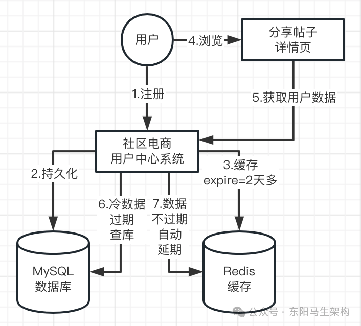

# 面试准备之项目要点总结三

> **公众号**: 东阳马生架构  
> **发布时间**: 2025-10-22 09:00  

**大纲(14490字)**

- 1.Redis缓存架构的典型生产问题
- 2.用户数据在读多写少场景下的缓存设计
- 3.热门用户数据的缓存自动延期机制
- 4.缓存惊群与穿透问题的解决方案
- 5.缓存和数据库双写不一致问题分析
- 6.基于分布式锁保证缓存和数据库双写一致性
- 7.缓存和数据库双写在分布式锁高并发下的优化
- 8.利用分布式锁自动超时消除串行等待锁的影响
- 9.写少读多的缓存架构设计总结
- 10.购物车的复杂缓存与异步落库(Sorted Set + Hash -> hPut + zadd)
- 11.购物车异步落库与完整加入流程(缓存雪崩 + MQ异步出现问题)
- 12.购物车的阈值检查与重复加入逻辑(hGet + hLen + hFieldExists)
- 13.购物车加入商品多线程并发问题解决(分布式锁保证请求幂等)
- 14.购物车的查询、更新功能(zrevrange +hGetAll + zremove+ hDel)
- 15.购物车的选中提交功能
- 16.简单总结


## 1.Redis缓存架构的典型生产问题

Redis的典型生产问题如下：

问题一：热key问题

热key就是某个key形成了热点。比如某明星突然官宣离婚，那么就会出现大量用户瞬时涌入该明星微博进行围观的情况。从而出现瞬时百万级千万级请求去获取Redis某个key的数据，这就是热key问题。

对于社区电商APP来说，如果有一个比较好的帖子分享和团购活动，那么也有可能短时间内引发大量用户把这该帖子详情页分享到微信等社交应用。从而引发大量用户在短时间内查看该分享详情页，最后造成Redis热key问题。

问题二：大value问题

存储的key-value特别大，比如value多达10M。这个value如果被频繁读取，那么就有可能把Redis机器的网络带宽打满，阻塞别的请求。

问题三：缓存穿透击穿问题

缓存穿透是指缓存和数据库中都没有的数据，而用户不断发起请求(布隆过滤器或设置空对象)。缓存击穿是指缓存中没有但数据库中有的数据(一般是缓存时间到期)，这时由于并发请求特别多，同时读缓存没读到数据，又同时去数据库去取数据。

问题四：缓存失效和LRU被清理的问题

缓存数据设置了过期的时间，到期失效后应该如何来处理。Redis如果内存满了，LRU算法会自动淘汰一些数据，对于这些数据应该如何进行处理，如何才能实现自动加载和重建。

问题五：缓存雪崩问题

缓存雪崩是指缓存中数据大批量到过期时间，而查询量巨大，引起数据库压力过大甚至宕机。和缓存击穿不同的是：缓存击穿是指并发查同一条数据，缓存雪崩是不同数据都过期了。

如果Redis集群都崩掉了，只有数据库可以访问。那么首先就需要自动识别出缓存故障，然后马上进行限流对数据库进行保护，不让数据库崩溃，以及马上启动各个接口的降级机制。

各个接口的降级机制可以提前在JVM内存里，准备少量缓存作为降级备用数据。所以每个接口都需要有一个降级方案，一旦出现缓存故障，那么就可以自动限流避免数据库崩溃。

限流 -> 降级 -> 把JVM内存里缓存的默认数据给用户或者 直接对用户进行提醒。

问题六：数据库的一致性问题

缓存数据和数据库之间的一致性的保障，双写、异步同步如何保证一致性。

Redis生产总结：

Redis上了生产以后，首先需要模拟出足量的数据写入Redis里，比如模拟出千万级数据量写入部署好的Redis集群中。然后进行高并发压测，并通过CacheCloud进行监控运维。监控出有多少个缓存节点、里面放了多少G数据、大压力下接口性能如何、QPS多少、Redis机器负载如何、缓存命中率如何、数据库回源比例是多少、演示Redis节点故障的主从切换、演示Redis集群扩容等。

## 2.用户数据在读多写少场景下的缓存设计

具体的缓存设计如下：

#### 一.新增或更新用户时先获取分布式锁，避免短时间发生多次请求出现重复新增或更新

#### 二.用户数据会先写数据库，再写Redis缓存

#### 三.用户数据属于读多写少场景下的数据，适合用缓存支持高并发场景下的读取

#### 四.由于大部分用户数据属于冷门数据，故其缓存的过期时间设置为2天加随机几小时

#### 五.如果后面有请求需要频繁访问某条用户数据，那么可以不断延长(重置)其缓存的过期时间

示例代码如下：

```cs
@Override
public SaveOrUpdateUserDTO saveOrUpdateUser(SaveOrUpdateUserRequest request) {
    //新增或更新用户时先需要获取分布式锁，避免短时间发生多次请求出现重复新增或更新，保证幂等性
    String userUpdateLockKey = RedisKeyConstants.USER_UPDATE_LOCK_PREFIX + request.getOperator();
    boolean lock = redisLock.lock(userUpdateLockKey);

    if (!lock) {
        log.info("获取锁失败，operator:{}", request.getOperator());
        throw new BaseBizException("新增/修改失败");
    }

    try {
        //用户数据先写入数据库
        CookbookUserDO cookbookUserDO = cookbookUserConverter.convertCookbookUserDO(request);
        cookbookUserDO.setUpdateUser(request.getOperator());
        if (Objects.isNull(cookbookUserDO.getId())) {
            cookbookUserDO.setCreateUser(request.getOperator());
        }
        cookbookUserDAO.saveOrUpdate(cookbookUserDO);
        CookbookUserDTO cookbookUserDTO = cookbookUserConverter.convertCookbookUserDTO(cookbookUserDO);

        //用户数据写入数据库后，再写入Redis缓存，并生成随机的过期时间
        //每条用户数据都会在Redis里缓存2天加上随机几小时
        //这样后续出现高并发读取用户数据时，就可以直接从Redis缓存里获取用户数据了
        //而且用户数据一般是不会变化的，属于读多写少场景下的数据
        //像这种读多写少场景下的数据，就非常适合用缓存来支持高并发场景下的读取

        //此外，由于大部分用户数据不会被经常读取，所以可以设置默认来2天多就可以过期了
        //如果后面有请求需要访问这条用户数据，但在缓存里没找到，那么再从数据库里加载出写入缓存即可
        //如果后面有请求需要频繁访问这条用户数据，那么可以不断延长其缓存的过期时间
        redisCache.set(RedisKeyConstants.USER_INFO_PREFIX + cookbookUserDO.getId(),
            JsonUtil.object2Json(cookbookUserDTO), CacheSupport.generateCacheExpireSecond());

        SaveOrUpdateUserDTO dto = SaveOrUpdateUserDTO.builder().success(true).build();
        return dto;
    } finally {
        redisLock.unlock(userUpdateLockKey);
    }
}

public interface CacheSupport {
    Integer TWO_DAYS_SECONDS = 2 * 24 * 60 * 60;
    //生成缓存过期时间：2天加上随机几小时
    static Integer generateCacheExpireSecond() {
        return TWO_DAYS_SECONDS + RandomUtil.genRandomInt(0, 10) * 60 * 60;
    }
}
```

## 3.热门用户数据的缓存自动延期机制

由于用户数据是属于读多写少场景下的数据，所以在新增或更新时对其进行缓存是很合适的。进行缓存后，在其他各种场景下，获取用户数据时就可以直接从缓存里进行读取。

为什么对用户数据进行缓存时，过期时间被设定为：2天加上随机几小时？

因为只有少数的用户数据是热门数据，这些用户发表的分享会占据绝大部分的浏览量。而大部分的用户数据都是冷门数据，这些用户发表的分享几乎没有多少浏览量。因此没有必要让所有的用户数据都驻留在缓存里，占用缓存宝贵的内存空间。

如果缓存好的某用户数据后续没有被访问，那么就让它过期即可。当过一段时间后有请求需要访问该用户数据时，再重新回源数据库进行查询并写入缓存。

如果缓存好的一条用户数据后续被不断请求访问，成为了热门用户数据。那么每次访问该用户数据，可以延长(重置)其缓存的过期时间。这样就可以从热门数据一直都可以从缓存里读取，实现高并发读。

注意：从缓存里获取不到用户数据，需要回源数据库进行查询并写入缓存时，首先要加分布式锁。



```kotlin
@Override
public CookbookUserDTO getUserInfo(CookbookUserQueryRequest request) {
    Long userId = request.getUserId();
    //先从缓存中尝试获取用户数据
    CookbookUserDTO user = getUserFromCache(userId);
    if (user != null) {
        return user;
    }
    //回源数据库进行读取
    return getUserInfoFromDB(userId);
}

private CookbookUserDTO getUserFromCache(Long userId) {
    String userInfoKey = RedisKeyConstants.USER_INFO_PREFIX + userId;
    String userInfoJsonString = redisCache.get(userInfoKey);
    log.info("从缓存中获取用户信息,userId:{},value:{}", userId, userInfoJsonString);

    if (StringUtils.hasLength(userInfoJsonString)) {
        //通过设置空值来防止缓存穿透
        if (Objects.equals(CacheSupport.EMPTY_CACHE, userInfoJsonString)) {
            return new CookbookUserDTO();
        }
        //每次有读请求，就自动延长过期时间
        redisCache.expire(RedisKeyConstants.USER_INFO_PREFIX + userId, CacheSupport.generateCacheExpireSecond());
        CookbookUserDTO dto = JsonUtil.json2Object(userInfoJsonString, CookbookUserDTO.class);
        return dto;
    }

    return null;
}
```

## 4.缓存惊群与穿透问题的解决方案

### (1)用户数据写入和查询时的缓存设计总结

写入用户数据时，会对数据库和缓存进行双写，缓存默认2天多随机时间过期。如果用户数据被频繁读取，那么其缓存就会不停地自动延期(重置)。如果用户数据没被读取，那么就按默认设定自动过期，避免占用缓存空间。当用户数据不能从缓存中读取到，则先从数据库里查出来，然后再放入缓存里。

### (2)设置过期时间为2天加随机几小时的原因

随机几小时是为了避免缓存惊群问题。如果缓存的一批数据的过期时间都设置一样，那么就会出现大量缓存同时过期的情况。这会造成大量的瞬时请求去访问MySQL，对MySQL造成压力。为了避免该问题，可以设置缓存数据的过期时间都是随机的，不集中在某个时间点一起过期。

惊群效应是技术里的术语，指的是突然在某个时间点出了一个故障，导致一大片范围线程、进程、机器都同时被惊动了。

### (3)缓存穿透问题的解决方案

缓存穿透是指缓存和数据库中都没有的数据，而用户不断发起请求(布隆过滤器或设置空对象)。如果大量请求的是同一批key(缓存和DB都没数据)，则可以对这些key缓存一个空对象。如果大量请求的是不同的key(缓存和DB都没数据)，则可以使用布隆过滤器过滤这些key。所以对从DB查出空数据的key缓存空对象，也不一定完全解决缓存穿透问题。

使用布隆过滤器过滤key时，应该是对DB里的所有数据进行添加，在查询缓存前过滤。但是如果在查询缓存前对所有key进行过滤(高风险方案)，那么就存在很大风险。因为如果过滤所有key就发生了故障，那么可能会导致所有数据都被误判为没有数据。

所以可以考虑默认采用设置空对象来避免缓存穿透，然后统计这种缓存穿透对DB的请求数。如果请求数超出一定阈值，则说明有大量请求都是不同的key了，设置空对象无法避免，此时再升级为布隆过滤器来避免这种缓存穿透。

## 5.缓存和数据库双写不一致问题分析

### (1)对缓存和数据库双写时发生不一致的场景

某用户数据在Redis的缓存已经过期了，此时刚好有两个线程分别并发去对给用户数据进行读取和更新。第一个线程在读取时，发现缓存没有数据，于是就去读库，读完库后会更新缓存。第二个线程在更新时，会先更新数据库，然后再更新缓存。以上两个线程也刚好对应了写缓存的两个场景。

由于这两个线程并发执行，那么就可能出现如下产生不一致的场景：第一个线程首先读库读到了旧值，还没来得及将读到的旧值写入缓存时。第二个线程的新值更新已经完成了写库和写缓存，此时缓存数据是最新的。接着才轮到第一个线程进行写缓存，但是这时候写的数据却是一开始读到的旧值。于是第一个线程写缓存时就把缓存里的最新数据给覆盖了，从而出现数据库里的是新数据，但缓存里的是旧数据，产生了不一致。

### (2)缓存和数据库双写时不一致问题的解决方案

有一个简单易行的方案来解决这个问题，就是使用分布式锁让数据库读和写必须是串行化，所以接下来可以对数据库进行读和写时加同一个分布式锁。

## 6.基于分布式锁保证缓存和数据库双写一致性

用户数据是典型读多写少的数据，可能0.01%是写，99.99%是读，所以进行用户注册和信息更新的操作是极少的。社区平台平时对用户数据大部分都是进行查询，比如分享帖子的详情页、feed流页面就需要查询用户信息。

基于用户数据读多写少的特点，在保证缓存和数据库双写一致性时，就需要注意以下几点。

注意一：不能在读缓存处加锁而在读库时加锁

在用户数据写的地方加锁，由于用户数据具有读多写少的特点，所以几乎不会影响性能。在用户数据读的地方加锁，就需要注意不能在读缓存处加锁，而应该在准备读库时加锁。

注意二：写库和读库加的锁是同一把锁

写数据库的加的锁和准备读数据库的地方加的锁，是同一把锁。

注意三：获取读库的锁后进行双重检查

如果一个线程在获得了读数据库的锁之后，需要进行双重检查，避免再去数据库查一次。因为如果出现大量的请求并发读取某个已过期的用户数据缓存时，此时只会有一个线程获取到锁去查库，然后其他大量的线程都只能在串行化排队。当获取到锁的线程完成读库 + 更新缓存并释放锁后，其他线程就没必要再查库了，否则影响性能。

```cs
@Override
public CookbookUserDTO getUserInfo(CookbookUserQueryRequest request) {
    //由于用户数据具有读多写少的特点，在用户数据读的地方加锁时
    //需要注意不能在这里的读缓存处加锁，而应该在准备读库时加锁，否则会影响性能

    Long userId = request.getUserId();
    //先从缓存中尝试获取用户数据
    CookbookUserDTO user = getUserFromCache(userId);
    if (user != null) {
        return user;
    }
    //回源数据库进行读取
    return getUserInfoFromDB(userId);
}

//从缓存中获取不到用户数据需要回源数据库
//首先会获取分布式锁，以防止并发出现两个线程：
//一个线程A在读某用户数据，一个线程B在更新该用户数据，但此时缓存里的该用户数据已过期
//读取该用户数据的线程A先从数据库获取到旧值，紧接着更新该用户数据的线程B马上完成数据库+缓存的新值更新
//之后读取该用户数据的线程A才执行到更新缓存这一步骤，于是使用了旧值去覆盖线程B更新好的新值
private CookbookUserDTO getUserInfoFromDB(Long userId) {
    //首先获取分布式锁，防止出现两个读写线程造成缓存和DB不一致，这个锁和更新用户数据时用来保证幂等性的锁是同一把锁
    String userLockKey = RedisKeyConstants.USER_UPDATE_LOCK_PREFIX + userId;
    boolean lock = false;
    try {
        //尝试加锁并且设置锁的超时时间
        //第一个拿到锁的线程在超时时间内处理完事情会释放锁，其他线程会继续竞争锁
        //而在这个超时时间里没有获得锁的线程会被挂起并进入队列进行串行等待
        //如果在这个超时时间外还获取不到锁，排队的线程就会被唤醒并返回false
        lock = redisLock.tryLock(userLockKey, USER_UPDATE_LOCK_TIMEOUT);
    } catch(InterruptedException e) {
        CookbookUserDTO user = getUserFromCache(userId);
        if (user != null) {
            return user;
        }
        log.error(e.getMessage(), e);
        throw new BaseBizException("查询失败");
    }

    //获取分布式锁超时失败
    if (!lock) {
        //并发进来串行排队的线程获取分布式锁超时返回失败后，就重新读缓存(实现"串行等待锁+读缓存"转"串行读缓存")
        CookbookUserDTO user = getUserFromCache(userId);
        if (user != null) {
            return user;
        }
        log.info("缓存数据为空，从数据库查询用户数据时获取锁失败，userId:{}", userId);
        throw new BaseBizException("查询失败");
    }

    //获取分布式锁成功
    try {
        //1.先读缓存，进行Double Check双重检查，防止并发进来等待锁释放的线程重复去读DB
        //第一个获取锁的请求设置好缓存后，第二个获取到锁的请求就不需要再去查DB了
        CookbookUserDTO user = getUserFromCache(userId);
        if (user != null) {
            return user;
        }
        log.info("缓存数据为空，从数据库中获取数据，userId:{}", userId);

        String userInfoKey = RedisKeyConstants.USER_INFO_PREFIX + userId;

        //2.再读DB
        //此时需要注意：
        //读取某用户数据的线程A首先在这里读到了DB里的旧值，还没来得及接着执行更新读取到的旧值到缓存
        //然后更新该用户数据的线程B就完成了更新新值的所有操作(更新新值到DB + 缓存)
        CookbookUserDO cookbookUserDO = cookbookUserDAO.getById(userId);
        if (Objects.isNull(cookbookUserDO)) {
            //如果从DB读取到了空数据，那么就对该key设置空值，避免缓存穿透
            redisCache.set(userInfoKey, CacheSupport.EMPTY_CACHE, CacheSupport.generateCachePenetrationExpireSecond());
            return null;
        }

        CookbookUserDTO dto = cookbookUserConverter.convertCookbookUserDTO(cookbookUserDO);

        //3.缓存数据，设置缓存时间为2天+随机几小时，避免缓存惊群
        //此时需要注意：
        //更新某用户数据的线程B已经把缓存里的该用户数据更新到最新了，
        //读取该用户数据的线程A才执行到这里开始把获取到的旧值更新到缓存，这样就产生数据库和缓存不一致了
        redisCache.set(userInfoKey, JsonUtil.object2Json(dto), CacheSupport.generateCacheExpireSecond());
        return dto;
    } finally {
        redisLock.unlock(userLockKey);
    }
}

@Override
public SaveOrUpdateUserDTO saveOrUpdateUser(SaveOrUpdateUserRequest request) {
    //新增或更新用户时先需要获取分布式锁，避免短时间发生多次请求出现重复新增或更新，保证幂等性
    String userUpdateLockKey = RedisKeyConstants.USER_UPDATE_LOCK_PREFIX + request.getOperator();
    boolean lock = redisLock.lock(userUpdateLockKey);

    if (!lock) {
        log.info("获取锁失败，operator:{}", request.getOperator());
        throw new BaseBizException("新增/修改失败");
    }
    ...
}
```

## 7.缓存和数据库双写在分布式锁高并发下的优化

当某个冷门用户数据早已过期，但由于热搜等原因突然出现高并发读时，就会出现大量并发线程从缓存里都读不到数据，然后都会尝试进行读库 + 写缓存。也就是有大量并发线程在执行getUserInfoFromDB()方法，出现缓存击穿问题。

这些线程中只会有一个线程获取到锁，而其他并发的线程则产生严重的锁竞争问题。进行锁竞争的线程会串行化排队，第一个获取到锁的线程读库 + 写缓存。后续的线程获取到锁后，通过双重检查就可以直接读缓存了。但是即便有了双重检查，这些排队获取锁的线程还是需要一个个串行获取锁后才能执行。

然而其实只要第一个线程拿到锁，完成读库 + 写缓存后，Redis缓存里就已经有数据了。其他正在串行化排队获取锁的线程，就没必要继续排队去获取锁了。因此只要第一个线程成功完成读库 + 写缓存，其他线程就可以转为无锁情况下的串行读缓存。

为此，可以设置分布式锁的超时时间，超时时间可以参考一个线程完成读库 + 写缓存的时间。这样在超时时间内没有获得锁的线程会等待，超过超时时间内还获取不到锁就会返回false。当这些排队的线程获取分布式锁超时而返回false后，就可以尝试转为无锁串行读缓存了。

## 8.利用分布式锁自动超时消除串行等待锁的影响

进行加锁时设置锁的超时时间，让排队获取锁的线程自动超时。第一个拿到锁的线程在超时时间内处理完事情会释放锁，其他线程会继续竞争锁。而在这个超时时间里没有获得锁的线程会被挂起并进入队列进行串行等待。如果在这个超时时间外还获取不到锁，排队的线程就会被唤醒并返回false。而获取分布式锁超时失败的线程通过再次读缓存，从而实现无锁串行读缓存。

注意：设置的自动超时时间并不好控制。因此可以参考AQS的做法，获取不到锁的线程先挂起，第一个释放锁的线程就把这些线程全都唤醒执行并发读缓存。AQS是对排队中的线程一个个进行唤醒，需要改造成第一个锁释放后全部排队的线程都唤醒。

```cs
private CookbookUserDTO getUserInfoFromDB(Long userId) {
    //首先获取分布式锁，防止出现两个读写线程造成缓存和DB不一致，这个锁和更新用户数据时用来保证幂等性的锁是同一把锁
    String userLockKey = RedisKeyConstants.USER_UPDATE_LOCK_PREFIX + userId;
    boolean lock = false;
    try {
        //尝试加锁并且设置锁的超时时间
        //第一个拿到锁的线程在超时时间内处理完事情会释放锁，其他线程会继续竞争锁
        //而在这个超时时间里没有获得锁的线程会被挂起并进入队列进行串行等待
        //如果在这个超时时间外还获取不到锁，排队的线程就会被唤醒并返回false
        lock = redisLock.tryLock(userLockKey, USER_UPDATE_LOCK_TIMEOUT);
    } catch(InterruptedException e) {
        CookbookUserDTO user = getUserFromCache(userId);
        if (user != null) {
            return user;
        }
        log.error(e.getMessage(), e);
        throw new BaseBizException("查询失败");
    }
    //获取分布式锁超时失败
    if (!lock) {
        //并发进来串行排队的线程获取分布式锁超时返回失败后，就重新读缓存(实现"串行等待锁+读缓存"转"串行读缓存")
        CookbookUserDTO user = getUserFromCache(userId);
        if (user != null) {
            return user;
        }
        log.info("缓存数据为空，从数据库查询用户数据时获取锁失败，userId:{}", userId);
        throw new BaseBizException("查询失败");
    }
    ...
}
```

## 9.写少读多的缓存架构设计总结

### (1)读多写少场景引入Redis缓存

用户数据是典型读多写少的数据，可能0.01%写，99.99%读。读多写少的场景引入Redis缓存是非常有必要的，因为读可能是高并发的。而且读请求没必要都从数据库里读取数据，从缓存中读取数据即可。

### (2)同步双写实现数据库和缓存强一致性

关于如何写库和写缓存才能保证数据库和缓存一致性，有两个方案：

方案一：通过异步先写数据库然后根据binlog写缓存实现最终一致性

方案二：通过同步使用分布式锁双写数据库和缓存实现强一致性

这里采用了同步双写，因为比较简单。当进行写时，会将数据库和缓存一起写，并且设置过期时间，以便让缓存留下热数据。当进行读时，每次读取缓存都会自动expire延期，让热数据一直保留在缓存里，冷数据自动过期。当需要读取冷数据时，发现没从缓存中读取到，那么再去读库 + 写缓存。

通过过期时间 -> 实现冷热分离 -> 让冷数据停留在MySQL + 让热数据停留在Redis

### (3)读多写少场景下的数据库和缓存双写企业级方案

#### 一.数据库和缓存同步双写

#### 二.缓存实现冷热分离：设置过期时间 \+ 自动expireTime延期

#### 三.缓存惊群解决方案：随机过期时间

#### 四.缓存穿透解决方案：根据key查库发现不存在，可以缓存空数据

#### 五.数据库缓存强一致性：写库和读库使用同一分布式锁 \+ 读库前进行双重检查

#### 六.缓存击穿问题：分布式锁 \+ 消除串行等待锁(读操作的分布式锁设置自动超时)

## 10.购物车的复杂缓存与异步落库(Sorted Set + Hash -> hPut + zadd)

由于购物车的数据是读多写多的数据，所以会使用缓存来存储主数据，以便能够扛住高并发的写和读，然后进行落库的时候再通过异步来落库。此外，商品系统一般也会使用缓存架构来提供商品数据的读接口。

更新购物车时，需要涉及如下操作：

#### 一.更新用户购物车的SKU数量缓存

#### 二.更新加入到购物车的SKU扩展信息缓存

#### 三.更新用户购物车的SKU加购时间排序缓存

由于购物车包含很多种数据，所以会分成多个缓存key，这些key对应的缓存数据类型有：

Hash数据类型：购物车商品数量和信息的哈希{skuId -> count}和{skuId -> skuInfo}

ZSet数据类型：购物车加购排序的有序集合[skuId -> timestamp]

```typescript
@Service
public class CookBookCartServiceImpl implements CookBookCartService {
    ...
    @Transactional(rollbackFor = Exception.class)
    @Override
    public void addCartGoods(AddCookBookCartRequest request) {
        //构造购物车商品数据DTO
        CartSkuInfoDTO cartSkuInfoDTO = buildCartSkuInfoDTO(request);
        //校验商品是否可售: 库存、上下架状态、购物车是否达到最大限制(购物车sku数量最多不能超过100)
        checkSellableProduct(cartSkuInfoDTO);
        //检查加购SKU是否已经存在购物车中
        if (checkCartSkuExist(cartSkuInfoDTO)) {
            //重新计算数量
            cartSkuInfoDTO = recalculateQuantity(cartSkuInfoDTO);
            //更新购物车Redis缓存
            updateCartCache(cartSkuInfoDTO);
            //发送更新购物车SKU的消息到MQ
            sendAsyncUpdateMessage(cartSkuInfoDTO);
            return;
        }
        //更新缓存
        //购物车的缓存数据类型有：hash:{skuId->count}, hash:{skuId->skuInfo}, zset:[skuId->timestamp]
        updateCartCache(cartSkuInfoDTO);
        //发送新增购物车SKU的消息到MQ
        sendAsyncPersistenceMessage(cartSkuInfoDTO);
    }

    //更新购物车缓存
    private void updateCartCache(CartSkuInfoDTO cartSkuInfoDTO) {
        //更新用户购物车的SKU数量缓存
        updateCartNumCache(cartSkuInfoDTO);
        //更新加入到购物车的SKU扩展信息缓存
        updateCartExtraCache(cartSkuInfoDTO);
        //更新用户购物车的SKU加购时间排序缓存
        updateCartSortCache(cartSkuInfoDTO);
    }

    //更新用户购物车的SKU数量缓存
    private void updateCartNumCache(CartSkuInfoDTO cartSkuInfoDTO) {
        //用户购物车SKU数量缓存的key
        String numKey = RedisKeyConstant.SHOPPING_CART_HASH + cartSkuInfoDTO.getUserId();
        Integer count = cartSkuInfoDTO.getCount();
        String field = cartSkuInfoDTO.getSkuId();
        //更新用户购物车的SKU数量缓存
        //选用Redis里的Hash数据结构
        //shopping_cart_hash_userId : {
        //   skuId1: 2,
        //   skuId2: 3
        //}}
        redisCache.hPut(numKey, field, String.valueOf(count));
        log.info("更新用户购物车的SKU数量缓存, key: {}, field: {}, value: {}", numKey, field, count);
    }

    //更新加入到购物车的SKU扩展信息缓存
    private void updateCartExtraCache(CartSkuInfoDTO cartSkuInfoDTO) {
        //缓存加入到购物车的SKU扩展信息的key
        String extraKey = RedisKeyConstant.SHOPPING_CART_EXTRA_HASH + cartSkuInfoDTO.getUserId();
        String field = cartSkuInfoDTO.getSkuId();
        //更新加入到购物车的SKU扩展信息缓存
        //选用Redis里的Hash数据结构
        //shopping_cart_extra_hash_userId : {
        //  skuId1: skuInfo1,
        //  skuId2: skuInfo2
        //}
        redisCache.hPut(extraKey, field, JsonUtil.object2Json(cartSkuInfoDTO));
        log.info("更新加入到购物车的SKU扩展信息缓存, key: {}, field: {}, value: {}", extraKey, field, JsonUtil.object2Json(cartSkuInfoDTO));
    }

    //更新用户购物车的SKU加购时间排序缓存
    private void updateCartSortCache(CartSkuInfoDTO cartSkuInfoDTO) {
        //缓存用户购物车里的SKU加购时间排序的key
        //Redis的五大数据结构：String、List、Set、Sort Set、Hash
        //其中Sorted Set可以对写入的数据给一个score分数，Sorted Set会默认按照score来进行排序
        String sortKey = RedisKeyConstant.SHOPPING_CART_ZSET + cartSkuInfoDTO.getUserId();
        String field = cartSkuInfoDTO.getSkuId();
        //下面把每个skuId和它加入购物车的时间，写入到Sorted Set里去
        //Sorted Set: [{skuId1 -> score1(当前时间)}, {skuId2 -> score2(当前时间)}]
        redisCache.zadd(sortKey, field, System.currentTimeMillis());
        log.info("更新用户购物车的SKU加购时间排序缓存, key: {}", sortKey);
    }
}
```

11.购物车异步落库的消息丢失与不一致分析(缓存雪崩 + MQ异步出现问题)

### (1)异步落库时缓存崩了没有出现数据不一致(可以通过降级 + 缓存预热加载恢复)

此时其实就是缓存雪崩的情况。

现已知用户在加购一个商品SKU到购物车时，会进行异步化落库磁盘。这时MySQL数据库有点像是备用存储，主要用在异步同步数据时备份数据。

一般来说购物车的主数据存储，是由Redis来实现的，并都优先从Redis中进行购物车的写和读，这时是不会有不一致的问题的。

由于落库时通过异步化使用MySQL备用存储，那么万一Redis集群全都崩溃了，这时可能就会导致购物车的主数据都没了。

但即便Redis主数据全都没了，我们还是可以基于MySQL来进行降级，通过降级继续提供购物车的写和读。然后等缓存恢复后，再进行缓存预热加载，把数据库里的数据加载到缓存里。当然缓存集群崩了，其实就是缓存雪崩的问题了。

### (2)异步落库时缓存写了但是MQ没有写成功从而出现数据不一致

此时其实就是MQ异步出现问题的情况。

此时可能会对应下面两种异常情况：

情况一：刚刚写完缓存，还没来得及发送消息到MQ里，突然系统崩了。导致缓存写成功，但是异步消息没有发送出去

情况二：刚刚写完缓存，系统正常运行，已经向MQ发出消息，但RocketMQ崩了。导致缓存写成功，但是异步消息也没发送成功

这两种异常情况都会导致Redis里有数据，但RocketMQ里没消息。这时Redis中的数据自然也就没有异步落库到MySQL，从而造成Redis缓存和MySQL数据库之间的数据是不一致的。

这时候其实问题也不太大，即使出现了这样的情况，只要Redis里有数据就即可。因为用户后续一旦提交购物车生成订单，那么其数据就会从Redis里删除，这时MySQL就会跟Redis同步了。

### (3)先出现不一致然后缓存崩了从而造成数据丢失

如果是Redis突然崩溃了，导致只有MySQL里有数据了。但是MySQL之前又因MQ崩了丢了一条数据，那么此时因为Redis崩了所以那条数据就丢失了。

这时其实问题也不大，因为这最多导致用户在购物车里找不到自己刚加入的商品。而且购物车只要没发起提交，Redis的本质还是临时性的数据存储空间。在购物车中找不到商品，那么重新加入购物车即可。

### (4)为什么购物车的主数据存储要选用Redis

因为从业务上来说，购物车的数据其实是属于临时性的数据，用户仅仅是把一些商品在购物车里进行暂存。对用户来说，购物车里的商品会有三种情况：

#### 一.不发起购买，从购物车里直接删除这些商品

#### 二.过了很长时间都没买，用户都已经把它给忘了

#### 三.选择购物车里的商品发起购买

所以对于这种比较偏临时的数据，使用Redis来当主数据的存储是没问题的。即便出现缓存雪崩或MQ异步出现问题，导致Redis和MySQL数据不一致，甚至购物车数据丢失，那么问题也不大。因为极端情况下，购物车少了一些商品，大不了让用户重新加购。

下面是新增用户购物车和更新用户购物车时的异步落库相关代码：

```java
@Service
public class CookBookCartServiceImpl implements CookBookCartService {
    ...
    //发送新增购物车SKU的消息到MQ
    private void sendAsyncPersistenceMessage(CartSkuInfoDTO cartSkuInfoDTO) {
        //需要落库的购物车实体对象
        CookBookCartDO cartDO = cookbookCartConverter.dtoToDO(cartSkuInfoDTO);

        //发送消息到MQ
        log.info("发送新增购物车SKU的消息到MQ, topic: {}, skuInfo: {}", RocketMqConstant.COOKBOOK_ASYNC_PERSISTENCE_MESSAGE_SEND_TOPIC, JsonUtil.object2Json(cartDO));
        defaultProducer.sendMessage(RocketMqConstant.COOKBOOK_ASYNC_PERSISTENCE_MESSAGE_SEND_TOPIC, JsonUtil.object2Json(cartDO), "COOKBOOK购物车异步落库消息");
    }

    //发送更新购物车SKU的消息到MQ
    private void sendAsyncUpdateMessage(CartSkuInfoDTO cartSkuInfoDTO) {
        //需要落库的购物车实体对象
        CookBookCartDO cartDO = cookbookCartConverter.dtoToDO(cartSkuInfoDTO);

        //发送消息到MQ
        log.info("发送更新购物车SKU的消息到MQ, topic: {}, cartSkuInfo: {}", RocketMqConstant.COOKBOOK_ASYNC_UPDATE_MESSAGE_SEND_TOPIC, JsonUtil.object2Json(cartDO));
        defaultProducer.sendMessage(RocketMqConstant.COOKBOOK_ASYNC_UPDATE_MESSAGE_SEND_TOPIC, JsonUtil.object2Json(cartDO), "COOKBOOK购物车异步更新消息");
    }
}

@Component
public class CookbookCartPersistenceListener implements MessageListenerConcurrently {
    @Autowired
    private CookBookCartDAO cookBookCartDAO;

    //消费新增购物车SKU的消息
    @Override
    public ConsumeConcurrentlyStatus consumeMessage(List<MessageExt> msgList, ConsumeConcurrentlyContext context) {
        try {
            for (MessageExt messageExt : msgList) {
                log.info("执行购物车加购落库消息逻辑，消息内容：{}", messageExt.getBody());
                String msg = new String(messageExt.getBody());
                CookBookCartDO cartDO = JSON.parseObject(msg, CookBookCartDO.class);

                //用户在加购一个商品SKU到购物车时，实行的是异步化落库
                //所以MySQL数据库的作用就有点类似于备用存储了
                //一般来说购物车的主数据存储，会通过Redis来实现，并都优先对Redis进行写和读，这时是不会有不一致的问题的
                //由于落库时通过异步化使用MySQL备用存储，那么万一Redis集群全都崩溃了，这时可能就会导致购物车的主数据都没了
                //此时可以基于MySQL数据库来进行降级，降级提供购物车的写和读
                //等缓存恢复了以后，再进行缓存预热加载，这时数据库里的数据再加载到缓存里去
                log.info("购物车数据开始保存到MySQL，userId: {}, cartDO: {}", cartDO.getUserId(), msg);
                cookBookCartDAO.save(cartDO);
            }
        } catch (Exception e) {
            log.error("consume error, 购物车落库消息消费失败", e);
            //本次消费失败，下次重新消费
            return ConsumeConcurrentlyStatus.RECONSUME_LATER;
        }
        log.info("购物车加购持久化消息消费成功, result: {}", ConsumeConcurrentlyStatus.CONSUME_SUCCESS);
        return ConsumeConcurrentlyStatus.CONSUME_SUCCESS;
    }
}

@Component
public class CookbookCartUpdateListener implements MessageListenerConcurrently {
    @Autowired
    private CookBookCartDAO cookBookCartDAO;

    //消费更新购物车SKU的消息
    @Override
    public ConsumeConcurrentlyStatus consumeMessage(List<MessageExt> msgList, ConsumeConcurrentlyContext context) {
        try {
            for (MessageExt messageExt : msgList) {
                log.info("执行购物车持久化更新消息逻辑，消息内容：{}", messageExt.getBody());
                String msg = new String(messageExt.getBody());
                CookBookCartDO cartDO = JSON.parseObject(msg, CookBookCartDO.class);

                log.info("购物车数据开始更新到MySQL，userId: {}, cartDO: {}", cartDO.getUserId(), msg);
                UpdateWrapper<CookBookCartDO> updateWrapper = new UpdateWrapper<>();
                updateWrapper.set("count", cartDO.getCount());
                updateWrapper.eq("user_id", cartDO.getUserId());
                updateWrapper.eq("sku_id", cartDO.getSkuId());
                if (cartDO.getCount() == 0) {
                    cookBookCartDAO.remove(updateWrapper);
                    continue;
                }
                cookBookCartDAO.update(updateWrapper);
            }
        } catch (Exception e) {
            // 本次消费失败，下次重新消费
            log.error("consume error, 购物车持久化更新消息消费失败", e);
            return ConsumeConcurrentlyStatus.RECONSUME_LATER;
        }
        log.info("购物车更新持久化消息消费成功, result: {}", ConsumeConcurrentlyStatus.CONSUME_SUCCESS);
        return ConsumeConcurrentlyStatus.CONSUME_SUCCESS;
    }
}
```

## 12.购物车的阈值检查与重复加入逻辑(hGet + hLen + hFieldExists)

主要是使用Redis的Hash数据类型的几个命令进行检查，比如hLen获取Hash数据类型某个key下的元素个数，比如hFieldExists判断在Hash数据类型中是否存在某个key。

### (1)hlen命令获取当前购物车sku数量

```cs
//校验购物车商品数量是否超过阈值
private void checkCartProductThreshold(Long userId) {
    //从缓存中(Hash数据类型)获取当前购物车sku数量
    //hash: { skuId1 -> count1, skuId2 -> count2 }，hLen命令可以拿到某个key对应的Hash结构里有多少个数据条目
    //购物车里能加入多少商品是有限制的
    Long len = redisCache.hLen(RedisKeyConstant.SHOPPING_CART_HASH + userId);
    if (len >= CookbookCartConstants.CART_DEFAULT_MAX_SKU_COUNT) {
        throw new CookbookCartBizException(CookbookCartErrorCodeEnum.CART_SKU_COUNT_THRESHOLD_ERROR, CookbookCartErrorCodeEnum.CART_SKU_COUNT_THRESHOLD_ERROR.getErrorCode());
    }
}
```

### (2)hFieldExists检查商品是否存在

```java
//检查加购SKU是否已经存在购物车中
private boolean checkCartSkuExist(CartSkuInfoDTO cartSkuInfoDTO) {
    //hash: { skuId1 -> skuInfo1, skuId2 -> skuInfo2 }
    return redisCache.hFieldExists(RedisKeyConstant.SHOPPING_CART_EXTRA_HASH + cartSkuInfoDTO.getUserId(), cartSkuInfoDTO.getSkuId());
}
```

### (3)加购时候判断是否重复加入

如果某个商品SKU是重复加入的，那么就要：重新计算数量、更新购物车的Redis缓存、发送更新消息到MQ。

```kotlin
//检查加购SKU是否已经存在购物车中
if (checkCartSkuExist(cartSkuInfoDTO)) {
    //重新计算数量
    cartSkuInfoDTO = recalculateQuantity(cartSkuInfoDTO);
    //更新购物车Redis缓存
    updateCartCache(cartSkuInfoDTO);
    //发送更新消息到MQ
    sendAsyncUpdateMessage(cartSkuInfoDTO);
    return;
}

//检查加购的商品SKU是否在购物车中存在，如果存在，那么商品数量+1
private CartSkuInfoDTO recalculateQuantity(CartSkuInfoDTO cartSkuInfoDTO) {
    //获取缓存中存在的商品数据
    String cartSkuInfoString = redisCache.hGet(RedisKeyConstant.SHOPPING_CART_EXTRA_HASH + cartSkuInfoDTO.getUserId(), cartSkuInfoDTO.getSkuId()).toString();
    CartSkuInfoDTO oldCartSkuInfoDTO = JsonUtil.json2Object(cartSkuInfoString, CartSkuInfoDTO.class);
    if (Objects.isNull(oldCartSkuInfoDTO)) {
        return cartSkuInfoDTO;
    }

    //商品数量加1
    oldCartSkuInfoDTO.setCount(oldCartSkuInfoDTO.getCount() + 1);
    return oldCartSkuInfoDTO;
}
```

## 13.购物车加入商品多线程并发问题解决(分布式锁保证请求幂等)

如果某个用户在加购时连续点了几次，那么由于网络等原因，就可能出现这几次请求并发到达服务器端来进行处理，导致重复加购问题。

```kotlin
//检查加购的商品是否在购物车中存在，如果存在，那么商品数量 + 1
private CartSkuInfoDTO recalculateQuantity(CartSkuInfoDTO cartSkuInfoDTO) {
    //获取缓存中存在的商品数据
    String cartSkuInfoString = redisCache.hGet(RedisKeyConstant.SHOPPING_CART_EXTRA_HASH + cartSkuInfoDTO.getUserId(), cartSkuInfoDTO.getSkuId()).toString();
    CartSkuInfoDTO oldCartSkuInfoDTO = JsonUtil.json2Object(cartSkuInfoString, CartSkuInfoDTO.class);
    if (Objects.isNull(oldCartSkuInfoDTO)) {
        return cartSkuInfoDTO;
    }

    //商品数量加1
    //如果一个用户连续点击了3次要加入同一个商品，这时可能由于网络原因会出现3个线程一起来进行加购操作
    //这3个线程会一起把一条商品数据读出来，此时每个线程读到的购买数量都是1
    //然后3个线程都会把这个购买数量+1，由于Redis操作单线程，最后购买数量变成：1+1+1+1=4
    oldCartSkuInfoDTO.setCount(oldCartSkuInfoDTO.getCount() + 1);
    return oldCartSkuInfoDTO;
}
```

可以通过在加入购物车的方法入口添加分布式锁来解决这个问题，也就是加分布式锁保证请求幂等性。

```typescript
@Transactional(rollbackFor = Exception.class)
@Override
public void addCartGoods(AddCookBookCartRequest request) {
    String updateCartLockKey = RedisLockKeyConstants.UPDATE_CART_LOCK_KEY + request.getUserId() + ":" + request.getSkuId();
    boolean locked = redisLock.blockedLock(updateCartLockKey);

    if (!locked) {
        throw new BaseBizException("商品加入购物车失败");
    }

    try {
        ...
    } finally {
        redisLock.unlock(RedisLockKeyConstants.UPDATE_CART_LOCK_KEY);
    }
}
```

14.购物车的查询、更新与选中功能(zrevrange +hGetAll + zremove+ hDel)

### (1)购物车的查询流程(基于有序集合 + 哈希来查)

#### 一.如果缓存中存在，那么就从缓存中查询到后返回

二.如果缓存中不存在，那么就首先添加分布式锁，然后再查询MySQL，查询到数据后便将数据更新到缓存，最后返回

三.如果缓存和MySQL都不存在，那么就在查询MySQL后，缓存一个空值并设置随机过期时间。当下次再来查询购物车时，会先判断缓存中的空值是否存在，如果存在就不查数据库了

```kotlin
@RestController
@RequestMapping("/api/goodscart")
public class CookBookCartController {
    ...
    //查询购物车入口
    @RequestMapping("/queryCart")
    public JsonResult<CookBookCartInfoDTO> queryCart(Long userId) {
        //购物车缓存是使用Redis的Sorted Set + Hash来实现的
        //因此会先查询按时间排序的商品skuId集合，然后再查询每个skuId对应商品信息
        CookBookCartInfoDTO dto = cookBookCartService.queryCart(userId);
        return JsonResult.buildSuccess(dto);
    }
}

@Service
public class CookBookCartServiceImpl implements CookBookCartService {
    ...
    @Override
    public CookBookCartInfoDTO queryCart(Long userId) {
        //1.检查入参
        checkParams(userId);
        //2.从缓存中获取购物车数据
        CookBookCartInfoDTO cartDTO = queryCartByCache(userId);
        //3.如果缓存中没有就从数据库中获取购物车数据
        return Objects.nonNull(cartDTO) ? cartDTO : queryCartNoCache(userId);
    }
}
```

### (2)从缓存中获取购物车数据(基于zrevrange倒序 + hGetAll来查)

由于购物车缓存是使用Redis的Sorted Set + Hash来实现的，因此会先查询按时间排序的商品skuId集合，再查询每个skuId对应信息，通过zrevrange倒序和hGetAll查出购物车商品集合：

```kotlin
//从缓存中获取购物车数据
private CookBookCartInfoDTO queryCartByCache(Long userId) {
    //从缓存中查询出有序的购物车商品集合
    List<CartSkuInfoDTO> totalSkuList = getCartInfoDTOFromCache(userId);
    //如果缓存中没有就返回null
    if (totalSkuList.size() == 0) {
        return null;
    }
    //未失效的商品列表
    List<CartSkuInfoDTO> skuList = new ArrayList<>();
    //失效的商品列表
    List<CartSkuInfoDTO> disabledSkuList = new ArrayList<>();
    //拆分购物车商品列表为：失效的商品列表、未失效的商品列表
    splitCartSkuList(totalSkuList, skuList, disabledSkuList);
    //根据未失效的商品列表计算结算价格
    BillingDTO billingDTO = calculateCartPriceByCoupon(userId, skuList);
    //返回购物车数据结构
    return CookBookCartInfoDTO.builder().skuList(skuList).disabledSkuList(disabledSkuList).billing(billingDTO).build();
}

//从缓存中查询出有序购物车商品集合
@SuppressWarnings("unchecked")
private List<CartSkuInfoDTO> getCartInfoDTOFromCache(Long userId) {
    //从缓存中获取有序的商品ID列表

    //把Sorted Set里所有的数据都查出来，写入数据的时候默认就已经排序过了
    Set<String> orderSkuIds = redisCache.zrevrange(RedisKeyConstant.SHOPPING_CART_ZSET + userId, CookbookCartConstants.ZSET_ALL_RANGE_START_INDEX, CookbookCartConstants.ZSET_ALL_RANGE_END_INDEX);

    //从缓存中获取商品扩展信息
    Map<String, String> cartInfo = redisCache.hGetAll(RedisKeyConstant.SHOPPING_CART_EXTRA_HASH + userId);

    //遍历有序的商品ID列表，获取商品信息集合
    return orderSkuIds.stream().filter(StringUtils::isNotEmpty).filter(skuId -> !skuId.equals(CookbookCartConstants.EMPTY_CACHE_IDENTIFY)).map(skuId -> JsonUtil.json2Object(cartInfo.get(skuId), CartSkuInfoDTO.class)).collect(Collectors.toList());
}
```

### (3)通过分布式锁从数据库中获取购物车数据

这里加分布式锁，主要是为了保护数据库。

```cs
//从数据库中获取购物车数据
private CookBookCartInfoDTO queryCartNoCache(Long userId) {
    //判断是否存在空缓存
    String emptyKey = RedisKeyConstant.SHOPPING_CART_EMPTY + userId;
    if (redisCache.hasKey(emptyKey)) {
        log.warn("购物车查询到空缓存，禁止查询MySQL, key: {}", emptyKey);
        return CookBookCartInfoDTO.builder().build();
    }

    List<CartSkuInfoDTO> cartInfoDTOs;
    String key = RedisLockKeyConstants.SHOPPING_CART_PERSISTENCE_KEY + userId;
    try {
        boolean lock = redisLock.lock(key);
        if (!lock) {
            throw new CookbookCartBizException(CookbookCartErrorCodeEnum.CART_PERSISTENCE_ERROR, CookbookCartErrorCodeEnum.CART_PERSISTENCE_ERROR.getErrorCode());
        }
        log.warn("购物车缓存数据查询为空, 添加分布式锁查询MySQL, userId: {}", userId);
        //从数据库中查询到购物车的商品集合
        cartInfoDTOs = getCartDTOFromPersistence(userId);
        //更新Redis缓存中的购物车商品
        syncCacheFromPersistence(userId, cartInfoDTOs);
    } finally {
        redisLock.unlock(key);
    }
    //构造购物车返回值
    return buildCookbookCartInfoDTO(userId, cartInfoDTOs);
}
```

### (4)购物车的更新(基于zremove + hDel来删除)

更新购物车其实主要是更新SKU数量，也要加分布式锁保证请求幂等性。更新购物车数量为0，即删除缓存时，就使用zremove和hDel。

```java
@RestController
@RequestMapping("/api/goodscart")
public class CookBookCartController {
    ...
    //更新购物车，主要是更新购物车的SKU数量
    @RequestMapping("/updateCartGoods")
    public JsonResult<CookBookCartInfoDTO> updateCartGoods(@RequestBody @Valid UpdateCookBookCartRequest request){
        CookBookCartInfoDTO dto = cookBookCartService.updateCartGoods(request);
        return JsonResult.buildSuccess(dto);
    }
}

@Service
public class CookBookCartServiceImpl implements CookBookCartService {
    ...
    @Transactional(rollbackFor = Exception.class)
    @Override
    public CookBookCartInfoDTO updateCartGoods(UpdateCookBookCartRequest request) {
        String updateCartLockKey = RedisLockKeyConstants.UPDATE_CART_LOCK_KEY + request.getUserId() + ":" + request.getSkuId();
        boolean locked = redisLock.blockedLock(updateCartLockKey);
        if (!locked) {
            throw new BaseBizException("商品加入购物车失败");
        }

        try {
            //获取购物车中的商品
            CartSkuInfoDTO cartSkuInfoDTO = getCartSkuInfoDTO(request);
            //校验商品可售状态：库存
            checkSellableProduct(cartSkuInfoDTO);
            if (request.getCount() == 0) {
                //删除商品缓存
                clearCartCache(cartSkuInfoDTO);
                //发MQ持久化到MySQL
                sendAsyncUpdateMessage(cartSkuInfoDTO);
                //返回空数据
                return CookBookCartInfoDTO.builder().build();
            }
            //更新缓存
            updateCartCache(cartSkuInfoDTO);
            //发MQ持久化到MySQL
            sendAsyncUpdateMessage(cartSkuInfoDTO);
        } finally {
            redisLock.unlock(updateCartLockKey);
        }
        //返回购物车数据
        return queryCart(request.getUserId());
    }

    //更新购物车请求数量为0，删除缓存
    private void clearCartCache(CartSkuInfoDTO cartSkuInfoDTO) {
        Long userId = cartSkuInfoDTO.getUserId();
        String skuId = cartSkuInfoDTO.getSkuId();
        redisCache.hDel(RedisKeyConstant.SHOPPING_CART_HASH + userId, skuId);
        redisCache.hDel(RedisKeyConstant.SHOPPING_CART_EXTRA_HASH + userId, skuId);
        redisCache.zremove(RedisKeyConstant.SHOPPING_CART_ZSET + userId, skuId);
    }

    //更新购物车Redis缓存
    private void updateCartCache(CartSkuInfoDTO cartSkuInfoDTO) {
        //更新用户购物车的SKU数量缓存
        updateCartNumCache(cartSkuInfoDTO);
        //更新加入到购物车的SKU扩展信息缓存
        updateCartExtraCache(cartSkuInfoDTO);
        //更新用户购物车的SKU加购时间排序缓存
        updateCartSortCache(cartSkuInfoDTO);
    }

    //获取购物车中的商品
    private CartSkuInfoDTO getCartSkuInfoDTO(UpdateCookBookCartRequest request) {
        CartSkuInfoDTO cartSkuInfoDTO = cookbookCartConverter.requestToDTO(request);

        //获取购物车中的商品
        Object extra = redisCache.hGet(RedisKeyConstant.SHOPPING_CART_EXTRA_HASH + cartSkuInfoDTO.getUserId(), cartSkuInfoDTO.getSkuId());
        //购物车没有这个商品
        if (Objects.isNull(extra)) {
            throw new CookbookCartBizException(CookbookCartErrorCodeEnum.SKU_NOT_EXIST_CART_ERROR, CookbookCartErrorCodeEnum.SKU_NOT_EXIST_CART_ERROR.getErrorCode());
        }

        String cartSkuInfoString = extra.toString();
        CartSkuInfoDTO oldCartSkuInfoDTO = JsonUtil.json2Object(cartSkuInfoString, CartSkuInfoDTO.class);
        //购物车没有这个商品
        if (Objects.isNull(oldCartSkuInfoDTO)) {
            throw new CookbookCartBizException(CookbookCartErrorCodeEnum.SKU_NOT_EXIST_CART_ERROR, CookbookCartErrorCodeEnum.SKU_NOT_EXIST_CART_ERROR.getErrorCode());
        }

        cartSkuInfoDTO.setCount(request.getCount());
        return cartSkuInfoDTO;
    }
}
```

## 15.购物车的选中提交功能

也要使用分布式锁保证请求的幂等性。

```kotlin
@RestController
@RequestMapping("/api/goodscart")
public class CookBookCartController {
    ...
    //选中购物车中的商品SKU项进行提交确认订单
    @RequestMapping("/checkedCartGoods")
    public JsonResult<CookBookCartInfoDTO> checkedCartGoods(@RequestBody @Valid CheckedCartRequest request){
        CookBookCartInfoDTO dto = cookBookCartService.checkedCartGoods(request);
        return JsonResult.buildSuccess(dto);
    }
    ...
}

@Service
public class CookBookCartServiceImpl implements CookBookCartService {
    ...
    @Transactional(rollbackFor = Exception.class)
    @Override
    public CookBookCartInfoDTO checkedCartGoods(CheckedCartRequest request) {
        String updateCartLockKey = RedisLockKeyConstants.UPDATE_CART_LOCK_KEY + request.getUserId() + ":" + request.getSkuId();
        boolean locked = redisLock.blockedLock(updateCartLockKey);

        if (!locked) {
            throw new BaseBizException("选中购物车失败");
        }

        try {
            //对象转换
            CartSkuInfoDTO cartSkuInfoDTO = cookbookCartConverter.requestToDTO(request);
            //更新加入到购物车的SKU扩展信息缓存
            updateCartExtraCache(cartSkuInfoDTO);
            //异步更新MySQL
            sendAsyncUpdateMessage(cartSkuInfoDTO);
        } finally {
            redisLock.unlock(updateCartLockKey);
        }

        //获取新的购物车数据
        return queryCart(request.getUserId());
    }
}
```

## 16.简单总结

一.读多写多，如果使用Redis作主存储，先写Redis再写MySQL，那么如果写多个key，Redis写一半key，系统就宕机，可利用lua保证事务性。如果Redis写完，系统宕机，MySQL没写，此时只有缓存有数据。可以考虑先顺序写磁盘或者先写操作系统Page Cache，然后再写Redis缓存。这样即便系统宕机，也可以在重启的时候从文件中恢复数据。

二.读多写少，如果使用MySQL作主存储，先写MySQL再写Redis。那么只要数据写到MySQL，就一定可以同步到Redis。比如通过Canal监听MySQL的binlog，只要写入MySQL，Canal就可以监听到binlog并发送消息到MQ。
