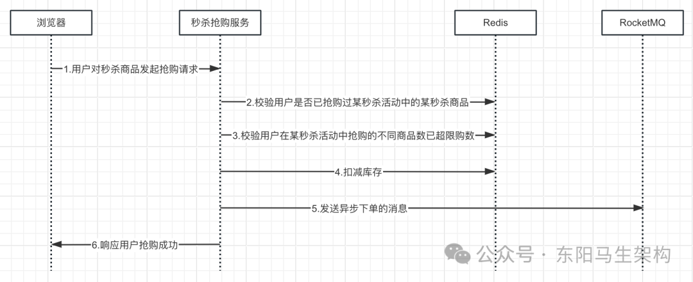
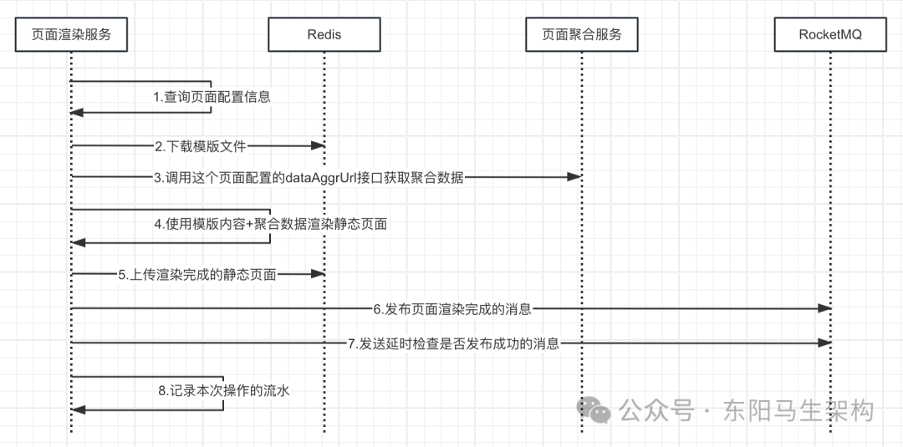

# 面试准备之项目要点总结二

> **公众号**: 东阳马生架构  
> **发布时间**: 2025-10-21 09:00  

**大纲(18383字)**

- 1.秒杀库存服务的关键点
- 2.秒杀抢购服务的关键点
- 3.秒杀下单服务的关键点
- 4.页面渲染服务的关键点
- 5.页面发布服务的关键点


## 1.秒杀库存服务的关键点

### (1)秒杀商品的库存在Redis中的结构

```json
//每个秒杀商品的库存结构都是⼀个Hash
"seckillStock:activityId:skuId": {
    "salableStock":100,//可销售库存
    "lockedStock":10,//锁定库存
    "soldStock":20//已销售库存
}

"seckillStock:1001:100001": {
    "salableStock":500,//可销售库存
    "lockedStock":50,//锁定库存
    "soldStock":100//已销售库存
}
```

### (2)库存分片并同步到Redis

首先构建库存在各Redis节点上的库存数据Map对象，然后遍历Redis的节点，接着通过hset命令保存到Redis中(不用设置过期时间)。

```typescript
//库存分片和同步库存
@Component
public class TriggerStockTask {
    @Autowired
    private ActivityService activityService;

    @Autowired
    private ActivitySkuRefService activitySkuRefService;

    @Autowired
    private LockService lockService;

    @Autowired
    private InventoryApi inventoryApi;

    @Scheduled(fixedDelay = 10_000)
    public void run() {
        String lockToken = lockService.tryLock(CacheKey.TRIGGER_STOCK_LOCK, 1, TimeUnit.SECONDS);
        if (lockToken == null) {
            return;
        }
        log.info("触发库存分片和同步库存，获取分布式锁成功, lockToken={}", lockToken);

        try {
            //查询已经渲染好页面的所有秒杀活动
            List<Activity> activities = activityService.queryListForTriggerStockTask();
            if (CollectionUtils.isEmpty(activities)) {
                return;
            }

            for (Activity activity : activities) {
                List<ActivitySkuRef> activitySkuRefs = activitySkuRefService.queryByActivityId(activity.getId());
                if (CollectionUtils.isEmpty(activitySkuRefs)) {
                    continue;
                }

                //要进行缓存初始化的商品，封装库存初始化请求
                List<SyncProductStockRequest> request = new ArrayList<>();
                for (ActivitySkuRef activitySkuRef : activitySkuRefs) {
                    SyncProductStockRequest syncProductStockRequest =
                        SyncProductStockRequest.builder()
                        .activityId(activitySkuRef.getActivityId())
                        .skuId(activitySkuRef.getSkuId())
                        .seckillStock(activitySkuRef.getSeckillStock()).build();
                    request.add(syncProductStockRequest);
                }

                //把封装的库存初始化请求，发送到秒杀库存服务里
                //每个商品的库存数据都会分散到各个Redis节点上去，实现对商品库存分片存放
                if (inventoryApi.syncStock(request)) {
                    log.info("触发库存分片和同步库存，调用库存接口将商品库存同步到Redis");
                    activityService.updateStatus(activity.getId(), ActivityStatusVal.PAGE_RENDERED.getCode(), ActivityStatusVal.INVENTORY_SYNCED.getCode());
                    log.info("触发库存分片和同步库存，将秒杀活动的状态修改为库存已同步");
                    //完成库存分片后，用户就可以对商品发起秒杀抢购了
                } else {
                    log.error("触发库存分片和同步库存，库存同步失败");
                }
            }
        } finally {
            lockService.release(CacheKey.TRIGGER_STOCK_LOCK, lockToken);
            log.info("触发库存分片和同步库存，释放分布式锁");
        }
    }
}

@Service
public class ActivityServiceImpl implements ActivityService {
    @Autowired
    private ActivityMapper activityMapper;
    ...

    //获取状态是已渲染好页面的秒杀活动
    @Override
    public List<Activity> queryListForTriggerStockTask() {
        QueryWrapper<Activity> queryWrapper = new QueryWrapper<>();
        queryWrapper.eq("status", ActivityStatusVal.PAGE_RENDERED.getCode());
        return activityMapper.selectList(queryWrapper);
    }
    ...
}

@FeignClient("demo-seckill-inventory-service")
@RequestMapping("/inventory")
public interface InventoryApi {
    @PostMapping("/syncStock")
    Boolean syncStock(@RequestBody List<SyncProductStockRequest> request);
    ...
}

@RestController
@RequestMapping("/inventory")
public class InventoryController {
    @Autowired
    private InventoryService inventoryService;

    @PostMapping("/syncStock")
    Boolean syncStock(@RequestBody List<SyncProductStockRequest> request) {
        for (SyncProductStockRequest syncProductStockRequest : request) {
            inventoryService.syncStock(syncProductStockRequest.getActivityId(), syncProductStockRequest.getSkuId(), syncProductStockRequest.getSeckillStock());
            log.info("同步商品库存, syncProductStockRequest={}", JSON.toJSONString(syncProductStockRequest));
        }
        return Boolean.TRUE;
    }
    ...
}

@Service
public class InventoryServiceImpl implements InventoryService {
    @Autowired
    private CacheSupport cacheSupport;
    ...

    @Override
    public Boolean syncStock(Long activityId, Long skuId, Integer stock) {
        //下面这种分片方式会有一个问题
        //比如，现在库存是10，Redis的节点个数是6
        //那么按照如下方式，最后的结果是：1、1、1、1、1、5
        //但是我们希望尽可能均分成：2、2、2、2、1、1
        //int redisCount = cacheSupport.getRedisCount();
        //int stockPerRedis = stock / redisCount;
        //int stockLastRedis = stock - (stockPerRedis * (redisCount - 1));

        //所以改成如下这种分片方式
        //首先获取Redis实例数量，将库存拆分为与Redis实例个数一样的redisCount个库存分片
        int redisCount = cacheSupport.getRedisCount();

        //然后将具体的库存分片结果存放到一个Map中
        //其中key是某Redis节点的索引，value是该Redis节点应该分的库存
        Map<Integer, Integer> map = new HashMap<>();
        for (int i = 0; i < stock; i++) {
            //均匀把stock的数据分散放到我们的各个节点上去
            int index = i % redisCount;
            //对每个节点的库存数量不停进行累加操作
            map.putIfAbsent(index, 0);
            map.put(index, map.get(index) + 1);
        }

        List<Map<String, String>> stockList = new ArrayList<>();
        for (int i = 0; i < redisCount; i++) {
            Map<String, String> stockMap = new HashMap<>();
            stockMap.put(CacheKey.SALABLE_STOCK, map.get(i) + "");
            stockMap.put(CacheKey.LOCKED_STOCK, "0");
            stockMap.put(CacheKey.SOLD_STOCK, "0");
            stockList.add(stockMap);
            log.info("库存分片 stockMap={}", JSON.toJSONString(stockMap));
        }

        cacheSupport.hsetOnAllRedis(CacheKey.buildStockKey(activityId, skuId), stockList);
        return Boolean.TRUE;
    }
    ...
}

public class RedisCacheSupport implements CacheSupport {
    private final JedisManager jedisManager;

    public RedisCacheSupport(JedisManager jedisManager) {
        this.jedisManager = jedisManager;
    }

    @Override
    public int getRedisCount() {
        return jedisManager.getRedisCount();
    }
    ...

    @Override
    public void hsetOnAllRedis(String key, List<Map<String, String>> hashList) {
        for (int i = 0; i < jedisManager.getRedisCount(); i++) {
            //通过hset命令，向每个Redis节点写入库存分片数据
            try (Jedis jedis = jedisManager.getJedisByIndex(i)) {
                jedis.hset(key, hashList.get(i));
            }
        }
    }
    ...
}

public class JedisManager implements DisposableBean {
    private static final Logger LOGGER = LoggerFactory.getLogger(JedisManager.class);
    private final List<JedisPool> jedisPools = new ArrayList<>();

    public JedisManager(JedisConfig jedisConfig) {
        JedisPoolConfig jedisPoolConfig = new JedisPoolConfig();
        jedisPoolConfig.setMaxTotal(jedisConfig.getMaxTotal());//Jedis连接池，最大有多少个连接实例
        jedisPoolConfig.setMaxIdle(jedisConfig.getMaxIdle());
        jedisPoolConfig.setMinIdle(jedisConfig.getMinIdle());

        //加载和解析Redis集群地址
        for (String addr : jedisConfig.getRedisAddrs()) {
            String[] ipAndPort = addr.split(":");
            String redisIp = ipAndPort[0];
            int redisPort = Integer.parseInt(ipAndPort[1]);
            //针对每个Redis实例，都会去建立一个Jedis Pool，每个Redis实例都需要一个连接池
            JedisPool jedisPool = new JedisPool(jedisPoolConfig, redisIp, redisPort);
            LOGGER.info("创建JedisPool, jedisPool={}", jedisPool);
            //针对各个Redis实例，都有一个连接池
            jedisPools.add(jedisPool);
        }
    }

    public int getRedisCount() {
        return jedisPools.size();
    }

    public Jedis getJedisByIndex(int index) {
        return jedisPools.get(index).getResource();
    }

    public Jedis getJedisByHashKey(long hashKey) {
        hashKey = Math.abs(hashKey);
        int index = (int) (hashKey % getRedisCount());
        return getJedisByIndex(index);
    }

    public Jedis getJedisByHashKey(int hashKey) {
        hashKey = Math.abs(hashKey);
        int index = hashKey % getRedisCount();
        return getJedisByIndex(index);
    }

    @Override
    public void destroy() throws Exception {
        for (JedisPool jedisPool : jedisPools) {
            LOGGER.info("关闭jedisPool, jedisPool={}", jedisPool);
            jedisPool.close();
        }
    }
}
```

### (3)查询秒杀商品的实时库存

```typescript
@RestController
@RequestMapping("/inventory")
public class InventoryController {
    @Autowired
    private InventoryService inventoryService;
    ...

    @PostMapping("/queryCurrentStock")
    List<ProductStockVo> queryCurrentStock(@RequestBody QueryCurrentStockRequest request) {
        List<ProductStockVo> resultList = new ArrayList<>();
        Long activityId = request.getActivityId();
        for (Long skuId : request.getSkuIds()) {
            ProductStockVo productStockVo = inventoryService.queryCurrentStock(activityId, skuId);
            resultList.add(productStockVo);
        }
        return resultList;
    }
    ...
}

@Service
public class InventoryServiceImpl implements InventoryService {
    @Autowired
    private CacheSupport cacheSupport;

    //从Redis中获取当前库存数据
    @Override
    public ProductStockVo queryCurrentStock(Long activityId, Long skuId) {
        List<Map<String, String>> stockList = cacheSupport.hgetAllOnAllRedis(CacheKey.buildStockKey(activityId, skuId));
        int salableStock = 0;
        int lockedStock = 0;
        int soldStock = 0;
        for (Map<String, String> stockMap : stockList) {
            salableStock += Integer.parseInt(stockMap.get(CacheKey.SALABLE_STOCK));
            lockedStock += Integer.parseInt(stockMap.get(CacheKey.LOCKED_STOCK));
            soldStock += Integer.parseInt(stockMap.get(CacheKey.SOLD_STOCK));
        }
        return ProductStockVo.builder().activityId(activityId).skuId(skuId).salableStock(salableStock).lockedStock(lockedStock).soldStock(soldStock).build();
    }
    ...
}

public class RedisCacheSupport implements CacheSupport {
    private final JedisManager jedisManager;

    public RedisCacheSupport(JedisManager jedisManager) {
        this.jedisManager = jedisManager;
    }

    @Override
    public int getRedisCount() {
        return jedisManager.getRedisCount();
    }
    ...

    //由于一个商品的库存数据可能会分散在各个Redis节点上
    //所以需要从各个Redis节点查询商品库存数据，然后合并起来才算是一份总的数据
    @Override
    public List<Map<String, String>> hgetAllOnAllRedis(String key) {
        List<Map<String, String>> list = new ArrayList<>();
        for (int i = 0; i < jedisManager.getRedisCount(); i++) {
            try (Jedis jedis = jedisManager.getJedisByIndex(i)) {
                list.add(jedis.hgetAll(key));
            }
        }
        return list;
    }
    ...
}
```

### (4)消费支付成功的消息时增减库存

由于有多个Redis实例，那么应该去哪台Redis上增减库存呢？在⽀付成功时需要做的操作是减少锁定库存 + 增加已销售库存。

但是不能随便找⼀台Redis就去执行这个操作，必须是抢购扣减库存时从哪个实例上减的，就到哪个实例上去执行操作。否则库存就会乱，比如会出现有些机器上库存是负的。

所以在秒杀抢购服务中扣减库存时：对于每个抢购请求，都⽣成⼀个long类型的⾃增序列。这个自增序列不需要全局唯⼀，甚⾄也不需要实例内唯⼀。通过这个自增序列来记录从哪台Redis实例上扣减库存，然后把这个⾃增序列透传到订单上去，⽐如透传到订单的扩展信息。

这样消费订单⽀付成功的消息时，就能找到当时扣减库存的那台Redis，然后就可以进行⽀付成功后的库存扣减操作了。

```typescript
@Component
@RocketMQMessageListener(topic = QueueKey.QUEUE_PAY_ORDER, consumerGroup = "pageOrderGroup")
public class PayOrderListener implements RocketMQListener<String> {
    @Autowired
    private InventoryService inventoryService;

    @Override
    public void onMessage(String messageString) {
        log.info("收到订单支付成功的消息，mesasge={}", messageString);
        OrderPayMessage message = JSON.parseObject(messageString, OrderPayMessage.class);
        inventoryService.confirmStock(message.getSequence(), message.getActivityId(), message.getSkuId());
        log.info("确认订单支付对应的商品库存");
    }
}

@Service
public class InventoryServiceImpl implements InventoryService {
    @Autowired
    private CacheSupport cacheSupport;
    ...

    @Override
    public Boolean confirmStock(Long sequence, Long activityId, Long skuId) {
        String stockKey = CacheKey.buildStockKey(activityId, skuId);
        String script = LuaScript.buildConfirmStockScript(stockKey);
        cacheSupport.eval(sequence, script);
        return Boolean.TRUE;
    }
    ...
}

public interface LuaScript {
    //消费⽀付成功的消息时增减库存
    String CONFIRM_STOCK = "local stockKey = '%s';"
        + "local lockedStock = redis.call('hget', stockKey, 'lockedStock') + 0;"
        + "local soldStock = redis.call('hget', stockKey, 'soldStock') + 0;"
        + "redis.call('hset', stockKey, 'lockedStock', lockedStock - 1);"
        + "redis.call('hset', stockKey, 'soldStock', soldStock + 1);";

    static String buildConfirmStockScript(String key) {
        return String.format(CONFIRM_STOCK, key);
    }
    ...
}

public class RedisCacheSupport implements CacheSupport {
    private final JedisManager jedisManager;

    public RedisCacheSupport(JedisManager jedisManager) {
        this.jedisManager = jedisManager;
    }
    ...

    @Override
    public Object eval(Long hashKey, String script) {
        try (Jedis jedis = jedisManager.getJedisByHashKey(hashKey)) {
            return jedis.eval(script);
        }
    }
    ...
}
```

### (5)消费订单取消的消息时增减库存

```typescript
@Component
@RocketMQMessageListener(topic = QueueKey.QUEUE_CANCEL_ORDER, consumerGroup = "cancelOrderGroup")
public class CancelOrderListener implements RocketMQListener<String> {
    @Autowired
    private InventoryService inventoryService;

    @Override
    public void onMessage(String messageString) {
        log.info("收到订单取消的消息，mesasge={}", messageString);
        OrderCancelMessage message = JSON.parseObject(messageString, OrderCancelMessage.class);
        inventoryService.releaseStock(message.getSequence(), message.getActivityId(), message.getSkuId());
        log.info("释放掉取消订单对应的商品库存");
    }
}

@Service
public class InventoryServiceImpl implements InventoryService {
    @Autowired
    private CacheSupport cacheSupport;
    ...

    @Override
    public Boolean releaseStock(Long sequence, Long activityId, Long skuId) {
        String stockKey = CacheKey.buildStockKey(activityId, skuId);
        String script = LuaScript.buildReleaseStockScript(stockKey);
        cacheSupport.eval(sequence, script);
        return Boolean.TRUE;
    }
    ...
}

public interface LuaScript {
    ...
    //消费订单超时未⽀付的消息时增减库存 + 消费订单取消的消息时增减库存
    String RELEASE_STOCK = "local stockKey = '%s';"
        + "local salableStock = redis.call('hget', stockKey, 'salableStock') + 0;"
        + "local lockedStock = redis.call('hget', stockKey, 'lockedStock') + 0;"
        + "redis.call('hset', stockKey, 'salableStock', salableStock + 1);"
        + "redis.call('hset', stockKey, 'lockedStock', lockedStock - 1);";

    static String buildReleaseStockScript(String key) {
        return String.format(RELEASE_STOCK, key);
    }
}
```

## 2.秒杀抢购服务的关键点

### (1)秒杀抢购的时序图



### (2)秒杀抢购的请求处理入口

这里使用Servlet 3.0的异步化功能来提升性能，具体就是：首先及时释放掉Tomcat的线程，保证Response对象不会被关闭，然后把请求交给自定义的业务线程池去处理。由于秒杀抢购涉及的操作步骤比较多，所以使用了责任链模式来进行编码。

```java
@RestController
@RequestMapping("/purchase")
public class PurchaseController {
    @Autowired
    private BossEventBus bossEventBus;

    @PostMapping
    public void seckillPurchase(@RequestBody PurchaseRequest request, HttpServletRequest servletRequest, HttpServletResponse servletResponse) {
        String validateResult = request.validateParams();
        if (Objects.nonNull(validateResult)) {
            servletResponse.setCharacterEncoding("UTF-8");
            servletResponse.setContentType("application/json;charset=UTF-8");
            try (ServletOutputStream out = servletResponse.getOutputStream()) {
                String s = "{\"success\":false, \"info\":\"" + validateResult + "\"}";
                out.write(s.getBytes(StandardCharsets.UTF_8));
                out.flush();
            } catch (IOException e) {
                e.printStackTrace();
            }
        } else {
            //对并发HTTP请求的两种处理方式：

            //方式一：同步处理请求，即直接返回响应给前端
            //基于Boss + Worker双总线架构，首先将抢购的请求直接放入队列中，然后直接返回响应给前端；
            //接着再基于队列中转 + 线程池异步并发的去处理抢购请求；
            //从而最大幅度提升抢购服务的并发能力和吞吐量；
            //也就是说：
            //抢购请求发送到这里以后，会直接进入内存队列，然后进行返回，这样可将抢购接口的性能提到最高；
            //此时前端界面会提示正在抢购中，请耐心等待抢购结果；
            //接着前端会每隔几秒发送一个请求到后台来查询本次抢购的结果；

            //方式二：采用Servlet 3.0的异步化架构，异步处理请求，即等待监听后再返回响应给前端
            //基于Boss + Worker双总线架构，请求过来后也是立刻将请求提交到内存队列，但并没有直接返回响应给前端；
            //1.首先请求提交到内存队列后会进行异步化处理：
            //所以此时可以马上释放Tomcat里的业务线程，让处理当前请求的Tomcat线程可以去处理其他请求；
            //通过这种方式，可以避免线程同步阻塞等待结果返回，从而大幅度提升抢购服务的并发能力和吞吐量；
            //2.其次没有直接返回响应给前端：
            //这是因为请求的响应会通过Servlet 3.0提供的AsyncListener收到通知后才进行返回；
            //当异步化处理完请求后，就会通知AsyncListener，此时Tomcat才会把请求的响应返回前端；

            //开启请求的异步化处理，避免Tomcat的线程阻塞
            AsyncContext asyncContext = servletRequest.startAsync();
            asyncContext.setTimeout(5000);
            //添加ServletAsyncListener，当HTTP请求被异步处理完时，就会通知Tomcat可以将响应返回给前端
            asyncContext.addListener(new ServletAsyncListener());

            PurchaseContext purchaseContext = new PurchaseContext();
            purchaseContext.setAsyncContext(asyncContext);
            purchaseContext.setActivityId(request.getActivityId());
            purchaseContext.setSkuId(request.getSkuId());
            purchaseContext.setUserId(request.getUserId());
            //秒杀抢购时涉及的步骤比较多，这里采用了责任链模式
            bossEventBus.publish("step1", new Step1CheckProduct(), purchaseContext);
        }
    }
}

public class BossEventBus {
    private final Disruptor<BossEvent> bossRingBuffer;

    public BossEventBus(BossConfig bossConfig, WorkerConfig workerConfig) {
        //双总线架构设计：
        //BossEventBus -> 事件会分发到不同的WorkEventBus -> 不同的线程池来进行并发处理
        //Boss事件总线：即主事件总线，只有一个
        //比如用来处理每一个秒杀请求
        //Work事件总线：即工作任务事件总线，有多个，不同类型
        //比如用来处理一个秒杀请求的每一个具体步骤
        //每个步骤处理完之后又发送到Work事件总线处理下一个步骤
        //所以先进来的请求可能不会先被处理完
        //双总线架构的设计思想：
        //通过将一个请求拆分为多个步骤，当需要处理并发的多个请求时，就可以用多个线程池分别处理每个步骤，从而提升处理并发请求的速度
        //因为一段代码的执行可能需要一定的时间，一个CPU时间片并不能执行完，需要很多个CPU时间片来执行，从而产生CPU时间片的等待
        //如果将一段代码的执行拆分为几个步骤，那么一个步骤的执行可能一个CPU时间片就执行完了，不会产生比较多的CPU时间片等待
        //首先所有的Event先进入BossEventBus里的Disruptor
        //然后BossEventBus.Disruptor里的线程会把Event交给BossEventHandler处理
        //接着BossEventHandler再将这些Event分发到各自对应的WorkEventBus.Disruptor
        //而WorkEventBus.Disruptor里的线程又会把Event拿出来交给WorkEventHandler处理
        //最后WorkEventHandler则将Event交给监听的EventListener，由EventListener中的线程池来并发处理

        //1.先准备好WorkEventBus
        //比如用来处理一个秒杀请求的每个具体步骤Step
        WorkEventBusManager workEventBusManager = WorkEventBusManager.getSingleton();
        for (WorkerConfig.Config config : workerConfig.getWorkers()) {
            workEventBusManager.register(config);
        }

        //2.再准备好BossEventBus
        //比如用来处理每一个秒杀请求
        bossRingBuffer = new Disruptor<>(BossEvent::new, bossConfig.getRingbufferSize(), NamedDaemonThreadFactory.getInstance("BossEventBus"));
        BossEventHandler[] eventHandlers = new BossEventHandler[bossConfig.getEventHandlerNum()];
        for (int i = 0; i < eventHandlers.length; i++) {
            eventHandlers[i] = new BossEventHandler();
        }
        bossRingBuffer.handleEventsWithWorkerPool(eventHandlers);
        bossRingBuffer.start();
    }

    public boolean publish(String channel, BaseEvent event, AsyncContext context) {
        //EventTranslator就是把传入的参数，转换为Disruptor里面的Event对象
        EventTranslator<BossEvent> translator = (e, s) -> {
            e.channel = channel;
            e.event = event;
            e.context = context;
        };

        //把封装的BossEvent发布到Disruptor内存队列里
        //发布成功后，Disruptor内部线程会消费和处理内存队列里的BossEvent
        //也就是会把BossEvent交给BossEventHandler来进行处理
        boolean success = bossRingBuffer.getRingBuffer().tryPublishEvent(translator);
        if (!success) {
            //如果异步发布event到内存队列里失败了
        }
        return success;
    }
}

public class BossEventHandler implements WorkHandler<BossEvent> {
    @Override
    public void onEvent(BossEvent event) throws Exception {
        try {
            dispatchBossEvent(event);
        } finally {
            event.clear();
        }
    }

    //事件分发
    @SuppressWarnings("unchecked")
    private void dispatchBossEvent(BossEvent event) {
        //1.根据channel获取到对应的WorkEventBus
        WorkEventBus workEventBus = WorkEventBusManager.getSingleton().getWorkEventBus(event.channel);

        //2.根据事件类型获取到对应的Listener，把之前注册的Listener拿出来
        List<EventListener> eventListeners = workEventBus.getEventListeners(event.event);

        //3.封装WorkEvent
        EventTranslator<WorkEvent> translator = (e, s) -> {
            e.event = event.event;//事件类型
            e.context = event.context;//数据上下文
            e.listeners = eventListeners;//注册到WorkEventBus里的Listener
        };
        //4.把Event分发到channel指定的WorkEventBus里去
        //WorkEvent会进入到内存队列里，内部会有一个线程，拿到WorkEvent，交给WorkEventHandler处理
        boolean publish = workEventBus.publish(translator);
        if (!publish) {
            //如果发布到WorkEventBus时，遇到队列满的问题，那么publish就会为false
        }
    }
}

public abstract class BasePurchaseListener<E extends BaseEvent> implements EventListener<BaseEvent> {
    @Autowired
    protected BossEventBus bossEventBus;

    @Autowired
    protected ExecutorService executorService;

    @Autowired
    protected CacheSupport cacheSupport;

    @Override
    public void onEvent(BaseEvent event, AsyncContext eventContext) {
        PurchaseContext purchaseContext = (PurchaseContext) eventContext;
        doThisStep(((E) event), purchaseContext);
    }

    protected abstract void doThisStep(E event, PurchaseContext purchaseContext);

    protected void response(javax.servlet.AsyncContext asyncContext, boolean success, String info) {
        ServletResponse response = asyncContext.getResponse();
        response.setCharacterEncoding("UTF-8");
        response.setContentType("application/json;charset=UTF-8");
        try (ServletOutputStream out = response.getOutputStream()) {
            String s = "{\"success\":" + success + ", \"info\":\"" + info + "\"}";
            out.write(s.getBytes(StandardCharsets.UTF_8));
            out.flush();
        } catch (IOException e) {
            e.printStackTrace();
        } finally {
            asyncContext.complete();
        }
    }
}
```

### (3)校验是否已抢购过某商品

```java
//校验用户是否已经抢购过某个秒杀商品
@Component
@Channel("step1")
public class Step1Listener extends BasePurchaseListener<Step1CheckProduct> {
    @Override
    public boolean accept(BaseEvent event) {
        return event instanceof Step1CheckProduct;
    }

    @Override
    protected void doThisStep(Step1CheckProduct event, PurchaseContext purchaseContext) {
        executorService.execute("step1", () -> {
            Long activity = purchaseContext.getActivityId();
            Long userId = purchaseContext.getUserId();
            Long skuId = purchaseContext.getSkuId();
            //以秒杀活动ID + 用户ID + skuID来构建key
            String key = CacheKey.buildCheckProductKey(activity, userId, skuId);
            //进行防重处理：
            //如果用户对这个秒杀活动下的这个秒杀商品还没抢购过，则可以发起抢购
            //如果已经抢购过了，则不能重复抢购
            if (!cacheSupport.exists(key)) {
                log.info("校验用户是否已经抢购过某秒杀商品，用户还未抢购过");
                //用户还没成功抢购过这个商品，则进入第二步校验用户在该秒杀活动中抢购过的不同商品数
                bossEventBus.publish("step2", new Step2CheckUser(), purchaseContext);
                return;
            }
            response(purchaseContext.getAsyncContext(), false, "你已经抢购过该商品了");
        });
    }
}
```

### (4)校验在某活动下抢购不同商品数

```java
//校验用户在某秒杀活动下抢购过的不同商品数
//最多允许用户抢购某个秒杀活动中的3个不同商品，这在一定程度上防止用户是黄牛或恶意抢购所有商品
@Component
@Channel("step2")
public class Step2Listener extends BasePurchaseListener<Step2CheckUser> {
    @Override
    public boolean accept(BaseEvent event) {
        return event instanceof Step2CheckUser;
    }

    @Override
    protected void doThisStep(Step2CheckUser event, PurchaseContext purchaseContext) {
        executorService.execute("step2", () -> {
            Long activity = purchaseContext.getActivityId();
            Long userId = purchaseContext.getUserId();
            //以秒杀活动Id + 用户ID来构建key
            String key = CacheKey.buildCheckUserKey(activity, userId);
            Long incr = cacheSupport.incr(key);//返回自增后的值
            if (incr <= 3) {
                //10分钟内，一个用户在一个秒杀活动里最多抢购3个不同的商品
                cacheSupport.expire(key, 600);
                log.info("校验用户在某秒杀活动下抢购过的不同商品数，在3次以内");
                bossEventBus.publish("step3", new Step3LockStock(), purchaseContext);
                return;
            }
            response(purchaseContext.getAsyncContext(), false, "已抢购过的不同商品数超出限制");
        });
    }
}
```

### (5)扣减库存

⾸先将标记请求的⾃增序列加1，然后⽤这个⾃增序列确定⼀台Redis实例来执⾏扣减库存的脚本。

如果扣减成功，则直接返回抢购成功。如果扣减失败，那么不再获取新的⾃增序列，⽽是在原来的基础之上在加1，然后继续到下⼀台机器扣减库存。如果⼀直加了所有的Redis节点数还没有扣减库存成功，那么可以认为此时秒杀商品整体售罄了，返回⽤户该秒杀商品已售罄。

通过在扣减库存时，在Redis标记请求，也可以进行超时补偿处理。比如可能秒杀服务在Redis扣减完库存后，出现宕机等异常无法继续处理。当然如果在页面渲染时也出现中断的情况，也可以基于Redis实现补偿。

```java
//扣减库存
@Component
@Channel("step3")
public class Step3Listener extends BasePurchaseListener<Step3LockStock> {
    private static final AtomicLong sequencer = new AtomicLong();

    private static final String SCRIPT = "local stockKey = '%s';"
        + "local salableStock = redis.call('hget', stockKey, 'salableStock') + 0;"
        + "local lockedStock = redis.call('hget', stockKey, 'lockedStock') + 0;"
        + "if(salableStock > 0) "
        + "then "
            + "redis.call('hset', stockKey, 'salableStock', salableStock - 1);"
            + "redis.call('hset', stockKey, 'lockedStock', lockedStock + 1);"
            + "return 'success';"
            + "else "
            + "return 'failure';"
            + "end;";

    @Override
    public boolean accept(BaseEvent event) {
        return event instanceof Step3LockStock;
    }

    @Override
    protected void doThisStep(Step3LockStock event, PurchaseContext purchaseContext) {
        executorService.execute("step3", () -> {
            //首先获取一个自增序列
            //在第1次扣减库存时，用它来决定后续订单链路的库存扣减都应该到哪台Redis中去处理
            //该序列会不停自增，多个线程过执行到这里时，会在多个Redis节点里进行RoundRobin轮询
            long sequence = sequencer.incrementAndGet();

            Long activity = purchaseContext.getActivityId();
            Long userId = purchaseContext.getUserId();
            Long skuId = purchaseContext.getSkuId();

            String stockKey = CacheKey.buildStockKey(activity, skuId);
            String script = String.format(SCRIPT, stockKey);

            //获取Redis实例数量
            int redisCount = cacheSupport.getRedisCount();
            //从sequence到maxSequence的间隔就是Redis实例数量
            long maxSequence = sequence + redisCount - 1;
            String result;

            //遍历循环与Redis实例数量一样多的次数
            //首先通过sequence定位到一台用来扣减库存的起始Redis实例
            //如果在这台起始Redis实例上没能扣减库存成功，说明在该起始Redis实例上没有库存了
            //但此时其他的Redis实例上可能还有库存，所以需要尝试在下一台Redis实例上扣减库存
            for (long i = sequence; i <= maxSequence; i++) {
                log.info("扣减库存，sequence={}", i);
                //针对指定的sequence序号，通过取模找到对应的Redis实例，来执行抢购脚本
                result = (String) cacheSupport.eval(i, script);
                if (StringUtils.equals(result, "success")) {
                    //扣减库存成功后，则把用户已经抢购成功的消息记录到Redis中
                    String key = CacheKey.buildCheckProductKey(activity, userId, skuId);
                    cacheSupport.set(key, "1");
                    cacheSupport.expire(key, 7200);

                    //需要记录是在哪台Redis实例上扣减库存，这样后面确认库存时，就可以到这台Redis实例上进行确认
                    purchaseContext.setSequence(i);
                    log.info("扣减库存，扣减库存成功，sequence={}", i);

                    //抢购成功后，进入下一步发送创建订单的消息到RocketMQ
                    bossEventBus.publish("step4", new Step4CreateOrder(), purchaseContext);
                    return;
                }
            }
            response(purchaseContext.getAsyncContext(), false, "该商品已经售罄了");
        });
    }
}
```

### (6)发送异步下单消息

```typescript
//发送异步创建秒杀订单的消息
@Component
@Channel("step4")
public class Step4Listener extends BasePurchaseListener<Step4CreateOrder> {
    @Autowired
    private RocketMQTemplate rocketMQTemplate;

    @Override
    public boolean accept(BaseEvent event) {
        return event instanceof Step4CreateOrder;
    }

    @Override
    protected void doThisStep(Step4CreateOrder event, PurchaseContext purchaseContext) {
        executorService.execute("step4", () -> {
            //发送异步下单的请求，会把自己扣减库存的redis实例对应的seqwuence序号
            String message = OrderCreateMessage.builder()
                .sequence(purchaseContext.getSequence())
                .activityId(purchaseContext.getActivityId())
                .userId(purchaseContext.getUserId())
                .skuId(purchaseContext.getSkuId())
                .count(1).build().toJsonString();
            rocketMQTemplate.convertAndSend(QueueKey.QUEUE_CREATE_ORDER, message);
            log.info("发送异步创建秒杀订单的消息");
            bossEventBus.publish("step5", new Step5Response(), purchaseContext);
        });
    }
}
```

### (7)响应用户抢购成功

```typescript
//响应用户抢购成功
@Component
@Channel("step5")
public class Step5Listener extends BasePurchaseListener<Step5Response> {
    @Override
    public boolean accept(BaseEvent event) {
        return event instanceof Step5Response;
    }

    @Override
    protected void doThisStep(Step5Response event, PurchaseContext purchaseContext) {
        executorService.execute("step5", () -> {
            log.info("给用户返回抢购成功的响应");
            //通过Servlet 3.0的异步化上下文，发送一个响应结果即可
            response(purchaseContext.getAsyncContext(), true, "恭喜您抢购成功");
        });
    }
}
```

3.秒杀下单服务实现的关键点

这里会消费异步下单的消息，然后调⽤订单服务接⼝来创建秒杀订单。业务逻辑⽐较简单，但是需要考虑以下的问题：

#### 一.正常情况

需要使⽤Redis进行消息去重，保证消息消费幂等。需要进行消费流控，比如调整MQ消费者的线程数、使⽤信号量或Guava限流。需要进行多线程下单。

#### 二.异常情况

如果创建订单的接⼝调⽤失败，需要基于MQ的重试功能进⾏重试。如果重试还是失败，让消息进⼊MQ的死信队列。

```typescript
//这里会基于Semaphore信号量来进行下单限流
//下单服务最大的技术难点就是控制下单频率，而秒杀时的瞬时单量会特别大
//所以创建秒杀订单时，如果不加控制地调用订单系统的接口进行下单，那么订单系统负载会很高

//Semaphore数量的设置
//可以根据订单系统可以抗下的最大并发数进行估算，比如按照最大并发数 * 80%、70%、60%、50%
//然后将估算出的数字设置到Semaphore里去，表示最多可允许同时创建多少个订单
//从而避免对订单系统造成过大的压力，实现削峰填谷，将瞬时高峰削了，通过低谷来慢慢下单

//用户在前端页面抢购成功后，会进入等待界面(比如显示圆圈不停地旋转)
//此时前端会定时发送请求给后端，比如每隔5s发送请求来检查下单是否成功

//如果秒杀活动开始瞬时产生了1w个订单
//而订单系统的一台机器每秒支持创建500个订单，那么需要20秒才能完成订单的创建，此时用户体验必然不好
//假如订单系统部署了4台4核8G的机器，那么每秒可以支持创建2000订单，那么瞬时1w个订单只需要5s就可以完成创建

@Component
@RocketMQMessageListener(topic = QueueKey.QUEUE_CREATE_ORDER, consumerGroup = "createOrderGroup")
public class CreateOrderListener implements RocketMQListener<String> {
    //并发能力为500
    private static final Semaphore SEMAPHORE = new Semaphore(500);

    @Autowired
    private CacheSupport cacheSupport;

    @Autowired
    private OrderApi orderApi;

    @Override
    public void onMessage(String messageString) {
        SEMAPHORE.acquireUninterruptibly();
        try {
            handleMessage(messageString);
        } finally {
            SEMAPHORE.release();
        }
    }

    private void handleMessage(String messageString) {
        log.info("收到创建秒杀订单的消息，message={}", messageString);
        OrderCreateMessage message = JSON.parseObject(messageString, OrderCreateMessage.class);
        Long sequence = message.getSequence();
        Long activityId = message.getActivityId();
        Long userId = message.getUserId();
        Long skuId = message.getSkuId();
        Integer count = message.getCount();

        //通过Redis来进行幂等控制，避免重复消费
        String key = CacheKey.buildConsumeCreateOrderKey(sequence, activityId, userId, skuId);
        if (cacheSupport.exists(key)) {
            return;
        } else {
            //设置key的过期时间
            cacheSupport.expire(key, 7200);
        }

        CreateOrderReuqest request = CreateOrderReuqest.builder()
            .sequence(sequence)
            .activityId(activityId)
            .userId(userId)
            .skuId(skuId)
            .count(count)
            .build();

        //调用一个订单的接口进行下单
        if (orderApi.createOrder(request)) {
            log.info("调用依赖的订单系统创建秒杀订单");
        } else {
            throw new RuntimeException("创建订单失败");
        }
    }
}

@FeignClient("demo-order-service")
@RequestMapping("/order")
public interface OrderApi {
    @PostMapping
    Boolean createOrder(@RequestBody CreateOrderReuqest request);
}

@RestController
@RequestMapping("/order")
public class OrderController {
    @Autowired
    private OrderService orderService;

    @Autowired
    private ProductApi productApi;

    @Autowired
    private RocketMQTemplate rocketMQTemplate;
    ...

    @PostMapping
    public Boolean createOrder(@RequestBody CreateOrderReuqest request) {
        log.info("收到创建订单的请求");
        SkuVo skuVo = productApi.queryBySkuId(request.getSkuId());
        log.info("调用商品系统接口查询商品, skuVo={}", skuVo);

        Map<String, Object> attributes = new HashMap<>();
        attributes.put("activityId", request.getActivityId());
        attributes.put("sequence", request.getSequence());
        Order order = Order.builder()
            .userId(request.getUserId())
            .skuId(request.getSkuId())
            .count(request.getCount())
            .amount(request.getCount() * skuVo.getSeckillPrice())
            .type(Order.TYPE_SECKILL)
            .status(Order.STATUS_CREATED)
            .attributes(JSON.toJSONString(attributes))
            .build();
        orderService.save(order);
        log.info("保存订单，orderId={}，order={}", order.getId(), JSON.toJSONString(order));

        //发送一个延时消息：14 -> 延时10m，4 -> 延时30s
        //messageDelayLevel：1s 5s 10s 30s 1m 2m 3m 4m 5m 6m 7m 8m 9m 10m 20m 30m 1h 2h
        rocketMQTemplate.syncSend(QueueKey.QUEUE_CHECK_ORDER, MessageBuilder.withPayload(order.getId()).build(), 2000, 14);
        log.info("发送订单延时检查消息");
        return Boolean.TRUE;
    }
    ...
}
```

## 4.页面渲染服务的关键点

### (1)数据库表的设计

#### 一.模版文件表

```typescript
@Data
@Builder
@NoArgsConstructor
@AllArgsConstructor
@TableName("seckill_page_template")
public class PageTemplate implements Serializable {
    //主键
    private Long id;
    //模板名称
    private String templateName;
    //模板文件的url
    private String templateUrl;
    private Date createTime;
    private Date updateTime;
}
```

#### 二.页面配置表

```typescript
@Data
@Builder
@NoArgsConstructor
@AllArgsConstructor
@TableName("seckill_page_config")
public class PageConfig implements Serializable {
    //主键
    private Long id;
    //模板文件id
    private Long templateId;
    //模板文件的url
    private String templateUrl;
    //页面名称
    private String pageName;
    //页面编码
    private String pageCode;
    //渲染页面的数据来源
    private String aggrDataUrl;
    private Date createTime;
    private Date updateTime;
}
```

#### 三.页面渲染流水表

```typescript
@Data
@Builder
@NoArgsConstructor
@AllArgsConstructor
@TableName("seckill_page_log")
public class PageLog implements Serializable {
    private Long id;
    //渲染开始的时间戳
    private Long startTime;
    private String bizData;
    //渲染页面还是删除页面, 渲染是render, 删除是delete
    private String opType;
    //文件名
    private String fileName;
    //页面要发布到这些静态资源服务器上，格式ip1,ip2
    private String serverIps;
    //记录页面已经发布到哪些静态资源服务器上了
    private String finishedServerIps;
    //渲染结束的的时间戳
    private Long completionTime;
    //渲染时使用的模板id
    private Long templateId;
    //生成的静态页面的id
    private String staticPageId;
    //静态资源的访问地址
    private String staticPageUrl;
    //触发这个渲染任务的消息内容
    private String msg;
    //这次操作是否成功
    private Boolean success;
    //当操作失败时的错误信息
    private String info;
    private Date createTime;
    private Date updateTime;
}
```

### (2)页面渲染的时序图



说明：由于模版内容读多写少，而且数据量不大，所以可存放到Redis甚至内存。

### (3)消费页面渲染的消息和超时补偿机制

注意：由于整个渲染流程比较多步骤，而且是基于Disruptor内存队列进行的。所以很可能出现机器重启时，导致页面渲染过慢或者中断等异常。此时可以通过超时补偿机制来解决。也就是在如下定时任务中，如果发现超过10分钟还没完成渲染，则重复推送渲染消息，毕竟即便页面渲染多次也会不影响最终渲染结果。

```typescript
@Component
public class TriggerPageTask {
    @Autowired
    private ActivityService activityService;

    @Autowired
    private ActivitySkuRefService activitySkuRefService;

    @Autowired
    private LockService lockService;

    @Autowired
    private RocketMQTemplate rocketMQTemplate;

    @Scheduled(fixedDelay = 10_000)
    public void run() {
        //通过加锁，可以确保，同时只有一个定时调度任务在处理页面渲染触发
        String lockToken = lockService.tryLock(CacheKey.TRIGGER_PAGE_LOCK, 1, TimeUnit.SECONDS);
        if (lockToken == null) {
            return;
        }

        log.info("触发渲染页面，获取分布式锁成功, lockToken={}", lockToken);
        try {
            //在秒杀活动展示之前1小时开始渲染页面
            //发起渲染条件是：showTime - now < 1小时，同时秒杀活动已通过审核
            List<Activity> activities = activityService.queryListForTriggerPageTask();
            if (CollectionUtils.isEmpty(activities)) {
                return;
            }

            for (Activity activity : activities) {
                Long id = activity.getId();
                List<ActivitySkuRef> activitySkuRefs = activitySkuRefService.queryByActivityId(id);
                if (CollectionUtils.isEmpty(activitySkuRefs)) {
                    continue;
                }

                //发送渲染秒杀活动商品列表页的消息
                List<Long> skuIds = activitySkuRefs.stream().map(ActivitySkuRef::getSkuId).collect(Collectors.toList());
                String renderActivityPageMessage = PageRenderMessage.builder()
                    .pageCode("seckill_activity")
                    .bizData(ImmutableMap.of("type", "activity", "activityId", id))
                    .params(ImmutableMap.of("activityId", id, "activityName", activity.getActivityName(), "startTime", activity.getStartTime(), "endTime", activity.getEndTime(), "skuIds", skuIds))
                    .fileName(FileNameUtils.generateSeckillActivityFilename(id))
                    .build().toJsonString();

                rocketMQTemplate.syncSend(QueueKey.QUEUE_RENDER_PAGE, renderActivityPageMessage);
                log.info("触发渲染页面，发送渲染商品列表页的消息, message={}", renderActivityPageMessage);

                for (ActivitySkuRef activitySkuRef : activitySkuRefs) {
                    //发送渲染秒杀商品详情页的消息
                    Long skuId = activitySkuRef.getSkuId();
                    String renderProductPageMessage = PageRenderMessage.builder()
                        .pageCode("seckill_product")
                        .bizData(ImmutableMap.of("type", "product", "activityId", id, "skuId", skuId))
                        .params(ImmutableMap.of("skuId", skuId))
                        .fileName(FileNameUtils.generateSeckillProductFilename(skuId))
                        .build().toJsonString();
                    rocketMQTemplate.syncSend(QueueKey.QUEUE_RENDER_PAGE, renderProductPageMessage);
                    log.info("触发渲染页面，发送渲染商品详情页的消息, message={}", renderProductPageMessage);
                }

                //把秒杀活动的状态修改为页面渲染中
                activityService.updateStatus(id, ActivityStatusVal.AUDIT_PASS.getCode(), ActivityStatusVal.PAGE_RENDERING.getCode());
                log.info("触发渲染页面，把秒杀活动状态改成页面渲染中");
            }
        } finally {
            lockService.release(CacheKey.TRIGGER_PAGE_LOCK, lockToken);
            log.info("触发渲染页面，释放分布式锁");
        }
    }
}

@Component
@RocketMQMessageListener(topic = QueueKey.QUEUE_RENDER_PAGE, consumerGroup = "rendPageConsumer")
public class RenderPageListener implements RocketMQListener<String> {
    //异步框架BossEventBus
    @Autowired
    private BossEventBus bossEventBus;

    @Override
    public void onMessage(String messageString) {
        log.info("收到渲染页面的消息, message={}", messageString);
        try {
            JSONObject message = JSONObject.parseObject(messageString);
            PageRenderContext context = new PageRenderContext();
            context.setPageCode(message.getString("pageCode"));
            context.setBizData(message.getJSONObject("bizData"));
            context.setParams(message.getJSONObject("params"));
            context.setFileName(message.getString("fileName"));

            context.setPageLog(new PageLog());
            context.getPageLog().setStartTime(System.currentTimeMillis());
            context.getPageLog().setBizData(JSON.toJSONString(context.getBizData()));
            context.getPageLog().setOpType("render");
            context.getPageLog().setFileName(context.getFileName());
            context.getPageLog().setServerIps(BussinessConfig.getNginxServerIps());
            context.getPageLog().setMsg(messageString);

            //页面渲染的步骤：
            //加载页面配置 -> 下载页面模板 -> 聚合数据 -> 渲染页面 -> 上传静态化页面 -> 保存页面渲染日志 -> 发布页面渲染成功的消息
            bossEventBus.publish(ChannelKey.CHANNEL_01_LOAD_PAGE_CONFIG, PageRenderEventHolder.EVENT_01, context);
        } catch (Exception ignore) {

        }
    }
}
```

### (4)页面渲染第一步—加载页面配置

```java
@Component
@Channel(CHANNEL_01_LOAD_PAGE_CONFIG)
public class Event01Listener extends BaseRenderPageListener<Event01LoadPageConfig> {
    @Autowired
    private PageConfigService pageConfigService;

    @Override
    public boolean accept(BaseEvent event) {
        return event instanceof Event01LoadPageConfig;
    }

    //页面渲染第一步：加载页面配置
    //加载到页面配置后，才可以进行页面渲染
    @Override
    protected void doThisStep(Event01LoadPageConfig event, PageRenderContext context) {
        //pageCode的取值是：seckill_product或seckill_activity
        String pageCode = context.getPageCode();

        //封装一个Runnable异步任务
        Runnable task = () -> {
            //根据pageCode来获取PageConfig页面配置
            PageConfig pageConfig = pageConfigService.queryByPageCode(pageCode);
            if (pageConfig == null) {
                context.getPageLog().setSuccess(false);
                context.getPageLog().setInfo("page不存在");
                context.setShouldSkip(true);
                return;
            }

            //将页面配置设置到上下文中
            context.setPageConfig(pageConfig);
            context.getPageLog().setTemplateId(pageConfig.getTemplateId());

            //发送Event到第二个channel的WorkEventBus里，通过bossEventBus进行中转
            bossEventBus.publish(CHANNEL_02_DOWNLOAD_TEMPLATE_FILE, EVENT_02, context);
            log.info("第1步：加载页面配置, pageConfig={}", JSON.toJSONString(pageConfig, true));
        };

        //将封装好的任务，提交到线程池进行执行
        executorService.execute(CHANNEL_01_LOAD_PAGE_CONFIG, task);
    }
}

public class ExecutorService {
    private static final ConcurrentHashMap<String, SafeThreadPool> BUFFER = new ConcurrentHashMap<>();

    public ExecutorService(ExecutorConfig executorConfig) {
        for (ExecutorConfig.Config config : executorConfig.getExecutors()) {
            BUFFER.put(config.getThreadPool(), new SafeThreadPool(config.getThreadPool(), config.getThreadCount()));
        }
    }

    public void execute(String channel, Runnable task) {
        //Optional.ofNullable()方法的作用是将一个可能为null的值包装到Optional容器中
        //如果该值为null，则返回一个空的Optional对象，否则返回一个包含该值的Optional对象
        //使用Optional.ofNullable()可以有效地避免空指针异常，因为它可以让我们在获取一个可能为null的对象时，先判断该对象是否为空，从而避免出现空指针异常
        Optional.ofNullable(BUFFER.get(channel)).ifPresent(safeThreadPool -> safeThreadPool.execute(task));
    }
}

public class SafeThreadPool {
    private final Semaphore semaphore;
    private final ThreadPoolExecutor threadPoolExecutor;

    public SafeThreadPool(String name, int permits) {
        //设置Semaphore信号量为线程数量
        semaphore = new Semaphore(permits);

        //根据线程数量封装一个线程池，其中最大线程数量maximum的大小就是线程数量permits * 2
        //可以往这个线程池里提交最多maximumPoolSize个任务
        threadPoolExecutor = new ThreadPoolExecutor(
            0,
            permits * 2,
            60,
            TimeUnit.SECONDS,
            new SynchronousQueue<>(),
            NamedDaemonThreadFactory.getInstance(name)
        );
    }

    public void execute(Runnable task) {
        //每次往这个线程池提交任务时，都需要先获取一个信号量
        //所以同一时刻，最多只能提交数量与信号量(线程数量)相同的任务到线程池里
        //当有超过线程数量的任务提交时，便会在执行下面的代码"获取信号量"时，被阻塞住
        semaphore.acquireUninterruptibly();

        //虽然使用了semaphore去限制提交到线程池的线程任务数
        //但是极端情况下，还是可能会有(信号量 * 2)个线程任务被提交到线程池
        //这种极端情况就是：
        //线程任务执行完任务并释放掉信号量时，还没释放自己被线程池回收，其他线程就获取到信号量提交到线程池了
        threadPoolExecutor.submit(() -> {
            try {
                //执行任务
                task.run();
            } finally {
                //释放信号量
                semaphore.release();
            }
            //某线程执行到这里时，还没完全把自己释放出来，但信号量已释放，可能新的任务已经加入线程池
        });
    }
}
```

### (5)页面渲染第二步—下载页面模版

其实就是从Redis中获取页面模版文件。

```typescript
@Component
@Channel(CHANNEL_02_DOWNLOAD_TEMPLATE_FILE)
public class Event02Listener extends BaseRenderPageListener<Event02DownloadTemplateFile> {
    @Autowired
    private FileService fileService;

    @Override
    public boolean accept(BaseEvent event) {
        return event instanceof Event02DownloadTemplateFile;
    }

    //页面渲染第二步：下载页面模板文件
    @Override
    protected void doThisStep(Event02DownloadTemplateFile event, PageRenderContext context) {
        Runnable task = () -> {
            //从Redis中获取页面模版文件
            String templateContent = fileService.download(context.getPageConfig().getTemplateUrl());
            if (Objects.isNull(templateContent)) {
                context.getPageLog().setSuccess(false);
                context.getPageLog().setInfo("模板文件不存在");
                context.setShouldSkip(true);
                return;
            }

            //将页面模板设置到上下文中
            context.setTemplateContent(templateContent);
            bossEventBus.publish(CHANNEL_03_AGGR_DATA, EVENT_03, context);
            log.info("第2步：下载页面模板文件");
        };

        //提交任务task给线程池执行
        executorService.execute(CHANNEL_02_DOWNLOAD_TEMPLATE_FILE, task);
    }
}

@Service
public class FileServiceImpl implements FileService {
    //缓存的是：模版文件内容、渲染好的HTML静态页面的内容
    private final Cache<String, String> cache = CacheBuilder.newBuilder()
        .maximumSize(100)
        .expireAfterWrite(30, TimeUnit.MINUTES)
        .build();

    //这里会把页面模板文件、渲染好的HTML静态页面保存到Redis上
    @Autowired
    private CacheSupport cacheSupport;

    public String download(String url) {
        try {
            //为了简便，下载页面模版文件或下载渲染好的HTML静态页面，其实就是从Redis从获取数据
            //页面模板文件、渲染好的HTML静态页面，可以放在某个服务器的文件里，也可以放在阿里云的OSS文件存储中
            return cache.get(url, () -> cacheSupport.get(url));
        } catch (ExecutionException e) {
            e.printStackTrace();
            return null;
        }
    }

    public String upload(String content) {
        String url = UUID.randomUUID().toString();
        //上传页面，就是把页面内容存放到Redis里
        cacheSupport.set(url, content);
        return url;
    }
}
```

### (6)页面渲染第三步—聚合数据

```typescript
@Component
@Channel(CHANNEL_03_AGGR_DATA)
public class Event03Listener extends BaseRenderPageListener<Event03GetAggrData> {
    @Autowired
    private RestTemplate restTemplate;

    @Override
    public boolean accept(BaseEvent event) {
        return event instanceof Event03GetAggrData;
    }

    //页面渲染第二步：调用dataUrl获取聚合数据
    @Override
    protected void doThisStep(Event03GetAggrData event, PageRenderContext context) {
        Runnable task = () -> {
            //此时上下文中已经有了页面模板的html字符串，需要继续获取这个页面模板需要的数据
            //首先从页面配置中取出可以获取聚合数据的url地址
            //然后再基于restTemplate发起HTTP请求，请求页面聚合服务的地址，拉取需要的数据
            String aggrDataUrl = context.getPageConfig().getAggrDataUrl();
            Map params = context.getParams();
            Map map = restTemplate.postForObject(aggrDataUrl, params, Map.class);
            if (MapUtils.isEmpty(map)) {
                context.getPageLog().setSuccess(false);
                context.getPageLog().setInfo("聚合数据有问题");
                context.setShouldSkip(true);
                return;
            }

            //将聚合数据设置到上下文中
            context.setAggrData(map);
            bossEventBus.publish(CHANNEL_04_RENDER_PAGE, EVENT_04, context);
            log.info("第3步：调用dataUrl获取聚合数据，aggrData={}", JSON.toJSONString(map, true));
        };

        executorService.execute(CHANNEL_03_AGGR_DATA, task);
    }
}

@RestController
public class SeckillProductAggrController {
    @Autowired
    private ProductApi productApi;

    //获取聚合数据
    @PostMapping("/seckill/product")
    public Map aggr(@RequestBody Map params) {
        Long skuId = Long.parseLong(String.valueOf(params.get("skuId")));

        //根据商品系统提供的接口，查询sku数据及其对应的商品spu数据
        SkuVo skuVo = productApi.queryBySkuId(skuId);
        SpuVo spuVo = productApi.queryBySpuId(skuVo.getSpuId());

        Map aggrData = new LinkedHashMap();
        aggrData.put("brandId", spuVo.getBrandId());
        aggrData.put("brandName", spuVo.getBrandName());
        aggrData.put("brandLogo", spuVo.getBrandLogo());
        aggrData.put("categoryId", spuVo.getCategoryId());
        aggrData.put("categoryName", spuVo.getCategoryName());

        aggrData.put("skuId", skuVo.getId());
        aggrData.put("skuName", skuVo.getName());
        aggrData.put("price", skuVo.getPrice());
        aggrData.put("seckillPrice", skuVo.getSeckillPrice());
        aggrData.put("image", skuVo.getImage());//缩略图
        String[] images = skuVo.getImages().split(",");//images，图文详情里可以有很多图片
        for (int i = 0; i < images.length; i++) {
            String image = images[i];
            aggrData.put("image" + i, image);
        }
        return aggrData;
    }
}
```

### (7)页面渲染第四步—渲染页面

```typescript
@Component
@Channel(CHANNEL_04_RENDER_PAGE)
public class Event04Listener extends BaseRenderPageListener<Event04RenderPage> {
    public boolean accept(BaseEvent event) {
        return event instanceof Event04RenderPage;
    }

    //页面渲染第四步：根据"页面模板 + 聚合数据"渲染页面
    //其中的页面模版是基于FreeMarker语法写的HTML静态文件，模版文件中会加入很多FreeMarker语法的占位符(${dd})
    //渲染页面时就是基于FreeMarker模板引擎的API，把这些${dd}占位符替换成对应的聚合数据
    @Override
    protected void doThisStep(Event04RenderPage event, PageRenderContext context) {
        Runnable task = () -> {
            Map<String, Object> mapData = new HashMap<>(1);
            mapData.put("data", context.getAggrData());

            String staticPageFile;
            try {
                String key = "template";
                //创建一个FreeMarker的Configuration配置对象
                Configuration configuration = new Configuration(Configuration.DEFAULT_INCOMPATIBLE_IMPROVEMENTS);
                //创建一个字符串模板类型的Loader对象
                StringTemplateLoader stringTemplateLoader = new StringTemplateLoader();
                //将上下文中的页面模板数据放到Loader对象中
                stringTemplateLoader.putTemplate(key, context.getTemplateContent());
                //将Loader对象放入到Configuration配置对象中
                configuration.setTemplateLoader(stringTemplateLoader);
                //获取一个Template模板对象
                Template template = configuration.getTemplate(key);
                //FreeMarkerTemplateUtils工具类，会用提供的聚合数据，将页面模板里的占位符进行替换，最后成为一个HTML静态页面的字符串
                staticPageFile = FreeMarkerTemplateUtils.processTemplateIntoString(template, mapData);
            } catch (Exception e) {
                context.getPageLog().setSuccess(false);
                context.getPageLog().setInfo("根据页面模板+聚合数据渲染页面时出现问题");
                context.setShouldSkip(true);
                return;
            }

            //将HTML静态页面字符串设置到上下文中
            context.setStaticPageContent(staticPageFile);
            bossEventBus.publish(CHANNEL_05_UPLOAD_STATIC_PAGE, EVENT_05, context);
            log.info("第4步：渲染页面");
        };
        executorService.execute(CHANNEL_04_RENDER_PAGE, task);
    }
}
```

### (8)页面渲染第五步—上传静态化页面

其实就是将静态页面HTML字符串存放到Redis中。

```typescript
@Component
@Channel(CHANNEL_05_UPLOAD_STATIC_PAGE)
public class Event05Listener extends BaseRenderPageListener<Event05UploadStaticPage> {
    @Autowired
    private FileService fileService;

    @Override
    public boolean accept(BaseEvent event) {
        return event instanceof Event05UploadStaticPage;
    }

    //页面渲染第五步：上传渲染好的HTML静态页面
    @Override
    protected void doThisStep(Event05UploadStaticPage event, PageRenderContext context) {
        Runnable task = () -> {
            //将静态页面HTML字符串存放到Redis中
            String setStaticPageId = fileService.upload(context.getStaticPageContent());
            if (setStaticPageId == null) {
                context.getPageLog().setSuccess(false);
                context.getPageLog().setInfo("上传html文件出现问题");
                context.setShouldSkip(true);
                return;
            }
            context.setStaticPageId(setStaticPageId);
            context.getPageLog().setStaticPageId(setStaticPageId);
            context.getPageLog().setCompletionTime(System.currentTimeMillis());
            log.info("第5步：上传渲染好的HTML静态页面，url={}", setStaticPageId);
            bossEventBus.publish(CHANNEL_06_SAVE_PAGE_LOG_MESSAGE, EVENT_06, context);
        };
        executorService.execute(CHANNEL_05_UPLOAD_STATIC_PAGE, task);
    }
}

@Service
public class FileServiceImpl implements FileService {
    //缓存的是：模版文件内容、渲染好的HTML静态页面的内容
    private final Cache<String, String> cache = CacheBuilder.newBuilder()
        .maximumSize(100)
        .expireAfterWrite(30, TimeUnit.MINUTES)
        .build();

    //这里会把页面模板文件、渲染好的HTML静态页面保存到Redis上
    @Autowired
    private CacheSupport cacheSupport;

    public String download(String url) {
        try {
            //为了简便，下载页面模版文件或下载渲染好的HTML静态页面，其实就是从Redis从获取数据
            //页面模板文件、渲染好的HTML静态页面，可以放在某个服务器的文件里，也可以放在阿里云的OSS文件存储中
            return cache.get(url, () -> cacheSupport.get(url));
        } catch (ExecutionException e) {
            e.printStackTrace();
            return null;
        }
    }

    public String upload(String content) {
        String url = UUID.randomUUID().toString();
        //上传页面，就是把页面内容存放到Redis里
        cacheSupport.set(url, content);
        return url;
    }
}
```

### (9)页面渲染第六步—保存页面渲染日志

```typescript
@Component
@Channel(CHANNEL_06_SAVE_PAGE_LOG_MESSAGE)
public class Event06Listener extends BaseRenderPageListener<Event06SavePageLog> {
    @Autowired
    private PageLogService pageLogService;

    @Override
    public boolean accept(BaseEvent event) {
        return event instanceof Event06SavePageLog;
    }

    //页面渲染第六步：保存页面渲染日志
    @Override
    protected void doThisStep(Event06SavePageLog event, PageRenderContext context) {
        Runnable task = () -> {
            String staticPagePath = FilePathUtils.generateFilePath(context.getFileName());
            //设置存放静态页面的路径地址
            context.setStaticPagePath(staticPagePath);

            PageLog pageLog = context.getPageLog();
            pageLog.setStaticPageUrl(staticPagePath);
            pageLog.setCreateTime(new Date());
            pageLog.setUpdateTime(pageLog.getCreateTime());
            pageLog.setSuccess(true);
            //把本次静态化页面的log写入到数据库
            pageLogService.save(pageLog);

            log.info("第6步：保存页面渲染日志，pageLog={}", JSON.toJSONString(pageLog, true));
            bossEventBus.publish(CHANNEL_07_SEND_PUBLISH_MESSAGE, EVENT_07, context);
        };
        executorService.execute(CHANNEL_06_SAVE_PAGE_LOG_MESSAGE, task);
    }
}
```

### (10)页面渲染第七步—发送渲染成功的消息到MQ

```java
@Component
@Channel(CHANNEL_07_SEND_PUBLISH_MESSAGE)
public class Event07Listener extends BaseRenderPageListener<Event07SendPublishPageMessage> {
    @Autowired
    private RocketMQTemplate rocketMQTemplate;

    @Override
    public boolean accept(BaseEvent event) {
        return event instanceof Event07SendPublishPageMessage;
    }

    //页面渲染第七步：发送页面渲染成功的消息到MQ
    @Override
    protected void doThisStep(Event07SendPublishPageMessage event, PageRenderContext context) {
        Runnable task = () -> {
            String publishPageMessage = PagePublishMessage.builder()
                .pageLogId(context.getPageLog().getId())
                .staticPageId(context.getStaticPageId())
                .staticPagePath(context.getStaticPagePath())
                .build()
                .toJsonString();
            rocketMQTemplate.syncSend(QueueKey.QUEUE_PUBLISH_PAGE, publishPageMessage);
            log.info("第7步：发送页面渲染成功的消息到MQ, message={}", publishPageMessage);
        };
        executorService.execute(CHANNEL_07_SEND_PUBLISH_MESSAGE, task);
    }
}
```

5.秒杀系统的页面发布服务实现

### (1)消费页面渲染成功的消息

```typescript
@Component
@RocketMQMessageListener(topic = QueueKey.QUEUE_PUBLISH_PAGE, consumerGroup = "publishPageGroup", messageModel = MessageModel.BROADCASTING)
public class PublishPageListener implements RocketMQListener<String> {
    @Autowired
    private BossEventBus bossEventBus;

    //消息格式示例
    //.pageLogId(context.getPageLog().getId())
    //.staticPageUrl(context.getStaticPageUrl())
    //.staticPagePath(staticPagePath)
    @Override
    public void onMessage(String messageString) {
        log.info("收到页面渲染成功的消息, message={}", messageString);

        JSONObject message = JSONObject.parseObject(messageString);
        DownloadEvent event = new DownloadEvent();
        event.setPageLogId(message.getLong("pageLogId"));
        event.setStaticPageId(message.getString("staticPageId"));
        event.setStaticPagePath(message.getString("staticPagePath"));

        //发布页面的步骤：
        //从Redis加载渲染好的静态页面 -> 将静态页面写到磁盘上 -> 发送页面发布完成的消息 -> 清除Redis的静态页面
        bossEventBus.publish(ChannelKey.CHANNEL_DOWNLOAD, event, null);
    }
}
```

### (2)发布页面第一步—从Redis加载静态页面

```typescript
@Component
@Channel(ChannelKey.CHANNEL_DOWNLOAD)
public class DownloadEventListener implements EventListener<DownloadEvent> {
    @Autowired
    private BossEventBus bossEventBus;

    @Autowired
    private ExecutorService executorService;

    @Autowired
    private CacheSupport cacheSupport;

    @Override
    public boolean accept(BaseEvent event) {
        return event instanceof DownloadEvent;
    }

    //第一步：从Redis上下载已经渲染好的静态页面
    @Override
    public void onEvent(DownloadEvent event, AsyncContext eventContext) {
        executorService.execute(ChannelKey.CHANNEL_DOWNLOAD, () -> {
            String staticPageContent = cacheSupport.get(event.getStaticPageId());
            log.info("第1步：下载页面, event={}", JSON.toJSONString(event));
            WriteToDiskEvent e = new WriteToDiskEvent();
            e.setPageLogId(event.getPageLogId());
            e.setStaticPageId(event.getStaticPageId());
            e.setStaticPagePath(event.getStaticPagePath());
            e.setStaticPageContent(staticPageContent);
            bossEventBus.publish(ChannelKey.CHANNEL_WRITE_TO_DISK, e, null);
        });
    }
}
```

### (3)发布页面第二步—将静态页面写到磁盘上

```java
@Component
@Channel(ChannelKey.CHANNEL_WRITE_TO_DISK)
public class WriteToDiskEventListener implements EventListener<WriteToDiskEvent> {
    @Autowired
    private BossEventBus bossEventBus;

    @Autowired
    private ExecutorService executorService;

    @Override
    public boolean accept(BaseEvent event) {
        return event instanceof WriteToDiskEvent;
    }

    //第二步：将下载的已渲染的静态页面写到磁盘上
    @Override
    public void onEvent(WriteToDiskEvent event, AsyncContext eventContext) {
        executorService.execute(ChannelKey.CHANNEL_WRITE_TO_DISK, () -> {
            String staticPagePath = event.getStaticPagePath();
            String staticPageContent = event.getStaticPageContent();
            boolean success = true;
            //确保目录存在
            String parentDir = FilePathUtils.getParentDir(staticPagePath);
            File parent = new File(parentDir);
            if (!parent.exists()) {
                success = parent.mkdirs();
            }

            if (success) {
                //把页面的内容写到文件中
                File file = new File(staticPagePath);
                try (RandomAccessFile raf = new RandomAccessFile(file, "rw")) {
                    raf.write(staticPageContent.getBytes());
                } catch (IOException e) {
                    e.printStackTrace();
                    success = false;
                }
            }
            log.info("第2步：把静态页面写到磁盘上, event={}", JSON.toJSONString(event));

            PulishResultEvent e = new PulishResultEvent();
            e.setPageLogId(event.getPageLogId());
            e.setStaticPageId(event.getStaticPageId());
            e.setSuccess(success);

            //这里只是演示把文件写入本地的磁盘里
            //当然也可以通过执行scp命令，把写入磁盘的静态页面html文件上传到Nginx服务器指定的目录中
            //然后调用的CDN厂商的API，把页面数据预热和加载到CDN
            bossEventBus.publish(ChannelKey.CHANNEL_PUBLISH_RESULT, e, null);
        });
    }
}
```

### (4)发布页面第三步—发送页面发布完成的消息

```typescript
@Component
@Channel(ChannelKey.CHANNEL_PUBLISH_RESULT)
public class PublishResultEventListener implements EventListener<PulishResultEvent> {
    @Autowired
    private BossEventBus bossEventBus;

    @Autowired
    private ExecutorService executorService;

    @Autowired
    private RocketMQTemplate rocketMQTemplate;

    @Override
    public boolean accept(BaseEvent event) {
        return event instanceof PulishResultEvent;
    }

    //第三步：发送页面发布完成的消息到MQ
    @Override
    public void onEvent(PulishResultEvent event, AsyncContext eventContext) {
        executorService.execute(ChannelKey.CHANNEL_PUBLISH_RESULT, () -> {
            String message = PagePublishResultMessage.builder()
                .pageLogId(event.getPageLogId())
                .success(event.isSuccess())
                .serverIp(BusinessConfig.getMyIp())
                .build().toJsonString();
            rocketMQTemplate.syncSend(QueueKey.QUEUE_PUBLISH_PAGE_RESULT, message);
            log.info("第3步：发送页面发布完成的消息到MQ, message={}", message);

            RemoveStaticPageEvent e = new RemoveStaticPageEvent();
            e.setStaticPageId(event.getStaticPageId());
            bossEventBus.publish(ChannelKey.CHANNEL_REMOVE_STATIC_PAGE, e, null);
        });
    }
}

@Component
@RocketMQMessageListener(topic = QueueKey.QUEUE_PUBLISH_PAGE_RESULT, consumerGroup = "publishPageResultGroup")
public class PublishPageResultListener implements RocketMQListener<String> {
    @Autowired
    private PageLogService pageLogService;

    @Autowired
    private RocketMQTemplate rocketMQTemplate;

    //消息格式示例
    //.pageLogId(event.getPageLogId())
    //.success(event.isSuccess())
    //.serverIp(BussinessConfig.getMyIp())
    @Override
    public void onMessage(String messageString) {
        log.info("收到页面发布完成的消息, message={}", messageString);
        JSONObject message = JSONObject.parseObject(messageString);
        Long pageLogId = message.getLong("pageLogId");
        Boolean success = message.getBoolean("success");
        String serverIp = message.getString("serverIp");
        PageLog pageLog = pageLogService.queryById(pageLogId);
        if (!success) {
            log.error("{}发布{}页面失败", serverIp, pageLog.getFileName());
            return;
        }

        String lastestFinshedServerIps;
        String finishedServerIps = pageLog.getFinishedServerIps();
        if (finishedServerIps == null) {
            lastestFinshedServerIps = serverIp;
        } else {
            lastestFinshedServerIps = finishedServerIps + "," + serverIp;
        }
        List<String> list = Arrays.asList(lastestFinshedServerIps.split(","));
        list.sort(Comparator.comparing(e -> e));
        lastestFinshedServerIps = String.join(",", list);
        pageLogService.updateFinishedServerIps(pageLogId, lastestFinshedServerIps);
        log.info("收到页面发布的结果, 修改流水的FinishedServerIps字段");

        if (StringUtils.equals(pageLog.getServerIps(), lastestFinshedServerIps)) {
            String msg = PageRenderResultMessage.builder().bizData(JSON.parseObject(pageLog.getBizData())).success(true).build().toJsonString();
            rocketMQTemplate.convertAndSend(QueueKey.QUEUE_RENDER_PAGE_RESULT, msg);
            log.info("收到页面发布完成的消息, 检查发现页面已发布到所有的静态资源服务器上，发送页面渲染结果的消息，可以开始同步库存, message={}", msg);
        }
    }
}

//消费渲染页面结果的消息(每渲染和发布完一个页面就会发送一条页面渲染结果的消息)
@Component
@RocketMQMessageListener(topic = QueueKey.QUEUE_RENDER_PAGE_RESULT, consumerGroup = "pageResultGroup")
public class PageResultListener implements RocketMQListener<String> {
    @Autowired
    private ActivityService activityService;

    @Autowired
    private ActivitySkuRefService activitySkuRefService;

    @Override
    public void onMessage(String messageString) {
        log.info("收到渲染页面的结果, message={}", messageString);
        JSONObject message = JSONObject.parseObject(messageString);
        if (!message.getBoolean("success")) {
            log.error("页面渲染失败，需要及时查看问题");
            return;
        }

        //获取指定的bizData
        //渲染秒杀活动列表页时指定的bizData如下：
        //.bizData(ImmutableMap.of("type", "activity", "activityId", activity.getId()))
        //渲染秒杀商品详情页时指定的bizData如下：
        //.bizData(ImmutableMap.of("type", "product", "activityId", activity.getId(), "skuId", activitySkuRef.getSkuId()))
        JSONObject bizData = message.getJSONObject("bizData");
        String type = bizData.getString("type");
        Long activityId = bizData.getLong("activityId");

        //判断本次渲染成功的页面，是活动列表页还是商品详情页
        if (StringUtils.equals(type, "activity")) {
            activityService.updatePageReady(activityId, true);
            log.info("收到渲染页面的结果, 是活动页面的结果, 把活动的pageReady字段修改为true");
        } else if (StringUtils.equals(type, "product")) {
            activitySkuRefService.updatePageReady(activityId, bizData.getLong("skuId"), true);
            log.info("收到渲染页面的结果, 是商品页面的结果, 把商品的pageReady字段修改为true");
        }

        //判断当前活动是否所有的静态页面都渲染好了
        Activity activity = activityService.queryById(activityId);
        //count一下该秒杀活动下还没渲染完成的商品数量
        Integer count = activitySkuRefService.countByActivityIdAndPageReady(activityId, false);
        //当秒杀活动的页面已渲染成功 + 秒杀活动的所有商品详情页也渲染成功，则更新秒杀活动的状态为'页面已完成渲染'
        if (activity.getPageReady() && count == 0) {
            //更新该秒杀活动的状态，从"页面渲染中"到"页面已完成渲染"
            activityService.updateStatus(activityId, ActivityStatusVal.PAGE_RENDERING.getCode(), ActivityStatusVal.PAGE_RENDERED.getCode());
            log.info("收到渲染页面的结果, 检查后发现当前活动的活动页面和商品页面都渲染好了，把活动状态改为'页面已渲染'");
            //下一步就是同步库存到Redis，进行库存数据的初始化了
            //触发执行库存数据初始化的定时任务的两个条件：
            //1.秒杀活动的所有页面已渲染完毕 + 2.now距离showTime在1小时以内
        }
    }
}

//库存分片和同步库存
@Component
public class TriggerStockTask {
    @Autowired
    private ActivityService activityService;

    @Autowired
    private ActivitySkuRefService activitySkuRefService;

    @Autowired
    private LockService lockService;

    @Autowired
    private InventoryApi inventoryApi;

    @Scheduled(fixedDelay = 10_000)
    public void run() {
        String lockToken = lockService.tryLock(CacheKey.TRIGGER_STOCK_LOCK, 1, TimeUnit.SECONDS);
        if (lockToken == null) {
            return;
        }

        log.info("触发库存分片和同步库存，获取分布式锁成功, lockToken={}", lockToken);
        try {
            //查询已经渲染好页面的所有秒杀活动
            List<Activity> activities = activityService.queryListForTriggerStockTask();
            if (CollectionUtils.isEmpty(activities)) {
                return;
            }
            for (Activity activity : activities) {
                List<ActivitySkuRef> activitySkuRefs = activitySkuRefService.queryByActivityId(activity.getId());
                if (CollectionUtils.isEmpty(activitySkuRefs)) {
                    continue;
                }
                //要进行缓存初始化的商品，封装库存初始化请求
                List<SyncProductStockRequest> request = new ArrayList<>();
                for (ActivitySkuRef activitySkuRef : activitySkuRefs) {
                    SyncProductStockRequest syncProductStockRequest = SyncProductStockRequest.builder()
                        .activityId(activitySkuRef.getActivityId())
                        .skuId(activitySkuRef.getSkuId())
                        .seckillStock(activitySkuRef.getSeckillStock()).build();
                    request.add(syncProductStockRequest);
                }
                //把封装的库存初始化请求，发送到秒杀库存服务里
                //每个商品的库存数据都会分散到各个Redis节点上去，实现对商品库存分片存放
                if (inventoryApi.syncStock(request)) {
                    log.info("触发库存分片和同步库存，调用库存接口将商品库存同步到Redis");
                    activityService.updateStatus(activity.getId(), ActivityStatusVal.PAGE_RENDERED.getCode(), ActivityStatusVal.INVENTORY_SYNCED.getCode());
                    log.info("触发库存分片和同步库存，将秒杀活动的状态修改为库存已同步");
                    //完成库存分片后，用户就可以对商品发起秒杀抢购了
                } else {
                    log.error("触发库存分片和同步库存，库存同步失败");
                }
            }
        } finally {
            lockService.release(CacheKey.TRIGGER_STOCK_LOCK, lockToken);
            log.info("触发库存分片和同步库存，释放分布式锁");
        }
    }
}
```

### (5)发布页面第四步—清除Redis的静态页面

```typescript
@Component
@Channel(ChannelKey.CHANNEL_REMOVE_STATIC_PAGE)
public class RemoveStaticPageEventListener implements EventListener<RemoveStaticPageEvent> {
    @Autowired
    private ExecutorService executorService;

    @Autowired
    private CacheSupport cacheSupport;

    @Override
    public boolean accept(BaseEvent event) {
        return event instanceof RemoveStaticPageEvent;
    }

    //第四步：删除Redis上的静态页面
    @Override
    public void onEvent(RemoveStaticPageEvent event, AsyncContext eventContext) {
        executorService.execute(ChannelKey.CHANNEL_REMOVE_STATIC_PAGE, () -> {
            cacheSupport.del(event.getStaticPageId());
            log.info("第4步，删除Redis上的静态页面");
        });
    }
}
```
