# 面试准备之项目要点总结八

> **公众号**: 东阳马生架构  
> **发布时间**: 2025-10-31 09:00  

**大纲(8625字)**

- 1.电商核心交易场景的业务流程
- 2.电商支付后履约场景的业务流程
- 3.电商营销场景的业务说明
- 4.电商促销活动的Push推送
- 5.营销系统的基础技术架构
- 6.XXLJob分布式调度运行原理
- 7.电商营销系统的营销技术挑战
- 8.少量数据测试版技术方案说明
- 9.第一版全量推送方案的缺陷
- 10.第一版全量发优惠券方案的缺陷
- 11.推送异步化以及千万用户分片
- 12.千万级用户分布式推送方案
- 13.推送系统单线程完成推送任务的时间分析
- 14.推送系统多线程完成推送任务的方案
- 15.千万级用户推送的削峰填谷
- 16.千万级用户惰性发优惠券方案
- 17.基于RocketMQ分发事件提高扩展性
- 18.指定用户群体推送领券消息的方案
- 19.基于大数据的爆款商品计算
- 20.爆款商品分布式调度推送方案

## 1.电商核心交易场景的业务流程

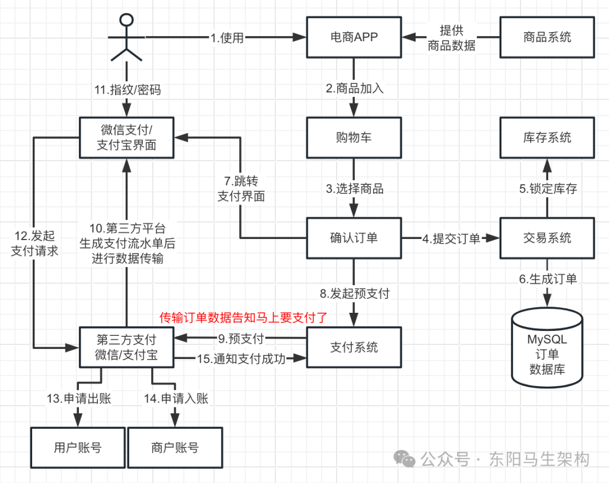

## 2.电商支付后履约场景的业务流程

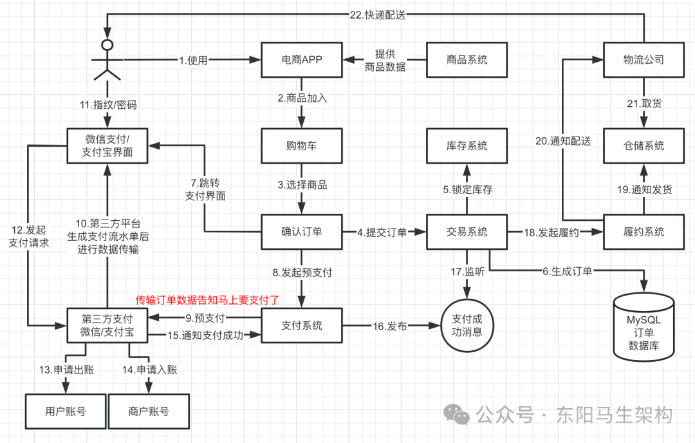

## 3.电商营销场景的业务说明

营销系统主要有优惠券和促销活动两种营销方式。

### (1)优惠券

营销系统会发各种各样的优惠券给用户，让用户领券。有些APP会不知不觉给用户发放一些优惠券，希望通过优惠券来吸引用户，让用户去购买商品。

什么是发券、领券、用券、销券：

营销系统发送优惠券时，其实就是在数据库中给这个用户增加一条优惠券的数据，这样就完成了发券。但此时这个优惠券还不属于用户，需要用户去确认并且执行领券操作，确认该优惠券是自己的。这样，在营销系统的数据库中才有用户的一条优惠券数据，在后续的购买流程中用户才能用券。当用户使用了优惠券进行订单支付后，还要对该优惠券进行销券处理。

### (2)促销活动

针对指定的商品进行满减、立减、赠品、折扣等促销活动之前，营销系统需要推送促销活动让所有用户知道。其中的推送模式有如下几种：短信、邮箱、APP推送、站内信等。

## 4.电商促销活动的Push推送

当营销系统发放完优惠券后，需要对用户进行Push推送，通知用户可以领券或者用户已经获得一张优惠券了。所以在营销系统中，无论是优惠券还是促销活动，都需要推送给用户，吸引用户购物和消费。

营销系统除了需要推送优惠券、促销活动给用户吸引其来购物和消费外，还会定时推送热门商品。推荐系统会根据用户的历史商品浏览记录、商品购买记录，通过算法推导出用户可能感兴趣的商品，还有热门商品。热门商品包括：浏览量最高的爆款、购买量最高的爆款、评价最高的爆款等。

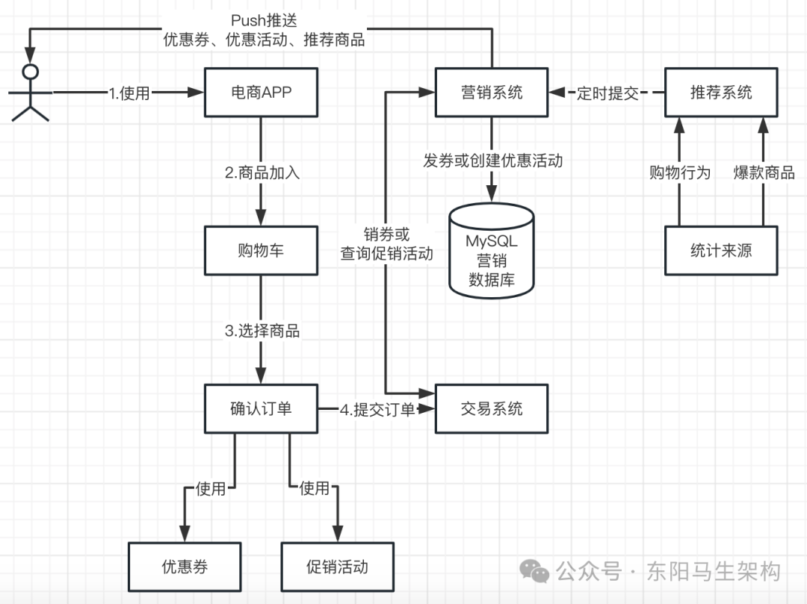

## 5.营销系统的基础技术架构

以Nacos作为服务注册中心，推送系统、营销系统、会员系统启动时都会向Nacos进行服务注册。推送系统、营销系统、会员系统通过服务注册中心拿到各系统的地址，就可以通过Dubbo进行相互间的RPC服务提供和调用。

当营销系统需要进行消息推送时，会先部署一个RocketMQ消息中间件集群，然后将消息发送到RocketMQ集群，接着推送系统就可以从RocketMQ集群消费这些消息进行推送。

此外如果需要进行定时任务调度，那么就可能会涉及到XXLJob的调度。假设推送系统部署了多台机器，希望消费消息时，能以分布式的方式在每个推送系统里处理一部分定时任务。此时就需要部署一个XXLJob调度管理中心，然后在上面配置一组Excutors。而每个推送系统如果要和XXLJob进行对接，也需要配置一个Excutor。当推送系统启动后，它的Excutor会往XXLJob调度管理中心进行注册。这样，XXLJob调度管理中心的某个Excutors便能知道各推送系统上Excutor的IP和端口号。

之后，开发人员便能通过XXLJob调度管理中心配置一个任务管理，对定时任务进行管理，让定时任务可以绑定到一个Excutors分组上，也就是定时任务在执行时会发送请求给推送系统的Excutor来执行分布式调度任务的。推送系统的Excutor便会通过SpringBean来执行任务。

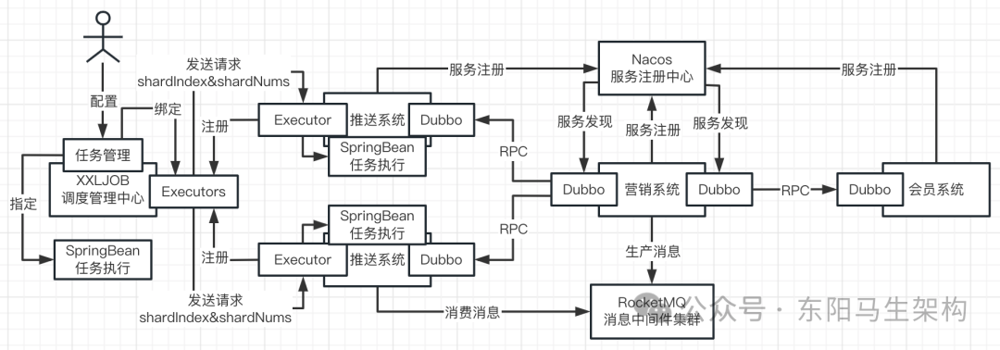

营销系统的基础技术架构总结：系统与系统间通过RPC进行调用，Nacos是注册中心，Dubbo是RPC框架，RocketMQ是消息中间件进行消息中转，分布式定时调度任务使用的是XXLJob。

## 6.XXLJob分布式调度运行原理

当多个推送系统节点都要从数据库里查询同一批推送任务时，XXLJob如何决定谁来执行哪些任务？比如当从数据库查出同一批推送任务有10个，推送系统1可以执行5个任务，推送系统2可以执行另外5个任务。

说明一：XXLJob首先要配置一组Excutors，该组Excutors会有名字。推送系统在启动时就需要启动一个Excutor，并且会注册到XXLJob里指定名字的一个Excutors中。XXLJob收到推送系统Excutor的注册请求后，会根据注册的名字把它们划分到对应的一组Excutors里面。

说明二：然后开发人员便可以在XXLJob配置定时调度任务，绑定某组Excutors以及指定执行任务的SpringBean。当配置好的定时任务的执行时间到达时，就会找到绑定的Excutors，发送执行任务请求给推送系统的Excutor。

说明三：推送系统的Excutor收到XXLJob发送的执行任务请求后，便会找到指定的SpringBean去执行任务。每个推送系统的SpringBean接着会从MySQL数据库里查询出相关的推送任务。

说明四：为了决定每个推送系统的SpringBean该执行从MySQL数据库查询出来的哪些推送任务。XXLJob在发送执行任务请求给推送系统的Excutor时，会带上shardIndex和shardNums。

其中shardNums指的是当前执行定时任务的推送系统Excutor一共有多少个节点，每一个节点可以认为是任务执行的分片。shardIndex就是对各个定时任务节点进行标号，比如发给推送系统1的shardIndex=1，发送给推送系统2的shardIndex=2。

说明五：这时推送系统的SpringBean从数据库查出来一批推送任务时：就会根据任务ID的Hash值对shardNums进行取模。通过取模结果和推送系统所属的shardIndex是否一样，来决定这个任务是属于哪个分片，从而实现多个节点对同一批任务的分布式调度。

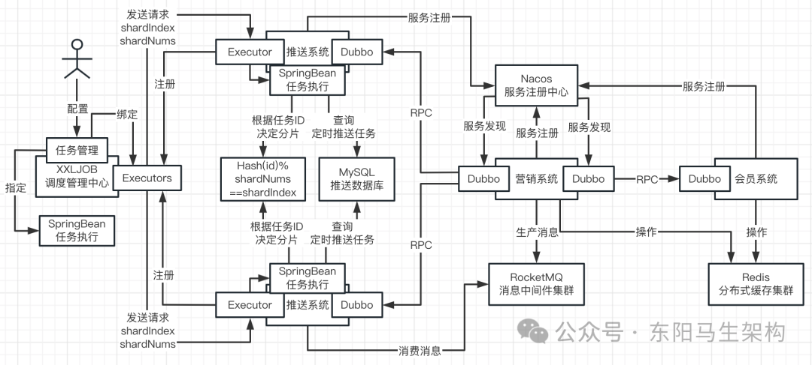

## 7.电商营销系统的营销技术挑战

### (1)电商营销系统的营销技术挑战

不论是优惠券活动，还是优惠活动，或者是热⻔商品定时推送，都会面临这样的难点和挑战：需要给大量的用户进行推送，这个用户量可能会非常大，而且限制在一定时间内完成所有推送任务。比如中小型电商平台每天需要进行推送的用户量是千万级的，一天下来需要推送的消息次数甚至到亿级。所以在量⾮常⼤的时候，需要高并发地先发送消息到RocketMQ中，然后再由消费者慢慢消费，比如调⽤第三方系统的SDK完成消息推送或写⼊数据到数据库。

核心链路如下：

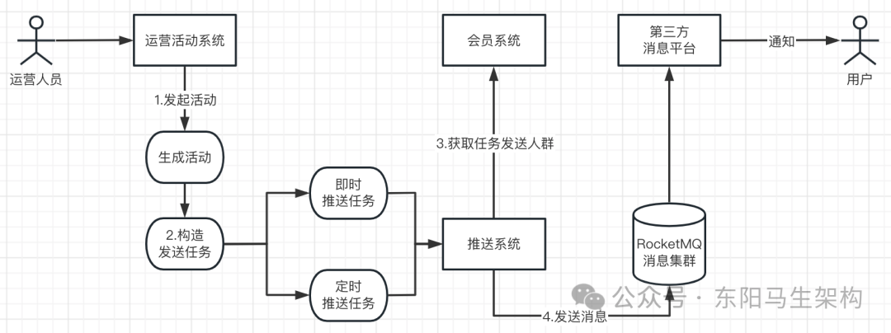

### (2)千万级用户量下的营销技术挑战

营销系统的三大工作就是：

工作一：面向全员发推送促销活动

工作二：面向特定人群或全员发放优惠券

工作三：给所有用户推送热门爆款商品

这三项工作的挑战在于，都需要面对大量用户进行数据和任务的处理。在一个中型电商平台中，拥有的是千万级用户量，比如1000万用户。如果向这1000万用户推送爆款商品，那么就需要构建发送任务来调用第三方平台的接口来完成推送。如果向这1000万用户发放优惠券，那么就需要往数据库插入1000万条用户持有优惠券的数据记录。

## 8.少量数据测试版技术方案说明

下面先按用户量比较少来设计营销系统，如下所示：

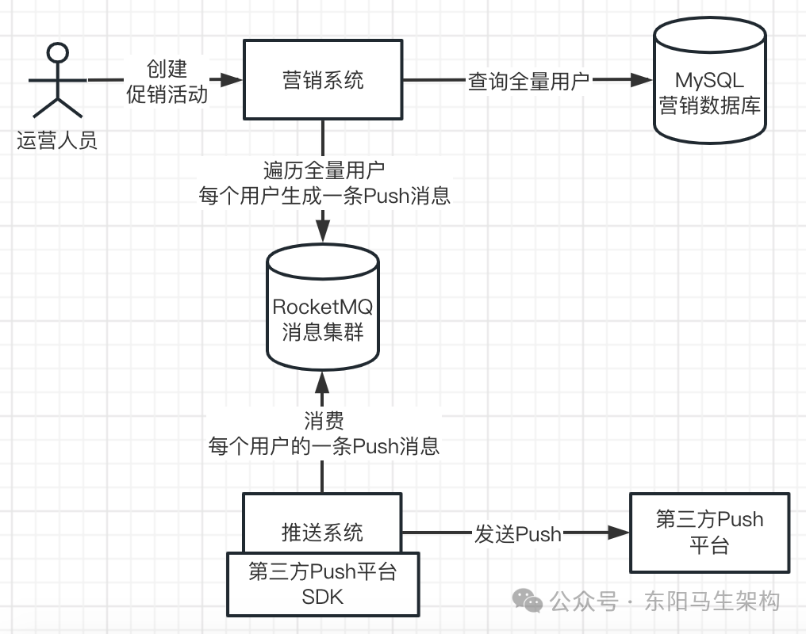

## 9.第一版全量推送方案的缺陷

#### 一.直接查询全量用户数据会压垮数据库

如果通过"select * from table"直接查询千万级的全量用户，可能会直接把MySQL压垮，查不到数据。

#### 二.每页查询少则耗时每页查询多则耗内存

如果通过"select * from table limit"分页查询一批一批地查，那么每一批要查多少数据也不好确定。如果一批查1000条数据，千万级用户就要查1万次，每次查询耗费100ms，就需要总共查1000s。如果一批查10000条数据，当每次查询的数据量大了以后，对机器的内存消耗就会很大，可能就要消耗几百MB的内存。当内存消耗过大，而且由于处理很多数据比较耗的时候，就又会导致频繁YGC + 大量数据进入JVM老年代。老年代的内存又会频繁地满了而触发FGC，最后引发系统频繁停顿的问题。

#### 三.全量遍历用户一用户一消息既耗时又耗网络

如果对查出来的千万级用户进行全量遍历，一个用户封装成一条Push消息发到MQ里，就会有1000万条Push消息。1000万条Push消息会对RocketMQ发起1000万次请求，每次Push消息耗费10ms，总共就需要10万秒。所以全量遍历用户并根据每个用户产生一条消息，会导致千万级消息推送给MQ，产生大量的网络通信开销和耗时过长。

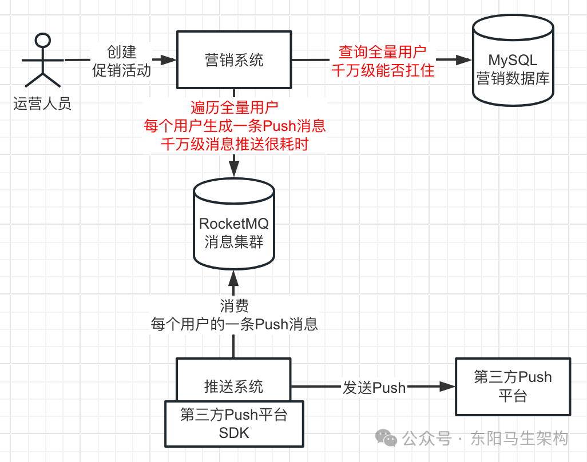

10.第一版全量发优惠券方案缺陷

针对全量用户(千万级)/特定用户(百万级)发优惠券：

#### 一.直接查询全量用户数据会压垮数据库

如果直接查询千万级的全量用户/特定用户(百万级)，数据库能否扛住。

#### 二.每页查询少则耗时每页查询多则耗内存

如果分批查，单次查询量少就要查询多次而导致耗时，单次查询量多就要消耗内存而导致频繁FGC。

#### 三.给用户发放优惠券时要对数据库高并发写

对每个用户插入发放优惠券的数据时，数据库面临高并发写问题，影响系统运行的稳定性。

#### 四.全量遍历用户一用户一消息既耗时又耗网络

遍历全量用户/特定用户(百万级)，每个用户一条推送消息，则面临千万级/百万级消息推送耗时问题。

## 11.推送异步化以及千万用户分片

### (1)对推送任务进行预处理实现推送异步化

千万级/百万级用户量的推送面临的问题：

#### 一.大数据量查会对数据库有压力，分批查可能会有耗时或内存消耗过大的问题

#### 二.大数据量瞬时高并发写数据库存在压力

#### 三.千万级/百万级消息写入RocketMQ耗时

因此，最好不要先直接去数据库查出千万级用户数据，让推送系统同步发起推送处理。而是先基于RocketMQ做一个异步化，也就是对推送任务做一些预处理。

经过预处理后，会产生少量的消息，把这些消息量比较少的预处理结果推送到RocketMQ中。然后再让推送系统消费这些预处理结果，把千万级用户量的推送，进行异步化处理。

### (2)推送任务的预处理细节

首先使用count()或max()去数据库查询用户总数，而不是直接查询千万级的用户数据。假设查出来的用户总数是1000万，那么就可以对推送任务进行分片拆分。将整个推送任务拆分成1万个分片任务，每个任务处理1000个用户的推送。

这就是所谓千万级用户分片，这1万个分片任务会被推送到RocketMQ里，对应1万条消息。如果每条消息发送到RocketMQ需要耗费10ms，那么完成1万条消息的推送就需要1000s，还是比较耗时。

这1万条消息的推送，可以进行batch化推送，也就是每100条消息合并成一条batch消息后再发送到RocketMQ里。这样只需要发送100次batch消息给RocketMQ，假设发送一次batch消息耗时50ms，那么总耗时才5秒。

但即使只需要5s完成预处理，也不能让运营人员在创建促销活动时，同步等待5s。所以当运营人员使用营销系统创建促销活动时，先不要查询用户总数完成预处理，而是先发布一条消息到RocketMQ。然后营销系统自己又会作为RocketMQ的消费者来异步消费该消息，异步完成预处理的工作。

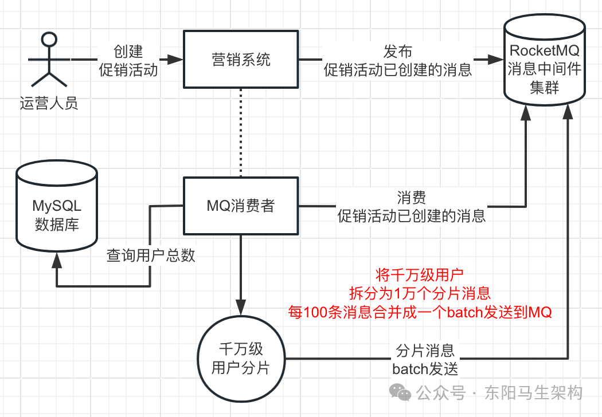

## 12.千万级用户分布式推送方案

### (1)根据千万级的用户产生万级的分片任务消息

将一个千万级用户的推送任务，分拆成1万个推送任务，每个任务会对1000个用户进行推送。每个任务消息的具体内容其实就是：针对userId=1到userId=1000的用户发起推送。这样的任务消息会有1万条，每发送一条这样的消息到MQ就需要10ms，总共就需要1000秒=17分。

### (2)对万级的分片任务消息进行合并批量发送

为了避免在处理千万级用户分片时耗时过慢的问题，可以利用RocketMQ支持的batch批量写机制。也就是每100条任务消息合并成一条batch任务消息来发送，总共只需要发送100次这样的batch任务消息即可。假设发送一次batch消息耗时50ms～100ms，那么总耗时才5秒～10秒。

### (3)创建促销活动接口异步化处理提升体验

可见，对推送任务的查询、分片、合并这些预处理过程，再快也需要几秒的时间。所以这个环节不应该合并在创建促销活动的接口中，而是通过RocketMQ实现异步化处理。也就是RocketMQ可以实现耗时任务的异步化，提升促销活动接口的性能。

### (4)万级的分片任务消息分布式推送完成消费

对于已经写入RocketMQ集群的那1万条任务消息，默认会均匀分散地落到集群的各个Queue里。而多机器部署的推送系统会组成一个ConsumerGroup一起去均匀消费这1万条任务消息。所以1万条推送任务会均匀分配给各个推送系统，从而实现分布式推送。也就是说，千万级用户的推送任务可以均匀分布到各个推送系统的机器上，每台推送系统机器只需要负责处理一部分任务的推送即可。

## 13.推送系统单线程完成推送任务的时间分析

目前有1万个推送任务，每个推送任务需要给1000个用户进行推送。推送系统拿到一个推送任务时，得到的其实是用户自增ID的一个范围，比如1～1000、1001～2000。

此时推送系统会根据ID范围去调用会员系统批量查询用户的接口，来查出这1000个用户与推送相关的信息。会员系统提供给推送系统的用于批量查询用户的接口，会提供开始和结束ID，以及有数量限制如最多查2000条数据。查出来这1000个用户后，推送系统会进行遍历，调用第三方平台的SDK完成推送。

一般来说，推送系统调用第三方平台的SDK给用户推送短信、邮件等之后，不用等待响应，因为第三方平台内部也会做异步化的推送处理。

假设推送系统调用第三方平台的SDK完成一个用户的推送需要200ms，那么推送系统完成一个推送任务，也就是1000个用户的推送，采用单线程的方式就要1000 * 200ms = 3分钟。

如果推送系统部署了2台机器，那么要完成千万级用户量的推送，每台机器就需要完成5000个任务。所以每台机器完成一次千万级用户量的推送就需要总共5000 * 3 = 15000分钟(上百个小时)，这太慢了。

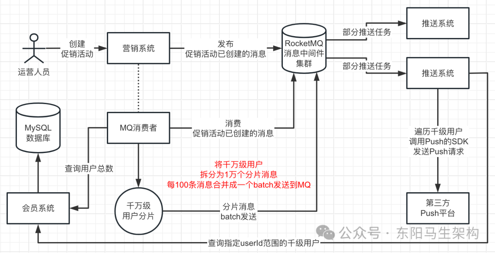

## 14.推送系统多线程完成推送任务的方案

如果一个推送系统获取一个一个的推送任务后，采用单线程对里面的1000个用户依次发送推送，并且每次向第三方平台发送推送请求需要耗时200ms，那么完成一个推送任务就需要200ms * 1000 = 3分钟。如果此时只有两台机器部署了推送系统，那么每台机器需要处理5000个任务，也就是15000分钟，大概一周时间。

因此，必须要把单台机器的推送效率提升到极致，每台机器必须是多线程高并发地发起推送请求。假设每台机器开启30个线程，每个线程并发地去处理一个推送任务。那么每台机器每隔3分钟就可以处理30个推送任务，1小时就可以处理600个推送任务。

如果推送系统是普通的4核8G的机器，那么可以开启30个线程并发处理推送任务。于是部署5台4核8G的机器，每台机器开启30个线程并发处理30个推送任务，3小时就可以完成千万级用户的推送。

所以随着机器配置的提升，比如8核16G开80个线程，快则1小时之内，慢则两三小时，其实都可以完成千万级用户推送。

线程数量一般是30、50、80、100，具体开启多少个线程还是应该以压测时的CPU负载、网络带宽消耗、推送效率为准。CPU负载一般在80%以下，通常压测到50%-70%即可，而网络带宽可以压测到快打满。

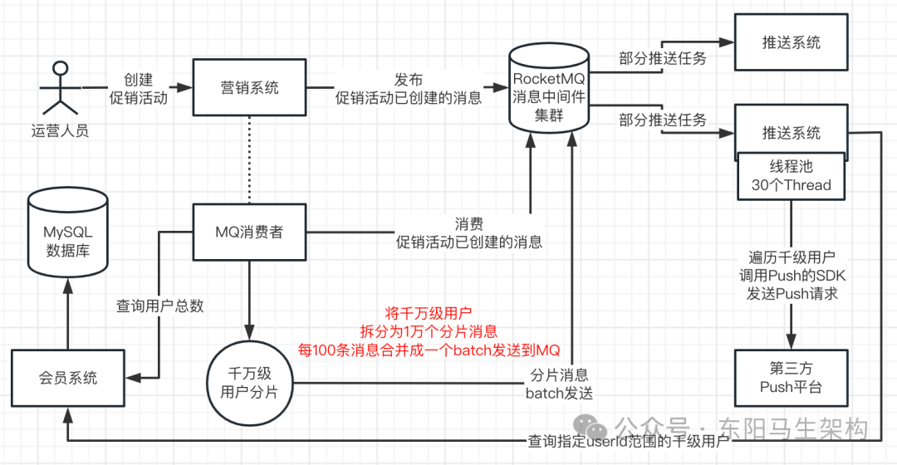

## 15.千万级用户推送的削峰填谷

在千万级用户推送的场景里，RocketMQ扮演的角色主要是两个：一个是异步化解耦提升接口性能，一个是对瞬时大量消息进行削峰填谷。

### (1)异步提升接口性能

运营人员在营销系统创建促销活动时，会发布促销活动已创建的消息到RocketMQ。营销系统会消费促销活动已创建的消息，然后进行预处理。进行预处理时，会查询千万级用户总数、将千万级用户推送任务分片成1万个任务、然后每100个任务batch批量发送到RocketMQ。

### (2)瞬时大量消息削峰填谷

进行预处理时，营销系统对千万级用户的推送任务分片成1万个任务时，就会瞬时发送1万条消息到RocketMQ。此时只能用RocketMQ削峰填谷，因为营销系统直接调用推送系统的Push接口处理一个任务，最快也要几分钟。

所以营销系统在进行预处理时，不能同步给推送系统处理，最好用RocketMQ对这1万条推送任务的消息进行暂存，之后由RocketMQ的消费者对这些消息慢慢地按自己的速率进行处理。

## 16.千万级用户惰性发优惠券方案

惰性发券是互联网公司里非常经典的一个方案。互联网公司给全量用户发券，基本用的都是惰性发券的思路和方案，而不会使用上面的千万级用户Push方案。

说明一：运营人员使用营销系统创建发优惠券的促销活动时，首先会把优惠券和促销活动的数据写入MySQL数据库中，然后把优惠券数据写入Redis缓存中，这样便完成了整个优惠券的创建处理了。

说明二：当用户成功登录电商APP的账号系统时，账号系统会发布一条用户已登录的消息到RocketMQ消息中间件集群。

说明三：营销系统会持有一个RocketMQ消费者，专门消费RocketMQ中用户已登录的消息。

说明四：当营销系统消费到用户已登录的消息时，会到Redis缓存里查询当前是否有优惠券需要对该用户发券。也就是判断当前是否有优惠券需要发放 + 该用户还没发放该优惠券 + 优惠券还在有效期范围内。如果有，那么营销系统的这个RocketMQ消费者就会进行惰性发券，把对该用户发券的数据记录写到MySQL + Redis里。从而实现如下千万级用户惰性发券的效果：

当用户使用电商APP完成账号系统的登录后，就会发布一条某用户已经登录的消息到RocketMQ消息中间件集群。营销系统会从RocketMQ中消费某用户已经登录的消息，去Redis分布式缓存集群里查询是否有该用户的发券记录。如果有就不需要再发券了，如果没有就需要向该用户发券。营销系统向用户发完券后，会将发券记录写入Redis分布式缓存集群里，避免下次用户登录时重复发券。

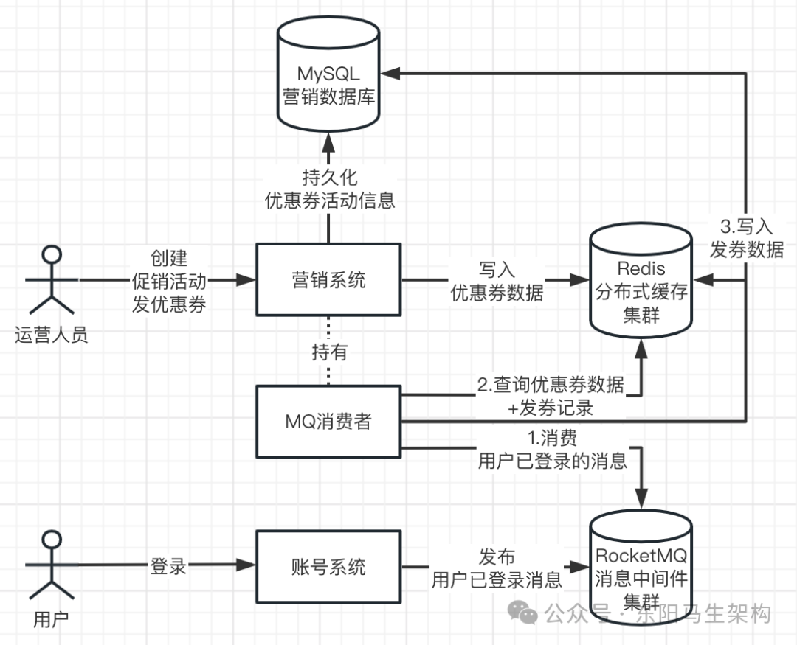

## 17.基于RocketMQ分发事件提高扩展性

### (1)使用RocketMQ主要为了实现三个效果

#### 一.耗时任务异步化提升接口性能

#### 二.瞬时高并发操作和操作进行削峰填谷

#### 三.发布事件消息实现多系统接耦和提升系统扩展性

上面介绍的惰性发券，就是经典的提高系统扩展性的例子。惰性发券要实现的效果是：当用户登录后，要检查是否需要对全量用户发放优惠券、当前用户是否发过优惠券。要实现这个效果，其实有两种思路。

### (2)思路一不使用RocketMQ会让系统间耦合

思路一：用户登录后，账号系统RPC调用营销系统，让营销系统检查是否要发优惠券，如果需要就发券

在这个思路中，账号系统由于需要RPC调用营销系统，所以两者便耦合在一起了。若营销系统接口有变化，则会影响账号系统，账号系统需要跟着营销系统的改变而改变。若营销系统接口性能出现问题，由于账号系统会同步RPC调用营销系统判断是否要发券，这会影响账号系统的登录接口性能。若后续需要在用户登录后增加积分，则影响了系统扩展性，除了会员系统需要修改外，还要账号系统也跟着进行修改，影响协作效率。

### (3)思路二使用RocketMQ解耦系统提升扩展性

思路二：用户登录后，账号系统发布一条用户已登录事件消息到RocketMQ，谁对用户已登录事件消息感兴趣就自行消费处理

在这个思路中，账号系统不再受营销系统接口改动的影响，也不再受营销系统接口性能的影响。其他系统如会员系统在登录时的新需求，同样无需账号系统介入。从而提升了系统扩展性。

## 18.指定用户群体推送领券消息的方案

### (1)千万级用户量下对全体用户推送消息

首先，当运营人员创建对全体用户推送消息的促销活动时，会通过RocketMQ进行异步化处理。

然后，在异步化处理时，会对千万级用户的推送任务进行分片拆分，拆分成多个任务，每100个任务会batch批量发送到RocketMQ。

接着，部署多个推送系统以多个RocketMQ消费者的角色实现分布式推送。

最后，推送系统每消费一个任务，用30～100个线程的线程池去并发完成一个任务中的用户的消息推送。

从而实现对千万级用户的全体推送，在时间和效率上是可控的。

### (2)千万级用户量下对全体用户发券

运营人员在创建对全体用户发券的促销活动时，会首先将券写入数据库进行持久化，然后将券写入到Redis缓存。

由于用户登录(每天第一次进入APP)属于低并发的事件，1000万用户每天的日活用户大概也就100万左右。所以当用户登录时，便会将用户登录消息写入RocketMQ，来实现账号系统和其他系统的解耦以及账号系统的高可扩展性。

营销系统会消费RocketMQ的用户登录消息，然后去Redis缓存查询券和发券记录，完成惰性发券。

通过这样的惰性发券，来实现对千万级用户的发券平均分摊到很多天(活跃的用户)来完成。

### (3)对特定用户群体推送优惠券

特定用户群体可能用户数很大(百万级)，但领券时不一定会同时过来开始领。

首先，当运营人员创建对特定用户群体发券的促销活动时，也是通过RocketMQ进行异步化处理。

然后，在异步化处理时，会去会员系统查询特定用户群体的用户数量，并且将推送任务分片拆分成多个任务，批量发送到MQ。

接着，部署多个推送系统以多个RocketMQ消费者的角色实现分布式推送。

最后，推送系统每消费一个任务，是用30～100个线程的线程池去并发完成对一个任务中的用户的领券消息Push。

从而实现对百万级特定用户的优惠券推送，在时间和效率上是可控的(分片任务里的用户会通过分页查询出来)。

## 19.基于大数据的爆款商品计算

营销系统有个功能是定期推送爆款商品给用户，需要根据不同的用户画像群体计算爆款商品，可能由AI团队负责，也可能由营销技术团队的AI小组负责。

关于爆款商品计算服务：其实不是每天都要去计算一次爆款商品推荐的。因为如果每天都给用户推荐一次它可能感兴趣的爆款商品，那么就会形成对用户群体的骚扰性推送。即便是促销活动，也最多每个月进行一次全量用户推送/指定用户群体发券，通常是几个月一次。

商品会有自己的标签，用户在APP上的行为也会产生自己的标签。通过用户画像标签，可以组合成一类用户最感兴趣的商品门类里的爆款商品。数据仓库里一般都有哪个商品购买最多、哪个商品浏览多少次、哪个商品好评率多少等信息。

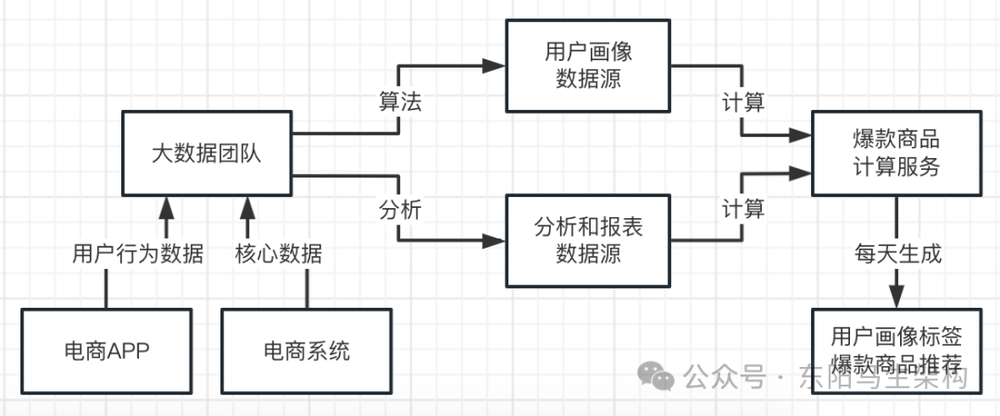

## 20.爆款商品分布式调度推送方案

通过用户画像标签，可以组合出某类用户最感兴趣的商品中的爆款商品。在每天计算出来的数据里，包含了很多类用户的爆款商品，一组用户画像标签会对应一类用户。

由于营销系统是多台机器集群部署的，为了让营销系统可以分布式调度处理不同用户画像标签的爆款商品推送，可以通过XXLJob来实现分布式定时调度。

一.首先XXLJob调度管理中心会有一组Excutors。

二.然后营销系统在启动时会有一个Excutor向XXLJob调度管理中心的这组Excutors进行注册。

三.接着开发者会在XXLJob调度管理中心进行调度任务的配置，比如该调度任务就是每天定时调度一次。当XXLJob调度管理中心的该调度任务每天定时执行时，就会找到所绑定的Excutors分组。通过该Excutors分组发送请求给营销系统的Excutor，并且带上shardIndex + shardNums分片数据。

四.当营销系统的Excutor收到请求后，会根据调度任务的配置，找到执行任务的Bean，让Excutor执行Bean的逻辑。执行任务的Bean会收到当前所属的分片编号shradIndex和分片总数shardNums，并且可以查出当天所有用户画像标签爆款的商品推荐及其数据编号，通过数据编号的Hash值对shardNums取模=shardIndex来挑选出当前营销系统应该处理哪些编号的商品推荐。

五.营销系统知道自己需要处理哪些编号下的爆款商品推荐后，就根据其对应的用户画像标签，去大数据系统查询出这些用户总数量，可能几十万级～几百万级。然后根据用户总数量进行推送任务的分片，将总的推送任务拆分成多个推送任务，再把分片后的任务batch批量发到MQ。

六.推送系统接着会对MQ里的已分片的推送任务进行消费，通过分页查出具体的用户利用线程池进行爆款商品推送。

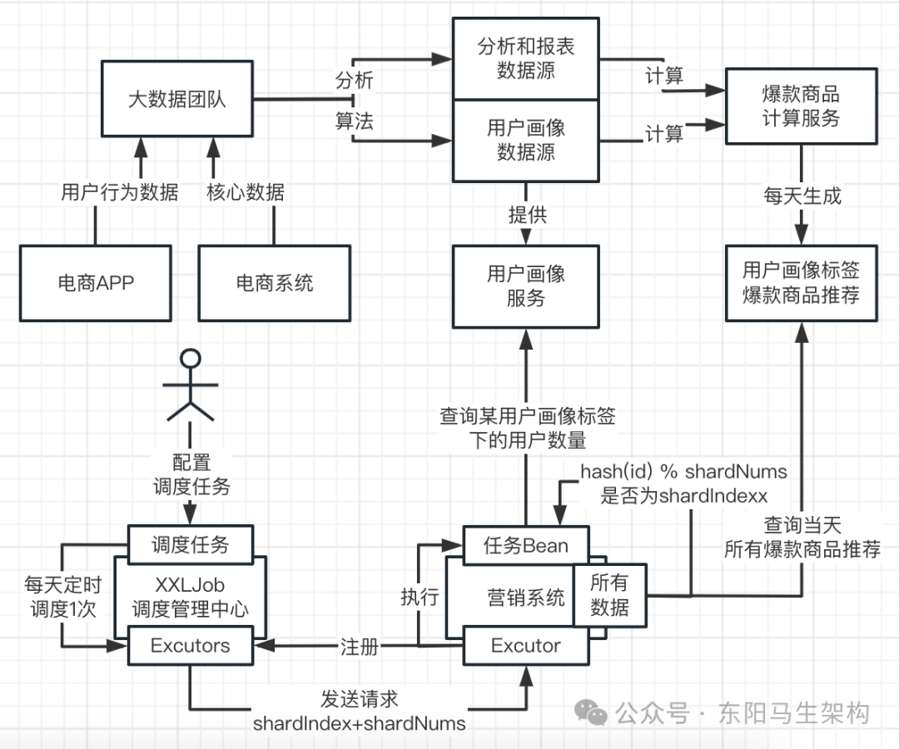
