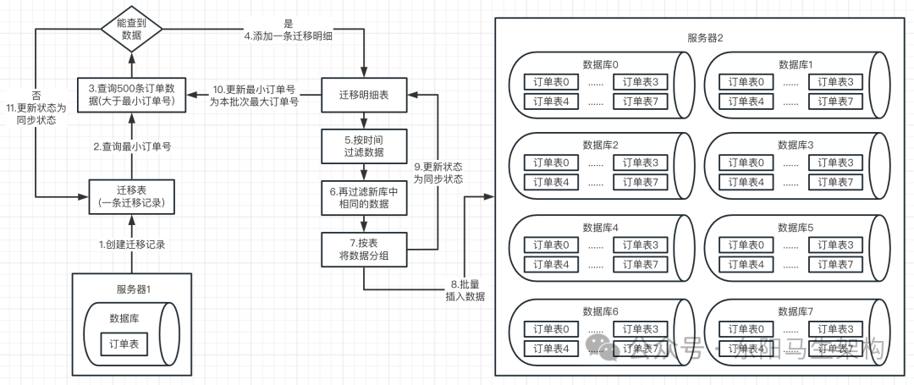
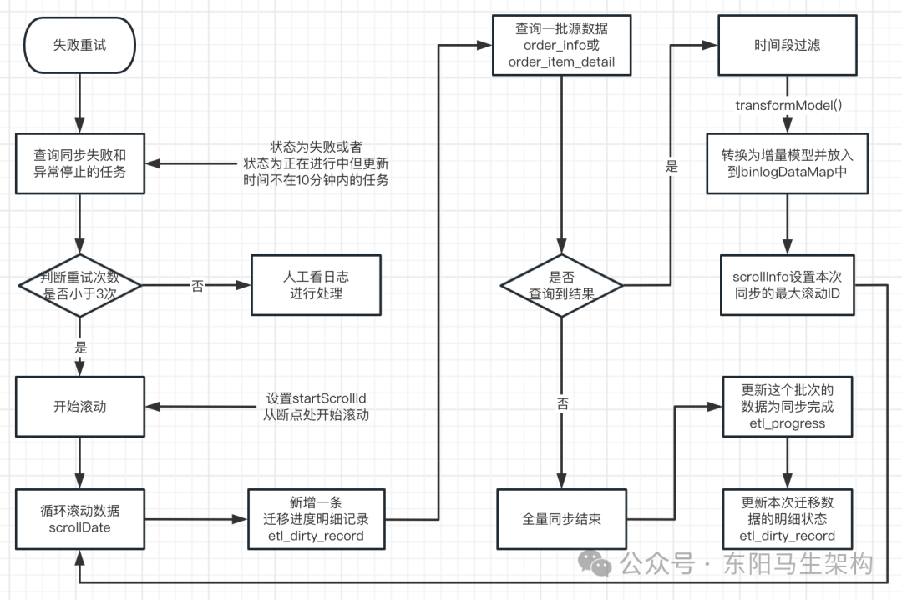
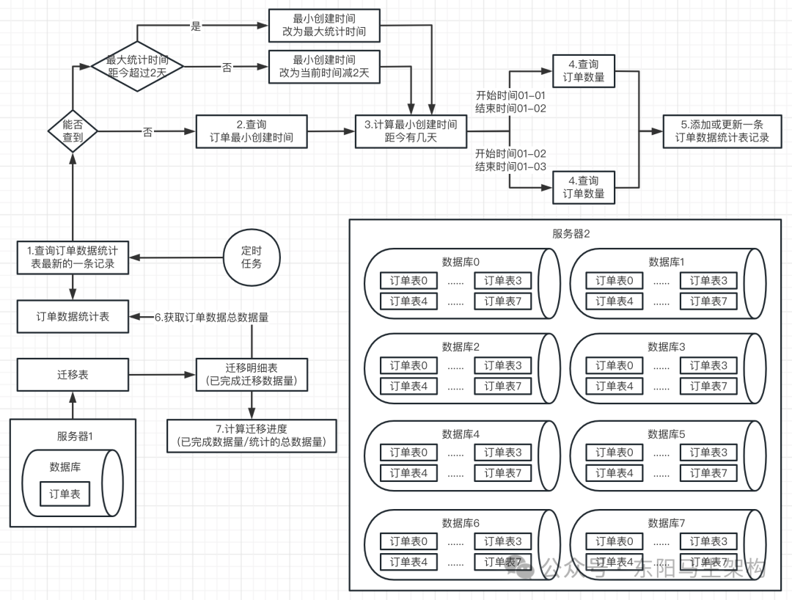
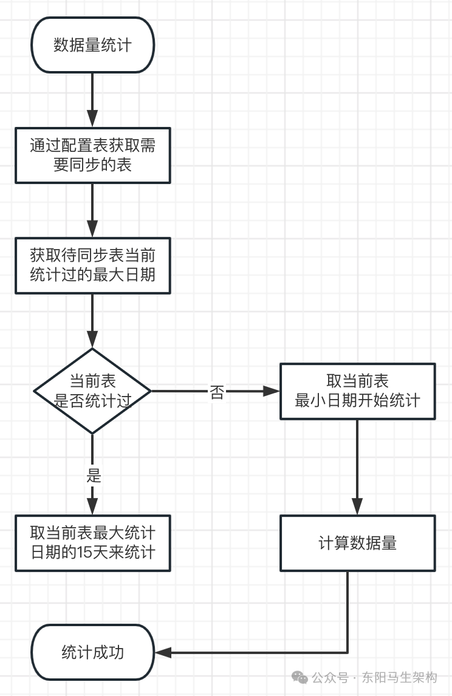

# 面试准备之项目要点总结六

> **公众号**: 东阳马生架构  
> **发布时间**: 2025-10-28 09:00  

**大纲(20700字)**

- 1.上亿数据从单表复制到64张表的场景
- 2.单库单表到多库多表的全量复制方案
- 3.全量数据复制方案的中断恢复分析
- 4.基于订单号和用户ID的分片路由算法
- 5.发起全量数据迁移任务的实现
- 6.处理全量数据迁移任务时的内存级表锁的实现
- 7.最小订单号的查询实现
- 8.全量数据迁移任务的进度组件的初始化
- 9.每一批数据的滚动查询、范围过滤、模型转换、去重校验以及批量写入
- 10.多数据源的工程代码实现
- 11.多批次滚动迁移的代码逻辑实现
- 12.手动触发和自动触发被中断的全量数据迁移任务
- 13.按天粒度的订单数据量定时计算逻辑
- 14.全量数据同步过程中的进度处理逻辑


## 1.上亿数据从单表复制到64张表的场景

分库分表生产上线的第一步就是：实现从单库单表到多库多表的全量数据同步\+ 增量数据同步。

需要实现这么一个效果，也就是发起一个数据同步任务后：单库单表里的上亿全量历史数据，会逐渐同步和写入到分库分表里。但在这个过程中，单库单表中的数据还会不断地进行增删改操作。所以还需同步执行增量数据复制，即在全量数据复制的过程中，得把数据变更增量复制。

也就是全量数据复制和增量数据复制需要一起跑，否则就会有问题。首先跑到一定的程度，全量数据复制会把所有数据都查询和写入一遍。然后在全量数据复制的过程中，所有的数据变更也会同步写入。并且当全量复制和增量复制一起运行时，需要不能让数据错乱和冲突。从而在某个时间点看来，单库单表和多库多表的数据是保持一致(数据准确 + 数据不丢失)。

如果将单库单表的亿级数据的订单表，分散到8库8表里面。那么亿级的数据就会落到8个库的总共64张订单表上，每个表里会放1亿/64 = 150万左右的数据。在一个150万数据量的表里进行SQL读写，性能会大幅提升。

## 2.单库单表到多库多表的全量复制方案

### (1)全量复制方案的核心思路

当需要发起一次全量复制时，可以按照如下核心思路设计进行：通过访问数据迁移系统的接口，生成一个全量数据复制的任务。该任务会对线上生产环境里的源库，全量复制数据到线上生产环境里的目标库。

全量复制会从最早的订单开始进行复制，并且以batch机制一批一批地进行数据查询。每次循环滚动从源库中查询出一批数据(默认500条)后，就将其复制迁移到目标库中。目标库中每条数据的写入会都基于分库分表路由策略和配置 + ShardingSphere框架来实现。而对于每一批数据的复制迁移，都会专门记录一条数据到迁移明细表里。

当然查询出每一批次的数据后，可以指定时间范围过滤，比如仅仅同步某时间内的数据。此外还会判断目标库中本次要复制和插入的数据是否已经存在，如果存在就不插入了。进行具体的插入时，会对数据按表分组，然后批量插入数据到目标库，最后更新迁移明细表中这一批次的同步状态。当循环滚动从源库查不出数据后，就更新本次全量复制的任务为成功。

### (2)全量复制方案的具体流程



具体流程如下：

步骤一：每次进⾏全量同步时都会往迁移表中添加⼀条记录。

步骤二：然后每次最多查询500条数据作为⼀个批次，该批次会在迁移明细表中对应添加⼀条记录。

步骤三：接着会进行滚动查询，也就是会根据当前选择数据同步的时间范围内，到订单表中查询最⼩订单号，然后将这个最⼩的订单号会保存在⼀个RangeScroll的实体类中。当查询订单数据时，查询条件会⽐较简单，就是订单号⼤于最⼩的订单号。然后经过时间过滤以及过滤掉目标库已有的数据后，剩下的就是本次全量同步的⽬标数据了。当这些目标数据同步到目标库后，会更新迁移明细状态，以及将当前已查到的订单数据中的最⼤订单号重置到RangeScroll类中。这样在下⼀轮查询时，查询参数中的最⼩订单号会从RangeScroll类中获取，从而实现滚动查询。

举个例⼦：有四条订单数据，对应四个订单号：1001、1002、1003、1004。初始查询发现最⼩订单号为1001，此时会对1001减1=1000，保证订单号为1001这条数据能查到，也能同步过去(这个细节容易忽视)，然后假设每次只能查询2条数据。第⼀次查询，因为查询条件是⼤于最⼩订单号减1也就是1000，查询到了1001、1002这两个订单号的订单数据。处理完第⼀轮后，会把本次最⼤的订单号也就是1002，作为下⼀轮查询的最⼩订单号。下⼀轮查询情况，会查询订单号⼤于1002的订单数据，此时就会查询出1003、1004对应的订单数据，并且将1004作为下⼀轮的最⼩订单号查询。再下⼀轮查询时，条件就变为订单号⼤于1004，此时就查询不到数据了，数据迁移结束。本次全量同步经过两个批次查询，⼀共添加了⼀条迁移记录，还有两条迁移明细。最后迁移记录和迁移明细的状态，都会更新为同步成功状态。

步骤四：根据表名分组进行批量插⼊

当查询源库的数据并过滤掉⼀些数据后，并不是⼀条⼀条插⼊到目标库中的。⽽是会根据表名进⾏分组，然后批量插⼊目标库。相⽐于⼀条条数据插⼊，这样效率也会更⾼⼀点，这是需要做的⼀个优化点。

步骤五：更新迁移明细表记录和迁移记录为同步状态

循环滚动查询出来的每一批次数据处理完后，就更新迁移明细表中该批次的同步状态。当循环滚动从源库查不出数据后，就更新本次迁移记录为同步状态。

## 3.全量数据复制方案的中断恢复分析

假如需要全量复制的数据量为1亿，那么由于每批次查询500条数据，1亿/500=20万。所以进行一次全量复制，就会执行20万次将每次查询的500条数据写入分库分表环境。

在执行这20万次的500条数据复制迁移过程中，如果数据迁移系统重启或崩溃导致程序中断了，那么全量数据迁移任务也会中断，为此需要实现全量数据迁移任务的中断自动恢复。

只要有一个全量数据迁移任务还没有被标记为成功状态，那么就可以恢复继续这个迁移任务。比如可以查询当前的迁移明细表里：如果所有batch迁移明细都被标记为成功，则从最新的batch迁移明细的最大ID起步开始往后查下一个batch，继续进行迁移任务的写入。如果有某次batch还没被标记为成功，则可以从这次batch迁移明细开始，重新查询这次batch对应的数据，进行重新继续写入。

## 4.基于订单号和用户ID的分片路由算法

如果SQL中有orderNo字段的值，就将orderNo作为路由字段进行路由。如果SQL中没有orderNo字段的值，但有userId字段的值，就将userID作为路由字段进行路由。

库路由算法是：路由字段后三位Hash值对数据库数量进行取模。表路由算法是：路由字段后三位Hash值对表数量求余然后再对表数量进行取模。

### (1)分库路由算法类

```typescript
//C端维度分库路由算法类
publicclass OrderDbShardingByUserAlgorithm implements ComplexKeysShardingAlgorithm<Comparable<?>> {
    //通过orderNo或userId的值计算出这条SQL要路由到哪个DB里
    //库路由算法是：先orderNo再userId，谁存在就根据谁的后三位Hash值对数据库数量进行取模
    //@param dbs 代表了在migrate.properties配置文件里对目标数据库配置的8个数据源
    //@param shardingValue shardingValue代表了在migrate.properties配置文件里配置的两个用于进行路由计算的字段名称
    //一条SQL在执行时，SQL语句会带上这两个路由字段(orderNo,userId)的值，这些值会通过shardingValue传递进来
    @Override
    public Collection<String> doSharding(Collection<String> dbs, ComplexKeysShardingValue<Comparable<?>> shardingValue) {
        //提取出这条SQL里可以进行路由的两个字段orderNo和userId的值
        Collection<Comparable<?>> orderNos = shardingValue.getColumnNameAndShardingValuesMap().get("order_no");
        Collection<Comparable<?>> userIds = shardingValue.getColumnNameAndShardingValuesMap().get("user_id");

        //actualDbNames表示的是要把这条SQL路由到具体哪些DB
        Set<String> actualDbNames = null;
        if (CollectionUtils.isNotEmpty(orderNos)) {
            actualDbNames = orderNos.stream().map(orderNo -> getActualDbName(String.valueOf(orderNo), dbs)).collect(Collectors.toSet());
        } elseif (CollectionUtils.isNotEmpty(userIds)) {
            actualDbNames = userIds.stream().map(userId -> getActualDbName(String.valueOf(userId), dbs)).collect(Collectors.toSet());
        }

        return actualDbNames;
    }

    publicString getActualDbName(String shardingValue, Collection<String> dbs) {
        //获取路由字段的后三位，该路由字段可能是orderNo，也可能是userId
        String userIdSuffix = StringUtils.substring(shardingValue, shardingValue.length() - 3);
        //使用路由字段的后三位进行路由：路由字段后三位的Hash值对DB数量取模，值是0～7
        int dbSuffix = userIdSuffix.hashCode() % dbs.size();
        for (String db : dbs) {
            if (db.endsWith(String.valueOf(dbSuffix))) {
                return db;
            }
        }
        returnnull;
    }
}
```

### (2)分表路由算法类

```typescript
//C端维度分表路由算法类
publicclass OrderTableShardingByUserAlgorithm implements ComplexKeysShardingAlgorithm<Comparable<?>> {
    //通过orderNo或userId的值计算出这条SQL要路由到哪个DB里
    //表路由算法是：先orderNo再userId，谁存在就根据谁的后三位Hash值对表数量求余然后再对表数量进行取模
    //@param tables 代表了在migrate.properties配置文件里对目标数据库配置的8个数据表
    //@param shardingValue shardingValue代表了在migrate.properties配置文件里配置的两个用于进行路由计算的字段名称
    //一条SQL在执行时，SQL语句会带上这两个路由字段(orderNo,userId)的值，这些值会通过shardingValue传递进来
    @Override
    public Collection<String> doSharding(Collection<String> tables, ComplexKeysShardingValue<Comparable<?>> shardingValue) {
        //提取出这条SQL里可以进行路由的两个字段orderNo和userId的值
        Collection<Comparable<?>> orderNos = shardingValue.getColumnNameAndShardingValuesMap().get("order_no");
        Collection<Comparable<?>> userIds = shardingValue.getColumnNameAndShardingValuesMap().get("user_id");

        //actualDbNames表示的是要把这条SQL路由到具体哪些表
        Set<String> actualTableNames = null;
        if (CollectionUtils.isNotEmpty(orderNos)) {
            actualTableNames = orderNos.stream().map(orderNo -> getActualTableName(String.valueOf(orderNo), tables)).collect(Collectors.toSet());
        } elseif (CollectionUtils.isNotEmpty(userIds)) {
            actualTableNames = userIds.stream().map(userId -> getActualTableName(String.valueOf(userId), tables)).collect(Collectors.toSet());
        }

        return actualTableNames;
    }

    publicString getActualTableName(String shardingValue, Collection<String> tables) {
        //获取路由字段的后三位，该路由字段可能是orderNo，也可能是userId
        String userIdSuffix = StringUtils.substring(shardingValue, shardingValue.length() - 3);
        //使用路由字段的后三位进行路由：路由字段后三位的Hash值对表数量求余然后再对表数量取模
        int tableSuffix = userIdSuffix.hashCode() / tables.size() % tables.size();
        for (String table : tables) {
            if (table.endsWith(String.valueOf(tableSuffix))) {
                return table;
            }
        }
        returnnull;
    }
}
```

5.发起全量数据迁移任务的代码实现

核心的地方在于：对表发起全量迁移任务时需要加锁。首先，初始化滚动查询的数据模型，其中需要的参数有：每次查询数据量、雪花算法生成批次号、获取最小订单号。然后，初始化全量数据迁移任务的进度计算组件EtlProgress。接着，插入全量迁移任务的数据模型到数据库中。最后，循环滚动，查询出一批批的数据进行处理。

### (1)通过访问"/toIndex"可以进入index.html界面

index.html会加载已有的数据迁移任务，提供"/migrate/addScroll"按钮。

```kotlin
@Controller
@RequestMapping("/")
publicclassIndexController{
    @Resource
    private MigrateService migrateService;

    //跳转到首页
    //@return 首页html名称
    @RequestMapping("/toIndex")
    public String toIndex(HttpServletRequest request) {
        List<String> scrollAbleTables = migrateService.getScrollAbleTables();
        if (CollUtil.isNotEmpty(scrollAbleTables)) {
            request.setAttribute("scrollAbleTables", JSONUtil.toJsonStr(scrollAbleTables));
        }
        return"index";
    }
}
```

### (2)通过"/migrate/addScroll"接口可以发起一次全量数据迁移任务

```typescript
@RestController
@RequestMapping("/migrate")
publicclass MigrateController {
    @Resource
    private ScrollProcessor scrollProcessor;
    ...
    //新增全量同步  将前端传过来的世界格式化
    //通过index.html页面可以发起一次全量数据迁移的任务
    //@param rangeScroll 全量同步条件
    //@return 保存结果
    @RequestMapping(value = "/addScroll", method = RequestMethod.POST)
    public Map<String, Object> addScroll(@RequestBody RangeScroll rangeScroll) {
        rangeScroll.setStartTime(DateUtils.getStartTimeOfDate(rangeScroll.getStartTime()));
        rangeScroll.setEndTime(DateUtils.getDayEndTime(rangeScroll.getEndTime()));
        Map<String, Object> resultMap = new HashMap<>();
        resultMap.put("resultCode", OperateResult.SUCCESS.getValue());
        resultMap.put("resultMsg", OperateResult.SUCCESS.getName());
        //发起一次全量迁移任务
        scrollProcessor.scroll(rangeScroll);
        return resultMap;
    }
    ...
}
```

### (3)RangeScroll类表示的是数据滚动查询模型

```typescript
//数据滚动查询模型
@Data
publicclass RangeScroll implements Serializable {
    //主键ID
    private Long id;
    //滚动查询数据的开始时间，限定了查询数据的时间范围
    privateDate startTime;
    //滚动查询数据的截止时间，限定了查询数据的时间范围
    privateDate endTime;
    //滚动查询数据起始查询字段值
    privateString startScrollId;
    //当前所属批次阶段号
    private Integer curTicketStage;
    //迁移批次
    privateString ticket;
    //滚动查询数据指定的表
    privateString tableName;
    //每页捞取数量，也就是每一次查询多少数据，默认500
    private Integer pageSize;
    //是否重试
    privateBoolean retryFlag = false;
    //已重试次数
    private Integer retryTimes;
}
```

### (4)ScrollProcessor类会进行具体的全量数据迁移任务处理

```java
//全量数据滚动查询处理
@Component
publicclassScrollProcessor{
    //滚动查询数据的大小
    privatestaticfinal Integer PAGE_SIZE = 500;
    //滚动锁对象
    privatefinal ScrollLock lock = new ScrollLock();
    ...
    //全量同步数据入口(可指定从某个批次的序号开始再次执行)
    //@param rangeScroll 数据滚动查询模型
    publicvoidscroll(RangeScroll rangeScroll){
        //从任务执行条件里提取出一个tableName，本次要迁移的表名
        //然后对这个要迁移的表的名字进行lock锁定，ScrollLock是自定义的一个锁对象
        boolean lockState = this.lock.lock(rangeScroll.getTableName());
        if (lockState) {
            try {
                //初始化总数据量统计容器
                if (ObjectUtils.isEmpty(rangeScroll.getPageSize())) {
                    //设置任务的每页滚动查询数据的数量为默认参数
                    rangeScroll.setPageSize(PAGE_SIZE);
                }
                if (ObjectUtils.isEmpty(rangeScroll.getTicket())) {
                    //基于雪花算法生成唯一ID，这个唯一ID会被设置为全量数据迁移任务对应的ticket批次号
                    rangeScroll.setTicket(SnowflakeIdWorker.getCode());
                }
                if (StringUtils.isEmpty(rangeScroll.getStartScrollId())) {
                    //每次进行滚动查询数据时，是根据ID主键值去查询数据的
                    //这里设置全量数据迁移任务开始时滚动查询数据的ID为最小订单号
                    MigrateService migrateService = ApplicationContextUtil.getBean(MigrateService.class);
                    String orderNo = migrateService.queryMinOrderNo(rangeScroll);
                    rangeScroll.setStartScrollId(orderNo);
                }

                //全量数据迁移任务的进度计算组件EtlProgress
                //EtlProgress负责计算迁移任务当前的进度，可以呈现全量数据迁移过程中的某时刻迁移的数据比例
                //EtlProgress是一个辅助类型的计算组件，在开始全量数据迁移任务之前，就需要把它进行初始化
                EtlProgress etlProgress = addEtlProgress(rangeScroll);

                //对滚动的数据进行处理
                scrollDate(etlProgress, rangeScroll);
            } catch (Exception e) {
                log.error("滚动拉取数据异常{}", JSONObject.toJSONString(rangeScroll), e);
            } finally {
                //当前scroll()操作处理完，才会释放自定义的ScrollLock锁
                lock.unlock(rangeScroll.getTableName());
            }
        }
    }
    ...
}
```

6.处理全量数据迁移任务时的内存级表锁实现

ScrollProcessor的scroll()方法会对表名加锁。

```java
publicclassScrollLockimplementsjava.io.Serializable{
    privatestaticfinallong serialVersionUID = -1753559665314067716L;
    //由于可能会出现多个人对多个表同时发起一次全量数据迁移任务，所以这里使用一个内存列表存放不同表对应的锁情况
    List<Scroll> scrollList = new ArrayList<>();

    //针对一个表的滚动处理进行上锁
    publicbooleanlock(String tableName){
        //每个tableName对应一个Scroll对象，每个Scroll对象就有一把锁
        //同一时间只有一个线程能获取到表的锁去执行全量数据迁移的任务
        for (Scroll scroll : scrollList) {
            if (scroll.getTableName().equals(tableName)) {
                return scroll.getLock().tryLock();
            }
        }
        //强行针对ScrollLock类级别进行加锁
        //如果有多个线程同时并发对某一个tableName进行加锁，这里就直接会互斥
        synchronized (ScrollLock.class) {
            for (Scroll scroll : scrollList) {
                if (scroll.getTableName().equals(tableName)) {
                    return scroll.getLock().tryLock();
                }
            }
            //直接为这个tableName创建一个Scroll
            Scroll scroll1 = new Scroll();
            scroll1.setTableName(tableName);

            scrollList.add(scroll1);
            return scroll1.getLock().tryLock();
        }
    }

    //释放锁
    publicvoidunlock(String tableName){
        for (Scroll scroll : scrollList) {
            if (scroll.getTableName().equals(tableName)) {
                scroll.getLock().unlock();
            }
        }
    }

    //锁对象
    @Data
    staticclassScroll{
        //表名
        private String tableName;
        //可重入锁
        private Lock lock = new ReentrantLock(false);
    }
}
```

## 7.最小订单号的查询实现

ScrollProcessor的scroll()方法会设置最小订单号为开始滚动查询的ID。

```java
@Service
publicclassMigrateServiceImplimplementsMigrateService{
    ...
    @Override
    public String queryMinOrderNo(RangeScroll rangeScroll){
        if (StrUtil.isNotBlank(rangeScroll.getTableName())) {
            try {
                Object mapper = MigrateUtil.getD1MapperByTableName(rangeScroll.getTableName());
                if (null != mapper) {
                    //通过反射获取queryMinOrderNo方法
                    Method targetMethod = mapper.getClass().getDeclaredMethod("queryMinOrderNo", RangeScroll.class);
                    //通过反射执行queryMinOrderNo方法
                    Object returnValue = targetMethod.invoke(mapper, rangeScroll);
                    if (null != returnValue) {
                        return String.valueOf(Long.parseLong((String) returnValue) - 1);
                    }
                    return"0";
                }
            } catch (Exception e) {
                log.error("queryInfoList方法执行出错", e);
                return"0";
            }
        }
        return"0";
    }
    ...
}

//数据迁移工具类
publicclassMigrateUtil{
    //第一个数据源Mapper后缀(数据迁移新表是用的第二个数据源，所以统一规则用实体类名 + 02Mapper作为mapper名称)：02Mapper
    static String SUFFIX_01MAPPER = "01Mapper";
    ...
    //根据表名取得第一个数据源的Mapper
    publicstatic Object getD1MapperByTableName(String tableName){
        if (StrUtil.isNotBlank(tableName)) {
            //这里先将tableName的首字母转为小写再转为驼峰命名
            //原因是假设传过来的表名是类似Order这种首字母大写的只有一个单词的表名，hutool返回的仍然会是Order，按这个名字去spring里显然是取不到bean的
            String beanName = StrUtil.toCamelCase(StrUtil.lowerFirst(tableName));
            //拼接后缀Mapper
            beanName = beanName + SUFFIX_01MAPPER;
            //从Spring IOC容器获取mapper
            return ApplicationContextUtil.getBean(beanName);
        }
        returnnull;
    }
    ...
}

//手动获取Spring管理的Bean的工具类
@Component
publicclassApplicationContextUtilimplementsApplicationContextAware{
    privatestatic ApplicationContext context;

    //获取Spring上下文
    publicstatic ApplicationContext getContext(){
        return context;
    }

    //根据Bean名称获取Bean
    //@param beanName Bean名称
    //@return Spring管理的Bean
    publicstatic Object getBean(String beanName){
        return context.getBean(beanName);
    }

    //根据Bean的对象获取对应得Bean
    //@param required
    //@param <T>
    publicstatic <T> T getBean(Class<T> required){
        return context.getBean(required);
    }

    @Override
    publicvoidsetApplicationContext(ApplicationContext applicationContext)throws BeansException {
        context = applicationContext;
    }
}
```

## 8.全量数据迁移任务的进度组件的初始化

ScrollProcessor的scroll()方法会通过addEtlProgress()方法初始化进度计算组件。EtlProgress里面会存储全量数据迁移任务在运行的过程中，产生的各种各样的进度数据。

```typescript
//全量数据滚动查询处理
@Component
publicclass ScrollProcessor {
    @Resource
    private MigrateScrollMapper migrateScrollMapper;
    ...
    //初始化本次全量数据迁移任务对应的数据滚动查询模型
    private EtlProgress addEtlProgress(RangeScroll rangeScroll) {
        EtlProgress etlProgress = new EtlProgress();
        //设置逻辑表名
        etlProgress.setLogicModel(rangeScroll.getTableName());
        //设置所属批次阶段号
        if (ObjectUtils.isEmpty(rangeScroll.getCurTicketStage())) {
            etlProgress.setCurTicketStage(1);
        } else {
            etlProgress.setCurTicketStage(rangeScroll.getCurTicketStage() + 1);
        }
        //设置迁移批次
        etlProgress.setTicket(rangeScroll.getTicket());
        if (!ObjectUtils.isEmpty(rangeScroll.getRetryTimes())) {
            etlProgress.setRetryTimes(rangeScroll.getRetryTimes());
        } else {
            etlProgress.setRetryTimes(0);
        }

        //断点续传的时候，同步finishRecord数据过来，然后将翻页的页数改为默认值，防止当同步了几百万数据时，一次取百万数据导致异常
        if (PAGE_SIZE.equals(rangeScroll.getPageSize())) {
            etlProgress.setFinishRecord(0);
        } else {
            etlProgress.setFinishRecord(rangeScroll.getPageSize());
            rangeScroll.setPageSize(PAGE_SIZE);
        }

        //设置类型，默认是滚动查询数据
        etlProgress.setProgressType(0);
        etlProgress.setStatus(EtlProgressStatus.INIT.getValue());
        etlProgress.setScrollId(rangeScroll.getStartScrollId());
        etlProgress.setScrollTime(rangeScroll.getStartTime());
        etlProgress.setScrollEndTime(rangeScroll.getEndTime());
        etlProgress.setCreateTime(new DateTime());
        etlProgress.setUpdateTime(new DateTime());
        //重试直接返回
        if (rangeScroll.getRetryFlag()) {
            rangeScroll.setRetryFlag(false);
            return etlProgress;
        } else {
            //插入一条记录到数据库
            migrateScrollMapper.insertEtlProgress(etlProgress);
        }
        return etlProgress;
    }
    ...
}

//迁移表
//EtlProgress里面会存储全量数据迁移任务在运行的过程中，产生的各种各样的进度数据；* 封装了数据迁移任务核心的信息、迁移进度：* 比如已经迁移了多少条数据、已经迁移数据/总共需要迁移的数据 = 完成迁移比例
@Data
publicclass EtlProgress implements Serializable {
    privatestatic final long serialVersionUID = 3381526018986361684L;
    //主键
    private Long id;
    //逻辑模型名(逻辑表)
    privateString logicModel;
    //迁移批次(雪花算法生成的唯一标识)
    privateString ticket;
    //当前所属批次阶段号(由1开始)
    private Integer curTicketStage;
    //进度类型(0滚动查询数据，1核对查询数据)
    private Integer progressType;
    //迁移状态
    private Integer status;
    //已同步次数
    private Integer retryTimes;
    //已完成记录数
    private Integer finishRecord;
    //已完成进度
    private BigDecimal ProgressScale;
    //记录上一次滚动最后记录的滚动字段值
    privateString scrollId;
    //开始滚动时间
    @JsonFormat(pattern = "yyyy-MM-dd HH:mm:ss", timezone = "GMT+8")
    privateDate scrollTime;
    //滚动截止时间
    privateDate scrollEndTime;
    //创建时间
    privateDate createTime;
    //修改时间
    privateDate updateTime;
}
```

## 9.每一批数据的滚动查询、范围过滤、模型转换、去重校验以及批量写入

### (1)scrollDate()方法会滚动查询出数据进行处理

ScrollProcessor的scroll()方法最后会调用ScrollProcessor的scrollDate()方法滚动查询出数据进行处理。

```typescript
//全量数据滚动查询处理
@Component
publicclass ScrollProcessor {
    ...
    //循环滚动查询数据
    //@param etlProgress 数据滚动查询批次
    privatevoid scrollDate(EtlProgress etlProgress, RangeScroll rangeScroll) {
        EtlDirtyRecord etlDirtyRecord = null;
        try {
            MigrateService migrateService = ApplicationContextUtil.getBean(MigrateService.class);
            //滚动查询数据，当查询完最后一批数据后将同步状态为同步完成
            List<Map<String, Object>> queryInfoList = migrateService.queryInfoList(rangeScroll);
            while (CollectionUtils.isNotEmpty(queryInfoList)) {
                //数据同步
                MergeBinlogWrite mergeBinlogWrite = new MergeBinlogWrite();
                //拿当前的这批数据，标记最后一条数据的关键分页字段更新
                ScrollInfo scrollInfo = mergeBinlogWrite.load(queryInfoList, rangeScroll);

                //当批量写入的数据为0时，可能已经在时间范围内同步完成
                //这个时候查询进度数据，如果进度达到100%，则更新当前的任务为完成状态
                if (checkEtlProgressSuccess(scrollInfo, etlProgress)) {
                    //更新当前的同步任务为同步完成
                    updateEtlProgressSuccess(etlProgress);
                    return;
                }

                //初始化本批次的明细数据
                etlDirtyRecord = insertEtlDirtyRecord(etlProgress, rangeScroll);

                rangeScroll.setStartScrollId(scrollInfo.getMaxScrollId());
                etlProgress.setScrollId(scrollInfo.getMaxScrollId());
                etlProgress.setCurTicketStage(etlProgress.getCurTicketStage() + 1);
                etlDirtyRecord.setSyncSize(scrollInfo.getScrollSize());

                //更新这个批次的数据同步完成
                updateEtlProgress(etlProgress, etlDirtyRecord, EtlProgressStatus.SUCCESS.getValue(), scrollInfo.getScrollSize());

                //继续滚动查询数据
                queryInfoList = migrateService.queryInfoList(rangeScroll);
            }
            updateEtlProgressSuccess(etlProgress);
        } catch (Exception e) {
            log.error("循环滚动查询数据错误", e);
            if (null != etlProgress) {
                updateEtlProgressFail(etlProgress, etlDirtyRecord, 0);
            }
        }
    }
    ...
}
```

### (2)MigrateService的queryInfoList()方法会从源数据库查出一批数据

ScrollProcessor的scrollDate()方法会调用migrateService的queryInfoList()方法从源数据库中查询出一批数据。

```typescript
//数据同步服务实现类
@Service
publicclass MigrateServiceImpl implements MigrateService {
    ...
    //滚动拉取数据
    //@param rangeScroll 查询条件
    //@return 符合要求的数据
    //@implNote 这里其实可以完全通过反射完成动态sql，但是此处为了方便还是依赖了手写的mapper来执行，而不是完全动态操作
    @Override
    @SuppressWarnings({"unchecked"})
    public List<Map<String, Object>> queryInfoList(RangeScroll rangeScroll) {
        if (StrUtil.isNotBlank(rangeScroll.getTableName()) && StrUtil.isNotBlank(rangeScroll.getStartScrollId())) {
            try {
                Object mapper = MigrateUtil.getD1MapperByTableName(rangeScroll.getTableName());
                if (null != mapper) {
                    //通过反射获取queryInfoList方法
                    Method targetMethod = mapper.getClass().getDeclaredMethod("queryInfoList", RangeScroll.class);
                    //通过反射执行queryInfoList方法
                    Object returnValue = targetMethod.invoke(mapper, rangeScroll);
                    if (null != returnValue) {
                        return MigrateUtil.toCamelCaseMapList((List<Map<String, Object>>) returnValue);
                    }
                    returnnew ArrayList<>();
                }
            } catch (Exception e) {
                log.error("queryInfoList方法执行出错", e);
                returnnew ArrayList<>();
            }
        }
        returnnew ArrayList<>();
    }
    ...
}
```

(3)MergeBinlogWrite的load()方法会进行设置ID、数据过滤、模型转换、去重校验、批量写入

ScrollProcessor的scrollDate()方法中调用的MergeBinlogWrite的load()会做如下处理：

#### 一.设置下次滚动查询的起始ID

#### 二.对查出来的数据进行过滤和模型转换

#### 三.针对目标数据源的批量查询去重校验逻辑

#### 四.目标分库分表的批量写入

```javascript
//对数据合并，并写入存储
//在进行全量数据同步时，会调用MergeBinlogWrite组件的load()方法对数据进行过滤
//在进行增量数据同步时，会通过MergeBinlogWrite组件的mergeBinlog()方法对监听到的binlog进行合并操作
public classMergeBinlogWrite{
    //用于存储过滤最新的数据
    private final Map<String, BinLog> binlogDataMap = new HashMap<>(2048);
    ...
    //全量的数据同步
    public ScrollInfo load(List<Map<String, Object>> scrollList, RangeScroll rangeScroll) {
        //过滤掉非需要匹配的时间断的数据，如果过滤后数据为空，则直接返回
        filterCreateTime(scrollList, rangeScroll);
        if (scrollList.size() == 0) {
            return scrollInfo;
        }
        //数据转换为增量的模型，即对要插入目标库的数据进行数据模型的转换
        transformModel(scrollList, rangeScroll.getTableName());
        //对数据和目标库进行过滤
        filterBinlogAging();
        //写入目标库
        write(OperateType.ALL);
        return scrollInfo;
    }

    //首先拿到当前页最大的滚动ID，设置下次滚动查询的起始ID
    //然后在过滤掉不是查询的时间区域的数据，防止全部数据都被过滤掉
    private void filterCreateTime(List<Map<String, Object>> scrollList, RangeScroll rangeScroll) {
        String key = MergeConfig.getSingleKey(rangeScroll.getTableName());
        //获取scrollList的最后一条数据的主键ID值，即当前批次的这500条数据中的最大主键ID
        //然后设置到scrollInfo中，作为下一次滚动查询时的起始主键ID值
        scrollInfo.setMaxScrollId(scrollList.get(scrollList.size() - 1).get(key).toString());

        //遍历这500条数据，根据createTime进行过滤
        Iterator<Map<String, Object>> iterator = scrollList.iterator();
        while (iterator.hasNext()) {
            Map<String, Object> scrollMap = iterator.next();
            Date createTime = (Date) scrollMap.get(CREATE_TIME_STAMP);
            //如果这条数据的createTime在我们指定的起始时间和结束时间范围之外，就把这条数据给过滤掉，不需要插入到目标库
            if (createTime.compareTo(rangeScroll.getStartTime()) < 0 || createTime.compareTo(rangeScroll.getEndTime()) > 0) {
                iterator.remove();
            }
        }
        //设置本批次同步的数据量，也就是过滤完后有多少数据会插入到目标库中
        scrollInfo.setScrollSize(scrollList.size());
    }

    //模型转换
    private void transformModel(List<Map<String, Object>> scrollList, String tableName) {
        String key = MergeConfig.getSingleKey(tableName);
        SimpleDateFormat format = new SimpleDateFormat("yyyy-MM-dd hh:mm:ss");
        try {
            //将查出来的每条数据都转换成BinLog模型
            for (Map<String, Object> scrollMap : scrollList) {
                BinLog binLog = new BinLog();
                binLog.setOperateType(BinlogType.INSERT.getValue());
                binLog.setDataMap(scrollMap);
                binLog.setOperateTime(format.parse(scrollMap.get(TIME_STAMP) + "").getTime());
                binLog.setTableName(tableName);
                binLog.setKey(key);
                //binlogDataMap的key是由"每条数据的主键ID" + "&" + "表名"组成的
                binlogDataMap.put(scrollMap.get(key) + SPLIT_KEY + tableName, binLog);
            }
        } catch (Exception e) {
            log.error("模型转换出错", e);
        }
    }
    ...
}
```

(4)MergeBinlogWrite的filterBinlogAging()方法会针对目标数据源进行去重校验

MergeBinlogWrite的load()方法会调用MergeBinlogWrite的filterBinlogAging()方法。其中，去重校验验的逻辑是：首先根据源库查出来的数据去目标库查询，查询的时候会分页查。如果能从目标库查出数据，就看这些数据的更新时间是否比源库的更新时间小。如果大，则无须处理。如果小，则需要更新。同时注意删除数据不比较更新时间。

从MergeBinlogWrite的transformModel()方法可知，binlogDataMap的key是由"每条数据的主键ID" + "&" + "表名"组成的。

```javascript
public classMergeBinlogWrite{
    //用于存储过滤最新的数据，binlogDataMap的key是由"每条数据的主键ID" + "&" + "表名"组成的
    private final Map<String, BinLog> binlogDataMap = new HashMap<>(2048);
    ...
    //对合并后的数据进行验证是否为过时数据
    public void filterBinlogAging() {
        //批量查询数据，是否存在于目标库，并返回匹配的数据集合；也就是根据这500条数据去分库分表的目标库中进行查询
        Map<String, Map<String, Object>> respMap = batchQuery();

        //开始核对数据是否已经存在库中，并验证谁的时间最新过滤失效数据
        for (Map.Entry<String, BinLog> entry : binlogDataMap.entrySet()) {
            BinLog binLog = entry.getValue();
            //当前同步要处理的表名称
            String tableName = binLog.getTableName();

            //判断同步的数据库中，是否在目标库已存在
            if (!CollectionUtils.isEmpty(respMap) && respMap.containsKey(entry.getKey())) {
                //当前同步的这条记录
                Map<String, Object> binLogMap = binLog.getDataMap();
                //目标库被查询到的记录
                Map<String, Object> targetMap = respMap.get(entry.getKey());

                //处理同步的记录是否需要执行，如果同步的时间大于目标库的时间，则代表需要更新，但删除的数据不比对时间
                if (!MigrateCheckUtil.comparison(binLogMap, targetMap, tableName)
                        && !BinlogType.DELETE.getValue().equals(binLog.getOperateType())) {
                    continue;
                }
            } else {
                //数据在目标库不存在，对多条数据的最后一条结果集的类型为update，需要更正为insert，如果是delete则略过
                if (BinlogType.UPDATE.getValue().equals(binLog.getOperateType())) {
                    binLog.setOperateType(BinlogType.INSERT.getValue());
                }
                if (BinlogType.DELETE.getValue().equals(binLog.getOperateType())) {
                    continue;
                }
            }
            //将需要写入或更新的数据添加到集合中
            binlogDataList.add(binLog);
        }
    }
    ...
    //批量查询已存在目标库的数据
    private Map<String, Map<String, Object>> batchQuery() {
        //先获取本次迁移的全部唯一key
        List<String> keyStrList = new ArrayList<>(binlogDataMap.keySet());
        binlogDataList = new ArrayList<>(keyStrList.size());

        //筛选按表为维度的集合
        Map<String, List<String>> keyMap = new HashMap<>();
        for (String keyStr : keyStrList) {
            //这是由于binlogDataMap的key是由"每条数据的主键ID" + "&" + "表名"组成的；String[] split = keyStr.split(SPLIT_KEY);
            List<String> keyList;
            String key = split[0];
            String tableName = split[1];
            if (keyMap.containsKey(tableName)) {
                keyList = keyMap.get(tableName);
                keyList.add(key);
            } else {
                keyList = new ArrayList<>();
                keyList.add(key);
            }
            keyMap.put(tableName, keyList);
        }

        Map<String, Map<String, Object>> targetMap = new HashMap<>();
        MigrateService migrateService = ApplicationContextUtil.getBean(MigrateService.class);

        List<Map<String, Object>> targetAllList = new ArrayList<>();
        for (Map.Entry<String, List<String>> mapEntry : keyMap.entrySet()) {
            String tableName = mapEntry.getKey();
            List<String> keyList = mapEntry.getValue();

            //数据切割，每次查询200条数据
            int limit = countStep(keyList.size());

            //切割成多个集合对象
            List<List<String>> splitList = Stream.iterate(0, n -> n + 1)
                .limit(limit)
                .parallel()
                .map(a -> keyList.stream().skip((long) a * MAX_SEND).limit(MAX_SEND).parallel().collect(Collectors.toList()))
                .collect(Collectors.toList());

            //分页查询数据，这里会拼接好批量查询的语句
            for (List<String> strings : splitList) {
                List<Map<String, Object>> targetList = migrateService.findByIdentifiers(tableName, strings, DBChannel.CHANNEL_2.getValue());
                targetAllList.addAll(targetList);
            }

            String keyValue = MergeConfig.getSingleKey(tableName);
            for (Map<String, Object> target : targetAllList) {
                String mapKey = target.get(keyValue) + "";
                targetMap.put(mapKey + SPLIT_KEY + tableName, target);
            }
        }
        return targetMap;
    }
    ...
}
```

### (5)MergeBinlogWrite.write()方法会批量写入数据到目标库中

MergeBinlogWrite的load()方法最后会调用MergeBinlogWrite的write()方法将数据批量写入到目标库中。

```java
publicclassMergeBinlogWrite{
    ...
    //对数据进行写入
    publicvoidwrite(OperateType operateType){
        //先按表，将数据进行分组
        Map<String, List<BinLog>> binLogMap = binlogDataList.stream().collect(Collectors.groupingBy(BinLog::getTableName));

        //更新这个批次的数据同步完成，完成的数量不等于写入的数量，可能目标库存在无需写入
        //scrollInfo.setScrollSize(binlogDataList.size());
        boolean isWrite = true;

        //遍历不同写入表的集合对象
        for (Map.Entry<String, List<BinLog>> mapEntry : binLogMap.entrySet()) {
            String tableName = mapEntry.getKey();
            List<BinLog> binLogList = mapEntry.getValue();

            MigrateService migrateService = ApplicationContextUtil.getBean(MigrateService.class);
            //批量写入
            boolean isFlag = migrateService.migrateBat(tableName, binLogList);
            //有一次更新失败，本批次的offset都不更新状态
            if (!isFlag) {
                isWrite = false;
            }
        }

        //这里的逻辑用于处理增量同步的情形，operateType == OperateType.ALL才是全量同步
        //批量更新offset的标志，如果更新过程中有一个批次是失败的，都不能更新掉本地同步的offset，待下次拉取的时候更新
        if (isWrite) {
            if (OperateType.ADD == operateType) {
                updateConsumeRecordStatus();
            }
        } else {
            //如果有更新失败todo 抛出异常，暂停任务，等排查出问题后继续进行
            thrownew BusinessException("全量数据写入失败");
        }
    }
    ...
}

@Service
publicclassMigrateServiceImplimplementsMigrateService{
    ...
    //批量迁移数据到目标库
    //@param tableName 目标表名
    //@param binLogs   要迁移的数据
    //@return 迁移结果
    //@implNote 这里其实可以完全通过反射完成动态sql，但是此处为了方便还是依赖了手写的mapper来执行，而不是完全动态操作
    @Override
    publicbooleanmigrateBat(String tableName, List<BinLog> binLogs){
        log.info("开始执行migrateBat方法，tableName=" + tableName + ",本次操作" + binLogs.size() + "条记录");
        if (StrUtil.isNotBlank(tableName) && CollUtil.isNotEmpty(binLogs)) {
            //根据表名取得第二个数据源的Mapper
            Object mapper = MigrateUtil.getD2MapperByTableName(tableName);
            if (null != mapper) {
                try {
                    List<Map<String, Object>> insertMaps = new ArrayList<>();
                    for (BinLog binLog : binLogs) {
                        Method targetMethod = null;
                        if (BinlogType.INSERT.getValue().equals(binLog.getOperateType())) {
                            //新增操作单独拎出来做批量新增，不然执行效率太低
                            insertMaps.add(binLog.getDataMap());
                        } elseif (BinlogType.UPDATE.getValue().equals(binLog.getOperateType())) {
                            //处理一下更新的null异常对象
                            binLog.setDataMap(MigrateUtil.updateNullValue(binLog.getDataMap()));
                            //通过反射获取修改方法
                            targetMethod = mapper.getClass().getDeclaredMethod("update", Map.class);
                        } elseif (BinlogType.DELETE.getValue().equals(binLog.getOperateType())) {
                            //通过反射获取删除方法
                            targetMethod = mapper.getClass().getDeclaredMethod("delete", Map.class);
                        }
                        if (null != targetMethod) {
                            //通过反射执行方法
                            targetMethod.invoke(mapper, binLog.getDataMap());
                        }
                    }
                    //批量新增
                    if (CollUtil.isNotEmpty(insertMaps)) {
                        MigrateUtil.removeNullValue(insertMaps);
                        mapper.getClass().getDeclaredMethod("insertBat", List.class).invoke(mapper, insertMaps);
                    }
                } catch (Exception e) {
                    log.error("migrateBat () tableName=" + tableName, e);
                    returnfalse;
                }
                returntrue;
            }
        }
        returnfalse;
    }
    ...
}
```

## 10.多数据源的工程代码实现

### (1)全量数据迁移任务涉及到3个数据源的读写操作

#### 一.数据迁移系统自己的数据库的读写操作

#### 二.源数据库的读操作

#### 三.目标数据库(8库8表)的读写操作

### (2)把配置好的三个数据源转换成DataSource对象

首先需要把三个数据源的配置加载出来。然后需要基于三个数据源的配置，把每个数据源对应的DataSource创建出来。接着基于每个数据源的DataSource创建MyBatis的一些SqlSessionFactory以及注入到对应的Mapper里。最后进行SQL操作时，需要能够精准地找到需要操作哪个数据源，获取对应的Mapper来执行SQL。

### (3)MigrateConfig类会加载migrate.properties配置文件里的配置

系统启动时会把数据源的配置都装载进MigrateConfig类里面。

```typescript
//数据库配置
@Data
@Component
@ConfigurationProperties(prefix = "migrate")
@PropertySource("classpath:migrate.properties")
publicclass MigrateConfig {
    //数据迁移应用自己的数据源
    private DataSourceConfig migrateDatasource;
    //源数据源配置
    private MigrateDataSourceConfig originDatasource;
    //目标数据源配置
    private MigrateDataSourceConfig targetDatasource;
}

//数据库配置
@Data
publicclass DataSourceConfig {
    privateString driverClassName;
    privateString url;
    privateString username;
    privateString password;
}

//数据库配置
@Data
publicclass MigrateDataSourceConfig {
    //数据源
    private List<DataSourceConfig> dataSources;
    //分片策略
    private List<TableRuleConfig> tableRules;
    //是否显示 ShardingSphere SQL执行日志
    privateBoolean sqlshow;
    //每个逻辑库中表的数量
    private int tableNum;
}

//数据库配置
@Data
publicclass TableRuleConfig {
    //逻辑表名
    privateString logicTable;
    //库分片列名称，多个列以逗号分隔
    privateString dbShardingColumns;
    //库分片策略类，全限定类名
    privateString dbShardingAlgorithm;
    //表分片列名称，多个列以逗号分隔
    privateString tableShardingColumns;
    //表分片策略类，全限定类名
    privateString tableShardingAlgorithm;
}
```

migrate.properties配置文件如下：

```bash
#数据迁移应用自己的数据源
migrate.migratedatasource.driver-class-name=com.mysql.cj.jdbc.Driver
migrate.migratedatasource.url=jdbc:mysql://192.168.10.10:3306/demo_order?autoReconnect=true&useUnicode=true&characterEncoding=utf-8&serverTimezone=GMT%2b8
migrate.migratedatasource.username=root
migrate.migratedatasource.password=Sharding@Single#1990

#单库->8库8表的配置
#源数据源配置
migrate.origindatasource.sqlshow=false
migrate.origindatasource.datasources[0].driver-class-name=com.mysql.cj.jdbc.Driver
migrate.origindatasource.datasources[0].url=jdbc:mysql://192.168.10.10:3306/order?autoReconnect=true&useUnicode=true&characterEncoding=utf-8&serverTimezone=GMT%2b8
migrate.origindatasource.datasources[0].username=root
migrate.origindatasource.datasources[0].password=Sharding@Single#1990

##目标数据源配置
migrate.targetdatasource.datasources[0].driver-class-name=com.mysql.cj.jdbc.Driver
migrate.targetdatasource.datasources[0].url=jdbc:mysql://192.168.10.8:3307/order_db_0?autoReconnect=true&useUnicode=true&characterEncoding=utf-8&serverTimezone=GMT%2b8
migrate.targetdatasource.datasources[0].username=root
migrate.targetdatasource.datasources[0].password=Sharding@Master#1990

migrate.targetdatasource.datasources[1].driver-class-name=com.mysql.cj.jdbc.Driver
migrate.targetdatasource.datasources[1].url=jdbc:mysql://192.168.10.8:3307/order_db_1?autoReconnect=true&useUnicode=true&characterEncoding=utf-8&serverTimezone=GMT%2b8
migrate.targetdatasource.datasources[1].username=root
migrate.targetdatasource.datasources[1].password=Sharding@Master#1990

migrate.targetdatasource.datasources[2].driver-class-name=com.mysql.cj.jdbc.Driver
migrate.targetdatasource.datasources[2].url=jdbc:mysql://192.168.10.8:3307/order_db_2?autoReconnect=true&useUnicode=true&characterEncoding=utf-8&serverTimezone=GMT%2b8
migrate.targetdatasource.datasources[2].username=root
migrate.targetdatasource.datasources[2].password=Sharding@Master#1990

migrate.targetdatasource.datasources[3].driver-class-name=com.mysql.cj.jdbc.Driver
migrate.targetdatasource.datasources[3].url=jdbc:mysql://192.168.10.8:3307/order_db_3?autoReconnect=true&useUnicode=true&characterEncoding=utf-8&serverTimezone=GMT%2b8
migrate.targetdatasource.datasources[3].username=root
migrate.targetdatasource.datasources[3].password=Sharding@Master#1990

migrate.targetdatasource.datasources[4].driver-class-name=com.mysql.cj.jdbc.Driver
migrate.targetdatasource.datasources[4].url=jdbc:mysql://192.168.10.8:3307/order_db_4?autoReconnect=true&useUnicode=true&characterEncoding=utf-8&serverTimezone=GMT%2b8
migrate.targetdatasource.datasources[4].username=root
migrate.targetdatasource.datasources[4].password=Sharding@Master#1990

migrate.targetdatasource.datasources[5].driver-class-name=com.mysql.cj.jdbc.Driver
migrate.targetdatasource.datasources[5].url=jdbc:mysql://192.168.10.8:3307/order_db_5?autoReconnect=true&useUnicode=true&characterEncoding=utf-8&serverTimezone=GMT%2b8
migrate.targetdatasource.datasources[5].username=root
migrate.targetdatasource.datasources[5].password=Sharding@Master#1990

migrate.targetdatasource.datasources[6].driver-class-name=com.mysql.cj.jdbc.Driver
migrate.targetdatasource.datasources[6].url=jdbc:mysql://192.168.10.8:3307/order_db_6?autoReconnect=true&useUnicode=true&characterEncoding=utf-8&serverTimezone=GMT%2b8
migrate.targetdatasource.datasources[6].username=root
migrate.targetdatasource.datasources[6].password=Sharding@Master#1990

migrate.targetdatasource.datasources[7].driver-class-name=com.mysql.cj.jdbc.Driver
migrate.targetdatasource.datasources[7].url=jdbc:mysql://192.168.10.8:3307/order_db_7?autoReconnect=true&useUnicode=true&characterEncoding=utf-8&serverTimezone=GMT%2b8
migrate.targetdatasource.datasources[7].username=root
migrate.targetdatasource.datasources[7].password=Sharding@Master#1990

##目标数据源的order_no表分片规则
#逻辑表名
migrate.targetdatasource.tablerules[0].logic-table=order_info_sharded_by_user_id_
#库分片列名称，多个列以逗号分隔
migrate.targetdatasource.tablerules[0].db-sharding-columns=order_no,user_id
#库分片策略类
migrate.targetdatasource.tablerules[0].db-sharding-algorithm=com.demo.sharding.order.migrate.sharding.algorithm.OrderDbShardingByUserAlgorithm
#表分片列名称，多个列以逗号分隔
migrate.targetdatasource.tablerules[0].table-sharding-columns=order_no,user_id
#表分片策略类
migrate.targetdatasource.tablerules[0].table-sharding-algorithm=com.demo.sharding.order.migrate.sharding.algorithm.OrderTableShardingByUserAlgorithm
#order_item_detail表分片规则
#逻辑表名
migrate.targetdatasource.tablerules[1].logic-table=order_item_detail_sharded_by_user_id_
#库分片列名称，多个列以逗号分隔
migrate.targetdatasource.tablerules[1].db-sharding-columns=order_no,user_id
#库分片策略类
migrate.targetdatasource.tablerules[1].db-sharding-algorithm=com.demo.sharding.order.migrate.sharding.algorithm.OrderDbShardingByUserAlgorithm
#表分片列名称，多个列以逗号分隔
migrate.targetdatasource.tablerules[1].table-sharding-columns=order_no,user_id
#表分片策略类
migrate.targetdatasource.tablerules[1].table-sharding-algorithm=com.demo.sharding.order.migrate.sharding.algorithm.OrderTableShardingByUserAlgorithm
#是否显示shardingsphere sql执行日志
migrate.targetdatasource.sql-show=false
#每个逻辑库中表的数量
migrate.targetdatasource.table-num=8
```

### (4)基于三个数据源的配置创建每个数据源对应的DataSource

数据源的配置都装载进MigrateConfig类之后，会通过下面几个类去创建对应的DataSource。

MigrateDataSourceConfig

DataSource1Config

DataSource2Config

```kotlin
@Configuration
@MapperScan(basePackages = "com.demo.sharding.order.migrate.mapper.migrate", sqlSessionTemplateRef = "MigrateSqlSessionTemplate")
publicclassMigrateDataSourceConfigextendsAbstractDataSourceConfig{
    @Autowired
    private MigrateConfig migrateConfig;

    @Bean(name = "MigrateDataSource")
    @Primary
    public DataSource dataSource() {
        return buildDruidDataSource(migrateConfig.getMigrateDatasource());
    }

    @Bean(name = "MigrateSqlSessionFactory")
    @Primary
    public SqlSessionFactory sqlSessionFactory(@Qualifier("MigrateDataSource") DataSource dataSource) throws Exception {
        SqlSessionFactoryBean bean = new SqlSessionFactoryBean();
        bean.setDataSource(dataSource);
        bean.setTypeAliasesPackage("com.demo.sharding.order.migrate.domain");
        bean.setConfigLocation(new ClassPathResource("mybatis/mybatis-config.xml"));
        bean.setMapperLocations(new PathMatchingResourcePatternResolver().getResources("classpath*:mybatis/mapper/migrate/*.xml"));
        return bean.getObject();
    }

    @Bean(name = "MigrateTransactionManager")
    @Primary
    public DataSourceTransactionManager transactionManager(@Qualifier("MigrateDataSource") DataSource dataSource) {
        return new DataSourceTransactionManager(dataSource);
    }

    @Bean(name = "MigrateSqlSessionTemplate")
    @Primary
    public SqlSessionTemplate sqlSessionTemplate(@Qualifier("MigrateSqlSessionFactory") SqlSessionFactory sqlSessionFactory) throws Exception {
        return new SqlSessionTemplate(sqlSessionFactory);
    }
}
```

比如MigrateDataSourceConfig会构建出MigrateDataSource这个Bean。然后会基于MigrateDataSource这个数据库连接池，构建出MyBatis的一个SqlSessionFactory。这个SqlSessionFactory的名字为MigrateSqlSessionFactory。

其中MigrateSqlSessionFactory指定的包名是：com.demo.sharding.order.migrate.domain，指定的mybatis配置是：mybatis/mybatis-config.xml，指定的mapper文件是：mybatis/mapper/migrate/*.xml。

接着会基于MigrateDataSource这个数据库连接池，去构建一个对应的事务管理器。然后还会基于MigrateSqlSessionFactory这个Bean构建出MyBatis的一个SqlSessionTemplate。这个SqlSessionTemplate的名字为MigrateSqlSessionTemplate。最后会将MigrateSqlSessionTemplate注入到com.demo.sharding.order.migrate.mapper.migrate下的Mapper接口中。也就是将MigrateSqlSessionTemplate注入到MigrateScrollMapper和EtlBinlogConsumeRecordMapper中。

所以只要能把数据迁移系统的数据源加载出来，就可以基于数据源的配置构建专门的：DataSource、SqlSessionFactory、DataSourceTransactionManager、SqlSessionTemplate，以及注入到指定的Mapper接口组件中。

DataSource1Config和DataSource2Config也是同样的道理。

这样就可以实现：多数据源配置 -> 多数据源 -> 多SqlSessionFactory -> 多SqlSessionTemplate -> 注入不同的Mapper分组 -> 对应不同目录下的Mapper SQL文件 -> 最后在Service层中使用MapperUtil获取指定某个Mapper来执行SQL

## 11.多批次滚动迁移的代码逻辑实现

针对一个表可能会有多次全量数据迁移任务，每一次全量数据迁移任务，唯一标识是ticket。一次ticket会对应多个stage，每个stage是一次500条数据的迁移。随着不断进行滚动查询，stage会不断增加，但是ticket是不会改变的。

```java
//全量数据滚动查询处理
@Component
publicclassScrollProcessor{
    @Resource
    private MigrateScrollMapper migrateScrollMapper;
    ...
    //循环滚动查询数据
    //@param etlProgress 数据滚动查询批次
    privatevoidscrollDate(EtlProgress etlProgress, RangeScroll rangeScroll){
        EtlDirtyRecord etlDirtyRecord = null;
        try {
            MigrateService migrateService = ApplicationContextUtil.getBean(MigrateService.class);
            //滚动查询数据，当查询完最后一批数据后将同步状态为同步完成
            List<Map<String, Object>> queryInfoList = migrateService.queryInfoList(rangeScroll);
            while (CollectionUtils.isNotEmpty(queryInfoList)) {
                //数据同步
                MergeBinlogWrite mergeBinlogWrite = new MergeBinlogWrite();
                //拿当前的这批数据，标记最后一条数据的关键分页字段更新
                ScrollInfo scrollInfo = mergeBinlogWrite.load(queryInfoList, rangeScroll);

                //当批量写入的数据为0时，可能已经在时间范围内同步完成
                //这个时候查询进度数据，如果进度达到100%，则更新当前的任务为完成状态
                if (checkEtlProgressSuccess(scrollInfo, etlProgress)) {
                    //更新当前的同步任务为同步完成
                    updateEtlProgressSuccess(etlProgress);
                    return;
                }

                //初始化本批次的明细数据
                etlDirtyRecord = insertEtlDirtyRecord(etlProgress, rangeScroll);

                rangeScroll.setStartScrollId(scrollInfo.getMaxScrollId());
                etlProgress.setScrollId(scrollInfo.getMaxScrollId());
                //针对一个表可能会有多次全量数据迁移任务，每一次全量数据迁移任务，唯一标识是ticket
                //一次ticket会对应多个stage，每个stage是一次500条数据的迁移
                //随着不断进行滚动查询，stage会不断增加，但是ticket是不会改变的
                etlProgress.setCurTicketStage(etlProgress.getCurTicketStage() + 1);
                etlDirtyRecord.setSyncSize(scrollInfo.getScrollSize());

                //更新这个批次的数据同步完成
                updateEtlProgress(etlProgress, etlDirtyRecord, EtlProgressStatus.SUCCESS.getValue(), scrollInfo.getScrollSize());

                //继续滚动查询数据
                queryInfoList = migrateService.queryInfoList(rangeScroll);
            }
            updateEtlProgressSuccess(etlProgress);
        } catch (Exception e) {
            log.error("循环滚动查询数据错误", e);
            if (null != etlProgress) {
                updateEtlProgressFail(etlProgress, etlDirtyRecord, 0);
            }
        }
    }
    ...
    //新增数据迁移的进度明细信息
    private EtlDirtyRecord insertEtlDirtyRecord(EtlProgress etlProgress, RangeScroll rangeScroll){
        EtlDirtyRecord etlDirtyRecord = new EtlDirtyRecord();
        etlDirtyRecord.setLogicModel(etlProgress.getLogicModel());
        etlDirtyRecord.setCurTicketStage(etlProgress.getCurTicketStage());
        etlDirtyRecord.setTicket(etlProgress.getTicket());
        etlDirtyRecord.setStatus(EtlProgressStatus.INIT.getValue());
        etlDirtyRecord.setRetryTimes(0);
        etlDirtyRecord.setSyncSize(rangeScroll.getPageSize());
        etlDirtyRecord.setRecordValue(etlProgress.getScrollId());
        etlDirtyRecord.setRecordKey(MergeConfig.getSingleKey(etlProgress.getLogicModel()));
        etlDirtyRecord.setCreateTime(new DateTime());
        etlDirtyRecord.setUpdateTime(new DateTime());

        migrateScrollMapper.insertEtlDirtyRecord(etlDirtyRecord);
        return etlDirtyRecord;
    }

    //更新本次迁移数据的状态
    //@param etlProgress 迁移表记录
    privatevoidupdateEtlProgress(EtlProgress etlProgress, EtlDirtyRecord etlDirtyRecord, Integer status, Integer pageSize){
        etlProgress.setUpdateTime(new DateTime());
        etlProgress.setFinishRecord(etlProgress.getFinishRecord() + pageSize);
        etlProgress.setCurTicketStage(etlDirtyRecord.getCurTicketStage());
        etlProgress.setScrollId(etlProgress.getScrollId());
        migrateScrollMapper.updateEtlProgress(etlProgress);
        //更新本次明细的状态
        updateEtlDirtyRecord(etlDirtyRecord, status);
    }

    //更新本次迁移数据的状态为成功
    //@param etlProgress 迁移表记录
    publicvoidupdateEtlProgressSuccess(EtlProgress etlProgress){
        etlProgress.setUpdateTime(new DateTime());
        etlProgress.setStatus(EtlProgressStatus.SUCCESS.getValue());
        migrateScrollMapper.updateEtlProgress(etlProgress);
    }
}
```

## 12.手动触发和自动触发被中断的全量数据迁移任务

如果在全量数据迁移任务执行的过程中，突然系统中断了，那也没关系。虽然当系统重新启动后，不会自动恢复中断了的全量数据迁移任务。但我们可以在web界面里查看到当前这个全量数据迁移任务，已经执行的进度。并且可以手动进行配置和传递参数去触发这个全量数据迁移任务继续运行。

RangeScroll中有三个字段：startScrollId、curTicketStage、ticket。我们可以设置这3个字段，指定被中断的迁移任务的ticket、执行到的stage、开始查询ID。然后重新执行ScrollProcessor的scroll()方法即可。当然需要设置传递进去的RangeScroll的retryFlag为true避免再次插入迁移任务记录。

全量数据迁移任务被中断主要会分两种情况：

情况一：处理完一个批次后，更新好这个批次的迁移明细记录的状态了，刚好被中断。那么系统重启后，继续从这个批次的迁移明细记录中的ticket和stage开始执行下一个批次即可。

情况二：处理完一个批次后，还没来得及更新这个批次的迁移明细记录的状态，刚好被中断。那么系统重启后，可以继续从这个批次的迁移明细记录中的ticket和stage重新执行这个批次。由于对滚动查询的数据会进行去重校验，所以这个批次重新进行滚动查询数据出来处理也没关系。

### (1)手动触发被中断的全量数据迁移任务

```java
@RestController
@RequestMapping("/migrate")
publicclassMigrateController{
    @Resource
    private MigrateService migrateService;
    ...
    //补偿失败的范围滚动拉取数据
    //@param id 同步记录ID
    @RequestMapping(value = "/reSync", method = RequestMethod.POST)
    public Map<String, Object> reSync(Long id){
        Map<String, Object> resultMap = new HashMap<>();
        resultMap.put("resultCode", OperateResult.SUCCESS.getValue());
        resultMap.put("resultMsg", OperateResult.SUCCESS.getName());
        migrateService.compensateRangeScroll(id);
        return resultMap;
    }
    ...
}

@Service
publicclassMigrateServiceImplimplementsMigrateService{
    @Resource
    private MigrateScrollMapper migrateScrollMapper;
    @Resource
    private ScrollProcessor scrollProcessor;
    ...
    //补偿失败的范围滚动拉取数据
    @Override
    publicvoidcompensateRangeScroll(Long id){
        EtlProgress etlProgressInfo = migrateScrollMapper.queryEtlProgressById(id);
        RangeScroll rangeScroll = new RangeScroll();
        rangeScroll.setStartScrollId(etlProgressInfo.getScrollId());
        rangeScroll.setTableName(etlProgressInfo.getLogicModel());
        rangeScroll.setStartTime(etlProgressInfo.getScrollTime());
        //补偿再次发起
        scrollProcessor.scroll(rangeScroll);
    }
    ...
}
```

### (2)定时任务自动触发被中断的全量数据迁移任务

流程图如下：



代码如下：

```java
//定时尝试恢复被中断的全量数据迁移任务
@Component
publicclassScrollTask{
    privatestaticint STOP_TIME_LIMITING_VALUE = 600000;
    @Resource
    private MigrateScrollMapper migrateScrollMapper;
    @Resource
    private ScrollProcessor scrollProcessor;

    //补偿全量数据同步过程中，出现的失败中断的流程，每隔60秒这个定时任务会跑一次
    @Scheduled(fixedDelay = 60000)
    publicvoidScroll(){
        List<EtlProgress> progressList = queryFailAndStopProgressList();
        for (EtlProgress progress : progressList) {
            if (progress.getRetryTimes() < 3) {
                RangeScroll rangeScroll = new RangeScroll();
                rangeScroll.setId(progress.getId());
                rangeScroll.setStartScrollId(progress.getScrollId());
                rangeScroll.setTableName(progress.getLogicModel());
                rangeScroll.setPageSize(progress.getFinishRecord());
                rangeScroll.setStartTime(progress.getScrollTime());
                rangeScroll.setEndTime(progress.getScrollEndTime());
                rangeScroll.setCurTicketStage(progress.getCurTicketStage());
                rangeScroll.setTicket(progress.getTicket());
                rangeScroll.setRetryFlag(true);
                //由于对表进行加锁，所以定时尝试执行也是没问题的
                scrollProcessor.scroll(rangeScroll);
            }
        }
    }

    //查询同步失败和同步过程中任务异常停止的任务(未完成状态)
    public List<EtlProgress> queryFailAndStopProgressList(){
        EtlProgress etlFailProgress = new EtlProgress();
        etlFailProgress.setStatus(EtlProgressStatus.FAIL.getValue());
        etlFailProgress.setProgressType(ProgressType.RANGE_SCROLL.getValue());
        //查询范围滚动的过程中，失败的数据
        List<EtlProgress> failProgressList = migrateScrollMapper.queryEtlProgressList(etlFailProgress);
        if (CollectionUtils.isNotEmpty(failProgressList)) {
            return failProgressList;
        }

        EtlProgress etlStopProgress = new EtlProgress();
        etlStopProgress.setStatus(EtlProgressStatus.INIT.getValue());
        etlStopProgress.setProgressType(ProgressType.RANGE_SCROLL.getValue());
        List<EtlProgress> stopProgressList = migrateScrollMapper.queryEtlProgressList(etlStopProgress);
        log.info("检测到未完成任务数量：{}", stopProgressList.size());
        if (CollectionUtils.isNotEmpty(stopProgressList)) {
            long nowTime = System.currentTimeMillis();
            //查询正在进行中，但是更新时间不在10分钟之内的迁移数据，说明服务异常停止了，继续开始同步
            stopProgressList = stopProgressList.stream().filter(etlProgress -> {
                if (nowTime - etlProgress.getUpdateTime().getTime() > STOP_TIME_LIMITING_VALUE) {
                    returntrue;
                }
                returnfalse;
            }).collect(Collectors.toList());
            return stopProgressList;
        } else {
            returnnew ArrayList<EtlProgress>();
        }
    }
}
```

## 13.按天粒度的订单数据量定时计算逻辑

至此，已经介绍完全量数据同步方案的设计、代码实现、中断恢复了，可以开始进行源数据库到目标数据库的全量同步和迁移了。下面介绍全量数据迁移任务执行过程中的进度计算方案。要计算迁移进度，那么就需要知道当前的总数据量到底有多少。

### (1)简述关于select count()的问题

阿里巴巴开发规范中，其中一条是：不要使用count(列名)或count(常量)来替代count(*)。count(*)跟数据库无关，跟NULL和非NULL无关。count(*)会统计值为NULL的行，而count(列名)不会统计此列为NULL值的行。

MyISAM引擎把一个表的总行数存在磁盘上，所以count(*)的效率很高。InnoDB引擎需要一行行从引擎中读出数据然后累计计数，所以表记录越多count(*)效率越低。

InnoDB在使用count(*)时不能跟MyISAM一样也把总记录数提前存储起来，主要原因是由于事务 + MVCC。InnoDB表在某个时刻应返回多少行是不确定的，InnoDB必须根据当前的事务隔离级别判断某一个记录对于当前事务是否可见。

虽然InnoDB是需要一行一行的统计，但是MySQL也是做了优化的。InnoDB分为聚簇索引树和非聚簇索引树，非聚簇索引树的叶子节点是主键值而不是行记录。所以非聚簇索引树要比聚簇索引树小很多，count(*)在遍历索引树时会找最小的那棵树来遍历。在保证逻辑正确的前提下，尽量减少扫描的数据量，是数据库系统设计的通用法则之一。

count(*)也并不会把全部字段取出来，而是做了优化，不取值。count(*)的参数肯定不是NULL，按行累加之后返回结果。

count(主键ID)在InnoDB引擎会遍历整张表，把每一行的ID值取出来，传给Server层。Server层拿到引擎给的ID值后，判断是不为空的，就按行累加。

count(1)在InnoDB引擎遍历整张表，但是不取值。Server层对于返回的每一行存放一个数字1，判断是不为空的，就按行累加。

对于count(字段)字段来说，需要分两种情况分析参数字段。如果这个参数字段是不允许为NULL的：那么InnoDB引擎则一行行从记录里面读取这个字段，判断不为NULL，则按行累加。如果这个参数字段是允许为NULL的：那么执行时判断到可能是NULL时还要把值取出来再判断一次，不是NULL才累加。

count(字段)和count(主键ID)因为需要从引擎中返回值，会涉及到解析数据行以及拷贝字段的操作，所以count(字段)和count(主键ID)性能上差于其他两种。count(字段)还需要判断字段参数是否为NULL，多了判断操作，性能上会差于count(主键ID)。count(1)和count(*)都不会涉及到取值，性能上差别不大。

所以按照查询效率排名结果如下：count(字段) < count(主键ID) < count(1) < count(*)

### (2)计算迁移进度的第一步

第一步：通过定时任务按天粒度进行订单数计算，以方便统计出总订单数

首先会有一个定时任务，这个定时任务会查询订单数据统计表里面的最新记录。刚开始这个定时任务是查不到的，然后它就会查询订单的最小创建时间。根据订单的最小创建时间算出距离当前执行全量数据迁移任务总共有多少天。然后每一天都会创建一条统计信息，即把每一天的订单数都查出来写到订单数据统计表里。

后续这个定时任务会继续查询数据数据统计表里的记录。如果能够查到，就去算一下这个表里记录的最大统计时间距今是否已超2天。如果已超2天，则把最小创建时间改成最大统计时间。如果没超2天，则把最小创建时间改成当前时间减2天。

### (3)计算迁移进度的第二步

第二步：计算迁移进度

这样在真正进行数据迁移的时候，就可以计算当前迁移的进度。计算方式就是：已完成的数据量 / 统计的总数据量。

### (4)巧妙的统计滚动进度方案



在进⾏数据迁移时，关键是怎么能在不影响性能的情况快速计算出迁移进度。

从图中可以看到：会有⼀个定时任务，每隔⼀个⼩时就会统计⼀下不同时间段的数据量。⾸先会创建⼀张订单数据统计表，用于统计每天的数据量，⽅便后续计算迁移进度。定时任务会从订单数据统计表中，查询最新的⼀条记录，也就是最近⼀次统计的记录。

第⼀次统计时定时任务肯定是查不到的，所以这时定时任务会到订单表中查询订单的最小创建时间，并计算距今的天数。然后开始统计订单数量，统计的⽅式是，对每天的订单数量⽣成⼀条订单数据统计记录。

⽐如，最早的⼀条订单创建时间为2020-01-01。下⼀步会计算这个时间，距离当前全量数据迁移任务执⾏时有⼏天，假设有1年。然后为这1年来的每⼀天创建每天订单数据统计记录，即每⼀条记录会统计每⼀天的订单量。比如查询2020-01-01 00:00:00~2020-01-01 23:59:59这⼀天时间范围内的订单数据量，然后创建⼀条数据迁移统计记录，以此类推。

当第⼆次执⾏这个定时任务时，就可以查到最新⽣成的⼀条订单数据统计记录了。此时会看下这条记录的时间，距离现在是否超过2天，防⽌跨天数据产⽣。

有了以上数据统计后：在迁移明细表中的每条记录中，同步完⼀批数据都会记录⽬前已迁移完多少数据。这样就可⽤已同步完毕的数据量，除以订单数据统计记录的订单总数据量，结果就是迁移进度了。

### (5)按天粒度的订单数据量定时计算流程和实现

流程图：



代码实现：

```typescript
//处理关于表的数据量统计缓存，避免获取同步进度的计算效率过低
//统计每天的订单表和订单详情表产生的数据量，用来快速的计算出迁移进度
@Component
publicclass CountCacheTask {
    //存储本次迁移的表
    privatestatic final String STATISTICAL_KEY = "statisticalKey";
    @Resource
    private MigrateScrollMapper migrateScrollMapper;

    //@PostConstruct
    publicvoid init() {
        countRefresh();
    }

    //每小时执行一次同步
    @Scheduled(cron = "0 0 0/1 * * ?")
    void countRefresh() {
        try {
            Constants.statisticalCountMap.clear();
            //获取所有配置的需要同步的表
            List<String> filedKeyList = MergeConfig.getFiledKey(STATISTICAL_KEY);
            for (String fileKey : filedKeyList) {
                log.info("开始同步：" + fileKey + "的表数据");
                EtlStatistical etlStatistical = new EtlStatistical();
                etlStatistical.setLogicModel(fileKey);
                EtlStatistical etlStatistical1 = migrateScrollMapper.getMaxDateEtlStatistical(etlStatistical);
                //验证单个表的数据明细是否已统计，如果未统计则默认从"最小时间天数"开始统计，否则只更新最近2天的数据(防止跨天数据产生)
                if (ObjectUtils.isNotEmpty(etlStatistical1)) {
                    //已统计的最大时间格式
                    Integer statisticalTime = etlStatistical1.getStatisticalTime();
                    Long distanceDays = DateUtils.getDistanceDays(String.valueOf(statisticalTime), DateUtils.format(newDate()) + "");
                    //这个任务会每小时跑一次，如果又过了一天或几天，那么需要把这一天或几天的每天订单数，插入到数据统计表里
                    Date minDate = null;
                    if (distanceDays < 2) {
                        //更新最近2天的该表统计数量
                        minDate = DateUtils.addDays(-2);
                    } else {
                        minDate = DateUtils.parseStrToDate(String.valueOf(statisticalTime), DateUtils.DATE_FORMAT_YYYYMMDD);
                    }
                    saveStatistical(minDate, fileKey, false);
                } else {
                    //先取最小的日期，然后以该日期，以天为单位开始统计
                    Date minDate = getMinDate(fileKey);
                    saveStatistical(minDate, fileKey, true);
                }
            }
        } catch (Exception e) {
            e.printStackTrace();
        }
    }

    //按天去计算出每天该表的实际数据量
    privatevoid saveStatistical(Date minDate, String fileKey, boolean isNew) {
        try {
            int num = DateUtils.daysBetween(minDate, newDate());
            Object mapper = MigrateUtil.getD1MapperByTableName(fileKey);

            for (int i = 0; i < num; i++) {
                Date startDate = DateUtils.addDays(minDate, i);
                Date endDate = DateUtils.addDays(minDate, i);
                log.info("开始统计：startDate=" + DateUtils.parseDateToStr(startDate, "yyyyMMdd") + ",endDate=" + DateUtils.parseDateToStr(endDate, "yyyyMMdd"));
                if (null != mapper) {
                    EtlProgress etlProgress = new EtlProgress();
                    etlProgress.setScrollTime(DateUtils.getStartTimeOfDate(startDate));
                    etlProgress.setScrollEndTime(DateUtils.getDayEndTime(endDate));
                    Method targetMethod = mapper.getClass().getDeclaredMethod("countOrderInfo", EtlProgress.class);
                    Object returnValue = targetMethod.invoke(mapper, etlProgress);
                    if (null != returnValue) {
                        Integer statisticalCount = (Integer) returnValue;
                        saveOrUpdateStatistical(fileKey, startDate, statisticalCount, isNew);
                    }
                }
            }
        } catch (Exception e) {
            e.printStackTrace();
        }
    }

    //新增或者保存
    privatevoid saveOrUpdateStatistical(String logicModel, Date statisticalTime, Integer statisticalCount, boolean isNew) {
        EtlStatistical statistical = new EtlStatistical();
        statistical.setLogicModel(logicModel);
        statistical.setStatisticalTime(DateUtils.format(statisticalTime));
        statistical.setStatisticalCount(statisticalCount);
        if (isNew) {
            statistical.setCreateTime(new DateTime());
            statistical.setUpdateTime(new DateTime());
            migrateScrollMapper.insertEtlStatistical(statistical);
        } else {
            EtlStatistical etlStatistical = migrateScrollMapper.getEtlStatistical(statistical);
            if (etlStatistical == null) {
                statistical.setCreateTime(new DateTime());
                statistical.setUpdateTime(new DateTime());
                migrateScrollMapper.insertEtlStatistical(statistical);
            } else {
                etlStatistical.setUpdateTime(new DateTime());
                migrateScrollMapper.updateEtlStatistical(statistical);
            }
        }
    }

    //获取当前表的默认最小更新时间的日期
    privateDate getMinDate(String tableName) {
        try {
            Object mapper = MigrateUtil.getD1MapperByTableName(tableName);
            if (null != mapper) {
                Method targetMethod = mapper.getClass().getDeclaredMethod("queryMinDate");
                Object returnValue = targetMethod.invoke(mapper);
                if (null != returnValue) {
                    return (Date) returnValue;
                }
            }
        } catch (Exception e) {
            e.printStackTrace();
        }
        returnnull;
    }
}
```

## 14.全量数据同步过程中的进度处理逻辑

### (1)在循环滚动查询数据时如果发现查不出数据则需确认同步进度‍

```java
@Component
publicclassScrollProcessor{
    ...
    //循环滚动查询数据
    //@param etlProgress 数据滚动查询批次
    privatevoidscrollDate(EtlProgress etlProgress, RangeScroll rangeScroll){
        EtlDirtyRecord etlDirtyRecord = null;
        try {
            MigrateService migrateService = ApplicationContextUtil.getBean(MigrateService.class);
            //滚动查询数据，当查询完最后一批数据后将同步状态为同步完成
            List<Map<String, Object>> queryInfoList = migrateService.queryInfoList(rangeScroll);
            while (CollectionUtils.isNotEmpty(queryInfoList)) {
                //数据同步
                MergeBinlogWrite mergeBinlogWrite = new MergeBinlogWrite();
                //拿当前的这批数据，标记最后一条数据的关键分页字段更新
                ScrollInfo scrollInfo = mergeBinlogWrite.load(queryInfoList, rangeScroll);

                //当批量写入的数据为0时，可能已经在时间范围内同步完成
                //这个时候查询进度数据，如果进度达到100%，则更新当前的任务为完成状态
                if (checkEtlProgressSuccess(scrollInfo, etlProgress)) {
                    //更新当前的同步任务为同步完成
                    updateEtlProgressSuccess(etlProgress);
                    return;
                }

                //初始化本批次的明细数据
                etlDirtyRecord = insertEtlDirtyRecord(etlProgress, rangeScroll);

                rangeScroll.setStartScrollId(scrollInfo.getMaxScrollId());
                etlProgress.setScrollId(scrollInfo.getMaxScrollId());
                //针对一个表可能会有多次全量数据迁移任务，每一次全量数据迁移任务，唯一标识是ticket
                //一次ticket会对应多个stage，每个stage是一次500条数据的迁移
                //随着不断进行滚动查询，stage会不断增加，但是ticket是不会改变的
                etlProgress.setCurTicketStage(etlProgress.getCurTicketStage() + 1);
                etlDirtyRecord.setSyncSize(scrollInfo.getScrollSize());

                //更新这个批次的数据同步完成
                updateEtlProgress(etlProgress, etlDirtyRecord, EtlProgressStatus.SUCCESS.getValue(), scrollInfo.getScrollSize());

                //继续滚动查询数据
                queryInfoList = migrateService.queryInfoList(rangeScroll);
            }
            updateEtlProgressSuccess(etlProgress);
        } catch (Exception e) {
            log.error("循环滚动查询数据错误", e);
            if (null != etlProgress) {
                updateEtlProgressFail(etlProgress, etlDirtyRecord, 0);
            }
        }
    }
    ...
    //当批量写入的数据为0时，可能已经在时间范围内同步完成
    //这个时候查询进度数据，如果进度达到100%，则更新当前的任务为完成状态，缓存当前批次的数据总量
    //@param scrollInfo  滚动信息
    //@param etlProgress 迁移表记录
    publicbooleancheckEtlProgressSuccess(ScrollInfo scrollInfo, EtlProgress etlProgress){
        if (scrollInfo.getScrollSize() == 0) {
            BigDecimal statisticalCount;
            if (Constants.statisticalCountMap.containsKey(etlProgress.getTicket())) {
                //获取CountCacheTask定时任务按天统计出来的迁移数据总量
                statisticalCount = Constants.statisticalCountMap.get(etlProgress.getTicket());
            } else {
                EtlStatistical etlStatistical = new EtlStatistical();
                etlStatistical.setLogicModel(etlProgress.getLogicModel());
                etlStatistical.setStartTime(DateUtils.format(etlProgress.getScrollTime()));
                etlStatistical.setEndTime(DateUtils.format(etlProgress.getScrollEndTime()));
                //获取CountCacheTask定时任务按天统计出来的迁移数据总量
                statisticalCount = migrateScrollMapper.getStatisticalCount(etlStatistical);
                Constants.statisticalCountMap.put(etlProgress.getTicket(), statisticalCount);
            }
            if (new BigDecimal(etlProgress.getFinishRecord().toString()).compareTo(statisticalCount) >= 0) {
                //更新当前的同步任务为同步完成
                updateEtlProgressSuccess(etlProgress);
                returntrue;
            } else {
                returnfalse;
            }
        }
        returnfalse;
    }
}

publicinterfaceMigrateScrollMapper{
    ...
    //获取数据迁移的数据大概数量
    BigDecimal getStatisticalCount(EtlStatistical etlStatistical);
    ...
}
```

MigrateScrollMapper.xml的部分内容如下：

```cs
<select id="getStatisticalCount" parameterType="com.demo.sharding.order.migrate.module.domain.EtlStatistical"
        resultType="java.math.BigDecimal">
    selectsum(statistical_count) from etl_statistical
    where logic_model = #{logicModel}
    <if test="startTime!=null ">
        and statistical_time >= #{startTime}
    </if>
    <if test="endTime!=null ">
        and statistical_time <= #{endTime}
    </if>
</select>
```

### (2)提供接口可以查询全量数据迁移任务的同步进度

```typescript
@RestController
@RequestMapping("/migrate")
publicclass MigrateController {
    @Resource
    private MigrateService migrateService;
    ...
    //取得迁移进度信息
    @RequestMapping(value = "/getEtlProgresses", method = RequestMethod.POST)
    public Map<String, Object> getEtlProgresses(@RequestBody EtlProgress queryCondition) {
        Map<String, Object> resultMap = new HashMap<>();
        resultMap.put("resultCode", OperateResult.SUCCESS.getValue());
        resultMap.put("resultMsg", OperateResult.SUCCESS.getName());
        List<EtlProgress> resultList = migrateService.getEtlProgresses(queryCondition);
        resultMap.put("resultList", resultList);
        return resultMap;
    }
    ...
}

@Service
publicclass MigrateServiceImpl implements MigrateService {
    @Resource
    private MigrateScrollMapper migrateScrollMapper;
    ...
    @Override
    public List<EtlProgress> getEtlProgresses(EtlProgress queryCondition) {
        try {
            if (null == queryCondition) {
                //防止传个null过来造成mybatis处理出错
                queryCondition = new EtlProgress();
            }
            List<EtlProgress> progressList = migrateScrollMapper.queryEtlProgressList(queryCondition);
            if (CollectionUtils.isNotEmpty(progressList)) {
                for (EtlProgress etlProgress : progressList) {
                    EtlStatistical etlStatistical = new EtlStatistical();
                    etlStatistical.setLogicModel(etlProgress.getLogicModel());
                    etlStatistical.setStartTime(DateUtils.format(etlProgress.getScrollTime()));
                    etlStatistical.setEndTime(DateUtils.format(etlProgress.getScrollEndTime()));
                    //获取CountCacheTask定时任务按天统计出来的迁移数据总量
                    BigDecimal statisticalCount = migrateScrollMapper.getStatisticalCount(etlStatistical);
                    //如果存在已经同步的数据数量，则计算同步进度，否则设置同步进度为0%
                    if (null != statisticalCount && null != etlProgress.getFinishRecord()) {
                        BigDecimal progressScale = new BigDecimal(etlProgress.getFinishRecord()).divide(statisticalCount, 2, BigDecimal.ROUND_HALF_UP);
                        //因为前端展示的进度条需要的是百分比的数字，所以这里把结果乘以100
                        etlProgress.setProgressScale(progressScale.multiply(new BigDecimal(100)));
                    } else {
                        etlProgress.setProgressScale(BigDecimal.ZERO);
                    }
                }
            }
            return progressList;
        } catch (Exception e) {
            log.error("getEtlProgresses方法执行出错", e);
            returnnew ArrayList<>();
        }
    }
    ...
}
```
