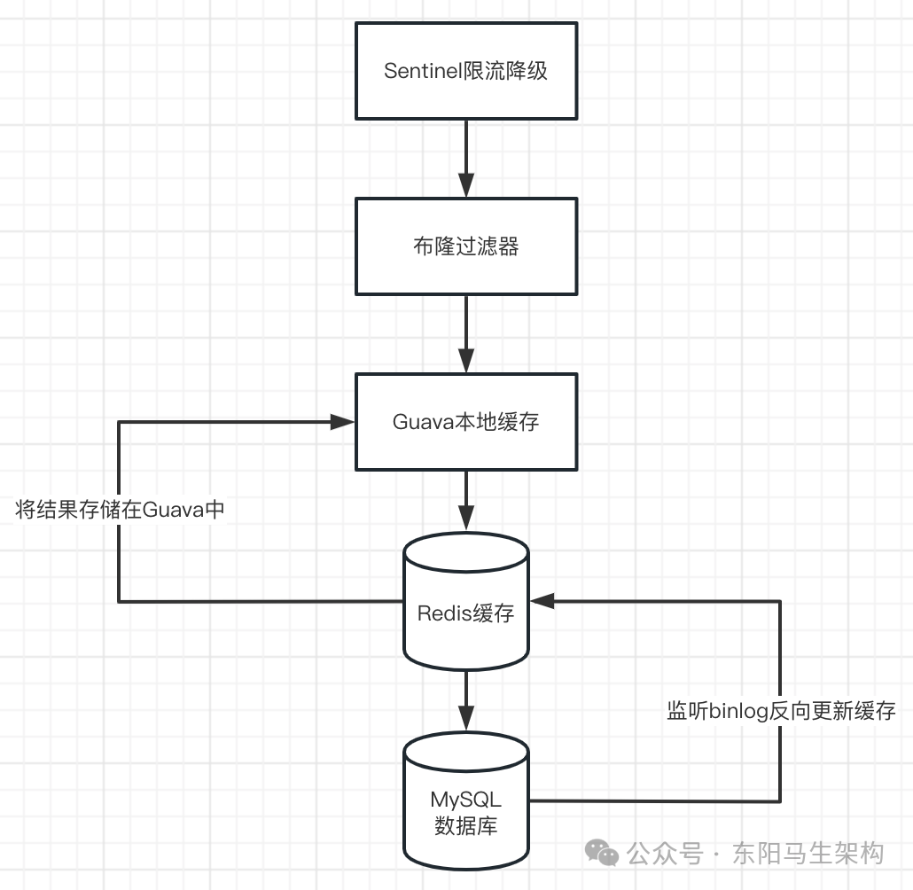

# 面试准备之项目要点总结十三

> **公众号**: 东阳马生架构  
> **发布时间**: 2025-11-19 09:00  

**大纲(14115字)**

- 1.商品C端的高并发架构
- 2.商品C端的布隆过滤器组件
- 3.Guava缓存的封装与使用
- 4.商品C端的接口设计与运行流程总结
- 5.商品C端系统对商品数据新增和变更时的处理


## 1.商品C端的高并发架构

特点一：基于两级缓存与布隆过滤器的设计

特点二：基于Sentinel的流量防护设计

特点三：基于Canal监听binlog的反向更新缓存



## 2.商品C端的布隆过滤器组件

### (1)封装布隆过滤器组件及获取初始化的布隆过滤器

### (2)Redisson布隆过滤器的初始化源码

### (3)Redisson布隆过滤器添加数据时的多Hash函数计算 + 位数组设值源码

### (4))Redisson布隆过滤器判断数据是否存在的源码

### (5)Redisson布隆过滤器处理缓存穿透问题

### (1)封装布隆过滤器组件及获取初始化的布隆过滤器

布隆过滤器使⽤之前需要设置初始值，否则在判断数据是否存在时，会误判为不存在。所以在添加数据和判断数据是否存在时，都需要传⼊设置布隆过滤器初始值的⽅法。如果布隆过滤器没有初始化，则通过调⽤设置初始值的⽅法，对布隆过滤器设置初始值。

```typescript
@Component
public class RedisBloom {
    //默认初始大小
    public static int defaultInitialSize = 50000;

    //默认错误率
    public static double defaultErrorRate = 0.01;

    //布隆过滤器的key与布隆过滤器之间的映射关系
    private final Map<String, RBloomFilter> bloomFilterMap = new ConcurrentHashMap<>();

    private RedissonClient redissonClient;

    public RedisBloom(RedissonClient redissonClient) {
        this.redissonClient = redissonClient;
    }

    //获取初始化的布隆过滤器
    //如果不存在，则创建并添加初始数据
    //@param filterKey 布隆过滤器在Redis里的key
    public RBloomFilter getBloomFilter(String filterKey, Function<String, Optional<List<String>>> getInitBloomValue, String bloomField) {
        Assert.hasLength(filterKey, "bloom filter key must not be null");
        //布隆过滤器key加锁，防止同一个布隆过滤器重复创建
        synchronized (filterKey.intern()) {
            RBloomFilter bloomFilter = bloomFilterMap.get(filterKey);
            //如果当前key的过滤器没有还未创建，则创建并初始化
            if (bloomFilter == null) {
                //创建Redisson布隆过滤器对象
                bloomFilter = redissonClient.getBloomFilter(filterKey);
                //初始化Redisson布隆过滤器
                //defaultInitialSize表示的是需要放入的数据量，根据预估的数据量defaultInitialSize来初始化二进制位数
                //defaultErrorRate表示通过布隆过滤器判断时的默认错误比率
                bloomFilter.tryInit(defaultInitialSize, defaultErrorRate);
                Optional<List<String>> optional = getInitBloomValue.apply(bloomField);
                if (optional.isPresent()) {
                    //添加初始数据
                    for (String str : optional.get()) {
                        bloomFilter.add(str);
                    }
                }
                bloomFilterMap.put(filterKey, bloomFilter);
            }
            return bloomFilter;
        }
    }

    //指定布隆过滤器添加值
    public Boolean add(String filterKey, Object value, Function<String, Optional<List<String>>> getInitBloomValue, String bloomField) {
        Assert.hasLength(filterKey, "bloom filter key must not be null");
        RBloomFilter bloomFilter = getBloomFilter(filterKey, getInitBloomValue, bloomField);
        return bloomFilter.add(value);
    }

    //判断指定布隆过滤器是否包含值
    public Boolean contains(String filterKey, Object value, Function<String, Optional<List<String>>> getInitBloomValue, String bloomField) {
        Assert.hasLength(filterKey, "bloom filter key must not be null");
        return getBloomFilter(filterKey, getInitBloomValue, bloomField).contains(value);
    }
}
```

### (2)Redisson布隆过滤器的初始化源码

RedissonClient的getBloomFilter()方法只是创建Redisson布隆过滤器对象，BloomFilter的tryInit()方法才会对布隆过滤器进行初始化。初始化时会传入预估的数据量，根据数据量计算二进制bit数组大小。初始化时还会传入根据布隆过滤器判断时的出现错误的比率。

布隆过滤器的初始化工作主要就是：

#### 一.计算二进制bit数组大小 \+ 哈希函数个数

#### 二.将布隆过滤器的配置存储到Redis

```java
public class Redisson implements RedissonClient {
    protected final EvictionScheduler evictionScheduler;
    protected final WriteBehindService writeBehindService;
    protected final ConnectionManager connectionManager;
    protected final CommandAsyncExecutor commandExecutor;
    protected final Config config;
    ...

    protected Redisson(Config config) {
        this.config = config;
        Config configCopy = new Config(config);
        connectionManager = ConfigSupport.createConnectionManager(configCopy);
        RedissonObjectBuilder objectBuilder = null;
        if (config.isReferenceEnabled()) {
            objectBuilder = new RedissonObjectBuilder(this);
        }
        commandExecutor = new CommandSyncService(connectionManager, objectBuilder);
        evictionScheduler = new EvictionScheduler(commandExecutor);
        writeBehindService = new WriteBehindService(commandExecutor);
    }

    @Override
    public <V> RBloomFilter<V> getBloomFilter(String name) {
        //创建布隆过滤器
        return new RedissonBloomFilter<V>(commandExecutor, name);
    }
    ...
}

public class RedissonBloomFilter<T> extends RedissonExpirable implements RBloomFilter<T> {
    //二进制bit数组大小
    private volatile long size;
    //哈希函数个数
    private volatile int hashIterations;
    private final CommandAsyncExecutor commandExecutor;
    private String configName;

    protected RedissonBloomFilter(CommandAsyncExecutor commandExecutor, String name) {
        super(commandExecutor, name);
        this.commandExecutor = commandExecutor;
        this.configName = suffixName(getRawName(), "config");
    }
    ...

    //初始化布隆过滤器
    @Override
    public boolean tryInit(long expectedInsertions, double falseProbability) {
        if (falseProbability > 1) {
            throw new IllegalArgumentException("Bloom filter false probability can't be greater than 1");
        }
        if (falseProbability < 0) {
            throw new IllegalArgumentException("Bloom filter false probability can't be negative");
        }

        //1.根据预估的数据量和允许出现的错误比率，计算二进制bit数组大小
        size = optimalNumOfBits(expectedInsertions, falseProbability);
        if (size == 0) {
            throw new IllegalArgumentException("Bloom filter calculated size is " + size);
        }
        if (size > getMaxSize()) {
            throw new IllegalArgumentException("Bloom filter size can't be greater than " + getMaxSize() + ". But calculated size is " + size);
        }

        //2.计算需要多少个Hash函数
        hashIterations = optimalNumOfHashFunctions(expectedInsertions, size);
        CommandBatchService executorService = new CommandBatchService(commandExecutor);
        //检查布隆过滤器的配置：二进制bit数组大小 + Hash函数个数是否改变
        executorService.evalReadAsync(
            configName,
            codec,
            RedisCommands.EVAL_VOID,
            "local size = redis.call('hget', KEYS[1], 'size');" +
            "local hashIterations = redis.call('hget', KEYS[1], 'hashIterations');" +
            "assert(size == false and hashIterations == false, 'Bloom filter config has been changed')",
            Arrays.<Object>asList(configName),
            size,
            hashIterations
        );

        //3.通过hmset往布隆过滤器写入配置数据
        executorService.writeAsync(
            configName,
            StringCodec.INSTANCE,
            new RedisCommand<Void>("HMSET", new VoidReplayConvertor()),
            configName,
            "size", size,
            "hashIterations", hashIterations,
            "expectedInsertions", expectedInsertions,
            "falseProbability", BigDecimal.valueOf(falseProbability).toPlainString()
        );

        try {
            executorService.execute();
        } catch (RedisException e) {
            if (e.getMessage() == null || !e.getMessage().contains("Bloom filter config has been changed")) {
                throw e;
            }
            readConfig();
            return false;
        }
        return true;
    }

    //根据预估的数据量和允许出现的错误比率，计算二进制bit数组大小
    private long optimalNumOfBits(long n, double p) {
        if (p == 0) {
            p = Double.MIN_VALUE;
        }
        return (long) (-n * Math.log(p) / (Math.log(2) * Math.log(2)));
    }

    private void readConfig() {
        RFuture<Map<String, String>> future = commandExecutor.readAsync(
            configName,
            StringCodec.INSTANCE,
            new RedisCommand<Map<Object, Object>>("HGETALL", new ObjectMapReplayDecoder()),
            configName
        );
        Map<String, String> config = commandExecutor.get(future);
        readConfig(config);
    }

    private void readConfig(Map<String, String> config) {
        if (config.get("hashIterations") == null || config.get("size") == null) {
            throw new IllegalStateException("Bloom filter is not initialized!");
        }
        size = Long.valueOf(config.get("size"));
        hashIterations = Integer.valueOf(config.get("hashIterations"));
    }
    ...
}
```

### (3)Redisson布隆过滤器添加数据时的多Hash函数计算 + 位数组设值源码

通过BloomFilter的add()方法可以将一个数据放入到布隆过滤器里。

步骤一：先对数据进行Hash运算获取两个Hash值

步骤二：根据哈希函数个数 + 布隆过滤器的二进制bit数组大小，经过hashIterations个Hash函数的运算，得到大小为hashIterations的long型数组

步骤三：创建一个位数组对象实例RBitSetAsync

步骤四：遍历大小为hashIterations的long型数组去设置位数组的值(将位数组的指定位置的值设置为1)

```typescript
@Component
public class RedisBloom {
    ...
    //指定布隆过滤器添加值
    public Boolean add(String filterKey, Object value, Function<String, Optional<List<String>>> getInitBloomValue, String bloomField) {
        Assert.hasLength(filterKey, "bloom filter key must not be null");
        RBloomFilter bloomFilter = getBloomFilter(filterKey, getInitBloomValue, bloomField);
        return bloomFilter.add(value);
    }
    ...
}

public class RedissonBloomFilter<T> extends RedissonExpirable implements RBloomFilter<T> {
    ...
    @Override
    public boolean add(T object) {
        //1.先对数据进行Hash运算，获取数据对应的两个Hash值
        long[] hashes = hash(object);
        while (true) {
            if (size == 0) {
                //刷新布隆过滤器的配置
                readConfig();
            }
            //哈希函数个数
            int hashIterations = this.hashIterations;
            //布隆过滤器的二进制bit数组大小
            long size = this.size;

            //2.经过hashIterations个Hash函数的运算
            //得到大小为hashIterations的long型数组indexs
            long[] indexes = hash(hashes[0], hashes[1], hashIterations, size);

            CommandBatchService executorService = new CommandBatchService(commandExecutor);
            //检查布隆过滤器的配置是否发生变化
            addConfigCheck(hashIterations, size, executorService);

            //3.创建一个位数组对象实例
            RBitSetAsync bs = createBitSet(executorService);

            //4.遍历大小为hashIterations的long型数组indexs，去设置位数组的值
            for (int i = 0; i < indexes.length; i++) {
                //也就是将位数组的指定位置的值设置为1
                bs.setAsync(indexes[i]);
            }

            try {
                List<Boolean> result = (List<Boolean>) executorService.execute().getResponses();
                for (Boolean val : result.subList(1, result.size()-1)) {
                    if (!val) {
                        return true;
                    }
                }
                return false;
            } catch (RedisException e) {
                if (e.getMessage() == null || !e.getMessage().contains("Bloom filter config has been changed")) {
                    throw e;
                }
            }
        }
    }

    //获取数据对应的Hash值
    private long[] hash(Object object) {
        //对数据进行序列化，也就是编码成Netty的ByteBuf
        ByteBuf state = encode(object);
        try {
            //将序列化后的ByteBuf数据进行Hash128运算，获取两个Hash值
            return Hash.hash128(state);
        } finally {
            state.release();
        }
    }

    //经过hashIterations个Hash函数的运算，得到大小为hashIterations的long型数组indexs
    private long[] hash(long hash1, long hash2, int iterations, long size) {
        long[] indexes = new long[iterations];
        long hash = hash1;
        for (int i = 0; i < iterations; i++) {
            //每次Hash运算的hash值都会按奇偶来递增
            indexes[i] = (hash & Long.MAX_VALUE) % size;
            if (i % 2 == 0) {
                hash += hash2;
            } else {
                hash += hash1;
            }
        }
        return indexes;
    }

    //检查布隆过滤器的配置是否发生变化
    private void addConfigCheck(int hashIterations, long size, CommandBatchService executorService) {
        executorService.evalReadAsync(
            configName,
            codec,
            RedisCommands.EVAL_VOID,
            "local size = redis.call('hget', KEYS[1], 'size');" +
            "local hashIterations = redis.call('hget', KEYS[1], 'hashIterations');" +
            "assert(size == ARGV[1] and hashIterations == ARGV[2], 'Bloom filter config has been changed')",
            Arrays.<Object>asList(configName),
            size,
            hashIterations
        );
    }

    //创建一个位数组对象
    protected RBitSetAsync createBitSet(CommandBatchService executorService) {
        return new RedissonBitSet(executorService, getRawName());
    }
    ...
}

public class RedissonBitSet extends RedissonExpirable implements RBitSet {
    public RedissonBitSet(CommandAsyncExecutor connectionManager, String name) {
        super(null, connectionManager, name);
    }

    //根据大小为hashIterations的long型数组indexs，去设置位数组的值
    //也就是将位数组的指定位置的值设置为1
    @Override
    public RFuture<Boolean> setAsync(long bitIndex) {
        return setAsync(bitIndex, true);
    }

    @Override
    public RFuture<Boolean> setAsync(long bitIndex, boolean value) {
        int val = toInt(value);
        //位数组的名字其实就是布隆过滤器的名字
        return commandExecutor.writeAsync(getRawName(), LongCodec.INSTANCE, RedisCommands.SETBIT, getRawName(), bitIndex, val);
    }

    protected int toInt(boolean value) {
        int val = 0;
        if (value) {
            val = 1;
        }
        return val;
    }
    ...
}

public final class Hash {
    private static final long[] KEY = {0x9e3779b97f4a7c15L, 0xf39cc0605cedc834L, 0x1082276bf3a27251L, 0xf86c6a11d0c18e95L};
    ...

    //获取ButeBuf数据的两个Hash值
    public static long[] hash128(ByteBuf objectState) {
        HighwayHash h = calcHash(objectState);
        return h.finalize128();
    }

    protected static HighwayHash calcHash(ByteBuf objectState) {
        HighwayHash h = new HighwayHash(KEY);
        int i;
        int length = objectState.readableBytes();
        int offset = objectState.readerIndex();
        byte[] data = new byte[32];
        for (i = 0; i + 32 <= length; i += 32) {
            objectState.getBytes(offset  + i, data);
            h.updatePacket(data, 0);
        }
        if ((length & 31) != 0) {
            data = new byte[length & 31];
            objectState.getBytes(offset  + i, data);
            h.updateRemainder(data, 0, length & 31);
        }
        return h;
    }
    ...
}

public final class HighwayHash {
    ...
    public long[] finalize128() {
        permuteAndUpdate();
        permuteAndUpdate();
        permuteAndUpdate();
        permuteAndUpdate();
        permuteAndUpdate();
        permuteAndUpdate();
        done = true;
        long[] hash = new long[2];
        hash[0] = v0[0] + mul0[0] + v1[2] + mul1[2];
        hash[1] = v0[1] + mul0[1] + v1[3] + mul1[3];
        return hash;
    }
    ...
}
```

### (4)Redisson布隆过滤器判断数据是否存在的源码

```typescript
@Component
public class RedisBloom {
    ...
    //判断指定布隆过滤器是否包含值
    public Boolean contains(String filterKey, Object value, Function<String, Optional<List<String>>> getInitBloomValue, String bloomField) {
        Assert.hasLength(filterKey, "bloom filter key must not be null");
        return getBloomFilter(filterKey, getInitBloomValue, bloomField).contains(value);
    }
    ...
}

public class RedissonBloomFilter<T> extends RedissonExpirable implements RBloomFilter<T> {
    private volatile long size;
    private volatile int hashIterations;
    ...

    @Override
    public boolean contains(T object) {
        //1.先对数据进行Hash运算，获取数据对应的两个Hash值
        long[] hashes = hash(object);
        while (true) {
            if (size == 0) {
                //刷新布隆过滤器的配置
                readConfig();
            }
            //哈希函数个数
            int hashIterations = this.hashIterations;
            //布隆过滤器的二进制bit数组大小
            long size = this.size;

            //2.经过hashIterations个Hash函数的运算
            //得到大小为hashIterations的long型数组indexs
            long[] indexes = hash(hashes[0], hashes[1], hashIterations, size);

            CommandBatchService executorService = new CommandBatchService(commandExecutor);
            //检查布隆过滤器的配置是否发生变化
            addConfigCheck(hashIterations, size, executorService);

            //3.创建一个位数组对象实例
            RBitSetAsync bs = createBitSet(executorService);

            //4.遍历大小为hashIterations的long型数组indexs，去获取位数组的值
            for (int i = 0; i < indexes.length; i++) {
                //也就是获取位数组的值是0还是1
                bs.getAsync(indexes[i]);
            }
            try {
                List<Boolean> result = (List<Boolean>) executorService.execute().getResponses();
                for (Boolean val : result.subList(1, result.size()-1)) {
                    if (!val) {
                        return false;
                    }
                }
                return true;
            } catch (RedisException e) {
                if (e.getMessage() == null || !e.getMessage().contains("Bloom filter config has been changed")) {
                    throw e;
                }
            }
        }
    }
}

public class RedissonBitSet extends RedissonExpirable implements RBitSet {
    public RedissonBitSet(CommandAsyncExecutor connectionManager, String name) {
        super(null, connectionManager, name);
    }

    @Override
    public RFuture<Boolean> getAsync(long bitIndex) {
        return commandExecutor.readAsync(getRawName(), LongCodec.INSTANCE, RedisCommands.GETBIT, getRawName(), bitIndex);
    }
    ...
}
```

### (5)Redisson布隆过滤器处理缓存穿透问题

```typescript
//商品信息变更服务
@DubboService(version = "1.0.0", interfaceClass = TableDataUpdateApi.class, retries = 0)
public class TableDataUpdateApiImpl implements TableDataUpdateApi {
    @Resource
    private FlushRedisCache flushRedisCache;
    ...

    @Override
    public void addBloomFilter(TableDataChangeDTO tableDataChangeDTO) {
        flushRedisCache.addBloomFilter(tableDataChangeDTO);
    }
    ...
}

//数据变更-刷新缓存
@Component
public class FlushRedisCache {
    //继承了AbstractRedisStringCache的缓存实例会被注入到abstractRedisStringCacheMap这个map中
    //例如CategoryBaseCache、FrontCategoryCache、ItemCollectCache、ProductDetailCache、SkuCollectCache等
    @Autowired
    private Map<String, AbstractRedisStringCache> abstractRedisStringCacheMap;
    ...

    //添加新数据至布隆过滤器
    public void addBloomFilter(TableDataChangeDTO tableDataChangeDTO) {
        for (Map.Entry<String, AbstractRedisStringCache> entry : abstractRedisStringCacheMap.entrySet()) {
            AbstractRedisStringCache redisStringCache = entry.getValue();
            if (redisStringCache.getTableName().contains(tableDataChangeDTO.getTableName())) {
                redisStringCache.addBloomFilter(tableDataChangeDTO);
            }
        }
    }
    ...
}

//Redis(string)缓存抽象类
//@param <DO> 数据对象
//@param <BO> 缓存对象
public abstract class AbstractRedisStringCache<DO, BO> {
    @Resource
    private RedisReadWriteManager redisReadWriteManager;
    ...

    //添加新数据至布隆过滤器
    public void addBloomFilter(TableDataChangeDTO tableDataChangeDTO) {
        redisReadWriteManager.addBloomFilter(
            getBloomKey(),
            tableDataChangeDTO.getKeyId(),
            getStringDatabase()::getTableSingleFiled,
            getStringDatabase().getBloomField()
        );
    }
    ...
}

//缓存读写管理
@Service
public class RedisReadWriteManager {
    @Resource
    private RedisCache redisCache;

    @Resource
    private RedisBloom redisBloom;
    ...

    //添加新数据至布隆过滤器
    public void addBloomFilter(String filterKey, Object value, Function<String, Optional<List<String>>> getInitBloomValue, String bloomField) {
        redisBloom.add(filterKey, value, getInitBloomValue, bloomField);
    }

    //获取缓存数据
    //@param useLocalCache       是否使用本地缓存
    //@param key                 关键字
    //@param bloomKey            布隆过滤器key
    //@param getInitBloomValue   布隆过滤器初始化值方法
    //@param bloomField          布隆过滤器初始化值的字段
    //@param clazz               需要将缓存JSON转换的对象
    //@param getRedisKeyFunction 获取redis key的方法
    public <T> Optional<T> getRedisStringDataByCache(Boolean useLocalCache, String key,
            String bloomKey, Function<String, Optional<List<String>>> getInitBloomValue,
            String bloomField, Class<T> clazz, Function<String, String> getRedisKeyFunction) {
        try {
            //布隆过滤器解决缓存穿透问题
            if (!redisBloom.contains(bloomKey, key, getInitBloomValue, bloomField)) {
                return Optional.empty();
            }
            String redisKey = getRedisKeyFunction.apply(key);
            String cacheString = redisCache.get(useLocalCache, redisKey);
            if (EMPTY_OBJECT_STRING.equals(cacheString)) {
                return Optional.empty();
            }
            if (StringUtils.isNotBlank(cacheString)) {
                return Optional.of(JSON.parseObject(cacheString, clazz));
            }
            return Optional.empty();
        } catch (Exception e) {
            log.error("获取缓存数据异常 key={},clazz={}", key, clazz, e);
            throw e;
        }
    }
    ...
}

@Component
public class RedisBloom {
    ...
    //指定布隆过滤器添加值
    public Boolean add(String filterKey, Object value, Function<String, Optional<List<String>>> getInitBloomValue, String bloomField) {
        Assert.hasLength(filterKey, "bloom filter key must not be null");
        RBloomFilter bloomFilter = getBloomFilter(filterKey, getInitBloomValue, bloomField);
        return bloomFilter.add(value);
    }
    ...
}
```

## 3.Guava缓存的封装与使用

```typescript
@Data
@Configuration
@ConditionalOnClass(RedisConnectionFactory.class)
public class RedisConfig {
    ...
    @Bean
    @ConditionalOnClass(RedisConnectionFactory.class)
    public RedisCache redisCache(RedisTemplate redisTemplate, Cache cache) {
        return new RedisCache(redisTemplate, cache);
    }

    @Bean
    @ConditionalOnClass(RedisConnectionFactory.class)
    public Cache cache() {
        return CacheBuilder.newBuilder()
            //设置并发级别为cpu核心数
            .concurrencyLevel(Runtime.getRuntime().availableProcessors())
            //设置初始容量
            .initialCapacity(initialCapacity)
            //设置最大存储
            .maximumSize(maximumSize)
            //写缓存后多久过期
            .expireAfterWrite(expireAfterWrite, TimeUnit.SECONDS)
            //读写缓存后多久过期
            .expireAfterAccess(expireAfterAccess, TimeUnit.SECONDS)
            .build();
    }
    ...
}

@Component
public class RedisCache {
    private RedisTemplate redisTemplate;
    private Cache cache;

    public RedisCache(RedisTemplate redisTemplate, Cache cache) {
        this.redisTemplate = redisTemplate;
        this.cache = cache;
    }
    ...

    //缓存存储并设置过期时间，这里使用了二级缓存
    public void setex(Boolean useLocalCache, String key, String value, long time) {
        if (useLocalCache) {
            cache.put(key, value);
        }
        redisTemplate.opsForValue().set(key, value, time, TimeUnit.SECONDS);
    }

    //缓存获取，需要从本地缓存获取的，先从本地缓存获取，没有则从Redis获取
    public String get(Boolean useLocalCache, String key) {
        if (useLocalCache) {
            Object value = cache.getIfPresent(key);
            if (value != null) {
                if (value instanceof String) {
                    return (String) value;
                }
                return JSON.toJSONString(value);
            }
        }
        //从Redis中获取
        String value = this.get(key);
        //如果本地缓存中没有，Redis中有，则将Redis数据存储在本地缓存中
        if (useLocalCache && !Objects.isNull(value)) {
            cache.put(key, value);
        }
        return value;
    }

    //缓存获取
    public String get(String key) {
        ValueOperations<String, String> vo = redisTemplate.opsForValue();
        return vo.get(key);
    }
    ...
}
```

## 4.商品C端的接口设计与运行流程总结

#### 一.通过Sentinel和Nacos配置接⼝的限流降级规则

#### 二.通过布隆过滤器过滤不存在的商品C端接⼝请求

#### 三.获取数据时首先会尝试获取本地缓存，如果本地缓存没有数据，那么再获取Redis缓存

四.如果Redis缓存中没有数据，则通过尝试获取锁去查数据库并设置缓存。如果获取到锁，则再从数据库中获取数据，并将获取到的数据存储在缓存中

#### 五.商品数据新增时，需要将数据添加⾄布隆过滤器

六.商品数据变更时，消费binlog消息并更新缓存。由于Canal会监听binlog，所以商品数据变更时会发出商品变更消息，然后消费商品变更消息时会去查询变更的商品，将数据更新到缓存中

下面是一段先查缓存再加锁查数据库的伪代码：

```cs
public DTO getData() {
    //先从缓存中获取数据
    dto = getFromCache();
    if (dto == null) {
        //缓存中不存在，则从DB中获取数据
        dto = getFromDB();
    }
    return dto;
}

//从缓存中获取数据
private DTO getFromCache() {
    //从内存或者缓存中获取数据
    String value = getCache(key);
    if (Objects.equals(CacheSupport.EMPTY_CACHE, value)) {
        //如果是空缓存，则是防⽌缓存穿透的，直接返回空对象
        return new DTO();
    } else if (StringUtils.hasLength(value)) {
        //如果是字符串，转换成对象之后返回
        DTO dto = JsonUtil.json2Object(value, DTO.class);
        return dto;
    }
    return null;
}

//从缓存中获取数据
private String getCache() {
    //获取本地缓存
    String value = cache.getIfPresent(key);
    if (StringUtils.hasLength(value)) {
        return value;
    }
    //本地缓存不存在，则从Redis中获取数据
    return redisCache.get(key);
}

//从数据库获取数据
public DTO getFromDB() {
    boolean lock = false;
    try {
        //获取锁
        if (!redisLock.lock(lockKey)) {
            return null;
        }
        log.info("缓存数据为空，从数据库中获取数据");
        DTO dto = getDB();
        if (Objects.isNull(dto)) {
            redisCache.setCache(key, EMPTY_CACHE, expire);
            return null;
        }
        redisCache.setCache(key, dto, expire);
        return dto;
    } finally {
        redisLock.unlock(lockKey);
    }
}
```

## 5.商品C端系统对商品数据新增和变更时的处理

### (1)消费商品数据的新增消息时写入布隆过滤器

### (2)消费商品数据的变更消息时写入两级缓存

### (3)Guava分段缓存写入+数组扩容+数据读取源码

### (4)Guava本地缓存的详细说明

### (5)商品C端系统限流+布隆过滤器+两级缓存实现

### (1)消费商品数据的新增消息时写入布隆过滤器

```typescript
//商品数据变更时的缓存处理
@Component
public class ProductUpdateListener implements MessageListenerConcurrently {
    @DubboReference(version = "1.0.0")
    private TableDataUpdateApi tableDataUpdateApi;

    @Override
    public ConsumeConcurrentlyStatus consumeMessage(List<MessageExt> list, ConsumeConcurrentlyContext consumeConcurrentlyContext) {
        try {
            for (MessageExt messageExt : list) {
                //消息处理这里，涉及到sku的缓存更新以及对应的整个商品明细的缓存更新
                String msg = new String(messageExt.getBody());
                log.info("执行商品缓存数据更新逻辑，消息内容：{}", msg);

                TableDataChangeDTO tableDataChangeMessage = JsonUtil.json2Object(msg, TableDataChangeDTO.class);
                if (BinlogType.INSERT.getValue().equals(JSON.parseObject(msg).get("action"))) {
                    //新增，需要将数据添加至布隆过滤器
                    tableDataUpdateApi.addBloomFilter(tableDataChangeMessage);
                }

                //更新sku对应的商品缓存信息
                tableDataUpdateApi.tableDataChange(tableDataChangeMessage);
                //发送回调消息通知，即发送消息编号到MQ
                tableDataUpdateApi.sendCallbackMessage(tableDataChangeMessage);
            }
        } catch (Exception e) {
            log.error("consume error, 商品缓存更新失败", e);
            //本次消费失败，下次重新消费
            return ConsumeConcurrentlyStatus.RECONSUME_LATER;
        }
        return ConsumeConcurrentlyStatus.CONSUME_SUCCESS;
    }
}

//商品信息变更服务
@DubboService(version = "1.0.0", interfaceClass = TableDataUpdateApi.class, retries = 0)
public class TableDataUpdateApiImpl implements TableDataUpdateApi {
    @Resource
    private FlushRedisCache flushRedisCache;
    ...

    @Override
    public void addBloomFilter(TableDataChangeDTO tableDataChangeDTO) {
        flushRedisCache.addBloomFilter(tableDataChangeDTO);
    }
    ...
}

//数据变更-刷新缓存
@Component
public class FlushRedisCache {
    //继承了AbstractRedisStringCache的缓存实例会被注入到abstractRedisStringCacheMap这个map中
    //例如CategoryBaseCache、FrontCategoryCache、ItemCollectCache、ProductDetailCache、SkuCollectCache等
    @Autowired
    private Map<String, AbstractRedisStringCache> abstractRedisStringCacheMap;
    ...

    //添加新数据至布隆过滤器
    public void addBloomFilter(TableDataChangeDTO tableDataChangeDTO) {
        for (Map.Entry<String, AbstractRedisStringCache> entry : abstractRedisStringCacheMap.entrySet()) {
            AbstractRedisStringCache redisStringCache = entry.getValue();
            if (redisStringCache.getTableName().contains(tableDataChangeDTO.getTableName())) {
                redisStringCache.addBloomFilter(tableDataChangeDTO);
            }
        }
    }
    ...
}

//Redis(string)缓存抽象类
//@param <DO> 数据对象
//@param <BO> 缓存对象
public abstract class AbstractRedisStringCache<DO, BO> {
    @Resource
    private RedisReadWriteManager redisReadWriteManager;
    ...

    //添加新数据至布隆过滤器
    public void addBloomFilter(TableDataChangeDTO tableDataChangeDTO) {
        redisReadWriteManager.addBloomFilter(getBloomKey(), tableDataChangeDTO.getKeyId(),
            getStringDatabase()::getTableSingleFiled, getStringDatabase().getBloomField());
    }
    ...
}

//缓存读写管理
@Service
public class RedisReadWriteManager {
    @Resource
    private RedisCache redisCache;

    @Resource
    private RedisBloom redisBloom;
    ...

    //添加新数据至布隆过滤器
    public void addBloomFilter(String filterKey, Object value, Function<String, Optional<List<String>>> getInitBloomValue, String bloomField) {
        redisBloom.add(filterKey, value, getInitBloomValue, bloomField);
    }
    ...
}

@Component
public class RedisBloom {
    ...
    //指定布隆过滤器添加值
    public Boolean add(String filterKey, Object value, Function<String, Optional<List<String>>> getInitBloomValue, String bloomField) {
        Assert.hasLength(filterKey, "bloom filter key must not be null");
        RBloomFilter bloomFilter = getBloomFilter(filterKey, getInitBloomValue, bloomField);
        return bloomFilter.add(value);
    }
    ...
}
```

### (2)消费商品数据的变更消息时写入两级缓存

首先消费商品数据的变更消息时，会通过线程池进行异步更新缓存的处理。先查DB，再删缓存，最后再写缓存。写缓存时会先写Guava本地缓存，然后再写Redis缓存。

```typescript
//商品信息变更服务
@DubboService(version = "1.0.0", interfaceClass = TableDataUpdateApi.class, retries = 0)
public class TableDataUpdateApiImpl implements TableDataUpdateApi {
    @Resource
    private FlushRedisCache flushRedisCache;
    private ExecutorService executorService = Executors.newFixedThreadPool(10);
    ...

    //商品表数据变更逆向更新缓存
    @Override
    public JsonResult tableDataChange(TableDataChangeDTO tableDataChangeDTO) {
        //通过线程池异步来更新缓存
        executorService.execute(() -> {
            try {
                //刷新缓存数据
                flushRedisCache.flushRedisStringData(false, tableDataChangeDTO.getTableName(), Sets.newHashSet(tableDataChangeDTO.getKeyId()));
            } catch (Exception e) {
                log.error("刷新string类型缓存异常，入参为tableDataChangeDTO={}", tableDataChangeDTO, e);
            }
            try {
                flushRedisCache.flushRedisSetData(false, tableDataChangeDTO.getTableName(), Sets.newHashSet(tableDataChangeDTO.getKeyId()));
            } catch (Exception e) {
                log.error("刷新set类型缓存异常，入参为tableDataChangeDTO={}", tableDataChangeDTO, e);
            }
            try {
                flushRedisCache.flushRedisSortedSetData(false, tableDataChangeDTO.getTableName(), Sets.newHashSet(tableDataChangeDTO.getKeyId()));
            } catch (Exception e) {
                log.error("刷新sortedset类型缓存异常，入参为tableDataChangeDTO={}", tableDataChangeDTO, e);
            }
        });
        return JsonResult.buildSuccess();
    }
    ...
}

@Component
public class FlushRedisCache {
    //继承了AbstractRedisStringCache的缓存实例会被注入到abstractRedisStringCacheMap这个map中
    //例如CategoryBaseCache、FrontCategoryCache、ItemCollectCache、ProductDetailCache、SkuCollectCache等
    @Autowired
    private Map<String, AbstractRedisStringCache> abstractRedisStringCacheMap;
    ...

    //更新string类型缓存
    public void flushRedisStringData(boolean flushAll, String tableName, Set<Long> idSet) {
        for (Map.Entry<String, AbstractRedisStringCache> entry : abstractRedisStringCacheMap.entrySet()) {
            AbstractRedisStringCache stringCache = entry.getValue();
            if (flushAll) {
                stringCache.flushRedisStringDataByTableUpdateData();
                continue;
            }
            //继承AbstractRedisStringCache的每个缓存实例都指定来表名，如下用于匹配出对应的缓存实例
            if (stringCache.getTableName().contains(tableName)) {
                stringCache.flushRedisStringDataByTableAndIdSet(tableName, idSet);
            }
        }
    }
    ...
}

//Redis(string)缓存抽象类
public abstract class AbstractRedisStringCache<DO, BO> {
    @Resource
    private RedisReadWriteManager redisReadWriteManager;
    ...

    //刷新缓存—根据主表ID集合（关联表变更需要查询主表）
    public void flushRedisStringDataByTableAndIdSet(String tableName, Set<Long> idSet) {
        Optional<Set<Long>> idSetOpt = getStringDatabase().getTableIdSetByRelationTableIdSet(tableName, idSet);
        if (!idSetOpt.isPresent()) {
            return;
        }
        flushRedisStringDataByIdSet(idSetOpt.get());
    }

    //刷新缓存—根据主键ID集合
    private void flushRedisStringDataByIdSet(Set<Long> idSet) {
        //根据id集合从数据库中查询出数据
        Optional<RedisStringCache<DO>> stringSourceOpt = getStringDatabase().listTableDataByIdSet(idSet, queryType());
        if (!stringSourceOpt.isPresent()) {
            return;
        }
        RedisStringCache<DO> redisStringCache = stringSourceOpt.get();
        if (!CollectionUtils.isEmpty(redisStringCache.getDeleteSet())) {
            //通过缓存读写组件删除缓存
            redisReadWriteManager.delete(redisStringCache.getDeleteSet().stream().map(this::getRedisKey).collect(toSet()).toArray(new String[]{}));
        }
        if (CollectionUtils.isEmpty(redisStringCache.getAddList())) {
            return;
        }
        List<BO> boList = convertDO2BO(redisStringCache.getAddList());
        Map<String, BO> redisMap = convertBO2Map(boList);
        //通过缓存读写组件写入缓存
        redisReadWriteManager.batchWriteRedisString(redisMap);
    }
    ...
}

//缓存读写管理
@Service
public class RedisReadWriteManager {
    @Resource
    private RedisCache redisCache;
    ...

    //删除指定的key
    public void delete(String... keys) {
        Arrays.asList(keys).stream().forEach(key -> redisCache.delete(key));
    }

    //批量添加string缓存
    public <T> void batchWriteRedisString(Map<String, T> redisMap) {
        List<Map.Entry<String, T>> list = Lists.newArrayList(redisMap.entrySet());
        try {
            for (List<Map.Entry<String, T>> entries : Lists.partition(list, PAGE_SIZE_100)) {
                for (Map.Entry<String, T> entry : entries) {
                    redisCache.setex(true, entry.getKey(), JSON.toJSONString(entry.getValue()), RedisKeyUtils.redisKeyRandomTime(INT_EXPIRED_SEVEN_DAYS));
                }
                try {
                    Thread.sleep(SLEEP_100);
                } catch (InterruptedException e) {
                    e.printStackTrace();
                }
            }
        } catch (Exception e) {
            log.error("批量添加string缓存异常 redisMap={}", redisMap, e);
        }
    }
    ...
}

@Component
public class RedisCache {
    private RedisTemplate redisTemplate;
    private Cache cache;

    public RedisCache(RedisTemplate redisTemplate, Cache cache) {
        this.redisTemplate = redisTemplate;
        this.cache = cache;
    }
    ...

    //缓存存储并设置过期时间，这里使用了二级缓存
    public void setex(Boolean useLocalCache, String key, String value, long time) {
        if (useLocalCache) {
            //先写Guava本地缓存
            cache.put(key, value);
        }
        //再写Redis缓存
        redisTemplate.opsForValue().set(key, value, time, TimeUnit.SECONDS);
    }
    ...
}
```

### (3)Guava分段缓存写入+数组扩容+数据读取源码

Guava本地缓存采用了分段缓存，也就是会将缓存分成很多的Segment段。Guava本地缓存中存储的每条数据都会路由到一个Segment分段里。也就是先根据数据key获取Hash值，再根据Hash值路由到某Segement里。一个Segment本质上就是一个Object数组，即AtomicReferenceArray。其中该数组的threshold=0.75，达到阈值后就会触发Segment段扩容。

```kotlin
@GwtCompatible(emulated = true)
class LocalCache<K, V> extends AbstractMap<K, V> implements ConcurrentMap<K, V> {
    final Segment<K, V>[] segments;
    ...

    static class LocalManualCache<K, V> implements Cache<K, V>, Serializable {
        final LocalCache<K, V> localCache;
        ...

        //将数据写入缓存
        @Override
        public void put(K key, V value) {
            localCache.put(key, value);
        }

        //从缓存中读取数据
        public V getIfPresent(Object key) {
            return localCache.getIfPresent(key);
        }
        ...
    }
    ...

    @Override
    public V put(K key, V value) {
        checkNotNull(key);
        checkNotNull(value);
        int hash = hash(key);
        //往Segment中写入数据
        return segmentFor(hash).put(key, hash, value, false);
    }

    int hash(@Nullable Object key) {
        int h = keyEquivalence.hash(key);
        return rehash(h);
    }

    public V getIfPresent(Object key) {
        int hash = hash(checkNotNull(key));
        //从Segment中读取数据
        V value = segmentFor(hash).get(key, hash);
        if (value == null) {
            globalStatsCounter.recordMisses(1);
        } else {
            globalStatsCounter.recordHits(1);
        }
        return value;
    }
    ...

    static class Segment<K, V> extends ReentrantLock {
        @Weak final LocalCache<K, V> map;
        //The number of live elements in this segment's region.
        volatile int count;
        //The table is expanded when its size exceeds this threshold. (The value of this field is always {@code (int) (capacity * 0.75)}.)
        int threshold;
        //The per-segment table.
        volatile AtomicReferenceArray<ReferenceEntry<K, V>> table;
        //The key reference queue contains entries whose keys have been garbage collected, and which need to be cleaned up internally.
        final ReferenceQueue<K> keyReferenceQueue;
        //he value reference queue contains value references whose values have been garbage collected, and which need to be cleaned up internally.
        final ReferenceQueue<V> valueReferenceQueue;
        //The recency queue is used to record which entries were accessed for updating the access list's ordering.
        //It is drained as a batch operation when either the DRAIN_THRESHOLD is crossed or a write occurs on the segment.
        final Queue<ReferenceEntry<K, V>> recencyQueue;
        //A queue of elements currently in the map, ordered by write time. Elements are added to the tail of the queue on write.
        final Queue<ReferenceEntry<K, V>> writeQueue;
        //A queue of elements currently in the map, ordered by access time. Elements are added to the tail of the queue on access (note that writes count as accesses).
        final Queue<ReferenceEntry<K, V>> accessQueue;
        ...

        //往Segement中写入数据
        V put(K key, int hash, V value, boolean onlyIfAbsent) {
            lock();//先加锁
            try {
                long now = map.ticker.read();
                preWriteCleanup(now);
                int newCount = this.count + 1;
                if (newCount > this.threshold) {//ensure capacity
                    expand();//扩容
                    newCount = this.count + 1;
                }
                AtomicReferenceArray<ReferenceEntry<K, V>> table = this.table;
                //计算hash值与table大小的位运算，得出当前数据要插入Segment的table数组的那个位置
                int index = hash & (table.length() - 1);
                //通过链地址法解决哈希冲突
                ReferenceEntry<K, V> first = table.get(index);

                //Look for an existing entry.
                for (ReferenceEntry<K, V> e = first; e != null; e = e.getNext()) {
                    K entryKey = e.getKey();
                    if (e.getHash() == hash && entryKey != null && map.keyEquivalence.equivalent(key, entryKey)) {
                        //We found an existing entry.
                        ValueReference<K, V> valueReference = e.getValueReference();
                        V entryValue = valueReference.get();
                        if (entryValue == null) {
                            ++modCount;
                            if (valueReference.isActive()) {
                                enqueueNotification(key, hash, entryValue, valueReference.getWeight(), RemovalCause.COLLECTED);
                                setValue(e, key, value, now);
                                newCount = this.count;//count remains unchanged
                            } else {
                                setValue(e, key, value, now);
                                newCount = this.count + 1;
                            }
                            this.count = newCount;//write-volatile
                            evictEntries(e);
                            return null;
                        } else if (onlyIfAbsent) {
                            recordLockedRead(e, now);
                            return entryValue;
                        } else {
                            //clobber existing entry, count remains unchanged
                            ++modCount;
                            enqueueNotification(key, hash, entryValue, valueReference.getWeight(), RemovalCause.REPLACED);
                            setValue(e, key, value, now);
                            evictEntries(e);
                            return entryValue;
                        }
                    }
                }
                //Create a new entry.
                ++modCount;
                ReferenceEntry<K, V> newEntry = newEntry(key, hash, first);
                setValue(newEntry, key, value, now);
                table.set(index, newEntry);
                newCount = this.count + 1;
                this.count = newCount;//write-volatile
                evictEntries(newEntry);
                return null;
            } finally {
                unlock();
                postWriteCleanup();
            }
        }
        ...

        //对Segement数组进行扩容
        void expand() {
            AtomicReferenceArray<ReferenceEntry<K, V>> oldTable = table;
            int oldCapacity = oldTable.length();
            if (oldCapacity >= MAXIMUM_CAPACITY) {
                return;
            }

            int newCount = count;
            AtomicReferenceArray<ReferenceEntry<K, V>> newTable = newEntryArray(oldCapacity << 1);
            threshold = newTable.length() * 3 / 4;
            int newMask = newTable.length() - 1;
            for (int oldIndex = 0; oldIndex < oldCapacity; ++oldIndex) {
                ReferenceEntry<K, V> head = oldTable.get(oldIndex);
                if (head != null) {
                    ReferenceEntry<K, V> next = head.getNext();
                    int headIndex = head.getHash() & newMask;
                    if (next == null) {
                        newTable.set(headIndex, head);
                    } else {
                        ReferenceEntry<K, V> tail = head;
                        int tailIndex = headIndex;
                        for (ReferenceEntry<K, V> e = next; e != null; e = e.getNext()) {
                            int newIndex = e.getHash() & newMask;
                            if (newIndex != tailIndex) {
                                tailIndex = newIndex;
                                tail = e;
                            }
                        }
                        newTable.set(tailIndex, tail);
                        for (ReferenceEntry<K, V> e = head; e != tail; e = e.getNext()) {
                            int newIndex = e.getHash() & newMask;
                            ReferenceEntry<K, V> newNext = newTable.get(newIndex);
                            ReferenceEntry<K, V> newFirst = copyEntry(e, newNext);
                            if (newFirst != null) {
                                newTable.set(newIndex, newFirst);
                            } else {
                                removeCollectedEntry(e);
                                newCount--;
                            }
                        }
                    }
                }
            }
            table = newTable;
            this.count = newCount;
        }

        //从Segment中读取数据
        V get(Object key, int hash) {
            try {
                if (count != 0) {//read-volatile
                    long now = map.ticker.read();
                    ReferenceEntry<K, V> e = getLiveEntry(key, hash, now);
                    if (e == null) {
                        return null;
                    }
                    V value = e.getValueReference().get();
                    if (value != null) {
                        recordRead(e, now);
                        return scheduleRefresh(e, e.getKey(), hash, value, now, map.defaultLoader);
                    }
                    tryDrainReferenceQueues();
                }
                return null;
            } finally {
                postReadCleanup();
            }
        }

        ReferenceEntry<K, V> getLiveEntry(Object key, int hash, long now) {
            ReferenceEntry<K, V> e = getEntry(key, hash);
            if (e == null) {
                return null;
            } else if (map.isExpired(e, now)) {
                tryExpireEntries(now);
                return null;
            }
            return e;
        }

        ReferenceEntry<K, V> getEntry(Object key, int hash) {
            for (ReferenceEntry<K, V> e = getFirst(hash); e != null; e = e.getNext()) {
                if (e.getHash() != hash) {
                    continue;
                }
                K entryKey = e.getKey();
                if (entryKey == null) {
                    tryDrainReferenceQueues();
                    continue;
                }
                if (map.keyEquivalence.equivalent(key, entryKey)) {
                    return e;
                }
            }
            return null;
        }

        ReferenceEntry<K, V> getFirst(int hash) {
            //read this volatile field only once
            AtomicReferenceArray<ReferenceEntry<K, V>> table = this.table;
            return table.get(hash & (table.length() - 1));
        }
        ...
    }
    ...
}
```

### (4)Guava本地缓存的详细说明

#### 一.Guava Cache具有如下功能

功能一：自动将Entry节点加载进缓存中

功能二：当缓存的数据超过设置的最大值时，使用LRU算法进行缓存清理

功能三：能够根据Entry节点上次被访问或者写入时间计算它的过期机制

功能四：缓存的key封装在WeakReference引用内

功能五：缓存的value封装在WeakReference引用或者SoftReference引用内

功能六：能够统计在使用缓存的过程中命中率、异常率、未命中率等数据

#### 二.Guava Cache的主要设计思想

Guava Cache基于ConcurrentHashMap的设计思想。其内部大量使用了Segments细粒度锁，既保证线程安全，又提升了并发。

Guava Cache使用Reference引用，保证了GC可回收，有效节省了空间。

Guava Cache分别针对write操作和access操作去设计队列。这样的队列设计能更加灵活高效地实现多种数据类型的缓存清理策略，这些清理策略可以基于容量、可以基于时间、可以基于引用等来实现。

#### 三.Cuava Cache的优势

优势一：拥有缓存过期和淘汰机制

采用LRU将不常使用的键值从Cache中删除，淘汰策略还可以基于容量、时间、引用来实现。

优势二：拥有并发处理能力

GuavaCache类似CurrentHashMap，是线程安全的。它提供了设置并发级别的API，使得缓存支持并发的写入和读取。分段锁是分段锁定，把一个集合看分成若干Partition，每个Partiton一把锁。ConcurrentHashMap就是分了16个区域，这16个区域之间是可以并发的，GuavaCache采用Segment做分区。

优势三：缓存统计

可以统计缓存的加载、命中情况。

优势四：更新锁定

一般情况下，在缓存中查询某个key，如果不存在则查源数据，并回填缓存。高并发下可能会出现多次查源并回填缓存，造成数据源宕机或性能下降。GuavaCache可以在CacheLoader的load()方法中加以控制，也就是控制：对同一个key，只让一个请求去读源并回填缓存，其他请求则阻塞等待。

#### 四.Cuava Cache核心原理

Guava Cache的数据结构和CurrentHashMap相似。核心区别是ConcurrentMap会一直保存所有添加的元素，直到显式地移除。而Guava Cache为了限制内存占用，通常都设定为自动回收元素。

核心一：LocalCache为Guava Cache的核心类，有一个Segment数组。与ConcurrentHashMap类似，Guava Cache的并发也是通过分段锁实现。LoadingCache将映射表分为多个Segment，Segment元素间可并发访问。这样可以大大提高并发的效率，降低了并发冲突的可能性。

核心二：Segement数组的长度决定了Cache的并发数。GuavaCache通过设置concurrencyLevel使得缓存支持并发的写入和读取，Segment数组的长度=concurrencyLevel。

核心三：每一个Segment使用了单独的锁。每个Segment都继承ReentrantLock，对Segment的写操作需要先拿到锁。每个Segment由一个table和5个队列组成。

核心四：Segment有5个队列

```swift
队列一：ReferenceQueue<K> keyReferenceQueue，键引用队列
已经被GC，需要内部清理的键引用队列；

队列二：ReferenceQueue<V> valueReferenceQueue，值引用队列
已经被GC，需要内部清理的值引用队列；

队列三：Queue<ReferenceEntry<K, V>> recencyQueue，LRU队列
当segment达到临界值发生写操作时该队列会移除数据；

队列四：Queue<ReferenceEntry<K, V>> writeQueue，写队列
按写入时间进行排序的元素队列，写入一个元素时会把它加入到队列尾部；

队列五：Queue<ReferenceEntry<K, V>> accessQueue，访问队列
按访问时间进行排序的元素队列，访问一个元素时会把它加入到队列尾部；
```

核心五：Segment的一个table

```swift
AtomicReferenceArray<ReferenceEntry<K, V>> table;
```

‍AtomicReferenceArray可以用原子方式更新其元素的对象引用数组，ReferenceEntry是Guava Cache中对一个键值对节点的抽象。每个ReferenceEntry数组项都是一条ReferenceEntry链，且一个ReferenceEntry包含key、valueReference、hash、next字段(单链)。Guava Cache使用ReferenceEntry接口来封装一个键值对，使用ValueReference来封装Value值。

核心六：GuavaCache的回收机制

回收机制一：基于容量回收

在缓存项的数目达到限定值前，采用LRU回收方式。

回收机制二：定时回收

expireAfterAccess：缓存项在给定时间内没有被读写访问，则回收。回收顺序和基于大小回收一 样(LRU)。

回收机制三：基于引用回收

通过使用弱引用的键、或弱引用的值、或软引用的值，在GC时回收。GuavaCache构建的缓存不会"自动"执行清理和回收工作，也不会在某个缓存项过期后马上清理，也没有诸如此类的清理机制。GuavaCache是在每次进行缓存操作时进行惰性删除：如get()或者put()的时候，判断缓存是否过期。

#### 五.Guava Cache的几个问题

问题一：Guava Cache会OOM吗

会，当设置缓存永不过期或者很长，缓存的对象不限个数或者很大时，不断向GuavaCache加入大字符串，最终就会OOM。解决方案：缓存时间设置相对小些，使用弱引用方式存储对象。

问题二：Guava Cache缓存到期就会立即清除吗

不会，Guava Cache在每次进行缓存操作时，会判断缓存是否过期。如果一个对象放入缓存后，不再有任何缓存操作，则该缓存不会主动过期。

问题三：Guava Cache如何找出最久未使用数据

accessQueue是按照LRU的顺序存放缓存对象(ReferenceEntry)的，accessQueue会把访问过的对象放到队列的最后。accessQueue可以很方便更新和删除链表中的节点，因为每次访问时都可能需要更新该链表，放入到链表的尾部。这样每次从access中拿出的头节点就是最久未使用的数据，writeQueue会用来保存最久未更新的缓存队列，和accessQueue一样。

### (5)商品C端系统限流 + 布隆过滤器 + 两级缓存实现

下面以商品详情页接口为例，展示限流 + 布隆过滤器 + 两级缓存的实现：

```kotlin
@DubboService(version = "1.0.0", interfaceClass = ProductCollectApi.class, retries = 0)
public class ProductCollectApiImpl implements ProductCollectApi {
    //商品详情数据表缓存组件实例
    @Resource
    private ProductDetailCache productDetailCache;
    ...

    //根据skuId获取商品详情
    //使用@SentinelResource实现Sentinel限流
    @SentinelResource(value = "getProductDetail", fallback = "getProductDetailWithFallback")
    @Override
    public JsonResult<ProductDetailDTO> getProductDetail(ProductDetailQuery productDetailQuery) {
        if (Objects.isNull(productDetailQuery) || Objects.isNull(productDetailQuery.getSkuId())) {
            return JsonResult.buildError(ProductErrorCodeEnum.PARAM_ERROR.getErrorCode(), ProductErrorCodeEnum.PARAM_ERROR.getErrorMsg());
        }
        List<String> productIdList = Arrays.asList(productDetailQuery.getSkuId());
        Optional<List<ProductDetailBO>> optional = productDetailCache.listRedisStringData(true, productIdList);
        if (optional.isPresent()) {
            List<ProductDetailBO> productDetailBOS = optional.get();
            ProductDetailDTO productDetailDTO = productDetailConverter.converterDetail(productDetailBOS.get(0));
            return JsonResult.buildSuccess(productDetailDTO);
        }
        return JsonResult.buildSuccess();
    }
    ...
}

//Redis(string)缓存抽象类
//@param <DO> 数据对象
//@param <BO> 缓存对象
public abstract class AbstractRedisStringCache<DO, BO> {
    @Resource
    private RedisReadWriteManager redisReadWriteManager;
    ...

    //根据关键字批量获取数据
    //@param useLocalCache 是否使用本地缓存
    //@param keyList       入参关键字
    public Optional<List<BO>> listRedisStringData(Boolean useLocalCache, List<String> keyList) {
        if (CollectionUtils.isEmpty(keyList)) {
            return Optional.empty();
        }
        Optional<List<BO>> boListOpt = redisReadWriteManager.listRedisStringDataByCache(useLocalCache, keyList,
            getBloomKey(), getStringDatabase()::getTableSingleFiled, getStringDatabase().getBloomField(),
            getBOClass(), this::getRedisKey, (key) -> {
                Map<String, Object> tableFieldsMap = getTableFieldsMap(key);
                Optional<DO> doOpt;
                try {
                    doOpt = getStringDatabase().getTableData(tableFieldsMap, queryType());
                } catch (Exception e) {
                    log.error("根据关键字批量获取数据异常 key={},paramMap={}", key, tableFieldsMap, e);
                    return Optional.empty();
                }
                if (!doOpt.isPresent()) {
                    return Optional.empty();
                }
                List<BO> boList = convertDO2BO(Arrays.asList(doOpt.get()));
                if (CollectionUtils.isEmpty(boList)) {
                    return Optional.empty();
                }
                return Optional.of(boList.get(0));
            }
        );
        return boListOpt;
    }
    ...
}

//缓存读写管理
@Service
public class RedisReadWriteManager {
    ...
    //批量获取缓存数据
    //@param keyList             关键字列表
    //@param clazz               需要将缓存JSON转换的对象
    //@param getRedisKeyFunction 获取redis key的方法
    //@param getDbFunction       获取数据源对象的方法
    public <T> Optional<List<T>> listRedisStringDataByCache(Boolean useLocalCache, Collection<String> keyList,
            String bloomKey, Function<String, Optional<List<String>>> getInitBloomValue, String bloomField,
            Class<T> clazz, Function<String, String> getRedisKeyFunction, Function<String, Optional<T>> getDbFunction) {
        try {
            List<T> list = Lists.newArrayList();
            List<String> pendingKeyList;
            //首先过滤掉布隆过滤器中不存在的数据和重复的数据，布隆过滤器防止缓存穿透
            Stream<String> distinct = keyList.stream().distinct();
            if (StringUtils.isNotBlank(bloomKey)) {
                pendingKeyList = distinct.filter(key -> redisBloom.contains(bloomKey, key, getInitBloomValue, bloomField)).collect(toList());
            } else {
                pendingKeyList = distinct.collect(toList());
            }

            List<String> redisKeyList = pendingKeyList.stream().map(getRedisKeyFunction).distinct().collect(toList());
            List<String> cacheList = redisCache.mget(useLocalCache, redisKeyList);
            for (int i = 0; i < cacheList.size(); i++) {
                String cache = cacheList.get(i);
                //过滤无效缓存
                if (EMPTY_OBJECT_STRING.equals(cache)) {
                    continue;
                }
                if (StringUtils.isNotBlank(cache)) {
                    T t = JSON.parseObject(cache, clazz);
                    list.add(t);
                    continue;
                }
                //缓存没有则读库
                Optional<T> optional = getRedisStringDataByDb(useLocalCache, pendingKeyList.get(i), getRedisKeyFunction, getDbFunction);
                if (optional.isPresent()) {
                    list.add(optional.get());
                }
            }
            return CollectionUtils.isEmpty(list) ? Optional.empty() : Optional.of(list);
        } catch (Exception e) {
            log.error("批量获取缓存数据异常 keyList={},clazz={}", keyList, clazz, e);
            throw e;
        }
    }

    //读取数据库表数据赋值到Redis
    public <T> Optional<T> getRedisStringDataByDb(Boolean useLocalCache, String key, Function<String, String> getRedisKeyFunction, Function<String, Optional<T>> getDbFuction) {
        if (StringUtils.isEmpty(key) || Objects.isNull(getDbFuction)) {
            return Optional.empty();
        }
        //获取分布式锁，为了保证DB和缓存一致性以及防止缓存击穿，查库+写缓存需要加上分布式锁
        if (!redisLock.lock(key)) {
            return Optional.empty();
        }
        try {
            String redisKey = getRedisKeyFunction.apply(key);
            //读取数据库中的数据
            Optional<T> optional = getDbFuction.apply(key);
            if (!optional.isPresent()) {
                //把空对象暂存到Redis
                redisCache.setex(useLocalCache, redisKey, EMPTY_OBJECT_STRING, RedisKeyUtils.redisKeyRandomTime(INT_EXPIRED_ONE_DAY, TimeUnit.HOURS, NUMBER_24));
                log.warn("发生缓存穿透 redisKey={}", redisKey);
                return optional;
            }
            //把表数据对象存到Redis
            redisCache.setex(useLocalCache, redisKey, JSON.toJSONString(optional.get()), RedisKeyUtils.redisKeyRandomTime(INT_EXPIRED_SEVEN_DAYS));
            log.info("表数据对象存到redis redisKey={}, data={}", redisKey, optional.get());
            return optional;
        } finally {
            redisLock.unlock(key);
        }
    }
    ...
}

@Component
public class RedisCache {
    private RedisTemplate redisTemplate;
    private Cache cache;

    public RedisCache(RedisTemplate redisTemplate, Cache cache) {
        this.redisTemplate = redisTemplate;
        this.cache = cache;
    }
    ...

    //缓存存储并设置过期时间，这里使用了二级缓存
    public void setex(Boolean useLocalCache, String key, String value, long time) {
        if (useLocalCache) {
            //先写Guava本地缓存
            cache.put(key, value);
        }
        //再写Redis缓存
        redisTemplate.opsForValue().set(key, value, time, TimeUnit.SECONDS);
    }
}
```
